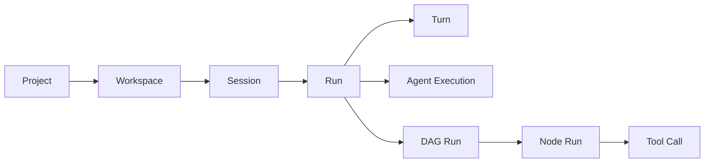

# Apex 项目术语与缩写表

## 1. 文档用途

本文解释 Apex 文档、协议、界面和执行计划中使用的名词与缩写，供产品、架构、开发、测试和评审人员统一理解。英文名是代码、事件、协议和文件中的推荐名称，中文名用于说明语义。

本文是阅读辅助材料，不是第二份规范事实源。若释义与其他文档的状态、字段或行为定义冲突，按[文档总册](README.md)规定的权威层级处理；领域 ID、状态和事件以[领域模型](04-domain-model.md)为准，接口与 Wire 结构以[契约文档](05-trait-contracts.md)和[协议文档](06-protocol-and-clients.md)为准。

## 2. 编号与项目管理术语

| 缩写/写法 | 英文全称 | 项目内含义 | 示例 |
|---|---|---|---|
| `RQ` | Requirement | 已确认的产品需求编号，描述系统必须具备的能力或约束。需求事实源位于 `01-requirements.md`。 | `RQ-001` |
| `AC` | Acceptance Criteria | 产品级验收标准，描述在什么前提下执行什么场景，以及必须观察到什么结果。一个 AC 可覆盖多个 RQ。 | `AC-001` |
| `EP` | Execution Plan Task | 原子化执行任务。每项任务有明确依赖、需求引用、单一交付物和独立验证项。 | `EP-0501` |
| `VAL` | Validation | 执行计划中的独立验证项，用于验证一个 EP 的交付物或一组紧密相关的不变量。 | `VAL-72` |
| `G` | Gate | 阶段完成门。只有对应验证证据全部满足，后续阶段或发布动作才可继续。 | `G-4` |
| `ADR` | Architecture Decision Record | 架构决策记录，说明候选方案、最终选择、代价和触发重审的条件。ADR 解释“为什么”，不改写需求事实。 | `ADR-008` |
| `RISK` | Risk | 风险登记编号，关联触发信号、预防措施和应急预案。 | `RISK-002` |
| `NFR` | Non-Functional Requirement | 非功能需求，如性能、可靠性、安全性、兼容性和可维护性约束。 | daemon 空闲 RSS P95 |
| `S0`–`S11` | Stage | 原子化执行计划的实施阶段；阶段顺序表达主依赖关系，不代表所有任务都必须串行。 | `S5`：权限、Tool 与终端 |
| `M1`–`M7` | Milestone | 路线图中的内部里程碑，用于表达一组能力达到可评审状态。 | `M4 Agent Core` |
| `T-xx` | Roadmap Task | 路线图中的阶段级工作包，比 EP 粗，不作为原子开发任务。 | `T-12` |
| `RC` | Release Candidate | 发布候选版本：已经通过既定质量门、可用于最终发布评审的制品集合。Apex 文档中的 `RC` 不表示 Request Context。 | `M7 Release Candidate` |
| `P0` / `P1` | Priority 0 / 1 | 缺陷或风险严重级别。P0 为阻断发布的最高优先级问题，P1 为必须在发布前解决的高优先级问题。 | `G-8` 要求无 P0/P1 |
| `ew` | Engineer-week | 工程师周，只用于路线图的相对工作量估算，不是交付承诺。 | `5–7 ew` |

### 2.1 RQ、AC、EP、VAL 与 Gate 的关系

- `RQ` 回答“必须满足什么需求”。
- `AC` 回答“从产品视角怎样验收”。
- `EP` 回答“最小需要实现什么”。
- `VAL` 回答“怎样独立证明这项实现正确”。
- `G` 回答“哪些证据齐备后才可前进”。

## 3. Spec、开发与验证术语

| 术语 | 含义 |
|---|---|
| Spec | 可评审、可追踪的功能规范集合。在 Apex 中通常由 `requirements.md`、`design.md`、`tasks.md` 和 `verification.md` 组成。 |
| Spec-driven Development | 规范驱动开发。先明确需求、设计和任务，经审批后编码，最后按验收标准验证；需求变化必须先回改并重新审批 Spec。 |
| Spec Pipeline | 强制流水线：Requirements（需求）→ Design（设计）→ Tasks（任务）→ Coding（编码）→ Verification（验证）。 |
| Feature Key | 功能的稳定 kebab-case 标识，用于映射 `specs/<feature>/`，例如 `session-replay`。 |
| Requirements | 功能需求文档，定义目标、范围、约束、验收标准和 NFR，不展开实现细节。 |
| Design | 功能设计文档，定义架构边界、数据流、接口影响、异常路径和设计取舍。 |
| Tasks | 经审批设计拆出的可执行任务，包含依赖、写路径、验证方式和完成标准。 |
| Verification | 对实现结果的最终验证过程，也指最终生成的 `verification.md` 报告。它汇总 AC、命令、结果和证据引用。 |
| Validation | 对某个交付物或约束执行检查。`VAL-*` 是执行计划中的验证项；Validation 的结果可成为 Verification 的证据。 |
| Approval | 用户对特定内容哈希的 Spec 阶段批准。内容变化后旧批准自动失效。 |
| Invalidation | 上游 Spec 变化导致其批准及相关下游阶段失效，必须重新评审。 |
| `/skip-spec` | 用户显式跳过 Spec 门的命令。跳过有作用域和有效期，必须留审计记录，且不能绕过权限、安全或最终验证门。 |
| Skip Grant | `/skip-spec` 产生的结构化授权记录，包含授权人、范围、原因、时间和关联内容。 |
| Evidence | 可复查证据，如测试输出、日志位置、Artifact 哈希、基准报告或人工确认记录。 |
| Given–When–Then | 验收标准的三段式表达：给定前置条件（Given），当执行行为（When），则应观察到结果（Then）。 |
| Rule | 可机器执行的编码或安全约束，具有稳定 ID、严重级别、适用范围和校验器。 |
| Rule Profile | 一组版本化 Rule 的组合。Spec 绑定其版本/哈希，避免规则变化后仍误用旧验证结果。 |
| Hook | Tool 生命周期中的受控扩展点，例如 `PostToolUse`。Hook 不是绕过 Tool Gateway 执行任意脚本的后门。 |
| PostToolUse | Tool 执行后的强制 Hook 阶段，用于运行轻量格式、语法、安全和规则检查。 |
| Repair Task | 校验失败后创建的增量修复子任务。其写路径和权限不得超过父任务，并受最大修复轮数限制。 |
| TDD | Test-Driven Development，测试驱动开发。先写失败测试，再做最小实现，最后在测试保护下重构。 |
| RED | TDD 的失败阶段：新增测试因目标能力尚未实现而以预期原因失败。 |
| GREEN | TDD 的通过阶段：使用最小实现令目标测试通过。 |
| REFACTOR | TDD 的重构阶段：不改变可观察行为，改善设计并保持测试通过。 |
| Regression | 回归：既有正确行为因新变更而失效。回归测试用于证明已发布契约仍成立。 |
| Golden Fixture | 固定输入及其预期结构化输出，用于检查解析、序列化、Reducer 或权限判定的确定性。 |

## 4. 产品与运行生命周期

以下对象从长期范围到单次调用逐层收窄，不得互换使用：

| 术语 | 生命周期与边界 |
|---|---|
| Project | 已注册的项目，具有主要根目录、信任状态和项目策略。项目长期存在，不等同于一次执行。 |
| Project Root | Project 的规范化根目录。多根 Workspace 可包含多个 Project Root。 |
| Workspace | 一次执行可见的一个或多个 Project Root 集合，是 Session 的工作范围。单根项目同样表示为 Workspace。 |
| Audit Root | 多根 Workspace 中由用户指定、用于集中承载 Spec 和 Verification 镜像的根目录。 |
| Session | 可长期恢复、归档并跨端查看的对话和工作容器。一个 Session 可包含多个 Run。 |
| Run | Session 中从输入被接纳到成功、失败、取消或阻塞的一次执行尝试。恢复或重试可产生新的 Run。 |
| Turn | 一个已被提升的用户输入及其 Agent 响应边界。并发输入先进入 Inbox，再由 Session 串行提升为 Turn。 |
| Agent Execution | 父 Agent 或 Subagent 的一次具体执行实例，具有自己的任务、能力上限和状态。 |
| DAG Run | 某个已批准、已版本化 DAG 的一次运行。状态重放不等于新建 DAG Run。 |
| Node Run | DAG 中一个节点的一次执行，受依赖、限流、Claim 和汇聚条件约束。 |
| Task | Spec 或 DAG 中声明的工作单元；只有被调度执行后才产生 Node Run 或 Agent Execution。 |
| Tool Call | Agent 对一个 Tool 的单次调用，从 Proposed 经权限与准备阶段进入执行并产生结果。 |
| Admission | 将客户端命令持久化接纳到 daemon 的过程。收到 Admission Receipt 只表示命令已可靠接收，不表示已执行成功。 |
| Durable Inbox | 持久化命令收件箱。它保证 daemon 崩溃恢复后仍可继续处理已接纳但尚未提升的命令。 |
| Safe Point | 可以一致地暂停、关闭或切换状态的边界；此时没有半提交的权威副作用。 |
| Blocked | 系统因明确条件不能安全推进的持久状态，不是普通“运行较慢”。 |
| BlockReason | Blocked 的结构化原因，例如等待 Spec 批准、权限确认、Claim 冲突或文件协调冲突。 |

### 4.1 Session、Run 与 Turn 的常见误区

- “继续上次对话”通常继续同一个 `Session`，但可能创建新的 `Run`。
- 一条用户消息只有被 daemon 接纳并提升后才形成 `Turn`。
- 一个 `Run` 可以包含多个 `Turn`、多个 Subagent 和一个或多个 DAG Run。
- Session 日志按 Session 分割，不意味着每个 Run 单独创建日志保留策略。

## 5. Agent、DAG 与并发控制

| 术语 | 含义 |
|---|---|
| Agent | 使用模型、上下文和 Tool 完成目标的运行主体。 |
| Agent Profile | Agent 的可复用配置，包含 Provider/模型路由、能力上限、规则和并发等默认值。 |
| Subagent | 由父 Agent 为具体任务启动的子执行者。面板必须展示其具体任务描述；可写 Subagent 必须声明 `write_paths`。 |
| Provider Inheritance | Subagent 默认继承父 Agent 的 Provider/模型；Agent Profile 或 DAG 节点可显式覆盖。 |
| DAG | Directed Acyclic Graph，有向无环图。用于表达阶段、并行任务、依赖和汇聚。 |
| Workflow | DAG 的声明式来源；经校验和编译后形成版本化 IR，运行时不直接解释任意脚本。 |
| IR | Intermediate Representation，中间表示。Apex 用稳定、受校验的内部结构承接 Workflow 或 Shell AST 的语义。 |
| Ready Queue | 所有依赖已满足、可尝试调度的 Node Run 队列；相同输入应产生稳定的选择顺序。 |
| `write_paths` | 可写 Agent/节点声明的允许写入路径集合，也是调度器进行冲突检测和权限收敛的基础。 |
| Claim / Write Claim | 调度器授予某个执行者的路径写入权。Claim 是运行时互斥能力，不等同于永久权限白名单。 |
| Lease | 有时限、需续租的控制权。控制租约、Web 启用租约和 Write Claim 均使用租约思想，但属于不同资源。 |
| Control Lease | 决定哪个客户端可控制同一 Session 的租约；默认按先来先控制，接管必须审计并使旧令牌失效。 |
| Web Enable Lease | TUI 持有的 Web 启用租约。租约失效后由 `apexd` 关闭 Web 监听，并不终止 Session。 |
| Fencing Token | 租约世代的单调令牌。旧持有者即使在租约过期后恢复，也不能用旧令牌提交结果。 |
| TTL | Time To Live，存活时限。租约超过 TTL 未续租即失效；具体时长由对应契约定义。 |
| Concurrency Limit | 对全局 Agent、可写 Agent 或 Provider 请求施加的并发上限。 |
| Gather / Join | DAG 并行分支完成后的汇聚步骤，按稳定规则组合输入和结果。 |
| Mailbox | DAG 中由显式通信边建立的持久消息通道。消息先持久化再通知，并按序号重放。 |
| Compensation | 已发生副作用无法真正“倒放”时执行的显式补偿动作。补偿结果本身也必须持久化和审计。 |
| Deterministic Replay | 用相同的持久事实、版本化规则和确定顺序重建同一状态；不承诺 LLM 文本逐字一致。 |
| State Replay | 只重放 Durable Event 以重建状态和投影，不再次调用 LLM、Tool 或外部服务。 |
| Re-execution Replay | 从选定 Checkpoint/Snapshot 创建新的执行分支，允许重新调用 LLM 或 Tool，因此会产生新 ID 和新事件。 |
| Partial Rollback | 只恢复选定范围，并为已发生的外部副作用执行补偿；不是对历史事件的删除或改写。 |

## 6. 事件、数据、存储与恢复

| 术语/缩写 | 含义 |
|---|---|
| Source of Truth | 权威事实源。Apex 中运行状态以 Durable Event/SQLite 为主，Spec、Checkpoint、Memory、Verification 等关键审计内容以 Markdown/文件事实为主。 |
| Context | 某次模型请求可见的政策、Spec、对话、Tool 结果、召回内容和恢复信息集合。它不是 Session 的全部持久历史。 |
| Context Window | 模型单次请求可接受的有效输入预算；它是有限缓存，不是恢复事实源。 |
| Context Epoch / `ContextEpoch` | 一次 Provider 输入的可追溯构建结果。Provider/模型切换或来源集合变化会建立新 Epoch。 |
| Context Source | Context 的带来源输入，分为 Stable、Turn、Retrieved、Recovery 和 Transient，并带哈希、预算及失效条件。 |
| Watermark | Context 使用率的持久阈值记录。Apex 使用 60%/70%/80%/90% 四档动作，单个 Epoch 每档只触发一次。 |
| Soft Hint | 60% 阈值的无损提示，引导 Agent 优先完成当前工作并减少低价值检索。 |
| Snip | 70% 阈值的结构感知裁短；在 Checkpoint 后保留错误段、首尾或结构信息等高价值内容。 |
| Prune | 80% 阈值的引用式裁剪；在 Checkpoint 后以可重新获取的 `ContextReference` 替换正文。 |
| LLM Summary | 90% 阈值的结构化摘要兜底；必须先建立 Checkpoint，摘要本身不能取代原始恢复事实。 |
| Durable Event | 会改变权威状态、按 Session 排序并可重放的领域事实。 |
| Transient Event | token 流、即时进度、音频电平等短暂 UI 信号；可丢弃，不参与权威 Reducer。 |
| Event Envelope | 事件信封，承载事件类型、版本、Session 序号、时间、Trace ID 和 Payload 等通用元数据。 |
| Projection | 从 Durable Event 派生的查询视图，可删除后重建，不应成为不可替代的事实源。 |
| Projector | 消费事件并更新 Projection 的组件。 |
| Reducer | 将旧状态与一个事件确定性合并为新状态的纯状态转换逻辑。 |
| Query Snapshot | 某一序号上的完整查询快照。客户端先取得 Snapshot，再合并 `since_seq` 之后的事件。它不是文件系统 Snapshot。 |
| Checkpoint | Checkpoint-first 上下文恢复点，记录 Active Intent、已确认事实、未完成工作、引用和内容哈希，用于无损重建 Agent 上下文。 |
| Snapshot | 工作区文件内容在某一时点的内容寻址快照，用于差异、恢复和回放。它不等同于 Checkpoint，也不依赖 Git commit。 |
| Memory | 可长期召回的项目级或全局知识，以 Markdown 保存，通过 FTS5 检索；敏感内容写入需单独确认。 |
| Artifact | 输入、输出或派生的文件/二进制制品，如图片、音频、视频、报告或 Tool 大输出。 |
| Manifest | 描述一组内容块、哈希、版本和元数据的不可变清单，用于 Snapshot、Checkpoint、归档或发布制品的完整性校验。 |
| CAS | Content-Addressable Storage，内容寻址存储。对象按内容哈希定位，相同内容可去重。 |
| ContentHash | 内容哈希值。Apex 内部内容对象使用 `blake3:<64-lower-hex>` 形式，标识规范化字节。 |
| Generation | 文件事实的单调逻辑版本，用于外部编辑协调和冲突检测；它不是文件修改时间 `mtime`。 |
| Reconciliation | 协调 SQLite 索引、Markdown 文件和 CAS 状态的过程，修复可证明安全的不一致并显式报告冲突。 |
| Markdown AST Merge | 基于 Markdown 结构树的三方合并，避免把结构化文档仅当作文本行处理。无法安全合并时进入冲突状态。 |
| SQLite | Apex 的统一本地关系数据库，用于事件、投影、索引、配置状态和运行元数据。 |
| WAL | Write-Ahead Logging，SQLite 预写日志模式，用于改善读写并发和崩溃恢复。它不同于 Apex 的会话审计日志。 |
| FTS5 | SQLite Full-Text Search 5，全文检索扩展，用于 Memory 等文本索引和关键词召回。 |
| GC | Garbage Collection，垃圾回收。删除不再被活跃、归档、备份或 Pinned 根引用的 CAS 对象。 |
| Pinned | 被用户固定保留的对象。Pinned Checkpoint/Manifest 是 GC Root，直到用户取消固定。 |
| GC Root | 垃圾回收可达性分析的起点；从 Root 可达的内容不得回收。 |
| Tombstone | 逻辑删除标记，证明对象已被删除并阻止旧索引或延迟事件令其意外复活。 |
| Idempotency | 幂等性。相同命令因重试被处理多次时，权威副作用最多发生一次。 |
| Session Log | 按 Session 分割、以 JSON Lines 保存并带 Trace ID/哈希链/分段签名的详细审计日志；单段上限 10 MiB，保留 120 天。 |
| System Log | `apexd` 的人类可读文本诊断日志；按本地日期分割，单日分段上限 10 MiB，保留 60 天。 |
| JSON Lines / JSONL | 每行一个完整 JSON Object 的日志格式，便于追加、流式解析和在损坏时定位完整记录边界。 |
| Hash Chain | 每条会话日志记录引用上一条记录哈希形成的链，用于发现删除、插入、重排或篡改。 |
| Seal | 会话日志段封口。Footer 汇总段哈希并使用 Ed25519 签名；封口后的段不得就地修改。 |
| Quarantine | 隔离区。损坏尾部或无法安全使用的对象移入其中保存证据，而非静默删除或伪装为有效数据。 |

### 6.1 Checkpoint、Snapshot 与 Query Snapshot 对照

| 对象 | 捕获内容 | 主要用途 | 是否会调用 LLM |
|---|---|---|---|
| Checkpoint | Agent 上下文、意图、事实和引用 | 上下文无损重建、暂停恢复 | 重建本身不会 |
| Snapshot | Workspace 文件内容与 Manifest | 文件恢复、差异、重执行基线 | 捕获/恢复不会 |
| Query Snapshot | 某个 Session 序号上的查询状态 | 客户端初始加载和断线重连 | 不会 |

## 7. 客户端、进程与通信协议

| 缩写/术语 | 英文全称 | 项目内含义 |
|---|---|---|
| `apexd` | Apex Daemon | 用户级常驻服务，拥有统一 SQLite、Session Actor、Provider、Tool、DAG 和本地协议端点。 |
| Cargo Workspace | Cargo Workspace | Rust 多 crate 工作区。Apex 用它表达分层、共享依赖、构建边界和多应用组合。 |
| Crate | Rust Crate | Rust 的编译与发布单元；项目中的每个核心能力或 Adapter 通常对应一个职责内聚的 crate。 |
| Port | Port | 应用/领域层定义的能力接口，通常表现为 Rust Trait；调用方只依赖语义，不依赖 SQLite、HTTP 或厂商 SDK。 |
| Adapter | Adapter | Port 的具体实现或外部协议转换层，例如 SQLite、文件系统、Provider、gRPC 和平台 Adapter。 |
| Actor | Actor | 串行处理自身消息和状态的运行单元。Apex 的 Session Actor 保证单 Session 权威状态按序推进。 |
| Newtype | Newtype | 用单字段 Rust 类型包装 UUID、哈希或字符串，阻止不同业务 ID 被误传和混用。 |
| UUIDv7 | Universally Unique Identifier Version 7 | 带时间排序特征的 UUID 版本。Apex 用它生成业务 ID，以兼顾本地生成、唯一性和索引局部性。 |
| Protobuf | Protocol Buffers | gRPC/Wire 的 Schema 与代码生成格式；生成 DTO 不进入领域层。 |
| TUI | Terminal User Interface | Rust 终端界面客户端。TUI 持有有效 Web 启用租约时，`apexd` 才开放本地 Web 监听。 |
| Desktop | Desktop Client | Tauri + Vue/TypeScript 桌面客户端。业务状态来自 `apexd`，不另建数据库。 |
| Web | Web Client | Actix Web 提供的 localhost Web 入口及共享 Vue 前端，只在 TUI 租约有效时启用。 |
| IPC | Inter-Process Communication | 同一设备上不同进程间通信的总称。Apex 本地 gRPC 运行于受保护的 UDS 或 Named Pipe 上。 |
| RPC | Remote Procedure Call | 以方法调用形式进行进程间通信的模式；“Remote”不表示一定经过公网。 |
| gRPC | Google Remote Procedure Call | Apex TUI/Desktop 与 `apexd` 的主要本地强类型 RPC 协议。 |
| REST | Representational State Transfer | Web 端基于 HTTP 的资源/命令接口，与应用命令共享语义。 |
| WebSocket / WS | WebSocket | Web 端双向事件流，用于 Snapshot 后的增量事件和短暂 UI 信号。 |
| UDS | Unix Domain Socket | macOS/Linux 上的本地 IPC 端点。权限必须限制为当前用户。 |
| Named Pipe | Windows Named Pipe | Windows 上的本地 IPC 端点，通过 SID ACL 限制访问。 |
| PTY | Pseudo Terminal | macOS/Linux 的伪终端，用于默认持久交互终端。 |
| ConPTY | Windows Pseudo Console | Windows 持久交互终端能力。 |
| DTO | Data Transfer Object | 跨应用层或协议边界传输的数据结构；不得携带 SQLx、Actix、SDK 等基础设施类型进入领域层。 |
| Wire | Wire Protocol | 实际跨进程序列化的协议结构、枚举、字段编号和兼容规则。 |
| Client SDK | Client Software Development Kit | 封装握手、命令、Snapshot+Event 合并、错误和重连算法的共享客户端库。 |
| Tauri | Tauri | Apex Desktop 使用的 Rust 桌面应用框架，托管共享 Vue UI 并通过受控命令/通道连接本地能力。 |
| Vue | Vue | Desktop/Web 共享的 TypeScript UI 框架；共享业务视图，但传输和认证由各自 Platform Adapter 实现。 |
| Pinia | Pinia | Vue 的状态管理库。Apex 的 Pinia Store 只消费生成的 DTO 和统一 Reducer，不自行复制业务规则。 |
| Backpressure | 背压 | 消费者过慢时限制、缓冲、裁剪或中止生产，防止队列和内存无限增长。 |
| Trace ID | Trace Identifier | 一条请求链路的全局关联 ID，贯穿客户端、daemon、Agent、Tool、Provider 和会话日志。 |
| Span ID | Span Identifier | Trace 内一个具体操作区间的 ID。多个 Span 可共享同一个 Trace ID。 |

## 8. 权限与安全术语

| 缩写/术语 | 含义 |
|---|---|
| AST | Abstract Syntax Tree，抽象语法树。Apex 用 tree-sitter 将 Shell 命令解析成结构，再进行静态权限判断。 |
| Arity Rule | 参数位语义规则。根据命令及其参数位置识别读取、写入、删除、网络目标和高风险选项。 |
| Tool | 具有结构化输入/输出和副作用声明的可调用能力，例如文件读取、Shell 或 MCP Tool。 |
| Tool Descriptor | Tool 的版本化描述，包含 Schema、资源需求、副作用、幂等性和能力限制。 |
| Tool Gateway | 所有 Tool 调用的统一执行入口，强制按 Prepare、Spec/Permission/Claim Gate、Execute、PostToolUse 和审计顺序处理。 |
| Permission Verdict | 静态权限引擎给出的结构化结论及证据，结果为 Allow、Ask 或 Deny，不由 LLM 生成。 |
| Permission Mode | 权限模式，包含 `plan`、`ask`、`allow`；模式不能覆盖 Hard Deny。 |
| `plan` | 只允许规划和只读分析；可能产生副作用的 Tool 不执行。 |
| `ask` | 需要授权的操作在执行前向用户询问。 |
| `allow` | 在已信任项目和策略边界内自动执行可允许操作；未知解析或 Hard Deny 仍不得放行。 |
| Allowlist | 白名单。按 Tool、规范化路径、网络目标或其他资源明确限定可访问范围。 |
| Hard Deny | 无论当前模式或普通授权如何都禁止的操作，用于不可接受的安全边界。 |
| Zero-token Permission | 零 Token 权限判断。权限决策只使用 AST、IR、规则和白名单，不调用 LLM。 |
| Project Trust | 项目信任状态。未获得用户确认的项目受 Trust Gate 限制。 |
| Grant | 用户授权记录，可具有 Once、Run、Session 或 Project 作用域和有效期。 |
| ACL | Access Control List，访问控制列表。用于限制 Windows 文件、Named Pipe 等资源只允许当前用户。 |
| SID | Security Identifier，Windows 安全标识符，用于识别用户并建立 ACL。 |
| TOCTOU | Time-of-check to Time-of-use，检查与使用之间的竞态。Apex 在执行前重新解析/打开目标，并使用句柄化能力减少风险。 |
| CSRF | Cross-Site Request Forgery，跨站请求伪造。Web 端使用短期会话、Origin 和 CSRF 校验防护。 |
| CSP | Content Security Policy，内容安全策略。限制 Web 页面可加载和执行的资源来源。 |
| PKCE | Proof Key for Code Exchange，OAuth 授权码交换保护机制，用于 MCP OAuth 等本地回调流程。 |
| Secret | API Key、OAuth Token 等敏感值。不得写入 SQLite、Markdown、日志或诊断包。 |
| Secret Firewall | 敏感信息出口防线，在日志、Provider 请求、Tool 环境和诊断导出前进行类型化限制与清洗。 |
| Sandbox | 操作系统级隔离能力。它是 Tool 权限门之外的纵深防御，不替代 AST 和资源策略。 |

## 9. Provider、多模态与扩展生态

| 缩写/术语 | 含义 |
|---|---|
| LLM | Large Language Model，大语言模型。Apex 通过 Provider 抽象调用，不把厂商 DTO 泄漏到领域层。 |
| Provider | 模型服务供应方或兼容端点，例如 Anthropic、OpenAI、DeepSeek、Kimi、通义、智谱。 |
| Provider Adapter | 将统一请求、流、Tool、错误和用量映射到某一 Provider API 的适配层。四家指定 Provider 使用独立 Adapter。 |
| OpenAI-Compatible | 实现 OpenAI 风格 API 的通用端点类型；兼容不代表所有模型能力完全相同。 |
| Provider Profile | 用户配置的 Provider、模型、Base URL、重试和可选故障转移链路的组合。 |
| Capability | Provider、Agent、Skill、MCP 或 Plugin 声明的结构化能力。运行时按能力协商，不按名称猜测。 |
| Failover Chain | 用户配置的 Provider/模型故障转移顺序。默认不自动切换，启用后也必须记录实际路由。 |
| Multimodal | 多模态能力，包括文本、图片、音频、视频文件等输入或输出。Apex 不承诺实时视频。 |
| Realtime | 双向低延迟会话能力，当前主要指 Desktop/Web 的实时音频。 |
| VAD | Voice Activity Detection，语音活动检测，用于判断音频中的说话开始和结束。 |
| Skill | 以 `SKILL.md` 为入口的可发现指令包。兼容生态目录，并可通过扩展 frontmatter 绑定 Spec 流水线阶段。 |
| MCP | Model Context Protocol，模型上下文协议。Apex 扫描外部配置、管理 MCP Server，并在面板显示服务名和状态。 |
| MCP Server | 通过 MCP 暴露 Tool、Resource 或 Prompt 的外部服务，可由面板启停。 |
| Plugin | Apex 原生扩展包，具有 Manifest、版本、签名和能力声明；不等同于 Skill 或 MCP Server。 |
| Plugin Host | 隔离运行第三方原生 Plugin 的受监督进程，通过能力代理访问 Apex 资源。 |
| ABI | Application Binary Interface，应用二进制接口。Plugin 边界使用稳定 C ABI，不暴露 Rust ABI。 |
| FFI | Foreign Function Interface，外部函数接口。跨动态库调用必须明确长度、所有权、线程和错误边界。 |
| Frontmatter | Markdown 文件开头的结构化元数据块，通常使用 YAML，存放 ID、版本、阶段、哈希等机器可读字段。 |

### 9.1 Skill、MCP 与 Plugin 对照

| 类型 | 本质 | 运行方式 | 主要风险边界 |
|---|---|---|---|
| Skill | 指令与资源包 | 被 Agent 读取并按阶段使用 | 指令注入、范围和来源信任 |
| MCP Server | 外部协议服务 | 独立进程/远端端点，经 MCP 调用 | Tool 权限、凭据、网络和进程生命周期 |
| Plugin | 原生二进制扩展 | 官方签名可受控加载，第三方默认在 Plugin Host | 内存安全、ABI、签名和供应链 |

## 10. 发布、质量与性能术语

| 缩写/术语 | 含义 |
|---|---|
| E2E | End-to-End，端到端测试。从客户端入口贯穿 daemon、存储、Agent/Tool 到最终可观察结果。 |
| Contract Test | 契约测试，验证所有 Provider Adapter、客户端 Adapter 或协议实现遵循同一稳定契约。 |
| Property Test | 属性测试，对大量生成输入验证始终成立的不变量，而非只检查少量示例。 |
| Fuzz Test | 模糊测试，以大量畸形或随机输入寻找解析器、FFI、协议和状态机崩溃或越界行为。 |
| Mutation Test | 变异测试，主动修改实现逻辑，检查测试是否能够捕获错误。 |
| Fault Injection | 故障注入，在事务、文件替换、进程退出或网络边界人为制造故障以验证恢复能力。 |
| Compatibility Fixture | 兼容性样本，用旧版本 Schema/事件/文件验证升级、读取和回写规则。 |
| SBOM | Software Bill of Materials，软件物料清单，列出发布制品包含的依赖和组件。 |
| Provenance | 构建来源证明，记录源码、构建环境、工具链和制品之间的可验证关系。 |
| Release Manifest | 发布清单，记录版本、平台、架构、哈希、签名和制品集合。不同组件必须属于同一清单。 |
| Rollback | 回滚到上一可用版本或恢复备份。数据库/文件 Schema 不兼容时必须遵循迁移和恢复策略。 |
| P50 / P95 / P99 | 性能分位数。例如 P95 表示 95% 的观测值不超过该数值，比单纯平均值更能反映尾延迟。 |
| RSS | Resident Set Size，进程实际驻留物理内存的近似指标。 |
| Baseline | 基线。在固定环境和数据集上记录的性能或正确性参照值。 |
| SLO | Service Level Objective，服务级目标。用于表达可量化的可靠性或性能目标。 |

## 11. 两套 L1–L4 的区别

`L1`–`L4` 必须结合语境解释；目前存在两套互不替代的分级：

| 语境 | L1 | L2 | L3 | L4 |
|---|---|---|---|---|
| Apex 文档权威层级 | 需求：产品 What、边界、NFR、验收 | 架构/领域：边界、状态和事件语义 | 契约：Trait、DTO、Wire 和错误模型 | 主题：流程、算法、运维和实施指南 |
| Spec 驱动工作复杂度 | 简单修改：最少必要约束 | 轻量 Spec | 标准 Spec | 完整 Spec：适用于跨系统、强安全或高风险设计 |

前者回答“发生冲突时哪类文档更权威”，后者回答“某项工作需要多完整的 Spec”。两者与 Context 的四档水位阈值无关。

## 12. 易混淆术语对照

| 容易混淆的词 | 区别 |
|---|---|
| `RC` / Request Context | Apex 中 `RC` 固定表示 Release Candidate；请求上下文应写全称或使用明确类型名。 |
| Requirement / Acceptance Criteria | Requirement 是必须满足的需求；Acceptance Criteria 是证明需求满足的产品场景。 |
| Validation / Verification | Validation 是具体检查；Verification 是汇总检查和证据以确认交付整体符合 Spec。 |
| Project / Workspace | Project 是注册与信任单位；Workspace 是一次执行可见的一个或多个 Root 集合。 |
| Session / Run / Turn | Session 是长期容器；Run 是一次执行尝试；Turn 是单个用户输入与 Agent 响应边界。 |
| Task / Node Run / Agent Execution | Task 是声明；Node Run 是 DAG 节点运行；Agent Execution 是实际 Agent 执行实例。 |
| Tool / Skill / MCP / Plugin | Tool 是可调用能力；Skill 是指令包；MCP 是外部服务协议；Plugin 是 Apex 原生二进制扩展。 |
| Claim / Permission Grant | Claim 解决并发写互斥；Permission Grant 表示用户授权。拥有其中一个不自动获得另一个。 |
| Checkpoint / Snapshot | Checkpoint 保存 Agent 上下文恢复信息；Snapshot 保存 Workspace 文件内容。 |
| Query Snapshot / Snapshot | Query Snapshot 是客户端状态视图；Snapshot 是内容寻址的工作区文件快照。 |
| State Replay / Re-execution Replay | State Replay 不产生外部副作用；Re-execution 会创建新执行并可能再次调用 LLM/Tool。 |
| WAL / Session Log | WAL 是 SQLite 内部恢复机制；Session Log 是按会话保存的 JSON Lines 审计记录。 |
| Durable Event / Transient Event | Durable Event 可重放并改变权威状态；Transient Event 只服务即时体验。 |
| Generation / mtime | Generation 是受控逻辑版本；mtime 是文件系统时间，不能单独用于并发正确性判断。 |
| Allow Mode / 无限制执行 | Allow 仍受 Project Trust、Hard Deny、Tool/路径/网络白名单和解析可信度限制。 |
| Compensation / 历史回滚 | Compensation 新增反向动作和审计事实；不会删除或改写已经发生的历史事件。 |

## 13. 缩写快速索引

| 缩写 | 含义 | 缩写 | 含义 |
|---|---|---|---|
| AC | Acceptance Criteria | ACL | Access Control List |
| ABI | Application Binary Interface | ADR | Architecture Decision Record |
| AST | Abstract Syntax Tree | CAS | Content-Addressable Storage |
| CSP | Content Security Policy | CSRF | Cross-Site Request Forgery |
| DAG | Directed Acyclic Graph | DTO | Data Transfer Object |
| E2E | End-to-End | EP | Execution Plan Task |
| FFI | Foreign Function Interface | FTS5 | SQLite Full-Text Search 5 |
| G | Gate | GC | Garbage Collection |
| gRPC | Google Remote Procedure Call | IPC | Inter-Process Communication |
| IR | Intermediate Representation | LLM | Large Language Model |
| MCP | Model Context Protocol | NFR | Non-Functional Requirement |
| P50/P95/P99 | Performance Percentile | PKCE | Proof Key for Code Exchange |
| PTY | Pseudo Terminal | RC | Release Candidate |
| REST | Representational State Transfer | RQ | Requirement |
| RPC | Remote Procedure Call | RSS | Resident Set Size |
| SBOM | Software Bill of Materials | SID | Security Identifier |
| SLO | Service Level Objective | TDD | Test-Driven Development |
| TOCTOU | Time-of-check to Time-of-use | TTL | Time To Live |
| TUI | Terminal User Interface | UDS | Unix Domain Socket |
| VAD | Voice Activity Detection | VAL | Validation |
| WAL | Write-Ahead Logging | WS | WebSocket |
| JSONL | JSON Lines | UUIDv7 | Universally Unique Identifier Version 7 |

新增领域名词、跨文档缩写或编号前，应先在其权威文档中定义，再同步更新本文；禁止仅修改术语表来改变系统行为。
