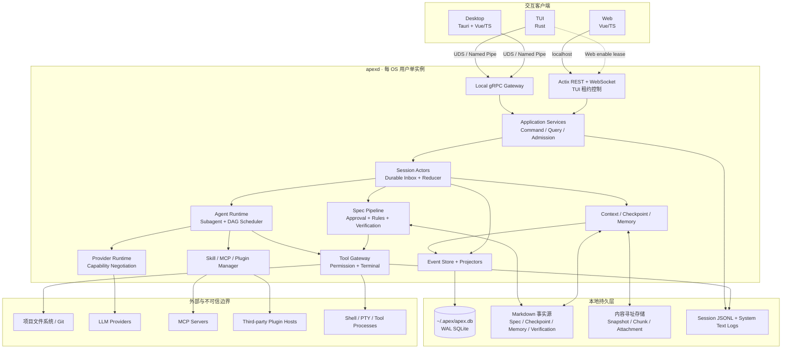
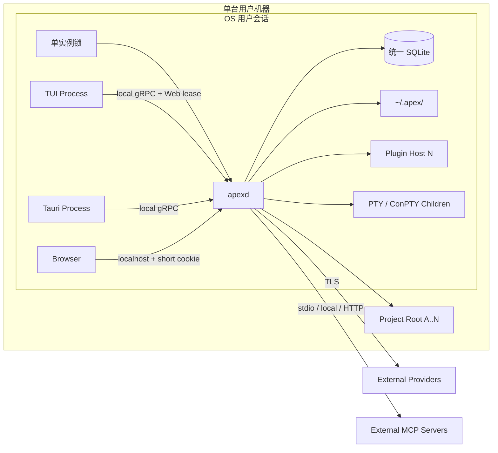
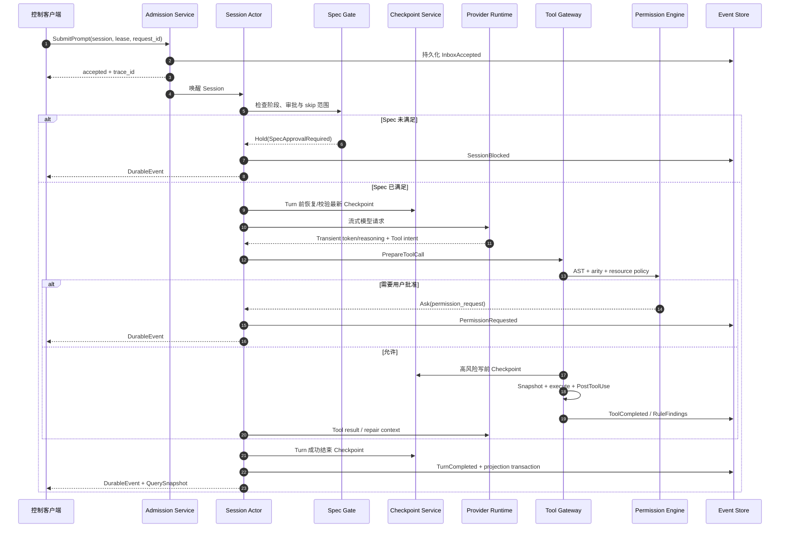
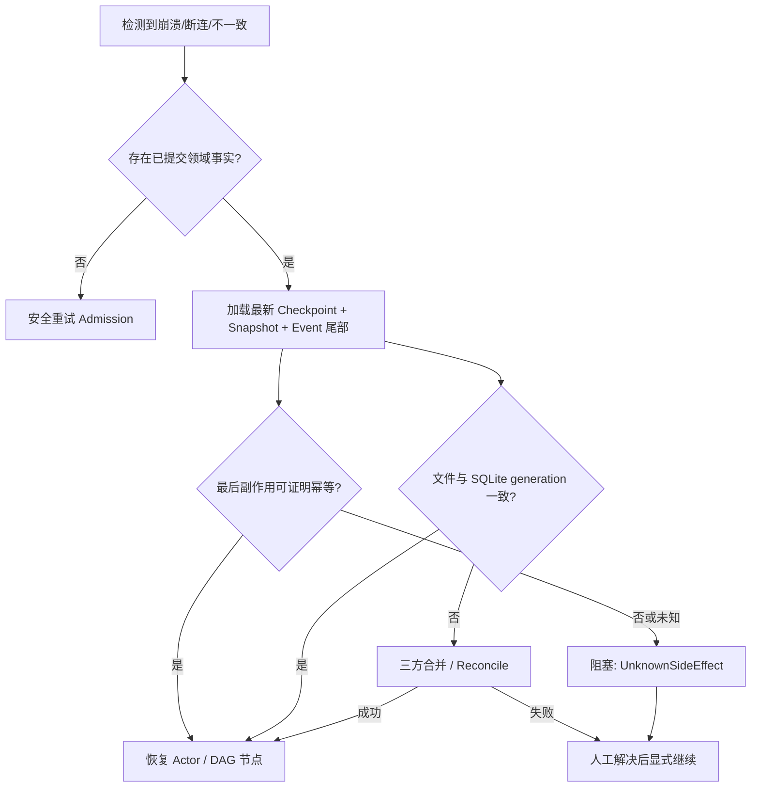

# Apex 系统总体架构

## 1. 架构目标

Apex 采用“单一用户级 Core、多交互前端、双事实域存储、所有副作用经网关”的架构。`apexd` 是唯一业务执行者；TUI、桌面端和 Web 端只提交命令、查询快照并消费事件，不持有平行业务实现。

核心原则：

1. 单写者：会话、DAG、权限与投影只由 `apexd` 变更。
2. 事实分域：可审计内容归 Markdown/文件系统，运行生命周期归 SQLite 事件与投影。
3. Admission 先持久化：Prompt、审批、接管和外部文件变化先入 inbox/event，再由 Session Actor 在安全边界处理。
4. 副作用收口：Tool、终端、MCP 脚本、Skill 脚本和 Plugin Host 能力都经过 Tool Gateway/Permission Engine。
5. Checkpoint-first：高风险操作和有损 Context 操作前先建立可恢复边界。
6. Durable 与 Transient 分离：Reducer 只消费持久领域事件；流式 token、进度、音量等短暂信号不改变权威状态。

## 2. 逻辑架构

箭头表示命令或数据流。客户端不能绕过 Application Services 直接访问数据库、项目文件或 Provider。

## 3. 部署架构

- Unix gRPC 端点位于 `~/.apex/runtime/apexd.sock`，权限仅当前用户；实际路径可因平台 socket 长度限制使用稳定哈希缩短。
- Windows 使用 `\\.\pipe\apex-<user-sid-hash>`，ACL 只允许当前用户与必要的系统主体。
- Web 端口由 OS 随机分配，监听 `127.0.0.1` 与 `::1`；未持有 TUI Web 租约时无监听 socket。
- `apexd` 通过 OS 用户身份、端点 ACL、客户端握手 nonce 和协议版本共同验证本地客户端。

## 4. 核心运行时序

流式 token 和工具进度可以丢弃并重连；审批、Tool 结果、Checkpoint、阶段变化和阻塞原因必须持久化后才对客户端确认。

## 5. 核心组件职责

| 组件 | 唯一职责 | 不得承担 |
|---|---|---|
| Application Services | 命令校验、幂等、授权上下文、查询编排 | Session 长事务、文件写入 |
| Session Actor | 单会话串行状态机、inbox 提升、安全点 | 直接解析 Shell、直接操作 SQLite |
| Event Store/Projector | 追加领域事实、更新投影、序列游标 | 记录详细诊断日志 |
| Spec Pipeline | 阶段、审批、失效、skip、验证门 | 执行任意 Tool |
| Agent Runtime | Provider 循环、Tool 调用编排、Subagent 生命周期 | 绕过 Permission/Claim |
| DAG Scheduler | Ready Queue、依赖、限流、Claim 与汇聚 | 修改 tasks.md 或静默扩权 |
| Tool Gateway | 所有副作用准备、权限、Snapshot、执行、校验 | 使用 LLM 决定权限 |
| Context/Checkpoint | Context Epoch、阈值、无损恢复清单 | 把摘要当作唯一原文 |
| Memory | Markdown 读写、FTS 索引、召回解释 | 存储 API Key |
| Extension Manager | Skill/MCP/Plugin 发现、信任、生命周期 | 默认启动外部服务 |
| Provider Runtime | 统一消息、能力协商、流、重试/故障转移 | 暴露厂商 DTO 给领域层 |

## 6. 数据与一致性边界

### 6.1 两个事实域

- 文件事实域：Spec、Verification、Checkpoint Manifest/Chunk、Memory、Snapshot/CAS。
- SQLite 事实域：会话运行事件、投影、审批、权限请求、Tool/DAG 状态、扩展索引与 FTS。

它们不是跨介质 ACID 事务。跨域写入采用 `Prepare → 原子文件替换 → SQLite Commit → Reconcile Marker` 协议；崩溃后由 reconciliation job 根据内容哈希、generation 和 event id 收敛。任何无法证明顺序的状态必须进入 `Blocked::ReconciliationConflict`，不得猜测最后写入者。

### 6.2 事件可见性

每个会话拥有单调 `session_seq`。客户端先获取 Query Snapshot 的 `as_of_seq`，再订阅 `since_seq=as_of_seq+1`；服务端在保留窗口内补发 Durable Event，窗口外返回 `RESYNC_REQUIRED`。Transient Event 只带 `trace_id`/`span_id`，没有重放保证。

## 7. 信任边界

| 边界 | 默认信任 | 控制 |
|---|---|---|
| `apexd` 核心与官方签名进程内 Plugin | 高 | 签名、版本/ABI 校验、最小内部 API |
| 本地 TUI/Desktop | 当前 OS 用户内受信客户端 | 端点 ACL、握手、版本协商、控制租约 |
| localhost Web/浏览器扩展 | 不因 localhost 自动信任 | 一次性令牌、短 Cookie、Origin、CSRF、CSP |
| 项目文件与仓库指令 | 未确认前不信任 | Project Trust Gate，确认前禁止读取 |
| Skill/MCP/第三方 Plugin | 默认不信任 | 哈希/签名、显式启用、Tool Gateway、进程隔离 |
| Provider 与远端端点 | 外部数据处理者 | TLS、脱敏、能力/数据策略、Secret Firewall |
| Shell/Tool 子进程 | 潜在副作用执行者 | AST 权限、路径 Claim、环境清洗、可选 OS 沙箱 |

## 8. 异常与恢复总流程

## 9. 关键取舍摘要

| 决策 | 选择 | 获得 | 代价 |
|---|---|---|---|
| ADR-001 | 每用户单 `apexd` | 三端一致、集中调度与资源复用 | daemon 成为关键故障域，需要强恢复 |
| ADR-002 | Markdown + SQLite 分域事实源 | 可审计内容与高效运行态兼得 | 需要跨域 reconciliation，不能虚构全局事务 |
| ADR-003 | 本地 gRPC + localhost REST/WS | 原生端强类型、Web 易用 | 两套传输适配与契约测试 |
| ADR-006 | 纯静态权限 | 零 Token、确定、可审计 | 对复杂动态命令采取保守 ask/deny |
| ADR-007 | Checkpoint-first | 有损上下文前可恢复 | I/O、存储与实现复杂度增加 |
| ADR-008 | 内容寻址 Snapshot | 不污染 Git、可去重、跨 VCS | 自建捕获/恢复与 GC |
| ADR-009 | 共享工作区 + Claim | 并发效率高、用户看到实时结果 | 路径规范化和冲突调度复杂 |
| ADR-012 | 第三方 Plugin 独立进程 | 限制崩溃/内存破坏半径 | IPC 和版本适配成本 |

完整理由、备选方案和重审条件见 [ADR 注册表](adr/README.md)。

## 10. 架构不变量

1. 没有经过 Spec Gate、Permission Engine、Write Claim 和必要 Checkpoint 的写操作，不得进入执行器。
2. 客户端显示状态必须能追溯到 Query Snapshot、Durable Event 或明确标记的 Transient Event。
3. 任何未知副作用、合并失败、解析失败或 Schema 不兼容都必须保守阻塞，不能静默“修复”。
4. API Key 等 Secret 在 Provider Adapter 边界内短暂使用，禁止进入通用消息、事件、日志和 Markdown。
5. 同一 Major 的追加式兼容约束优先于清理旧字段的便利性。
