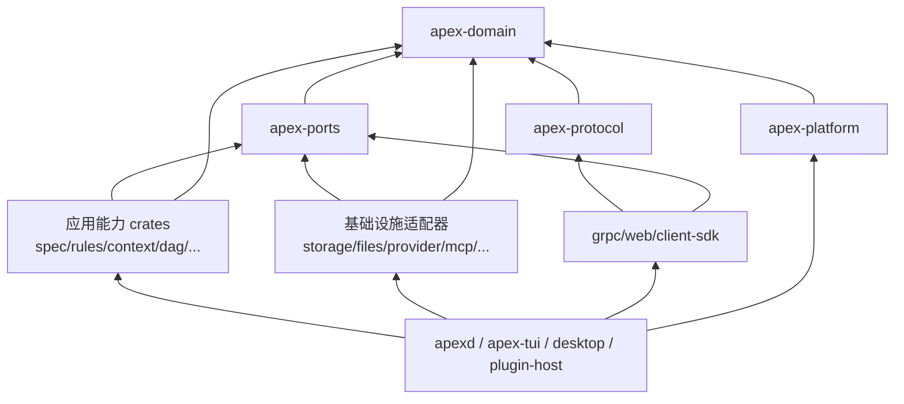

# Apex Cargo Workspace 与工程结构

## 1. 设计目标

目标 Workspace 从第一天建立单向依赖和能力边界，不延续旧工程结构。crate 划分围绕“可独立验证的契约边界”，而不是为每个数据类型创建 crate。

## 2. 目标目录

```text
Apex/
├── Cargo.toml                  # workspace members、统一依赖与 lint
├── Cargo.lock                  # 应用型 workspace 必须提交
├── rust-toolchain.toml
├── deny.toml                   # license/source/advisory 策略
├── README.md
├── docs/
├── proto/
│   └── apex/v1/*.proto         # Wire 唯一来源；生成 Rust/TS 客户端
├── schemas/
│   ├── workflow-v1.schema.json
│   ├── skill-frontmatter-v1.schema.json
│   └── markdown-frontmatter-v1.schema.json
├── apps/
│   ├── apexd/                  # daemon 组合根与唯一服务端进程
│   ├── apex-tui/               # package；产物名 apex
│   ├── apex-plugin-host/       # 第三方原生插件隔离宿主
│   ├── apex-updater/           # 安全点安装/Windows 替换辅助进程
│   └── apex-desktop/
│       └── src-tauri/          # Tauri Rust 壳
├── ui/
│   ├── package.json
│   ├── pnpm-lock.yaml
│   ├── src/app/                # 共享 Vue 应用与 Feature slices
│   ├── src/platform/           # Desktop/Web Platform Adapter
│   ├── src/i18n/
│   └── tests/
├── crates/
│   ├── apex-domain/
│   ├── apex-ports/
│   ├── apex-protocol/
│   ├── apex-platform/
│   ├── apex-application/
│   ├── apex-session-runtime/
│   ├── apex-spec/
│   ├── apex-rules/
│   ├── apex-agent-runtime/
│   ├── apex-dag/
│   ├── apex-context/
│   ├── apex-replay/
│   ├── apex-command-ast/
│   ├── apex-permission/
│   ├── apex-tool-gateway/
│   ├── apex-terminal/
│   ├── apex-storage/
│   ├── apex-file-facts/
│   ├── apex-snapshot/
│   ├── apex-observability/
│   ├── apex-update/
│   ├── apex-provider-core/
│   ├── apex-provider-anthropic/
│   ├── apex-provider-openai/
│   ├── apex-provider-deepseek/
│   ├── apex-provider-kimi/
│   ├── apex-provider-openai-compatible/
│   ├── apex-multimodal/
│   ├── apex-skill/
│   ├── apex-mcp/
│   ├── apex-plugin-api/
│   ├── apex-plugin-runtime/
│   ├── apex-grpc/
│   ├── apex-web/
│   ├── apex-client-sdk/
│   └── apex-test-support/
└── xtask/                      # 代码生成、契约/文档/发布验证
```

`apex-web` 嵌入由 `ui` 的 web entry 产生的带哈希静态资源；Tauri 使用同一 `ui/src/app`，但注入本地 gRPC Platform Adapter。这样共享功能代码，不共享不合适的认证/传输实现。

## 3. 依赖层级



硬规则：

- `apex-domain` 不依赖 Tokio、SQLx、Tonic、Actix、Tauri 或 Provider SDK。
- `apex-ports` 只定义 Port，不包含 SQLite/HTTP/文件系统具体类型。
- 应用能力 crate 不依赖具体 Adapter；`apexd` 是依赖注入与生命周期组合根。
- `apex-protocol` 负责领域类型与 Protobuf DTO 的显式转换；领域层不得导入生成的 Protobuf 类型。
- Provider、MCP、Plugin 和 Shell 类型不得越过自己的 Adapter 泄漏到领域事件。
- 客户端不得依赖服务端应用 crate；只依赖 `apex-client-sdk`/生成的协议类型。

## 4. crate 职责

### 4.1 Foundation

| crate | 职责 | 关键限制 |
|---|---|---|
| `apex-domain` | ID、值对象、聚合状态、领域事件、错误分类 | 纯 Rust；序列化格式与存储无关 |
| `apex-ports` | 应用层 Trait、事务/幂等/时间/ID Port | 不提供具体实现 |
| `apex-protocol` | Protobuf 生成、版本协商、DTO 转换、事件 Wire 信封 | 未知字段不得丢失后再写回 |
| `apex-platform` | OS 目录、用户身份、单实例锁、端点/ACL、进程树、文件系统语义 | 平台条件编译集中；不得含业务规则 |

### 4.2 Application/runtime

| crate | 职责 | 关键限制 |
|---|---|---|
| `apex-application` | Command/Query Handler、Admission、幂等、授权上下文 | 不执行 Tool，不直接读写 DB |
| `apex-session-runtime` | 每 Session Actor、durable inbox、安全点、Turn 生命周期 | 单 Session 串行；不内嵌 Shell/Provider 细节 |
| `apex-spec` | 阶段机、审批、失效传播、skip scope、Markdown 模型 | 编码门只基于持久事实 |
| `apex-rules` | 语言规则包、PostToolUse 门、诊断聚合、修复预算 | 不自行扩大写路径或权限 |
| `apex-agent-runtime` | Agent Loop、模型消息转换、Tool/Skill/Subagent 编排 | 通过 Port 调用副作用 |
| `apex-dag` | DAG IR、Ready Queue、限流、路径 Claim、汇聚与暂停恢复 | 无任意脚本执行器 |
| `apex-context` | Context Epoch、预算、snip/prune/摘要、Checkpoint 与 Memory 编排 | 原始意图不可只存在摘要中 |
| `apex-replay` | 状态重放、再执行计划、补偿式回滚协调 | 历史事件只追加不删除 |

### 4.3 Security/execution

| crate | 职责 | 关键限制 |
|---|---|---|
| `apex-command-ast` | POSIX/PowerShell/cmd 解析、arity 语义 IR、资源提取 | 解析失败显式 Unknown，不猜测 |
| `apex-permission` | 模式、白名单、硬禁止、授权生命周期、静态决策证据 | 禁止 Provider/LLM 依赖 |
| `apex-tool-gateway` | Tool 注册、准备、权限、Snapshot、执行、PostToolUse、审计 | 所有副作用的唯一入口 |
| `apex-terminal` | PTY/ConPTY、一次性命令、隔离通道、输出背压与进程树清理 | 默认清洗 Secret 环境；不做权限决策 |

### 4.4 Persistence/observability

| crate | 职责 | 关键限制 |
|---|---|---|
| `apex-storage` | SQLite 事件、投影、普通表、FTS、迁移、归档挂载 | 不把日志当事件；支持同 Major 未知数据保留 |
| `apex-file-facts` | Markdown/CAS 原子写、watch、generation、三方合并、镜像 | 不把 SQLite 投影反向覆盖人工变更 |
| `apex-snapshot` | 内容寻址捕获、Manifest、恢复、差异与 GC | 不执行 Git commit/branch |
| `apex-observability` | 会话 JSONL、系统文本日志、hash chain、签名、脱敏、诊断包 | Secret Firewall 在 sink 前执行 |
| `apex-update` | 更新清单、签名校验、通道策略、安装计划、回滚协调 | 不直接决定何时越过运行安全点 |

### 4.5 Provider/multimodal

| crate | 职责 | 关键限制 |
|---|---|---|
| `apex-provider-core` | 统一模型消息、流事件、能力、错误、重试/故障转移契约 | 保留扩展槽，不假装所有厂商同构 |
| `apex-provider-anthropic` | Anthropic 专属 Tool/reasoning/cache/stream 映射 | 厂商 DTO 不外泄 |
| `apex-provider-openai` | OpenAI Responses/Realtime 等专属映射 | 同上 |
| `apex-provider-deepseek` | DeepSeek 专属推理与协议映射 | 同上 |
| `apex-provider-kimi` | Kimi 专属上下文、文件/推理映射 | 同上 |
| `apex-provider-openai-compatible` | 通义、智谱和自定义兼容端点 | capability 必须探测/配置，不能仅凭名称假设 |
| `apex-multimodal` | 附件导入、MIME/大小校验、转码、音频 session、内容引用 | 不保存 Secret，不支持实时视频 |

### 4.6 Extensions

| crate | 职责 | 关键限制 |
|---|---|---|
| `apex-skill` | 多来源扫描、frontmatter、阶段绑定、hash/signature trust | Skill 脚本经 Tool Gateway |
| `apex-mcp` | 配置扫描、规范化、启停覆盖、transport/OAuth/进程监督 | 发现不等于启动 |
| `apex-plugin-api` | 稳定 C ABI、版本/能力描述、FFI 安全结构 | 不暴露 Rust ABI 类型 |
| `apex-plugin-runtime` | 官方签名校验、in-process loader、Plugin Host RPC/监督 | 第三方永不进 `apexd` 地址空间 |

### 4.7 Interfaces/apps

| crate/app | 职责 |
|---|---|
| `apex-grpc` | 本地 gRPC server、认证 interceptor、流控与服务实现 |
| `apex-web` | Actix REST/WS、Web 租约、Cookie/Origin/CSRF、静态资源 |
| `apex-client-sdk` | TUI/Desktop 共享连接、重连、快照+事件合并、版本协商 |
| `apps/apexd` | 配置加载、依赖注入、迁移、后台任务、优雅关闭 |
| `apps/apex-tui` | TUI 命令面板、共享终端、Spec/权限/DAG/Memory UI；不含日志/音频 |
| `apps/apex-desktop` | Tauri 能力与系统集成，托管共享 Vue 应用 |
| `apps/apex-plugin-host` | 加载一个/一组第三方 Plugin，提供受限 Host API |
| `apps/apex-updater` | daemon 退出后原子替换制品、执行平台安装步骤并回报健康状态 |
| `apex-test-support` | 假时钟、内存 Port、fixture、故障注入、跨端契约 harness |

## 5. Feature 与平台策略

- 完整发行物默认编译所有官方 Provider Adapter、FTS5、中文 jieba、TUI、Web 和 Plugin Host 支持。
- `cfg(unix)`/`cfg(windows)` 只允许出现在 `apex-platform`、`apex-terminal`、Plugin loader 和极少数集成层；业务 crate 使用 Port。
- FTS tokenizer 在运行时按项目语言策略选择，而不是通过互斥编译 feature。
- `unsafe` 默认 workspace deny；仅 `apex-platform`/`apex-plugin-api`/loader 可局部 allow，并要求 `SAFETY` 不变量与 Miri/平台测试。
- Web UI 资源与 `apexd` 版本绑定；桌面 UI 与 daemon 通过协议版本协商，不假设二者总是同版本。

## 6. Workspace 统一质量配置

```toml
[workspace.lints.rust]
unsafe_code = "deny"
missing_docs = "warn"

[workspace.lints.clippy]
all = "deny"
pedantic = "warn"
unwrap_used = "deny"
expect_used = "deny"

[profile.release]
lto = "thin"
codegen-units = 1
panic = "abort"
```

实际 `Cargo.toml` 在实现阶段生成；上例表达策略而非当前可执行配置。所有依赖集中于 `[workspace.dependencies]`，新增依赖必须通过 `cargo deny`、`cargo audit`、许可证和维护性评审。

## 7. 构建与生成顺序

1. `xtask codegen`：从 `proto/` 和 `schemas/` 生成 Rust/TS 类型并校验工作区干净。
2. 构建共享 Vue 应用的 web/desktop entry。
3. 构建 Rust libraries、`apexd`、`apex-plugin-host`、`apex-updater`、`apex` TUI。
4. 将 web assets 嵌入 `apex-web`，打包 Tauri。
5. 执行单元、属性、集成、协议兼容、跨端 E2E 和平台矩阵测试。
6. 生成 SBOM、签名、更新清单和可复现构建证据。

## 8. 禁止的依赖模式

- `apex-domain -> sqlx/tonic/actix/tauri/provider SDK`。
- `apex-spec -> apex-tool-gateway` 的直接执行调用；只能返回 Gate Decision。
- `apex-permission -> apex-provider-core`。
- `apex-web -> apex-storage` 或 UI 直接 SQL。
- Provider Adapter 相互依赖。
- Client SDK 引用 daemon 内部事件实现而非 Wire 契约。
- 为迁移方便保留第二套 Session Runtime、事件枚举或权限引擎。
