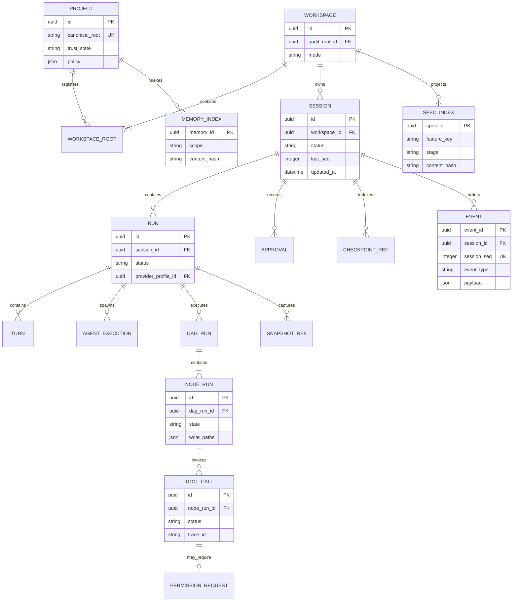
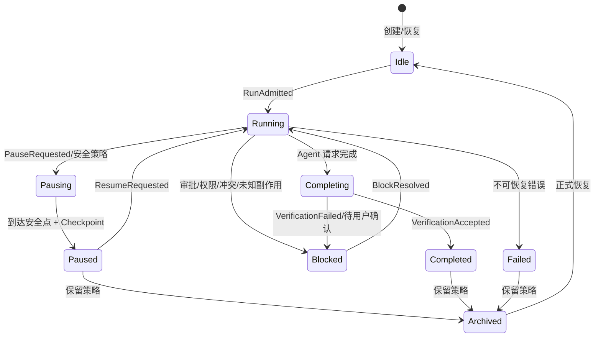

# Apex 领域模型与事件语义

## 1. 术语

| 术语 | 定义 |
|---|---|
| Project | 一个已注册且具有信任状态、策略和主要根目录的项目。 |
| Workspace | 一次执行可见的一个或多个 Project Root 集合；单根也表示为 Workspace。 |
| Audit Root | 多根 Workspace 中承载 Spec/Verification 镜像的用户指定根。 |
| Session | 用户可长期恢复、归档和跨端查看的对话/工作容器。 |
| Run | Session 内一次从输入 Admission 到停止/完成的执行尝试。 |
| Turn | 一个被提升的用户输入及其 Agent 响应边界。 |
| Agent Execution | 一个父/子 Agent 的具体执行实例。 |
| DAG Run / Node Run | 已批准任务图及其中节点的一次运行。 |
| Durable Event | 改变权威状态、可按序重放的领域事实。 |
| Transient Event | token、进度、音频电平等短暂 UI 信号，不参与 Reducer。 |

## 2. ID 与值对象

业务 ID 使用 UUIDv7，便于本地生成与时间有序索引；内容地址使用 `BLAKE3-256`。所有 ID 在 Rust 中必须是 newtype，禁止用裸 `String` 混用。

| 类型 | 含义 |
|---|---|
| `ProjectId`、`WorkspaceId`、`RootId` | 项目、执行 Workspace 与根目录 |
| `SessionId`、`RunId`、`TurnId` | 会话、运行与 Turn |
| `AgentExecutionId`、`DagRunId`、`NodeRunId`、`TaskId` | Agent/DAG/任务执行 |
| `ToolCallId`、`TerminalId`、`PermissionRequestId` | Tool、终端与权限 |
| `SpecId`、`ApprovalId`、`SkipGrantId` | Spec 与审批 |
| `CheckpointId`、`SnapshotId`、`ArtifactId`、`MemoryId` | 文件事实与内容对象 |
| `ProviderProfileId`、`SkillId`、`McpServerId`、`PluginId` | 可配置能力 |
| `EventId`、`TraceId`、`SpanId` | 审计关联；TraceId 遵循 W3C 128-bit 语义 |
| `ContentHash` | `blake3:<64-lower-hex>`，覆盖规范化字节 |
| `FeatureKey` | 路径安全的 kebab-case 标识，映射 `specs/<feature>/` |
| `Generation` | 文件事实的单调逻辑版本，不等于 mtime |

## 3. 聚合与所有权



SQLite 的具体表、索引和文件映射见 [07](07-storage-files-logging.md)。ER 图表达领域所有权，不意味着所有字段都在单表内。

## 4. 权威状态枚举

以下名称是跨文档、事件与协议的唯一语义来源。数据库可以使用稳定小写字符串编码，Wire 使用同名枚举值；新增值只追加。

```rust
enum SessionStatus {
    Idle, Running, Pausing, Paused, Blocked,
    Completing, Completed, Failed, Archived,
}

enum RunStatus {
    Admitted, Running, WaitingForUser, Pausing, Paused,
    Blocked, Succeeded, Failed, Canceled,
}

enum SpecStage { Requirements, Design, Tasks, Coding, Verification }

enum StageStatus {
    Draft, AwaitingApproval, Approved, Invalidated,
    Skipped, InProgress, Verified,
}

enum NodeStatus {
    Pending, Ready, Claiming, Running, Waiting,
    Paused, Blocked, Succeeded, Failed,
    Compensating, Compensated, Canceled,
}

enum ToolCallStatus {
    Proposed, AwaitingPermission, Prepared, Running,
    Succeeded, Failed, Interrupted, UnknownSideEffect,
}

enum PermissionDecision { Allow, Ask, Deny }
enum PermissionMode { Plan, Ask, Allow }
enum GrantScope { Once, Run, Session, Project }

enum BlockReason {
    SpecApprovalRequired,
    SpecChanged,
    PermissionRequired,
    ProjectUntrusted,
    CommandParseUnknown,
    WriteClaimConflict,
    MergeConflict,
    ReconciliationConflict,
    UnknownSideEffect,
    ProviderUnavailable,
    CapabilityUnsupported,
    ManualPause,
    SchemaWriterTooOld,
}
```

`Blocked` 必须伴随 `BlockReason` 和可执行的恢复动作；不能只保存自由文本。

## 5. Session 状态机



安全点包括：Provider 请求之间、Tool 执行前后、DAG 节点边界、Checkpoint 成功提交后。正在进行的不可中断外部副作用不是安全点。

## 6. 消息分层

- `AgentMessage`：用户、Agent、Tool、系统说明、审批提示、附件引用等持久领域消息，可呈现给客户端。
- `ModelMessage`：Provider 请求的规范化线格式，由当前 Context Epoch 从 AgentMessage/Checkpoint/Memory/Tool Schema 派生。
- `ProviderFrame`：厂商流式增量、reasoning handle、audio frame、usage 等适配器内部或 Transient 数据。

禁止把厂商 continuation token、cache handle 或 raw SDK object 直接持久化为跨 Provider 的 `AgentMessage`。模型切换时，专属 reasoning metadata 只能降级为普通可见文本或明确丢弃，不能伪装兼容。

## 7. 事件信封

```rust
struct EventEnvelope {
    schema_version: u16,
    event_id: EventId,
    aggregate_kind: AggregateKind,
    aggregate_id: String,
    aggregate_version: u64,
    workspace_id: WorkspaceId,
    session_id: Option<SessionId>,
    session_seq: Option<u64>,
    event_type: String,          // 例 apex.tool.completed.v1
    occurred_at: OffsetDateTime,
    actor: ActorRef,
    trace_id: TraceId,
    span_id: SpanId,
    causation_event_id: Option<EventId>,
    correlation_id: Option<String>,
    writer_version: SemVer,
    payload_json: RawJson,
}
```

不变量：

- `event_id` 全局唯一；同 Session 的 `session_seq` 连续单调，不复用。
- 聚合使用 optimistic `aggregate_version`；冲突返回版本错误，不自动 last-write-wins。
- `payload_json` 保留未知字段原始语义；同一 Major 不回写破坏未知数据。
- 领域事件只记录状态重建所需事实，命令全文、模型全文和终端全文默认不进入事件。
- 文件日志通过 `event_id`/`trace_id` 关联，但不参与 Reducer。

## 8. 事件目录

事件类型采用 `apex.<domain>.<past-tense>.vN`。首版至少包含：

| 领域 | 事件 |
|---|---|
| Session/Run | `session.created`、`run.admitted`、`run.paused`、`run.blocked`、`run.completed` |
| Inbox/Turn | `inbox.accepted`、`turn.started`、`turn.completed`、`turn.interrupted` |
| Spec | `spec.changed`、`approval.granted`、`approval.invalidated`、`skip.granted`、`verification.accepted` |
| Agent/DAG | `agent.spawned`、`node.ready`、`node.started`、`node.blocked`、`node.succeeded`、`merge.failed` |
| Tool/Permission | `tool.proposed`、`permission.requested`、`permission.resolved`、`tool.completed`、`tool.unknown-side-effect` |
| Context | `checkpoint.committed`、`context.watermark-crossed`、`context.epoch-replaced`、`memory.recalled` |
| Snapshot/Replay | `snapshot.captured`、`replay.started`、`compensation.applied`、`replay.completed` |
| Extension | `skill.trust-invalidated`、`mcp.enabled`、`plugin.crashed` |
| Lease | `control.acquired`、`control.taken-over`、`web-lease.acquired`、`web-lease.expired` |

完整 payload 在实现阶段由 `proto/` 与 JSON Schema 生成并进行金丝雀兼容测试；不得在主题文档中创建同名不同义事件。

## 9. 审批与授权值对象

`ApprovalRecord` 必须绑定：审批对象类型、对象 ID、内容哈希、阶段、scope、操作者、时间、trace、策略版本。只要内容哈希或上游依赖哈希改变，审批即不可继续使用。

`PermissionGrant` 必须绑定：规范资源 key、决策、期限、来源请求、批准人、策略版本、过期条件。批准 key 可以按 arity 规则泛化，但拒绝 key 必须保持到实际资源/参数粒度，避免一次拒绝意外扩大范围。

## 10. 错误模型

稳定错误码格式为 `APEX_<DOMAIN>_<REASON>`，例如：

- `APEX_SPEC_APPROVAL_REQUIRED`
- `APEX_PERMISSION_PARSE_UNKNOWN`
- `APEX_PERMISSION_HARD_DENY`
- `APEX_CLAIM_CONFLICT`
- `APEX_REPLAY_UNKNOWN_SIDE_EFFECT`
- `APEX_STORAGE_RECONCILIATION_CONFLICT`
- `APEX_PROTOCOL_RESYNC_REQUIRED`
- `APEX_PROTOCOL_CLIENT_TOO_OLD`
- `APEX_PROTOCOL_SERVER_TOO_OLD`
- `APEX_PROVIDER_CAPABILITY_UNSUPPORTED`
- `APEX_WEB_LEASE_REQUIRED`
- `APEX_SCHEMA_WRITER_TOO_OLD`

错误携带 `trace_id`、稳定 code、本地化 message key、可重试标记、可选 `retry_after`、字段级 details 和用户动作列表。自由文本不得作为客户端分支条件。
