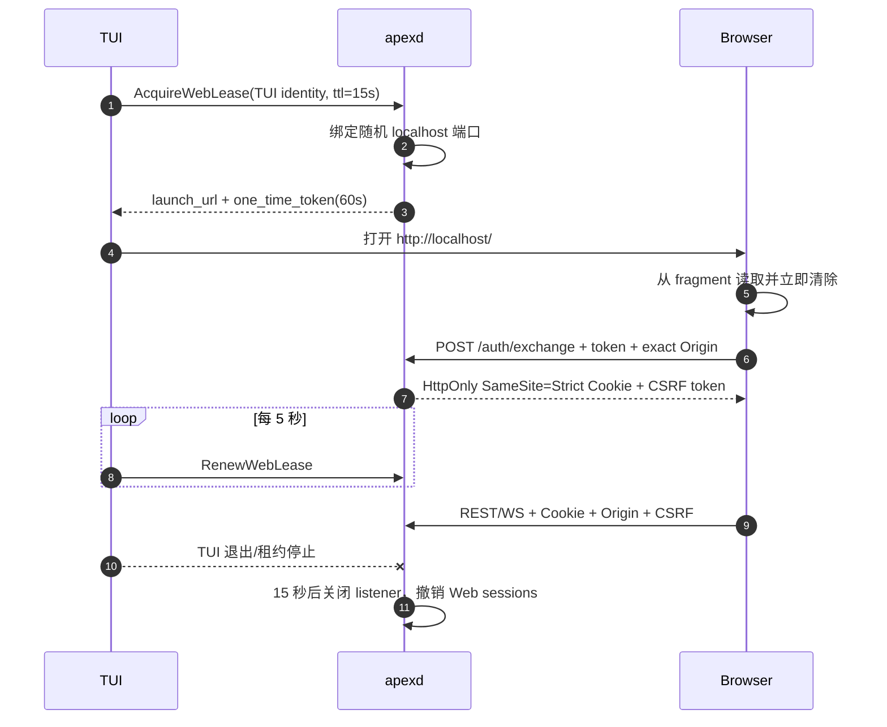
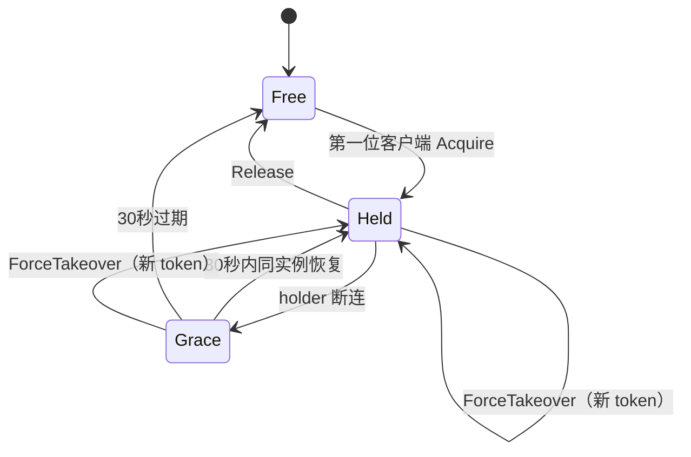

# Apex 协议与三端客户端

## 1. 协议边界

TUI、Desktop 和 Web 只通过公开协议访问 `apexd`。协议分为：

- Command：带幂等 key、控制租约和期望版本的状态变更请求。
- Query：返回带 `as_of_seq` 的权威快照。
- Durable Event：带 Session 单调序号，可重连补发。
- Transient Event：流式 token、进度、音频帧等，可丢弃，不参与状态重建。

本地 gRPC 在 Unix 使用 Unix Domain Socket（UDS），在 Windows 使用 Named Pipe；两者承载相同 Proto 契约。

`proto/apex/v1/*.proto` 是 gRPC/Wire 类型的唯一代码生成源；REST/WS DTO 从同一应用 DTO 显式映射，不另建一套业务语义。

## 2. 握手与版本协商

```text
ClientHello {
  protocol_major, protocol_minor, client_kind, client_version,
  locale, supported_features[], client_instance_id, nonce
}

ServerHello {
  protocol_major, negotiated_minor, daemon_version, schema_major,
  enabled_features[], disabled_features[{feature, reason}], server_nonce
}
```

- 协议 Major 不同直接返回 `APEX_PROTOCOL_CLIENT_TOO_OLD` 或 `APEX_PROTOCOL_SERVER_TOO_OLD`。
- 同 Major 只追加字段/枚举；旧客户端忽略未知 capability，新服务端不得要求旧客户端写入未知语义。
- 功能可被协议、平台、Provider、客户端类型或项目策略禁用；禁用必须返回机器可读 reason。
- 本地 gRPC 在握手阶段同时校验 OS 用户/端点 ACL；Web 在 Cookie 会话建立后获得等价 `ClientIdentity`。

## 3. 本地 gRPC 服务

| Service | 主要 RPC | 说明 |
|---|---|---|
| `HandshakeService` | `Connect`、`GetCapabilities` | 版本、身份与 feature 协商 |
| `WorkspaceService` | `RegisterProject`、`TrustProject`、`OpenWorkspace`、`ReloadFacts` | Project Trust 在任何读取前 |
| `SessionService` | `Create`、`Get`、`List`、`SubmitPrompt`、`Pause`、`Resume`、`CancelRun` | Prompt 返回 Admission receipt |
| `ControlService` | `Acquire`、`Renew`、`ForceTakeover`、`Release` | 单控制租约与 30 秒宽限 |
| `EventService` | `SubscribeSession` | Snapshot 后从 `since_seq` 消费 |
| `SpecService` | `GetPipeline`、`Approve`、`GrantSkip`、`AcceptVerification` | 所有批准绑定内容哈希 |
| `PermissionService` | `ListPending`、`Resolve`、`ListGrants`、`Revoke` | UI 只提交决策，不自行推断权限 |
| `AgentService` | `ListExecutions`、`Steer`、`GetActivity` | 返回 Skill/MCP/Subagent 活动 |
| `DagService` | `GetRun`、`Pause`、`Resume`、`ResolveMerge` | DAG IR 和 Node 状态 |
| `TerminalService` | `Open`、`RunOnce`、`Write`、`Resize`、`Subscribe`、`Terminate` | 帧带 terminal/agent/task/trace |
| `ContextService` | `GetUsage`、`ListCheckpoints`、`PinCheckpoint`、`Restore` | 展示阈值与恢复证据 |
| `MemoryService` | `Search`、`ListRecalls`、`ApproveWrite`、`Delete`、`Export` | 敏感写入逐次确认 |
| `ExtensionService` | `ListSkills`、`TrustSkill`、`ListMcp`、`SetMcpEnabled`、`ListPlugins` | 发现与启动分开 |
| `ProviderService` | `ListProfiles`、`TestConnection`、`ListModels`、`GetCapabilities` | 不返回 Key |
| `WebLeaseService` | `Acquire`、`Renew`、`GetLaunchInfo` | 仅 TUI identity 可调用 |
| `LogService` | `ListSegments`、`ReadSession`、`VerifySession`、`ReadSystem` | 仅 Desktop/Web capability 开启 |

Command 请求统一包含：

```text
CommandMeta {
  request_id, idempotency_key, traceparent,
  client_instance_id, control_lease_token?, expected_version?
}
```

服务端先持久化命令的 admission/result，再返回成功。网络中断重试相同 key 不会重复执行。

## 4. REST 与 WebSocket

Web API 前缀为 `/api/v1`，只在 Web enable lease 有效时存在。

TUI 在本地 gRPC 握手成功后自动获取并续租 Web enable lease；只要至少一个 TUI 实例的租约有效，listener 保持开启。Desktop、Web 页面和后台 Agent 都不能创建该租约。

| 方法与路径 | 对应能力 |
|---|---|
| `POST /auth/exchange` | 一次性令牌换短期 Cookie |
| `GET /capabilities` | 握手后的 Web 能力 |
| `GET/POST /sessions` | 列表、创建 |
| `GET /sessions/{id}` | Session Query Snapshot |
| `POST /sessions/{id}/prompts` | Prompt Admission |
| `POST /sessions/{id}:pause|resume` | 控制运行 |
| `POST /control:acquire|renew|takeover` | 控制租约 |
| `GET /specs/{feature}`、`POST ...:approve|skip` | Spec 流水线 |
| `GET/POST /permissions/...` | 权限查询与决策 |
| `GET /dag-runs/{id}`、`POST ...:pause|resume` | DAG 控制 |
| `GET/DELETE /memories/...`、`POST /memories:export` | Memory 管理 |
| `GET /logs/sessions/{id}`、`POST ...:verify`、`GET /logs/system` | Desktop/Web 日志能力 |
| `GET /ws` | 复用 Durable/Transient 事件信封 |

WebSocket 首帧为 `Subscribe { session_id, since_seq, transient_channels[] }`。服务端先补 Durable Event，再切换 live；若序号早于保留窗口，返回 `RESYNC_REQUIRED` 并要求重新拉 Snapshot。

## 5. Web 启用与认证时序



安全约束：

- Token 单次使用、60 秒过期，保存其哈希而非明文；不得放在 query string、日志或 Referer 中。
- Cookie 是 host-only、HttpOnly、SameSite=Strict，最长 15 分钟且不超过当前 Web 租约；可用 loopback HTTPS 时增加 Secure。
- 所有变更请求要求双提交 CSRF token；WebSocket 用受限 subprotocol token，并严格匹配 `Origin`。
- CSP 禁止 `eval`/`new Function` 和任意外部脚本；静态资源有内容哈希。
- listener 同时绑定 IPv4/IPv6 loopback 时分别校验，绝不回退 `0.0.0.0`/`::`。

## 6. 控制租约



- FIFO 只决定同时竞争时的先到者；租约已持有时普通 Acquire 不排队抢占。
- 非控制客户端可以查询、订阅和准备输入草稿，但不能提交改变运行的 Command。
- 强制接管要求理由，撤销旧 token，并产生 `control.taken-over` Durable Event/会话日志。
- 断连后的 Run 默认继续；策略 `pause_on_control_loss=true` 时，仅在宽限到期后的下一个安全点暂停。

## 7. 快照与事件合并

客户端状态合并算法固定为：

1. 请求 Session Snapshot，得到 `as_of_seq=N`。
2. 建立 Durable subscription `since_seq=N+1`。
3. 先缓冲 live event，再应用补发 event，按 seq 去重和排序。
4. 遇到 gap 停止 Reducer 并重连；遇到 `RESYNC_REQUIRED` 丢弃本地权威缓存后重取 Snapshot。
5. Transient Event 单独进入 ephemeral store；永不改变 Durable Reducer 状态。

客户端可乐观显示“命令已发送”，但只有收到 Admission receipt/Durable Event 后才能显示“已接受/已改变”。

## 8. 活动面板模型

`AgentActivityView` 至少包含：

```text
agent_execution_id, parent_agent_execution_id?, task_id?, node_run_id?,
status, provider_name, model_name,
active_skill { skill_id, display_name, source, pipeline_stage }?,
active_mcp { server_id, display_name, tool_name }?,
subagent_task { title, exact_task_description, write_paths[] }?,
active_tool { tool_call_id, display_name, sanitized_summary }?,
trace_id, started_at, elapsed_ms
```

三个客户端都实时展示 Skill 名称、MCP 服务名称和 Subagent 的具体任务描述。参数、命令或路径中的 Secret 在服务端先脱敏，客户端不得接收后再隐藏。

## 9. 客户端能力矩阵

| 能力 | TUI | Desktop | Web |
|---|---:|---:|---:|
| 会话/消息/Spec/审批 | 是 | 是 | 是 |
| Agent/DAG/Skill/MCP 实时面板 | 是 | 是 | 是 |
| 权限询问与控制接管 | 是 | 是 | 是 |
| 逻辑终端 | 是 | 是 | 是 |
| Checkpoint/Memory 管理 | 是 | 是 | 是 |
| 会话日志浏览/签名验证 | 否 | 是 | 是 |
| 图片/文件 | 路径/文本交互 | 原生选择器 | 浏览器上传 |
| 音频文件与实时双向语音 | 否 | 是 | 是 |
| 视频文件 | 路径引用，无预览保证 | 是 | 是 |
| 实时视频 | 否 | 否 | 否 |
| 启用 Web 服务 | 是 | 否 | 不适用 |

“核心功能等价”指相同 Session/Spec/Agent/DAG/权限/Memory 事实可访问；输入设备与日志能力按表中明确差异处理。

## 10. 共享 Vue Platform Adapter

```ts
export interface ApexPlatform {
  readonly kind: "desktop" | "web";
  connect(): Promise<ConnectionInfo>;
  command<TReq, TRes>(name: CommandName, request: TReq): Promise<TRes>;
  query<TReq, TRes>(name: QueryName, request: TReq): Promise<TRes>;
  subscribe(request: Subscription): AsyncIterable<WireEvent>;
  pickFiles(options: FilePickerOptions): Promise<readonly LocalArtifact[]>;
  audio(): AudioCapability | undefined;
  notifications(): NotificationCapability;
}
```

- Desktop Adapter 通过 Tauri command/channel 调用 Rust 本地 gRPC client，不向 WebView 暴露 socket 路径或 daemon token。
- Web Adapter 使用 same-origin REST/WS、Cookie/CSRF，不包含 Tauri 分支。
- Pinia store 只消费生成的协议 DTO 和 reducer；业务规则不得分叉进 Adapter。

## 11. Wire 事件信封

```text
WireEvent {
  kind: DURABLE | TRANSIENT
  session_id
  session_seq?             // 仅 Durable
  event_id?                // 仅 Durable
  trace_id
  span_id
  emitted_at
  payload_type
  payload_bytes
}
```

Durable payload 来自领域事件或稳定 Query Delta；Transient payload 包括 model delta、tool progress、terminal live frame、audio frame。Terminal 历史帧自身由 Terminal Service 序号化，但不升级为领域事件。

## 12. 错误与传输映射

| 错误属性 | gRPC | HTTP | 客户端行为 |
|---|---|---|---|
| 参数/版本错误 | `INVALID_ARGUMENT`/`FAILED_PRECONDITION` | 400/409/426 | 显示稳定 message key |
| 未认证/租约无效 | `UNAUTHENTICATED` | 401 | 重新握手/交换 token |
| 无控制权/权限拒绝 | `PERMISSION_DENIED` | 403 | 显示 holder/规则，不盲目重试 |
| 资源不存在 | `NOT_FOUND` | 404 | 刷新导航 |
| optimistic conflict | `ABORTED` | 409 | 重取 Snapshot 后由用户/策略决定 |
| 限流 | `RESOURCE_EXHAUSTED` | 429 | 使用 `retry_after` |
| 临时 Provider/daemon 故障 | `UNAVAILABLE` | 503 | 仅幂等请求指数退避 |
| 事件窗口过期 | `OUT_OF_RANGE` | 409 | `RESYNC_REQUIRED`，重取 Snapshot |

错误响应始终包含 `code`、`trace_id`、`message_key`、`message_args`、`retryable` 和 `actions[]`。

## 13. 国际化与可访问性

- 服务端不返回最终中文/英文句子作为逻辑依据，而返回 message key 与安全参数。
- `zh-CN`、`en-US` 资源必须实现 100% key 覆盖并参与 CI；其他 locale 允许语言包扩展和 fallback。
- TUI 与 Vue UI 为所有状态提供文本，不依赖颜色表达阻塞/失败；Desktop/Web 支持键盘导航和屏幕阅读器标签。
