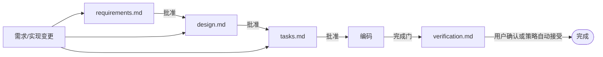
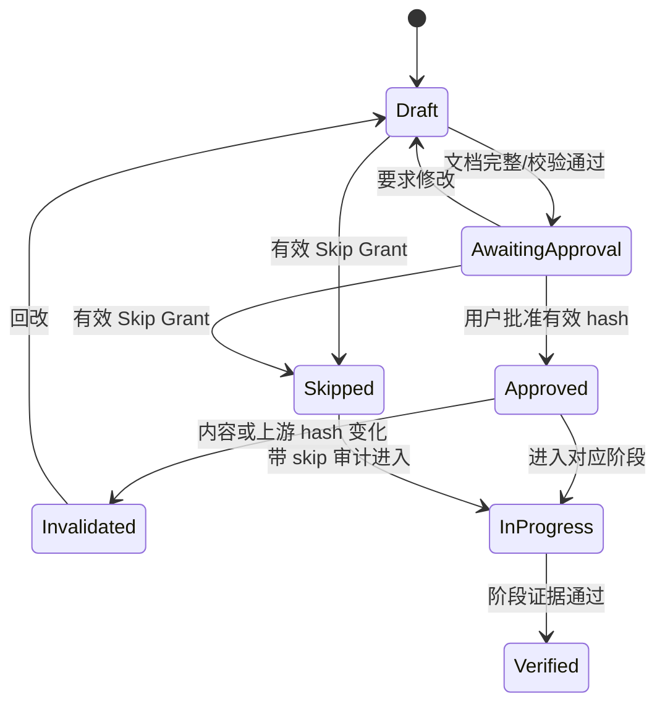
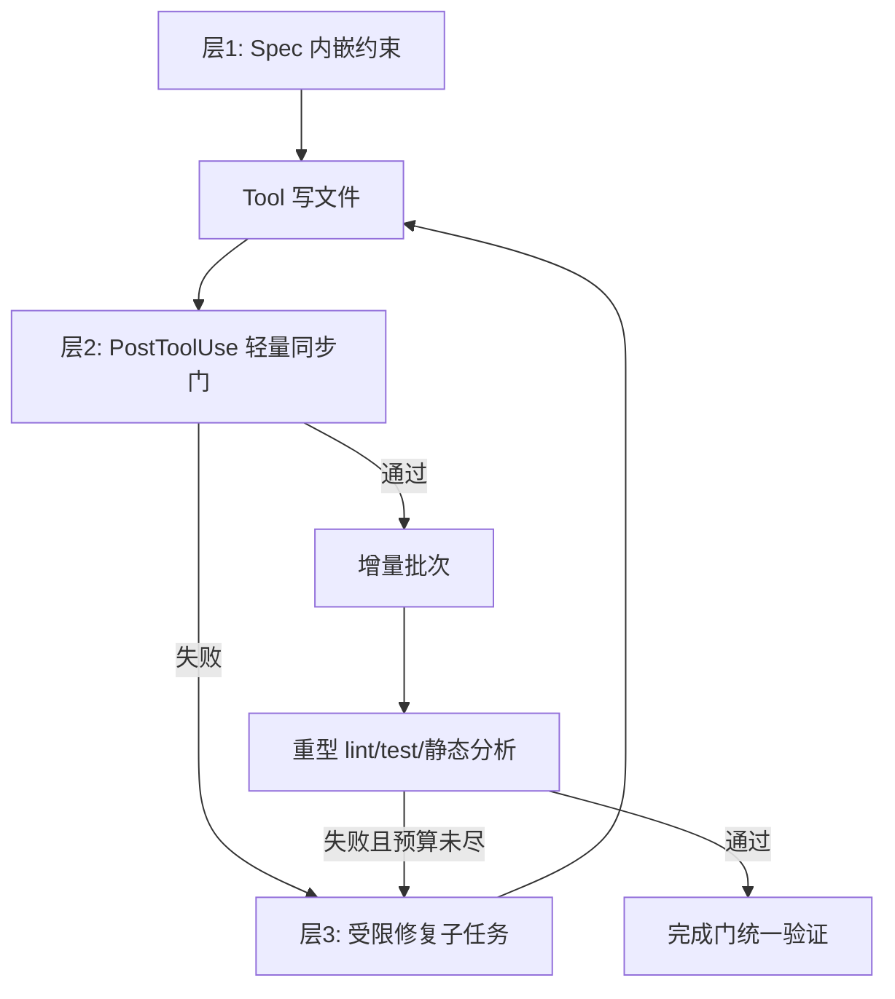

# Apex Spec、编码规则与验证流水线

## 1. 流水线不变量



- 没有有效审批或有效 Skip Grant，Coding Gate 必须拒绝写代码。
- 任何需求/设计/任务范围变化先回改对应 Spec，再传播下游失效。
- `verification.md` 是唯一要求额外生成的最终验证 Markdown；中间 lint/test/规则输出保存在 SQLite 状态和详细会话日志，不生成大量重复报告。
- Agent 不得把“用户未回复”解释为批准。

## 2. 文件与 frontmatter

```yaml
---
schema: apex.spec.v1
spec_id: 0198...
feature: permission-engine
stage: requirements        # requirements | design | tasks | verification
workspace_id: 0198...
generation: 7
content_hash: blake3:...
upstream_hashes: {}
status: awaiting_approval
updated_at: 2026-08-11T14:00:00+08:00
---
```

`content_hash` 计算时排除自身字段；`upstream_hashes` 绑定已批准上游版本。审批记录在 SQLite，Markdown 可展示审批摘要，但不是批准事实源，避免用户复制文件伪造审批。

## 3. 四份文档最低结构

### 3.1 `requirements.md`

- 背景、目标、用户场景。
- In Scope / Out of Scope。
- 术语、业务规则、不变量。
- Given-When-Then 验收标准和 NFR。
- 确定性问题、风险及用户确认结果。
- 与全局 `RQ`/`AC` 的追踪。

### 3.2 `design.md`

- 系统边界、依赖方向、数据流。
- 架构图、核心流程图、多方交互时序图。
- 数据模型/状态机/异常恢复图（适用时）。
- Trait/API 影响、兼容与迁移。
- 决策对比、风险、验证策略。

### 3.3 `tasks.md`

- 任务 ID、精确描述、依赖、验收标准。
- `write_paths`、read scope、是否高风险、是否幂等。
- 可选 Agent Profile/Provider/模型覆盖。
- 预期 Tool、规则包、测试层级、汇聚方式和补偿动作。
- DAG 阶段、并行任务和汇聚边；编译语义见 [11](11-agent-dag-snapshot-replay.md)。

### 3.4 `verification.md`

- 被验证的 requirements/design/tasks 内容哈希。
- 每项 AC 的命令、环境、结果、证据引用。
- 编译/lint/test/静态分析/覆盖率/E2E/NFR 结果。
- Spec 漂移、权限审计、Snapshot/恢复和风险清单复核。
- 未解决项、豁免与理由。
- 用户确认或自动接受策略、操作者、时间和 trace。

## 4. 阶段与审批状态机



默认逐阶段审批：requirements 批准后才能设计，design 批准后才能拆任务，tasks 批准后才能编码。项目策略 `approval_mode=bundle` 可在三份文档全部完成后整体批准；bundle approval 绑定三个 hash，任何一个变化均整体失效。

## 5. 变更与失效传播

| 变化 | 立即失效 | 下一个安全点动作 |
|---|---|---|
| Requirements 内容变化 | Requirements 及 Design/Tasks/Coding/Verification | 暂停写入，回改下游并重新审批 |
| Design 内容变化 | Design 及 Tasks/Coding/Verification | 暂停受影响任务，重算 DAG/claims |
| Tasks 内容或 `write_paths` 变化 | Tasks 及 Coding/Verification | 暂停节点，释放/重取 Claim 后审批 |
| 实现偏离已批准行为 | Coding/Verification | 先更新 Spec，不允许仅修改测试迎合实现 |
| Verification 证据过期 | Verification | 重新运行受影响验证 |

文件 watcher 检测变化后立即追加 `spec.changed`/`approval.invalidated`，正在运行的不可中断 Tool 可完成当前原子副作用，但下一 Tool/Provider/DAG 节点边界前必须暂停。高风险写前再次校验 Spec hash，缩小失效竞态窗口。

## 6. `/skip-spec`

支持：

```text
/skip-spec --scope run --stages requirements,design --reason "hotfix triage"
/skip-spec --scope session --stages all --reason "exploratory read-only investigation"
```

`scope` 仅为 `run|session`；不提供 Project/User 永久跳过。`stages` 可以是一个/多个阶段或 `all`。审计记录必须包含：

```text
skip_grant_id, session_id, run_id?, stages, scope,
reason, operator, granted_at, expires_at/termination_condition,
linked_requirement_ids[], current_spec_hashes{}, trace_id,
permission_mode, project_id
```

Skip 只绕过指定 Spec Gate，不绕过 Project Trust、Permission、Checkpoint、Write Claim、硬安全禁令和最终日志。若跳过 Verification，Run 不能显示为“已验证”，只能显示“完成（未验证，已审计跳过）”。

## 7. 三层编码规范强制



### 7.1 Spec 内嵌约束

`design.md`/`tasks.md` 引用规则 profile、禁止 API、覆盖率目标、架构依赖、命名和安全不变量。规则 profile 有版本 hash，确保验证使用与批准时相同的规则语义。

### 7.2 PostToolUse

每次文件修改后同步执行：

- 路径仍在 `write_paths` 和 Permission 范围内。
- 文件大小、编码、Secret scan、危险二进制/符号链接检查。
- Rustfmt/语言 formatter 的 check、基础语法解析、快速 lint/security rule。
- Spec/Schema/生成文件漂移检查。

轻量门必须快速、可取消并有严格超时；失败阻止下一次 Provider 调用，诊断作为 barrier 注入，而不是让 UI 直接操作磁盘或语言服务器。

### 7.3 增量修复子任务

- 默认最多 2 轮，项目可配置 1–5。
- Repair Task 必须引用失败 rule/AC，写路径是原任务路径子集，权限不高于父任务。
- 禁止通过删除测试、降低规则、扩大 skip、修改批准证据来“修复”。
- 超出轮数后状态转为 Blocked，由用户决定修改 Spec、人工修复或接受明确豁免。

## 8. 内置规则包

| 语言 | 轻量门 | 增量/完成门 |
|---|---|---|
| Rust | rustfmt check、语法、Secret/unsafe/unwrap 快速规则 | cargo check/clippy/test、audit/deny、覆盖率、Miri/属性测试（适用） |
| Go | gofmt、go vet 快速子集 | go test/race/vet/staticcheck、覆盖率 |
| Java | formatter、编译语法、危险 API | Maven/Gradle test、SpotBugs/PMD/Checkstyle、依赖与安全审计 |
| Python | formatter/parse、基础 Ruff | Ruff/mypy/pytest、依赖审计、覆盖率 |
| TS/JS | Prettier/ESLint 快速规则、类型语法 | tsc、ESLint、Vitest、依赖审计、覆盖率 |
| Vue | SFC parse、模板安全/格式 | vue-tsc、ESLint、Vitest/component/E2E、覆盖率 |

规则命令按项目探测并写入 `tasks.md`；不得下载/安装未批准工具作为隐式副作用。

## 9. 验证编排

完成门顺序：

1. 验证当前代码/文件树与 approved tasks hash 对齐。
2. 运行全部轻量规则和未完成增量批次。
3. 运行编译、lint、静态安全、单元/集成/属性测试。
4. 运行三端关键 E2E 与跨平台/Provider 契约测试的适用集合。
5. 采集覆盖率和 NFR 基准，检查阈值。
6. 验证 Checkpoint 恢复、日志完整性和必要 Snapshot/补偿证据。
7. 原子生成 `verification.md`，绑定所有输入 hash。
8. 默认等待用户确认；若项目策略允许自动完成，则策略版本、证据与 trace 必须写入接受记录。

覆盖率门：

- Permission、DAG Scheduler、Spec、Checkpoint/恢复：行与分支均 ≥ 90%。
- 其他 Rust：≥ 80%。
- Vue/TypeScript：≥ 80%。
- 创建/继续 Session、Spec 审批、权限询问、DAG 运行/暂停恢复、跨端同步是强制三端 E2E。

## 10. `verification.md` 样例骨架

```markdown
---
schema: apex.verification.v1
feature: permission-engine
requirements_hash: blake3:...
design_hash: blake3:...
tasks_hash: blake3:...
verified_at: 2026-08-11T18:00:00+08:00
trace_id: 4bf92f...
---

# Verification: permission-engine

## 结论
- 状态：待用户确认
- AC：18/18 通过
- 豁免：0

## 验收证据
| AC | 命令/场景 | 结果 | 证据引用 |
|---|---|---|---|
| AC-PERM-01 | `cargo test -p apex-permission` | PASS | session-log:... |

## 覆盖率与质量门
...

## 风险复核与未解决项
...

## 确认
等待用户确认。
```

报告只引用详细日志、测试 artifact 和 event id，不复制大段 stdout/stderr。

## 11. 异常路径

- 校验工具缺失：若 tasks 已批准使用该工具，先请求安装权限；否则 Blocked，不静默换工具降低标准。
- Flaky test：记录每次结果和环境，达到配置重试上限后失败；不得只保留成功一次。
- 外部 Spec 合并冲突：停止审批/编码，保存三方 artifact，人工解决后生成新 generation。
- 规则 profile 变化：视为 Design/Tasks 约束变化，使相关验证证据失效。
- 自动修复制造新错误：回到前一 Snapshot 或通过补偿恢复，再把失败轮次留在日志中。
