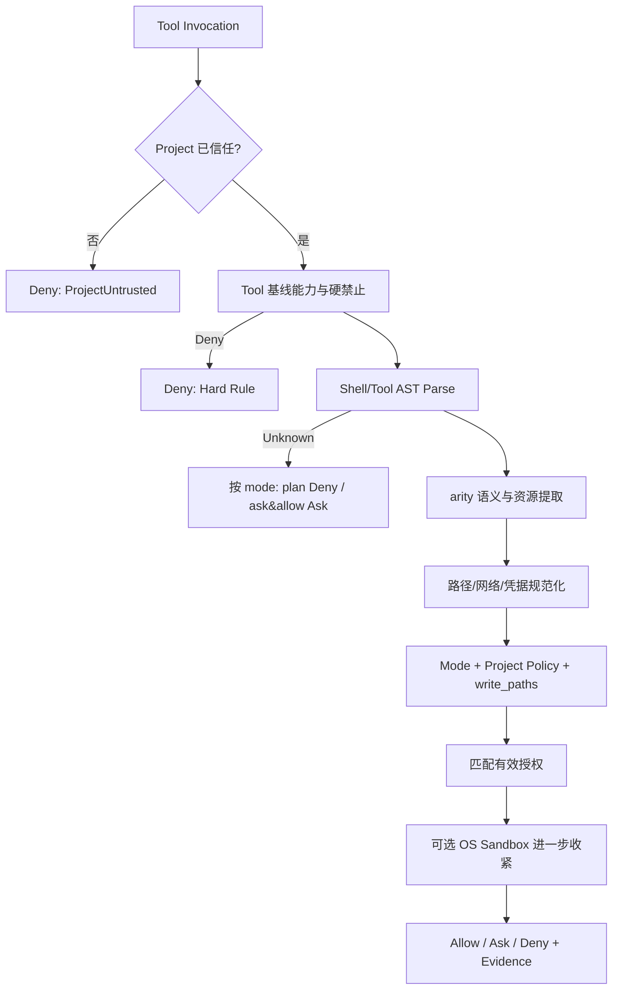
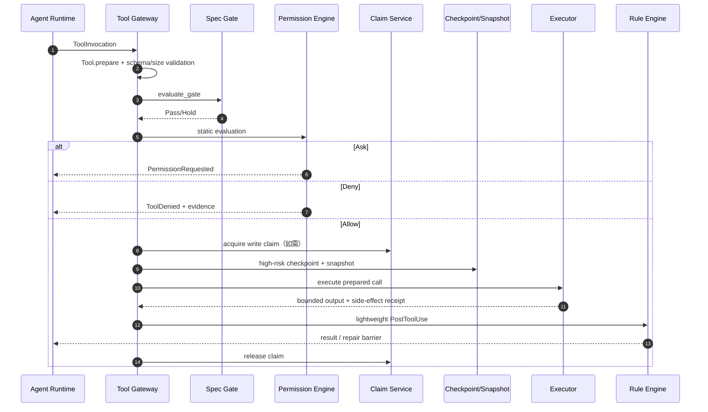

# Apex Tool Gateway、权限引擎与终端

## 1. 安全目标

所有 Agent 发起的文件、命令、网络、凭据、MCP 和 Plugin 副作用必须经过 Tool Gateway。权限结论只由静态代码、配置和已持久授权产生，整个判权依赖闭包中禁止 Provider/LLM crate。

因此单次权限判断为零 Token 消耗，且结果可在没有模型/网络的离线环境中确定性重放。

权限原则：

- 单调收紧：后层只能保持或收紧前层的 Deny/Hold，不能把硬拒绝改成允许。
- 未知即不自动执行：解析、路径、目标或副作用无法证明时保守处理。
- 批准最小化：批准 key 可在安全的 arity 规则范围内复用，拒绝精确到实际参数/资源。
- 执行时复核：准备时允许不代表执行时可绕过路径变化、DNS rebinding 或授权过期。
- 审计与执行同 trace：每个 verdict 可说明“哪条规则、哪个资源、哪个授权”导致结论。

## 2. 模式语义

| 模式 | 静态证明只读且无副作用 | 白名单内副作用 | 白名单外但可分析 | 解析/语义未知 | 硬禁止 |
|---|---|---|---|---|---|
| `plan` | Allow | Deny | Deny | Deny | Deny |
| `ask` | Allow | Allow | Ask | Ask | Deny |
| `allow` | Allow | Allow | Allow（静态策略允许） | Ask | Deny |

网络请求即使是 GET 也属于外部可观察副作用，`plan` 默认拒绝。编译器、格式化器和测试如果会写 cache/target，也不视为纯只读，必须使用已声明的受控输出路径或在 `ask/allow` 下运行。

## 3. 权限决策流水线



固定合并顺序：Project Trust → mode ceiling → Tool baseline → 平台硬禁止 → AST/语义 → Project policy → Task/write_paths → 已批准 grant → 可选 OS sandbox。任一 Deny 不可被后层覆盖。

## 4. Shell AST 与共同语义 IR

首版完整支持：

- POSIX：sh/bash/zsh，基于 tree-sitter Bash 语法并补充 dialect 差异。
- PowerShell 7：基于 tree-sitter PowerShell AST，识别 cmdlet、pipeline、script block、provider path。
- cmd.exe：基于 tree-sitter cmd grammar/受验证 parser，识别 `%VAR%`/delayed expansion、管道、重定向、`&&/||/&`、`call`。

不同 AST 归一为：

```text
CommandSemantics {
  programs[], operations[], path_accesses[], network_targets[],
  env_accesses[], credential_accesses[], process_effects[],
  redirections[], dynamic_fragments[], confidence
}
```

`operations` 使用稳定语义：`ReadFile`、`ListDir`、`CreateFile`、`ModifyFile`、`DeletePath`、`ExecuteProgram`、`SpawnShell`、`OpenNetwork`、`ReadCredential`、`WriteEnvironment`、`ManageProcess`、`PackageInstall` 等。

以下情况标记 Unknown/高风险，不做字符串猜测：动态 `eval`/`Invoke-Expression`、无法解析的命令替换、用户可控脚本块、解释器 `-c` 中未被相应语言 analyzer 支持的代码、间接 `call`、不透明二进制参数、无限 glob 或运行时生成的目标。

## 5. arity 语义规则

规则由内置签名与版本化数据表组成，不依赖模型：

```yaml
program: rm
match:
  dialects: [posix]
  operands: paths_after_options
effects:
  - operation: DeletePath
    resources: operands
guards:
  hard_deny_if: [root_path, apex_home, unresolved_glob]
```

典型规则：

| 程序 | 语义重点 |
|---|---|
| `rm`/`del`/`Remove-Item` | 解析选项后路径、递归、force、glob、设备/根路径 |
| `cp`/`mv`/`Copy-Item` | 源读、目标写/覆盖，区分多源最后一个目标 |
| `git` | 按 subcommand 区分只读、工作树写、网络、历史重写；hook 影响单独评估 |
| `cargo`/`go`/`mvn`/`npm` | source read、target/cache write、网络下载、build script 副作用 |
| `curl`/`wget`/`Invoke-WebRequest` | URL scheme/host/port、方法、上传、输出路径、代理 |
| `env`/PowerShell env provider | 读写环境变量；敏感名称分类 |
| `sh -c`/`pwsh -Command`/`cmd /c` | 递归解析嵌套 source；失败则 Unknown |

规则签名包括程序规范路径、subcommand、关键 options 和 operand arity。项目 grant 只能覆盖规则暴露的安全参数位，不能用 `program=git` 泛化所有 Git 操作。

## 6. 资源规范化

### 6.1 文件路径

1. 以 Workspace Root/明确 cwd 解析相对路径，拒绝空 cwd。
2. 对已存在部分解析 real path；对不存在目标找到最深已存在祖先，验证祖先 symlink 后拼接剩余组件。
3. 拒绝悬空/循环 symlink、设备路径、NT object path、未经策略允许的 UNC/network share。
4. macOS 默认和 Windows 使用文件系统等价 key（大小写折叠 + Unicode 规范化）；Linux 保持大小写但仍规范化 `.`/`..`。
5. 在执行前再次打开/验证目标；高风险文件使用目录句柄/`openat` 风格能力降低 TOCTOU。
6. 路径 Scope 支持文件、目录递归和受限 glob；Claim/Permission 使用同一规范化库。

硬禁止默认覆盖：文件系统根、用户 Home 广域递归删除、`~/.apex/config/providers.toml`、`~/.apex/keys/**`、daemon socket/pipe、其他 Project Root 和系统凭据目录。用户不能通过普通 grant 绕过硬禁止。

### 6.2 网络

Network key 为 scheme、规范化 host、port、method class、upload/download。执行前解析 DNS 并同时检查 hostname 和所有目标 IP，阻止 loopback/link-local/private/metadata 网段绕过（除非 Tool/MCP 的明确本地策略允许）；重定向每跳重新判权。

### 6.3 凭据与环境变量

变量名按 exact/前缀规则分类，如 `*_TOKEN`、`*_KEY`、`*_SECRET`、Provider 专属名。Agent 子进程默认不继承 Provider Key；确需 credential 的 Tool 使用短生命周期 capability 注入，不把明文写入命令行、日志或普通环境快照。

## 7. 授权模型

| Scope | 终止条件 |
|---|---|
| Once | 指定 `PermissionRequestId` 消费一次后失效 |
| Run | Run 结束/取消/重放分叉时失效 |
| Session | Session 归档或显式撤销时失效 |
| Project | Project trust 撤销、策略版本变化或显式撤销时失效 |

不提供用户级全局 grant。每条授权绑定规范资源 key、允许 operations、arity pattern、ProjectId、策略版本和批准人。再执行重放可以继承原授权边界，但新发现的资源、目标或扩大参数必须重新询问。

## 8. Tool Gateway 时序



Tool `prepare` 必须把声明输入转换为确定的资源计划；`execute` 不能自行扩大范围。实际副作用与计划不一致时立即终止、标记 Policy Violation，并保留 Snapshot/日志证据。

## 9. Tool 注册与输出

- Tool descriptor 包含 schema、版本、是否只读、可能副作用类别、资源提取器、幂等/补偿能力、输出预算和 SnipHinter。
- Tool Result 同时包含面向 Agent 的结构化结果、用户摘要、日志 metadata 和副作用 receipt。
- 大输出先写内容块/日志，Context 只注入摘要与引用；70% snip 时按 Tool 的 SnipHinter 保留首尾、错误和关键结构。
- 崩溃后遗留 `Running` Tool 变为 `Interrupted`；只有 receipt 能证明未执行或幂等时才自动重试，否则进入 `UnknownSideEffect`。

## 10. 终端模型

默认持久终端：Unix PTY、Windows ConPTY。项目/Agent Profile 可选择一次性非交互命令。

```text
LogicalTerminal
  ├── foreground channel（用户可见/交互）
  ├── agent channel <agent_execution_id, task_id, trace_id>
  └── system channel（resize/exit/diagnostic）
```

- UI 可把多个隔离 Agent 通道聚合成一个逻辑终端视图，但每帧保留 channel/agent/task/trace 和单调序号。
- Agent 向持久 shell 写入的命令先被解析和判权；不能通过逐字符写入绕过完整命令分析。
- 用户直接键入是显式人类操作，仍记录 attribution；若要求 Agent 自动确认/发送，则按 Agent Tool 处理。
- 输出采用有界 ring buffer + 磁盘日志引用，客户端慢消费不会阻塞子进程导致 daemon 内存无界增长。
- 取消时终止完整进程树，先 graceful signal，再在超时后强杀；MCP stdio 和 Tool 子进程共享平台进程树清理能力。

## 11. 可选 OS 沙箱

- macOS：sandbox profile/受支持系统机制；Windows：Job Object、restricted token/ACL；Linux：namespaces/seccomp/Landlock（按可用性）。
- 沙箱只进一步限制已允许的静态计划，不参与“允许”推断。
- 不支持或初始化失败时清晰显示 `sandbox=unavailable/degraded`；默认仍按静态策略工作，不虚假宣称 OS 隔离。
- 高安全 Project 可配置 `sandbox_required=true`，此时初始化失败直接阻塞。

## 12. 权限审计样例

```json
{
  "permission_request_id": "0198...",
  "trace_id": "4bf92f...",
  "mode": "ask",
  "tool": "shell",
  "dialect": "posix",
  "source_hash": "blake3:...",
  "operations": ["DeletePath"],
  "resources": [{"kind":"path","key":"workspace:src/generated/**"}],
  "verdict": "ask",
  "evidence": ["rule:rm.operands.v3", "no_matching_grant"],
  "requested_scope_options": ["once", "run", "session", "project"]
}
```

源命令默认只在全文调试日志或专门加密诊断导出中出现；常规事件/日志保存 hash 与脱敏摘要。

## 13. 必测边界

- Shell：嵌套 quote、命令替换、管道/重定向、换行、别名、PowerShell provider、cmd delayed expansion。
- 路径：不存在目标、symlink swap、junction、大小写冲突、Unicode 同形、长路径、UNC、glob 爆炸。
- 网络：DNS rebinding、IPv6、重定向、代理、userinfo、混淆 IP 表示。
- 授权：过期、策略变化、拒绝 key 粒度、并发消费 Once、重放继承不扩权。
- 终端：逐字节绕过、进程树泄漏、背压、断线重连、ConPTY/PTY resize。
