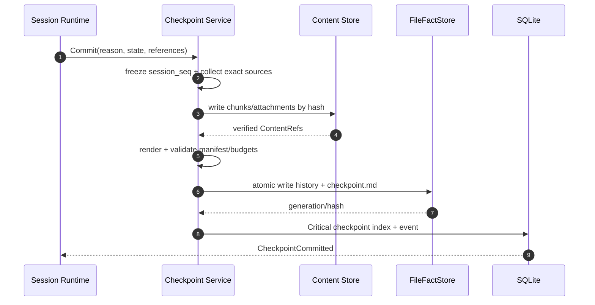
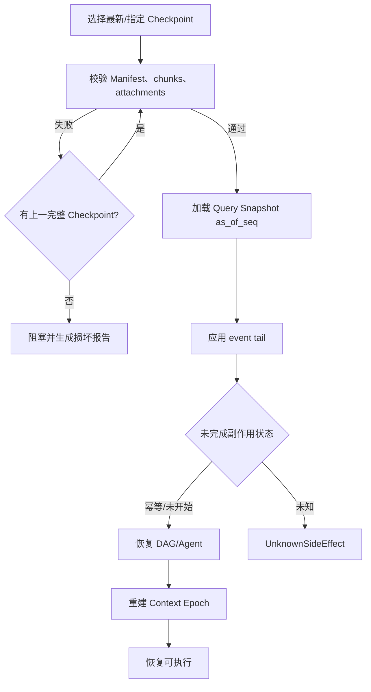

# Apex Context、Checkpoint 与 Memory

## 1. Checkpoint-first 策略

Context 管理目标不是“尽量压缩”，而是在任何有损操作前先建立可验证、可无损重建的 Checkpoint。Context Window 只是模型输入缓存，Checkpoint/事件/文件才是恢复事实。

强制 Checkpoint 触发：

1. 每个 Turn 成功结束。
2. snip、prune、LLM 摘要等任何有损处理前。
3. Session/DAG 暂停或 daemon 退出前。
4. 高风险文件/命令副作用执行前。

## 2. Context Source 与 Epoch

`ContextEpoch` 是一次 Provider 输入的可追溯构建结果：

| Source | 例子 | 更新语义 |
|---|---|---|
| Stable | system policy、已批准 Spec、Tool schema、Agent Profile | hash 变化时替换 Epoch |
| Turn | 用户输入、当前 AgentMessage、Tool Result | 追加，Turn 结束封口 |
| Retrieved | Memory、Skill、代码片段、MCP Resource | 带来源/时机/预算，可失效替换 |
| Recovery | Checkpoint、未完成 Tool/DAG、Snapshot diff | 恢复时优先，验证完整性 |
| Transient | 流式 reasoning/progress | 不作为下次 Epoch 的唯一来源 |

每个 Source 带 `source_id`、hash、token estimate、priority、loss_policy、valid_until 和引用。构建失败不消费 durable inbox 中的 Prompt。

## 3. 四档阈值

阈值按“预计下一请求 token / 当前模型有效 context limit”计算；limit 扣除最大输出和安全余量。

| 使用率 | 动作 | 是否有损 | 行为 |
|---:|---|---|---|
| 60% | Soft Hint | 否 | 提示优先完成/Checkpoint，减少低价值检索 |
| 70% | Snip | 是 | 先 Checkpoint，再按 Tool/Source 的 SnipHinter 裁短 |
| 80% | Prune | 是 | 先 Checkpoint，以引用占位替换可重取内容 |
| 90% | LLM Summary | 是 | 先 Checkpoint，生成结构化摘要替换旧 Epoch 部分 |

`context_watermarks` 持久化每个 Epoch 已跨越档位，跨越一次只触发一次；动作失败记录重试门，避免每个 token 重复触发 Checkpoint 风暴。使用率降回阈值下不自动“取消”历史动作，新 Epoch 重新计算。

## 4. Snip、Prune 与摘要

- Snip：由 Source/Tool 提供策略。例如测试输出保留失败段、首尾和统计；文件 diff 保留 hunk header；JSON 保留结构/错误字段。
- Prune：替换为 `ContextReference { content_ref, source, hash, retrieval_hint, original_tokens }`，需要时可重新打开，不用“内容已省略”空文本。
- Summary：输出固定 schema，包含用户原始意图引用、完成/未完成、约束、决策、证据、风险、下一步和被摘要引用列表。
- 摘要 Provider 可独立配置；未配置或不可用时回退当前 Provider/模型。若两者都不可用，停在 80% prune/阻塞，不绕过 Checkpoint 直接丢弃。

Provider/模型切换会建立新 Epoch。厂商专属 continuation/reasoning handle 只有在兼容模型中复用；否则转换为普通可见文本或舍弃 handle，并记录降级。

## 5. Checkpoint 文件布局

单根 Project：

```text
.apex/checkpoints/<session-id>/
├── checkpoint.md
├── history/<checkpoint-id>.md
├── objects/blake3/<prefix>/<hash>.md
└── attachments/blake3/<prefix>/<hash>
```

多根 Workspace 使用 `~/.apex/workspaces/<workspace-id>/checkpoints/<session-id>/`。`checkpoint.md` 是最新清单，history 保留每次 Manifest；对象按内容寻址且不可就地修改。

## 6. `checkpoint.md` 契约

```markdown
---
schema: apex.checkpoint.v1
checkpoint_id: 0198...
session_id: 0198...
run_id: 0198...
turn_id: 0198...
created_at: 2026-08-11T15:00:00+08:00
reason: turn_completed
session_seq: 842
context_epoch: 19
manifest_hash: blake3:...
previous_checkpoint: 0198...
pinned: false
---

# Active Intent
> 用户原始输入的逐字引用；正文过长时引用 content block，不由摘要改写。

# Current State
- Session: Running
- Spec stage: Coding (approved hash: `blake3:...`)
- Active DAG/Agent/Tool: 见结构化引用。

# Completed and Pending
- completed: `checkpoint-object:blake3:...`
- pending: `checkpoint-object:blake3:...`

# Constraints and Decisions
- spec: `fact:specs/permission/design.md@generation-7`
- permissions: `event-range:801..817`
- write claims: `checkpoint-object:blake3:...`

# Conversation and Tool Evidence
- messages: `checkpoint-object:blake3:...`
- tool-results: `checkpoint-object:blake3:...`
- terminal-tail: `checkpoint-object:blake3:...`

# Attachments
- image: `attachment:blake3:...` (`image/png`, 1920x1080)

# Reconstruction Plan
1. 校验 Manifest 和所有内容哈希。
2. 加载 Session Snapshot as_of_seq=842。
3. 应用 event tail、DAG/Tool recovery decision。
4. 构建新的 Context Epoch。
```

章节有独立字节/条目预算。达到 `warn` 提示；达到 `error` 时必须 `extract-required`，把正文拆为内容块，不能继续把清单压成不可恢复摘要。

## 7. Checkpoint 提交流程



只有 SQLite critical commit 成功后，Runtime 才把 Checkpoint 视为新的恢复头。文件已写而 DB 失败时由 reconciliation 补齐；块缺失或 hash 错误时该 Checkpoint 无效并回退到上一完整 Checkpoint。

## 8. 无损恢复



恢复产物必须能回答：用户原始意图、批准 Spec、当前任务/路径、已完成/未完成、Tool 结果、权限、附件、最后权威 seq 和未知副作用。缺一项不能宣称“无损”。

## 9. Checkpoint 保留

- Session 活跃期：全部保留。
- 最后活动 120 天：随 Session 进入归档，仍可完整恢复。
- 365 天：随 Session 归档删除；未被其他对象引用的块进入 GC。
- Pinned：永久作为 GC root，直到用户取消 pin；即使 Session 归档删除也保留必要 Manifest/块。
- 删除和 pin/unpin 都记录 event/trace，但不会修改旧 Manifest。

## 10. Memory 作用域与文件格式

位置：

- Project：`<root>/.apex/memory/*.md`。
- Global：`~/.apex/memory/*.md`。

```markdown
---
schema: apex.memory.v1
memory_id: 0198...
scope: project
project_id: 0198...
title: Permission tests use golden AST fixtures
tags: [permission, testing]
source:
  kind: session
  session_id: 0198...
  event_ids: [0198...]
reason: Reusable project convention discovered during verification
created_by: agent
created_at: 2026-08-11T16:00:00+08:00
content_hash: blake3:...
---

权限语义测试必须覆盖 AST golden fixture、属性测试和跨平台路径等价性。
```

Agent 自动写入前必须生成 `MemoryWriteProposal`，包含正文、来源、理由、作用域和敏感检测结果。用户手工写入仍经 watcher 索引与敏感提示，但不被静默删除。

## 11. 敏感内容保护

默认静态检测：Provider Key/token 格式、高熵字符串、私钥头、凭据文件路径、常见密码字段、连接串和用户配置的 pattern。命中时：

1. 阻止自动提交。
2. UI 展示已脱敏类别、来源和风险，不回显完整 Secret。
3. 用户只能对本次 proposal 逐次确认；不能创建“永远允许敏感 Memory”的 grant。
4. 即便确认，Provider Key 和 Apex 日志私钥仍属于硬禁止，不能写 Memory。

## 12. FTS5 与召回

- `memory_index` 保存文件路径、scope、hash、时间、tags、语言、删除状态。
- `memory_fts` 索引 title/body/tags，内容从 Markdown 派生，文件仍是事实源。
- tokenizer 可按 Project 配置 `unicode61` 或 `jieba-rs`；中文默认 jieba，混合文本保留 Unicode token fallback。
- 排序综合 BM25、scope（当前 Project > 当前 Workspace 其他 root > Global）、recency、显式 pin/tag 和重复抑制。
- 自动召回只取预算内 top-k，写入 `memory.recalled`：query hash、MemoryId、分数、注入 Turn/时机、引用片段 hash 和 trace。

## 13. UI、删除与导出

- 三端显示某条 Memory 在哪个 Turn、Provider 请求前的哪个 Context Epoch 被引用，以及为何命中。
- 删除先原子删除/移动 Markdown，再更新索引和 FTS，产生 tombstone event；外部重新创建同 ID 必须作为冲突处理。
- 导出可选择 Project/Global、时间、tag，生成包含原 Markdown 与 manifest/hash 的文件包。
- 多根 Workspace 的 Project Memory 不自动复制到中央 Workspace；召回时按 Root scope 联合查询。

## 14. 故障与降级

- FTS 索引损坏：从 Markdown 全量重建；重建期间提供文件名/tag 退化查询并明确状态。
- jieba 初始化失败：回退 unicode61 并记录 degraded，不能改变文件事实。
- 摘要 Provider 失败：回退当前模型；仍失败则停止摘要并请求用户/等待释放 Context。
- Checkpoint 文件冲突/损坏：回退上一完整版本并阻塞当前有损动作。
- 附件格式 Provider 不支持：保留原 Artifact，按 capability 转码/抽取或要求用户选择，不丢弃原件。
