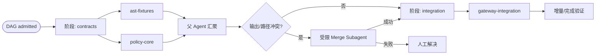
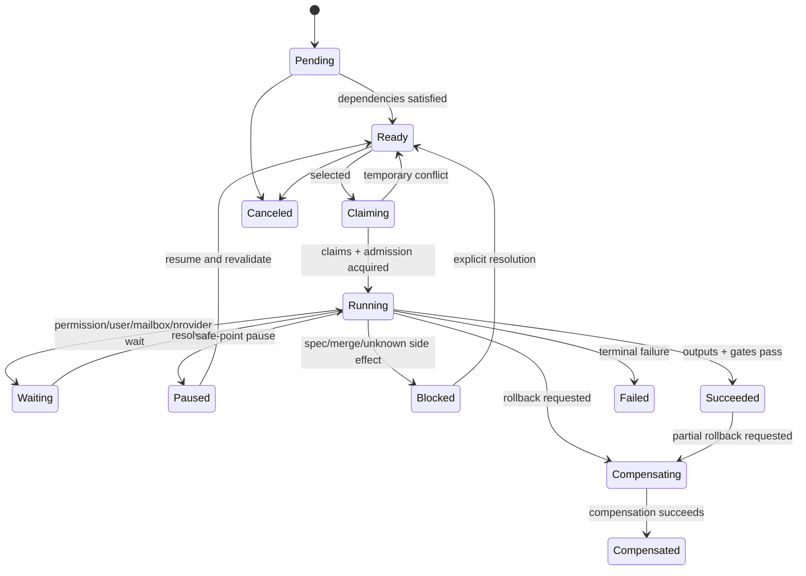
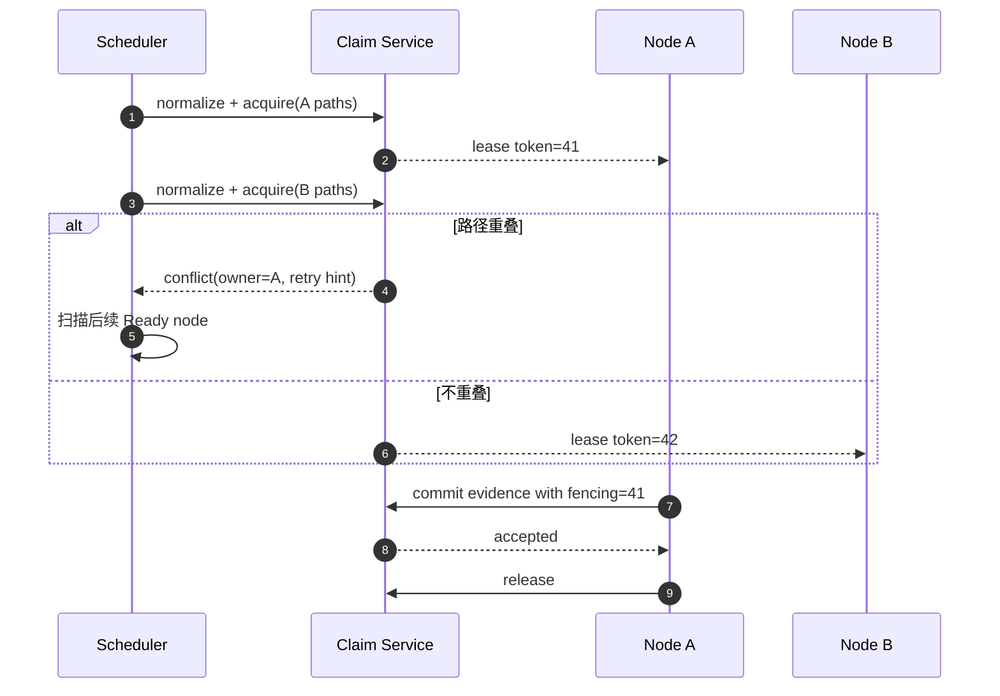
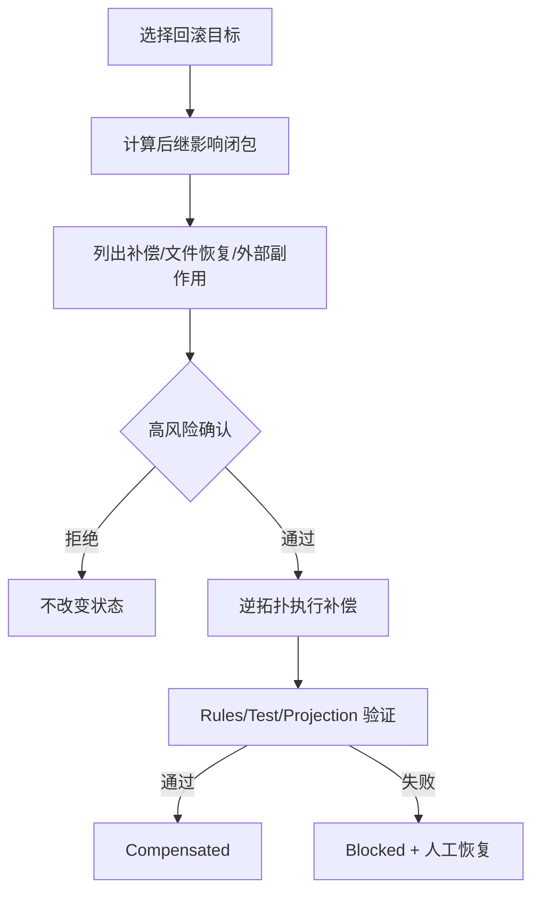

# Apex Agent、DAG、Snapshot 与重放

## 1. Agent 模型

Agent Execution 是一次有明确任务、父级、Provider Profile、权限上限和工作区范围的执行实例。父 Agent 可以创建只读或可写 Subagent；可写 Subagent 必须声明非空 `write_paths`。

```text
AgentExecutionSpec {
  task_id, exact_task_description,
  parent_agent_execution_id?, agent_profile,
  provider_profile_override?, model_override?,
  read_scope, write_paths[], permission_ceiling,
  expected_outputs[], completion_schema,
  timeout, idempotency_class
}
```

`exact_task_description` 原样出现在三个客户端的活动面板与会话日志摘要中。Subagent 不能把模糊“帮我处理一下”当作可调度任务。

## 2. DAG 来源与版本化 IR

DAG 仅来自：

1. 已批准 `tasks.md` 中的任务/依赖/路径声明。
2. `.apex/workflows/*.yaml`（单根）或多根 Workspace 中央 `workflows/*.yaml`。

不嵌入 QuickJS、Lua 或任意调度脚本。YAML 编译为不可变 `VersionedDagIr`，绑定 source hash、schema version、Spec approval、规则 profile 和编译器版本。

```yaml
schema: apex.workflow.v1
id: permission-engine
stages:
  - id: contracts
    nodes:
      - id: ast-fixtures
        task: T-03
        write_paths: ["crates/apex-command-ast/**"]
      - id: policy-core
        task: T-04
        write_paths: ["crates/apex-permission/**"]
    join:
      id: contract-review
      strategy: parent
  - id: integration
    depends_on: [contracts.contract-review]
    nodes:
      - id: gateway-integration
        task: T-05
        write_paths: ["crates/apex-tool-gateway/**"]
        provider_profile: deepseek-coder
```

未知字段按 Schema 策略保留；未知且影响执行语义的字段使编译失败，不允许旧 daemon 忽略后继续写。

## 3. DAG 执行结构



Node 成功必须产生结构化 `NodeCompletion`：完成摘要、输出 artifacts、变更路径、测试证据、未解决风险、child results 和 side-effect receipt。自由文本结论不能单独驱动下游状态。

## 4. 调度与限流

默认限额：

- 全局活跃 Agent：`min(8, logical_cpu_count)`。
- 全局可写 Agent：4。
- 单 Provider 并发：4。
- 用户可配置硬上限，但不得超过 `min(32, 2 × logical_cpu_count)`。

还可叠加 Project、Workspace、Agent Profile、终端、MCP Server 和内存压力限额；最小值生效。

Ready Queue 按 priority、ready time、Task ID 稳定排序，但采用“公平扫描”避免队首阻塞：首项因路径 Claim/Provider 限流暂不可运行时，可以启动后续不冲突节点；等待时间形成 aging boost，防止长期饥饿。每次调度决定记录 ready set hash、limiter snapshot、被跳过原因和获选节点，支持状态重放与问题诊断。

## 5. Node 状态机



状态名称以 [04](04-domain-model.md) 为准。本图只说明合法转换。

## 6. `write_paths` 与 Claim

Claim 复用 Permission 的规范路径语义：最深已存在祖先、symlink/junction、大小写折叠、Unicode、设备/UNC 和不存在目标都在获取前处理。

冲突规则：

- 同一路径、父子递归 Scope、等价大小写 key 冲突。
- 读 Scope 默认不互斥；Tool 声明需要一致读取时可获取 Read Snapshot 而非长读锁。
- 父 Agent 在创建可写子任务时预留子 `write_paths`，父自身不得同时写重叠范围。
- 嵌套 Subagent 请求若超出父预留范围立即 fail-fast，不进入无限等待。
- 租约有 owner、fencing token、TTL 和续租；过期 owner 的旧 fencing token 不能提交 Tool result。



## 7. 扩展写路径

Agent 发现需要额外路径时不能临时申请“更宽 grant”继续：

1. 到达安全点并暂停 Node。
2. 提交 `PathExpansionProposal`：原因、新路径、受影响 AC/任务/依赖和风险。
3. 修改 `tasks.md` 或 Workflow，触发 Tasks 审批失效。
4. 用户重新批准。
5. 编译新 `VersionedDagIr`，校验已完成节点是否仍有效。
6. 释放旧 Claim，按新路径重新获取后恢复。

## 8. 共享工作区与 worktree

默认共享用户当前工作区，使变更即时可见。满足以下任一条件可在 Task/策略中选择 worktree：高风险大范围重构、相互可能改同一逻辑文件但需探索、第三方工具不可限制写入、用户明确要求隔离。

worktree 仍受 Permission/Claim/Spec Gate；它只是文件隔离，不是安全沙箱。汇聚前计算基线、worktree 和当前主工作区三方 diff，不自动 commit 或改写用户分支。

## 9. Subagent 通信与汇聚

- 默认：Subagent 只向父级提交 `NodeCompletion`，父级决定上下文注入和下游输出。
- 只有 DAG 显式 `communication_edges` 才创建持久 mailbox；消息有 schema、seq、sender/receiver、trace、预算和 attachment refs。
- 未声明边的跨 Agent 发送被拒绝并审计，避免隐式耦合和非确定调度。
- Mailbox 消息先持久化再通知；重放按 seq 复用，不重复发送外部副作用。

汇聚冲突处理：

1. 无重叠 diff：父级确定性组合。
2. 文本可三方合并：受限 Merge Subagent 只获得冲突文件和必要上下文，`write_paths` 仅冲突路径。
3. Merge Subagent 通过 Rules/Test 后提交结果。
4. 失败：保留 base/ours/theirs artifact，Node/DAG `Blocked::MergeConflict`，等待人工处理。

## 10. 崩溃恢复

启动恢复对每个遗留 Node/Tool 分类：

| 证据 | 恢复动作 |
|---|---|
| 未开始副作用 | 回到 Ready |
| Tool 明确幂等，idempotency key/receipt 可复用 | 自动继续/查询原结果 |
| Tool 成功事件已提交 | 复用结果，推进后续 reducer |
| 进程被中断但无外部副作用证据 | 标记 Interrupted，按策略重试 |
| 是否执行未知、外部副作用不幂等 | `Blocked::UnknownSideEffect` |
| Claim owner 消失 | 过 TTL 回收，fencing token 作废 |

Provider 调用可根据厂商 idempotency/response id 查询或重试；不能证明时允许重新请求，但新响应属于新 attempt 并保留分叉证据。

## 11. 内容寻址 Snapshot

Snapshot 捕获 `write_paths` 在 Tool/Node 前的纯文件状态：

```json
{
  "schema": "apex.snapshot.v1",
  "snapshot_id": "0198...",
  "workspace_id": "0198...",
  "base_generation": 22,
  "paths": [
    {"path":"src/lib.rs","kind":"file","mode":420,"content":"blake3:..."},
    {"path":"src/link","kind":"symlink","target":"../shared"},
    {"path":"new.txt","kind":"absent"}
  ],
  "manifest_hash": "blake3:..."
}
```

- 文件块进入 CAS，重复内容去重；Manifest 不可修改。
- 保存相对路径、文件类型、内容 hash、权限位/Windows 属性中可移植子集、symlink target 与 absent marker。
- 不创建 Git commit/branch/index，不要求 clean worktree。
- 捕获时若路径在扫描期间变化，重试有限次数后阻塞；不能生成混合时间点 Snapshot。
- 恢复前先捕获当前状态为安全 Snapshot；当前状态偏离预期 post-state 时三方比较，避免覆盖用户后续修改。

## 12. 两种重放

### 12.1 确定性状态重放

目标是重建状态，不重新做工作：

- 从 Checkpoint/Snapshot 加载基线，按 Durable Event 顺序运行 Reducer。
- Provider 结果、Tool 结果、权限决定、调度选择、Mailbox 消息和 Snapshot 引用全部复用。
- 不发网络、不执行 Shell、不启动 MCP/Plugin、不写项目文件（除显式恢复 Snapshot 的受控步骤）。
- 结果必须达到相同已记录 projection hash；不一致视为 Reducer/Schema 缺陷。

### 12.2 再执行重放

目标是基于原计划重新运行，结果仅“尽力复现”：

1. 创建新 Run/trace，不篡改原历史。
2. 解析原 Tool/Provider/MCP/文件副作用，生成可读清单和风险等级。
3. 继承原权限上限和 grant；任何新资源/扩权另行询问。
4. 用户对整体高风险副作用清单做一次启动确认；各硬禁止和运行时新风险仍可再次阻塞。
5. 重新调用 LLM/Tool，记录模型/版本/config/seed（若支持），不承诺逐字输出一致。
6. 对比原 Run 的 artifacts、tests、events 和 final state，生成 Replay Report。

## 13. 暂停、恢复与部分回滚

- Pause Request 将 Session/DAG 置 `Pausing`，停止提升新 inbox/Ready Node；活跃任务在最近安全点 Checkpoint 后进入 Paused。
- Resume 重新校验 Project Trust、Spec hash、grant、Claim、Provider capability 和文件 generation；不能直接复用过期前提。
- 部分回滚是补偿：选择目标 Node/Tool，计算受影响后继闭包，按逆依赖顺序调用声明的 compensation 或恢复 Snapshot。
- 历史 `Succeeded` 事件不删除；追加 `compensation.applied`，投影显示已补偿。
- 没有补偿器且恢复会覆盖未知用户变更时转人工，不假装可逆。



## 14. 验证重点

- 随机 DAG 的拓扑、限流、公平性、暂停恢复与 crash injection 属性测试。
- Claim 的路径等价、TTL/fencing、父子预留、队首绕行与饥饿测试。
- Snapshot 在三平台的内容/权限/symlink/不存在路径捕获恢复测试。
- 状态重放 projection hash 一致性；再执行重放不得复用原 event id。
- 未知副作用、合并失败和补偿失败必须稳定进入 Blocked，不能自动标成功。
