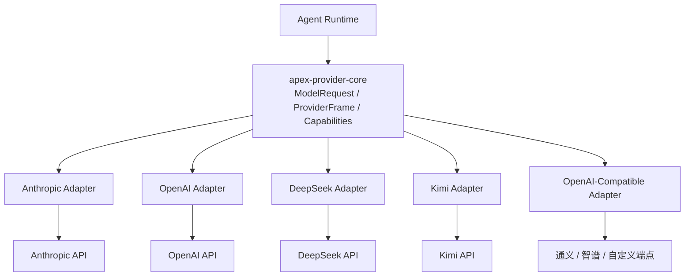
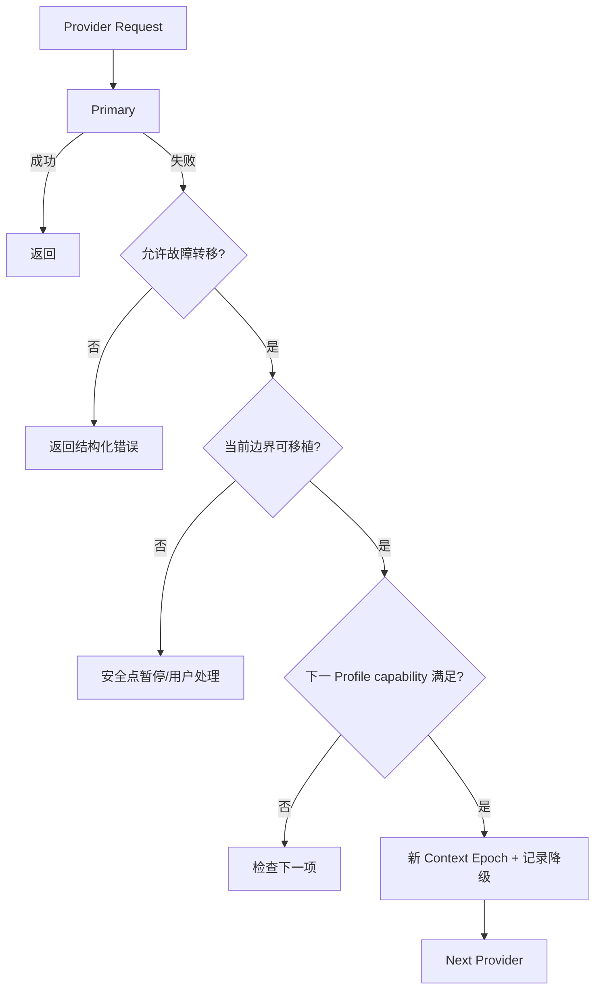
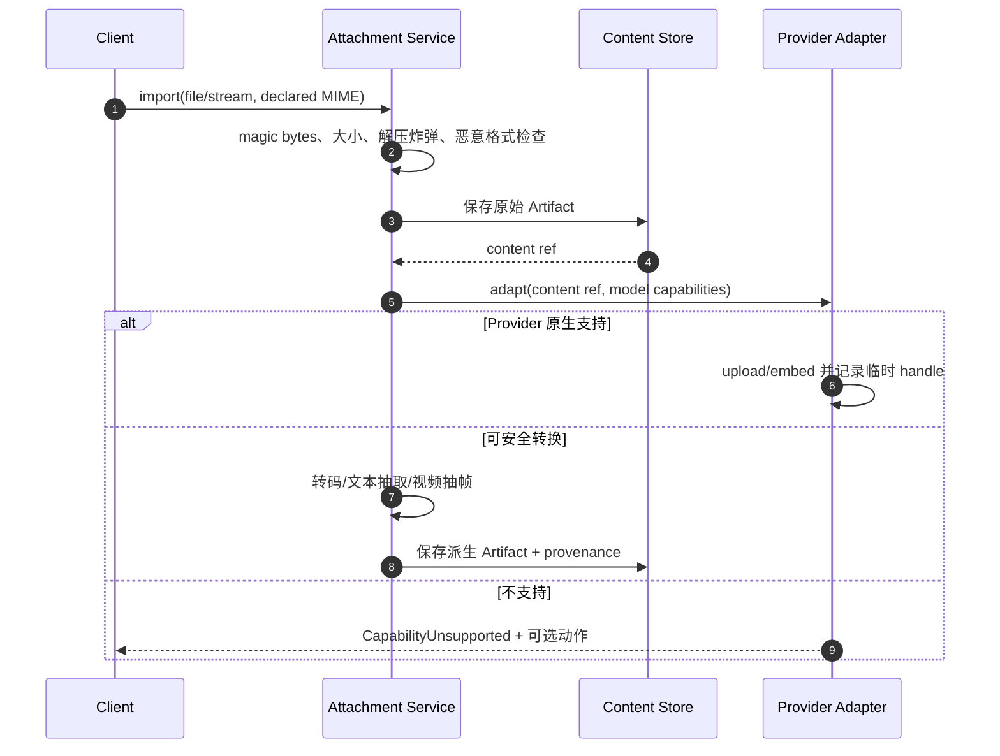

# Apex Provider 与多模态设计

## 1. 设计目标

Provider 层统一 Agent Runtime 需要的最小语义，同时保留厂商专属能力。禁止用“所有接口都长得像 OpenAI”换取表面统一，从而丢失 reasoning、cache、Realtime、文件 API 或 continuation 优化。



## 2. 统一核心模型

核心类型：

- `ModelRequest`：system/source refs、规范化 messages、Tool descriptors、attachments、sampling、output limits、trace context。
- `ProviderFrame`：text delta、reasoning delta/summary、Tool call delta、audio frame、usage、provider metadata、completed/error。
- `ModelCapabilities`：input/output modality、Tool、parallel Tool、reasoning、structured output、context limit、stream、realtime、file API、cache、seed 等。
- `ProviderError`：authentication、rate limit、quota、timeout、transport、invalid request、content policy、capability、server、canceled。
- `ProviderExtension`：按 adapter 命名空间保存可选配置/metadata，不进入通用领域分支。

Agent Runtime 只按 capability 决策，不按 provider name 写 `if/else`。专属 Adapter 负责统一模型与厂商 DTO 的双向转换。

## 3. Adapter 边界

| crate | 首版专属优化通道 |
|---|---|
| `apex-provider-anthropic` | content blocks、Tool use/result、prompt cache、thinking/reasoning、流事件 |
| `apex-provider-openai` | Responses、structured output、Tool、reasoning、file/image/audio、Realtime |
| `apex-provider-deepseek` | reasoning content、Tool/stream、模型限制与错误映射 |
| `apex-provider-kimi` | 长上下文、文件/多模态/推理能力与模型差异 |
| `apex-provider-openai-compatible` | 可配置 base URL、headers、model/capability override、标准 chat/tool 流 |

通义、智谱和其他兼容端点首版通过 Compatible Adapter；未来新增专属 crate 时保持相同 `Provider` Trait 和 Profile ID 迁移，不要求 Agent Runtime 改写。

## 4. Provider 配置与 Key

`~/.apex/config/providers.toml`：

```toml
version = 1

[[profiles]]
id = "openai-main"
adapter = "openai"
api_key = "<user-provided-key>"
default_model = "<model-id>"
enabled = true

[[profiles]]
id = "qwen-compatible"
adapter = "openai-compatible"
base_url = "https://example.invalid/v1"
api_key = "<user-provided-key>"
default_model = "<model-id>"
capability_overrides = ["text", "tools", "stream"]
```

- Unix 文件模式必须为 0600、父目录 0700；Windows ACL 只允许当前用户。权限过宽时 daemon 默认不加载 Key，并指导修复。
- Key 明文只在配置解析器/`SecretResolver`/Adapter 请求构建的最短生命周期内存在；使用 zeroize-capable 容器并禁止 Debug/Serialize。
- Key 不写 SQLite、日志、领域事件、Spec、Checkpoint、Memory、Snapshot、诊断包或子进程环境。
- 配置 watcher 支持用户编辑；新 Key 生效前做权限/格式检查，日志只记录 profile id 与 key fingerprint 的不可逆短 hash。

## 5. Secret Firewall

所有通用出口在 sink 前检测 Secret：日志、事件 payload、Markdown writer、Memory、Checkpoint、Tool output、panic/error chain、诊断包。Adapter 错误先结构化映射，再丢弃可能回显 authorization header/request body 的 raw error。

Provider 请求的完整 body 默认不记录；Debug 只记录 schema、长度、token、内容 hash、脱敏统计和厂商 request id。即使会话启用全文日志，Key/authorization/cookie/private key 仍为硬脱敏。

## 6. 路由、继承与覆盖

解析优先级：

1. DAG Node 显式 Provider/模型。
2. Agent Profile 显式 Provider/模型。
3. 父 Agent 当前 Provider/模型（Subagent 默认继承）。
4. Session 默认。
5. Project/全局默认。

覆盖前检查任务所需 capability；不满足则在启动前阻塞并显示缺失项，不在执行中静默降低质量。Provider/模型选择、capability snapshot 和配置 hash 写入 Run/Agent 事件，但不含 Key。

## 7. 故障转移

默认 `failover.enabled=false`，Provider 失败不会自动切换。用户可配置有序链：

```toml
[[failover_chains]]
id = "coding"
profiles = ["anthropic-main", "openai-main", "deepseek-main"]
retryable_errors = ["timeout", "transport", "rate_limit", "server"]
max_switches = 2
```

切换条件：

- 只处理链中允许且被分类为 retryable 的错误；authentication、content policy、invalid request、用户取消不切换。
- 新 Provider 必须满足当前请求 capability、数据政策和 modality。
- Tool call 已部分执行、Realtime session、厂商文件句柄或 continuation 无法移植时，必须到安全点/阻塞，不能直接切换。
- 切换建立新 Context Epoch；厂商专属 reasoning/cache/continuation metadata 不兼容时降级并记录。
- 每次尝试、延迟、切换理由和最终选择可审计；防止多 Provider 重试风暴。



## 8. 重试、限流与取消

- Adapter 解析 `Retry-After`/厂商 rate limit header；指数退避带抖动，受 Run deadline 和单 Provider concurrency limiter 控制。
- 只重试幂等/未开始响应请求；流已产生可见内容时重试创建新 attempt，并由 Agent Runtime 决定是否保留部分输出。
- 客户端/Run 取消必须传播到 HTTP stream、Realtime session 和上传；取消完成有超时与连接回收。
- 单 Provider 默认并发 4，与 DAG 全局限流取最小值；实时语音连接单独计配额但仍受 Profile limit。

## 9. 多模态能力

Apex 不支持实时视频；视频能力仅限上传/引用视频文件并由 Provider 原生处理或受控抽帧。

| 模态 | 输入 | 输出/交互 | 客户端 |
|---|---|---|---|
| 文本 | 是 | 流式文本/结构化输出 | 三端 |
| Tool | JSON schema/tool result | Tool call delta/result | 三端 |
| 推理 | Provider 支持时 | 可见摘要/受限 reasoning frame | 三端 |
| 图片 | 文件/剪贴板/路径 | 文本分析或 Provider 图片输出（能力允许） | 三端输入，TUI 路径方式 |
| 文件 | 文本/二进制 Artifact | 引用/抽取/Provider file handle | 三端 |
| 音频文件 | 上传/录音 | 转写/音频输出 | Desktop/Web |
| 实时双向语音 | microphone stream | audio stream + transcript | Desktop/Web |
| 视频文件 | Artifact | 抽帧/原生视频输入（Provider 能力允许） | 三端引用，Desktop/Web 完整交互 |
| 实时视频 | 不支持 | 不支持 | 全部无入口 |

TUI 可以提交图片/视频文件路径，但不提供音频录制、播放和实时语音；收到音频输出时只显示“该内容需在 Desktop/Web 查看”的 Artifact，不自动播放。

## 10. Attachment 流程



原始 Artifact 永不因转码被覆盖；派生物记录 source hash、工具版本和参数。上传 Provider 的 file id/expiry 属于 Adapter metadata，不作为长期唯一附件引用。

## 11. 实时语音

- Desktop/Web 向 `apexd` 建立受认证的本地音频 stream，daemon 再连接支持 Realtime 的 Provider。
- 协商采样率、声道、codec、VAD/turn detection；不支持时返回明确能力错误或在用户同意后使用“录音文件→普通请求”降级。
- 音频帧是 Transient Event；最终 transcript、AgentMessage、usage 和 Artifact 引用才持久化。
- 断线时关闭 microphone capture 和远端 session，避免后台持续采集；UI 始终显示录音状态。

## 12. Provider 契约测试

每个 Adapter 必须通过：

- 文本、Tool、并行 Tool、structured output、usage 和 stop reason 映射。
- 流分片任意切割、UTF-8 边界、取消、超时、429/5xx、半关闭和异常 payload。
- capability 探测/配置与实际请求一致，不能宣称不支持的模态。
- Provider-native reasoning/continuation 在同模型复用、跨模型降级。
- Key/authorization 不进入 Debug、error、event、Checkpoint 或日志 fixture。
- 录制回放使用脱敏 fixture；少量 sandbox live tests 由用户/CI Secret 显式启用，不作为离线单测依赖。

## 13. 隐私与可审计性

- Apex 不自动遥测 Provider 使用；token/延迟/错误元数据仅本地保存。
- UI 在发送前显示目标 Profile、base URL 域名、将上传的 Artifact 与是否可能离开本机。
- 自定义 OpenAI-Compatible endpoint 默认视为外部不可信端点，必须显式启用；禁止把 localhost/内网地址当作无风险。
- 诊断包默认只包含 profile 配置结构和 endpoint hash/域名脱敏，不包含 Key、请求正文或附件。
