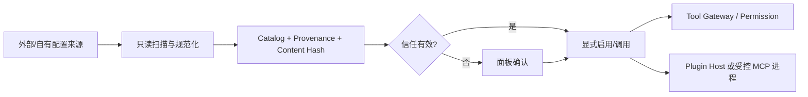
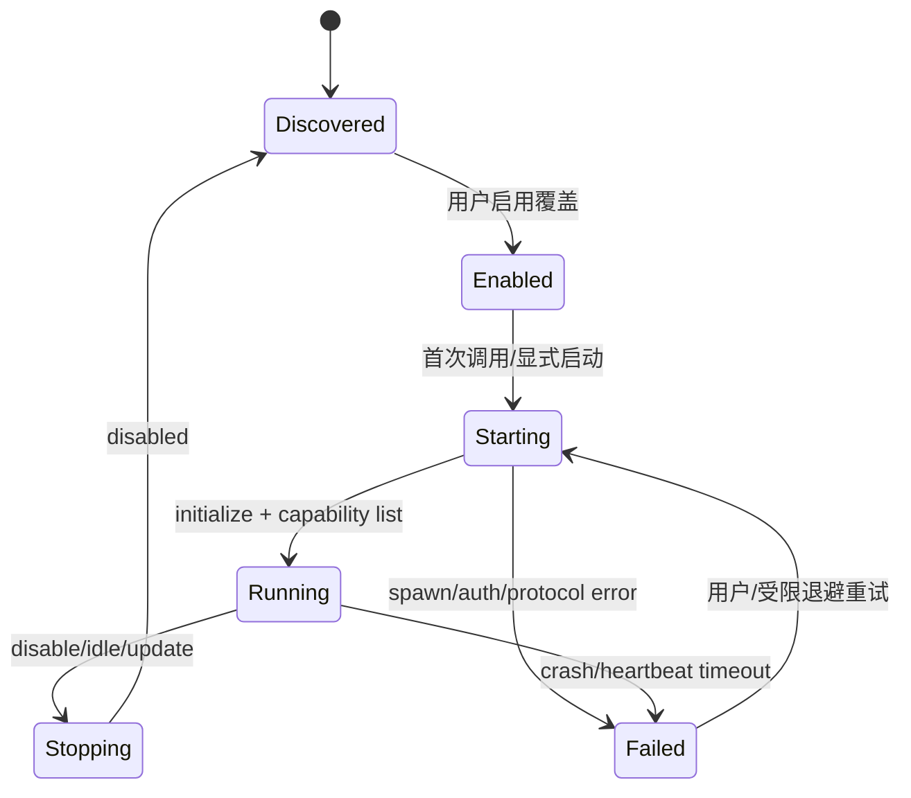

# Apex Skills、MCP 与 Plugin 扩展系统

## 1. 总体边界



发现、信任、启用和执行是四个独立状态。扫描外部配置不会启动服务、执行脚本、加载动态库或回写来源。

## 2. Skill 来源兼容

首版扫描器保证 Claude 与 Codex Skill 生态兼容，同时支持 Apex 自有目录：

| 来源 | 用户级 | Project 级 |
|---|---|---|
| Claude | `~/.claude/skills/` | `<root>/.claude/skills/` |
| Codex | `~/.codex/skills/` | `<root>/.codex/skills/` |
| Apex | `~/.apex/skills/` | `<root>/.apex/skills/` |

每个扫描器实现来源探测、`SKILL.md`/资源解析、frontmatter 兼容、symlink 安全和 provenance。未知 frontmatter 字段保留，不因 Apex 不理解而破坏外部文件。

同名 Skill 不静默覆盖：Catalog ID 为 `<source-kind>:<scope>:<canonical-name>@<content-hash-prefix>`。UI 可设置优先项；未设置且有歧义时要求显式选择。Project 来源优先只影响推荐，不自动获得信任。

## 3. Apex frontmatter 扩展

标准字段保持原生态语义，Apex 扩展集中在 `apex:` 命名空间：

```yaml
---
name: spec-driven-coding
description: Enforce a reviewable Spec workflow
apex:
  schema: v1
  pipeline_stages: [requirements, design, tasks, coding, verification]
  activation: automatic_or_explicit
  required_tools: [read, search]
  optional_mcp_servers: [context7]
  write_paths: ["specs/**"]
  permission_ceiling: ask
  supported_clients: [tui, desktop, web]
---
```

- `pipeline_stages` 将 Skill 绑定到阶段；不在当前阶段的自动激活被拒绝，但用户可在允许范围内显式调用。
- Skill 声明的 `write_paths`/Tool 只是请求上限，不能扩大 Tasks、Permission 或 Project Trust。
- 解析器验证路径、枚举和字段类型；无效扩展不影响外部工具读取标准字段，但 Apex 不激活该 Skill。

## 4. Skill 信任

信任记录绑定：source kind、canonical path、文件树内容 hash、可选签名/发布者、scope、批准人、时间和允许能力。默认状态为 Untrusted。

以下变化立即使信任失效：`SKILL.md`、引用资源、脚本、可执行文件、symlink target、签名或来源 commit 变化。只改 mtime 不失效；内容 hash 不变可保留。

Skill 指令是上下文，不是系统权限。Skill 中的 Shell/脚本/Hook 必须作为 Tool Invocation 经过 Spec Gate、Permission、Claim、Checkpoint 和日志；Skill 不能声明“自动批准”。

## 5. MCP 来源扫描

扫描 Adapter 首版覆盖：

- Claude Desktop：平台用户配置中的 `claude_desktop_config.json`。
- Claude Code：`~/.claude.json`、用户/Project `.mcp.json` 等受支持配置。
- Cursor：用户和 Project `.cursor/mcp.json`。
- VS Code：用户 settings 与 Project `.vscode/mcp.json`/受支持 MCP 配置。
- Codex：`~/.codex/config.toml` 及 Project 配置。
- Apex：`~/.apex/config/mcp.toml` 和 Project override。

路径细节由版本化 Source Adapter 管理并在 UI 展示；找不到文件是正常结果，不创建来源配置。

规范化实体包含 server name、transport（stdio/HTTP/SSE/Streamable HTTP）、command/args、cwd、env key 名（Secret 值不入索引）、URL、OAuth 配置、来源路径、JSON/TOML pointer 和 content hash。

同一服务从多个来源发现时以 fingerprint 聚合，但保留每个 provenance；冲突字段不自动合并，UI 要求选择具体来源/覆盖。

## 6. MCP 启用与来源回写

- 扫描结果初始为 Discovered/Disabled，不创建进程或网络连接。
- 面板“一键启用”只写 Apex enable override，随后按权限/信任启动；关闭写 disable override 并清理连接/进程树。
- 默认不修改 Claude/Cursor/VS Code/Codex 文件。
- 用户选择“同步回来源”时，显示精确 diff、备份原文件、使用 optimistic hash 原子写；来源已变化则三方合并/阻塞。
- Apex-owned `mcp.toml` 可直接编辑，但仍经 watcher 和 schema 校验。

## 7. MCP 生命周期与安全



- stdio server 使用清洗后的环境、受控 cwd、进程树/Job Object；命令启动先过 Permission。
- HTTP 目标按 Network Policy 判权，重定向和 DNS 每跳复核。
- OAuth 使用 state、PKCE、精确 loopback callback、短期 nonce；token 属于 Secret，不进入 DB/日志/Markdown。
- MCP Tool 调用仍经 Tool Gateway；服务声明的 schema 不代表副作用已可信。
- 活动事件包含 `mcp_server_id`、显示名和 tool 名，三端面板实时展示。
- 列表变化、server restart 和 protocol error 产生可审计事件；详细 wire payload 默认只记 hash/长度。

## 8. 原生 Plugin 包

Plugin 支持本地目录、Git 和文件包，不建设 Marketplace。包至少包含：

```text
plugin-package/
├── apex-plugin.toml
├── lib/<target-triple>/<dynamic-library>
├── resources/
└── signatures/manifest.ed25519
```

Manifest：

```toml
schema = 1
id = "example.formatter"
version = "1.2.0"
api_major = 1
entry_symbol = "apex_plugin_entry_v1"
capabilities = ["tool-provider"]
requested_host_capabilities = ["read-workspace", "emit-diagnostic"]
publisher = "example"
```

跨动态库边界只用稳定 C ABI、显式长度/所有权和 `repr(C)` POD/handle；禁止暴露 Rust trait object、`String`、panic 或 allocator ownership。所有 FFI 输入做空指针、长度、UTF-8、版本与线程安全校验。

## 9. Plugin 隔离策略

| Plugin | 加载位置 | 条件 |
|---|---|---|
| Apex 官方签名 | `apexd` 进程内或 Plugin Host | 签名链、hash、版本和 allowlist 全部通过 |
| 第三方/未签名/用户构建 | 独立 `apex-plugin-host` | 永不加载进 `apexd` 地址空间 |

官方签名只降低供应链风险，不能消除内存安全/逻辑缺陷；进程内 API 极小且可关闭。第三方 Host 通过版本化本地 RPC 请求能力，不能直接取得 DB、Provider Key 或 daemon 内部指针。

Host capability 由 broker 实现：文件/网络/Tool 请求再次经过 Permission 和 Project scope。Host crash 只使对应 Plugin 失败，daemon 保持运行；重复 crash 触发熔断并要求用户重新启用。

## 10. Plugin 安装与更新

- 本地目录：记录 canonical path/hash，内容变化信任失效。
- Git：clone 到 Apex 管理目录，锁定 commit，展示 remote/commit/signature；更新是显式新版本安装。
- 文件包：先解压到临时目录，防 zip slip/炸弹，验证 manifest/hash/signature 后原子发布。
- 卸载先停用/终止 Host，保留配置备份与审计；不删除 Plugin 产生的用户项目文件。
- Plugin API Major 不同拒绝加载；同 Major 只追加 capability/字段，未知 capability 不授予。

## 11. 扩展事件与 UI

Catalog Query 对每项显示：来源、版本/hash、信任、启用、运行状态、请求能力、最后错误、被哪个 Session/Agent 使用。活动面板不只显示 Tool 名，还显示 Skill/MCP/Plugin 来源链。

关键事件：发现变化、信任授予/失效、启用/停用、来源同步、进程启动/退出、OAuth 授权、Plugin crash/熔断。Secret 和外部完整配置不进入事件 payload。

## 12. 供应链验证

- 对 Skill/Plugin 文件树做确定性 hash，拒绝目录穿越、设备文件、危险 symlink 和可执行文件伪装。
- Git 安装限制协议/host policy，默认不运行 submodule、hook、build script；构建原生 Plugin 是独立高风险 Tool 流程。
- Plugin 包生成 SBOM/依赖清单；官方签名私钥不存于用户 Apex Home。
- 兼容性测试使用真实 Claude/Codex Skill fixture、各 MCP 来源 fixture 和损坏/恶意包 corpus。
