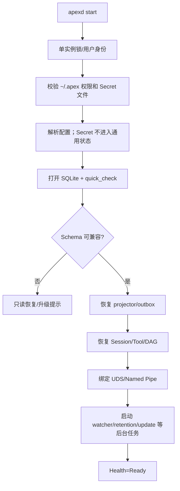
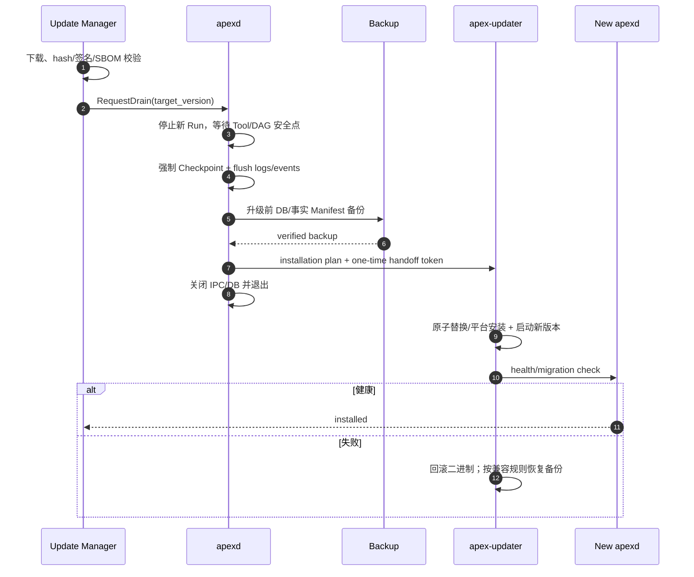

# Apex 安装、升级与运维

## 1. 支持矩阵与发行物

| OS | 架构 | 核心发行物 |
|---|---|---|
| macOS | x86_64、arm64 | `apexd`、`apex` TUI、Apex.app、Plugin Host、Updater |
| Windows | x86_64、arm64 | `apexd.exe`、`apex.exe`、Apex Desktop、Plugin Host、Updater |
| Linux | x86_64、arm64 | `apexd`、`apex`、Desktop package、Plugin Host、Updater |

每个制品有版本、target triple、SHA-256/BLAKE3、签名、SBOM 和构建 provenance。Daemon、内嵌 Web assets 和迁移代码必须来自同一 release manifest。

## 2. 安装与启动

- 安装器把二进制和 Desktop 放入平台受管位置，用户数据始终位于 `~/.apex/`（Windows 的 `~` 展开为当前用户 Profile）。
- 客户端连接流程：尝试本地端点 → 若 daemon 不存在则通过受信安装路径启动 → 等待握手/健康 → 连接。
- `apexd` 获得 `~/.apex/runtime/apexd.lock`/Windows named mutex；第二实例只返回现有端点，不打开第二 SQLite writer。
- daemon 默认在首次客户端启动后常驻，直到显式关闭、更新或 OS 用户会话结束；可选配置为登录时启动。
- daemon 启动不自动打开 Web；TUI 完成握手后自动持有并续租 Web enable lease，只有存在有效 TUI 租约时才创建 listener。

## 3. 启动顺序



IPC 只在数据库和关键恢复完成后宣告 Ready。Provider/MCP/Plugin 不在启动时批量连接，避免冷启动和外部副作用。

## 4. 健康状态

| 状态 | 行为 |
|---|---|
| `Starting` | 只允许握手/启动进度 |
| `Ready` | 正常命令与查询 |
| `Degraded` | 可查询，部分能力禁用并说明原因 |
| `ReadOnlyRecovery` | 禁止 Agent/Tool/写入，允许诊断与恢复 |
| `Draining` | 不接收新 Run，等待安全点更新/关闭 |

健康详情包括 DB、文件 watcher、Projector lag、日志 sink、CAS、端点、磁盘空间、版本兼容；不包含 Key/用户正文。

## 5. 发布通道

| 通道 | 检查 | 下载 | 安装 |
|---|---|---|---|
| Stable | 周期检查 | 用户确认后下载或按设置 | 提示用户确认安装 |
| Nightly | 周期检查 | 自动下载并验签 | 用户确认后安全点安装 |
| Development | 高频/本地源 | 自动下载并验签 | 默认在安全点自动安装，可配置禁用 |
| Enterprise | 类 Stable，可使用管理员私有更新源 | 按管理员源策略 | 提示确认；不包含组织管理能力 |

所有通道都验证 release manifest 和制品签名；私有源只能替换分发位置/信任根配置，不能绕过版本、Schema 和安全点检查。

## 6. 安全点升级流程



用户可在有未知副作用的 Run 上拒绝 drain；Development 自动安装也不能强杀不安全 Tool。超时后保持已下载状态，下一安全点重试。

## 7. Schema 与迁移

- Schema 版本为 `major.minor`，与应用版本独立但有兼容表。
- 同一 Major 的迁移只允许：新增表/索引/字段、追加事件/枚举、填充可重建投影；不得删除、改名或改变既有语义。
- `schema_features` 记录 feature id、introduced version、`min_reader_version`、`min_writer_version` 和 ownership。
- 旧版本打开同 Major 最新 Schema 时忽略并保留未知表/字段/事件；对未知 feature 的 UI 只读或不可见。
- 若旧 writer 的更新会破坏新 feature，相关对象返回 `APEX_SCHEMA_WRITER_TOO_OLD`，但数据库仍可打开并查询已知数据。
- Major 升级可以有破坏性迁移，但必须显式确认、完整备份、预演、校验和回滚方案；不属于静默后台更新。

迁移过程使用独占 writer lease、journal 和 resume token；崩溃后从已提交 step 恢复，step 必须幂等。

## 8. 备份与回滚

自动备份只在升级、迁移、高风险恢复前创建，不做持续定时备份。备份包括：

- SQLite Online Backup 副本与 hash。
- 文件事实 generation/hash Manifest；必要的未入全局 CAS 内容块。
- Schema/app 版本、平台、创建原因和完成标记。

不包含 Provider Key 明文、日志私钥或过期会话日志。Key/私钥由用户自行安全备份；诊断 UI 明确说明这一边界。

二进制回滚优先使用同 Major兼容性，不反向执行破坏性 SQL。若 Major 迁移后回滚，恢复升级前完整备份并保留失败后的只读副本供诊断。

## 9. 后台维护

| 任务 | 触发 | 约束 |
|---|---|---|
| WAL checkpoint/optimize | 空闲、页数阈值 | 不阻塞活跃高风险事务 |
| Session archive | 每日/空闲 | 120 天归档，验证后移出主库 |
| Archive purge | 每日 | 365 天删除，先检查 Pinned roots |
| Session log cleanup | 每日 | 120 天；与归档包独立 |
| System log cleanup | 每日 | 60 天 |
| CAS GC | 低频/磁盘压力 | mark roots 包含 active/archive/pinned/backups |
| FTS reconcile | watcher/低频抽查 | 从 Markdown 重建可恢复 |
| Update check | 按通道 | 无遥测，只请求更新 manifest |

所有维护任务有全局 I/O budget、可取消、分批 commit 和 trace；磁盘空间不足优先停止新大 Artifact/模型上传，不删除未过期/未验证数据。

## 10. 无遥测与诊断包

Apex 不发送使用、性能、崩溃、Provider、项目或更新结果遥测，也不自动上传 dump。用户可手动生成脱敏诊断包：

```text
diagnostic.zip
├── manifest.json
├── system-info.txt             # 版本/OS/架构，用户名/主机名脱敏
├── config-shape.toml           # 仅 key 名和非敏感结构
├── health.json
├── schema.json
├── recent-system.log           # 再次脱敏
├── selected-session-metadata/  # 用户显式选择；默认无正文
└── redaction-report.json
```

生成前展示将包含的文件、风险和脱敏计数；用户可逐项取消。包不会自动上传。

## 11. 平台专项

### macOS

- Universal 或分别签名 x86_64/arm64；notarization、Hardened Runtime。
- UDS 路径长度检测；App/CLI/daemon 签名与 helper 授权链一致。

### Windows

- Named Pipe/Mutex/文件 ACL 绑定当前 SID；ConPTY 与 Job Object 清理进程树。
- 运行中 exe 替换由 `apex-updater.exe` 在 daemon 退出后完成；长路径和 junction 纳入测试。

### Linux

- 提供明确支持的包/AppImage 等制品；UDS 权限与桌面沙箱环境兼容。
- systemd user service 可选，不要求 root/system daemon。

## 12. 灾难恢复 Runbook

1. 无法启动：用 `apexd doctor --read-only` 检查权限、锁、Schema、DB 和磁盘。
2. stale lock：验证 PID/进程启动标识与端点后才清理，不能仅按文件存在判断。
3. DB 损坏：复制原文件 → 尝试最新验证备份 → SQLite recover 到新库 → projection rebuild。
4. 文件事实冲突：冻结相关 Session → 导出 base/local/external → 人工合并 → 新 generation。
5. Plugin/MCP crash loop：安全模式禁用第三方扩展启动，保留 Catalog。
6. 日志签名失败：隔离损坏段、保留原始字节、验证 key rotation；不重签历史伪装完整。

## 13. 运维验收

- daemon 冷启动基准、崩溃恢复、stale lock、双实例竞争。
- 同 Major 前后版本双向打开/读取 fixture，新版写入后旧版不破坏未知数据。
- 升级在 Provider stream、Tool、DAG、Paused/Blocked 状态的安全点测试。
- 三平台安装、卸载（保留用户数据）、签名、端点 ACL 和 updater 回滚 E2E。
- 诊断包 Secret canary 为零泄漏。
