# Apex 质量、风险与完整产品实施计划

原子化执行入口见 [16-implementation-execution-plan.md](16-implementation-execution-plan.md)；本文保留阶段级风险、里程碑、NFR 与 Release Gate，文档 16 负责逐任务执行顺序和验证步骤。

## 1. 计划定位

以下阶段是完整产品的内部实施波次，不是删减需求的 MVP。对外达到“完整产品可发布”必须同时通过三端、三平台、全部安全门、恢复、扩展和发布运维门。

规模估算基于 7–9 名有 Rust/跨平台/前端/安全经验的工程团队：约 210–260 engineer-weeks，日历时间约 8–12 个月，另受 Provider API 变化、平台签名和真实设备矩阵影响。估算用于排序和配置风险缓冲，不是交付承诺。

## 2. 任务拆分

| Task | 交付物 | 对应 AC/RQ | 依赖 | 复杂度 | 估算 |
|---|---|---|---|---|---:|
| T-01 | Proto/Schema/codegen、文档/契约 CI、依赖规则 | AC-019/020 | 无 | 中 | 4–6 ew |
| T-02 | `apex-domain`、`apex-ports`、事件/错误/Reducer 基础 | AC-001/009 | T-01 | 高 | 5–7 ew |
| T-03 | 跨平台目录、ACL、单实例、UDS/Named Pipe、进程树 | RQ-004–011 | T-01/02 | 高 | 9–13 ew |
| T-04 | SQLite event/projection/普通表、FTS、迁移兼容 | AC-001/013/019 | T-02 | 极高 | 12–16 ew |
| T-05 | Markdown/CAS、watch/merge、日志签名、归档 | AC-005/017/018 | T-02/03/04 | 极高 | 13–17 ew |
| T-06 | Session Actor、durable inbox、租约、gRPC/REST/WS | AC-001/002/007 | T-02/03/04 | 极高 | 11–15 ew |
| T-07 | Spec Pipeline、审批/失效/skip、Rules、Verification | AC-003/004/020 | T-05/06 | 极高 | 10–14 ew |
| T-08 | 三 Shell AST、arity IR、Permission/Project Trust | AC-006 | T-02/03/04 | 极高 | 15–20 ew |
| T-09 | Tool Gateway、PTY/ConPTY、PostToolUse、背压 | AC-006 | T-07/08 | 极高 | 12–16 ew |
| T-10 | Context Epoch、Checkpoint、Memory/FTS/召回 | AC-010/013 | T-04/05/06 | 极高 | 13–17 ew |
| T-11 | Path Claim、内容 Snapshot、三平台恢复 | AC-008/009/011 | T-03/05/08 | 极高 | 11–15 ew |
| T-12 | Agent Runtime、Subagent、DAG、Mailbox、Replay/补偿 | AC-008/009/011/012 | T-06/09/10/11 | 极高 | 17–23 ew |
| T-13 | Provider Core 与四家独立 Adapter、Compatible Adapter | AC-014 | T-02/06 | 极高 | 13–17 ew |
| T-14 | Artifact、多模态、音频/Realtime、视频文件 | AC-015 | T-05/13 | 极高 | 10–14 ew |
| T-15 | Skills、MCP、原生 Plugin API/Host/信任 | AC-016 | T-03/08/09 | 极高 | 14–19 ew |
| T-16 | Rust TUI 测试 demo + 全核心流程（无日志/音频） | AC-001–013/016 | T-06–13/15 | 高 | 10–14 ew |
| T-17 | 共享 Vue、Desktop/Web Adapter、音频与日志 UI（TUI 优先后置） | AC-001–017 | T-06–15 | 极高 | 15–21 ew |
| T-18 | 安装、Updater、通道、备份、诊断、运维任务 | AC-002/018/019 | T-03–06 | 极高 | 12–16 ew |
| T-19 | 跨端/跨平台 E2E、安全、兼容、故障注入与性能收敛 | AC-001–020 | T-01–18 | 极高 | 18–24 ew |
| T-20 | 发布候选、SBOM/签名、runbook、最终验证与评审 | AC-020 | T-19 | 高 | 5–7 ew |

`ew` 为 engineer-week。任务必须按已批准 feature Spec 继续细分；此表不授权直接编码。

## 3. 实施顺序

```mermaid
gantt
    title Apex 完整产品内部实施波次（相对周）
    dateFormat X
    axisFormat %s
    section 契约与底座
    T-01 契约/codegen       :t01, 0, 4
    T-02 Domain/Ports       :t02, 2, 5
    T-03 Platform           :t03, 4, 8
    T-04 SQLite             :t04, 5, 10
    T-05 Files/Logs         :t05, 9, 10
    section 运行与安全
    T-06 Session/Protocol   :t06, 8, 10
    T-07 Spec/Rules         :t07, 15, 9
    T-08 Permission         :t08, 8, 14
    T-09 Tool/Terminal      :t09, 20, 10
    section 恢复与编排
    T-10 Context/Memory     :t10, 15, 11
    T-11 Claim/Snapshot     :t11, 18, 10
    T-12 Agent/DAG/Replay   :t12, 26, 14
    section 模型与扩展
    T-13 Providers          :t13, 10, 12
    T-14 Multimodal         :t14, 22, 10
    T-15 Extensions         :t15, 20, 13
    section 客户端与发布
    T-16 TUI demo + core    :t16, 31, 10
    T-17 Desktop/Web        :t17, 43, 14
    T-18 Install/Update     :t18, 24, 12
    T-19 Hardening          :t19, 40, 12
    T-20 Release Gate       :t20, 52, 4
```

并行只在契约/依赖允许时进行。T-08、T-11、T-12 和 T-19 是关键路径，不能以 UI 演示完成替代安全/恢复正确性。

## 4. 内部里程碑

| 里程碑 | 完成标志 | 可验证产出 |
|---|---|---|
| M1 契约冻结 | ID/事件/Trait/Proto/Schema 可生成且一致 | codegen、dependency CI、兼容 fixture |
| M2 Durable Core | daemon、SQLite、文件事实、Session 可崩溃恢复 | 事件重放、watch reconcile、跨端 Snapshot/Event |
| M3 Safety Core | Spec、Permission、Tool、Terminal 全部硬门 | 三 Shell corpus、PostToolUse、未知副作用阻塞 |
| M4 Agent Core | Checkpoint、Memory、Claim、DAG、Replay 完整 | 并行/暂停/恢复/补偿/投影 hash 测试 |
| M5 Capability Complete | Provider、多模态、Skill/MCP/Plugin 完整 | Adapter contract、Realtime、Plugin Host 隔离 |
| M6 Client Complete | 三端能力矩阵全部实现 | 三端 E2E、日志/音频差异符合契约 |
| M7 Release Candidate | 三平台、两架构制品与运维闭环 | 安装升级回滚、NFR、安全与最终 verification |

只有 M7 可称完整产品候选；M1–M6 都是内部集成状态。

## 5. 风险登记册

| ID | 风险 | 等级 | 触发/早期信号 | 预防与应对 | 失败预案 |
|---|---|---|---|---|---|
| RISK-001 | Markdown/SQLite 跨域崩溃产生分叉 | 高 | generation/hash 不一致、watch 循环 | journal、原子替换、Critical 索引、reconciliation 故障注入 | Blocked + CAS/三方人工恢复 |
| RISK-002 | Shell 静态分析误放危险命令 | 致命 | Unknown 被当 Allow、逃逸 corpus 通过 | 三 grammar + arity IR、单调策略、Unknown 保守、模糊/对抗测试 | 关闭受影响 dialect 自动执行，全部降级 Ask/Deny |
| RISK-003 | symlink/大小写/TOCTOU 绕过路径 | 致命 | 计划路径与实际句柄不一致 | 共用规范化库、最深祖先、fencing/openat、三平台测试 | 禁用自动写或要求 sandbox/worktree |
| RISK-004 | 单 daemon 故障影响所有项目 | 高 | crash loop、projector lag、DB busy | actor 隔离、panic boundary、WAL、恢复模式、资源配额 | 安全模式/只读恢复，逐 Session 隔离恢复 |
| RISK-005 | 同 Major 新旧版本互相破坏 | 高 | 旧 writer 覆盖新字段/事件 | 只追加、feature ownership、min writer、兼容金丝雀 | 对新 feature 只读，要求升级后写 |
| RISK-006 | 原生 Plugin 导致内存破坏/供应链攻击 | 致命 | 未签名库进入 daemon、Host 越权 | 官方签名 allowlist；第三方 Host；C ABI；capability broker | 全局安全模式禁用 Plugin，吊销签名/包 hash |
| RISK-007 | Provider API/模型能力快速漂移 | 高 | fixture 失败、字段/stop reason 变化 | 独立 Adapter、capability、录制回放、版本矩阵 | 禁用特定能力/模型，回退兼容但不伪装 |
| RISK-008 | 多模态大文件/音频耗尽内存或磁盘 | 高 | RSS/队列/磁盘持续增长 | streaming、大小/时长/解压限制、CAS 配额、背压 | 拒绝新 Artifact，清理可回收 cache |
| RISK-009 | Snapshot 混合时间点或错误覆盖用户修改 | 致命 | capture 时文件变更、restore precondition 失败 | 稳定扫描、hash 重试、pre-restore snapshot、三方比较 | 阻塞人工合并，不自动覆盖 |
| RISK-010 | “确定性重放”误重跑副作用 | 致命 | replay 产生网络/进程/File write | 单独 State Replay executor、无副作用 Adapter、projection hash | 立即中止，恢复 pre-replay snapshot，安全审计 |
| RISK-011 | Claim 死锁/饥饿/租约失效后旧写 | 高 | wait time 激增、stale owner commit | 规范排序、公平扫描、aging、TTL/fencing、属性测试 | 降低写并发为 1，人工释放可验证 stale claim |
| RISK-012 | Checkpoint/CAS 无界增长 | 中 | 活跃会话块数/磁盘异常 | chunk 去重、章节 extract、120/365、Pinned roots、GC | 磁盘压力模式，暂停大输出并请求清理 |
| RISK-013 | 明文 Provider Key 泄漏 | 致命 | Secret canary 出现在任意 sink | 0600/ACL、Secret 类型、出口 Firewall、环境清洗 | 撤销/轮换 Key，隔离日志/诊断包，事后扫描 |
| RISK-014 | 日志 hash/signature 实现错误或密钥丢失 | 高 | 验签失败、段链断裂 | canonical JSON fixture、HSM 不要求但权限严格、key rotation 元数据 | 保留原始段并标记 unverifiable，不重签历史 |
| RISK-015 | localhost Web 被 CSRF/恶意页面访问 | 致命 | 非预期 Origin、token 重放 | TUI lease、fragment token、短 Cookie、Origin/CSRF/CSP | 关闭 listener、撤销全部 Web session、轮换 token seed |
| RISK-016 | 跨平台 IPC/PTY/进程树差异 | 高 | Windows child 泄漏、UDS 路径失败 | platform crate、真实设备 CI、Job Object、路径缩短 | 平台能力降级/禁用持久终端，保留 run-once |
| RISK-017 | gRPC/REST/UI Reducer 漂移 | 高 | 同命令不同状态、event gap | 单应用 DTO、生成类型、等价契约测试、Snapshot+seq 算法 | 强制 resync，禁用不兼容客户端 capability |
| RISK-018 | 中文 Memory 检索质量/性能不足 | 中 | 召回遗漏、P95 超标 | jieba 默认、unicode fallback、离线语料/benchmark | UI 手动搜索/标签，调整 tokenizer 后重建 |
| RISK-019 | daemon 空闲内存/启动超预算 | 高 | Provider/MCP eager init、缓存无界 | lazy adapter、按需扩展、heap/profile budget、分页/stream | 禁用非必要预热，收缩 cache/并发 |
| RISK-020 | 完整产品范围造成周期失控 | 高 | 跨团队契约反复、关键路径延误 | 先契约、内部波次、功能 owner、风险燃尽、无双实现 | 调整资源/顺序，不通过削弱安全和审计定义“完成” |

致命/高风险在编码前都有设计兜底，但只有相应测试与证据通过后才能标记“已解决”。

## 6. 测试体系

### 6.1 分层

| 层 | 重点 |
|---|---|
| 单元/Reducer | 状态转换、审批/授权/阈值、纯规则 |
| 属性/模糊 | Shell AST、路径、DAG、事件重放、Markdown merge、序列化 |
| Port contract | SQLite/File/Provider/MCP/Plugin/Terminal Adapter 共同契约 |
| 集成 | Tool 全链、Checkpoint、Snapshot、Archive、Upgrade、failover |
| E2E | TUI/Desktop/Web 创建/继续会话、审批、权限、DAG、接管、恢复 |
| 安全 | Prompt/Skill 注入边界、命令/路径/网络、Secret canary、Web、Plugin |
| 故障注入 | 每个持久化边界 kill、磁盘满、partial write、断网、进程 crash |
| 兼容 | 同 Major old/new binary × old/new fixture；Protocol feature negotiation |
| 性能 | 启动、admission、事件、分页、FTS、RSS、并发与大 Artifact |

### 6.2 覆盖率

- Permission、DAG Scheduler、Spec Pipeline、Checkpoint/恢复：行/分支 ≥ 90%。
- 其他 Rust crate：行覆盖 ≥ 80%，关键状态机要求分支阈值。
- Vue/TS：≥ 80%。
- FFI/unsafe、补偿、UnknownSideEffect、Schema migration 和 Secret Firewall 必须有显式测试，不接受“难以覆盖”豁免。

### 6.3 独立验证

写实现的 Agent 不能以自身摘要作为验证证据。完成门运行独立测试 harness、静态工具和录制 fixture；安全关键模块需人工 review/外部 fuzz corpus。AI 生成测试必须由 mutation testing/故障注入证明能抓住错误。

## 7. 性能验收

参考环境最低为 4 个现代 CPU 核、16 GiB RAM、SSD，干净 daemon 与固定数据 fixture；报告 P50/P95/P99、样本量和冷/热缓存。

| 指标 | 目标 | 测量边界 |
|---|---:|---|
| daemon 冷启动 P95 | ≤ 2 s | 进程创建到本地 IPC Ready；不含外部 Provider/MCP |
| 命令确认 P95 | ≤ 100 ms | 本地请求到 durable Admission receipt |
| 跨端 Durable Event P95 | ≤ 250 ms | SQLite commit 到已连接客户端 reducer apply |
| 10k Session 分页 P95 | ≤ 500 ms | 50 条 keyset page +摘要投影 |
| 100k Memory 搜索 P95 | ≤ 300 ms | scope filter + tokenizer + top-k 结果 |
| daemon 空闲 RSS P95 | ≤ 250 MiB | 无活跃 Run/Web/MCP/Realtime，稳定 5 分钟 |

性能回归阈值：P95 超目标或相对基线恶化 >10% 阻塞发布，除非有明确硬件/fixture 变化和批准 ADR。

## 8. 安全与隐私完成门

- Threat model 覆盖本地恶意网页、未信任 Project、恶意 Skill/MCP/Plugin、恶意 Provider 响应、Shell 注入、symlink、DNS rebinding、Secret 泄漏和 supply chain。
- `apex-permission` 依赖图静态证明不含 Provider/LLM。
- Fuzz corpus 零已知逃逸；未知解析按模式保守处理。
- 全部 sink 通过植入 Secret canary 的端到端泄漏测试。
- Web 通过 Origin/CSRF/token replay/IPv6 loopback/CSP 测试。
- 第三方 Plugin 的 crash、panic、内存压力、恶意 IPC 不使 daemon 崩溃或越权。
- 无遥测网络基线：未配置 Provider/MCP/Update 时，daemon 不发外部网络请求。

## 9. 发布完成门

1. 115 项 `RQ` 和 20 项产品 `AC` 均有实现任务、测试和 `verification.md` 证据。
2. 六个性能目标全部通过。
3. 三 OS × 两架构构建；可运行测试覆盖可获得的真实/虚拟设备矩阵。
4. Stable/Nightly/Development/Enterprise 更新策略、签名、备份、回滚通过。
5. 同 Major 兼容矩阵通过；未知字段/事件 fixture 未丢失。
6. Session JSONL hash/signature、System Log、120/365 保留与 Pinned 规则通过。
7. TUI 明确无日志/音频，Desktop/Web 能力完整，三端共享状态一致。
8. 无 P0/P1 缺陷、无未处置致命/高风险、无 Secret 泄漏。
9. 生成最终 `verification.md` 并按策略获得用户确认。

## 10. 当前文档阶段完成门

本轮只完成设计文档。文档交付需要：

- 115 个需求编号连续且每项有有效文档链接。
- README/总册列出的文档全部存在，旧文档仅归档。
- Mermaid code fence 平衡，核心架构、部署、Spec、Tool、DAG、Checkpoint、ER、状态机齐全。
- Trait/状态/路径/保留期/并发/NFR 跨文档一致。
- Git diff 仅包含文档与既有用户删除项，不恢复/修改实现代码。

文档经用户明确“方案确认/审核通过”后，未来实现阶段才可以按 `specs/<feature>/` 拆分并进入编码；本轮不会自动开始编码。
