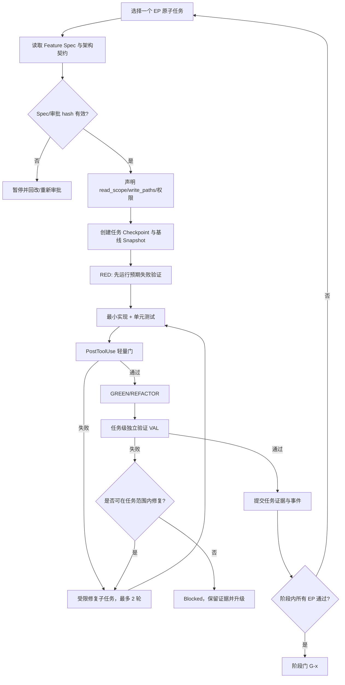
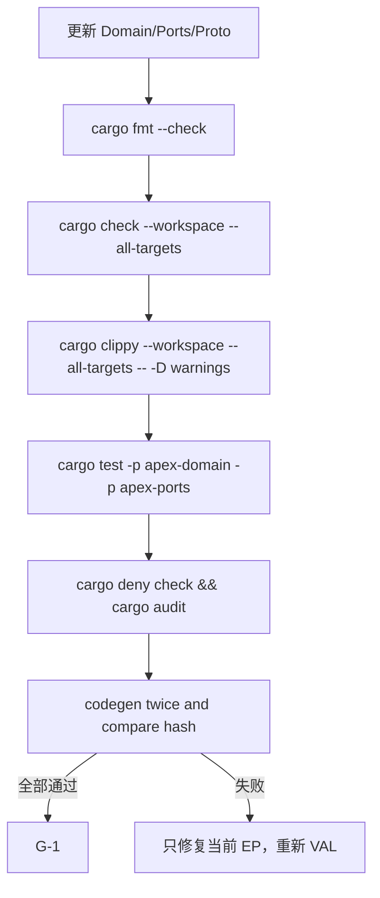
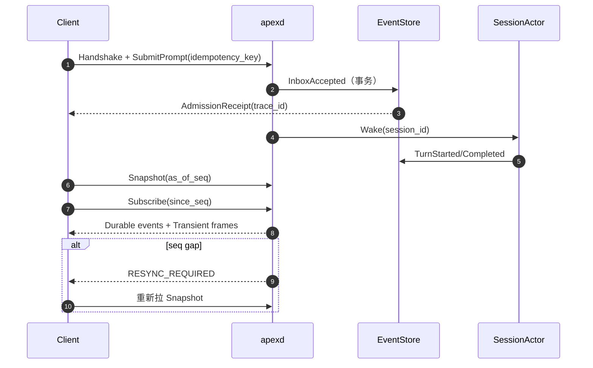
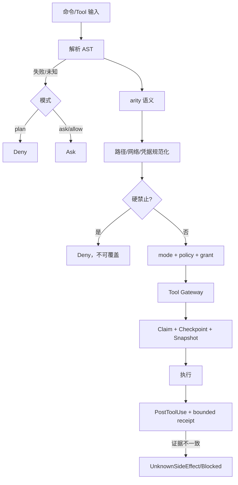
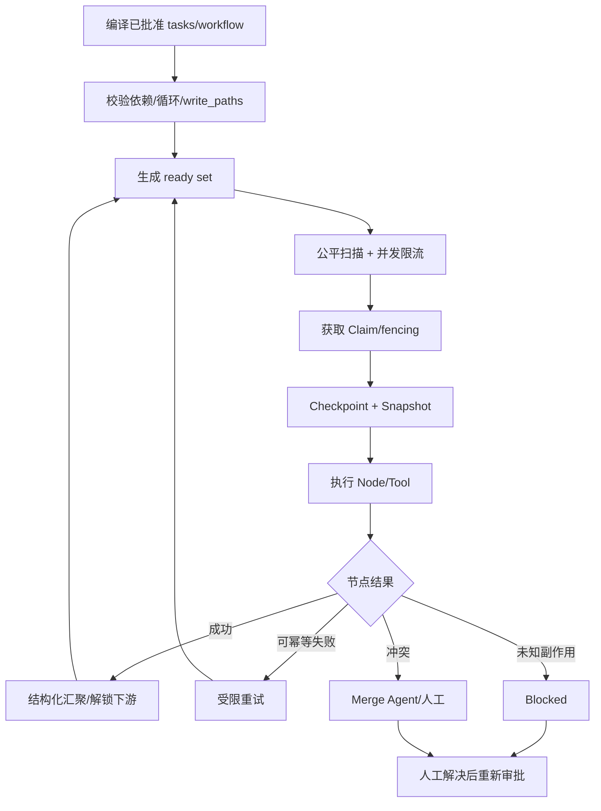
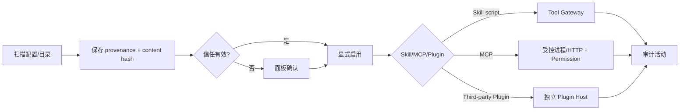
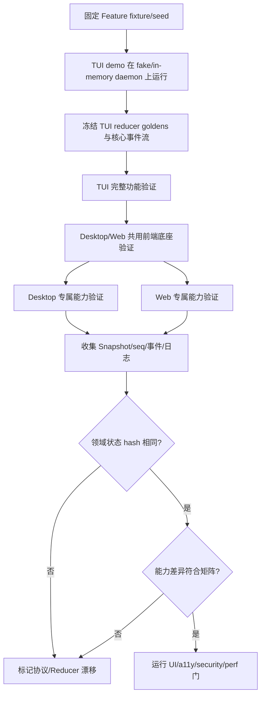
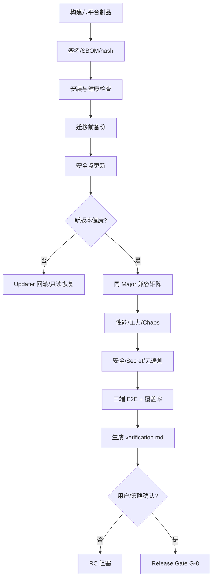
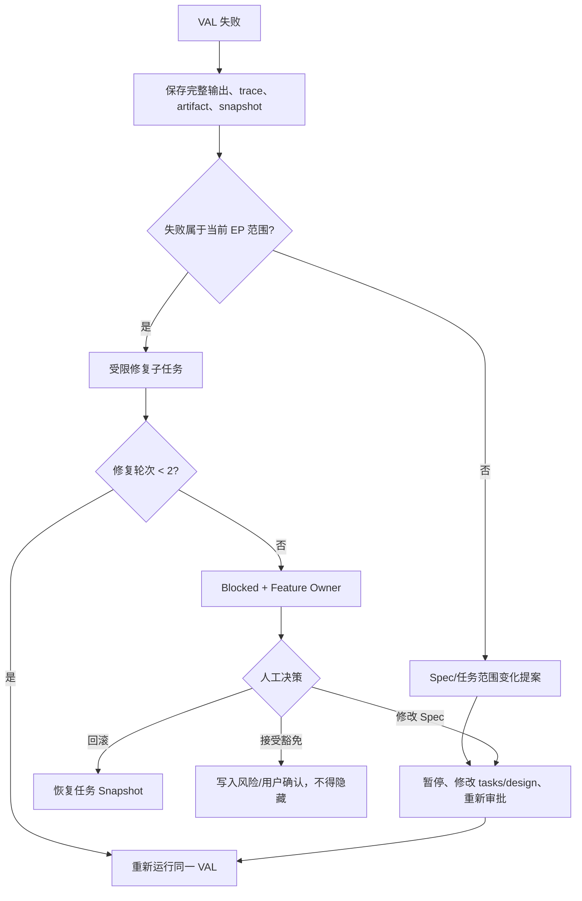

# Apex 功能开发原子化执行计划

## 1. 计划定位

本文件把 [15-质量、风险与路线图](15-quality-risks-roadmap.md) 的 20 个宏任务进一步拆成可独立排队、实现、验证和回滚的原子任务。它是后续开发的执行计划，不改变 [01-需求基线](01-requirements.md)、[04-领域模型](04-domain-model.md)、[05-Trait 契约](05-trait-contracts.md) 和 [06-协议](06-protocol-and-clients.md) 的权威语义。

本轮只撰写计划，不创建 Cargo crate、不修改实现代码、不运行 Provider/MCP/Plugin 外部副作用。

### 1.1 计划约束

- 任务编号：`EP-xxxx`；验证编号：`VAL-xx`；阶段门：`G-x`；风险沿用 `RISK-xxx`。
- 一个原子任务只允许一个主要行为变更、一个明确产出和一个可判定完成标准。
- 一个实现提交最多对应一个原子任务；跨任务修改必须拆分或在任务 Spec 中明确关联。
- 每个任务先建立 `specs/<feature>/{requirements,design,tasks,verification}.md`，再进入编码。
- 任务执行顺序固定为：RED（验证先失败）→ GREEN（最小实现）→ REFACTOR（规则/安全/性能）→ 独立验证。
- 任务证据默认进入会话 JSONL、测试 artifact 和结构化日志；每个 Feature 只生成最终 `verification.md`。
- 任何高风险写任务都必须经过 Spec Gate、Permission、Write Claim、Checkpoint、Snapshot 和 PostToolUse。

## 2. 角色与最小交付单元

| 角色 | 责任 | 不可替代的证据 |
|---|---|---|
| Feature Owner | 维护 Feature Spec、拆任务、处理需求变化 | Approved Spec hash、任务追踪 |
| Implementer | 完成单个 EP 任务及其测试 | 代码 diff、RED/GREEN 日志 |
| Verifier | 独立执行任务验证，不接受实现者口头结论 | 测试输出、artifact hash、验证日志 |
| Security Reviewer | 审查 Permission/Secret/Plugin/IPC/路径边界 | 安全检查清单与阻塞项 |
| Release Owner | 负责阶段门、兼容、制品、回滚 | Gate report、签名、升级证据 |

每个任务的完成记录至少包含：`task_id`、Spec/AC hash、输入 fixture hash、执行者、Verifier、命令、退出码、耗时、artifact 路径、trace_id、风险结论和回滚点。

## 3. 全局执行流程



## 4. 阶段门与阻塞规则

| 门 | 进入条件 | 必须通过 | 失败动作 |
|---|---|---|---|
| `G-0` 计划基线 | 需求/架构文档已批准 | 编号、依赖、验证映射完整 | 不得创建实现任务 |
| `G-1` Foundation | 契约与测试 harness 就绪 | `cargo check`、codegen、依赖规则 | 回退到契约任务 |
| `G-2` Durable Core | DB/文件/日志基础就绪 | 崩溃恢复、幂等、事件投影 | 只读恢复，禁止继续上层开发 |
| `G-3` Session/Protocol | Admission、租约、事件流就绪 | 三端同会话同步、重连 | 禁止创建客户端功能任务 |
| `G-4` Safety Core | Spec、权限、Tool、终端就绪 | 零 Token 权限、Unknown 保守、规则门 | 禁止 Agent 写任务 |
| `G-5` Recovery Core | Checkpoint、Memory、Snapshot、Claim 就绪 | 无损重建、路径互斥、状态重放 | 禁止并发 DAG |
| `G-6` Agent/Provider | DAG、Provider、扩展边界就绪 | 并发/故障转移/能力协商 | 关闭相关 capability |
| `G-7` Clients | TUI 测试 demo、TUI 完整功能、Desktop/Web 分轨与三端闭环 | 三端 E2E、能力差异正确 | 只允许内部测试包 |
| `G-8` Release | 运维、兼容、安全、性能完成 | 全部 RQ/AC、无 P0/P1 | 不生成 Release Candidate |

阶段门是硬门；不能用“下阶段会修”替代。中风险项可以带着预案继续，高/致命风险必须达到“已解决或已有可验证兜底”。

## 5. 阶段总览

| 阶段 | 目标 | 原子任务数 | 依赖 | 估算（含集成） |
|---|---|---:|---|---:|
| S0 | 计划、Spec、契约和验证基础 | 8 | 无 | 4–6 ew |
| S1 | Rust Foundation 与协议生成 | 12 | S0 | 8–10 ew |
| S2 | 平台、SQLite、文件事实、日志、归档 | 23 | S1 | 18–24 ew |
| S3 | daemon、Session、租约、本地/HTTP 协议 | 14 | S2 | 12–15 ew |
| S4 | Spec、Rules、Verification Gate | 15 | S3 | 15–18 ew |
| S5 | AST 权限、Tool Gateway、终端 | 23 | S4 | 22–27 ew |
| S6 | Context、Checkpoint、Memory | 17 | S2/S3/S5 | 17–21 ew |
| S7 | Agent、DAG、Claim、Snapshot、Replay | 22 | S5/S6 | 21–26 ew |
| S8 | Provider 与多模态 | 16 | S3/S6/S7 | 15–19 ew |
| S9 | Skills、MCP、Plugin | 17 | S5/S8 | 15–19 ew |
| S10 | 客户端分轨实施（TUI 优先） | 27 | S3–S9 | 22–27 ew |
| S11 | 发布、兼容、性能、安全、RC | 20 | S0–S10 | 20–25 ew |

合计估算约 210–260 engineer-weeks；阶段可并行，但单个任务必须遵守依赖和阶段门。

## 6. S0：计划、Spec 与验证基础

阶段目标：让后续每个功能都能由一个 Feature Spec、原子任务和独立验证驱动。对应 `G-0`。

| ID | 原子任务（单一产出） | 依赖 | 对应需求/验收 | 产出 | 验证 |
|---|---|---|---|---|---|
| EP-0001 | 固化 Feature Spec 模板 frontmatter | 无 | RQ-036–041 | 四文档模板与 schema | `VAL-01`：schema 正/负 fixture |
| EP-0002 | 固化 `RQ`/`AC`/`EP`/`VAL` 编号规则 | EP-0001 | 全部 | 编号注册表 | `VAL-02`：重复/断号扫描 |
| EP-0003 | 建立需求→AC→EP→验证追踪表 | EP-0002 | 全部 | 追踪矩阵 | `VAL-02B`：每个 RQ 有 AC/任务/证据 |
| EP-0004 | 定义任务状态与阻塞原因 | EP-0002 | RQ-038/068/069 | `TaskStatus`/`BlockReason` 映射 | `VAL-03`：状态机非法迁移测试 |
| EP-0005 | 定义统一验证证据目录与命名 | EP-0002 | RQ-040/107–110 | 日志/artifact 目录约定 | `VAL-04`：路径和 trace 完整性检查 |
| EP-0006 | 建立代码、依赖、Schema、协议四类漂移检查 | EP-0003 | RQ-111 | CI 检查清单/脚本规范 | `VAL-05`：注入一处漂移应失败 |
| EP-0007 | 建立跨平台/Provider/客户端能力矩阵 fixture | EP-0003 | RQ-004/005/084–090 | 矩阵数据文件 | `VAL-06`：缺能力与冲突配置被拒绝 |
| EP-0008 | 建立内存 Port、假时钟、故障注入 harness 设计 | EP-0001 | RQ-046/068/071 | `apex-test-support` 规格 | `VAL-07`：故障注入点清单审查 |

### S0 验证步骤与通过标准

1. 从 `docs/01-requirements.md` 生成 RQ/AC 清单。
2. 对每个 RQ 找到唯一 EP 和至少一个 VAL。
3. 删除一个必需字段/改写一个状态名，确认漂移检查失败。
4. 恢复原始内容并生成计划基线 hash。

通过标准：无断号、无孤立需求、无无验证任务、无未登记阶段；输出 `G-0` 记录。

## 7. S1：Rust Foundation 与协议生成

阶段目标：建立不含业务副作用的 Domain/Ports/Protocol 基座。对应 `G-1`。

| ID | 原子任务 | 依赖 | 对应需求/验收 | 产出 | 验证 |
|---|---|---|---|---|---|
| EP-0101 | 创建 workspace 根清单与成员列表 | EP-0006 | RQ-002 | `Cargo.toml` workspace | `VAL-08`：成员/路径检查 |
| EP-0102 | 锁定 Rust toolchain 与 target 列表 | EP-0101 | RQ-004/005 | toolchain/target matrix | `VAL-09`：六 target dry-run |
| EP-0103 | 配置 rustfmt/clippy/deny/audit 基线 | EP-0101 | RQ-045/046 | lint/依赖配置 | `VAL-10`：故意引入 warning 应失败 |
| EP-0104 | 实现 UUIDv7/ContentHash/TraceId newtype | EP-0101 | 04 领域契约 | Domain IDs | `VAL-11`：格式、排序、不可混用测试 |
| EP-0105 | 实现时间、generation、幂等 key 值对象 | EP-0104 | RQ-027/103 | Domain values | `VAL-12`：边界/序列化测试 |
| EP-0106 | 实现唯一状态枚举及稳定字符串编码 | EP-0104 | 04 状态机 | Domain states | `VAL-13`：新增值/未知值兼容测试 |
| EP-0107 | 实现 `ApexError` 与稳定错误码 | EP-0105 | 04 错误模型 | Error taxonomy | `VAL-14`：错误映射/trace 完整性 |
| EP-0108 | 实现 `EventEnvelope` 与 NewEvent | EP-0104/0107 | RQ-027/111 | Event types | `VAL-15`：版本/序列/未知字段测试 |
| EP-0109 | 实现 `CommandContext`/Actor/Client identity | EP-0104/0107 | RQ-021/023/050 | Command context | `VAL-16`：trace/idempotency 测试 |
| EP-0110 | 实现 `apex-ports` Trait 空实现编译边界 | EP-0104–0109 | 05 Trait 契约 | Port crate | `VAL-17`：依赖反向引用扫描 |
| EP-0111 | 生成 Protobuf Rust/TypeScript 类型 | EP-0108/0110 | RQ-009/012/017 | Generated types | `VAL-18`：codegen 可重复性 |
| EP-0112 | 建立 Rust 单元/属性测试公共 fixture | EP-0101–0111 | RQ-046 | test-support fixtures | `VAL-19`：假时钟/随机 ID/故障注入自测 |

### S1 验证流程



通过标准：workspace 可解析、生成代码可重复、Domain 不依赖 Adapter、所有基础错误包含 trace 能力；不允许进入 S2 的业务实现绕过这些门。

## 8. S2：平台、SQLite、文件事实、日志与归档

阶段目标：完成可恢复的本地持久层和跨平台进程基础。对应 `G-2`。

| ID | 原子任务 | 依赖 | 对应需求/验收 | 产出 | 验证 |
|---|---|---|---|---|---|
| EP-0201 | 实现 Apex Home 路径解析 | EP-0102 | RQ-008 | HomePath API | `VAL-20`：三 OS 路径 fixture |
| EP-0202 | 实现 Home/config/key/runtime 权限诊断 | EP-0201 | RQ-091/109 | PermissionDoctor | `VAL-21`：0600/ACL 正负测试 |
| EP-0203 | 实现单实例 lock/mutex 与 stale 检查 | EP-0201 | RQ-006 | Singleton guard | `VAL-22`：双启动/假 PID 测试 |
| EP-0204 | 实现 Unix Domain Socket listener | EP-0203/0111 | RQ-009/010 | Unix endpoint | `VAL-23`：ACL/重连/路径长度 |
| EP-0205 | 实现 Windows Named Pipe listener | EP-0203/0111 | RQ-009/011 | Windows endpoint | `VAL-24`：SID ACL/并发连接 |
| EP-0206 | 实现进程树 supervisor Port | EP-0201 | RQ-057/058 | ProcessTree Port | `VAL-25`：子孙进程终止 |
| EP-0207 | 实现普通配置加载与未知字段保留 | EP-0107/0201 | RQ-111 | Config model | `VAL-26`：未知字段 round-trip |
| EP-0208 | 实现 SQLite 打开、WAL 与 busy 策略 | EP-0108/0201 | RQ-007/103/104 | DB bootstrap | `VAL-27`：pragma/并发 writer |
| EP-0209 | 实现 schema_meta/feature/migration 表 | EP-0208 | RQ-111 | Migration catalog | `VAL-28`：重复迁移/中断恢复 |
| EP-0210 | 实现 EventStore append 事务 | EP-0108/0208 | RQ-026/027 | Event append | `VAL-29`：optimistic conflict/幂等 |
| EP-0211 | 实现 session sequence 与 aggregate version | EP-0210 | RQ-027 | Sequence allocator | `VAL-30`：无 gap/并发竞争 |
| EP-0212 | 实现 projector cursor 与投影批处理 | EP-0210/0211 | RQ-026 | Projector runtime | `VAL-31`：重放投影 hash |
| EP-0213 | 实现 Query Snapshot/keyset pagination | EP-0212 | RQ-001/114 | Query store | `VAL-32`：10k 分页基准 |
| EP-0214 | 实现 Markdown 原子写/文件 generation | EP-0201/0105 | RQ-025/028 | FileFactStore | `VAL-33`：崩溃注入/权限/rename |
| EP-0215 | 实现 watcher 防抖与自写去重 | EP-0214 | RQ-028 | Watch service | `VAL-34`：外部/自身变更 fixture |
| EP-0216 | 实现 Markdown AST 三方合并 | EP-0214/0215 | RQ-029 | Reconciler | `VAL-35`：可合并/冲突/暂停 |
| EP-0217 | 实现 CAS put/open/verify | EP-0201/0105 | RQ-070/077 | ContentStore | `VAL-36`：hash/断块/幂等 |
| EP-0218 | 实现文件事实索引与 reconcile marker | EP-0212/0214/0217 | RQ-025/026 | file_sync_state | `VAL-37`：DB/文件崩溃组合 |
| EP-0219 | 实现 Session JSONL sink 与 10 MiB 轮转 | EP-0108/0201 | RQ-107–109 | SessionLogSink | `VAL-38`：JSONL/hash-chain/轮转 |
| EP-0220 | 实现每日系统文本日志与 60 天清理 | EP-0201 | RQ-110 | SystemLogSink | `VAL-39`：日界线/分段/保留 |
| EP-0221 | 实现日志 Ed25519 seal/verify/key rotation | EP-0219 | RQ-109 | Log verifier | `VAL-40`：篡改/断链/旧 key |
| EP-0222 | 实现 120/365 天 Session 归档与只读挂载 | EP-0210/0217 | RQ-106 | ArchiveStore | `VAL-41`：归档/恢复/删除 |
| EP-0223 | 实现升级/恢复前 SQLite+文件备份 | EP-0217/0222 | RQ-105 | Backup catalog | `VAL-42`：备份完整性/恢复演练 |

### S2 关键验证步骤

1. 在临时 Home 中启动两个 daemon，验证第二实例只连接第一个。
2. 注入 Event append、文件 rename、Manifest 写入、日志 footer 写入四类崩溃点。
3. 重启后运行 reconciliation，检查 generation、event_id、trace_id、projection cursor 和 hash 是否收敛。
4. 修改一个已存在和一个不存在的 Spec 路径，分别执行三方合并和冲突阻塞。
5. 生成 10 MiB+ Session Log、跨日 System Log、120/365 天时间 fixture，执行保留任务。
6. 篡改日志中间一行、删除一段、替换公钥，验证只报告不可验证，不重签历史。

通过标准：SQLite、文件事实和日志任意一个边界崩溃后都不静默丢数据；`VAL-27`–`VAL-42` 全部通过，输出 `G-2`。

## 9. S3：daemon、Session、租约与传输协议

阶段目标：实现 durable admission、单控制租约、Web enable lease 和三端可重连事件流。对应 `G-3`。

| ID | 原子任务 | 依赖 | 对应需求/验收 | 产出 | 验证 |
|---|---|---|---|---|---|
| EP-0301 | 实现 ClientHello/ServerHello 版本协商 | EP-0111/0204/0205 | RQ-009/012/111 | HandshakeService | `VAL-43`：major/minor/feature |
| EP-0302 | 实现 gRPC interceptor 身份/trace/idempotency | EP-0301 | RQ-009/021 | gRPC middleware | `VAL-44`：未认证/重复请求 |
| EP-0303 | 实现 REST DTO 到 Application Command 映射 | EP-0301 | RQ-012 | Actix REST handlers | `VAL-45`：等价错误/结果 |
| EP-0304 | 实现 WebSocket Subscribe/Close/错误帧 | EP-0301/0211 | RQ-012 | WS endpoint | `VAL-46`：背压/断连 |
| EP-0305 | 实现 Snapshot + since_seq 合并器 | EP-0213/0304 | AC-001 | Client SDK reducer | `VAL-47`：乱序/gap/resync |
| EP-0306 | 实现 durable prompt inbox | EP-0210/0302 | RQ-026 | Inbox admission | `VAL-48`：重复提交/崩溃 |
| EP-0307 | 实现 Session Actor 串行提升 Turn | EP-0306/0212 | RQ-001/024 | SessionRuntime | `VAL-49`：并发输入/安全点 |
| EP-0308 | 实现控制租约 acquire/renew/release | EP-0210/0302 | RQ-021/022 | ControlLeaseService | `VAL-50`：FIFO/30 秒宽限 |
| EP-0309 | 实现 force takeover 与旧 token fencing | EP-0308/0210 | RQ-023 | Takeover command | `VAL-51`：接管审计/旧 token 拒绝 |
| EP-0310 | 实现 TUI 自动 Web enable lease | EP-0204/0301/0308 | RQ-014/015 | WebLeaseService | `VAL-52`：TUI 退出关闭 listener |
| EP-0311 | 实现一次性 token exchange 与短 Cookie | EP-0310 | RQ-016 | Web auth | `VAL-53`：token replay/过期 |
| EP-0312 | 实现 Origin/CSRF/CSP 校验 | EP-0311 | RQ-016 | Web security middleware | `VAL-54`：恶意 Origin/CSRF |
| EP-0313 | 实现 AgentActivityView durable/transient 投影 | EP-0212/0304 | RQ-073 | Activity query | `VAL-55`：Skill/MCP/Subagent 展示 |
| EP-0314 | 实现 graceful shutdown/drain | EP-0307/0308 | RQ-024/068 | Daemon shutdown | `VAL-56`：Tool/DAG 安全点 |

### S3 验证流程



通过标准：TUI、Desktop、Web 对同一 Session 的 durable 状态最终一致；Web 没有有效 TUI lease 时不存在 listener；任何重复命令不会重复副作用；输出 `G-3`。

## 10. S4：Spec、Rules 与 Verification Gate

阶段目标：在任何 Agent 写入前建立强制需求—设计—任务—编码—验证门。对应 `G-4` 的 Spec 部分。

| ID | 原子任务 | 依赖 | 对应需求/验收 | 产出 | 验证 |
|---|---|---|---|---|---|
| EP-0401 | 实现 requirements.md schema/parser | EP-0001/0214 | RQ-030/036 | Requirements document model | `VAL-57`：正/负 frontmatter |
| EP-0402 | 实现 design.md schema/parser | EP-0401 | RQ-037 | Design model | `VAL-58`：上游 hash 校验 |
| EP-0403 | 实现 tasks.md schema/parser | EP-0402 | RQ-030/062/064 | Task model | `VAL-59`：依赖/路径/循环拒绝 |
| EP-0404 | 实现 verification.md renderer/schema | EP-0401–0403 | RQ-040/041 | Verification writer | `VAL-60`：输入 hash/缺证据失败 |
| EP-0405 | 实现 SpecStage/StageStatus 状态机 | EP-0106/0401 | RQ-036/037 | Stage reducer | `VAL-61`：非法跳阶段 |
| EP-0406 | 实现 ApprovalRecord 内容 hash 绑定 | EP-0210/0405 | RQ-037/038 | Approval service | `VAL-62`：内容变化自动失效 |
| EP-0407 | 实现上游变化失效传播图 | EP-0405/0406 | RQ-038 | Invalidation plan | `VAL-63`：requirements→下游传播 |
| EP-0408 | 实现 `/skip-spec` parser 与 scope 校验 | EP-0405/0306 | RQ-039 | Skip command | `VAL-64`：run/session/all/过期 |
| EP-0409 | 实现 SkipGrant 审计事件与限制 | EP-0408/0210 | RQ-039 | Skip audit | `VAL-65`：绕过 Spec 但不能绕安全门 |
| EP-0410 | 实现规则 profile registry/version hash | EP-0108/0401 | RQ-045 | Rule catalog | `VAL-66`：未知/变更 profile |
| EP-0411 | 实现 PostToolUse 轻量安全/格式/语法门 | EP-0409/0515 | RQ-042 | Lightweight gate | `VAL-67`：单文件修改失败阻断 |
| EP-0412 | 实现增量批次重型检查编排 | EP-0410/0411 | RQ-043 | Batch runner | `VAL-68`：增量范围/完成门 |
| EP-0413 | 实现受限自动修复子任务 | EP-0411/0711 | RQ-044 | Repair plan | `VAL-69`：2 轮默认、范围不扩 |
| EP-0414 | 实现最终 Verification evidence 聚合 | EP-0404/0412 | RQ-040/046 | Evidence aggregator | `VAL-70`：AC/覆盖率/风险映射 |
| EP-0415 | 实现用户确认/自动完成策略 | EP-0414/0308 | RQ-041 | Completion decision | `VAL-71`：未确认不得完成 |

### S4 验证步骤

1. 创建四份空文档、错误 schema、错误上游 hash 和未批准 Spec fixture。
2. 尝试直接提交 Coding Tool，预期收到 `APEX_SPEC_APPROVAL_REQUIRED`。
3. 逐阶段批准后改变 requirements 内容，确认 design/tasks/verification 审批全部失效。
4. 使用 `/skip-spec --scope run --stages design`，确认只跳 design 且保留 Permission/Checkpoint/日志门。
5. 注入 PostToolUse 格式错误、重型测试失败和修复超轮次，确认进入 Blocked。
6. 生成 `verification.md`，验证每个 AC、覆盖率、E2E、风险都有日志/ artifact 引用。

通过标准：未批准/已失效/超范围 Skip 的编码请求 100% 被阻塞；自动修复不能扩大路径/权限；输出 `G-4` Spec Gate 证据。

## 11. S5：AST 权限、Tool Gateway 与终端

阶段目标：实现零 Token、可审计、保守降级的副作用执行边界。

| ID | 原子任务 | 依赖 | 对应需求/验收 | 产出 | 验证 |
|---|---|---|---|---|---|
| EP-0501 | 定义 CommandAst→CommandSemantics IR | EP-0104/0107 | RQ-050/051 | AST semantic types | `VAL-72`：IR golden fixture |
| EP-0502 | 实现 sh/bash/zsh tree-sitter parser | EP-0501 | RQ-051 | POSIX analyzer | `VAL-73`：quote/pipeline/subshell |
| EP-0503 | 实现 PowerShell 7 parser adapter | EP-0501 | RQ-051 | PowerShell analyzer | `VAL-74`：cmdlet/provider/scriptblock |
| EP-0504 | 实现 cmd.exe parser adapter | EP-0501 | RQ-051 | Cmd analyzer | `VAL-75`：expansion/redirect/call |
| EP-0505 | 实现 arity rule registry | EP-0501–0504 | RQ-050/052 | Versioned arity rules | `VAL-76`：rm/git/curl/build fixture |
| EP-0506 | 实现路径 canonicalization 与 Scope overlap | EP-0201/0501 | RQ-052/060 | CanonicalPathScope | `VAL-77`：symlink/case/不存在 |
| EP-0507 | 实现网络目标规范化与重定向复核 | EP-0501 | RQ-052 | NetworkResource | `VAL-78`：DNS/private/redirect |
| EP-0508 | 实现环境/凭据访问分类与清洗 | EP-0202/0501 | RQ-052/092 | Secret/env policy | `VAL-79`：Key/Token canary |
| EP-0509 | 实现 Trust→Mode→HardDeny 单调决策顺序 | EP-0409/0501 | RQ-047–050/056 | Policy pipeline | `VAL-80`：后层不得覆盖 Deny |
| EP-0510 | 实现 plan/ask/allow 模式矩阵 | EP-0509 | RQ-047–049 | Mode evaluator | `VAL-81`：四类输入矩阵 |
| EP-0511 | 实现 Once/Run/Session/Project grant 存储 | EP-0210/0509 | RQ-054 | Grant service | `VAL-82`：过期/并发消费 |
| EP-0512 | 实现 Project Trust Gate | EP-0210/0509 | RQ-056 | Trust state | `VAL-83`：确认前禁止读取 |
| EP-0513 | 实现 PermissionVerdict evidence/audit | EP-0510/0511 | RQ-050/052 | Decision evidence | `VAL-84`：无 LLM/trace 完整 |
| EP-0514 | 实现 Tool descriptor/schema/副作用声明 | EP-0108/0513 | RQ-052/057 | Tool registry | `VAL-85`：未知 schema/超限 |
| EP-0515 | 实现 Tool Gateway prepare→gate→execute pipeline | EP-0409/0513/0514 | AC-006/008 | Gateway orchestration | `VAL-86`：顺序/幂等/拒绝 |
| EP-0516 | 实现 Tool result bounded output/receipt | EP-0515/0217 | RQ-107/108 | Tool outcome | `VAL-87`：大输出/副作用不一致 |
| EP-0517 | 实现 Unix PTY 持久终端 | EP-0206/0515 | RQ-057/058 | PTY adapter | `VAL-88`：输入/resize/kill tree |
| EP-0518 | 实现 Windows ConPTY 持久终端 | EP-0206/0515 | RQ-057/058 | ConPTY adapter | `VAL-89`：Job Object/编码 |
| EP-0519 | 实现一次性非交互命令模式 | EP-0515/0517 | RQ-057 | RunOnce adapter | `VAL-90`：无 stdin/超时 |
| EP-0520 | 实现共享逻辑终端与 Agent channel attribution | EP-0517/0518 | RQ-058/073 | LogicalTerminal | `VAL-91`：通道隔离/trace |
| EP-0521 | 实现终端输出 ring buffer/backpressure | EP-0520/0219 | RQ-058/114 | Bounded stream | `VAL-92`：慢客户端/1GiB 输出 |
| EP-0522 | 实现中断 Tool recovery 分类 | EP-0515/0222 | RQ-068/072 | Interrupted/Unknown state | `VAL-93`：幂等与未知副作用 |
| EP-0523 | 接入可选 OS sandbox capability | EP-0515/0206 | RQ-055 | Sandbox adapter | `VAL-94`：不可用时降级/required 阻塞 |

### S5 权限验证流程



通过标准：同一输入在离线 harness 中得到相同 verdict；不允许 Provider/LLM 依赖；未知解析永不自动 Allow；路径、网络、凭据维度均有证据；输出 `G-4` Safety Core。

## 12. S6：Context、Checkpoint 与 Memory

阶段目标：在任何有损 Context 操作前建立可验证的无损恢复头。

| ID | 原子任务 | 依赖 | 对应需求/验收 | 产出 | 验证 |
|---|---|---|---|---|---|
| EP-0601 | 实现 Provider-aware token estimator | EP-0801（可先用 fake） | RQ-074 | Token budget Port | `VAL-95`：边界/多模态 token |
| EP-0602 | 实现 Stable/Turn/Retrieved/Recovery Source | EP-0105/0406 | RQ-074/077 | ContextSource | `VAL-96`：hash/优先级 |
| EP-0603 | 实现 ContextEpoch 构建与替换 | EP-0602 | RQ-075 | Epoch builder | `VAL-97`：失败不消费 inbox |
| EP-0604 | 实现 60/70/80/90 watermark 状态 | EP-0601/0210 | RQ-074 | Watermark store | `VAL-98`：跨阈值只触发一次 |
| EP-0605 | 实现 Tool-specific SnipHinter | EP-0516/0602 | RQ-074 | Snip strategies | `VAL-99`：错误/首尾/结构保留 |
| EP-0606 | 实现 prune 引用占位与再取回 | EP-0217/0602 | RQ-074/077 | ContextReference | `VAL-100`：hash/引用有效 |
| EP-0607 | 实现独立摘要 Provider 与当前模型 fallback | EP-0801/0603 | RQ-075 | Summary adapter | `VAL-101`：失败/降级/专属 metadata |
| EP-0608 | 实现 Checkpoint Manifest schema | EP-0401/0602 | RQ-076/077 | checkpoint.md model | `VAL-102`：预算/Active Intent |
| EP-0609 | 实现 Checkpoint chunk/attachment CAS writer | EP-0217/0608 | RQ-077 | CheckpointStore | `VAL-103`：内容寻址/断块 |
| EP-0610 | 接入 Turn/损处理/暂停/高风险写触发点 | EP-0307/0515/0609 | RQ-076 | Checkpoint hooks | `VAL-104`：四类触发全覆盖 |
| EP-0611 | 实现 Checkpoint reconstruction | EP-0212/0609/0610 | AC-010 | ReconstructedSession | `VAL-105`：无损重建 |
| EP-0612 | 实现 Checkpoint pin/120/365 retention | EP-0222/0609 | RQ-078 | Retention job | `VAL-106`：Pinned GC root |
| EP-0613 | 实现 Memory Markdown parser/writer | EP-0214/0401 | RQ-079/080 | MemoryStore file side | `VAL-107`：frontmatter/外部编辑 |
| EP-0614 | 实现 Memory sensitive proposal gate | EP-0508/0613 | RQ-081 | MemoryWriteDecision | `VAL-108`：默认阻止/逐次确认 |
| EP-0615 | 实现 FTS5 unicode61/jieba tokenizer adapter | EP-0208/0613 | RQ-082 | FTS indexer | `VAL-109`：中英文 fixture |
| EP-0616 | 实现召回排序、引用时机与 trace 记录 | EP-0615/0307 | RQ-083 | MemoryRecall | `VAL-110`：scope/score/explain |
| EP-0617 | 实现 Memory delete/export/tombstone | EP-0613/0615 | RQ-083 | Delete/export flow | `VAL-111`：删除后不可召回 |

### S6 Checkpoint 验证步骤

1. 创建包含原始意图、消息、Tool 结果、DAG 状态、权限、附件的 Session fixture。
2. 在 60%、70%、80%、90% 四个边界分别触发动作，并重复采样确认不产生风暴。
3. 在 Manifest 写入、chunk 写入和 SQLite index 提交之间逐点 kill daemon。
4. 从最新完整 Checkpoint 恢复，验证原始意图、hash、事件 seq、附件和未完成副作用。
5. 对 Memory 写入敏感 canary，确认提案阻塞；确认一次后写入，再验证引用、删除和导出。

通过标准：任何有损操作前都有可验证 Checkpoint；损坏块不被伪造为“部分恢复”；输出 `G-5` Recovery Core 的 Context 子门。

## 13. S7：Agent、DAG、Claim、Snapshot 与 Replay

阶段目标：实现可写 Subagent、声明式 DAG、路径互斥、暂停恢复、确定性重放和补偿回滚。

| ID | 原子任务 | 依赖 | 对应需求/验收 | 产出 | 验证 |
|---|---|---|---|---|---|
| EP-0701 | 实现 AgentProfile 与 capability ceiling | EP-0403/0808 | RQ-090 | Profile model | `VAL-112`：继承/覆盖边界 |
| EP-0702 | 实现父 Agent→Subagent Provider/model 继承 | EP-0701/0809 | RQ-090 | Route inheritance | `VAL-113`：DAG 显式覆盖 |
| EP-0703 | 实现 exact_task_description/write_paths 校验 | EP-0403/0506 | RQ-059/073 | AgentExecutionSpec | `VAL-114`：空任务/空路径拒绝 |
| EP-0704 | 实现 workflow YAML schema | EP-0001/0403 | RQ-064/065 | workflow-v1 schema | `VAL-115`：未知字段/循环 |
| EP-0705 | 实现 tasks.md→VersionedDagIr 编译 | EP-0704/0403 | RQ-064 | DAG compiler | `VAL-116`：hash/依赖一致 |
| EP-0706 | 实现 Ready Queue 稳定排序 | EP-0705 | RQ-063 | Queue | `VAL-117`：同输入同选择 |
| EP-0707 | 实现全局/写 Agent/Provider 限流 | EP-0706/0808 | RQ-063 | Limiters | `VAL-118`：硬上限/动态下调 |
| EP-0708 | 将 CanonicalPathScope 接入 Scheduler | EP-0506/0705 | RQ-060 | Claim plan | `VAL-119`：父子重叠 |
| EP-0709 | 实现 Claim lease TTL/fencing | EP-0208/0708 | RQ-060 | WriteClaimService | `VAL-120`：过期 owner 不能提交 |
| EP-0710 | 实现父 Agent write_paths 预留 | EP-0703/0709 | RQ-059 | Parent reservation | `VAL-121`：嵌套 fail-fast |
| EP-0711 | 实现路径扩展暂停/重新审批 | EP-0407/0709 | RQ-062 | Expansion proposal | `VAL-122`：扩权被阻塞 |
| EP-0712 | 实现 DAG 显式 mailbox edge | EP-0705/0210 | RQ-066 | AgentMailbox | `VAL-123`：未声明边拒绝 |
| EP-0713 | 实现父 Agent 结构化汇聚 | EP-0705/0712 | RQ-066 | NodeCompletion | `VAL-124`：schema/顺序 |
| EP-0714 | 实现受限 Merge Subagent 三方合并 | EP-0216/0713 | RQ-067 | Merge flow | `VAL-125`：冲突/人工阻塞 |
| EP-0715 | 实现 Node 状态 reducer | EP-0106/0705 | RQ-063/068 | Node state | `VAL-126`：非法迁移 |
| EP-0716 | 实现 DAG pause/resume 安全点 | EP-0610/0715 | RQ-067/068 | DAG control | `VAL-127`：暂停无新副作用 |
| EP-0717 | 实现崩溃恢复幂等分类 | EP-0522/0611/0715 | RQ-068 | Recovery decision | `VAL-128`：UnknownSideEffect 阻塞 |
| EP-0718 | 将 Snapshot 接入 Tool/Node pre-write | EP-0217/0515/0709 | RQ-069/070 | Snapshot boundary | `VAL-129`：混合时间点拒绝 |
| EP-0719 | 实现状态确定性重放 executor | EP-0212/0715/0717 | RQ-071 | State replay | `VAL-130`：无副作用/projection hash |
| EP-0720 | 实现再执行重放副作用清单与整体确认 | EP-0719/0513 | RQ-072 | Reexecution plan | `VAL-131`：不继承扩权 |
| EP-0721 | 实现补偿式部分回滚 | EP-0718/0719 | RQ-069 | Compensation | `VAL-132`：历史事件不可删 |
| EP-0722 | 记录调度决定/limit snapshot/ready hash | EP-0706/0707/0719 | RQ-071 | Replay evidence | `VAL-133`：重放选择一致 |

### S7 DAG 验证流程



通过标准：并发写路径不重叠；非冲突节点不被队首阻塞；状态重放不执行副作用；再执行重放创建新 Run；部分回滚只追加补偿事件；输出 `G-5`/`G-6` Agent 子门。

## 14. S8：Provider 与多模态

阶段目标：接入四个独立专属 Provider Adapter、OpenAI-Compatible、可配置故障转移和多模态能力。对应 `G-6` 的 Provider 子门。

| ID | 原子任务 | 依赖 | 对应需求/验收 | 产出 | 验证 |
|---|---|---|---|---|---|
| EP-0801 | 实现 Provider Core ModelRequest/Frame | EP-0108/0110 | RQ-084–086 | Provider core types | `VAL-134`：消息/流 round-trip |
| EP-0802 | 实现 capability schema/negotiation | EP-0801 | RQ-085–088 | ModelCapabilities | `VAL-135`：缺能力拒绝 |
| EP-0803 | 实现 Anthropic adapter | EP-0801/0802 | RQ-084 | `apex-provider-anthropic` | `VAL-136`：Tool/reasoning/stream |
| EP-0804 | 实现 OpenAI adapter | EP-0801/0802 | RQ-084 | `apex-provider-openai` | `VAL-137`：Responses/Realtime |
| EP-0805 | 实现 DeepSeek adapter | EP-0801/0802 | RQ-084 | `apex-provider-deepseek` | `VAL-138`：reasoning/Tool |
| EP-0806 | 实现 Kimi adapter | EP-0801/0802 | RQ-084 | `apex-provider-kimi` | `VAL-139`：长上下文/文件 |
| EP-0807 | 实现 OpenAI-Compatible adapter | EP-0801/0802 | RQ-085 | Compatible adapter | `VAL-140`：base URL/capability override |
| EP-0808 | 实现 providers.toml profile parser | EP-0207/0801 | RQ-091 | Provider profiles | `VAL-141`：明文配置/权限/未知字段 |
| EP-0809 | 实现 SecretResolver 与 Provider Secret Firewall | EP-0202/0508/0808 | RQ-092/093 | Secret boundary | `VAL-142`：Key 不入 DB/log/env |
| EP-0810 | 接入 Session/Profile/DAG Provider 继承 | EP-0701/0808 | RQ-090 | Route resolver | `VAL-143`：覆盖优先级 |
| EP-0811 | 实现默认关闭的 failover chain | EP-0802/0810 | RQ-089 | Failover planner | `VAL-144`：retryable/不可迁移 |
| EP-0812 | 实现 retry/backoff/deadline/cancel | EP-0803–0807 | RQ-089 | Retry policy | `VAL-145`：429/5xx/半流 |
| EP-0813 | 实现 Artifact MIME/大小/转码 Port | EP-0217/0802 | RQ-086/087 | Attachment service | `VAL-146`：魔数/炸弹/原件保留 |
| EP-0814 | 实现 Desktop/Web audio 与双向语音 Port | EP-0802/0813 | RQ-088 | Realtime audio | `VAL-147`：取消/VAD/无泄漏 |
| EP-0815 | 实现视频文件抽取与实时视频硬禁 | EP-0813/0802 | RQ-087/088 | Video capability | `VAL-148`：无实时视频入口 |
| EP-0816 | 建立各 Adapter contract fixture/脱敏回放 | EP-0803–0815 | RQ-084–092 | Provider contract suite | `VAL-149`：五 Adapter 同一测试集 |

### S8 验证步骤

1. 通过脱敏录制 fixture 驱动五类 Adapter，不依赖在线 Key 的单元/契约测试。
2. 对同一 ModelRequest 检查 text、Tool、reasoning、usage、cancel、error 映射。
3. 开启/关闭 failover，分别注入 timeout、rate limit、auth、capability mismatch 和半执行 Tool。
4. 验证只有显式 failover chain 才切换；切换建立新 Context Epoch，不携带不兼容 continuation。
5. 上传恶意 MIME、超大压缩包、音频中断和视频文件，确认原始 Artifact 保留且实时视频被硬拒绝。

通过标准：四家专属 crate 独立可替换；兼容端点不伪装能力；Key 在所有通用出口为零泄漏；输出 Provider 子门证据。

## 15. S9：Skills、MCP 与 Plugin

阶段目标：兼容生态目录，建立发现—信任—启用—执行的隔离链。

| ID | 原子任务 | 依赖 | 对应需求/验收 | 产出 | 验证 |
|---|---|---|---|---|---|
| EP-0901 | 实现 SkillSource/Scanner Trait | EP-0110/0201 | RQ-094 | Skill scanner Port | `VAL-150`：来源/错误隔离 |
| EP-0902 | 实现 Claude user/project 扫描器 | EP-0901 | RQ-094 | Claude catalog | `VAL-151`：目录/标准 frontmatter |
| EP-0903 | 实现 Codex user/project 扫描器 | EP-0901 | RQ-094 | Codex catalog | `VAL-152`：兼容 fixture |
| EP-0904 | 实现 Apex user/project 扫描器 | EP-0901/0201 | RQ-094 | Apex catalog | `VAL-153`：优先级/冲突 |
| EP-0905 | 实现 `apex:` frontmatter 阶段绑定 | EP-0401/0901 | RQ-095 | Extension schema | `VAL-154`：未知字段保留 |
| EP-0906 | 实现 Skill content hash/signature trust | EP-0217/0901 | RQ-096 | Trust record | `VAL-155`：内容变化失信 |
| EP-0907 | 将 Skill script/Tool 绑定 Tool Gateway | EP-0515/0906 | RQ-096 | Skill activation | `VAL-156`：脚本不得绕权限 |
| EP-0908 | 实现 McpSource/Config adapter Trait | EP-0110/0207 | RQ-097 | MCP discovery Port | `VAL-157`：未知配置保留 |
| EP-0909 | 实现 Claude/Cursor/VS Code/Codex/Apex scanner | EP-0908 | RQ-097 | MCP source catalog | `VAL-158`：五来源 fixture |
| EP-0910 | 实现 MCP fingerprint/provenance 合并 | EP-0909/0216 | RQ-097/099 | Catalog dedupe | `VAL-159`：冲突不静默合并 |
| EP-0911 | 实现 Apex enable override 与显式来源同步 | EP-0909/0214 | RQ-099 | Override store | `VAL-160`：hash conflict/回写 diff |
| EP-0912 | 实现 MCP start/stop/stdio 进程树生命周期 | EP-0206/0515/0911 | RQ-098 | MCP supervisor | `VAL-161`：发现不启动/一键启停 |
| EP-0913 | 实现 MCP OAuth state/PKCE/loopback | EP-0311/0912 | RQ-097 | OAuth flow | `VAL-162`：state/replay/Secret |
| EP-0914 | 实现 Plugin C ABI manifest/capability | EP-0107/0110 | RQ-100 | Plugin API | `VAL-163`：FFI 边界/ABI |
| EP-0915 | 实现第三方 Plugin Host RPC/supervisor | EP-0206/0914 | RQ-100/101 | Plugin Host | `VAL-164`：crash/越权隔离 |
| EP-0916 | 实现官方签名进程内 allowlist | EP-0914/0915 | RQ-101 | In-process policy | `VAL-165`：未签名绝不进程内 |
| EP-0917 | 实现本地/Git/文件包安装与安全解包 | EP-0217/0914 | RQ-102 | Extension installer | `VAL-166`：zip slip/submodule/hook |

### S9 验证流程



通过标准：扫描永不自动启动；第三方动态库永不进入 `apexd` 地址空间；所有扩展活动可由 Skill/MCP/Plugin 名称和 trace 追踪；输出 `G-6` Extensions 子门。

## 16. S10：客户端分轨实施（TUI 优先）

阶段目标：先交付可运行的 TUI 测试 demo，再完成 TUI 的完整功能；Desktop 与 Web 作为独立轨道推进，只消费已冻结的协议、Reducer goldens 和共享前端底座；对应 `G-7`。

### 16.1 轨道顺序

1. TUI 测试 demo 与连接/重连骨架。
2. TUI Workspace、Session、Prompt、Spec、Permission、Activity、DAG、Checkpoint、Memory、Terminal 全功能。
3. Desktop/Web 共享前端状态模型与页面底座。
4. Desktop 专属桥接、媒体和文件选择能力。
5. Web 专属认证、页面和上传能力。
6. 三端等价性与能力差异校验。

### 16.2 TUI 轨道

| ID | 原子任务 | 依赖 | 对应需求/验收 | 产出 | 验证 |
|---|---|---|---|---|---|
| EP-1001 | 建立 TUI 测试 demo 与连接/重连骨架 | EP-0301/0305 | RQ-009 | TUI demo shell | `VAL-167`：fake daemon smoke、UDS/pipe 重连 |
| EP-1002 | 实现 TUI Workspace/Session 列表 | EP-1001/0213 | AC-001 | TUI navigation | `VAL-168`：分页/权限 |
| EP-1003 | 实现 TUI Prompt/Admission/Turn 视图 | EP-1002/0306 | AC-001/003 | TUI session panel | `VAL-169`：幂等/阻塞 |
| EP-1004 | 实现 TUI Spec/Approval/Skip 面板 | EP-1003/0408 | RQ-036–041 | TUI spec UI | `VAL-170`：审批失效/审计 |
| EP-1005 | 实现 TUI Permission Ask/Allow/Deny UI | EP-1003/0510 | RQ-047–054 | TUI permission UI | `VAL-171`：证据/不可绕过 |
| EP-1006 | 实现 TUI Agent/Skill/MCP/Subagent 活动面板 | EP-1003/0313 | RQ-073 | TUI activity UI | `VAL-172`：精确任务描述 |
| EP-1007 | 实现 TUI DAG/Claim/Pause/Resume UI | EP-1006/0715 | RQ-059–069 | TUI DAG UI | `VAL-173`：状态/冲突/恢复 |
| EP-1008 | 实现 TUI Checkpoint/Memory UI | EP-1003/0616 | RQ-074–083 | TUI context UI | `VAL-174`：引用时机/删除导出 |
| EP-1009 | 实现 TUI 共享逻辑终端 UI | EP-1003/0520 | RQ-057/058 | TUI terminal | `VAL-175`：channel/resize |
| EP-1010 | 实现 TUI 自动 Web lease lifecycle | EP-1001/0310 | RQ-014/015 | TUI lease owner | `VAL-176`：退出关闭 Web |

### 16.3 Desktop/Web 共用前端底座

| ID | 原子任务 | 依赖 | 对应需求/验收 | 产出 | 验证 |
|---|---|---|---|---|---|
| EP-1011 | 建立 Vue domain stores/reducers | EP-0111/0305 | RQ-017 | TS adapter contract | `VAL-177`：durable/transient 分层 |
| EP-1012 | 实现共享 Platform Adapter interface | EP-1011 | RQ-017 | TS adapter contract | `VAL-178`：Desktop/Web 等价 |
| EP-1015 | 实现共享 Session/Turn/Spec 页面 | EP-1011/1012 | AC-001/003 | Vue feature slices | `VAL-181`：浏览器 E2E |
| EP-1018 | 实现 Desktop/Web Checkpoint/Memory 页面 | EP-1015/0616 | RQ-077–083 | Context UI | `VAL-184`：恢复/导出 |
| EP-1019 | 实现 Desktop/Web Session/System Log 页面 | EP-1015/0220/0221 | RQ-107/110 | Log UI | `VAL-185`：TUI 无入口/脱敏 |
| EP-1022 | 实现 Desktop/Web 视频文件引用 | EP-0815/1015 | RQ-086/087 | Video artifact UI | `VAL-188`：实时视频无入口 |
| EP-1023 | 完成中文/英文 message key 覆盖 | EP-1011/1015 | RQ-115 | i18n resources | `VAL-189`：key completeness |
| EP-1024 | 完成键盘/屏幕阅读器/颜色无关状态 | EP-1002/1015 | RQ-018/115 | Accessibility | `VAL-190`：a11y smoke |
| EP-1025 | 完成 Vue XSS/CSRF/URL/Secret 安全规则 | EP-1012 | RQ-016/092 | UI security gate | `VAL-191`：静态+动态注入 |
| EP-1026 | 添加 TUI/Vue/Platform 单元组件测试 | EP-1001–1025 | RQ-046 | Client unit tests | `VAL-192`：覆盖率阈值 |

### 16.4 Desktop 轨道

| ID | 原子任务 | 依赖 | 对应需求/验收 | 产出 | 验证 |
|---|---|---|---|---|---|
| EP-1013 | 实现 Tauri gRPC bridge | EP-0302/1012 | RQ-009/017 | Desktop transport | `VAL-179`：WebView 不泄漏 socket |
| EP-1020 | 实现 Desktop audio/file picker | EP-0813/0814/1013 | RQ-086/088 | Tauri media bridge | `VAL-186`：权限/取消 |

### 16.5 Web 轨道

| ID | 原子任务 | 依赖 | 对应需求/验收 | 产出 | 验证 |
|---|---|---|---|---|---|
| EP-1014 | 实现 Web auth bootstrap/token cleanup | EP-0311/1012 | RQ-012/016 | Web auth entry | `VAL-180`：fragment/Cookie/CSRF |
| EP-1016 | 实现 Web Permission/Control takeover 页面 | EP-1015/0309/0510 | RQ-023/047 | Web control UI | `VAL-182`：接管确认/审计 |
| EP-1017 | 实现 Web Agent/DAG/Activity 页面 | EP-1015/0313/0715 | RQ-063/073 | Web orchestration UI | `VAL-183`：实时事件 |
| EP-1021 | 实现 Web audio/file upload | EP-0813/0814/1014 | RQ-086/088 | Browser media | `VAL-187`：大小/MIME/CSRF |

### 16.6 三端汇合验证

| ID | 原子任务 | 依赖 | 对应需求/验收 | 产出 | 验证 |
|---|---|---|---|---|---|
| EP-1027 | 添加三端等价性 E2E harness | EP-1003/1015/1016 | AC-001–020 | Cross-client E2E | `VAL-193`：同 Session/seq |

### S10 验证流程



通过标准：TUI demo 可独立运行且先于完整功能交付；核心 Session/Spec/Permission/Agent/DAG/Memory 行为在三端一致；Desktop/Web 只能在 TUI 核心契约冻结后推进；TUI 不出现日志/音频入口；Desktop/Web 能查看日志并支持音频；实时视频始终无入口；输出 `G-7`。

## 17. S11：发布、兼容、性能、安全与 RC

阶段目标：把所有已完成能力收敛到可安装、可升级、可恢复、可审计的 Release Candidate。对应 `G-8`。

| ID | 原子任务 | 依赖 | 对应需求/验收 | 产出 | 验证 |
|---|---|---|---|---|---|
| EP-1101 | 建立 macOS x86/arm 构建流水线 | EP-0102/1013 | RQ-004/005 | macOS artifacts | `VAL-194`：签名/运行 |
| EP-1102 | 建立 Windows x86/arm 构建流水线 | EP-0102/1013 | RQ-004/005 | Windows artifacts | `VAL-195`：ACL/ConPTY |
| EP-1103 | 建立 Linux x86/arm 构建流水线 | EP-0102/1013 | RQ-004/005 | Linux artifacts | `VAL-196`：UDS/包安装 |
| EP-1104 | 实现安装/卸载/用户数据保留 | EP-1101–1103 | RQ-004/008 | Installers | `VAL-197`：fresh/upgrade/uninstall |
| EP-1105 | 实现 signed update manifest 与 SBOM | EP-1101–1103 | RQ-112 | Release metadata | `VAL-198`：篡改/错误架构拒绝 |
| EP-1106 | 实现 Stable/Nightly/Development/Enterprise policy | EP-1105/0223 | RQ-112 | Channel resolver | `VAL-199`：下载/确认/安全点 |
| EP-1107 | 实现 apex-updater 安全点替换/回滚 | EP-0314/1105 | RQ-112 | Updater | `VAL-200`：daemon/tool/DAG 中断 |
| EP-1108 | 完成同 Major old/new schema fixture | EP-0209/1105 | RQ-111 | Compatibility matrix | `VAL-201`：未知字段/事件保留 |
| EP-1109 | 完成迁移中断/恢复/备份恢复演练 | EP-0223/1107 | RQ-105/111 | Migration runbook | `VAL-202`：kill/resume/rollback |
| EP-1110 | 完成 60/120/365 retention scheduler | EP-0220/0222/0612 | RQ-078/106/107/110 | Retention jobs | `VAL-203`：时间边界/Pinned |
| EP-1111 | 完成 `apexd doctor --read-only` | EP-0202/0208/0223 | RQ-113 | Doctor command | `VAL-204`：损坏/权限/锁诊断 |
| EP-1112 | 完成无遥测网络基线与诊断包 | EP-0220/0809 | RQ-113 | Privacy evidence | `VAL-205`：网络抓包/Secret canary |
| EP-1113 | 建立启动/Admission/Event/Page/FTS/RSS baseline | EP-0213/0306/0615 | RQ-114 | Benchmark suite | `VAL-206`：六项 P95/RSS |
| EP-1114 | 建立并发/限流/背压压力场景 | EP-0521/0707/0304 | RQ-063/114 | Load fixture | `VAL-207`：硬上限/无泄漏 |
| EP-1115 | 建立 DB/文件/Tool/DAG/Provider chaos 场景 | EP-0223/0522/0717/0812 | RQ-068/069/071 | Chaos suite | `VAL-208`：恢复决策正确 |
| EP-1116 | 完成 AST/path/network/Secret/Plugin/Web 安全审计 | EP-0501–0523/0914–0917 | RQ-047–056/096/101 | Security report | `VAL-209`：零 P0/逃逸 |
| EP-1117 | 完成覆盖率、mutation、fuzz、E2E 门 | EP-1026/1027/1113–1116 | RQ-046 | Quality report | `VAL-210`：90/80/E2E |
| EP-1118 | 生成各 Feature 最终 verification.md | EP-0404/1117 | RQ-040/041 | Verification reports | `VAL-211`：证据 hash/用户确认 |
| EP-1119 | 生成 Release Candidate 与完整回滚包 | EP-1104–1118 | 全部 AC | RC artifacts | `VAL-212`：安装/升级/回滚 |
| EP-1120 | 执行独立发布评审并封存证据 | EP-1119 | G-8 | Release decision | `VAL-213`：无未处置高风险 |

### S11 发布验证流程



## 18. 验证方案总表

每个原子任务的验证列已经指定唯一 `VAL-*`。以下是所有验证执行时必须遵守的标准步骤；任务表中的 fixture/命令是对应步骤的专属输入。

| 验证族 | 标准步骤 | 通过标准 |
|---|---|---|
| Schema/编号（VAL-01–07、VAL-02B、57–60） | 读取 schema → 正例解析 → 边界/未知字段 → 错误 fixture → 比对 hash | 错误输入稳定失败，未知字段按兼容策略保留 |
| Rust 编译/lint（VAL-08–19） | `cargo fmt --check` → `cargo check --all-targets` → `cargo clippy -D warnings` → `cargo test` → `cargo deny/audit` | 无编译错误、warning、已知高危依赖 |
| 状态/事件/幂等（VAL-12–16、29–32、48–51、61–65、126） | 重复命令 → 并发命令 → 版本冲突 → 重启 → 重放 | event_id/seq/version 单调，副作用最多一次 |
| 平台 IPC（VAL-20–25、43–44、88–90、194–196） | macOS/Windows/Linux 实机或 CI → 双实例 → ACL → 断线/重连 → 进程树终止 | 端点只对当前用户，子进程无泄漏 |
| 文件/SQLite 崩溃（VAL-27–42、102–106、129） | 在每个事务边界 kill → 重启 → integrity/reconcile → 比对 hash/generation | 不静默丢失，不 last-write-wins 覆盖人工变更 |
| 协议/E2E（VAL-45–56、167–193） | 同一 seed 在三端执行命令 → Snapshot → since_seq → 断线重连 → 对比 reducer hash | Durable 状态一致、Transient 可重建/可丢弃 |
| Spec/安全门（VAL-57–71、80–94） | 未批准请求 → 正常批准 → 内容变化 → skip → 解析未知/硬禁止 → PostToolUse 失败 | 只能在明确门后执行，硬禁止不可绕过 |
| AST/路径/网络（VAL-72–79、112–122） | golden corpus → fuzz → symlink/case/TOCTOU → DNS/redirect → 并发 Claim | Unknown 保守，资源范围不扩大 |
| Context/恢复（VAL-95–111、127–133） | 阈值触发 → Checkpoint → kill → reconstruct → state replay/re-execution 对照 | 原始意图和证据可无损重建，状态重放零副作用 |
| Provider/扩展（VAL-134–166） | 脱敏 fixture → capability mismatch → retry/failover → crash/失信 → Host 隔离 | 专属适配可替换，第三方不越权，不泄漏 Secret |
| 发布/性能（VAL-194–213） | 六平台 build → install/upgrade/rollback → compatibility → benchmark/chaos/security | RQ/AC 全覆盖，六项 NFR 达标，无高风险未处置 |

## 19. 单个原子任务的详细验证模板

每个 `EP` 在其 Feature `verification.md` 中使用以下步骤，不以“测试通过”一句话代替：

```markdown
## EP-xxxx 验证记录

### 1. 输入冻结
- requirements/design/tasks hash：
- source fixture hash：
- platform/provider/client：
- trace_id：

### 2. RED
- 命令/场景：
- 预期失败：
- 实际失败证据：

### 3. GREEN
- 最小实现后命令：
- 退出码：
- 关键输出/artifact：

### 4. 边界与故障
- 空值/极值/并发/超时：
- kill/断连/权限/恶意输入：
- 预期 Blocked/降级：

### 5. 独立复核
- Verifier：
- 重跑命令：
- coverage/branch：
- 日志 event_id/trace_id：

### 6. 结论
- PASS / BLOCKED / FAIL：
- 未解决风险：
- rollback snapshot：
```

## 20. 任务并行与合并规则

- 默认并行只允许无重叠 `write_paths`、无互斥 DB migration、无相同协议生成输出的任务。
- 一个阶段内可并行的任务必须先由 Scheduler 计算 Claim；不能人工在文档中“假设不冲突”。
- Provider Adapter 可并行，`apex-provider-core` 和 generated types 完成后才能启动各专属适配器。
- TUI 轨道优先冻结；Desktop/Web 共享前端底座只能在 TUI 核心 reducer goldens 与事件流稳定后推进。
- 任务合并前必须通过自己的 VAL；合并冲突由受限 Merge Subagent 或人工处理，不允许删除测试/降低规则解决。

## 21. 失败、重试与升级路径



禁止重复执行同一失败命令而不改变假设；第三次相同根因失败必须停止自动修复并请求人工决策。

## 22. 最终完成标准

执行计划本身完成不代表代码完成。未来只有同时满足以下条件，才可在 [15](15-quality-risks-roadmap.md) 的 `G-8` 标记产品完成：

1. 所有列出的 `EP-*` 原子任务（共 214 个）都有状态、实现 diff、独立验证和证据引用。
2. `VAL-01`–`VAL-213`（含 `VAL-02B`）适用项全部通过；不适用项有 Feature Owner 说明和用户确认。
3. 115 个 RQ、20 个 AC 均可从 `verification.md` 追溯到测试/日志/artifact。
4. 覆盖率满足权限/调度/Spec/恢复 ≥90%，其他 Rust 与 Vue/TS ≥80%，关键三端 E2E 全部通过。
5. 六平台制品、同 Major 兼容、升级回滚、日志签名、保留策略、无遥测和六项 NFR 全部通过。
6. 无未处置 P0/P1、致命或高风险问题；所有 Blocked 任务有明确结论。
7. 用户完成最终验证报告确认；没有用 `/skip-spec` 或自动修复隐藏未完成项。

## 23. 计划变更规则

- 新增功能：新增 `EP` 和 `VAL`，不得复用已完成任务 ID。
- 删除/合并任务：标记 `Superseded`，保留旧任务及原因，不重编号。
- 改变依赖、write_paths、Provider、Schema 或验证标准：暂停受影响任务，使下游审批失效。
- 改变阶段门或 NFR：必须新增/更新 ADR，并重新进行架构评审。
- 本计划与实现代码发生冲突时，先暂停编码，更新 Feature Spec 和本计划，再重新审批。
