# Apex 版本迭代执行计划（参考实现提交史分析）

## 1. 文档定位

本文是 [16-implementation-execution-plan](16-implementation-execution-plan.md) 的**发布序列视图**，不改变其任务语义：

- 文档 16 按**架构分层**（S0–S11）登记全部 214 个原子任务（`EP-xxxx`），是任务的权威注册表。
- 本文按**版本迭代**（v0.1 → v1.3）重新编排这些任务的交付顺序，回答"先做什么、每个版本交付什么、凭什么这个顺序"。
- 编号规则：EP/VAL 编号与文档 16 共用同一注册表，**只追加不重用**。本文新增任务从 `EP-1201`/`VAL-214` 起；版本内的执行细分使用 `WI-vX.Y-ZZ` 编号，WI 是执行层工作项，不进入任务注册表。
- 范围决策（用户确认）：**v1.0 及之前只交付 TUI 端**；Desktop（Tauri）与 Web（Actix）分别纳入 v1.1、v1.2，三端汇合为 v1.3。因此本文的 "v1.0" 对应 [15-quality-risks-roadmap](15-quality-risks-roadmap.md) 里程碑 M1–M5 的 TUI 子集；M6/M7（三端完整产品门）顺延到 v1.3。
- 排序依据：本文第 2–3 节对两个开源 Agent 项目（Reasonix、Pi）真实提交历史的分析结论。

与文档 16 冲突时的处理：以文档 16 的依赖与验证语义为准，先暂停编码，回改本文并重新审批（同文档 16 §23）。

## 2. 参考项目提交史分析

分析对象与取样：Reasonix（Go，4492 条提交，取最早的 v2 重写起约 220 条做定性分析）与 Pi（TypeScript，5543 条提交，v0.5.x 至 v0.84 做全程模式扫描）。以下每条结论附提交证据。

### 2.1 Reasonix：内核先行 + 纵向切片

**第一步不是 UI，而是"内核 + 类型化事件流"**：

| 顺序 | 提交 | 内容 |
|---|---|---|
| 1 | `32a4c02e5` | `chore: initialize v2 — ground-up rewrite` |
| 2 | `7de6a2474` | `feat: import Go implementation as v2 kernel` |
| 3 | `cb5f5f104` | `refactor(agent): emit a typed event stream instead of writing ANSI` |
| 4 | `982e83227` | `feat(control): transport-agnostic session controller (events + commands)` |

事件流先于一切前端存在，TUI 只是事件流的消费者（`1fb0f9fd5 refactor(cli): chat TUI consumes the typed event stream directly`）。

**之后按纵向切片扩展**：每个特性穿透"内核 → CLI → Desktop"逐层落地，而不是先把某一层做完整。证据（persistent memory 特性）：

```
edd4156b3 feat(memory): wire persistent memory into kernel + CLI on v2
0b88afeea feat(memory): wire # quick-add and /memory into the chat TUI
1c1ab5bcb feat(memory): desktop memory panel (drawer) on v2's Wails frontend
```

**大特性一律"设计文档先行、分 Phase 落地"**（checkpoint & rewind）：

```
539d1d1f5 docs: design for checkpoints & rewind (snapshot-based, Claude Code-aligned)
490f1cedd feat(checkpoint): snapshot store + capture seam + Controller.Rewind (Phase 1 core)
df3d4770b feat(checkpoint): CLI rewind picker — Esc-Esc / /rewind (Phase 1 complete)
9b2adaf01 feat(checkpoint): fork-from-here (Phase 2)
ee44f4791 feat(checkpoint): summarize-from/up-to-here (Phase 2)
```

**工程纪律**：

- CI 极早介入：`fd0dfff0f ci: add CI and release workflows`（在大量功能之前）。
- 缓存正确性用 pin test 守护：`49be06781 test(cache): prefix-stability regression + live DeepSeek cache probes`。
- 功能落地后做**按包测试扫荡**：`c8d1bc5e0 test(event)`、`f431da90a test(hook)`、`134caabcd test(memory)`、`8637b7948 test(permission)` 等一串 edge-case 测试提交。
- 前端挂接顺序：CLI TUI → HTTP+SSE（`4dad578f2`）→ ACP JSON-RPC（`5d40158aa`）→ Desktop Wails（`507103a72`）。

### 2.2 Pi：统一 Provider 层先行 + 高频小版本

**第一步是 monorepo 基建与统一 AI 层**。最早约 60 条提交的顺序：

```
a74c5da11 Initial monorepo setup with npm workspaces and dual TypeScript configuration
...（v0.5.3–v0.5.7 连续修 CLI 执行与发布问题）
f064ea0e1 feat(ai): Create unified AI package with OpenAI, Anthropic, and Gemini support
e5aedfed2 feat(ai): Implement unified AI API with Anthropic provider
8364ecde4 feat(ai): Add OpenAI Completions and Responses API providers
a8ba19f0b feat(ai): Implement Gemini provider with streaming and tool support
02a9b4f09 feat(ai): Add models.dev data integration
9c3f32b91 feat(ai): Add models.generated.ts with 181 tool-capable models
550da5e47 feat(ai): Add cost tracking to LLM implementations
```

统一 Provider 抽象（`Provider<TApi>`）+ 自动生成模型目录 + 成本统计，先于会话、TUI、压缩等一切上层功能。TUI 的差分渲染也在极早期投入（`afa807b20 tui-double-buffer: Implement smart differential rendering`）。

**大重构用编号工作包（Work Package）推进**。AgentSession 重构拆成 WP1–WP16，每个 WP 一个提交、可独立验证：

```
3f305502c WP1: Create bash-executor.ts with unified bash execution
29d96ab25 WP2: Create AgentSession basic structure + update plan for keep-old-code strategy
...（WP3–WP15 依次：事件订阅、prompt 方法、model/thinking 管理、compaction、bash、会话管理、print/rpc 模式……）
00982705f WP16: Update main-new.ts to use InteractiveMode
```

**大特性同样设计文档先行**：

```
5daef11b4 Add compaction research and implementation plan
50b334f88 Add compaction examples and /branch interaction
c89b1ec3c feat(coding-agent): context compaction with /compact, /autocompact, and auto-trigger
...
351faef60 Add session tree format design doc   → 随后才是 session tree 实现（v0.30）
e9e86e1c8 docs(agent): durable AgentHarness design (harness.md) → harness v2 工作包 R0–R3/QA1–QA2
```

**版本节奏与生态扩展**：几乎每次提交都有 changelog 条目，每个 release 后立即开 `[Unreleased]` 段（`cfa9dbfc0 Release v0.12.7` → `5663bf16c Add [Unreleased] section`，全史均如此）；生态能力按"v0.16 RPC 类型化协议 → v0.18 hooks → v0.19/0.20 skills（Claude Code 兼容）→ v0.26 SDK → v0.35 统一 extensions → v0.44+ 包管理与 /reload"逐版本叠加；后期出现 `docs: audit unreleased changelog entries` 这类专门的 changelog 审计提交。

### 2.3 两个项目的共同模式

| # | 模式 | Reasonix 证据 | Pi 证据 |
|---|---|---|---|
| P1 | 内核/控制器先行，UI 是薄消费者 | 事件流先于 TUI（§2.1） | `packages/ai` 统一层先于一切（§2.2） |
| P2 | 大特性设计文档先行，分阶段落地 | checkpoint 设计文档 → Phase 1/2 | compaction/session-tree/harness 设计文档 → 工作包 |
| P3 | 大重构拆编号工作包 | Phase 1 core → Phase 1 complete → Phase 2 | WP1–WP16 |
| P4 | 纵向切片交付特性 | memory 穿透 kernel→CLI→desktop | skills 穿透 loader→TUI→SDK |
| P5 | CI/发布管线早于功能完备 | `ci: add CI and release workflows` 极早 | v0.5.x 连续修发布问题，发布通道先跑通 |
| P6 | 高频小版本 + changelog 纪律 | 每个 feat 附 issue 号与测试 | 每 release 开 `[Unreleased]`，changelog 审计提交 |
| P7 | 功能落地后按包测试扫荡 | 一串 `test(<pkg>): edge case tests` | `7a6852081 test(ai): comprehensive E2E tests for all providers` |
| P8 | 稳定性用 pin/regression test 锁死 | prefix-stability pin tests | 会话格式迁移链回归（`beb70f126`） |
| P9 | 生态兼容放在内核稳定之后 | skills/hooks 在 controller 之后 | skills 在 v0.19，Claude 兼容在 v0.20 |
| P10 | Provider 差异用兼容层/契约测试收敛 | provider transform 层 | compat flags + `OpenAICompat` quirks 表 |

## 3. 对 Apex 的映射：迭代原则

将 §2 的模式翻译为 Apex 的执行原则（每条标注来源）：

1. **Apex 的第一步 = daemon 内核 + 事件存储 + 类型化事件流 + 统一 Provider 层 + 最简 TUI 循环**（P1）。不是先铺全部存储子系统，也不是先做漂亮 UI。对应 v0.1。
2. **Spec 流水线是 Apex 的差异化核心，必须进 v0.1**——它本身就是"设计文档先行"（P2）的产品化，若在 v0.1 缺席，后续所有功能的开发过程都无法被产品自身驱动（不能用 Apex 开发 Apex）。
3. **每个版本 = 一个可演示的纵向切片**（P4）：从内核到 TUI 面板一次打穿，拒绝"先做完全部底座再做功能"。因此本文把文档 16 的水平分层（S0–S11）重排为垂直版本切片。
4. **大特性（Checkpoint、DAG、Memory、Skills/MCP）一律先落 `specs/<feature>/` 设计文档再编码**（P2），这恰好与 Apex 自身的 Spec Gate（RQ-036–041）同构——产品开发过程即产品功能的 dogfood。
5. **每个版本发布即打 tag、写 changelog、开下一段 Unreleased**（P6），从 v0.1 就建立，不等开源发布前补。
6. **CI 与构建管线在 v0.1 第一周就绪**（P5）；**每个版本收尾留一个"测试扫荡"工作项**（P7）；**prompt/缓存字节稳定性用 pin test 守护**（P8）。
7. **权限与恢复是 v1.0 前的硬门，不因版本节奏妥协**：AST 权限（S5）与 Checkpoint/恢复（S6）的完整性参照 Reasonix 的"设计文档 → Phase 1 → Phase 2"节奏，分别落在 v0.3、v0.2，早于生态功能（P9）。
8. **生态兼容（Skills/MCP）放在内核与安全稳定之后**（P9），落在 v0.5。
9. **三端延后但不被牺牲**：Desktop/Web 的协议契约（gRPC/事件流/reducer）在 v0.1 就按三端目标设计，只是客户端实现延后到 v1.1/v1.2——这正是 Reasonix"事件流先行、前端逐个挂接"的做法（§2.1），保证 v1.1 不需要返工协议。

## 4. 版本路线图总览

| 版本 | 代号 | 目标 | 对应文档 16 阶段 | 对应文档 15 里程碑 | 入口门 | 估算 |
|---|---|---|---|---|---|---|
| v0.1 | Core Loop | TUI 核心闭环：双 Provider + Spec 流水线 + 基础工具 + 会话存储 + 简化权限 | S0、S1 全部 + S2/S3/S4/S5/S8/S10 子集 | M1 + M2/M3 子集 | G-0 | 14–18 ew |
| v0.2 | Recovery | Checkpoint-first 上下文、内容快照、持久终端、prefix cache | S6 大部 + S2/S3/S5 余项 | M2 完整 | v0.1 发布 | 12–15 ew |
| v0.3 | Safety | 三 Shell AST 权限、Trust Gate、规范校验三层 | S5 全部 + S4 余项 | M3 完整 | v0.2 发布 | 14–18 ew |
| v0.4 | Agents | Subagent、写路径互斥、活动面板 | S7 子集 + S3/S8/S10 子集 | M4 子集 | v0.3 发布 | 8–10 ew |
| v0.5 | Ecosystem | Skills 生态兼容、MCP 自动发现、Plugin 基础 | S9 全部 | M5 子集 | v0.4 发布 | 10–13 ew |
| v0.6 | Memory | Memory markdown + FTS5 + 召回 + 面板 | S6 余项 + S2 watch/merge | M4 子集 | v0.5 发布 | 6–8 ew |
| v0.7 | Orchestration | DAG 工作流、确定性重放、补偿回滚 | S7 全部 | M4 完整 | v0.6 发布 | 14–18 ew |
| v0.8 | Providers | DeepSeek/Kimi/Compatible、failover、多模态 | S8 全部 | M5 大部 | v0.7 发布 | 8–10 ew |
| v0.9 | Hardening | 性能/chaos/安全审计、安装更新、i18n、开源文档 | S11 大部 + S2 余项 | M5 完整 | v0.8 发布 | 16–20 ew |
| **v1.0** | **TUI Release** | **TUI 完整开源首发** | S10 TUI 轨道 + S11 收敛 | **M1–M5** | G-8 的 TUI 子集 | 4–6 ew |
| v1.1 | Desktop | Tauri 桌面端 + 共享前端底座 | S10 §16.3/§16.4 | M6 子集 | v1.0 发布 | 10–14 ew |
| v1.2 | Web | Actix Web 端 + 租约/认证 | S10 §16.5 + S3 余项 | M6 子集 | v1.1 发布 | 8–12 ew |
| v1.3 | Trinity | 三端等价性汇合 | S10 §16.6 + S11 余项 | **M6 + M7** | G-7、G-8 完整 | 8–10 ew |

合计约 126–162 ew（TUI 线 v0.1–v1.0 约 106–135 ew），与文档 15 的 210–260 ew 总量一致——差值为 Desktop/Web/三端工作量（约 26–36 ew 移入 v1.1–v1.3）与并行度差异。估算口径同文档 15：用于排序与风险缓冲，不是交付承诺。

```mermaid
gantt
    title Apex 版本迭代波次（相对周，TUI 优先）
    dateFormat X
    axisFormat %s
    section TUI 主线
    v0.1 Core Loop        :v01, 0, 5
    v0.2 Recovery         :v02, 5, 4
    v0.3 Safety           :v03, 9, 5
    v0.4 Agents           :v04, 14, 3
    v0.5 Ecosystem        :v05, 17, 4
    v0.6 Memory           :v06, 21, 3
    v0.7 Orchestration    :v07, 24, 5
    v0.8 Providers        :v08, 29, 3
    v0.9 Hardening        :v09, 32, 6
    v1.0 TUI Release      :v10, 38, 2
    section 三端扩展
    v1.1 Desktop (Tauri)  :v11, 40, 4
    v1.2 Web (Actix)      :v12, 44, 4
    v1.3 Trinity          :v13, 48, 3
```



## 5. v0.1 Core Loop：TUI 核心闭环

**版本目标**：在真实项目中跑通"输入需求 → Spec 四阶段（含确认门）→ 编码 → 会话持久化与恢复"的最小闭环。这是产品差异化价值的最早验证点——参照 Pi/Reasonix 的做法，第一个可用版本只证明一件事，但把它证明透。

**入口条件**：G-0 通过（计划基线、编号、追踪矩阵、验证映射完整）。

**明确不做**（防范围蔓延）：AST 权限（v0.3）、Checkpoint/摘要（v0.2）、Subagent/DAG（v0.4/v0.7）、Skills/MCP（v0.5）、Memory（v0.6）、PTY 持久终端（v0.2）、REST/WS/租约（v1.1+）、多模态（v0.8）。

### 5.1 模块 A：工程与契约基座（S0 + S1 全部）

对应文档 16 的 EP-0001–0008、EP-0101–0112，按 P5（CI 先行）与 P8（pin test）重排为执行工作项：

| WI | 工作项 | 对应 EP | 产出 | 验收（除 EP 自带 VAL 外） | 预估 |
|---|---|---|---|---|---|
| WI-v0.1-01 | Cargo workspace、成员清单、toolchain、六 target 矩阵 | EP-0101/0102 | 可解析 workspace | `cargo check --workspace` 通过 | 2d |
| WI-v0.1-02 | rustfmt/clippy/deny/audit 基线 + pre-commit | EP-0103 | lint 配置 | 故意引入 warning 时 CI 失败 | 1d |
| WI-v0.1-03 | GitHub Actions：fmt/check/clippy/test/deny 五条线 | EP-0006 | CI 工作流 | 空 crate 全绿；注入漂移即红 | 2d |
| WI-v0.1-04 | Feature Spec 模板（requirements/design/tasks/verification）与编号注册表 | EP-0001/0002 | `specs/` 模板 + schema | 正/负 fixture 通过 | 1d |
| WI-v0.1-05 | RQ→AC→EP→VAL 追踪矩阵生成脚本 | EP-0003 | 追踪矩阵 | 每个 RQ 有 AC/任务/证据 | 1d |
| WI-v0.1-06 | Domain newtype：UUIDv7 / ContentHash / TraceId | EP-0104 | `apex-domain` IDs | 格式/排序/不可混用测试 | 2d |
| WI-v0.1-07 | 时间、generation、幂等 key 值对象 | EP-0105 | Domain values | 边界/序列化测试 | 1d |
| WI-v0.1-08 | 状态枚举与稳定字符串编码（未知值兼容） | EP-0106 | Domain states | 新增/未知值往返测试 | 1d |
| WI-v0.1-09 | `ApexError` 与稳定错误码 taxonomy | EP-0107 | 错误模型 | trace 完整性测试 | 2d |
| WI-v0.1-10 | `EventEnvelope` / `NewEvent` / 版本与序列 | EP-0108 | 事件类型 | 未知字段保留、序列化 golden | 2d |
| WI-v0.1-11 | `CommandContext` / Actor / Client identity | EP-0109 | 命令上下文 | trace/idempotency 测试 | 1d |
| WI-v0.1-12 | `apex-ports` Trait 空实现编译边界 + 反向依赖扫描 | EP-0110 | Port crate | 依赖方向 CI 检查 | 1d |
| WI-v0.1-13 | Protobuf Rust/TS 类型生成（codegen 可重复） | EP-0111 | 生成类型 | 两次 codegen hash 相同 | 1d |
| WI-v0.1-14 | `apex-test-support`：假时钟、随机 ID、故障注入点 | EP-0008/0112 | 测试 harness | 故障注入点清单评审 | 2d |
| WI-v0.1-15 | 任务状态机与阻塞原因、证据目录约定 | EP-0004/0005 | Task 模型 + 目录约定 | 非法迁移测试 | 1d |
| WI-v0.1-16 | 平台/Provider/客户端能力矩阵 fixture | EP-0007 | 矩阵数据 | 缺能力/冲突配置被拒绝 | 1d |

小计：20 人日 ≈ 4 ew（2 人并行 2 周）。

### 5.2 模块 B：本地存储最小集

| WI | 工作项 | 对应 EP | 产出 | 验收 | 预估 |
|---|---|---|---|---|---|
| WI-v0.1-17 | Apex Home 路径解析（`~/.apex`、项目 `.apex/`） | EP-0201 | HomePath API | 三 OS 路径 fixture | 1d |
| WI-v0.1-18 | 单实例 lock + stale PID 检查 | EP-0203 | Singleton guard | 双启动/假 PID 测试 | 1d |
| WI-v0.1-19 | Unix Domain Socket listener（macOS/Linux 先行） | EP-0204 | Unix endpoint | ACL/重连测试 | 2d |
| WI-v0.1-20 | Windows Named Pipe listener | EP-0205 | Windows endpoint | SID ACL/并发测试 | 2d |
| WI-v0.1-21 | 配置加载（TOML，未知字段保留） | EP-0207 | Config model | round-trip 测试 | 1d |
| WI-v0.1-22 | SQLite 打开、WAL、busy_timeout、pragma | EP-0208 | DB bootstrap | 并发 writer 测试 | 2d |
| WI-v0.1-23 | schema_meta / migration 表与迁移执行器 | EP-0209 | Migration catalog | 中断恢复/重复迁移测试 | 2d |
| WI-v0.1-24 | EventStore append 事务（幂等、乐观冲突） | EP-0210 | Event append | 重复提交不产生重复副作用 | 3d |
| WI-v0.1-25 | session sequence 与 aggregate version | EP-0211 | Sequence allocator | 并发无 gap 测试 | 1d |
| WI-v0.1-26 | projector cursor 与投影批处理 | EP-0212 | Projector | 重放投影 hash 一致 | 2d |
| WI-v0.1-27 | Query store 与 keyset 分页 | EP-0213 | Query API | 10k 分页基准 | 2d |
| WI-v0.1-28 | Markdown 原子写（tmp + rename + fsync） | EP-0214 | FileFactStore | 崩溃注入不丢数据 | 2d |
| WI-v0.1-29 | Session JSONL sink（事件落盘） | EP-0219 | SessionLogSink | JSONL 可重放 | 2d |

延后说明：EP-0215/0216（watch/三方合并）推迟到 v0.6 随 Memory 外部编辑一起做；EP-0217/0218（CAS/文件事实索引）推迟到 v0.2 随 Checkpoint 一起做——v0.1 的 spec 文档用 Markdown 原子写即可，不需要内容寻址。这是有意的范围裁剪，已登记：不引入 CAS 意味着 v0.1 无附件去重，接受。

小计：23 人日 ≈ 4.5 ew。

### 5.3 模块 C：daemon 与 Session 最小集

| WI | 工作项 | 对应 EP | 产出 | 验收 | 预估 |
|---|---|---|---|---|---|
| WI-v0.1-30 | ClientHello/ServerHello 版本协商 | EP-0301 | HandshakeService | major/minor/feature 协商测试 | 2d |
| WI-v0.1-31 | gRPC interceptor（identity/trace/idempotency） | EP-0302 | 中间件 | 未认证/重复请求测试 | 2d |
| WI-v0.1-32 | durable prompt inbox（admission 事务） | EP-0306 | Inbox | 重复提交/崩溃恢复测试 | 3d |
| WI-v0.1-33 | Session Actor：串行提升 Turn、安全点 | EP-0307 | SessionRuntime | 并发输入排序测试 | 3d |
| WI-v0.1-34 | Agent Loop：prompt 组装 → LLM → 工具调用 → 结果回填 | （含于 EP-0307 范围） | AgentLoop | 假 Provider 全循环 E2E | 4d |
| WI-v0.1-35 | graceful shutdown / drain | EP-0314 | 关闭流程 | Tool 执行中断安全点测试 | 1d |

延后说明：EP-0303/0304（REST/WS）→ v1.2；EP-0305（Snapshot+since_seq 重连）→ v0.2；EP-0308/0309（控制租约/接管）→ v1.1 前不需要（TUI 单控制端退化为恒成立，记入风险登记册备注）；EP-0310–0312（Web lease/auth）→ v1.2；EP-0313（活动投影）→ v0.4。

小计：15 人日 ≈ 3 ew。

### 5.4 模块 D：Provider 双首发

| WI | 工作项 | 对应 EP | 产出 | 验收 | 预估 |
|---|---|---|---|---|---|
| WI-v0.1-36 | Provider Core：ModelRequest/Frame/Usage/错误 | EP-0801 | `apex-provider-core` | 消息/流 round-trip | 3d |
| WI-v0.1-37 | capability schema 与协商 | EP-0802 | ModelCapabilities | 缺能力拒绝测试 | 1d |
| WI-v0.1-38 | Anthropic adapter（Messages API、流式、Tool、ephemeral cache 标记） | EP-0803 | `apex-provider-anthropic` | 脱敏 fixture 契约测试 | 4d |
| WI-v0.1-39 | OpenAI adapter（Responses + Completions、`prompt_cache_key` 穿透） | EP-0804 | `apex-provider-openai` | 脱敏 fixture 契约测试 | 4d |
| WI-v0.1-40 | providers.toml profile parser | EP-0808 | Provider profiles | 明文配置/权限/未知字段测试 | 1d |
| WI-v0.1-41 | SecretResolver：Key 只存 `~/.apex/auth.json`（0600），不入 DB/log/env 回显 | EP-0809（子集） | Secret 边界 | Secret canary 不出现在任何 sink | 2d |
| WI-v0.1-42 | retry/backoff/deadline/cancel | EP-0812 | Retry policy | 429/5xx/半流 fixture | 2d |

小计：17 人日 ≈ 3.5 ew。自研通道预留：Provider trait 即预留接口（原则 1），DeepSeek/Kimi 适配器在 v0.8 补。

### 5.5 模块 E：Spec 流水线（核心差异化）

| WI | 工作项 | 对应 EP | 产出 | 验收 | 预估 |
|---|---|---|---|---|---|
| WI-v0.1-43 | requirements.md schema/parser/renderer | EP-0401 | Requirements 模型 | 正/负 frontmatter fixture | 2d |
| WI-v0.1-44 | design.md schema/parser（含编码规范内嵌段） | EP-0402 | Design 模型 | 上游 hash 校验 | 2d |
| WI-v0.1-45 | tasks.md schema/parser（依赖图、write_paths 声明） | EP-0403 | Task 模型 | 循环/空路径拒绝 | 2d |
| WI-v0.1-46 | verification.md renderer/schema | EP-0404 | Verification writer | 输入 hash/缺证据失败 | 2d |
| WI-v0.1-47 | SpecStage 状态机（需求→设计→任务→实现→验证） | EP-0405 | Stage reducer | 非法跳阶段测试 | 2d |
| WI-v0.1-48 | ApprovalRecord 内容 hash 绑定 | EP-0406 | Approval service | 内容变化自动失效 | 2d |
| WI-v0.1-49 | 上游变化失效传播（requirements 改 → 下游审批全失效） | EP-0407 | Invalidation plan | 传播图测试 | 2d |
| WI-v0.1-50 | `/skip-spec` parser、scope 校验 | EP-0408 | Skip command | run/session/all/过期测试 | 1d |
| WI-v0.1-51 | SkipGrant 审计事件（跳过留痕，不能绕安全门） | EP-0409 | Skip audit | 审计事件可追溯 | 1d |
| WI-v0.1-52 | 规则 profile registry（项目 `.apex/rules/` + 全局 + 兼容 AGENTS.md/CLAUDE.md 读取） | EP-0410 | Rule catalog | 未知/变更 profile 检测 | 2d |
| WI-v0.1-53 | Spec 阶段的 LLM 驱动生成器（调用 Provider 生成四文档草稿） | WI 新增（EP-0401–0404 的 Agent 侧驱动） | Spec generator | 假 Provider 生成 → 人审 → 入档 | 4d |

小计：22 人日 ≈ 4.5 ew。EP-0411–0415（PostToolUse/批次/修复/聚合/确认）整体在 v0.3 与权限引擎汇合完成。

### 5.6 模块 F：工具与简化权限

| WI | 工作项 | 对应 EP | 产出 | 验收 | 预估 |
|---|---|---|---|---|---|
| WI-v0.1-54 | Tool descriptor/schema/副作用声明 + registry | EP-0514 | Tool registry | 未知 schema 拒绝 | 2d |
| WI-v0.1-55 | Read/Write/Edit 三个文件工具 | （EP-0514 实例） | 文件工具 | 大文件截断/原子写/越界拒绝 | 4d |
| WI-v0.1-56 | Glob/Grep 只读工具 | （EP-0514 实例） | 搜索工具 | 尊重 .gitignore/限流 | 2d |
| WI-v0.1-57 | Bash 一次性非交互执行（run-once、超时、无 stdin） | EP-0519 | RunOnce adapter | 超时/输出截断测试 | 2d |
| WI-v0.1-58 | Tool Gateway：prepare → 权限 → 执行 → bounded receipt | EP-0515/0516 | Gateway | 顺序/幂等/拒绝测试 | 3d |
| WI-v0.1-59 | **简化权限模式（EP-1201，新增）**：plan/ask/allow 三模式 + 高危命令硬编码清单（`rm -rf`、`git push --force` 等）+ 项目根路径限制 + 会话级"总是允许" | EP-1201 / VAL-214 | 简化权限引擎 | 清单命中必拦；未知命令 ask；plan 模式全只读 | 4d |
| WI-v0.1-60 | 权限 verdict evidence/audit（无 LLM 依赖、trace 完整） | EP-0513 | 决策证据 | 同一输入离线同 verdict | 1d |

设计说明（EP-1201 的定位）：文档 16 的 EP-0501–0508 是全量三 Shell AST 权限，工程量大且属 v0.3。v0.1 用"模式矩阵 + 前缀清单 + 路径限制"作为**显式降级**，风险已对照 RISK-002 登记：简化模式下所有非清单命令在 ask 模式逐个询问，不存在"误放"通道——降级牺牲的是便利性而非安全性。v0.3 完成 AST 后 EP-1201 标记 Superseded，编号保留。

小计：18 人日 ≈ 3.5 ew。

### 5.7 模块 G：上下文最小集

| WI | 工作项 | 对应 EP | 产出 | 验收 | 预估 |
|---|---|---|---|---|---|
| WI-v0.1-61 | Provider-aware token estimator | EP-0601 | Token budget Port | 边界/多模态 fixture | 2d |
| WI-v0.1-62 | Stable/Turn/Retrieved Source 与优先级 | EP-0602 | ContextSource | hash/优先级测试 | 2d |
| WI-v0.1-63 | ContextEpoch 构建与原子替换 | EP-0603 | Epoch builder | 失败不消费 inbox | 2d |
| WI-v0.1-64 | 临时截断策略：超窗时保留 system+spec+最近 N 条并显式提示 | WI 新增 | Tail-keep 策略 | 触发时用户可见提示 | 1d |

WI-v0.1-64 是临时方案，v0.2 被 Checkpoint-first + 分级摘要（EP-0604–0612）取代；届时该 WI 标记 Superseded。

小计：7 人日 ≈ 1.5 ew。

### 5.8 模块 H：TUI 核心

| WI | 工作项 | 对应 EP | 产出 | 验收 | 预估 |
|---|---|---|---|---|---|
| WI-v0.1-65 | ratatui 应用骨架 + 连接/重连（UDS/pipe） | EP-1001 | TUI demo shell | fake daemon smoke 测试 | 3d |
| WI-v0.1-66 | Workspace/Session 列表与选择器 | EP-1002 | 导航视图 | 分页/权限测试 | 2d |
| WI-v0.1-67 | Prompt 输入、Admission 回执、Turn 流式视图 | EP-1003 | 会话面板 | 幂等/阻塞/中断测试 | 4d |
| WI-v0.1-68 | Spec 面板（四文档状态、审批、失效提示、skip 记录） | EP-1004 | Spec UI | 审批失效 UI 反馈测试 | 3d |
| WI-v0.1-69 | Permission Ask/Allow/Deny 交互（含证据展示） | EP-1005 | 权限 UI | 不可绕过测试 | 3d |
| WI-v0.1-70 | **TUI Markdown/代码高亮渲染（EP-1203，新增）** | EP-1203 / VAL-215 | 渲染组件 | CJK/宽字符/代码块 golden | 3d |
| WI-v0.1-71 | **流式输出与 Esc 中断（EP-1204，新增）** | EP-1204 / VAL-216 | 流式组件 | 中断后状态一致 | 2d |
| WI-v0.1-72 | **CLI 参数与首启向导（EP-1205，新增）**：`apex` / `apex --resume` / provider key 配置引导 | EP-1205 / VAL-217 | CLI 入口 | 无 key 时引导而非报错 | 2d |

小计：22 人日 ≈ 4.5 ew。

### 5.9 v0.1 收尾（P6/P7 纪律）

| WI | 工作项 | 对应 EP | 产出 | 验收 | 预估 |
|---|---|---|---|---|---|
| WI-v0.1-73 | CHANGELOG.md + 发布打 tag 流程 + `[Unreleased]` 约定 | P6 纪律 | 发布通道 | 空跑一次发布 | 1d |
| WI-v0.1-74 | 测试扫荡：对 A–H 各包补 edge-case 测试 | P7 纪律 | 测试增量 | 核心包行覆盖 ≥80% | 5d |
| WI-v0.1-75 | 端到端 dogfood：用 v0.1 自身完成一个小 feature 的完整 Spec 流水线 | 原则 2/4 | dogfood 报告 | 四文档齐全、事件可追溯 | 2d |

### 5.10 v0.1 退出标准（发布门）

1. 在真实仓库完成至少 3 个完整 Spec 流水线（需求→设计→任务→编码→verification.md），含 1 次 `/skip-spec` 且审计可查。
2. Anthropic 与 OpenAI 各完成一次 10 轮以上连续会话（流式、工具调用、中断、恢复），事件可重放且投影 hash 一致。
3. Secret canary 测试通过：API key 不出现在日志/事件/DB/界面任何出口。
4. 简化权限清单命中 100% 拦截；plan 模式下所有写工具被拒绝；未知命令在 ask 模式逐个询问。
5. `apex --resume` 恢复会话后消息、Spec 状态、审批记录完整。
6. CI 五条线全绿；changelog 有 v0.1 条目；三平台（macOS/Linux/Windows）CLI 可构建。
7. v0.1 已知限制写进 README：无 AST 权限（简化清单）、无 Checkpoint（尾部截断）、无 Subagent/DAG/Skills/MCP/Memory。

v0.1 合计约 132 人日 ≈ 26 人周；按 2 名工程师并行，日历约 13–14 周（含联调缓冲后对应 §4 的 14–18 ew 上限，取上限需第 3 人支援模块 E/H）。

## 6. v0.2 Recovery：上下文、快照与持久终端

**版本目标**：解决 v0.1 的两个已知限制——上下文溢出只能尾部截断、长命令无持久终端；同时把 prefix cache 从"能用"做到"可度量、有 pin test 守护"。参照 Reasonix 的 checkpoint 两阶段落地法（§2.1）。

**入口条件**：v0.1 发布门全部通过。

### 6.1 任务表

| WI | 工作项 | 对应 EP | 产出 | 验收 | 预估 |
|---|---|---|---|---|---|
| WI-v0.2-01 | `specs/context-checkpoint/` 设计文档（需求/设计/任务，经审批） | 原则 4 | Spec 四文档 | 审批通过 | 3d |
| WI-v0.2-02 | CAS put/open/verify（内容寻址存储） | EP-0217 | ContentStore | hash/断块/幂等 | 3d |
| WI-v0.2-03 | 文件事实索引与 reconcile marker | EP-0218 | file_sync_state | DB/文件崩溃组合恢复 | 3d |
| WI-v0.2-04 | 60/70/80/90 watermark 状态机 | EP-0604 | Watermark store | 跨阈值只触发一次 | 2d |
| WI-v0.2-05 | Tool-specific SnipHinter（工具结果裁短，不删消息保配对） | EP-0605 | Snip strategies | 错误/首尾/结构保留 | 3d |
| WI-v0.2-06 | prune 引用占位与再取回 | EP-0606 | ContextReference | hash/引用有效 | 2d |
| WI-v0.2-07 | 独立摘要 Provider 与 fallback（LLM 摘要为最后手段） | EP-0607 | Summary adapter | 失败/降级路径 | 2d |
| WI-v0.2-08 | checkpoint.md Manifest schema | EP-0608 | Checkpoint 模型 | 预算/Active Intent 校验 | 2d |
| WI-v0.2-09 | Checkpoint chunk/attachment CAS writer | EP-0609 | CheckpointStore | 内容寻址/断块 | 3d |
| WI-v0.2-10 | 四类触发点接入（Turn/损处理/暂停/高风险写） | EP-0610 | Checkpoint hooks | 触发全覆盖测试 | 2d |
| WI-v0.2-11 | Checkpoint reconstruction（无损重建会话上下文） | EP-0611 | ReconstructedSession | AC-010 对照测试 | 4d |
| WI-v0.2-12 | Checkpoint pin/120/365 retention | EP-0612 | Retention job | Pinned GC root 测试 | 1d |
| WI-v0.2-13 | **会话级内容快照（EP-1202，新增）**：Turn 前后文件集快照、按 patch 部分回滚、不污染用户 `.git` | EP-1202 / VAL-218 | SnapshotStore | 混合时间点拒绝；回滚不动对话历史 | 5d |
| WI-v0.2-14 | 120/365 天 Session 归档与只读挂载 | EP-0222 | ArchiveStore | 归档/恢复/删除 | 2d |
| WI-v0.2-15 | 进程树 supervisor Port | EP-0206 | ProcessTree Port | 子孙进程终止 | 2d |
| WI-v0.2-16 | Unix PTY 持久终端 | EP-0517 | PTY adapter | 输入/resize/kill tree | 3d |
| WI-v0.2-17 | Windows ConPTY 持久终端 | EP-0518 | ConPTY adapter | Job Object/编码 | 3d |
| WI-v0.2-18 | 共享逻辑终端与 channel attribution | EP-0520 | LogicalTerminal | 通道隔离/trace | 2d |
| WI-v0.2-19 | 终端输出 ring buffer/backpressure | EP-0521 | Bounded stream | 慢客户端/1GiB 输出 | 2d |
| WI-v0.2-20 | 中断 Tool recovery 分类（幂等/未知副作用） | EP-0522 | Recovery 分类 | UnknownSideEffect 阻塞 | 2d |
| WI-v0.2-21 | Snapshot + since_seq 合并器（TUI 断线重连） | EP-0305 | Client reducer | 乱序/gap/resync | 2d |
| WI-v0.2-22 | **prefix cache pin test 套件（EP-1206，新增）**：system prompt/工具目录字节稳定 golden + 缓存命中率指标入状态栏 | EP-1206 / VAL-219 | Pin tests + 指标 | 改动 prompt 结构时测试失败；命中率可见 | 3d |
| WI-v0.2-23 | TUI Checkpoint/终端 UI | EP-1008（部分）/1009 | TUI 视图 | checkpoint 列表/回滚/终端通道 | 4d |
| WI-v0.2-24 | 测试扫荡 + changelog + v0.2 发布 | P6/P7 | 测试增量 + tag | 覆盖率不下降 | 4d |

小计：62 人日 ≈ 12.5 ew。

### 6.2 v0.2 退出标准

1. 上下文溢出时优先 Checkpoint 无损重建，LLM 摘要仅兜底；spec 文档始终常驻上下文不参与摘要（对应需求分析中的混合策略）。
2. Manifest 写入、chunk 写入、SQLite 提交三个边界逐点 kill 后均可恢复，不伪造"部分恢复"。
3. 快照回滚只动文件不动对话；回滚前有 pre-restore 快照。
4. 持久终端在会话间复用，`kill` 级联到整个进程树。
5. Pin test 锁死 prompt 字节稳定；Anthropic ephemeral 标记与 OpenAI `prompt_cache_key` 命中率在状态栏可见。
6. WI-v0.1-64 的临时截断策略标记 Superseded 并移除。

## 7. v0.3 Safety：AST 权限与规范校验

**版本目标**：把 v0.1 的简化权限（EP-1201）替换为全量 AST 静态解析权限，并把规范校验从"spec 内嵌"一层补全为三层（spec 内嵌 + PostToolUse + 增量批次 + 修复子任务）。这是 M3 Safety Core 的完整达成点，是后续 Subagent 写权限（v0.4）与 DAG（v0.7）的前置硬门。

**入口条件**：v0.2 发布门通过；`specs/permission-ast/`、`specs/rule-verification/` 设计文档审批通过。

### 7.1 任务表

| WI | 工作项 | 对应 EP | 产出 | 验收 | 预估 |
|---|---|---|---|---|---|
| WI-v0.3-01 | CommandAst→CommandSemantics IR | EP-0501 | AST semantic types | IR golden fixture | 3d |
| WI-v0.3-02 | sh/bash/zsh tree-sitter parser | EP-0502 | POSIX analyzer | quote/pipeline/subshell/`$()` 全分解 | 4d |
| WI-v0.3-03 | PowerShell 7 parser adapter | EP-0503 | PowerShell analyzer | cmdlet/provider/scriptblock | 3d |
| WI-v0.3-04 | cmd.exe parser adapter | EP-0504 | Cmd analyzer | expansion/redirect/call | 2d |
| WI-v0.3-05 | arity rule registry（版本化，`git checkout main` → `git checkout *`） | EP-0505 | arity rules | rm/git/curl/build fixture | 3d |
| WI-v0.3-06 | 路径 canonicalization 与 Scope overlap | EP-0506 | CanonicalPathScope | symlink/case/不存在路径 | 3d |
| WI-v0.3-07 | 网络目标规范化与重定向复核 | EP-0507 | NetworkResource | DNS/private/redirect | 2d |
| WI-v0.3-08 | 环境/凭据访问分类与清洗 | EP-0508 | Secret/env policy | Key/Token canary | 2d |
| WI-v0.3-09 | Trust→Mode→HardDeny 单调决策顺序 | EP-0509 | Policy pipeline | 后层不得覆盖 Deny | 2d |
| WI-v0.3-10 | plan/ask/allow/bypass 模式矩阵 | EP-0510 | Mode evaluator | 四类输入矩阵 | 1d |
| WI-v0.3-11 | Once/Run/Session/Project grant 存储 | EP-0511 | Grant service | 过期/并发消费 | 2d |
| WI-v0.3-12 | Project Trust Gate | EP-0512 | Trust state | 确认前禁止读取 | 2d |
| WI-v0.3-13 | Home/config/key 权限诊断（0600/ACL） | EP-0202 | PermissionDoctor | 正负测试 | 1d |
| WI-v0.3-14 | 可选 OS sandbox capability（seatbelt/landlock，不可用则降级） | EP-0523 | Sandbox adapter | 降级/required 阻塞 | 3d |
| WI-v0.3-15 | PostToolUse 轻量门（格式/lint/secret 扫描，单文件） | EP-0411 | Lightweight gate | 单文件修改失败阻断 | 3d |
| WI-v0.3-16 | 增量批次重型检查编排（仅本次变更文件） | EP-0412 | Batch runner | 增量范围/完成门 | 3d |
| WI-v0.3-17 | 受限自动修复子任务（默认 ≤2 轮、范围不扩） | EP-0413 | Repair plan | 2 轮上限/路径不扩 | 3d |
| WI-v0.3-18 | 最终 Verification evidence 聚合 | EP-0414 | Evidence aggregator | AC/覆盖率/风险映射 | 2d |
| WI-v0.3-19 | 用户确认/自动完成策略 | EP-0415 | Completion decision | 未确认不得完成 | 1d |
| WI-v0.3-20 | EP-1201 退役：简化权限标记 Superseded，AST 接管 | — | 迁移记录 | 旧规则自动导入 arity 形式 | 2d |
| WI-v0.3-21 | AST/权限 fuzz + 对抗 corpus | RISK-002 | 逃逸测试集 | 零已知逃逸 | 4d |
| WI-v0.3-22 | 测试扫荡 + changelog + v0.3 发布 | P6/P7 | 测试增量 + tag | 权限包覆盖 ≥90% | 4d |

小计：52 人日 ≈ 10.5 ew。

### 7.2 v0.3 退出标准

1. 同一命令在离线 harness 中 verdict 完全一致；Unknown 解析永不自动 Allow；硬禁止不可被任何 grant 覆盖（G-4 完整通过）。
2. "总是允许"存语义化规则（`git checkout *`）而非精确命令串。
3. PostToolUse 失败时自动派生修复子任务，且修复不得扩大路径/权限；超 2 轮进 Blocked。
4. verification.md 能把每个 AC 追溯到日志/artifact 引用。
5. RISK-002/003（AST 误放、路径绕过）有 fuzz 与三平台测试证据。

## 8. v0.4 Agents：Subagent 与可观测面板

**版本目标**：主 Agent 可派生子 Agent 执行独立任务（含写路径互斥），用户要求的"可观测面板"（Skill/MCP/SubAgent 活动展示）落地首个版本。参照 Reasonix 的 SubagentScheduler 写路径声明做法。

**入口条件**：v0.3 发布门通过（写权限必须有完整 AST 权限兜底，否则子 Agent 不可写）。

### 8.1 任务表

| WI | 工作项 | 对应 EP | 产出 | 验收 | 预估 |
|---|---|---|---|---|---|
| WI-v0.4-01 | `specs/subagent-activity/` 设计文档 | 原则 4 | Spec 四文档 | 审批通过 | 2d |
| WI-v0.4-02 | AgentProfile 与 capability ceiling | EP-0701 | Profile 模型 | 继承/覆盖边界 | 2d |
| WI-v0.4-03 | 父→子 Provider/model 继承 | EP-0702 | Route inheritance | 显式覆盖测试 | 1d |
| WI-v0.4-04 | exact_task_description / write_paths 校验（空任务/空路径拒绝） | EP-0703 | AgentExecutionSpec | 拒绝路径测试 | 2d |
| WI-v0.4-05 | CanonicalPathScope 接入调度（路径互斥） | EP-0708 | Claim plan | 父子重叠检测 | 3d |
| WI-v0.4-06 | Claim lease TTL/fencing | EP-0709 | WriteClaimService | 过期 owner 不能提交 | 3d |
| WI-v0.4-07 | 父 Agent write_paths 预留与嵌套 fail-fast | EP-0710 | Parent reservation | 嵌套拒绝测试 | 2d |
| WI-v0.4-08 | 并发限流（全局信号量 min(16, 2×核数) + 写者维度） | EP-0707（子集） | Limiters | 硬上限测试 | 2d |
| WI-v0.4-09 | AgentActivityView durable/transient 投影 | EP-0313 | Activity query | Skill/MCP/Subagent 全维度 | 3d |
| WI-v0.4-10 | Session/Profile 级 Provider 路由解析 | EP-0810 | Route resolver | 覆盖优先级测试 | 1d |
| WI-v0.4-11 | TUI 活动面板：Skill/MCP/SubAgent 名称、任务描述、状态、进度、产出摘要、token 消耗 | EP-1006 | Activity UI | 精确任务描述展示 | 4d |
| WI-v0.4-12 | 测试扫荡 + changelog + v0.4 发布 | P6/P7 | 测试增量 + tag | 覆盖率不下降 | 3d |

小计：28 人日 ≈ 5.5 ew。

### 8.2 v0.4 退出标准

1. 可写子 Agent 必须声明 write_paths，路径冲突被调度器拒绝而非运行时冲突。
2. 面板能看到每个 SubAgent 的精确任务描述与实时状态（running/completed/failed），含 token 消耗。
3. 子 Agent 的每一次写操作仍走完整 Tool Gateway + AST 权限 + PostToolUse，无旁路。

## 9. v0.5 Ecosystem：Skills、MCP 与 Plugin 基础

**版本目标**：兼容生态标准（Skills 三层渐进加载、跨 harness 目录读取）+ MCP 本地自动发现与一键启停。放在安全门（v0.3）与 Subagent（v0.4）之后，符合 P9。

**入口条件**：v0.4 发布门通过；`specs/skills-mcp/` 设计文档审批通过。

### 9.1 任务表

| WI | 工作项 | 对应 EP | 产出 | 验收 | 预估 |
|---|---|---|---|---|---|
| WI-v0.5-01 | SkillSource/Scanner Trait | EP-0901 | Scanner Port | 来源/错误隔离 | 2d |
| WI-v0.5-02 | Claude user/project 扫描器（`~/.claude/skills/`） | EP-0902 | Claude catalog | 标准 frontmatter fixture | 2d |
| WI-v0.5-03 | Codex 扫描器（`~/.codex/skills/`） | EP-0903 | Codex catalog | 兼容 fixture | 1d |
| WI-v0.5-04 | Apex user/project 扫描器（`~/.apex/skills/`、`.apex/skills/`） | EP-0904 | Apex catalog | 优先级/冲突 | 2d |
| WI-v0.5-05 | `apex:` 扩展 frontmatter（spec-phase 绑定、requires-tools、version） | EP-0905 | Extension schema | 未知字段保留 | 2d |
| WI-v0.5-06 | Skill content hash/signature trust | EP-0906 | Trust record | 内容变化失信 | 2d |
| WI-v0.5-07 | Skill script/Tool 绑定 Tool Gateway（脚本不得绕权限） | EP-0907 | Skill activation | 绕权拒绝测试 | 2d |
| WI-v0.5-08 | 渐进式加载：metadata 常驻 → body 触发 → resources 按需 | （EP-0901–0905 集成） | Loader | 系统提示只含三元组 | 2d |
| WI-v0.5-09 | McpSource/Config adapter Trait | EP-0908 | Discovery Port | 未知配置保留 | 2d |
| WI-v0.5-10 | 五来源扫描器（Claude/Cursor/VS Code/Codex/Apex 配置） | EP-0909 | MCP catalog | 五来源 fixture | 3d |
| WI-v0.5-11 | fingerprint/provenance 合并（冲突不静默合并） | EP-0910 | Catalog dedupe | 冲突显式提示 | 2d |
| WI-v0.5-12 | enable override 与显式来源同步 | EP-0911 | Override store | hash conflict/回写 diff | 2d |
| WI-v0.5-13 | MCP 进程树生命周期（发现不启动、一键启停、stdio 子孙清理） | EP-0912 | MCP supervisor | 进程泄漏测试 | 3d |
| WI-v0.5-14 | MCP OAuth（state/PKCE/loopback/5min 超时） | EP-0913 | OAuth flow | state/replay/Secret | 3d |
| WI-v0.5-15 | Plugin C ABI manifest/capability（基础，第三方 Host 在 v0.9 硬化） | EP-0914 | Plugin API | FFI 边界/ABI | 3d |
| WI-v0.5-16 | TUI Skills/MCP 管理面板（列表、启停、信任状态） | EP-1006（扩展） | 管理 UI | 面板操作生效 | 3d |
| WI-v0.5-17 | 测试扫荡 + changelog + v0.5 发布 | P6/P7 | 测试增量 + tag | 覆盖率不下降 | 3d |

小计：37 人日 ≈ 7.5 ew。

### 9.2 v0.5 退出标准

1. 将 Claude Code 生态的一个真实 SKILL.md 放入 `~/.claude/skills/` 即可被 Apex 发现、按三层加载并在面板可见。
2. 扫描 MCP 配置永不自动启动进程；启用/禁用即时生效；MCP 退出无子孙进程泄漏。
3. Skill/MCP 的一切活动都能以名称 + trace_id 在活动面板与日志中追踪。

## 10. v0.6 Memory：记忆系统

**版本目标**：markdown 记忆目录 + FTS5 智能召回（jieba 中文分词）+ 记忆面板（引用时机可见、可删除/导出）。对照 Reasonix auto-recall 的"关键词匹配、不用向量"原则（§2.1 P8 同族：先做简单可验证的）。

**入口条件**：v0.5 发布门通过；`specs/memory/` 设计文档审批通过。

### 10.1 任务表

| WI | 工作项 | 对应 EP | 产出 | 验收 | 预估 |
|---|---|---|---|---|---|
| WI-v0.6-01 | Memory Markdown parser/writer（frontmatter：name/description/type/created_at） | EP-0613 | MemoryStore | 外部编辑兼容 | 2d |
| WI-v0.6-02 | watcher 防抖与自写去重（外部编辑感知） | EP-0215 | Watch service | 外部/自身变更区分 | 2d |
| WI-v0.6-03 | Markdown AST 三方合并（Agent 写 vs 用户编辑冲突） | EP-0216 | Reconciler | 可合并/冲突/暂停 | 3d |
| WI-v0.6-04 | 敏感提案门（Secret 类记忆默认阻止，逐次确认） | EP-0614 | MemoryWriteDecision | canary 测试 | 1d |
| WI-v0.6-05 | FTS5 unicode61/jieba tokenizer adapter | EP-0615 | FTS indexer | 中英文 fixture | 3d |
| WI-v0.6-06 | 召回排序、注入 user turn 尾部（不破坏前缀缓存）、引用时机与 trace 记录 | EP-0616 | MemoryRecall | scope/score/explain 可查 | 3d |
| WI-v0.6-07 | 删除/导出/tombstone（删除后不可召回） | EP-0617 | Delete/export flow | tombstone 测试 | 1d |
| WI-v0.6-08 | Agent 自动写记忆（spec 决策、踩坑、用户纠正） | （EP-0613 集成） | 自动记忆 | 写入可追溯来源 | 2d |
| WI-v0.6-09 | TUI 记忆面板（列表/引用高亮/搜索/编辑/删除/导出） | EP-1008（剩余） | Memory UI | 引用时机可见 | 3d |
| WI-v0.6-10 | 测试扫荡 + changelog + v0.6 发布 | P6/P7 | 测试增量 + tag | 覆盖率不下降 | 2d |

小计：22 人日 ≈ 4.5 ew。

### 10.2 v0.6 退出标准

1. 中文记忆召回 P95 ≤ 300ms（100k 条 fixture，对应文档 15 §7 性能目标）。
2. 召回注入永远在当前 user turn 尾部，prefix cache pin test 不回归。
3. 用户可直接编辑记忆文件，三方合并不静默覆盖人工修改。

## 11. v0.7 Orchestration：DAG 工作流与确定性重放

**版本目标**：spec 任务拆解自动生成 DAG，并行执行、写路径互斥、暂停/恢复、确定性重放与补偿回滚。这是 Apex 工程量最大的单一版本，参照 Pi WP 工作包法（P3）拆成三个内部波次。

**入口条件**：v0.6 发布门通过；`specs/dag-workflow/` 设计文档审批通过；v0.4 的 Claim/限流已在生产中稳定至少一个版本。

### 11.1 任务表

**波次 1（DAG 编译与调度）**：

| WI | 工作项 | 对应 EP | 产出 | 验收 | 预估 |
|---|---|---|---|---|---|
| WI-v0.7-01 | workflow YAML schema（未知字段/循环拒绝） | EP-0704 | workflow-v1 schema | schema fixture | 2d |
| WI-v0.7-02 | tasks.md → VersionedDagIr 编译 | EP-0705 | DAG compiler | hash/依赖一致 | 3d |
| WI-v0.7-03 | Ready Queue 稳定排序（同输入同选择） | EP-0706 | Queue | 确定性测试 | 2d |
| WI-v0.7-04 | 全局/写 Agent/Provider 三维限流 | EP-0707 | Limiters | 硬上限/动态下调 | 2d |
| WI-v0.7-05 | 路径扩展暂停/重新审批 | EP-0711 | Expansion proposal | 扩权被阻塞 | 2d |
| WI-v0.7-06 | DAG 显式 mailbox edge（未声明边拒绝） | EP-0712 | AgentMailbox | 未声明拒绝 | 2d |

**波次 2（执行与汇聚）**：

| WI | 工作项 | 对应 EP | 产出 | 验收 | 预估 |
|---|---|---|---|---|---|
| WI-v0.7-07 | 父 Agent 结构化汇聚 | EP-0713 | NodeCompletion | schema/顺序 | 2d |
| WI-v0.7-08 | 受限 Merge Subagent 三方合并 | EP-0714 | Merge flow | 冲突/人工阻塞 | 3d |
| WI-v0.7-09 | Node 状态 reducer | EP-0715 | Node state | 非法迁移拒绝 | 2d |
| WI-v0.7-10 | DAG pause/resume 安全点 | EP-0716 | DAG control | 暂停无新副作用 | 2d |
| WI-v0.7-11 | 崩溃恢复幂等分类 | EP-0717 | Recovery decision | UnknownSideEffect 阻塞 | 3d |

**波次 3（快照、重放与回滚）**：

| WI | 工作项 | 对应 EP | 产出 | 验收 | 预估 |
|---|---|---|---|---|---|
| WI-v0.7-12 | Snapshot 接入 Tool/Node pre-write（EP-1202 升级为 DAG 集成） | EP-0718 | Snapshot boundary | 混合时间点拒绝 | 3d |
| WI-v0.7-13 | 状态确定性重放 executor（零副作用，projection hash 对照） | EP-0719 | State replay | RISK-010 证据 | 4d |
| WI-v0.7-14 | 再执行重放副作用清单与整体确认 | EP-0720 | Reexecution plan | 不继承扩权 | 2d |
| WI-v0.7-15 | 补偿式部分回滚（只追加补偿事件） | EP-0721 | Compensation | 历史事件不可删 | 3d |
| WI-v0.7-16 | 调度决定/limit snapshot/ready hash 记录 | EP-0722 | Replay evidence | 重放选择一致 | 2d |
| WI-v0.7-17 | TUI DAG/Claim/Pause/Resume UI（ASCII 图） | EP-1007 | DAG UI | 状态/冲突/恢复可视 | 4d |
| WI-v0.7-18 | 测试扫荡 + changelog + v0.7 发布 | P6/P7 | 测试增量 + tag | DAG 覆盖 ≥90% | 4d |

小计：45 人日 ≈ 9 ew（含联调取 §4 估算 14–18 ew 的中位需 2 人并行）。

### 11.2 v0.7 退出标准

1. spec 任务拆解一键编译为 DAG 并并行执行；并发写路径不重叠；非冲突节点不被队首阻塞。
2. 状态重放零副作用；再执行重放创建新 Run；部分回滚只追加补偿事件。
3. RISK-010/011（重放误跑副作用、Claim 死锁）有属性测试与故障注入证据。

## 12. v0.8 Providers：Provider 扩展与多模态

**版本目标**：补齐 DeepSeek/Kimi 专属适配与 OpenAI-Compatible 通用端点，故障转移，图像附件多模态。

**入口条件**：v0.7 发布门通过。

### 12.1 任务表

| WI | 工作项 | 对应 EP | 产出 | 验收 | 预估 |
|---|---|---|---|---|---|
| WI-v0.8-01 | DeepSeek adapter（前缀缓存 24h TTL 优化、reasoning_content 往返） | EP-0805 | deepseek crate | 脱敏 fixture 契约 | 4d |
| WI-v0.8-02 | Kimi adapter（长上下文、文件上传） | EP-0806 | kimi crate | 脱敏 fixture 契约 | 3d |
| WI-v0.8-03 | OpenAI-Compatible adapter（base URL/capability override，顺带覆盖国产模型） | EP-0807 | compat crate | override 测试 | 2d |
| WI-v0.8-04 | 默认关闭的 failover chain | EP-0811 | Failover planner | 不可迁移拒绝 | 2d |
| WI-v0.8-05 | Artifact MIME/大小/转码 Port | EP-0813 | Attachment service | 魔数/炸弹/原件保留 | 3d |
| WI-v0.8-06 | 视频文件抽取与实时视频硬禁 | EP-0815 | Video capability | 无实时视频入口 | 1d |
| WI-v0.8-07 | 五 Adapter 统一 contract fixture 套件（脱敏回放） | EP-0816 | Contract suite | 同一测试集五适配器 | 3d |
| WI-v0.8-08 | 测试扫荡 + changelog + v0.8 发布 | P6/P7 | 测试增量 + tag | 覆盖率不下降 | 3d |

小计：21 人日 ≈ 4 ew。EP-0814（音频/Realtime）不在 TUI 能力矩阵内（TUI 无音频入口），顺延至 v1.1 随 Desktop 交付。

## 13. v0.9 Hardening：硬化与开源准备

**版本目标**：把"能用"变成"敢发布"：性能门、chaos、安全审计、安装/更新、日志签名、双语文案、开源社区基建。

**入口条件**：v0.8 发布门通过。

### 13.1 任务表

| WI | 工作项 | 对应 EP | 产出 | 验收 | 预估 |
|---|---|---|---|---|---|
| WI-v0.9-01 | 每日系统文本日志与 60 天清理 | EP-0220 | SystemLogSink | 日界线/保留 | 2d |
| WI-v0.9-02 | 日志 Ed25519 seal/verify/key rotation | EP-0221 | Log verifier | 篡改/断链检测 | 3d |
| WI-v0.9-03 | 升级/恢复前 SQLite+文件备份 | EP-0223 | Backup catalog | 恢复演练 | 2d |
| WI-v0.9-04 | macOS x86/arm 构建流水线 | EP-1101 | macOS artifacts | 签名/运行 | 3d |
| WI-v0.9-05 | Windows x86/arm 构建流水线 | EP-1102 | Windows artifacts | ACL/ConPTY | 3d |
| WI-v0.9-06 | Linux x86/arm 构建流水线 | EP-1103 | Linux artifacts | 包安装 | 3d |
| WI-v0.9-07 | 安装/卸载/用户数据保留 | EP-1104 | Installers | fresh/upgrade/uninstall | 2d |
| WI-v0.9-08 | signed update manifest 与 SBOM | EP-1105 | Release metadata | 篡改拒绝 | 2d |
| WI-v0.9-09 | Stable/Nightly/Development channel 策略 | EP-1106 | Channel resolver | 下载/确认/安全点 | 2d |
| WI-v0.9-10 | apex-updater 安全点替换/回滚 | EP-1107 | Updater | 中断回滚 | 3d |
| WI-v0.9-11 | 同 Major old/new schema fixture | EP-1108 | 兼容矩阵 | 未知字段保留 | 2d |
| WI-v0.9-12 | 迁移中断/恢复/备份恢复演练 | EP-1109 | Migration runbook | kill/resume/rollback | 2d |
| WI-v0.9-13 | 60/120/365 retention scheduler | EP-1110 | Retention jobs | 时间边界/Pinned | 2d |
| WI-v0.9-14 | `apexd doctor --read-only` | EP-1111 | Doctor command | 损坏/权限/锁诊断 | 2d |
| WI-v0.9-15 | 无遥测网络基线与诊断包 | EP-1112 | Privacy evidence | 抓包/Secret canary | 2d |
| WI-v0.9-16 | 性能 baseline（启动/Admission/Event/分页/FTS/RSS 六项） | EP-1113 | Benchmark suite | 六项 P95 达标 | 4d |
| WI-v0.9-17 | 并发/限流/背压压力场景 | EP-1114 | Load fixture | 硬上限/无泄漏 | 3d |
| WI-v0.9-18 | DB/文件/Tool/DAG/Provider chaos 场景 | EP-1115 | Chaos suite | 恢复决策正确 | 4d |
| WI-v0.9-19 | AST/path/network/Secret/Plugin 安全审计 | EP-1116 | Security report | 零 P0/逃逸 | 5d |
| WI-v0.9-20 | 覆盖率、mutation、fuzz、E2E 门 | EP-1117 | Quality report | 90/80/E2E | 4d |
| WI-v0.9-21 | 第三方 Plugin Host RPC/supervisor 硬化 | EP-0915 | Plugin Host | crash/越权隔离 | 3d |
| WI-v0.9-22 | 官方签名进程内 allowlist | EP-0916 | In-process policy | 未签名绝不进程内 | 2d |
| WI-v0.9-23 | 本地/Git/文件包安装与安全解包 | EP-0917 | Extension installer | zip slip/submodule 防护 | 3d |
| WI-v0.9-24 | **Changelog 纪律 CI（EP-1207，新增）**：每个 PR 必须有 changelog 条目或豁免标记 | EP-1207 / VAL-220 | CI 检查 | 无条目 PR 被拦 | 1d |
| WI-v0.9-25 | **设计文档先行门禁（EP-1208，新增）**：`specs/<feature>/` 存在且审批通过才允许对应编码 PR 合入 | EP-1208 / VAL-221 | CI 检查 | 无 spec 代码被拦 | 1d |
| WI-v0.9-26 | TUI 中/英文案与 message key 覆盖 | EP-1023（TUI 子集） | i18n resources | key completeness | 2d |
| WI-v0.9-27 | 开源文档：README、CONTRIBUTING、CODE_OF_CONDUCT、SECURITY、架构导览、示例 skills | 开源要求 | 文档集 | 外部读者可独立完成 quickstart | 5d |
| WI-v0.9-28 | 测试扫荡 + changelog + v0.9 发布 | P6/P7 | 测试增量 + tag | 覆盖率不下降 | 4d |

小计：72 人日 ≈ 14.5 ew。

### 13.2 v0.9 退出标准

1. 六项性能目标全部达标（文档 15 §7）；回归 >10% 阻塞。
2. chaos/安全审计零 P0、零未处置高风险；无遥测基线有抓包证据。
3. 三 OS × 两架构安装包可装可升可回滚；`doctor` 能诊断常见损坏。
4. 外部贡献者按 CONTRIBUTING 能独立完成环境搭建与第一个 PR。

## 14. v1.0 TUI Release：开源首发

**版本目标**：TUI 完整产品开源发布。对应 G-8 的 TUI 子集（三端项顺延 v1.3）。

| WI | 工作项 | 对应 EP | 产出 | 验收 | 预估 |
|---|---|---|---|---|---|
| WI-v1.0-01 | 各 Feature 最终 verification.md | EP-1118 | 验证报告 | 证据 hash/用户确认 | 3d |
| WI-v1.0-02 | Release Candidate 与完整回滚包 | EP-1119 | RC artifacts | 安装/升级/回滚演练 | 3d |
| WI-v1.0-03 | 独立发布评审与证据封存 | EP-1120 | Release decision | 无未处置高风险 | 2d |
| WI-v1.0-04 | 发布：官网 README、demo 录屏、v1.0.0 tag、发布公告 | 开源要求 | 发布物 | 公开可用 | 2d |

小计：10 人日 ≈ 2 ew（含缓冲取 §4 的 4–6 ew 下限需计入 RC 返工）。

**v1.0 完成定义**（文档 16 §22 的 TUI 裁剪版）：115 RQ 中 TUI 能力矩阵内条目全部有实现/测试/verification 证据；权限/调度/Spec/恢复覆盖 ≥90%；三平台六制品；无 P0/P1；无 `/skip-spec` 隐藏未完成项。明确声明的非目标：Desktop/Web 客户端、音频/Realtime。

## 15. v1.1+：三端扩展（v1.0 之后）

### 15.1 v1.1 Desktop（Tauri）

| 范围 | 对应 EP | 要点 | 估算 |
|---|---|---|---|
| 共享前端底座 | EP-1011/1012 | Vue domain stores/reducers、Platform Adapter interface；durable/transient 分层 | 4 ew |
| Tauri 桥接 | EP-1013 | gRPC bridge，WebView 不泄漏 socket | 2 ew |
| 共享页面 | EP-1015/1018/1019 | Session/Turn/Spec 页面、Checkpoint/Memory 页面、日志页面（TUI 无的日志入口在此补齐） | 4 ew |
| Desktop 专属 | EP-1020、EP-0814 | 文件选择器、音频/Realtime（首次落地） | 3 ew |
| 收尾 | EP-1024/1025/1026 | a11y、UI 安全规则、组件测试 | 3 ew |

### 15.2 v1.2 Web（Actix）

| 范围 | 对应 EP | 要点 | 估算 |
|---|---|---|---|
| 传输补全 | EP-0303/0304/0305 | REST DTO 映射、WebSocket 订阅、Snapshot+since_seq 合并 | 3 ew |
| 控制租约 | EP-0308/0309 | acquire/renew/release、force takeover 与 fencing（TUI 期恒成立退化的正式实现） | 3 ew |
| Web 认证 | EP-0310–0312、EP-1014 | TUI lease 驱动 Web 启停、一次性 token、Origin/CSRF/CSP | 3 ew |
| Web 页面 | EP-1016/1017/1021 | 权限/接管页面、DAG/Activity 页面、上传 | 3 ew |

### 15.3 v1.3 Trinity：三端汇合

| 范围 | 对应 EP | 要点 | 估算 |
|---|---|---|---|
| 三端等价性 E2E | EP-1027 | 同 Session/seq、reducer hash 对照 | 3 ew |
| 完整产品门 | G-7/G-8 全量 | 文档 15 §9 发布完成门九条全部通过 | 2 ew |
| 三端能力差异矩阵验收 | 文档 15 §4 M6/M7 | TUI 无日志/音频、Desktop/Web 能力完整 | 1 ew |

三端阶段的关键保障是 v0.1 就冻结的协议契约与事件流（原则 9）：v1.1/v1.2 只做"新消费者"，不改协议。

## 16. 版本执行纪律（贯穿全部版本）

从 §2 的参考分析提炼为可执行的团队规则：

| # | 纪律 | 来源 | 落地机制 |
|---|---|---|---|
| D1 | 每版本开始前先完成该版本各 feature 的 `specs/<feature>/` 四文档并经审批 | P2 | EP-1208 CI 门禁（v0.9 起强制；v0.1–v0.8 人工执行） |
| D2 | 每个 feat/fix 提交必须带 changelog 条目 | P6 | EP-1207 CI 检查（v0.9 起强制；此前人工） |
| D3 | 每个版本发布即打 tag、开下一段 `[Unreleased]` | P6 | release checklist |
| D4 | 每个版本收尾固定安排测试扫荡 WI | P7 | 各版本任务表末行 |
| D5 | 大重构拆编号工作包，每包独立可验证 | P3 | v0.7 三波次即示例 |
| D6 | prompt/工具目录字节稳定性由 pin test 守护，改动必须显式更新 golden | P8 | EP-1206（v0.2 起） |
| D7 | 每个版本是可演示纵向切片，禁止"只做底座不见功能"的版本 | P4 | 版本退出标准均含端到端演示项 |
| D8 | 阶段门是硬门，不能用"下阶段会修"替代 | 文档 16 §4 | G-x 与版本发布门双记录 |
| D9 | 三端协议契约从 v0.1 冻结设计，客户端实现延后不改契约 | 原则 9 | v1.1/v1.2 入口门含契约回归 |
| D10 | 任何高风险写任务走完整 Spec Gate → Permission → Claim → Checkpoint → Snapshot → PostToolUse 链 | 文档 16 §1.1 | 版本退出标准逐项核对 |

## 17. 风险与对冲

| 风险 | 影响版本 | 对冲 |
|---|---|---|
| v0.1 简化权限被误认为最终形态 | v0.1–v0.2 | README 与面板显式标注"简化模式"；EP-1201 预登记 Superseded 计划；RISK-002 条目保持开放至 v0.3 |
| v0.1 无 Checkpoint 导致长任务体验差 | v0.1 | WI-v0.1-64 显式提示 + v0.2 紧随；不在 v0.1 做长任务营销 |
| DAG 版本（v0.7）复杂度爆炸 | v0.7 | 三波次拆分 + v0.4 先验证 Claim/限流；必要时 v0.7 只交付波次 1+2，波次 3 顺延 v0.8 后 |
| Provider API 漂移（RISK-007） | 全部 | 契约 fixture 脱敏回放（EP-0816）；每个版本测试扫荡含 provider 契约 |
| 三端延后导致协议腐化 | v1.1+ | D9 契约回归测试从 v0.2（EP-0305）起在 CI 常驻 |
| 估算偏乐观 | 全部 | 版本间不设硬日期承诺；每版本结束复盘估算偏差并修正后续版本 |

## 18. 附录 A：参考项目关键提交索引

| 模式 | Reasonix 提交 | Pi 提交 |
|---|---|---|
| 内核先行 | `32a4c02e5`、`7de6a2474`、`cb5f5f104`、`982e83227` | `a74c5da11`、`f064ea0e1` |
| 统一 Provider | — | `e5aedfed2`、`8364ecde4`、`a8ba19f0b`、`9c3f32b91` |
| 设计文档先行 | `539d1d1f5`（checkpoint） | `5daef11b4`（compaction）、`351faef60`（session tree）、`e9e86e1c8`（harness v2） |
| 编号工作包 | Phase 1/2（`490f1cedd`→`ee44f4791`） | WP1–WP16（`3f305502c`→`00982705f`） |
| 纵向切片 | memory 三连（`edd4156b3`/`0b88afeea`/`1c1ab5bcb`） | skills 穿透（`09bca9672`→`3b2b9abff`） |
| CI 先行 | `fd0dfff0f` | v0.5.x 发布修复序列 |
| pin test | `49be06781` | `beb70f126`（迁移链回归） |
| 测试扫荡 | `c8d1bc5e0` 等一串 | `7a6852081` 等 |
| changelog 纪律 | 每提交附 issue 号 | `[Unreleased]` 段 + `docs: audit unreleased changelog entries` |
| 生态兼容 | skills/hooks 于 controller 之后 | v0.19 skills、v0.20 SKILL.md 约定、v0.35 统一 extensions |

## 19. 附录 B：本文新增注册编号

| 编号 | 名称 | 引入版本 | 状态 |
|---|---|---|---|
| EP-1201 | 简化权限清单模式 | v0.1 | 计划 Superseded 于 v0.3 |
| EP-1202 | 会话级内容快照 | v0.2 | 有效 |
| EP-1203 | TUI Markdown/语法高亮渲染 | v0.1 | 有效 |
| EP-1204 | TUI 流式输出与中断 | v0.1 | 有效 |
| EP-1205 | CLI 启动参数与首启向导 | v0.1 | 有效 |
| EP-1206 | prefix cache pin test 套件 | v0.2 | 有效 |
| EP-1207 | Changelog 纪律 CI | v0.9 | 有效 |
| EP-1208 | 设计文档先行门禁 | v0.9 | 有效 |
| VAL-214 | 简化权限：清单命中必拦/未知 ask/plan 全只读 | v0.1 | 有效 |
| VAL-215 | TUI 渲染 golden（CJK/宽字符/代码块） | v0.1 | 有效 |
| VAL-216 | 中断后状态一致性 | v0.1 | 有效 |
| VAL-217 | 无 key 首启引导 | v0.1 | 有效 |
| VAL-218 | 快照混合时间点拒绝/回滚不动对话 | v0.2 | 有效 |
| VAL-219 | prompt 字节稳定 golden + 缓存命中指标 | v0.2 | 有效 |
| VAL-220 | 无 changelog 条目 PR 拦截 | v0.9 | 有效 |
| VAL-221 | 无 spec 四文档编码 PR 拦截 | v0.9 | 有效 |

> 登记说明：以上编号已按"只追加不重用"规则占用；若本文被合并进文档 16，编号保持不变。


