# Apex 原子模块系分文档

> 本文件是 Apex 原子模块系分内容的**唯一事实源**，由 30 篇原子模块系分文档合并而来（2026-08-13 完成整合并删除分篇）。
> 模块正文逐字保留；各篇的追溯映射表与风险/开放问题已抽取为全局章节（见[附录 A](#附录-a全局追溯矩阵)、[附录 B](#附录-b风险与开放问题登记)）。

## 一、定位与权威关系

本文件按**原子功能模块**组织系统分析设计内容，处于文档体系的 L4 主题层之下、代码实现之上：

- 向上遵守：[00-glossary](../00-glossary.md) 术语、[01-requirements](../01-requirements.md) 需求基线、[04-domain-model](../04-domain-model.md) 领域模型、[05-trait-contracts](../05-trait-contracts.md) 契约、[07]–[15] 主题文档。
- 向中对齐：[16-implementation-execution-plan](../16-implementation-execution-plan.md) 的 EP/VAL 注册表、[17-version-iteration-execution-plan](../17-version-iteration-execution-plan.md) 的版本切片。
- 向下约束：后续 `specs/<feature>/` 四文档与代码实现。
- **禁止事项**：不得重新定义 L1–L3 已定义的枚举、事件信封、Trait、错误码；只能引用（`见 04-domain-model §x.y`）。发现冲突时记录到附录 B。

编码规范见 [rules/coding-standard.md](../../rules/coding-standard.md)，提交规范见 [rules/git-commit.md](../../rules/git-commit.md)。

## 二、统一章节模板

每个模块章节使用统一结构，无内容的小节写「本模块不涉及」并说明理由，不删除小节：

| 小节 | 内容 |
|---|---|
| 0. 元信息 | 模块编号、版本归属、对应 EP/VAL/RQ、上游依赖、下游消费者 |
| 1. 目标与范围 | 做什么；明确「不做什么」防范围蔓延 |
| 2. 上游契约与引用 | 本模块消费的既有定义清单，逐条给文档锚点 |
| 3. 领域模型 | 本模块拥有的类型/状态机/事件；引用 04，不重复定义 |
| 4. 接口设计 | Trait/API/事件/错误码；输入输出示例 |
| 5. 数据流与关键流程 | mermaid 时序图/流程图，至少一张 |
| 6. 状态机 | 如适用，mermaid stateDiagram；状态名与 04 枚举一致 |
| 7. 存储设计 | 表结构/文件路径/格式/保留策略 |
| 8. 错误处理与降级 | 错误码映射、降级路径、重试策略 |
| 9. 安全与权限边界 | 信任边界、注入防护、Secret 边界 |
| 10. 性能预算 | 时延/内存/吞吐指标，引用 15 §7 |
| 11. 测试与验证策略 | VAL 映射、fixture、故障注入点、覆盖率目标 |
| 12. 实施工作项 | WI 列表 → 交付顺序 → 依赖 |
| 13. 风险与开放问题 | **已抽取至附录 B 统一登记** |

写作规范：全文中文，代码标识符/路径/协议字段保留英文；信息密度优先；关键论断给出处锚点；mermaid 围栏必须平衡。

## 三、模块索引

下表由各章 §0 元信息**实际提取**生成，不沿用历史索引，因此可直接反映编号现状（含冲突）。

| 章 | 模块 | 声称编号 | 版本归属 | 对应 EP |
|---|---|---|---|---|
| 1 | [M-01 工程与契约基座](#1-m-01-工程与契约基座) | M-01 | v0.1（模块 A，见 17 号文 §5.1） | EP-0001–0009、EP-0101–0112 |
| 2 | [M-02 本地存储与事件溯源](#2-m-02-本地存储与事件溯源) | M-02 | v0.1（模块 B，见 17 §5.2）；EP-0202 … | EP-0201–0214、EP-0219 |
| 3 | [M-03 daemon 与 Session 运行时](#3-m-03-daemon-与-session-运行时) | M-03 | v0.1（模块 C，见 17 §5.3） | EP-0301、EP-0302、EP-0306、EP-0307（含 Agent Loo… |
| 4 | [M-04 Provider 核心与双首发适配](#4-m-04-provider-核心与双首发适配) | M-04 | v0.1（模块 D，见 17 §5.4） | EP-0801、EP-0802、EP-0803、EP-0804、EP-0808、EP-… |
| 5 | [M-05 Spec 流水线引擎](#5-m-05-spec-流水线引擎) | M-05 | v0.1（模块 E，见 17 号文 §5.5）；EP-04… | EP-0401–0410 |
| 6 | [M-06 工具系统与 Tool Gateway](#6-m-06-工具系统与-tool-gateway) | M-06 | v0.1（模块 F 的工具侧，见 17 §5.6） | EP-0514、EP-0515、EP-0516、EP-0519 |
| 7 | [M-07 简化权限与决策证据](#7-m-07-简化权限与决策证据) | M-07 | v0.1（模块 F 子集，见 17 号文 §5.6）；**… | EP-1201（简化权限模式）、EP-0513（verdict 证据/审计） |
| 8 | [M-08 上下文组装与 ContextEpoch](#8-m-08-上下文组装与-contextepoch) | M-08 | v0.1（模块 G，见 17 §5.7） | EP-0601、EP-0602、EP-0603 |
| 9 | [M-09 TUI 核心框架](#9-m-09-tui-核心框架) | M-09 | v0.1（模块 H，见 17 号文 §5.8；TUI 轨道… | EP-1001、EP-1002、EP-1003、EP-1203、EP-1204、EP-… |
| 10 | [M-10 TUI Spec 与权限交互面板](#10-m-10-tui-spec-与权限交互面板) | M-10 | v0.1（模块 H 子集，见 17 号文 §5.8；TUI… | EP-1004（Spec/Approval/Skip 面板）、EP-1005（Perm… |
| 11 | [M-11 Checkpoint-first 上下文恢复](#11-m-11-checkpoint-first-上下文恢复) | M-11 | v0.2（见 17 §6） | EP-0604、EP-0605、EP-0606、EP-0607、EP-0608、EP-… |
| 12 | [M-12 内容快照与回滚](#12-m-12-内容快照与回滚) | M-12 | v0.2（见 17 §6；DAG 集成升级在 v0.7，W… | EP-1202、EP-0217、EP-0218 |
| 13 | [M-13 持久终端与进程树](#13-m-13-持久终端与进程树) | M-13 | v0.2（见 17 §6） | EP-0206、EP-0517、EP-0518、EP-0520、EP-0521、EP-… |
| 14 | [M-14 AST 权限引擎](#14-m-14-ast-权限引擎) | M-14 | v0.3 | EP-0501、EP-0502、EP-0503、EP-0504、EP-0505、EP-… |
| 15 | [M-15 规范校验三层](#15-m-15-规范校验三层) | M-15 | v0.3（见 17 §7） | EP-0411、EP-0412、EP-0413、EP-0414、EP-0415、EP-… |
| 16 | [M-16 Subagent 与写路径互斥](#16-m-16-subagent-与写路径互斥) | M-16 | v0.4（见 17 §8） | EP-0701、EP-0702、EP-0703、EP-0707（v0.4 子集）、EP… |
| 17 | [M-17 Project Trust 与授权存储](#17-m-17-project-trust-与授权存储) | M-17 | v0.3（见 17 §7） | EP-0511、EP-0512 |
| 18 | [M-18 可观测活动面板](#18-m-18-可观测活动面板) | M-18 | v0.4（见 17 §8；EP-1006 的管理面板扩展在… | EP-0313、EP-1006 |
| 19 | [M-19a Skills 系统](#19-m-19a-skills-系统) | M-19a | v0.5（见 17 号文 §9） | EP-0901、EP-0902、EP-0903、EP-0904、EP-0905、EP-… |
| 20 | [M-20 Plugin 机制](#20-m-20-plugin-机制) | M-20 | v0.5 基础 + v0.9 硬化（见 17 §9/§13） | EP-0914、EP-0915、EP-0916、EP-0917 |
| 21 | [M-19b MCP 集成](#21-m-19b-mcp-集成) | M-19b | v0.5（见 17 号文 §9） | EP-0908、EP-0909、EP-0910、EP-0911、EP-0912、EP-… |
| 22 | [M-22 DAG 工作流引擎](#22-m-22-dag-工作流引擎) | M-22 | v0.7（见 17 §11；入口条件要求 v0.4 的 C… | EP-0704、EP-0705、EP-0706、EP-0707（全量）、EP-0711… |
| 23 | [M-21 记忆系统](#23-m-21-记忆系统) | M-21 | v0.6（见 17 号文 §10） | EP-0613、EP-0614、EP-0615、EP-0616、EP-0617、EP-… |
| 24 | [M-23 确定性重放与补偿回滚](#24-m-23-确定性重放与补偿回滚) | M-23 | v0.7（见 17 §11；EP-1202 的 Snaps… | EP-0718、EP-0719、EP-0720、EP-0721、EP-0722 |
| 25 | [M-24 Provider 扩展与多模态](#25-m-24-provider-扩展与多模态) | M-24 | v0.8（见 17 号文 §12） | EP-0805、EP-0806、EP-0807、EP-0811、EP-0813、EP-… |
| 26 | [M-25a 发布运维与硬化](#26-m-25a-发布运维与硬化) | M-25a | v0.9（见 17 号文 §13；EP-1118–1120… | EP-0220、EP-0221、EP-0222（retention 侧）、EP-022… |
| 27 | [M-25b 质量硬化](#27-m-25b-质量硬化) | M-25b | v0.9 收尾 → v1.0 发布评审（见 17 号文 §… | EP-1115、EP-1116、EP-1117（质量门证据的消费与裁决）、EP-111… |
| 28 | [M-26 Desktop 客户端（Tauri）](#28-m-26-desktop-客户端tauri) | M-26 | v1.1 Desktop（见 17 号文 §15.1） | EP-1011、1012、1013、1015、1018、1019、1020、1024、… |
| 29 | [M-27 Web 客户端（Actix）](#29-m-27-web-客户端actix) | M-27 | v1.2 Web（见 17 号文 §15.2） | EP-0303、0304、0305、0308、0309、0310、0311、0312、… |
| 30 | [M-28 三端等价性（Trinity）](#30-m-28-三端等价性trinity) | M-28 | v1.3 Trinity（见 17 号文 §15.3） | EP-1027 |

## 四、模块系分内容

<!-- 源文件：docs/design/m01-foundation.md -->

### 1. M-01 工程与契约基座


#### 0. 元信息

| 项 | 值 |
|---|---|
| 模块编号 | M-01 |
| 版本归属 | v0.1（模块 A，见 17 号文 §5.1） |
| 对应 EP | EP-0001–0009、EP-0101–0112 |
| 对应 VAL | VAL-01–07、VAL-02B、VAL-08–19 |
| 对应需求 | RQ-002、004、005、009、012、017、021、023、026、027、036–041、045、046、050、068、069、071、084–090、103、107–111、114 |
| 上游依赖 | 03-workspace-and-crates、04-domain-model、05-trait-contracts、16 §6–§7、17 §5.1 |
| 下游消费者 | 全部模块（M-02 起的所有模块都依赖 Domain/Ports/Protocol/test-support） |

#### 1. 目标与范围

##### 1.1 目标

在写任何业务代码之前，建立"不含业务副作用"的工程与契约基座，使后续每个 EP 都能在一个受约束的 workspace 里被独立实现和验证：

1. **工程基座**：Cargo workspace 布局、toolchain pin、六 target 编译矩阵、lint/依赖基线、CI 五条线。
2. **契约基座**：Domain newtype、状态枚举稳定编码、EventEnvelope、ApexError、CommandContext、apex-ports 编译边界、Protobuf codegen 可重复性。
3. **计划基座**：Feature Spec 模板、RQ/AC/EP/VAL 编号注册表、追踪矩阵、漂移检查。
4. **验证基座**：apex-test-support（假时钟、内存 Port、故障注入），让 S2 起的每个模块都有统一的测试 harness。

对应阶段门：G-0（计划基线）与 G-1（Foundation），见 16 §4。

##### 1.2 不做什么

- 不实现任何 Port 的具体适配器（SQLite、文件系统、gRPC server 均属 M-02/M-03）。
- 不生成 UI 代码；`ui/` 目录与 pnpm workspace 在 v1.1/v1.2 才启用，v0.1 只保留协议 TS 生成产物。
- 不实现 Protobuf 服务方法的业务 handler；只生成类型并保证可重复。
- 不引入 Provider SDK、Tonic server 运行时、SQLx 等到 Domain/Ports（硬规则，见 03 §3）。

#### 2. 上游契约与引用

| 消费的定义 | 出处锚点 |
|---|---|
| workspace 目录树与 crate 清单 | 03-workspace-and-crates §2、§4 |
| 依赖层级硬规则（domain 不依赖 tokio/sqlx/tonic 等） | 03-workspace-and-crates §3、§8 |
| workspace lint 配置（`unsafe_code=deny`、`unwrap_used=deny` 等） | 03-workspace-and-crates §6 |
| ID/值对象清单（UUIDv7、ContentHash、TraceId、Generation） | 04-domain-model §2 |
| 权威状态枚举（SessionStatus/RunStatus/BlockReason 等） | 04-domain-model §4 |
| EventEnvelope 字段与不变量 | 04-domain-model §7 |
| 错误码格式 `APEX_<DOMAIN>_<REASON>` | 04-domain-model §10 |
| CommandContext / Durability / Consistency | 05-trait-contracts §1 |
| S0/S1 原子任务与 VAL 映射 | 16 §6–§7 |
| v0.1 WI 拆分（WI-v0.1-01–16） | 17 §5.1 |

本模块不重新定义以上任何类型，只在代码中实现之。

#### 3. 领域模型

本模块拥有 `apex-domain` crate 的全部首版内容，全部对应 04 号文定义：

- **ID newtype**：`ProjectId`…`EventId` 等 20 余个（04 §2 完整清单），统一 UUIDv7 内部表示，serde 序列化为连字符小写字符串。禁止裸 `String`/`Uuid` 在公开 API 间混用——编译期由 newtype 保证。
- **内容地址**：`ContentHash` = `blake3:<64-lower-hex>`，构造时校验前缀与长度（04 §2）。
- **审计 ID**：`TraceId`（W3C 128-bit，32 位小写 hex）、`SpanId`（64-bit，16 位小写 hex）。
- **值对象**：`Generation`（文件事实单调逻辑版本，≠ mtime）、`IdempotencyKey`、`FeatureKey`（kebab-case、路径安全）。
- **状态枚举**：04 §4 的全部枚举，serde 用稳定小写 snake_case 字符串编码；反序列化遇到未知值时进入 `Unknown(String)` 保留变体（同 Major 追加式兼容，见 02 §10 不变量 5），不得解析失败。
- **事件**：`EventEnvelope` + `NewEvent`（写入时不带 event_id/session_seq，由 EventStore 分配），字段与不变量见 04 §7，此处不重复。
- **错误**：`ApexError` taxonomy，携带稳定 code、`trace_id`、本地化 message key、可重试标记、可选 `retry_after`、字段级 details（04 §10）。自由文本不得作为客户端分支条件。

#### 4. 接口设计

##### 4.1 apex-domain

纯 Rust、无 tokio/sqlx/tonic 依赖（03 §3 硬规则）。公开面：

```rust
// 示意，语义以 04 §2/§7/§10 为准
impl SessionId { pub fn new_v7() -> Self; pub fn as_uuid(&self) -> &Uuid; }
impl ContentHash { pub fn from_blake3(bytes: &[u8]) -> Self; }
impl EventEnvelope { pub fn schema_version(&self) -> u16; /* … */ }
impl ApexError { pub fn code(&self) -> &'static str; pub fn retryable(&self) -> bool; }
```

##### 4.2 apex-ports

只含 05 号文定义的 Trait 声明与 Port DTO（`Clock`、`IdGenerator`、`SecretResolver`、`UnitOfWork`、`EventStore`、`ProjectionStore`、`Projector`、`FileFactStore`、`SessionService` 等），首版为"空实现编译边界"（EP-0110）：Trait 全部声明但不提供任何具体实现，验证依赖方向正确。`apex-ports` 只能依赖 `apex-domain`。

##### 4.3 apex-protocol

- `proto/apex/v1/*.proto` 是 Wire 唯一来源（03 §2）。
- 由 `xtask codegen` 生成 Rust（prost/tonic types）与 TS 类型；生成产物提交入库或构建期生成（实现期定），但必须满足**可重复性**：同一 proto 输入两次 codegen 产物字节级一致（VAL-18，16 §7）。
- 领域类型 ↔ Protobuf DTO 的显式转换集中在 `apex-protocol`；领域层不得 import 生成的类型（03 §3）。

##### 4.4 apex-test-support

- 假时钟 `FakeClock`（实现 `Clock`）、确定性 `IdGenerator`（seeded）、内存 `EventStore`/`ProjectionStore` fake、故障注入点清单（EP-0008/0112）。
- 内存 fake 仅供单元测试；契约测试必须用真实 SQLite/文件系统（05 §15），本模块只提供 harness 不提供替代实现的豁免。

##### 4.4b apex-macros

- 封装访问器 derive 宏 crate（EP-0009）：`Getters`/`Setters`/`Builder`/`Data`/`GettersExt`，配套 CI pub 字段拦截。规则见 `rules/coding-standard.md §1.6b`。
- proc-macro crate，零运行时逻辑、不依赖领域类型；宏展开的正/负 fixture 与 pub 字段拦截用例构成 `VAL-08`。

##### 4.5 计划基座（S0）

- `specs/<feature>/` 四文档模板 + frontmatter JSON Schema（EP-0001，schema 落 `schemas/`）。
- 编号注册表与追踪矩阵生成脚本（EP-0002/0003）：从 `docs/01-requirements.md` 生成 RQ/AC 清单并校验每个 RQ 有唯一 EP 与至少一个 VAL。
- 四类漂移检查（代码、依赖、Schema、协议，EP-0006）：CI 注入一处漂移必须失败（VAL-05）。

#### 5. 数据流与关键流程

##### 5.1 S1 验证流水线（CI 主线）

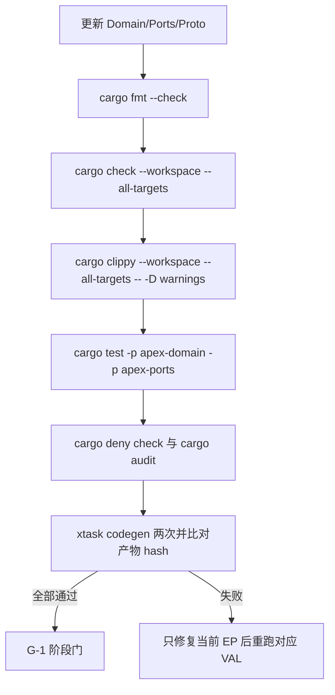
```mermaid
flowchart TD
    A[更新 Domain/Ports/Proto] --> B[cargo fmt --check]
    B --> C[cargo check --workspace --all-targets]
    C --> D[cargo clippy --workspace --all-targets -- -D warnings]
    D --> E[cargo test -p apex-domain -p apex-ports]
    E --> F[cargo deny check 与 cargo audit]
    F --> G[xtask codegen 两次并比对产物 hash]
    G -->|全部通过| Gate[G-1 阶段门]
    G -->|失败| Fix[只修复当前 EP 后重跑对应 VAL]
```

与 16 §7 的验证流程一致；五条 CI 线（fmt / check / clippy / test / deny）对应 WI-v0.1-03，任一红线即阻塞合并。

##### 5.2 六 target 矩阵

toolchain 由 `rust-toolchain.toml` pin；编译目标（RQ-004/005，03 §5）：

| OS | arch |
|---|---|
| macOS | x86_64 / aarch64 |
| Windows | x86_64 / aarch64 |
| Linux | x86_64 / aarch64 |

EP-0102 的 VAL-09 要求六 target dry-run 全部通过；`cfg(unix)`/`cfg(windows)` 只允许出现在 `apex-platform`、`apex-terminal` 等集成层（03 §5），S1 阶段业务 crate 尚无平台条件编译。

#### 6. 状态机

本模块自身不引入新状态机。它提供的状态枚举（04 §4）是其他模块状态机的字母表；VAL-13（16 §7）要求：新增枚举值只追加、旧值稳定编码不变、未知值往返保留——这是同 Major 兼容的编译/序列化层保障。

计划层的 `TaskStatus`/阻塞原因（EP-0004）映射到 04 §4 的 `BlockReason`，不新增平行枚举。

#### 7. 存储设计

本模块无运行期存储。与设计相关的落盘物：

| 路径 | 内容 | 说明 |
|---|---|---|
| `Cargo.toml` / `Cargo.lock` | workspace 清单与锁定依赖 | 应用型 workspace 必须提交 lock（03 §2） |
| `rust-toolchain.toml` | toolchain pin | EP-0102 |
| `deny.toml` | license/source/advisory 策略 | EP-0103 |
| `proto/apex/v1/*.proto` | Wire 唯一来源 | EP-0111 |
| `schemas/*.schema.json` | Spec/frontmatter schema | EP-0001 |
| `docs/` 编号注册表、追踪矩阵 | 计划基线 | EP-0002/0003，生成计划基线 hash（16 §6 验证步骤 4） |

#### 8. 错误处理与降级

- 错误模型由 `ApexError` 统一承载（04 §10），本模块是错误码 taxonomy 的唯一定义点；后续模块只追加各自 domain 的 code。
- lint 基线即错误处理纪律：`unwrap_used`/`expect_used` = deny（03 §6），迫使所有错误显式传播。
- 枚举未知值不报错、进入保留变体（见 §3）；这是"同 Major 追加式兼容"在反序列化层的降级路径。
- codegen 不可重复、依赖方向违规、漂移检查命中：均属构建期失败，无运行期降级。

#### 9. 安全与权限边界

- `unsafe_code = "deny"` 为 workspace 默认；仅 `apex-platform`/`apex-plugin-api`/loader 可局部 allow 且要求 SAFETY 注释与 Miri/平台测试（03 §5）。
- 依赖治理：新增依赖必须通过 `cargo deny`（license/source/advisory）、`cargo audit` 与维护性评审（03 §6）；`deny.toml` 是唯一策略源。
- 本模块不处理 Secret；但 `SecretResolver` Port 的返回类型约束（不得实现 `Serialize`/`Display`/`Debug` 明文输出，05 §2）在 Ports 编译边界即固定。

#### 10. 性能预算

本模块无运行期热路径，预算体现在构建与验证效率：

- CI 五条线在空 crate 基座上全绿，作为后续所有 PR 的回归基线（17 §5.1 WI-v0.1-03）。
- `codegen` 两次产物 hash 相同；生成耗时纳入 CI 计时但不设硬阈值（v0.1 proto 规模小）。
- Domain newtype 零成本：UUIDv7/ContentHash 均为 16/32 字节定长栈上类型，序列化只在边界发生。

#### 11. 测试与验证策略

| VAL | 覆盖 EP | 验证要点 |
|---|---|---|
| VAL-01 | EP-0001 | Spec schema 正/负 fixture |
| VAL-02 / VAL-02B | EP-0002/0003 | 编号重复/断号扫描；每个 RQ 有 AC/任务/证据 |
| VAL-03 | EP-0004 | 任务状态机非法迁移测试 |
| VAL-04 | EP-0005 | 证据目录路径与 trace 完整性 |
| VAL-05 | EP-0006 | 注入一处漂移必须失败 |
| VAL-06 | EP-0007 | 缺能力/冲突配置被拒绝 |
| VAL-07 | EP-0008 | 故障注入点清单审查 |
| VAL-08–10 | EP-0101–0103 | workspace 可解析；六 target dry-run；故意引入 warning CI 失败 |
| VAL-11–13 | EP-0104–0106 | ID 格式/排序/不可混用；值对象边界/序列化；枚举未知值往返 |
| VAL-14–16 | EP-0107–0109 | 错误映射/trace 完整性；事件版本/序列/未知字段；trace/idempotency |
| VAL-17 | EP-0110 | Ports 反向依赖扫描 |
| VAL-18 | EP-0111 | codegen 两次产物 hash 相同 |
| VAL-19 | EP-0112 | 假时钟/随机 ID/故障注入自测 |

测试纪律：单元 + 属性测试（ID 排序、序列化 round-trip 用 proptest）；G-1 通过标准是"workspace 可解析、生成代码可重复、Domain 不依赖 Adapter、所有基础错误包含 trace 能力"（16 §7）。

#### 12. 实施工作项

交付顺序按 17 §5.1（P5 CI 先行、P8 pin test 重排）：

| WI | 内容 | EP | 依赖 |
|---|---|---|---|
| WI-v0.1-01 | workspace、成员清单、toolchain、六 target 矩阵 | EP-0101/0102 | — |
| WI-v0.1-02 | rustfmt/clippy/deny/audit 基线 + pre-commit | EP-0103 | 01 |
| WI-v0.1-03 | CI 五条线 | EP-0006 | 01/02 |
| WI-v0.1-04 | Feature Spec 模板 + 编号注册表 | EP-0001/0002 | — |
| WI-v0.1-04b | EP-0009 | VAL-08 | 编码规范 §1.6b |
| WI-v0.1-05 | RQ→AC→EP→VAL 追踪矩阵脚本 | EP-0003 | 04 |
| WI-v0.1-06 | Domain newtype（UUIDv7/ContentHash/TraceId） | EP-0104 | 01 |
| WI-v0.1-07 | 时间/generation/幂等 key 值对象 | EP-0105 | 06 |
| WI-v0.1-08 | 状态枚举稳定编码 | EP-0106 | 06 |
| WI-v0.1-09 | ApexError taxonomy | EP-0107 | 07 |
| WI-v0.1-10 | EventEnvelope / NewEvent | EP-0108 | 06/09 |
| WI-v0.1-11 | CommandContext / Actor / Client identity | EP-0109 | 06/09 |
| WI-v0.1-12 | apex-ports 空实现编译边界 + 反向依赖扫描 | EP-0110 | 06–11 |
| WI-v0.1-13 | Protobuf Rust/TS codegen 可重复 | EP-0111 | 10/12 |
| WI-v0.1-14 | apex-test-support harness | EP-0008/0112 | 01–13 |
| WI-v0.1-04b | apex-macros 封装访问器宏 + CI pub 拦截 | EP-0009 | 01–13 |
| WI-v0.1-15 | TaskStatus/BlockReason + 证据目录约定 | EP-0004/0005 | 04 |
| WI-v0.1-16 | 平台/Provider/客户端能力矩阵 fixture | EP-0007 | 05 |

依赖要点：WI 01–03（CI 先行）在任何 Domain 代码前完成；WI-13 依赖 10（Envelope 是 Wire 事件载体）；WI-14 最后收口，供 M-02 起消费。

---

<!-- 源文件：docs/design/m02-storage-events.md -->

### 2. M-02 本地存储与事件溯源


#### 0. 元信息

| 项 | 值 |
|---|---|
| 模块编号 | M-02 |
| 版本归属 | v0.1（模块 B，见 17 §5.2）；EP-0202 实现延后至 v0.3、EP-0206 实现延后至 v0.2（见 §1.2） |
| 对应 EP | EP-0201–0214、EP-0219 |
| 对应 VAL | VAL-20–33、VAL-38 |
| 对应需求 | RQ-001、007–011、025–028、091、103、104、107–109、111、114、120、121、122 |
| 上游依赖 | 02-system-architecture §3/§6、04-domain-model §2/§7、05-trait-contracts §1–§4、07-storage-files-logging、16 §8、17 §5.2 |
| 下游消费者 | M-03（daemon/Session 运行时建立在 EventStore/投影之上）、M-05（Spec 文件事实）、M-06 起的全部副作用模块；M-09（窗口宿主经端点发现协议定位本项目 daemon） |

#### 1. 目标与范围

##### 1.1 目标

实现"可恢复的本地持久层"（16 §8，阶段门 G-2），向上层提供四类 Port 的真实适配器：

1. **路径与守护**：Apex Home 路径解析（EP-0201）、**项目级**单实例锁与 stale PID 检查（EP-0203）、本地 IPC 端点（EP-0204/0205，传输行为见 M-03）、配置加载（EP-0207）。本模块是**分片锚点**：Apex Home 分为用户级共享区与 `projects/<project-hash>/` 分片区，全部运行态路径经项目 hash 派生（`RQ-007`、`RQ-120`、`RQ-121`）。
2. **SQLite 运行事实**：WAL 打开与 busy 策略（EP-0208）、schema_meta/migration 目录（EP-0209）、EventStore append 事务（EP-0210）、session sequence 分配（EP-0211）、projector cursor 与批处理（EP-0212）、查询投影与 keyset 分页（EP-0213）。
3. **文件事实**：Markdown 原子写与 generation（EP-0214）。
4. **诊断日志**：Session JSONL sink 与 10 MiB 轮转（EP-0219）。

##### 1.2 不做什么（v0.1 范围裁剪）

按 17 §5.2 的延后说明，以下能力在本模块**登记设计锚点但不实现**，理由逐条对应：

- **CAS（EP-0217/0218）→ v0.2**：v0.1 的 Spec 文档用 Markdown 原子写即可，不需要内容寻址；代价是 v0.1 无附件去重，已显式接受（17 §5.2）。
- **watcher/三方合并（EP-0215/0216）→ v0.6**：随 Memory 外部编辑场景一起做；v0.1 不要求用户与 Agent 并发编辑同一 Markdown 的收敛保证。
- **归档（EP-0222/0223）→ v0.2/v0.9**：120/365 天保留窗口在 v0.1 生命周期内不会触发，备份随升级硬化一起做。
- **日志签名（EP-0221）→ v0.9**：Ed25519 seal/verify 依赖 keys 目录管理，v0.1 只保证 hash-chain 结构预留（见 §7）。
- **EP-0202（权限诊断）**实现落在 v0.3（17 §7.1 WI-v0.3-13），本文给出接口契约；v0.1 期间 0600/0700 权限由 EP-0201/0809 的创建路径就地保证，不做独立 doctor。
- **EP-0206（进程树 supervisor）**实现属 M-13（v0.2），本文不展开。

#### 2. 上游契约与引用

| 消费的定义 | 出处锚点 |
|---|---|
| 两个事实域与跨域 Prepare→文件替换→SQLite Commit→Reconcile 协议 | 02 §6.1 |
| EventEnvelope / NewEvent 字段与不变量（seq 单调、optimistic version） | 04 §7 |
| 事件类型目录 `apex.<domain>.<past-tense>.vN` | 04 §8 |
| `APEX_STORAGE_RECONCILIATION_CONFLICT` 等错误码 | 04 §10 |
| `EventStore`/`ProjectionStore`/`Projector`/`FileFactStore`/`SessionLogSink` Trait 签名 | 05 §3/§4/§13 |
| `CommandContext`、`Durability{Normal,Critical}`、`Consistency` | 05 §1 |
| Apex Home 双层目录树（用户级共享区 + 项目分片区）与权限（0700/0600） | 07 §2 |
| 用户级共享资源文件锁协议（shared/exclusive、超时、陈旧锁回收） | 07 §2.1 |
| SQLite 按项目分片、表分组、关键索引、事务与持久性规则 | 07 §4/§5 |
| 文件事实提交协议时序 | 07 §6 |
| Session JSONL 格式、轮转与 hash-chain | 07 §8 |
| EP→VAL 映射与 S2 崩溃注入验证步骤 | 16 §8 |
| v0.1 WI 拆分（WI-v0.1-17–29）与延后决策 | 17 §5.2 |

本模块不重新定义以上类型；表结构以 07 §4 为准，此处只给 v0.1 实际创建的子集。

#### 3. 领域模型

本模块不拥有领域类型，拥有的是**持久化映射规则**：

- `EventEnvelope`（04 §7）→ `domain_events` 表：`event_id` 主键；`(session_id, session_seq)` 唯一；`(aggregate_kind, aggregate_id, aggregate_version)` 唯一。payload 以原始 JSON 存 `payload_json`，未知字段随原文保留（同 Major 兼容，04 §7 不变量）。
- `NewEvent` 入库前由本模块分配 `event_id`（UUIDv7）、`session_seq`、`aggregate_version`，并写入 `occurred_at`（来自 `Clock` Port，禁止直接用系统时间，保证测试可注入假时钟）。
- `Generation`（04 §2）→ 文件事实的单调逻辑版本，由 FileFactStore 在每次 `atomic_write` 成功时 +1，与 mtime 无关。
- 会话日志记录（07 §8.2）是**诊断物**而非领域事件：通过 `event_id`/`trace_id` 与领域事件关联，但 Reducer 永不读取（07 §1"事件不等于日志"）。

#### 4. 接口设计

##### 4.1 HomePath 与项目分片（EP-0201）

```rust
// 位于 apex-platform crate；语义以 07 §2 为准
struct ApexHome { root: PathBuf /* ~/.apex，可用 APEX_HOME 覆盖（测试） */ }

/// 项目分片根：~/.apex/projects/<project-hash>/
/// <project-hash> 由项目根 realpath 归一化后取 BLAKE3 前缀派生（07 §2，RQ-121）
struct ProjectShard { hash: ProjectHash, dir: PathBuf }

impl ApexHome {
    fn resolve() -> ApexResult<Self>;            // 三 OS 路径 fixture（VAL-20）
    // 用户级共享区
    fn config_dir(&self) -> PathBuf;             // config/，0700
    fn keys_dir(&self) -> PathBuf;               // keys/，0700
    fn global_memory_dir(&self) -> PathBuf;      // memory/
    fn locks_dir(&self) -> PathBuf;              // locks/，0700（RQ-122）
    fn system_log_dir(&self) -> PathBuf;         // logs/system/
    fn shard(&self, project_root: &Path) -> ApexResult<ProjectShard>; // realpath → hash → 分片目录
}

impl ProjectShard {
    fn db_path(&self) -> PathBuf;                // projects/<hash>/apex.db
    fn runtime_dir(&self) -> PathBuf;            // projects/<hash>/runtime/，0700
    fn objects_dir(&self) -> PathBuf;            // projects/<hash>/objects/blake3/（v0.2）
    fn archives_dir(&self) -> PathBuf;           // projects/<hash>/archives/sessions/（v0.2）
    fn session_log_dir(&self, s: &SessionId, now: ...) -> PathBuf; // projects/<hash>/logs/sessions/<yyyy>/<mm>/
}
```

项目 hash 与分片目录均须 realpath 校验，拒绝符号链接逃逸；项目根路径在进入 hash 计算前先 realpath 归一化（07 §2、§9）。跨项目分片读写被硬禁止（02 §10 不变量 6）。

##### 4.1b 项目级单实例守护（EP-0203）

```rust
trait SingletonGuard {
    // 锁落在 projects/<hash>/runtime/apexd.lock
    fn acquire(shard: &ProjectShard) -> ApexResult<SingletonLease>;
}
```

锁协议：创建 `apexd.lock`（O_EXCL），写入 `pid + start_time + boot_id + project_hash`；已存在时读取并检查 PID 存活与 start_time/boot_id 匹配。

- **同项目重复打开**（锁被持有且项目 hash 相同）：不新建 daemon，窗口宿主转为**聚焦已有窗口**（`RQ-120`、`AC-023`）。
- **stale**（PID 不存活或 start_time/boot_id 不匹配）：回收锁并继续本进程拉起。
- **不同项目**：锁路径不同，互不干扰，可并存多 daemon（`RQ-007`、`AC-024`）。

假 PID/双启动由 VAL-22 覆盖。Windows 用按项目 hash 命名的 named Mutex + lock 文件双保险。

##### 4.2 本地 IPC 端点（EP-0204/0205）

- Unix：监听 `~/.apex/projects/<project-hash>/runtime/apexd.sock`；受 `sun_path` 长度限制时回退到 `/tmp/apex-<user>-<project-hash>.sock`（02 §3，RQ-121）；socket 文件 0600，父目录 0700；握手前的 ACL/peer-cred 校验在 M-03 §4 展开。
- Windows：`\\.\pipe\apex-<user-sid-hash>-<project-hash>`，ACL 仅当前用户与必要系统主体（02 §3）。
- 两者承载相同 Proto 契约（06 §1），VAL-23/24 覆盖 ACL、重连与并发。
- **端点发现**：Desktop/Web 客户端按项目 hash 派生端点定位同项目 daemon；跨项目 socket 枚举 API 供窗口宿主与 doctor 使用（RQ-121）。

##### 4.3 EventStore append 事务（EP-0210/0211）

实现 05 §3 的 `EventStore::append`，单 SQLite 事务内完成：

```sql
BEGIN IMMEDIATE;
-- 1. 聚合乐观锁：读 aggregate_versions，版本 != expected_version → APEX_EVENT_VERSION_CONFLICT
-- 2. 分配 session_seq：UPDATE sessions SET last_seq = last_seq + 1 ... RETURNING last_seq
-- 3. INSERT domain_events（每个 NewEvent 一行，session_seq 连续递增）
-- 4. UPSERT aggregate_versions（expected+N）
-- 5. INSERT event_outbox / 必要同步投影（同事务，见 05 §3）
COMMIT; -- durability=Critical 时先 PRAGMA synchronous=FULL
```

不变量：同 Session `session_seq` 连续单调不复用（04 §7）；重复 `idempotency_key`（CommandContext 携带）在 admission 边界去重返回原 `AppendReceipt`，不重复副作用（VAL-29）；并发 append 竞争由 `BEGIN IMMEDIATE` + 唯一索引兜底，冲突方收到版本错误而非 last-write-wins（VAL-30 并发无 gap）。

##### 4.4 Projector 与查询（EP-0212/0213）

- `Projector`（05 §3）：按 `projection_cursors(projector_id, last_event_id)` 驱动；`reduce` 批次写入投影表并推进 cursor，同一事务提交；未知 `event_type`/`schema_version` 跳过并保留（05 §3），重放全部事件后投影内容 hash 必须一致（VAL-31）。
- 查询投影：`sessions(updated_at DESC, id)` 覆盖索引 + keyset 分页，禁止大 OFFSET（07 §4）；`SessionQuery` 返回 `SessionPage { items, next_cursor }`，cursor 为 `(updated_at, id)` 的不透明编码。10k 会话 P95 ≤ 500 ms（07 §12，VAL-32 基准）。

##### 4.5 FileFactStore（EP-0214）

实现 05 §4 `atomic_write`：同目录临时文件 → 继承目标权限位 → flush + fsync → 原子 `rename` → 目录 fsync → Critical 事务提交 `generation/hash/event/index`（07 §6 时序）。`expected_generation` 不匹配返回冲突错误。平台无法保证原子替换时返回能力错误并使用恢复 journal，不假装成功（05 §4）。崩溃注入（rename 后 DB 提交前 kill）由 reconciliation 按 frontmatter 的 generation/write_token 补齐索引（07 §6，VAL-33）；v0.1 的 reconcile 只做"文件在、索引缺"方向的补齐，`ReconciliationConflict` 方向（DB 有、文件缺）报错阻塞，不做 CAS 恢复（CAS 在 v0.2）。

##### 4.6 SessionLogSink（EP-0219）

实现 05 §13 `SessionLogSink::append`：

- 路径与文件名按 07 §8.1：`logs/sessions/<yyyy>/<mm>/<ts>_<session-id>_0001.jsonl`，单段达到 10 MiB 前封口开 `_0002`，不拆分单条记录。
- 每行字段含 `schema/kind/ts/session_id/trace_id/.../prev_hash/record_hash`；hash 计算用 RFC 8785 风格确定性 JSON canonicalization，排除 `record_hash` 自身（07 §8.2）。
- v0.1 写 `segment_header`/`agent_activity`/`tool_call`/`segment_footer` 等 kind；footer 的 `signature` 字段在 v0.1 留空（Ed25519 签名属 v0.9 EP-0221），但 hash-chain（`prev_hash`）从 v0.1 就完整写入，保证 v0.9 引入签名时旧段仍可验证链。
- `payload.mode=metadata` 为唯一默认；`full_debug` 开关及其高风险提示在 v0.1 不提供。

#### 5. 数据流与关键流程

##### 5.1 Event append + 投影（一次 Turn 的持久化视角）

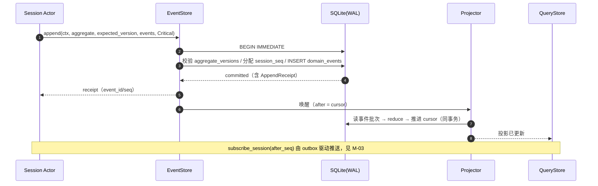
```mermaid
sequenceDiagram
    autonumber
    participant S as Session Actor
    participant ES as EventStore
    participant DB as SQLite(WAL)
    participant PJ as Projector
    participant Q as QueryStore

    S->>ES: append(ctx, aggregate, expected_version, events, Critical)
    ES->>DB: BEGIN IMMEDIATE
    ES->>DB: 校验 aggregate_versions / 分配 session_seq / INSERT domain_events
    DB-->>ES: committed（含 AppendReceipt）
    ES-->>S: receipt（event_id/seq）
    ES->>PJ: 唤醒（after = cursor）
    PJ->>DB: 读事件批次 → reduce → 推进 cursor（同事务）
    PJ-->>Q: 投影已更新
    Note over S,Q: subscribe_session(after_seq) 由 outbox 驱动推送，见 M-03
```

##### 5.2 Markdown 原子写崩溃恢复（EP-0214）

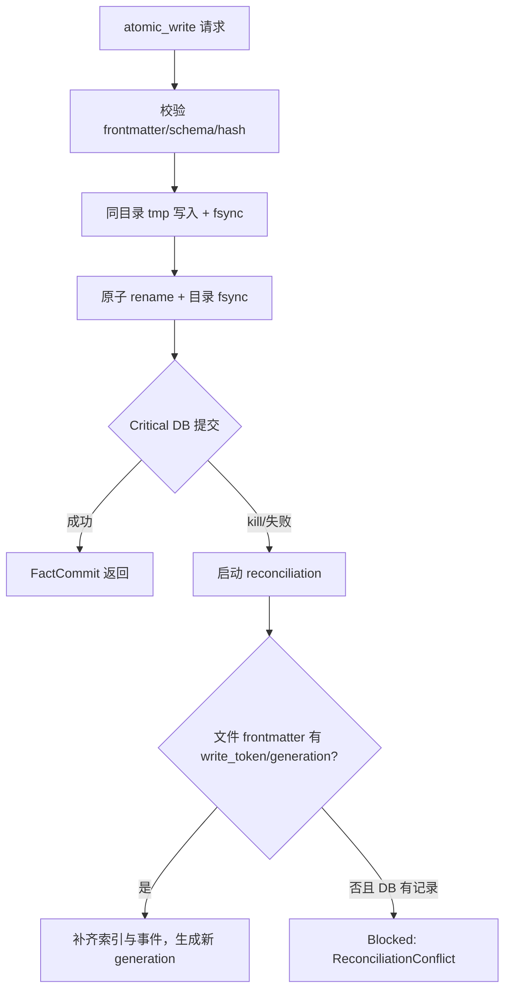
```mermaid
flowchart TD
    W[atomic_write 请求] --> V[校验 frontmatter/schema/hash]
    V --> T[同目录 tmp 写入 + fsync]
    T --> R[原子 rename + 目录 fsync]
    R --> D{Critical DB 提交}
    D -->|成功| C[FactCommit 返回]
    D -->|kill/失败| REC[启动 reconciliation]
    REC --> F{文件 frontmatter 有 write_token/generation?}
    F -->|是| FIX[补齐索引与事件，生成新 generation]
    F -->|否且 DB 有记录| BLK[Blocked: ReconciliationConflict]
```

#### 6. 状态机

本模块不新增状态枚举。相关的持久化状态机约束：

- 迁移状态（`migration_history`）：`started → applied | failed`；启动时发现 `started` 悬挂记录即进入中断恢复：校验 partial 标记可重入后重放该迁移，重放仍失败则只读恢复模式并报 `APEX_STORAGE_MIGRATION_INTERRUPTED`（VAL-28 覆盖重复迁移与中断恢复）。该状态名是表内实现细节，不进入 04 §4 权威枚举。
- Session/Tool 等领域状态机由 04 §4/§5 定义，本模块只负责其事件载体的持久化。

#### 7. 存储设计

##### 7.1 v0.1 实际创建的表（07 §4 分组的子集）

| 分组 | v0.1 表 |
|---|---|
| 元数据 | `schema_meta`、`schema_features`、`migration_history`、`writer_leases` |
| Project | `projects`、`project_trust`（字段从简，信任门见 M-07） |
| Session | `sessions`、`runs`、`turns`、`agent_messages`、`prompt_inbox` |
| Event/Projection | `domain_events`、`aggregate_versions`、`projection_cursors`、`event_outbox` |
| Spec/控制 | `spec_index`、`approvals`、`skip_grants` |
| Permission（简化） | `permission_requests`、`permission_grants` |
| Context（最小） | `context_epochs`（v0.1 仅记录 epoch 序号/hash，见 M-08） |

`schema_meta` 记录 `schema_major/schema_minor`；`schema_features` 记录已启用迁移 feature 位。`writer_leases` 支撑 `APEX_SCHEMA_WRITER_TOO_OLD`：writer 的 schema_major 低于库时拒绝写入（04 §10 错误码复用）。

##### 7.2 SQLite 物理参数（EP-0208）

`PRAGMA journal_mode=WAL; synchronous=NORMAL; busy_timeout=5000; foreign_keys=ON;`；单写连接 + 受控读池（07 §5）；`Durability::Critical` 命令在事务前临时 `synchronous=FULL`，提交后恢复。Provider/Tool 等长耗时调用不得持有写事务（07 §5）。启动 `quick_check`，失败进只读恢复模式。

##### 7.3 文件布局

按 07 §2/§3 的双层结构：

- **用户级**（多 daemon 共享，写需锁）：`config/`、`auth.json`、`memory/`（全局 Memory，v0.6 启用）、`skills/`、`plugins/`、`keys/`、`backups/`、`update/`、`logs/system/`、`locks/`。
- **项目分片**（每 daemon 独占）：`projects/<project-hash>/{apex.db, runtime/, logs/sessions/, cache/}`；`objects/`（CAS，v0.2）、`archives/`（v0.2）由对应版本的首个使用者在分片内创建。
- **项目内**：`<project>/.apex/{specs/, memory/, checkpoints/}` 为 Markdown 事实源。

v0.1 创建的子集：分片内 `apex.db`、`runtime/`、`logs/sessions/`、`cache/`；用户级 `config/`。CAS、归档、备份、密钥目录在 v0.1 不创建。

##### 7.4 保留策略

daemon 不常驻（RQ-119）。v0.1 会话日志 120 天保留字段已写入 header，清理任务随归档（v0.2+）以"打开项目时惰性执行 + 关窗前尽力执行"实现（14 §9）；WAL checkpoint 由空闲与页数阈值调度，**关窗前强制一次**以避免下次启动重放开销，禁止在活跃 Tool 热路径做阻塞 full checkpoint（07 §12、14 §9）。

#### 8. 错误处理与降级

| 场景 | 行为 | 错误码 |
|---|---|---|
| 聚合版本冲突 | 返回冲突，调用方重读后重试 | `APEX_EVENT_VERSION_CONFLICT`（追加到 04 §10 taxonomy 的本 domain 码） |
| 重复 idempotency key | 返回原 AppendReceipt，无副作用 | —（成功路径） |
| DB/WAL 损坏（quick_check 失败） | 只读恢复模式，禁止 Agent/Tool | `APEX_STORAGE_CORRUPT` |
| 文件已替换 DB 未提交 | reconciliation 补齐 | — |
| DB 已提交文件缺失 | 阻塞，禁止空文件覆盖（07 §6） | `APEX_STORAGE_RECONCILIATION_CONFLICT` |
| 迁移中断 | 重入重放；失败则只读 | `APEX_STORAGE_MIGRATION_INTERRUPTED` |
| writer schema 过旧 | 拒绝写入 | `APEX_SCHEMA_WRITER_TOO_OLD` |

降级原则：任何无法证明顺序/完整性的状态保守阻塞（02 §10 不变量 3），绝不静默修复。

#### 9. 安全与权限边界

- 目录权限：Unix Home/config/runtime 0700、Secret/私钥 0600；Windows 当前用户 SID ACL，拒绝继承宽权限时给高风险诊断（07 §2）。v0.1 在创建路径就地设置并校验，独立 doctor 在 v0.3（EP-0202）。
- 端点 ACL：socket 0600 / pipe SID ACL；客户端身份进一步由握手 nonce 确认（M-03）。
- Secret 边界：Provider Key、原始终端全文、模型全文、会话日志全文不得写入 SQLite（07 §4）；进入 DB 前由 Secret Firewall 拒绝（07 §5）。
- 锁文件/DB 路径不接受符号链接逃逸：`ApexHome::resolve` 对 root 做 realpath 校验，拒绝位于其他用户可写目录下的 Home。

#### 10. 性能预算

| 指标 | 预算 | 出处 |
|---|---|---|
| Session 列表 10k keyset 分页 | P95 ≤ 500 ms | 07 §12，VAL-32 |
| Event append（Normal） | 单事务 P95 ≤ 5 ms（本地 NVMe 参考值） | 16 §8 验证族 |
| Projector 追平 | 空闲时 1s 内追平突发 1k 事件 | 07 §12 流式消费约束 |
| 会话日志写入 | 不阻塞 Turn 热路径，批量 flush ≤ 100 ms | 07 §12 |

#### 11. 测试与验证策略

| VAL | EP | 要点 |
|---|---|---|
| VAL-20 | 0201 | 三 OS 路径 fixture（含长路径、空格、非 ASCII） |
| VAL-21 | 0202 | 0600/ACL 正负测试（v0.3 执行，本模块预留 fixture） |
| VAL-22 | 0203 | 双启动只连第一实例；伪造 PID/start_time 被识别为 stale |
| VAL-23/24 | 0204/0205 | 端点 ACL、断线重连、并发连接 |
| VAL-26 | 0207 | TOML 未知字段 round-trip 保留 |
| VAL-27 | 0208 | pragma 生效；并发 writer 串行化无 `SQLITE_BUSY` 外泄 |
| VAL-28 | 0209 | 重复迁移幂等拒绝；中断迁移重入恢复 |
| VAL-29 | 0210 | optimistic conflict 返回错误；重复 key 无副作用 |
| VAL-30 | 0211 | 并发 append 下 seq 无 gap 无复用 |
| VAL-31 | 0212 | 全量重放投影 hash 一致；未知事件跳过且保留 |
| VAL-32 | 0213 | 10k 会话 keyset 分页基准 |
| VAL-33 | 0214 | rename/fsync 崩溃注入；权限位继承；expected_generation 冲突 |
| VAL-38 | 0219 | JSONL schema、hash-chain 连续、10 MiB 轮转不拆行 |

契约纪律：内存 fake 不能替代真实 SQLite/文件系统的故障测试（05 §15）；S2 关键验证步骤 1–3（双实例、四类崩溃点注入、重启收敛检查）为本模块的 G-2 出口（16 §8）。

#### 12. 实施工作项

按 17 §5.2 模块 B（WI-v0.1-17–29），交付顺序即依赖拓扑：

| WI | 内容 | EP | 依赖 |
|---|---|---|---|
| WI-v0.1-17 | Apex Home 路径解析 + 项目分片派生（realpath/BLAKE3） | EP-0201 | M-01 基座 |
| WI-v0.1-18 | 项目级单实例锁 + stale 检查 + 同项目重开转聚焦 | EP-0203 | 17 |
| WI-v0.1-19/20 | 分片 UDS / NamedPipe listener + 端点发现 | EP-0204/0205 | 18、M-01 codegen |
| WI-v0.1-21 | TOML 配置加载（未知字段保留） | EP-0207 | 17 |
| WI-v0.1-22 | SQLite bootstrap（WAL/busy/pragma） | EP-0208 | 17 |
| WI-v0.1-23 | schema_meta/migration 执行器 | EP-0209 | 22 |
| WI-v0.1-24 | EventStore append 事务 | EP-0210 | 23 |
| WI-v0.1-25 | session sequence 分配 | EP-0211 | 24 |
| WI-v0.1-26 | projector cursor 与批处理 | EP-0212 | 24/25 |
| WI-v0.1-27 | Query store + keyset 分页 | EP-0213 | 26 |
| WI-v0.1-28 | Markdown 原子写 | EP-0214 | 17 |
| WI-v0.1-29 | Session JSONL sink | EP-0219 | 17 |

关键路径：17→22→23→24→25→26→27；listener（19/20）与文件/日志支线（28/29）可与 DB 主线并行。

---

<!-- 源文件：docs/design/m03-daemon-session.md -->

### 3. M-03 daemon 与 Session 运行时


#### 0. 元信息

| 项 | 值 |
|---|---|
| 模块编号 | M-03 |
| 版本归属 | v0.1（模块 C，见 17 §5.3） |
| 对应 EP | EP-0301、EP-0302、EP-0306、EP-0307（含 Agent Loop）、EP-0314 |
| 对应 VAL | VAL-43、VAL-44、VAL-48、VAL-49、VAL-56 |
| 对应需求 | RQ-001、009、012、021、024、026、068、111 |
| 上游依赖 | 02 §2–§5、04 §4/§5/§7、05 §1/§5、06 §1–§3、16 §9、17 §5.3；M-01（协议 codegen）、M-02（EventStore/投影/端点） |
| 下游消费者 | M-04（Provider 由 Agent Loop 驱动）、M-06（Tool Gateway 由 Loop 调用）、M-08（ContextEpoch 构建）、M-09（TUI 客户端） |

#### 1. 目标与范围

##### 1.1 目标

交付 `apexd` 进程的运行时骨架与单会话执行内核，对应阶段门 G-3 的 v0.1 子集：

1. **接入层**：UDS/NamedPipe 上的 gRPC 服务、ClientHello/ServerHello 版本协商（EP-0301）、identity/trace/idempotency interceptor（EP-0302）。
2. **Admission**：durable prompt inbox——先持久化、后确认、再唤醒（EP-0306，02 §1 原则 3）。
3. **执行内核**：Session Actor 串行提升 Turn（EP-0307）+ Agent Loop 主循环（WI-v0.1-34，含于 EP-0307 范围）。
4. **生命周期**：graceful shutdown/drain（EP-0314）。daemon 由窗口宿主拉起并随窗口退出（RQ-119），drain deadline 较常驻语义缩短：长 Tool/DAG 无法等待用户关窗，必须到达安全点收尾；关窗超时强制退出后未知副作用比例上升，未完成任务标记为可恢复中断，下次启动按恢复流程分类（§8 "shutdown 超期"行同步）。

参照 Reasonix `internal/control/controller.go:1-9` 的"transport-agnostic controller"模式：一个编排层服务所有前端，前端只发命令、渲染事件，不重新实现 Turn 生命周期——本模块的 Session Actor 即该模式在 Apex 的落点。

##### 1.2 不做什么

按 17 §5.3 延后说明：

- **REST/WebSocket（EP-0303/0304）→ v1.2**；**Snapshot+since_seq 重连合并（EP-0305）→ v0.2**。v0.1 的 TUI 断线重连退化为"重拉全量 Snapshot + 从头订阅"，短会话可接受。
- **控制租约与强制接管（EP-0308/0309）→ v1.1 前不需要**：TUI 单控制端场景下租约恒成立，此退化已记入风险登记册备注（17 §5.3）；本文 §6 给出预留点。
- **Web lease/auth（EP-0310–0312）→ v1.2**；**活动投影（EP-0313）→ v0.4**。
- 不实现 Subagent/DAG（v0.4/v0.7）；Agent Loop v0.1 只跑单 Agent 单会话。

#### 2. 上游契约与引用

| 消费的定义 | 出处锚点 |
|---|---|
| Admission 先持久化、Durable/Transient 分离原则 | 02 §1 原则 3/6 |
| Session 状态机与安全点定义 | 04 §5 |
| `SessionStatus`/`RunStatus`/`BlockReason` 枚举 | 04 §4 |
| 事件目录（`run.admitted`、`inbox.accepted`、`turn.started` 等） | 04 §8 |
| `SessionService`/`SessionRuntime` Trait 与"Admission 只表示已持久化" | 05 §5 |
| Prompt Admission 组合事务顺序 | 05 §14 |
| ClientHello/ServerHello 字段与版本协商规则 | 06 §2 |
| 本地 gRPC 服务清单与 CommandMeta | 06 §3 |
| 错误传输映射（gRPC status ↔ ApexError） | 06 §12 |
| 核心运行时序（Admission→Spec Gate→Provider→Tool） | 02 §4 |
| S3 EP/VAL 注册与验证时序 | 16 §9 |
| v0.1 WI 拆分（WI-v0.1-30–35） | 17 §5.3 |

#### 3. 领域模型

本模块不拥有新类型，消费并驱动：

- `Session`/`Run`/`Turn` 聚合（04 §3）：Actor 是 Session 聚合的唯一写者，符合单写者原则（02 §1 原则 1）。
- 状态机字母表（04 §4/§5）：Actor 的 reducer 只允许状态机内合法迁移；`Blocked` 必须携带 `BlockReason`。
- `prompt_inbox` 条目：`(session_id, idempotency_key, payload, state, admitted_at)`，同 session 内 idempotency key 唯一（07 §4 索引）；`state ∈ {pending, promoted, consumed}` 为表内实现状态，不进入 04 §4 权威枚举。
- Wire 层：`CommandMeta`（06 §3）中的 `idempotency_key`/`traceparent` 由 interceptor 提取并构造 `CommandContext`（05 §1）。

#### 4. 接口设计

##### 4.1 握手（EP-0301）

实现 `HandshakeService.Connect`（06 §3）。规则（06 §2）：

- `protocol_major` 不等 → `APEX_PROTOCOL_CLIENT_TOO_OLD` / `APEX_PROTOCOL_SERVER_TOO_OLD`。
- 同 Major 取 `min(client_minor, server_minor)` 为 `negotiated_minor`；`disabled_features` 必须带机器可读 reason。
- 握手同时校验 OS 用户身份：UDS 用 `SO_PEERCRED`/`getpeereid`，Named Pipe 用 SID 比对（02 §3）；v0.1 无控制租约，握手成功即获得命令提交资格。
- `nonce`/`server_nonce` 双向回显防重放；握手结果（client_kind、协商版本）写系统日志（带 trace），不写事件。

##### 4.2 gRPC interceptor（EP-0302）

tonic `Interceptor` 链（顺序固定）：

1. **identity**：从连接级 peer 信息 + 握手会话取 `ClientIdentity`；未握手连接的非 Handshake 调用 → `UNAUTHENTICATED`。
2. **trace**：解析 `traceparent`（W3C）；缺失时生成新 trace（maintenance trace 仅用于后台任务，客户端命令必须有 trace）。
3. **idempotency**：Command 类 RPC 必须带 `idempotency_key`；命中 `idempotency_key + method` 已完成记录时直接返回首个结果（06 §3"网络中断重试相同 key 不会重复执行"）。
4. **error mapping**：统一把 `ApexError` 映射到 gRPC status（06 §12 表），响应始终含 `code/trace_id/message_key/retryable/actions`。

##### 4.3 Durable prompt inbox（EP-0306）

`SessionService::submit_prompt` 的组合事务（05 §14 第一行）：

```text
校验请求 → 幂等检查（prompt_inbox 同 key 命中 → 返回原 AdmissionReceipt）
→ 同事务：INSERT prompt_inbox + append inbox.accepted 事件
→ 返回 AdmissionReceipt(trace_id, session_seq)
→ 异步 SessionRuntime::wake(session_id)
```

Admission 只表示已持久化，不表示开始执行（05 §5）。崩溃恢复时 `recover_all` 扫描 `state=pending` 的 inbox 条目并重新唤醒对应 Actor（VAL-48 覆盖重复提交/崩溃）。

##### 4.4 SessionRuntime / Session Actor（EP-0307）

- 每 Session 一个 Actor，mailbox 串行处理：`PromptMsg`、`CancelMsg`、`ShutdownMsg`、`WakeMsg`。
- `wake` 是幂等信号：Actor 已在运行则为 no-op；未运行则启动处理循环。
- Actor 从 inbox 按 `admitted_at` 顺序取出 `pending` 条目**提升为 Turn**：同事务内标记 `promoted`、创建 `turns` 行、append `turn.started` 事件。串行提升保证同一 Session 同时只有一个前台 Turn（对照 Reasonix `ErrTurnRunning`，controller.go:63-64）。
- Turn 执行即 Agent Loop（§5.2）；Turn 结束（成功/失败/中断）同事务写 `turn.completed`/`turn.interrupted` + inbox `consumed` + 投影。
- 每个项目 daemon 的 Session Actor 注册表相互独立；跨项目 Session 不在同一注册表（02 §10 不变量 6）。

##### 4.5 graceful shutdown（EP-0314）

窗口宿主发起 `daemon.RequestShutdown(deadline)` RPC 触发（RQ-119）；drain 超期未完成时由宿主发送 `SIGTERM` 兜底：

1. 停止接受新连接与新 Admission（返回 `UNAVAILABLE`，retryable）。
2. 通知所有 Actor 到达**安全点**（04 §5：Provider 请求之间、Tool 执行前后）；正在执行的 Tool 允许跑完或在 Tool 边界中断并落 `Interrupted`。
3. `reach_safe_point` 带 deadline（05 §5）；超期仍未到安全点的 Turn 标记 `Interrupted`，不强行 kill 线程。
4. 刷盘：投影 cursor 追平、Session JSONL 当前段封口、WAL checkpoint（非阻塞式）。
5. 释放本项目分片的单实例锁、删除/保留本项目 socket 文件（均在 `~/.apex/projects/<project-hash>/runtime/`，07 §2），退出。

v0.1 无 Checkpoint（v0.2 才引入），关闭前的恢复头就是最近一个已提交 Turn 边界——这是 v0.1 已知限制，随 WI-v0.1-64 的截断策略一起在 v0.2 被取代。

#### 5. 数据流与关键流程

##### 5.1 Admission 到 Turn（02 §4 的 v0.1 裁剪版）

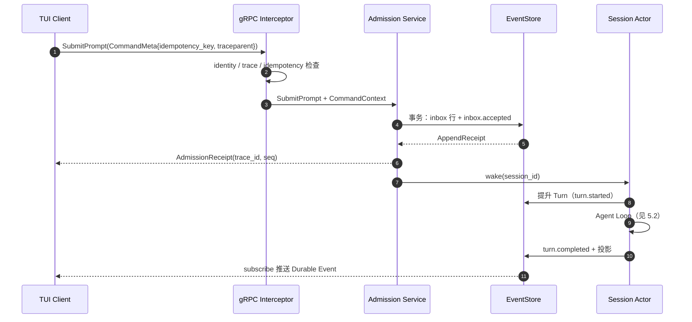
```mermaid
sequenceDiagram
    autonumber
    participant C as TUI Client
    participant G as gRPC Interceptor
    participant A as Admission Service
    participant ES as EventStore
    participant S as Session Actor

    C->>G: SubmitPrompt(CommandMeta{idempotency_key, traceparent})
    G->>G: identity / trace / idempotency 检查
    G->>A: SubmitPrompt + CommandContext
    A->>ES: 事务：inbox 行 + inbox.accepted
    ES-->>A: AppendReceipt
    A-->>C: AdmissionReceipt(trace_id, seq)
    A->>S: wake(session_id)
    S->>ES: 提升 Turn（turn.started）
    S->>S: Agent Loop（见 5.2）
    S->>ES: turn.completed + 投影
    ES-->>C: subscribe 推送 Durable Event
```

##### 5.2 Agent Loop 主循环（WI-v0.1-34）

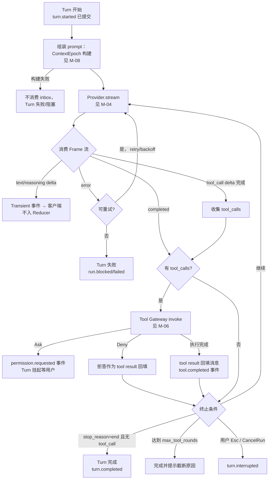
```mermaid
flowchart TD
    Start[Turn 开始<br/>turn.started 已提交] --> Assemble[组装 prompt：<br/>ContextEpoch 构建<br/>见 M-08]
    Assemble -->|构建失败| Hold[不消费 inbox，<br/>Turn 失败/阻塞]
    Assemble --> Req[Provider.stream<br/>见 M-04]
    Req --> Frames{消费 Frame 流}
    Frames -->|text/reasoning delta| Transient[Transient 事件 → 客户端<br/>不入 Reducer]
    Frames -->|tool_call delta 完成| TC[收集 tool_calls]
    Frames -->|error| PErr{可重试?}
    PErr -->|是， retry/backoff| Req
    PErr -->|否| FailT[Turn 失败<br/>run.blocked/failed]
    Frames -->|completed| Done{有 tool_calls?}
    TC --> Done
    Done -->|是| GW[Tool Gateway invoke<br/>见 M-06]
    GW -->|Ask| AskU[permission.requested 事件<br/>Turn 挂起等用户]
    GW -->|Deny| Back1[拒答作为 tool result 回填]
    GW -->|执行完成| Back[tool result 回填消息<br/>tool.completed 事件]
    Back1 --> Loop
    Back --> Loop{终止条件}
    Done -->|否| Loop
    Loop -->|stop_reason=end 且无 tool_call| Fin[Turn 完成<br/>turn.completed]
    Loop -->|达到 max_tool_rounds| FinW[完成并提示截断原因]
    Loop -->|用户 Esc / CancelRun| Intr[turn.interrupted]
    Loop -->|继续| Req
```

终止条件（v0.1）：模型 stop 且无未执行 tool_call；达到 `max_tool_rounds`（防失控，默认 50，配置可调）；用户中断；不可重试 Provider/Tool 错误。每个条件触发都有对应 Durable Event；Ask 挂起不算 Turn 结束，恢复后从同一 tool_call 继续（M-06 的 `resume_after_permission`）。

##### 5.3 事件推送

`subscribe_session(after_seq)`（05 §3）由 EventStore outbox 驱动：append 事务提交后唤醒订阅者，按 `session_seq` 顺序推送。v0.1 无保留窗口裁剪（事件不删），因此不会触发 `RESYNC_REQUIRED`；该错误路径的客户端行为仍在协议层定义（06 §7），供 v0.2 引入窗口后直接使用。

#### 6. 状态机

Session/Run 状态机以 04 §5 为唯一权威，此处只登记 Actor 侧的**驱动规则**：

- `Idle → Running`：仅在 inbox 提升 Turn 成功（事件已提交）后发生。
- `Running → Blocked`：Spec 未批准、权限 Ask 超时策略、Provider 不可用等，必须带 `BlockReason`（04 §4）。
- `Running → Completing → Completed`：v0.1 的 Verification Gate 只有简化确认（M-05/M-07），`VerificationAccepted` 的完整语义在 v0.3 补全。
- 安全点枚举（04 §5）：Provider 请求之间、Tool 执行前后。Agent Loop 在 §5.2 的 `Req` 与 `GW` 两个节点检查 cancel/shutdown 标志——这是 `reach_safe_point` 与 Esc 中断（M-09 EP-1204）的挂接点。

控制租约状态机（06 §6）在 v0.1 **不实现**；预留点：`CommandMeta.control_lease_token` 字段已存在于协议（06 §3），v0.1 服务端忽略之，v1.1 启用校验时旧客户端不需要改协议。

#### 7. 存储设计

本模块不新增表，消费 M-02 的：

| 表 | 用途 |
|---|---|
| `prompt_inbox` | durable inbox；`(session_id, state, admitted_at)` 索引、idempotency key 唯一（07 §4） |
| `sessions`/`runs`/`turns` | 聚合状态行；`sessions.last_seq` 驱动 session sequence |
| `domain_events` | `inbox.accepted`/`turn.started`/`turn.completed` 等载体 |

运行期内存结构：Actor 注册表 `HashMap<SessionId, ActorHandle>`（daemon 重启即丢，状态全在 SQLite，Actor 可由 `recover_all` 按需重建）；每 Session 一个 mpsc mailbox，容量有界（背压时 Admission 仍成功，wake 合并为一次信号）。

#### 8. 错误处理与降级

| 场景 | 行为 |
|---|---|
| 协议 major 不兼容 | 握手失败，返回对应错误码，不建立会话 |
| 未握手调用业务 RPC | `UNAUTHENTICATED`（VAL-44） |
| 重复 idempotency key | 返回首个结果，不重复执行（VAL-44/48） |
| Actor 崩溃（panic 被 catch_unwind 捕获） | 标记当前 Turn `Interrupted`、Session `Failed`，其他 Session 不受影响；Actor 注册表剔除后可由 wake 重建 |
| Provider 永久错误 | `run.blocked{reason: ProviderUnavailable}` 或 Turn 失败，保留已持久化事件 |
| shutdown 超期 | Turn 标记 `Interrupted`，不 kill 线程；关窗路径下 drain deadline 缩短，超期强制退出后未知副作用比例上升，进程退出后由下次启动的恢复流程分类（v0.2 EP-0522 才做 UnknownSideEffect 细分，v0.1 一律保守视为不可自动恢复） |

#### 9. 安全与权限边界

- 端点只对本用户开放（M-02 §4.2 的 ACL）；握手 nonce 防止同机其他进程重放握手。
- 客户端不可信输入在 interceptor 边界全部校验：request 大小上限、UTF-8 校验、idempotency key 格式。
- Session 之间隔离：Actor 只能访问自己 Session 的 inbox/事件；跨 Session 查询走 QueryStore 投影，不触 Actor。
- 每项目 daemon 对应一个窗口宿主客户端；Desktop/Web 经端点发现（RQ-121）连入同项目 daemon 时按控制租约竞争。v0.1 无控制租约意味着窗口宿主客户端即唯一命令提交端——单机单用户模型下可接受，已在 17 §5.3 登记；v1.2 引入多控制端前必须完成 EP-0308/0309。

#### 10. 性能预算

| 指标 | 预算 | 出处 |
|---|---|---|
| Admission P95（本地 UDS，含事务） | ≤ 50 ms | 16 §9 验证族；RQ-114 的 baseline 在 v0.9 EP-1113 固化 |
| wake → Turn 开始 | ≤ 100 ms（无排队时） | G-3 目标 |
| 单项目 daemon Session 数 | v0.1 目标单项目 daemon 100 活跃 Session，RSS 增长有界；多项目并存 Session 数 = Σ 单项目 | 15 §7（pressure suite 在 v0.9） |
| shutdown drain | 安全点等待 ≤ 30 s，超期强制收尾 | EP-0314 |

#### 11. 测试与验证策略

| VAL | EP | 要点 |
|---|---|---|
| VAL-43 | 0301 | major/minor/feature 协商矩阵；过旧客户端/服务端被拒 |
| VAL-44 | 0302 | 未认证拒绝；重复 idempotency key 返回原结果；trace 贯通到事件 |
| VAL-48 | 0306 | 重复提交无副作用；Admission 后 kill daemon，重启后 inbox 条目被恢复消费 |
| VAL-49 | 0307 | 并发 SubmitPrompt 串行成 Turn；安全点语义（中断不留下半个 Turn 事件） |
| VAL-56 | 0314 | Tool 执行中收到 shutdown：安全点等待、超期标记 Interrupted、日志段封口 |

补充：WI-v0.1-34 要求"假 Provider 全循环 E2E"——用 apex-test-support 的假 Provider 驱动 §5.2 全环，覆盖 tool_call 回填、Esc 中断、max_tool_rounds 截断。故障注入点：inbox 事务后、turn.started 后、Tool 执行中、turn.completed 前。

#### 12. 实施工作项

按 17 §5.3 模块 C：

| WI | 内容 | EP | 依赖 |
|---|---|---|---|
| WI-v0.1-30 | ClientHello/ServerHello 版本协商 | EP-0301 | M-01 codegen、M-02 listener |
| WI-v0.1-31 | gRPC interceptor（identity/trace/idempotency） | EP-0302 | 30 |
| WI-v0.1-32 | durable prompt inbox | EP-0306 | M-02 EventStore、31 |
| WI-v0.1-33 | Session Actor：串行提升 Turn、安全点 | EP-0307 | 32 |
| WI-v0.1-34 | Agent Loop 主循环 | EP-0307（范围内） | 33、M-04、M-06、M-08 |
| WI-v0.1-35 | 窗口关闭触发 drain 与安全点收尾 | EP-0314 | 33/34 |

依赖要点：34 是本模块与 M-04/M-06/M-08 的集成点，建议在这三个模块的最小骨架（fake 可跑通）就绪后即开始并联调。

---

<!-- 源文件：docs/design/m04-provider-core.md -->

### 4. M-04 Provider 核心与双首发适配


#### 0. 元信息

| 项 | 值 |
|---|---|
| 模块编号 | M-04 |
| 版本归属 | v0.1（模块 D，见 17 §5.4） |
| 对应 EP | EP-0801、EP-0802、EP-0803、EP-0804、EP-0808、EP-0809（子集）、EP-0812 |
| 对应 VAL | VAL-134、VAL-135、VAL-136、VAL-137、VAL-141、VAL-142、VAL-145 |
| 对应需求 | RQ-084–086、089、091–093 |
| 上游依赖 | 04 §6、05 §2/§11、12-provider-multimodal §1–§8/§12、16 §14、17 §5.4；M-01（test-support）、M-02（配置/日志 sink） |
| 下游消费者 | M-03（Agent Loop 调用 stream）、M-08（token estimator 依赖 capability）、M-24（v0.8 扩展 adapter） |

#### 1. 目标与范围

##### 1.1 目标

1. **Provider Core**（EP-0801/0802）：统一 `ModelRequest`/`ProviderFrame`/`Usage`/错误模型与 capability 协商，Agent Runtime 只按 capability 决策，不按 provider name 写分支（12 §2）。
2. **双首发 Adapter**（EP-0803/0804）：Anthropic Messages API 与 OpenAI（Responses + Completions）两个独立 crate，各自保留厂商专属优化通道（12 §3）。
3. **配置与 Secret**（EP-0808/0809 子集）：`providers.toml` profile 解析；Key 只存 `~/.apex/auth.json`（0600），不入 DB/log/env 回显（17 §5.4 WI-v0.1-41）。
4. **传输韧性**（EP-0812）：retry/backoff/deadline/cancel 统一策略。

参照 Pi `packages/ai` 的"统一 AI 层先于一切"（17 §2.2）：统一 `Provider.stream()` 入口 + 每个 API 一个 adapter 模块（pi types.ts:268-269 的 `ProviderStreams`），本模块是该模式在 Rust Port 体系下的落点。

##### 1.2 不做什么

- DeepSeek/Kimi/OpenAI-Compatible adapter（EP-0805–0807）→ v0.8（M-24）。
- failover chain（EP-0811）→ v0.8；v0.1 失败即返回结构化错误，不切换 Provider。
- 多模态附件/Realtime/视频（EP-0813–0815）→ v0.8/v1.1。
- Provider 路由继承链（EP-0810，DAG/Profile 级覆盖）→ v0.4；v0.1 只有 Session 级 profile 选择。
- **不自研 HTTP/SSE 通道**：v0.1 基于官方 SDK 或 reqwest + 成熟 SSE crate（见 §4.1），"先 SDK 后自研通道"。

#### 2. 上游契约与引用

| 消费的定义 | 出处锚点 |
|---|---|
| `Provider`/`ProviderRegistry` Trait 签名与 stream 取消语义 | 05 §11 |
| `SecretResolver` 与"不得 Serialize/Display/Debug 明文"约束 | 05 §2 |
| 消息三层与 continuation/reasoning handle 禁令 | 04 §6 |
| 统一核心模型五类型（ModelRequest/Frame/Capabilities/Error/Extension） | 12 §2 |
| Adapter 边界与专属优化通道清单 | 12 §3 |
| providers.toml 样例与权限规则 | 12 §4 |
| Secret Firewall 出口清单 | 12 §5 |
| 重试/限流/取消规则（Retry-After、指数退避、并发 4） | 12 §8 |
| Provider 契约测试要求 | 12 §12、05 §15 |
| S8 EP/VAL 注册与验证步骤 | 16 §14 |
| v0.1 WI 拆分（WI-v0.1-36–42）与自研通道预留 | 17 §5.4 |

#### 3. 领域模型

本模块拥有 `apex-provider-core` crate 的 Port DTO（实现 12 §2，不重复上游语义，只登记 v0.1 裁剪）：

- `ModelRequest`：system/source refs、规范化 messages（由 M-08 的 ContextEpoch 派生）、Tool descriptors、sampling、output limits、trace context。v0.1 不含 attachments/audio/video 字段（v0.8 追加，同 Major 兼容）。
- `ProviderFrame`：`TextDelta`、`ReasoningDelta`、`ToolCallDelta`、`Usage`、`ProviderMetadata`、`Completed`、`Error` 有类型变体；取消传播到厂商请求（05 §11）。audio frame 变体 v0.1 声明但不产出。
- `Usage`：`input_tokens/output_tokens/cache_read_tokens/cache_write_tokens`；cache 字段为 v0.1 一等公民——prefix cache 命中率指标在 v0.2 进状态栏（EP-1206），数据结构 v0.1 就位。
- `ModelCapabilities`：modality、Tool、parallel Tool、reasoning、structured output、context limit、stream、cache、seed。v0.1 必填子集：`text/tools/stream/context_limit/cache`。
- `ProviderError`：authentication、rate limit、quota、timeout、transport、invalid request、content policy、capability、server、canceled（12 §2）；`retryable` 分类见 §8。

#### 4. 接口设计

##### 4.1 通道策略："先 SDK 后自研"

17 §5.4 明确"自研通道预留：Provider trait 即预留接口"。v0.1 决策：

- Anthropic：优先官方 `anthropic-sdk-rust`（若维护成熟）；否则 reqwest + `eventsource-stream`，SSE 解析复用成熟 crate，**不自写 SSE parser**。
- OpenAI：`async-openai` 或同等级 crate；Responses API 若无 SDK 覆盖则 reqwest + SSE，同样复用解析库。
- Trait 边界即隔离层：SDK 类型不得泄漏出 adapter crate（05 §1"Trait 返回领域类型或 Port DTO"）；未来替换为自研通道时 Agent Runtime 零改动，由契约 fixture（§11）防回归。

##### 4.2 Anthropic adapter（EP-0803）

- Messages API 流式：`message_start`/`content_block_*`/`message_delta` 事件映射到 `ProviderFrame`；Tool use/result 双向转换；thinking/reasoning 块映射 `ReasoningDelta`（04 §6：handle 不持久化）。
- **ephemeral cache_control 布点**（参照 pi anthropic-messages.ts 的三处布点，行 981/997/1256-1276/1320）：
  1. system 块（Stable source 整体）；
  2. tools 数组最后一个元素；
  3. 最后一条 user message 的最后一个 block（conversation history 前缀缓存）。
- 布点规则由 adapter 内聚，Agent Runtime 只传 `cache_policy: Ephemeral | None`；工具目录与 system prompt 的字节稳定性由 v0.2 pin test（EP-1206）守护，v0.1 先在契约 fixture 里固定布点位置。

##### 4.3 OpenAI adapter（EP-0804）

- 双栈：Responses API 为主（structured output、reasoning summary），Completions 为兼容回退；adapter 内按 profile `api` 字段选择，不暴露给上层。
- **`prompt_cache_key` 穿透**：profile 可配置 cache key 策略；默认值 = 稳定派生（参照 pi openai-responses.ts:283 用 clamp 后的 sessionId 派生）。`cache_policy: None` 时不发送该字段。
- Tool call delta 的增量 JSON 拼装（`function.arguments` 分片）在 adapter 内完成，向上只发完整 `ToolCallDelta`。

##### 4.4 providers.toml 与 SecretResolver（EP-0808/0809 子集）

```toml
# ~/.apex/config/providers.toml（样例结构同 12 §4，v0.1 不允许内联 api_key）
version = 1

[[profiles]]
id = "anthropic-main"
adapter = "anthropic"
key_ref = "anthropic-main"        # 指向 ~/.apex/auth.json 的条目，不写明文
default_model = "<model-id>"
enabled = true
```

- v0.1 偏离 12 §4 样例的一点：样例中 `api_key` 内联，WI-v0.1-41 规定 Key 只存 `~/.apex/auth.json`（0600）——设计意图一致（Key 最短生命周期），落地形态改为"配置存引用、Key 单独存"，理由：providers.toml 可能被用户纳入备份/分享，auth.json 集中做 0600 与防火墙校验。此偏离需在 specs/provider-core/ 的 ADR 记录（开放问题 1）。
- `SecretResolver::resolve_provider_key`（05 §2）从 auth.json 读取，返回 zeroize 容器；权限过宽（非 0600/父目录非 0700）拒绝加载并指导修复（12 §4）。
- Key 边界：不写 SQLite、日志、事件、Checkpoint、子进程环境；日志只记 profile id 与 key fingerprint 不可逆短 hash（12 §4）；错误链先结构化映射再丢弃可能回显 authorization 的 raw error（12 §5）。VAL-142 用 Secret canary 验证所有 sink 零泄漏。
- 多 daemon 并发访问：`providers.toml` 与 `auth.json` 是用户级共享资源（07 §2），多个项目 daemon 并存时按统一锁协议访问——读持 shared lock，写持 exclusive lock + 临时文件 + 原子 rename（07 §2.1，RQ-122）；写入完成后通知其他 daemon 的 watcher 重读，避免缓存漂移。

##### 4.5 ProviderRegistry（v0.1 简化）

`resolve(profile_id)`：读 providers.toml + SecretResolver → 构造对应 adapter 的 `Arc<dyn Provider>`，按 profile id 缓存；`route`/`health` 的完整语义（12 §6/§7）在 v0.4/v0.8 启用，v0.1 `route` 退化为"Session 默认 profile 唯一候选 + capability 校验"。

#### 5. 数据流与关键流程

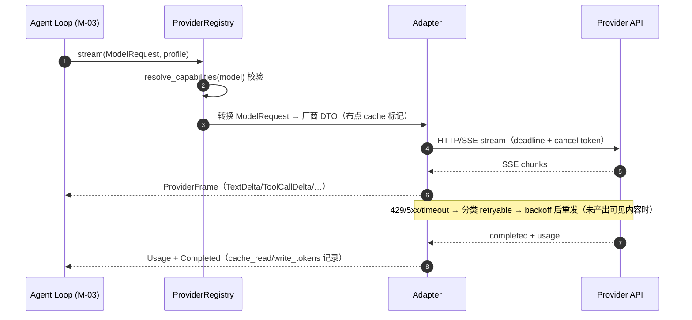
```mermaid
sequenceDiagram
    autonumber
    participant L as Agent Loop (M-03)
    participant R as ProviderRegistry
    participant A as Adapter
    participant P as Provider API

    L->>R: stream(ModelRequest, profile)
    R->>R: resolve_capabilities(model) 校验
    R->>A: 转换 ModelRequest → 厂商 DTO（布点 cache 标记）
    A->>P: HTTP/SSE stream（deadline + cancel token）
    P-->>A: SSE chunks
    A-->>L: ProviderFrame（TextDelta/ToolCallDelta/…）
    Note over A,P: 429/5xx/timeout → 分类 retryable → backoff 后重发（未产出可见内容时）
    P-->>A: completed + usage
    A-->>L: Usage + Completed（cache_read/write_tokens 记录）
```

capability 协商（EP-0802）：`resolve_capabilities` 返回的 `ModelCapabilities` 与 profile `capability_overrides` 合并（override 只能声明实际支持的子集，伪造能力在契约测试中被拒，16 §14 验证步骤 2）；请求所需能力缺失时在发起前返回 `APEX_PROVIDER_CAPABILITY_UNSUPPORTED`（VAL-135），不发出半截请求。

#### 6. 状态机

本模块无领域状态机。单次 `stream` 调用的内部状态：`Connecting → Streaming → Completing → Done | Failed | Canceled`；只有 `Connecting` 阶段失败可整体安全重试，`Streaming` 已开始产出可见内容后重试必须创建新 attempt 并由 Agent Runtime 决定是否保留部分输出（12 §8）——该决策在 M-03 §8 的 Provider 错误分支落地。

#### 7. 存储设计

- `~/.apex/config/providers.toml`：profile 配置（无 Key），未知字段保留（EP-0207 配置模型复用）。
- `~/.apex/auth.json`：Key 唯一存放点，0600；格式 `{"version":1,"keys":{"<profile-id>":"<secret>"}}`。
- `provider_profiles` 表（07 §4）：只存 profile id/adapter/default_model/enabled 的投影缓存（无 Key），config watcher 触发重建；v0.1 可直接读 TOML 不落表，表在 v0.4 路由继承时启用。
- usage 元数据本地保存（12 §13 不遥测）：写入 Session JSONL 的 `provider_request` 记录（metadata 模式：token 数、耗时、cache 命中、厂商 request id、内容 hash），不写 SQLite 全文。

#### 8. 错误处理与降级

| ProviderError | retryable | 行为 |
|---|---|---|
| timeout / transport / server(5xx) | 是 | 指数退避 + 抖动，上限 3 次，受 Run deadline 约束（12 §8） |
| rate_limit | 是 | 优先 `Retry-After` header，否则退避；单 Provider 并发 limiter 4 |
| quota / authentication / content_policy / invalid_request | 否 | 结构化返回，v0.1 不 failover |
| capability | 否 | 发起前即拒绝（§5） |
| canceled | — | 取消传播到 HTTP stream，连接回收有超时（12 §8） |

半流处理：已开始产出后断流 → 新 attempt；部分输出的保留决策归 Agent Loop（M-03），adapter 只保证 `Usage`/`Completed` 帧不伪造。降级原则：不支持的能力返回 capability error，禁止退化为"看似支持"（05 §11 对 realtime 的禁令精神同样适用于 cache/structured output）。

#### 9. 安全与权限边界

- Secret Firewall（12 §5）：日志、事件 payload、错误链、诊断出口在 sink 前统一过 canary 检测；VAL-142 要求 Key 不出现在任何通用出口。
- 自定义 endpoint 默认不可信（12 §13）；v0.1 只允许 profiles.toml 显式配置的 base_url，无 Compatible adapter。
- TLS 强制；证书校验不可配置关闭。
- Adapter 依赖隔离：adapter crate 不得被权限/Spec 等安全模块依赖（05 §7 的反向约束只禁了 Permission→Provider，本模块同样禁止 Provider→Permission，保持单向）。

#### 10. 性能预算

| 指标 | 预算 |
|---|---|
| 首 token 时延（本地到 adapter 开销） | ≤ 50 ms（不含厂商网络） |
| stream frame 转发开销 | 单 frame ≤ 1 ms，不阻塞 Agent Loop |
| 单 Provider 并发 | 默认 4（12 §8） |
| 契约 fixture 回放 | 全套件 ≤ 60 s（离线，CI 可跑） |

#### 11. 测试与验证策略

| VAL | EP | 要点 |
|---|---|---|
| VAL-134 | 0801 | 消息/流 round-trip；Frame 分片任意切割、UTF-8 边界 |
| VAL-135 | 0802 | 缺能力发起前拒绝；override 伪造被拒 |
| VAL-136 | 0803 | Tool/reasoning/stream 映射；cache_control 三处布点 fixture |
| VAL-137 | 0804 | Responses/Completions 双栈；`prompt_cache_key` 穿透与 None 语义 |
| VAL-141 | 0808 | 明文配置/权限/未知字段保留 |
| VAL-142 | 0809 | Secret canary：Key 不入 DB/log/event/env/诊断 |
| VAL-145 | 0812 | 429（含 Retry-After）/5xx/timeout/半流/取消传播 fixture |

纪律：全部用脱敏录制 fixture，不依赖在线 Key（12 §12）；两 adapter 跑同一契约套件（EP-0816 的五 adapter 版在 v0.8 扩齐）；live test 仅用户/CI 显式启用。

#### 12. 实施工作项

按 17 §5.4 模块 D：

| WI | 内容 | EP | 依赖 |
|---|---|---|---|
| WI-v0.1-36 | Provider Core：ModelRequest/Frame/Usage/错误 | EP-0801 | M-01 |
| WI-v0.1-37 | capability schema 与协商 | EP-0802 | 36 |
| WI-v0.1-38 | Anthropic adapter | EP-0803 | 36/37 |
| WI-v0.1-39 | OpenAI adapter | EP-0804 | 36/37 |
| WI-v0.1-40 | providers.toml parser | EP-0808 | M-02 配置 |
| WI-v0.1-41 | SecretResolver + auth.json 边界 | EP-0809（子集） | 40、M-02 权限创建 |
| WI-v0.1-42 | retry/backoff/deadline/cancel | EP-0812 | 38/39 |

交付顺序：36→37 先行解锁 M-08；38/39 可并行；42 依赖至少一个 adapter 真实流。

---

<!-- 源文件：docs/design/m05-spec-pipeline.md -->

### 5. M-05 Spec 流水线引擎


#### 0. 元信息

| 项 | 值 |
|---|---|
| 模块编号 | M-05 |
| 版本归属 | v0.1（模块 E，见 17 号文 §5.5）；EP-0411–0415 属 v0.3，不在本篇 |
| 对应 EP | EP-0401–0410 |
| 对应 VAL | VAL-57–66 |
| 对应需求 | RQ-030、036–041、045；AC-003（Spec 编码门） |
| 上游依赖 | 08-spec-rules-verification（权威主题）、04-domain-model §4/§7/§8/§9/§10、05-trait-contracts §6、07-storage-files-logging、16 §10、17 §5.5 |
| 下游消费者 | M-06 Tool Gateway（`evaluate_gate` 调用方）、M-09/M-10 TUI（SpecService 面板）、M-15 规范校验三层（v0.3 接管 PostToolUse/批次/修复/聚合/确认） |

#### 1. 目标与范围

##### 1.1 目标

在任何 Agent 写入代码之前，建立"需求 → 设计 → 任务 → 编码 → 验证"的强制流水线（RQ-036），使每一步都有可审批、可失效、可审计的持久事实：

1. **四文档模型**：`specs/<feature>/{requirements,design,tasks,verification}.md` 的 schema、parser、renderer 与 frontmatter（EP-0401–0404）。
2. **阶段状态机**：`SpecStage`/`StageStatus` reducer，非法跳阶段在编译期之外的运行期被拒绝（EP-0405）。
3. **审批绑定**：`ApprovalRecord` 绑定内容 hash 与上游 hash，内容变化审批自动失效（EP-0406）并沿依赖图传播（EP-0407）。
4. **逃生门**：`/skip-spec` 命令（EP-0408）与 SkipGrant 审计（EP-0409），只绕 Spec Gate，不绕安全门。
5. **规则 profile registry**：项目 `.apex/rules/` + 全局 `~/.apex/rules/` + 兼容读取 AGENTS.md/CLAUDE.md，profile 带版本 hash（EP-0410）。
6. **LLM 驱动生成器**：调用 Provider 生成四文档草稿，人审后入档（17 §5.5 WI-v0.1-53）。

##### 1.2 不做什么

- 不实现 PostToolUse 轻量门、增量批次、修复子任务、证据聚合、完成确认策略（EP-0411–0415 整体属 v0.3，17 §5.5 末尾）。
- 不实现 DAG 编译语义；`tasks.md` 的 DAG 阶段字段只解析不调度（调度见 11 号文，v0.7）。
- 不自行执行任何 Tool；`evaluate_gate` 是纯状态/策略判断（05 §6）。
- 不做多根 Workspace 的 Spec 合并仲裁；镜像到 Audit Root 由存储层负责（07 §82–89）。自 2026-08-14 起每 daemon 只服务单项目（RQ-007），多根 Workspace 语义退化为"一种以 workspace-id 参与分片键的项目"（07 §3.2），本模块不感知跨 Root 仲裁。

#### 2. 上游契约与引用

| 消费的定义 | 出处锚点 |
|---|---|
| 流水线不变量（无审批/Skip 则 Coding Gate 拒绝；用户未回复≠批准） | 08 §1 |
| frontmatter 字段与 `content_hash` 计算规则（排除自身字段） | 08 §2 |
| 四文档最低结构与 `verification.md` 骨架 | 08 §3、§10 |
| 阶段与审批状态机、bundle 审批语义 | 08 §4 |
| 变更与失效传播表 | 08 §5 |
| `/skip-spec` 语法、scope、审计字段清单、安全门保留 | 08 §6 |
| `SpecStage`/`StageStatus`/`BlockReason` 枚举 | 04 §4（只引用，不重复定义） |
| `ApprovalRecord`/`SkipGrant` 绑定要素 | 04 §9 |
| 事件 `spec.changed`/`approval.granted`/`approval.invalidated`/`skip.granted`/`verification.accepted` | 04 §8 |
| `SpecPipeline`/`RuleEngine`/`VerificationWriter` trait | 05 §6 |
| Spec 路径 `specs/<feature>/`、外部变化触发失效、镜像规则 | 07（RQ-030/032/035） |
| EP-0401–0410 与 VAL-57–66 注册 | 16 §10 |
| WI-v0.1-43–53 拆分与 LLM 生成器定位 | 17 §5.5 |

#### 3. 领域模型

本模块拥有 `apex-spec` crate 的文档模型与流水线 reducer（03 §4：阶段机、审批、失效传播、skip scope、Markdown 模型；编码门只基于持久事实）。状态枚举一律引用 04 §4，此处只定义文档侧结构：

- **`SpecDocument`**：解析后的四文档之一。字段：`spec_id`、`feature: FeatureKey`、`stage: SpecStage`、`workspace_id`、`generation: Generation`、`content_hash: ContentHash`、`upstream_hashes: BTreeMap<SpecStage, ContentHash>`、`status: StageStatus`、`updated_at`。frontmatter 之外的正文按 08 §3 的最低结构做 section 级校验（缺必需 section 则 schema invalid）。每 daemon 单项目形态下多根 Workspace 语义退化，`workspace_id` 仅作 project 别名保留，不参与跨 Root 路由。
- **`SpecPipelineSnapshot`**：某 feature 的五阶段视图：每阶段 `(status, generation, content_hash, approval?)`，以及派生的 `coding_gate: Pass | Hold(BlockReason)`。这是 `SpecService.GetPipeline` 的返回 DTO（06 §3）。
- **`SpecChange`**：失效传播的输入：`(feature, stage, old_hash, new_hash, detected_via: Watcher | WritePath | Manual)`。
- **`InvalidationPlan`**：`invalidate_from_change` 的输出：受影响阶段集合、每阶段需撤销的 `ApprovalRecord` ID、需暂停的 Run/Task 引用、下一安全点动作（对照 08 §5 表逐行实现）。
- **`SkipGrant`**：绑定 `skip_grant_id, session_id, run_id?, stages[], scope, reason, operator, granted_at, expires_at/termination_condition, linked_requirement_ids[], current_spec_hashes{}, trace_id, permission_mode, project_id`（08 §6 字段全集，缺一不得入库）。
- **`RuleProfileRef`**：`(profile_id, version_hash, source: Project | Global | CompatAgentsMd | CompatClaudeMd)`。profile 内容 hash 变化即新 `version_hash`，引用它的 design/tasks 证据随之失效（08 §11）。

`ApprovalRecord` 值对象按 04 §9 定义，本模块的实现约束：**审批事实源在 SQLite，Markdown 中可渲染审批摘要但绝不是事实源**（08 §2），防止复制文件伪造审批。

#### 4. 接口设计

##### 4.1 SpecPipeline（实现 05 §6 trait）

```rust
// 语义以 05 §6 为准；此处给 v0.1 具体化
async fn status(&self, scope: SpecScope) -> ApexResult<SpecPipelineSnapshot>;
async fn evaluate_gate(&self, request: GateRequest) -> ApexResult<SpecGateDecision>;
async fn approve(&self, ctx: CommandContext, request: ApproveSpec) -> ApexResult<ApprovalRecord>;
async fn invalidate_from_change(&self, ctx: CommandContext, change: SpecChange) -> ApexResult<InvalidationPlan>;
async fn grant_skip(&self, ctx: CommandContext, request: GrantSkip) -> ApexResult<SkipGrant>;
async fn accept_verification(&self, ctx: CommandContext, request: AcceptVerification) -> ApexResult<CompletionDecision>;
```

- `GateRequest { feature, stage: SpecStage::Coding, write_paths[], run_id }`。`evaluate_gate` 判定顺序：阶段文档存在且 schema 有效 → `tasks.status == Approved || 有效 SkipGrant 覆盖 Coding` → 批准 hash 与当前内容 hash 一致 → `Pass`；否则 `Hold(BlockReason::SpecApprovalRequired | SpecChanged)`（04 §4 枚举值）。
- `approve` 支持两种模式：逐阶段（默认）与 `approval_mode=bundle`（三份文档整体批准，bundle 绑定三个 hash，任一变化整体失效，08 §4）。bundle 模式由项目策略开启，请求中显式携带。
- `grant_skip` 校验：scope ∈ `{run, session}`（拒绝 project/user 永久跳过，08 §6）、`stages` 非空子集或 `all`、operator 为持有控制租约的客户端身份。

##### 4.2 文档 schema 与 parser（EP-0401–0404）

- 四份 frontmatter JSON Schema 落 `schemas/apex.spec.{requirements,design,tasks,verification}.v1.schema.json`（M-01 的 `schemas/` 目录约定）。
- parser 行为：YAML frontmatter + Markdown 正文；未知 frontmatter 字段保留但不参与 hash；`content_hash` 计算排除 `content_hash` 字段自身（08 §2）；`upstream_hashes` 必须与已批准上游代的 hash 完全一致，否则 `APEX_SPEC_UPSTREAM_HASH_MISMATCH`。
- `tasks.md` 额外校验（VAL-59）：任务依赖图无环、`write_paths` 非空且为规范化相对路径、无重复任务 ID。
- `verification.md` 由 renderer 生成（VAL-60）：输入 hash 缺任一（requirements/design/tasks）或某 AC 无证据引用时渲染失败，不产出半成品。

##### 4.3 四文档 frontmatter 示例

`requirements.md`：

```yaml
---
schema: apex.spec.v1
spec_id: 0198f7a2-...
feature: permission-engine
stage: requirements
workspace_id: 0198f000-...
generation: 3
content_hash: blake3:9f2c...
upstream_hashes: {}
status: approved
updated_at: 2026-08-12T10:00:00+08:00
---
```

`tasks.md`（体现上游绑定与规则 profile）：

```yaml
---
schema: apex.spec.v1
spec_id: 0198f7b9-...
feature: permission-engine
stage: tasks
workspace_id: 0198f000-...
generation: 2
content_hash: blake3:41de...
upstream_hashes:
  requirements: blake3:9f2c...
  design: blake3:77ab...
status: awaiting_approval
rule_profiles:
  - { profile_id: rust-default, version_hash: blake3:5c01..., source: project }
updated_at: 2026-08-12T11:30:00+08:00
---
```

`verification.md` 使用 `schema: apex.verification.v1`，frontmatter 携带 `requirements_hash/design_hash/tasks_hash/verified_at/trace_id`（08 §10 骨架），`status` 在确认前为 `awaiting_approval`，确认后由 `accept_verification` 落 `verification.accepted` 事件。

##### 4.4 规则 profile registry（EP-0410）

解析顺序（首命中优先，与生态兼容约定一致，参考 AiAgent README §10.11 双识别实践）：

1. 项目 `.apex/rules/<profile_id>.toml`（最高优先，可随项目提交）。
2. 全局 `~/.apex/rules/<profile_id>.toml`。
3. 兼容层：`AGENTS.md`/`CLAUDE.md` 被读取后抽取为内置 `compat-agents-md`/`compat-claude-md` profile，作为 Spec 内嵌约束的来源之一，不单独成为可批准 profile。

registry 行为：加载即算 `version_hash`；`design.md`/`tasks.md` 引用未知 profile → `APEX_RULES_PROFILE_UNKNOWN`；已批准文档引用的 profile hash 变化 → 等价于 Design/Tasks 约束变化，触发对应阶段失效（08 §11）。内置语言规则包目录（Rust/Go/Java/Python/TS-JS/Vue，RQ-045）以 `builtin:<lang>` profile 形式注册，版本随二进制。全局 `~/.apex/rules/` 被多个项目 daemon 并发读：`version_hash` 计算与 watcher 事件在各 daemon 本地完成，写入侧经用户级文件锁串行化、完成后通知其他 daemon 的 watcher 重读收敛（07 §2.1，RQ-122）。

##### 4.5 错误码（追加 `APEX_SPEC_*`/`APEX_RULES_*`，格式见 04 §10）

`APEX_SPEC_APPROVAL_REQUIRED`、`APEX_SPEC_INVALIDATED`、`APEX_SPEC_SCHEMA_INVALID`、`APEX_SPEC_UPSTREAM_HASH_MISMATCH`、`APEX_SPEC_TASK_CYCLE`、`APEX_SPEC_TASK_EMPTY_WRITE_PATHS`、`APEX_SPEC_SKIP_SCOPE_INVALID`、`APEX_SPEC_SKIP_EXPIRED`、`APEX_SPEC_BUNDLE_INCOMPLETE`、`APEX_RULES_PROFILE_UNKNOWN`、`APEX_RULES_PROFILE_CHANGED`。

#### 5. 数据流与关键流程

##### 5.1 一次完整流水线的时序（LLM 生成 + 人审）

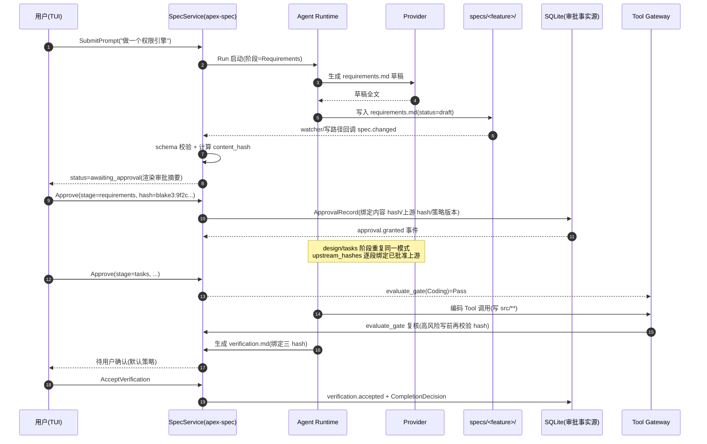
```mermaid
sequenceDiagram
    autonumber
    participant U as 用户(TUI)
    participant SS as SpecService(apex-spec)
    participant AG as Agent Runtime
    participant P as Provider
    participant FS as specs/<feature>/
    participant DB as SQLite(审批事实源)
    participant GW as Tool Gateway

    U->>SS: SubmitPrompt("做一个权限引擎")
    SS->>AG: Run 启动(阶段=Requirements)
    AG->>P: 生成 requirements.md 草稿
    P-->>AG: 草稿全文
    AG->>FS: 写入 requirements.md(status=draft)
    FS-->>SS: watcher/写路径回调 spec.changed
    SS->>SS: schema 校验 + 计算 content_hash
    SS-->>U: status=awaiting_approval(渲染审批摘要)
    U->>SS: Approve(stage=requirements, hash=blake3:9f2c...)
    SS->>DB: ApprovalRecord(绑定内容 hash/上游 hash/策略版本)
    DB-->>SS: approval.granted 事件
    Note over AG,P: design/tasks 阶段重复同一模式<br/>upstream_hashes 逐段绑定已批准上游
    U->>SS: Approve(stage=tasks, ...)
    SS-->>GW: evaluate_gate(Coding)=Pass
    AG->>GW: 编码 Tool 调用(写 src/**)
    GW->>SS: evaluate_gate 复核(高风险写前再校验 hash)
    AG->>SS: 生成 verification.md(绑定三 hash)
    SS-->>U: 待用户确认(默认策略)
    U->>SS: AcceptVerification
    SS->>DB: verification.accepted + CompletionDecision
```

要点：步骤 6–8 中 "用户未回复" 绝不解释为批准（08 §1）；步骤 15 的复核缩小失效竞态窗口（08 §5）。

##### 5.2 失效传播

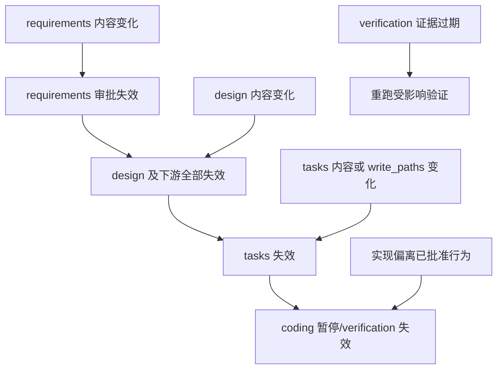
```mermaid
flowchart TD
    RC[requirements 内容变化] --> RI[requirements 审批失效]
    RI --> DI[design 及下游全部失效]
    DI --> TI[tasks 失效]
    TI --> CI[coding 暂停/verification 失效]
    DC[design 内容变化] --> DI
    TC[tasks 内容或 write_paths 变化] --> TI
    DD[实现偏离已批准行为] --> CI
    VE[verification 证据过期] --> VI[重跑受影响验证]
```

每行对应 08 §5 表的一条规则；watcher 检测到变化立即追加 `spec.changed` + `approval.invalidated`，正在运行的不可中断 Tool 可完成当前原子副作用，但下一 Tool/Provider 边界前必须暂停（08 §5 末段）。

#### 6. 状态机

单文档生命周期（状态名为 04 §4 `StageStatus` 枚举值，语义与 08 §4 一致）：

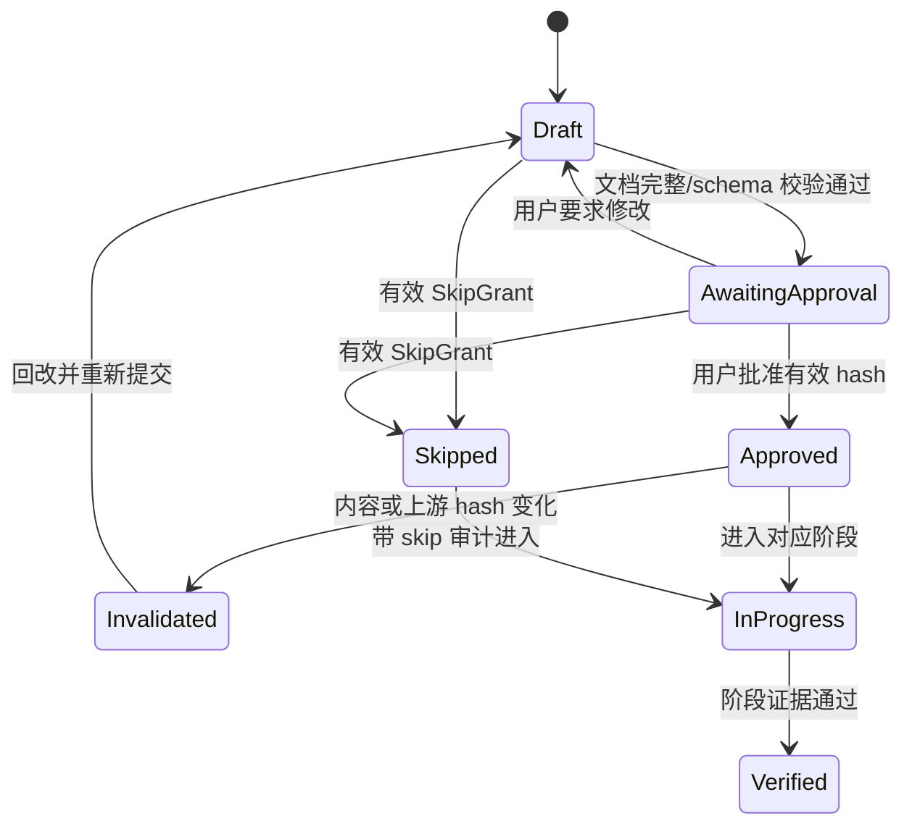
```mermaid
stateDiagram-v2
    [*] --> Draft
    Draft --> AwaitingApproval: 文档完整/schema 校验通过
    AwaitingApproval --> Approved: 用户批准有效 hash
    AwaitingApproval --> Draft: 用户要求修改
    Approved --> Invalidated: 内容或上游 hash 变化
    Invalidated --> Draft: 回改并重新提交
    Draft --> Skipped: 有效 SkipGrant
    AwaitingApproval --> Skipped: 有效 SkipGrant
    Approved --> InProgress: 进入对应阶段
    Skipped --> InProgress: 带 skip 审计进入
    InProgress --> Verified: 阶段证据通过
```

跨阶段门控（`SpecStage` 顺序固定，不可跳）：`Requirements.Approved → Design` 可启动；`Design.Approved → Tasks`；`Tasks.Approved → Coding gate Pass`；`Coding 完成 → Verification`；`Verification.Accepted → feature 完成`。`approval_mode=bundle` 时前三阶段的 `Approved` 由同一 bundle 记录一次性授予，任一文档 hash 变化三份同失效（08 §4）。

非法迁移（VAL-61）：直接 `Draft → Approved`、`Approved → Verified` 越过 `InProgress`、跨阶段未批先启，reducer 一律拒绝并返回 `APEX_SPEC_APPROVAL_REQUIRED` 或参数错误，不产生事件。

#### 7. 存储设计

| 路径/表 | 内容 | 说明 |
|---|---|---|
| `specs/<feature>/{requirements,design,tasks,verification}.md` | 四文档权威文件 | RQ-030；默认提交 git（07 §82） |
| SQLite `approval_record` | 审批事实源 | 绑定对象类型/ID/内容 hash/上游 hash/阶段/scope/操作者/策略版本/trace（04 §9）；Markdown 摘要只是展示 |
| SQLite `skip_grant` | SkipGrant 全字段 | 08 §6 字段全集；`expires_at` 或终止条件驱动后台清理 |
| SQLite `spec_document_state` | 每 feature×stage 的 generation/hash/status 投影 | 由 `spec.changed`/`approval.*` 事件投影；重启可重建 |
| `schemas/apex.spec.*.schema.json` | frontmatter schema | M-01 产物，CI 漂移检查对象 |
| `.apex/rules/*.toml`、`~/.apex/rules/*.toml` | 规则 profile | EP-0410；变化触发 profile hash 失效 |
| Audit Root `specs/<feature>/` 镜像 | 多根 Workspace 审计副本 | 带 source workspace/generation/hash frontmatter（07 §89） |

保留策略：Spec 与 verification.md 不删除（项目历史的一部分）；`skip_grant` 过期记录保留至 Session 归档后按日志保留策略处理。

#### 8. 错误处理与降级

| 场景 | 行为 |
|---|---|
| 未批准/失效时请求编码 | `Hold(SpecApprovalRequired)`，Run 进 `Blocked`，UI 显示恢复动作（去审批/跳过） |
| frontmatter 解析失败 | `APEX_SPEC_SCHEMA_INVALID`，文档视为 `Draft`，不进入审批 |
| 上游 hash 不匹配 | `APEX_SPEC_UPSTREAM_HASH_MISMATCH`，要求重新对齐上游代 |
| 外部编辑冲突（watcher 与写路径竞争） | 停止审批/编码，保存三方 artifact，人工解决后生成新 generation（08 §11） |
| profile 缺失/变化 | `APEX_RULES_PROFILE_UNKNOWN/CHANGED`；不静默换 profile 降低标准（08 §11） |
| Skip 超 scope/过期 | `APEX_SPEC_SKIP_SCOPE_INVALID/EXPIRED`；不自动续期 |
| LLM 生成器产出 schema 非法草稿 | 草稿留在 `Draft`，错误注入 Agent 上下文要求重生成；不计为审批动作 |

降级原则：任何解析/校验失败都向 "不批准" 方向收敛；不存在" schema 坏了先放行 "的路径。

#### 9. 安全与权限边界

- 审批事实源只在 SQLite（08 §2），杜绝复制 Markdown 伪造审批；所有 `approve`/`grant_skip`/`accept_verification` 走 Command 通道，携带幂等 key 与 traceparent（06 §3 CommandMeta）。
- Skip 只绕 Spec Gate：**不绕** Project Trust、Permission、Checkpoint、Write Claim、硬安全禁令与最终日志（08 §6）；跳过 Verification 的 Run 只能显示"完成（未验证，已审计跳过）"。
- `grant_skip` 要求调用方持有控制租约；scope 拒绝 project/user 级，防止一次授权永久脱管。
- LLM 生成器的写权限：Spec 文档写入由流水线管理的特权写路径承载（`write_paths` 限 `specs/<feature>/`），与 Coding 写代码的 Gate 分离；生成 Prompt 不得包含 Secret，生成全文进会话日志。
- 规则 profile 的 TOML 解析拒绝执行任何外部命令；"不得下载/安装未批准工具作为隐式副作用"（08 §8）。

#### 10. 性能预算

- `evaluate_gate` 是纯投影读 + hash 比对，必须落在命令确认 P95 ≤ 100 ms 预算内（15 §7）；hash 用 blake3，单文档重算 < 1 ms。
- watcher 去抖后失效判定 < 50 ms，保证"下一安全点前暂停"可达成（08 §5）。
- LLM 生成器的 Provider 耗时不在本模块预算内；但草稿写盘到 `awaiting_approval` 的本地路径 ≤ 100 ms。
- `SpecPipelineSnapshot` 查询走投影表，不现场解析 Markdown（16 §10 通过标准要求 100% 阻塞判定可离线重放）。

#### 11. 测试与验证策略

| VAL | 覆盖 EP | 验证要点 |
|---|---|---|
| VAL-57 | EP-0401 | requirements 正/负 frontmatter fixture（缺字段/坏类型/未知 stage） |
| VAL-58 | EP-0402 | design 上游 hash 校验：正确绑定通过、错 hash 拒绝 |
| VAL-59 | EP-0403 | tasks 依赖环拒绝、空 `write_paths` 拒绝、重复 ID 拒绝 |
| VAL-60 | EP-0404 | 缺输入 hash/缺 AC 证据时渲染失败 |
| VAL-61 | EP-0405 | 非法跳阶段迁移全表测试（含 bundle 模式） |
| VAL-62 | EP-0406 | 批准后改内容 → 审批自动失效（含只改上游的情形） |
| VAL-63 | EP-0407 | requirements 改动 → design/tasks/coding/verification 全失效的传播图测试 |
| VAL-64 | EP-0408 | `/skip-spec` run/session/all/过期/非法 scope 全矩阵 |
| VAL-65 | EP-0409 | skip 后 Permission/Checkpoint/日志门仍在；审计字段完整可回放 |
| VAL-66 | EP-0410 | 未知 profile 拒绝；profile 内容变化 → hash 变 → 相关证据失效 |

故障注入点：watcher 与写路径并发、SQLite 审批写入中途 kill、Markdown 部分写盘（对照 RISK-001）。覆盖率目标：Spec Pipeline 行/分支 ≥ 90%（15 §6.2）。LLM 生成器用假 Provider（M-01 test-support）做"生成 → 人审 → 入档"全链测试（17 §5.5 WI-v0.1-53 验收）。

#### 12. 实施工作项

按 17 §5.5 交付顺序：

| WI | 内容 | EP | 依赖 |
|---|---|---|---|
| WI-v0.1-43 | requirements.md schema/parser/renderer | EP-0401 | M-01 schema 基座、M-02 存储 |
| WI-v0.1-44 | design.md schema/parser（含编码规范内嵌段） | EP-0402 | 43 |
| WI-v0.1-45 | tasks.md schema/parser（依赖图、write_paths） | EP-0403 | 44 |
| WI-v0.1-46 | verification.md renderer/schema | EP-0404 | 43–45 |
| WI-v0.1-47 | SpecStage/StageStatus 状态机 reducer | EP-0405 | M-01 枚举、43 |
| WI-v0.1-48 | ApprovalRecord 内容 hash 绑定 | EP-0406 | 47、M-02 事件 |
| WI-v0.1-49 | 上游变化失效传播 | EP-0407 | 47/48 |
| WI-v0.1-50 | `/skip-spec` parser 与 scope 校验 | EP-0408 | 47、M-03 Session |
| WI-v0.1-51 | SkipGrant 审计事件与限制 | EP-0409 | 50、M-02 事件 |
| WI-v0.1-52 | 规则 profile registry（项目+全局+AGENTS.md/CLAUDE.md 兼容） | EP-0410 | 43、M-01 事件 |
| WI-v0.1-53 | LLM 驱动四文档生成器 + 人审工作流 | EP-0401–0404 的 Agent 侧驱动 | 43–48、M-04 Provider |

依赖要点：43–46 是纯文档模型可并行推进；47/48 是门控核心，必须先于 M-06 Gateway 联调；53 最后收口，dogfood（WI-v0.1-75）依赖它完成真实流水线。

---

<!-- 源文件：docs/design/m06-tool-gateway.md -->

### 6. M-06 工具系统与 Tool Gateway


#### 0. 元信息

| 项 | 值 |
|---|---|
| 模块编号 | M-06 |
| 版本归属 | v0.1（模块 F 的工具侧，见 17 §5.6） |
| 对应 EP | EP-0514、EP-0515、EP-0516、EP-0519 |
| 对应 VAL | VAL-85、VAL-86、VAL-87、VAL-90 |
| 对应需求 | RQ-052、057、107、108；AC-006、AC-008 |
| 上游依赖 | 02 §1 原则 4、04 §4（ToolCallStatus）/§8、05 §8、09 §8/§9、16 §11、17 §5.6；M-02（日志/事件）、M-07（简化权限判官） |
| 下游消费者 | M-03（Agent Loop 发起调用）、M-08（工具结果进入上下文）、M-13（v0.2 持久终端）、M-14（v0.3 AST 权限替换简化门） |

#### 1. 目标与范围

##### 1.1 目标

交付"所有副作用经网关"（02 §1 原则 4）的 v0.1 最小闭环：

1. **Tool 契约**（EP-0514）：descriptor/schema/副作用声明 + registry。
2. **Gateway 管线**（EP-0515/0516）：`prepare → gate → execute → receipt`，幂等、有序、可审计。
3. **内建工具六件套**：Read/Write/Edit/Glob/Grep/Bash(run-once)（WI-v0.1-55–57；Bash 属 EP-0519）。
4. **bounded output**：截断策略与副作用回执（EP-0516）。

##### 1.2 不做什么

- AST 权限分析（EP-0501–0513）→ v0.3（M-14）；v0.1 的 gate 是 M-07 的简化权限（EP-1201：模式矩阵 + 高危清单 + 路径限制）。
- PTY/ConPTY 持久终端（EP-0517/0518/0520–0522）→ v0.2（M-13）；v0.1 只有一次性非交互命令。
- OS 沙箱（EP-0523）→ v0.3。
- Skill/MCP 提供的工具（EP-0907 等）→ v0.5；registry 预留外部来源字段。
- CAS 内容块引用（09 §9"大输出先写内容块"）→ v0.2 随 EP-0217；v0.1 用截断 + 日志回执替代（见 §4.4）。

#### 2. 上游契约与引用

| 消费的定义 | 出处锚点 |
|---|---|
| `Tool`/`ToolGateway` Trait 签名 | 05 §8 |
| Tool 生命周期固定顺序（prepare→gate→permission→…→durable result） | 05 §8 |
| Tool Gateway 时序（Spec Gate → Permission → Claim → Checkpoint → execute → PostToolUse） | 09 §8 |
| Tool descriptor 内容与输出预算/SnipHinter 要求 | 09 §9 |
| `ToolCallStatus` 状态枚举 | 04 §4 |
| 事件目录 `tool.proposed`/`permission.requested`/`tool.completed` | 04 §8 |
| 会话日志 `tool_call` 记录格式（exit_code、stdout_len/blake3 等） | 07 §8.2 |
| S5 EP/VAL 注册与权限验证流程 | 16 §11 |
| v0.1 WI 拆分（WI-v0.1-54–58）与简化权限定位说明 | 17 §5.6 |

v0.1 对 09 §8 时序的裁剪：Spec Gate 保留（M-05），Permission 走 M-07 简化引擎，**Claim/Checkpoint/Snapshot/PostToolUse 均不在 v0.1**（分别在 v0.4/v0.2/v0.2/v0.3 引入）——裁剪的补偿是简化权限的保守默认（17 §5.6"降级牺牲便利性而非安全性"）。

#### 3. 领域模型

- `ToolCallStatus`（04 §4）：`Proposed → AwaitingPermission | Prepared → Running → Succeeded | Failed | Interrupted | UnknownSideEffect`。v0.1 不产 `UnknownSideEffect` 的自动分类（恢复分类在 v0.2 EP-0522），崩溃遗留 `Running` 一律标 `Interrupted` 并保守视为不可自动重试。
- `tool_calls` 表（07 §4）：`(run_id, trace_id)` 索引；每行记录 tool_call_id、工具名、输入 hash、状态、回执摘要。
- 配对不变量：一个 assistant 消息发出的每个 `tool_call_id` 必须在下一次 Provider 请求前恰好有一个 tool result 回填（成功、拒绝、失败都算回填）；Snip/截断不删消息保配对（17 §6.1 WI-v0.2-05 的原则在 v0.1 同样成立）。

#### 4. 接口设计

##### 4.1 Tool descriptor 与 registry（EP-0514）

实现 05 §8 `Tool` Trait。descriptor 字段（09 §9）：`name`、`schema`（JSON Schema 输入）、`version`、`read_only`、`side_effect_kinds[]`（file_write/process_exec/network/credential 等）、`resource_extractor`（从输入提取路径等资源的函数指针）、`idempotent`、`output_budget`、`snip_hinter`。registry 启动时注册六个内建工具；未知名称/未知 schema 版本/输入超限一律拒绝（VAL-85）。

##### 4.2 内建工具输入输出契约

| 工具 | 输入要点 | 输出 | read_only | 截断策略 |
|---|---|---|---|---|
| `read` | `path`（必填）、`offset`、`limit` | 带行号文本、`total_lines`、`truncated` | 是 | 默认 2000 行/256 KiB，超限返回头段 + 截断标记 |
| `write` | `path`、`content` | 写入字节数、新 generation | 否 | 路径必须在项目根内；经 M-02 原子写 |
| `edit` | `path`、`old_string`、`new_string`、`replace_all` | 匹配数、替换数 | 否 | `old_string` 非唯一且未 `replace_all` → 失败（安全默认） |
| `glob` | `pattern`、`path?` | 匹配路径列表（按 mtime 排序）、`truncated` | 是 | 上限 1000 条；尊重 `.gitignore` |
| `grep` | `pattern`、`path?`、`glob?`、`output_mode` | 匹配行/计数/文件列表 | 是 | 上限 2000 匹配行；尊重 `.gitignore`、限流 |
| `bash` | `command`、`timeout_ms?` | `exit_code`、stdout/stderr（截断）、耗时 | 否 | run-once：无 stdin、默认 120 s 超时、输出见 §4.4 |

共同约束：路径类输入先经项目根边界校验（M-07 的路径限制）；`write`/`edit`/`bash` 必须过权限门；`edit` 前强制"本 Turn 内已 read 该文件"（防盲改，契约测试 fixture 覆盖）。

##### 4.3 Gateway 管线（EP-0515）

`ToolGateway::invoke`（05 §8）的 v0.1 管线：

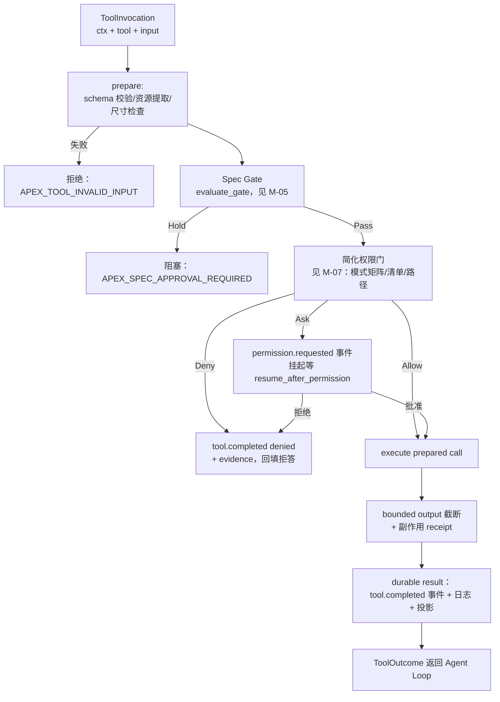
```mermaid
flowchart TD
    I[ToolInvocation<br/>ctx + tool + input] --> P[prepare:<br/>schema 校验/资源提取/<br/>尺寸检查]
    P -->|失败| R0[拒绝：APEX_TOOL_INVALID_INPUT]
    P --> G1[Spec Gate<br/>evaluate_gate，见 M-05]
    G1 -->|Hold| R1[阻塞：APEX_SPEC_APPROVAL_REQUIRED]
    G1 -->|Pass| G2[简化权限门<br/>见 M-07：模式矩阵/清单/路径]
    G2 -->|Deny| R2[tool.completed denied<br/>+ evidence，回填拒答]
    G2 -->|Ask| A[permission.requested 事件<br/>挂起等 resume_after_permission]
    G2 -->|Allow| E[execute prepared call]
    A -->|批准| E
    A -->|拒绝| R2
    E --> B[bounded output 截断<br/>+ 副作用 receipt]
    B --> D[durable result：<br/>tool.completed 事件 + 日志 + 投影]
    D --> O[ToolOutcome 返回 Agent Loop]
```

规则（05 §8 / 09 §8）：任一阶段失败不跳到后续阶段；`execute` 不得扩大 `prepare` 确定的资源计划，实际副作用与声明不一致立即终止并标记 Policy Violation；Ask 路径下 Gateway 保存 `PreparedToolCall`，`resume_after_permission` 用 request_id 找回继续，不重新 prepare（保证执行的就是被批准的那个计划）。

##### 4.4 bounded output 与回执（EP-0516）

- **stdout/stderr 截断**：流式计算全量 blake3 与长度；超过预算（默认单工具 64 KiB，descriptor 可调）时保留**头部 75% + 尾部 25%**，中间以 `... [truncated N bytes, blake3:...] ...` 标记。这是 v0.1 的临时策略；v0.2 CAS 就绪后全量写入内容块、上下文只注入摘要与引用（09 §9），70% 水位再由 SnipHinter 二次裁短（EP-0605，M-11）。
- **副作用 receipt**：`{tool_call_id, declared_effects, observed_effects, paths_touched[], exit_code?, duration_ms, output_hash, truncated}`；receipt 随 `tool.completed` 事件持久化并写入会话 JSONL 的 `tool_call` 记录（字段对齐 07 §8.2）。
- **配对保证**：Gateway 对每个接受的 tool_call 保证产出恰好一个终态结果（含 Deny/失败/超时/中断）；Agent Loop 在发起下一次 Provider 请求前校验配对完整性，缺失即阻塞而非静默丢弃。

##### 4.5 Bash run-once（EP-0519）

`TerminalManager::run_once`（05 §8）的 v0.1 实现：无 stdin、非交互、超时强杀进程组；启动前命令字符串整体送 M-07 简化权限（命中高危清单必拦、未知即 ask）；环境变量经 M-07 清洗，不继承 Provider Key（09 §6.3 原则）。输出 ring 到内存缓冲 + 截断，不经过持久终端通道。

#### 5. 数据流与关键流程

一次 `bash` 调用的完整链路：

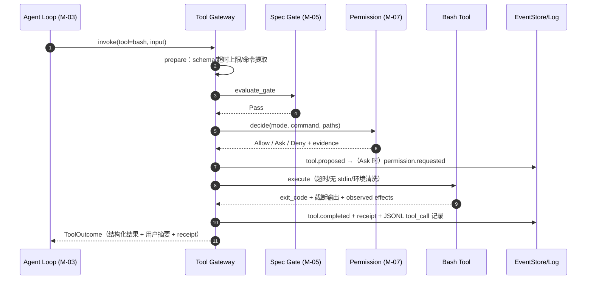
```mermaid
sequenceDiagram
    autonumber
    participant L as Agent Loop (M-03)
    participant G as Tool Gateway
    participant S as Spec Gate (M-05)
    participant P as Permission (M-07)
    participant T as Bash Tool
    participant E as EventStore/Log

    L->>G: invoke(tool=bash, input)
    G->>G: prepare：schema/超时上限/命令提取
    G->>S: evaluate_gate
    S-->>G: Pass
    G->>P: decide(mode, command, paths)
    P-->>G: Allow / Ask / Deny + evidence
    G->>E: tool.proposed →（Ask 时）permission.requested
    G->>T: execute（超时/无 stdin/环境清洗）
    T-->>G: exit_code + 截断输出 + observed effects
    G->>E: tool.completed + receipt + JSONL tool_call 记录
    G-->>L: ToolOutcome（结构化结果 + 用户摘要 + receipt）
```

#### 6. 状态机

以 04 §4 `ToolCallStatus` 为唯一权威。驱动规则：

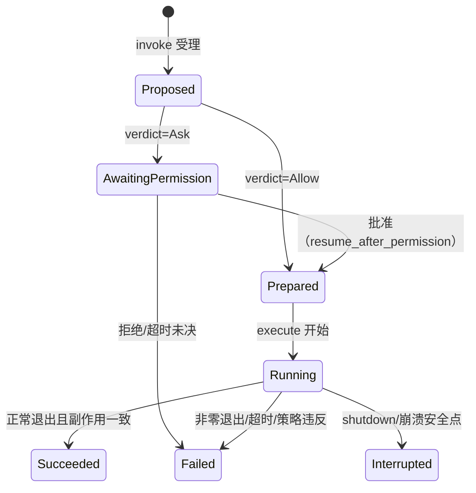
```mermaid
stateDiagram-v2
    [*] --> Proposed: invoke 受理
    Proposed --> AwaitingPermission: verdict=Ask
    Proposed --> Prepared: verdict=Allow
    AwaitingPermission --> Prepared: 批准（resume_after_permission）
    AwaitingPermission --> Failed: 拒绝/超时未决
    Prepared --> Running: execute 开始
    Running --> Succeeded: 正常退出且副作用一致
    Running --> Failed: 非零退出/超时/策略违反
    Running --> Interrupted: shutdown/崩溃安全点
```

非法迁移（如 `Succeeded → Running`）在 reducer 层拒绝（VAL-86 顺序用例）。`UnknownSideEffect` 状态 v0.1 只作枚举保留，不产出。

#### 7. 存储设计

| 存储 | 内容 |
|---|---|
| `tool_calls` 表 | tool_call_id、run_id、trace_id、工具名、输入 hash、状态、receipt JSON（07 §4） |
| `permission_requests`/`permission_grants` | Ask 挂起与授权记录（M-07 写入，本模块消费） |
| 会话 JSONL | `tool_call` 记录：summary、exit_code、stdout_len/blake3、duration_ms、permission_decision（07 §8.2 样例字段） |
| 领域事件 | `tool.proposed`/`tool.completed` 等（04 §8） |

v0.1 不存全量工具输出（CAS 在 v0.2）；排障依赖 JSONL 的 metadata + hash。全文调试开关（`full_debug`）不在 v0.1（同 M-02 §1.2）。

#### 8. 错误处理与降级

| 场景 | 行为 |
|---|---|
| 未注册工具/未知 schema 版本 | `APEX_TOOL_UNKNOWN`（追加到本 domain 错误码），不执行 |
| 输入违反 schema/超尺寸 | `APEX_TOOL_INVALID_INPUT`，Agent 收到可读原因可自我修正 |
| prepare 后资源计划与执行偏差 | 立即终止、Policy Violation、保留 receipt（09 §8） |
| 权限 Ask 后窗口关闭 | `AwaitingPermission` 记录持久化，pending Ask 随 daemon 退出搁置；下次打开同项目时重新向客户端呈现，不丢决策请求 |
| Tool 执行中 shutdown | M-03 安全点：跑完或中断为 `Interrupted`；v0.1 不自动重试 |
| bash 超时 | 强杀进程组、`Failed{timeout}`、保留部分输出与 hash |

降级原则：任何无法证明无副作用的状态都不自动重试（02 §8）；v0.1 的"保守"表现为 Interrupted 一律要求用户确认后继续。

#### 9. 安全与权限边界

- 本模块**不做权限判断**，只调用 M-07 的引擎；判权依赖闭包零 Provider/LLM（09 §1，VAL-84 证据在 M-07）。
- 硬禁止清单（`rm -rf` 高危形态、`git push --force`、`~/.apex/keys/**` 等）在 M-07 命中即 Deny，Gateway 不提供绕过参数（17 §5.6 WI-v0.1-59）；清单同时覆盖其他项目分片 `~/.apex/projects/<other-hash>/**` 与本项目 daemon socket（`~/.apex/projects/<project-hash>/runtime/`，02 §10 不变量 6）。
- 工具输入中的路径先规范化再比对项目根；`write`/`edit` 走 M-02 原子写，不自行 open+write。
- bash 子进程环境清洗：剥离 `*_TOKEN`/`*_KEY`/`*_SECRET`（09 §6.3），不继承 daemon 的 Provider Key。
- 工具结果进入上下文前过 Secret Firewall（12 §5 出口清单含 Tool output）。

#### 10. 性能预算

| 指标 | 预算 |
|---|---|
| prepare + 双门（Spec/权限）开销 | P95 ≤ 20 ms（零 Token、纯静态） |
| read/glob/grep 默认截断内 | P95 ≤ 200 ms（10 万行代码库 fixture） |
| bash 输出摄取 | 流式 hash + 截断，内存 ≤ 2× 输出预算 |
| 大输出（1 MiB stdout） | 不阻塞 Agent Loop；截断后回执 ≤ 70 KiB |

#### 11. 测试与验证策略

| VAL | EP | 要点 |
|---|---|---|
| VAL-85 | 0514 | 未知 schema/未注册工具/超限输入拒绝；六个 descriptor 自描述完整 |
| VAL-86 | 0515 | 管线顺序强制；幂等（同 idempotency key 不重复执行）；Ask/Deny 路径不触 execute |
| VAL-87 | 0516 | 大输出截断格式与 hash 正确；receipt 副作用声明 vs 观测不一致 → Policy Violation |
| VAL-90 | 0519 | run-once 无 stdin；超时强杀进程组；输出截断 |

工具级 fixture：大文件截断、原子写崩溃注入（复用 M-02 harness）、`edit` 非唯一匹配、越界路径、`.gitignore` 尊重、glob 爆炸上限。配对不变量用属性测试：随机工具结果序列注入 Loop，断言下一次请求前配对闭合。

#### 12. 实施工作项

按 17 §5.6 模块 F 的工具侧（WI-59/60 属 M-07）：

| WI | 内容 | EP | 依赖 |
|---|---|---|---|
| WI-v0.1-54 | Tool descriptor/schema/副作用声明 + registry | EP-0514 | M-01 |
| WI-v0.1-55 | Read/Write/Edit 文件工具 | EP-0514（实例） | 54、M-02 原子写 |
| WI-v0.1-56 | Glob/Grep 只读工具 | EP-0514（实例） | 54 |
| WI-v0.1-57 | Bash run-once | EP-0519 | 54 |
| WI-v0.1-58 | Gateway 管线 + bounded receipt | EP-0515/0516 | 54–57、M-07 简化权限 |

交付顺序：54 先行定义契约；55/56/57 可并行；58 最后集成并联调 M-03 Agent Loop（WI-v0.1-34）。

---

<!-- 源文件：docs/design/m07-simple-permission.md -->

### 7. M-07 简化权限与决策证据


#### 0. 元信息

| 项 | 值 |
|---|---|
| 模块编号 | M-07 |
| 版本归属 | v0.1（模块 F 子集，见 17 号文 §5.6）；**计划 Superseded 于 v0.3**（EP-0501–0508 AST 接管，17 §7.1 WI-v0.3-20） |
| 对应 EP | EP-1201（简化权限模式）、EP-0513（verdict 证据/审计） |
| 对应 VAL | VAL-214、VAL-84 |
| 对应需求 | RQ-047–050、052、054、056 |
| 上游依赖 | 09-tool-permission-terminal §1/§2/§7/§12、04-domain-model §4/§8/§9、05-trait-contracts §7、16 §11、17 §5.6/§7.1、AiAgent/docs/README.md §二/§十 |
| 下游消费者 | M-06 Tool Gateway（`PermissionEngine.decide` 调用方）、M-10 TUI 权限面板、M-14 AST 权限引擎（v0.3 接管方） |

#### 1. 目标与范围

##### 1.1 目标

在全量 AST 权限（EP-0501–0508，v0.3）交付前，提供一个**有意的显式降级**实现，使 v0.1 的 Tool Gateway 有一条零 Token、可审计、可离线重放的判权路径（RQ-050）：

1. **三模式矩阵**：`plan`/`ask`/`allow` 的简化语义（RQ-047–049）。
2. **高危命令硬编码清单**：清单命中必拦，任何模式不可覆盖。
3. **项目根路径限制**：写副作用必须落在 Project Root 内。
4. **会话级"总是允许"**：精确前缀匹配的 Session grant。
5. **决策证据**：每个 verdict 携带命中规则、资源、授权引用与 trace，离线重放同输入得同结论（EP-0513）。

设计立场（17 §5.6 设计说明原文）：v0.1 用"模式矩阵 + 前缀清单 + 路径限制"作显式降级，**牺牲便利性而非安全性**——所有非清单命令在 ask 模式逐个询问，不存在"误放"通道；RISK-002 保持开放至 v0.3。

##### 1.2 不做什么

- 不解析 Shell AST、不做 arity 语义、不规范化网络目标与凭据访问（EP-0501–0508，v0.3 M-14）。
- 不支持 PowerShell/cmd dialect 的语义区分；v0.1 把命令字符串按词法白箱前缀处理，无法归一化时一律 Unknown → 按模式保守处理。
- 不提供 Project 级 grant 的管理 UI（GrantScope 枚举支持到 Project，v0.1 只落地 Once/Run/Session；Project 级留给 v0.3 与策略版本绑定）。
- 不接入 OS 沙箱（EP-0523，v0.3）。
- 不承诺"简化清单"是最终形态：README 与面板必须显式标注"简化模式"（17 §17 风险对冲行）。

#### 2. 上游契约与引用

| 消费的定义 | 出处锚点 |
|---|---|
| 权限原则（单调收紧/未知即不自动执行/批准最小化/执行时复核/审计同 trace） | 09 §1 |
| 模式语义表（plan/ask/allow × 五类输入） | 09 §2 |
| 授权模型（Once/Run/Session/Project 终止条件；无用户级全局 grant） | 09 §7 |
| 权限审计 JSON 样例 | 09 §12 |
| `PermissionDecision`/`PermissionMode`/`GrantScope` 枚举 | 04 §4 |
| `PermissionGrant` 绑定要素（批准可泛化、拒绝精确到资源粒度） | 04 §9 |
| 事件 `permission.requested`/`permission.resolved` | 04 §8 |
| `PermissionEngine` trait（decide/record_grant/resolve_request/revoke_project_grants） | 05 §7 |
| EP-0513 与 VAL-84 注册 | 16 §11 |
| EP-1201 定位、VAL-214、WI-v0.1-59/60、v0.3 Superseded 计划 | 17 §5.6、§7.1 WI-v0.3-20、§19 附录 B |
| 静态解析派 arity 表与 "always 存语义化通用形式" 收敛证据 | AiAgent README §2.1、§10.6 |

本模块不重新定义以上枚举与 trait；`apex-permission` crate 的硬约束"禁止 Provider/LLM 依赖"由 CI 依赖扫描守护（03 §4、05 §7 末段）。

#### 3. 领域模型

本模块在 04 §4/§9 枚举与值对象之外，只新增以下 v0.1 私有结构（不进入 L1–L3 权威层，v0.3 随 Superseded 一并退役）：

- **`SimpleRuleKind`**：`HardDeny | ForcedAsk | PrefixGrant`。清单条目的三态分类。
- **`HardDenyEntry`**：`{ pattern: CommandPattern, reason_key: &'static str, rule_id: &'static str }`。`CommandPattern` 为词法级匹配器：程序名 + 关键 flag/操作数前缀（见 §4.2 清单），**不做 glob 展开、不做变量展开**——含未展开动态片段的命令直接判 Unknown。
- **`SessionAllowPrefix`**：会话级"总是允许"记录：`{ normalized_prefix: String, tool: "shell", granted_by, granted_at, session_id, trace_id }`。精确前缀匹配：命令规范化（连续空白折叠为单空格、去除首尾空白、不解析引号语义）后做 `starts_with` 判定；规范化失败即 Unknown。
- **`PathVerdict`**：路径限制结论：`InProjectRoot | OutsideProjectRoot | HardDeniedPath | Unresolvable`。v0.1 复用 M-02/M-14 共用的规范化库的最小子集：realpath 已存在祖先、拒绝悬空/循环 symlink、拒绝设备路径；macOS/Windows 大小写折叠等价 key（09 §6.1 规则的子集，全量归一化 v0.3 补齐）。
- **`SimpleVerdict`**：`PermissionVerdict` 的 v0.1 填充形态：`decision`、命中 `rule_id` 列表、规范资源 key（路径维度）、`evidence[]`、`ask_options`（Once/Session 二档，Run 档 v0.1 在 UI 层合并到 Once 语义外不提供——见 §13 开放问题 1）、`mode_at_decision`。

Unknown 处理与 09 §2 对齐：plan 拒绝、ask/allow 询问；**v0.1 的 allow 模式因无静态分析能力，"白名单外但可分析"一档整体退化为 Ask**——这是降级语义的核心。

#### 4. 接口设计

##### 4.1 PermissionEngine（实现 05 §7 trait）

```rust
async fn decide(&self, request: PermissionEvaluation) -> ApexResult<PermissionVerdict>;
async fn record_grant(&self, ctx: CommandContext, grant: PermissionGrant) -> ApexResult<PermissionGrant>;
async fn resolve_request(&self, ctx: CommandContext, request_id: PermissionRequestId, resolution: PermissionResolution) -> ApexResult<PermissionVerdict>;
async fn revoke_project_grants(&self, ctx: CommandContext, project: ProjectId) -> ApexResult<usize>;
```

`decide` 判定流水线（固定顺序，单调收紧：任一 Deny 不可被后层覆盖，09 §3）：

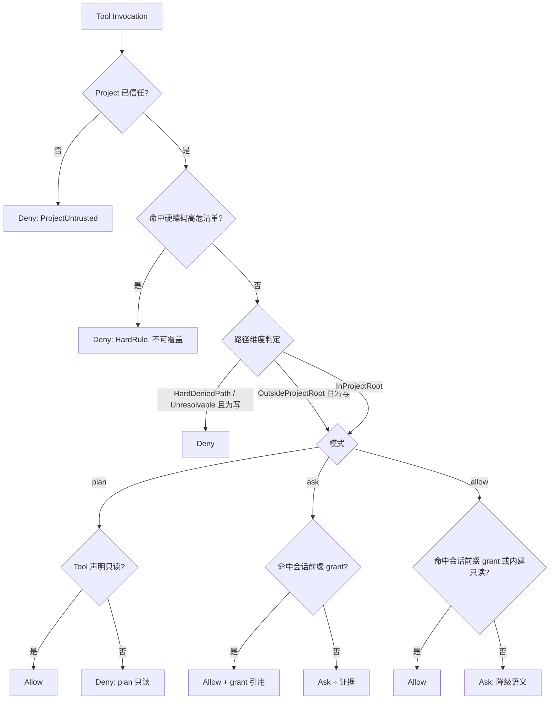
```mermaid
flowchart TD
    I[Tool Invocation] --> T{Project 已信任?}
    T -->|否| D0[Deny: ProjectUntrusted]
    T -->|是| H{命中硬编码高危清单?}
    H -->|是| D1[Deny: HardRule, 不可覆盖]
    H -->|否| P{路径维度判定}
    P -->|HardDeniedPath / Unresolvable 且为写| D2[Deny]
    P -->|OutsideProjectRoot 且为写| M{模式}
    P -->|InProjectRoot| M
    M -->|plan| R{Tool 声明只读?}
    R -->|是| A1[Allow]
    R -->|否| D3[Deny: plan 只读]
    M -->|ask| G{命中会话前缀 grant?}
    G -->|是| A2[Allow + grant 引用]
    G -->|否| Q1[Ask + 证据]
    M -->|allow| G2{命中会话前缀 grant 或内建只读?}
    G2 -->|是| A3[Allow]
    G2 -->|否| Q2[Ask: 降级语义]
```

- `plan` 模式：`is_read_only=true` 的 Tool descriptor（M-06 EP-0514）直接 Allow；其余 Deny。网络请求即使是 GET 也是外部可观察副作用，plan 拒绝（09 §2）。
- `ask` 模式：只读 Allow；会话前缀 grant Allow；硬清单 Deny；其余 Ask。
- `allow` 模式：只读 + 会话前缀 grant Allow；硬清单 Deny；**其余一律 Ask**（v0.1 降级语义，区别于 09 §2 全量表的"静态策略允许则 Allow"）。
- Unknown（命令含未展开变量/动态片段/词法无法规范化）：plan → Deny；ask/allow → Ask。

##### 4.2 高危命令硬编码清单（v0.1 初始全集）

清单编译期内置，**不可被配置关闭、不可被 grant 覆盖**；条目只追加不修改（同 Major 兼容纪律）。每条例 `rule_id` 稳定：

| rule_id | 匹配（词法级） | 类别 | 处置 |
|---|---|---|---|
| `harddeny.fs.rm-root.v1` | `rm` 携带 `-rf`/`-fr`/`--recursive --force` 且目标为 `/`、`/*`、`~`、`$HOME` 或 Project Root 本身 | 文件系统毁灭 | HardDeny |
| `harddeny.fs.rm-star-root.v1` | `rm -rf` 目标含未展开 `*` 且落在根/HOME 前缀 | 文件系统毁灭 | HardDeny |
| `harddeny.fs.mkfs.v1` | `mkfs`/`mkfs.*`/`mke2fs`/`diskutil eraseDisk` | 磁盘格式化 | HardDeny |
| `harddeny.fs.dd-device.v1` | `dd` 的 `of=` 指向 `/dev/` 下块设备 | 设备写 | HardDeny |
| `harddeny.fs.redirect-device.v1` | 重定向目标为 `/dev/sd*`、`/dev/nvme*`、`/dev/disk*` | 设备写 | HardDeny |
| `harddeny.fs.shred.v1` | `shred`/`srm` 目标为根/HOME/Project Root | 文件系统毁灭 | HardDeny |
| `harddeny.proc.forkbomb.v1` | `:(){ :|:& };:` 及其空白变体 | 资源耗尽 | HardDeny |
| `harddeny.sys.power.v1` | `shutdown`/`reboot`/`halt`/`poweroff`/`init 0/6` | 系统控制 | HardDeny |
| `harddeny.sys.chmod-root.v1` | `chmod -R`/`chown -R` 目标为 `/` 或 `~` | 权限破坏 | HardDeny |
| `harddeny.fs.overwrite-home.v1` | 重定向/`cp`/`mv` 目标覆盖 `~/.apex/config/providers.toml`、`~/.apex/keys/**`、本项目与其他项目 daemon socket（通配 `~/.apex/projects/*/runtime/**`） | Apex 自保护 | HardDeny |
| `forcedask.git.push-force.v1` | `git push --force*`/`git push -f` | 历史重写 | plan/ask/allow 均至少 Ask（FORCED_ASK 语义，参考 MiMo `FORCED_ASK`，AiAgent README §2.1） |
| `forcedask.git.reset-hard.v1` | `git reset --hard` | 工作区丢弃 | ForcedAsk |
| `forcedask.git.clean-fd.v1` | `git clean` 携带 `-f` 且含 `-d`/`-x` | 工作区丢弃 | ForcedAsk |
| `forcedask.git.branch-D.v1` | `git branch -D` | 分支强删 | ForcedAsk |
| `forcedask.git.checkout-dot.v1` | `git checkout -- .`/`git restore .` | 工作区丢弃 | ForcedAsk |
| `forcedask.pkg.publish.v1` | `npm publish`/`cargo publish`/`pip upload`/`gh release create` | 外部发布 | ForcedAsk |

ForcedAsk 条目永不进入"总是允许"：即使存在匹配前缀的 Session grant，也每次询问且 UI 不提供 Always 选项（同 MiMo `always:[]` 永不 remember 的设计）。

##### 4.3 verdict 证据与审计（EP-0513）

每个 verdict 落 `permission.requested`/`permission.resolved` 事件（04 §8）+ 会话日志记录，字段对齐 09 §12 样例：

```json
{
  "permission_request_id": "0198...",
  "trace_id": "4bf92f...",
  "mode": "ask",
  "tool": "shell",
  "dialect": "posix",
  "source_hash": "blake3:...",
  "operations": ["DeletePath"],
  "resources": [{"kind":"path","key":"workspace:src/generated/**"}],
  "verdict": "ask",
  "evidence": ["rule:harddeny.fs.rm-root.v1(not_hit)", "path:in_project_root", "no_matching_grant", "engine:simple.v1"],
  "requested_scope_options": ["once", "session"]
}
```

约束：`evidence[]` 必须包含引擎标识 `engine:simple.v1`（v0.3 切换后为 `engine:ast.v1`），使审计可区分降级期决策；源命令只保存 hash 与脱敏摘要，全文仅进全文调试日志（09 §12 末段）；同一输入在离线 harness 重放必须得到同一 verdict（VAL-84）。

##### 4.4 与 Tool Gateway 的集成点

M-06 拥有 prepare→gate→execute 管线（09 §8 时序），本模块在其中的位置：

1. Gateway 完成 `Tool.prepare` 与 schema/size 校验、Spec Gate 通过后，调用 `PermissionEngine.decide`。
2. `Allow` → Gateway 继续 Claim/执行；`Deny` → `ToolDenied + evidence` 返回 Agent 并落事件；`Ask` → 产生 `PermissionRequest`（`AwaitingPermission` 状态，04 §4 `ToolCallStatus`），经 `PermissionService.ListPending/Resolve` 推到客户端（06 §3）。
3. 用户在 M-10 面板选择后，`resolve_request` 消费请求：Once 授权绑定 `PermissionRequestId` 一次性消费；Session 授权写入 `SessionAllowPrefix`（shell 工具）。
4. **执行时复核**（09 §1）：执行前 Gateway 重算路径维度，发现与准备时不一致立即终止并标记 Policy Violation——v0.1 复核范围限于路径存在性与根内归属。

##### 4.5 错误码（追加 `APEX_PERM_*`，格式见 04 §10）

`APEX_PERM_PROJECT_UNTRUSTED`、`APEX_PERM_HARD_DENIED`、`APEX_PERM_PLAN_READONLY_VIOLATION`、`APEX_PERM_GRANT_EXPIRED`、`APEX_PERM_GRANT_SCOPE_INVALID`、`APEX_PERM_REQUEST_CONSUMED`、`APEX_PERM_UNKNOWN_COMMAND`。

#### 5. 数据流与关键流程

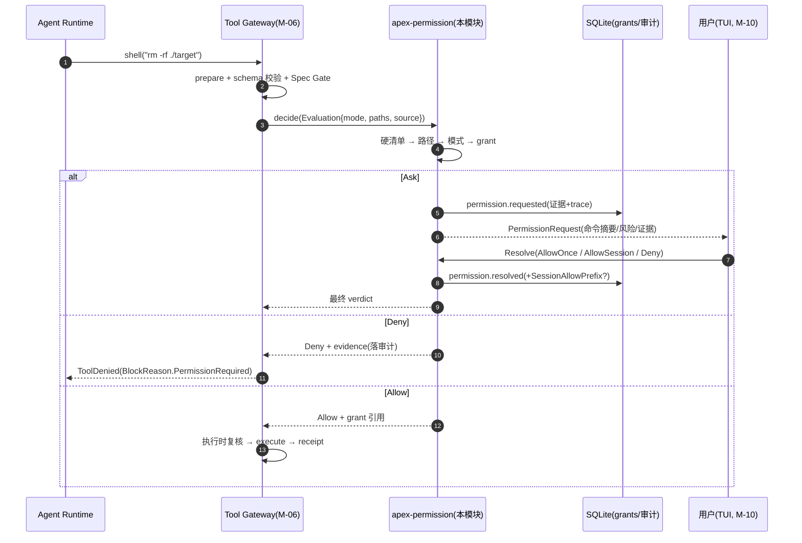
```mermaid
sequenceDiagram
    autonumber
    participant A as Agent Runtime
    participant G as Tool Gateway(M-06)
    participant P as apex-permission(本模块)
    participant DB as SQLite(grants/审计)
    participant U as 用户(TUI, M-10)

    A->>G: shell("rm -rf ./target")
    G->>G: prepare + schema 校验 + Spec Gate
    G->>P: decide(Evaluation{mode, paths, source})
    P->>P: 硬清单 → 路径 → 模式 → grant
    alt Ask
        P->>DB: permission.requested(证据+trace)
        P-->>U: PermissionRequest(命令摘要/风险/证据)
        U->>P: Resolve(AllowOnce / AllowSession / Deny)
        P->>DB: permission.resolved(+SessionAllowPrefix?)
        P-->>G: 最终 verdict
    else Deny
        P-->>G: Deny + evidence(落审计)
        G-->>A: ToolDenied(BlockReason.PermissionRequired)
    else Allow
        P-->>G: Allow + grant 引用
        G->>G: 执行时复核 → execute → receipt
    end
```

离线重放：harness 输入 `(mode, tool, source, paths, 有效 grants 快照)` → 同 verdict 同 evidence（VAL-84）；重放不依赖 Provider/网络/系统时钟（时间由假时钟注入，M-01 test-support）。

#### 6. 状态机

本模块不引入新状态枚举。相关状态机归属：`ToolCallStatus` 的 `Proposed → AwaitingPermission → Prepared/Running/...`（04 §4，reducer 在 M-06）；`PermissionRequest` 的生命周期（`Pending → Resolved | Expired | Consumed`）为 SQLite 投影内部状态，不进 04 枚举层。Session 归档时其 `SessionAllowPrefix` 全部失效（GrantScope.Session 终止条件，09 §7）。

#### 7. 存储设计

| 路径/表 | 内容 | 说明 |
|---|---|---|
| SQLite `permission_request` | Pending 请求全字段（09 §12 样例 + 状态） | Once 消费后置 `consumed`；Session 取消/归档时挂起请求转 `Expired` |
| SQLite `permission_grant` | Session 前缀 grant（v0.1 只落 Once/Session 两种 scope 的持久行；Once 消费即逻辑删除） | 绑定规范前缀、批准人、trace、ProjectId（04 §9） |
| 会话日志/事件 | `permission.requested`/`permission.resolved` | 审计与执行同 trace（09 §1） |
| 编译期常量 | 硬编码高危清单（§4.2） | 只在 `apex-permission` crate 内；修改即新版本，配合金丝雀 fixture |

保留策略：grant/request 行随 Session 归档转入归档表；审计事件按 M-02 事件保留策略。

#### 8. 错误处理与降级

| 场景 | 行为 |
|---|---|
| 命令无法规范化（动态片段/未展开变量/异常引号） | Unknown：plan Deny、ask/allow Ask（09 §2，RQ-053） |
| 路径不存在且为写目标 | 最深已存在祖先校验通过则按 InProjectRoot 判定；symlink 异常 → Deny |
| 会话 grant 与 ForcedAsk 冲突 | ForcedAsk 优先，每次必问 |
| Grant 并发消费 Once | SQLite 事务保证单消费者；后到者得 `APEX_PERM_REQUEST_CONSUMED` |
| 规范化库内部错误 | 向 "不自动执行" 收敛：Ask（ask/allow）或 Deny（plan）；绝不默认 Allow |

降级哲学：v0.1 所有不确定都推向 Ask/Deny；这是"牺牲便利不牺牲安全"在错误路径上的体现（17 §5.6）。

#### 9. 安全与权限边界

- **零 Token 不变量**：`apex-permission` 依赖图静态证明不含 Provider/LLM crate（03 §4 反向依赖扫描 + 15 §8 安全完成门）；判定全程不触网。
- 判权输入的命令摘要在事件/日志中脱敏；敏感 env 名（`*_TOKEN`/`*_KEY`/`*_SECRET`）在 evidence 中只出现分类标记不出现值（09 §6.3 的最小落地，全量分类 v0.3）。
- 硬清单保护 Apex 自身：`~/.apex/config/providers.toml`、`~/.apex/keys/**`、本项目与其他项目 daemon socket（通配 `~/.apex/projects/*/runtime/**`）为硬禁止写目标（09 §6.1 硬禁止默认覆盖的子集；socket 现按项目分片，07 §2）。
- UI 只提交决策，不自行推断权限（06 §3 `PermissionService` 设计）；客户端收到的命令已脱敏。

#### 10. 性能预算

- 单次 `decide` 纯内存匹配（清单 < 100 条 + 前缀表 HashMap + 路径 realpath），P95 ≤ 1 ms，不占命令确认 100 ms 预算（15 §7）的可观测份额。
- 路径 realpath 是唯一定 syscall；同一路径在 Run 内缓存规范化结果，失效由文件 watcher 驱动。
- Session grant 前缀匹配为 O（前缀条数 × 命令长度），grant 上限 200 条/会话，超限要求用户确认清理（防前缀表无限增长成为隐蔽的全局 allow）。

#### 11. 测试与验证策略

| VAL | 覆盖 EP | 验证要点 |
|---|---|---|
| VAL-214 | EP-1201 | 清单命中 100% 拦截（§4.2 每条目正反 fixture）；plan 模式所有写工具被拒；未知命令 ask 逐个询问；allow 模式非 grant 命令仍 Ask |
| VAL-84 | EP-0513 | 同一输入离线重放同 verdict；evidence 含引擎标识与 trace；无 LLM 依赖（依赖图扫描） |

补充测试：ForcedAsk 不被 Session grant 短路；Once 并发消费单胜者；路径 symlink swap（RISK-003 子集，全量 v0.3）；前缀规范化对多余空白/大小写（macOS）的确定性。故障注入：grants 表写中断、请求消费中断。覆盖率目标：Permission 行/分支 ≥ 90%（15 §6.2）。

#### 12. 实施工作项

按 17 §5.6：

| WI | 内容 | EP | 依赖 |
|---|---|---|---|
| WI-v0.1-59 | 三模式矩阵 + 硬编码清单 + 项目根路径限制 + 会话级"总是允许" | EP-1201 | M-01 Domain、M-06 Tool descriptor/Gateway 骨架 |
| WI-v0.1-60 | verdict evidence/audit（离线重放、trace 完整、无 LLM） | EP-0513 | 59、M-02 事件存储 |

依赖要点：59 的 Gateway 集成面（`decide` 签名与 `PermissionRequest` 流）必须先与 M-06 WI-v0.1-58 对齐再并行实现；60 的审计字段 schema 冻结后 M-10 权限面板才能消费。

---

<!-- 源文件：docs/design/m08-context-epoch.md -->

### 8. M-08 上下文组装与 ContextEpoch


#### 0. 元信息

| 项 | 值 |
|---|---|
| 模块编号 | M-08 |
| 版本归属 | v0.1（模块 G，见 17 §5.7） |
| 对应 EP | EP-0601、EP-0602、EP-0603 |
| 对应 VAL | VAL-95、VAL-96、VAL-97 |
| 对应需求 | RQ-074、075、077 |
| 上游依赖 | 02 §1 原则 5、04 §6、05 §10（ContextManager）、10 §1–§4、16 §12、17 §5.7/§6.2；M-04（capability/context_limit/cache） |
| 下游消费者 | M-03（Agent Loop 每次请求前构建 Epoch）、M-04（cache 布点消费布局）、M-11（v0.2 Checkpoint-first 取代本模块的临时截断） |

#### 1. 目标与范围

##### 1.1 目标

1. **Token 估算**（EP-0601）：Provider-aware token estimator，给每次请求提供可信的预算账。
2. **Source 模型**（EP-0602）：Stable/Turn/Retrieved 三类 Source 的优先级、hash 与 token estimate。
3. **ContextEpoch**（EP-0603）：一次 Provider 输入的可追溯构建结果；构建成功则原子替换当前 Epoch，**构建失败不消费 durable inbox 中的 Prompt**（10 §2）。
4. **布局**：volatile-content-last——稳定前缀在前、易变内容在后，为 Anthropic ephemeral 与 OpenAI `prompt_cache_key` 的前缀缓存服务（M-04 §4.2/4.3）。
5. **临时截断**（WI-v0.1-64）：超窗时保留 system+spec+最近 N 条并显式提示，v0.2 被 Checkpoint-first 取代。

##### 1.2 不做什么

- 60/70/80/90 watermark 状态机（EP-0604）、SnipHinter（EP-0605）、prune 引用（EP-0606）、LLM 摘要（EP-0607）→ v0.2（M-11）。
- Recovery Source（Checkpoint 恢复注入）→ v0.2；v0.1 只有 Stable/Turn/Retrieved 三类。
- Memory 召回注入（EP-0616）→ v0.6；Retrieved Source v0.1 只承载显式引用（如用户 `@文件`）与 Spec 文档。
- 不做跨 Provider continuation 兼容判断（04 §6 的禁令由 M-04 执行；v0.1 模型切换直接新建 Epoch，属安全默认）。

#### 2. 上游契约与引用

| 消费的定义 | 出处锚点 |
|---|---|
| Checkpoint-first 策略与"Context Window 只是模型输入缓存" | 10 §1 |
| Context Source 表（Stable/Turn/Retrieved/Recovery/Transient 与更新语义） | 10 §2 |
| Source 字段（source_id、hash、token estimate、priority、loss_policy、valid_until） | 10 §2 |
| "构建失败不消费 durable inbox 中的 Prompt" | 10 §2、16 §12 VAL-97 |
| `ContextManager` Trait | 05 §10 |
| 消息三层（AgentMessage/ModelMessage 派生关系） | 04 §6 |
| `context.epoch-replaced` 事件 | 04 §8 |
| 四档阈值语义（v0.1 只实现"超窗"一档的退化形态） | 10 §3 |
| S6 EP/VAL 注册 | 16 §12 |
| v0.1 WI 拆分（WI-v0.1-61–64）与 Superseded 约定 | 17 §5.7、§6.2 退出标准 6 |

#### 3. 领域模型

本模块拥有 v0.1 的 **ContextEpoch 构建物**（不重新定义 Source 字段语义，10 §2 为准）：

```rust
// 示意；字段语义以 10 §2 为准
struct ContextEpoch {
    epoch_id: u64,                 // 单调序号，Session 内递增
    model: ModelRef,
    sources: Vec<ContextSource>,   // 已按 §4.2 布局排序
    total_tokens_estimate: u32,
    budget: ContextBudget,         // 来自 capability.context_limit 扣输出与安全余量（10 §3 算法）
    source_set_hash: ContentHash,  // 全部 source hash 的组合，进事件与日志
    created_from: EpochProvenance, // turn_id / resume / model_switch / truncation
}
```

- Epoch 是**不可变值**：任何变化（新 Turn 消息、Stable hash 变化、截断动作）都构建新 Epoch 并原子替换引用，旧 Epoch 不可改（对应不可变性规则）。
- `context_epochs` 表（M-02 §7.1）只记 epoch 序号、model、source_set_hash、total_tokens、provenance——正文不入 SQLite（07 §4"模型全文不入库"）。
- ModelMessage（04 §6）是 Epoch 的派生物：`ContextEpoch → ModelRequest` 的转换在提交 Provider 前一次性完成，转换函数是纯函数，可重放。

#### 4. 接口设计

##### 4.1 Token estimator（EP-0601）

```rust
trait TokenEstimator: Send + Sync {
    fn estimate(&self, model: &ModelRef, req: &ModelRequest) -> ApexResult<u32>;
}
```

- Provider-aware：按 adapter 选择估算器。OpenAI 用 cl100k/o200k 系 tokenizer 离线计数；Anthropic 无公开 tokenizer 时用校准过的字符/词法启发式 + 安全系数（≥1.15），并把"估算非精确"写入 epoch metadata。
- 边界纪律：估算宁可高估不可低估（低估导致超窗请求失败，高估只是提前截断）；VAL-95 用边界 fixture（空、CJK、代码、长行）校准偏差带。
- Tool schema 也计入预算（function 定义 token 常被忽略，此处显式计费）。

##### 4.2 Source 优先级与布局（EP-0602）

优先级（高→低，截断时从低优先级动手）与布局（前→后，prefix cache 友好）是**两个不同序**，v0.1 定义如下：

| 布局位 | Source | 优先级 | 缓存语义 |
|---|---|---|---|
| 1 | system policy（Stable） | 最高 | Anthropic `cache_control` 布点 1（M-04 §4.2） |
| 2 | 已批准 Spec 文档（Stable） | 高 | 随位 1 同前缀；hash 变化 → 新 Epoch |
| 3 | Tool schemas（Stable） | 高 | `cache_control` 布点 2（tools 末元素） |
| 4 | Retrieved（显式引用/片段） | 中 | 易变，位于稳定前缀之后 |
| 5 | Turn 消息（历史 → 最新） | 低（尾部被截断优先） | 最后一条 user 块布点 3（history 前缀缓存） |

规则：**任何易变内容不得插入稳定前缀之前或之中**——Retrieved 永远追加在 Stable 之后、Turn 尾部之前的固定槽位；Memory 召回（v0.6）同样注入当前 user turn 尾部（17 §10.1 WI-v0.6-06 的同源原则）。每个 Source 的 `hash` 由规范化字节计算，hash 变化即触发新 Epoch（Stable）或追加（Turn）。

##### 4.3 ContextEpoch 构建与原子替换（EP-0603）

`ContextManager::build_epoch`（05 §10）流程：

1. 收集候选 Sources：system policy、当前已批准 Spec（content hash 绑定，M-05）、Tool registry 当前 descriptor 集、Retrieved、Turn 消息序列。
2. 估算总 token；超预算时执行 v0.1 临时截断（§4.4）得到新候选集。
3. 渲染 ModelRequest 并做**可构建性校验**（消息配对完整：tool_call/tool result 闭合，见 M-06 §4.4；无空消息；model capability 满足）。
4. 全部成功 → 原子替换 Session 的当前 Epoch 引用，append `context.epoch-replaced` 事件（含 epoch_id、source_set_hash、total_tokens、provenance）。
5. 任一步失败 → **不替换、不发事件、不消费 inbox**：Prompt 保持 `pending`，Turn 以 `Blocked{reason}` 或失败终态落事件（VAL-97）。这是"Context 构建是 Turn 的准入闸"的核心保证（10 §2）。

##### 4.4 v0.1 临时尾部截断（WI-v0.1-64）

超预算时的退化策略：

- 保留：Stable 全部（system+spec+tool schema 不参与截断）+ 最近 N 条 Turn 消息（N 由剩余预算反推，且**必须在消息边界切割**，保持 tool_call 配对闭合——从配对组边界整体取舍）。
- 丢弃段以一条显式系统可见提示占位：`[早期 N 条消息已省略，session_seq X..Y 可查]`；TUI 同步显示截断发生（17 §5.7 验收"触发时用户可见提示"）。
- 截断产生新 Epoch（provenance=truncation），事件可审计。
- **迁移路径**：v0.2 由 Checkpoint-first + 分级摘要（EP-0604–0612，M-11）取代——任何有损操作前先提交 Checkpoint，可无损重建，LLM 摘要仅兜底（17 §6.2 退出标准 1/6）；届时本策略标记 Superseded 并移除代码。因为 v0.1 无 Checkpoint，截断是不可恢复的有损操作——这是 v0.1 已登记的已知限制（17 §17 风险表"不在 v0.1 做长任务营销"）。

#### 5. 数据流与关键流程

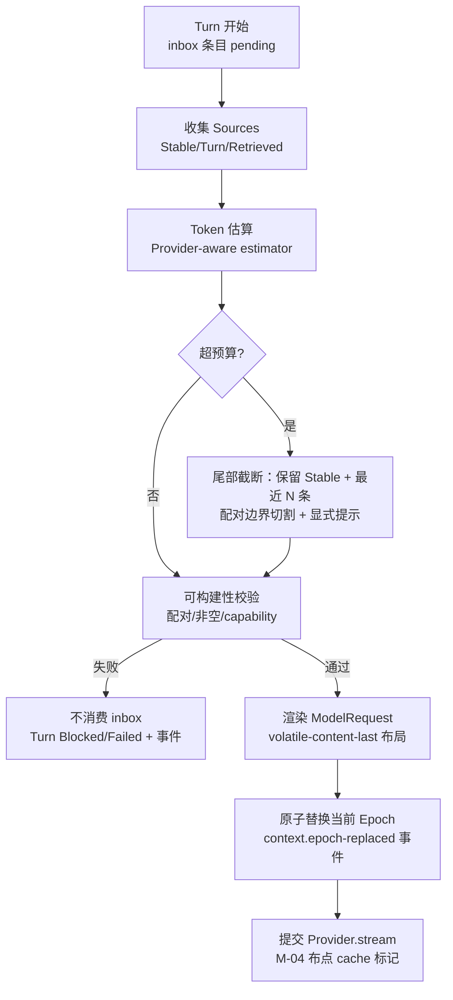
```mermaid
flowchart TD
    T[Turn 开始<br/>inbox 条目 pending] --> C[收集 Sources<br/>Stable/Turn/Retrieved]
    C --> E[Token 估算<br/>Provider-aware estimator]
    E --> O{超预算?}
    O -->|否| V[可构建性校验<br/>配对/非空/capability]
    O -->|是| TR[尾部截断：保留 Stable + 最近 N 条<br/>配对边界切割 + 显式提示]
    TR --> V
    V -->|失败| H[不消费 inbox<br/>Turn Blocked/Failed + 事件]
    V -->|通过| R[渲染 ModelRequest<br/>volatile-content-last 布局]
    R --> X[原子替换当前 Epoch<br/>context.epoch-replaced 事件]
    X --> P[提交 Provider.stream<br/>M-04 布点 cache 标记]
```

模型/Provider 切换：直接以 `provenance=model_switch` 构建全新 Epoch；厂商专属 continuation/reasoning handle 不携带（04 §6），v0.1 无需降级转换逻辑。

#### 6. 状态机

本模块无独立状态机。Epoch 生命周期：`Built（当前）→ Superseded（被替换）`，由 `context.epoch-replaced` 事件驱动；`context_watermarks` 表与四档阈值状态在 v0.2 引入（EP-0604），v0.1 的"超窗"判断是构建期的单次比较，不持久化水位。

#### 7. 存储设计

| 存储 | 内容 |
|---|---|
| `context_epochs` 表 | epoch_id、session_id、model、source_set_hash、total_tokens、provenance、created_at（M-02 §7.1 已登记） |
| 领域事件 | `context.epoch-replaced`（04 §8），payload 不含消息全文（04 §7 不变量） |
| 会话 JSONL | epoch 构建/截断记录（metadata 模式：hash、token 数、截断条数、trace） |

Stable Source 的正文来源：system policy 编译产物、Spec 文件（经 M-02 FileFactStore 读取）、Tool descriptor JSON——均按引用读取，不复制进 Epoch 存储。

#### 8. 错误处理与降级

| 场景 | 行为 |
|---|---|
| Spec 文件读取失败/hash 变化中 | Stable Source 构建失败 → Turn Blocked（SpecChanged），inbox 不消费 |
| 估算器不可用（tokenizer 加载失败） | 回退到全局字符启发式 + 更高安全系数，事件记 `degraded=true`，不阻塞 |
| 截断后仍超预算（Stable 本身过大） | 构建失败：`Blocked{reason: CapabilityUnsupported}` 变体 + 用户动作提示（拆分 Spec/换模型），不硬发请求 |
| 配对不闭合（异常中断遗留） | 构建失败拒绝发请求；v0.1 要求修复消息序列（M-06 配对保证正常不会触发此分支） |
| 模型切换 | 新建 Epoch；不尝试 continuation 移植（04 §6 安全默认） |

降级哲学：Context 构建失败永远**阻塞而非瘦身硬发**——超窗请求被 Provider 拒绝的代价比阻塞大（10 §1"Context Window 只是缓存，事实在事件/文件"）。

#### 9. 安全与权限边界

- Stable Source 中的 Spec 文档必须来自已批准且 hash 有效的当前版本（M-05 ApprovalRecord 绑定），过期审批的 Spec 不得注入上下文。
- Retrieved Source 只包含用户显式引用或经权限门读取的内容；v0.1 无自动检索，不存在"未授权内容被召回注入"通道（Memory 召回的 scope 约束在 v0.6 设计）。
- Epoch 内容进 Provider 请求前过 Secret Firewall 出口检查（12 §5）；`~/.apex/keys/**`、auth.json 内容属硬禁止注入。
- source_set_hash 使每次请求的材料可追溯；审计可回答"这次请求模型看到了什么"（hash 反查文件 generation）。

#### 10. 性能预算

| 指标 | 预算 |
|---|---|
| Epoch 构建（不含 Provider） | P95 ≤ 100 ms（10 万 token 级会话） |
| Token 估算 | 10 万字符 ≤ 50 ms；失败回退路径 ≤ 5 ms |
| Stable 前缀字节稳定 | 同内容同字节（v0.2 EP-1206 pin test 守护；v0.1 由契约 fixture 初查） |
| 缓存命中收益 | cache_read_tokens 记录进 usage（M-04），v0.2 进状态栏可观测 |

#### 11. 测试与验证策略

| VAL | EP | 要点 |
|---|---|---|
| VAL-95 | 0601 | 边界 fixture（空/CJK/代码/长行/tool schema）偏差带；高估方向安全 |
| VAL-96 | 0602 | Source hash 稳定；优先级与布局序固定；Stable 变化必触发新 Epoch |
| VAL-97 | 0603 | 构建失败（注入 Spec 读取失败/配对破坏）不消费 inbox、不替换 Epoch、事件正确 |

补充 fixture：截断后配对闭合属性测试（随机消息序列 + 随机预算）；布局 golden（Stable 前缀字节逐字节比对，v0.2 pin test 的前身上线）；模型切换新 Epoch 不携带旧 handle。

#### 12. 实施工作项

按 17 §5.7 模块 G：

| WI | 内容 | EP | 依赖 |
|---|---|---|---|
| WI-v0.1-61 | Provider-aware token estimator | EP-0601 | M-04 capability（可先用 fake） |
| WI-v0.1-62 | Stable/Turn/Retrieved Source 与优先级/hash | EP-0602 | M-01、M-05 审批 hash |
| WI-v0.1-63 | ContextEpoch 构建与原子替换 | EP-0603 | 61/62、M-03 Actor |
| WI-v0.1-64 | 临时尾部截断 + 用户可见提示 | （WI 新增，EP-0603 范围内） | 63 |

交付顺序：61/62 可并行；63 是 M-03 Agent Loop（WI-v0.1-34）的准入闸，须在 Loop 联调前就绪；64 最后并在 v0.2 移除。

---

<!-- 源文件：docs/design/m09-tui-core.md -->

### 9. M-09 TUI 核心框架


#### 0. 元信息

| 项 | 值 |
|---|---|
| 模块编号 | M-09 |
| 版本归属 | v0.1（模块 H，见 17 号文 §5.8；TUI 轨道见 16 §16.2） |
| 对应 EP | EP-1001、EP-1002、EP-1003、EP-1203、EP-1204、EP-1205 |
| 对应 VAL | VAL-167、VAL-168、VAL-169、VAL-215、VAL-216、VAL-217 |
| 对应需求 | RQ-009、RQ-114–RQ-121、RQ-123、RQ-124；AC-001（窗口内三端共享）、AC-003（Spec 编码门 UI）、AC-021（自包含启动）、AC-022（关窗收尾）、AC-023（同项目防重开）、AC-025（零配置首启） |
| 上游依赖 | 06-protocol-and-clients §1/§2/§3/§7/§9/§11/§12/§13、02-system-architecture §3/§3.1（窗口宿主与 daemon 生命周期）、03-workspace-and-crates（`apps/apex-tui` 四个子模块、`apex-client-sdk`）、04-domain-model §4/§5/§7、07 §2（项目分片与端点派生）、16 §16.1/§16.2、17 §5.8 |
| 下游消费者 | M-10（Spec/权限面板构建于本模块骨架之上）、M-17 活动面板（v0.4）、M-26/M-27（复用 reducer 分层与合并算法；Desktop/Web 经端点发现连接本项目 daemon） |

#### 1. 目标与范围

##### 1.1 目标

交付 v0.1 的**自包含原生窗口应用**：TUI 既是 `apexd` 的纯客户端（02 §1：单写者，TUI 只提交命令、查询快照、消费事件，不持有平行业务实现），又是 `apexd` 的**生命周期所有者**——双击图标拉起窗口，窗口再拉起本项目 daemon（`RQ-116`、`RQ-119`）。

1. **原生窗口骨架**：winit 事件循环 + softbuffer 像素缓冲 + 自定义 ratatui Backend（PixelBackend，含像素级 diff）+ 字体栈/DPI/IME/剪贴板适配（`RQ-118`）。
2. **项目选择器**：启动时展示最近项目列表与目录选择，确认后进入主界面（`RQ-117`，EP-1002 的窗口入口形态）。
3. **daemon 拉起与监管**：fork/exec 本项目 `apexd`、等待端点就绪、握手、崩溃降级；关窗时触发 drain 与安全点收尾（`RQ-119`、`RQ-121`）。
4. **会话面板**：Prompt 输入、Admission 回执、Turn 流式渲染（EP-1003）。
5. **渲染管线**：Markdown/代码高亮/CJK 宽字符正确的 Turn 渲染组件（EP-1203）。
6. **流式与中断**：流式输出渲染与 Esc 中断语义（EP-1204）。
7. **入口**：双击图标为主入口；CLI 参数（`apex --project <path>`）与首启向导为辅助（EP-1205）。

##### 1.2 不做什么

- 不实现 Spec/权限面板（M-10）、DAG/Memory/终端 UI（v0.2+，EP-1007–1009）、活动面板（v0.4，EP-1006）。
- 不支持音频与实时语音入口（`RQ-020`/`RQ-088`，06 §9）；日志浏览能力已对齐三端（`RQ-019`/`RQ-107`），其 UI 落在对应版本。
- 不实现 Web/Desktop 的独立窗口宿主；但 reducer 分层与"快照+事件合并"算法实现在 `apex-client-sdk`，三端共享（03 §4、06 §7）。
- 不自研完整渲染引擎：PixelBackend 是 ratatui 的自定义 Backend 实现（复用 ratatui 的组件/布局/双缓冲抽象），仅将 cell 栅格栅格化为像素，不重写布局与文本排版。

#### 2. 上游契约与引用

| 消费的定义 | 出处锚点 |
|---|---|
| 协议四分类（Command/Query/Durable/Transient） | 06 §1 |
| ClientHello/ServerHello 握手与版本协商、 Major 不兼容错误码 | 06 §2 |
| 本地 gRPC 服务清单（SessionService/EventService/ControlService…）、CommandMeta | 06 §3 |
| 快照与事件合并算法（5 步）、乐观显示纪律 | 06 §7 |
| WireEvent 信封（kind/session_seq/trace_id/payload） | 06 §11 |
| 错误与传输映射表（gRPC status → 客户端行为） | 06 §12 |
| i18n message key 纪律、不依赖颜色表达状态 | 06 §13 |
| UDS 端点 `~/.apex/projects/<project-hash>/runtime/apexd.sock`、端点派生与发现、端点 ACL | 02 §3、07 §2 |
| `SessionStatus`/`RunStatus`/`BlockReason` 枚举、Session 状态机与安全点 | 04 §4/§5 |
| TUI 轨道 EP 与 VAL、轨道顺序"TUI 测试 demo 先行" | 16 §16.1/§16.2 |
| WI-v0.1-65–72、EP-1203/1204/1205 新增定位 | 17 §5.8 |
| 差分渲染 60fps 合并重绘的工业实践 | AiAgent/docs/pi-实现原理分析.md §11.7 |
| UI↔Engine mpsc 通道分层实践 | AiAgent/docs/DeepSeek-TUI-实现原理分析.md §0.4/§7.11 |

#### 3. 领域模型

TUI 不拥有领域模型；它在 `apex-client-sdk` 内维护**客户端镜像状态**，全部可由 daemon 事实重建：

- **`ConnectionState`**：`Disconnected | Handshaking | Ready { negotiated_minor, enabled_features[] } | Reconnecting { attempt, next_backoff } | Resyncing`。不是 04 枚举，是 SDK 私有连接状态。
- **`SessionMirror`**：权威快照（`as_of_seq`）+ Durable 事件有序应用 + Transient 暂存。字段：`session_id`、`status: SessionStatus`（04 §4）、当前 Run、Turn 列表、Spec 门提示、待决权限数、`last_applied_seq`、gap 标记。
- **`TurnView`**：渲染侧 Turn 表示：消息块（文本/代码/工具调用摘要）、`streaming` 标记、`interrupted` 标记、usage 摘要。由 Durable 消息 + Transient model delta 合成；Transient 只进 ephemeral 层，永不改变 Durable reducer 状态（06 §7 第 5 条）。
- **`UiRoute`**：`ProjectPicker | Wizard | SessionList | SessionView { session_id } | Exiting`。`ProjectPicker` 是窗口启动后的入口路由（`RQ-117`）：读最近项目列表 + 目录选择；确认项目后进入对应 daemon 的会话路由。面板路由（Spec/权限）由 M-10 追加。
- **`WindowLifecycle`**（窗口宿主侧，非 04 枚举）：`Launched → PickingProject → AcquiringLock → SpawningDaemon → WaitingSocket → Handshaking → SessionActive → Closing → DaemonExiting → Exited`，与 02 §3.1 状态机一一对应；`AcquiringLock` 在同项目已开时转入"聚焦已有窗口并退出本进程"分支（`RQ-120`）。

纪律：客户端可乐观显示"命令已发送"，但只有收到 Admission receipt/Durable Event 后才显示"已接受/已改变"（06 §7 末段）。

#### 4. 接口设计

##### 4.1 进程内分层

```text
apps/apex-tui                    # 自包含原生窗口应用（产物名 apex）
 ├── main.rs            # 入口：窗口创建、CLI 辅助参数解析、日志初始化
 ├── window/            # winit 事件循环、DPI 适配、字体栈 fallback、IME、剪贴板、文件对话框
 ├── pixel_backend/     # softbuffer 帧缓冲 + ratatui Backend 适配 + 像素级 diff
 ├── project_picker/    # 启动项目选择器（最近列表/目录选择/新建）
 ├── daemon_launcher/   # fork/exec apexd、端点就绪等待、一次性握手令牌、崩溃降级、关窗 drain
 ├── app.rs             # App 状态机 + 主事件循环（输入/渲染/命令派发）
 ├── ui/                # ratatui 组件：布局、列表、Prompt、Turn 视图
 └── reducer glue       # 调 apex-client-sdk 的 reducer，不做业务判断
apex-client-sdk
 ├── transport          # UDS/NamedPipe gRPC client、握手、ACL 校验、端点发现（按项目 hash）
 ├── reconnect          # 指数退避、快照+事件合并（06 §7 算法）
 ├── reducer/durable    # Durable 事件 → SessionMirror
 └── reducer/ephemeral  # Transient 帧 → 渲染暂存（可丢弃）
```

窗口栈依赖（窗口与事件循环、像素缓冲、字体栅格化）只允许出现在 `apps/apex-tui`，不得进入任何 `crates/` 库（03 §6）；平台条件编译集中在 `window/`（03 §5）。

参考 DeepSeek-TUI 的 `Op`/`Event` 枚举分层（§7.11：UI↔Engine 多通道 mpsc），Apex 的对应物是 SDK 内的 `UiCommand`（TUI → SDK）与 `ClientEvent`（SDK → TUI）两条通道；与 daemon 之间只有协议四类（06 §1）。

##### 4.2 daemon 拉起、连接与重连（EP-1001）

**拉起协议**（窗口宿主 → daemon）：

1. 用户在项目选择器确认项目根 → realpath 归一化 → 派生 `<project-hash>` 与端点（M-02 §4.1/§4.2）。
2. 获取项目级单实例锁；若同项目已开，聚焦已有窗口并退出本进程（`RQ-120`）。
3. fork/exec `apexd`，经参数/环境传入项目根与**一次性握手令牌**；进入 `WaitingSocket`，轮询端点就绪（默认超时 10 s）。
4. 超时或拉起失败 → `Degraded`：展示诊断要点（权限、端口、Schema）并退出，不进入静默重试风暴。

**连接与重连**：

- 端点：Unix 取 `~/.apex/projects/<project-hash>/runtime/apexd.sock`（`sun_path` 超限回退 `/tmp/apex-<user>-<hash>.sock`，02 §3）；Windows 取按项目命名的 Named Pipe；两者承载相同 Proto 契约（06 §1）。
- 握手：`Connect(ClientHello + 握手令牌)` → 校验 Major（不兼容则显示 `APEX_PROTOCOL_*` message key 并退出）、收集 `enabled_features`。
- 重连：连接断开 → `Reconnecting`，指数退避（100 ms 起、上限 5 s、最多 10 次后提示手动重试）；恢复后执行 06 §7 合并算法：取 Snapshot（`as_of_seq=N`）→ `SubscribeSession(since_seq=N+1)` → 缓冲 live、应用补发、按 seq 去重排序 → gap 或 `RESYNC_REQUIRED` 时丢弃本地缓存重取 Snapshot。
- fake daemon：EP-1001 交付的 demo 必须能在 M-01 test-support 的内存 daemon 上运行（VAL-167 smoke）。

**关窗收尾**（`RQ-119`、`AC-022`）：用户关闭窗口 → 宿主发起 `daemon.RequestShutdown(deadline)` → daemon 在预算内到达安全点并强制 Checkpoint（M-11 window-close 触发点）→ 未完成 Run/DAG 进入 `Paused` 标记可恢复 → drain 超时则 SIGTERM 强制退出。窗口仅在 daemon 退出或超时后真正关闭。

##### 4.3 Prompt 与 Admission（EP-1003）

- `SubmitPrompt` 走 Command 通道，携带 `CommandMeta{request_id, idempotency_key, traceparent, ...}`（06 §3）；idempotency key 由 SDK 生成（UUIDv7），重试/重连后重发同 key 不产生重复 Turn（服务端先持久化 admission 再返回，06 §3 末段）。
- UI 状态机（组件级，不进 04 枚举）：`Editing → Sent(乐观) → Admitted(receipt) → Streaming → Done | Interrupted | Blocked(reason)`。`Blocked` 必须展示 `BlockReason` 对应的恢复动作（04 §4 纪律：不只显示自由文本）。
- 命令确认 P95 ≤ 100 ms（15 §7）的客户端侧观测：从回车到 receipt 渲染计时，超预算在诊断日志标注。

##### 4.4 渲染组件（EP-1203）

- Markdown： pulldown 类解析 → ratatui `Text/Line/Span`；代码块走 syntect 高亮；围栏块语言未知时退化为等宽无高亮。
- CJK/宽字符：一切宽度计算经 `unicode-width`，禁按 `char` 计数截断；val-215 golden 集：CJK 混排、emoji、宽字符在代码块/表格/引用边界、零宽连接符。
- 差分渲染：ratatui 双缓冲 cell diff 内建；应用层纪律参照 pi §11.7——渲染请求合并（同帧多次 invalidate 只绘一次）、帧率上限 60 fps（16 ms 间隔）、宽高变化时全量重绘。

##### 4.5 流式与 Esc 中断（EP-1204）

- Transient model delta 只进 ephemeral reducer，按 `tool_call_id`/消息序就地追加渲染；断连时 Transient 可丢，Durable 补发后渲染自动收敛到权威内容。
- **Esc 语义**：按下 Esc → `SessionService.CancelRun`（Command，幂等）；UI 立即显示"中断中"；daemon 在下一安全点停 Run（04 §5：不可中断副作用完成当前原子操作）；收到 `turn.interrupted`/Run 终态 Durable 事件后显示"已中断"。Esc 不是本地 kill：TUI 无权直接杀任何东西（单写者原则）。
- VAL-216：中断后 `SessionMirror` 状态与 daemon 投影一致，无悬挂 `streaming` 标记。

##### 4.6 入口、项目选择器与首启向导（EP-1205）

**主入口是双击图标**（`RQ-116`）：不依赖系统终端、不弹终端窗口。CLI 参数为辅助入口：

```text
apex                        # 双击等价：启动窗口 → 项目选择器
apex --project <path>       # 直接打开对应项目窗口（跳过选择器）
apex --resume [<id-prefix>] # 恢复指定/最近会话（前缀匹配，冲突则列出候选）
apex --mode plan|ask|allow  # 覆盖会话权限模式（默认读项目/全局配置）
apex doctor                 # 环境自检（分片/socket/key/版本；枚举活跃 daemon）
```

**项目选择器**（`RQ-117`、`VAL-217`）：列出最近项目（名称、路径、最后打开时间，源自 `~/.apex/config/tui.toml`）+ "打开文件夹…"（系统原生文件对话框）+ "新建项目"；无最近记录时直接进目录选择。`Enter` 默认选中第一项。

**首启向导**（VAL-217）：无 Provider key 时进入 `Wizard` 路由引导配置（选择 Provider → 原生窗口密码框输入 key，隐藏字符、防截屏 → `ProviderService.TestConnection` → 写入 `~/.apex/config/providers.toml`，0600 权限，写需用户级文件锁），**不得报错退出**。零配置首启（`RQ-123`/`AC-025`）：配置缺失或非法时降级为默认值并给出非阻塞提示。`--resume` 恢复后消息、Spec 状态、审批记录完整（17 §5.10 退出标准 5）。

##### 4.7 原生窗口渲染栈（RQ-118）

- **PixelBackend**：实现 ratatui `Backend` trait，将 cell 栅格经字体渲染转为 RGBA 像素缓冲（softbuffer 呈现）；双缓冲 + 像素级 diff，仅重绘脏区域。字符栅格与网格坐标由字体度量决定。
- **字体栈**：主字体可配（默认等宽），系统字体 fallback 链兜底 CJK/emoji；字体加载失败降级为内置位图字体并记录诊断（RISK-004d）。
- **DPI**：HiDPI 与多屏 DPI 变化时按新 scale 重排布局并重渲染。
- **IME**：拼音/日文/韩文组合输入经 winit IME 事件接入输入框，组合串正确上屏。
- **剪贴板**：原生复制/粘贴（区别于终端 backend 依赖终端模拟器）。

#### 5. 数据流与关键流程

##### 5.1 用户输入 → daemon → 事件流 → reducer → 渲染

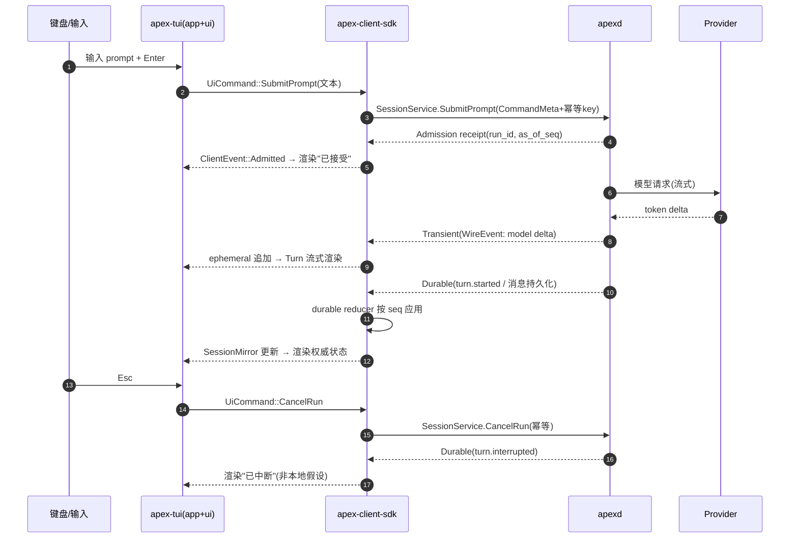
```mermaid
sequenceDiagram
    autonumber
    participant K as 键盘/输入
    participant UI as apex-tui(app+ui)
    participant SDK as apex-client-sdk
    participant D as apexd
    participant P as Provider

    K->>UI: 输入 prompt + Enter
    UI->>SDK: UiCommand::SubmitPrompt(文本)
    SDK->>D: SessionService.SubmitPrompt(CommandMeta+幂等key)
    D-->>SDK: Admission receipt(run_id, as_of_seq)
    SDK-->>UI: ClientEvent::Admitted → 渲染"已接受"
    D->>P: 模型请求(流式)
    P-->>D: token delta
    D-->>SDK: Transient(WireEvent: model delta)
    SDK-->>UI: ephemeral 追加 → Turn 流式渲染
    D-->>SDK: Durable(turn.started / 消息持久化)
    SDK->>SDK: durable reducer 按 seq 应用
    SDK-->>UI: SessionMirror 更新 → 渲染权威状态
    K->>UI: Esc
    UI->>SDK: UiCommand::CancelRun
    SDK->>D: SessionService.CancelRun(幂等)
    D-->>SDK: Durable(turn.interrupted)
    SDK-->>UI: 渲染"已中断"(非本地假设)
```

##### 5.2 窗口与连接生命周期

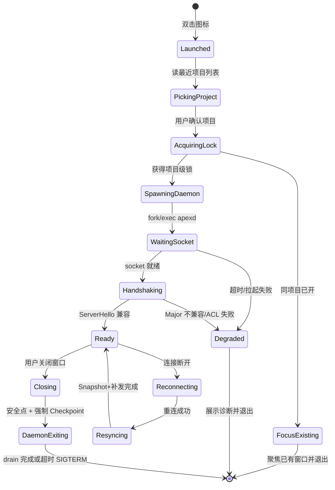
```mermaid
stateDiagram-v2
    [*] --> Launched: 双击图标
    Launched --> PickingProject: 读最近项目列表
    PickingProject --> AcquiringLock: 用户确认项目
    AcquiringLock --> FocusExisting: 同项目已开
    FocusExisting --> [*]: 聚焦已有窗口并退出
    AcquiringLock --> SpawningDaemon: 获得项目级锁
    SpawningDaemon --> WaitingSocket: fork/exec apexd
    WaitingSocket --> Handshaking: socket 就绪
    WaitingSocket --> Degraded: 超时/拉起失败
    Degraded --> [*]: 展示诊断并退出
    Handshaking --> Ready: ServerHello 兼容
    Handshaking --> Degraded: Major 不兼容/ACL 失败
    Ready --> Reconnecting: 连接断开
    Reconnecting --> Resyncing: 重连成功
    Resyncing --> Ready: Snapshot+补发完成
    Ready --> Closing: 用户关闭窗口
    Closing --> DaemonExiting: 安全点 + 强制 Checkpoint
    DaemonExiting --> [*]: drain 完成或超时 SIGTERM
```

##### 5.3 主界面布局（SessionView）

```text
┌─ apex ─ workspace: payment-service ─ session: 0198f7… ─ mode: ask ─ ctrl: held ─┐
│                                                                                 │
│  > 用户: 把登录接口加上限流                                          14:02:11   │
│                                                                                 │
│  ⏺ Agent:                                                                      │
│    我先查看现有中间件结构。                                                      │
│    ┌─ tool: read_file ─ src/middleware/mod.rs ─────────────── allow(rule:ro) ┐ │
│    │ …                                                                        │ │
│    └──────────────────────────────────────────────────────────────────────────┘ │
│    ```rust                                                                      │
│    pub struct RateLimiter { … }                                                 │
│    ```                                                                          │
│    ▍streaming…                                          tokens: 3.2k ↑ 1.1k ↓  │
│                                                                                 │
├─ Spec: tasks ✓approved ─ Permission: 1 pending ─ [Esc]中断 [Tab]面板 [F1]帮助 ─┤
│ ❯ 输入 prompt…                                                        128/4000 │
└─────────────────────────────────────────────────────────────────────────────────┘
```

布局约束：状态栏同时用文本与图标表达阻塞/失败，不依赖颜色（06 §13）；底部输入框显示草稿字数与幂等状态；`ctrl` 指示控制租约持有情况（06 §6）。

#### 6. 状态机

见 §5.2（连接）与 §4.3（Prompt 组件级）。Session/Run 权威状态机由 daemon 持有（04 §5），TUI 只镜像不裁决；本地组件状态与权威状态的差异一律以 Durable 事件为准收敛。

#### 7. 存储设计

TUI 自身几乎无持久化：

| 路径 | 内容 | 说明 |
|---|---|---|
| `~/.apex/config/providers.toml` | Provider 配置（首启向导产物） | 0600；由 daemon/向导经 Secret 边界写入，TUI 不回显明文 |
| `~/.apex/config/tui.toml` | UI 偏好（主题/键位覆盖/最近 workspace） | 不含 Secret |
| 内存 `SessionMirror` | 快照+事件重建 | 进程退出即弃；`--resume` 从 daemon 重取 |

会话、消息、审批、grant 的权威存储全在 daemon（M-02/M-03），TUI 崩溃不影响事实。

#### 8. 错误处理与降级

| 场景 | 行为 |
|---|---|
| daemon 拉起失败 / 端点超时 | 进入 `Degraded`：展示诊断要点（权限/端口/Schema），提示 `apex doctor`；不静默重试风暴 |
| 同项目已被打开 | 聚焦已有窗口并退出本进程（`RQ-120`/`AC-023`） |
| 握手 Major 不兼容 | 显示 `APEX_PROTOCOL_CLIENT_TOO_OLD/SERVER_TOO_OLD` message key，退出码 2 |
| 事件流 gap / `RESYNC_REQUIRED` | 停止 reducer、显示"重新同步中"、重取 Snapshot（06 §7 第 4 条） |
| 命令 `UNAVAILABLE` | 仅幂等请求指数退避重发（06 §12）；非幂等请求显示失败由用户决定 |
| 关窗 drain 超时 | 强制 SIGTERM；下次打开同项目按恢复流程分类未知副作用节点（`AC-022`） |
| 字体缺失 / IME 失败 / DPI 异常 | 降级为内置位图字体与基础输入，记录诊断（RISK-004d） |
| 渲染 panic（组件 bug） | panic boundary 捕获，回退到纯文本转储当前 Turn，不丢 daemon 连接 |
| 窗口过窄（< 60 列） | 降级为单列流式布局，面板快捷键提示隐藏 |

#### 9. 安全与权限边界

- TUI 是当前 OS 用户内的受信客户端：端点 ACL + 握手 nonce + 协议版本共同验证（02 §部署、06 §2）；socket 路径不出现在日志明文以外的任何外发通道。
- TUI 进程不持有 Provider Key：key 由 daemon 的 SecretResolver 管理，首启向导的 key 输入直接经 `ProviderService` 写入，TUI 内存中不留存（RISK-013 出口防火墙的客户端侧）。
- 渲染来自 Agent/工具的文本一律视为不可信：ANSI 转义序列在渲染前剥离（防终端注入）；链接只做展示不自动打开。
- 所有状态变更走 Command 通道；非控制客户端禁止提交改变运行的 Command（06 §6），UI 在无租约时禁用相应快捷键并显示 holder。

#### 10. 性能预算

| 指标 | 目标 | 出处 |
|---|---|---|
| 窗口首帧（项目选择器可见） | ≤ 300 ms（双击图标到首帧） | 15 §7，AC-021 |
| daemon 就绪 | ≤ 2 s（确认项目到 IPC Ready，含 fork/exec + 握手） | 15 §7 |
| 命令确认渲染 | receipt 到达后下一帧渲染（≤ 16 ms） | 15 §7 命令确认 P95 100 ms 的客户端份额 |
| 跨端事件可见 | Durable commit → TUI 渲染 P95 ≤ 250 ms 内的 reducer apply 份额 | 15 §7 |
| 10k Session 列表分页 | keyset 分页滚动不卡顿；单页 50 条 | 15 §7 分页项 |
| 流式渲染 | 60 fps 上限、合并重绘；CJK 文本无截断错位（VAL-215 golden） | pi §11.7 实践 |
| PixelBackend 帧耗 | 脏区域重绘单帧 CPU ≤ 8 ms，稳态无脏区不重绘 | RQ-118 |

#### 11. 测试与验证策略

| VAL | 覆盖 EP | 验证要点 |
|---|---|---|
| VAL-167 | EP-1001 | fake daemon smoke；UDS/NamedPipe 断线重连与补发 |
| VAL-168 | EP-1002 | Workspace/Session 列表分页、无权限项目不显示 |
| VAL-169 | EP-1003 | Prompt 幂等（同 key 重发无重复 Turn）；Blocked 展示与恢复动作 |
| VAL-215 | EP-1203 | CJK/宽字符/emoji/代码块 golden；窄终端重排 |
| VAL-216 | EP-1204 | Esc 中断后 mirror 与 daemon 投影一致；无悬挂 streaming |
| VAL-217 | EP-1205 | 无 key 首启进入向导而非报错；`--resume` 状态完整 |

方法：reducer golden 测试（固定事件流 → 固定 mirror 状态，16 §16.2 S10 验证流程的"冻结 TUI reducer goldens"）；渲染 golden（快照比对 ratatui buffer）；ratatui 后端用 TestBackend 注入键序做组件级 E2E。客户端单测覆盖率纳入 VAL-192 统一阈值（EP-1026）。

#### 12. 实施工作项

按 17 §5.8：

| WI | 内容 | EP | 依赖 |
|---|---|---|---|
| WI-v0.1-65a | 原生窗口骨架：winit + softbuffer + PixelBackend + 字体/DPI/IME/剪贴板 | EP-1001（窗口侧） | M-01 基座 |
| WI-v0.1-65b | daemon 拉起协议 + 连接/重连（分片 UDS/pipe）+ 关窗 drain | EP-1001 | 65a、M-03 daemon、M-02 端点派生、apex-client-sdk |
| WI-v0.1-66 | 项目选择器 + Session 列表 | EP-1002 | 65b |
| WI-v0.1-67 | Prompt/Admission/Turn 流式视图 | EP-1003 | 65b/66、M-03 SessionService |
| WI-v0.1-70 | Markdown/代码高亮渲染组件 | EP-1203 | 67 |
| WI-v0.1-71 | 流式输出与 Esc 中断 | EP-1204 | 67 |
| WI-v0.1-72 | 双击入口 + CLI 辅助 + 首启向导（原生密码框） | EP-1205 | 65b、M-04 ProviderService |

依赖要点：65a/65b 是 TUI 轨道第一交付物（16 §16.1 轨道顺序第 1 条，65 拆分为窗口骨架与拉起/连接两项），其 reducer goldens 冻结后 Desktop/Web 底座（EP-1011 起）才可推进；70/71 与 67 可小步并行但合并顺序 67 先行。

---

<!-- 源文件：docs/design/m10-tui-spec-permission.md -->

### 10. M-10 TUI Spec 与权限交互面板


#### 0. 元信息

| 项 | 值 |
|---|---|
| 模块编号 | M-10 |
| 版本归属 | v0.1（模块 H 子集，见 17 号文 §5.8；TUI 轨道见 16 §16.2） |
| 对应 EP | EP-1004（Spec/Approval/Skip 面板）、EP-1005（Permission Ask/Allow/Deny UI） |
| 对应 VAL | VAL-170、VAL-171 |
| 对应需求 | RQ-036–041（Spec）、RQ-047–054（权限）、RQ-115（i18n） |
| 上游依赖 | 06-protocol-and-clients §3（SpecService/PermissionService）、08-spec-rules-verification §1/§4/§5/§6、09-tool-permission-terminal §2/§7/§12、16 §16.2、17 §5.8 |
| 模块内依赖 | M-09（TUI 骨架/reducer/渲染）、M-05（SpecPipeline 快照与审批）、M-07（verdict 证据结构） |
| 下游消费者 | M-17 活动面板（v0.4 复用通知组件）、M-26/M-27（Desktop/Web 面板等价实现参照） |

#### 1. 目标与范围

##### 1.1 目标

在 M-09 骨架上交付 v0.1 两个人审交互面板，落实"Agent 不得把用户未回复解释为批准"（08 §1）与"UI 只提交决策，不自行推断权限"（06 §3）的客户端侧：

1. **Spec 面板**（EP-1004）：四文档状态卡、当前阶段高亮、审批/驳回、hash 失效提示、`/skip-spec` 发起与记录展示。
2. **权限审批弹窗**（EP-1005）：命令摘要、风险说明、证据区、Allow Once / Always（Session）/ Deny 决策提交。
3. **键盘快捷键方案**：全键盘可达，无鼠标依赖。
4. **错误与通知组件**：阻塞/失效/审批结果的统一呈现。

##### 1.2 不做什么

- 不在客户端做任何权限推断或 Spec 门判定：面板只渲染 daemon 下发的 `SpecPipelineSnapshot`/`PermissionRequest`，决策一律经 Command 通道回传（06 §3 服务契约）。
- 不展示审批/权限全文日志（Desktop/Web 能力，06 §9 能力矩阵）；面板只引用 event id/trace。
- 不实现 DAG/Memory/终端面板（EP-1007–1009，v0.2+）。
- 不绕过简化权限的 ForcedAsk 语义：清单条目不提供 Always 选项（M-07 §4.2）。

#### 2. 上游契约与引用

| 消费的定义 | 出处锚点 |
|---|---|
| `SpecService.GetPipeline/Approve/GrantSkip/AcceptVerification` | 06 §3 |
| `PermissionService.ListPending/Resolve/ListGrants/Revoke`（UI 只提交决策） | 06 §3 |
| `SpecPipelineSnapshot`、`ApprovalRecord` 绑定、`InvalidationPlan` | M-05 §3/§4 |
| SkipGrant 审计字段全集、安全门保留、未验证完成语义 | 08 §6、M-05 §9 |
| 失效传播与"下一安全点暂停" | 08 §5 |
| 权限审计 JSON 样例（evidence/requested_scope_options） | 09 §12、M-07 §4.3 |
| 模式语义与授权期限（Once/Session；ForcedAsk 无 Always） | 09 §2/§7、M-07 §4.1/§4.2 |
| `StageStatus`/`PermissionDecision` 枚举 | 04 §4（只引用） |
| 不依赖颜色表达状态、message key i18n | 06 §13 |
| VAL-170/171 验收口径 | 16 §16.2、17 §5.8 |

#### 3. 领域模型

本模块不拥有领域类型，只定义面板视图模型（由 M-09 的 `SessionMirror` + daemon Query 投影派生，全部可重建）：

- **`SpecPanelView`**：`feature`、五阶段卡片数组 `(stage: SpecStage, status: StageStatus, generation, hash 短码, 上游一致标记)`、`current_stage`、`pending_action: Approve | Reapprove(Invalidated) | ConfirmVerification | None`、最近 skip 记录列表（`scope/stages/reason/operator/剩余有效期`）。
- **`PermissionPopupView`**：`permission_request_id`、工具名、命令脱敏摘要、风险说明（命中规则 reason key 的本地化文本）、`evidence[]`、可选 scope 列表（按 M-07 下发的 `requested_scope_options` 渲染，ForcedAsk 时仅 Once/Deny）、`mode_at_decision`。
- **`Notice`**：通知组件条目：`{ level: Info | Warn | Error | Blocked, message_key, args[], trace_id 短码, sticky: bool, action?: UiAction }`。阻塞类 Notice 必须携带恢复动作（04 §4 BlockReason 纪律的 UI 落地）。

#### 4. 接口设计

##### 4.1 面板路由与快捷键

M-09 的 `UiRoute` 追加 `SpecPanel` 与模态 `PermissionPopup`（弹窗不打断路由栈）。快捷键（默认值，可被 `~/.apex/config/tui.toml` 覆盖；06 §13 要求所有状态有文本表达）：

| 键 | 上下文 | 动作 |
|---|---|---|
| `F2` | 任意 | 打开/关闭 Spec 面板 |
| `F3` | 任意 | 打开待决权限列表（pending > 0 时有徽标） |
| `Tab` / `Shift+Tab` | 面板内 | 卡片/字段间移动焦点 |
| `Enter` | Spec 卡片聚焦 | 展开文档摘要（只读视图，进编辑器由用户显式 `e` 触发） |
| `a` | Spec 面板（阶段 AwaitingApproval/Invalidated） | 批准当前阶段（绑定当前 hash，二次确认页显示 hash 短码） |
| `r` | 同上 | 驳回并附理由 → 回 Draft |
| `s` | Spec 面板 | 发起 `/skip-spec`：依次选择 scope（run/session）、stages、填写 reason |
| `v` | Verification 阶段待确认 | AcceptVerification（默认策略下必须用户确认，RQ-041） |
| `1`/`2`/`3` | 权限弹窗 | Allow Once / Allow Always(Session) / Deny |
| `e` | 权限弹窗 | 展开/收起证据区 |
| `Esc` | 弹窗 | 关闭且不决策（请求保持 Pending；**不等于 Deny**） |

纪律：弹窗存在时主输入框失焦，避免误输入；所有决策键在按下后显示"已发送"乐观态，收到 `permission.resolved`/`approval.granted` Durable 事件后才显示生效（06 §7 乐观显示纪律）。

##### 4.2 Spec 面板数据流与布局

- 打开时 `SpecService.GetPipeline(feature)` 取 `SpecPipelineSnapshot`；此后由 Durable 事件（`spec.changed`/`approval.granted`/`approval.invalidated`/`skip.granted`/`verification.accepted`）驱动刷新——不轮询。
- 审批：`Approve { stage, expected_content_hash }` 经 Command 通道携带当前 hash；hash 在打开面板到按键之间已变化时，daemon 返回 optimistic conflict（`ABORTED`，06 §12），面板刷新并提示"内容已变化，请复核后再批"。
- 失效提示：`approval.invalidated` 到达后对应卡片置 `Invalidated`，并沿 M-05 §5.2 传播图高亮全部受影响下游阶段；附原因（自身内容变化/上游变化/profile 变化）。
- skip 记录：卡片下方列出本 Session 的 SkipGrant（scope/stages/reason/operator/到期）；跳过 Verification 完成的 feature 在面板上显示"完成（未验证，已审计跳过）"（08 §6）。

Spec 面板布局（全屏覆盖层）：

```text
┌─ Spec 流水线 ─ feature: permission-engine ────────────────────────── [F2 关闭] ┐
│                                                                                 │
│  ┌ requirements ────────┐ ┌ design ──────────────┐ ┌ tasks ─────────────────┐ │
│  │ ● approved     gen:3 │ │ ● invalidated  gen:2 │ │ ○ awaiting_approval    │ │
│  │ hash 9f2c…a1         │ │ hash 77ab…e4         │ │ hash 41de…07           │ │
│  │ 上游: —              │ │ 上游: ✗ req 已变化   │ │ 上游: ✗ design 已失效  │ │
│  └──────────────────────┘ └──────────────────────┘ └────────────────────────┘ │
│  ┌ coding ──────────────┐ ┌ verification ──────┐                               │
│  │ ○ hold(SpecChanged)  │ │ ○ draft            │   传播高亮: requirements 改动  │
│  │ gate: 拒绝写入       │ │                    │   → design/tasks/coding 失效   │
│  └──────────────────────┘ └────────────────────┘                               │
│                                                                                 │
│  skip 记录(本 session):                                                         │
│   14:32  scope=run      stages=design        reason="hotfix triage"  剩 1 run   │
│   15:01  scope=session  stages=all           reason="只读探索"       至会话结束 │
│                                                                                 │
│  [a]批准 [r]驳回 [s]skip-spec [v]确认验证 [e]编辑器打开 [Enter]摘要             │
└─────────────────────────────────────────────────────────────────────────────────┘
```

##### 4.3 权限弹窗数据流与布局

- `PermissionService.ListPending` 取待决队列；`permission.requested` Durable 事件到达时若用户处于 SessionView 则直接弹窗（可配置为仅徽标）。
- 决策：`Resolve { request_id, decision, scope? }`；`Always` 只在 `requested_scope_options` 含 session 时出现（ForcedAsk 清单条目与网络目标 v0.1 不提供）。
- 已决 grant 管理：`ListGrants`/`Revoke` 在 `F3` 列表的第二页签，撤销即 `Revoke` Command；Once 已消费项不展示。

权限审批弹窗布局（模态，居中覆盖）：

```text
              ┌─ 权限请求 ─ tool: shell ─ mode: ask ──────────────────┐
              │                                                        │
              │  命令: rm -rf ./target                                 │
              │  风险: 递归强制删除 (DeletePath)                        │
              │  资源: workspace:target/  (项目根内)                    │
              │                                                        │
              │  ┌─ 证据 [e 收起] ──────────────────────────────────┐  │
              │  │ rule: harddeny.fs.rm-root.v1 → not_hit            │  │
              │  │ path: in_project_root                             │  │
              │  │ grant: no_matching_grant                          │  │
              │  │ engine: simple.v1   trace: 4bf92f…                │  │
              │  └───────────────────────────────────────────────────┘  │
              │                                                        │
              │   [1] Allow Once    [2] Always(本会话)    [3] Deny     │
              │                                                        │
              │   Esc 暂不决策(保持 Pending)                           │
              └────────────────────────────────────────────────────────┘
```

ForcedAsk 条目（如 `git push --force`）的弹窗形态相同，但第 [2] 键位不渲染，并在风险区追加"该命令类别要求每次确认"（M-07 §4.2）。

##### 4.4 通知组件

右下角浮层 + 状态栏徽标双通道：Error/Blocked 为 sticky（需显式关闭或状态解除），Info/Warn 3 秒淡出。全部通知带 message key 与 trace 短码（06 §12/§13）；渲染前剥离 ANSI 转义（M-09 §9）。

#### 5. 数据流与关键流程

##### 5.1 审批一阶段（含失效回放）

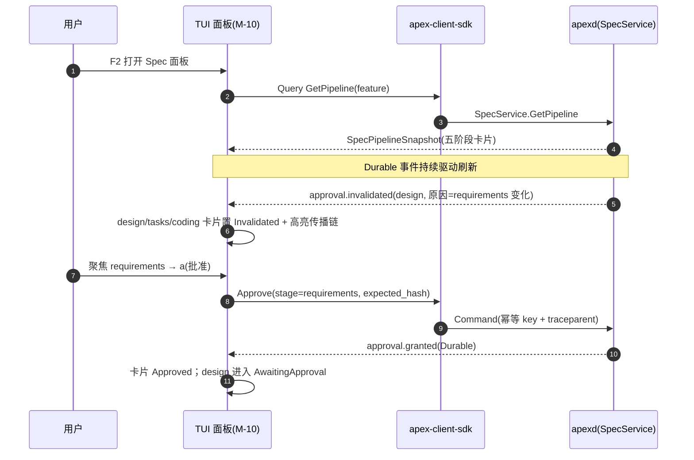
```mermaid
sequenceDiagram
    autonumber
    participant U as 用户
    participant T as TUI 面板(M-10)
    participant SDK as apex-client-sdk
    participant D as apexd(SpecService)

    U->>T: F2 打开 Spec 面板
    T->>SDK: Query GetPipeline(feature)
    SDK->>D: SpecService.GetPipeline
    D-->>T: SpecPipelineSnapshot(五阶段卡片)
    Note over D,T: Durable 事件持续驱动刷新
    D-->>T: approval.invalidated(design, 原因=requirements 变化)
    T->>T: design/tasks/coding 卡片置 Invalidated + 高亮传播链
    U->>T: 聚焦 requirements → a(批准)
    T->>SDK: Approve(stage=requirements, expected_hash)
    SDK->>D: Command(幂等 key + traceparent)
    D-->>T: approval.granted(Durable)
    T->>T: 卡片 Approved；design 进入 AwaitingApproval
```

##### 5.2 权限询问决策

```mermaid
sequenceDiagram
    autonumber
    participant D as apexd(权限/网关)
    participant T as TUI 弹窗(M-10)
    participant U as 用户

    D-->>T: permission.requested(命令摘要/证据/scope 选项)
    T->>T: 弹窗(命令+风险+证据区)
    U->>T: 按 1(Allow Once) / 2(Always) / 3(Deny) / e(证据)
    T->>D: PermissionService.Resolve(request_id, decision, scope?)
    D-->>T: permission.resolved(Durable)
    T->>T: 弹窗关闭, Turn 视图恢复流式
    Note over D,T: Esc 关闭弹窗不决策; 请求保持 Pending
```

#### 6. 状态机

本模块不新增状态枚举；面板是 `StageStatus`/`PermissionRequest` 状态的纯投影。组件级焦点状态（`Closed | List | Detail | ConfirmApprove | SkipWizard`）为 UI 私有，不进持久层。

#### 7. 存储设计

本模块无持久化。面板状态全部来自 daemon 查询与 Durable 事件；用户键位覆盖在 `~/.apex/config/tui.toml`（M-09 §7）。skip 记录、审批、grant 的权威存储分属 M-05/M-07。

#### 8. 错误处理与降级

| 场景 | 行为 |
|---|---|
| Approve 时 hash 已变化 | `ABORTED` → 面板刷新 + Notice"内容已变化，请复核后再批"（06 §12 optimistic conflict 行） |
| 无控制租约时按决策键 | 决策键禁用并显示 holder（06 §6）；查询与订阅不受影响 |
| Pending 请求超时/被撤销 | `permission.resolved`（系统侧 Deny/Expired）→ 弹窗自动关闭 + Notice |
| daemon 断连 | 面板只读展示最后快照，全部决策键禁用；重连后按 M-09 §5.2 重同步 |
| Verification 自动完成策略开启 | `v` 键隐藏，卡片显示策略版本与自动接受记录引用（08 §9 第 8 条） |
| skip 超 scope/过期 | daemon 拒绝码 `APEX_SPEC_SKIP_*` → Notice 显示 message key，不本地重试 |

#### 9. 安全与权限边界

- 弹窗展示的命令为服务端脱敏摘要（09 §12：常规事件只保存 hash 与脱敏摘要），TUI 不接触命令全文；证据区渲染前剥离控制字符。
- 审批/决策全部走 Command 通道（幂等 key、traceparent、可选控制租约 token，06 §3 CommandMeta）；面板不持有任何"本地批准"状态，杜绝 UI 层伪造已批准外观。
- skip 向导强制填写 reason，空 reason 不可提交；scope 选项只给 run/session（08 §6）。
- 通知与卡片不依赖颜色（06 §13）；`zh-CN`/`en-US` message key 全覆盖（RQ-115）。

#### 10. 性能预算

- 面板打开查询 `GetPipeline`/`ListPending` 走投影表，P95 ≤ 100 ms（与 15 §7 命令确认同档）。
- 事件驱动刷新无轮询；单事件到卡片重渲染 ≤ 16 ms（一帧内）。
- 弹窗出现不阻塞 Transient 流渲染：流式追加在弹窗下层缓冲，弹窗关闭后一帧内追平（EP-1204 分层纪律）。

#### 11. 测试与验证策略

| VAL | 覆盖 EP | 验证要点 |
|---|---|---|
| VAL-170 | EP-1004 | 审批 → 失效 → 重批全链 UI 反馈；skip 记录展示与"未验证已审计跳过"语义；hash 冲突二次确认 |
| VAL-171 | EP-1005 | 证据区完整；ForcedAsk 无 Always；Esc 不决策；不可绕过（无租约/断连时决策键禁用） |

方法：TestBackend 注入键序 + reducer golden（M-09 §11）；与 M-05/M-07 的 fake daemon 联调 fixture 覆盖"requirements 变化 → 面板传播高亮"、"清单命中 → 弹窗无 Always"两条关键链。三端等价性口径：Spec/权限事实与决策结果在 TUI/Desktop/Web 一致（AC-001，06 §9），本模块是 TUI 侧基准实现。

#### 12. 实施工作项

按 17 §5.8：

| WI | 内容 | EP | 依赖 |
|---|---|---|---|
| WI-v0.1-68 | Spec 面板（四文档状态卡、审批、失效提示、skip 记录） | EP-1004 | M-09 骨架、M-05 SpecService |
| WI-v0.1-69 | Permission Ask/Allow/Deny 交互（含证据展示） | EP-1005 | M-09 骨架、M-07 verdict 证据 |

依赖要点：两者共享通知组件与快捷键注册表，建议同一 PR 序列内先后交付（68 先行，69 复用其模态框架）；M-10 完成后 v0.1 人审闭环（生成 → 审批 → 权限 → 验证确认）方可 dogfood（17 §5.9 WI-v0.1-75）。

---

<!-- 源文件：docs/design/m11-checkpoint-recovery.md -->

### 11. M-11 Checkpoint-first 上下文恢复


#### 0. 元信息

| 项 | 值 |
|---|---|
| 模块编号 | M-11 |
| 版本归属 | v0.2（见 17 §6） |
| 对应 EP | EP-0604、EP-0605、EP-0606、EP-0607、EP-0608、EP-0609、EP-0610、EP-0611、EP-0612 |
| 对应 VAL | VAL-98 ~ VAL-106 |
| 对应需求 | RQ-074、075、076、077、078；AC-010 |
| 上游依赖 | 10-context-checkpoint-memory §1–§9、04 §4/§6/§7/§8、05 §10（CheckpointStore/ContextManager）、16 §12、17 §6；M-08（ContextEpoch/Token estimator）、M-02（CAS/FileFactStore/EventStore） |
| 下游消费者 | M-03（Session Runtime 触发点与恢复入口）、M-12（Snapshot 与 Checkpoint 共用 CAS）、M-16/M-22（Subagent/DAG 暂停恢复）、M-23（确定性重放的基线加载） |

#### 1. 目标与范围

##### 1.1 目标

把 v0.1 的"超窗临时截断"（WI-v0.1-64，17 §6.2 退出标准 6 要求标记 Superseded 并移除）替换为 **Checkpoint-first** 恢复体系：Context Window 只是模型输入缓存，Checkpoint/事件/文件才是恢复事实（10 §1）。核心承诺：

1. **任何有损操作前先落可验证 Checkpoint**：snip、prune、LLM 摘要之前必须先有提交成功的 Checkpoint（RQ-076）。
2. **四档水位动作**：60% Soft Hint / 70% Snip / 80% Prune / 90% LLM Summary，每档每 Epoch 只触发一次（RQ-074）。
3. **无损重建**：从最新完整 Checkpoint 恢复后，必须能回答用户原始意图、批准 Spec、当前任务、已完成/未完成、Tool 结果、权限、附件、最后权威 seq 与未知副作用（10 §8，AC-010）。
4. **LLM 摘要只是兜底**：摘要 Provider 独立可配，未配置回退当前模型，两者都不可用则停在 80% prune/阻塞，绝不绕过 Checkpoint 直接丢弃（10 §4，17 §6.2 退出标准 1）。
5. **window-close 强制 Checkpoint**：10 §1 已扩展为五类强制触发点（新增 window-close）——窗口关闭前触发强制 Checkpoint（RQ-119、AC-022）；关窗即停语义下，缺少此次 Checkpoint 将丢失未提交上下文。

设计参照：MiMo-Code 的 checkpoint-first / compaction-fallback 分层（`AiAgent/docs/MiMo-Code-实现原理分析.md` §1.5/§1.6：auto-overflow 优先走 checkpoint 无损重建，writer 失败才降级摘要）与 Reasonix 的四档阈值 + SnipHinter 按工具分层裁剪（`AiAgent/docs/DeepSeek-Reasonix-实现原理分析.md` §1.4/§1.5/§1.9）。

##### 1.2 不做什么

- 不重新定义 ContextEpoch 构建与 Stable/Turn/Retrieved Source（M-08 所有）；本模块新增 Recovery Source 的注入与四档水位动作。
- 不做 Memory 召回与 FTS（M-21，v0.6）。
- 不做文件内容快照与回滚（M-12）；Checkpoint 引用 Snapshot diff 但不管理文件状态。
- 不做 Session 归档打包本身（M-02 EP-0222）；本模块只定义 Checkpoint 在归档/删除中的保留语义。
- 不实现 Provider 适配（M-04/M-24）；摘要 Provider 只消费 `Provider` Trait。

#### 2. 上游契约与引用

| 消费的定义 | 出处锚点 |
|---|---|
| Checkpoint-first 策略与五类强制触发点 | 10 §1 |
| Context Source 五类与 Recovery Source 语义 | 10 §2 |
| 四档阈值表与 `context_watermarks` 持久化、防风暴重试门 | 10 §3 |
| Snip/Prune/Summary 行为与摘要 Provider 回退链 | 10 §4 |
| Checkpoint 文件布局（单根/多根） | 10 §5 |
| `checkpoint.md` Manifest 契约与章节预算 | 10 §6 |
| 提交流程（CAS → 文件原子写 → SQLite critical commit） | 10 §7 |
| 无损恢复流程与"缺一项不能宣称无损" | 10 §8 |
| 保留策略（活跃/120/365/Pinned） | 10 §9 |
| `CheckpointStore` / `ContextManager` Trait 与 reconstruct 完整性不变量 | 05 §10 |
| `checkpoint.committed`、`context.watermark-crossed`、`context.epoch-replaced` 事件 | 04 §8 |
| `BlockReason::UnknownSideEffect` 等枚举 | 04 §4 |
| S6 EP/VAL 注册与 Checkpoint 验证步骤 | 16 §12 |
| v0.2 WI 拆分（WI-v0.2-04–12）与退出标准 | 17 §6.1/§6.2 |
| CAS 与文件事实提交协议 | 07 §5/§6；M-02 |

#### 3. 领域模型

本模块拥有的类型（枚举名以 04 §4 为准，此处只新增本模块值对象）：

```rust
// 水位档位：持久化到 context_watermarks，跨越一次只触发一次（10 §3）
enum WatermarkLevel { Soft60, Snip70, Prune80, Summary90 }

struct WatermarkCrossing {
    session_id: SessionId,
    epoch_id: u64,
    level: WatermarkLevel,
    usage_ratio: Ratio,          // 预计下一请求 token / 有效 context limit
    action: ContextAction,       // SoftHint | Snip | Prune | Summarize
    outcome: ActionOutcome,      // Applied | Failed{retry_gate} | Skipped
}

// Prune 占位引用（10 §4）：不用"内容已省略"空文本
struct ContextReference {
    content_ref: ContentHash,    // CAS 中的原文
    source: SourceKind,          // 哪个 Tool/Source 产生
    hash: ContentHash,           // 原文 hash（与 content_ref 自校验）
    retrieval_hint: RetrievalHint, // 再取回方式：reopen tool / read cas / rerun readonly
    original_tokens: u32,
}

// 摘要固定 schema（10 §4）
struct EpochSummary {
    intent_ref: ContentHash,        // 用户原始意图引用，不改写
    completed: Vec<SummaryItem>,
    pending: Vec<SummaryItem>,
    constraints: Vec<ContentHash>,  // 指向 spec/permission 事实
    decisions: Vec<SummaryItem>,
    evidence: Vec<ContentHash>,
    risks: Vec<SummaryItem>,
    next_steps: Vec<SummaryItem>,
    summarized_refs: Vec<ContentHash>, // 被摘要替换的引用列表
}
```

关键不变量：

- **配对不断**：snip/prune 只替换 Tool Result 内容，不删除消息；`tool_call`↔`tool_result` 配对保持合法（Reasonix `docs/SPEC.md` 同原则，见其分析 §1.5）。
- **单调不撤销**：使用率降回阈值以下不自动"取消"历史动作；新 Epoch 重新计算（10 §3）。
- **spec 常驻**：已批准 Spec 属 Stable Source，不参与摘要与 prune（17 §6.2 退出标准 1）。

#### 4. 接口设计

##### 4.1 水位状态机驱动（EP-0604）

```rust
trait WatermarkService: Send + Sync {
    // 每次 Epoch 构建后由 ContextManager.observe_usage 调用（05 §10）
    async fn evaluate(&self, session: SessionId, usage: ContextUsage)
        -> ApexResult<Option<PendingWatermarkAction>>;
    // 动作完成后记录结果；失败写入重试门，避免每 token 重复触发
    async fn record_outcome(&self, crossing: WatermarkCrossing) -> ApexResult<()>;
}
```

`usage_ratio` 计算口径：预计下一请求 token ÷（模型有效 context limit − 最大输出 − 安全余量）（10 §3）。有效 limit 来自 M-04 的 `ModelCapabilities`。

##### 4.2 SnipHinter（EP-0605）

```rust
trait SnipHinter: Send + Sync {
    fn snip_hint(&self) -> SnipHint; // { head_lines, tail_lines, head_chars, tail_chars }
}
```

Tool descriptor 必须要么实现 `SnipHinter`、要么显式选择默认档（契约测试守护，禁止静默 fallback——Reasonix `tool.go:219-233` 同约束）。默认几何按**副作用分层**（Reasonix `prune.go:182-211`）：

| 分层 | 默认几何 | 设计理由 |
|---|---|---|
| 只读工具（read/grep/glob/ls） | 头 80 行/10K 字符，尾 12 行/2K 字符——**激进裁尾** | 输出随时可重跑再取，尾部信息价值密度低；裁尾损失可恢复 |
| 副作用工具（shell/edit/write） | 头 40 尾 40、各 8K 字符——**对称保留** | 该次执行的输出是不可重现的历史证据：命令回显在头、退出码与错误在尾，两端都可能是唯一证据 |

工具级特化规则（10 §4）：测试输出保留失败段+首尾+统计；文件 diff 保留 hunk header；JSON 保留结构/错误字段。snip 后文本带确定性标记 `[snipped tool result — …]`，后续 prune 可将其升级为占位（单向升级、不可逆）。

##### 4.3 Prune 引用占位与再取回（EP-0606）

- prune 把可重取内容替换为 `ContextReference`（§3），占位文本显式写明原始字节数、hash 前缀与"如何取回"（对照 Reasonix `prune.go:151`：把"数据去哪了、怎么找回来"写进上下文）。
- 再取回路径：`retrieval_hint` 为 `reopen` 时从 CAS 读原文注入新 Epoch 的 Retrieved Source；为 `rerun_readonly` 时仅对声明只读且幂等的 Tool 允许重跑，且重跑仍走完整 Tool Gateway。
- 已被 prune 的引用是终态，后续水位动作跳过（Reasonix `shouldPrune` 同语义）。

##### 4.4 LLM 摘要兜底（EP-0607）

```rust
trait SummaryProvider: Send + Sync {
    async fn summarize(&self, request: SummaryRequest) -> ApexResult<EpochSummary>;
}
```

- 摘要 Provider 独立配置（`apex.toml` 的 `[summary]` profile）；未配置或不可用回退当前 Provider/模型；两者都不可用 → 停在 80% prune 并阻塞，**不绕过 Checkpoint 直接丢弃**（10 §4）。
- 摘要输出必须是 §3 的固定 schema；自由文本摘要拒绝入库。
- 摘要只替换旧 Epoch 的可折叠部分；pinned 前缀（system、已批准 Spec、首条用户意图）与历史摘要本身不参与再折叠，避免"摘要的摘要"丢事实（Reasonix §1.6 同设计）。

##### 4.5 Checkpoint 提交与重建（EP-0608–0611）

实现 05 §10 的 `CheckpointStore`：`commit` / `latest` / `reconstruct` / `pin`。`reconstruct` 必须验证所有内容哈希与附件；缺任一必需块返回损坏错误并回退上一完整 Checkpoint，不生成"尽可能恢复"的伪完整结果（05 §10 不变量）。

CAS 按项目分片（`~/.apex/projects/<project-hash>/objects/`，07 §2），`commit`/`latest`/`reconstruct` 只在同项目 daemon 内进行；跨项目引用 Checkpoint 块硬禁止。

#### 5. 数据流与关键流程

##### 5.1 水位状态机

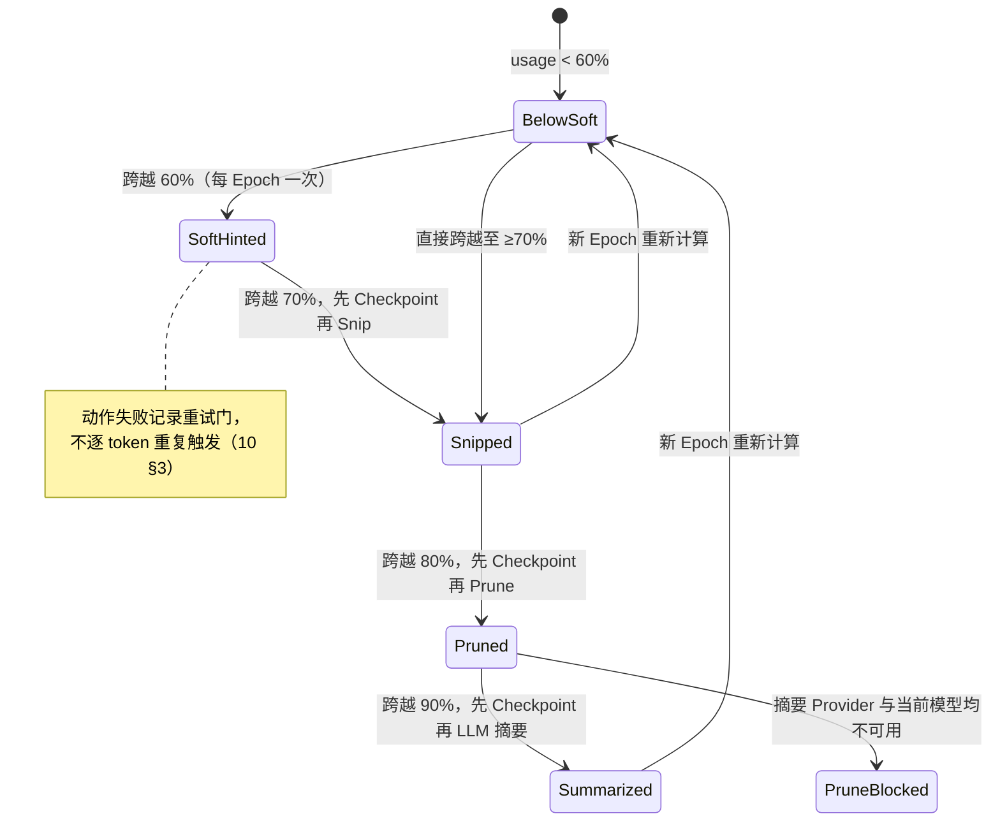
```mermaid
stateDiagram-v2
    [*] --> BelowSoft: usage < 60%
    BelowSoft --> SoftHinted: 跨越 60%（每 Epoch 一次）
    SoftHinted --> Snipped: 跨越 70%，先 Checkpoint 再 Snip
    BelowSoft --> Snipped: 直接跨越至 ≥70%
    Snipped --> Pruned: 跨越 80%，先 Checkpoint 再 Prune
    Pruned --> Summarized: 跨越 90%，先 Checkpoint 再 LLM 摘要
    Pruned --> PruneBlocked: 摘要 Provider 与当前模型均不可用
    Summarized --> BelowSoft: 新 Epoch 重新计算
    Snipped --> BelowSoft: 新 Epoch 重新计算
    note right of SoftHinted
        动作失败记录重试门，
        不逐 token 重复触发（10 §3）
    end note
```

`context_watermarks` 表持久化每个 Epoch 已跨越档位；同一 Epoch 同一档位只触发一次。70/80/90 三档动作执行前必须先完成 §5.2 的 Checkpoint 提交——这是"Checkpoint-first"的字面含义。

##### 5.2 Checkpoint 提交流程

与 10 §7 时序一致，此处标注崩溃边界（验证步骤要求逐点 kill，16 §12）：

```mermaid
sequenceDiagram
    autonumber
    participant R as Session Runtime
    participant C as Checkpoint Service
    participant O as CAS (ContentStore)
    participant F as FileFactStore
    participant D as SQLite

    R->>C: Commit(reason, state, references)
    C->>C: freeze session_seq + 收集精确 sources
    Note over C,O: 崩溃边界 A：chunk 写入中
    C->>O: write chunks/attachments by hash
    O-->>C: verified ContentRefs
    C->>C: render + validate manifest/章节预算
    Note over C,F: 崩溃边界 B：Manifest 原子写中
    C->>F: atomic write history/<id>.md + checkpoint.md
    F-->>C: generation/hash
    Note over C,D: 崩溃边界 C：index 提交前
    C->>D: Critical: checkpoint_index + checkpoint.committed 事件
    D-->>R: CheckpointCommitted（新恢复头生效）
```

只有 SQLite critical commit 成功后 Runtime 才把该 Checkpoint 视为新恢复头。文件已写而 DB 失败由 reconciliation 补齐；块缺失/hash 错误则该 Checkpoint 无效并回退上一完整 Checkpoint（10 §7）。

关窗即停显著加剧上述边界的触发频率——每次关窗 drain 都会强制走一遍本提交流程（§1.1 第 5 类触发点）。因此 drain 必须等待当前 Checkpoint 完成 critical commit（越过崩溃边界 C）后才允许 daemon 退出；在 C 之前退出等同崩溃，由下次启动的 reconciliation 按既有规则收敛。

##### 5.3 无损重建

按 10 §8 流程执行：选 Checkpoint → 校验 Manifest/chunks/attachments（失败回退上一完整版，全部失败则阻塞并生成损坏报告）→ 加载 Query Snapshot `as_of_seq` → 应用 event tail → 按 11 §10 的崩溃恢复分类处理未完成副作用（未知则 `Blocked::UnknownSideEffect`）→ 重建 Context Epoch（Recovery Source 优先注入）。重建产物必须能回答 10 §8 的九项问题，缺一项不得宣称"无损"。

#### 6. 状态机

见 §5.1（水位状态机）。Checkpoint 本身的 pinned 状态是布尔标记而非状态机；pin/unpin 产生事件但不修改旧 Manifest（10 §9）。

#### 7. 存储设计

##### 7.1 文件布局（10 §5）

```text
<project>/.apex/checkpoints/<session-id>/
├── checkpoint.md                      # 最新 Manifest（原子替换）
├── history/<checkpoint-id>.md         # 每次 Manifest 留档
└── refs/                              # 指向 CAS 块的引用清单

~/.apex/projects/<project-hash>/objects/blake3/<prefix>/<hash>   # 内容寻址 chunk
~/.apex/projects/<project-hash>/attachments/blake3/<prefix>/<hash> # 多模态附件
```

内容寻址的 chunk 与多模态附件落在**项目分片**的 `objects/`、`attachments/`（07 §2），不落在项目目录；Checkpoint 清单经引用指向 CAS 块（10 §5 已同步）。每 daemon 单项目，Checkpoint 统一落在 `<project>/.apex/checkpoints/`；多根 Workspace 以 `workspace-id` 作分片键计算项目分片（07 §3.2），其 Checkpoint 布局与单根完全一致，`~/.apex/workspaces/` 子树废弃、不再需要。对象不可就地修改；`.apex/checkpoints/` 默认进建议 `.gitignore` 片段（07 §3.1）。

##### 7.2 `checkpoint.md` Manifest schema（EP-0608）

frontmatter 与章节契约以 10 §6 为准（`schema: apex.checkpoint.v1`、`checkpoint_id/session_id/run_id/turn_id/session_seq/context_epoch/manifest_hash/previous_checkpoint/pinned` 等）。本模块实现的额外约束：

- **Active Intent 逐字引用**：用户原始输入逐字保留；正文过长时引用 content block，不由摘要改写（10 §6）。
- **章节独立预算**：每章节有字节/条目预算；达 `warn` 提示，达 `error` 必须 `extract-required` 把正文拆为内容块，禁止把清单压成不可恢复摘要（10 §6；对照 MiMo-Code 的 warn/error/extract-required 三级 severity，`checkpoint-validator.ts`）。
- **Reconstruction Plan 章节**：固定四步（校验 hash → 加载 Snapshot → 应用 event tail → 构建新 Epoch），恢复器按此执行而非自由解释。

##### 7.3 CAS chunk writer（EP-0609）

- chunk/attachment 写入复用 M-02 的 `ContentStore`（EP-0217）：`put` 幂等、按 `blake3` 寻址、写后 `verify`；断块/半写文件在 open 时校验失败并被隔离，不参与恢复。
- 大对象分块去重；同一内容跨 Checkpoint/跨 Session 只存一份（RISK-012 的缓解手段之一）。

##### 7.4 SQLite 表

- `checkpoint_index`（07 §4）：`checkpoint_id, session_id, session_seq, context_epoch, manifest_hash, reason, pinned, created_at`；critical commit 使用 `synchronous=FULL`（07 §5）。
- `context_watermarks`：`session_id, epoch_id, level, action, outcome, retry_after, trace_id`。
- `context_epochs`：Epoch 元数据与 source_set_hash（M-08 建表，本模块写入 Recovery Source 引用）。

##### 7.5 保留策略（EP-0612，10 §9）

| 状态 | 策略 |
|---|---|
| Session 活跃期 | 全部保留 |
| 最后活动 ≥120 天 | 随 Session 归档，仍可完整恢复 |
| 归档 ≥365 天 | 随 Session 删除；未被引用块进 GC |
| Pinned | 永久作为 GC root，直到用户取消 pin；Session 删除也保留必要 Manifest/块 |

删除与 pin/unpin 记录 event/trace，不修改旧 Manifest。365 天删除前必须验证目标不是 Pinned Checkpoint 的唯一可达根（07 §10）。

#### 8. 错误处理与降级

| 场景 | 行为 | 出处 |
|---|---|---|
| 摘要 Provider 失败 | 回退当前模型；仍失败则停止摘要，停在 80% prune/阻塞并请求用户 | 10 §4/§14 |
| Checkpoint 文件冲突/损坏 | 回退上一完整版本并阻塞当前有损动作 | 10 §14 |
| chunk 缺失/hash 错误 | 该 Checkpoint 无效，回退上一完整 Checkpoint；全损则阻塞+损坏报告 | 10 §7/§8 |
| 文件已写 DB 未提交 | 启动 reconciliation 按 frontmatter generation/write token 补齐索引 | 07 §6 |
| 水位动作失败 | 记录重试门（retry_after），下一 Epoch 前不重复触发 | 10 §3 |
| 附件格式 Provider 不支持 | 保留原 Artifact，按 capability 转码/抽取或要求用户选择，不丢弃原件 | 10 §14 |
| 连续摘要未降回阈值下 | 停止自动摘要并提示（防死循环，对照 Reasonix `compactStuck`） | 参考 §1.1 |

#### 9. 安全与权限边界

- Checkpoint 内容可能含敏感片段：目录权限随 `.apex/` 默认 0700（07 §2）；Session 日志与 Checkpoint 块都经 Secret Firewall，命中 Provider Key/私钥的内容在写入前被拒绝或脱敏（RISK-013）。
- prune 的 `rerun_readonly` 再取回仍走完整 Tool Gateway + 权限管线，不因"恢复上下文"获得旁路。
- Checkpoint 不允许无审计的就地人工改写（07 §7）；外部修改触发冲突处理而非静默接受。
- 摘要是模型生成内容，恢复时作为 Recovery Source 注入并带 provenance；不赋予其覆盖 Stable Source（system policy/已批准 Spec）的能力。

#### 10. 性能预算

- 水位评估在 Epoch 构建路径上同步执行，P95 增量 ≤ 1 ms（纯内存比较 + 一次索引读）。
- Checkpoint 提交不在 Provider 热路径持 SQLite 写事务（07 §5）；chunk 写入异步于 Turn 关键路径，但 Turn 结束触发点必须等待 critical commit 完成才封口。
- CAS 去重使重复 chunk 零拷贝；单 Session Checkpoint 块数与磁盘占用纳入 RISK-012 监控，异常增长进入磁盘压力模式。
- 摘要调用是后台动作，不阻塞下一个 Turn 的 admission；但 90% 档位下新 Provider 请求必须等摘要或 prune 完成。
- 关窗即停下，进行中的后台摘要采"关窗前等待完成（带 deadline），超时丢弃并记录"策略：drain 阶段等待当前摘要至 deadline；超时则丢弃未提交结果、落一条系统日志，下次恢复时以未摘要状态继续，不伪造摘要产物。

#### 11. 测试与验证策略

| VAL | 覆盖 EP | 验证要点 |
|---|---|---|
| VAL-98 | EP-0604 | 60/70/80/90 四边界各触发一次；重复采样无风暴；降回不撤销 |
| VAL-99 | EP-0605 | 错误段/首尾/结构保留；只读 vs 副作用默认几何；契约测试禁止静默 fallback |
| VAL-100 | EP-0606 | 占位引用 hash 有效；reopen/rerun 再取回；pruned 终态不被二次处理 |
| VAL-101 | EP-0607 | 独立 Provider 失败→回退当前模型→双失败停 80% 阻塞；摘要 schema 校验 |
| VAL-102 | EP-0608 | Manifest 预算/extract-required；Active Intent 逐字；未知字段保留 |
| VAL-103 | EP-0609 | 内容寻址/断块隔离/put 幂等 |
| VAL-104 | EP-0610 | 五类触发点（Turn 结束/有损前/暂停退出前/高风险写前/window-close）全覆盖注入测试 |
| VAL-105 | EP-0611 | AC-010 对照：九项问题逐项可答；损坏块不伪造部分恢复 |
| VAL-106 | EP-0612 | Pinned GC root；120/365 时间 fixture；删除前唯一可达根校验 |

故障注入（16 §12 验证步骤 3）：Manifest 写入、chunk 写入、SQLite index 提交三个边界逐点 kill daemon，重启后均可恢复且不伪造"部分恢复"。覆盖率：Checkpoint/恢复行/分支 ≥ 90%（15 §6.2）。

#### 12. 实施工作项

按 17 §6.1 顺序：

| WI | EP | 交付 | 依赖 |
|---|---|---|---|
| WI-v0.2-04 | EP-0604 | watermark 状态机 + `context_watermarks` | M-08（estimator）、M-02（EventStore） |
| WI-v0.2-05 | EP-0605 | SnipHinter 与默认分层几何 | EP-0516（Tool descriptor） |
| WI-v0.2-06 | EP-0606 | ContextReference 占位与再取回 | EP-0217（CAS） |
| WI-v0.2-07 | EP-0607 | 摘要 Provider 与 fallback 链 | M-04 |
| WI-v0.2-08 | EP-0608 | checkpoint.md Manifest schema/预算校验 | EP-0401 |
| WI-v0.2-09 | EP-0609 | chunk/attachment CAS writer | EP-0217、WI-v0.2-08 |
| WI-v0.2-10 | EP-0610 | 五类触发点 hooks | M-03、EP-0515、WI-v0.2-09 |
| WI-v0.2-11 | EP-0611 | reconstruction（无损重建） | EP-0212、WI-v0.2-09/10 |
| WI-v0.2-12 | EP-0612 | pin/120/365 retention job | EP-0222、WI-v0.2-09 |

交付顺序要点：CAS（WI-v0.2-02/03，M-12 侧）必须先于 WI-v0.2-06/09；WI-v0.2-11 是 AC-010 的承载项，安排在触发点之后；v0.2 收尾时移除 WI-v0.1-64 临时截断（17 §6.2 退出标准 6）。

---

<!-- 源文件：docs/design/m12-snapshot-rollback.md -->

### 12. M-12 内容快照与回滚


#### 0. 元信息

| 项 | 值 |
|---|---|
| 模块编号 | M-12 |
| 版本归属 | v0.2（见 17 §6；DAG 集成升级在 v0.7，WI-v0.7-12/EP-0718） |
| 对应 EP | EP-1202、EP-0217、EP-0218 |
| 对应 VAL | VAL-218、VAL-36、VAL-37 |
| 对应需求 | RQ-069、070、025、026、028 |
| 上游依赖 | 11-agent-dag-snapshot-replay §11/§13、07 §5/§6/§7、04 §2/§7/§8、05 §4/§10（SnapshotStore）、16 §8/§13、17 §6.1（WI-v0.2-02/03/13）；AiAgent/docs/README.md §8.3/§10.1（影子 Git 收敛证据） |
| 下游消费者 | M-06（Tool Gateway pre-write 快照）、M-11（Checkpoint 引用 Snapshot diff）、M-16/M-22（Node pre-write 边界）、M-23（补偿回滚与 pre-replay 快照） |

#### 1. 目标与范围

##### 1.1 目标

1. **CAS 基座**（EP-0217）：`ContentStore` 的 put/open/verify，全系统唯一的内容寻址存储，供 Checkpoint 块、Snapshot 文件块、附件、归档共用。
2. **文件事实索引**（EP-0218）：`file_sync_state` 记录 base/apex/observed 三 hash 与 generation，支撑崩溃组合恢复与外部编辑检测。
3. **会话级内容快照**（EP-1202，v0.2 新增）：Turn 前后对文件集做纯内容寻址快照；支持按 patch 粒度的部分回滚；**回滚只动文件、不动对话历史**；全程不污染用户 `.git`（RQ-070，17 §6.2 退出标准 3）。
4. **安全回滚**：恢复前先捕获 pre-restore 快照；当前状态偏离预期 post-state 时三方比较，不覆盖用户后续修改（11 §11，RISK-009）。

##### 1.2 不做什么

- 不创建 Git commit/branch/index，不要求 clean worktree（11 §11）；影子 Git 方案的选型否决见 §3.3。
- 不做对话历史的截断/回滚（那是 Session 消息域，本模块只动文件）。
- 不做 DAG 级补偿编排（M-23 EP-0721）；本模块提供 `restore` 原语与三方比较证据。
- 不做归档打包（M-02 EP-0222）与备份（EP-0223）。

#### 2. 上游契约与引用

| 消费的定义 | 出处锚点 |
|---|---|
| Snapshot Manifest JSON schema（`apex.snapshot.v1`）与字段语义 | 11 §11 |
| 混合时间点拒绝、稳定扫描重试、pre-restore 快照、三方比较 | 11 §11 |
| 部分回滚=补偿、历史事件不删除、追加 `compensation.applied` | 11 §13 |
| 文件事实提交协议（临时文件+flush+原子 rename+目录 sync+Critical DB） | 07 §6 |
| `file_sync_state` 三 hash 模型与外部编辑三方合并 | 07 §7 |
| CAS 路径 `~/.apex/projects/<project-hash>/objects/blake3/aa/<hash>` 与 GC root 规则 | 07 §2/§12 |
| `SnapshotStore` Trait（capture/diff/restore） | 05 §10 |
| `snapshot.captured`、`compensation.applied` 事件 | 04 §8 |
| `ContentHash` = `blake3:<64-lower-hex>` | 04 §2 |
| RISK-009（混合时间点/错误覆盖） | 15 §5 |
| EP-1202/VAL-218 注册与 v0.2 退出标准 3 | 17 §6.1/§6.2、§19 附录 B |

#### 3. 领域模型

##### 3.1 本模块拥有的类型

```rust
// CAS 对象引用（04 §2 ContentHash 的用途特化，不重复定义）
struct ContentRef { hash: ContentHash, size: u64, kind: CasKind } // Chunk|Attachment|SnapshotBlock

// 文件事实索引行（07 §7）
struct FileSyncState {
    path_key: CanonicalPathKey,
    base_hash: ContentHash,      // 上次共同版本
    apex_hash: ContentHash,      // Apex 预期
    observed_hash: ContentHash,  // watcher 实测
    generation: Generation,      // 单调逻辑版本，≠ mtime
    write_token: WriteToken,     // 自写去重
    inode_hint: Option<InodeHint>,
}

// 快照清单（字段语义以 11 §11 为准）
struct SnapshotManifest {
    schema: SnapshotSchemaV1,
    snapshot_id: SnapshotId,
    workspace_id: WorkspaceId,
    base_generation: Generation,
    paths: Vec<SnapshotEntry>,   // file/symlink/absent + mode + content ref
    manifest_hash: ContentHash,
    label: SnapshotLabel,        // pre_turn / post_turn / pre_tool / pre_restore（见 §3.2）
    session_id: SessionId,       // 所有权证明
    turn_id: Option<TurnId>,
}
```

##### 3.2 快照标签词汇

参照 CodeWhale 的标签词汇（`AiAgent/docs/README.md` §8.3：`pre-turn:<n> / tool:<call-id> / post-turn:<n> / pre-restore:<sha12>`），Apex 定义：`PreTurn` / `PostTurn` / `PreTool` / `PreRestore` / `PreReplay`。每份快照携带 `session_id` 证明所有权，跨 Session 列举时按所有权过滤。

##### 3.3 方案选型：纯 CAS，否决影子 Git

**背景**：opencode、DeepSeek-TUI、CodeWhale 三个独立项目（TS/Rust 双血缘）在没有互相参考的情况下收敛到同一方案——旁路 Git 仓库存快照，`--git-dir/--work-tree` 隔离防污染项目 `.git`，Git 对象存储天然去重（`AiAgent/docs/README.md` §8.3/§10.1，"8 个项目里最深刻的独立收敛"）。

**Apex 决策：不采用影子 Git，采用纯内容寻址快照**（RQ-070 明文："Snapshot 使用纯内容寻址文件快照，不用 Shadow Git，也不污染用户 Git"）。理由：

1. **已有 CAS 基座**：Checkpoint 块、附件、归档已经要求 `ContentStore`（EP-0217）；影子 Git 会引入第二套对象存储与 GC 语义，违反单一事实源。
2. **Manifest 即事实**：`apex.snapshot.v1` Manifest 记录 absent marker、symlink target、可移植权限位——Git tree 对"文件不存在"与 Windows 属性的表达需要额外编码，反而增加歧义。
3. **不依赖 Git 可用性**：用户项目可以不是 Git 仓库；快照能力不得因此退化。
4. **审计一致性**：CAS hash 与事件/日志/Checkpoint 引用同一 `blake3` 体系，离线完整性验证不需要引入 Git 对象格式解析。

影子 Git 的两个真实优势已通过 CAS 设计吸收：对象去重（CAS 天然内容寻址）与 alternates 式免重算（`file_sync_state` 的 hash 缓存 + 稳定扫描）。决策记录：本文件即 ADR；若未来需要与 Git 互操作（如导出 patch），在 CAS 之上做只读适配，不反向引入影子仓库。

#### 4. 接口设计

##### 4.1 ContentStore（EP-0217）

```rust
trait ContentStore: Send + Sync {
    async fn put(&self, bytes: &[u8], kind: CasKind) -> ApexResult<ContentRef>;      // 幂等
    async fn open(&self, hash: &ContentHash) -> ApexResult<Box<dyn Read + Send>>;    // 开时校验
    async fn verify(&self, hash: &ContentHash) -> ApexResult<VerifyReport>;          // 断块/半写隔离
    async fn gc_mark(&self, roots: Vec<ContentHash>) -> ApexResult<GcReport>;        // 引用标记 GC
}
```

- `put`：写临时文件 → flush → 校验 blake3 → 原子 rename 到 `objects/blake3/<prefix>/<hash>`；同 hash 重复 put 直接成功（幂等，VAL-36）。
- `open`：流式读取并边读边校验 hash；校验失败返回 `APEX_STORAGE_CAS_CORRUPT`，该块进 quarantine，不参与任何恢复。
- 半写文件（崩溃残留临时文件或长度不符）在启动扫描时隔离，不视为有效块。

##### 4.2 文件事实索引（EP-0218）

`file_sync_state` 的读写复用 07 §6 提交协议；本模块新增 **reconcile marker**：每次 Apex 写文件在同事务内落 `(path_key, generation, write_token)` 到 `content_refs`；启动 reconciliation 对"文件在、索引缺"与"索引在、文件缺"两个方向补齐或进入 `ReconciliationConflict`（07 §6），禁止用空文件覆盖。

##### 4.3 SnapshotStore（EP-1202，实现 05 §10）

```rust
// capture 请求
struct SnapshotRequest {
    session: SessionId, turn: Option<TurnId>,
    label: SnapshotLabel,
    paths: Vec<CanonicalPathScope>,   // Turn 涉及文件集 / write_paths
}
// restore 请求
struct RestoreRequest {
    target: SnapshotId,
    patches: Option<Vec<PatchSelector>>,  // 按 patch 部分回滚；None = 整份
    expected_post_state: Option<ContentHash>, // 三方比较基准
}
```

- **Turn 前后文件集快照**：Turn 开始时对"本 Turn 声明 write_paths ∪ 上一 Turn 实际变更集"捕获 `PreTurn`；Turn 成功结束捕获 `PostTurn`。高风险 Tool 前捕获 `PreTool`（与 M-06 的 pre-write 边界共用）。
- **按 patch 部分回滚**：`patches` 选择器以"文件 + hunk 范围"寻址；逐文件从目标快照 `checkout` 内容块写回，未选中的文件不动。对话历史、事件流、权限授权均不受影响（17 §6.2 退出标准 3："回滚不动对话历史"）。
- **混合时间点拒绝**：捕获期间对路径集做稳定扫描——首轮记录 hash，短暂防抖后二轮复核；任一文件变化则重试（上限 3 次），仍不稳定则阻塞并报 `APEX_SNAPSHOT_UNSTABLE`，**绝不生成混合时间点 Snapshot**（11 §11，VAL-218）。
- **pre-restore 快照**：`restore` 执行前先对当前状态捕获 `PreRestore`；若当前状态偏离 `expected_post_state`（用户事后又改了文件），做三方比较（base=目标快照、ours=当前、theirs=预期 post-state），冲突路径转人工，不自动覆盖（11 §11，RISK-009）。

#### 5. 数据流与关键流程

##### 5.1 Turn 级快照与部分回滚

```mermaid
sequenceDiagram
    autonumber
    participant R as Session Runtime
    participant S as SnapshotStore
    participant C as CAS
    participant F as FileFactStore
    participant D as SQLite

    R->>S: capture(PreTurn, paths)
    S->>S: 稳定扫描（两轮 hash 复核）
    S->>C: put 变更文件块
    S->>D: snapshot_index + snapshot.captured
    Note over R: Turn 执行（Tool 写文件走 07 §6 协议）
    R->>S: capture(PostTurn, paths)
    R->>S: restore(target, patches=[file#hunk2])
    S->>S: capture(PreRestore) + 三方比较
    alt 当前 == 预期 post-state
        S->>C: open 目标块（verify）
        S->>F: 原子写回选中文件（新 generation）
        S->>D: compensation.applied + file_sync_state 更新
    else 偏离
        S-->>R: Blocked + 冲突 artifact（人工合并）
    end
```

##### 5.2 崩溃恢复矩阵

capture/写入/index 提交各边界 kill 的行为（对应 16 §8 验证步骤 2/3 与 17 §6.2 退出标准 2 的同族要求）：

| 崩溃点 | 现场 | 重启行为 |
|---|---|---|
| 稳定扫描中 | 无落盘 | 快照不存在，Turn 重新触发 capture；无副作用 |
| CAS put 中（临时文件） | `objects/` 下有临时/半写文件 | 启动扫描隔离半写块；重放 put 幂等成功 |
| CAS 完成、Manifest 未写 | 块已入库，无索引引用 | 块成为无引用对象，GC 窗口内回收；快照视为不存在 |
| Manifest 已写、`snapshot_index` 未提交 | 文件事实在、DB 缺 | reconciliation 按 Manifest hash 补齐索引；补齐失败则该快照无效并隔离 |
| index 已提交、块被外部删除 | DB 有、CAS 缺 | `verify` 失败 → 快照标记损坏，回滚路径回退上一快照，不伪造部分恢复 |
| restore 写回中（部分文件已替换） | 混合状态 | `PreRestore` 快照 + `file_sync_state` 三方比较；未替换文件继续，冲突路径转人工 |

不变量：任何边界崩溃后都不静默丢数据、不把损坏快照当作可恢复（16 §8 通过标准）。

CAS 按项目分片后，上表的启动扫描与半写块隔离只作用于本 daemon 所属项目分片的 `objects/`，不触碰其他项目的 CAS（07 §2）。

#### 6. 状态机

本模块不引入新的权威状态枚举。快照生命周期用 `snapshot_index.state` 表达：`Capturing → Sealed → (Corrupt)`，均为本模块内部投影状态，不进入 04 §4 枚举。回滚对 Node/Session 状态的影响（`Compensating/Compensated`）由 M-22/M-23 的状态机承载（11 §5/§13）。

#### 7. 存储设计

| 路径/表 | 内容 | 保留 |
|---|---|---|
| `~/.apex/projects/<project-hash>/objects/blake3/<prefix>/<hash>` | CAS 块（快照文件块/Checkpoint chunk/附件共用，按项目分片） | 引用标记 + 保留窗口 GC；运行中/归档/Pinned 引用为 root（07 §12） |
| `<root>/.apex/snapshots/*.manifest.json` | 快照 Manifest（不可修改） | 随 Session 120/365 策略；PreRestore 至少保留到回滚事务确认 |
| `snapshot_index` 表 | `snapshot_id, session_id, turn_id, label, manifest_hash, base_generation, state, created_at` | 同上 |
| `file_sync_state` 表 | 三 hash + generation + write_token + inode hint | 随文件生命周期 |
| `content_refs` 表 | 块 → 引用者（checkpoint/snapshot/attachment） | GC 标记源 |

`.apex/snapshots/` 默认进建议 `.gitignore` 片段（07 §3.1）；Apex 只建议/生成片段，不擅自改写用户 `.gitignore`。

#### 8. 错误处理与降级

| 场景 | 错误码 | 行为 |
|---|---|---|
| 扫描期间文件持续变化 | `APEX_SNAPSHOT_UNSTABLE` | 重试 3 次后阻塞，不生成混合时间点快照 |
| CAS 块损坏/缺失 | `APEX_STORAGE_CAS_CORRUPT` | 块隔离；快照标记损坏；回滚回退上一快照 |
| 文件已写 DB 未提交 | reconciliation 补齐 | 按 generation/write_token 补索引（07 §6） |
| DB 已提交文件缺失 | `APEX_STORAGE_RECONCILIATION_CONFLICT` | 优先从 CAS 恢复；禁止空文件覆盖 |
| restore 前三方比较冲突 | `Blocked`（人工） | 保留 base/ours/theirs artifact，不自动覆盖 |
| 磁盘压力 | 降级模式 | 暂停新快照捕获并请求清理（RISK-012 联动） |

#### 9. 安全与权限边界

- **不污染用户 `.git`**：全部状态在 `.apex/` 与项目分片 `~/.apex/projects/<project-hash>/objects/`；不创建/修改用户仓库的 commit、branch、index、hooks（RQ-070）。
- 快照捕获与恢复的路径集必须经 M-14 的 `CanonicalPathScope` 规范化；restore 写回仍走 07 §6 文件事实协议与权限复核，不因"回滚"绕过 Tool Gateway 证据链。
- 快照内容可能含敏感文件：CAS 目录权限 0700（07 §2）；Secret canary 测试覆盖快照块与 Manifest（RISK-013）。
- 跨 Session 列举快照按 `session_id` 所有权过滤；其他 Project 的快照不可见（硬禁止路径规则覆盖其他 Project Root，09 §6.1）。

#### 10. 性能预算

- capture 增量写：只把 hash 变化的文件块写入 CAS；`file_sync_state` 缓存使未变更文件零 I/O（仅 stat + hash 复核）。
- 单 Turn 快照 P95 ≤ 300 ms（10k 文件集、变更 <50 文件的典型 fixture）；稳定扫描防抖窗口 ≤ 250 ms。
- restore 按文件粒度流式写回，不整树物化；大文件走 CAS 流式 open。
- CAS GC 为后台任务，禁止在活跃 Tool 热路径执行（07 §12 同原则）。关窗即停下 GC 无法保证一次跑完：分段执行、持久化进度游标、跨窗口会话累进；关窗时保存游标，下次打开同项目时继续（14 §9）。

#### 11. 测试与验证策略

| VAL | 覆盖 EP | 验证要点 |
|---|---|---|
| VAL-36 | EP-0217 | put 幂等、open 校验、断块/半写隔离、hash 冲突不可能性 |
| VAL-37 | EP-0218 | DB/文件四象限崩溃组合（§5.2 矩阵）reconciliation 收敛 |
| VAL-218 | EP-1202 | 混合时间点拒绝；按 patch 部分回滚；回滚不动对话历史；pre-restore 快照存在；三方比较冲突转人工 |

附加测试：三平台内容/权限位/symlink/absent 捕获恢复（11 §14）；fuzz 路径集（大小写冲突、Unicode 同形、长路径）；并发 capture 与 watcher 自写去重交织。覆盖率：Snapshot/恢复行/分支 ≥ 90%（15 §6.2）。

#### 12. 实施工作项

| WI | EP | 交付 | 依赖 |
|---|---|---|---|
| WI-v0.2-02 | EP-0217 | ContentStore（put/open/verify/gc_mark） | M-01（ContentHash）、EP-0201 |
| WI-v0.2-03 | EP-0218 | file_sync_state + reconcile marker | EP-0212/0214、WI-v0.2-02 |
| WI-v0.2-13 | EP-1202 | SnapshotStore：Turn 前后快照、按 patch 回滚、pre-restore、混合时间点拒绝 | WI-v0.2-02/03、M-03（Turn 边界） |

交付顺序：WI-v0.2-02 是 M-11（chunk writer）与本模块的共同前置，排 v0.2 最前；WI-v0.2-13 依赖 M-06 的 pre-write 边界接入点（EP-0515 已在 v0.1 交付 Gateway 骨架）。v0.7 的 EP-0718（WI-v0.7-12）把 capture 边界从 Turn/Tool 提升到 DAG Node，复用本模块全部原语，不新增存储格式。

---

<!-- 源文件：docs/design/m13-persistent-terminal.md -->

### 13. M-13 持久终端与进程树


#### 0. 元信息

| 项 | 值 |
|---|---|
| 模块编号 | M-13 |
| 版本归属 | v0.2（见 17 §6） |
| 对应 EP | EP-0206、EP-0517、EP-0518、EP-0520、EP-0521、EP-0522、EP-0305（终端侧消费） |
| 对应 VAL | VAL-25、VAL-88、VAL-89、VAL-91、VAL-92、VAL-93、VAL-47 |
| 对应需求 | RQ-057、058、068、072、114；AC-001 |
| 上游依赖 | 09 §9/§10/§13、11 §10、04 §4（ToolCallStatus）、05 §8（TerminalManager/ToolGateway）、16 §11、17 §6.1（WI-v0.2-15–21）；M-06（Tool Gateway）、M-02（事件/日志） |
| 下游消费者 | M-09/M-10（TUI 终端视图）、M-16（Subagent 通道）、M-19b（MCP stdio 进程树共享清理）、M-20（Plugin Host 进程树）、M-26/M-27（Desktop/Web 终端） |

#### 1. 目标与范围

##### 1.1 目标

1. **进程树 supervisor**（EP-0206）：统一 Port，保证取消/退出时终止完整进程树（先 graceful signal、超时强杀），MCP stdio 与 Tool 子进程共享同一平台清理能力（09 §10）。
2. **持久终端**（EP-0517/0518）：Unix PTY 与 Windows ConPTY 适配器，会话间复用；同时保留一次性非交互 run-once 模式（RQ-057）。
3. **共享逻辑终端**（EP-0520）：一个 LogicalTerminal 聚合 foreground/agent/system 三类 channel，每帧带 channel/agent/task/trace 归因与单调序号（RQ-058）。
4. **有界输出**（EP-0521）：ring buffer + 磁盘日志引用，慢客户端不阻塞子进程，1 GiB 输出不撑爆 daemon 内存（RQ-114）。
5. **中断恢复分类**（EP-0522）：崩溃后遗留 `Running` Tool 按证据分类为 Interrupted/可重试/UnknownSideEffect（11 §10）。
6. **断线重连**（EP-0305 终端侧）：Snapshot + since_seq 合并器服务于终端帧流，乱序/gap/resync 语义与事件流一致。

##### 1.2 不做什么

- 不做权限判定本身（M-14）；但 Agent 写入持久 shell 的命令必须先解析判权（09 §10），本模块提供"整命令提交"边界。
- 不做 OS 沙箱（EP-0523 属 M-14）。
- 不做终端 UI 渲染（M-09/M-26/M-27）；本模块只产出 `TerminalFrame` 流。
- 不做 MCP/Plugin 的业务生命周期（M-19b/M-20）；只提供进程树原语。

#### 2. 上游契约与引用

| 消费的定义 | 出处锚点 |
|---|---|
| 终端模型：持久 PTY/ConPTY 默认、run-once 可选 | 09 §10 |
| LogicalTerminal 三 channel 结构与归因字段 | 09 §10 |
| "逐字符写入不得绕过完整命令分析" | 09 §10 |
| ring buffer + 磁盘日志引用、背压 | 09 §10 |
| 取消=终止完整进程树、graceful→强杀 | 09 §10 |
| 中断 Tool recovery 分类表 | 11 §10；09 §9 |
| `TerminalManager` / `ToolGateway.recover_interrupted` Trait | 05 §8 |
| `ToolCallStatus`（Running/Interrupted/UnknownSideEffect 等） | 04 §4 |
| 终端必测边界（逐字节绕过、进程树泄漏、背压、断线重连、resize） | 09 §13 |
| RISK-016（跨平台 IPC/PTY/进程树差异） | 15 §5 |
| S5/S3 EP/VAL 注册 | 16 §11/§9 |
| v0.2 WI 拆分（WI-v0.2-15–21）与退出标准 4 | 17 §6.1/§6.2 |

#### 3. 领域模型

```rust
// 逻辑终端与通道（09 §10）
struct LogicalTerminal {
    terminal_id: TerminalId,
    channels: Vec<TerminalChannel>,
}
enum TerminalChannel {
    Foreground,                                  // 用户可见/交互
    Agent { agent_execution_id: AgentExecutionId, task_id: TaskId, trace_id: TraceId },
    System,                                      // resize/exit/diagnostic
}

// 终端帧：流式输出的最小单元
struct TerminalFrame {
    terminal_id: TerminalId,
    channel: TerminalChannel,
    seq: u64,                 // 通道内单调
    kind: FrameKind,          // Data | Resize | Exit | Diagnostic | Marker
    payload: FramePayload,    // Inline(bytes) | Ref { log_ref, offset, len }（大输出走磁盘引用）
    ts: OffsetDateTime,
}

// 进程树目标
enum ProcessTarget { Tree { root_pid: Pid }, Terminal(TerminalId), McpServer(McpServerId), PluginHost(PluginId) }

// 中断恢复分类（11 §10 表的终端侧投影）
enum ToolRecoveryClass {
    NotStarted,            // 未开始副作用 → 回 Ready
    IdempotentReusable,    // receipt/idempotency key 可复用 → 自动继续/查询原结果
    Completed,             // 成功事件已提交 → 复用结果
    Interrupted,           // 进程被中断但无外部副作用证据 → 按策略重试
    UnknownSideEffect,     // 是否执行未知且副作用不幂等 → Blocked
}
```

`TerminalId`、`ToolCallStatus` 等以 04 §2/§4 为准，不重复定义。

#### 4. 接口设计

##### 4.1 进程树 supervisor Port（EP-0206）

```rust
trait ProcessTreeSupervisor: Send + Sync {
    async fn spawn(&self, spec: ProcessSpec) -> ApexResult<ProcessHandle>; // 注册进树
    async fn terminate_tree(&self, ctx: CommandContext, target: ProcessTarget)
        -> ApexResult<TerminationReport>;   // graceful → 超时强杀
    async fn orphan_scan(&self) -> ApexResult<Vec<OrphanProcess>>;          // 启动时泄漏扫描
}
```

平台实现：Unix 用进程组（`setsid` + `kill(-pgid)`）；Windows 用 Job Object（`JOB_OBJECT_LIMIT_KILL_ON_JOB_CLOSE`）。`TerminationReport` 记录每个 pid 的 signal/exit/超时强杀结果，进会话日志（VAL-25：子孙进程终止）。

多 daemon 并存时，`orphan_scan` 只扫描本 daemon 自己项目拉起的进程；其他项目 daemon 的孤儿进程由那个 daemon 自行负责，本 daemon 不跨项目清理（02 §10 不变量 6）。

##### 4.2 终端适配器（EP-0517/0518/0519）

实现 05 §8 `TerminalManager`：

| 方法 | 语义 |
|---|---|
| `open_persistent` | Unix：PTY（`openpty`/`forkpty`），默认 shell，受控 env；Windows：ConPTY（`CreatePseudoConsole`），子进程挂 Job Object |
| `run_once` | 一次性非交互命令：无 stdin（或固定 stdin 后关闭）、硬超时、输出全量入 ring buffer；适合 CI 式调用（VAL-90） |
| `write` | 写入指定终端；**Agent 来源的写入按完整命令边界提交**（见 §5.2） |
| `subscribe(after_seq)` | 帧流订阅，支持断线重连（§5.4） |
| `terminate_tree` | 委托 §4.1 |

ConPTY 特有：窗口尺寸经 `ResizePseudoConsole`；输出编码按 UTF-8 协商，失败回退系统代码页并在 System channel 发 Diagnostic（VAL-89：Job Object/编码）。

##### 4.3 中断恢复（EP-0522）

实现 05 §8 `ToolGateway.recover_interrupted` 的终端侧：daemon 启动时扫描 `tool_calls` 中遗留 `Running` 且 executor 为终端/进程的记录，按 §3 的 `ToolRecoveryClass` 分类（证据来源：side-effect receipt、幂等声明、进程存活表、日志 footer）。分类结果写回 `ToolCallStatus`（04 §4），`UnknownSideEffect` 必须进 `Blocked` 并产生 `tool.unknown-side-effect` 事件（VAL-93）。

#### 5. 数据流与关键流程

##### 5.1 共享逻辑终端与 channel attribution

```mermaid
flowchart LR
    subgraph LT[LogicalTerminal]
        FG[foreground channel<br/>用户键入]
        A1[agent channel<br/>agent_exec=0198.. task=T-03]
        A2[agent channel<br/>agent_exec=0198.. task=T-04]
        SYS[system channel<br/>resize/exit/diag]
    end
    PTY[PTY / ConPTY<br/>持久 shell] <--> FG
    A1 -->|解析判权后写入| PTY
    A2 -->|解析判权后写入| PTY
    PTY --> OUT[输出 demux]
    OUT --> RB[ring buffer<br/>有界内存]
    RB -->|溢出| LOG[磁盘日志引用<br/>session JSONL payload ref]
    RB --> SUB[subscribe 帧流<br/>每帧带 channel+seq+trace]
```

- UI 把多个隔离 Agent 通道聚合成一个逻辑终端视图，但每帧保留 channel/agent/task/trace 与单调序号（09 §10，VAL-91）。
- 用户直接键入是显式人类操作，仍记录 attribution；若要求 Agent 自动确认/发送，按 Agent Tool 处理（09 §10）。

##### 5.2 防逐字节绕过

Agent 向持久 shell 的写入**不允许逐字符流式注入**：`write` 对 Agent channel 只接受"完整命令记录"（含 trailing newline 的整行/整段），Gateway 先经 M-14 解析判权后才放行到 PTY。用户 foreground 键入不受此限（人类操作），但同样落 attribution。VAL-91/09 §13 必测：逐字节写入绕过尝试必须被拒绝或归因为人为输入。

##### 5.3 背压与 1 GiB 输出

- 每通道 ring buffer 有界（默认 1 MiB/通道，可配）；写满后旧帧溢出到磁盘日志，帧 payload 降级为 `Ref{log_ref, offset, len}`。
- 子进程 stdout/stderr 读取永不因客户端慢而暂停：reader 任务始终 drain，背压只作用于"客户端订阅流"（慢客户端收到 lagged 标记后跳转到最新或拉日志引用），**daemon 内存不随输出总量增长**（VAL-92：1 GiB 输出 fixture 下 RSS 稳定）。
- 磁盘部分复用 M-02 会话日志的 10 MiB 段轮转；原始终端全文不入 SQLite（07 §4 禁令）。

##### 5.4 Snapshot + since_seq 断线重连（EP-0305 终端侧）

```mermaid
sequenceDiagram
    autonumber
    participant C as Client
    participant D as apexd TerminalManager

    C->>D: subscribe(terminal, after_seq=N)
    alt N 在 ring buffer 窗口内
        D-->>C: 帧流（seq N+1 …）
    else N 过旧（gap）
        D-->>C: RESYNC_REQUIRED
        C->>D: terminal_snapshot(terminal)  # 屏幕态 + 最新 seq
        D-->>C: Snapshot + 日志引用区间
        C->>D: subscribe(after_seq=snapshot.seq)
    end
```

与事件流的 Snapshot+since_seq 合并器（16 §9 EP-0305，VAL-47：乱序/gap/resync）共用同一客户端 reducer 算法；终端帧的 `seq` 是通道内单调序号，与 `session_seq` 不同域，不混用。

#### 6. 状态机

终端会话生命周期（本模块内部投影，不新增 04 §4 枚举）：

```mermaid
stateDiagram-v2
    [*] --> Opening: open_persistent / run_once
    Opening --> Alive: spawn 成功
    Opening --> Failed: spawn/编码/Job 失败
    Alive --> Draining: terminate_tree(graceful)
    Draining --> Exited: 进程组退出
    Draining --> Killing: 超时未退
    Killing --> Exited: 强杀完成
    Alive --> Exited: 自然退出（exit code 入 System channel）
    Exited --> [*]: 句柄释放，帧流封口
    Failed --> [*]
```

`run_once` 是 `Opening → Alive → Exited` 的退化路径（无持久复用）。持久终端跨 Turn/Session 复用，`Exited` 后同 TerminalId 不复活，新开分配新 id。

#### 7. 存储设计

| 存储 | 内容 |
|---|---|
| `terminal_sessions` 表（07 §4） | `terminal_id, session_id, kind(persistent/run_once), shell, cwd, created_at, exited_at, exit_code, owner(agent/user)` |
| ring buffer | 纯内存，每通道有界；不落盘 |
| 溢出输出 | 会话 JSONL 的 payload 引用段（07 §8），原始终端全文不进 SQLite、不进领域事件（04 §7 不变量） |
| 进程注册表 | 内存 + 启动时 `orphan_scan` 重建；不持久化 pid（重启即失效） |

#### 8. 错误处理与降级

| 场景 | 行为 |
|---|---|
| ConPTY 不可用（老 Windows） | 降级 run-once + 明确 `terminal=degraded` 诊断；不伪装持久终端（RISK-016 失败预案） |
| PTY spawn 失败 | `APEX_TERMINAL_SPAWN_FAILED`；Tool 调用失败但不阻塞 Session |
| 客户端断线 | 帧流关闭，ring buffer 继续累积；重连走 §5.4 |
| 进程树强杀后仍有存活 | `TerminationReport` 标记残留 pid，`orphan_scan` 下轮再清；产生 WARN 日志 |
| 中断 Tool 证据不足 | `UnknownSideEffect` → `Blocked`，人工决策（11 §10） |
| 输出编码错误 | 替换字符 + System channel Diagnostic，不中断流 |

#### 9. 安全与权限边界

- Agent 命令写入必须先过 M-14 权限管线（§5.2）；终端不是权限旁路。
- 子进程环境经 M-14 EP-0508 的清洗：默认不继承 Provider Key；credential 用短生命周期 capability 注入（RISK-013）。
- 终端输出可能含 Secret：写入会话日志前过 Secret Firewall；`full_debug` 仍执行脱敏（07 §8.3）。
- 进程树终止能力本身受权限约束：`kill`/`taskkill` 类 Tool 调用按 arity 规则判权（M-14），supervisor 的内部终止（取消/退出）是系统行为，记录审计事件。
- 跨项目隔离由进程边界自然保证：TerminalId 仅存在于本项目 daemon 的进程内，其他项目 daemon 无路由可达，跨项目订阅天然不成立（02 §10 不变量 6）。

#### 10. 性能预算

- 帧吞吐：单通道 ≥ 50k 帧/秒（内存路径）；reader drain 不阻塞子进程（§5.3）。
- 1 GiB 输出 fixture：daemon RSS 增量 ≤ ring buffer 总量 + 日志写缓冲（目标 ≤ 64 MiB）。
- 断线重连 resync P95 ≤ 500 ms（屏幕态快照 ≤ 10k 行）。
- 进程树终止：graceful 等待默认 5 s（可配），强杀后 `orphan_scan` 确认 ≤ 2 s。

#### 11. 测试与验证策略

| VAL | 覆盖 EP | 验证要点 |
|---|---|---|
| VAL-25 | EP-0206 | 子孙进程（含孙进程脱离会话尝试）全部终止；超时强杀 |
| VAL-88 | EP-0517 | PTY 输入/resize/kill tree；三 Unix 方言 shell fixture |
| VAL-89 | EP-0518 | ConPTY + Job Object；UTF-8/代码页编码；resize |
| VAL-90 | EP-0519 | run-once 无 stdin/硬超时/输出完整 |
| VAL-91 | EP-0520 | 通道隔离、attribution 字段、逐字节绕过拒绝 |
| VAL-92 | EP-0521 | 慢客户端不阻塞子进程；1 GiB 输出 RSS 有界；lagged 跳转 |
| VAL-93 | EP-0522 | 五类恢复分类 fixture；UnknownSideEffect 稳定进 Blocked |
| VAL-47 | EP-0305 | 乱序/gap/resync；终端帧与事件流 reducer 等价 |

故障注入：reader 任务 panic、日志段写入中 kill、ConPTY 初始化失败、进程组残留。平台差异测试必须有真实设备 CI（RISK-016）。RSS 相关预算（§10 的 1 GiB 输出 fixture、VAL-92）是单 daemon 目标；多窗口并存时总 RSS 按窗口数线性叠加，不设总阈值（M-25a §10）。

#### 12. 实施工作项

| WI | EP | 交付 | 依赖 |
|---|---|---|---|
| WI-v0.2-15 | EP-0206 | ProcessTree Port（Unix 进程组/Windows Job Object） | EP-0201 |
| WI-v0.2-16 | EP-0517 | Unix PTY 持久终端 | WI-v0.2-15、EP-0515 |
| WI-v0.2-17 | EP-0518 | Windows ConPTY 持久终端 | WI-v0.2-15、EP-0515 |
| WI-v0.2-18 | EP-0520 | LogicalTerminal + channel attribution | WI-v0.2-16/17 |
| WI-v0.2-19 | EP-0521 | ring buffer/backpressure/磁盘引用 | WI-v0.2-18、EP-0219 |
| WI-v0.2-20 | EP-0522 | 中断 Tool recovery 分类 | EP-0515、EP-0222 |
| WI-v0.2-21 | EP-0305 | Snapshot+since_seq 合并器（含终端帧） | EP-0213/0304 |

依赖要点：WI-v0.2-15 是全部终端 WI 与 M-19b/M-20 进程管理的前置；run-once（EP-0519）已在 v0.1 随 Gateway 骨架交付基础版，v0.2 补齐超时/输出语义。退出标准 4：持久终端会话间复用，`kill` 级联整个进程树（17 §6.2）。

---

<!-- 源文件：docs/design/m14-ast-permission.md -->

### 14. M-14 AST 权限引擎


#### 0. 元信息

| 项 | 值 |
|---|---|
| 模块编号 | M-14 |
| 版本归属 | v0.3 |
| 对应 EP | EP-0501、EP-0502、EP-0503、EP-0504、EP-0505、EP-0506、EP-0507、EP-0508、EP-0509、EP-0510、EP-0511、EP-0512、EP-0513、EP-0523 |
| 对应 VAL | VAL-72 ~ VAL-84、VAL-94 |
| 对应需求 | RQ-047 ~ RQ-056、RQ-060、RQ-091、RQ-092、RQ-109 |
| 上游依赖 | docs/09-tool-permission-terminal.md、docs/15-quality-risks-roadmap.md §5 RISK-002/003/013、docs/16 §11 S5、docs/17 §7、docs/05 §7、docs/04 §4/§9 |
| 下游消费者 | M-06 Tool Gateway、M-13 持久终端、M-16 Subagent Claim、M-22 DAG、M-23 重放、M-25 安全硬化 |

#### 1. 目标与范围

##### 1.1 目标

把 v0.1 的"简化权限清单模式"（EP-1201）升级为全量 AST 静态解析权限引擎：对 sh/bash/zsh、PowerShell 7、cmd.exe 三类 Shell 的任意命令做确定性解析、归一化为 `CommandSemantics` IR、经版本化 arity 规则推导操作与资源、再做 Trust→Mode→HardDeny→Policy→Grant 的单调收紧决策，整个判权链路零 Token、零 LLM 依赖、离线可重现（同输入同 verdict）。

##### 1.2 不做什么

- 不做动态 `eval`/`Invoke-Expression`/未识别 `-c` 代码块的"字符串猜测"分析（一律 Unknown）。
- 不做用户级全局 grant、不做"宽松模式"旁路；`bypassPermissions` 只在项目策略显式启用时存在，且仍受硬禁止约束。
- 不重新发明 sandbox；EP-0523 只接 seatbelt/landlock/Job Object 等 OS 能力作为"进一步收紧"，不参与 Allow 推断。
- 不做网络/路径的"运行时猜测"；所有结论来自静态分析 + 准备期 DNS/句柄解析。

#### 2. 上游契约与引用

| 契约 | 锚点 |
|---|---|
| `CommandAnalyzer` trait | docs/05 §7 |
| `PermissionEngine` trait、`PermissionVerdict` 不变量 | docs/05 §7（依赖图禁 Provider/LLM） |
| `PermissionDecision/PermissionMode/GrantScope`、`BlockReason` 枚举 | docs/04 §4 |
| `PermissionGrant` 绑定要素、审批/授权值对象 | docs/04 §9 |
| 事件目录 `permission.requested/resolved`、`tool.unknown-side-effect` | docs/04 §8 |
| 错误码 `APEX_PERMISSION_PARSE_UNKNOWN/HARD_DENY` 等 | docs/04 §10 |
| 模式语义、决策流水线、arity 规则、资源规范化、授权模型 | docs/09 §2–§7 |
| 风险登记 RISK-002（AST 误放）、RISK-003（路径绕过）、RISK-013（Secret 泄漏） | docs/15 §5 |
| v0.3 任务表 WI-v0.3-01 ~ WI-v0.3-22 | docs/17 §7.1 |

#### 3. 领域模型

本模块不重复定义 docs/04 §4 已枚举的类型，仅补充 IR 层的值对象：

```rust
// 归一化中间表示（CommandSemantics 即 IR）
struct CommandSemantics {
    programs: Vec<ProgramInvocation>,
    operations: Vec<SemanticOp>,
    path_accesses: Vec<PathAccess>,
    network_targets: Vec<NetworkTarget>,
    env_accesses: Vec<EnvAccess>,
    credential_accesses: Vec<CredentialAccess>,
    process_effects: Vec<ProcessEffect>,
    redirections: Vec<Redirection>,
    dynamic_fragments: Vec<DynamicFragment>,
    confidence: Confidence,           // High | Medium | Low | Unknown
}

enum SemanticOp {
    ReadFile, ListDir, CreateFile, ModifyFile, DeletePath,
    ExecuteProgram, SpawnShell, OpenNetwork, ReadCredential,
    WriteEnvironment, ManageProcess, PackageInstall,
}

struct PathAccess { raw: String, canonical: CanonicalPath, ops: OpSet, scope: PathScope }
struct NetworkTarget { scheme: Scheme, host: HostName, port: Port, method_class: MethodClass, upload: bool }
struct EnvAccess { name: EnvName, read: bool, write: bool, sensitive_class: SensitiveClass }
struct CredentialAccess { kind: CredentialKind, locator: CredentialLocator }
```

`Confidence::Unknown` 是单调下降信号：一旦某子命令 Unknown，整条命令不得被判定为"安全自动执行"。

#### 4. 接口设计

##### 4.1 命令解析与语义分析（EP-0501–EP-0504）

```rust
trait CommandAnalyzer {
    fn parse(&self, dialect: ShellDialect, source: &str) -> ParseOutcome<CommandAst>;
    fn analyze(&self, ast: &CommandAst, env: &AnalysisEnvironment)
        -> AnalysisOutcome<CommandSemantics>;
}
```

三种 dialect adapter：

| dialect | parser | 特有 AST 节点 |
|---|---|---|
| `posix` (sh/bash/zsh) | tree-sitter-bash + dialect patch | quote/heredoc/`$()`/backtick/process substitution/数组 |
| `powershell` | tree-sitter-powershell | cmdlet binding/pipeline/scriptblock/provider path/`--%` stop-parsing |
| `cmd` | tree-sitter-cmd | `%VAR%`/`!VAR!` delayed expansion/`call`/carets/`&& || &` |

`ParseOutcome` 三分支：`Ok(ast)` / `Recoverable(partial_ast, unknown_spans)` / `Failed(reason)`。`Recoverable` 与 `Failed` 的 unknown spans 都会进入 `dynamic_fragments`，使整条命令 confidence ≤ Medium。

##### 4.2 版本化 arity 规则 registry（EP-0505）

规则以 YAML 数据表 + 内置签名组成，不依赖模型：

```yaml
- id: git.checkout.v3
  program: git
  subcommand: checkout
  dialects: [posix, powershell, cmd]
  arity:
    positional: {min: 0, max: 1}     # 0=detach HEAD, 1=branch/paths
    flags: [--orphan, -b, -B, --track, --force, --detach]
  normalization: strip_flags_then_wildcard_positional
  effects:
    - op: ModifyFile
      resources: [working_tree]
  grants_key: "git checkout *"      # 用户"总是允许"的语义化 key
  hard_deny_if: [unresolved_glob, outside_worktree]
```

归一化算法（`git checkout main` → `git checkout *`）：
1. 按 dialect 切词，去掉 quotes/escape。
2. 剥离所有已声明 flags 及其取值。
3. 剩余 positional 按序保留 `subcommand`，其余以 `*` 折叠。
4. 结果形如 `<prog> <sub> *`，作为 grant 的匹配 pattern；拒绝 key 保留精确参数。

本模块内置规则 ≥ 15 条，覆盖：`rm/del/Remove-Item`、`cp/mv/Copy-Item`、`git` 家族（checkout/switch/reset/clean/push/pull/fetch/clone/commit/branch -D/rebase）、`cargo/go/mvn/npm/pnpm` 构建族、`curl/wget/Invoke-WebRequest`、`env/printenv/setx/$env:`、`sh -c/bash -c/pwsh -Command/cmd /c`、`chmod/chown/icacls`、`ln/New-Item -ItemType SymbolicLink`、`kill/Stop-Process/taskkill`、`dd`、`mkfs`/`diskutil`、`tar/Expand-Archive`、`ssh/scp/sftp`、`docker/podman`、`kubectl`。

##### 4.3 路径 canonicalization 与 Scope（EP-0506）

- 相对路径基于 Workspace Root 或显式 cwd；空 cwd 拒绝。
- 已存在部分 realpath；不存在目标回溯最深已存在祖先验证 symlink 后拼接。
- macOS/Windows 大小写折叠 + Unicode NFC 生成文件系统等价 key；Linux 保留大小写但归一化 `.`/`..`。
- 高风险写用 `openat` 风格目录句柄 fencing，降低 TOCTOU（对照 RISK-003）。
- 硬禁止清单默认覆盖：文件系统根、Home 广域递归删除、`~/.apex/config/providers.toml`、`~/.apex/keys/**`、daemon socket/pipe（按项目分片，位于 `~/.apex/projects/<project-hash>/runtime/`，07 §2）、其他项目分片 `~/.apex/projects/<other-hash>/**`、其他 Project Root、系统凭据目录。

##### 4.4 网络目标规范化（EP-0507）

- key = (scheme, normalized_host, port, method_class, upload)。
- 准备期解析 DNS，同时检查 hostname 与全部 A/AAAA 结果，阻断 loopback/link-local/private/metadata（如 169.254.169.254）绕过。
- HTTP 重定向每跳重新走 Trust→Mode→HardDeny→Policy→Grant 管线。
- 网络 GET 也属外部可观察副作用，`plan` 模式默认拒绝。

##### 4.5 环境/凭据访问分类（EP-0508）

- 按 exact/前缀规则分类：`*_TOKEN`、`*_KEY`、`*_SECRET`、`AWS_*`、`GITHUB_*`、`ANTHROPIC_*`、`OPENAI_*` 等。
- Agent 子进程默认不继承 Provider Key；需要 credential 的 Tool 使用短生命周期 capability 注入，不写入命令行/日志/普通环境快照（对照 RISK-013）。
- `env`/`printenv`/`set`/`Get-ChildItem env:` 等读取命令按名称分类为 `ReadCredential` 或普通 `ReadEnvironment`。

##### 4.6 权限决策与 Grant（EP-0509–EP-0513）

固定单调决策顺序（后层不得覆盖前层 Deny）：
Project Trust → Mode ceiling → Tool baseline → 平台硬禁止 → AST/语义 → Project policy → Task/write_paths → 已批准 grant → 可选 OS sandbox。

`PermissionVerdict` 结构：
```json
{
  "decision": "allow|ask|deny",
  "hard_deny_rules": ["rule_id", ...],
  "resource_keys": ["workspace:src/**", "net:https:api.github.com:443"],
  "evidence": ["rule:git.checkout.v3", "grant:0198...", "mode:ask"],
  "ask": {"options": ["once","run","session","project"], "summary": "..."},
  "confidence": "high",
  "source_hash": "blake3:...",
  "trace_id": "..."
}
```

离线可重现性保证：verdict 只依赖 (source, dialect, mode, project_policy_version, grant_set, arity_rules_version)；无 Provider/LLM/系统时间依赖；fuzz harness 用同一输入重放必须得到同一 verdict。

##### 4.7 OS Sandbox（EP-0523）

- macOS：seatbelt profile；Linux：Landlock/seccomp/namespaces；Windows：Job Object + restricted token。
- `sandbox_required=true` 时初始化失败直接阻塞；否则降级为 `sandbox=unavailable/degraded` 并在 verdict evidence 中显式标记，不虚假宣称隔离。
- sandbox 只收紧已 Allow 的静态计划，永不反向放宽。

#### 5. 数据流与关键流程

##### 5.1 权限决策管线（单调收紧）

```mermaid
flowchart TD
    I[ToolInvocation / Shell source] --> Trust{Project Trusted?}
    Trust -->|否| D0[Deny: ProjectUntrusted]
    Trust -->|是| Mode{Mode ceiling}
    Mode -->|plan + 非只读| D1[Deny]
    Mode --> Base[Tool baseline + 平台硬禁止]
    Base -->|命中| D2[Deny: Hard Rule 不可覆盖]
    Base --> Parse[CommandAnalyzer.parse]
    Parse -->|Failed/Unknown| FB{Mode}
    FB -->|plan| D3[Deny]
    FB -->|ask/allow| A1[Ask: CommandParseUnknown]
    Parse -->|Ok/Recoverable| Sem[analyze → CommandSemantics]
    Sem --> Norm[路径/网络/凭据规范化]
    Norm -->|失败| D4[Deny: PathUnresolvable]
    Norm --> Policy[Project policy + write_paths]
    Policy -->|越界| D5[Deny]
    Policy --> Grant{匹配有效 Grant?}
    Grant -->|否 ask 模式| A2[Ask: 返回 scope options]
    Grant -->|否 allow 模式 静态允许| SB[OS Sandbox 收紧]
    Grant -->|是| SB
    SB --> V[PermissionVerdict + Evidence]
```

##### 5.2 Grant 匹配流程

```mermaid
flowchart LR
    Sem[CommandSemantics] --> Key[生成 arity key<br/>git checkout *]
    Key --> Lookup{Grant Store 查询}
    Lookup -->|Once| Consume[消费 request_id 后失效]
    Lookup -->|Run/Session/Project| Check[校验过期/策略版本/批准人]
    Check -->|有效| Allow[Allow + evidence]
    Check -->|失效| Ask[重新 Ask]
    Lookup -->|无匹配| Ask
```

#### 6. 状态机

PermissionGrant 生命周期：

```mermaid
stateDiagram-v2
    [*] --> Active: record_grant
    Active --> Consumed: Once 被消费
    Active --> Expired: Run/Session/Project 终止条件
    Active --> Revoked: 用户撤销 / Project Trust 撤销 / 策略版本变化
    Consumed --> [*]
    Expired --> [*]
    Revoked --> [*]
```

#### 7. 存储设计

- `permission_grants` 表：`grant_id, project_id, scope, resource_key, ops_bitset, arity_pattern, policy_version, approved_by, approved_at, expires_at, source_request_id, revoked_at`。
- `permission_requests` 表：`request_id, trace_id, source_hash, dialect, verdict_json, decided_at, resolution`。
- `arity_rules` 内置只读数据表（随 binary 版本化），运行期不落库；项目可在 `.apex/rules/` 追加项目级规则，加载时记录 hash 进 `policy_version`。
- 源命令默认不进入普通事件/日志；只保留 `source_hash` 与脱敏摘要，全文仅写入加密诊断导出。
- 保留策略：grants 随 scope 自然过期；requests 随 session 归档走 120/365。

#### 8. 错误处理与降级

| 场景 | 错误码 | 降级路径 |
|---|---|---|
| 解析失败/Unknown | `APEX_PERMISSION_PARSE_UNKNOWN` | plan→Deny；ask/allow→Ask |
| 路径不可解析/symlink 循环 | `APEX_PERMISSION_PATH_UNRESOLVABLE` | Deny |
| 命中硬禁止 | `APEX_PERMISSION_HARD_DENY` | Deny 不可覆盖 |
| 项目未信任 | `APEX_PROJECT_UNTRUSTED` | Deny 含读取 |
| Grant 过期/并发消费 Once | `APEX_PERMISSION_GRANT_EXPIRED` | 重新 Ask |
| Sandbox 初始化失败且 required | `APEX_PERMISSION_SANDBOX_UNAVAILABLE` | Deny/Blocked |
| Sandbox 不可用但非 required | evidence 标 `sandbox=degraded` | 继续按静态策略 |

#### 9. 安全与权限边界

- `apex-permission` crate 依赖图静态证明不含 Provider/LLM crate；CI 用 `cargo deny` + 依赖扫描守护（RQ-050）。
- 所有用户输入（命令串、路径、URL、环境名）在边界进入 parser，不做字符串拼接猜测。
- Secret 边界：Provider Key 不进入 Agent 子进程环境；`credential_accesses` 命中即要求显式 grant。
- 注入防护：所有 dialect 的 quote/escape/expansion 全部展开后再判；不透明二进制参数、无限 glob、运行时生成目标标 Unknown。
- 审计与执行同 trace：verdict evidence 记录命中的 rule_id、resource key、grant id，可在离线 harness 重放。

#### 10. 性能预算

- 单条命令解析+判权 P95 ≤ 5ms（热缓存），≤ 20ms（冷，含 DNS 解析）。
- arity registry 命中为 O(1) HashMap + 少量前缀匹配。
- 路径 canonicalization 缓存真实路径结果（同 session 内 LRU），但执行前必须重新 `openat` 验证，不允许缓存绕过 TOCTOU 复核。
- 权限包覆盖率门槛：行/分支 ≥ 90%（docs/15 §6.2）。

#### 11. 测试与验证策略

- **Golden fixture**：三类 dialect 各 200+ 命令的 AST→IR golden 文件（VAL-72/73/74/75）。
- **arity fixture**：rm/git/curl/build 全家族正反用例（VAL-76）。
- **fuzz + 对抗 corpus**：基于 tree-sitter 的 structure-aware fuzz；RISK-002 逃逸集（嵌套 quote、`$()`、unicode 同形、命令注入、环境变量注入）；目标零已知逃逸（WI-v0.3-21）。
- **路径测试**：symlink swap、junction、大小写冲突、Unicode 同形、长路径、UNC、glob 爆炸（对照 RISK-003）。
- **网络测试**：DNS rebinding、IPv6、重定向链、代理、userinfo、混淆 IP 表示。
- **授权测试**：过期、策略版本变化、并发消费 Once、重放不扩权。
- **离线可重现**：同一 fixture 在 harness 中跑 100 次 verdict 完全一致（VAL-84）。
- **降级矩阵**：sandbox 可用/降级/必需三态测试（VAL-94）。

#### 12. 实施工作项

按 docs/17 §7.1 顺序执行：

| WI | EP | 交付 |
|---|---|---|
| WI-v0.3-01 | EP-0501 | CommandSemantics IR 类型与 golden fixture |
| WI-v0.3-02 | EP-0502 | POSIX analyzer |
| WI-v0.3-03 | EP-0503 | PowerShell analyzer |
| WI-v0.3-04 | EP-0504 | Cmd analyzer |
| WI-v0.3-05 | EP-0505 | 版本化 arity registry |
| WI-v0.3-06 | EP-0506 | CanonicalPathScope |
| WI-v0.3-07 | EP-0507 | NetworkResource |
| WI-v0.3-08 | EP-0508 | Secret/env policy |
| WI-v0.3-09 | EP-0509 | 单调决策管线 |
| WI-v0.3-10 | EP-0510 | 模式矩阵评估器 |
| WI-v0.3-11 | EP-0511 | Grant service |
| WI-v0.3-12 | EP-0512 | Project Trust Gate |
| WI-v0.3-13 | EP-0202 | PermissionDoctor |
| WI-v0.3-14 | EP-0523 | Sandbox adapter |
| WI-v0.3-20 | — | EP-1201 退役迁移 |
| WI-v0.3-21 | RISK-002 | fuzz + 对抗 corpus |

依赖：0501 先于 0502–0508；0509 依赖 0501–0508 + EP-0409；0510/0511/0512 依赖 0509；0513 依赖 0510/0511；0523 依赖 0515/0206。

---

<!-- 源文件：docs/design/m15-rule-verification.md -->

### 15. M-15 规范校验三层


#### 0. 元信息

| 项 | 值 |
|---|---|
| 模块编号 | M-15 |
| 版本归属 | v0.3（见 17 §7） |
| 对应 EP | EP-0411、EP-0412、EP-0413、EP-0414、EP-0415、EP-0202（权限诊断接入） |
| 对应 VAL | VAL-67、VAL-68、VAL-69、VAL-70、VAL-71、VAL-21 |
| 对应需求 | RQ-040、041、042、043、044、045、046、091、109 |
| 上游依赖 | 08-spec-rules-verification §7–§11、04 §4/§8、05 §6、16 §10、17 §7.1（WI-v0.3-15–19）；M-05（Spec 流水线/审批）、M-06（Tool Gateway 生命周期）、M-14（权限证据） |
| 下游消费者 | M-16/M-22（Subagent/DAG 节点的完成门）、M-23（重放时验证证据复用）、M-25（发布硬化复用批次编排） |

#### 1. 目标与范围

##### 1.1 目标

把规范校验从 v0.1 的"spec 内嵌"一层补全为**三层机制**（08 §7，17 §7 版本目标）：

1. **层 1 Spec 内嵌约束**：`design.md`/`tasks.md` 引用版本化规则 profile、禁止 API、覆盖率目标、架构依赖、命名与安全不变量。
2. **层 2 PostToolUse 轻量门**：每次文件修改后同步执行的快速检查（格式化/lint/类型语法/secret 扫描），失败即阻断下一次 Provider 调用（RQ-042）。
3. **层 3 增量批次重型检查 + 受限修复子任务**：仅对本次变更文件运行编译/测试/静态分析（类 lint-staged 的增量编排，RQ-043）；失败派生修复子任务，默认 ≤2 轮、路径不扩、权限不扩，超限进 Blocked（RQ-044）。
4. **Verification evidence 聚合**：每个 AC 可追溯到日志/artifact 引用，生成 `verification.md`（RQ-040）；默认用户确认后才完成，策略可允许自动完成（RQ-041）。

##### 1.2 不做什么

- 不定义 Spec 四文档 schema 与审批状态机（M-05）；本模块消费其 ApprovalRecord 与规则 profile 引用。
- 不做权限判定（M-14）；修复子任务的"权限不扩"由 M-14 的 verdict 复核执行。
- 不实现各语言工具链本身；规则命令按项目探测并写入 `tasks.md`，不得下载/安装未批准工具作为隐式副作用（08 §8）。
- 不生成大量重复报告：中间 lint/test 输出保存在 SQLite 状态与会话日志，只有 `verification.md` 是最终 Markdown（08 §1）。

#### 2. 上游契约与引用

| 消费的定义 | 出处锚点 |
|---|---|
| 三层强制流程图与各层职责 | 08 §7（§7.1/§7.2/§7.3） |
| 内置规则包矩阵（Rust/Go/Java/Python/TS/Vue） | 08 §8 |
| 完成门八步编排与覆盖率门 | 08 §9 |
| `verification.md` 样例骨架与"只引用不复制" | 08 §10 |
| 异常路径（工具缺失/flaky/合并冲突/profile 变化/修复制造新错误） | 08 §11 |
| Tool 生命周期固定顺序（…→ execute → lightweight PostToolUse → durable result） | 05 §8 |
| `verification.accepted` 事件、`BlockReason` | 04 §8/§4 |
| S4 EP/VAL 注册与验证步骤 | 16 §10 |
| v0.3 WI 拆分与退出标准 3/4 | 17 §7.1/§7.2 |
| 覆盖率门（Permission/DAG/Spec/Checkpoint ≥90%，其余 ≥80%） | 15 §6.2 |

#### 3. 领域模型

```rust
// 层 2 轻量门结果
struct PostToolUseReport {
    tool_call_id: ToolCallId,
    changed_files: Vec<CanonicalPath>,
    checks: Vec<GateCheckResult>,   // §4.2 清单
    verdict: GateVerdict,           // Pass | Fail{diagnostics}
    duration_ms: u64,
}

// 层 3 批次
struct BatchRun {
    batch_id: BatchId,
    scope: Vec<CanonicalPath>,      // 仅本次变更文件（增量）
    rule_profile: RuleProfileRef,   // name + version hash（08 §7.1）
    results: Vec<HeavyCheckResult>, // build/lint/test/static/coverage
    status: BatchStatus,            // Passed | Failed | Canceled
}

// 修复子任务（受限）
struct RepairTask {
    parent_task_id: TaskId,
    failed_rules: Vec<RuleId>,      // 必须引用失败 rule/AC
    round: u8,                      // 默认上限 2，项目可配 1–5
    write_paths: Vec<CanonicalPathScope>, // 原任务路径子集（校验强制）
    permission_ceiling: PermissionMode,   // 不高于父任务
}

// 聚合证据
struct VerificationEvidence {
    ac_id: AcId,
    command_or_scenario: String,
    result: EvidenceResult,
    refs: Vec<EvidenceRef>,         // session-log:... / event id / artifact hash
}
```

`StageStatus`、`BlockReason` 等枚举以 04 §4 为准，不重复定义。

#### 4. 接口设计

##### 4.1 层 1：规则 profile 绑定

- `tasks.md` 的每个任务声明 `rule_profile`（name + version hash）；验证必须使用与批准时相同的规则语义（08 §7.1）。
- profile 变化视为 Design/Tasks 约束变化，相关验证证据立即失效（08 §11）。
- 规则来源优先级（高→低）：项目 `.apex/rules/` 显式追加 > `tasks.md` 批准 profile > 内置规则包（08 §8）。低层不得放宽高层已声明的禁止项（与 09 §1 单调收紧同原则）。

##### 4.2 层 2：PostToolUse 轻量门检查项清单（EP-0411）

每次文件修改 Tool 完成后同步执行（08 §7.2）：

| # | 检查项 | 失败后果 |
|---|---|---|
| 1 | 路径仍在 `write_paths` 与 Permission 范围内 | Fail + 权限违规事件 |
| 2 | 文件大小/编码/危险二进制/符号链接检查 | Fail |
| 3 | Secret 扫描（Provider Key/token 格式、高熵串、私钥头） | Fail + 脱敏诊断（RISK-013） |
| 4 | 语言 formatter check（rustfmt/gofmt/Prettier…） | Fail（可修复类） |
| 5 | 基础语法解析（tree-sitter/编译器前端快速档） | Fail（可修复类） |
| 6 | 快速 lint/security rule（unwrap/危险 API 等） | Fail（可修复类） |
| 7 | Spec/Schema/生成文件漂移检查 | Fail + 漂移事件 |

约束：轻量门必须快速（单文件 P95 ≤ 2 s）、可取消、有严格超时；失败阻止下一次 Provider 调用，诊断作为 barrier 注入 Agent 上下文，UI 不直接操作磁盘或语言服务器（08 §7.2）。VAL-67：单文件修改失败必须阻断。

##### 4.3 层 3：增量批次编排（EP-0412）

- **增量范围**：仅本次变更文件集（自上一成功批次以来的 `file_sync_state` 差集 ∪ 依赖闭包中受影响的测试目标），类 lint-staged 语义；完成门仍运行全量适用集合（08 §9 第 3 步）。
- 批次内容按 08 §8 矩阵：编译、全量 lint、静态安全、单元/集成/属性测试、覆盖率采集。
- 批次可并发但受全局限流（与 DAG 调度共用限额）；每批次记录 rule profile hash、工具版本、环境摘要，保证证据可重放。
- VAL-68：增量范围正确性（未变更文件不重复跑重型检查）与完成门强制（未完成批次不得进入聚合）。

##### 4.4 受限修复子任务（EP-0413）

- 默认最多 2 轮，项目可配置 1–5（08 §7.3，RQ-044）。
- Repair Task 必须引用失败 rule/AC；`write_paths` 是原任务路径**子集**（获取 Claim 时由 M-16 的规范化库校验子集关系）；权限上限不高于父任务。
- **禁止的"修复"手段**：删除测试、降低规则、扩大 skip、修改批准证据（08 §7.3）；PostToolUse 检查项 1/7 对此类操作直接 Fail。
- 修复制造新错误：回到前一 Snapshot（M-12）或补偿恢复，失败轮次留在日志（08 §11）。
- 超轮数：状态转 `Blocked`，由用户决定修改 Spec、人工修复或接受明确豁免（08 §7.3；17 §7.2 退出标准 3）。

##### 4.5 证据聚合与完成策略（EP-0414/0415）

- 聚合器把 AC ↔ 命令/场景 ↔ 结果 ↔ 证据引用（session-log 段、event id、artifact hash）绑定，原子生成 `verification.md`，frontmatter 绑定 requirements/design/tasks 三 hash（08 §10）。
- 报告只引用详细日志与 artifact，不复制大段 stdout/stderr（08 §10）。
- 完成策略：默认等待用户确认；项目策略允许自动完成时，策略版本、证据与 trace 必须写入接受记录（08 §9 第 8 步，RQ-041）。VAL-71：未确认不得完成。

#### 5. 数据流与关键流程

```mermaid
flowchart TD
    W[Tool 写文件<br/>execute 完成] --> L2[层2 PostToolUse 轻量门<br/>路径/大小/Secret/fmt/语法/快速lint/漂移]
    L2 -->|通过| ACC[变更文件累积入增量集合]
    L2 -->|失败| INJ[诊断 barrier 注入<br/>阻断下一次 Provider 调用]
    INJ --> RT{修复子任务?<br/>round ≤ 上限}
    RT -->|是| REPAIR[受限修复子任务<br/>路径子集/权限不扩/引用失败rule]
    REPAIR --> W
    RT -->|超轮| BLK[Blocked<br/>用户决策: 改Spec/人工/豁免]
    ACC --> BATCH[层3 增量批次重型检查<br/>仅本次变更文件: build/lint/test/static/覆盖率]
    BATCH -->|失败且预算未尽| REPAIR
    BATCH -->|通过| AGG[Verification evidence 聚合<br/>AC↔证据引用绑定]
    AGG --> GATE[完成门八步编排<br/>08 §9]
    GATE --> VM[原子生成 verification.md<br/>绑定三份 Spec hash]
    VM --> CONFIRM{用户确认?}
    CONFIRM -->|确认| DONE[verification.accepted 事件<br/>Completed]
    CONFIRM -->|策略允许自动完成| DONE
    CONFIRM -->|拒绝/超时| BLK
```

层 1（Spec 内嵌）作用于上游：`tasks.md` 批准时绑定规则 profile hash，层 2/3 的所有检查都按该 profile 版本执行；profile 变化使已有证据失效并回到 Spec 失效传播（08 §5）。

#### 6. 状态机

本模块不新增权威状态枚举。修复子任务复用 04 §4 的 `NodeStatus`/`RunStatus`；超轮进 `Blocked` 时 `BlockReason` 使用现有枚举值（如 `SpecApprovalRequired` 不适用时以最接近者 + details 表达，若确需新值按"只追加"原则在 04 §4 增补，见 §13 开放问题 2）。

#### 7. 存储设计

| 存储 | 内容 |
|---|---|
| SQLite `tool_calls` / 规则结果表 | PostToolUse 与批次结果（状态、诊断摘要、rule id、trace）；中间输出全文只进会话日志（08 §1） |
| `specs/<feature>/verification.md` | 最终验证 Markdown，文件事实协议写入（07 §6），frontmatter 绑三 hash |
| 会话日志 | 每次门/批次/修复轮次的 `tool_call`/`agent_activity` 记录，供 evidence 引用 |
| 规则 profile | 内置包随 binary 版本化；项目追加规则在 `.apex/rules/`，加载 hash 进 `policy_version`（M-14 §7 同机制） |

#### 8. 错误处理与降级

| 场景 | 行为 | 出处 |
|---|---|---|
| 校验工具缺失 | tasks 已批准该工具→请求安装权限；否则 Blocked，不静默换工具降标准 | 08 §11 |
| Flaky test | 记录每次结果与环境，达配置重试上限后失败；不得只保留成功一次 | 08 §11 |
| 轻量门超时/取消 | 按失败处理（保守），诊断标注 timeout | 08 §7.2 |
| 规则 profile 变化 | 相关验证证据失效，回 Spec 失效传播 | 08 §11 |
| 修复制造新错误 | 回前一 Snapshot/补偿恢复，失败轮次留痕 | 08 §11 |
| 聚合时证据缺引用 | `verification.md` 生成失败（VAL-60 同族：缺证据失败） | 08 §10、16 §10 |

#### 9. 安全与权限边界

- 修复子任务不获得任何权限扩大：路径子集校验、权限上限继承、仍走完整 Tool Gateway + AST 权限 + PostToolUse（17 §8.2 退出标准 3 的同原则）。
- Secret 扫描是轻量门固定项；命中即阻断且诊断脱敏，不回显完整 Secret（RISK-013）。
- 规则命令执行本身是 Tool 调用：受模式/硬禁止/沙箱约束；`tasks.md` 批准的规则命令集构成白名单，未批准工具不得隐式安装（08 §8）。
- 豁免（waiver）必须显式记录理由、操作者、trace，写入 `verification.md` 的"未解决项、豁免与理由"（08 §3.4）。

#### 10. 性能预算

- 轻量门单文件 P95 ≤ 2 s，硬超时默认 10 s；不得阻塞 Tool Gateway 的其他 Tool 判定（异步执行、结果同步门）。
- 增量批次只跑变更闭包；典型单文件变更批次 P95 ≤ 60 s（含编译增量）。
- 完成门全量集合允许长耗时，但必须在独立批次任务中运行，不持 SQLite 写事务（07 §5）。
- 聚合生成 `verification.md` P95 ≤ 5 s（证据引用查表 + 原子写）。

#### 11. 测试与验证策略

| VAL | 覆盖 EP | 验证要点 |
|---|---|---|
| VAL-67 | EP-0411 | 单文件修改注入格式/lint/secret 错误，下一次 Provider 调用被阻断 |
| VAL-68 | EP-0412 | 增量范围只含变更闭包；未完成批次不得进完成门 |
| VAL-69 | EP-0413 | 默认 2 轮上限；路径/权限扩大尝试被拒绝；删测试式修复被检查项拦截 |
| VAL-70 | EP-0414 | 每个 AC 有命令/结果/证据引用；缺证据生成失败 |
| VAL-71 | EP-0415 | 未确认不得完成；自动完成策略写策略版本+trace |
| VAL-21 | EP-0202 | Home/config/key 权限 0600/ACL 正负 fixture（v0.3 接入诊断面板） |

故障注入（16 §10 验证步骤 5）：PostToolUse 格式错误、重型测试失败、修复超轮次，均须稳定进入 Blocked。覆盖率：Spec/验证链路行/分支 ≥ 90%（15 §6.2）。

#### 12. 实施工作项

| WI | EP | 交付 | 依赖 |
|---|---|---|---|
| WI-v0.3-15 | EP-0411 | PostToolUse 轻量门（七项检查） | EP-0409/0515（M-05/M-06） |
| WI-v0.3-16 | EP-0412 | 增量批次编排器 | EP-0410、WI-v0.3-15 |
| WI-v0.3-17 | EP-0413 | 受限修复子任务 | WI-v0.3-15、EP-0711（路径扩展门） |
| WI-v0.3-18 | EP-0414 | 证据聚合器 + verification.md 生成 | EP-0404、WI-v0.3-16 |
| WI-v0.3-19 | EP-0415 | 用户确认/自动完成策略 | WI-v0.3-18、EP-0308 |
| WI-v0.3-13 | EP-0202 | PermissionDoctor（0600/ACL 诊断） | EP-0201 |

交付顺序：轻量门先行（它是修复子任务的触发源）；批次编排依赖规则 profile registry（EP-0410，M-05 侧已交付）；聚合与确认策略收尾，输出 G-4 完整证据（17 §7.2）。

---

<!-- 源文件：docs/design/m16-subagent-claim.md -->

### 16. M-16 Subagent 与写路径互斥


#### 0. 元信息

| 项 | 值 |
|---|---|
| 模块编号 | M-16 |
| 版本归属 | v0.4（见 17 §8） |
| 对应 EP | EP-0701、EP-0702、EP-0703、EP-0707（v0.4 子集）、EP-0708、EP-0709、EP-0710 |
| 对应 VAL | VAL-112、VAL-113、VAL-114、VAL-118（子集）、VAL-119、VAL-120、VAL-121 |
| 对应需求 | RQ-059、RQ-060、RQ-063、RQ-073（任务描述部分）、RQ-090 |
| 上游依赖 | 11-agent-dag-snapshot-replay §1/§4/§6、04 §2/§4/§8/§10、05（PermissionEngine/CanonicalPathScope 契约）、16 §13、17 §8；M-14（CanonicalPathScope，EP-0506）、M-17（grant 继承边界）、M-04（Provider Profile，EP-0808/0809） |
| 下游消费者 | M-18（活动面板展示 Subagent 状态）、M-22（DAG 调度复用 Claim/限流）、M-23（重放证据含 limiter snapshot） |

#### 1. 目标与范围

##### 1.1 目标

让主 Agent 可以派生**可写 Subagent** 执行独立任务，同时保证"并发写不打架"：

1. **AgentProfile 与能力上限**（EP-0701）：Profile 声明子 Agent 的工具集、Skill/MCP 范围、权限上限（capability ceiling）与默认 Provider/model；子的有效权限 = min（父权限上限， Profile 上限），只能收窄不能放大。
2. **父→子 Provider/model 继承**（EP-0702）：默认继承父 Agent 的 Provider Profile 与模型（RQ-090）；AgentProfile 或 DAG 节点可显式覆盖，覆盖仍受 capability ceiling 约束。
3. **Spawn 校验**（EP-0703）：`exact_task_description` 非空且具体；可写 Subagent 必须声明非空 `write_paths`（RQ-059）；校验失败在调度前拒绝。
4. **路径互斥**（EP-0708）：调度器以 CanonicalPathScope 做 Claim 判定，路径冲突在**调度期**被拒绝/绕行，而非运行时撞车（17 §8.2 退出标准 1）。
5. **Claim 租约**（EP-0709）：lease 带 owner、fencing token、TTL 与续租；过期 owner 的旧 fencing token 不能提交 Tool result。
6. **父预留与嵌套 fail-fast**（EP-0710）：父创建可写子时预留子 `write_paths`，父自身不得同时写重叠范围；嵌套请求超出父预留立即失败，不进入无限等待。
7. **三维限流**（EP-0707 v0.4 子集）：全局信号量 + 写者维度 + Provider 维度，最小值生效。

参考实现：Reasonix `SubagentScheduler`（`internal/agent/scheduler.go:38-155`，见 AiAgent/docs/DeepSeek-Reasonix-实现原理分析.md §11.5）——total/writer 双维度限流、`ReserveParentWrite`、nested fail-fast、FIFO waiter。Apex 在其上增加 Provider 维度与 fencing token 持久化。

##### 1.2 不做什么

- 不实现 DAG 编译、Ready Queue、mailbox、Merge Subagent（M-22，v0.7）；v0.4 的 Subagent 由主 Agent 通过 Task 类工具显式派生。
- 不实现 worktree 隔离策略（11 §8，v0.7 随 DAG 落地）。
- 不实现 AST 权限决策本身（M-14）；子 Agent 的每次写仍走完整 Tool Gateway + AST 权限 + PostToolUse，无旁路（17 §8.2 退出标准 3）。
- 不实现 Session/Profile 级 Provider 路由解析的完整规则（EP-0810 由 M-24 侧承载，本模块只消费其解析结果）。

#### 2. 上游契约与引用

| 消费的定义 | 出处锚点 |
|---|---|
| `AgentExecutionSpec` 字段（task_id、exact_task_description、parent_agent_execution_id?、agent_profile、provider_profile_override?、model_override?、read_scope、write_paths[]、permission_ceiling、expected_outputs[]、completion_schema、timeout、idempotency_class） | 11 §1 |
| 默认限额与硬上限 | 11 §4（RQ-063） |
| Claim 冲突规则与租约语义（owner/fencing/TTL/续租） | 11 §6 |
| 父预留与嵌套 fail-fast | 11 §6（RQ-059） |
| `NodeStatus`/`BlockReason::WriteClaimConflict` | 04 §4 |
| 事件 `agent.spawned` 等 Agent/DAG 域事件 | 04 §8 |
| 错误码 `APEX_CLAIM_CONFLICT` | 04 §10 |
| CanonicalPathScope 规范化（最深已存在祖先、symlink/junction、大小写折叠、Unicode、设备/UNC、不存在目标） | 11 §6、EP-0506（M-14） |
| 崩溃恢复中"Claim owner 消失 → 过 TTL 回收，fencing 作废" | 11 §10 |
| v0.4 WI 拆分（WI-v0.4-02–08） | 17 §8.1 |

本模块不重新定义以上类型；`AgentProfile` 的持久化 schema 是本模块新增的唯一领域类型（见 §3）。

#### 3. 领域模型

本模块拥有以下类型（均为 04 模型的追加，不改既有定义）：

- **`AgentProfile`**：`profile_id`、display_name、allowed_tools（白名单，含 `mcp__*` 命名空间模式）、allowed_skills、permission_ceiling（`PermissionMode` 上限 + 硬禁止清单）、default_provider_profile?、default_model?、max_depth（默认 2，对齐 Reasonix `DefaultMaxSubagentDepth`）。Profile 内容参与 hash，变更即产生新 profile 版本。
- **`WriteClaim`**：`claim_id`、owner（`AgentExecutionId`）、scope（CanonicalPathScope 列表）、`fencing_token`（u64，按 scope key 单调递增）、`acquired_at`、`expires_at`、renew 计数。租约是**持久事实**：崩溃恢复依赖它判定 stale owner（11 §10）。
- **`ParentReservation`**：父 `AgentExecutionId` → 已为子孙预留的 CanonicalPathScope 并集；父自身写路径必须落在 `write_paths − 已预留` 的差集内。
- **限流状态**：三维计数（全局活跃、全局可写、单 Provider 活跃）为运行态，不进 Reducer；但每次调度决定时的 limiter snapshot 需记录（EP-0722，M-23 消费）。

事件追加（04 §8 Agent/DAG 域与 Lease 域的追加式扩展，同 Major 只增不改）：`agent.spawned`（payload 含 profile_id、ceiling、继承解析结果）、`claim.acquired`、`claim.renewed`、`claim.released`、`claim.expired`、`claim.conflict-rejected`。

#### 4. 接口设计

##### 4.1 SubagentScheduler（核心 Trait）

```rust
// 语义以 11 §4/§6 为准；签名为示意
trait SubagentScheduler {
    /// Spawn 前校验 + 准入：校验 spec → 解析继承 → 三维限流 → 获取 Claim
    async fn admit(&self, spec: AgentExecutionSpec, parent: &AgentExecutionId)
        -> Result<Admission, ApexError>;
    /// 父预留：创建可写子时调用；返回预留句柄
    async fn reserve_parent_write(&self, parent: &AgentExecutionId,
        scopes: Vec<CanonicalPathScope>) -> Result<ReservationHandle, ApexError>;
}

trait WriteClaimService {
    async fn acquire(&self, owner: AgentExecutionId, scopes: Vec<CanonicalPathScope>,
        ttl: Duration) -> Result<WriteClaim, ClaimConflict>;
    async fn renew(&self, claim_id: ClaimId, fencing: u64) -> Result<WriteClaim, ApexError>;
    async fn release(&self, claim_id: ClaimId, fencing: u64) -> Result<(), ApexError>;
    /// Tool result 提交前由 Tool Gateway 调用校验
    fn check_fencing(&self, scope_key: &str, fencing: u64) -> Result<(), ApexError>;
}
```

##### 4.2 Spawn 校验规则（EP-0703，VAL-114）

| 校验 | 拒绝条件 | 错误码 |
|---|---|---|
| 任务描述 | `exact_task_description` 为空、纯空白或低于最小长度阈值 | `APEX_AGENT_TASK_DESCRIPTION_INVALID`（新增，Agent 域） |
| 写路径 | 可写 Subagent 的 `write_paths` 为空 | 同上族 `APEX_AGENT_WRITE_PATHS_REQUIRED` |
| 嵌套深度 | 超过 profile `max_depth` | `APEX_AGENT_DEPTH_EXCEEDED` |
| 嵌套范围 | 子 `write_paths` 超出父预留并集 → **fail-fast**，不排队（11 §6） | `APEX_CLAIM_CONFLICT`（details 含父预留范围） |
| 能力上限 | 覆盖的 Provider/model 或工具超出 ceiling | `APEX_PROVIDER_CAPABILITY_UNSUPPORTED`（04 §10 既有） |

##### 4.3 继承解析顺序（EP-0702，VAL-113）

`DAG 节点显式 provider_profile/model > AgentProfile default > 父 Agent 当前值 > Session 默认`。每一步解析后都做 ceiling 复核；解析结果（来源、最终值）写入 `agent.spawned` payload 供重放与面板展示。

##### 4.4 限流参数（EP-0707 v0.4 子集，VAL-118）

| 维度 | 默认值 | 硬上限 |
|---|---|---|
| 全局活跃 Agent | `min(8, logical_cpu_count)`（11 §4） | `min(32, 2 × logical_cpu_count)` |
| 全局可写 Agent | 4 | 不超过全局活跃 |
| 单 Provider 并发 | 4 | 用户可配，不得超硬上限 |

三维取最小值生效；还可叠加 Project/Workspace/Agent Profile/内存压力限额（11 §4），v0.4 只落地全局/写者/Provider 三维，其余维度随 M-22 补齐。v0.4 无 Ready Queue，等待者按 FIFO 排队（对齐 Reasonix waiter 模型）；公平扫描与 aging 在 M-22 引入。

#### 5. 数据流与关键流程

##### 5.1 可写 Subagent 准入流程

```mermaid
sequenceDiagram
    autonumber
    participant P as 父 Agent
    participant S as SubagentScheduler
    participant V as Spawn 校验
    participant L as Limiters(三维)
    participant C as WriteClaimService
    participant E as EventStore

    P->>S: admit(AgentExecutionSpec)
    S->>V: 校验 task_description/write_paths/深度/ceiling
    V-->>S: ok（失败则 fail-fast 拒绝）
    S->>S: 解析 Provider/model 继承并复核 ceiling
    S->>C: reserve_parent_write(parent, child.write_paths)
    C-->>S: ReservationHandle
    S->>L: acquire(global, writer, provider)
    L-->>S: permit（不足则 FIFO 等待）
    S->>C: acquire(child scopes, ttl)
    alt 路径冲突
        C-->>S: ClaimConflict(owner, retry_hint)
        S-->>P: APEX_CLAIM_CONFLICT（v0.4 直接失败；M-22 起改公平扫描）
    else 获取成功
        C-->>S: WriteClaim{fencing=42, expires_at}
        S->>E: append agent.spawned + claim.acquired
        S-->>P: Admission{agent_execution_id, claim}
    end
```

##### 5.2 写提交 fencing 校验

子 Agent 的每个写 Tool result 提交时，Tool Gateway 调用 `check_fencing(scope_key, fencing)`：租约过期被回收后，旧 owner 的 fencing token 已作废，提交被拒绝并记 `claim.conflict-rejected`（VAL-120：过期 owner 不能提交）。续租在 TTL 过半时由调度器自动发起；续租失败（fencing 不匹配）说明租约已被回收，Node 转 `Blocked::WriteClaimConflict`。

#### 6. 状态机

Claim 租约生命周期（本模块自有；Node 状态机属 M-22，状态名以 04 §4 为准）：

```mermaid
stateDiagram-v2
    [*] --> Acquired: acquire 成功
    Acquired --> Renewed: TTL 过半续租
    Renewed --> Acquired: 新 TTL 生效
    Acquired --> Released: owner 主动 release
    Renewed --> Released: owner 主动 release
    Acquired --> Expired: TTL 超时未续租
    Renewed --> Expired: TTL 超时未续租
    Expired --> [*]: fencing 作废，scope 可回收
    Released --> [*]
```

崩溃恢复时（11 §10）：owner 进程消失且租约过 TTL → 回收并作废 fencing；租约未过期但 owner 无心跳 → 等待 TTL 到期，不提前强占（防止脑裂双写）。

#### 7. 存储设计

| 存储 | 内容 | 说明 |
|---|---|---|
| SQLite `agent_profile` 表 | profile_id、版本、内容 hash、JSON body | 内容 hash 变更即新版本；旧版本保留供历史 Run 重放 |
| SQLite `write_claim` 表 | claim_id、owner、scope_keys（规范化后）、fencing_token、expires_at、状态 | fencing_token 按 scope_key 单调递增，用单独 `claim_fence` 序列表保证 |
| Durable Event | `agent.spawned`/`claim.*` | 重放与崩溃恢复的事实源（04 §7 信封） |
| 运行态 | 三维限流计数、FIFO waiter 队列 | 内存态，不持久化；恢复后由事件重建活跃租约 |

保留策略：已 Released/Expired 的 claim 行保留至 Session 归档（M-25 的 120/365 天策略），供重放证据与审计。

#### 8. 错误处理与降级

| 场景 | 行为 |
|---|---|
| 路径冲突（v0.4 无 Ready Queue） | 直接返回 `APEX_CLAIM_CONFLICT`，details 含冲突 owner 与 retry hint；父 Agent 可决定串行重试 |
| 嵌套超预留 | fail-fast，不排队不等待（11 §6） |
| 续租失败 | Node → `Blocked::WriteClaimConflict`，等待人工或策略重试 |
| 限流耗尽 | FIFO 等待；等待时长计入 aging（M-22 公平扫描使用），v0.4 仅记录 |
| Provider 维度拒绝 | 与路径冲突同构，返回可重试标记 + `retry_after`（04 §10 错误模型） |

降级原则：Claim 服务不可用（SQLite 写失败）时**禁止发放任何新写租约**，只读 Subagent 不受影响——写互斥宁可不可用也不可放行。

#### 9. 安全与权限边界

- capability ceiling 是**单调收紧**边界：子的有效权限 = min（父， Profile)，任何覆盖只能收窄；解析结果落 `agent.spawned` 供审计。
- 子 Agent 不获得父的 Secret 句柄；Provider Secret 仍由 SecretResolver 在调用边界解析（05 §2，M-04），Secret 不进事件与面板。
- 子 Agent 工具集按 Profile 白名单裁剪；递归派生工具（Task 类）仅在深度允许时开放（对齐 Reasonix `SubagentToolRegistryForDepth` 做法）。
- Claim 判定全部基于 CanonicalPathScope 规范化结果，symlink/大小写/UNC 等价路径不得绕过互斥（EP-0506 的 VAL-77 用例直接复用为 Claim 前置 fixture）。

#### 10. 性能预算

- Claim acquire/release 为单次 SQLite 事务，P95 ≤ 10 ms（本地 WAL，对齐 15 §7 命令确认预算的 1/10）。
- fencing 校验为内存索引查询（scope_key → 当前 fencing），P95 ≤ 1 ms；Tool Gateway 热路径不得因此超 15 §7 的命令确认 P95 ≤ 100 ms 总预算。
- 默认限额下（4 核参考环境：全局 4、写者 4、Provider 4）调度器内存占用可忽略；waiter 队列长度纳入活动面板与日志指标。

#### 11. 测试与验证策略

| VAL | 覆盖 EP | 验证要点 |
|---|---|---|
| VAL-112 | EP-0701 | Profile 继承/覆盖边界：子超 ceiling 必拒；min 语义属性测试 |
| VAL-113 | EP-0702 | 四级继承优先级；DAG 显式覆盖生效且仍受 ceiling 约束 |
| VAL-114 | EP-0703 | 空任务描述/空 write_paths/超深度拒绝 fixture |
| VAL-118（子集） | EP-0707 | 三维硬上限；动态下调（内存压力）立即生效 |
| VAL-119 | EP-0708 | 父子重叠、大小写等价、symlink 等价路径冲突判定（复用 M-14 fixture） |
| VAL-120 | EP-0709 | 过期 owner 持旧 fencing 提交必拒；续租竞争；TTL 回收 |
| VAL-121 | EP-0710 | 父预留后父写重叠被拒；嵌套超预留 fail-fast 不等待 |

故障注入点：续租期间 kill daemon（租约恢复）、fencing 校验前注入租约回收、SQLite 写失败时验证写租约停发。属性测试：随机路径集合下 Claim 互斥无重叠双写（对齐 11 §14 验证重点）。

#### 12. 实施工作项

交付顺序按 17 §8.1：

| WI | 内容 | EP | 依赖 |
|---|---|---|---|
| WI-v0.4-02 | AgentProfile 模型与 capability ceiling | EP-0701 | M-14、M-04 |
| WI-v0.4-03 | 父→子 Provider/model 继承解析 | EP-0702 | WI-v0.4-02 |
| WI-v0.4-04 | exact_task_description/write_paths 校验 | EP-0703 | WI-v0.4-02 |
| WI-v0.4-05 | CanonicalPathScope 接入调度（路径互斥） | EP-0708 | M-14（EP-0506） |
| WI-v0.4-06 | Claim lease TTL/fencing + 持久化 | EP-0709 | WI-v0.4-05、M-02 |
| WI-v0.4-07 | 父 write_paths 预留与嵌套 fail-fast | EP-0710 | WI-v0.4-04/06 |
| WI-v0.4-08 | 三维限流（全局信号量 + 写者 + Provider） | EP-0707（子集） | WI-v0.4-05 |

依赖要点：WI-05/06 是核心难点（路径规范化 + 租约持久化），安排在 Profile/校验之后；WI-08 与 WI-06 可并行，但准入流程联调需两者齐备。

---

<!-- 源文件：docs/design/m17-trust-grant.md -->

### 17. M-17 Project Trust 与授权存储


#### 0. 元信息

| 项 | 值 |
|---|---|
| 模块编号 | M-17 |
| 版本归属 | v0.3（见 17 §7） |
| 对应 EP | EP-0511、EP-0512 |
| 对应 VAL | VAL-82、VAL-83 |
| 对应需求 | RQ-054、056（部分 RQ-047–050 与 M-14 共享） |
| 上游依赖 | 09-tool-permission-terminal §1/§2/§3/§7、04 §4/§9、05 §7（PermissionEngine）、16 §11、17 §7.1（WI-v0.3-11/12）；M-14（AST 权限引擎，决策管线） |
| 下游消费者 | M-14（决策管线的 Trust 首层与 Grant 末层）、M-06（Tool Gateway 执行时复核）、M-16/M-22（Subagent/DAG 的 grant 继承边界）、M-23（再执行重放的授权继承） |

> **编号说明**：docs/design/README §4 索引中 M-17 原为"可观测活动面板（EP-0313/1006）"；本文按撰写任务指派承载"Project Trust 与授权存储（EP-0511/0512）"。索引冲突已登记 §13 开放问题 1。

#### 1. 目标与范围

##### 1.1 目标

本模块是权限体系的**状态承载层**：M-14 负责"怎么判"（解析、IR、单调决策管线），本模块负责"判完之后记住什么、记多久、谁能用"：

1. **四类 Grant 的语义与过期**（EP-0511）：Once/Run/Session/Project 的持久化、事务化消费与并发安全（RQ-054）。
2. **Project Trust Gate**（EP-0512）：项目首次信任确认前，连读取都禁止（RQ-056）；Trust 状态机与撤销传播。
3. **模式耦合**：plan/ask/allow（及项目策略显式启用的 bypass）与 Trust 的交互规则。
4. **集成点**：向 M-14 决策管线提供 Trust 查询（首层）与 Grant 匹配（末层）两个零 Token 接口。

##### 1.2 不做什么

- 不做命令解析、arity 规则、资源规范化（M-14）。
- 不做 UI 询问面板（M-10/M-26/M-27）；本模块只提供 `PermissionRequest` 的状态机与持久化。
- 不提供用户级全局 grant（09 §7 明文禁止）。用户级 Provider Key、全局 Memory、Ed25519 密钥是 Apex 自身运行必需的资产，不属于用户可 grant 的权限——"grant 不做用户级"与这些资产的用户级存放语义不冲突。
- 不做 OS 沙箱（M-14 EP-0523）。

#### 2. 上游契约与引用

| 消费的定义 | 出处锚点 |
|---|---|
| 授权模型表（四 Scope 的终止条件） | 09 §7 |
| "批准 key 可按 arity 泛化、拒绝 key 精确到实际资源/参数" | 09 §1/§7；04 §9 |
| 决策流水线固定合并顺序（Trust 为首层） | 09 §3 |
| 模式语义矩阵 | 09 §2 |
| `PermissionGrant` 绑定要素 | 04 §9 |
| `GrantScope { Once, Run, Session, Project }`、`PermissionMode`、`BlockReason::ProjectUntrusted` | 04 §4 |
| `PermissionEngine.record_grant/resolve_request/revoke_project_grants` | 05 §7 |
| `permission_grants`/`permission_requests`/`project_trust` 表归属 | 07 §4 |
| 授权必测边界（过期、策略变化、拒绝 key 粒度、并发消费 Once、重放继承不扩权） | 09 §13 |
| S5 EP/VAL 注册 | 16 §11 |
| v0.3 WI 拆分与退出标准 2（"总是允许"存语义化规则） | 17 §7.1/§7.2 |

#### 3. 领域模型

##### 3.1 Grant 记录（本模块拥有的持久化形态）

```rust
struct StoredGrant {
    grant_id: GrantId,
    project_id: ProjectId,
    scope: GrantScope,             // 04 §4
    resource_key: ResourceKey,     // 规范资源 key（M-14 规范化库产出）
    ops_bitset: OpsBitset,         // 允许的 SemanticOp 集合
    arity_pattern: Option<String>, // 如 "git checkout *"；None = 精确资源
    policy_version: PolicyVersion, // 批准时的项目策略版本
    approved_by: ActorRef,
    approved_at: OffsetDateTime,
    expires: ExpiryCondition,      // 按 scope 派生，见 §3.2
    source_request_id: PermissionRequestId,
    consumed_at: Option<OffsetDateTime>,  // Once 消费标记
    revoked_at: Option<OffsetDateTime>,
}
```

##### 3.2 四类 Scope 的语义与过期规则（09 §7）

| Scope | 语义 | 终止条件 | 并发消费 |
|---|---|---|---|
| Once | 绑定指定 `PermissionRequestId`，回答"这一次" | 消费一次后立即失效 | 同事务内 `consumed_at` 条件更新，并发只有一个赢家（VAL-82） |
| Run | 本次 Run 内复用 | Run 结束/取消/重放分叉时失效 | 可重复匹配，不消费 |
| Session | 会话内复用 | Session 归档或显式撤销 | 可重复匹配 |
| Project | 项目级复用 | Project Trust 撤销、策略版本变化或显式撤销 | 可重复匹配 |

再执行重放可继承原授权边界，但新发现的资源、目标或扩大参数必须重新询问（09 §7；M-23 消费此规则）。

##### 3.3 Project Trust 记录

```rust
struct ProjectTrust {
    project_id: ProjectId,
    state: TrustState,          // §6 状态机
    trusted_by: ActorRef,
    trusted_at: Option<OffsetDateTime>,
    trust_fingerprint: ContentHash, // 根路径规范化 + 关键标记文件的指纹
    revoked_at: Option<OffsetDateTime>,
    policy_version: PolicyVersion,
}
```

#### 4. 接口设计

##### 4.1 Grant 服务（EP-0511）

实现 05 §7 `PermissionEngine` 的授权子面：

```rust
trait GrantStore: Send + Sync {
    // 记录授权：与 permission.resolved 事件同事务（05 §14 组合事务）
    async fn record_grant(&self, ctx: CommandContext, grant: PermissionGrant)
        -> ApexResult<PermissionGrant>;
    // 匹配查询：决策管线末层调用；只读、零 Token
    async fn match_grants(&self, project: ProjectId, key: &ResourceKey,
                          ops: OpsBitset, arity: Option<&str>)
        -> ApexResult<Vec<StoredGrant>>;
    // Once 消费：单事务条件更新，并发安全
    async fn consume_once(&self, ctx: CommandContext, grant: GrantId,
                          request: PermissionRequestId) -> ApexResult<ConsumeOutcome>;
    // 撤销传播：Trust 撤销/策略版本变化时批量失效
    async fn revoke_project_grants(&self, ctx: CommandContext, project: ProjectId)
        -> ApexResult<usize>;
}
```

事务与并发规则：

- `record_grant` 与 `permission.resolved` 事件、聚合版本在同一 SQLite 事务提交（07 §5）。
- `consume_once` 用 `UPDATE … WHERE consumed_at IS NULL` 的乐观条件；影响行数 0 即并发消费失败，返回 `APEX_PERMISSION_GRANT_EXPIRED` 并重新 Ask（09 §13 必测）。
- 匹配只返回"当前有效"的 grant：未消费、未撤销、未过期、`policy_version` 等于当前策略版本。

##### 4.2 Project Trust Gate（EP-0512）

```rust
trait TrustService: Send + Sync {
    async fn trust_state(&self, project: ProjectId) -> ApexResult<TrustState>;
    async fn confirm_trust(&self, ctx: CommandContext, project: ProjectId,
                           fingerprint: ContentHash) -> ApexResult<ProjectTrust>;
    async fn revoke(&self, ctx: CommandContext, project: ProjectId) -> ApexResult<()>;
}
```

Gate 语义（RQ-056）：`trust_state != Trusted` 时，决策管线首层直接 `Deny: ProjectUntrusted`——**包括只读操作**（读文件、列目录、只读 shell）。VAL-83：确认前禁止读取。指纹变化（根路径移动、标记文件被换）使 Trust 回落待确认，防止"信任 A 目录、被替换成 B 内容"。

##### 4.3 与 M-14 的集成点

```mermaid
flowchart LR
    subgraph M17[M-17 本模块]
        TS[TrustService<br/>trust_state]
        GS[GrantStore<br/>match/consume/revoke]
    end
    subgraph M14[M-14 AST 权限引擎]
        P1[管线首层: Project Trust]
        P2[管线末层: 已批准 grant 匹配]
    end
    P1 -->|TrustState| TS
    P2 -->|ResourceKey+ops+arity| GS
    TS -->|撤销事件| P2
```

- M-14 不直接读 `permission_grants`/`project_trust` 表，只经上述 Trait；保持 `apex-permission` 依赖图无 Provider/LLM 的静态证明不受影响（本模块同样不含）。
- 撤销传播：Trust 撤销 → `revoke_project_grants` 同事务失效全部 Project scope grant → `permission.resolved`（revoke）事件 → 运行中 Run 在下一安全点复核（09 §1 执行时复核）。

#### 5. 数据流与关键流程

##### 5.1 Ask → Grant → 消费

```mermaid
sequenceDiagram
    autonumber
    participant E as M-14 决策管线
    participant G as GrantStore
    participant U as 用户（三端面板）
    participant D as SQLite

    E->>E: 无匹配 grant → verdict=Ask
    E->>D: permission_requests 写入 + permission.requested 事件
    U->>G: resolve_request(request_id, allow, scope=Project)
    G->>D: 事务: grant 插入 + request 解决 + permission.resolved 事件
    Note over E: 后续同类调用
    E->>G: match_grants(key, ops, arity="git checkout *")
    G-->>E: 有效 grant（evidence 记 grant_id）
    E->>E: Allow + evidence
```

##### 5.2 Once 并发消费

两个并发 Tool 同时命中同一 Once grant：两者都读到"有效"，同时 `consume_once`；SQLite 条件更新保证只有一个成功，失败者收到 `GRANT_EXPIRED` 并重新走 Ask（VAL-82）。这是"批准最小化"在并发下的兜底：Once 绝不放大为两次。

#### 6. 状态机

##### 6.1 Trust 状态机

```mermaid
stateDiagram-v2
    [*] --> Unknown: 项目首次打开
    Unknown --> PendingConfirmation: 指纹计算完成
    PendingConfirmation --> Trusted: 用户显式确认
    PendingConfirmation --> Distrusted: 用户拒绝
    Trusted --> PendingConfirmation: 指纹变化（路径/标记文件）
    Trusted --> Revoked: 用户撤销
    Distrusted --> PendingConfirmation: 用户重新发起
    Revoked --> PendingConfirmation: 用户重新发起
```

`Trusted → Revoked` 同事务触发 Project scope grant 批量失效（§4.3）。`PendingConfirmation/Distrusted/Revoked` 下 Gate 一律 Deny 含读取。

##### 6.2 Grant 生命周期

以 M-14 §6 的 stateDiagram 为准（Active → Consumed/Expired/Revoked），本模块实现其持久化与迁移条件，不重复定义。

#### 7. 存储设计

| 表 | 关键列 | 索引/约束 |
|---|---|---|
| `project_trust` | `project_id PK, state, fingerprint, trusted_by/at, revoked_at, policy_version` | 每项目一行 |
| `permission_grants` | 见 §3.1 | `(project_id, resource_key)`；`(scope, expires)` 供清理；Once 消费靠 `consumed_at IS NULL` 条件更新 |
| `permission_requests` | `request_id PK, trace_id, source_hash, verdict_json, state, resolution, decided_at` | `(state, created_at)`（07 §4） |

保留策略：grants 随 scope 自然过期；requests 随 Session 归档走 120/365（M-14 §7 同）。源命令全文不入库，只存 `source_hash` 与脱敏摘要（09 §12）。

#### 8. 错误处理与降级

| 场景 | 错误码 | 行为 |
|---|---|---|
| 项目未信任 | `APEX_PROJECT_UNTRUSTED` | Deny 含读取；UI 引导信任确认 |
| Grant 过期/并发消费 Once | `APEX_PERMISSION_GRANT_EXPIRED` | 重新 Ask，不自动放行 |
| 策略版本变化 | 批量失效（revoke 语义） | 受影响 Run 下一安全点重新判权 |
| 指纹校验失败 | Trust 回落 PendingConfirmation | 全部调用 Deny 直到重新确认 |
| 撤销传播中崩溃 | 事务保证原子 | 重启后按 Trust 状态重放撤销（幂等） |

#### 9. 安全与权限边界

- **Trust 是首层、不可被后层覆盖**：任何 grant/mode/策略都不能把 `ProjectUntrusted` 的 Deny 改 Allow（09 §3 单调收紧）。
- **bypass 模式与 Trust 的耦合**：bypass 只在项目策略显式启用时存在，且仍以 Trusted 为前提、仍受硬禁止约束（M-14 §1.2）；Untrusted 项目下 bypass 无效。注意 04 §4 `PermissionMode` 当前只有 `Plan/Ask/Allow`，bypass 的枚举落位见 §13 开放问题 2。
- **批准/拒绝粒度不对称**：批准 key 可按 arity 泛化（`git checkout *`），拒绝 key 必须精确到实际资源/参数（04 §9）——防止一次拒绝被泛化成范围封禁，也防止一次批准被泛化成范围放行之外的资源。
- grant 内容本身可能泄露项目结构：事件/日志只记 grant_id 与脱敏 resource key；grant 明细不进会话日志 payload（对照 MiMo-Code "grants 不写日志"实践）。
- 无用户级全局 grant（09 §7）；跨 Project 的 grant 匹配在 SQL 层即被 `project_id` 隔离。

#### 10. 性能预算

- `trust_state` 与 `match_grants` 是权限热路径：内存缓存 + 事件失效，命中 P95 ≤ 0.1 ms；缓存 miss 走覆盖索引 ≤ 1 ms。
- `consume_once` 单事务条件更新 P95 ≤ 5 ms。
- 撤销传播批量失效 10k grant ≤ 100 ms（单事务）。
- 全部接口零 Token、零网络、离线可重放（09 §1 安全目标）。

#### 11. 测试与验证策略

| VAL | 覆盖 EP | 验证要点 |
|---|---|---|
| VAL-82 | EP-0511 | 四 Scope 过期矩阵；Once 并发消费只有一赢家；策略版本变化失效；重放继承不扩权 |
| VAL-83 | EP-0512 | 确认前读取/列出/只读 shell 全部 Deny；指纹变化回落；撤销后 grant 全失效 |

附加：属性测试（随机 grant 集合 × 随机请求，匹配结果与参考实现一致）；撤销传播故障注入（批量失效中 kill，重启幂等完成）；三端信任确认 E2E（M-09/M-26/M-27 消费）。覆盖率：权限包行/分支 ≥ 90%（15 §6.2）。

#### 12. 实施工作项

| WI | EP | 交付 | 依赖 |
|---|---|---|---|
| WI-v0.3-11 | EP-0511 | Grant service：四 Scope 存储、事务化消费、撤销传播 | EP-0210（EventStore）、M-14 WI-v0.3-09（决策顺序） |
| WI-v0.3-12 | EP-0512 | Project Trust Gate：状态机、指纹、首层接入 | EP-0210、M-14 WI-v0.3-09 |

交付顺序：两者都依赖 M-14 的单调决策管线骨架（WI-v0.3-09）；Trust Gate 先行半天，因为它是所有判权的首层，M-14 的模式矩阵测试（WI-v0.3-10）需要 Trusted fixture。

---

<!-- 源文件：docs/design/m18-activity-panel.md -->

### 18. M-18 可观测活动面板


#### 0. 元信息

| 项 | 值 |
|---|---|
| 模块编号 | M-18 |
| 版本归属 | v0.4（见 17 §8；EP-1006 的管理面板扩展在 v0.5，见 17 §9 WI-v0.5-16） |
| 对应 EP | EP-0313、EP-1006 |
| 对应 VAL | VAL-55、VAL-172 |
| 对应需求 | RQ-073 |
| 上游依赖 | 06-protocol-and-clients §8（AgentActivityView 模型）、04 §1（Durable/Transient 分层）/§7/§8、11 §1（exact_task_description 展示契约）、16 §5（EP-0313）/§19（EP-1006）、17 §8.1；M-02（projector cursor，EP-0212）、M-03（Session 事件流）、M-09（TUI 核心框架）、M-16（Subagent 事实源） |
| 下游消费者 | M-22（DAG UI，EP-1007 复用面板框架）、M-19a/M-19b/M-20（Skills/MCP 管理面板扩展）、M-26/M-27（Desktop/Web 复用同一投影） |

> **编号说明**：docs/design/README §4 索引中"可观测活动面板"原编号为 M-17；因 M-17 已被"Project Trust 与授权存储"占用（见 m17-trust-grant §13），本文按撰写任务指派使用 M-18。索引漂移已登记 §13 开放问题 1。

#### 1. 目标与范围

##### 1.1 目标

落地用户明确要求的**可观测活动面板**（17 §8 版本目标）：让用户实时看清"Agent 此刻在干什么"——

1. **统一活动模型**（EP-0313）：Skill、MCP、SubAgent 三类活动共用一份 `AgentActivityView` 投影，字段含名称、精确任务描述、状态、进度、token 消耗、write_paths、耗时（06 §8、RQ-073）。
2. **durable/transient 投影分层**（EP-0313）：状态、身份、结果来自 Durable Event 的 Reducer 投影；token 流、进度百分比、elapsed 计时来自 Transient Event 的 ephemeral 投影，两层在查询侧合并，互不污染（04 §1 分层定义）。
3. **TUI 三标签页**（EP-1006）：SubAgent / Skill / MCP 三个标签页实时刷新，每个 SubAgent 展示 `exact_task_description` 原文（VAL-172：精确任务描述展示）。
4. **三端一致性**：投影在 daemon 侧生成，TUI/Desktop/Web 消费同一份 `GetActivity` 结果（06 §4 `AgentService.GetActivity`），Secret 在服务端脱敏（06 §8）。

##### 1.2 不做什么

- 不实现 DAG 拓扑图、Claim 冲突可视化、Pause/Resume 按钮（EP-1007，M-22 配套，v0.7）。
- 不实现 Skills/MCP 的**管理**操作（启停、信任操作属 v0.5 WI-v0.5-16）；v0.4 面板只读展示。
- 不持久化 Transient 数据；token 流重放、历史耗时曲线图不在本模块。
- 不定义新的事件信封或状态枚举（引用 04 §4/§7）。

#### 2. 上游契约与引用

| 消费的定义 | 出处锚点 |
|---|---|
| `AgentActivityView` 字段清单（agent_execution_id、parent、task_id?、node_run_id?、status、provider_name、model_name、active_skill?、active_mcp?、subagent_task?、active_tool?、trace_id、started_at、elapsed_ms） | 06 §8 |
| Durable Event / Transient Event 分层定义 | 04 §1 |
| 事件信封与 `agent.spawned`、`node.*`、`tool.*`、`skill.trust-invalidated`、`mcp.enabled` 等事件类型 | 04 §7/§8 |
| `exact_task_description` 原样出现在三端活动面板 | 11 §1 |
| Secret 服务端先脱敏，客户端不得接收后再隐藏 | 06 §8 |
| Transient Event 进 ephemeral store，永不改变 Durable Reducer 状态 | 06 §7（重连协议） |
| v0.4 WI 拆分（WI-v0.4-09/11） | 17 §8.1 |

#### 3. 领域模型

本模块不拥有新的权威状态；它拥有两个**投影**（Projection，04 §3 之外的可重建派生态）：

- **`AgentActivityProjection`（durable）**：由 EventStore 事件经 Reducer 生成，key 为 `AgentExecutionId`。字段即 06 §8 清单中的 durable 子集：身份（execution/parent/task/node）、status（映射 04 §4 `NodeStatus`/`ToolCallStatus`）、provider/model、active_skill/active_mcp/subagent_task/active_tool 的**当前占用**、started_at、write_paths、最终结果摘要。
- **`ActivityTransientProjection`（ephemeral）**：key 同上。字段：token 累计（input/output/cache）、进度百分比（若活动自报）、elapsed_ms 的本地计时基准、最近一次 transient 更新时间。进程重启即丢弃，重连后由 durable 投影 + 新 transient 流重建（06 §7）。
- **统一活动条目 `ActivityItem`**：查询侧合并两层后的视图行，`kind ∈ {Subagent, Skill, Mcp}`，统一暴露：名称、任务描述（SubAgent 为 `exact_task_description`；Skill 为 display_name + pipeline_stage；MCP 为 server display_name + tool_name）、状态、进度、token、write_paths、耗时。

状态映射规则：SubAgent 条目状态 = 其 `NodeStatus`（v0.4 无 DAG 时为 Agent 执行态，复用同一枚举子集）；Skill/MCP 条目状态 = 其当前 Tool 调用的 `ToolCallStatus`。不引入平行枚举。

#### 4. 接口设计

##### 4.1 daemon 侧

```rust
// 投影器：注册进 M-02 的 projector runtime（EP-0212），消费 Durable Event
trait ActivityProjector: Projector {
    fn handles(&self) -> &[&str]; // agent.spawned, node.*, tool.*, skill.*, mcp.*, claim.*
}

// 查询口：06 §4 AgentService.GetActivity 的实现
struct GetActivityRequest { session_id: SessionId, kinds: Vec<ActivityKind> }
struct GetActivityResponse { items: Vec<ActivityItem>, projection_version: u64 }
```

Transient 通道复用 06 §7 的 ephemeral 事件流（token/进度帧），不进 EventStore；`projection_version` 为 durable 投影的 cursor，客户端据此判断本地缓存是否过期。

##### 4.2 事件 → 投影字段映射（核心规则）

| 事件（04 §8） | 更新的投影字段 |
|---|---|
| `agent.spawned` | 新建 SubAgent 条目：身份、profile、provider/model 继承结果、exact_task_description、write_paths、started_at |
| `node.started` / `node.blocked` / `node.succeeded` | status、BlockReason、结果摘要 |
| `tool.proposed` / `tool.completed` | active_tool（display_name、sanitized_summary）、Skill/MCP 占用与释放 |
| `skill.trust-invalidated` / `mcp.enabled` | active_skill/active_mcp 的来源与信任标记 |
| `claim.acquired` / `claim.conflict-rejected`（M-16 追加） | write_paths 生效状态、冲突提示 |
| Transient：token usage 帧、进度帧 | token 累计、进度百分比（仅 ephemeral 层） |

##### 4.3 脱敏规则

`active_tool.sanitized_summary`、路径、命令参数在 daemon 侧经 M-07/M-14 的脱敏管线处理后才进入投影；投影存储的即是脱敏后文本，客户端无还原能力（06 §8 硬要求）。

#### 5. 数据流与关键流程

##### 5.1 双层投影与三端分发

```mermaid
flowchart LR
    subgraph Daemon
        ES[EventStore<br/>Durable Events] --> PR[ActivityProjector<br/>Reducer]
        PR --> DP[(AgentActivityProjection<br/>SQLite 投影表)]
        TS[Transient 通道<br/>token/进度帧] --> TP[ActivityTransientProjection<br/>内存 ephemeral]
        DP --> Q[GetActivity 合并查询]
        TP --> Q
    end
    Q -->|Snapshot + 增量| TUI[TUI 活动面板]
    Q -->|同一 Wire| DESK[Desktop v1.1]
    Q -->|同一 Wire| WEB[Web v1.2]
```

##### 5.2 TUI 三标签页布局（EP-1006）

面板作为 M-09 TUI 框架的侧栏/全屏视图嵌入，三个标签页对应三类活动，Tab 键切换：

```text
┌──────────────────────────────────────────────────────────────────────┐
│ 活动面板  [SubAgent]  Skill  MCP              session: 0198…  ⏱ 12:03 │
├──────────────────────────────────────────────────────────────────────┤
│ # │ 名称/任务描述                          │ 状态      │ 进度 │ token │
├───┼──────────────────────────────────────┼─────────┼──────┼───────┤
│ 1 │ ast-fixtures                          │ running │ 65%  │ 41.2k │
│   │ "为 apex-command-ast 编写解析 fixture"  │         │      │       │
│   │ write: crates/apex-command-ast/**     │         │      │       │
│ 2 │ policy-core                           │ waiting │ —    │ 12.8k │
│   │ "实现权限决策内核"                      │ claim冲突│      │       │
│ 3 │ doc-rewriter                          │ done ✓  │ 100% │ 88.4k │
│   │ "重写 README 快速开始章节"              │ 8m12s   │      │       │
├───┴──────────────────────────────────────┴─────────┴──────┴───────┤
│ 详情: provider=deepseek  model=deepseek-pro  trace=ab12…  elapsed… │
└──────────────────────────────────────────────────────────────────────┘
```

- **SubAgent 页**（默认）：每行一个子 Agent，第二行缩进展示 `exact_task_description` 原文（VAL-172 要求逐字可见，超长两行截断并可在详情行展开），第三行展示生效中的 write_paths；状态列取值 running/waiting/claim冲突/blocked/done/failed，直接映射 04 §4 枚举。
- **Skill 页**：每行一个活跃 Skill：display_name、source（project/global/plugin/builtin）、pipeline_stage、当前 Tool 调用状态与 token。
- **MCP 页**：每行一个 MCP Server 占用：server display_name、tool_name、调用状态、耗时；信任状态标记（`mcp.enabled` / `skill.trust-invalidated` 事件驱动）。
- 底部详情行展示选中条目的 provider/model、trace_id、elapsed_ms；`claim冲突` 等提示来自 M-16 的 `claim.conflict-rejected` 事件。

##### 5.3 实时刷新机制（TUI）

（编号续 §5.2；机制对三个标签页一致）

1. **事件驱动**：TUI 订阅 Session 事件流（M-03/M-09 既有通道），每收到一条 Durable Event，daemon 侧投影更新后推送增量；跨端 Durable Event P95 ≤ 250 ms（15 §7）即面板的状态刷新上限。
2. **Transient 直通**：token/进度帧走 ephemeral 通道直接到 UI，不经过投影落盘，刷新频率由 Provider 帧率决定，UI 侧做 100 ms 合帧防抖。
3. **计时器兜底**：1 秒 ticker 仅刷新 `elapsed_ms` 列与"等待中"动画，不触发任何查询。
4. **重连**：断线重连后按 06 §7 走 Snapshot + since_seq；transient 层直接清零重建，不补偿历史 token 帧。

#### 6. 状态机

本模块不引入新状态机。面板条目生命周期完全派生自 04 §4 枚举：条目随 `agent.spawned` 创建，随 `node.succeeded`/`node.blocked`/`node.failed` 进入终态展示（保留至 Session 结束或用户清除），Transient 层随进程退出消失。非法迁移由 M-22 的 Node reducer 拒绝，面板只呈现不裁决。

#### 7. 存储设计

| 存储 | 内容 | 保留策略 |
|---|---|---|
| SQLite 投影表 `agent_activity` | §3 durable 子集，key = agent_execution_id | 随 Session 归档策略（120/365 天，M-25）；投影可删重建，非权威数据 |
| 内存 ephemeral map | token 累计、进度、计时基准 | 进程生命周期 |
| 无独立日志 | 面板排障依赖事件 trace_id 关联文件日志（04 §7） | — |

投影重建：删除投影表 → 从 EventStore 全量重放 Reducer 即可恢复（EP-0212 的 projector cursor 机制），这也是 M-23 确定性重放 projection hash 对照的对象之一。

#### 8. 错误处理与降级

| 场景 | 行为 |
|---|---|
| 投影 lag（cursor 落后） | 条目置"同步中"标记；不展示猜测状态 |
| Transient 通道断 | token/进度列冻结为最后值并灰化；durable 状态不受影响 |
| 事件未知类型（新版 daemon 旧面板） | 按 04 §7 未知字段保留语义跳过，条目不消失 |
| 投影 hash 与重放不一致 | 属 Reducer/Schema 缺陷（11 §12.1），面板数据不可信，转 M-23 排查；UI 不自行修复 |

面板自身永不阻塞 Agent 执行：投影器失败只影响展示，错误经 `ApexError` 上报并降级为"面板不可用"占位页。

#### 9. 安全与权限边界

- Secret 脱敏在 daemon 侧完成（§4.3），Wire 上不存在未脱敏形态；客户端日志同样只含脱敏文本。
- 面板只读：v0.4 不提供任何从面板触发的控制操作（取消/暂停属 EP-1007）。
- 多根 Workspace 下，面板只展示当前 Session 所属 Workspace 的活动；跨 Workspace 不汇聚。
- `exact_task_description` 可能含用户敏感措辞，属会话内容范畴，继承 Session 的既有访问控制，不额外加门。

#### 10. 性能预算

- 状态刷新：受 15 §7 "跨端 Durable Event P95 ≤ 250 ms"约束；投影单事件 apply P95 ≤ 5 ms（单表单行 upsert）。
- 合并查询：单 Session 活动条目上限按硬上限 32 并发 Agent + 各自 Skill/MCP 占用估算 < 200 行，`GetActivity` P95 ≤ 20 ms。
- Transient 合帧后 UI 刷新 ≤ 10 fps；elapsed ticker 1 fps；空闲 Session 下面板零查询（无事件不刷新）。
- 内存：ephemeral map 每条目 < 1 KiB，总量可忽略；daemon 空闲 RSS 预算（15 §7 ≤ 250 MiB）不受本模块影响。

#### 11. 测试与验证策略

| VAL | 覆盖 EP | 验证要点 |
|---|---|---|
| VAL-55 | EP-0313 | Skill/MCP/Subagent 三类活动全维度展示：构造三类活动混合的 fixture Session，断言投影字段完整、状态映射正确 |
| VAL-172 | EP-1006 | TUI 面板逐字展示 `exact_task_description`（含中文/长文本截断规则）；token 消耗列随 transient 帧增长 |

故障注入点：projector 滞后（延迟 apply）、transient 通道丢弃、事件乱序（session_seq gap 触发重连，06 §7）、脱敏管线漏字段（安全 fixture：参数含假 Secret 必须不出现在投影）。快照测试：三标签页 ASCII 渲染 golden file。

#### 12. 实施工作项

| WI | 内容 | EP | 依赖 |
|---|---|---|---|
| WI-v0.4-09 | AgentActivityView durable/transient 投影与 GetActivity 查询 | EP-0313 | M-02（EP-0212）、M-03、M-16 |
| WI-v0.4-11 | TUI 三标签页活动面板（名称/任务描述/状态/进度/产出摘要/token） | EP-1006 | WI-v0.4-09、M-09 |

依赖要点：WI-09 的 SubAgent 事实源来自 M-16 的 `agent.spawned`/`claim.*` 事件，故排在 M-16 之后；Skill/MCP 条目在 v0.4 以"内置工具调用占位 + 事件预留"实现，真实 Skill/MCP 活动自 v0.5（M-19a Skills / M-19b MCP）接入同一投影，无需改表结构。

---

<!-- 源文件：docs/design/m19-skills.md -->

### 19. M-19a Skills 系统


#### 0. 元信息

| 项 | 值 |
|---|---|
| 模块编号 | M-19a |
| 版本归属 | v0.5（见 17 号文 §9） |
| 对应 EP | EP-0901、EP-0902、EP-0903、EP-0904、EP-0905、EP-0906、EP-0907 |
| 对应 VAL | VAL-150、VAL-151、VAL-152、VAL-153、VAL-154、VAL-155、VAL-156 |
| 对应需求 | RQ-094、RQ-095、RQ-096 |
| 上游依赖 | 13-skills-mcp-plugins §1–§4/§11/§12、04-domain-model §2/§7/§10、05-trait-contracts §12（SkillRegistry）、16 §15、17 §9.1（WI-v0.5-01–08）；M-01（Domain/Ports）、M-02（文件事实/watcher/CAS）、M-05（Spec 阶段）、M-06（Tool Gateway）、M-14（AST 权限）、M-17（Project Trust） |
| 下游消费者 | M-08/M-11（Context Epoch 的 Retrieved source 注入 Skill 内容）、M-18（活动面板显示 Skill 来源链）、M-09/M-10（TUI Skills 管理面板，WI-v0.5-16）、M-19b（MCP optional_mcp_servers 联动） |

#### 1. 目标与范围

##### 1.1 目标

建立"发现—信任—启用—执行"四态分离的 Skill 子系统（13 §1 总体边界），完整兼容 Claude 与 Codex 生态目录，同时提供 Apex 自有目录与扩展能力：

1. **可插拔扫描**：`SkillSource`/`SkillScanner` Port + 三个来源族扫描器（Claude/Codex/Apex，各覆盖 user/project 两级作用域），扫描只读、错误隔离。
2. **生态兼容**：标准 frontmatter 字段保持原生态语义；未知字段保留不破坏外部文件（13 §2）。
3. **Apex 扩展**：`apex:` 命名空间 frontmatter，绑定 Spec 流水线阶段、声明所需 Tool、版本标记。
4. **信任模型**：content hash/签名绑定信任记录，内容变化立即失信，默认 Untrusted（13 §4）。
5. **执行收敛**：Skill 内 script/Tool 一律作为 Tool Invocation 过 Tool Gateway，脚本不得绕权限（13 §4）。
6. **三层渐进加载**：metadata 常驻 → body 触发 → resources 按需，系统提示只含三元组（17 §9.1 WI-v0.5-08）。

##### 1.2 不做什么

- 不实现 Skill Marketplace/远程索引/远程安装（13 §8 明确不建设 Marketplace；远程索引属后续版本）。
- 不做向量检索式 Skill 路由；触发基于 description 自然语言路由（AiAgent/docs/README.md §4.3：7 个项目无一用向量）。
- 不实现 `runAs: subagent` 式 Skill-Subagent 合体（Reasonix 独有设计，AiAgent README §4.6；Apex 的 Subagent Profile 由 M-16 独立管理）。
- 不回写 Claude/Codex 来源文件；Apex 对生态目录只读（与 CodeWhale "跨生态兼容读、只能写自己家"边界一致，AiAgent README §4.5）。
- 不在扫描时执行任何脚本、加载动态库或启动进程（13 §1）。

#### 2. 上游契约与引用

| 消费的定义 | 出处锚点 |
|---|---|
| 发现/信任/启用/执行四态分离 | 13-skills-mcp-plugins §1 |
| 来源矩阵（Claude/Codex/Apex × user/project） | 13-skills-mcp-plugins §2 |
| Catalog ID 与同名冲突规则 | 13-skills-mcp-plugins §2 |
| `apex:` frontmatter 扩展字段与语义 | 13-skills-mcp-plugins §3 |
| 信任记录绑定与失效条件 | 13-skills-mcp-plugins §4 |
| Skill 脚本必须过 Tool Gateway | 13-skills-mcp-plugins §4 |
| 扩展事件与 UI 来源链展示 | 13-skills-mcp-plugins §11 |
| 供应链验证（确定性 hash、symlink/目录穿越拒绝） | 13-skills-mcp-plugins §12 |
| `SkillRegistry` Trait（scan/resolve/trust） | 05-trait-contracts §12 |
| `ContentHash`（blake3） | 04-domain-model §2 |
| 错误码格式 `APEX_<DOMAIN>_<REASON>` | 04-domain-model §10 |
| EP-0901–0907 注册与 VAL 锚点 | 16-implementation-execution-plan §15 |
| v0.5 WI 拆分与退出标准 | 17-version-iteration-execution-plan §9 |
| 渐进披露三层协议与 token 量级 | AiAgent/docs/README.md §4.1；pi-实现原理分析.md §3（`skills.ts:335` `formatSkillsForPrompt`） |

本模块不重新定义以上任何类型；`apex:` 扩展 schema 是本模块拥有的唯一新契约（落 `schemas/apex-skill-frontmatter.schema.json`）。

#### 3. 领域模型

本模块不新增 L1–L3 权威枚举。实现层拥有的类型：

- **`SkillSource`**：source kind（`claude`/`codex`/`apex`）× scope（`user`/`project`）+ 根路径。六个扫描点由三个 Scanner 实现覆盖（每 Scanner 处理本来源族的两级目录）。
- **`SkillCatalogEntry`**：Catalog ID = `<source-kind>:<scope>:<canonical-name>@<content-hash-prefix>`（13 §2），含 canonical path、frontmatter 原始 map（未知字段原样保留）、解析出的 `ApexSkillExtension`、文件树 content hash、provenance（来源路径 + 扫描时间）、诊断信息。
- **`ApexSkillExtension`**：`apex:` 命名空间解析产物——`schema: v1`、`pipeline_stages`、`activation`、`required_tools`、`optional_mcp_servers`、`write_paths`、`permission_ceiling`、`supported_clients`（13 §3）。17 §9.1 WI-v0.5-05 的"spec-phase 绑定、requires-tools、version"分别对应 `pipeline_stages`、`required_tools` 与 frontmatter 标准 `version` 字段。
- **`SkillTrustRecord`**：source kind、canonical path、文件树内容 hash、可选签名/发布者、scope、批准人、时间、允许能力（13 §4）；状态为 `Untrusted`/`Trusted`/`Revoked`（实现层枚举，失信即转 `Revoked` 并记录原因）。
- **加载层产物**：`SkillMetadataView`（name/description/location 三元组）、`SkillBody`、`SkillResourceRef`，对应三层渐进加载。

#### 4. 接口设计

##### 4.1 SkillScanner Port（EP-0901，VAL-150）

```rust
// 语义以 05 §12 为准；以下为扫描器内部契约
trait SkillScanner: Send + Sync {
    fn source_kind(&self) -> SkillSourceKind;
    async fn scan(&self, root: &SkillSourceRoot) -> ApexResult<SkillScanBatch>;
}
```

- 每个 Scanner 实现来源探测（目录不存在是正常结果，返回空 batch，不创建目录）、`SKILL.md`/资源解析、frontmatter 兼容解析、symlink 安全（解析真实路径去重，拒绝危险 symlink，13 §12）、provenance 记录。
- **错误隔离**：单个 Skill 目录损坏（frontmatter 解析失败、编码错误）只产生该条目的 diagnostic，不中断整个 batch；Scanner 自身 panic 被边界捕获，不影响其他来源（VAL-150）。
- 递归规则对齐生态惯例：目录内含 `SKILL.md` 即视为 Skill 根、不再下钻；尊重 `.gitignore`/`.ignore`，跳过 `node_modules`（参考 pi `skills.ts:168-275`，AiAgent/docs/pi-实现原理分析.md §3）。

##### 4.2 三个来源族扫描器（EP-0902/0903/0904，VAL-151/152/153）

| Scanner | user 级 | project 级 | 验证 |
|---|---|---|---|
| Claude（EP-0902） | `~/.claude/skills/` | `<root>/.claude/skills/` | 标准 frontmatter fixture（VAL-151） |
| Codex（EP-0903） | `~/.codex/skills/` | `<root>/.codex/skills/` | 兼容 fixture（VAL-152） |
| Apex（EP-0904） | `~/.apex/skills/` | `<root>/.apex/skills/` | 优先级/冲突（VAL-153） |

user 级 `~/.apex/skills/` 是用户级共享资源（07 §2）：多 daemon 并发扫描持 shared lock，信任变更持 exclusive lock，统一经 `~/.apex/locks/` 文件锁串行化（RQ-122、07 §2.1）。

**同名冲突规则**（13 §2）：同名 Skill 不静默覆盖——Catalog ID 含 content-hash 前缀，天然区分不同内容；同名不同来源在 UI 并列展示，用户可设置优先项；未设置且有歧义时激活要求显式选择。Project 来源优先只影响推荐排序，不自动获得信任。不采用生态中常见的 first-wins（AiAgent README §4.2），因为 Apex 要求冲突可审计。

##### 4.3 `apex:` frontmatter 扩展（EP-0905，VAL-154）

解析器规则（13 §3）：

- 标准字段（`name`/`description`/`version`/`allowed-tools` 等）保持原生态语义，Apex 不 reinterpret。
- `apex:` 命名空间内字段做类型/枚举/路径校验：`pipeline_stages` 必须是 04 §4 Spec 阶段枚举的子集；`write_paths` 必须是合法 glob；`permission_ceiling` 不得超过 Project Trust 上限。
- **未知字段保留**：frontmatter 解析产出"已知字段 + 原始 map"，序列化回写（如 Apex 自有目录的编辑场景）时未知字段原样保留，不因 Apex 不理解而破坏外部文件（VAL-154）。
- 无效扩展（类型错误/非法枚举值）不影响外部工具读取标准字段，但 Apex 不激活该 Skill，并在 Catalog 条目中记录 diagnostic（13 §3）。
- `pipeline_stages` 绑定：不在当前 Spec 阶段的自动激活被拒绝，用户可在允许范围内显式调用（13 §3）；阶段判定消费 M-05 的 Spec 状态。

##### 4.4 信任管理（EP-0906，VAL-155）

- 默认状态 `Untrusted`；信任授予是显式用户动作（面板确认），记录批准人与时间。
- **失效条件**（13 §4）：`SKILL.md`、引用资源、脚本、可执行文件、symlink target、签名或来源 commit 任一变化 → 立即失信。只改 mtime 不失效；内容 hash 不变可保留信任。
- 失效检测由 watcher（M-02 EP-0215 防抖 watcher）+ 激活前 hash 复核双保险：激活路径上重新计算文件树 hash 与信任记录比对，不一致即拒绝激活并提示重新授权。
- 签名/发布者为可选增强：有签名的 Skill 额外校验签名链；无签名不阻断信任授予，但 UI 明确标注"未签名"。

##### 4.5 Skill 激活与 Tool Gateway 绑定（EP-0907，VAL-156）

- Skill 指令是上下文，不是系统权限（13 §4）。Skill body 注入 Context 后，其中的 Shell/脚本/Hook 调用一律展开为 Tool Invocation，经过 Spec Gate → Permission（M-14）→ Claim（M-16）→ Checkpoint（M-11）→ 日志的完整链路。
- Skill 声明的 `write_paths`/`required_tools` 只是**请求上限**，不能扩大 Tasks、Permission 或 Project Trust（13 §3）；`permission_ceiling: ask` 表示该 Skill 内所有调用至少经 Ask 决策。
- Skill 不能声明"自动批准"；frontmatter 中出现类似语义字段（如生态中的 `auto-approve`）时 Apex 忽略并记录 diagnostic。
- 绕权拒绝测试（VAL-156）：fixture 构造 Skill body 内嵌直接执行指令（绕过 Tool 描述的伪调用），验证 Tool Gateway 拒绝无 Invocation 信封的执行。

##### 4.6 三层渐进加载（WI-v0.5-08，EP-0901–0905 集成）

| 层 | 内容 | 时机 | 预算 |
|---|---|---|---|
| L1 metadata | name + description + location 三元组 | 常驻系统提示（Retrieved source） | 总预算 ≤ 2400 字符、单条 description ≤ 280 字符（参考 CodeWhale `MAX_AVAILABLE_SKILLS_CHARS`/`MAX_SKILL_DESCRIPTION_CHARS`，AiAgent README §4.1） |
| L2 body | SKILL.md 正文 | 触发时注入（模型经 `read` 工具主动加载，或用户 `/skill:<name>` 显式调用） | 单篇硬上限 < 5k 词（生态共识，AiAgent README §4.1） |
| L3 resources | scripts/references/assets | 模型按需经 Tool 读取，相对路径对 Skill 根目录解析 | 单文件走 Attachment/文件读取既有预算 |

- L1 注入格式对齐 pi 的 `<available_skills>` XML（`skills.ts:335-361`，pi-实现原理分析 §3），只含三元组不含正文；`disable-model-invocation: true` 的 Skill 不进系统提示，只能显式调用。
- 触发为 description-based 自然语言路由，不做向量检索；承认模型自觉性有限（pi `docs/skills.md:66-72`），因此必须提供 `/skill:<name>` 显式调用路径。
- L2/L3 内容作为 Retrieved source 进入 Context Epoch，带 source_id/hash/预算/失效语义（10 §2），可被 prune 为引用占位再取回。

#### 5. 数据流与关键流程

##### 5.1 扫描 → 信任 → 激活 → 执行主流程

```mermaid
flowchart TD
    A[Watcher/手动触发扫描] --> B[三族 Scanner 只读扫描]
    B --> C[Catalog: provenance + content hash + diagnostic]
    C --> D{信任有效? hash 复核}
    D -->|否/未知| E[面板展示来源链, 用户确认授权]
    D -->|是| F[L1 metadata 常驻系统提示]
    E --> F
    F --> G{触发: 模型 read / 显式 /skill:name}
    G --> H{pipeline_stages 含当前阶段?}
    H -->|否, 自动激活| Rej[拒绝并记录 diagnostic]
    H -->|是或用户显式| I[L2 body 注入 Context Epoch]
    I --> J[Skill 内脚本/命令展开为 Tool Invocation]
    J --> K[Spec Gate → Permission → Claim → Checkpoint]
    K --> L[执行 + 活动事件含 Skill 来源链]
```

##### 5.2 信任失效检测时序

```mermaid
sequenceDiagram
    autonumber
    participant W as Watcher (M-02)
    participant S as SkillRegistry
    participant T as Trust Store
    participant U as TUI 面板

    W->>S: 文件树变更事件(防抖后)
    S->>S: 重算 content hash
    S->>T: 比对信任记录
    alt hash 变化
        T-->>S: 标记 Revoked(原因)
        S->>U: 信任失效事件(来源链 + 原因)
    else 仅 mtime 变化
        S->>S: 保留信任, 不产生事件
    end
```

#### 6. 状态机

```mermaid
stateDiagram-v2
    [*] --> Discovered: 扫描入 Catalog
    Discovered --> Trusted: 用户授权(记录批准人/时间/能力)
    Trusted --> Revoked: 内容 hash/签名/symlink target 变化
    Trusted --> Active: 激活(L1 常驻 + 可触发)
    Active --> Trusted: 停用
    Active --> Revoked: 激活路径 hash 复核失败
    Revoked --> Trusted: 用户重新授权
    Discovered --> [*]: 来源目录移除
```

状态名为实现层枚举（`Discovered`/`Trusted`/`Active`/`Revoked`），不进入 04 §4 权威枚举；信任状态变化产生可审计事件（13 §11）。

#### 7. 存储设计

| 路径/对象 | 内容 | 说明 |
|---|---|---|
| `~/.claude/skills/`、`~/.codex/skills/`、`<root>/.claude/skills/`、`<root>/.codex/skills/` | 生态来源 | 只读，永不回写（13 §2；CodeWhale 式边界） |
| `~/.apex/skills/`、`<root>/.apex/skills/` | Apex 自有来源 | 可编辑；编辑经 watcher + schema 校验。`~/.apex/skills/` 为用户级共享：编辑持 exclusive lock（RQ-122、07 §2.1），窗口 A 的编辑在锁释放后通知窗口 B daemon 的 watcher 重读 |
| SQLite `skill_catalog` 投影 | Catalog 条目、provenance、diagnostic | 可从来源重建；文件仍是事实源 |
| SQLite `skill_trust` 表 | 信任记录（含 content hash、批准人、时间、允许能力） | 失信只追加 Revoked 记录，不改历史 |
| `schemas/apex-skill-frontmatter.schema.json` | `apex:` 扩展 schema | EP-0905，进 M-01 schema 目录 |

Skill body/resources 不入 SQLite；L2/L3 按需从文件系统读取并计入 Context 预算。

#### 8. 错误处理与降级

- 错误码族 `APEX_SKILL_*`（04 §10 追加，不重定义）：`APEX_SKILL_FRONTMATTER_INVALID`、`APEX_SKILL_TRUST_REVOKED`、`APEX_SKILL_STAGE_MISMATCH`、`APEX_SKILL_CONFLICT_AMBIGUOUS`、`APEX_SKILL_SOURCE_UNREADABLE`。
- 单条目损坏 → diagnostic 降级，不影响整批（VAL-150）。
- 信任失效发生在激活路径 → 拒绝激活 + 面板引导重新授权；不降级为"本次放行"。
- 阶段不匹配 → 自动激活拒绝，显式调用仍可行（13 §3），UI 说明原因。
- watcher 失效 → 退化为激活前 hash 复核单保险，并在健康状态标记 degraded。

#### 9. 安全与权限边界

- **信任边界**：生态目录内容一律不可信，直到显式授权；Project 来源优先只影响推荐，不自动获得信任（13 §2）。
- **供应链**：文件树确定性 hash；拒绝目录穿越、设备文件、危险 symlink、可执行文件伪装（13 §12）。
- **权限收敛**：Skill 声明的 `write_paths`/`required_tools`/`permission_ceiling` 只能收窄不能扩大既有权限（13 §3）；脚本执行必须过 Tool Gateway（13 §4，VAL-156）。
- **注入防护**：Skill body 是不可信上下文，注入系统提示时以明确边界包裹；L1 description 截断到预算并剥控制字符。
- **Secret 边界**：Skill 文件内容经 Secret Firewall 扫描后才允许进入日志/诊断；信任记录与事件 payload 不含文件正文（13 §11）。

#### 10. 性能预算

- 扫描为后台任务，不阻塞 daemon Ready（14 §3：扩展不在启动时批量连接/加载）；冷启动后首次扫描在 idle 窗口进行。
- L1 常驻预算 ≤ 2400 字符（§4.6），超出时按优先级截断并在面板提示；该预算计入 M-08 的 Stable/Retrieved source token estimate。
- 激活路径 hash 复核为文件树增量 hash，单 Skill 目录 P95 ≤ 50ms（小目录假设；大目录走后台预计算 + 激活时比对缓存 hash）。
- watcher 防抖复用 M-02 EP-0215 参数，避免编辑器保存风暴触发重复失信判定。

#### 11. 测试与验证策略

| VAL | 覆盖 EP | 验证要点 |
|---|---|---|
| VAL-150 | EP-0901 | 来源缺失/损坏/Scanner panic 隔离；空 batch 为正常结果 |
| VAL-151 | EP-0902 | 真实 Claude SKILL.md fixture（标准 frontmatter、嵌套资源、symlink） |
| VAL-152 | EP-0903 | Codex 目录 fixture 兼容 |
| VAL-153 | EP-0904 | 同名冲突并列展示、优先项设置、歧义显式选择；Project 优先只影响推荐 |
| VAL-154 | EP-0905 | 未知字段往返保留；无效扩展不激活但标准字段可读；阶段绑定拒绝/显式放行 |
| VAL-155 | EP-0906 | 内容/脚本/symlink target 变化失信；仅 mtime 变化保留；激活前复核拦截 |
| VAL-156 | EP-0907 | Skill 脚本绕 Tool Gateway 被拒绝；声明能力不超 Project Trust |

fixture：真实 Claude Code 生态 SKILL.md（v0.5 退出标准第 1 条，17 §9.2）、损坏/恶意包 corpus（13 §12）、同名多来源冲突集。故障注入点：watcher 事件丢失、hash 复核与激活之间的 TOCTOU 窗口（用故障注入在复核后篡改文件）。

#### 12. 实施工作项

按 17 §9.1 交付顺序：

| WI | 内容 | EP | 依赖 |
|---|---|---|---|
| WI-v0.5-01 | SkillSource/Scanner Trait | EP-0901 | M-01 Ports、M-02 文件事实 |
| WI-v0.5-02 | Claude user/project 扫描器 | EP-0902 | 01 |
| WI-v0.5-03 | Codex 扫描器 | EP-0903 | 01 |
| WI-v0.5-04 | Apex user/project 扫描器 + 冲突规则 | EP-0904 | 01、M-02 watcher |
| WI-v0.5-05 | `apex:` 扩展 frontmatter schema 与阶段绑定 | EP-0905 | 01、M-05 Spec 阶段 |
| WI-v0.5-06 | content hash/signature trust | EP-0906 | 04、M-02 CAS |
| WI-v0.5-07 | Skill script/Tool 绑定 Tool Gateway | EP-0907 | 06、M-06、M-14 |
| WI-v0.5-08 | 三层渐进加载集成 | EP-0901–0905 | 02–05、M-08 |

依赖要点：07（执行收敛）必须等信任（06）落地，确保未信任 Skill 的脚本永不到达 Tool Gateway；08 是集成收口，验证"系统提示只含三元组"。

---

<!-- 源文件：docs/design/m20-plugin.md -->

### 20. M-20 Plugin 机制


#### 0. 元信息

| 项 | 值 |
|---|---|
| 模块编号 | M-20 |
| 版本归属 | v0.5 基础 + v0.9 硬化（见 17 §9/§13） |
| 对应 EP | EP-0914、EP-0915、EP-0916、EP-0917 |
| 对应 VAL | VAL-163、VAL-164、VAL-165、VAL-166 |
| 对应需求 | RQ-100、101、102 |
| 上游依赖 | 13-skills-mcp-plugins §1/§8–§12、04 §2/§8、05 §12（PluginManager）、16 §15、17 §9.1（WI-v0.5-15）/§13.1（WI-v0.9-21/22/23）；M-13（进程树 supervisor）、M-14（权限）、M-02（CAS/文件事实） |
| 下游消费者 | M-06（Plugin 提供的 Tool 经 Gateway）、M-09/M-26/M-27（扩展面板）、M-25（发布硬化复用签名/熔断证据） |

#### 1. 目标与范围

##### 1.1 目标

提供原生 Rust 动态库 Plugin 机制（RQ-100），分两阶段交付：

- **v0.5 基础**（EP-0914）：Plugin 包格式、C ABI manifest/capability 契约、FFI 边界纪律。
- **v0.9 硬化**（EP-0915/0916/0917）：第三方 Plugin Host RPC/supervisor（crash/越权隔离）、官方签名进程内 allowlist、本地/Git/文件包安装与安全解包。

核心安全不变量（16 §15 通过标准）：**第三方动态库永不进入 `apexd` 地址空间**；扫描永不自动启动；所有扩展活动可按 Plugin 名称 + trace 追踪。

##### 1.2 不做什么

- 不建设 Marketplace（RQ-102）；只支持本地目录、Git、文件包三种安装来源。
- 不做 Skill/MCP（M-19a/M-19b）；Plugin 是唯一的原生代码扩展点。
- 不在 v0.5 提供第三方 Host（v0.5 第三方 Plugin 一律不可激活，仅官方签名进程内 allowlist 可用；Host 在 v0.9 落地，17 §9.1 WI-v0.5-15 注）。
- 不允许 Plugin 直接访问 DB、Provider Key 或 daemon 内部指针（13 §9）。

#### 2. 上游契约与引用

| 消费的定义 | 出处锚点 |
|---|---|
| 发现—信任—启用—执行四状态分离 | 13 §1 |
| Plugin 包布局与 `apex-plugin.toml` Manifest 字段 | 13 §8 |
| C ABI 纪律（repr(C) POD/handle、禁 trait object/String/panic/allocator ownership） | 13 §8 |
| 隔离策略表（官方签名进程内 vs 第三方 Host） | 13 §9 |
| 安装与更新规则（本地/Git/文件包、卸载） | 13 §10 |
| 扩展事件与 UI 展示要求 | 13 §11 |
| 供应链验证（确定性 hash、zip slip、submodule/hook、SBOM） | 13 §12 |
| `PluginManager` Trait 与"调用者不能要求第三方绕过隔离" | 05 §12 |
| `plugin.crashed` 事件、`PluginId` | 04 §8/§2 |
| RISK-006（原生 Plugin 内存破坏/供应链） | 15 §5 |
| S9 EP/VAL 注册与验证流程 | 16 §15 |
| v0.5/v0.9 WI 拆分 | 17 §9.1/§13.1 |

#### 3. 领域模型

```rust
// Manifest（13 §8 的 TOML 对应类型）
struct PluginManifest {
    schema: u32,                  // = 1
    id: PluginId,                 // 如 "example.formatter"
    version: SemVer,
    api_major: u32,               // Plugin API Major；不同即拒绝加载
    entry_symbol: String,         // 如 "apex_plugin_entry_v1"
    capabilities: Vec<PluginCapability>,     // 插件提供什么，如 tool-provider
    requested_host_capabilities: Vec<HostCapability>, // 向 Host 请求什么
    publisher: String,
}

// 信任/验证结果
struct PluginVerification {
    plugin: PluginId,
    signature: SignatureStatus,   // OfficialSigned | ThirdParty | Unsigned | Invalid
    content_hash: ContentHash,    // 文件树确定性 hash
    allowlist_hit: bool,          // 官方进程内 allowlist
    decision: LoadDecision,       // InProcess | HostOnly | Reject
}

// Host 会话
struct PluginSession {
    plugin: PluginId,
    isolation: Isolation,         // InProcess | HostProcess { pid }
    granted_capabilities: Vec<HostCapability>, // broker 实际授予（≤ requested）
    crash_count: u8,              // 熔断计数
}
```

`PluginId` 等 ID 以 04 §2 为准。未知 capability 不授予（13 §10）；同 Major 只追加 capability/字段。

#### 4. 接口设计

##### 4.1 C ABI 契约（EP-0914，v0.5）

跨动态库边界只用稳定 C ABI（13 §8）：

```c
// 入口：返回插件描述句柄
ApexPluginHandle apex_plugin_entry_v1(const ApexHostVtable* host, uint32_t api_major);

// 全部类型为 repr(C) POD 或 opaque handle；字符串= (ptr, len) 非拥有指针
struct ApexSlice { const uint8_t* ptr; uintptr_t len; };
struct ApexResult { int32_t code; ApexSlice error_message; };
```

纪律（违反即拒绝加载，VAL-163）：

- 禁止暴露 Rust trait object、`String`、panic 跨边界、allocator ownership 转移（谁分配谁释放，经 vtable 的 `free` 回调）。
- 所有 FFI 输入做空指针、长度、UTF-8、版本与线程安全校验。
- `api_major` 不同拒绝加载；Host vtable 按 Major 版本化，同 Major 只在尾部追加函数指针。
- `unsafe_code` 仅 `apex-plugin-api`/loader 局部 allow，要求 SAFETY 注释与 Miri/平台测试（03 §5）。

##### 4.2 第三方 Plugin Host（EP-0915，v0.9）

```text
apexd ──版本化本地 RPC（UDS/Named Pipe）──> apex-plugin-host 进程 ──dlopen──> 第三方 .so/.dll
```

- Host 是独立可执行文件，由 M-13 的进程树 supervisor 管理（Windows 挂 Job Object）；crash 只使对应 Plugin 失败，daemon 保持运行（13 §9）。
- **capability broker**：Host 内插件的每个能力请求（读工作区、发诊断、调 Tool）经 RPC 回到 apexd 的 broker，broker 再过 Permission 与 Project scope（13 §9）——Host 不能直接取得 DB 句柄、Provider Key 或 daemon 指针。
- RPC 协议版本化（与 `api_major` 独立演进）；所有消息带 `plugin_id` + `trace_id`，活动面板可追踪（13 §11）。
- **熔断**：同一 Plugin 重复 crash（默认 5 分钟内 3 次）触发熔断，置 `Failed` 并要求用户显式重新启用；`plugin.crashed` 事件进审计（04 §8）。

##### 4.3 官方签名进程内 allowlist（EP-0916，v0.9）

| 条件 | 全部满足才允许进程内 |
|---|---|
| 签名链 | Ed25519 签名由 Apex 官方公钥验证；私钥不存于用户 Apex Home（13 §12） |
| hash | 文件树内容 hash 命中随版本发布的 allowlist |
| 版本 | `api_major` 匹配、SemVer 在 allowlist 区间内 |

- 未签名/第三方/用户构建**绝不进程内**（VAL-165）；`PluginManager::activate` 按签名自动选择 in-process 或 Host，调用者不能要求第三方绕过隔离（05 §12）。
- 官方签名只降低供应链风险，不消除内存安全/逻辑缺陷：进程内 API 面极小且可经配置全局关闭（13 §9；RISK-006 失败预案=全局安全模式禁用 Plugin、吊销签名/包 hash）。

##### 4.4 安装与安全解包（EP-0917，v0.9）

| 来源 | 流程 |
|---|---|
| 本地目录 | 记录 canonical path + 文件树 hash；内容变化信任失效（13 §10） |
| Git | clone 到 Apex 管理目录、锁定 commit、展示 remote/commit/signature；**默认不运行 submodule、hook、build script**；更新=显式新版本安装（13 §10/§12） |
| 文件包 | 先解压到临时目录 → 防 zip slip/炸弹 → 验证 manifest/hash/signature → 原子发布到 `~/.apex/plugins/<id>/<version>/` |

`~/.apex/plugins/<id>/<version>/` 是用户级共享目录（07 §2）：多 daemon 下安装/卸载/信任变更持 exclusive lock、扫描持 shared lock，经 `~/.apex/locks/` 文件锁串行化（RQ-122、07 §2.1）。Plugin Host 为每 daemon 独立进程（2026-08-14 裁定 P3），与"第三方动态库永不进入 `apexd` 地址空间"的隔离立场一致；Host RSS 按窗口数线性叠加。

安全解包检查清单（VAL-166）：

1. **zip slip**：每个条目路径规范化后必须落在目标目录内；拒绝绝对路径、`..` 穿越、驱动器前缀。
2. **炸弹**：解压总字节/文件数/压缩比上限；超限拒绝。
3. **危险条目**：拒绝设备文件、危险 symlink（指向包外）、可执行位伪装（非 `lib/` 下的可执行文件）。
4. **submodule/hook**：Git 安装不初始化 submodule、不执行任何 hook；构建原生 Plugin 是独立高风险 Tool 流程（13 §12）。
5. **确定性 hash**：文件树 hash 算法固定（排序路径 + 内容 blake3），供信任记录与 allowlist 比对。

卸载：先停用/终止 Host，保留配置备份与审计；不删除 Plugin 产生的用户项目文件（13 §10）。

#### 5. 数据流与关键流程

```mermaid
flowchart TD
    Src[本地目录 / Git / 文件包] --> Scan[只读扫描<br/>不启动/不加载/不回写]
    Scan --> Hash[确定性文件树 hash + provenance]
    Hash --> Ver{验证: 签名/hash/allowlist}
    Ver -->|Invalid| Rej[Reject + 审计事件]
    Ver -->|官方签名且 allowlist 命中| Trust{用户面板确认}
    Ver -->|第三方/未签名| Trust
    Trust -->|拒绝| Rej
    Trust -->|确认| Act[activate]
    Act -->|官方签名| InProc[进程内加载<br/>极小 API 面]
    Act -->|第三方| Host[apex-plugin-host 进程<br/>dlopen + RPC broker]
    Host --> Cap[capability 请求<br/>→ broker → Permission/Project scope]
    InProc --> TG[Plugin Tool 经 Tool Gateway]
    Cap --> TG
    Host -->|crash| CB[熔断计数<br/>plugin.crashed 事件]
    CB -->|超阈值| Disable[停用 + 需用户重新启用]
```

#### 6. 状态机

```mermaid
stateDiagram-v2
    [*] --> Discovered: 扫描入 catalog
    Discovered --> Verified: 签名/hash/allowlist 验证通过
    Discovered --> Rejected: 验证失败
    Verified --> Active: 用户确认 + activate
    Active --> Failed: crash/Host 异常
    Failed --> Active: 用户显式重新启用（未熔断）
    Failed --> CircuitBroken: 熔断阈值
    CircuitBroken --> Active: 用户显式重新启用
    Active --> Disabled: 用户停用/卸载
    Disabled --> Discovered: 重新扫描
    Rejected --> [*]: 移除来源
```

`Verified → Active` 必须经用户面板确认（13 §1：发现/信任/启用/执行四状态分离）。

#### 7. 存储设计

| 存储 | 内容 |
|---|---|
| `plugin_index` 表（07 §4） | `plugin_id, version, source_kind, source_ref, content_hash, signature_status, decision, state, crash_count, last_error, enabled` |
| `~/.apex/plugins/<id>/<version>/` | 安装产物（包原样 + 解压树）；多版本共存，激活指针切换。用户级共享目录，多 daemon 安装/卸载经 `~/.apex/locks/` 文件锁串行化（RQ-122、07 §2.1）；Plugin Host 每 daemon 独立进程（§4.4） |
| 信任记录 | 绑定 source kind、canonical path、文件树 hash、签名/发布者、批准人、时间、允许能力（13 §4 同族语义） |
| 审计 | 发现变化、信任授予/失效、启用/停用、进程启动/退出、crash/熔断事件（13 §11）；Secret 与外部完整配置不入事件 payload |

#### 8. 错误处理与降级

| 场景 | 行为 |
|---|---|
| `api_major` 不匹配 | 拒绝加载，提示升级/降级 Plugin（13 §10） |
| Host crash | 对应 Plugin `Failed`，daemon 不受影响；熔断计数 +1 |
| Host 越权请求（未授予 capability） | broker 拒绝 + 审计；重复越权按恶意处理→熔断 |
| 签名验证失败/allowlist 未命中 | 第三方路径；用户仍可选择 Host 运行（v0.9 起） |
| 解包检查任一失败 | 整个包拒绝，临时目录清理，不留半成品 |
| 全局安全模式 | 禁用全部 Plugin（RISK-006 失败预案），已加载的进程内 Plugin 在下一安全点卸载 |
| v0.5 阶段第三方 Plugin | 不可激活（Host 未交付），面板明确标注"等待 v0.9" |

#### 9. 安全与权限边界

- **地址空间隔离是硬边界**：第三方动态库永不进入 `apexd`（16 §15 通过标准）；CI 以依赖/加载扫描守护。
- **能力最小化**：`granted ⊆ requested ⊆ manifest 声明`；未知 capability 不授予。
- **权限不旁路**：Plugin 提供的 Tool 与宿主能力请求都经 Tool Gateway + AST 权限 + Project Trust（13 §4 同原则：扩展指令是上下文，不是系统权限）。
- **供应链**：官方签名私钥不存用户 Home；包生成 SBOM/依赖清单；兼容性测试含损坏/恶意包 corpus（13 §12）。
- **威胁模型覆盖**：恶意 Plugin 的 crash、panic、内存压力、恶意 IPC 不使 daemon 崩溃或越权（15 §8 安全完成门）。

#### 10. 性能预算

- 扫描为只读 + hash 流式计算，100 个 Plugin 目录 P95 ≤ 2 s。
- 进程内调用为直接函数调用（ns 级）；Host RPC 单跳 P95 ≤ 1 ms（本机 UDS/pipe），Plugin Tool 调用不显著劣于内置 Tool。
- Host 进程常驻内存每实例 ≤ 50 MiB（不含插件自身），这是单实例预算——多 daemon 并存时 Host 总内存按窗口数线性叠加（M-25a §10）；熔断后 Host 进程回收。
- activate/deactivate P95 ≤ 500 ms（含签名验证与进程 spawn）。

#### 11. 测试与验证策略

| VAL | 覆盖 EP | 验证要点 |
|---|---|---|
| VAL-163 | EP-0914 | FFI 边界 fixture：空指针/超长/非 UTF-8/错误 api_major/panic 跨边界全部拒绝；Miri 通过 |
| VAL-164 | EP-0915 | Host crash/panic/内存压力/恶意 IPC 不影响 daemon；越权 capability 被 broker 拒绝；熔断生效 |
| VAL-165 | EP-0916 | 未签名/篡改签名/hash 不符绝不进程内；allowlist 区间边界 |
| VAL-166 | EP-0917 | zip slip/炸弹/危险 symlink/可执行伪装/submodule/hook corpus 全部拒绝；原子发布无半成品 |

安全测试：RISK-006 对抗 corpus（构造崩溃库、越权 IPC、签名伪造）；故障注入：activate 中 kill、RPC 半消息、Host 启动失败。FFI/unsafe 必须有显式测试，不接受"难以覆盖"豁免（15 §6.2）。

#### 12. 实施工作项

| WI | EP | 交付 | 依赖 |
|---|---|---|---|
| WI-v0.5-15 | EP-0914 | Plugin C ABI manifest/capability（基础） | EP-0107/0110（M-01） |
| WI-v0.9-21 | EP-0915 | 第三方 Plugin Host RPC/supervisor 硬化 | EP-0206（M-13 进程树）、WI-v0.5-15 |
| WI-v0.9-22 | EP-0916 | 官方签名进程内 allowlist | WI-v0.5-15、WI-v0.9-21 |
| WI-v0.9-23 | EP-0917 | 本地/Git/文件包安装与安全解包 | EP-0217（CAS）、WI-v0.5-15 |

交付顺序：v0.5 只交付 ABI 契约与包格式（此时无第三方激活路径）；v0.9 按 Host → allowlist → installer 顺序硬化，installer 最后因为它依赖信任记录与验证管线的完整落地。

---

<!-- 源文件：docs/design/m21-mcp.md -->

### 21. M-19b MCP 集成


#### 0. 元信息

| 项 | 值 |
|---|---|
| 模块编号 | M-19b |
| 版本归属 | v0.5（见 17 号文 §9） |
| 对应 EP | EP-0908、EP-0909、EP-0910、EP-0911、EP-0912、EP-0913 |
| 对应 VAL | VAL-157、VAL-158、VAL-159、VAL-160、VAL-161、VAL-162 |
| 对应需求 | RQ-097、RQ-098、RQ-099 |
| 上游依赖 | 13-skills-mcp-plugins §1/§5–§7/§11、04-domain-model §2/§7/§10、05-trait-contracts §12（McpManager）、16 §15、17 §9.1（WI-v0.5-09–14）；M-01（Domain/Ports）、M-02（watcher/文件事实）、M-03（daemon 生命周期）、M-06（Tool Gateway）、M-13（进程树 supervisor）、M-14（权限/Network Policy）、M-17（Project Trust） |
| 下游消费者 | M-06（MCP Tool 经 Tool Gateway 执行）、M-08（MCP Resource 作为 Retrieved source）、M-18（活动面板 `mcp_server_id` 来源链）、M-09/M-10（TUI MCP 管理面板，WI-v0.5-16）、M-19（Skill `optional_mcp_servers` 联动） |

#### 1. 目标与范围

##### 1.1 目标

实现 MCP（Model Context Protocol）客户端子系统，遵守"发现—信任—启用—执行"四态分离（13 §1）：

1. **五来源发现**：Claude（Desktop `claude_desktop_config.json` + Code `~/.claude.json`/`.mcp.json`）、Cursor、VS Code、Codex、Apex 自有配置，扫描只读、找不到文件是正常结果（13 §5）。
2. **聚合不静默**：同一服务多来源发现时按 fingerprint 聚合、保留全部 provenance；冲突字段不自动合并（13 §5）。
3. **启用收敛**：Apex 默认只写 enable override，不改来源文件；显式"同步回来源"才回写且带 diff/备份/原子写（13 §6，RQ-099）。
4. **生命周期受控**：发现不启动；一键启停；stdio 进程树退出清理无子孙泄漏（RQ-098）。
5. **传输与安全**：stdio 为基座，SSE/Streamable HTTP 支持；OAuth 走 state/PKCE/loopback/5 分钟超时；MCP Tool 调用仍经 Tool Gateway（13 §7）。

##### 1.2 不做什么

- 不实现 MCP server 端（把 Apex 自身暴露为 MCP server 属后续版本；参考 CodeWhale/DeepSeek-TUI 的 `mcp-server` 子命令，AiAgent/docs/README.md §5.5）。
- 不支持 WebSocket 传输（生态中仅 claude-code 官方支持，AiAgent README §5.1）。
- 不实现 MCP Sampling 反向调用与 Elicitation（MiMo-Code/claude-code-rust 独有，AiAgent README §5.6/§5.7）；server 发起 sampling 请求时返回不支持错误。
- 不做自动重连守护循环；采用懒重连（首次调用才连接，参考 Reasonix `EnsureConnected`，AiAgent README §5.6）。
- 不把 server 声明的 tool schema 当作副作用可信凭证（13 §7）。

#### 2. 上游契约与引用

| 消费的定义 | 出处锚点 |
|---|---|
| 四态分离与扫描无副作用 | 13-skills-mcp-plugins §1 |
| 五来源清单与规范化实体字段 | 13-skills-mcp-plugins §5 |
| fingerprint 聚合与冲突不合并 | 13-skills-mcp-plugins §5 |
| enable override 与来源回写规则 | 13-skills-mcp-plugins §6 |
| 生命周期状态机与 stdio/HTTP/OAuth 安全 | 13-skills-mcp-plugins §7 |
| 扩展事件字段（`mcp_server_id`/显示名/tool 名） | 13-skills-mcp-plugins §11 |
| `McpManager` Trait（discover/set_enabled/start/stop/sync_to_source） | 05-trait-contracts §12 |
| 错误码格式 | 04-domain-model §10 |
| EP-0908–0913 注册与 VAL 锚点 | 16-implementation-execution-plan §15 |
| v0.5 WI 拆分与退出标准 | 17-version-iteration-execution-plan §9 |
| stdio 共同基座、StreamableHTTP→SSE 降级共识 | AiAgent/docs/README.md §5.1 |
| `mcp__server__tool` 双下划线命名空间 | AiAgent/docs/README.md §5.2 |
| OAuth 5min 超时/127.0.0.1/state 校验/DCR | AiAgent/docs/README.md §5.4 |
| `pgrep -P` 子孙进程清理模式 | AiAgent/docs/README.md §5.6（opencode `mcp/index.ts:418-440`、MiMo-Code `mcp/index.ts:639-661`） |

本模块不重新定义以上任何类型；fingerprint 算法与 override 存储格式是本模块拥有的实现层契约。

#### 3. 领域模型

本模块不新增 L1–L3 权威枚举。实现层拥有的类型：

- **`McpSourceAdapter`**：来源种类（`claude-desktop`/`claude-code`/`cursor`/`vscode`/`codex`/`apex`）+ 平台相关路径解析。路径细节由版本化 Source Adapter 管理并在 UI 展示（13 §5）。
- **`McpServerSpec`**（规范化实体）：server name、transport（`stdio`/`sse`/`streamable-http`）、command/args、cwd、env key 名（**Secret 值不入索引**，只记 key 名）、URL、OAuth 配置、来源路径、JSON/TOML pointer、content hash（13 §5）。
- **`McpFingerprint`**：聚合键。stdio 为规范化（command 真实路径 + args + cwd）的 blake3；远程为规范化 URL（scheme/host/port/path，去 trailing slash、小写 host）的 blake3。env 值不参与 fingerprint。
- **`McpProvenance`**：每个来源一条（来源种类、文件路径、JSON/TOML pointer、content hash、扫描时间）；聚合条目持有 provenance 列表。
- **`McpEnableOverride`**：Apex-owned 覆盖记录（fingerprint → enabled/disabled、设置人、时间），是启停的唯一权威（13 §6）。
- **冲突记录 `McpConflict`**：同 fingerprint 不同来源间字段级差异（如 args 不同、env key 集不同），逐字段列出，不自动合并（13 §5）。
- **OAuth 状态 `McpOAuthGrant`**：server fingerprint、state、PKCE verifier、nonce、过期时间；token 本体走 `SecretResolver`（05 §2），不落本模块任何表。

#### 4. 接口设计

##### 4.1 McpSource/Config Adapter Trait（EP-0908，VAL-157）

```rust
// 语义以 05 §12 McpManager 为准；以下为来源适配器内部契约
trait McpSourceAdapter: Send + Sync {
    fn source_kind(&self) -> McpSourceKind;
    async fn scan(&self) -> ApexResult<Vec<McpServerSpec>>;
}
```

- 每个 Adapter 负责本平台/本生态的路径解析与格式解析（JSON/TOML）；找不到文件返回空 vec，不创建来源配置（13 §5）。
- **未知配置保留**：解析产出"规范化 Spec + 原始字段 map"；来源中 Apex 不认识的字段（新 transport、厂商扩展）原样保留在 provenance 中，回写来源时可无损往返（VAL-157）。
- 单条 server 配置损坏只产生该条 diagnostic，不中断来源扫描（与 M-19a §4.1 错误隔离同构）。

##### 4.2 五来源扫描器（EP-0909，VAL-158）

| 来源族 | 覆盖路径 | 格式 |
|---|---|---|
| Claude | Desktop 平台用户配置 `claude_desktop_config.json`；Code `~/.claude.json`、用户/Project `.mcp.json` | JSON |
| Cursor | 用户与 Project `.cursor/mcp.json` | JSON |
| VS Code | 用户 settings 与 Project `.vscode/mcp.json` | JSON |
| Codex | `~/.codex/config.toml` 及 Project 配置 | TOML |
| Apex | `~/.apex/config/mcp.toml` 与 Project override | TOML |

VAL-158 用五来源 fixture 各构造正/负样例（缺失文件、损坏 JSON、未知字段、env 含 Secret 值——验证只索引 key 名）。

##### 4.3 fingerprint 聚合与冲突（EP-0910，VAL-159）

- 同 fingerprint 聚合为一个 Catalog 条目，provenance 列表保留全部来源（13 §5）。
- **冲突不静默合并**：逐字段比对各 provenance 的 Spec；任何字段不一致（args、env key 集、URL、cwd）生成 `McpConflict`，UI 要求用户选择具体来源/覆盖后才可启用（VAL-159）。
- fingerprint 本身不含 env 值与 Secret，可安全进入日志/事件。

##### 4.4 enable override 与来源同步（EP-0911，VAL-160）

- 扫描结果初始 `Discovered`/Disabled，不创建进程或网络连接（13 §6）。
- 面板"一键启用"只写 Apex enable override；禁用写 disable override 并清理连接/进程树。默认不修改 Claude/Cursor/VS Code/Codex 文件（13 §6，RQ-099）。
- **同步回来源**（用户显式选择）：展示精确 diff → 备份原文件 → optimistic hash 原子写；来源文件在扫描后已被外部修改（hash 不匹配）则三方合并或阻塞，不 last-write-wins（13 §6；复用 M-02 EP-0216 的 Markdown 三方合并基础设施做 JSON/TOML 结构化合并）。
- Apex-owned `mcp.toml` 可直接编辑，仍经 watcher 与 schema 校验（13 §6）。`~/.apex/config/mcp.toml` 是用户级共享资源（07 §2）：多 daemon 并发写必须经 `~/.apex/locks/` 文件锁串行化（exclusive lock + 原子 rename，RQ-122、07 §2.1），锁释放后通知其他 daemon 的 watcher 重读。同一 stdio MCP server 可能被多个项目 daemon 各启一份实例，属设计接受的行为（进程隔离优先于实例去重）。

##### 4.5 stdio 进程树生命周期（EP-0912，VAL-161）

- **发现不启动**：`discover` 无副作用（05 §12 硬约束）；只有 `start`（首次调用/显式启动）才创建进程。
- stdio server 使用清洗后的环境（白名单 env 传递，Secret 经 `SecretResolver` 注入子进程环境但不入索引/日志）、受控 cwd、进程树/Job Object；命令启动先过 Permission（13 §7）。
- **退出清理**：server 停止/崩溃时清理整个子孙进程树——Unix 采用 `pgrep -P <pid>` 递归收集子孙逐个 SIGTERM、宽限期后 SIGKILL（opencode `mcp/index.ts:418-440` 与 MiMo-Code `mcp/index.ts:639-661` 独立验证的模式，AiAgent README §5.6）；Windows 走 Job Object `TerminateJobObject`（14 §11）。复用 M-13 持久终端的进程树 supervisor 原语。
- 懒重连：配置变化（watcher mtime+hash）后下次调用前重建连接；无 backoff 自动重启循环（参考 CodeWhale `McpPool::get_or_connect`，AiAgent README §5.6）；`Failed` 状态只允许用户触发或受限退避重试（13 §7 状态机）。
- VAL-161 进程泄漏测试：启动 → 派生孙进程 → stop/kill → 断言无子孙残留。

##### 4.6 SSE/HTTP 传输（EP-0912 传输侧）

- 远程 server 首选 Streamable HTTP，失败自动降级 SSE（生态共识，AiAgent README §5.1）；收到 OAuth 401 不降级、直接进入 OAuth 流程（§4.7）。
- HTTP 目标按 Network Policy 判权，重定向与 DNS 每跳复核（13 §7；M-14 网络权限）。
- 长时 Tool 调用用 progress notification 保活（`resetTimeoutOnProgress` 模式，AiAgent README §5.6）。
- Resource template URI 采用 fail-closed 子集匹配：只允许字面量、`{id}`、`{+path}`，复杂 RFC 6570 表达式即使被 server 列出也不可调用（参考 CodeWhale `mcp.rs:1055-1093`，AiAgent README §5.6）。

##### 4.7 OAuth（EP-0913，VAL-162）

- 流程：发现 server 要求授权（401 + `WWW-Authenticate`）→ 生成 `state` + PKCE（S256）verifier/challenge + 短期 nonce → 启动 `127.0.0.1` loopback 回调 listener（端口由 OS 分配，避免多实例端口冲突，参考 CodeWhale 绑 `:0`）→ 打开浏览器 → 回调严格校验 state（缺失/未知 → 400 + CSRF 提示页）→ 换 token。
- **5 分钟超时**：回调等待上限 300s（opencode/CodeWhale/MiMo-Code 三家一致的 `CALLBACK_TIMEOUT_MS`，AiAgent README §5.4）；超时清理 listener 与 state。
- 无 pre-configured client 时支持动态客户端注册（RFC 7591）。
- token 属 Secret：经 `SecretResolver` 存储，不进 DB/日志/Markdown/事件 payload（13 §7）；过期前 30s 自动 refresh（参考 CodeWhale `REFRESH_SKEW_MILLIS = 30_000`）。
- VAL-162：state 重放/缺失/跨 server 混用拒绝；token canary 不出现在任何 sink。

##### 4.8 工具命名空间

MCP Tool 进入 Tool Gateway 时命名为 `mcp__<server>__<tool>`（双下划线，对齐 Claude Code 与 Reasonix/CodeWhale 同步 crate，AiAgent README §5.2）：

- server/tool 名 sanitize：非字母数字/下划线 → `_`；超长截断并附 12 位 hex hash 后缀防碰撞（参考 CodeWhale 64 字符上限）。
- inputSchema 透传前规范化：强制 `type: "object"`、`properties` 存在、`additionalProperties: false`（opencode `catalog.ts:42-83` 模式），防模型构造多余字段。
- `annotations.readOnlyHint` 缺省按 `false`（保守）处理（Reasonix 惯例）；server 声明的 schema 不代表副作用可信，调用仍过 Permission（13 §7）。

#### 5. 数据流与关键流程

##### 5.1 发现 → 启用 → 调用主流程

```mermaid
flowchart TD
    A[五来源 Adapter 扫描] --> B[规范化 Spec + provenance + content hash]
    B --> C{fingerprint 聚合}
    C -->|字段冲突| D[McpConflict: UI 选择来源/覆盖]
    C -->|一致| E[Catalog 条目: Discovered/Disabled]
    D --> E
    E --> F[用户一键启用: 写 enable override]
    F --> G{首次调用/显式 start}
    G --> H{transport}
    H -->|stdio| I[清洗 env + 受控 cwd + Permission 后 spawn 进程树]
    H -->|SSE/HTTP| J[Network Policy 判权 + DNS/重定向复核]
    J -->|401| K[OAuth: state/PKCE/loopback/5min]
    K --> J
    I --> L[initialize + capability list]
    L --> M[工具注册为 mcp__server__tool 进 Tool Gateway]
    M --> N[调用: Permission → 执行 → 活动事件]
```

##### 5.2 停止与进程树清理时序

```mermaid
sequenceDiagram
    autonumber
    participant U as 用户/面板
    participant M as McpManager
    participant S as 进程树 Supervisor (M-13)
    participant P as stdio server 进程树

    U->>M: disable(写 disable override)
    M->>S: stop(server)
    S->>P: SIGTERM 主进程
    S->>S: pgrep -P 递归收集子孙
    S->>P: 子孙逐个 SIGTERM, 宽限后 SIGKILL
    Note over S: Windows: Job Object TerminateJobObject
    S-->>M: 进程树清空确认
    M->>M: 记录停止事件(mcp_server_id, 不含 wire payload)
    M-->>U: 状态回到 Discovered/Disabled
```

关窗即停语义下，窗口关闭导致 daemon 退出时，stdio server 子进程随 daemon 一并由 M-13 进程树 supervisor 清理，不产生孤儿进程。

#### 6. 状态机

与 13 §7 一致，不新增平行枚举：

```mermaid
stateDiagram-v2
    [*] --> Discovered
    Discovered --> Enabled: 用户启用覆盖
    Enabled --> Starting: 首次调用/显式启动
    Starting --> Running: initialize + capability list
    Starting --> Failed: spawn/auth/protocol error
    Running --> Stopping: disable/idle/update
    Stopping --> Discovered: disabled
    Running --> Failed: crash/heartbeat timeout
    Failed --> Starting: 用户/受限退避重试
```

#### 7. 存储设计

| 路径/对象 | 内容 | 说明 |
|---|---|---|
| 五来源配置文件 | 生态 MCP 配置 | 只读；回写仅"同步回来源"显式流程（§4.4） |
| `~/.apex/config/mcp.toml` + Project override | Apex-owned 配置 | 可编辑，watcher + schema 校验 |
| SQLite `mcp_catalog` 投影 | 规范化 Spec、fingerprint、provenance、diagnostic | 可从来源重建 |
| SQLite `mcp_enable_override` 表 | fingerprint → enabled/disabled、设置人、时间 | 启停唯一权威（13 §6） |
| SecretResolver | OAuth token、env Secret 值 | 不入 DB/日志/事件（13 §7；05 §2） |
| 事件流 | 发现变化、启用/停用、进程启动/退出、OAuth 授权、protocol error | wire payload 默认只记 hash/长度（13 §7/§11） |

#### 8. 错误处理与降级

- 错误码族 `APEX_MCP_*`（04 §10 追加）：`APEX_MCP_SOURCE_UNREADABLE`、`APEX_MCP_CONFLICT_UNRESOLVED`、`APEX_MCP_SPAWN_DENIED`、`APEX_MCP_PROTOCOL_ERROR`、`APEX_MCP_OAUTH_TIMEOUT`、`APEX_MCP_OAUTH_STATE_MISMATCH`。
- 来源文件缺失/损坏 → 空结果或 diagnostic，不影响其他来源（13 §5）。
- 冲突未解决 → 该 fingerprint 不可启用，UI 引导选择；不降级为"任取一个"。
- spawn 被 Permission 拒绝 → `Failed` + 原因展示；不自动重试。
- protocol error/crash → `Failed`；受限退避重试（13 §7），无无限重启循环。
- Streamable HTTP 失败降级 SSE；OAuth 401 不降级、转授权流程（§4.6）。
- server 声明能力变化（重连后 tool list 漂移）→ 产生可审计事件，已注册工具按新 list 重建。

#### 9. 安全与权限边界

- **零信任扫描**：来源配置是不可信输入；env 只索引 key 名，Secret 值经 SecretResolver 最短生命周期注入（13 §5/§7）。
- **进程边界**：stdio server 是外部进程，清洗 env、受控 cwd、进程树/Job Object 隔离；启动先过 Permission（13 §7）。
- **网络边界**：HTTP 目标过 Network Policy；重定向/DNS 每跳复核；自定义端点不豁免（与 12 §13 同原则）。
- **OAuth 边界**：state 防 CSRF、PKCE 防截获、loopback 精确回调、5min 超时、token 入 Secret 边界（§4.7）。
- **执行边界**：MCP Tool 调用经 Tool Gateway + Permission；schema 透传规范化（`additionalProperties: false`）；resource template fail-closed 子集（§4.6/§4.8）。
- **审计边界**：事件含 `mcp_server_id`/显示名/tool 名；Secret 与外部完整配置不进事件 payload（13 §11）。

#### 10. 性能预算

- 扫描为后台任务，不阻塞 daemon Ready（14 §3：MCP 不在启动时批量连接）。
- 懒连接：未启用的 server 零进程零连接；已启用未调用的 server 不建连（首次调用才 `start`，13 §7 状态机 Enabled → Starting 的触发条件）。
- 单 server 启动（spawn + initialize + capability list）P95 ≤ 3 s，超时失败进 `Failed`。
- 进程树清理宽限期 ≤ 2 s（参考 DeepSeek-TUI `STDIO_SHUTDOWN_GRACE`，AiAgent README §5.6），随后 SIGKILL 兜底。
- MCP Tool 调用计入 Tool Gateway 既有背压与并发预算（M-06），不另设通道。

#### 11. 测试与验证策略

| VAL | 覆盖 EP | 验证要点 |
|---|---|---|
| VAL-157 | EP-0908 | 未知配置字段往返保留；损坏单条不中断来源 |
| VAL-158 | EP-0909 | 五来源 fixture：缺失/损坏/未知字段/env Secret 只索引 key 名 |
| VAL-159 | EP-0910 | 同 fingerprint 多来源聚合；字段冲突生成 Conflict 且不可启用；不静默合并 |
| VAL-160 | EP-0911 | override 为唯一启停权威；回写 diff/备份/原子写；来源已变三方合并或阻塞 |
| VAL-161 | EP-0912 | 发现不启动断言；一键启停即时生效；孙进程泄漏测试（派生孙进程后 stop/kill 无残留） |
| VAL-162 | EP-0913 | state 重放/缺失/混用拒绝；5min 超时清理；token canary 零泄漏 |

fixture：五来源真实配置样例 + 损坏/恶意 corpus（13 §12）；fake stdio server（可派生孙进程、可挂起、可发异常 payload）；fake OAuth IdP（state 重放脚本）。故障注入点：initialize 半响应、stdio 半关闭、DNS 重定向、回调超时、stop 与并发调用的竞争。

#### 12. 实施工作项

按 17 §9.1 交付顺序：

| WI | 内容 | EP | 依赖 |
|---|---|---|---|
| WI-v0.5-09 | McpSource/Config adapter Trait | EP-0908 | M-01 Ports、M-02 watcher |
| WI-v0.5-10 | 五来源扫描器 | EP-0909 | 09 |
| WI-v0.5-11 | fingerprint/provenance 合并 | EP-0910 | 10 |
| WI-v0.5-12 | enable override 与显式来源同步 | EP-0911 | 11、M-02 三方合并（EP-0216） |
| WI-v0.5-13 | stdio 进程树生命周期 + SSE/HTTP 传输 | EP-0912 | 12、M-13 进程树、M-14 Network Policy |
| WI-v0.5-14 | OAuth（state/PKCE/loopback/5min） | EP-0913 | 13、M-03 本地端点 |

依赖要点：13（生命周期）依赖 12（override 是启停权威）；14（OAuth）依赖 13 的 HTTP 传输；面板（WI-v0.5-16，M-18 范围）在 12/13 之后接入。

---

<!-- 源文件：docs/design/m22-dag-workflow.md -->

### 22. M-22 DAG 工作流引擎


#### 0. 元信息

| 项 | 值 |
|---|---|
| 模块编号 | M-22 |
| 版本归属 | v0.7（见 17 §11；入口条件要求 v0.4 的 Claim/限流已稳定至少一个版本） |
| 对应 EP | EP-0704、EP-0705、EP-0706、EP-0707（全量）、EP-0711、EP-0712、EP-0713、EP-0714、EP-0715、EP-0716、EP-0717 |
| 对应 VAL | VAL-115、VAL-116、VAL-117、VAL-118、VAL-122、VAL-123、VAL-124、VAL-125、VAL-126、VAL-127、VAL-128 |
| 对应需求 | RQ-062、RQ-063、RQ-064、RQ-065、RQ-066、RQ-067、RQ-068 |
| 上游依赖 | 11-agent-dag-snapshot-replay §2/§3/§4/§5/§7/§9/§10、04 §4（NodeStatus/BlockReason）/§8、16 §13、17 §11；M-05（tasks.md schema，EP-0403）、M-14（CanonicalPathScope）、M-16（Claim/限流/Subagent 准入）、M-11（Checkpoint 安全点，EP-0610/0611）、M-06（Tool 中断恢复分类，EP-0522） |
| 下游消费者 | M-23（重放消费调度证据与 Node reducer）、M-18/EP-1007（TUI DAG UI）、M-25（运维降级开关） |

#### 1. 目标与范围

##### 1.1 目标

把 v0.4 的"单 Subagent 派生"升级为**声明式多 Agent 编排**：

1. **Workflow YAML schema**（EP-0704）：`.apex/workflows/*.yaml`（单根）；多根 Workspace 的权威 Workflow 位于其项目分片 `~/.apex/projects/<workspace-hash>/workspace/workflows/*.yaml`（07 §3.2，每 daemon 单项目，用户级中央 `workflows/*.yaml` 路径废弃），schema `apex.workflow.v1`；未知且影响执行语义的字段、依赖循环一律编译期拒绝（RQ-064/065）。
2. **tasks.md → VersionedDagIr 编译**（EP-0705）：已批准 tasks.md 与 workflow YAML 编译为不可变 IR，绑定 source hash、schema version、Spec approval、规则 profile、编译器版本（11 §2）。
3. **Ready Queue 稳定排序**（EP-0706）：priority → ready time → Task ID；公平扫描避免队首阻塞，aging 防饥饿；同输入同选择（VAL-117）。
4. **三维限流全量**（EP-0707）：在 M-16 全局/写者/Provider 之上叠加 Project、Workspace、Agent Profile、终端、MCP Server、内存压力限额，最小值生效（11 §4）。
5. **路径扩展暂停/重新审批**（EP-0711）：扩权必须暂停 → 提案 → 改 tasks.md/workflow → 重新审批 → 重编译 → 重新获取 Claim（11 §7，RQ-062）。
6. **显式 mailbox edge**（EP-0712）：仅 DAG 声明的 `communication_edges` 允许持久邮箱；未声明边拒绝并审计（RQ-066）。
7. **父 Agent 结构化汇聚**（EP-0713）：Node 成功必须产出结构化 `NodeCompletion`，自由文本不能驱动下游（11 §3）。
8. **受限 Merge Subagent**（EP-0714）：汇聚冲突时三方合并，Merge Subagent 只获得冲突文件，`write_paths` 仅冲突路径；失败转人工（RQ-067）。
9. **Node 状态 reducer**（EP-0715）：04 §4 `NodeStatus` 的唯一合法迁移实现，非法迁移拒绝（VAL-126）。
10. **DAG pause/resume 安全点**（EP-0716）与**崩溃恢复幂等分类**（EP-0717）。

**明确拒绝的路线**：不嵌入 QuickJS/Lua 或任意调度脚本（11 §2、RQ-065）。参考项目中 CodeWhale/MiMo-Code 的 QuickJS Workflow VM（AiAgent/docs/README.md §7.4）以"禁用 Date.now/Math.random 保确定性"著称，但 Apex 选择纯声明式 YAML + 编译期 IR，把确定性保证前移到编译期而非运行时沙箱。

##### 1.2 不做什么

- 不实现 Snapshot 与重放本身（M-23）；本模块只在 Node 边界提供 Snapshot/重放的挂接点。
- 不实现 TUI DAG 可视化（EP-1007，WI-v0.7-17，消费本模块状态）。
- 不实现 worktree 策略的自动选择（11 §8 给出条件，策略配置属 Spec 层）。
- 不新增状态枚举；Node 状态名以 04 §4 为唯一来源。

#### 2. 上游契约与引用

| 消费的定义 | 出处锚点 |
|---|---|
| DAG 两个合法来源、VersionedDagIr 绑定项、未知字段策略 | 11 §2 |
| 执行结构（阶段/join/汇聚冲突处理）与 `NodeCompletion` 字段 | 11 §3/§9 |
| 默认限额、公平扫描、aging、调度决定记录 | 11 §4 |
| Node 状态机合法转换 | 11 §5（状态名 04 §4） |
| 路径扩展六步流程 | 11 §7 |
| mailbox 消息 schema/seq/预算/先持久化再通知 | 11 §9 |
| 崩溃恢复分类表 | 11 §10 |
| `BlockReason`（SpecApprovalRequired/SpecChanged/WriteClaimConflict/MergeConflict/UnknownSideEffect 等） | 04 §4 |
| 事件 `node.ready`/`node.started`/`node.blocked`/`node.succeeded`/`merge.failed` | 04 §8 |
| v0.7 三波次 WI 拆分 | 17 §11.1 |

#### 3. 领域模型

本模块拥有的类型（均为追加，不改 04 既有定义）：

- **`VersionedDagIr`**：不可变编译产物。`dag_ir_id`、source（tasks.md hash / workflow 文件 hash）、schema_version、spec_approval_id、rules_profile_version、compiler_version、nodes[]（node_id、task_id、write_paths、provider_profile_override?、depends_on[]、join 策略）、communication_edges[]、stages[]。任何源变化产生新 IR 版本；运行中的 DagRun 绑定固定 IR 版本。
- **`DagRun` / `NodeRun`**：04 §3 ER 既有聚合；本模块实现其 reducer。NodeRun 携带 ir_node_id、attempt、claim 引用、mailbox 游标。
- **`ReadyQueueEntry`**：node_run_id、priority、ready_at、task_id（排序键即此三元组）、aging_boost（由等待时长派生，不进持久态，由事件重建）。
- **`MailboxMessage`**：edge_id、seq、sender/receiver（AgentExecutionId）、trace_id、payload schema 引用、预算计数、attachment refs；先持久化再通知（11 §9）。
- **`PathExpansionProposal`**：原因、新路径、受影响 AC/任务/依赖、风险；提交即触发 Tasks 审批失效（EP-0407 失效传播）。
- **调度证据 `ScheduleDecisionRecord`**：ready set hash、limiter snapshot、被跳过节点及原因、获选节点、decision_seq。这是 M-23 重放证据（EP-0722）的数据源，本模块负责生成。

#### 4. 接口设计

##### 4.1 编译器（EP-0704/0705）

```rust
trait DagCompiler {
    /// tasks.md（已批准）或 workflow YAML → VersionedDagIr
    fn compile(&self, source: DagSource, ctx: &CompileContext)
        -> Result<VersionedDagIr, DagCompileError>;
}
```

编译期拒绝清单（VAL-115/116）：

| 拒绝项 | 说明 |
|---|---|
| 未知且影响执行语义的字段 | 纯注解类未知字段按 schema 策略保留；语义字段拒绝（11 §2） |
| 依赖循环 | 拓扑排序检出环即失败，报错含环路径 |
| 未声明 task_id / 空 write_paths（可写节点） | 复用 M-16 EP-0703 校验 |
| join.strategy 未知值 | 仅支持 `parent`（v0.7 唯一策略） |
| communication_edges 端点不存在 | 边必须指向本 DAG 内节点 |

##### 4.2 调度器主循环（EP-0706/0707）

```rust
trait DagScheduler {
    /// 每个调度 tick：重建 ready set → 稳定排序 → 公平扫描 → 限流 → Claim → 启动
    async fn tick(&self, dag_run: DagRunId) -> Result<ScheduleDecisionRecord, ApexError>;
}
```

- **稳定排序**：`(priority desc, ready_at asc, task_id asc)`；同输入同选择（VAL-117）。
- **公平扫描**：队首因 Claim 冲突/Provider 限流不可运行时，扫描后续不冲突节点启动；被跳过节点累计 aging_boost，防止长期饥饿（11 §4）。
- **三维+附加限流**：M-16 三维之上叠加 Project/Workspace/Profile/终端/MCP/内存压力，取最小值；每次 tick 生成 limiter snapshot 入 `ScheduleDecisionRecord`。

##### 4.3 Mailbox（EP-0712）

```rust
trait AgentMailbox {
    /// 仅允许 IR 中声明的 edge；未声明边返回 APEX_DAG_MAILBOX_UNDECLARED 并审计
    async fn send(&self, edge: EdgeId, msg: MailboxMessage) -> Result<(), ApexError>;
    /// 按 seq 顺序消费；重放时复用已持久化消息，不重复外部副作用
    async fn poll(&self, node: NodeRunId, after_seq: u64) -> Vec<MailboxMessage>;
}
```

##### 4.4 汇聚与 Merge（EP-0713/0714）

`NodeCompletion` 字段（11 §3）：完成摘要、输出 artifacts、变更路径、测试证据、未解决风险、child results、side-effect receipt。汇聚冲突处理顺序：无重叠 diff → 父级确定性组合；文本可三方合并 → 受限 Merge Subagent（复用 EP-0216 Markdown AST 三方合并能力，`write_paths` 仅冲突路径）；Merge 通过 Rules/Test 后提交；失败保留 base/ours/theirs artifact，Node/DAG 进入 `Blocked::MergeConflict` 等待人工（11 §9）。

#### 5. 数据流与关键流程

##### 5.1 调度主循环

```mermaid
flowchart TD
    A[调度 tick 触发<br/>事件/定时器] --> B[重建 ready set<br/>依赖满足且非终态]
    B --> C[稳定排序<br/>priority/ready_at/task_id]
    C --> D[公平扫描队首]
    D --> E{三维+附加限流通过?}
    E -->|否| F[记录跳过原因<br/>aging_boost 累计]
    F -->|扫描后续不冲突节点| D
    E -->|是| G[CanonicalPathScope<br/>Claim 获取]
    G -->|冲突| F
    G -->|成功| H[写 ScheduleDecisionRecord<br/>ready hash + limiter snapshot]
    H --> I[Node: Claiming → Running<br/>Checkpoint + Snapshot 挂接点]
    I --> J{节点结果}
    J -->|NodeCompletion 合法| K[结构化汇聚<br/>解锁下游]
    J -->|幂等失败| L[受限重试<br/>新 attempt]
    J -->|未知副作用| M[Blocked::UnknownSideEffect]
    J -->|汇聚冲突| N[受限 Merge Subagent]
    N -->|成功| K
    N -->|失败| O[Blocked::MergeConflict<br/>人工处理]
    K --> P{DAG 完成?}
    P -->|否| A
    P -->|是| Q[增量/完成验证]
```

与 16 §13 的 S7 DAG 验证流程一致；每一步的证据落盘点是 M-23 重放的前提。

长 DAG 可跨多个 Turn 执行。关窗即停语义下，用户关闭窗口时未完成 DAG 不取消也不标记 `Failed`：drain 阶段将进行中节点推进到最近安全点后，DAG 进入 `Paused`（RQ-119、AC-022，2026-08-14 裁定 P7）；下次打开同项目时按 EP-0716 的 pause/resume 安全点机制 resume，并按 §8 的恢复前提重校验（Trust/Spec hash/grant/Claim/Provider capability/generation，11 §13）。

##### 5.2 路径扩展暂停/重新审批（EP-0711，11 §7 六步）

```mermaid
sequenceDiagram
    autonumber
    participant N as Node(Running)
    participant S as DagScheduler
    participant SP as Spec 审批
    participant C as DagCompiler
    participant CL as WriteClaimService

    N->>S: 发现需额外写路径
    S->>N: 到达安全点并 Paused
    N->>SP: PathExpansionProposal(原因/新路径/影响/风险)
    SP->>SP: 修改 tasks.md/workflow<br/>Tasks 审批失效(EP-0407)
    SP-->>S: 用户重新批准
    S->>C: 编译新 VersionedDagIr
    C-->>S: 校验已完成节点仍有效
    S->>CL: 释放旧 Claim → 按新路径重新获取
    CL-->>S: 新 fencing
    S->>N: Paused → Ready → 恢复执行
```

任何一步失败：Node 保持 `Blocked::SpecApprovalRequired` 或 `SpecChanged`，**扩权请求被阻塞**是 VAL-122 的验收点——不允许"先写后批"。

#### 6. 状态机

Node 状态 reducer（EP-0715）实现 04 §4 `NodeStatus` 的合法迁移（11 §5）：

```mermaid
stateDiagram-v2
    [*] --> Pending
    Pending --> Ready: dependencies satisfied
    Ready --> Claiming: selected
    Claiming --> Running: claims + admission acquired
    Claiming --> Ready: temporary conflict
    Running --> Waiting: permission/user/mailbox/provider wait
    Waiting --> Running: resolved
    Running --> Paused: safe-point pause
    Paused --> Ready: resume and revalidate
    Running --> Blocked: spec/merge/unknown side effect
    Blocked --> Ready: explicit resolution
    Running --> Succeeded: outputs + gates pass
    Running --> Failed: terminal failure
    Running --> Compensating: rollback requested
    Succeeded --> Compensating: partial rollback requested
    Compensating --> Compensated: compensation succeeds
    Pending --> Canceled
    Ready --> Canceled
```

Reducer 是纯函数 `(NodeRun, EventEnvelope) -> Result<NodeRun, IllegalTransition>`：非法迁移（如 `Pending → Running`、`Succeeded → Running`）返回错误并拒绝事件落盘（VAL-126）；`Blocked` 必须携带 04 §4 `BlockReason` 与可执行恢复动作。`Compensating/Compensated` 的触发与证据属 M-23。

#### 7. 存储设计

| 存储 | 内容 | 说明 |
|---|---|---|
| SQLite `dag_ir` 表 | dag_ir_id、source hash、schema_version、compiler_version、JSON body | 不可变；旧版本保留供运行中 DagRun 与重放 |
| SQLite `dag_run` / `node_run` 表 | 04 §3 ER 既有；本模块补 ir 版本外键、attempt、claim 引用 | 状态只经 reducer 迁移 |
| SQLite `mailbox_message` 表 | edge_id、seq、payload、预算、attachment refs | 先持久化再通知；seq  per-edge 单调 |
| SQLite `schedule_decision` 表 | decision_seq、ready set hash、limiter snapshot JSON、跳过原因、获选节点 | M-23 重放证据（EP-0722） |
| Durable Event | `node.*`、`merge.failed` 等（04 §8） | Reducer 输入与重放事实源 |

#### 8. 错误处理与降级

| 场景 | 行为 |
|---|---|
| 编译失败（未知语义字段/循环） | 拒绝准入，报 `APEX_DAG_COMPILE_*`（新增 DAG 域错误码族），含字段路径/环路径 |
| 未声明 mailbox 边 | 拒绝发送 + 审计事件（VAL-123） |
| Merge 失败 | `Blocked::MergeConflict`，保留三方 artifact，转人工（VAL-125） |
| 未知副作用 | `Blocked::UnknownSideEffect`，绝不自动标成功（11 §14） |
| 限流长期不满足 | aging_boost 提升优先级；超阈值告警但不强占（RISK-011 缓解） |
| 恢复前提失效（Resume 时 Trust/Spec hash/grant/Claim/Provider capability/generation 任一过期） | 重新校验失败则回 `Blocked`，不直接复用过期前提（11 §13） |

降级总原则：调度器任何内部错误使 DAG 进入 `Blocked` 而非猜测推进；写并发可在运维侧降为 1（RISK-011 兜底，M-25 提供开关）。

#### 9. 安全与权限边界

- DAG 来源只有已批准 tasks.md 与 workflow YAML（RQ-064）；IR 绑定 Spec approval，审批失效则 IR 不可用于新 DagRun。
- 每个 Node 仍是完整 Subagent：走 M-16 准入（ceiling/继承/校验）与 M-14 AST 权限，无旁路（17 §8.2 退出标准 3 在 DAG 下延续）。
- Merge Subagent 是受限 Profile：只读 base/ours/theirs 与必要上下文，`write_paths` 仅冲突路径（11 §9）。
- Mailbox 消息有预算计数，防止 Agent 间消息风暴；attachment 只传引用不传内容。
- 路径扩展必须重新审批（RQ-062），是防止"运行期扩权"的硬边界。

#### 10. 性能预算

- 调度 tick：ready set 重建 + 排序在节点数 ≤ 1k 时 P95 ≤ 20 ms；调度不在 Provider 调用热路径上。
- 编译：tasks.md/workflow ≤ 10k 行时 P95 ≤ 200 ms（一次性成本，结果不可变缓存）。
- Mailbox：send 为单事务落盘，P95 ≤ 10 ms；poll 按 (edge_id, seq) 索引。
- 并发上限受 11 §4 硬顶 `min(32, 2×CPU)`；参考环境（4 核）下默认全局 4/写者 4/Provider 4。
- 调度证据每 tick 一行 JSON，1k 节点 DAG 全运行 < 10 MB，纳入 Session 归档。

#### 11. 测试与验证策略

| VAL | 覆盖 EP | 验证要点 |
|---|---|---|
| VAL-115 | EP-0704 | 未知语义字段/循环/未知 join 策略 schema fixture 拒绝 |
| VAL-116 | EP-0705 | 同源两次编译 IR hash 一致；依赖与 tasks.md 一致 |
| VAL-117 | EP-0706 | 同输入同选择；随机 DAG 属性测试（拓扑/公平性/饥饿，11 §14） |
| VAL-118 | EP-0707 | 全维度硬上限；内存压力动态下调立即生效 |
| VAL-122 | EP-0711 | 扩权未重新审批前写被阻塞；六步流程状态轨迹 |
| VAL-123 | EP-0712 | 未声明边发送被拒且审计；消息先持久化后通知 |
| VAL-124 | EP-0713 | NodeCompletion schema 校验；汇聚顺序确定 |
| VAL-125 | EP-0714 | 可合并/冲突/人工阻塞三分支；Merge Subagent 路径受限 |
| VAL-126 | EP-0715 | 全部非法迁移拒绝；reducer 纯函数属性测试 |
| VAL-127 | EP-0716 | 暂停后无新副作用（安全点断言）；resume 重新校验 |
| VAL-128 | EP-0717 | 崩溃恢复六分类（11 §10 表）逐一故障注入；UnknownSideEffect 稳定阻塞 |

故障注入点：Claim 获取后 kill、Merge 中途 kill、mailbox 持久化后通知前 kill、pause 安全点边界。随机 DAG + crash injection 属性测试是 G 门核心证据（11 §14）。

#### 12. 实施工作项

按 17 §11.1 三波次（D5：大重构拆编号工作包）：

| WI | 内容 | EP | 依赖 |
|---|---|---|---|
| WI-v0.7-01 | workflow YAML schema（未知字段/循环拒绝） | EP-0704 | M-05 |
| WI-v0.7-02 | tasks.md → VersionedDagIr 编译 | EP-0705 | WI-01 |
| WI-v0.7-03 | Ready Queue 稳定排序 | EP-0706 | WI-02 |
| WI-v0.7-04 | 三维+附加限流全量 | EP-0707 | WI-03、M-16 |
| WI-v0.7-05 | 路径扩展暂停/重新审批 | EP-0711 | WI-02、M-16 |
| WI-v0.7-06 | DAG 显式 mailbox edge | EP-0712 | WI-02、M-02 |
| WI-v0.7-07 | 父 Agent 结构化汇聚 | EP-0713 | WI-02/06 |
| WI-v0.7-08 | 受限 Merge Subagent 三方合并 | EP-0714 | WI-07、EP-0216 |
| WI-v0.7-09 | Node 状态 reducer | EP-0715 | WI-02 |
| WI-v0.7-10 | DAG pause/resume 安全点 | EP-0716 | WI-09、M-11 |
| WI-v0.7-11 | 崩溃恢复幂等分类 | EP-0717 | WI-09、M-06（EP-0522）、M-11 |

波次划分：波次 1 = WI-01–04（编译+调度核心）；波次 2 = WI-05–08（协作语义）；波次 3 = WI-09–11（状态与恢复）。17 §13 风险表允许"必要时 v0.7 只交付波次 1+2，波次 3 顺延"——但无波次 3 则 M-23 不可启动。

---

<!-- 源文件：docs/design/m23b-memory.md -->

### 23. M-21 记忆系统


#### 0. 元信息

| 项 | 值 |
|---|---|
| 模块编号 | M-21 |
| 版本归属 | v0.6（见 17 号文 §10） |
| 对应 EP | EP-0613、EP-0614、EP-0615、EP-0616、EP-0617、EP-0215、EP-0216 |
| 对应 VAL | VAL-107、VAL-108、VAL-109、VAL-110、VAL-111、VAL-34、VAL-35 |
| 对应需求 | RQ-079、RQ-080、RQ-081、RQ-082、RQ-083 |
| 上游依赖 | 10-context-checkpoint-memory §10–§14、04-domain-model §2/§7/§10、05-trait-contracts §10（MemoryStore）、16 §12（EP-0613–0617）/§8（EP-0215/0216）、17 §10.1（WI-v0.6-01–10）；M-01（Domain/Ports）、M-02（SQLite/FTS/watcher/文件事实）、M-08（Context Epoch Retrieved source）、M-11（Checkpoint） |
| 下游消费者 | M-08（召回结果注入 Context Epoch）、M-18（活动面板/记忆面板引用时机展示）、M-09/M-10（TUI 记忆面板，WI-v0.6-09）、M-05（spec 决策类自动记忆的来源） |

> 编号说明：本篇曾以 M-23b / M-23 临时编号存在，2026-08-13 经裁决回归 `README §4` 索引本意的 **M-21**（记忆系统），M-23 唯一归属确定性重放与补偿回滚（m23-replay-compensation.md）。

#### 1. 目标与范围

##### 1.1 目标

实现"Markdown 文件是事实源、FTS5 索引是派生物"的记忆子系统（10 §10–§13）：

1. **两级作用域**：项目级 `<root>/.apex/memory/*.md` 与全局 `~/.apex/memory/*.md`（RQ-079）。
2. **双写路径**：Agent 自动写（必须经 `MemoryWriteProposal` 记录来源/理由/作用域，RQ-080）与用户手工编辑（watcher 感知、不被静默删除）。
3. **敏感提案门**：疑似敏感内容默认阻止、逐次确认（RQ-081）。
4. **FTS5 召回**：unicode61/jieba 双 tokenizer，中文默认 jieba（RQ-082）；排序融合 BM25/scope/recency/pin。
5. **前缀缓存友好**：召回注入永远在当前 user turn 尾部，不动前缀（17 §10.2 退出标准 2）。
6. **可审计生命周期**：引用时机与 trace 记录可查、删除产生 tombstone、可导出（RQ-083）。

设计原则对照 Reasonix auto-recall：关键词匹配、不用向量（AiAgent/docs/README.md §3.3——8 个参考项目无一做向量语义检索，FTS5/BM25 完全够用）。

##### 1.2 不做什么

- 不做向量嵌入/语义检索（AiAgent README §3.3 根因：embedder 依赖、索引维护、冷启动成本高）。
- 不做跨 Project 自动复制；多根 Workspace 召回时按 Root scope 联合查询（10 §13）。
- 不把 Memory 折进 system prompt 前缀（Reasonix 的"20KB 项目记忆靠前缀缓存免费带"路线，AiAgent README §3.5——Apex 选择召回注入 user turn 尾部，前缀绝不动，见 §4.6）。
- 不实现"永远允许敏感 Memory"的 grant（10 §11 硬规则）。
- 不自动修改用户手工写入的内容（10 §10：不被静默删除/改写）。

#### 2. 上游契约与引用

| 消费的定义 | 出处锚点 |
|---|---|
| Memory 文件位置与 frontmatter 契约（`apex.memory.v1`） | 10-context-checkpoint-memory §10 |
| `MemoryWriteProposal` 必填字段 | 10-context-checkpoint-memory §10 |
| 敏感检测类别与四条命中规则 | 10-context-checkpoint-memory §11 |
| `memory_index`/`memory_fts` 表职责与排序因子 | 10-context-checkpoint-memory §12 |
| `memory.recalled` 记录字段 | 10-context-checkpoint-memory §12 |
| 引用时机展示、删除/tombstone、导出、多根联合查询 | 10-context-checkpoint-memory §13 |
| FTS 重建/jieba 回退降级路径 | 10-context-checkpoint-memory §14 |
| `MemoryStore` Trait（propose_write/commit/search/record_recall/delete/export） | 05-trait-contracts §10 |
| `ContentHash`/`MemoryId` | 04-domain-model §2 |
| 错误码格式 | 04-domain-model §10 |
| EP-0613–0617 与 VAL-107–111 | 16-implementation-execution-plan §12 |
| EP-0215/0216（watcher 防抖/三方合并）与 VAL-34/35 | 16-implementation-execution-plan §8 |
| v0.6 WI 拆分与退出标准 | 17-version-iteration-execution-plan §10 |
| 中文召回 P95 ≤ 300ms（100k 条） | 15-quality-risks-roadmap §7 |
| "Never mutate it mid-session — ride the turn tail instead" | AiAgent/docs/README.md 引 `REASONIX.md:19-20` |

本模块不重新定义以上任何类型；召回排序权重与注入包装格式是本模块拥有的实现层契约。

#### 3. 领域模型

本模块不新增 L1–L3 权威枚举。实现层拥有的类型：

- **`MemoryDocument`**：对应 `apex.memory.v1` frontmatter（`memory_id`/`scope`/`project_id`/`title`/`tags`/`source`/`reason`/`created_by`/`created_at`/`content_hash`，10 §10）+ Markdown 正文。17 §10.1 WI-v0.6-01 的"frontmatter：name/description/type/created_at"是任务表简写，权威字段集以 10 §10 为准（`title`≈name、`type` 由 `tags`+`source.kind` 表达）。
- **`MemoryWriteProposal`**：正文、来源（session/event 引用）、理由、作用域、敏感检测结果（10 §10）；Agent 自动写入的强制前置产物。
- **`MemoryWriteDecision`**：提案裁决——`AutoCommit`（无敏感命中）/`RequireConfirm`（敏感命中，逐次确认）/`HardBlock`（Provider Key/日志私钥，确认也不许写，10 §11 第 4 条）。
- **`MemoryHit`**：召回结果——MemoryId、BM25 分、scope 权重、recency 权重、综合分、命中片段 hash、explain 结构（为何命中）。
- **`MemoryRecall`**（`memory.recalled` 记录）：query hash、MemoryId 列表、分数、注入 Turn/时机、引用片段 hash、trace_id（10 §12）。
- **Tombstone**：删除事件记录（MemoryId、content hash、删除人、时间），外部重建同 ID 时用于冲突判定（10 §13）。

#### 4. 接口设计

##### 4.1 Memory Markdown parser/writer（EP-0613，VAL-107）

- 解析 `apex.memory.v1` frontmatter；未知字段保留（与 M-19a frontmatter 纪律一致）；`content_hash` 在写入时重算，读取时校验。
- **外部编辑兼容**（VAL-107）：用户用任意编辑器修改文件后，watcher 触发重索引；frontmatter 缺字段时按默认值补齐索引但不回写文件（不擅自修改用户文件）；正文即事实。
- 写入纪律：Agent 写入走"临时文件 + fsync + 原子 rename"；写前生成 Proposal，写后更新索引与 FTS。

##### 4.2 watcher 防抖与自写去重（EP-0215，VAL-34）

- watcher 事件防抖（编辑器保存风暴合并为一个逻辑变更）；**自写去重**：Agent 自身写入产生的 watcher 事件与写入事务的 content hash 比对，一致则跳过重复索引（VAL-34 的"外部/自身变更区分"）。
- 区分结果决定路径：自身变更 → 只确认索引一致；外部变更 → 重索引 + 敏感提示 + 可能的三方合并（§4.3）。

##### 4.3 Markdown AST 三方合并（EP-0216，VAL-35）

场景：Agent 持有 base 版本准备写入时，用户已在外部编辑同一文件（base/ours/theirs）。

- 按 Markdown AST 块级三方合并：frontmatter 字段级合并（`tags` 并集、`created_at` 取早、`content_hash` 重算）；正文按段落/标题块对齐合并。
- 结果三态（VAL-35）：**可合并** → 自动落盘并记录合并事件；**冲突**（同块双侧修改）→ 阻塞 Agent 写入，保留用户版本，Agent 提案转入待决队列并在面板提示；**暂停**（文件被锁定/持续变更）→ 退避重试，超限转冲突处理。
- 硬规则：任何路径都不得 last-write-wins 覆盖人工修改（17 §10.2 退出标准 3）。

##### 4.4 敏感提案门（EP-0614，VAL-108）

静态检测类别（10 §11）：Provider Key/token 格式、高熵字符串、私钥头、凭据文件路径、常见密码字段、连接串、用户配置 pattern。命中后：

1. 阻止自动提交（`RequireConfirm`）。
2. UI 展示已脱敏类别、来源与风险，**不回显完整 Secret**。
3. 用户只能对本次 proposal 逐次确认；不存在"永远允许敏感 Memory"grant。
4. Provider Key 与 Apex 日志私钥为硬禁止（`HardBlock`），确认也不能写。

VAL-108 用 Secret canary 测试：canary 混入提案必须命中对应类别；硬禁止类确认后仍拒绝。

##### 4.5 FTS5 索引与 tokenizer（EP-0615，VAL-109）

- `memory_index`：文件路径、scope、hash、时间、tags、语言、删除状态；`memory_fts`：索引 title/body/tags，内容从 Markdown 派生，**文件仍是事实源**（10 §12）。
- tokenizer 按 Project 可配 `unicode61` 或 `jieba-rs`；中文默认 jieba，混合文本保留 Unicode token fallback（10 §12）。
- jieba 初始化失败 → 回退 unicode61 并记录 degraded，不改变文件事实（10 §14）。
- VAL-109：中英文混合 fixture（含 jieba 分词边界、英文大小写、tag 命中）。

##### 4.6 召回排序与注入（EP-0616，VAL-110）

- **排序**：BM25 × scope 权重（当前 Project > 当前 Workspace 其他 root > Global）× recency 衰减 × 显式 pin/tag 加权，重复抑制（同内容多 scope 只取最高权）（10 §12）。
- **预算**：自动召回只取预算内 top-k；超出截断并记录"未注入候选数"。
- **注入位置**：永远在当前 **user turn 尾部**，以显式边界包裹（参考 CodeWhale `<native_memory_recall trust="untrusted">` 的不可信包裹惯例，AiAgent README §3.4 族）；前缀（system/历史 turn）绝不动——"ride the turn tail"（`REASONIX.md:19-20`）。prefix cache pin test 不回归是 v0.6 退出标准 2（17 §10.2）。
- **trace**：每次召回写 `memory.recalled`（query hash、MemoryId、分数、注入 Turn/时机、片段 hash、trace_id，10 §12）；记忆面板可回答"这条 Memory 在哪个 Turn、哪个 Context Epoch 前被引用、为何命中"（10 §13，VAL-110 的 explain 可查）。

##### 4.7 删除/导出/tombstone（EP-0617，VAL-111）

- 删除顺序：先原子删除/移动 Markdown 文件 → 再更新索引与 FTS → 产生 tombstone event（10 §13）。VAL-111：删除后任何 query 不可召回该条；外部重新创建同 `memory_id` 文件 → 与 tombstone 冲突，按新文档处理并提示。
- 导出：按 Project/Global、时间范围、tag 过滤，生成含原 Markdown + manifest（含每条 content hash）的文件包（10 §13）。

##### 4.8 Agent 自动写记忆（WI-v0.6-08，EP-0613 集成）

触发源（17 §10.1）：spec 决策（M-05 审批通过的约束/决策）、踩坑（Tool 失败后的有效规避路径）、用户纠正（用户否定 Agent 输出并给出正确做法的 turn）。每条自动记忆：

- 必须先生成 `MemoryWriteProposal`（来源 session/event 引用、理由、作用域，RQ-080）；
- 过敏感提案门（§4.4）；
- `created_by: agent`，面板可按来源筛选；
- 写入可追溯：Proposal、Decision、commit 事件链完整。

#### 5. 数据流与关键流程

##### 5.1 召回注入时序

```mermaid
sequenceDiagram
    autonumber
    participant U as 用户输入
    participant R as MemoryRecall
    participant F as FTS5/jieba
    participant C as ContextManager (M-08)
    participant P as Provider

    U->>R: user turn 到达, 提取 query
    R->>F: search(query, scope 优先, top-k, 预算)
    F-->>R: MemoryHit[](含 explain)
    R->>R: 排序融合 + 重复抑制 + 预算截断
    R->>C: 作为 Retrieved source 挂到当前 user turn 尾部
    Note over C: 前缀不动, prefix cache 不受损
    C->>P: 构建 Context Epoch 并发送
    R->>R: 写 memory.recalled(query hash/分数/时机/trace)
```

##### 5.2 Agent 写入与用户编辑冲突流程

```mermaid
flowchart TD
    A[Agent 生成 MemoryWriteProposal] --> B{敏感检测}
    B -->|硬禁止| HB[HardBlock: 拒绝, 记录事件]
    B -->|敏感命中| RC[RequireConfirm: 面板逐次确认]
    B -->|无命中| W[准备写入: 读 base + hash]
    RC -->|确认| W
    RC -->|拒绝| Drop[丢弃提案, 记录]
    W --> Watcher{watcher 报外部变更?}
    Watcher -->|否| Commit[原子写入 + 索引/FTS 更新]
    Watcher -->|是| Merge[Markdown AST 三方合并 base/ours/theirs]
    Merge -->|可合并| Commit
    Merge -->|冲突| Block[保留用户版本, 提案转待决]
    Merge -->|暂停| Retry[退避重试, 超限转冲突]
```

#### 6. 状态机

```mermaid
stateDiagram-v2
    [*] --> Proposed: Agent 提案
    Proposed --> Committed: 无敏感命中, 直接提交
    Proposed --> AwaitingConfirm: 敏感命中
    AwaitingConfirm --> Committed: 本次确认
    AwaitingConfirm --> Discarded: 拒绝/超时
    Proposed --> HardBlocked: Provider Key/日志私钥
    Committed --> ConflictPending: 外部并发编辑冲突
    ConflictPending --> Committed: 合并/重试成功
    ConflictPending --> Discarded: 用户裁决不写入
    Committed --> Tombstoned: 删除
    Tombstoned --> [*]
```

状态名为实现层枚举，不进入 04 §4 权威枚举；全部迁移产生事件。

#### 7. 存储设计

| 路径/对象 | 内容 | 说明 |
|---|---|---|
| `<root>/.apex/memory/*.md` | 项目级 Memory | 事实源；用户可直接编辑 |
| `~/.apex/memory/*.md` | 全局 Memory | 事实源 |
| SQLite `memory_index` | 路径/scope/hash/时间/tags/语言/删除状态 | 派生物，可重建（10 §12） |
| SQLite `memory_fts`（FTS5） | title/body/tags 索引 | tokenizer 按 Project 配置 |
| SQLite `memory_recalled` 记录 | query hash/分数/时机/片段 hash/trace | 记忆面板查询源（10 §12/§13） |
| 事件流 | Proposal/Decision/commit/merge/tombstone/export | 不含敏感正文（Secret Firewall） |
| 导出包 | 原 Markdown + manifest（content hash 清单） | 用户显式触发（10 §13） |

#### 8. 错误处理与降级

- 错误码族 `APEX_MEMORY_*`（04 §10 追加）：`APEX_MEMORY_FRONTMATTER_INVALID`、`APEX_MEMORY_SENSITIVE_BLOCKED`、`APEX_MEMORY_MERGE_CONFLICT`、`APEX_MEMORY_TOMBSTONE_CONFLICT`、`APEX_MEMORY_INDEX_CORRUPT`。
- FTS 索引损坏 → 从 Markdown 全量重建；重建期间提供文件名/tag 退化查询并明确状态（10 §14）。
- jieba 初始化失败 → 回退 unicode61 + degraded 标记（10 §14）。
- 合并冲突 → 保留用户版本，Agent 提案待决；不自动覆盖（§4.3）。
- 召回失败（索引不可用）→ 该 turn 不注入记忆并记录降级事件，不阻塞主流程。
- 删除中途崩溃 → 以文件事实为准 reconcile：文件已无则补索引/FTS 删除与 tombstone；文件仍在则回滚索引删除标记。

#### 9. 安全与权限边界

- **敏感边界**：§4.4 四类规则；Secret canary 测试（VAL-108）；即便用户确认，Provider Key 与日志私钥硬禁止（10 §11）。
- **注入边界**：召回内容是不可信上下文，注入时显式边界包裹；Memory 正文经 Secret Firewall 后才允许进日志/诊断包。
- **写边界**：Agent 写 Memory 走 Proposal 门；用户文件不被静默修改/删除（10 §10）。
- **作用域边界**：多根 Workspace 不自动复制 Project Memory；召回按 Root scope 联合查询（10 §13），不跨 root 泄漏到无权限 Project 的注入——召回时按当前 Session 的 Project 归属过滤。
- **审计边界**：`memory.recalled` 与全部写/删/导出事件可追踪到 trace_id（RQ-083）。

#### 10. 性能预算

- **100k 条 Memory 搜索 P95 ≤ 300ms**（scope filter + tokenizer + top-k，15 §7 指标表；v0.6 退出标准 1，17 §10.2）。
- 召回注入发生在 user turn 构建路径上，搜索耗时计入命令确认预算之外但需监控；超预算时截断 top-k 而非等待。
- 索引更新为 watcher 防抖后的后台任务，不阻塞写入确认；单文件重索引 P95 ≤ 50ms。
- 全文重建（100k 条）为低频维护任务，走全局 I/O budget、分批 commit（14 §9 维护任务纪律）。

#### 11. 测试与验证策略

| VAL | 覆盖 EP | 验证要点 |
|---|---|---|
| VAL-107 | EP-0613 | frontmatter 正/负 fixture；外部编辑后重索引；缺字段不回写用户文件 |
| VAL-34 | EP-0215 | 自身写入不产生重复索引；外部变更正确区分；防抖合并保存风暴 |
| VAL-35 | EP-0216 | 可合并/冲突/暂停三态；冲突保留用户版本；无 last-write-wins |
| VAL-108 | EP-0614 | Secret canary 分类命中；逐次确认；硬禁止类确认仍拒绝；无"永远允许"路径 |
| VAL-109 | EP-0615 | 中英文 fixture；jieba/unicode61 切换；jieba 失败回退 degraded |
| VAL-110 | EP-0616 | scope/score/explain 可查；注入在 user turn 尾部；prefix cache pin test 不回归 |
| VAL-111 | EP-0617 | 删除后不可召回；tombstone 与同 ID 重建冲突；导出包 manifest/hash 完整 |

故障注入点：写入与 watcher 事件竞争、合并中途 kill、FTS 损坏、jieba 初始化失败、删除中途崩溃 reconcile。属性测试：三方合并的收敛性（同输入同结果）、排序确定性（同 query 同命中序）。

#### 12. 实施工作项

按 17 §10.1 交付顺序：

| WI | 内容 | EP | 依赖 |
|---|---|---|---|
| WI-v0.6-01 | Memory Markdown parser/writer | EP-0613 | M-02 文件事实 |
| WI-v0.6-02 | watcher 防抖与自写去重 | EP-0215 | 01、M-02 watcher |
| WI-v0.6-03 | Markdown AST 三方合并 | EP-0216 | 02 |
| WI-v0.6-04 | 敏感提案门 | EP-0614 | 01、M-07/M-14 权限、Secret Firewall |
| WI-v0.6-05 | FTS5 unicode61/jieba tokenizer adapter | EP-0615 | 01、M-02 SQLite |
| WI-v0.6-06 | 召回排序/user turn 尾部注入/trace 记录 | EP-0616 | 05、M-08 ContextManager |
| WI-v0.6-07 | 删除/导出/tombstone | EP-0617 | 05 |
| WI-v0.6-08 | Agent 自动写记忆（spec 决策/踩坑/用户纠正） | EP-0613 集成 | 04、06、M-05 |
| WI-v0.6-09 | TUI 记忆面板 | EP-1008（剩余） | 06/07、M-09 |
| WI-v0.6-10 | 测试扫荡 + changelog + v0.6 发布 | P6/P7 | 全部 |

依赖要点：06（召回）依赖 05（索引）与 M-08 的 Retrieved source 接口；08（自动写）依赖 04（敏感门）——任何自动写入路径不得绕过提案门。

---

<!-- 源文件：docs/design/m23-replay-compensation.md -->

### 24. M-23 确定性重放与补偿回滚


#### 0. 元信息

| 项 | 值 |
|---|---|
| 模块编号 | M-23 |
| 版本归属 | v0.7（见 17 §11；EP-1202 的 Snapshot 能力在 v0.2 由 M-12 落地，本模块完成其 DAG 集成升级） |
| 对应 EP | EP-0718、EP-0719、EP-0720、EP-0721、EP-0722 |
| 对应 VAL | VAL-129、VAL-130、VAL-131、VAL-132、VAL-133 |
| 对应需求 | RQ-069、RQ-070、RQ-071、RQ-072 |
| 上游依赖 | 11-agent-dag-snapshot-replay §10/§11/§12/§13/§14、04 §4（NodeStatus: Compensating/Compensated）/§7/§8/§10、15 §5（RISK-010/011）、16 §13、17 §11；M-12（Snapshot/CAS，EP-0217/0218）、M-22（Node reducer、调度证据、恢复分类）、M-02（projector cursor 与投影 hash，EP-0212）、M-16（Claim fencing） |
| 下游消费者 | M-25（发布前恢复演练、审计）、M-26/M-27（重放报告的客户端呈现） |

#### 1. 目标与范围

##### 1.1 目标

为 DAG 运行提供"可证明的过去"与"可撤销的现在"：

1. **Snapshot 接入 Tool/Node pre-write**（EP-0718）：每次写副作用前捕获 `write_paths` 的纯内容寻址快照；扫描期间路径变化重试有限次数后阻塞，**拒绝生成混合时间点 Snapshot**（11 §11，VAL-129）。
2. **状态确定性重放 executor**（EP-0719）：从 Checkpoint/Snapshot 基线按 Durable Event 顺序跑 Reducer，零副作用，结果必须达到相同 projection hash（RQ-071，RISK-010 兜底）。
3. **再执行重放**（EP-0720）：新 Run/trace 重新执行，先生成副作用清单与风险等级，用户**整体确认一次**；继承原权限上限但任何扩权另行询问（RQ-072，VAL-131）。
4. **补偿式部分回滚**（EP-0721）：选目标 Node/Tool → 算后继闭包 → 逆拓扑补偿；历史 `Succeeded` 事件不删除，只追加 `compensation.applied`（RQ-069，VAL-132）。
5. **重放证据记录**（EP-0722）：每次调度决定记录 ready set hash、limiter snapshot、被跳过原因与获选节点，使状态重放能复现相同调度选择（VAL-133）。

##### 1.2 不做什么

- 不实现 Snapshot 的 CAS 存储原语（M-12/EP-0217 已有）；本模块定义其在 Tool/Node 边界的接入点与一致性规则。
- 不用 Shadow Git、不创建 Git commit/branch/index、不要求 clean worktree（11 §11，RQ-070）。
- 不承诺再执行重放逐字复现模型输出（11 §12.2：只承诺"尽力复现"）。
- 不删除或改写任何历史事件（04 §7 不变量：事件只追加）。

#### 2. 上游契约与引用

| 消费的定义 | 出处锚点 |
|---|---|
| Snapshot schema（apex.snapshot.v1：base_generation、paths[kind/mode/content/symlink target/absent]、manifest_hash）与混合时间点拒绝 | 11 §11 |
| 两种重放的定义与约束 | 11 §12 |
| 部分回滚流程（影响闭包 → 确认 → 逆拓扑补偿 → 验证） | 11 §13 |
| 崩溃恢复分类表（含"Tool 成功事件已提交 → 复用结果"） | 11 §10 |
| 事件 `snapshot.captured`、`replay.started`、`compensation.applied`、`replay.completed` | 04 §8 |
| 错误码 `APEX_REPLAY_UNKNOWN_SIDE_EFFECT` | 04 §10 |
| RISK-010（重放误重跑副作用：单独 executor、无副作用 Adapter、projection hash；失控时立即中止 + 恢复 pre-replay snapshot + 安全审计） | 15 §5 |
| RISK-011（stale owner commit 防护：fencing） | 15 §5 |
| v0.7 WI 拆分（WI-v0.7-12–16） | 17 §11.1 |

#### 3. 领域模型

本模块拥有的类型（追加式，不改 04 既有定义）：

- **`SnapshotManifest`**：11 §11 JSON schema 的 Rust 镜像；`manifest_hash` 为规范化字节的 BLAKE3。Manifest 不可修改，文件块进 CAS 去重。
- **`ReplayPlan`（状态重放）**：replay_id、目标 session_seq 区间、基线（CheckpointId / SnapshotId）、预期 projection hash 清单、executor 版本。
- **`ReexecutionPlan`（再执行重放）**：新 RunId/TraceId、原 Run 引用、副作用清单条目（kind ∈ {Tool, Provider, MCP, FileWrite}、目标、幂等性、风险等级）、继承的权限上限/grant 引用、整体确认记录（ApprovalRecord，04 §9）。
- **`CompensationPlan`**：目标 Node/Tool、受影响后继闭包（逆拓扑序）、每步的补偿器引用或 Snapshot 恢复点、外部副作用人工处置项。
- **`ReplayEvidence`**：M-22 `ScheduleDecisionRecord` 的重放视角封装：decision_seq、ready set hash、limiter snapshot、跳过原因、获选节点；重放时按 decision_seq 复用选择。

状态归属：`Compensating`/`Compensated` 是 04 §4 `NodeStatus` 既有值，本模块只实现其触发与证据，不新增状态。

#### 4. 接口设计

##### 4.1 Snapshot 边界（EP-0718）

```rust
trait SnapshotBoundary {
    /// Tool/Node 写副作用前调用；捕获 write_paths 纯文件状态
    async fn capture_pre_write(&self, run: RunId, scopes: &[CanonicalPathScope])
        -> Result<SnapshotRef, SnapshotError>;
}
```

一致性规则（VAL-129）：

- 捕获期间对 `write_paths` 做两轮扫描比对（generation + content hash）；任一路径在扫描间变化则重试，重试上限（默认 3 次）耗尽后**阻塞并拒绝生成混合时间点 Snapshot**，Node 转 `Blocked`（可恢复动作：重试或人工）。
- 恢复前先捕获当前状态为安全 Snapshot；当前状态偏离预期 post-state 时做 base/expected/current 三方比较，避免覆盖用户后续修改（11 §11）。
- Snapshot 与 Claim 的先后：先获取 Claim（M-16 fencing）再捕获 Snapshot，保证快照期间无其他写者；释放顺序相反。

##### 4.2 状态确定性重放 executor（EP-0719）

```rust
trait StateReplayExecutor {
    /// 零副作用：不发网络、不执行 Shell、不启动 MCP/Plugin、不写项目文件
    async fn replay(&self, plan: ReplayPlan) -> Result<ReplayReport, ApexError>;
}
```

- 输入：Checkpoint/Snapshot 基线 + Durable Event 序列；Provider 结果、Tool 结果、权限决定、调度选择（§4.4 证据）、Mailbox 消息、Snapshot 引用**全部复用**（11 §12.1）。
- 实现隔离：executor 运行在**无副作用 Adapter 集**上（所有 Port 的 replay 实现：Provider 返回录制结果、Tool 返回 receipt、文件写走内存视图）；这是 RISK-010 的结构兜底——即使 Reducer 缺陷试图触发副作用，Adapter 层也无能力执行。
- 校验：重放结束比对每个投影的 hash 与已记录值；不一致视为 Reducer/Schema 缺陷，报 `APEX_REPLAY_PROJECTION_MISMATCH`（新增 Replay 域），不自动修复。
- 失控兜底（15 §5 RISK-010）：检测到任何真实副作用尝试 → 立即中止、恢复 pre-replay snapshot、触发安全审计。

##### 4.3 再执行重放（EP-0720）

流程（11 §12.2 六步，VAL-131）：

1. 创建新 Run/TraceId，不篡改原历史，不复用原 event id（11 §14）。
2. 解析原 Run 的 Tool/Provider/MCP/文件副作用，生成可读清单 + 风险等级。
3. 继承原权限上限与 grant；**任何新资源/扩权另行询问**——重放不是扩权通道。
4. 用户对整体高风险副作用清单做**一次启动确认**（ApprovalRecord 绑定清单 hash）；运行时的硬禁止与新风险仍可再次阻塞。
5. 重新调用 LLM/Tool，记录模型/版本/config/seed（若 Provider 支持）。
6. 对比原 Run 的 artifacts/tests/events/final state，生成 Replay Report。

##### 4.4 重放证据（EP-0722）

M-22 每次调度 tick 落 `ScheduleDecisionRecord`；状态重放时调度器以 `decision_seq` 重放相同选择（ready set hash 不一致说明事件流或 reducer 漂移，按 §4.2 缺陷处理）。证据同时包含 limiter snapshot，使"为什么当时没选它"可审计（11 §4）。

##### 4.5 补偿式部分回滚（EP-0721）

```rust
trait CompensationService {
    async fn plan(&self, target: CompensationTarget) -> Result<CompensationPlan, ApexError>;
    /// 逆拓扑执行；每步追加 compensation.applied；历史事件不删除
    async fn execute(&self, plan: CompensationPlan) -> Result<(), ApexError>;
}
```

#### 5. 数据流与关键流程

##### 5.1 状态重放主流程

```mermaid
flowchart TD
    A[ReplayPlan<br/>基线 + 事件区间] --> B[加载 Checkpoint/Snapshot 基线]
    B --> C[无副作用 Adapter 集装配<br/>Provider/Tool/FS 全部 replay 实现]
    C --> D[按 session_seq 顺序跑 Reducer]
    D --> E{调度决定点?}
    E -->|是| F[按 decision_seq 复用选择<br/>校验 ready set hash]
    E -->|否| G[复用 Tool/Provider/权限结果]
    F --> D
    G --> D
    D -->|区间结束| H{projection hash 全部一致?}
    H -->|是| I[ReplayReport: 一致<br/>replay.completed]
    H -->|否| J[APEX_REPLAY_PROJECTION_MISMATCH<br/>Reducer/Schema 缺陷]
    C -.->|任何真实副作用尝试| K[立即中止<br/>恢复 pre-replay snapshot<br/>安全审计 RISK-010]
```

##### 5.2 补偿式部分回滚流程

与 11 §13 流程一致，落地到本模块的执行语义：

```mermaid
flowchart TD
    Select[选择回滚目标 Node/Tool] --> Impact[计算后继影响闭包<br/>依赖图反向遍历]
    Impact --> Plan[CompensationPlan:<br/>补偿器/文件恢复点/外部副作用人工项]
    Plan --> Confirm{高风险整体确认}
    Confirm -->|拒绝| Stop[不改变任何状态]
    Confirm -->|通过| Snap[捕获当前状态安全 Snapshot]
    Snap --> Reverse[逆拓扑执行:<br/>声明的 compensation 或恢复 Snapshot]
    Reverse --> Verify[Rules/Test/Projection 验证]
    Verify -->|通过| Done[追加 compensation.applied<br/>Node → Compensated]
    Verify -->|失败| Block[Blocked + 人工恢复<br/>保留全部中间证据]
```

关键不变量：历史 `Succeeded` 事件**不删除**；补偿只追加 `compensation.applied`，投影显示"已补偿"（11 §13）；没有补偿器且恢复会覆盖未知用户变更时转人工，不假装可逆。

#### 6. 状态机

本模块不新增状态。涉及的既有迁移（04 §4、11 §5）：`Running → Compensating`（rollback requested）、`Succeeded → Compensating`（partial rollback）、`Compensating → Compensated`（compensation succeeds）。补偿失败时 `Compensating → Blocked` 的迁移在 11 §5 未列出——本文按"Blocked 必须伴随 BlockReason 与可执行恢复动作"（04 §4）处理为合法兜底迁移，建议 11 §5 补图（登记 §13 开放问题 2）。

#### 7. 存储设计

| 存储 | 内容 | 说明 |
|---|---|---|
| CAS（M-12 既有） | Snapshot 文件块，blake3 寻址去重 | Manifest 不可修改 |
| SQLite `snapshot_manifest` 表 | snapshot_id、workspace_id、base_generation、manifest_hash、JSON body | 随 Run 保留至 Session 归档 |
| SQLite `replay_plan` / `replay_report` 表 | 两类重放的计划与报告 | 报告含 projection hash 对照明细 |
| SQLite `schedule_decision` 表 | M-22 生成，本模块消费 | 重放证据，禁删 |
| Durable Event | `snapshot.captured`/`replay.started`/`compensation.applied`/`replay.completed`（04 §8） | 只追加；补偿不改写历史 |

#### 8. 错误处理与降级

| 场景 | 行为 |
|---|---|
| 混合时间点（扫描期间路径变化超限） | 拒绝生成 Snapshot，Node 阻塞可重试（VAL-129） |
| 重放 projection hash 不一致 | 报缺陷错误，输出首个分歧点的事件 seq 与投影名；不自动修复 |
| 重放中检测到真实副作用 | RISK-010 兜底：中止 + 恢复 pre-replay snapshot + 安全审计 |
| 再执行遇未知/不幂等副作用 | 清单中标注，整体确认时显著提示；运行时仍受 `APEX_REPLAY_UNKNOWN_SIDE_EFFECT` 阻塞（04 §10） |
| 补偿器缺失且会覆盖用户变更 | 转人工，不执行（11 §13） |
| 恢复时当前状态偏离预期 post-state | 三方比较（base/expected/current），冲突转人工（11 §11） |

#### 9. 安全与权限边界

- 状态重放零副作用由**结构保证**（无副作用 Adapter 集）而非纪律保证；executor 进程内不加载真实 Provider/Tool 适配器。
- 再执行重放继承原权限上限与 grant，但继承的是"上限"不是"新授权"：任何超出原范围的资源访问走正常权限询问（VAL-131：不继承扩权）。
- 整体确认绑定副作用清单 hash（04 §9 ApprovalRecord 内容 hash 绑定），清单变更则确认失效。
- Snapshot 内容可能含敏感文件；CAS 访问继承 Project Trust 边界，重放报告中的路径与摘要走与活动面板相同的脱敏管线（06 §8）。
- fencing 在恢复路径上仍然有效：补偿恢复文件前必须持有对应 Claim（M-16），防止与活跃写者竞争。

#### 10. 性能预算

- Snapshot 捕获：write_paths ≤ 1 万文件时两轮扫描 P95 ≤ 2 s（SSD，blake3 流式）；大目录超出时按路径分片并记录分片 manifest。
- 状态重放：吞吐 ≥ 5k 事件/s（纯 Reducer + 内存投影）；10 万事件 Session 全量重放 P95 ≤ 30 s。
- 再执行重放成本 = 原 Run 成本量级，不设独立预算；副作用清单生成 P95 ≤ 5 s。
- 补偿回滚：单 Node 补偿（含 Snapshot 恢复）P95 ≤ 10 s；闭包规模超阈值（默认 50 节点）时要求分批确认。

#### 11. 测试与验证策略

| VAL | 覆盖 EP | 验证要点 |
|---|---|---|
| VAL-129 | EP-0718 | 扫描期间注入文件变更：重试后阻塞，绝不产出混合时间点 Snapshot；三平台内容/权限/symlink/absent 捕获恢复（11 §14） |
| VAL-130 | EP-0719 | 零副作用断言（Adapter 层无网络/进程/写盘能力）；projection hash 对照；故意注入 Reducer 缺陷必须被检出 |
| VAL-131 | EP-0720 | 副作用清单完整性；整体确认绑定清单 hash；扩权请求必须另行询问 |
| VAL-132 | EP-0721 | 补偿后历史事件原样存在（逐条比对）；投影显示已补偿；补偿失败稳定进 Blocked |
| VAL-133 | EP-0722 | 重放时调度选择与 decision_seq 记录一致；ready hash 漂移被检出 |

故障注入点：Snapshot 两轮扫描间写文件、重放中途 kill、补偿逆拓扑执行到第 k 步 kill、stale fencing 提交（联动 M-16 VAL-120）。属性测试：随机事件流重放两次 projection hash 相同（确定性）；随机 DAG + crash injection 后恢复分类不产出"自动标成功"（11 §14）。

#### 12. 实施工作项

| WI | 内容 | EP | 依赖 |
|---|---|---|---|
| WI-v0.7-12 | Snapshot 接入 Tool/Node pre-write（EP-1202 升级为 DAG 集成） | EP-0718 | M-12、M-16、M-22 |
| WI-v0.7-13 | 状态确定性重放 executor（零副作用，projection hash 对照） | EP-0719 | WI-v0.7-09/11、M-02 |
| WI-v0.7-14 | 再执行重放副作用清单与整体确认 | EP-0720 | WI-13、M-07/M-17 |
| WI-v0.7-15 | 补偿式部分回滚（只追加补偿事件） | EP-0721 | WI-12/13 |
| WI-v0.7-16 | 调度决定/limit snapshot/ready hash 记录 | EP-0722 | M-22（WI-v0.7-03/04） |

依赖要点：WI-16 虽编号靠后，但其证据格式是 WI-13 重放调度复用的输入，两者接口需在波次 3 启动时共同冻结；WI-15 依赖 WI-12 的 Snapshot 恢复点与 WI-13 的投影验证。

---

<!-- 源文件：docs/design/m24-provider-multimodal.md -->

### 25. M-24 Provider 扩展与多模态


#### 0. 元信息

| 项 | 值 |
|---|---|
| 模块编号 | M-24 |
| 版本归属 | v0.8（见 17 号文 §12） |
| 对应 EP | EP-0805、EP-0806、EP-0807、EP-0811、EP-0813、EP-0815、EP-0816 |
| 对应 VAL | VAL-138、VAL-139、VAL-140、VAL-144、VAL-146、VAL-148、VAL-149 |
| 对应需求 | RQ-084–089、091、092 |
| 上游依赖 | 12-provider-multimodal（全篇）、05-trait-contracts §11、04-domain-model、16 §14（EP-08xx 注册表）、17 §12；M-04（Provider Core/Anthropic/OpenAI 双首发）、M-02（Content Store）；AiAgent/docs/DeepSeek-Reasonix-实现原理分析.md §1.10/§11.7/§11.8 |
| 下游消费者 | M-26（Desktop 音频/文件 picker 消费 EP-0813 Port）、M-27（Web 上传）、M-28（三端等价性中视频引用验收）、M-08/M-11（裁剪器消费 DeepSeek cache TTL hint） |

#### 1. 目标与范围

##### 1.1 目标

在 M-04 已建立的 Provider Core（`ModelRequest`/`ProviderFrame`/`ModelCapabilities`）与双首发 Adapter（Anthropic/OpenAI）之上，完成 v0.8 "Providers" 版本的剩余拼图：

1. **三个新 Adapter**：DeepSeek（前缀缓存 24h TTL 优化、`reasoning_content` 往返）、Kimi（长上下文、文件上传）、OpenAI-Compatible（base URL/capability override，顺带覆盖通义/智谱等国产兼容端点）。
2. **故障转移**：默认关闭的 failover chain，只在安全边界可移植时切换，不可迁移场景显式拒绝。
3. **多模态附件**：Artifact MIME/大小/转码 Port（魔数校验、解压炸弹防护、原件保留），视频文件抽取与实时视频硬禁。
4. **契约基线**：五 Adapter 统一脱敏 fixture 回放套件，使 Provider API 漂移（15 §5 RISK-007）可被离线检测。

对应 17 §12 的 WI-v0.8-01–07；EP-0814（音频/Realtime）因 TUI 无音频入口顺延至 v1.1（17 §12 末尾），不在本模块。

##### 1.2 不做什么

- 不重定义 Provider Core 类型与 `Provider` Trait（M-04 已交付，见 05 §11）。
- 不实现音频/Realtime 双向语音（EP-0814 → M-26）。
- 不做自动遥测与 Provider 使用上报（12 §13 明确禁止）。
- 不为通义/智谱新建专属 crate；首版一律走 Compatible Adapter（12 §3）。
- 不做向量检索/embedding 类多模态扩展。

#### 2. 上游契约与引用

| 消费的定义 | 出处锚点 |
|---|---|
| `ModelRequest`/`ProviderFrame`/`ModelCapabilities`/`ProviderError`/`ProviderExtension` | 12-provider-multimodal §2 |
| 五 Adapter crate 边界与专属优化通道 | 12-provider-multimodal §3 |
| providers.toml profile 配置与 Key 权限纪律 | 12-provider-multimodal §4 |
| Secret Firewall（Key 不入日志/事件/DB） | 12-provider-multimodal §5 |
| 路由继承优先级与 capability 前置检查 | 12-provider-multimodal §6 |
| failover 切换条件/安全点/审计 | 12-provider-multimodal §7 |
| 重试/限流/取消传播 | 12-provider-multimodal §8 |
| 多模态能力矩阵（实时视频硬禁） | 12-provider-multimodal §9 |
| Attachment 流程（魔数/炸弹/原件保留/派生 provenance） | 12-provider-multimodal §10 |
| 契约测试要求（脱敏回放） | 12-provider-multimodal §12 |
| `Provider`/`ProviderRegistry`/`AttachmentService` Trait | 05-trait-contracts §11 |
| `ArtifactRef`/`ContentHash` 内容地址 | 04-domain-model §2 |
| EP-0805–0816 注册与 VAL 锚点 | 16-implementation-execution-plan §14 |
| v0.8 WI 拆分与入口条件 | 17-version-iteration-execution-plan §12 |
| DeepSeek 前缀缓存 24h TTL 依据（miss ≈ 4× hit 成本） | AiAgent/docs/DeepSeek-Reasonix-实现原理分析.md §1.10 |
| reasoning_content 往返与 missing-reasoning 修复参考 | 同上 §11.7/§11.8 |

本模块不重新定义以上任何类型；Adapter 专属 DTO 只允许出现在各自 crate 内（12 §3）。

#### 3. 领域模型

本模块**不新增** L1–L3 层领域枚举。新增的内部类型均限定在 Adapter/Attachment 实现层：

- **DeepSeek Adapter 内部**：`DeepSeekReasoningState`（`reasoning_content` 段的流式累积与回放快照）、`PrefixCacheHint`（缓存键稳定化元数据：system 前缀 hash + tools 段 hash）。均不进入 `apex-domain`。
- **Kimi Adapter 内部**：`KimiFileHandle`（厂商文件 id + expiry），按 12 §10 规定只作 Adapter metadata，不作长期附件引用。
- **Compatible Adapter 内部**：`CompatibleProfileConfig`（base_url、headers、model/capability override 列表），对应 providers.toml 的 `capability_overrides`（12 §4）。
- **Attachment Service 内部**：`AdaptedAttachment` 的派生记录（source hash、转码工具版本、参数）实现 05 §11 `AttachmentService.adapt` 的返回；`VideoExtractionPolicy`（抽帧密度、上限、原生视频直传白名单）。

failover 决策产物 `FailoverDecision`（切换理由、来源/目标 profile id、降级说明）写入 Run 事件，但**不含 Key**（12 §6/§7）。

#### 4. 接口设计

##### 4.1 DeepSeek Adapter（EP-0805，VAL-138）

实现 05 §11 `Provider` Trait，专属优化通道（12 §3）：

- **reasoning_content 往返**：请求侧对 DeepSeek-Reasoner 类模型开启思考；响应流中 `reasoning_content` delta 映射为 `ProviderFrame::Reasoning`，最终段落与 `content` 一起存入 assistant 消息，下一轮请求按厂商协议原样回带（同模型复用）；跨模型切换时降级为"仅摘要可见"并记录降级事件（12 §2/§12 契约第 4 条）。
- **前缀缓存 24h TTL**：冷恢复/裁剪决策把 DeepSeek 缓存 TTL 视为 24h（依据：AiAgent DeepSeek-Reasonix 分析 §1.10，`cache_policy.go:21-45`——缓存 miss 成本约为 hit 的 4 倍，过早 prune 会烧掉用户仍热的缓存）；TTL 值进 `ProviderExtension` 命名空间 `deepseek.cache_ttl_secs = 86400`，供 M-08/M-11 的裁剪器消费，不写死。
- **错误映射**：DeepSeek 限流/上下文超限/内容审核错误映射到 `ProviderError` 对应分类（12 §2），raw body 不回显（12 §5）。

##### 4.2 Kimi Adapter（EP-0806，VAL-139）

- **长上下文**：`ModelCapabilities.context_limit` 按模型 id 表驱动（K2/K3 系列不同档位），超出时在启动前阻塞（12 §6 缺能力阻塞，不静默降级）。
- **文件/多模态**：走厂商文件 API 时记录 `KimiFileHandle`（id+expiry）为 Adapter metadata；临时句柄过期后重传并记录事件，不污染 `ArtifactRef`（12 §10）。

##### 4.3 OpenAI-Compatible Adapter（EP-0807，VAL-140）

- `base_url`、自定义 headers、`model` 与 `capability_overrides` 全来自 profile 配置；capability override 是**白名单收窄**——只能声明少于默认的能力，不能声明超出适配器实际实现的模态，防止"宣称不支持的能力"（12 §12 契约第 3 条）。
- 自定义 endpoint 默认视为外部不可信，必须 `enabled=true` 显式启用；UI 发送前展示域名与将上传的 Artifact（12 §13）。localhost/内网地址不豁免（12 §13）。
- 通义/智谱/自定义端点共用此 crate；Profile ID 保持稳定，未来迁移专属 crate 时 Agent Runtime 不改写（12 §3）。

##### 4.4 Failover Planner（EP-0811，VAL-144）

纯决策组件，输入：当前 profile、错误分类、请求 capability snapshot、运行边界状态；输出：`FailoverDecision`。

- `failover.enabled` 默认 false（12 §7）；未启用时任何 Provider 失败直接返回结构化错误。
- 只处理链内 `retryable_errors`（timeout/transport/rate_limit/server）；authentication、content policy、invalid request、用户取消不切换（12 §7）。
- **不可迁移拒绝**：Tool call 已部分执行、Realtime session、厂商文件句柄、continuation 不可移植时，返回"安全点暂停/用户处理"而非切换（12 §7 流程图 Block 分支）。
- 切换即建立新 Context Epoch；厂商专属 reasoning/cache/continuation metadata 不兼容时降级并记录（12 §7）。
- 审计：每次尝试、延迟、切换理由、最终选择写入 Run 事件；`max_switches` 防重试风暴（12 §7）。

##### 4.5 Attachment Service 实现（EP-0813，VAL-146）

实现 05 §11 `AttachmentService`：

- `import`：魔数（magic bytes）校验优先于声明 MIME；大小上限按模态表驱动；压缩包做解压炸弹检查（展开比与总字节双阈值）；恶意格式（如 polyglot）拒绝。全部失败映射到 `APEX_ATTACHMENT_*` 错误码族（04 §10 追加，不重定义）。
- 原始 Artifact 永不被转码覆盖；派生 Artifact 记录 source hash、工具版本、参数（12 §10）。
- `adapt`：按目标 `ModelCapabilities` 三分支——Provider 原生支持则 upload/embed 并记录临时 handle；可安全转换则转码/文本抽取/抽帧；否则返回 `CapabilityUnsupported` + 可选动作（12 §10 时序图）。

##### 4.6 视频能力（EP-0815，VAL-148）

- **实时视频硬禁**：所有 Adapter 的 `ModelCapabilities` 不得声明实时视频输入/输出；三端 UI 无入口（12 §9 表格末行）。契约测试断言"无实时视频入口"（VAL-148）。
- **视频文件**：走 Attachment 流程；Provider 原生支持视频输入则直传（白名单表驱动），否则受控抽帧（帧数上限、总像素上限），抽帧产物为派生 Artifact。

##### 4.7 契约 fixture 套件（EP-0816，VAL-149）

- 统一 fixture 集：文本/Tool/并行 Tool/structured output/usage/stop reason 映射；流分片任意切割、UTF-8 边界、取消、超时、429/5xx、半关闭、异常 payload（12 §12）。
- 五 Adapter（Anthropic/OpenAI/DeepSeek/Kimi/Compatible）跑**同一测试集**；录制回放全部脱敏（Key/authorization/cookie 硬脱敏，12 §5/§12）。
- 少量 sandbox live tests 由用户/CI Secret 显式启用，不作为离线单测依赖（12 §12）。

##### 4.8 判定细节（实现层深化）

> 本节由原 `m25-provider-multimodal-extra.md` 并入，为该模块的实现层细节（参数表、算法、内部状态机、fixture 组织），与 §4.1–§4.7 的契约面互补；同一批 EP/VAL，本节给出判定细节。

###### 4.1 DeepSeek Adapter 深度细节（EP-0805，VAL-138）

**prefix cache 协同协议**：

- Adapter 在每次请求前计算 `PrefixCacheKey` 并写入 `ProviderExtension` 的 `deepseek.prefix_cache_key`；M-08/M-11 的裁剪器消费 `deepseek.cache_ttl_secs = 86400`（M-24 §4.1 已定）与本 key——**裁剪决策规则**：若裁剪会改变 system 前缀或 tools 段的任一字节，则预期缓存全损（miss 成本 ≈ 4× hit，`cache_policy.go:31-34`），裁剪器应优先裁剪 Turn/Retrieved 段而非 Stable 段。
- 冷恢复（Checkpoint 重建 Epoch）时，若恢复点距当前 < TTL 且 Stable 段 hash 未变，裁剪器标记"缓存仍热"，避免不必要的重排。

**reasoning_content 往返状态机**（详见 §6.1）：

- 请求侧：对 Reasoner 类模型置思考开关；历史消息中的 reasoning 段按厂商协议原样回带（同模型）。
- 响应侧：流中 `reasoning_content` delta → `ProviderFrame::Reasoning`；定稿后与 `content` 一起入 assistant 消息。
- 跨模型切换：降级为"仅摘要可见"，记录降级事件（M-24 §4.1 已定边界，本篇定 buffer 细节）。

**missing-reasoning exact-replay 修复**（落实 M-24 开放问题 1，参考 Reasonix `run_loop.go:500-542`）：

- 触发：厂商偶发返回缺 reasoning 段的完成帧（已知上游不稳定行为）。
- 修复流程：同模型、同请求体 exact replay 一次 → 若补回 reasoning 段则采用新响应；失败则回退首次完整响应（无 reasoning 也接受）并记录降级事件。
- 硬约束：**永不执行两次 Tool**——replay 只重放 LLM 请求，已产生的 Tool call delta 不重复下发到 Tool Gateway；replay 与首响的 Tool call 集合不一致时以首响为准并记录。

###### 4.2 Kimi Adapter 深度细节（EP-0806，VAL-139）

**长上下文档位表**（表驱动，随厂商模型更新只改表）：

| 模型族 | context_limit 档位 | 说明 |
|---|---|---|
| K2 标准档 | 128k | 默认 |
| K2/K3 长文档 | 256k | 表驱动 |
| 未来档位 | 追加行 | 同 Major 追加式 |

- 超档阻塞在启动前（12 §6）；运行中接近上限时由 M-08 四档阈值正常驱动（10 §3），Adapter 不做二次裁剪。
- **文件句柄生命周期**：`upload → file_id(+expiry) → 请求引用 → expiry 前刷新或重传`。expiry 进 Adapter metadata；句柄过期后自动重传并记录事件，不污染 `ArtifactRef`（M-24 §4.2 边界内的状态机细化，见 §6.2）。

###### 4.3 OpenAI-Compatible 深度细节（EP-0807，VAL-140）

**override schema 细则**：

- `capability_overrides` 是白名单收窄（M-24 §4.3）；实现为"默认能力集 ∩ 用户声明集"，声明超出默认集的条目拒绝加载该 profile 并报 `APEX_PROVIDER_CAPABILITY_OVERRIDE_INVALID`。
- `base_url` 校验：必须是 https（http 仅允许 loopback 且需显式 `allow_insecure_loopback = true`）；自定义 headers 中禁止 `authorization`（Key 只能走 `api_key` 字段，防双通道泄漏）。

**capability probe**（落实 M-24 开放问题 2，默认关闭）：

- `probe.enabled = true` 时，profile 启用前对端点发一次最小探测（models list / 小 chat 请求），产出 `CapabilityProbeReport`。
- probe 结果仅 advisory：与用户 override 冲突时**以 override 为准**、UI 展示差异；probe 失败不阻断启用（端点可能无 models 端点），只记录。
- probe 请求同样过 Secret Firewall 与出网展示纪律（12 §13）。

###### 4.4 failover 决策表（EP-0811，VAL-144）

M-24 §5.1 流程的判定矩阵细化（`FailoverPlanner` 纯函数的输入域全枚举）：

| 错误分类 \ 边界状态 | 干净边界 | Tool 部分执行 | Realtime 会话中 | 厂商句柄/continuation 持有 |
|---|---|---|---|---|
| timeout / transport | 切换 | 安全点阻塞 | 安全点阻塞 | 安全点阻塞 |
| rate_limit（含 Retry-After） | 退避后切换 | 安全点阻塞 | 安全点阻塞 | 安全点阻塞 |
| server（5xx） | 切换 | 安全点阻塞 | 安全点阻塞 | 安全点阻塞 |
| authentication / content_policy / invalid_request / canceled | 不切换，结构化错误 | 同左 | 同左 | 同左 |

- **重试风暴防护**：`max_switches`（默认 2）+ 每次切换记录延迟与理由；同一 Run 内切换次数达上限后返回结构化错误；链级冷却（同一 profile 失败后在冷却窗口内不再作为目标）。
- 切换即新 Context Epoch；不兼容 metadata 降级记录字段：`dropped_reasoning`、`dropped_cache_hint`、`dropped_continuation` 三标志位（12 §7"降级并记录"的结构化落地）。

###### 4.5 Artifact Port 参数化（EP-0813，VAL-146）

**魔数表**（声明 MIME 不可信，魔数为准，12 §10）：

| 类型 | 魔数（hex 前缀） | 判定 |
|---|---|---|
| PNG | `89 50 4E 47 0D 0A 1A 0A` | image |
| JPEG | `FF D8 FF` | image |
| GIF | `47 49 46 38` | image |
| PDF | `25 50 44 46` | document |
| ZIP 族 | `50 4B 03 04` | 进解压炸弹检查 |
| gzip | `1F 8B` | 进解压炸弹检查 |
| MP4/MOV | `.... 66 74 79 70`（offset 4） | video |
| polyglot/无法识别 | — | 拒绝或按二进制安全处理 |

**大小与炸弹阈值**（表驱动初值，实施期可调）：

| 项 | 阈值 |
|---|---|
| 单文件硬上限 | 100 MiB（图片 20 MiB） |
| 解压展开比上限 | 100:1 |
| 解压总字节上限 | 1 GiB |
| 解压层数上限 | 3 |

双阈值任一命中即拒绝（`APEX_ATTACHMENT_BOMB_SUSPECTED`）；不降级为"跳过校验"（M-24 §8）。

**转码工具矩阵**：转码器 id + 钉住版本 + 参数集写入 `DerivationProvenance`；工具版本变化产生新派生物而非覆盖（原件与旧派生物均保留，12 §10）。

###### 4.6 视频抽取参数（EP-0815，VAL-148；落实 M-24 开放问题 3）

- **抽帧策略**（按模态表驱动，不按 Provider 分叉；Provider 差异只体现在"原生直传白名单"）：

| 参数 | 初值 | 说明 |
|---|---|---|
| 抽帧密度 | 1 帧 / 2 s | 均匀采样 |
| 关键帧优先 | 是 | scene change 帧优先于均匀点 |
| 单视频帧数上限 | 32 | 超出降密度重采 |
| 总像素上限 | 32M pixel（如 32 帧 × 1M） | 防内存爆炸（RISK-008） |
| 单帧最长边 | 1568 px | 与主流视觉模型输入对齐 |

- **原生视频直传白名单**：表驱动的（adapter, model）对；不在白名单一律走抽帧派生。
- **实时视频硬禁**的落地断言：capability 结构体中无实时视频字段可声明（编译期无该变体），VAL-148 另加三端 UI 无入口的静态扫描。

###### 4.7 契约 fixture 套件工程化（EP-0816，VAL-149）

```text
fixtures/provider-contract/
├── cases/                    # 与 Adapter 无关的统一用例
│   ├── text/ tool/ parallel-tool/ structured-output/
│   ├── stream-chop/ utf8-boundary/ cancel/ timeout/
│   ├── rate-limit-429/ server-5xx/ half-close/ bad-payload/
│   └── reasoning-roundtrip/  # 同模型复用 + 跨模型降级
├── recordings/
│   ├── anthropic/ openai/ deepseek/ kimi/ compatible/
│   └── *.redacted.jsonl      # 脱敏录制
├── REDACTION.md              # 脱敏规则
└── harness/                  # 回放驱动：同一 case 喂五 Adapter
```

- **脱敏规则**：`authorization`/`api-key`/`cookie` 头整体替换为 `[REDACTED]`；body 中匹配 Secret pattern 的字符串替换为定长占位；录制文件入库前过 canary 扫描（含 canary 的录制拒绝入库）。
- **回放 harness**：case 描述（请求 + 期望帧序列 + 期望错误分类）与录制分离；五 Adapter 跑同一 case 集，差异只能来自厂商能力声明（capability 不符的 case 标记 `skip-capability` 而非失败）。
- **live tests**：`Apex_LIVE_PROVIDER_TESTS=1` + CI Secret 显式启用；结果不计入离线门禁，只作漂移预警（RISK-007 早期信号）。

#### 5. 数据流与关键流程

##### 5.1 Failover 决策流程

```mermaid
flowchart TD
    Req[Provider Request] --> P1[Primary Profile]
    P1 -->|成功| Done[返回 ProviderFrame 流]
    P1 -->|失败| Class{failover.enabled 且错误 retryable?}
    Class -->|否| Fail[返回结构化 ProviderError]
    Class -->|是| Safe{边界可移植? Tool 未部分执行/无 Realtime/无可携带 continuation}
    Safe -->|否| Block[安全点暂停, 审计事件, 用户处理]
    Safe -->|是| Cap{下一 Profile capability/数据政策满足?}
    Cap -->|否| Next{还有下一项且未达 max_switches?}
    Next -->|是| Cap
    Next -->|否| Fail
    Cap -->|是| Epoch[新 Context Epoch + 降级记录 + FailoverDecision 事件]
    Epoch --> P2[Next Profile]
    P2 --> P1
```

与 12 §7 流程一致；本模块负责把该流程落成 `FailoverPlanner` 纯函数 + 审计事件写入。

##### 5.2 Attachment 导入与适配

```mermaid
sequenceDiagram
    autonumber
    participant C as Client
    participant A as AttachmentService
    participant CAS as Content Store
    participant P as Provider Adapter

    C->>A: import(source, declared MIME)
    A->>A: 魔数校验/大小/解压炸弹/恶意格式
    A->>CAS: 保存原始 Artifact
    CAS-->>A: ArtifactRef(content hash)
    A->>P: adapt(ref, ModelCapabilities)
    alt Provider 原生支持
        P->>P: upload/embed, 记录临时 handle(含 expiry)
    else 可安全转换
        A->>A: 转码/文本抽取/视频抽帧
        A->>CAS: 派生 Artifact + provenance
    else 不支持
        P-->>C: CapabilityUnsupported + 可选动作
    end
```

与 12 §10 时序一致；实时视频分支不存在（硬禁）。

#### 6. 状态机

本模块无新增权威状态机。failover 的"安全点暂停"复用 04 §4 的 `BlockReason` 与 Run/Session 状态枚举，不新增平行枚举（与 M-01 §6 纪律一致）。DeepSeek `reasoning_content` 的"流式累积→定稿→回带"是 Adapter 内部缓冲区状态，不进入领域层。

#### 7. 存储设计

| 路径/对象 | 内容 | 说明 |
|---|---|---|
| providers.toml 追加 profile | `adapter = "deepseek"/"kimi"/"openai-compatible"`、`base_url`、`capability_overrides`、`failover_chains` | schema 仍 version=1，追加式；权限纪律不变（12 §4） |
| Content Store | 原始 Artifact + 派生 Artifact | 派生物带 provenance（source hash/工具版本/参数，12 §10）；原件永不覆盖 |
| Run 事件 | `FailoverDecision`、capability snapshot、配置 hash、降级记录 | 不含 Key（12 §6/§7） |
| Adapter metadata（内存/短暂） | 厂商 file handle id+expiry、DeepSeek cache hint | 不作长期附件引用（12 §10） |
| `fixtures/provider-contract/` | 五 Adapter 脱敏录制回放 | 入库；live tests 不入库 |

Key 明文不写 SQLite/日志/事件/Checkpoint/Memory/Snapshot/诊断包（12 §4），本模块只消费该纪律，不放宽。

#### 8. 错误处理与降级

- 错误统一经 `ProviderError` 分类（12 §2）；Adapter 错误先结构化映射，再丢弃可能回显 authorization header/request body 的 raw error（12 §5）。
- failover 关闭或链耗尽：返回结构化错误，不静默切换（12 §7）。
- 不可迁移边界：安全点阻塞而非强行切换（12 §7 Block 分支）。
- 能力不满足：启动前阻塞并显示缺失项，不在执行中静默降低质量（12 §6）。
- DeepSeek 缺 reasoning 段（厂商偶发）：参考 Reasonix 的 missing-reasoning 处理思路（AiAgent 分析 §11.7），同模型 exact replay 修复、失败回退首次完整响应、永不执行两次 Tool；是否引入 v0.8 见 §13 开放问题 1。
- 附件校验失败：`APEX_ATTACHMENT_*` 错误 + 用户可执行修复提示；不降级为"跳过校验"。
- 视频：Provider 不支持原生视频时降级为受控抽帧；实时视频无降级路径（硬禁）。

#### 9. 安全与权限边界

- **Secret 边界**：Key 生命周期最短化，zeroize-capable 容器、禁 Debug/Serialize（12 §4）；本模块所有 Adapter 复用 M-04 的 Secret Firewall，不新增出口。
- **不可信端点**：Compatible Adapter 的自定义 endpoint 默认外部不可信，显式启用；禁止把 localhost/内网当无风险（12 §13）。
- **附件信任边界**：声明 MIME 不可信，魔数为准；解压炸弹双阈值；polyglot 拒绝（12 §10）。
- **审计边界**：failover 审计事件不含 Key；fixture 全脱敏（12 §5/§12）。
- **出网边界**：UI 发送前展示目标 profile、base URL 域名、将上传的 Artifact 与是否可能离开本机（12 §13）。

#### 10. 性能预算

- 单 Provider 默认并发 4，与 DAG 全局限流取最小值（12 §8）；本模块不改该预算。
- DeepSeek 前缀缓存策略的收益基准：miss 成本约 4× hit（AiAgent 分析 §1.10 引 `cache_policy.go:31-34`），24h TTL 决策以此为依据；裁剪器消费 `deepseek.cache_ttl_secs` 时不得小于该值。
- 视频抽帧：帧数上限与总像素上限表驱动，单次 adapt 的 CPU/内存峰值纳入 attachment 处理预算；超限拒绝而非硬跑。
- 契约 fixture 回放为离线测试，不进运行期热路径；CI 耗时可接受（17 §12 WI-v0.8-07 估 3d）。

#### 11. 测试与验证策略

| VAL | 覆盖 EP | 验证要点 |
|---|---|---|
| VAL-138 | EP-0805 | DeepSeek reasoning/Tool 映射；reasoning_content 同模型回带、跨模型降级；24h TTL hint 透出 |
| VAL-139 | EP-0806 | Kimi 长上下文档位表；文件上传 handle 生命周期 |
| VAL-140 | EP-0807 | base URL/capability override；override 只能收窄；不可信端点显式启用 |
| VAL-144 | EP-0811 | retryable 白名单；不可迁移拒绝（Tool 部分执行/Realtime/continuation）；max_switches；审计事件完整 |
| VAL-146 | EP-0813 | 魔数优先于声明 MIME；解压炸弹双阈值；原件保留与派生 provenance |
| VAL-148 | EP-0815 | 全部 Adapter capability 无实时视频；三端无入口断言；抽帧上限 |
| VAL-149 | EP-0816 | 五 Adapter 同一 fixture 集；脱敏回放；live tests 显式启用 |

故障注入点：429/5xx/半关闭/异常 payload/取消（复用 M-01 harness）；failover 决策表驱动属性测试（错误分类 × 边界状态 × 链配置）。覆盖率不下降是 v0.8 发布验收（17 §12 WI-v0.8-08）。

#### 12. 实施工作项

按 17 §12 交付顺序：

| WI | 内容 | EP | 依赖 |
|---|---|---|---|
| WI-v0.8-01 | DeepSeek adapter（24h TTL 优化、reasoning_content 往返） | EP-0805 | M-04 Provider Core |
| WI-v0.8-02 | Kimi adapter（长上下文、文件上传） | EP-0806 | M-04 |
| WI-v0.8-03 | OpenAI-Compatible adapter（base URL/capability override） | EP-0807 | M-04 |
| WI-v0.8-04 | 默认关闭的 failover chain | EP-0811 | 01–03、M-04 路由继承（EP-0810） |
| WI-v0.8-05 | Artifact MIME/大小/转码 Port | EP-0813 | M-02 Content Store、M-04 capability |
| WI-v0.8-06 | 视频文件抽取与实时视频硬禁 | EP-0815 | 05 |
| WI-v0.8-07 | 五 Adapter 统一 contract fixture 套件 | EP-0816 | 01–06 |
| WI-v0.8-08 | 测试扫荡 + changelog + v0.8 发布 | P6/P7 | 全部 |

依赖要点：fixture 套件（07）必须等三新 Adapter 与附件/视频落地后收口；failover（04）依赖路由继承（EP-0810，M-04 已交付）。

---

<!-- 源文件：docs/design/m26-release-operations.md -->

### 26. M-25a 发布运维与硬化


#### 0. 元信息

| 项 | 值 |
|---|---|
| 模块编号 | M-25a |
| 版本归属 | v0.9（见 17 号文 §13；EP-1118–1120 的执行在 v1.0，机制建设在 v0.9） |
| 对应 EP | EP-0220、EP-0221、EP-0222（retention 侧）、EP-0223、EP-1101–1120、EP-1207、EP-1208 |
| 对应 VAL | VAL-39、VAL-40、VAL-42、VAL-194–213、VAL-220、VAL-221 |
| 对应需求 | RQ-004、005、008、105、106、109、110、111、112、113、114 |
| 上游依赖 | 14-install-upgrade-operations（全篇）、15-quality-risks-roadmap §5/§7/§8/§9、16 §8（EP-0220–0223）/§17（EP-1101–1120）、17 §13.1（WI-v0.9-01–28）、05-trait-contracts §13（SystemLogSink/LogQueryService/ArchiveStore）、04-domain-model §10；M-01（CI 基座）、M-02（SQLite/日志/归档）、M-03（daemon 生命周期）、M-20（Plugin 硬化 WI-v0.9-21/22/23） |
| 下游消费者 | M-27（质量硬化复用本篇的性能/chaos/安全门证据）、v1.0 发布评审（17 §14） |

#### 1. 目标与范围

##### 1.1 目标

把"能用"变成"敢发布"（17 §13 版本目标）：

1. **可审计日志**：每日系统文本日志（60 天保留）+ Ed25519 seal/verify/key rotation。
2. **可恢复升级**：升级前备份、安全点替换、失败回滚、迁移中断恢复。
3. **可信分发**：三 OS × 两架构流水线、signed update manifest + SBOM、四通道策略。
4. **可运维**：retention 惰性调度（无常驻 daemon）、`apexd doctor --read-only`（含多 daemon 枚举）、无遥测网络基线与诊断包。
5. **质量门**：性能 baseline 七项（含窗口首帧与 daemon 就绪分离）、压力/chaos、安全审计、覆盖率/mutation/fuzz/E2E 门。
6. **流程纪律**：changelog CI（EP-1207）、设计文档先行门禁（EP-1208）、开源文档集。

##### 1.2 不做什么

- 不做持续定时备份（14 §8：只在升级/迁移/高风险恢复前备份）。
- 不做任何形式的遥测与自动崩溃上传（14 §10，RQ-113）。
- 不做组织管理能力；Enterprise 通道仅替换分发位置/信任根（14 §5）。
- 不覆盖 Plugin Host 硬化细节（WI-v0.9-21/22/23 属 M-20）；不覆盖 TUI i18n（WI-v0.9-26 属 M-09 系列）。
- 不反向执行破坏性 SQL 做回滚（14 §8：回滚靠同 Major 兼容 + 备份恢复）。

#### 2. 上游契约与引用

| 消费的定义 | 出处锚点 |
|---|---|
| 支持矩阵与发行物（含 SBOM/provenance） | 14-install-upgrade-operations §1 |
| 安装/启动/项目级单实例锁/健康五态 | 14 §2/§3/§4 |
| 后台维护的惰性+收尾双触发与进度游标 | 14 §9 |
| 四通道行为表 | 14 §5 |
| 安全点升级时序 | 14 §6 |
| Schema 迁移规则（同 Major 只追加、schema_features、resume token） | 14 §7 |
| 备份内容与边界（不含 Key/私钥） | 14 §8 |
| 后台维护任务表（含 60/120/365） | 14 §9 |
| 无遥测与诊断包结构 | 14 §10 |
| 平台专项（签名/ACL/Job Object/systemd） | 14 §11 |
| 灾难恢复 Runbook 六条 | 14 §12 |
| 运维验收五条 | 14 §13 |
| 六项性能指标与回归阈值 | 15-quality-risks-roadmap §7 |
| 安全与隐私完成门 | 15 §8 |
| 发布完成门九条 | 15 §9 |
| EP-1101–1120 与 VAL-194–213 | 16-implementation-execution-plan §17 |
| EP-0220–0223 与 VAL-39/40/42 | 16 §8 |
| `SystemLogSink`/`LogQueryService`/`ArchiveStore` Trait | 05-trait-contracts §13 |
| WI-v0.9-01–28 与 v0.9 退出标准 | 17-version-iteration-execution-plan §13 |

本模块不重新定义以上任何类型；发布元数据格式（update manifest）与 doctor 报告 schema 是本模块拥有的新契约。

#### 3. 领域模型

本模块不新增 L1–L3 权威枚举。实现层拥有的类型：

- **`ReleaseManifest`**（signed）：版本、target triple、制品 SHA-256/BLAKE3、签名、SBOM 引用、构建 provenance、min_reader/min_writer schema 版本（14 §1/§7）。**窗口应用二进制、daemon、内嵌 Web assets、迁移代码必须来自同一 manifest**（`RQ-124`）；三 OS × 两架构的制品为"窗口应用 + apexd + 内嵌 Web assets"打包的整体（`.app`/`.msi`/AppImage），统一签发而非分开。
- **`BackupCatalogEntry`**：SQLite Online Backup 副本 hash、文件事实 generation/hash Manifest、Schema/app 版本、平台、创建原因、完成标记（14 §8）；不含 Provider Key 明文与日志私钥。
- **`LogSigningKeyMeta`**：key id、算法（Ed25519）、创建/轮换时间、前任 key id 链；私钥存 `~/.apex/keys/`（RQ-109），元数据可入索引。
- **`ChannelPolicy`**：Stable/Nightly/Development/Enterprise 的检查频率、下载策略、安装确认策略（14 §5 表的结构化）。
- **`DoctorReport`**：权限/锁/Schema/DB/磁盘/端点各项的检查结果与修复建议；`--read-only` 保证零写入。
- **`QualityGateReport`**：性能六项实测、覆盖率、mutation 分数、fuzz corpus 状态、E2E 结果——供 M-27 汇总。

#### 4. 接口设计

##### 4.1 系统日志（EP-0220，VAL-39）

实现 05 §13 `SystemLogSink`：人类可读文本、**每日一个逻辑文件**、10 MiB 物理分段、保留 **60 天**（RQ-110）。日界线切换与分段切换都为原子 rename；写入经 Secret Firewall（`SanitizedText`）。清理走每日维护任务（14 §9），删除产生事件。

##### 4.2 日志签名与轮换（EP-0221，VAL-40）

- 每条会话日志记录入哈希链（prev_hash 链接），每段（10 MiB 或日界）由 `~/.apex/keys/` 的 Ed25519 私钥 seal（RQ-109）；canonical JSON 序列化后签名，fixture 锁定编码（15 §5 RISK-014 对策）。
- `verify`：逐段验签 + 链完整性校验；**key rotation**：新 key 签名新段，元数据记录前任 key id 链，旧段用旧公钥验。
- 失败处置（14 §12 runbook 6）：隔离损坏段、保留原始字节、标记 `unverifiable`；**不重签历史伪装完整**。
- VAL-40：篡改一字节必检出、断链必检出、旧 key 段可验。

##### 4.3 升级前备份（EP-0223，VAL-42）

触发点仅限：升级、迁移、高风险恢复（14 §8，RQ-105）。流程：SQLite Online Backup → hash 校验 → 文件事实 Manifest 收集 → 写完成标记。恢复演练（VAL-42）：从备份恢复到干净目录并启动只读验证。备份不含 Key/私钥/过期日志，诊断 UI 明确说明该边界（14 §8）。

##### 4.4 构建流水线与安装（EP-1101–1104，VAL-194–197）

- 三 OS × 两架构六个 target（14 §1），产物为**可双击运行的自包含应用包**：macOS `.app` bundle（`Info.plist`、Retina 图标、签名 + notarization + Hardened Runtime）；Windows `.msi`/`.exe` 安装器（开始菜单与桌面快捷方式、ACL/ConPTY/长路径）；Linux AppImage（含 `.desktop` 桌面项）+ 可选 Flatpak（14 §11，RQ-116/124）。
- 应用包内自带 `apexd`、字体回退与默认规则集，运行期不从网络拉取必需依赖（`RQ-124`）。
- 安装器把应用包放平台受管位置，用户数据始终在 `~/.apex/`（含全部 `projects/<project-hash>/` 分片）；**卸载保留用户数据**（14 §13 验收第 4 条，VAL-197 的 fresh/upgrade/uninstall 三场景）。

##### 4.5 更新通道与 updater（EP-1105–1107，VAL-198–200）

- **manifest + SBOM**：所有通道验证 release manifest 与制品签名；篡改/错误架构拒绝（VAL-198）。私有源只能替换分发位置/信任根，不能绕过版本/Schema/安全点检查（14 §5）。
- **通道策略**（14 §5）：Stable 周期检查 + 确认后下载 + 确认安装；Nightly 自动下载验签 + 确认后安全点安装；Development 自动下载验签 + 默认安全点自动安装（可禁用）；Enterprise 类 Stable + 管理员私有源。
- **安全点替换/回滚**（14 §6 时序）：drain（停新 Run、等 Tool/DAG 安全点）→ 强制 Checkpoint + flush → 备份 → one-time handoff token 给 `apex-updater` → daemon 退出 → updater 原子替换 → 新版健康/迁移检查 → 失败则回滚二进制并按兼容规则恢复备份。用户可在有未知副作用的 Run 上拒绝 drain；超时保持已下载状态下一安全点重试。VAL-200 覆盖 daemon/Tool/DAG 三种中断位。
- **多 daemon 协调**（`RQ-112`）：新版本安装后**不强制中断已运行 daemon**。各项目 daemon 继续服务到其窗口关闭；下次打开窗口时用新版本 daemon。若新旧 Schema 不兼容，旧 daemon 关窗后不再可用，新窗口按迁移流程处理（14 §6）。升级公告须明确此语义。

##### 4.6 兼容矩阵与迁移恢复（EP-1108/1109，VAL-201/202）

- 同 Major old/new 双向 fixture：旧版打开新 Schema 保留未知表/字段/事件；新 feature 对旧 writer 返回 `APEX_SCHEMA_WRITER_TOO_OLD` 但库可开可查（14 §7，RQ-111）。
- 迁移用独占 writer lease + journal + resume token；step 幂等，崩溃后从已提交 step 恢复（14 §7）。VAL-202：迁移中 kill → resume → 回滚备份三路径演练。

##### 4.7 retention 惰性调度（EP-1110，VAL-203）

daemon 不常驻（`RQ-119`），统一调度 14 §9 维护任务改为**惰性 + 收尾双触发**：打开项目时按 I/O budget 执行到期扫描，关窗前 drain 阶段尽力执行一次；每个任务持久化进度游标、跨窗口会话累进。范围：系统日志 60 天（需用户级锁）、会话日志 120 天、Session 120 天归档/365 天删除、CAS GC（mark roots 含 active/archive/pinned/backups）、FTS reconcile。全部任务可取消、分批 commit、带 trace；磁盘不足优先停新大 Artifact，不删未过期/未验证数据（14 §9）。VAL-203：时间边界（59/60/119/120/364/365 天）、Pinned root 豁免、游标跨会话累进正确性。

##### 4.8 doctor 与无遥测基线（EP-1111/1112，VAL-204/205）

- `apexd doctor --read-only`：权限、stale lock（验证 PID/进程启动标识，不按文件存在判断）、Schema、DB quick_check、磁盘（14 §12 runbook 1/2）；零写入保证。**多 daemon 枚举**：列出当前全部活跃项目 daemon（socket 存在但可能已死）、各自健康状态与 RSS/CPU；诊断包按项目分片聚合（14 §9）。
- **无遥测网络基线**：未配置 Provider/MCP/Update 时 daemon 零外部请求（15 §8）；VAL-205 用抓包证据 + Secret canary 双验证。诊断包按 14 §10 结构手动生成，生成前展示文件清单/风险/脱敏计数，逐项可取消，不自动上传。

##### 4.9 性能/压力/chaos/安全/覆盖率门（EP-1113–1117，VAL-206–210）

- **性能 baseline 七项**（15 §7 指标，逐字引用）：窗口首帧 P95 ≤ 300 ms；daemon 就绪 P95 ≤ 2 s；命令确认 P95 ≤ 100 ms；跨端 Durable Event P95 ≤ 250 ms；10k Session 分页 P95 ≤ 500 ms；100k Memory 搜索 P95 ≤ 300 ms；单项目 daemon 空闲 RSS P95 ≤ 250 MiB（多窗口并存时总 RSS 按窗口数线性叠加，不设总阈值但须在 doctor 可见）。回归阈值：P95 超目标或相对基线恶化 >10% 阻塞发布（15 §7）。
- **压力**（EP-1114）：并发/限流/背压场景，验证硬上限与无资源泄漏。
- **chaos**（EP-1115）：DB/文件/Tool/DAG/Provider 五类故障注入，验证恢复决策正确（不静默丢失、不 last-write-wins）。
- **安全审计**（EP-1116）：AST/path/network/Secret/Plugin/Web 六面，零 P0/零逃逸（15 §8 完成门）。
- **覆盖率门**（EP-1117）：权限/调度/Spec/恢复 ≥90%，其余 Rust 与 Vue/TS ≥80%，关键 E2E 全过（15 §6.2）；mutation/fuzz 证明测试能抓错（15 §6.3）。

##### 4.10 流程纪律 CI（EP-1207/1208，VAL-220/221）

- **changelog 纪律**（EP-1207）：每个 PR 必须含 changelog 条目或显式豁免标记；CI 拦截无条目 PR（VAL-220）。
- **设计文档先行门禁**（EP-1208）：`specs/<feature>/` 四文档存在且审批通过，对应编码 PR 才允许合入；CI 按 PR 触碰的 feature 目录核对（VAL-221）。

##### 4.11 开源文档集（WI-v0.9-27）

README（quickstart 可独立完成）、CONTRIBUTING（环境搭建 + 首个 PR 路径）、CODE_OF_CONDUCT、SECURITY（漏洞报告渠道与响应承诺）、架构导览、示例 skills。验收：外部贡献者按 CONTRIBUTING 独立完成环境搭建与第一个 PR（17 §13.2 退出标准 4）。

#### 5. 数据流与关键流程

##### 5.1 安全点升级主流程

```mermaid
sequenceDiagram
    autonumber
    participant U as Update Manager
    participant D as apexd
    participant B as Backup
    participant H as apex-updater
    participant N as New apexd

    U->>U: 下载 + hash/签名/SBOM 校验
    U->>D: RequestDrain(target_version)
    D->>D: 停新 Run, 等 Tool/DAG 安全点
    D->>D: 强制 Checkpoint + flush logs/events
    D->>B: 升级前备份(SQLite + 文件事实 Manifest)
    B-->>D: verified backup
    D->>H: installation plan + one-time handoff token
    D->>D: 关闭 IPC/DB 并退出
    H->>H: 原子替换 + 启动新版本
    H->>N: health/migration check
    alt 健康
        N-->>U: installed
    else 失败
        H->>H: 回滚二进制, 按兼容规则恢复备份
    end
```

与 14 §6 一致；本模块负责把该时序落成 Update Manager / Updater 两个组件与 handoff token 机制。

##### 5.2 发布验证流水线

```mermaid
flowchart TD
    A[六平台构建] --> B[签名/SBOM/hash]
    B --> C[安装与健康检查]
    C --> D[迁移前备份]
    D --> E[安全点更新]
    E --> F{新版本健康?}
    F -->|否| G[Updater 回滚/只读恢复]
    F -->|是| H[同 Major 兼容矩阵]
    H --> I[性能六项/压力/Chaos]
    I --> J[安全审计/Secret canary/无遥测抓包]
    J --> K[E2E + 覆盖率门]
    K --> L[生成 verification.md]
    L --> M{用户/策略确认?}
    M -->|否| N[RC 阻塞]
    M -->|是| O[Release Gate]
```

与 16 §17 S11 发布验证流程一致。

#### 6. 状态机

daemon 健康五态复用 14 §4（`Starting`/`Ready`/`Degraded`/`ReadOnlyRecovery`/`Draining`），不新增枚举。升级流程中 daemon 进入 `Draining`（不接收新 Run、等待安全点），updater 替换失败回滚后回到备份对应的版本状态。

#### 7. 存储设计

| 路径/对象 | 内容 | 保留 |
|---|---|---|
| `~/.apex/logs/system/YYYY-MM-DD.log`（10 MiB 分段） | 系统文本日志（用户级，写需锁） | 60 天（RQ-110） |
| `~/.apex/projects/<hash>/logs/sessions/<session>/...jsonl` | 会话日志（哈希链 + 段签名，按项目分片） | 120 天（RQ-107/109） |
| `~/.apex/keys/` | Ed25519 日志私钥 + rotation 元数据（用户级，签名/轮换需锁） | 用户自行备份（14 §8 边界） |
| `~/.apex/backups/<backup-id>/` | 升级前备份（含各分片 DB 副本 + Manifest + 完成标记） | 随 retention/CAS GC root |
| `~/.apex/update/` | 已下载制品、manifest、handoff token（一次性，用户级锁去重） | 安装后清理 |
| release 制品 | 六 target 应用包（窗口应用+daemon+内嵌 assets）+ 签名 + SBOM + provenance | 发布物 |
| SQLite `backup_catalog`/`update_state` 表 | 备份与更新状态（随各项目分片库） | 随分片库 |

#### 8. 错误处理与降级

- 错误码族 `APEX_UPDATE_*`/`APEX_BACKUP_*`/`APEX_LOG_*`/`APEX_MIGRATION_*`（04 §10 追加）。
- manifest/签名/SBOM 校验失败 → 拒绝安装，保留现状（VAL-198）。
- drain 超时 → 保持已下载状态，下一安全点重试；不强杀不安全 Tool（14 §6）。
- 新版健康检查失败 → updater 回滚二进制 + 按兼容规则恢复备份；Major 迁移后回滚恢复升级前完整备份并保留失败只读副本（14 §8）。
- 迁移中断 → resume token 从已提交 step 恢复；step 幂等（14 §7）。
- 日志验签失败 → 隔离损坏段、标记 unverifiable、保留原始字节；不重签历史（14 §12）。
- 磁盘不足 → 停新大 Artifact/模型上传，不删未过期数据（14 §9）。

#### 9. 安全与权限边界

- **供应链**：制品签名 + SBOM + 构建 provenance；updater 只接受 one-time handoff token 启动的安装计划；私有源不绕过版本/Schema/安全点检查（14 §5/§6）。
- **密钥边界**：日志私钥限 `~/.apex/keys/`、权限 0600；备份/诊断包不含 Key 与私钥（14 §8/§10）。
- **无遥测**：零外部请求基线有抓包证据（VAL-205）；更新检查只请求更新 manifest（14 §9）。
- **端点安全**：安装后 IPC 端点 ACL 绑定当前用户（14 §11）；doctor 只读不修复，防诊断路径成为写入口。
- **审计边界**：升级/回滚/备份/retention 删除全部产生事件；诊断包脱敏计数可复核（14 §10）。

#### 10. 性能预算

- 本模块是性能门的**执行者**：六项指标预算见 §4.9（15 §7 逐字引用）；回归 >10% 阻塞。
- 维护任务自身开销：全局 I/O budget、空闲触发、分批 commit（14 §9）；retention 扫描不得阻塞活跃事务。
- 冷启动预算 ≤ 2 s 内含锁获取、配置解析、DB quick_check、投影恢复（14 §3 启动顺序）；Provider/MCP/Plugin 不在启动路径（14 §3）。

#### 11. 测试与验证策略

| VAL | 覆盖 EP | 验证要点 |
|---|---|---|
| VAL-39 | EP-0220 | 日界线/10 MiB 分段/60 天清理边界 |
| VAL-40 | EP-0221 | 篡改/断链检出；key rotation 后新旧段均可验 |
| VAL-42 | EP-0223 | 备份完整性；恢复演练；不含 Key/私钥断言 |
| VAL-194–196 | EP-1101–1103 | 三 OS 签名/ACL/包安装实机或 CI |
| VAL-197 | EP-1104 | fresh/upgrade/uninstall 三场景；卸载保留用户数据 |
| VAL-198 | EP-1105 | manifest 篡改/错误架构拒绝；SBOM 存在 |
| VAL-199 | EP-1106 | 四通道下载/确认/安全点行为矩阵 |
| VAL-200 | EP-1107 | daemon/Tool/DAG 三位中断回滚 |
| VAL-201 | EP-1108 | old/new 双向 fixture；未知字段/事件保留 |
| VAL-202 | EP-1109 | kill/resume/rollback 三路径 |
| VAL-203 | EP-1110 | 60/120/365 边界 + Pinned 豁免 |
| VAL-204 | EP-1111 | 损坏/权限/锁诊断；只读断言 |
| VAL-205 | EP-1112 | 抓包零外部请求；Secret canary 零泄漏 |
| VAL-206 | EP-1113 | 六项 P95/RSS 达标 |
| VAL-207 | EP-1114 | 硬上限/背压/无泄漏 |
| VAL-208 | EP-1115 | 五类 chaos 恢复决策正确 |
| VAL-209 | EP-1116 | 六面安全审计零 P0/逃逸 |
| VAL-210 | EP-1117 | 90/80 覆盖率 + mutation/fuzz/E2E |
| VAL-211–213 | EP-1118–1120 | verification 证据 hash/RC 回滚包/评审封存（v1.0 执行，见 M-27） |
| VAL-220 | EP-1207 | 无 changelog 条目 PR 被拦 |
| VAL-221 | EP-1208 | 无 spec 编码 PR 被拦 |

#### 12. 实施工作项

按 17 §13.1 交付顺序（本篇范围；WI-21/22/23 属 M-20、WI-26 属 M-09 系列）：

| WI | 内容 | EP | 依赖 |
|---|---|---|---|
| WI-v0.9-01 | 每日系统文本日志与 60 天清理 | EP-0220 | M-02 |
| WI-v0.9-02 | 日志 Ed25519 seal/verify/key rotation | EP-0221 | 01 |
| WI-v0.9-03 | 升级/恢复前备份 | EP-0223 | M-02 |
| WI-v0.9-04/05/06 | macOS/Windows/Linux 构建流水线 | EP-1101/1102/1103 | M-01 CI |
| WI-v0.9-07 | 安装/卸载/数据保留 | EP-1104 | 04–06 |
| WI-v0.9-08 | signed update manifest 与 SBOM | EP-1105 | 04–06 |
| WI-v0.9-09 | 四通道策略 | EP-1106 | 08、03 |
| WI-v0.9-10 | apex-updater 安全点替换/回滚 | EP-1107 | 09、M-03 |
| WI-v0.9-11 | 同 Major 兼容 fixture | EP-1108 | M-02 Schema |
| WI-v0.9-12 | 迁移中断/恢复演练 | EP-1109 | 03、10 |
| WI-v0.9-13 | retention scheduler | EP-1110 | 01、M-02 归档 |
| WI-v0.9-14 | `apexd doctor --read-only` | EP-1111 | M-02/M-03 |
| WI-v0.9-15 | 无遥测基线与诊断包 | EP-1112 | 01、M-04 Secret Firewall |
| WI-v0.9-16 | 性能 baseline 六项 | EP-1113 | 全部功能模块 |
| WI-v0.9-17 | 压力场景 | EP-1114 | 16 |
| WI-v0.9-18 | chaos 套件 | EP-1115 | 16 |
| WI-v0.9-19 | 安全审计 | EP-1116 | 全部安全模块 |
| WI-v0.9-20 | 覆盖率/mutation/fuzz/E2E 门 | EP-1117 | 全部 |
| WI-v0.9-24 | changelog 纪律 CI | EP-1207 | M-01 CI |
| WI-v0.9-25 | 设计文档先行门禁 | EP-1208 | M-01 CI |
| WI-v0.9-27 | 开源文档集 | 开源要求 | 全部（文档准确性） |
| WI-v0.9-28 | 测试扫荡 + v0.9 发布 | P6/P7 | 全部 |

---

<!-- 源文件：docs/design/m27-quality-hardening.md -->

### 27. M-25b 质量硬化


#### 0. 元信息

| 项 | 值 |
|---|---|
| 模块编号 | M-25b |
| 版本归属 | v0.9 收尾 → v1.0 发布评审（见 17 号文 §13/§14） |
| 对应 EP | EP-1115、EP-1116、EP-1117（质量门证据的消费与裁决）、EP-1118、EP-1119、EP-1120（评审执行）；纪律消费 EP-1207/EP-1208 |
| 对应 VAL | VAL-208、VAL-209、VAL-210、VAL-211、VAL-212、VAL-213 |
| 对应需求 | RQ-046、RQ-114；发布完成门（15 §9）覆盖全部 RQ/AC 的追溯裁决 |
| 上游依赖 | 15-quality-risks-roadmap §5（风险登记册）/§6（测试体系）/§7（性能）/§8（安全门）/§9（发布完成门）、16 §17（S11）/§22（最终完成标准）、17 §13.2（v0.9 退出标准）/§14（v1.0）；M-26（质量门机制与证据产出）、全部功能模块（被审对象） |
| 下游消费者 | v1.0.0 tag 与发布公告（17 §14 WI-v1.0-04）；后续版本的回归基线 |

> 与 M-26 的边界：M-26 建设质量门机制（chaos 套件、安全审计执行、覆盖率门、RC 构建）；本模块做**风险关闭裁决**（15 §5 条目 → 质量门证据的逐项映射）与 **v1.0 TUI Release 发布评审**（17 §14 + 16 §22 的 TUI 子集）。机制不过审不算关闭——"只有相应测试与证据通过后才能标记'已解决'"（15 §5 末条）。

#### 1. 目标与范围

##### 1.1 目标

1. **风险关闭映射**：把 15 §5 的 20 条风险登记中 v0.9 需关闭的条目，逐项映射到具体质量门证据（覆盖率、mutation、fuzz、E2E、Secret canary、性能回归阈值、无遥测抓包），形成可裁决的关闭矩阵。
2. **发布评审清单**：给出 v1.0 TUI Release 的评审清单（17 §14 的 WI-v1.0-01–03 执行框架 + 16 §22 七条完成标准的 TUI 裁剪）。
3. **证据封存**：评审通过的证据（hash、报告、确认记录）不可变封存，供发布后与后续版本追溯。

##### 1.2 不做什么

- 不重复建设质量门机制本身（chaos/安全审计/覆盖率门的实现属 M-26 §4.9）。
- 不评审 Desktop/Web 范围条目（v1.1/v1.2；17 §14 明确 v1.0 非目标：Desktop/Web 客户端、音频/Realtime）。
- 不修改风险登记册本身；发现新风险按 15 §5 格式登记回上游（README §1 纪律）。
- 不以"测试通过"一句话代替验证记录（16 §19 验证模板纪律）。

#### 2. 上游契约与引用

| 消费的定义 | 出处锚点 |
|---|---|
| 20 条风险登记（等级/信号/预防/失败预案） | 15-quality-risks-roadmap §5 |
| 测试分层与覆盖率阈值（90/80） | 15 §6.1/§6.2 |
| 独立验证纪律（AI 生成测试需 mutation/故障注入证明） | 15 §6.3 |
| 六项性能指标与 >10% 回归阻塞 | 15 §7 |
| 安全与隐私完成门（含无遥测基线） | 15 §8 |
| 发布完成门九条 | 15 §9 |
| 最终完成标准七条 | 16-implementation-execution-plan §22 |
| 验证方案总表（十族标准步骤） | 16 §18 |
| 单任务验证记录模板 | 16 §19 |
| v0.9 退出标准四条 | 17-version-iteration-execution-plan §13.2 |
| v1.0 任务表与完成定义 | 17 §14 |
| 质量门证据产出（QualityGateReport 等） | m26-release-operations.md §3/§4.9 |

#### 3. 领域模型

本模块不新增 L1–L3 权威枚举。实现层拥有的类型：

- **`RiskClosureEntry`**：风险 ID、目标关闭版本、映射的质量门证据清单（VAL/报告 hash）、裁决状态（`Open`/`EvidenceReady`/`Closed`/`AcceptedResidual`）、裁决人与时间。
- **`ReleaseReviewChecklist`**：§5 清单的机器可核对形式——每项含检查 id、证据引用（文件/hash/报告）、通过标准、核对结果。
- **`SealedEvidence`**：封存包——verification.md 集、QualityGateReport、兼容/升级/回滚演练记录、抓包证据、评审确认记录的内容 hash 清单（EP-1120，VAL-213）。

#### 4. 风险关闭映射（v0.9 裁决矩阵）

15 §5 全部 20 条逐项映射。"关闭"= 证据齐且通过；"部分关闭"= TUI 范围外子项顺延并标注目标版本。

| 风险 | 等级 | v0.9 关闭证据（质量门） | 裁决 |
|---|---|---|---|
| RISK-001 Markdown/SQLite 跨域分叉 | 高 | chaos 套件 DB/文件注入（EP-1115/VAL-208）+ 文件/SQLite 崩溃验证族（16 §18 VAL-27–42、102–106）全过 | 关闭 |
| RISK-002 Shell 分析误放危险命令 | 致命 | 安全审计 AST 面（EP-1116/VAL-209）+ fuzz corpus 零已知逃逸（15 §8）+ Unknown 保守属性测试（M-14） | 关闭 |
| RISK-003 symlink/大小写/TOCTOU | 致命 | 安全审计 path 面（EP-1116）+ 三平台路径等价测试（M-12/M-14 fixture） | 关闭 |
| RISK-004 单 daemon 故障影响全部 | 高 | chaos daemon crash/projector lag/DB busy（EP-1115）+ 安全模式/只读恢复演练（EP-1111/VAL-204） | 关闭 |
| RISK-005 同 Major 新旧互破 | 高 | 兼容矩阵（EP-1108/VAL-201）old/new 双向 fixture | 关闭 |
| RISK-006 原生 Plugin 内存/供应链 | 致命 | 安全审计 Plugin 面（EP-1116）+ Host 隔离（VAL-164/165，M-20）+ 未签名绝不进程内断言 | 关闭 |
| RISK-007 Provider API 漂移 | 高 | 五 Adapter 契约回放（EP-0816/VAL-149，M-24/M-25）+ live 漂移预警机制就位 | 关闭（持续监控型，机制关闭） |
| RISK-008 多模态大文件耗尽资源 | 高 | 压力场景（EP-1114/VAL-207）+ 附件硬阈值（M-25 §4.5/§4.6）+ RSS 门（EP-1113） | 关闭 |
| RISK-009 Snapshot 混合时间点 | 致命 | chaos 文件变更注入（EP-1115）+ pre-restore/三方比较测试（M-12/M-23 VAL） | 关闭 |
| RISK-010 重放误跑副作用 | 致命 | 状态重放零副作用证据（VAL-130，M-23）+ chaos 重放位注入（EP-1115） | 关闭 |
| RISK-011 Claim 死锁/饥饿 | 高 | 属性测试 + 压力并发扫描（EP-1114/VAL-207）+ aging/TTL/fencing 证据（M-16） | 关闭 |
| RISK-012 Checkpoint/CAS 无界增长 | 中 | retention scheduler（EP-1110/VAL-203）+ 磁盘压力模式演练（14 §9） | 关闭 |
| RISK-013 明文 Provider Key 泄漏 | 致命 | Secret canary 全 sink 端到端（EP-1112/1116，15 §8）+ 诊断包 canary 零泄漏（14 §13） | 关闭 |
| RISK-014 日志签名错误/密钥丢失 | 高 | seal/verify/rotation（EP-0221/VAL-40）+ 篡改/断链/旧 key fixture | 关闭 |
| RISK-015 localhost Web CSRF | 致命 | TUI 范围：Web listener 仅在有 TUI 租约时创建（14 §2）+ token/Origin 机制审计；**Web 客户端全量测试顺延 v1.2/v1.3** | 部分关闭 |
| RISK-016 跨平台 IPC/PTY 差异 | 高 | 三 OS × 两架构流水线与实机/CI 矩阵（EP-1101–1103/VAL-194–196）+ 进程树泄漏测试（VAL-161） | 关闭 |
| RISK-017 协议/Reducer 漂移 | 高 | 等价契约测试 + TUI E2E（EP-1117/VAL-210）；三端等价全量顺延 v1.3（EP-1027） | 部分关闭 |
| RISK-018 中文 Memory 检索不足 | 中 | 100k 条中文召回 P95 ≤ 300 ms（EP-1113/VAL-206 + M-23 VAL-109/110） | 关闭 |
| RISK-019 空闲内存/启动超预算 | 高 | 冷启动 ≤ 2 s + 空闲 RSS ≤ 250 MiB（EP-1113/VAL-206） | 关闭 |
| RISK-020 范围失控 | 高 | changelog CI（EP-1207/VAL-220）+ 设计文档门禁（EP-1208/VAL-221）+ 本评审清单 | 关闭（流程型，纪律就位） |

裁决规则：致命/高风险不允许 `AcceptedResidual` 进 v1.0（15 §9 第 8 条：无未处置致命/高风险）；两条"部分关闭"的顺延子项必须在评审记录中显式列出目标版本。

#### 5. v1.0 TUI Release 发布评审清单

框架：17 §14（WI-v1.0-01 各 Feature verification.md → WI-v1.0-02 RC 与回滚包 → WI-v1.0-03 独立评审与封存）；通过标准：16 §22 七条的 TUI 裁剪 + 15 §9 的 TUI 子集。

##### 5.1 追溯完整性（16 §22 第 1/2/3 条）

- [ ] TUI 能力矩阵内的全部 EP 有状态、实现 diff、独立验证、证据引用（16 §19 模板逐条）。
- [ ] 适用 VAL 全部通过；不适用项有 Feature Owner 说明 + 用户确认。
- [ ] 115 RQ / 20 AC 中 TUI 范围内条目均可从 verification.md 追溯到测试/日志/artifact；范围外条目（Desktop/Web/音频）显式标注目标版本。
- [ ] 无 `/skip-spec` 或自动修复隐藏的未完成项（16 §22 第 7 条）。

##### 5.2 质量门（16 §22 第 4 条 + 15 §6.2）

- [ ] 权限/调度/Spec/恢复行+分支覆盖 ≥ 90%；其余 Rust 与 Vue/TS ≥ 80%。
- [ ] mutation testing / 故障注入证明 AI 生成测试能抓错（15 §6.3）。
- [ ] TUI 关键 E2E 全过（创建/继续会话、审批、权限、恢复）。
- [ ] fuzz corpus 零已知逃逸；FFI/unsafe、补偿、UnknownSideEffect、Schema migration、Secret Firewall 有显式测试（15 §6.2 末条）。

##### 5.3 性能与回归（15 §7）

- [ ] 六项指标全过：冷启动 ≤ 2 s、命令确认 ≤ 100 ms、跨端事件 ≤ 250 ms、10k 分页 ≤ 500 ms、100k Memory ≤ 300 ms、空闲 RSS ≤ 250 MiB（P95，报告含样本量与冷/热缓存）。
- [ ] 相对基线无 > 10% 恶化；有恶化则附批准 ADR。

##### 5.4 发布运维（16 §22 第 5 条 + 15 §9 第 3/4/5/6 条）

- [ ] 三 OS × 两架构六制品构建、签名、SBOM 齐（EP-1101–1105）。
- [ ] 安装/升级/回滚演练通过（含 daemon/Tool/DAG 三位中断，VAL-200/212）。
- [ ] 同 Major 兼容矩阵通过，未知字段/事件 fixture 未丢失（VAL-201）。
- [ ] 日志哈希链/签名/rotation 验证通过；60/120/365 保留与 Pinned 规则通过（VAL-39/40/203）。
- [ ] 无遥测基线有抓包证据；Secret canary 零泄漏（VAL-205）。

##### 5.5 安全与风险（15 §8/§9 第 8 条）

- [ ] 安全审计六面零 P0、零逃逸（VAL-209）。
- [ ] §4 矩阵中 v0.9 应关闭条目全部 `Closed`；两条部分关闭项有显式顺延记录。
- [ ] 无 P0/P1 缺陷、无未处置致命/高风险。

##### 5.6 流程与封存（17 §14 + 15 §9 第 9 条）

- [ ] changelog 完整（EP-1207 门禁历史无豁免滥用）。
- [ ] 全部编码 PR 过设计文档门禁（EP-1208）。
- [ ] 开源文档集齐备，外部贡献者 quickstart 验证通过（17 §13.2 第 4 条）。
- [ ] 最终 verification.md 生成并获用户确认；证据 hash 清单封存（EP-1118/1120，VAL-211/213）。

#### 6. 数据流与关键流程

```mermaid
flowchart TD
    A[M-26 质量门证据: chaos/安全/覆盖率/性能/兼容/升级] --> B[风险关闭裁决: §4 矩阵逐项核对]
    B --> C{致命/高危全部 Closed?}
    C -->|否| Block[阻塞, 回到对应模块补证据]
    C -->|是| D[WI-v1.0-01: 各 Feature verification.md 汇总]
    D --> E[WI-v1.0-02: RC 构建 + 完整回滚包演练]
    E --> F[WI-v1.0-03: §5 清单独立评审]
    F --> G{用户/策略确认?}
    G -->|否| Block
    G -->|是| H[证据 hash 封存 + v1.0.0 tag]
```

#### 7. 状态机

```mermaid
stateDiagram-v2
    [*] --> Open: 风险登记
    Open --> EvidenceReady: 质量门证据齐
    EvidenceReady --> Closed: 评审裁决通过
    EvidenceReady --> Open: 证据失效/回归失败
    Open --> AcceptedResidual: 显式顺延(仅中/低风险)
    AcceptedResidual --> [*]: 目标版本关闭
    Closed --> [*]
```

`AcceptedResidual` 不允许用于致命/高风险（§4 裁决规则）；状态迁移全部记录事件。

#### 8. 存储设计

| 路径/对象 | 内容 | 说明 |
|---|---|---|
| `specs/<feature>/verification.md` | 各 Feature 验证记录（16 §19 模板） | 评审输入；封存时取 hash |
| `docs/release/v1.0/` | 评审清单核对结果、风险关闭矩阵、确认记录 | 封存物 |
| `QualityGateReport` | 性能/覆盖率/mutation/fuzz/E2E 实测 | M-26 产出，本模块消费 |
| 抓包证据/canary 报告 | 无遥测与零泄漏证据 | VAL-205 产物 |
| 封存清单 | 全部证据的 content hash + 评审确认 | EP-1120；不可变，追加式 |

#### 9. 错误处理与降级

- 证据缺失/失效 → 对应风险回 `Open`，发布阻塞；不允许"先发布后补证据"。
- 评审中发现新风险 → 按 15 §5 格式登记回上游并评估是否阻塞（致命/高必阻塞）。
- 性能恶化 ≤ 10% 且有批准 ADR → 可放行但记录；> 10% 无 ADR → 阻塞（15 §7）。
- 部分关闭项（RISK-015/017 的顺延子项）→ 评审记录显式列出目标版本，不计入 v1.0 阻塞。

#### 10. 安全与权限边界

- 评审与封存流程本身只读各模块证据；封存写入为追加式，不修改历史 verification。
- 证据中不得含 Secret（Secret Firewall 适用于全部报告与抓包产物）；canary 值本身按脱敏形式记录。
- 独立评审纪律：写实现的 Agent 不能以自身摘要作为验证证据（15 §6.3）；评审人/独立 harness 与实现分离。

#### 11. 性能预算

本模块无运行期热路径。约束：质量门全套执行（chaos + 安全 + 覆盖率 + 性能 + 兼容 + 升级演练）的 CI/本地耗时纳入发布周期预算；性能基准测量环境遵守 15 §7（≥4 核、16 GiB、SSD、固定 fixture、报 P50/P95/P99）。

#### 12. 测试与验证策略

| VAL | 覆盖 EP | 验证要点 |
|---|---|---|
| VAL-208 | EP-1115 | chaos 证据支撑 §4 矩阵相关行（M-26 执行，本模块裁决） |
| VAL-209 | EP-1116 | 安全审计零 P0/逃逸支撑 RISK-002/003/006/013 |
| VAL-210 | EP-1117 | 90/80 覆盖率 + mutation/fuzz/E2E 门 |
| VAL-211 | EP-1118 | verification.md 证据 hash 完整、用户确认 |
| VAL-212 | EP-1119 | RC 安装/升级/回滚演练 |
| VAL-213 | EP-1120 | 独立评审无未处置高风险；证据封存可复验 |

本模块自身的测试：§4 矩阵的机器可核对形式做一致性测试（每条风险必须有证据引用或显式顺延）；§5 清单做 dry-run 演练（v0.9 发布时试跑一遍，17 §13.2 退出标准即其预演）。

#### 14. 风险与开放问题

- **对照 15 §5**：本模块是风险登记册的关闭机制本身，不新增产品风险；流程风险（评审流于形式）由独立评审纪律（15 §6.3）与封存可复验缓解。
- **开放问题 1**：RISK-015/017 的"部分关闭"在 v1.0 发布公告中的对外表述口径（如何避免用户误以为 Web/三端等价已完成），需发布评审时与公告文案（WI-v1.0-04）一并裁决。
- **开放问题 2**：§4 矩阵中"持续监控型"关闭（RISK-007）的后续版本复核频率未定；倾向每个版本测试扫荡含 provider 契约回放（17 §16 纪律），待 v1.0 评审确认。
- **开放问题 3**：证据封存位置（仓库内 `docs/release/` vs 发布物附件）16/17 未明确；倾向仓库内（可审计、随 tag 不可变），待 WI-v1.0-03 启动时确认。

---

<!-- 源文件：docs/design/m28-desktop-tauri.md -->

### 28. M-26 Desktop 客户端（Tauri）


#### 0. 元信息

| 项 | 值 |
|---|---|
| 模块编号 | M-26 |
| 版本归属 | v1.1 Desktop（见 17 号文 §15.1） |
| 对应 EP | EP-1011、1012、1013、1015、1018、1019、1020、1024、1025、1026、0814 |
| 对应 VAL | VAL-177–179、181、184–186、190–192、147 |
| 对应需求 | RQ-009、012、016–018、046、077–083、086、088、092、107、110、115 |
| 上游依赖 | 06-protocol-and-clients（§1–§13）、12-provider-multimodal（§9–§11）、16 §16.3/16.4、17 §15.1、M-01（协议 codegen）、M-03（daemon/Session）、M-09/M-10（TUI 已冻结的 reducer goldens） |
| 下游消费者 | M-29（Web 复用共享底座与 Adapter 契约）、M-30（三端等价性 E2E） |

#### 1. 目标与范围

##### 1.1 目标

Tauri Desktop 是 Web 技术栈的富交互客户端，与 winit 原生窗口 TUI 并存；后续以 TUI 设计为基线优化其交互与界面美化。它作为附加客户端连接到已由某个窗口拉起的项目 daemon（RQ-121），不承担 daemon 拉起职责。交付过程中沉淀 Desktop/Web 共用的前端底座，使 v1.2 Web 只做"新 Adapter + 新页面"，不改共享状态模型（17 §15.3 原则：v1.1/v1.2 只做"新消费者"，不改协议）：

1. **共享前端底座**（EP-1011/1012）：Vue 3 + TypeScript 的 domain stores/reducers，durable/transient 状态分层；`ApexPlatform` Adapter interface 作为唯一传输抽象。
2. **Tauri gRPC bridge**（EP-1013）：WebView 不直接持有 socket；所有 gRPC 调用经 Rust 侧本地 client 转发。
3. **共享页面**（EP-1015/1018/1019）：Session/Turn/Spec、Checkpoint/Memory、Session/System Log 页面——日志浏览是 TUI 能力矩阵中明确缺失、由 Desktop/Web 补齐的入口（06 §9）。
4. **Desktop 专属**（EP-1020、EP-0814）：原生文件选择器、音频文件与实时双向语音的首次落地。
5. **收尾质量**（EP-1024/1025/1026）：a11y、UI 安全规则（XSS/CSRF/URL/Secret）、组件级测试覆盖率。

对应阶段门：G-7 的 Desktop 分轨部分（16 §4、§16.4）。

##### 1.2 不做什么

- 不实现 Web 认证（token exchange/Cookie/CSRF 中间件属 M-29 的 EP-0310–0312/1014）。
- 不实现 Web enable lease；Desktop 不能创建该租约（06 §4：仅 TUI identity 可调用 `WebLeaseService`）。
- 不实现实时视频——全端无入口（12 §9 模态表）。
- 不在 Adapter 层分叉业务规则：Pinia store 只消费生成的协议 DTO 和 reducer（06 §10）。
- 不重复实现 TUI 已有的 reducer 逻辑；TS reducer 必须与 TUI 冻结的 goldens 对齐（16 §16.1 步骤 3 的前置）。

#### 2. 上游契约与引用

| 消费的定义 | 出处锚点 |
|---|---|
| 协议四分类（Command/Query/Durable/Transient Event） | 06 §1 |
| 握手与版本协商（ClientHello/ServerHello、feature 禁用 reason） | 06 §2 |
| 本地 gRPC 服务清单（含 `LogService` 仅 Desktop/Web capability 开启） | 06 §3 |
| 控制租约状态机与 30 秒宽限 | 06 §6、05 §5 |
| 快照与事件合并算法（Snapshot → since_seq → gap/RESYNC） | 06 §7 |
| 活动面板模型 `AgentActivityView` 与服务端脱敏 | 06 §8 |
| 客户端能力矩阵（Desktop 列） | 06 §9 |
| `ApexPlatform` interface 定义 | 06 §10 |
| WireEvent 信封（kind/session_seq/event_id/trace_id） | 06 §11 |
| 错误与传输映射表（gRPC 列） | 06 §12 |
| i18n 与 a11y 要求（message key、键盘导航、屏幕阅读器） | 06 §13 |
| 音频/Realtime 模态边界与降级（录音文件→普通请求） | 12 §9–§11 |
| 会话日志 JSONL/系统日志保留与签名验证 | 07（RQ-107/110）、14 §9 |
| Desktop/Web 共用底座与 Desktop 轨道原子任务 | 16 §16.3/16.4 |
| v1.1 范围与估算 | 17 §15.1 |

本模块不重新定义以上任何类型；TS 侧类型全部由 `proto/apex/v1/*.proto` codegen 产物提供（M-01 EP-0111）。

#### 3. 领域模型

本模块不拥有新的领域类型。前端状态模型是 04 号文领域模型在 TS 侧的**投影**，分层如下：

- **Durable store**（Pinia）：只由 Durable Event 驱动 reducer 迁移，等价于 TUI 的权威状态；字段与 04 §4 状态枚举一一对应（`SessionStatus`/`RunStatus`/`BlockReason` 等，serde 小写 snake_case 编码直接映射为 TS 字符串字面量联合）。
- **Transient store**（ephemeral）：流式 token、tool progress、terminal live frame、audio frame；永不改变 Durable reducer 状态（06 §7 第 5 条）。
- **连接/租约视图状态**：`ControlLease` 持有情况、Web 能力、feature 禁用 reason——来自 Query Snapshot 与握手结果，属只读投影。

状态枚举未知值在 TS 侧反序列化为保留变体（同 04 §4 的 `Unknown(String)` 语义），UI 对未知状态显示通用占位而不崩溃——这是同 Major 追加式兼容在前端的落点。

#### 4. 接口设计

##### 4.1 共享 Platform Adapter（EP-1012）

接口签名以 06 §10 为唯一权威，此处不重复。Desktop 侧实现要点：

- `connect()`：经 Tauri command 调用 Rust 侧，完成 UDS/Named Pipe 连接 + `HandshakeService.Connect`，返回 `ConnectionInfo`（含 negotiated minor、enabled/disabled features）。
- `command/query`：Tauri command 一一映射到 gRPC  unary RPC；`CommandMeta`（request_id、idempotency_key、traceparent、client_instance_id、control_lease_token）由 Rust 侧统一装配，WebView 只传业务 payload。
- `subscribe()`：Tauri channel → `EventService.SubscribeSession` 流；Rust 侧把 `WireEvent` 帧推入 channel，TS 侧以 `AsyncIterable` 消费。
- `pickFiles()`：Tauri 原生文件对话框，返回 `LocalArtifact`（路径 + 声明 MIME + 大小）；不返回文件句柄之外的任何 OS 凭据。
- `audio()`：返回 `AudioCapability`；Desktop 上始终存在，但实际可用性以握手 `enabled_features` 与 Provider capability 为准。

##### 4.2 Tauri gRPC bridge（EP-1013）

```text
WebView (TS)  --invoke/channel-->  apex-desktop-rs (Tauri core)
                                       |
                                       v
                              本地 gRPC client (tonic)
                                       |
                              UDS / Named Pipe → apexd
```

约束（VAL-179 的验证对象）：

- WebView 的 JS 运行时**无法获得** socket 路径、daemon token、OS 用户凭据；Tauri `allowlist` 只暴露注册过的 command，不开放 `fs`/`shell`/`http` 通用插件。
- CSP 在 `tauri.conf.json` 固化：禁止 `eval`/`new Function` 与任意外部脚本（06 §5 安全约束对 Desktop 同样适用）。
- 所有错误在 Rust 侧映射为 `ApexError` DTO（code/trace_id/message_key/retryable/actions），WebView 不解析 gRPC status 原文。

##### 4.3 音频与文件桥（EP-1020、EP-0814）

- 文件选择器：原生 dialog → 路径经 `Attachment Service` import 流程（12 §10），magic bytes/大小/解压炸弹检查在 daemon 侧完成，Desktop 只负责选择与声明 MIME。
- 音频文件：录音（getUserMedia 等价的 Tauri 音频捕获）→ 本地 stream → daemon → Provider；或选择音频文件走 Attachment 流程。
- 实时双向语音：Desktop 向 `apexd` 建立受认证的本地音频 stream，daemon 再连 Realtime Provider（12 §11）；协商采样率/声道/codec/VAD，不支持时返回能力错误或经用户同意降级为"录音文件→普通请求"。
- 音频帧是 Transient Event；最终 transcript/AgentMessage/usage/Artifact 引用才持久化（12 §11）。

##### 4.4 日志页面 API（EP-1019）

消费 `LogService`（06 §3）：`ListSegments`、`ReadSession`、`VerifySession`、`ReadSystem`。日志能力三端均已开放（RQ-019/107，2026-08-14 解除 TUI 限制）；VAL-185 需验证"三端均可浏览且内容经 Secret Firewall 脱敏"。

#### 5. 数据流与关键流程

##### 5.1 Desktop 启动与连接

Desktop 不自行拉起 daemon：按项目 hash 派生端点（RQ-121）发现并连接**已在运行**的项目 daemon；该项目无运行中 daemon 时，提示用户先用原生窗口 TUI 打开该项目（由 Desktop 复用同一拉起协议为待实现项）。Tauri 窗口与 winit TUI 窗口连接同一项目 daemon 时，是同一 daemon 的两个客户端，控制租约（06 §6）在二者间生效。

```mermaid
sequenceDiagram
    autonumber
    participant W as WebView (Vue)
    participant T as Tauri Core (Rust)
    participant D as apexd

    W->>T: connect()
    T->>T: 按项目 hash 派生本地端点（RQ-121）
    alt 该项目无运行中 daemon
        T-->>W: 提示先用原生窗口 TUI 打开该项目
    end
    T->>D: HandshakeService.Connect(ClientHello)
    D-->>T: ServerHello（features/版本）
    T-->>W: ConnectionInfo
    W->>T: query(GetSessionSnapshot)
    T->>D: SessionService.Get → as_of_seq=N
    W->>T: subscribe(since_seq=N+1)
    T->>D: EventService.SubscribeSession
    D-->>T: 补发 Durable → live 流
    T-->>W: channel 推送 WireEvent
```

##### 5.2 快照+事件合并（共享 reducer 管线，EP-1011）

严格按 06 §7 固定算法实现，TS 侧为一个纯函数管线，供 Desktop/Web 两个 Adapter 复用：

```mermaid
flowchart TD
    A[Query Snapshot as_of_seq=N] --> B[subscribe since_seq=N+1]
    B --> C[缓冲 live event]
    C --> D[应用补发 event：按 seq 去重排序]
    D --> E{seq 连续?}
    E -->|gap| F[停止 reducer，重连]
    E -->|RESYNC_REQUIRED| G[丢弃本地权威缓存，重取 Snapshot]
    E -->|连续| H[Durable reducer apply → durable store]
    B --> I[Transient event] --> J[ephemeral store，不进 durable reducer]
```

##### 5.3 实时语音会话（EP-0814 首次落地）

```mermaid
sequenceDiagram
    autonumber
    participant U as 用户
    participant W as WebView
    participant T as Tauri Core
    participant D as apexd
    participant P as Realtime Provider

    U->>W: 开始语音
    W->>T: audio().startRealtime(session_id)
    T->>D: 受认证本地音频 stream 建立
    D->>P: Realtime session（协商 codec/VAD）
    P-->>D: audio frame（Transient）
    D-->>T: Transient stream
    T-->>W: 播放 + UI 录音状态常显
    U->>W: 结束/断线
    W->>T: stop
    T->>D: 关闭 microphone capture 与远端 session
    D->>D: 持久化 transcript/usage/Artifact 引用
```

断线必须同时关闭 microphone capture 和远端 session，避免后台持续采集（12 §11）；VAL-147 验证取消传播、VAD 与无泄漏。

#### 6. 状态机

本模块不新增领域状态机。前端需要忠实呈现的两个上游状态机：

- **控制租约**（06 §6）：Free/Held/Grace，Desktop 作为客户端只发起 Acquire/Renew/Release/ForceTakeover 并渲染结果；本地不维护平行状态，以 Snapshot/事件为准。
- **连接状态**（客户端本地视图，非领域状态）：`Connecting → Connected → Reconnecting → Resyncing → Connected`，仅驱动 UI 提示与订阅重建，不进入任何持久化。

#### 7. 存储设计

Desktop 客户端本地**无权威存储**；权威状态始终在 daemon。落盘物仅限：

| 路径 | 内容 | 说明 |
|---|---|---|
| `~/.apex/config/tui.toml`（与 winit TUI 共享同一份，M-09 §7） | 窗口位置、最近 Project 列表、locale 偏好 | 非权威，可删除重建；不另置 Tauri app data 副本，写入经 `~/.apex/locks/` 文件锁串行化（RQ-122） |
| WebView 内存 | durable/transient store | 进程退出即弃；RESYNC 时主动丢弃 |
| 日志页面缓存 | 不缓存 | 日志内容只经 `LogService` 按需读取，不落地副本，避免绕过 120/60 天保留与脱敏策略（07、14 §9） |

禁止项：不把 daemon token、socket 路径、Provider Key、会话正文写入 localStorage/IndexedDB（RQ-092、06 §5）。

#### 8. 错误处理与降级

- 错误映射遵循 06 §12 gRPC 列：`UNAUTHENTICATED` → 重新握手；`PERMISSION_DENIED` → 显示 holder/规则，不盲目重试；`ABORTED`（optimistic conflict）→ 重取 Snapshot 后由用户决定；`OUT_OF_RANGE` → RESYNC 流程。
- 所有错误 UI 展示走 message key + 安全参数（06 §13），不以自由文本作分支条件。
- 降级路径：
  - Realtime 协商失败 → 用户同意后降级"录音文件→普通请求"（12 §11）。
  - feature 被禁用（协议/平台/Provider/策略）→ 按 ServerHello 的机器可读 reason 隐藏或只读对应入口（06 §2）。
  - Tauri bridge 调用失败（daemon 崩溃）→ 进入 `Reconnecting`，按 14 §2 流程尝试重启 daemon 并重握手；幂等命令用原 idempotency_key 重试，非幂等命令不自动重试。

#### 9. 安全与权限边界

- **信任边界**：WebView 是不可信渲染环境；socket/token/凭据只存在于 Rust 侧（VAL-179）。Tauri allowlist 最小化，CSP 禁 `eval` 与外部脚本。
- **UI 安全规则**（EP-1025，VAL-191 静态+动态注入）：
  - XSS：所有服务端/模型输出按不可信文本渲染，禁止 `v-html` 直插；Markdown 渲染经 sanitize 白名单。
  - URL：外链一律经确认跳转组件，`file://`/`javascript:` 等 scheme 拒绝；Artifact 预览走 sandboxed iframe。
  - CSRF：Desktop 无 Cookie 会话，但共享代码中的 Web 分支不得把 CSRF token 逻辑编译进 Desktop 包（Adapter 分界保证）。
  - Secret：UI 不接收未脱敏参数（06 §8 服务端先脱敏）；前端另有 lint 规则禁止把任何标注 Secret 的 DTO 字段写入日志/持久化/剪贴板。
- **a11y**（EP-1024，VAL-190）：键盘全可达、屏幕阅读器标签、状态不依赖颜色表达（06 §13）；阻塞/失败同时有文本与图标。
- **i18n**：zh-CN/en-US 100% key 覆盖由 EP-1023（属共享底座，M-29 同享）保证，本模块页面只消费 message key。

#### 10. 性能预算

引用 15 §7，本模块直接相关的测量边界：

- 跨端 Durable Event P95 ≤ 250 ms（SQLite commit → 已连接客户端 reducer apply）：Desktop 侧贡献段为 gRPC 推送 + channel 转发 + reducer apply，reducer 本身应为微秒级纯函数。
- 命令确认 P95 ≤ 100 ms：Tauri invoke 往返为本地进程内/进程间调用，预算内预留 ≤ 5 ms。
- 长会话内存：transient store 必须有界（流式 token 滚动窗口、terminal frame 环形缓冲），防止 RISK-008 类无界增长在前端重演。
- 音频：Realtime 帧处理不得阻塞 UI 线程；播放/采集在独立 audio worklet/线程。

#### 11. 测试与验证策略

| VAL | 覆盖 EP | 验证要点 |
|---|---|---|
| VAL-177 | EP-1011 | durable/transient 分层：transient 事件不改变 durable reducer 状态的属性测试 |
| VAL-178 | EP-1012 | Desktop/Web Adapter 等价契约测试（同一 fixture 序列，两 Adapter 产出相同 store 状态） |
| VAL-179 | EP-1013 | WebView 不泄漏 socket：静态扫描 allowlist + 运行时尝试从 JS 读取端点信息必须失败 |
| VAL-181 | EP-1015 | 共享 Session/Turn/Spec 页面浏览器 E2E |
| VAL-184 | EP-1018 | Checkpoint 恢复/Memory 导出页面流程 |
| VAL-185 | EP-1019 | 日志页面可用且脱敏；同时回归 TUI 构建产物中无日志入口 |
| VAL-186 | EP-1020 | 文件选择器权限/取消路径；音频采集权限拒绝时的降级 |
| VAL-147 | EP-0814 | Realtime 取消传播、VAD、断线无后台采集泄漏 |
| VAL-190 | EP-1024 | a11y smoke（键盘遍历、role/label 快照） |
| VAL-191 | EP-1025 | XSS/URL/Secret 静态规则 + 动态注入 fixture |
| VAL-192 | EP-1026 | Vue/TS 组件覆盖率 ≥ 80%（15 §6.2） |

测试纪律：reducer 复用 TUI 冻结的事件流 goldens 做 TS 侧回放对照（16 §16.1 步骤 3）；故障注入点包括 daemon 中途崩溃、事件流 gap、RESYNC、音频权限拒绝、Realtime 协商失败。

#### 12. 实施工作项

交付顺序按 16 §16.1 步骤 3–4 与 17 §15.1：

| WI | 内容 | EP | 依赖 |
|---|---|---|---|
| WI-v1.1-01 | Vue domain stores/reducers + durable/transient 分层 | EP-1011 | TUI goldens 冻结（M-09/M-10） |
| WI-v1.1-02 | `ApexPlatform` interface + Adapter 契约测试 harness | EP-1012 | 01 |
| WI-v1.1-03 | Tauri 工程骨架 + gRPC bridge + 握手 | EP-1013 | 02、M-03 |
| WI-v1.1-04 | 共享 Session/Turn/Spec 页面 | EP-1015 | 01/02 |
| WI-v1.1-05 | Checkpoint/Memory 页面 | EP-1018 | 04 |
| WI-v1.1-06 | Session/System Log 页面（含签名验证展示） | EP-1019 | 04 |
| WI-v1.1-07 | 文件选择器 + 音频文件/Realtime | EP-1020、EP-0814 | 03、M-24/M-25 Provider 多模态 |
| WI-v1.1-08 | a11y 收尾 | EP-1024 | 04–06 |
| WI-v1.1-09 | UI 安全规则（XSS/CSRF/URL/Secret） | EP-1025 | 02 |
| WI-v1.1-10 | 组件测试覆盖率收口 | EP-1026 | 全部上述 |

依赖要点：WI-01/02 是 M-29 的直接上游，必须先于任何 Desktop 专属工作达到契约测试绿；WI-07 依赖 Provider 侧 Realtime 能力（EP-0813/0814 的 daemon 半部）就绪。

---

<!-- 源文件：docs/design/m29-web-actix.md -->

### 29. M-27 Web 客户端（Actix）


#### 0. 元信息

| 项 | 值 |
|---|---|
| 模块编号 | M-27 |
| 版本归属 | v1.2 Web（见 17 号文 §15.2） |
| 对应 EP | EP-0303、0304、0305、0308、0309、0310、0311、0312、1014、1016、1017、1021 |
| 对应 VAL | VAL-45–47、50–54、180、182、183、187 |
| 对应需求 | RQ-012、014–018、021–023、047、063、073、086、088、092 |
| 上游依赖 | 06-protocol-and-clients（§1–§13）、05-trait-contracts §5（ControlLeaseService/WebEnableLeaseService）、16 §16.3/16.5、17 §15.2、M-03（daemon/Session/租约）、M-28（共享前端底座与 Adapter 契约） |
| 下游消费者 | M-30（三端等价性 E2E）、M-26 发布运维（Web 安全门纳入 RC） |

#### 1. 目标与范围

##### 1.1 目标

交付运行在 `apexd` 进程内的 Actix Web 服务与浏览器端应用，使 Web 成为与 TUI/Desktop 核心功能等价的第三端（RQ-018）：

1. **传输补全**（EP-0303/0304/0305）：REST DTO → Application Command 显式映射、WebSocket 订阅、Snapshot + since_seq 合并器。
2. **控制租约正式实现**（EP-0308/0309）：acquire/renew/release 与 force takeover fencing——控制租约在**同一项目 daemon 内**的多客户端（TUI 窗口 + 若干 Web session + Desktop）间竞争；跨项目 daemon 之间不存在控制租约（AC-024）。TUI 单客户端期"恒成立"的退化语义，在 Web 多端场景下成为真实的并发控制（17 §15.2）。
3. **Web 启用与认证**（EP-0310–0312、EP-1014）：TUI 自动 Web enable lease 驱动 listener 启停、一次性 token exchange 换短 Cookie、Origin/CSRF/CSP 校验。关窗即 daemon 退出，listener 随进程即刻终止，15 秒宽限不适用；宽限仅用于"窗口仍开但主动停租"（06 §5）。多项目 daemon 各自 listener 绑定随机 loopback 端口，窗口内"打开 Web"入口生成带一次性令牌的 launch_url，用户不记端口（06 §5）。
4. **Web 专属页面**（EP-1016/1017/1021）：权限/控制接管、Agent/DAG/Activity、音频/文件上传。

对应阶段门：G-7 的 Web 分轨部分（16 §4、§16.5）。

##### 1.2 不做什么

- 不新建一套业务语义：REST/WS DTO 从同一应用 DTO 显式映射（06 §1），不在 Actix 层发明新领域概念。
- 不允许 Desktop/Web 页面或后台 Agent 创建 Web enable lease——仅 TUI identity 可调用 `WebLeaseService`（06 §3/§4）。
- 不实现实时视频入口（12 §9）。
- 不在浏览器端持久化权威状态；权威存储始终在 daemon（同 M-28 §7）。
- 不改协议契约：v1.2 只做"新消费者"（17 §15.3、D9 纪律）。

#### 2. 上游契约与引用

| 消费的定义 | 出处锚点 |
|---|---|
| 协议四分类与"REST/WS DTO 显式映射"原则 | 06 §1 |
| 握手/版本协商；Web 在 Cookie 会话建立后获得等价 `ClientIdentity` | 06 §2 |
| 本地 gRPC 服务清单（Web 侧 REST 与之对应的能力面） | 06 §3 |
| REST/WS 路由表（`/api/v1` 前缀） | 06 §4 |
| Web 启用与认证时序（lease → token → Cookie → CSRF） | 06 §5 |
| 控制租约状态机、FIFO、30 秒宽限、force takeover 审计 | 06 §6、05 §5 |
| 快照与事件合并算法 | 06 §7 |
| 活动面板模型与服务端脱敏 | 06 §8 |
| 客户端能力矩阵（Web 列） | 06 §9 |
| `ApexPlatform` interface（Web Adapter 分支） | 06 §10 |
| WireEvent 信封 | 06 §11 |
| 错误与传输映射表（HTTP 列） | 06 §12 |
| `ControlLeaseService` / `WebEnableLeaseService` Trait 签名 | 05 §5 |
| Web 轨道原子任务 | 16 §16.5 |
| v1.2 范围与估算 | 17 §15.2 |
| RISK-015（localhost Web 被 CSRF/恶意页面访问） | 15 §5 |

#### 3. 领域模型

本模块不拥有新领域类型。需要忠实映射的上游模型：

- **控制租约**：`ControlLease`/`ControlLeaseToken` 与 Free/Held/Grace 状态机（06 §6）；Web 端是首个真实多客户端竞争场景，TUI 期"Acquire 恒成功"的退化路径在此被正式替换为完整语义。
- **Web enable lease**：`WebEnableLease`/`WebLeaseToken`/`WebListenerInfo`（05 §5）；生命周期决定 Actix listener 的存在性——REST 前缀 `/api/v1` 只在租约有效时存在（06 §4）。
- **Web 会话身份**：Cookie 会话建立后获得与本地 gRPC 握手等价的 `ClientIdentity`（06 §2），后续所有 Command 的 `CommandMeta.client_instance_id` 来自该身份。
- **事件合并状态**：`as_of_seq`、since_seq、gap/RESYNC——与 M-28 共享同一 TS 合并器实现（EP-0305 的 Client SDK reducer 是两端共用的）。

#### 4. 接口设计

##### 4.1 REST DTO 映射（EP-0303）

- 路由面以 06 §4 表为唯一权威；每个 handler 只做三件事：DTO 校验 → 显式映射为 Application Command/Query → 把 `ApexError` 映射为 HTTP 状态码（06 §12 HTTP 列）。
- 等价性验证（VAL-45）：同一请求分别走 gRPC 与 REST，结果与错误 code 必须一致；映射层为纯函数，集中单测。
- 错误响应始终含 `code`、`trace_id`、`message_key`、`message_args`、`retryable`、`actions[]`（06 §12）。

##### 4.2 WebSocket 订阅（EP-0304）

- `GET /ws` 首帧 `Subscribe { session_id, since_seq, transient_channels[] }`；服务端先补 Durable Event 再切 live；序号早于保留窗口返回 `RESYNC_REQUIRED`（06 §4）。
- 背压（VAL-46）：每连接有界发送队列，超限断连并附机器可读 reason；客户端断连不阻塞 daemon 事件流。
- WS 握手校验 Origin 并使用受限 subprotocol token（06 §5），不复用 Cookie 之外的隐式凭据。

##### 4.3 Snapshot + since_seq 合并器（EP-0305）

与 M-28 §5.2 同一实现，此处不再重复算法；Web 侧的差异仅在传输（WS 帧而非 Tauri channel）。VAL-47 覆盖乱序/gap/resync 三类注入。

##### 4.4 控制租约（EP-0308/0309）

- `POST /control:acquire|renew|takeover` 对应 `ControlService`/`ControlLeaseService`（05 §5 签名不重复）。
- 语义要点（06 §6）：FIFO 只决定同时竞争时的先到者；租约已持有时普通 Acquire 不排队抢占；非控制客户端可查询/订阅/准备草稿，但不能提交改变运行的 Command。
- **Force takeover fencing**（EP-0309，VAL-51）：接管要求理由，撤销旧 token，产生 `control.taken-over` Durable Event/会话日志；旧 holder 的后续 Command 以其已撤销的 lease token 提交时必须被拒绝（fencing），不得出现"旧 holder 断网重连后静默恢复控制"。
- 断连后 Run 默认继续；`pause_on_control_loss=true` 时仅在宽限到期后的下一个安全点暂停（06 §6）。

##### 4.5 Web enable lease 与认证（EP-0310/0311/1014）

- TUI 在本地 gRPC 握手成功后自动获取并续租 Web enable lease（ttl=15s，每 5s 续租）；至少一个 TUI 租约有效时 listener 保持开启。停止分两条路径（06 §5、RQ-014/015、VAL-52）：窗口仍开但主动停租 → 15 秒宽限后关闭 listener 并撤销全部 Web sessions；关闭窗口 → daemon 退出，listener 随进程即刻终止、Web sessions 立即失效，15 秒宽限不适用。
- 认证时序（06 §5 图为权威）：`launch_url + one_time_token(60s)` → 浏览器从 fragment 读取并立即清除 → `POST /auth/exchange`（token + exact Origin）→ HttpOnly SameSite=Strict Cookie + CSRF token。
- Token 约束（VAL-53）：单次使用、60 秒过期、服务端只存哈希；不得出现在 query string/日志/Referer。EP-1014 的 Web auth bootstrap 负责 fragment 读取后立即 `history.replaceState` 清除。
- Cookie：host-only、HttpOnly、SameSite=Strict、最长 15 分钟且不超过当前 Web 租约；可用 loopback HTTPS 时加 Secure（06 §5）。

##### 4.6 Origin/CSRF/CSP 中间件（EP-0312）

- 所有变更请求要求双提交 CSRF token；严格匹配 `Origin`；CSP 禁 `eval`/`new Function` 与任意外部脚本，静态资源带内容哈希（06 §5）。
- listener 同时绑定 IPv4/IPv6 loopback 时分别校验，绝不回退 `0.0.0.0`/`::`（06 §5）——这是 DNS rebinding 防线的一部分（15 §8 threat model）。
- VAL-54：恶意 Origin、缺失/错误 CSRF、跨站表单提交、IPv6 回退尝试必须全部拒绝。

##### 4.7 Web 专属页面（EP-1016/1017/1021）

- 权限/接管页（EP-1016）：`PermissionService.ListPending/Resolve` + 控制接管确认对话框（显示当前 holder、要求填写理由）；VAL-182 验证接管确认与审计事件可见。
- Agent/DAG/Activity 页（EP-1017）：消费 `AgentService.GetActivity`/`DagService.GetRun` 与实时事件；三端都实时展示 Skill/MCP/Subagent 具体任务描述（RQ-073），Secret 服务端先脱敏（06 §8）。
- 上传页（EP-1021）：浏览器上传走 Attachment import 流程（12 §10），大小/MIME/解压炸弹检查在 daemon 侧；VAL-187 额外验证上传请求的 CSRF 防护。

#### 5. 数据流与关键流程

##### 5.1 Web 启用与认证总时序

以 06 §5 的 sequenceDiagram 为权威，此处标注本模块各 EP 的责任分界：

```mermaid
sequenceDiagram
    autonumber
    participant T as TUI
    participant D as apexd (Actix)
    participant B as Browser

    T->>D: AcquireWebLease(ttl=15s)【EP-0310】
    D->>D: 绑定随机 localhost 端口（IPv4/IPv6 分别校验）【EP-0312】
    D-->>T: launch_url + one_time_token(60s)【EP-0311】
    T->>B: 打开 http://localhost/#token=...
    B->>B: fragment 读取并立即清除【EP-1014】
    B->>D: POST /auth/exchange + token + exact Origin【EP-0311/0312】
    D-->>B: HttpOnly SameSite=Strict Cookie + CSRF token
    loop 每 5 秒
        T->>D: RenewWebLease【EP-0310】
    end
    B->>D: REST/WS + Cookie + Origin + CSRF【EP-0303/0304】
    T--xD: TUI 退出/租约停止
    D->>D: 主动停租→15 秒后关闭 listener；关窗→listener 随进程即刻终止【EP-0310，VAL-52】
```

##### 5.2 控制接管与 fencing

控制接管仅在**同一项目 daemon 内**的多客户端（TUI 窗口、Desktop、若干 Web session）之间发生；跨项目 daemon 各自持有独立控制租约，不存在跨项目接管（AC-024）。

```mermaid
sequenceDiagram
    autonumber
    participant A as Web 客户端 A（holder）
    participant D as apexd
    participant B as Web 客户端 B

    A->>D: control:acquire → token_A
    B->>D: control:acquire
    D-->>B: 409/held（holder=A，不排队抢占）
    B->>D: control:takeover(reason)
    D->>D: 撤销 token_A，签发 token_B
    D->>D: 写 control.taken-over Durable Event + 会话日志
    D-->>B: token_B
    A->>D: SubmitPrompt(token_A)
    D-->>A: 403 PERMISSION_DENIED（旧 token 已 fencing）
```

##### 5.3 多端事件合并（与 M-28 共用）

复用 M-28 §5.2 流程图；Web 侧注入点为 WS 帧乱序、保留窗口过期（`OUT_OF_RANGE` → 409 → RESYNC）、断连重订阅。

#### 6. 状态机

控制租约状态机以 06 §6 的 stateDiagram 为唯一权威（Free/Held/Grace 及 ForceTakeover/Release 迁移），本模块是其在多客户端场景下的首个完整消费者，不新增状态。

Actix listener 生命周期（本模块内部视图，非领域状态机）：

```mermaid
stateDiagram-v2
    [*] --> Closed
    Closed --> Listening: 首个有效 TUI Web lease
    Listening --> Listening: TUI 续租（每 5s）
    Listening --> Draining: 租约停止/全部 TUI 退出
    Draining --> Closed: 15s 宽限到期，撤销 Web sessions
```

#### 7. 存储设计

本模块新增的 daemon 侧持久化/内存状态：

| 项 | 位置 | 说明 |
|---|---|---|
| one_time_token 哈希 | 内存（或带 TTL 的临时表） | 只存哈希不存明文；60s 过期（06 §5） |
| Web session（Cookie 会话） | 内存 | 最长 15 分钟且不超过 Web 租约；listener 关闭时全部撤销 |
| Web enable lease | 内存 + 租约管理器 | 05 §5 `WebEnableLeaseService`；不落盘，daemon 重启即无 listener；关窗即 daemon 退出，等同租约失效 |
| 控制租约 | 复用 M-03 租约存储 | 本模块不新增表 |
| 静态资源 | 内嵌 Web assets | 必须来自同一 release manifest（14 §1），带内容哈希 |

浏览器端禁止把 token/Cookie 之外的任何权威状态、Secret、会话正文写入 localStorage/IndexedDB（RQ-092）。

#### 8. 错误处理与降级

- HTTP 映射遵循 06 §12：401 → 重新 exchange token；403 → 显示 holder/规则不盲目重试；409（ABORTED/OUT_OF_RANGE）→ 重取 Snapshot / RESYNC；429 → 使用 `retry_after`；503 → 仅幂等请求指数退避。
- **listener 不存在**（无 TUI 租约）：Web 入口整体不可用，这不是错误而是设计语义（RQ-014/015）；TUI 侧"打开 Web"按钮在无租约能力时给出机器可读 reason。
- token 过期/已用：401 + 稳定 message key，引导用户回 TUI 重新获取 launch_url；不自动续 token。
- 租约被接管：旧 holder 收到 `control.taken-over` Durable Event 后 UI 切换为只读+草稿模式（06 §6 非控制客户端语义）。
- 降级：Realtime/音频能力不可用时同 M-28 §8 的"录音文件→普通请求"降级（12 §11）。

#### 9. 安全与权限边界

本模块是 RISK-015（localhost Web 被 CSRF/恶意页面访问，致命级）的主要承载者，防线分层：

1. **存在性防线**：listener 只在 TUI 租约有效时存在；绝不绑定 `0.0.0.0`/`::`。
2. **入口防线**：一次性 token（单次、60s、哈希存储、fragment 传递、禁 query/Referer/日志）。
3. **会话防线**：host-only HttpOnly SameSite=Strict 短 Cookie；双提交 CSRF；严格 Origin 匹配；WS 受限 subprotocol token。
4. **内容防线**：CSP 禁 `eval`/外部脚本；静态资源内容哈希；服务端先脱敏（06 §8）。
5. **失败预案**（15 §5 RISK-015）：关闭 listener、撤销全部 Web session、轮换 token seed。

另需满足 15 §8 安全完成门的 Web 条目：Origin/CSRF/token replay/IPv6 loopback/CSP 测试全过。UI 层 XSS/URL/Secret 规则与 M-28 共享（EP-1025 已在 M-28 落地，Web 侧复用同一 lint/测试套件）。

#### 10. 性能预算

引用 15 §7，Web 特有边界：

- 跨端 Durable Event P95 ≤ 250 ms：WS 推送段与 gRPC 段同预算；每连接有界队列防止慢客户端拖垮 daemon（VAL-46）。
- 命令确认 P95 ≤ 100 ms：REST 映射层为纯函数，预算内预留 ≤ 2 ms。
- listener 空闲成本计入**单项目 daemon** 空闲 RSS ≤ 250 MiB 预算（多窗口并存时总 RSS 按窗口数线性叠加，15 §7）：无 Web session 时 Actix worker 应近零开销；listener 关闭后内存可回收（RISK-019）。
- 上传：大文件走流式 Attachment import，不在 Actix 层缓冲全量（RISK-008）。

#### 11. 测试与验证策略

| VAL | 覆盖 EP | 验证要点 |
|---|---|---|
| VAL-45 | EP-0303 | gRPC/REST 等价错误与结果（对照 fixture） |
| VAL-46 | EP-0304 | WS 背压/断连：慢消费者不阻塞 daemon |
| VAL-47 | EP-0305 | 合并器乱序/gap/resync 注入 |
| VAL-50 | EP-0308 | 租约 FIFO/30 秒宽限 |
| VAL-51 | EP-0309 | 接管审计事件 + 旧 token fencing 拒绝 |
| VAL-52 | EP-0310 | TUI 退出 → 15s 后 listener 关闭、Web session 撤销 |
| VAL-53 | EP-0311 | token replay/过期/明文泄漏扫描 |
| VAL-54 | EP-0312 | 恶意 Origin/CSRF/IPv6 回退/CSP 违规 |
| VAL-180 | EP-1014 | fragment 清除、Cookie 属性、引导流程 |
| VAL-182 | EP-1016 | 接管确认 UI 与审计可见性 |
| VAL-183 | EP-1017 | DAG/Activity 实时事件渲染 |
| VAL-187 | EP-1021 | 上传大小/MIME 限制与 CSRF |

测试纪律：安全测试（VAL-53/54）必须有动态攻击 fixture，不接受纯静态检查（15 §6.3 独立验证）；多端并发 fixture（两个 Web 客户端 + 一个 TUI 同时操作同一 Session）是 VAL-50/51 的标准场景。

#### 12. 实施工作项

交付顺序按 16 §16.1 步骤 5 与 17 §15.2：

| WI | 内容 | EP | 依赖 |
|---|---|---|---|
| WI-v1.2-01 | REST DTO ↔ Application Command 映射层 + 等价测试 | EP-0303 | M-03 gRPC 服务、M-28 共享底座 |
| WI-v1.2-02 | WebSocket Subscribe/背压/错误帧 | EP-0304 | 01 |
| WI-v1.2-03 | Snapshot+since_seq 合并器 Web 接入 | EP-0305 | 02、M-28 WI-v1.1-01 |
| WI-v1.2-04 | 控制租约 acquire/renew/release | EP-0308 | M-03 租约存储 |
| WI-v1.2-05 | force takeover 与旧 token fencing | EP-0309 | 04 |
| WI-v1.2-06 | TUI 自动 Web enable lease 与 listener 生命周期 | EP-0310 | 04、M-09 EP-1010 |
| WI-v1.2-07 | 一次性 token exchange 与短 Cookie | EP-0311 | 06 |
| WI-v1.2-08 | Origin/CSRF/CSP 中间件 | EP-0312 | 07 |
| WI-v1.2-09 | Web auth bootstrap/fragment 清理 | EP-1014 | 07、M-28 WI-v1.1-02 |
| WI-v1.2-10 | 权限/接管页面 | EP-1016 | 05、M-28 WI-v1.1-04 |
| WI-v1.2-11 | Agent/DAG/Activity 页面 | EP-1017 | M-28 WI-v1.1-04 |
| WI-v1.2-12 | 音频/文件上传 | EP-1021 | 08、M-28 WI-v1.1-07 |

依赖要点：WI-06–08 是安全关键路径，必须先于任何对外可访问的 Web 页面联调；WI-04/05 是"恒成立退化 → 正式实现"的语义升级，需回归 TUI 单客户端场景不退化。

---

<!-- 源文件：docs/design/m30-trinity-e2e.md -->

### 30. M-28 三端等价性（Trinity）


#### 0. 元信息

| 项 | 值 |
|---|---|
| 模块编号 | M-28 |
| 版本归属 | v1.3 Trinity（见 17 号文 §15.3） |
| 对应 EP | EP-1027 |
| 对应 VAL | VAL-193；并收口 G-7/G-8 关联 VAL（VAL-167–192 回归、VAL-194–213 门证据） |
| 对应需求 | RQ-018（三端核心功能等价）；G-8 覆盖全部 RQ/AC |
| 上游依赖 | 06-protocol-and-clients（§7/§9/§11）、15 §4/§5/§9、16 §16.6/§17、17 §15.3、M-09/M-10（TUI）、M-28（Desktop）、M-29（Web） |
| 下游消费者 | 发布评审（G-8 Release Gate）、M-26/M-27 的发布运维与质量硬化证据链 |

#### 1. 目标与范围

##### 1.1 目标

三端汇合的验收模块，交付三样东西（17 §15.3）：

1. **三端等价性 E2E harness**（EP-1027，VAL-193）：同一 Session、同一事件流在 TUI/Desktop/Web 三端回放，reducer 后的领域状态 hash 必须一致。
2. **能力差异矩阵验收**：06 §9 矩阵逐格核对——TUI 无音频入口是契约而非缺陷，日志三端均可浏览，Desktop/Web 能力完整。
3. **完整产品门收口**：G-7（Clients，16 §4）与 G-8（Release，15 §9 九条）的验收清单执行与证据封存。

本模块是"完整产品可发布"判定的最后执行者：只有 G-8 通过才可称 Release Candidate（15 §4 M7）。

##### 1.2 不做什么

- 不实现任何新客户端功能；发现三端不一致时只标记协议/reducer 漂移并回退到对应模块修复（16 §16.6 验证流程）。
- 不修改协议契约——v1.1/v1.2/v1.3 只做"新消费者"（17 §15.3、D9）。
- 不替代各模块自己的 VAL；本模块做的是**跨端对照**与**门证据汇总**，单模块缺陷仍归原模块。
- 不做性能/安全的首次验证（属 M-26/M-27 的 EP-1113/1116）；本模块引用其结论做门核对。

#### 2. 上游契约与引用

| 消费的定义 | 出处锚点 |
|---|---|
| 快照与事件合并算法（三端同一算法） | 06 §7 |
| 客户端能力矩阵（验收基准表） | 06 §9 |
| WireEvent 信封（hash 对照的输入单位） | 06 §11 |
| 里程碑 M6 Client Complete / M7 Release Candidate | 15 §4 |
| RISK-017（gRPC/REST/UI reducer 漂移） | 15 §5 |
| 性能验收六指标 | 15 §7 |
| 安全与隐私完成门 | 15 §8 |
| 发布完成门九条 | 15 §9 |
| G-7/G-8 阶段门定义与失败动作 | 16 §4 |
| S10 三端汇合验证流程与通过标准 | 16 §16.6 |
| S11 发布验证流程 | 16 §17 |
| v1.3 范围与估算 | 17 §15.3 |

#### 3. 领域模型

本模块不拥有领域类型。引入的**测试侧**概念（不进领域层）：

- **Reducer hash**：对某 Session 在 `as_of_seq=N` 的 durable store 权威状态做规范化序列化（键排序、浮点/时间戳规范化）后的 BLAKE3 摘要。三端各自计算，harness 比对。规范化规则是测试基础设施的一部分，版本化保存，变更需显式更新 golden（D6 纪律的同构应用）。
- **等价性 fixture**：固定 seed 的脚本化会话（创建 Session → Prompt → Spec 审批 → 权限决策 → DAG 运行 → Checkpoint → Memory 操作 → 控制接管），产出确定的事件流，可在 fake/in-memory daemon 与真实 daemon 两种后端上运行（16 §16.6 验证流程 A–C）。多项目并存下，三端验证矩阵重定义为**同项目窗口内的三端对照**：等价性作用域为同一项目窗口，该窗口 daemon 服务的 TUI/Desktop/Web 访问同一权威状态；跨项目窗口互不可见（06 §9、AC-001、AC-024）。
- **能力差异声明**：每端一份机器可读的 capability manifest（由握手 `enabled_features` + 客户端 kind 派生），与 06 §9 矩阵逐格 diff。

#### 4. 接口设计

##### 4.1 E2E harness 架构（EP-1027）

```text
tests/e2e-trinity/
├── fixtures/            # 等价性 fixture（seed、脚本、期望事件流 golden）
├── drivers/
│   ├── tui.driver       # 伪终端驱动 TUI（ratatui 后端 headless 模式）
│   ├── desktop.driver   # Tauri WebView 驱动（tauri-driver / WebDriver）
│   └── web.driver       # 浏览器驱动（Playwright 等价物）
├── harness/
│   ├── orchestrator     # 同步三端操作步进，收集 snapshot/seq/事件/日志
│   ├── reducer-hash     # 规范化序列化 + BLAKE3
│   └── capability-diff  # capability manifest × 06 §9 矩阵
└── reports/             # 对照报告与漂移标记
```

关键设计：

- **同 Session/seq 对照**（VAL-193）：三端连接同一**项目** daemon 的同一 Session；harness 在每个检查点拉取三端的 `as_of_seq` 与 reducer hash，要求 seq 收敛后 hash 相等。
- **双后端**：fake daemon（确定性、快、CI 每提交跑）+ 真实 daemon（SQLite/文件事实全链， nightly 跑）；两者事件流 golden 必须一致。
- **漂移定位**：hash 不等时输出三端各自状态的最小差异路径（JSON pointer），并标记为协议/reducer 漂移（16 §16.6 步骤 I→J），阻塞 G-7。

##### 4.2 能力差异矩阵验收

以 06 §9 表为基准，逐格自动化核对：

| 能力 | TUI | Desktop | Web | 验收方式 |
|---|---|---|---|---|
| 会话/消息/Spec/审批 | 是 | 是 | 是 | 等价性 fixture 全链 |
| Agent/DAG/Skill/MCP 实时面板 | 是 | 是 | 是 | 活动面板字段对照（RQ-073） |
| 权限询问与控制接管 | 是 | 是 | 是 | 接管 fixture + 审计事件 |
| 逻辑终端 | 是 | 是 | 是 | 终端帧序号对照 |
| Checkpoint/Memory 管理 | 是 | 是 | 是 | 恢复/导出 fixture |
| 会话日志浏览/签名验证 | 是 | 是 | 是 | 日志能力已对齐（RQ-019、RQ-107）；三端均可查看并验证签名 |
| 图片/文件 | 路径/文本 | 原生选择器 | 浏览器上传 | 三端各走自己的 import 路径，Artifact ref 一致 |
| 音频文件与实时双向语音 | **否** | 是 | 是 | TUI 收到音频输出只显示占位 Artifact（12 §9） |
| 视频文件 | 路径引用 | 是 | 是 | 引用一致性 |
| 实时视频 | 否 | 否 | 否 | 三端产物扫描均无入口 |
| 启用 Web 服务 | 是 | 否 | 不适用 | 仅 TUI identity 可调 `WebLeaseService`（06 §4）；每项目 daemon 内嵌一个 Actix listener，端口随机分配、经窗口"打开 Web"入口生成带令牌 URL（06 §5） |
| 项目选择与窗口宿主 | 是 | 否 | 不适用 | 仅 TUI 承担项目选择与 daemon 宿主职责（RQ-117、RQ-119）；Desktop/Web 连接到已由窗口拉起的项目 daemon（RQ-121） |

"核心功能等价"的判定以 06 §9 末段为准：**同一项目窗口内**相同 Session/Spec/Agent/DAG/权限/Memory 事实可访问；输入设备能力按表中明确差异处理。

#### 5. 数据流与关键流程

##### 5.1 三端等价性验证主流程

即 16 §16.6 的 S10 验证流程在本模块的执行化：

```mermaid
flowchart TD
    A[固定 fixture/seed] --> B[三端连接同一项目 daemon 同一 Session]
    B --> C[orchestrator 同步步进：Prompt/审批/权限/DAG/Checkpoint/Memory/接管]
    C --> D[收集三端 Snapshot/seq/事件/日志]
    D --> E{reducer hash 三端相同?}
    E -->|否| J[标记协议/Reducer 漂移，输出最小差异路径，阻塞 G-7]
    E -->|是| K{能力差异符合 06 §9 矩阵?}
    K -->|否| J
    K -->|是| L[运行 UI/a11y/security/perf 门回归]
    L --> M[G-7 通过]
```

##### 5.2 G-8 发布验证流程

执行 16 §17 的 S11 流程（构建六平台制品 → 签名/SBOM → 安装健康检查 → 迁移备份 → 安全点更新 → 兼容矩阵 → 性能/压力/Chaos → 安全/Secret/无遥测 → 三端 E2E + 覆盖率 → verification.md → 用户确认 → G-8），本模块负责其中"三端 E2E"环节与最终门清单核对，其余环节证据由 M-26/M-27 产出。

#### 6. 状态机

本模块不新增状态机。harness 自身的执行状态（`Prepare → Running → Comparing → Pass/Fail`）为测试基础设施内部状态，不进入领域层。

#### 7. 存储设计

| 路径 | 内容 | 保留策略 |
|---|---|---|
| `tests/e2e-trinity/fixtures/` | 等价性 fixture 与事件流 golden | 随仓库版本化；变更需显式更新 golden |
| `tests/e2e-trinity/reports/` | 对照报告、漂移 diff、capability diff | CI 产物，失败时必归档 |
| `verification.md`（各 feature） | G-8 证据 | 15 §9 第 1/9 条；证据 hash 封存（EP-1118/VAL-211） |
| reducer hash 规范化规则 | harness 内版本化文件 | 与 golden 同步评审 |

harness 不产生任何运行期权威数据；所有被测状态仍在 daemon 的 SQLite/文件事实中（M-02/M-03）。

#### 8. 错误处理与降级

- **hash 不等**：不是测试框架错误而是被测系统缺陷；harness 必须输出可定位的最小差异路径，禁止只报"不等"（16 §16.6 步骤 J 的可执行化）。
- **flaky 控制**：fixture 全确定性（假时钟、seeded ID、录制 Provider 回放）；真实 daemon 后端允许时序重试但 hash 对照点必须等 seq 收敛，不允许"sleep 后比对"。
- **能力矩阵不符**：区分两类——TUI 出现日志/音频入口（契约违反，阻塞）与 Desktop/Web 缺能力（功能缺陷，阻塞）；两者都阻塞 G-7，无降级。
- **G-8 任一条不通过**：按 16 §4 失败动作——不生成 Release Candidate；高/致命风险未"已解决或有可验证兜底"不得带险通过（16 §4、15 §5 末段）。

#### 9. 安全与权限边界

- harness 本身在 CI 沙箱运行，不接触真实 Provider Key；Provider 交互全部走录制回放 fixture（EP-0816 的脱敏回放，17 §17 风险对冲）。
- 等价性 fixture 中植入 Secret canary，三端渲染/日志/导出路径纳入泄漏扫描（15 §8 "全部 sink 通过 Secret canary 端到端泄漏测试"的客户端段）。
- 能力矩阵验收包含负向安全检查：Web 端在无租约时 listener 不存在（RQ-015）、非 TUI identity 调 `WebLeaseService` 被拒（06 §4）。
- G-8 核对引用 15 §8 全部安全完成门条目，证据来自 M-26/M-27，本模块只核对不重新执行。

#### 10. 性能预算

- harness 自身：fake daemon 后端全量 fixture ≤ 10 分钟（CI 每提交）；真实 daemon 后端 ≤ 60 分钟（nightly）。
- 被测性能门：15 §7 七项指标（窗口首帧/daemon 就绪/命令确认/跨端事件/分页/Memory 搜索/单项目 daemon 空闲 RSS）的回归由 M-26 EP-1113 产出，本模块在 G-8 清单中核对"P95 未超目标且相对基线恶化 ≤ 10%"（15 §7 回归阈值）。
- reducer hash 计算不得影响被测端性能：在 harness 侧拉取状态后离线计算，不在客户端热路径插桩。

#### 11. 测试与验证策略

| 验证项 | 覆盖 | 要点 |
|---|---|---|
| VAL-193 | EP-1027 | 同 Session/seq 三端 reducer hash 一致；乱序/gap/resync 注入后仍收敛 |
| 能力矩阵验收 | 06 §9 | §4.2 表逐格自动化 + 负向扫描 |
| G-7 核对 | 16 §4/§16.6 | TUI demo 先行、同项目窗口内三端核心行为一致、TUI 无音频、三端均有日志、实时视频无入口 |
| G-8 核对 | 15 §9 | 见下方九条清单 |
| 独立验证纪律 | 15 §6.3 | harness 独立于实现团队运行；AI 生成测试需 mutation/故障注入证明能抓错 |

##### G-8 发布完成门九条核对清单（引用 15 §9）

1. 115 项 RQ 与 20 项 AC 均有实现任务、测试和 `verification.md` 证据。
2. 七项性能目标全部通过（含窗口首帧与 daemon 就绪）。
3. 三 OS × 两架构构建；可运行测试覆盖可获得的真实/虚拟设备矩阵。
4. Stable/Nightly/Development/Enterprise 更新策略、签名、备份、回滚通过。
5. 同 Major 兼容矩阵通过；未知字段/事件 fixture 未丢失。
6. Session JSONL hash/signature、System Log、120/365 保留与 Pinned 规则通过。
7. TUI 无音频、三端均具备日志能力，Desktop/Web 能力完整，同一项目窗口内三端共享状态一致——**本模块直接产出此条证据**。
8. 无 P0/P1 缺陷、无未处置致命/高风险、无 Secret 泄漏。
9. 生成最终 `verification.md` 并按策略获得用户确认。

#### 12. 实施工作项

| WI | 内容 | EP | 依赖 |
|---|---|---|---|
| WI-v1.3-01 | 等价性 fixture 与事件流 golden（fake daemon 后端） | EP-1027 | M-09/M-10 goldens、M-28/M-29 共享合并器 |
| WI-v1.3-02 | 三端 driver（TUI 伪终端/Desktop WebDriver/浏览器）与 orchestrator | EP-1027 | 01 |
| WI-v1.3-03 | reducer hash 规范化与最小差异定位 | EP-1027 | 02 |
| WI-v1.3-04 | 能力差异矩阵自动验收（含负向扫描） | EP-1027 | 02 |
| WI-v1.3-05 | 真实 daemon 后端接入 + nightly 管线 | EP-1027 | 03 |
| WI-v1.3-06 | G-7 核对执行与证据归档 | —（门执行） | 01–05 |
| WI-v1.3-07 | G-8 九条清单核对、verification.md 汇总、发布评审封存 | —（门执行） | 06、M-26/M-27 全部证据 |

交付顺序按 17 §15.3：等价性 E2E（3 ew）→ 完整产品门（2 ew）→ 能力差异矩阵验收（1 ew）；实际执行上矩阵验收与 E2E 共用 harness，可并行开发、同时收口。

---

## 附录 A：全局追溯矩阵

各模块原「WI → EP → VAL → RQ 映射表」在此统一登记。编号断号即为缺陷，应回写对应章节。

### A.1 M-01 工程与契约基座

| WI | EP | VAL | RQ |
|---|---|---|---|
| WI-v0.1-01 | EP-0101/0102 | VAL-08/09 | RQ-002/004/005 |
| WI-v0.1-02 | EP-0103 | VAL-10 | RQ-045/046 |
| WI-v0.1-03 | EP-0006 | VAL-05 | RQ-111 |
| WI-v0.1-04 | EP-0001/0002 | VAL-01/02 | RQ-036–041 |
| WI-v0.1-05 | EP-0003 | VAL-02B | 全部 |
| WI-v0.1-06 | EP-0104 | VAL-11 | 04 领域契约 |
| WI-v0.1-07 | EP-0105 | VAL-12 | RQ-027/103 |
| WI-v0.1-08 | EP-0106 | VAL-13 | 04 状态机 |
| WI-v0.1-09 | EP-0107 | VAL-14 | 04 错误模型 |
| WI-v0.1-10 | EP-0108 | VAL-15 | RQ-027/111 |
| WI-v0.1-11 | EP-0109 | VAL-16 | RQ-021/023/050 |
| WI-v0.1-12 | EP-0110 | VAL-17 | 05 Trait 契约 |
| WI-v0.1-13 | EP-0111 | VAL-18 | RQ-009/012/017 |
| WI-v0.1-14 | EP-0008/0112 | VAL-07/19 | RQ-046/068/071 |
| WI-v0.1-15 | EP-0004/0005 | VAL-03/04 | RQ-038/040/068/069/107–110 |
| WI-v0.1-16 | EP-0007 | VAL-06 | RQ-004/005/084–090 |

### A.2 M-02 本地存储与事件溯源

| WI | EP | VAL | RQ |
|---|---|---|---|
| WI-v0.1-17 | EP-0201 | VAL-20 | RQ-008 |
| （v0.3 实现） | EP-0202 | VAL-21 | RQ-091/109 |
| WI-v0.1-18 | EP-0203 | VAL-22 | RQ-006 |
| WI-v0.1-19 | EP-0204 | VAL-23 | RQ-009/010 |
| WI-v0.1-20 | EP-0205 | VAL-24 | RQ-009/011 |
| （M-13 实现） | EP-0206 | VAL-25 | RQ-057/058 |
| WI-v0.1-21 | EP-0207 | VAL-26 | RQ-111 |
| WI-v0.1-22 | EP-0208 | VAL-27 | RQ-007/103/104 |
| WI-v0.1-23 | EP-0209 | VAL-28 | RQ-111 |
| WI-v0.1-24 | EP-0210 | VAL-29 | RQ-026/027 |
| WI-v0.1-25 | EP-0211 | VAL-30 | RQ-027 |
| WI-v0.1-26 | EP-0212 | VAL-31 | RQ-026 |
| WI-v0.1-27 | EP-0213 | VAL-32 | RQ-001/114 |
| WI-v0.1-28 | EP-0214 | VAL-33 | RQ-025/028 |
| WI-v0.1-29 | EP-0219 | VAL-38 | RQ-107–109 |

### A.3 M-03 daemon 与 Session 运行时

| WI | EP | VAL | RQ |
|---|---|---|---|
| WI-v0.1-30 | EP-0301 | VAL-43 | RQ-009/012/111 |
| WI-v0.1-31 | EP-0302 | VAL-44 | RQ-009/021 |
| WI-v0.1-32 | EP-0306 | VAL-48 | RQ-026 |
| WI-v0.1-33 | EP-0307 | VAL-49 | RQ-001/024 |
| WI-v0.1-34 | EP-0307（范围内） | VAL-49（扩展用例） | RQ-001/024 |
| WI-v0.1-35 | EP-0314 | VAL-56 | RQ-024/068 |

### A.4 M-04 Provider 核心与双首发适配

| WI | EP | VAL | RQ |
|---|---|---|---|
| WI-v0.1-36 | EP-0801 | VAL-134 | RQ-084–086 |
| WI-v0.1-37 | EP-0802 | VAL-135 | RQ-085–088 |
| WI-v0.1-38 | EP-0803 | VAL-136 | RQ-084 |
| WI-v0.1-39 | EP-0804 | VAL-137 | RQ-084 |
| WI-v0.1-40 | EP-0808 | VAL-141 | RQ-091 |
| WI-v0.1-41 | EP-0809（子集） | VAL-142 | RQ-092/093 |
| WI-v0.1-42 | EP-0812 | VAL-145 | RQ-089 |

### A.5 M-05 Spec 流水线引擎

| WI | EP | VAL | RQ |
|---|---|---|---|
| WI-v0.1-43 | EP-0401 | VAL-57 | RQ-030/036 |
| WI-v0.1-44 | EP-0402 | VAL-58 | RQ-037 |
| WI-v0.1-45 | EP-0403 | VAL-59 | RQ-030/036 |
| WI-v0.1-46 | EP-0404 | VAL-60 | RQ-040/041 |
| WI-v0.1-47 | EP-0405 | VAL-61 | RQ-036/037 |
| WI-v0.1-48 | EP-0406 | VAL-62 | RQ-037/038 |
| WI-v0.1-49 | EP-0407 | VAL-63 | RQ-038 |
| WI-v0.1-50 | EP-0408 | VAL-64 | RQ-039 |
| WI-v0.1-51 | EP-0409 | VAL-65 | RQ-039 |
| WI-v0.1-52 | EP-0410 | VAL-66 | RQ-045 |
| WI-v0.1-53 | EP-0401–0404（驱动） | （含于 57–60） | RQ-036–040 |

### A.6 M-06 工具系统与 Tool Gateway

| WI | EP | VAL | RQ |
|---|---|---|---|
| WI-v0.1-54 | EP-0514 | VAL-85 | RQ-052/057 |
| WI-v0.1-55 | EP-0514（实例） | VAL-85（扩展用例） | RQ-057 |
| WI-v0.1-56 | EP-0514（实例） | VAL-85（扩展用例） | RQ-057/114 |
| WI-v0.1-57 | EP-0519 | VAL-90 | RQ-057 |
| WI-v0.1-58 | EP-0515/0516 | VAL-86/87 | RQ-052/107/108、AC-006/008 |

### A.7 M-07 简化权限与决策证据

| WI | EP | VAL | RQ |
|---|---|---|---|
| WI-v0.1-59 | EP-1201 | VAL-214 | RQ-047/048/049/050/052/056 |
| WI-v0.1-60 | EP-0513 | VAL-84 | RQ-050/052/054 |

### A.8 M-08 上下文组装与 ContextEpoch

| WI | EP | VAL | RQ |
|---|---|---|---|
| WI-v0.1-61 | EP-0601 | VAL-95 | RQ-074 |
| WI-v0.1-62 | EP-0602 | VAL-96 | RQ-074/077 |
| WI-v0.1-63 | EP-0603 | VAL-97 | RQ-075 |
| WI-v0.1-64 | EP-0603（范围内，临时策略） | VAL-97（扩展用例） | RQ-075 |

### A.9 M-09 TUI 核心框架

| WI | EP | VAL | RQ |
|---|---|---|---|
| WI-v0.1-65 | EP-1001 | VAL-167 | RQ-009 |
| WI-v0.1-66 | EP-1002 | VAL-168 | AC-001 |
| WI-v0.1-67 | EP-1003 | VAL-169 | AC-001/003、RQ-114 |
| WI-v0.1-70 | EP-1203 | VAL-215 | RQ-115 |
| WI-v0.1-71 | EP-1204 | VAL-216 | RQ-009/114 |
| WI-v0.1-72 | EP-1205 | VAL-217 | RQ-009 |

### A.10 M-10 TUI Spec 与权限交互面板

| WI | EP | VAL | RQ |
|---|---|---|---|
| WI-v0.1-68 | EP-1004 | VAL-170 | RQ-036/037/038/039/040/041 |
| WI-v0.1-69 | EP-1005 | VAL-171 | RQ-047/048/049/050/051/052/053/054 |

### A.11 M-11 Checkpoint-first 上下文恢复

| WI | EP | VAL | RQ |
|---|---|---|---|
| WI-v0.2-04 | EP-0604 | VAL-98 | RQ-074 |
| WI-v0.2-05 | EP-0605 | VAL-99 | RQ-074 |
| WI-v0.2-06 | EP-0606 | VAL-100 | RQ-074/077 |
| WI-v0.2-07 | EP-0607 | VAL-101 | RQ-075 |
| WI-v0.2-08 | EP-0608 | VAL-102 | RQ-076/077 |
| WI-v0.2-09 | EP-0609 | VAL-103 | RQ-077 |
| WI-v0.2-10 | EP-0610 | VAL-104 | RQ-076 |
| WI-v0.2-11 | EP-0611 | VAL-105 | AC-010（RQ-076/077） |
| WI-v0.2-12 | EP-0612 | VAL-106 | RQ-078 |

### A.12 M-12 内容快照与回滚

| WI | EP | VAL | RQ |
|---|---|---|---|
| WI-v0.2-02 | EP-0217 | VAL-36 | RQ-070/077 |
| WI-v0.2-03 | EP-0218 | VAL-37 | RQ-025/026 |
| WI-v0.2-13 | EP-1202 | VAL-218 | RQ-069/070 |

### A.13 M-13 持久终端与进程树

| WI | EP | VAL | RQ |
|---|---|---|---|
| WI-v0.2-15 | EP-0206 | VAL-25 | RQ-057/058 |
| WI-v0.2-16 | EP-0517 | VAL-88 | RQ-057/058 |
| WI-v0.2-17 | EP-0518 | VAL-89 | RQ-057/058 |
| WI-v0.2-18 | EP-0520 | VAL-91 | RQ-058/073 |
| WI-v0.2-19 | EP-0521 | VAL-92 | RQ-058/114 |
| WI-v0.2-20 | EP-0522 | VAL-93 | RQ-068/072 |
| WI-v0.2-21 | EP-0305 | VAL-47 | AC-001 |

### A.14 M-14 AST 权限引擎

| WI | EP | VAL | RQ |
|---|---|---|---|
| WI-v0.3-01 | EP-0501 | VAL-72 | RQ-050/051 |
| WI-v0.3-02 | EP-0502 | VAL-73 | RQ-051 |
| WI-v0.3-03 | EP-0503 | VAL-74 | RQ-051 |
| WI-v0.3-04 | EP-0504 | VAL-75 | RQ-051 |
| WI-v0.3-05 | EP-0505 | VAL-76 | RQ-050/052 |
| WI-v0.3-06 | EP-0506 | VAL-77 | RQ-052/060 |
| WI-v0.3-07 | EP-0507 | VAL-78 | RQ-052 |
| WI-v0.3-08 | EP-0508 | VAL-79 | RQ-052/092 |
| WI-v0.3-09 | EP-0509 | VAL-80 | RQ-047–050/056 |
| WI-v0.3-10 | EP-0510 | VAL-81 | RQ-047–049 |
| WI-v0.3-11 | EP-0511 | VAL-82 | RQ-054 |
| WI-v0.3-12 | EP-0512 | VAL-83 | RQ-056 |
| WI-v0.3-13 | EP-0202 | VAL-21 | RQ-091/109 |
| WI-v0.3-14 | EP-0523 | VAL-94 | RQ-055 |
| WI-v0.3-20 | —（EP-1201 Superseded） | — | RQ-050/052 |
| WI-v0.3-21 | RISK-002 | VAL-84 补充 | RQ-050/051 |

### A.15 M-15 规范校验三层

| WI | EP | VAL | RQ |
|---|---|---|---|
| WI-v0.3-15 | EP-0411 | VAL-67 | RQ-042 |
| WI-v0.3-16 | EP-0412 | VAL-68 | RQ-043 |
| WI-v0.3-17 | EP-0413 | VAL-69 | RQ-044 |
| WI-v0.3-18 | EP-0414 | VAL-70 | RQ-040/046 |
| WI-v0.3-19 | EP-0415 | VAL-71 | RQ-041 |
| WI-v0.3-13 | EP-0202 | VAL-21 | RQ-091/109 |

### A.16 M-16 Subagent 与写路径互斥

| WI | EP | VAL | RQ |
|---|---|---|---|
| WI-v0.4-02 | EP-0701 | VAL-112 | RQ-090 |
| WI-v0.4-03 | EP-0702 | VAL-113 | RQ-090 |
| WI-v0.4-04 | EP-0703 | VAL-114 | RQ-059/073 |
| WI-v0.4-05 | EP-0708 | VAL-119 | RQ-060 |
| WI-v0.4-06 | EP-0709 | VAL-120 | RQ-060 |
| WI-v0.4-07 | EP-0710 | VAL-121 | RQ-059 |
| WI-v0.4-08 | EP-0707（子集） | VAL-118（子集） | RQ-063 |

### A.17 M-17 Project Trust 与授权存储

| WI | EP | VAL | RQ |
|---|---|---|---|
| WI-v0.3-11 | EP-0511 | VAL-82 | RQ-054 |
| WI-v0.3-12 | EP-0512 | VAL-83 | RQ-056 |

### A.18 M-18 可观测活动面板

| WI | EP | VAL | RQ |
|---|---|---|---|
| WI-v0.4-09 | EP-0313 | VAL-55 | RQ-073 |
| WI-v0.4-11 | EP-1006 | VAL-172 | RQ-073 |

### A.19 M-19a Skills 系统

| WI | EP | VAL | RQ |
|---|---|---|---|
| WI-v0.5-01 | EP-0901 | VAL-150 | RQ-094 |
| WI-v0.5-02 | EP-0902 | VAL-151 | RQ-094 |
| WI-v0.5-03 | EP-0903 | VAL-152 | RQ-094 |
| WI-v0.5-04 | EP-0904 | VAL-153 | RQ-094 |
| WI-v0.5-05 | EP-0905 | VAL-154 | RQ-095 |
| WI-v0.5-06 | EP-0906 | VAL-155 | RQ-096 |
| WI-v0.5-07 | EP-0907 | VAL-156 | RQ-096 |
| WI-v0.5-08 | EP-0901–0905（集成） | VAL-150–154 回归 | RQ-094/095 |

### A.20 M-20 Plugin 机制

| WI | EP | VAL | RQ |
|---|---|---|---|
| WI-v0.5-15 | EP-0914 | VAL-163 | RQ-100 |
| WI-v0.9-21 | EP-0915 | VAL-164 | RQ-100/101 |
| WI-v0.9-22 | EP-0916 | VAL-165 | RQ-101 |
| WI-v0.9-23 | EP-0917 | VAL-166 | RQ-102 |

### A.21 M-19b MCP 集成

| WI | EP | VAL | RQ |
|---|---|---|---|
| WI-v0.5-09 | EP-0908 | VAL-157 | RQ-097 |
| WI-v0.5-10 | EP-0909 | VAL-158 | RQ-097 |
| WI-v0.5-11 | EP-0910 | VAL-159 | RQ-097/099 |
| WI-v0.5-12 | EP-0911 | VAL-160 | RQ-099 |
| WI-v0.5-13 | EP-0912 | VAL-161 | RQ-098 |
| WI-v0.5-14 | EP-0913 | VAL-162 | RQ-097 |

### A.22 M-22 DAG 工作流引擎

| WI | EP | VAL | RQ |
|---|---|---|---|
| WI-v0.7-01 | EP-0704 | VAL-115 | RQ-064/065 |
| WI-v0.7-02 | EP-0705 | VAL-116 | RQ-064 |
| WI-v0.7-03 | EP-0706 | VAL-117 | RQ-063 |
| WI-v0.7-04 | EP-0707 | VAL-118 | RQ-063 |
| WI-v0.7-05 | EP-0711 | VAL-122 | RQ-062 |
| WI-v0.7-06 | EP-0712 | VAL-123 | RQ-066 |
| WI-v0.7-07 | EP-0713 | VAL-124 | RQ-066 |
| WI-v0.7-08 | EP-0714 | VAL-125 | RQ-067 |
| WI-v0.7-09 | EP-0715 | VAL-126 | RQ-063/068 |
| WI-v0.7-10 | EP-0716 | VAL-127 | RQ-067/068 |
| WI-v0.7-11 | EP-0717 | VAL-128 | RQ-068 |

### A.23 M-21 记忆系统

| WI | EP | VAL | RQ |
|---|---|---|---|
| WI-v0.6-01 | EP-0613 | VAL-107 | RQ-079/080 |
| WI-v0.6-02 | EP-0215 | VAL-34 | RQ-028（watcher 通用） |
| WI-v0.6-03 | EP-0216 | VAL-35 | RQ-029（合并通用） |
| WI-v0.6-04 | EP-0614 | VAL-108 | RQ-081 |
| WI-v0.6-05 | EP-0615 | VAL-109 | RQ-082 |
| WI-v0.6-06 | EP-0616 | VAL-110 | RQ-083 |
| WI-v0.6-07 | EP-0617 | VAL-111 | RQ-083 |
| WI-v0.6-08 | EP-0613（集成） | VAL-107/108 回归 | RQ-080 |
| WI-v0.6-09 | EP-1008（剩余） | 面板操作生效 | RQ-083 |
| WI-v0.6-10 | P6/P7 流程 | 覆盖率不下降 | RQ-111 |

### A.24 M-23 确定性重放与补偿回滚

| WI | EP | VAL | RQ |
|---|---|---|---|
| WI-v0.7-12 | EP-0718 | VAL-129 | RQ-069/070 |
| WI-v0.7-13 | EP-0719 | VAL-130 | RQ-071 |
| WI-v0.7-14 | EP-0720 | VAL-131 | RQ-072 |
| WI-v0.7-15 | EP-0721 | VAL-132 | RQ-069 |
| WI-v0.7-16 | EP-0722 | VAL-133 | RQ-071 |

### A.25 M-24 Provider 扩展与多模态

| WI | EP | VAL | RQ |
|---|---|---|---|
| WI-v0.8-01 | EP-0805 | VAL-138 | RQ-084 |
| WI-v0.8-02 | EP-0806 | VAL-139 | RQ-084 |
| WI-v0.8-03 | EP-0807 | VAL-140 | RQ-085 |
| WI-v0.8-04 | EP-0811 | VAL-144 | RQ-089 |
| WI-v0.8-05 | EP-0813 | VAL-146 | RQ-086/087 |
| WI-v0.8-06 | EP-0815 | VAL-148 | RQ-087/088 |
| WI-v0.8-07 | EP-0816 | VAL-149 | RQ-084–092 |
| WI-v0.8-08 | P6/P7 流程 | 覆盖率不下降 | RQ-111 |

### A.26 M-25a 发布运维与硬化

| WI | EP | VAL | RQ |
|---|---|---|---|
| WI-v0.9-01 | EP-0220 | VAL-39 | RQ-110 |
| WI-v0.9-02 | EP-0221 | VAL-40 | RQ-109 |
| WI-v0.9-03 | EP-0223 | VAL-42 | RQ-105 |
| WI-v0.9-04/05/06 | EP-1101/1102/1103 | VAL-194/195/196 | RQ-004/005 |
| WI-v0.9-07 | EP-1104 | VAL-197 | RQ-004/008 |
| WI-v0.9-08 | EP-1105 | VAL-198 | RQ-112 |
| WI-v0.9-09 | EP-1106 | VAL-199 | RQ-112 |
| WI-v0.9-10 | EP-1107 | VAL-200 | RQ-112 |
| WI-v0.9-11 | EP-1108 | VAL-201 | RQ-111 |
| WI-v0.9-12 | EP-1109 | VAL-202 | RQ-105/111 |
| WI-v0.9-13 | EP-1110 | VAL-203 | RQ-106/107/110 |
| WI-v0.9-14 | EP-1111 | VAL-204 | RQ-113 |
| WI-v0.9-15 | EP-1112 | VAL-205 | RQ-113 |
| WI-v0.9-16 | EP-1113 | VAL-206 | RQ-114 |
| WI-v0.9-17 | EP-1114 | VAL-207 | RQ-063/114 |
| WI-v0.9-18 | EP-1115 | VAL-208 | RQ-068/069/071 |
| WI-v0.9-19 | EP-1116 | VAL-209 | RQ-047–056/096/101 |
| WI-v0.9-20 | EP-1117 | VAL-210 | RQ-046 |
| WI-v0.9-24 | EP-1207 | VAL-220 | RQ-111（流程） |
| WI-v0.9-25 | EP-1208 | VAL-221 | RQ-036–041（流程） |
| WI-v0.9-27 | 开源要求 | 外部 quickstart 验证 | 发布完成门 |
| WI-v0.9-28 | P6/P7 | 覆盖率不下降 | RQ-111 |

### A.27 M-25b 质量硬化

| WI | EP | VAL | RQ |
|---|---|---|---|
| （v0.9 滚动裁决） | EP-1115/1116/1117 | VAL-208/209/210 | RQ-046/068/069/071/114 |
| WI-v1.0-01 | EP-1118 | VAL-211 | RQ-040/041 |
| WI-v1.0-02 | EP-1119 | VAL-212 | 全部 AC（TUI 子集） |
| WI-v1.0-03 | EP-1120 | VAL-213 | 发布完成门（15 §9） |

### A.28 M-26 Desktop 客户端（Tauri）

| WI | EP | VAL | RQ |
|---|---|---|---|
| WI-v1.1-01 | EP-1011 | VAL-177 | RQ-017 |
| WI-v1.1-02 | EP-1012 | VAL-178 | RQ-017/018 |
| WI-v1.1-03 | EP-1013 | VAL-179 | RQ-009/017 |
| WI-v1.1-04 | EP-1015 | VAL-181 | AC-001/003 |
| WI-v1.1-05 | EP-1018 | VAL-184 | RQ-077–083 |
| WI-v1.1-06 | EP-1019 | VAL-185 | RQ-107/110 |
| WI-v1.1-07 | EP-1020、EP-0814 | VAL-186、VAL-147 | RQ-086/088 |
| WI-v1.1-08 | EP-1024 | VAL-190 | RQ-018/115 |
| WI-v1.1-09 | EP-1025 | VAL-191 | RQ-016/092 |
| WI-v1.1-10 | EP-1026 | VAL-192 | RQ-046 |

### A.29 M-27 Web 客户端（Actix）

| WI | EP | VAL | RQ |
|---|---|---|---|
| WI-v1.2-01 | EP-0303 | VAL-45 | RQ-012 |
| WI-v1.2-02 | EP-0304 | VAL-46 | RQ-012 |
| WI-v1.2-03 | EP-0305 | VAL-47 | AC-001 |
| WI-v1.2-04 | EP-0308 | VAL-50 | RQ-021/022 |
| WI-v1.2-05 | EP-0309 | VAL-51 | RQ-023 |
| WI-v1.2-06 | EP-0310 | VAL-52 | RQ-014/015 |
| WI-v1.2-07 | EP-0311 | VAL-53 | RQ-016 |
| WI-v1.2-08 | EP-0312 | VAL-54 | RQ-016 |
| WI-v1.2-09 | EP-1014 | VAL-180 | RQ-012/016 |
| WI-v1.2-10 | EP-1016 | VAL-182 | RQ-023/047 |
| WI-v1.2-11 | EP-1017 | VAL-183 | RQ-063/073 |
| WI-v1.2-12 | EP-1021 | VAL-187 | RQ-086/088 |

### A.30 M-28 三端等价性（Trinity）

| WI | EP | VAL | RQ |
|---|---|---|---|
| WI-v1.3-01 | EP-1027 | VAL-193 | RQ-018、AC-001–020 |
| WI-v1.3-02 | EP-1027 | VAL-193 | RQ-018 |
| WI-v1.3-03 | EP-1027 | VAL-193 | RQ-018 |
| WI-v1.3-04 | EP-1027 | VAL-193（矩阵部分） | RQ-018、RQ-088、RQ-107 |
| WI-v1.3-05 | EP-1027 | VAL-193 | RQ-018 |
| WI-v1.3-06 | —（G-7 门执行） | VAL-167–192 回归 | 06 §9 矩阵 |
| WI-v1.3-07 | —（G-8 门执行） | VAL-210–213 证据核对 | 15 §9 全部 |

## 附录 B：风险与开放问题登记

各模块原 §13「风险与开放问题」在此统一登记，替代原 `docs/design/README.md §5`。

### B.1 M-01 工程与契约基座

- **对照 15 §5 风险登记册**：本模块是 RISK 缓解手段本身（漂移检查、pin test、契约边界），无新增高风险项。
- **开放问题 1**：生成代码（Protobuf Rust/TS）提交入库还是构建期生成，16/17 未裁决；影响 VAL-18 的 hash 比对对象（产物入库比对新提交 diff；构建期生成比对两次构建产物）。建议 WI-v0.1-13 启动时以 ADR 记录决策。
- **开放问题 2**：六 target 的 CI 实机覆盖（尤其 Windows aarch64、Linux aarch64）依赖 runner 可用性；VAL-09 的 "dry-run" 是否接受 cross-compile 而不实机运行，需在 G-1 评审确认。

### B.2 M-02 本地存储与事件溯源

- **对照 15 §5**：本模块是 G-2 硬门主体，主要风险为崩溃一致性（由 VAL-29/33/38 与 S2 崩溃注入覆盖）与并发 seq 竞争（VAL-30）。无新增高风险。
- **开放问题 1**：EP-0202（权限诊断）在模块索引中归属 M-02 的 EP 范围，但 17 §7.1 把实现排在 v0.3（WI-v0.3-13）。本文按"设计在 M-02、实现在 v0.3"处理；若模块索引意图是把 EP-0202 移出 M-02，需回改 design/README.md §4。
- **开放问题 2**：v0.1 不做 `full_debug` 会话日志开关（07 §8.3 要求 UI 高风险提示，TUI 面板在 M-09/M-10），调试期排障只能依赖 metadata 模式；若 v0.1 dogfood（WI-v0.1-75）证明排障不足，需在 v0.2 评估提前引入。
- **开放问题 3**：`writer_leases` 与多 writer 的精确语义在 07 §4 只有表名级定义，同 Major 升级演练（EP-1109，v0.9）前需在 specs 层补字段级契约。

### B.3 M-03 daemon 与 Session 运行时

- **对照 15 §5 / 17 §17**：v0.1 无控制租约的退化已登记；新增风险：**v0.1 无 Checkpoint**——shutdown 恢复头只有最近 Turn 边界，长 Turn 中断后上下文重建质量差，已由 17 §17"不在 v0.1 做长任务营销"对冲，v0.2 紧随。
- **开放问题 1**：Actor panic 后 Session 直接置 `Failed` 是否过严？备选是置 `Blocked{ManualPause}` 允许 resume。04 §5 两路径均合法，建议在 specs/daemon-session/ 阶段以 ADR 定夺。
- **开放问题 2**：`max_tool_rounds` 默认值（50）与超限后的用户提示文案未在上游文档定义，属 v0.1 实现期决策项，需写进 specs 并在 TUI 可见。

### B.4 M-04 Provider 核心与双首发适配

- **对照 15 §5 / 17 §17**：RISK-007（Provider API 漂移）由契约 fixture 脱敏回放对冲，每版本测试扫荡含 provider 契约。
- **开放问题 1**：WI-v0.1-41 把 Key 从 providers.toml 内联改为 auth.json 集中存放，与 12 §4 样例存在形态偏离（语义一致）。需 ADR 确认；若上游坚持内联，则回退并保留 0600 校验。
- **开放问题 2**：`prompt_cache_key` 的稳定派生输入（sessionId 派生 vs runId 派生）影响缓存复用粒度；pi 用 sessionId（openai-responses.ts:283），Apex 的 Run/Turn 模型下选 session 级更利于跨 Turn 复用，但 Session 恢复后是否沿用旧 key 需实测，留作 v0.2 pin test 输入。
- **开放问题 3**：Anthropic 官方 Rust SDK 成熟度需在 WI-v0.1-38 启动时评估；若不合格则 reqwest+SSE 路线，决策写入 specs。

### B.5 M-05 Spec 流水线引擎

- **对照 15 §5**：RISK-001（Markdown/SQLite 分叉）直接相关——审批事实源在 SQLite + generation/hash 校验 + watcher 失效是主要缓解；故障注入覆盖写盘中断。
- **开放问题 1**：`approval_mode=bundle` 与 LLM 生成器的交互——bundle 要求三份文档全部完成后整体批准，生成器是否允许在三份草稿间往返修改而不触发逐阶段失效？建议实现期以项目策略 fixture 固定语义并记录 ADR。
- **开放问题 2**：`compat-agents-md`/`compat-claude-md` profile 的内容抽取规则（哪些 section 成为约束）08/17 未定义；v0.1 先按"全文作为只读上下文注入、不产生可执行规则"处理，待 v0.3 三层校验落地时再细化。
- **开放问题 3**：多根 Workspace 下四文档的权威根选择（RQ-035 只要求镜像）在跨根 feature 场景下未明确，v0.1 限制 feature 属于单根，跨根场景登记到 v0.3 再议。

### B.6 M-06 工具系统与 Tool Gateway

- **对照 15 §5 / 17 §17**：RISK-002（权限误放）在 v0.1 由"未知命令 ask、清单命中必拦、plan 全只读"对冲（17 §5.6 设计说明），保持开放至 v0.3。
- **开放问题 1**：v0.1 无 CAS，被截断的工具输出全量不可再取（只有 hash）；若 dogfood 显示 Agent 频繁需要回看全量，可在 v0.2 前加"spill 到 `~/.apex/cache/tool-output/` 临时文件"的过渡方案——需评估清理与磁盘占用，暂登记。
- **开放问题 2**：`edit` 的"先 read 后 edit"约束是否跨 Turn 生效（Session 级 vs Turn 级）上游未定义；v0.1 按 Turn 级实现，若过严再放宽并在 specs 记录。
- **开放问题 3**：bash 超时默认值 120 s 与上限（建议 ≤ 10 min）未见上游约定，实现期决策，需写入 specs/tool-gateway/。

### B.7 M-07 简化权限与决策证据

- **对照 15 §5**：RISK-002（静态分析误放）保持开放至 v0.3——v0.1 的对策是"无误放通道"（未知即 Ask/Deny）而非解析完备；RISK-003（路径绕过）v0.1 只覆盖子集，symlink 对抗测试在 v0.3 补齐。
- **开放问题 1**：09 §7 定义 GrantScope 含 Run/Project 档，v0.1 UI 只暴露 Once/Session（17 §5.6 验收口径"会话级总是允许"）。Run 档是否在 v0.1 服务端内部支持、仅 UI 不暴露，需 M-10 联调时确认并回写本文。
- **开放问题 2**：硬清单的 Windows 覆盖（`del /s /q C:\`、`Remove-Item -Recurse -Force`、cmd 重定向写设备）v0.1 只按词法前缀处理 POSIX 形态；Windows 形态的清单条目建议在 WI-v0.1-59 实现期补齐 fixture 后追加条目，不改清单结构。

### v0.3 Superseded 迁移计划（EP-1201 → EP-0501–0508）

v0.3 AST 引擎接管后（17 §7.1 WI-v0.3-20），本模块标记 Superseded、编号保留；迁移映射：

| v0.1 资产 | v0.3 落点 |
|---|---|
| 硬清单 `harddeny.fs.rm-root.v1` | arity 规则 `program=rm` 的 `guards.hard_deny_if=[root_path, apex_home]`（09 §5 样例即此形态） |
| 硬清单设备/格式化/power 条目 | `program in {mkfs.*, dd, shutdown, ...}` 的硬禁止规则数据表条目 |
| ForcedAsk git 条目 | `program=git` 按 subcommand 的 forced-ask 标注（历史重写/工作区丢弃类） |
| 会话级前缀 grant `npm test` | arity 语义规则 grant：`program=npm, subcommand=test`（"always 存语义化通用形式"，AiAgent README §10.6 收敛证据）；无法映射为安全 arity 参数位的前缀（含管道/重定向拼接）**自动失效并要求重新询问**，不静默泛化 |
| `engine:simple.v1` evidence | `engine:ast.v1`；历史审计记录只读保留，不回写 |

迁移验证：旧规则自动导入 arity 形式（WI-v0.3-20 验收）；同一批 v0.1 fixture 在 AST 引擎下 verdict 只能更严或等价，禁止变宽。

### B.8 M-08 上下文组装与 ContextEpoch

- **对照 15 §5 / 17 §17**：v0.1 截断有损且无 Checkpoint 兜底，已登记为版本已知限制，v0.2 紧随（17 §17）。
- **开放问题 1**：Anthropic 无公开离线 tokenizer，启发式 + 安全系数的偏差带需要真实语料校准；VAL-95 的通过阈值（如"不超窗失败率 < 0.1%"）需在 specs/context-epoch/ 量化。
- **开放问题 2**：Stable 过大导致"截断后仍超预算"时，除了提示用户拆分 Spec 外，是否允许"Spec 降级为摘要注入"？10 §1 精神倾向不允许（Spec 是事实），但超长 Spec 场景 v0.1 无解，登记待 v0.2 与 Checkpoint/摘要联合设计。
- **开放问题 3**：Retrieved Source v0.1 的"显式引用"UI 形态（`@文件` 语法）属 M-09/M-10 交互面，两个模块的契约（引用展开时机：提交时展开 vs 构建期展开）需在 specs 对齐；本文按"构建期展开并计 hash"设计。

### B.9 M-09 TUI 核心框架

- **对照 15 §5**：RISK-017（gRPC/UI reducer 漂移）直接相关——缓解为单应用 DTO + 生成类型 + reducer golden + 等价契约测试；RISK-016（跨平台 IPC 差异）覆盖 UDS 路径长度与 ConPTY 之外的 pipe 重连。
- **开放问题 1**：`apex --resume` 无前缀时"最近会话"的定义（最近活跃 vs 最近创建）06/17 未明确；建议按"最近活跃 Run 所在 Session"实现并在 WI-v0.1-72 评审确认。
- **开放问题 2**：TUI 在无控制租约时是否允许本地草稿暂存（06 §6 允许"准备输入草稿"）；v0.1 计划支持草稿但不持久化，跨重启草稿恢复登记为后续版本候选。

### B.10 M-10 TUI Spec 与权限交互面板

- **对照 15 §5**：RISK-017（reducer 漂移）——面板状态全部来自 daemon 投影 + 事件，天然对齐；VAL-170/171 的 fake daemon fixture 与后续三端等价 E2E（EP-1027）兜底。
- **开放问题 1**：多 feature 并行时 Spec 面板的 feature 选择器形态（Session 绑定单 feature vs 列表切换）06/08 未明确；v0.1 按"Session 当前 feature + F2 内切换列表"实现，评审时确认。
- **开放问题 2**：`GrantScope.Run` 档在 v0.1 是否暴露给 UI（M-07 §13 开放问题 1 的 UI 侧镜像）；当前按 Once/Session 两档实现，若服务端支持 Run 档，弹窗 scope 列表由 `requested_scope_options` 驱动自动出现，无需 UI 变更。

### B.11 M-11 Checkpoint-first 上下文恢复

| 风险 | 对应 | 对策 |
|---|---|---|
| Checkpoint/CAS 无界增长 | RISK-012（中） | chunk 去重、章节 extract、120/365、Pinned roots、GC；磁盘压力模式暂停大输出 |
| 摘要质量回归导致恢复后"失忆" | 新增（中） | 摘要固定 schema + Active Intent 逐字引用 + 历史摘要不再折叠；AC-010 九项对照测试 |
| 水位动作与 prefix cache 冲突 | 新增（中） | snip 优先作用于旧 Turn 的 Tool Result，不动 Stable 前缀；cache 冷/热纳入动作选择证据（对照 MiMo-Code "只在 cache 冷时触发"） |

开放问题（登记到 docs/design/README §5）：
1. MiMo-Code 按窗口大小动态调整触发密度（25K 以下关闭、大窗 5% 步长），Apex 固定 60/70/80/90 四档是否需要对小窗口模型（<32K）降级档位，待 M-04 capability 数据回归后裁决（提出：M-11，2026-08-13）。
2. `retrieval_hint=rerun_readonly` 的重跑在"再执行会产生新事件"与"恢复应保持确定性"之间的边界，需与 M-23 重放语义对齐（提出：M-11，2026-08-13）。

### B.12 M-12 内容快照与回滚

| 风险 | 对应 | 对策 |
|---|---|---|
| 快照混合时间点或错误覆盖用户修改 | RISK-009（致命） | 稳定扫描+hash 重试、pre-restore 快照、三方比较；失败预案=阻塞人工合并，不自动覆盖 |
| CAS 无界增长 | RISK-012（中） | 去重 + 引用标记 GC + 120/365 + Pinned root |
| 影子 Git 否决的生态代价 | 新增（低） | 用户无法用 `git` 工具直接检视快照；以 `apex snapshot list/diff/restore` CLI 与 TUI 面板补偿 |

开放问题（登记到 docs/design/README §5）：
1. 按 patch 部分回滚的 hunk 寻址在"目标文件已被用户后续编辑"时，hunk 行号可能漂移；是采用内容锚点（上下文行匹配）还是直接转人工，需在 WI-v0.2-13 实现期以 fixture 验证后裁决（提出：M-12，2026-08-13）。
2. `PreTool` 快照与 M-11 高风险写前 Checkpoint 的触发顺序（先快照还是先 Checkpoint）在 10 §1 与 11 §11 中未明确排序，建议实现期固定为 Checkpoint → Snapshot → execute 并补入 10 §1（提出：M-12，2026-08-13）。

### B.13 M-13 持久终端与进程树

| 风险 | 对应 | 对策 |
|---|---|---|
| 跨平台 IPC/PTY/进程树差异 | RISK-016（高） | platform crate 隔离、真实设备 CI、Job Object；失败预案=平台降级/禁用持久终端保留 run-once |
| 终端输出夹带 Secret | RISK-013（致命） | 出口 Secret Firewall + canary 测试；full_debug 仍脱敏 |
| 慢客户端背压反噬 | 新增（中） | reader 恒 drain + 帧降级为日志引用；1 GiB fixture 守护 |

开放问题（登记到 docs/design/README §5）：
1. 多个 Agent channel 并发写同一持久 shell 时的交错语义（命令级互斥锁还是每 Agent 独立 shell 实例）在 09 §10 未明确；倾向"每 Agent 独立 shell 实例 + 逻辑终端聚合视图"，待 WI-v0.2-18 原型验证（提出：M-13，2026-08-13）。
2. ring buffer 的屏幕态快照（resync 用）对 TUI 需要 ANSI 重放、对 GUI 客户端需要结构化行，两种表示是否共用同一存储格式待 M-09/M-26 对齐（提出：M-13，2026-08-13）。

### B.14 M-14 AST 权限引擎

| 风险 | 对应 | 对策 |
|---|---|---|
| Shell AST 误放危险命令 | RISK-002（致命） | 三 grammar + arity IR + 单调策略 + Unknown 保守 + fuzz/对抗 corpus；失败预案=关闭受影响 dialect 自动执行全降 Ask/Deny |
| symlink/大小写/TOCTOU 绕过 | RISK-003（致命） | 共用规范化库 + 最深祖先 + openat fencing + 三平台测试；失败预案=禁用自动写或强制 sandbox/worktree |
| 明文 Key 泄漏 | RISK-013（致命） | 环境清洗 + capability 注入 + Secret canary 全 sink 测试 |
| EP-1201 迁移遗漏 | 新增 | v0.3 收尾前做"简化清单 → arity 规则"自动导入工具 + 双跑对照 |

开放问题（登记到 docs/design/README §5）：
1. PowerShell 的 `--%` stop-parsing 符在 IR 中如何与 cmd 的 caret escape 统一建模，需 tree-sitter-powershell 实际行为验证（提出：M-14，2026-08-12）。
2. cmd 的 delayed expansion `!VAR!` 在静态分析中是否展开为 Unknown，需对照 RISK-002 决定阈值（提出：M-14，2026-08-12）。

### B.15 M-15 规范校验三层

| 风险 | 对应 | 对策 |
|---|---|---|
| 修复子任务"修复"成降低标准 | 08 §7.3 明禁 | 检查项 1/7 拦截 + 路径/权限子集强制 + 轮次上限 |
| 增量范围漏算依赖导致假绿 | 新增（中） | 变更闭包含受影响测试目标；完成门全量兜底 |
| 工具链版本漂移使证据不可重放 | 新增（中） | 批次记录工具版本与环境摘要；profile hash 绑定 |

开放问题（登记到 docs/design/README §5）：
1. 多语言 monorepo 中"本次变更文件"到测试目标的映射（尤其 Rust workspace 与 TS project references）需要按生态实现闭包计算，08 §7.3 未定义算法，WI-v0.3-16 需先落 fixture（提出：M-15，2026-08-13）。
2. 修复超轮的 `BlockReason` 复用现有枚举语义不够精确，建议在 04 §4 追加 `RepairBudgetExhausted`（只追加，符合同 Major 兼容）（提出：M-15，2026-08-13）。

### B.16 M-16 Subagent 与写路径互斥

- **对照 15 §5**：本模块是 RISK-011（Claim 死锁/饥饿/租约失效后旧写）的主要缓解层：规范排序、TTL/fencing、属性测试均落在本模块；缓解失效时的兜底（写并发降为 1、人工释放 stale claim）需要运维命令，列入 M-25。
- **开放问题 1（限流默认值不一致）**：11 §4 默认全局活跃 `min(8, logical_cpu_count)`、硬上限 `min(32, 2×CPU)`；17 §8.1 WI-v0.4-08 写"全局信号量 min(16, 2×核数）"。两者冲突。本文以 L3 主题文档 11 §4 为准（README §1 权威关系），建议 G 评审时将 17 §8.1 修正为与 11 §4 一致，或将 min(16, 2×核数） 明确为"硬上限公式"的笔误。已登记 README §5。
- **开放问题 2**：v0.4 无 Ready Queue，路径冲突直接失败而非排队等待；是否允许父 Agent 配置"冲突时自动串行重试 N 次"的策略开关，11/16/17 均未规定，建议在 `specs/subagent-activity/` 设计文档中裁决。
- **开放问题 3**：`claim.*` 事件类型为 04 §8 目录的追加（Lease 域现有 `control.*`/`web-lease.*` 而无写 Claim 条目）；命名 `claim.acquired` 与既有 `control.acquired` 并存是否造成语义混淆，需在 proto 落地时评审。

### B.17 M-17 Project Trust 与授权存储

| 风险 | 对应 | 对策 |
|---|---|---|
| Once 并发放大 | 09 §13 必测 | 条件更新事务 + 失败重 Ask（§5.2） |
| Trust 指纹被伪造 | 新增（中） | 指纹含规范化根路径 + 标记文件内容 hash；变化即回落 |
| 授权缓存失效延迟 | 新增（低） | 事件驱动失效 + 执行时复核（09 §1） |

开放问题（登记到 docs/design/README §5）：
1. **模块编号冲突**：README §4 索引将 M-17 分配给"可观测活动面板（EP-0313/1006，v0.4）"，本撰写任务将 M-17 指派给"Project Trust 与授权存储（EP-0511/0512）"；且 EP-0511/0512 已出现在 m14-ast-permission.md 的 EP 清单中。需要裁决：Trust/Grant 独立成篇（本文，建议将活动面板改号）或并入 M-14（提出：M-17，2026-08-13）。
2. 04 §4 `PermissionMode` 无 `Bypass` 值，而 17 §7.1 WI-v0.3-10 要求"plan/ask/allow/bypass 模式矩阵"；建议按只追加原则在 04 §4 增补 `Bypass` 并注明"项目策略显式启用 + 硬禁止仍生效"（提出：M-17，2026-08-13）。

### B.18 M-18 可观测活动面板

- **对照 15 §5**：无直接对应高风险项；间接关联 RISK-010——投影是重放 hash 对照对象，投影 Reducer 缺陷会被 M-23 检出，本模块需保证 Reducer 纯函数化（无副作用、同输入同输出）。
- **开放问题 1（编号漂移）**：README §4 索引将"可观测活动面板"列为 M-17、"Skills 系统"列为 M-18；实际目录中 M-17 已被 Trust/Grant 占用，本文按任务指派使用 M-18，与索引中"Skills 系统"撞号。建议统一修订 README §4 索引后消除。已登记 README §5。
- **开放问题 2**：v0.4 尚无 Skill/MCP 真实运行（v0.5 才落地），VAL-55 要求的"Skill/MCP/Subagent 展示"在 v0.4 只能以 fixture 事件验证；G-4 评审需确认接受"投影能力先行、真实数据源 v0.5 接入"的切片方式。
- **开放问题 3**：token 消耗在 Provider 不回报 usage 的流式帧中只能估算（参考 Reasonix 的 byte-based 估算缺陷，AiAgent/docs/DeepSeek-Reasonix-实现原理分析.md §11.14）；面板是否标注"估算值"徽标，06/11 未规定，建议 specs 阶段裁决。

### B.19 M-19a Skills 系统

- **对照 15 §5 风险登记册**：本模块主要缓解 RISK-006 的 Skill 侧（供应链/失信链）；恶意 Skill 注入属 15 §8 threat model 覆盖项，由 §9 注入防护 + VAL-156 共同兜底。不新增高风险项。
- **开放问题 1**：任务书描述"四类扫描器"，13 §2 与 16 §15 实际定义为三来源族 × 两级作用域（六个扫描点、三个 Scanner 实现）。本文按上游权威（13 §2）落地；若需严格对应"四类"口径（user 三族 + project `.apex/skills/`），需裁决是否裁剪 Claude/Codex 的 project 级扫描——倾向不裁剪，登记待 G-6 评审确认。
- **开放问题 2**：`apex:` 扩展中 `optional_mcp_servers` 与 M-19b 的联动语义（Skill 激活时是否提示启用对应 MCP server）13 §3 未细化；WI-v0.5-05 实施时以 ADR 记录。
- **开放问题 3**：L1 预算 2400/280 字符取自 CodeWhale 量级（AiAgent README §4.1），是否按 Apex 三端能力矩阵调整，待 v0.5 实施期实测后定稿。

### B.20 M-20 Plugin 机制

| 风险 | 对应 | 对策 |
|---|---|---|
| 原生 Plugin 内存破坏/供应链攻击 | RISK-006（致命） | 官方签名 allowlist + 第三方 Host + C ABI + capability broker；失败预案=全局安全模式禁用、吊销签名/包 hash |
| Host RPC 协议与 api_major 双版本演进失步 | 新增（中） | 两个版本号独立但都在握手时协商；兼容矩阵 fixture |
| 进程内官方 Plugin 的缺陷波及 daemon | 13 §9 已声明 | 进程内 API 面极小 + 可全局关闭；官方 Plugin 同样过 fuzz |

开放问题（登记到 docs/design/README §5）：
1. v0.5 阶段官方签名进程内 Plugin 是否可用（13 §9 允许"官方签名进程内"，但 17 §9.1 只排了 EP-0914 基础），若 v0.5 无任何可激活 Plugin，面板的 Plugin 区块是否隐藏，需产品裁决（提出：M-20，2026-08-13）。
2. Git 安装的"锁定 commit + 显式更新"与用户对"跟随分支"的期望冲突，是否提供 `track_branch` 高风险选项（默认关、需 Project Trust + 显式 grant），待 v0.9 设计评审（提出：M-20，2026-08-13）。

### B.21 M-19b MCP 集成

- **对照 15 §5 风险登记册**：恶意 MCP server 属 15 §8 threat model 覆盖项；RISK-016（跨平台进程树差异）由 §4.5 双平台清理策略 + VAL-161 泄漏测试缓解。不新增高风险项。
- **开放问题 1**：任务书称"五来源扫描器"，13 §5 实际列出六类（Claude Desktop 与 Claude Code 分列）。本文按 17 §9.1 WI-v0.5-10 的"五来源"口径将 Claude Desktop/Code 并为一族（同一 Scanner 两个路径适配）；若 G-6 评审要求拆分计数，仅影响 fixture 组织不影响架构。
- **开放问题 2**：stdio server 的 env 白名单基线（PATH/HOME/LANG 等最小集）13 §7 未逐条列出；WI-v0.5-13 实施时以 ADR 记录，并纳入安全审计（EP-1116）复核。
- **开放问题 3**：MCP Resource 作为 Context Retrieved source 的预算与失效语义（10 §2）与 M-08 的接口切分，需在 WI-v0.5-13 与 M-08 联调时确认。

### B.22 M-22 DAG 工作流引擎

- **对照 15 §5**：RISK-011（Claim 死锁/饥饿）的公平扫描/aging 在本模块落地；17 §13"DAG 版本复杂度爆炸"风险以三波次拆分缓解。
- **开放问题 1**：`join.strategy` v0.7 仅支持 `parent`；11 §3 的 YAML 示例未列出其他策略取值，未来增加策略（如 `vote`/`merge-first`）时 schema 如何追加式兼容，建议 specs 阶段定义策略枚举的保留变体规则。
- **开放问题 2**：aging_boost 的具体函数（线性/指数、上限）11 §4 未规定；属性测试需先钉死"等待时间单调提升被选概率"这一不变量，具体曲线建议 WI-v0.7-03 以 ADR 记录。
- **开放问题 3**：多根 Workspace 的中央 `workflows/*.yaml` 与单根 `.apex/workflows/*.yaml` 同名冲突时的优先级，11 §2 未明确；建议编译期拒绝歧义而非定义优先级。

### B.23 M-21 记忆系统

- **对照 15 §5 风险登记册**：RISK-018（中文 Memory 检索质量/性能不足）由 jieba 默认 + unicode fallback + 100k 条 benchmark（§10/§11）缓解，失败预案为 UI 手动搜索/标签 + 重建索引（15 §5）。不新增高风险项。
- **开放问题 1（编号冲突，已裁决）**：本篇曾以 M-23b / M-23 临时编号与 m23-replay-compensation.md 双写 M-23；2026-08-13 裁决回归索引本意的 **M-21**，编号冲突消除。
- **开放问题 2**：召回排序的权重数值（scope/recency/pin 各自系数）10 §12 未给出；WI-v0.6-06 实施时以 fixture benchmark 调参并以 ADR 记录。
- **开放问题 3**：`memory.recalled` 的保留期（随 Session 120/365 归档还是独立保留）10 §12/§13 未明确；倾向随 Session 生命周期，待 G-5 评审确认。

### B.24 M-23 确定性重放与补偿回滚

- **对照 15 §5**：本模块是 RISK-010（重放误重跑副作用，致命）的承载模块——单独 executor、无副作用 Adapter、projection hash 三重缓解全部在此实现；失控兜底（中止 + 恢复 + 审计）见 §4.2。RISK-011 的 stale owner commit 防护在恢复路径上由 M-16 fencing 联动覆盖。
- **开放问题 1**：`Compensating → Blocked`（补偿失败）迁移在 11 §5 状态图中未列出，本文按 04 §4"Blocked 必须携带 BlockReason"兜底为合法；建议回写 11 §5 补边，避免 reducer 实现与主题文档漂移。
- **开放问题 2**：再执行重放的"模型/版本/config/seed 记录"依赖 Provider 能力（部分厂商不支持 seed）；不支持时 Replay Report 如何标注"不可复现因素"，11 §12.2 未规定格式，建议 specs 阶段定义报告 schema。
- **开放问题 3**：混合时间点拒绝的重试上限（本文取默认 3 次）与阻塞后的用户可执行动作文案，11 §11 只说"重试有限次数后阻塞"，具体次数建议 WI-v0.7-12 以配置项落地并记 ADR。

### B.25 M-24 Provider 扩展与多模态

- **对照 15 §5 风险登记册**：RISK-007（Provider API 漂移）由 EP-0816 脱敏回放缓解，且每个版本测试扫荡含 provider 契约（17 §17 风险表）；不新增高风险项。
- **开放问题 1**：DeepSeek 偶发 missing-reasoning 的 exact-replay 修复（参考 AiAgent 分析 §11.7，`run_loop.go:500-542`）是否纳入 v0.8 的 EP-0805，还是留作后续增强；17 §12 任务表未列出。倾向：v0.8 只做 reasoning_content 正确往返，replay 修复登记为 backlog，G-8 前裁决。
- **开放问题 2**：Compatible Adapter 的 capability override 与厂商实际能力的漂移检测——目前只有"宣称不超实现"的静态约束（12 §12），缺少对端点真实能力的主动探针；是否需要 optional 的 capability probe 端点调用，待 v0.8 实施期评估。
- **开放问题 3**：视频抽帧参数（帧密度/上限）按模态还是按 Provider 表驱动，12 §9/§10 未细化；WI-v0.8-06 启动时以 ADR 记录。

### B.26 M-25a 发布运维与硬化

- **对照 15 §5**：RISK-005（同 Major 互破）→ EP-1108；RISK-014（日志签名/密钥）→ EP-0221 + §4.2 不重签纪律；RISK-019（空闲内存/启动超预算）→ EP-1113 六项门。v0.9 需关闭条目的逐项映射见 M-27。
- **开放问题 1**：EP-1118–1120（verification.md/RC/发布评审）在 16 §17 属 S11、在 17 §14 属 v1.0；本篇建设其机制（证据 hash、RC 回滚包、评审封存流程），执行与评审清单归 M-27/v1.0。两计划文档的阶段归属差异需文档 owner 确认。
- **开放问题 2**：Enterprise 通道的"管理员私有更新源"信任根分发机制（企业 CA/固定公钥）14 §5 未细化；v0.9 仅实现 Stable/Nightly/Development 三通道完整链路，Enterprise 标记为配置预留，待 v1.0 前裁决。
- **开放问题 3**：Windows arm64 与 Linux aarch64 的实机 CI runner 可用性（同 M-01 开放问题 2 的延续）；VAL-195/196 接受 cross-compile + 虚拟机的组合证据需 G-8 前确认。

### B.27 M-25b 质量硬化

| WI | 内容 | EP | 依赖 |
|---|---|---|---|
| WI-v1.0-01 | 各 Feature 最终 verification.md 汇总与核对 | EP-1118 | M-26 全部质量门 |
| WI-v1.0-02 | Release Candidate 与完整回滚包 | EP-1119 | M-26 EP-1104–1117 |
| WI-v1.0-03 | 独立发布评审与证据封存（§4/§5 执行） | EP-1120 | 01/02 |
| （v0.9 内） | §4 风险关闭矩阵随 WI-v0.9-16–20 逐行裁决 | EP-1115–1117 | M-26 对应 WI |

交付顺序：v0.9 内先完成风险矩阵裁决（随质量门 WI 滚动进行），v1.0 执行评审三步（17 §14）。

### B.28 M-26 Desktop 客户端（Tauri）

- **对照 15 §5**：本模块主要承接 RISK-017（gRPC/REST/UI reducer 漂移——以 goldens 回放 + Adapter 契约测试缓解）、RISK-008（大文件/音频资源耗尽——transient store 有界 + daemon 侧配额）、RISK-013（Secret 泄漏——WebView 不持凭据 + 服务端先脱敏）。无新增致命风险。
- **开放问题 1**：Tauri 侧音频采集在 Linux 各发行版（PulseAudio/PipeWire）的能力矩阵未在上游文档细化；VAL-186 的"权限/取消"在 Linux 的判定标准需在 WI-v1.1-07 启动时补 fixture 清单。
- **开放问题 2**：README 模块索引（design/README §4）将 Desktop 登记为 M-26、Web 为 M-27、三端为 M-28，与实际落盘序列（m26/m27 已被发布运维与质量硬化占用）不一致；本文按任务指派使用 M-28/29/30 编号，索引表需由文档 owner 统一刷新。

### B.29 M-27 Web 客户端（Actix）

- **对照 15 §5**：主承载 RISK-015（见 §9 五层防线）；兼涉 RISK-017（reducer 漂移——复用共享合并器与 goldens）、RISK-019（listener 空闲成本）、RISK-008（上传流式化）。无新增致命风险。
- **开放问题 1**：loopback HTTPS（06 §5"可用时加 Secure"）的证书来源与信任链在上游文档未定（自签 + 浏览器警告不可接受为默认路径）；v1.2 默认 plain loopback HTTP + 上述五层防线是否满足 RISK-015 的"已解决"判据，需安全评审确认。
- **开放问题 2**：多个 TUI 实例同时持有 Web lease 时，"最后一个租约失效才关闭 listener"的引用计数语义在 06 §5 已隐含（"至少一个 TUI 实例的租约有效"），但 lease 与 TUI 进程崩溃的检测方式（心跳超时 vs 连接断开）未细化；WI-v1.2-06 启动时需以 ADR 固化。

### B.30 M-28 三端等价性（Trinity）

- **对照 15 §5**：本模块是 RISK-017（reducer 漂移）的最终防线，也是 RISK-020（范围失控）的收口机制——"不通过削弱安全和审计定义'完成'"。无新增风险。
- **开放问题 1**：reducer hash 的规范化规则（浮点精度、时间戳表示、map 键序）需要三端各自实现一份 TS/Rust 规范化器，存在"规范化器自身漂移"的元风险；建议以单一 JSON Schema + 跨语言 golden 向量守护，WI-v1.3-03 启动时以 ADR 固化。
- **开放问题 2**：Desktop 端 WebDriver 驱动在 macOS 签名/notarization 产物上的自动化可行性（14 §11 平台专项）未在上游文档验证；若签名产物不可驱动，G-7 的 Desktop E2E 是否接受未签名构建 + 签名产物人工冒烟的组合，需在 G-7 评审前裁决。
- **开放问题 3**：README 模块索引（design/README §4）将三端等价性登记为 M-28，与本文 M-30 编号不一致（m26/m27 已被发布运维/质量硬化占用）；索引表需文档 owner 统一刷新。

