# Apex 设计文档

> 本文件由 `tools/merge_core_docs.py` 从 18 篇核心设计文档（编号 00–17）保真合并生成，是 Apex 设计内容的**单一事实源**。
> 各篇正文逐字保留；术语表（00）并入[章 1](#章-1-项目术语与缩写表)并附术语分析；原子模块系分见 [design/README.md](design/README.md)。

## 目录

- [章 1 · 项目术语与缩写表](#章-1-项目术语与缩写表)
- [章 2 · 需求基线与追踪矩阵](#章-2-需求基线与追踪矩阵)
- [章 3 · 系统总体架构](#章-3-系统总体架构)
- [章 4 · Cargo Workspace 与工程结构](#章-4-cargo-workspace-与工程结构)
- [章 5 · 领域模型与事件语义](#章-5-领域模型与事件语义)
- [章 6 · 核心 Trait 接口契约](#章-6-核心-trait-接口契约)
- [章 7 · 协议与三端客户端](#章-7-协议与三端客户端)
- [章 8 · 存储、文件事实、日志与归档](#章-8-存储文件事实日志与归档)
- [章 9 · Spec、编码规则与验证流水线](#章-9-spec编码规则与验证流水线)
- [章 10 · Tool Gateway、权限引擎与终端](#章-10-tool-gateway权限引擎与终端)
- [章 11 · Context、Checkpoint 与 Memory](#章-11-contextcheckpoint-与-memory)
- [章 12 · Agent、DAG、Snapshot 与重放](#章-12-agentdagsnapshot-与重放)
- [章 13 · Provider 与多模态设计](#章-13-provider-与多模态设计)
- [章 14 · Skills、MCP 与 Plugin 扩展系统](#章-14-skillsmcp-与-plugin-扩展系统)
- [章 15 · 安装、升级与运维](#章-15-安装升级与运维)
- [章 16 · 质量、风险与完整产品实施计划](#章-16-质量风险与完整产品实施计划)
- [章 17 · 功能开发原子化执行计划](#章-17-功能开发原子化执行计划)
- [章 18 · 版本迭代执行计划（参考实现提交史分析）](#章-18-版本迭代执行计划参考实现提交史分析)

---

<!-- 源文件：docs/00-glossary.md -->

## 章 1 · 项目术语与缩写表

### 章首 · 术语分析（2026-08-14 重评）

本表是全项目术语的 L0 事实源。2026-08-14 自包含原生窗口形态变更后，术语口径统一如下：

- **窗口宿主进程（Window Host）**：原生窗口应用进程，双击图标启动，是 `apexd` 的生命周期所有者；区别于系统终端里的 CLI 进程。
- **项目级 daemon**：每个项目窗口一个 `apexd` 实例，取代原「每 OS 用户一个全局 daemon」（RQ-006 已废弃）。
- **项目分片（Project Shard）**：`~/.apex/projects/<project-hash>/`，每 daemon 独占的运行态数据区；与用户级共享区（config/keys/memory 等，写入需文件锁）相对。
- **关窗即停**：关闭窗口即停止该项目 daemon；区别于 Desktop/Web 客户端断开（可继续执行）。
- **原生窗口 TUI**：界面在原生窗口内以 TUI 方式渲染（winit + PixelBackend），不再依赖系统终端；「TUI」一词在本项目特指该形态。
- **三端 / 三端等价**：作用域收窄为「同一项目窗口内」的 TUI/Desktop/Web；跨项目窗口互不可见。

**保留但语义更新的易混淆点**：「Workspace」在多根场景以 `workspace-id` 作分片键，单根即项目；「单写者」现指「某项目由该项目 daemon 单写」，跨项目无共享写者；「冷启动」拆为「窗口首帧」与「daemon 就绪」两个独立指标。

### 1. 文档用途

本文解释 Apex 文档、协议、界面和执行计划中使用的名词与缩写，供产品、架构、开发、测试和评审人员统一理解。英文名是代码、事件、协议和文件中的推荐名称，中文名用于说明语义。

本文是阅读辅助材料，不是第二份规范事实源。若释义与其他文档的状态、字段或行为定义冲突，按[文档总册](README.md)规定的权威层级处理；领域 ID、状态和事件以[领域模型](#章-5-领域模型与事件语义)为准，接口与 Wire 结构以[契约文档](#章-6-核心-trait-接口契约)和[协议文档](#章-7-协议与三端客户端)为准。

### 2. 编号与项目管理术语

| 缩写/写法 | 英文全称 | 项目内含义 | 示例 |
|---|---|---|---|
| `RQ` | Requirement | 已确认的产品需求编号，描述系统必须具备的能力或约束。需求事实源位于 `01-requirements.md`。 | `RQ-001` |
| `AC` | Acceptance Criteria | 产品级验收标准，描述在什么前提下执行什么场景，以及必须观察到什么结果。一个 AC 可覆盖多个 RQ。 | `AC-001` |
| `EP` | Execution Plan Task | 原子化执行任务。每项任务有明确依赖、需求引用、单一交付物和独立验证项。 | `EP-0501` |
| `VAL` | Validation | 执行计划中的独立验证项，用于验证一个 EP 的交付物或一组紧密相关的不变量。 | `VAL-72` |
| `G` | Gate | 阶段完成门。只有对应验证证据全部满足，后续阶段或发布动作才可继续。 | `G-4` |
| `ADR` | Architecture Decision Record | 架构决策记录，说明候选方案、最终选择、代价和触发重审的条件。ADR 解释“为什么”，不改写需求事实。 | `ADR-008` |
| `RISK` | Risk | 风险登记编号，关联触发信号、预防措施和应急预案。 | `RISK-002` |
| `NFR` | Non-Functional Requirement | 非功能需求，如性能、可靠性、安全性、兼容性和可维护性约束。 | daemon 空闲 RSS P95 |
| `S0`–`S11` | Stage | 原子化执行计划的实施阶段；阶段顺序表达主依赖关系，不代表所有任务都必须串行。 | `S5`：权限、Tool 与终端 |
| `M1`–`M7` | Milestone | 路线图中的内部里程碑，用于表达一组能力达到可评审状态。 | `M4 Agent Core` |
| `T-xx` | Roadmap Task | 路线图中的阶段级工作包，比 EP 粗，不作为原子开发任务。 | `T-12` |
| `RC` | Release Candidate | 发布候选版本：已经通过既定质量门、可用于最终发布评审的制品集合。Apex 文档中的 `RC` 不表示 Request Context。 | `M7 Release Candidate` |
| `P0` / `P1` | Priority 0 / 1 | 缺陷或风险严重级别。P0 为阻断发布的最高优先级问题，P1 为必须在发布前解决的高优先级问题。 | `G-8` 要求无 P0/P1 |
| `ew` | Engineer-week | 工程师周，只用于路线图的相对工作量估算，不是交付承诺。 | `5–7 ew` |

#### 2.1 RQ、AC、EP、VAL 与 Gate 的关系


```mermaid
flowchart LR
    RQ[RQ 需求<br/>系统必须做什么] --> AC[AC 产品验收标准<br/>怎样判定需求成立]
    AC --> EP[EP 原子执行任务<br/>实现一个可验证交付物]
    EP --> VAL[VAL 独立验证项<br/>生成可复查证据]
    VAL --> G[Gate 阶段完成门<br/>允许进入下一阶段]
    G --> RC[RC 发布候选版本]
```

- `RQ` 回答“必须满足什么需求”。
- `AC` 回答“从产品视角怎样验收”。
- `EP` 回答“最小需要实现什么”。
- `VAL` 回答“怎样独立证明这项实现正确”。
- `G` 回答“哪些证据齐备后才可前进”。

### 3. Spec、开发与验证术语

| 术语 | 含义 |
|---|---|
| Spec | 可评审、可追踪的功能规范集合。在 Apex 中通常由 `requirements.md`、`design.md`、`tasks.md` 和 `verification.md` 组成。 |
| Spec-driven Development | 规范驱动开发。先明确需求、设计和任务，经审批后编码，最后按验收标准验证；需求变化必须先回改并重新审批 Spec。 |
| Spec Pipeline | 强制流水线：Requirements（需求）→ Design（设计）→ Tasks（任务）→ Coding（编码）→ Verification（验证）。 |
| Feature Key | 功能的稳定 kebab-case 标识，用于映射 `specs/<feature>/`，例如 `session-replay`。 |
| Requirements | 功能需求文档，定义目标、范围、约束、验收标准和 NFR，不展开实现细节。 |
| Design | 功能设计文档，定义架构边界、数据流、接口影响、异常路径和设计取舍。 |
| Tasks | 经审批设计拆出的可执行任务，包含依赖、写路径、验证方式和完成标准。 |
| Verification | 对实现结果的最终验证过程，也指最终生成的 `verification.md` 报告。它汇总 AC、命令、结果和证据引用。 |
| Validation | 对某个交付物或约束执行检查。`VAL-*` 是执行计划中的验证项；Validation 的结果可成为 Verification 的证据。 |
| Approval | 用户对特定内容哈希的 Spec 阶段批准。内容变化后旧批准自动失效。 |
| Invalidation | 上游 Spec 变化导致其批准及相关下游阶段失效，必须重新评审。 |
| `/skip-spec` | 用户显式跳过 Spec 门的命令。跳过有作用域和有效期，必须留审计记录，且不能绕过权限、安全或最终验证门。 |
| Skip Grant | `/skip-spec` 产生的结构化授权记录，包含授权人、范围、原因、时间和关联内容。 |
| Evidence | 可复查证据，如测试输出、日志位置、Artifact 哈希、基准报告或人工确认记录。 |
| Given–When–Then | 验收标准的三段式表达：给定前置条件（Given），当执行行为（When），则应观察到结果（Then）。 |
| Rule | 可机器执行的编码或安全约束，具有稳定 ID、严重级别、适用范围和校验器。 |
| Rule Profile | 一组版本化 Rule 的组合。Spec 绑定其版本/哈希，避免规则变化后仍误用旧验证结果。 |
| Hook | Tool 生命周期中的受控扩展点，例如 `PostToolUse`。Hook 不是绕过 Tool Gateway 执行任意脚本的后门。 |
| PostToolUse | Tool 执行后的强制 Hook 阶段，用于运行轻量格式、语法、安全和规则检查。 |
| Repair Task | 校验失败后创建的增量修复子任务。其写路径和权限不得超过父任务，并受最大修复轮数限制。 |
| TDD | Test-Driven Development，测试驱动开发。先写失败测试，再做最小实现，最后在测试保护下重构。 |
| RED | TDD 的失败阶段：新增测试因目标能力尚未实现而以预期原因失败。 |
| GREEN | TDD 的通过阶段：使用最小实现令目标测试通过。 |
| REFACTOR | TDD 的重构阶段：不改变可观察行为，改善设计并保持测试通过。 |
| Regression | 回归：既有正确行为因新变更而失效。回归测试用于证明已发布契约仍成立。 |
| Golden Fixture | 固定输入及其预期结构化输出，用于检查解析、序列化、Reducer 或权限判定的确定性。 |

### 4. 产品与运行生命周期

以下对象从长期范围到单次调用逐层收窄，不得互换使用：

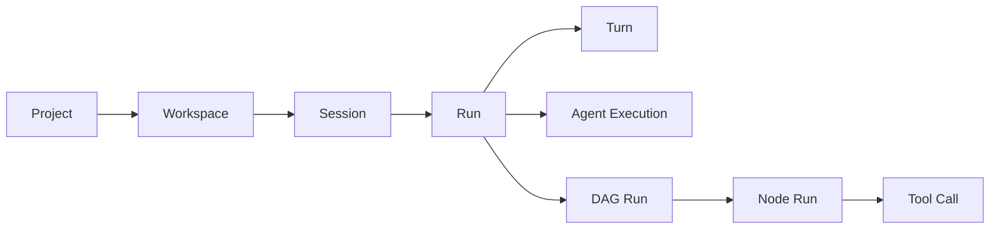
```mermaid
flowchart LR
    P[Project] --> W[Workspace]
    W --> S[Session]
    S --> R[Run]
    R --> T[Turn]
    R --> AE[Agent Execution]
    R --> DR[DAG Run]
    DR --> NR[Node Run]
    NR --> TC[Tool Call]
```

| 术语 | 生命周期与边界 |
|---|---|
| Project | 已注册的项目，具有主要根目录、信任状态和项目策略。项目长期存在，不等同于一次执行。 |
| Project Root | Project 的规范化根目录。多根 Workspace 可包含多个 Project Root。 |
| Workspace | 一次执行可见的一个或多个 Project Root 集合，是 Session 的工作范围。单根项目同样表示为 Workspace。 |
| Audit Root | 多根 Workspace 中由用户指定、用于集中承载 Spec 和 Verification 镜像的根目录。 |
| Session | 可长期恢复、归档并跨端查看的对话和工作容器。一个 Session 可包含多个 Run。 |
| Run | Session 中从输入被接纳到成功、失败、取消或阻塞的一次执行尝试。恢复或重试可产生新的 Run。 |
| Turn | 一个已被提升的用户输入及其 Agent 响应边界。并发输入先进入 Inbox，再由 Session 串行提升为 Turn。 |
| Agent Execution | 父 Agent 或 Subagent 的一次具体执行实例，具有自己的任务、能力上限和状态。 |
| DAG Run | 某个已批准、已版本化 DAG 的一次运行。状态重放不等于新建 DAG Run。 |
| Node Run | DAG 中一个节点的一次执行，受依赖、限流、Claim 和汇聚条件约束。 |
| Task | Spec 或 DAG 中声明的工作单元；只有被调度执行后才产生 Node Run 或 Agent Execution。 |
| Tool Call | Agent 对一个 Tool 的单次调用，从 Proposed 经权限与准备阶段进入执行并产生结果。 |
| Admission | 将客户端命令持久化接纳到 daemon 的过程。收到 Admission Receipt 只表示命令已可靠接收，不表示已执行成功。 |
| Durable Inbox | 持久化命令收件箱。它保证 daemon 崩溃恢复后仍可继续处理已接纳但尚未提升的命令。 |
| Safe Point | 可以一致地暂停、关闭或切换状态的边界；此时没有半提交的权威副作用。 |
| Blocked | 系统因明确条件不能安全推进的持久状态，不是普通“运行较慢”。 |
| BlockReason | Blocked 的结构化原因，例如等待 Spec 批准、权限确认、Claim 冲突或文件协调冲突。 |

#### 4.1 Session、Run 与 Turn 的常见误区

- “继续上次对话”通常继续同一个 `Session`，但可能创建新的 `Run`。
- 一条用户消息只有被 daemon 接纳并提升后才形成 `Turn`。
- 一个 `Run` 可以包含多个 `Turn`、多个 Subagent 和一个或多个 DAG Run。
- Session 日志按 Session 分割，不意味着每个 Run 单独创建日志保留策略。

### 5. Agent、DAG 与并发控制

| 术语 | 含义 |
|---|---|
| Agent | 使用模型、上下文和 Tool 完成目标的运行主体。 |
| Agent Profile | Agent 的可复用配置，包含 Provider/模型路由、能力上限、规则和并发等默认值。 |
| Subagent | 由父 Agent 为具体任务启动的子执行者。面板必须展示其具体任务描述；可写 Subagent 必须声明 `write_paths`。 |
| Provider Inheritance | Subagent 默认继承父 Agent 的 Provider/模型；Agent Profile 或 DAG 节点可显式覆盖。 |
| DAG | Directed Acyclic Graph，有向无环图。用于表达阶段、并行任务、依赖和汇聚。 |
| Workflow | DAG 的声明式来源；经校验和编译后形成版本化 IR，运行时不直接解释任意脚本。 |
| IR | Intermediate Representation，中间表示。Apex 用稳定、受校验的内部结构承接 Workflow 或 Shell AST 的语义。 |
| Ready Queue | 所有依赖已满足、可尝试调度的 Node Run 队列；相同输入应产生稳定的选择顺序。 |
| `write_paths` | 可写 Agent/节点声明的允许写入路径集合，也是调度器进行冲突检测和权限收敛的基础。 |
| Claim / Write Claim | 调度器授予某个执行者的路径写入权。Claim 是运行时互斥能力，不等同于永久权限白名单。 |
| Lease | 有时限、需续租的控制权。控制租约、Web 启用租约和 Write Claim 均使用租约思想，但属于不同资源。 |
| Control Lease | 决定哪个客户端可控制同一 Session 的租约；默认按先来先控制，接管必须审计并使旧令牌失效。 |
| Web Enable Lease | TUI 持有的 Web 启用租约。租约失效后由 `apexd` 关闭 Web 监听，并不终止 Session。 |
| Fencing Token | 租约世代的单调令牌。旧持有者即使在租约过期后恢复，也不能用旧令牌提交结果。 |
| TTL | Time To Live，存活时限。租约超过 TTL 未续租即失效；具体时长由对应契约定义。 |
| Concurrency Limit | 对全局 Agent、可写 Agent 或 Provider 请求施加的并发上限。 |
| Gather / Join | DAG 并行分支完成后的汇聚步骤，按稳定规则组合输入和结果。 |
| Mailbox | DAG 中由显式通信边建立的持久消息通道。消息先持久化再通知，并按序号重放。 |
| Compensation | 已发生副作用无法真正“倒放”时执行的显式补偿动作。补偿结果本身也必须持久化和审计。 |
| Deterministic Replay | 用相同的持久事实、版本化规则和确定顺序重建同一状态；不承诺 LLM 文本逐字一致。 |
| State Replay | 只重放 Durable Event 以重建状态和投影，不再次调用 LLM、Tool 或外部服务。 |
| Re-execution Replay | 从选定 Checkpoint/Snapshot 创建新的执行分支，允许重新调用 LLM 或 Tool，因此会产生新 ID 和新事件。 |
| Partial Rollback | 只恢复选定范围，并为已发生的外部副作用执行补偿；不是对历史事件的删除或改写。 |

### 6. 事件、数据、存储与恢复

| 术语/缩写 | 含义 |
|---|---|
| Source of Truth | 权威事实源。Apex 中运行状态以 Durable Event/SQLite 为主，Spec、Checkpoint、Memory、Verification 等关键审计内容以 Markdown/文件事实为主。 |
| Context | 某次模型请求可见的政策、Spec、对话、Tool 结果、召回内容和恢复信息集合。它不是 Session 的全部持久历史。 |
| Context Window | 模型单次请求可接受的有效输入预算；它是有限缓存，不是恢复事实源。 |
| Context Epoch / `ContextEpoch` | 一次 Provider 输入的可追溯构建结果。Provider/模型切换或来源集合变化会建立新 Epoch。 |
| Context Source | Context 的带来源输入，分为 Stable、Turn、Retrieved、Recovery 和 Transient，并带哈希、预算及失效条件。 |
| Watermark | Context 使用率的持久阈值记录。Apex 使用 60%/70%/80%/90% 四档动作，单个 Epoch 每档只触发一次。 |
| Soft Hint | 60% 阈值的无损提示，引导 Agent 优先完成当前工作并减少低价值检索。 |
| Snip | 70% 阈值的结构感知裁短；在 Checkpoint 后保留错误段、首尾或结构信息等高价值内容。 |
| Prune | 80% 阈值的引用式裁剪；在 Checkpoint 后以可重新获取的 `ContextReference` 替换正文。 |
| LLM Summary | 90% 阈值的结构化摘要兜底；必须先建立 Checkpoint，摘要本身不能取代原始恢复事实。 |
| Durable Event | 会改变权威状态、按 Session 排序并可重放的领域事实。 |
| Transient Event | token 流、即时进度、音频电平等短暂 UI 信号；可丢弃，不参与权威 Reducer。 |
| Event Envelope | 事件信封，承载事件类型、版本、Session 序号、时间、Trace ID 和 Payload 等通用元数据。 |
| Projection | 从 Durable Event 派生的查询视图，可删除后重建，不应成为不可替代的事实源。 |
| Projector | 消费事件并更新 Projection 的组件。 |
| Reducer | 将旧状态与一个事件确定性合并为新状态的纯状态转换逻辑。 |
| Query Snapshot | 某一序号上的完整查询快照。客户端先取得 Snapshot，再合并 `since_seq` 之后的事件。它不是文件系统 Snapshot。 |
| Checkpoint | Checkpoint-first 上下文恢复点，记录 Active Intent、已确认事实、未完成工作、引用和内容哈希，用于无损重建 Agent 上下文。 |
| Snapshot | 工作区文件内容在某一时点的内容寻址快照，用于差异、恢复和回放。它不等同于 Checkpoint，也不依赖 Git commit。 |
| Memory | 可长期召回的项目级或全局知识，以 Markdown 保存，通过 FTS5 检索；敏感内容写入需单独确认。 |
| Artifact | 输入、输出或派生的文件/二进制制品，如图片、音频、视频、报告或 Tool 大输出。 |
| Manifest | 描述一组内容块、哈希、版本和元数据的不可变清单，用于 Snapshot、Checkpoint、归档或发布制品的完整性校验。 |
| CAS | Content-Addressable Storage，内容寻址存储。对象按内容哈希定位，相同内容可去重。 |
| ContentHash | 内容哈希值。Apex 内部内容对象使用 `blake3:<64-lower-hex>` 形式，标识规范化字节。 |
| Generation | 文件事实的单调逻辑版本，用于外部编辑协调和冲突检测；它不是文件修改时间 `mtime`。 |
| Reconciliation | 协调 SQLite 索引、Markdown 文件和 CAS 状态的过程，修复可证明安全的不一致并显式报告冲突。 |
| Markdown AST Merge | 基于 Markdown 结构树的三方合并，避免把结构化文档仅当作文本行处理。无法安全合并时进入冲突状态。 |
| SQLite | Apex 的统一本地关系数据库，用于事件、投影、索引、配置状态和运行元数据。 |
| WAL | Write-Ahead Logging，SQLite 预写日志模式，用于改善读写并发和崩溃恢复。它不同于 Apex 的会话审计日志。 |
| FTS5 | SQLite Full-Text Search 5，全文检索扩展，用于 Memory 等文本索引和关键词召回。 |
| GC | Garbage Collection，垃圾回收。删除不再被活跃、归档、备份或 Pinned 根引用的 CAS 对象。 |
| Pinned | 被用户固定保留的对象。Pinned Checkpoint/Manifest 是 GC Root，直到用户取消固定。 |
| GC Root | 垃圾回收可达性分析的起点；从 Root 可达的内容不得回收。 |
| Tombstone | 逻辑删除标记，证明对象已被删除并阻止旧索引或延迟事件令其意外复活。 |
| Idempotency | 幂等性。相同命令因重试被处理多次时，权威副作用最多发生一次。 |
| Session Log | 按 Session 分割、以 JSON Lines 保存并带 Trace ID/哈希链/分段签名的详细审计日志；单段上限 10 MiB，保留 120 天。 |
| System Log | `apexd` 的人类可读文本诊断日志；按本地日期分割，单日分段上限 10 MiB，保留 60 天。 |
| JSON Lines / JSONL | 每行一个完整 JSON Object 的日志格式，便于追加、流式解析和在损坏时定位完整记录边界。 |
| Hash Chain | 每条会话日志记录引用上一条记录哈希形成的链，用于发现删除、插入、重排或篡改。 |
| Seal | 会话日志段封口。Footer 汇总段哈希并使用 Ed25519 签名；封口后的段不得就地修改。 |
| Quarantine | 隔离区。损坏尾部或无法安全使用的对象移入其中保存证据，而非静默删除或伪装为有效数据。 |

#### 6.1 Checkpoint、Snapshot 与 Query Snapshot 对照

| 对象 | 捕获内容 | 主要用途 | 是否会调用 LLM |
|---|---|---|---|
| Checkpoint | Agent 上下文、意图、事实和引用 | 上下文无损重建、暂停恢复 | 重建本身不会 |
| Snapshot | Workspace 文件内容与 Manifest | 文件恢复、差异、重执行基线 | 捕获/恢复不会 |
| Query Snapshot | 某个 Session 序号上的查询状态 | 客户端初始加载和断线重连 | 不会 |

### 7. 客户端、进程与通信协议

| 缩写/术语 | 英文全称 | 项目内含义 |
|---|---|---|
| `apexd` | Apex Daemon | 用户级常驻服务，拥有统一 SQLite、Session Actor、Provider、Tool、DAG 和本地协议端点。 |
| Cargo Workspace | Cargo Workspace | Rust 多 crate 工作区。Apex 用它表达分层、共享依赖、构建边界和多应用组合。 |
| Crate | Rust Crate | Rust 的编译与发布单元；项目中的每个核心能力或 Adapter 通常对应一个职责内聚的 crate。 |
| Port | Port | 应用/领域层定义的能力接口，通常表现为 Rust Trait；调用方只依赖语义，不依赖 SQLite、HTTP 或厂商 SDK。 |
| Adapter | Adapter | Port 的具体实现或外部协议转换层，例如 SQLite、文件系统、Provider、gRPC 和平台 Adapter。 |
| Actor | Actor | 串行处理自身消息和状态的运行单元。Apex 的 Session Actor 保证单 Session 权威状态按序推进。 |
| Newtype | Newtype | 用单字段 Rust 类型包装 UUID、哈希或字符串，阻止不同业务 ID 被误传和混用。 |
| UUIDv7 | Universally Unique Identifier Version 7 | 带时间排序特征的 UUID 版本。Apex 用它生成业务 ID，以兼顾本地生成、唯一性和索引局部性。 |
| Protobuf | Protocol Buffers | gRPC/Wire 的 Schema 与代码生成格式；生成 DTO 不进入领域层。 |
| TUI | Terminal User Interface | Rust 终端界面客户端。TUI 持有有效 Web 启用租约时，`apexd` 才开放本地 Web 监听。 |
| Desktop | Desktop Client | Tauri + Vue/TypeScript 桌面客户端。业务状态来自 `apexd`，不另建数据库。 |
| Web | Web Client | Actix Web 提供的 localhost Web 入口及共享 Vue 前端，只在 TUI 租约有效时启用。 |
| IPC | Inter-Process Communication | 同一设备上不同进程间通信的总称。Apex 本地 gRPC 运行于受保护的 UDS 或 Named Pipe 上。 |
| RPC | Remote Procedure Call | 以方法调用形式进行进程间通信的模式；“Remote”不表示一定经过公网。 |
| gRPC | Google Remote Procedure Call | Apex TUI/Desktop 与 `apexd` 的主要本地强类型 RPC 协议。 |
| REST | Representational State Transfer | Web 端基于 HTTP 的资源/命令接口，与应用命令共享语义。 |
| WebSocket / WS | WebSocket | Web 端双向事件流，用于 Snapshot 后的增量事件和短暂 UI 信号。 |
| UDS | Unix Domain Socket | macOS/Linux 上的本地 IPC 端点。权限必须限制为当前用户。 |
| Named Pipe | Windows Named Pipe | Windows 上的本地 IPC 端点，通过 SID ACL 限制访问。 |
| PTY | Pseudo Terminal | macOS/Linux 的伪终端，用于默认持久交互终端。 |
| ConPTY | Windows Pseudo Console | Windows 持久交互终端能力。 |
| DTO | Data Transfer Object | 跨应用层或协议边界传输的数据结构；不得携带 SQLx、Actix、SDK 等基础设施类型进入领域层。 |
| Wire | Wire Protocol | 实际跨进程序列化的协议结构、枚举、字段编号和兼容规则。 |
| Client SDK | Client Software Development Kit | 封装握手、命令、Snapshot+Event 合并、错误和重连算法的共享客户端库。 |
| Tauri | Tauri | Apex Desktop 使用的 Rust 桌面应用框架，托管共享 Vue UI 并通过受控命令/通道连接本地能力。 |
| Vue | Vue | Desktop/Web 共享的 TypeScript UI 框架；共享业务视图，但传输和认证由各自 Platform Adapter 实现。 |
| Pinia | Pinia | Vue 的状态管理库。Apex 的 Pinia Store 只消费生成的 DTO 和统一 Reducer，不自行复制业务规则。 |
| Backpressure | 背压 | 消费者过慢时限制、缓冲、裁剪或中止生产，防止队列和内存无限增长。 |
| Trace ID | Trace Identifier | 一条请求链路的全局关联 ID，贯穿客户端、daemon、Agent、Tool、Provider 和会话日志。 |
| Span ID | Span Identifier | Trace 内一个具体操作区间的 ID。多个 Span 可共享同一个 Trace ID。 |

### 8. 权限与安全术语

| 缩写/术语 | 含义 |
|---|---|
| AST | Abstract Syntax Tree，抽象语法树。Apex 用 tree-sitter 将 Shell 命令解析成结构，再进行静态权限判断。 |
| Arity Rule | 参数位语义规则。根据命令及其参数位置识别读取、写入、删除、网络目标和高风险选项。 |
| Tool | 具有结构化输入/输出和副作用声明的可调用能力，例如文件读取、Shell 或 MCP Tool。 |
| Tool Descriptor | Tool 的版本化描述，包含 Schema、资源需求、副作用、幂等性和能力限制。 |
| Tool Gateway | 所有 Tool 调用的统一执行入口，强制按 Prepare、Spec/Permission/Claim Gate、Execute、PostToolUse 和审计顺序处理。 |
| Permission Verdict | 静态权限引擎给出的结构化结论及证据，结果为 Allow、Ask 或 Deny，不由 LLM 生成。 |
| Permission Mode | 权限模式，包含 `plan`、`ask`、`allow`；模式不能覆盖 Hard Deny。 |
| `plan` | 只允许规划和只读分析；可能产生副作用的 Tool 不执行。 |
| `ask` | 需要授权的操作在执行前向用户询问。 |
| `allow` | 在已信任项目和策略边界内自动执行可允许操作；未知解析或 Hard Deny 仍不得放行。 |
| Allowlist | 白名单。按 Tool、规范化路径、网络目标或其他资源明确限定可访问范围。 |
| Hard Deny | 无论当前模式或普通授权如何都禁止的操作，用于不可接受的安全边界。 |
| Zero-token Permission | 零 Token 权限判断。权限决策只使用 AST、IR、规则和白名单，不调用 LLM。 |
| Project Trust | 项目信任状态。未获得用户确认的项目受 Trust Gate 限制。 |
| Grant | 用户授权记录，可具有 Once、Run、Session 或 Project 作用域和有效期。 |
| ACL | Access Control List，访问控制列表。用于限制 Windows 文件、Named Pipe 等资源只允许当前用户。 |
| SID | Security Identifier，Windows 安全标识符，用于识别用户并建立 ACL。 |
| TOCTOU | Time-of-check to Time-of-use，检查与使用之间的竞态。Apex 在执行前重新解析/打开目标，并使用句柄化能力减少风险。 |
| CSRF | Cross-Site Request Forgery，跨站请求伪造。Web 端使用短期会话、Origin 和 CSRF 校验防护。 |
| CSP | Content Security Policy，内容安全策略。限制 Web 页面可加载和执行的资源来源。 |
| PKCE | Proof Key for Code Exchange，OAuth 授权码交换保护机制，用于 MCP OAuth 等本地回调流程。 |
| Secret | API Key、OAuth Token 等敏感值。不得写入 SQLite、Markdown、日志或诊断包。 |
| Secret Firewall | 敏感信息出口防线，在日志、Provider 请求、Tool 环境和诊断导出前进行类型化限制与清洗。 |
| Sandbox | 操作系统级隔离能力。它是 Tool 权限门之外的纵深防御，不替代 AST 和资源策略。 |

### 9. Provider、多模态与扩展生态

| 缩写/术语 | 含义 |
|---|---|
| LLM | Large Language Model，大语言模型。Apex 通过 Provider 抽象调用，不把厂商 DTO 泄漏到领域层。 |
| Provider | 模型服务供应方或兼容端点，例如 Anthropic、OpenAI、DeepSeek、Kimi、通义、智谱。 |
| Provider Adapter | 将统一请求、流、Tool、错误和用量映射到某一 Provider API 的适配层。四家指定 Provider 使用独立 Adapter。 |
| OpenAI-Compatible | 实现 OpenAI 风格 API 的通用端点类型；兼容不代表所有模型能力完全相同。 |
| Provider Profile | 用户配置的 Provider、模型、Base URL、重试和可选故障转移链路的组合。 |
| Capability | Provider、Agent、Skill、MCP 或 Plugin 声明的结构化能力。运行时按能力协商，不按名称猜测。 |
| Failover Chain | 用户配置的 Provider/模型故障转移顺序。默认不自动切换，启用后也必须记录实际路由。 |
| Multimodal | 多模态能力，包括文本、图片、音频、视频文件等输入或输出。Apex 不承诺实时视频。 |
| Realtime | 双向低延迟会话能力，当前主要指 Desktop/Web 的实时音频。 |
| VAD | Voice Activity Detection，语音活动检测，用于判断音频中的说话开始和结束。 |
| Skill | 以 `SKILL.md` 为入口的可发现指令包。兼容生态目录，并可通过扩展 frontmatter 绑定 Spec 流水线阶段。 |
| MCP | Model Context Protocol，模型上下文协议。Apex 扫描外部配置、管理 MCP Server，并在面板显示服务名和状态。 |
| MCP Server | 通过 MCP 暴露 Tool、Resource 或 Prompt 的外部服务，可由面板启停。 |
| Plugin | Apex 原生扩展包，具有 Manifest、版本、签名和能力声明；不等同于 Skill 或 MCP Server。 |
| Plugin Host | 隔离运行第三方原生 Plugin 的受监督进程，通过能力代理访问 Apex 资源。 |
| ABI | Application Binary Interface，应用二进制接口。Plugin 边界使用稳定 C ABI，不暴露 Rust ABI。 |
| FFI | Foreign Function Interface，外部函数接口。跨动态库调用必须明确长度、所有权、线程和错误边界。 |
| Frontmatter | Markdown 文件开头的结构化元数据块，通常使用 YAML，存放 ID、版本、阶段、哈希等机器可读字段。 |

#### 9.1 Skill、MCP 与 Plugin 对照

| 类型 | 本质 | 运行方式 | 主要风险边界 |
|---|---|---|---|
| Skill | 指令与资源包 | 被 Agent 读取并按阶段使用 | 指令注入、范围和来源信任 |
| MCP Server | 外部协议服务 | 独立进程/远端端点，经 MCP 调用 | Tool 权限、凭据、网络和进程生命周期 |
| Plugin | 原生二进制扩展 | 官方签名可受控加载，第三方默认在 Plugin Host | 内存安全、ABI、签名和供应链 |

### 10. 发布、质量与性能术语

| 缩写/术语 | 含义 |
|---|---|
| E2E | End-to-End，端到端测试。从客户端入口贯穿 daemon、存储、Agent/Tool 到最终可观察结果。 |
| Contract Test | 契约测试，验证所有 Provider Adapter、客户端 Adapter 或协议实现遵循同一稳定契约。 |
| Property Test | 属性测试，对大量生成输入验证始终成立的不变量，而非只检查少量示例。 |
| Fuzz Test | 模糊测试，以大量畸形或随机输入寻找解析器、FFI、协议和状态机崩溃或越界行为。 |
| Mutation Test | 变异测试，主动修改实现逻辑，检查测试是否能够捕获错误。 |
| Fault Injection | 故障注入，在事务、文件替换、进程退出或网络边界人为制造故障以验证恢复能力。 |
| Compatibility Fixture | 兼容性样本，用旧版本 Schema/事件/文件验证升级、读取和回写规则。 |
| SBOM | Software Bill of Materials，软件物料清单，列出发布制品包含的依赖和组件。 |
| Provenance | 构建来源证明，记录源码、构建环境、工具链和制品之间的可验证关系。 |
| Release Manifest | 发布清单，记录版本、平台、架构、哈希、签名和制品集合。不同组件必须属于同一清单。 |
| Rollback | 回滚到上一可用版本或恢复备份。数据库/文件 Schema 不兼容时必须遵循迁移和恢复策略。 |
| P50 / P95 / P99 | 性能分位数。例如 P95 表示 95% 的观测值不超过该数值，比单纯平均值更能反映尾延迟。 |
| RSS | Resident Set Size，进程实际驻留物理内存的近似指标。 |
| Baseline | 基线。在固定环境和数据集上记录的性能或正确性参照值。 |
| SLO | Service Level Objective，服务级目标。用于表达可量化的可靠性或性能目标。 |

### 11. 两套 L1–L4 的区别

`L1`–`L4` 必须结合语境解释；目前存在两套互不替代的分级：

| 语境 | L1 | L2 | L3 | L4 |
|---|---|---|---|---|
| Apex 文档权威层级 | 需求：产品 What、边界、NFR、验收 | 架构/领域：边界、状态和事件语义 | 契约：Trait、DTO、Wire 和错误模型 | 主题：流程、算法、运维和实施指南 |
| Spec 驱动工作复杂度 | 简单修改：最少必要约束 | 轻量 Spec | 标准 Spec | 完整 Spec：适用于跨系统、强安全或高风险设计 |

前者回答“发生冲突时哪类文档更权威”，后者回答“某项工作需要多完整的 Spec”。两者与 Context 的四档水位阈值无关。

### 12. 易混淆术语对照

| 容易混淆的词 | 区别 |
|---|---|
| `RC` / Request Context | Apex 中 `RC` 固定表示 Release Candidate；请求上下文应写全称或使用明确类型名。 |
| Requirement / Acceptance Criteria | Requirement 是必须满足的需求；Acceptance Criteria 是证明需求满足的产品场景。 |
| Validation / Verification | Validation 是具体检查；Verification 是汇总检查和证据以确认交付整体符合 Spec。 |
| Project / Workspace | Project 是注册与信任单位；Workspace 是一次执行可见的一个或多个 Root 集合。 |
| Session / Run / Turn | Session 是长期容器；Run 是一次执行尝试；Turn 是单个用户输入与 Agent 响应边界。 |
| Task / Node Run / Agent Execution | Task 是声明；Node Run 是 DAG 节点运行；Agent Execution 是实际 Agent 执行实例。 |
| Tool / Skill / MCP / Plugin | Tool 是可调用能力；Skill 是指令包；MCP 是外部服务协议；Plugin 是 Apex 原生二进制扩展。 |
| Claim / Permission Grant | Claim 解决并发写互斥；Permission Grant 表示用户授权。拥有其中一个不自动获得另一个。 |
| Checkpoint / Snapshot | Checkpoint 保存 Agent 上下文恢复信息；Snapshot 保存 Workspace 文件内容。 |
| Query Snapshot / Snapshot | Query Snapshot 是客户端状态视图；Snapshot 是内容寻址的工作区文件快照。 |
| State Replay / Re-execution Replay | State Replay 不产生外部副作用；Re-execution 会创建新执行并可能再次调用 LLM/Tool。 |
| WAL / Session Log | WAL 是 SQLite 内部恢复机制；Session Log 是按会话保存的 JSON Lines 审计记录。 |
| Durable Event / Transient Event | Durable Event 可重放并改变权威状态；Transient Event 只服务即时体验。 |
| Generation / mtime | Generation 是受控逻辑版本；mtime 是文件系统时间，不能单独用于并发正确性判断。 |
| Allow Mode / 无限制执行 | Allow 仍受 Project Trust、Hard Deny、Tool/路径/网络白名单和解析可信度限制。 |
| Compensation / 历史回滚 | Compensation 新增反向动作和审计事实；不会删除或改写已经发生的历史事件。 |

### 13. 缩写快速索引

| 缩写 | 含义 | 缩写 | 含义 |
|---|---|---|---|
| AC | Acceptance Criteria | ACL | Access Control List |
| ABI | Application Binary Interface | ADR | Architecture Decision Record |
| AST | Abstract Syntax Tree | CAS | Content-Addressable Storage |
| CSP | Content Security Policy | CSRF | Cross-Site Request Forgery |
| DAG | Directed Acyclic Graph | DTO | Data Transfer Object |
| E2E | End-to-End | EP | Execution Plan Task |
| FFI | Foreign Function Interface | FTS5 | SQLite Full-Text Search 5 |
| G | Gate | GC | Garbage Collection |
| gRPC | Google Remote Procedure Call | IPC | Inter-Process Communication |
| IR | Intermediate Representation | LLM | Large Language Model |
| MCP | Model Context Protocol | NFR | Non-Functional Requirement |
| P50/P95/P99 | Performance Percentile | PKCE | Proof Key for Code Exchange |
| PTY | Pseudo Terminal | RC | Release Candidate |
| REST | Representational State Transfer | RQ | Requirement |
| RPC | Remote Procedure Call | RSS | Resident Set Size |
| SBOM | Software Bill of Materials | SID | Security Identifier |
| SLO | Service Level Objective | TDD | Test-Driven Development |
| TOCTOU | Time-of-check to Time-of-use | TTL | Time To Live |
| TUI | Terminal User Interface | UDS | Unix Domain Socket |
| VAD | Voice Activity Detection | VAL | Validation |
| WAL | Write-Ahead Logging | WS | WebSocket |
| JSONL | JSON Lines | UUIDv7 | Universally Unique Identifier Version 7 |

新增领域名词、跨文档缩写或编号前，应先在其权威文档中定义，再同步更新本文；禁止仅修改术语表来改变系统行为。

---

<!-- 源文件：docs/01-requirements.md -->

## 章 2 · 需求基线与追踪矩阵

### 1. 文档状态

- 需求等级：L4（跨客户端、存储、安全、恢复、扩展与多 Agent 的系统级设计）。
- 确定性：用户已逐项澄清并明确确认，设计阶段无阻塞问题。
- 本轮范围：只生成目标架构文档，不实现代码，不兼容旧 Cargo 结构。
- 产品策略：直接设计完整产品；实施可分阶段，但不存在降低需求的 MVP 产品分支。

### 2. 产品目标

Apex 要成为一款本地优先、可审计、可恢复的编程 Agent。客户端以**自包含原生应用**形态交付——用户双击图标即进入完整工作界面，无需预先打开系统终端、无需手动启动后台服务、无需预置配置。界面内部采用 TUI 渲染，保持文本界面的信息密度与键盘效率，同时具备原生应用的启动与窗口体验。

用户可以从 TUI、桌面端或 Web 端进入同一项目窗口的会话，观察 Skill、MCP、Subagent、Tool、权限与 DAG 的实时状态；所有编码工作受 Spec、静态权限、Checkpoint 和验证门控制。

### 3. 范围边界

#### 3.1 范围内

- Rust 项目级服务、自包含原生窗口 TUI、本地 gRPC、Actix REST/WebSocket、Tauri + Vue/TypeScript。
- 原生窗口渲染栈：窗口与事件循环、像素缓冲呈现、自定义 TUI Backend、字体与 DPI 适配。
- 多 Provider、多模态、Skills、MCP、原生 Plugin、静态权限、持久终端。
- Spec、Rules、Checkpoint、Memory、DAG、Snapshot、重放、日志、归档和升级。
- macOS、Windows、Linux 的 x86_64 与 ARM64 发布，交付可双击运行的应用包。

#### 3.2 明确不包含

- 云端 SaaS 控制面、组织/租户管理、Marketplace、自动遥测或自动崩溃上传。
- 实时视频、基于 LLM 的权限判断、QuickJS/任意调度脚本、Shadow Git Snapshot。
- 同一用户在多台机器之间的内建同步；当前“跨端”指同一机器上的三个客户端。
- 本轮代码实现、构建产物和数据库迁移。

### 4. 需求追踪矩阵

状态均为“已确认”。“落点”指该要求的主要权威设计文档，相关主题可能在其他文档中被引用。

#### 4.1 产品、进程与客户端（RQ-001–RQ-024）

| ID | 已确认要求 | 主要落点 |
|---|---|---|
| RQ-001 | 目标为完整产品，不另设削减功能的 MVP 架构。 | [15](#章-16-质量风险与完整产品实施计划) |
| RQ-002 | 采用绿地重构，不受旧 Cargo Workspace 和旧实现兼容约束。 | [03](#章-4-cargo-workspace-与工程结构) |
| RQ-003 | 当前交付只生成文档，不进行代码开发。 | 本文、[15](#章-16-质量风险与完整产品实施计划) |
| RQ-004 | 支持 macOS、Windows、Linux。 | [14](#章-15-安装升级与运维) |
| RQ-005 | 每个 OS 同时支持 x86_64 与 ARM64。 | [14](#章-15-安装升级与运维) |
| RQ-006 | **已废弃（2026-08-14）**。原文为"每个 OS 用户只运行一个全局 `apexd`"。改为项目级实例，见 RQ-007、RQ-120。编号保留不重用。 | [02](#章-3-系统总体架构) |
| RQ-007 | 每个项目窗口拥有独立 `apexd` 实例与独立运行态数据库；运行态 SQLite 按项目分片于 `~/.apex/projects/<项目hash>/apex.db`。 | [07](#章-8-存储文件事实日志与归档) |
| RQ-008 | Apex Home 在所有平台统一表示为 `~/.apex/`。 | [07](#章-8-存储文件事实日志与归档) |
| RQ-009 | TUI 与 Tauri 桌面端通过本地 gRPC 访问 `apexd`；`apexd` 由原生窗口宿主进程拉起并监管，用户无需手动启动服务。 | [06](#章-7-协议与三端客户端) |
| RQ-010 | Unix 平台的本地 gRPC 使用 Unix Domain Socket。 | [06](#章-7-协议与三端客户端) |
| RQ-011 | Windows 的本地 gRPC 使用 Named Pipe。 | [06](#章-7-协议与三端客户端) |
| RQ-012 | Web 端使用 Actix REST + WebSocket。 | [06](#章-7-协议与三端客户端) |
| RQ-013 | Web 监听只能绑定 localhost。 | [14](#章-15-安装升级与运维) |
| RQ-014 | Actix Web 运行在 `apexd` 内，且只有 TUI 持有启用租约时才开放。 | [06](#章-7-协议与三端客户端) |
| RQ-015 | TUI Web 租约失效后，`apexd` 必须关闭 Web 监听；窗口关闭导致 `apexd` 退出时，Web 监听同时终止。 | [06](#章-7-协议与三端客户端) |
| RQ-016 | Web 使用一次性令牌换短期 Cookie，并校验 Origin 与 CSRF。 | [06](#章-7-协议与三端客户端) |
| RQ-017 | 桌面端与 Web 共用 Vue/TS 应用，以 Platform Adapter 区分传输。 | [06](#章-7-协议与三端客户端) |
| RQ-018 | 同一项目窗口内三端核心功能等价，并明确能力差异；差异不得以"终端能力受限"为由设定。 | [06](#章-7-协议与三端客户端) |
| RQ-019 | TUI 提供日志查看能力（原生窗口形态已无终端渲染限制）。 | [06](#章-7-协议与三端客户端)、[07](#章-8-存储文件事实日志与归档) |
| RQ-020 | TUI 不支持音频与实时语音（受设备授权与编解码栈复杂度限制，非终端渲染限制）。 | [12](#章-13-provider-与多模态设计) |
| RQ-021 | 会话控制权采用"先来先控制"的单控制租约。 | [06](#章-7-协议与三端客户端) |
| RQ-022 | 控制端断线后保留 30 秒租约宽限。 | [06](#章-7-协议与三端客户端) |
| RQ-023 | 其他客户端可以显式强制接管控制权，并留下审计记录。 | [06](#章-7-协议与三端客户端) |
| RQ-024 | Desktop/Web 控制端断开后默认继续执行，也可按项目策略在安全点暂停；**窗口宿主关闭**时不适用"继续执行"，按 RQ-119 走安全点收尾并标记可恢复中断。 | [06](#章-7-协议与三端客户端) |

#### 4.2 数据权威与目录（RQ-025–RQ-035）

| ID | 已确认要求 | 主要落点 |
|---|---|---|
| RQ-025 | Spec、Checkpoint、Memory、最终验证报告以 Markdown/文件系统为事实源。 | [07](#章-8-存储文件事实日志与归档) |
| RQ-026 | SQLite 保存会话、消息、Agent/Tool/Permission/DAG 状态、最小领域事件、投影和 FTS。 | [07](#章-8-存储文件事实日志与归档) |
| RQ-027 | SQLite 事件不是日志；事件与文件日志通过 `event_id`/`trace_id` 关联。 | [07](#章-8-存储文件事实日志与归档) |
| RQ-028 | Markdown 自动监听，同时提供显式重载。 | [07](#章-8-存储文件事实日志与归档) |
| RQ-029 | 外部修改冲突优先三方合并；无法合并时暂停并等待人工处理。 | [07](#章-8-存储文件事实日志与归档) |
| RQ-030 | 单项目 Spec 路径为 `specs/<feature>/{requirements,design,tasks,verification}.md`。 | [08](#章-9-spec编码规则与验证流水线) |
| RQ-031 | 单项目运行文件位于 `.apex/{checkpoints,memory,snapshots,runtime}`。 | [07](#章-8-存储文件事实日志与归档) |
| RQ-032 | 默认提交 Spec、验证报告和 Memory；忽略 Checkpoint、Snapshot、附件、缓存与日志。 | [07](#章-8-存储文件事实日志与归档) |
| RQ-033 | 多根 Workspace 的 Spec/Checkpoint/工作流事实源位于 `~/.apex/workspaces/<workspace-id>/`。 | [07](#章-8-存储文件事实日志与归档) |
| RQ-034 | 多根 Workspace 的每个根仍维护自己的 `.apex/memory/`。 | [10](#章-11-contextcheckpoint-与-memory) |
| RQ-035 | 多根 Workspace 必须指定审计根，并镜像 Spec 与最终验证报告。 | [07](#章-8-存储文件事实日志与归档) |

#### 4.3 Spec、Rules 与验证（RQ-036–RQ-046）

| ID | 已确认要求 | 主要落点 |
|---|---|---|
| RQ-036 | 强制执行需求 → 设计 → 任务 → 编码 → 验证流水线。 | [08](#章-9-spec编码规则与验证流水线) |
| RQ-037 | 默认逐阶段审批；项目策略可改为三个 Spec 文档整体审批。 | [08](#章-9-spec编码规则与验证流水线) |
| RQ-038 | 已批准 Spec 一旦变化立即失效，在下一安全点暂停并回改下游。 | [08](#章-9-spec编码规则与验证流水线) |
| RQ-039 | `/skip-spec` 可跳阶段或全流程、作用于 Run/Session，并记录完整审计字段。 | [08](#章-9-spec编码规则与验证流水线) |
| RQ-040 | 每个功能必须生成 `verification.md`。 | [08](#章-9-spec编码规则与验证流水线) |
| RQ-041 | 默认由用户确认后完成；项目策略可允许自动验证通过即完成。 | [08](#章-9-spec编码规则与验证流水线) |
| RQ-042 | 每次文件修改后同步执行轻量安全、格式和语法检查。 | [08](#章-9-spec编码规则与验证流水线) |
| RQ-043 | 重型 lint/test/静态分析按增量批次执行，并在完成门统一强制。 | [08](#章-9-spec编码规则与验证流水线) |
| RQ-044 | 增量自动修复默认 2 轮、可配置 1–5 轮，且不得扩大 `write_paths` 或权限。 | [08](#章-9-spec编码规则与验证流水线) |
| RQ-045 | 内置规则覆盖 Rust、Go、Java、Python、TS/JS、Vue。 | [08](#章-9-spec编码规则与验证流水线) |
| RQ-046 | 权限/调度/Spec/恢复覆盖率不低于 90%，其他 Rust 与 Vue/TS 不低于 80%，关键三端流程必须 E2E。 | [15](#章-16-质量风险与完整产品实施计划) |

#### 4.4 Tool、权限与终端（RQ-047–RQ-058）

| ID | 已确认要求 | 主要落点 |
|---|---|---|
| RQ-047 | `plan` 模式只读且无副作用。 | [09](#章-10-tool-gateway权限引擎与终端) |
| RQ-048 | `ask` 模式对白名单内操作自动放行，其余询问。 | [09](#章-10-tool-gateway权限引擎与终端) |
| RQ-049 | `allow` 模式对静态策略允许项自动放行，硬禁止不可绕过。 | [09](#章-10-tool-gateway权限引擎与终端) |
| RQ-050 | 权限判断必须零 Token，不允许调用 LLM。 | [09](#章-10-tool-gateway权限引擎与终端) |
| RQ-051 | 完整解析 sh/bash/zsh、PowerShell 7 与 cmd.exe。 | [09](#章-10-tool-gateway权限引擎与终端) |
| RQ-052 | 权限覆盖 Tool、文件读写、命令/程序/参数语义、网络目标、凭据/环境变量。 | [09](#章-10-tool-gateway权限引擎与终端) |
| RQ-053 | AST 未知/失败时：plan 拒绝，ask 询问，allow 也降级为询问。 | [09](#章-10-tool-gateway权限引擎与终端) |
| RQ-054 | 授权期限支持单次、Run、Session、Project；不提供用户级全局授权。 | [09](#章-10-tool-gateway权限引擎与终端) |
| RQ-055 | OS 沙箱是可选增强，默认安全基础为静态策略。 | [09](#章-10-tool-gateway权限引擎与终端) |
| RQ-056 | 未信任项目在用户确认前连读取都禁止。 | [09](#章-10-tool-gateway权限引擎与终端) |
| RQ-057 | 默认创建持久 PTY/ConPTY，也支持一次性非交互命令。 | [09](#章-10-tool-gateway权限引擎与终端) |
| RQ-058 | UI 展示一个共享逻辑终端；并发 Agent 使用隔离通道并按 Agent/Task/trace 归因。 | [09](#章-10-tool-gateway权限引擎与终端) |

#### 4.5 Agent、DAG、Snapshot 与重放（RQ-059–RQ-073）

| ID | 已确认要求 | 主要落点 |
|---|---|---|
| RQ-059 | 可写 Subagent 必须声明 `write_paths`。 | [11](#章-12-agentdagsnapshot-与重放) |
| RQ-060 | 默认共享工作区，通过规范化路径 Claim/租约实现互斥。 | [11](#章-12-agentdagsnapshot-与重放) |
| RQ-061 | 高风险任务可切换到隔离 worktree。 | [11](#章-12-agentdagsnapshot-与重放) |
| RQ-062 | 扩展写路径必须暂停、修改 `tasks.md`/工作流并重新审批。 | [11](#章-12-agentdagsnapshot-与重放) |
| RQ-063 | 单 daemon 默认并发为全局 `min(8, CPU)`、写 Agent 4、单 Provider 4，硬上限 `min(32, 2×CPU)`；多窗口并存时通过用户级共享信号量协调，使机器级总并发不超过单实例硬上限。 | [11](#章-12-agentdagsnapshot-与重放) |
| RQ-064 | DAG 来源为已批准 `tasks.md` 与 `.apex/workflows/*.yaml`。 | [11](#章-12-agentdagsnapshot-与重放) |
| RQ-065 | 不使用 QuickJS 或任意调度脚本。 | [11](#章-12-agentdagsnapshot-与重放) |
| RQ-066 | Subagent 默认由父 Agent 汇聚；仅显式 DAG 通信边允许持久邮箱。 | [11](#章-12-agentdagsnapshot-与重放) |
| RQ-067 | 汇聚冲突由受限 Merge Subagent 尝试三方合并，失败转人工。 | [11](#章-12-agentdagsnapshot-与重放) |
| RQ-068 | 崩溃后只自动继续可证明幂等节点；未知副作用保持阻塞。 | [11](#章-12-agentdagsnapshot-与重放) |
| RQ-069 | 部分回滚使用补偿式恢复，历史事件不可删除。 | [11](#章-12-agentdagsnapshot-与重放) |
| RQ-070 | Snapshot 使用纯内容寻址文件快照，不用 Shadow Git，也不污染用户 Git。 | [11](#章-12-agentdagsnapshot-与重放) |
| RQ-071 | 确定性状态重放复用已记录结果，不重新执行副作用。 | [11](#章-12-agentdagsnapshot-与重放) |
| RQ-072 | 再执行重放可重新调用 LLM/Tool，继承原权限，展示副作用清单并整体确认，只承诺尽力复现。 | [11](#章-12-agentdagsnapshot-与重放) |
| RQ-073 | 面板实时展示 Skill 名称、MCP 服务名称和 Subagent 的具体任务描述。 | [06](#章-7-协议与三端客户端) |

#### 4.6 Context、Checkpoint 与 Memory（RQ-074–RQ-083）

| ID | 已确认要求 | 主要落点 |
|---|---|---|
| RQ-074 | Context 阈值为 60% 软提示、70% snip、80% prune、90% LLM 摘要。 | [10](#章-11-contextcheckpoint-与-memory) |
| RQ-075 | 摘要可配置独立模型，未配置时回退当前模型。 | [10](#章-11-contextcheckpoint-与-memory) |
| RQ-076 | 每 Turn 成功结束、任何有损处理前、暂停/退出前、高风险写前强制 Checkpoint。 | [10](#章-11-contextcheckpoint-与-memory) |
| RQ-077 | `checkpoint.md` 为清单，引用内容寻址片段和多模态附件，共同支持无损重建。 | [10](#章-11-contextcheckpoint-与-memory) |
| RQ-078 | Checkpoint 活跃期全保留，120 天归档，365 天删除，Pinned 永久。 | [10](#章-11-contextcheckpoint-与-memory) |
| RQ-079 | Memory 同时支持项目级 `.apex/memory/` 与全局 `~/.apex/memory/`。 | [10](#章-11-contextcheckpoint-与-memory) |
| RQ-080 | Agent 可自动写 Memory，但必须记录来源、理由与作用域。 | [10](#章-11-contextcheckpoint-与-memory) |
| RQ-081 | 疑似敏感 Memory 默认阻止，必须逐次确认后写入。 | [10](#章-11-contextcheckpoint-与-memory) |
| RQ-082 | FTS5 tokenizer 可选 `unicode61`/`jieba-rs`，中文默认 jieba。 | [10](#章-11-contextcheckpoint-与-memory) |
| RQ-083 | UI 支持查看 Memory 引用时机、删除和导出。 | [10](#章-11-contextcheckpoint-与-memory) |

#### 4.7 Provider 与多模态（RQ-084–RQ-093）

| ID | 已确认要求 | 主要落点 |
|---|---|---|
| RQ-084 | Anthropic、OpenAI、DeepSeek、Kimi 各自拥有独立适配 crate。 | [12](#章-13-provider-与多模态设计) |
| RQ-085 | 通义、智谱及其他首版使用 OpenAI-Compatible，并保留后续专属适配通道。 | [12](#章-13-provider-与多模态设计) |
| RQ-086 | 支持文本、Tool、推理、图片、文件、音频、实时双向语音和视频文件。 | [12](#章-13-provider-与多模态设计) |
| RQ-087 | 不支持实时视频。 | [12](#章-13-provider-与多模态设计) |
| RQ-088 | 桌面/Web 支持音频和实时语音；TUI 不支持音频。 | [12](#章-13-provider-与多模态设计) |
| RQ-089 | 默认不自动切换 Provider，但支持配置故障转移链路。 | [12](#章-13-provider-与多模态设计) |
| RQ-090 | Subagent 默认继承父模型，Agent Profile 或 DAG 节点可覆盖 Provider/模型。 | [12](#章-13-provider-与多模态设计) |
| RQ-091 | API Key 明文保存于 `~/.apex/config/providers.toml`，Unix 0600，Windows 当前用户 ACL。 | [12](#章-13-provider-与多模态设计) |
| RQ-092 | API Key 不得进入 SQLite、日志、Spec、Checkpoint 或 Memory。 | [12](#章-13-provider-与多模态设计) |
| RQ-093 | SQLite 不启用 SQLCipher。 | [07](#章-8-存储文件事实日志与归档) |

#### 4.8 Skills、MCP 与 Plugin（RQ-094–RQ-102）

| ID | 已确认要求 | 主要落点 |
|---|---|---|
| RQ-094 | Skill 扫描器可插拔，首版完整兼容 Claude 与 Codex Skills 目录/格式。 | [13](#章-14-skillsmcp-与-plugin-扩展系统) |
| RQ-095 | Skill frontmatter 支持 Apex 扩展字段以绑定流水线阶段。 | [13](#章-14-skillsmcp-与-plugin-扩展系统) |
| RQ-096 | 外部 Skill 默认不信任，哈希/签名变化使信任失效，脚本必须经过 Tool Gateway。 | [13](#章-14-skillsmcp-与-plugin-扩展系统) |
| RQ-097 | MCP 自动扫描 Claude Desktop/Code、Cursor、VS Code、Codex 与 Apex 配置。 | [13](#章-14-skillsmcp-与-plugin-扩展系统) |
| RQ-098 | MCP 只发现不自动启动，面板支持一键启停。 | [13](#章-14-skillsmcp-与-plugin-扩展系统) |
| RQ-099 | Apex 默认只保存启用覆盖，只有用户显式操作才回写来源配置。 | [13](#章-14-skillsmcp-与-plugin-扩展系统) |
| RQ-100 | Plugin 是原生 Rust 动态库，支持进程内和独立 Plugin Host。 | [13](#章-14-skillsmcp-与-plugin-扩展系统) |
| RQ-101 | 仅 Apex 官方签名 Plugin 可进程内；第三方 Plugin 必须独立进程。 | [13](#章-14-skillsmcp-与-plugin-扩展系统) |
| RQ-102 | 不建设 Marketplace，只支持本地目录、Git 与文件包安装。 | [13](#章-14-skillsmcp-与-plugin-扩展系统) |

#### 4.9 SQLite、日志与归档（RQ-103–RQ-111）

| ID | 已确认要求 | 主要落点 |
|---|---|---|
| RQ-103 | SQLite 采用“运行生命周期事件+投影，配置/索引普通表”的混合模型。 | [07](#章-8-存储文件事实日志与归档) |
| RQ-104 | WAL 默认 `synchronous=NORMAL`，Checkpoint/审批等关键事务临时使用 FULL。 | [07](#章-8-存储文件事实日志与归档) |
| RQ-105 | 仅在升级、迁移和高风险恢复前自动备份。 | [14](#章-15-安装升级与运维) |
| RQ-106 | 会话运行数据 120 天后归档并移出该项目分片库、查询时只读挂载、继续时恢复、365 天删除；因无常驻进程，归档与清理在打开项目时惰性执行，并在窗口宿主退出前尽力执行一次。 | [07](#章-8-存储文件事实日志与归档) |
| RQ-107 | 会话日志为按 Session 分割的 JSONL，文件名含时间和 Session ID，10 MiB 轮转，保留 120 天，按项目分片存放，三端均可查看。 | [07](#章-8-存储文件事实日志与归档) |
| RQ-108 | 会话日志默认仅记录元数据/摘要/长度/哈希；单会话全文调试须显式开启并高风险提示。 | [07](#章-8-存储文件事实日志与归档) |
| RQ-109 | 每条会话日志形成哈希链，每段由 `~/.apex/keys/` 中的 Ed25519 密钥签名；多 daemon 并发签名与密钥轮换通过文件锁串行化。 | [07](#章-8-存储文件事实日志与归档) |
| RQ-110 | 系统日志为人类可读文本、每日一个逻辑文件、10 MiB 分段并保留 60 天，按项目分片以避免多 daemon 交叉写入。 | [07](#章-8-存储文件事实日志与归档) |
| RQ-111 | 同一 Major 内旧版本可打开最新 Schema：保留未知字段/表/事件，新功能只读/不可见，禁止删除、改名或改变既有语义。 | [14](#章-15-安装升级与运维) |

#### 4.10 发布、隐私与非功能需求（RQ-112–RQ-115）

| ID | 已确认要求 | 主要落点 |
|---|---|---|
| RQ-112 | 发布通道为 Stable、Nightly、Development、Enterprise，并按已确认策略提示/下载/安全点安装；Enterprise 可用管理员私有更新源但无组织管理。 | [14](#章-15-安装升级与运维) |
| RQ-113 | 无遥测、无自动崩溃上传，只提供手动生成的脱敏诊断包。 | [14](#章-15-安装升级与运维) |
| RQ-114 | 满足窗口首帧、daemon 就绪、命令确认、窗口内事件、分页、Memory 搜索和空闲内存七项性能目标。 | [15](#章-16-质量风险与完整产品实施计划) |
| RQ-115 | 简体中文和英文完整支持，其他语言通过语言包扩展。 | [06](#章-7-协议与三端客户端) |

#### 4.11 自包含原生应用形态（RQ-116–RQ-124）

本组为 2026-08-14 客户端形态变更新增，落点以 [06](#章-7-协议与三端客户端) 与 [14](#章-15-安装升级与运维) 为主。

| ID | 已确认要求 | 主要落点 |
|---|---|---|
| RQ-116 | 客户端以可双击运行的原生应用包交付（macOS `.app`、Windows `.exe`、Linux AppImage），启动不依赖系统终端，不要求用户预装工具链或手动启动服务。 | [14](#章-15-安装升级与运维) |
| RQ-117 | 启动时显示项目选择器：列出最近项目（名称、路径、最后打开时间）并提供目录选择；无最近记录时直接进入目录选择。 | [06](#章-7-协议与三端客户端) |
| RQ-118 | 界面在原生窗口内以 TUI 方式渲染：窗口与事件循环、像素缓冲呈现、自定义 TUI Backend 与增量重绘；字体族/字号/行高可配，支持 DPI 缩放，窗口尺寸与位置持久化。 | [06](#章-7-协议与三端客户端) |
| RQ-119 | 窗口宿主进程是 `apexd` 的生命周期所有者：关闭窗口即停止该项目服务；关闭前必须到达安全点并创建 Checkpoint，未完成 Run/DAG 标记为可恢复中断，下次打开该项目时提示续跑。 | [02](#章-3-系统总体架构) |
| RQ-120 | 同一项目禁止被多个窗口同时打开，由项目级单实例锁保证；重复打开时聚焦已有窗口而不新建 daemon。不同项目可并存多个窗口。 | [02](#章-3-系统总体架构) |
| RQ-121 | 每个项目 daemon 的本地端点按项目标识派生（UDS 路径或 Named Pipe 名），保证多 daemon 端点互不冲突且可被同项目的 Desktop/Web 客户端发现。 | [06](#章-7-协议与三端客户端) |
| RQ-122 | 用户级共享资源（Provider 凭据、全局 Memory、签名密钥、更新检查、并发配额）的跨 daemon 访问必须经文件锁串行化，并定义锁超时与陈旧锁回收策略。 | [07](#章-8-存储文件事实日志与归档) |
| RQ-123 | 首次运行零配置：自动生成默认配置并直接进入界面；配置缺失或非法时降级为可用默认值并给出非阻塞提示，不得阻断启动。 | [14](#章-15-安装升级与运维) |
| RQ-124 | 应用包内自带运行所需的全部组件（daemon、字体回退、默认规则集），不在运行期从网络拉取必需依赖。 | [14](#章-15-安装升级与运维) |

### 5. 产品验收标准

| AC | 场景 | Given | When | Then |
|---|---|---|---|---|
| AC-001 | 窗口内三端共享会话 | 某项目窗口内任一客户端创建会话 | 同项目的其他客户端连接该窗口的 `apexd` | 250 ms 内可查询/订阅到同一权威状态；跨项目窗口之间互不可见 |
| AC-002 | Web 租约 | TUI 未持有 Web 租约 | 探测 Web 端口 | 无监听；获得租约后才开放 localhost；窗口关闭后再次探测应无监听 |
| AC-003 | Spec 编码门 | Spec 未批准或批准已失效 | Agent 请求写代码 | 在安全点前被拒绝/暂停并显示原因 |
| AC-004 | Skip 审计 | 用户显式执行 `/skip-spec` | Run/Session 继续 | 范围、理由、操作者、时间、需求、trace 均可查 |
| AC-005 | Markdown 事实源 | 外部编辑 Spec/Checkpoint/Memory | watcher 对账 | 投影更新；冲突三方合并或人工阻塞，不静默覆盖 |
| AC-006 | 静态权限 | 命令含文件、网络或凭据副作用 | 权限引擎评估 | 不调用 LLM，并按模式/AST/白名单确定 allow/ask/deny |
| AC-007 | 控制租约 | 两个客户端同时请求控制 | 先到客户端获得租约 | 后到客户端只读，除非显式强制接管并审计 |
| AC-008 | 路径互斥 | 并行写 Agent 的规范化路径重叠 | 调度器分配任务 | 冲突任务不并发，非冲突任务不受队首阻塞 |
| AC-009 | 崩溃恢复 | daemon 在 Tool 或 DAG 运行时**异常崩溃** | 重新打开该项目 | 幂等节点可继续，未知副作用节点阻塞且历史完整 |
| AC-010 | Checkpoint 重建 | Context 经 snip/prune/摘要 | 从最新 Checkpoint 恢复 | 用户原始意图、消息、Tool 结果、附件与状态可无损重建 |
| AC-011 | 状态重放 | 选择确定性重放 | 回放历史 | 不重跑外部副作用；投影结果与已记录事实一致 |
| AC-012 | 再执行重放 | 选择重新调用 LLM/Tool | 用户确认副作用清单 | 使用原权限边界尽力复现，并生成新 Run/trace |
| AC-013 | Memory 召回 | 存在中英文项目/全局记忆 | 新 Turn 关键词匹配 | 可检索、可解释引用时机、可删除与导出 |
| AC-014 | Provider 可替换 | 同一 Agent Profile 切换兼容模型 | 执行文本/Tool 流程 | 核心循环不依赖厂商类型，专属能力通过 capability 协商 |
| AC-015 | 多模态能力 | Desktop/Web 选择受支持 Provider | 上传/流式输入 | 图片、文件、音频、语音或视频文件按能力降级；无实时视频入口 |
| AC-016 | 扩展信任 | 外部 Skill/MCP/Plugin 首次发现或内容变化 | 用户尝试启用 | 未信任内容不自动执行，脚本/第三方插件处于受控边界 |
| AC-017 | 日志完整性 | 会话产生日志并发生轮转 | 离线验证日志段 | 哈希链与 Ed25519 签名可验证，且 trace/event 可关联 |
| AC-018 | 归档生命周期 | 会话超过 120/365 天 | 打开该项目或窗口宿主退出前触发清理 | 120 天归档可查/可恢复，365 天删除；Pinned Checkpoint 保留 |
| AC-019 | 版本兼容 | 同一 Major 的旧 Apex 打开新 Schema | 读取未知结构 | 不破坏数据，未知结构被保留，新能力只读或不可见 |
| AC-020 | 完成门 | 所有实现任务结束 | 触发最终验证 | 生成 `verification.md`，覆盖率/E2E/NFR/风险证据满足策略后才可完成 |
| AC-021 | 自包含启动 | 全新环境、未打开任何终端、未手动启动服务 | 双击应用图标 | 窗口出现并进入项目选择器；无终端窗口弹出；daemon 由宿主自动拉起 |
| AC-022 | 关窗收尾 | 窗口内存在进行中的 Run 或 DAG | 用户关闭窗口 | 到达安全点并写入 Checkpoint；daemon 退出；下次打开该项目提示可恢复中断 |
| AC-023 | 同项目防重开 | 某项目已在窗口中打开 | 再次双击应用并选择同一项目 | 聚焦已有窗口，不创建第二个 daemon，不产生数据竞争 |
| AC-024 | 多项目并存隔离 | 同时打开两个不同项目窗口 | 在其中一个执行写操作与会话 | 另一窗口状态不受影响；两者分片库与端点互不干扰 |
| AC-025 | 零配置首启 | 无任何 Apex 配置或配置被损坏 | 启动应用 | 以默认值进入可用界面，给出非阻塞提示，不阻断启动 |
| AC-026 | 共享资源互斥 | 两个项目窗口同时触发凭据写入或全局 Memory 写入 | 并发执行 | 经文件锁串行化，无写丢失与文件损坏；陈旧锁可被回收 |

### 6. 设计通过条件

- 124 个 `RQ` 编号中，123 项生效需求均在目标文档中有明确落点（`RQ-006` 已废弃，编号保留不重用）。
- 26 项产品 `AC` 均有对应实现任务、测试与证据。
- 所有核心状态、ID、Trait、Wire 类型和错误语义只有一个权威定义。
- L4 所需总体架构图、部署图、流程图、时序图、ER 图、状态机和异常恢复图齐备；进程模型图须体现"窗口宿主 + 项目级 daemon"。
- 风险清单覆盖跨平台 IPC、文件/数据库双事实域、静态命令分析、第三方扩展、重放副作用、Schema 兼容、日志密钥，以及多 daemon 资源叠加、共享资源锁竞争与窗口层跨平台差异（字体/DPI/IME）。
- 本文经用户审核后，方可把后续实现计划转入编码阶段；当前文档任务不会进入编码。

### 7. 变更记录

| 日期 | 变更 |
|---|---|
| 2026-08-14 | 客户端形态改为自包含原生窗口应用。废弃 `RQ-006`；改写 `RQ-007/009/015/018/019/024/063/106/107/109/110/114`；新增 `RQ-116`–`RQ-124` 与 `AC-021`–`AC-026`；重定义 `AC-001/002/009/018`。影响分析见 [design-impact-2026-08-14](design-impact-2026-08-14.md)。 |

---

<!-- 源文件：docs/02-system-architecture.md -->

## 章 3 · 系统总体架构

### 1. 架构目标

Apex 采用“项目级 Core、多交互前端、双事实域存储、所有副作用经网关”的架构。每个项目窗口拥有一个 `apexd`，它是该项目唯一的业务执行者；原生窗口 TUI、桌面端和 Web 端只提交命令、查询快照并消费事件，不持有平行业务实现。客户端以自包含原生应用交付，窗口宿主进程同时是 `apexd` 的生命周期所有者。

核心原则：

1. 单写者：某项目的会话、DAG、权限与投影只由该项目的 `apexd` 变更；跨项目不共享写者。
2. 事实分域：可审计内容归 Markdown/文件系统，运行生命周期归 SQLite 事件与投影。
3. Admission 先持久化：Prompt、审批、接管和外部文件变化先入 inbox/event，再由 Session Actor 在安全边界处理。
4. 副作用收口：Tool、终端、MCP 脚本、Skill 脚本和 Plugin Host 能力都经过 Tool Gateway/Permission Engine。
5. Checkpoint-first：高风险操作和有损 Context 操作前先建立可恢复边界。
6. Durable 与 Transient 分离：Reducer 只消费持久领域事件；流式 token、进度、音量等短暂信号不改变权威状态。

### 2. 逻辑架构

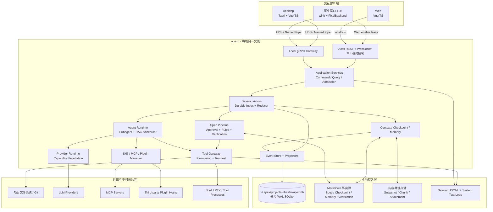
```mermaid
flowchart TB
    subgraph Clients[交互客户端]
        TUI[原生窗口 TUI\nwinit + PixelBackend]
        Desktop[Desktop\nTauri + Vue/TS]
        Web[Web\nVue/TS]
    end

    subgraph Daemon[apexd · 每项目一实例]
        IPC[Local gRPC Gateway]
        HTTP[Actix REST + WebSocket\nTUI 租约控制]
        App[Application Services\nCommand / Query / Admission]
        Session[Session Actors\nDurable Inbox + Reducer]
        Spec[Spec Pipeline\nApproval + Rules + Verification]
        Agent[Agent Runtime\nSubagent + DAG Scheduler]
        Context[Context / Checkpoint / Memory]
        Tool[Tool Gateway\nPermission + Terminal]
        Extension[Skill / MCP / Plugin Manager]
        Provider[Provider Runtime\nCapability Negotiation]
        Projection[Event Store + Projectors]
    end

    subgraph Durable[本地持久层]
        DB[(~/.apex/projects/&lt;hash&gt;/apex.db\n分片 WAL SQLite)]
        Audit[Markdown 事实源\nSpec / Checkpoint / Memory / Verification]
        CAS[内容寻址存储\nSnapshot / Chunk / Attachment]
        Logs[Session JSONL + System Text Logs]
    end

    subgraph External[外部与不可信边界]
        Project[项目文件系统 / Git]
        LLM[LLM Providers]
        MCP[MCP Servers]
        PluginHost[Third-party Plugin Hosts]
        Process[Shell / PTY / Tool Processes]
    end

    TUI -->|UDS / Named Pipe| IPC
    Desktop -->|UDS / Named Pipe| IPC
    Web -->|localhost| HTTP
    TUI -.->|Web enable lease| HTTP
    IPC --> App
    HTTP --> App
    App --> Session
    Session --> Spec
    Session --> Agent
    Session --> Context
    Agent --> Tool
    Agent --> Provider
    Agent --> Extension
    Spec --> Tool
    Context --> Projection
    Session --> Projection
    Projection --> DB
    Spec <--> Audit
    Context <--> Audit
    Context <--> CAS
    Tool --> Project
    Tool --> Process
    Provider --> LLM
    Extension --> MCP
    Extension --> PluginHost
    App --> Logs
    Tool --> Logs
```

箭头表示命令或数据流。客户端不能绕过 Application Services 直接访问数据库、项目文件或 Provider。

### 3. 部署架构

客户端以自包含原生应用交付（`RQ-116`）。**窗口宿主进程**是 `apexd` 的生命周期所有者：双击图标即拉起窗口，窗口再拉起本项目 daemon；关闭窗口即停止该项目服务（`RQ-119`）。同一用户可并存多个项目窗口，各自独立 daemon 与独立分片数据（`RQ-007`、`RQ-120`）。

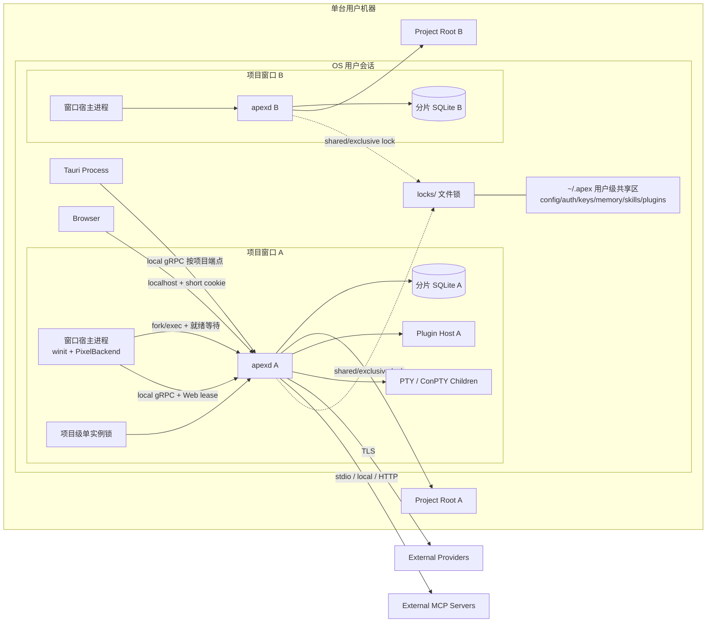
```mermaid
flowchart LR
    subgraph UserMachine[单台用户机器]
        subgraph UserSession[OS 用户会话]
            Shared[~/.apex 用户级共享区\nconfig/auth/keys/memory/skills/plugins]
            Locks[locks/ 文件锁]
            subgraph WinA[项目窗口 A]
                HostA[窗口宿主进程\nwinit + PixelBackend]
                LockA[项目级单实例锁]
                DaemonA[apexd A]
                DbA[(分片 SQLite A)]
                HostPluginA[Plugin Host A]
                PtyA[PTY / ConPTY Children]
            end
            subgraph WinB[项目窗口 B]
                HostB[窗口宿主进程]
                DaemonB[apexd B]
                DbB[(分片 SQLite B)]
            end
            Desktop[Tauri Process]
            Browser[Browser]
        end
        RootA[Project Root A]
        RootB[Project Root B]
    end
    Providers[External Providers]
    Mcps[External MCP Servers]

    HostA -->|fork/exec + 就绪等待| DaemonA
    LockA --> DaemonA
    HostA -->|local gRPC + Web lease| DaemonA
    Desktop -->|local gRPC 按项目端点| DaemonA
    Browser -->|localhost + short cookie| DaemonA
    DaemonA --> DbA
    DaemonA --> RootA
    DaemonA --> HostPluginA
    DaemonA --> PtyA
    DaemonA -->|TLS| Providers
    DaemonA -->|stdio / local / HTTP| Mcps
    HostB --> DaemonB
    DaemonB --> DbB
    DaemonB --> RootB
    DaemonA -.->|shared/exclusive lock| Locks
    DaemonB -.->|shared/exclusive lock| Locks
    Locks --- Shared
```

- 项目分片键 `<project-hash>` 由项目根路径 realpath 归一化后取 BLAKE3 前缀派生（`RQ-121`）。
- Unix gRPC 端点位于 `~/.apex/projects/<project-hash>/runtime/apexd.sock`，权限仅当前用户；受 `sun_path` 长度限制时回退到 `/tmp/apex-<user>-<project-hash>.sock`。
- Windows 使用 `\\.\pipe\apex-<user-sid-hash>-<project-hash>`，ACL 只允许当前用户与必要的系统主体。
- 每个项目 daemon 各自持有一个 Web 监听端口，由 OS 随机分配并绑定 `127.0.0.1` 与 `::1`；未持有 TUI Web 租约时无监听 socket。窗口内提供"打开 Web"入口直接生成带令牌的 URL，用户无需记忆端口。
- 用户级共享资源（凭据、全局 Memory、Skills、Plugin、签名密钥、并发配额）的跨 daemon 写入经 `~/.apex/locks/` 文件锁串行化（`RQ-122`）。
- `apexd` 通过 OS 用户身份、端点 ACL、客户端握手 nonce 和协议版本共同验证本地客户端；窗口宿主与其 daemon 之间额外校验拉起时传递的一次性握手令牌。

#### 3.1 窗口宿主与 daemon 的生命周期耦合

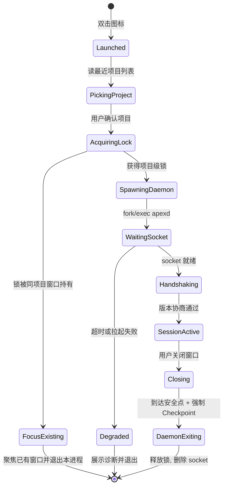
```mermaid
stateDiagram-v2
    [*] --> Launched: 双击图标
    Launched --> PickingProject: 读最近项目列表
    PickingProject --> AcquiringLock: 用户确认项目
    AcquiringLock --> FocusExisting: 锁被同项目窗口持有
    FocusExisting --> [*]: 聚焦已有窗口并退出本进程
    AcquiringLock --> SpawningDaemon: 获得项目级锁
    SpawningDaemon --> WaitingSocket: fork/exec apexd
    WaitingSocket --> Handshaking: socket 就绪
    WaitingSocket --> Degraded: 超时或拉起失败
    Degraded --> [*]: 展示诊断并退出
    Handshaking --> SessionActive: 版本协商通过
    SessionActive --> Closing: 用户关闭窗口
    Closing --> DaemonExiting: 到达安全点 + 强制 Checkpoint
    DaemonExiting --> [*]: 释放锁, 删除 socket
```

关窗路径的硬约束：必须到达安全点并写入 Checkpoint 后才允许 daemon 退出；未完成的 Run/DAG 进入 `Paused` 并标记可恢复中断，下次打开同项目时提示续跑（`RQ-119`、`AC-022`）。drain 超时后强制退出，未知副作用节点在下次启动时按恢复流程分类。

### 4. 核心运行时序

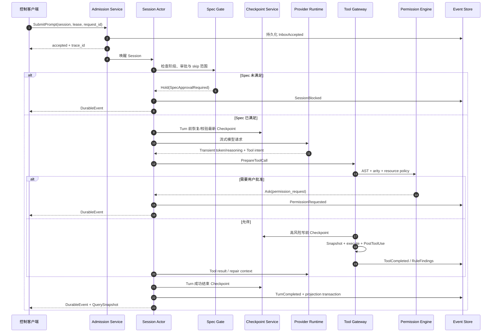
```mermaid
sequenceDiagram
    autonumber
    participant C as 控制客户端
    participant A as Admission Service
    participant S as Session Actor
    participant SP as Spec Gate
    participant CP as Checkpoint Service
    participant P as Provider Runtime
    participant TG as Tool Gateway
    participant PE as Permission Engine
    participant ES as Event Store

    C->>A: SubmitPrompt(session, lease, request_id)
    A->>ES: 持久化 InboxAccepted
    A-->>C: accepted + trace_id
    A->>S: 唤醒 Session
    S->>SP: 检查阶段、审批与 skip 范围
    alt Spec 未满足
        SP-->>S: Hold(SpecApprovalRequired)
        S->>ES: SessionBlocked
        S-->>C: DurableEvent
    else Spec 已满足
        S->>CP: Turn 前恢复/校验最新 Checkpoint
        S->>P: 流式模型请求
        P-->>S: Transient token/reasoning + Tool intent
        S->>TG: PrepareToolCall
        TG->>PE: AST + arity + resource policy
        alt 需要用户批准
            PE-->>S: Ask(permission_request)
            S->>ES: PermissionRequested
            S-->>C: DurableEvent
        else 允许
            TG->>CP: 高风险写前 Checkpoint
            TG->>TG: Snapshot + execute + PostToolUse
            TG->>ES: ToolCompleted / RuleFindings
            S->>P: Tool result / repair context
        end
        S->>CP: Turn 成功结束 Checkpoint
        S->>ES: TurnCompleted + projection transaction
        S-->>C: DurableEvent + QuerySnapshot
    end
```

流式 token 和工具进度可以丢弃并重连；审批、Tool 结果、Checkpoint、阶段变化和阻塞原因必须持久化后才对客户端确认。

### 5. 核心组件职责

| 组件 | 唯一职责 | 不得承担 |
|---|---|---|
| Application Services | 命令校验、幂等、授权上下文、查询编排 | Session 长事务、文件写入 |
| Session Actor | 单会话串行状态机、inbox 提升、安全点 | 直接解析 Shell、直接操作 SQLite |
| Event Store/Projector | 追加领域事实、更新投影、序列游标 | 记录详细诊断日志 |
| Spec Pipeline | 阶段、审批、失效、skip、验证门 | 执行任意 Tool |
| Agent Runtime | Provider 循环、Tool 调用编排、Subagent 生命周期 | 绕过 Permission/Claim |
| DAG Scheduler | Ready Queue、依赖、限流、Claim 与汇聚 | 修改 tasks.md 或静默扩权 |
| Tool Gateway | 所有副作用准备、权限、Snapshot、执行、校验 | 使用 LLM 决定权限 |
| Context/Checkpoint | Context Epoch、阈值、无损恢复清单 | 把摘要当作唯一原文 |
| Memory | Markdown 读写、FTS 索引、召回解释 | 存储 API Key |
| Extension Manager | Skill/MCP/Plugin 发现、信任、生命周期 | 默认启动外部服务 |
| Provider Runtime | 统一消息、能力协商、流、重试/故障转移 | 暴露厂商 DTO 给领域层 |

### 6. 数据与一致性边界

#### 6.1 两个事实域

- 文件事实域：Spec、Verification、Checkpoint Manifest/Chunk、Memory、Snapshot/CAS。
- SQLite 事实域：会话运行事件、投影、审批、权限请求、Tool/DAG 状态、扩展索引与 FTS。

它们不是跨介质 ACID 事务。跨域写入采用 `Prepare → 原子文件替换 → SQLite Commit → Reconcile Marker` 协议；崩溃后由 reconciliation job 根据内容哈希、generation 和 event id 收敛。任何无法证明顺序的状态必须进入 `Blocked::ReconciliationConflict`，不得猜测最后写入者。

#### 6.2 事件可见性

每个会话拥有单调 `session_seq`。客户端先获取 Query Snapshot 的 `as_of_seq`，再订阅 `since_seq=as_of_seq+1`；服务端在保留窗口内补发 Durable Event，窗口外返回 `RESYNC_REQUIRED`。Transient Event 只带 `trace_id`/`span_id`，没有重放保证。

### 7. 信任边界

| 边界 | 默认信任 | 控制 |
|---|---|---|
| `apexd` 核心与官方签名进程内 Plugin | 高 | 签名、版本/ABI 校验、最小内部 API |
| 本地 TUI/Desktop | 当前 OS 用户内受信客户端 | 端点 ACL、握手、版本协商、控制租约 |
| localhost Web/浏览器扩展 | 不因 localhost 自动信任 | 一次性令牌、短 Cookie、Origin、CSRF、CSP |
| 项目文件与仓库指令 | 未确认前不信任 | Project Trust Gate，确认前禁止读取 |
| Skill/MCP/第三方 Plugin | 默认不信任 | 哈希/签名、显式启用、Tool Gateway、进程隔离 |
| Provider 与远端端点 | 外部数据处理者 | TLS、脱敏、能力/数据策略、Secret Firewall |
| Shell/Tool 子进程 | 潜在副作用执行者 | AST 权限、路径 Claim、环境清洗、可选 OS 沙箱 |

### 8. 异常与恢复总流程

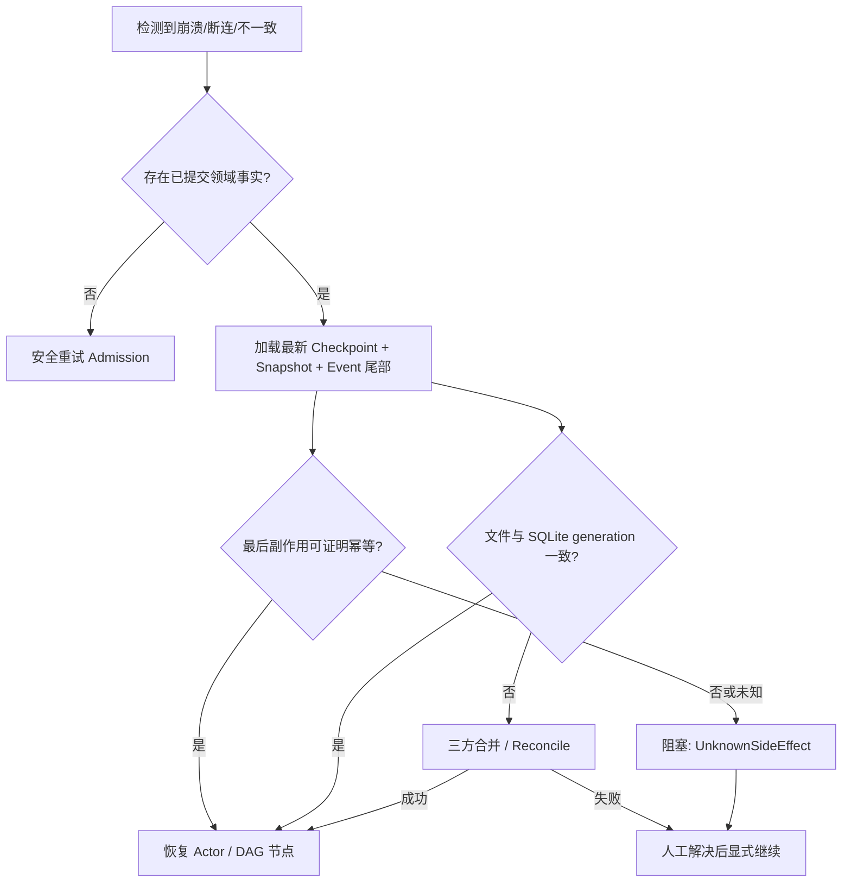
```mermaid
flowchart TD
    F[检测到崩溃/断连/不一致] --> Q{存在已提交领域事实?}
    Q -->|否| Retry[安全重试 Admission]
    Q -->|是| CP[加载最新 Checkpoint + Snapshot + Event 尾部]
    CP --> X{最后副作用可证明幂等?}
    X -->|是| Resume[恢复 Actor / DAG 节点]
    X -->|否或未知| Block[阻塞: UnknownSideEffect]
    CP --> R{文件与 SQLite generation 一致?}
    R -->|是| Resume
    R -->|否| Merge[三方合并 / Reconcile]
    Merge -->|成功| Resume
    Merge -->|失败| Manual[人工解决后显式继续]
    Block --> Manual
```

### 9. 关键取舍摘要

| 决策 | 选择 | 获得 | 代价 |
|---|---|---|---|
| ADR-001 | 每用户单 `apexd` | 三端一致、集中调度与资源复用 | daemon 成为关键故障域，需要强恢复 |
| ADR-002 | Markdown + SQLite 分域事实源 | 可审计内容与高效运行态兼得 | 需要跨域 reconciliation，不能虚构全局事务 |
| ADR-003 | 本地 gRPC + localhost REST/WS | 原生端强类型、Web 易用 | 两套传输适配与契约测试 |
| ADR-006 | 纯静态权限 | 零 Token、确定、可审计 | 对复杂动态命令采取保守 ask/deny |
| ADR-007 | Checkpoint-first | 有损上下文前可恢复 | I/O、存储与实现复杂度增加 |
| ADR-008 | 内容寻址 Snapshot | 不污染 Git、可去重、跨 VCS | 自建捕获/恢复与 GC |
| ADR-009 | 共享工作区 + Claim | 并发效率高、用户看到实时结果 | 路径规范化和冲突调度复杂 |
| ADR-012 | 第三方 Plugin 独立进程 | 限制崩溃/内存破坏半径 | IPC 和版本适配成本 |

完整理由、备选方案和重审条件见 [ADR 注册表](adr/README.md)。

### 10. 架构不变量

1. 没有经过 Spec Gate、Permission Engine、Write Claim 和必要 Checkpoint 的写操作，不得进入执行器。
2. 客户端显示状态必须能追溯到 Query Snapshot、Durable Event 或明确标记的 Transient Event。
3. 任何未知副作用、合并失败、解析失败或 Schema 不兼容都必须保守阻塞，不能静默“修复”。
4. API Key 等 Secret 在 Provider Adapter 边界内短暂使用，禁止进入通用消息、事件、日志和 Markdown。
5. 同一 Major 的追加式兼容约束优先于清理旧字段的便利性。
6. 项目分片边界不可穿越：某项目 daemon 不得读写其他项目的分片目录、socket 或数据库。
7. 用户级共享资源的每次写入都必须持有对应文件锁；无锁写入视为缺陷。
8. 窗口关闭前必须到达安全点并落 Checkpoint；不允许以丢弃未落盘状态的方式退出 daemon。

---

<!-- 源文件：docs/03-workspace-and-crates.md -->

## 章 4 · Cargo Workspace 与工程结构

### 1. 设计目标

目标 Workspace 从第一天建立单向依赖和能力边界，不延续旧工程结构。crate 划分围绕“可独立验证的契约边界”，而不是为每个数据类型创建 crate。

### 2. 目标目录

```text
Apex/
├── Cargo.toml                  # workspace members、统一依赖与 lint
├── Cargo.lock                  # 应用型 workspace 必须提交
├── rust-toolchain.toml
├── deny.toml                   # license/source/advisory 策略
├── README.md
├── docs/
├── proto/
│   └── apex/v1/*.proto         # Wire 唯一来源；生成 Rust/TS 客户端
├── schemas/
│   ├── workflow-v1.schema.json
│   ├── skill-frontmatter-v1.schema.json
│   └── markdown-frontmatter-v1.schema.json
├── apps/
│   ├── apexd/                  # daemon 组合根；每个项目窗口一个实例
│   ├── apex-tui/               # package；产物名 apex（自包含原生窗口应用）
│   │   └── src/
│   │       ├── window/         # winit 事件循环、DPI、字体栈、IME、剪贴板
│   │       ├── pixel_backend/  # softbuffer 帧缓冲 + ratatui Backend 适配 + 像素级 diff
│   │       ├── project_picker/ # 启动时项目选择器
│   │       └── daemon_launcher/# 拉起 apexd、等待端点就绪、崩溃降级
│   ├── apex-plugin-host/       # 第三方原生插件隔离宿主
│   ├── apex-updater/           # 安全点安装/Windows 替换辅助进程
│   └── apex-desktop/
│       └── src-tauri/          # Tauri Rust 壳
├── ui/
│   ├── package.json
│   ├── pnpm-lock.yaml
│   ├── src/app/                # 共享 Vue 应用与 Feature slices
│   ├── src/platform/           # Desktop/Web Platform Adapter
│   ├── src/i18n/
│   └── tests/
├── crates/
│   ├── apex-domain/
│   ├── apex-ports/
│   ├── apex-protocol/
│   ├── apex-platform/
│   ├── apex-application/
│   ├── apex-session-runtime/
│   ├── apex-spec/
│   ├── apex-rules/
│   ├── apex-agent-runtime/
│   ├── apex-dag/
│   ├── apex-context/
│   ├── apex-replay/
│   ├── apex-command-ast/
│   ├── apex-permission/
│   ├── apex-tool-gateway/
│   ├── apex-terminal/
│   ├── apex-storage/
│   ├── apex-file-facts/
│   ├── apex-snapshot/
│   ├── apex-observability/
│   ├── apex-update/
│   ├── apex-provider-core/
│   ├── apex-provider-anthropic/
│   ├── apex-provider-openai/
│   ├── apex-provider-deepseek/
│   ├── apex-provider-kimi/
│   ├── apex-provider-openai-compatible/
│   ├── apex-multimodal/
│   ├── apex-skill/
│   ├── apex-mcp/
│   ├── apex-plugin-api/
│   ├── apex-plugin-runtime/
│   ├── apex-grpc/
│   ├── apex-web/
│   ├── apex-client-sdk/
│   ├── apex-test-support/
│   └── apex-macros/            # proc-macro：Getters/Setters/Builder/Data 等封装访问器宏
└── xtask/                      # 代码生成、契约/文档/发布验证
```

`apex-web` 嵌入由 `ui` 的 web entry 产生的带哈希静态资源；Tauri 使用同一 `ui/src/app`，但注入本地 gRPC Platform Adapter。这样共享功能代码，不共享不合适的认证/传输实现。

### 3. 依赖层级

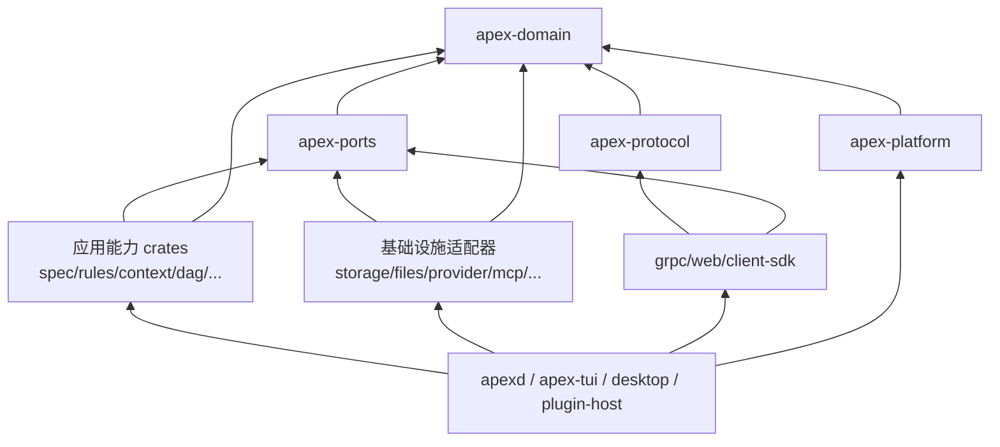
```mermaid
flowchart BT
    Domain[apex-domain]
    Ports[apex-ports]
    Protocol[apex-protocol]
    Platform[apex-platform]
    Cap[应用能力 crates\nspec/rules/context/dag/...]
    Adapters[基础设施适配器\nstorage/files/provider/mcp/...]
    Transport[grpc/web/client-sdk]
    Apps[apexd / apex-tui / desktop / plugin-host]

    Ports --> Domain
    Protocol --> Domain
    Platform --> Domain
    Cap --> Ports
    Cap --> Domain
    Adapters --> Ports
    Adapters --> Domain
    Transport --> Protocol
    Transport --> Ports
    Apps --> Cap
    Apps --> Adapters
    Apps --> Transport
    Apps --> Platform
```

硬规则：

- `apex-domain` 不依赖 Tokio、SQLx、Tonic、Actix、Tauri 或 Provider SDK。
- `apex-ports` 只定义 Port，不包含 SQLite/HTTP/文件系统具体类型。
- 应用能力 crate 不依赖具体 Adapter；`apexd` 是依赖注入与生命周期组合根。
- `apex-protocol` 负责领域类型与 Protobuf DTO 的显式转换；领域层不得导入生成的 Protobuf 类型。
- Provider、MCP、Plugin 和 Shell 类型不得越过自己的 Adapter 泄漏到领域事件。
- 客户端不得依赖服务端应用 crate；只依赖 `apex-client-sdk`/生成的协议类型。

### 4. crate 职责

#### 4.1 Foundation

| crate | 职责 | 关键限制 |
|---|---|---|
| `apex-domain` | ID、值对象、聚合状态、领域事件、错误分类 | 纯 Rust；序列化格式与存储无关 |
| `apex-ports` | 应用层 Trait、事务/幂等/时间/ID Port | 不提供具体实现 |
| `apex-protocol` | Protobuf 生成、版本协商、DTO 转换、事件 Wire 信封 | 未知字段不得丢失后再写回 |
| `apex-platform` | OS 目录、用户身份、单实例锁、端点/ACL、进程树、文件系统语义 | 平台条件编译集中；不得含业务规则 |
| `apex-macros` | `Getters`/`Setters`/`Builder`/`Data`/`GettersExt` 等封装访问器 derive 宏 | proc-macro crate；零运行时逻辑；不依赖领域类型 |

#### 4.2 Application/runtime

| crate | 职责 | 关键限制 |
|---|---|---|
| `apex-application` | Command/Query Handler、Admission、幂等、授权上下文 | 不执行 Tool，不直接读写 DB |
| `apex-session-runtime` | 每 Session Actor、durable inbox、安全点、Turn 生命周期 | 单 Session 串行；不内嵌 Shell/Provider 细节 |
| `apex-spec` | 阶段机、审批、失效传播、skip scope、Markdown 模型 | 编码门只基于持久事实 |
| `apex-rules` | 语言规则包、PostToolUse 门、诊断聚合、修复预算 | 不自行扩大写路径或权限 |
| `apex-agent-runtime` | Agent Loop、模型消息转换、Tool/Skill/Subagent 编排 | 通过 Port 调用副作用 |
| `apex-dag` | DAG IR、Ready Queue、限流、路径 Claim、汇聚与暂停恢复 | 无任意脚本执行器 |
| `apex-context` | Context Epoch、预算、snip/prune/摘要、Checkpoint 与 Memory 编排 | 原始意图不可只存在摘要中 |
| `apex-replay` | 状态重放、再执行计划、补偿式回滚协调 | 历史事件只追加不删除 |

#### 4.3 Security/execution

| crate | 职责 | 关键限制 |
|---|---|---|
| `apex-command-ast` | POSIX/PowerShell/cmd 解析、arity 语义 IR、资源提取 | 解析失败显式 Unknown，不猜测 |
| `apex-permission` | 模式、白名单、硬禁止、授权生命周期、静态决策证据 | 禁止 Provider/LLM 依赖 |
| `apex-tool-gateway` | Tool 注册、准备、权限、Snapshot、执行、PostToolUse、审计 | 所有副作用的唯一入口 |
| `apex-terminal` | PTY/ConPTY、一次性命令、隔离通道、输出背压与进程树清理 | 默认清洗 Secret 环境；不做权限决策 |

#### 4.4 Persistence/observability

| crate | 职责 | 关键限制 |
|---|---|---|
| `apex-storage` | SQLite 事件、投影、普通表、FTS、迁移、归档挂载 | 不把日志当事件；支持同 Major 未知数据保留 |
| `apex-file-facts` | Markdown/CAS 原子写、watch、generation、三方合并、镜像 | 不把 SQLite 投影反向覆盖人工变更 |
| `apex-snapshot` | 内容寻址捕获、Manifest、恢复、差异与 GC | 不执行 Git commit/branch |
| `apex-observability` | 会话 JSONL、系统文本日志、hash chain、签名、脱敏、诊断包 | Secret Firewall 在 sink 前执行 |
| `apex-update` | 更新清单、签名校验、通道策略、安装计划、回滚协调 | 不直接决定何时越过运行安全点 |

#### 4.5 Provider/multimodal

| crate | 职责 | 关键限制 |
|---|---|---|
| `apex-provider-core` | 统一模型消息、流事件、能力、错误、重试/故障转移契约 | 保留扩展槽，不假装所有厂商同构 |
| `apex-provider-anthropic` | Anthropic 专属 Tool/reasoning/cache/stream 映射 | 厂商 DTO 不外泄 |
| `apex-provider-openai` | OpenAI Responses/Realtime 等专属映射 | 同上 |
| `apex-provider-deepseek` | DeepSeek 专属推理与协议映射 | 同上 |
| `apex-provider-kimi` | Kimi 专属上下文、文件/推理映射 | 同上 |
| `apex-provider-openai-compatible` | 通义、智谱和自定义兼容端点 | capability 必须探测/配置，不能仅凭名称假设 |
| `apex-multimodal` | 附件导入、MIME/大小校验、转码、音频 session、内容引用 | 不保存 Secret，不支持实时视频 |

#### 4.6 Extensions

| crate | 职责 | 关键限制 |
|---|---|---|
| `apex-skill` | 多来源扫描、frontmatter、阶段绑定、hash/signature trust | Skill 脚本经 Tool Gateway |
| `apex-mcp` | 配置扫描、规范化、启停覆盖、transport/OAuth/进程监督 | 发现不等于启动 |
| `apex-plugin-api` | 稳定 C ABI、版本/能力描述、FFI 安全结构 | 不暴露 Rust ABI 类型 |
| `apex-plugin-runtime` | 官方签名校验、in-process loader、Plugin Host RPC/监督 | 第三方永不进 `apexd` 地址空间 |

#### 4.7 Interfaces/apps

| crate/app | 职责 |
|---|---|
| `apex-grpc` | 本地 gRPC server、认证 interceptor、流控与服务实现 |
| `apex-web` | Actix REST/WS、Web 租约、Cookie/Origin/CSRF、静态资源 |
| `apex-client-sdk` | TUI/Desktop 共享连接、重连、快照+事件合并、版本协商 |
| `apps/apexd` | 配置加载、依赖注入、迁移、后台任务、优雅关闭；由窗口宿主拉起，服务单个项目 |
| `apps/apex-tui` | 自包含原生窗口宿主：窗口与事件循环、PixelBackend 渲染、项目选择器、daemon 拉起与生命周期监管；TUI 命令面板、共享终端、Spec/权限/DAG/Memory/日志 UI；不含音频 |
| `apps/apex-desktop` | Tauri 能力与系统集成，托管共享 Vue 应用 |
| `apps/apex-plugin-host` | 加载一个/一组第三方 Plugin，提供受限 Host API |
| `apps/apex-updater` | daemon 退出后原子替换制品、执行平台安装步骤并回报健康状态 |
| `apex-test-support` | 假时钟、内存 Port、fixture、故障注入、跨端契约 harness |

### 5. Feature 与平台策略

- 完整发行物默认编译所有官方 Provider Adapter、FTS5、中文 jieba、TUI、Web 和 Plugin Host 支持。
- `cfg(unix)`/`cfg(windows)` 只允许出现在 `apex-platform`、`apex-terminal`、`apex-tui` 的 `window/`、Plugin loader 和极少数集成层；业务 crate 使用 Port。窗口层的平台差异（字体栈、DPI、IME、剪贴板、文件对话框）集中在 `apex-tui::window`，不外泄。
- FTS tokenizer 在运行时按项目语言策略选择，而不是通过互斥编译 feature。
- `unsafe` 默认 workspace deny；仅 `apex-platform`/`apex-plugin-api`/loader 可局部 allow，并要求 `SAFETY` 不变量与 Miri/平台测试。
- Web UI 资源与 `apexd` 版本绑定；桌面 UI 与 daemon 通过协议版本协商，不假设二者总是同版本。

### 6. Workspace 统一质量配置

```toml
[workspace.lints.rust]
unsafe_code = "deny"
missing_docs = "warn"

[workspace.lints.clippy]
all = "deny"
pedantic = "warn"
unwrap_used = "deny"
expect_used = "deny"

[profile.release]
lto = "thin"
codegen-units = 1
panic = "abort"
```

实际 `Cargo.toml` 在实现阶段生成；上例表达策略而非当前可执行配置。所有依赖集中于 `[workspace.dependencies]`，新增依赖必须通过 `cargo deny`、`cargo audit`、许可证和维护性评审。

原生窗口栈新增的依赖类别（窗口与事件循环、像素缓冲呈现、字体栅格化）只允许被 `apps/apex-tui` 依赖，不得进入任何 `crates/` 下的库；`apex-domain`/`apex-ports` 的纯净性约束不变。

#### 6.1 封装与访问器强制

`rules/coding-standard.md §1.6b` 规定：所有 `struct` 字段私有，外部访问经方法；访问器由 `crates/apex-macros` 的 derive 宏生成，禁止手写样板。CI 通过自定义检查（扫描 `src/` 中残留的 `pub` 字段，排除宏生成代码与 `#[allow(apex_pub_field)]` 显式豁免）拦截违规提交。


### 7. 构建与生成顺序

1. `xtask codegen`：从 `proto/` 和 `schemas/` 生成 Rust/TS 类型并校验工作区干净。
2. 构建共享 Vue 应用的 web/desktop entry。
3. 构建 Rust libraries、`apexd`、`apex-plugin-host`、`apex-updater`、`apex` TUI。
4. 将 web assets 嵌入 `apex-web`，打包 Tauri。
5. 执行单元、属性、集成、协议兼容、跨端 E2E 和平台矩阵测试。
6. 生成 SBOM、签名、更新清单和可复现构建证据。

### 8. 禁止的依赖模式

- `apex-domain -> sqlx/tonic/actix/tauri/provider SDK`。
- `apex-spec -> apex-tool-gateway` 的直接执行调用；只能返回 Gate Decision。
- `apex-permission -> apex-provider-core`。
- `apex-web -> apex-storage` 或 UI 直接 SQL。
- Provider Adapter 相互依赖。
- Client SDK 引用 daemon 内部事件实现而非 Wire 契约。
- 为迁移方便保留第二套 Session Runtime、事件枚举或权限引擎。

---

<!-- 源文件：docs/04-domain-model.md -->

## 章 5 · 领域模型与事件语义

通用缩写和跨主题名词见[项目术语与缩写表](#章-1-项目术语与缩写表)；本文件仍是领域 ID、状态与事件语义的唯一事实源。

### 1. 术语

| 术语 | 定义 |
|---|---|
| Project | 一个已注册且具有信任状态、策略和主要根目录的项目。 |
| Workspace | 一次执行可见的一个或多个 Project Root 集合；单根也表示为 Workspace。 |
| Audit Root | 多根 Workspace 中承载 Spec/Verification 镜像的用户指定根。 |
| Session | 用户可长期恢复、归档和跨端查看的对话/工作容器。 |
| Run | Session 内一次从输入 Admission 到停止/完成的执行尝试。 |
| Turn | 一个被提升的用户输入及其 Agent 响应边界。 |
| Agent Execution | 一个父/子 Agent 的具体执行实例。 |
| DAG Run / Node Run | 已批准任务图及其中节点的一次运行。 |
| Durable Event | 改变权威状态、可按序重放的领域事实。 |
| Transient Event | token、进度、音频电平等短暂 UI 信号，不参与 Reducer。 |

### 2. ID 与值对象

业务 ID 使用 UUIDv7，便于本地生成与时间有序索引；内容地址使用 `BLAKE3-256`。所有 ID 在 Rust 中必须是 newtype，禁止用裸 `String` 混用。

> 字段可见性约定：本文中的 struct 示意（如 §7 `EventEnvelope`）以私有字段书写，实现时经 `crates/apex-macros` 的 derive 宏生成访问器，遵循 `rules/coding-standard.md §1.6b`。newtype ID 的内部值可用 `pub(crate)` 或显式 `inner()` 访问器，具体见该节豁免规则。

| 类型 | 含义 |
|---|---|
| `ProjectId`、`WorkspaceId`、`RootId` | 项目、执行 Workspace 与根目录 |
| `SessionId`、`RunId`、`TurnId` | 会话、运行与 Turn |
| `AgentExecutionId`、`DagRunId`、`NodeRunId`、`TaskId` | Agent/DAG/任务执行 |
| `ToolCallId`、`TerminalId`、`PermissionRequestId` | Tool、终端与权限 |
| `SpecId`、`ApprovalId`、`SkipGrantId` | Spec 与审批 |
| `CheckpointId`、`SnapshotId`、`ArtifactId`、`MemoryId` | 文件事实与内容对象 |
| `ProviderProfileId`、`SkillId`、`McpServerId`、`PluginId` | 可配置能力 |
| `EventId`、`TraceId`、`SpanId` | 审计关联；TraceId 遵循 W3C 128-bit 语义 |
| `ContentHash` | `blake3:<64-lower-hex>`，覆盖规范化字节 |
| `FeatureKey` | 路径安全的 kebab-case 标识，映射 `specs/<feature>/` |
| `Generation` | 文件事实的单调逻辑版本，不等于 mtime |

### 3. 聚合与所有权

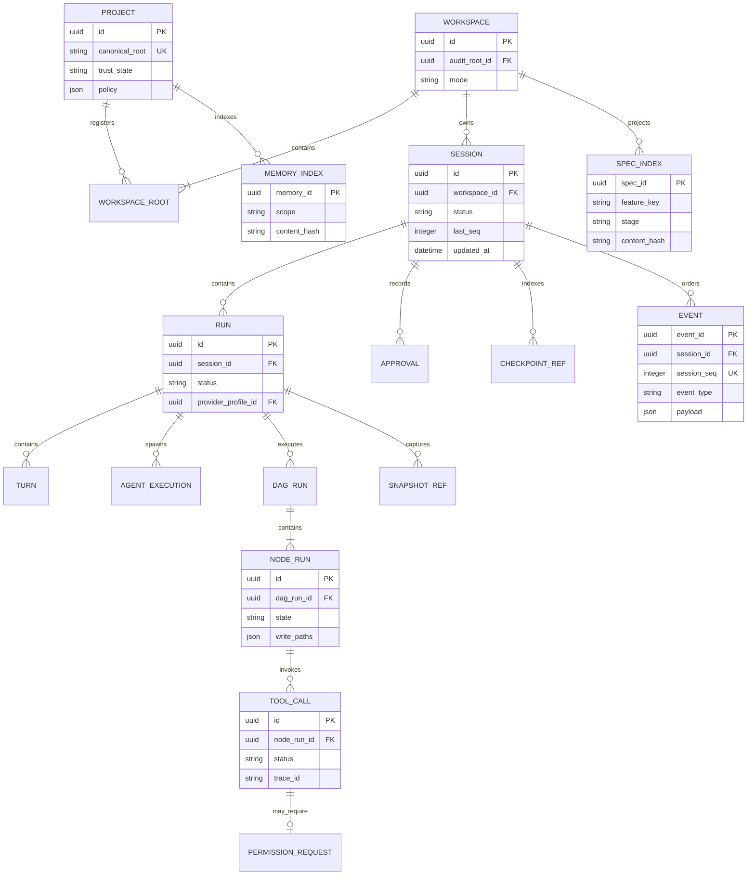
```mermaid
erDiagram
    PROJECT ||--o{ WORKSPACE_ROOT : registers
    WORKSPACE ||--|{ WORKSPACE_ROOT : contains
    WORKSPACE ||--o{ SESSION : owns
    SESSION ||--o{ RUN : contains
    RUN ||--o{ TURN : contains
    RUN ||--o{ AGENT_EXECUTION : spawns
    RUN ||--o{ DAG_RUN : executes
    DAG_RUN ||--|{ NODE_RUN : contains
    NODE_RUN ||--o{ TOOL_CALL : invokes
    TOOL_CALL ||--o| PERMISSION_REQUEST : may_require
    SESSION ||--o{ APPROVAL : records
    SESSION ||--o{ CHECKPOINT_REF : indexes
    RUN ||--o{ SNAPSHOT_REF : captures
    WORKSPACE ||--o{ SPEC_INDEX : projects
    PROJECT ||--o{ MEMORY_INDEX : indexes
    SESSION ||--o{ EVENT : orders

    PROJECT {
        uuid id PK
        string canonical_root UK
        string trust_state
        json policy
    }
    WORKSPACE {
        uuid id PK
        uuid audit_root_id FK
        string mode
    }
    SESSION {
        uuid id PK
        uuid workspace_id FK
        string status
        integer last_seq
        datetime updated_at
    }
    RUN {
        uuid id PK
        uuid session_id FK
        string status
        uuid provider_profile_id FK
    }
    EVENT {
        uuid event_id PK
        uuid session_id FK
        integer session_seq UK
        string event_type
        json payload
    }
    NODE_RUN {
        uuid id PK
        uuid dag_run_id FK
        string state
        json write_paths
    }
    TOOL_CALL {
        uuid id PK
        uuid node_run_id FK
        string status
        string trace_id
    }
    SPEC_INDEX {
        uuid spec_id PK
        string feature_key
        string stage
        string content_hash
    }
    MEMORY_INDEX {
        uuid memory_id PK
        string scope
        string content_hash
    }
```

SQLite 的具体表、索引和文件映射见 [07](#章-8-存储文件事实日志与归档)。ER 图表达领域所有权，不意味着所有字段都在单表内。

### 4. 权威状态枚举

以下名称是跨文档、事件与协议的唯一语义来源。数据库可以使用稳定小写字符串编码，Wire 使用同名枚举值；新增值只追加。

```rust
enum SessionStatus {
    Idle, Running, Pausing, Paused, Blocked,
    Completing, Completed, Failed, Archived,
}

enum RunStatus {
    Admitted, Running, WaitingForUser, Pausing, Paused,
    Blocked, Succeeded, Failed, Canceled,
}

enum SpecStage { Requirements, Design, Tasks, Coding, Verification }

enum StageStatus {
    Draft, AwaitingApproval, Approved, Invalidated,
    Skipped, InProgress, Verified,
}

enum NodeStatus {
    Pending, Ready, Claiming, Running, Waiting,
    Paused, Blocked, Succeeded, Failed,
    Compensating, Compensated, Canceled,
}

enum ToolCallStatus {
    Proposed, AwaitingPermission, Prepared, Running,
    Succeeded, Failed, Interrupted, UnknownSideEffect,
}

enum PermissionDecision { Allow, Ask, Deny }
enum PermissionMode { Plan, Ask, Allow }
enum GrantScope { Once, Run, Session, Project }

enum BlockReason {
    SpecApprovalRequired,
    SpecChanged,
    PermissionRequired,
    ProjectUntrusted,
    CommandParseUnknown,
    WriteClaimConflict,
    MergeConflict,
    ReconciliationConflict,
    UnknownSideEffect,
    ProviderUnavailable,
    CapabilityUnsupported,
    ManualPause,
    SchemaWriterTooOld,
}
```

`Blocked` 必须伴随 `BlockReason` 和可执行的恢复动作；不能只保存自由文本。

### 5. Session 状态机

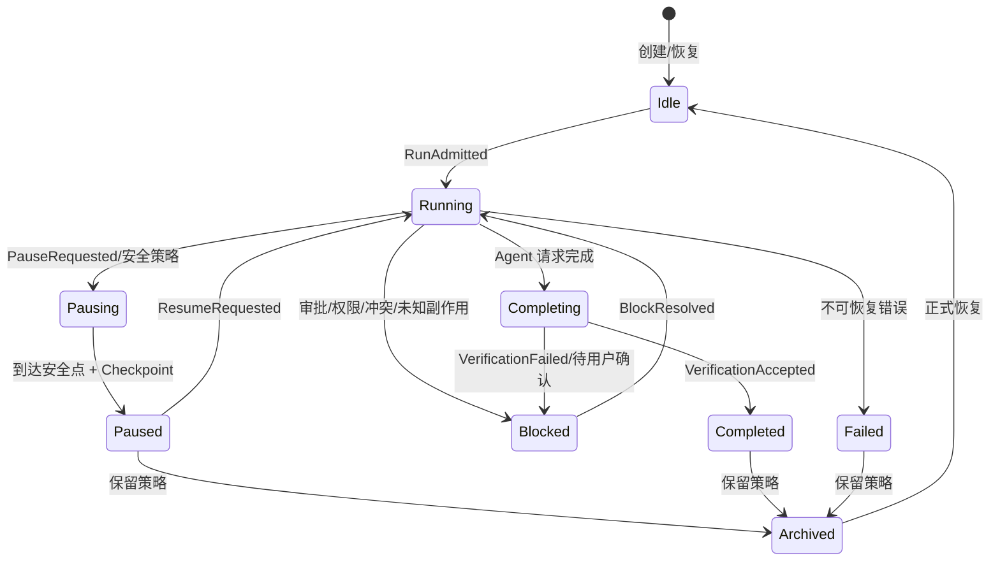
```mermaid
stateDiagram-v2
    [*] --> Idle: 创建/恢复
    Idle --> Running: RunAdmitted
    Running --> Pausing: PauseRequested/安全策略
    Pausing --> Paused: 到达安全点 + Checkpoint
    Running --> Blocked: 审批/权限/冲突/未知副作用
    Blocked --> Running: BlockResolved
    Paused --> Running: ResumeRequested
    Running --> Completing: Agent 请求完成
    Completing --> Completed: VerificationAccepted
    Completing --> Blocked: VerificationFailed/待用户确认
    Running --> Failed: 不可恢复错误
    Paused --> Archived: 保留策略
    Completed --> Archived: 保留策略
    Failed --> Archived: 保留策略
    Archived --> Idle: 正式恢复
```

安全点包括：Provider 请求之间、Tool 执行前后、DAG 节点边界、Checkpoint 成功提交后。正在进行的不可中断外部副作用不是安全点。

### 6. 消息分层

- `AgentMessage`：用户、Agent、Tool、系统说明、审批提示、附件引用等持久领域消息，可呈现给客户端。
- `ModelMessage`：Provider 请求的规范化线格式，由当前 Context Epoch 从 AgentMessage/Checkpoint/Memory/Tool Schema 派生。
- `ProviderFrame`：厂商流式增量、reasoning handle、audio frame、usage 等适配器内部或 Transient 数据。

禁止把厂商 continuation token、cache handle 或 raw SDK object 直接持久化为跨 Provider 的 `AgentMessage`。模型切换时，专属 reasoning metadata 只能降级为普通可见文本或明确丢弃，不能伪装兼容。

### 7. 事件信封

```rust
struct EventEnvelope {
    schema_version: u16,
    event_id: EventId,
    aggregate_kind: AggregateKind,
    aggregate_id: String,
    aggregate_version: u64,
    workspace_id: WorkspaceId,
    session_id: Option<SessionId>,
    session_seq: Option<u64>,
    event_type: String,          // 例 apex.tool.completed.v1
    occurred_at: OffsetDateTime,
    actor: ActorRef,
    trace_id: TraceId,
    span_id: SpanId,
    causation_event_id: Option<EventId>,
    correlation_id: Option<String>,
    writer_version: SemVer,
    payload_json: RawJson,
}
```

不变量：

- `event_id` 全局唯一；同 Session 的 `session_seq` 连续单调，不复用。
- 聚合使用 optimistic `aggregate_version`；冲突返回版本错误，不自动 last-write-wins。
- `payload_json` 保留未知字段原始语义；同一 Major 不回写破坏未知数据。
- 领域事件只记录状态重建所需事实，命令全文、模型全文和终端全文默认不进入事件。
- 文件日志通过 `event_id`/`trace_id` 关联，但不参与 Reducer。

### 8. 事件目录

事件类型采用 `apex.<domain>.<past-tense>.vN`。首版至少包含：

| 领域 | 事件 |
|---|---|
| Session/Run | `session.created`、`run.admitted`、`run.paused`、`run.blocked`、`run.completed` |
| Inbox/Turn | `inbox.accepted`、`turn.started`、`turn.completed`、`turn.interrupted` |
| Spec | `spec.changed`、`approval.granted`、`approval.invalidated`、`skip.granted`、`verification.accepted` |
| Agent/DAG | `agent.spawned`、`node.ready`、`node.started`、`node.blocked`、`node.succeeded`、`merge.failed` |
| Tool/Permission | `tool.proposed`、`permission.requested`、`permission.resolved`、`tool.completed`、`tool.unknown-side-effect` |
| Context | `checkpoint.committed`、`context.watermark-crossed`、`context.epoch-replaced`、`memory.recalled` |
| Snapshot/Replay | `snapshot.captured`、`replay.started`、`compensation.applied`、`replay.completed` |
| Extension | `skill.trust-invalidated`、`mcp.enabled`、`plugin.crashed` |
| Lease | `control.acquired`、`control.taken-over`、`web-lease.acquired`、`web-lease.expired` |

完整 payload 在实现阶段由 `proto/` 与 JSON Schema 生成并进行金丝雀兼容测试；不得在主题文档中创建同名不同义事件。

### 9. 审批与授权值对象

`ApprovalRecord` 必须绑定：审批对象类型、对象 ID、内容哈希、阶段、scope、操作者、时间、trace、策略版本。只要内容哈希或上游依赖哈希改变，审批即不可继续使用。

`PermissionGrant` 必须绑定：规范资源 key、决策、期限、来源请求、批准人、策略版本、过期条件。批准 key 可以按 arity 规则泛化，但拒绝 key 必须保持到实际资源/参数粒度，避免一次拒绝意外扩大范围。

### 10. 错误模型

稳定错误码格式为 `APEX_<DOMAIN>_<REASON>`，例如：

- `APEX_SPEC_APPROVAL_REQUIRED`
- `APEX_PERMISSION_PARSE_UNKNOWN`
- `APEX_PERMISSION_HARD_DENY`
- `APEX_CLAIM_CONFLICT`
- `APEX_REPLAY_UNKNOWN_SIDE_EFFECT`
- `APEX_STORAGE_RECONCILIATION_CONFLICT`
- `APEX_PROTOCOL_RESYNC_REQUIRED`
- `APEX_PROTOCOL_CLIENT_TOO_OLD`
- `APEX_PROTOCOL_SERVER_TOO_OLD`
- `APEX_PROVIDER_CAPABILITY_UNSUPPORTED`
- `APEX_WEB_LEASE_REQUIRED`
- `APEX_SCHEMA_WRITER_TOO_OLD`

错误携带 `trace_id`、稳定 code、本地化 message key、可重试标记、可选 `retry_after`、字段级 details 和用户动作列表。自由文本不得作为客户端分支条件。

---

<!-- 源文件：docs/05-trait-contracts.md -->

## 章 6 · 核心 Trait 接口契约

### 1. 契约约定

本文件是应用 Port 的权威设计。代码块表达首版稳定边界，省略 import、生命周期和序列化细节；实现阶段可以在不改变语义的前提下选择 `async_trait`、关联 Future 或生成式 facade。

统一约定：

```rust
type ApexResult<T> = Result<T, ApexError>;

struct CommandContext {
    actor: ActorRef,
    trace_id: TraceId,
    span_id: SpanId,
    idempotency_key: IdempotencyKey,
    client_id: ClientId,
    protocol_version: ProtocolVersion,
}

enum Durability { Normal, Critical }
enum Consistency { Eventual, ReadYourWrites, StrongLocal }
```

- 所有改变状态的方法必须接收 `CommandContext` 或从父调用显式派生，禁止在底层临时生成无关联 trace。
- 命令必须幂等；重复 `idempotency_key` 返回原结果或稳定冲突，不重复副作用。
- `Critical` 对应 SQLite 临时 `synchronous=FULL` 和必要的文件 `fsync`/目录同步。
- Trait 返回领域类型或 Port DTO，不返回 SQLx、Tonic、Actix、SDK 或平台句柄。
- 所有 Stream 都必须定义取消、背压、重连和末端错误语义。

### 2. 基础 Port

```rust
trait Clock: Send + Sync {
    fn now(&self) -> OffsetDateTime;
}

trait IdGenerator: Send + Sync {
    fn uuid_v7(&self) -> Uuid;
    fn trace_id(&self) -> TraceId;
    fn span_id(&self) -> SpanId;
}

trait SecretResolver: Send + Sync {
    async fn resolve_provider_key(
        &self,
        profile: ProviderProfileId,
    ) -> ApexResult<SecretString>;
}

trait UnitOfWork: Send {
    async fn commit(self: Box<Self>, durability: Durability) -> ApexResult<()>;
    async fn rollback(self: Box<Self>) -> ApexResult<()>;
}
```

`SecretResolver` 的结果只能传给 Provider/MCP credential adapter，类型不得实现 `Serialize`、`Display` 或 `Debug` 明文输出。

### 3. 事件、投影与查询

```rust
trait EventStore: Send + Sync {
    async fn append(
        &self,
        ctx: &CommandContext,
        aggregate: AggregateRef,
        expected_version: u64,
        events: Vec<NewEvent>,
        durability: Durability,
    ) -> ApexResult<AppendReceipt>;

    async fn load_aggregate(
        &self,
        aggregate: AggregateRef,
        after_version: u64,
    ) -> ApexResult<Vec<EventEnvelope>>;

    async fn load_session_events(
        &self,
        session_id: SessionId,
        after_seq: u64,
        limit: usize,
    ) -> ApexResult<EventPage>;

    fn subscribe_session(
        &self,
        session_id: SessionId,
        after_seq: u64,
    ) -> BoxStream<'static, ApexResult<EventEnvelope>>;
}

trait ProjectionStore: Send + Sync {
    async fn session_snapshot(
        &self,
        session_id: SessionId,
        consistency: Consistency,
    ) -> ApexResult<SessionSnapshot>;

    async fn list_sessions(&self, query: SessionQuery) -> ApexResult<SessionPage>;
    async fn apply_batch(&self, batch: ProjectionBatch) -> ApexResult<()>;
    async fn cursor(&self, projector: ProjectorId) -> ApexResult<ProjectionCursor>;
}

trait Projector: Send + Sync {
    fn id(&self) -> ProjectorId;
    fn supports(&self, event_type: &str, schema_version: u16) -> bool;
    async fn reduce(&self, event: &EventEnvelope, tx: &mut dyn ProjectionTx)
        -> ApexResult<()>;
}
```

`append` 必须在一个 SQLite 事务中完成事件追加、聚合版本、session sequence 和 outbox/必要同步投影。未知事件由不支持它的 Projector 跳过并保留，不能当作损坏删除。

### 4. 文件事实与内容寻址存储

```rust
trait FileFactStore: Send + Sync {
    async fn read(&self, key: FactKey) -> ApexResult<Option<FactDocument>>;
    async fn atomic_write(
        &self,
        ctx: &CommandContext,
        write: FactWrite,
        expected: ExpectedGeneration,
        durability: Durability,
    ) -> ApexResult<FactCommit>;
    async fn reload(&self, key: FactKey) -> ApexResult<ReconcileOutcome>;
    fn watch(&self, scope: FactScope) -> BoxStream<'static, FactChange>;
}

trait MarkdownReconciler: Send + Sync {
    async fn reconcile(
        &self,
        base: FactDocument,
        local: FactDocument,
        external: FactDocument,
    ) -> ApexResult<MergeOutcome>;
}

trait ContentStore: Send + Sync {
    async fn put(&self, kind: ContentKind, bytes: ByteStream) -> ApexResult<ContentRef>;
    async fn open(&self, reference: &ContentRef) -> ApexResult<ByteStream>;
    async fn verify(&self, reference: &ContentRef) -> ApexResult<VerificationStatus>;
    async fn mark_and_sweep(&self, roots: Vec<ContentRef>) -> ApexResult<GcReport>;
}
```

`atomic_write` 使用同目录临时文件、权限继承、flush、原子 rename 和必要的目录 sync；若平台无法保证原子替换，必须返回能力错误并使用恢复 journal，不能假装成功。

### 5. Session、Admission 与租约

```rust
trait SessionService: Send + Sync {
    async fn create_session(
        &self,
        ctx: CommandContext,
        request: CreateSession,
    ) -> ApexResult<SessionSnapshot>;

    async fn submit_prompt(
        &self,
        ctx: CommandContext,
        request: SubmitPrompt,
    ) -> ApexResult<AdmissionReceipt>;

    async fn request_pause(
        &self,
        ctx: CommandContext,
        session_id: SessionId,
        reason: PauseReason,
    ) -> ApexResult<PauseReceipt>;

    async fn resume(&self, ctx: CommandContext, request: ResumeSession)
        -> ApexResult<RunSnapshot>;

    async fn cancel_run(&self, ctx: CommandContext, run_id: RunId)
        -> ApexResult<CancelReceipt>;
}

trait SessionRuntime: Send + Sync {
    async fn wake(&self, session_id: SessionId) -> ApexResult<()>;
    async fn recover_all(&self) -> ApexResult<RecoveryReport>;
    async fn reach_safe_point(
        &self,
        session_id: SessionId,
        deadline: Instant,
    ) -> ApexResult<SafePointReceipt>;
}

trait ControlLeaseService: Send + Sync {
    async fn acquire(&self, ctx: CommandContext, request: AcquireControl)
        -> ApexResult<ControlLease>;
    async fn renew(&self, ctx: CommandContext, lease: ControlLeaseToken)
        -> ApexResult<ControlLease>;
    async fn force_takeover(&self, ctx: CommandContext, request: ForceTakeover)
        -> ApexResult<ControlLease>;
    async fn release(&self, ctx: CommandContext, lease: ControlLeaseToken)
        -> ApexResult<()>;
}

trait WebEnableLeaseService: Send + Sync {
    async fn acquire_from_tui(&self, ctx: CommandContext, ttl: Duration)
        -> ApexResult<WebEnableLease>;
    async fn renew_from_tui(&self, ctx: CommandContext, token: WebLeaseToken)
        -> ApexResult<WebEnableLease>;
    async fn current_listener(&self) -> ApexResult<Option<WebListenerInfo>>;
}
```

Prompt Admission 只表示已持久化，不表示已开始执行。控制租约宽限固定 30 秒；force takeover 必须产生 Durable Event。Web lease 只接受通过 TUI 客户端身份握手的调用。

### 6. Spec、审批、Rules 与验证

```rust
trait SpecPipeline: Send + Sync {
    async fn status(&self, scope: SpecScope) -> ApexResult<SpecPipelineSnapshot>;
    async fn evaluate_gate(
        &self,
        request: GateRequest,
    ) -> ApexResult<SpecGateDecision>;
    async fn approve(
        &self,
        ctx: CommandContext,
        request: ApproveSpec,
    ) -> ApexResult<ApprovalRecord>;
    async fn invalidate_from_change(
        &self,
        ctx: CommandContext,
        change: SpecChange,
    ) -> ApexResult<InvalidationPlan>;
    async fn grant_skip(
        &self,
        ctx: CommandContext,
        request: GrantSkip,
    ) -> ApexResult<SkipGrant>;
    async fn accept_verification(
        &self,
        ctx: CommandContext,
        request: AcceptVerification,
    ) -> ApexResult<CompletionDecision>;
}

trait RuleEngine: Send + Sync {
    async fn lightweight_check(&self, request: RuleCheckRequest)
        -> ApexResult<RuleReport>;
    async fn incremental_check(&self, request: RuleBatchRequest)
        -> ApexResult<RuleReport>;
    async fn completion_check(&self, request: CompletionCheckRequest)
        -> ApexResult<VerificationEvidence>;
    async fn plan_repair(&self, report: RuleReport, budget: RepairBudget)
        -> ApexResult<RepairPlan>;
}

trait VerificationWriter: Send + Sync {
    async fn render_and_commit(
        &self,
        ctx: CommandContext,
        evidence: VerificationEvidence,
        expected: ExpectedGeneration,
    ) -> ApexResult<FactCommit>;
}
```

`evaluate_gate` 是纯状态/策略判断，不执行 Tool。`plan_repair` 返回的路径集合必须是原任务 `write_paths` 的子集；调用方再次经过 Permission 与 Claim。

### 7. 命令分析与权限

```rust
trait CommandAnalyzer: Send + Sync {
    fn parse(&self, dialect: ShellDialect, source: &str) -> ParseOutcome<CommandAst>;
    fn analyze(&self, ast: &CommandAst, environment: &AnalysisEnvironment)
        -> AnalysisOutcome<CommandSemantics>;
}

trait PermissionEngine: Send + Sync {
    async fn decide(&self, request: PermissionEvaluation)
        -> ApexResult<PermissionVerdict>;
    async fn record_grant(&self, ctx: CommandContext, grant: PermissionGrant)
        -> ApexResult<PermissionGrant>;
    async fn resolve_request(
        &self,
        ctx: CommandContext,
        request_id: PermissionRequestId,
        resolution: PermissionResolution,
    ) -> ApexResult<PermissionVerdict>;
    async fn revoke_project_grants(&self, ctx: CommandContext, project: ProjectId)
        -> ApexResult<usize>;
}
```

`PermissionVerdict` 必须包含最终决策、命中的不可放宽规则、规范资源 key、分析证据和可选询问模型。实现 crate 的依赖图中不得出现 Provider crate；CI 以依赖检查守护零 Token 不变量。

### 8. Tool 与终端

```rust
trait Tool: Send + Sync {
    fn descriptor(&self) -> ToolDescriptor;
    async fn prepare(&self, input: RawJson, ctx: &ToolContext)
        -> ApexResult<PreparedToolCall>;
    async fn execute(&self, prepared: PreparedToolCall, io: ToolIo)
        -> ApexResult<ToolExecution>;
}

trait ToolGateway: Send + Sync {
    async fn invoke(
        &self,
        ctx: CommandContext,
        request: ToolInvocation,
    ) -> ApexResult<ToolOutcome>;
    async fn resume_after_permission(
        &self,
        ctx: CommandContext,
        request_id: PermissionRequestId,
    ) -> ApexResult<ToolOutcome>;
    async fn recover_interrupted(&self) -> ApexResult<ToolRecoveryReport>;
}

trait TerminalManager: Send + Sync {
    async fn open_persistent(
        &self,
        ctx: CommandContext,
        spec: TerminalSpec,
    ) -> ApexResult<TerminalHandle>;
    async fn run_once(
        &self,
        ctx: CommandContext,
        spec: CommandSpec,
    ) -> ApexResult<CommandHandle>;
    async fn write(&self, terminal: TerminalId, bytes: Bytes) -> ApexResult<()>;
    fn subscribe(&self, terminal: TerminalId, after_seq: u64)
        -> BoxStream<'static, ApexResult<TerminalFrame>>;
    async fn terminate_tree(&self, ctx: CommandContext, target: ProcessTarget)
        -> ApexResult<TerminationReport>;
}
```

Tool 生命周期固定为：prepare → spec gate → permission → claim → pre-write checkpoint/snapshot → execute → lightweight PostToolUse → durable result。任一阶段失败都不能跳到后续阶段。

### 9. Agent、DAG 与 Claim

```rust
trait AgentRuntime: Send + Sync {
    async fn start(&self, ctx: CommandContext, request: StartAgent)
        -> ApexResult<AgentExecutionSnapshot>;
    async fn steer(&self, ctx: CommandContext, request: SteerAgent)
        -> ApexResult<AdmissionReceipt>;
    async fn recover(&self, execution: AgentExecutionId)
        -> ApexResult<RecoveryDecision>;
}

trait DagScheduler: Send + Sync {
    async fn compile(&self, source: WorkflowSource) -> ApexResult<VersionedDagIr>;
    async fn start(&self, ctx: CommandContext, request: StartDag)
        -> ApexResult<DagRunSnapshot>;
    async fn tick(&self, dag_run: DagRunId) -> ApexResult<SchedulingBatch>;
    async fn pause(&self, ctx: CommandContext, dag_run: DagRunId)
        -> ApexResult<PauseReceipt>;
    async fn resume(&self, ctx: CommandContext, dag_run: DagRunId)
        -> ApexResult<DagRunSnapshot>;
}

trait WriteClaimService: Send + Sync {
    async fn normalize(&self, scope: RawPathScope) -> ApexResult<CanonicalPathScope>;
    async fn acquire(&self, ctx: CommandContext, request: ClaimRequest)
        -> ApexResult<ClaimOutcome>;
    async fn renew(&self, ctx: CommandContext, lease: ClaimLeaseToken)
        -> ApexResult<ClaimLease>;
    async fn release(&self, ctx: CommandContext, lease: ClaimLeaseToken)
        -> ApexResult<()>;
}

trait AgentMailbox: Send + Sync {
    async fn send(&self, ctx: CommandContext, edge: CommunicationEdge, msg: AgentMailboxMessage)
        -> ApexResult<MailboxReceipt>;
    async fn receive(&self, node: NodeRunId, after_seq: u64)
        -> ApexResult<Vec<AgentMailboxMessage>>;
}
```

只有 `VersionedDagIr` 内显式声明的通信边能调用持久邮箱。父/子默认通过结构化完成结果汇聚，不获得任意互发通道。

### 10. Snapshot、Checkpoint、Context、Memory 与重放

```rust
trait SnapshotStore: Send + Sync {
    async fn capture(&self, ctx: CommandContext, request: SnapshotRequest)
        -> ApexResult<SnapshotManifest>;
    async fn diff(&self, from: SnapshotId, to: WorkspaceState)
        -> ApexResult<SnapshotDiff>;
    async fn restore(&self, ctx: CommandContext, request: RestoreRequest)
        -> ApexResult<RestoreReport>;
}

trait CheckpointStore: Send + Sync {
    async fn commit(&self, ctx: CommandContext, checkpoint: CheckpointDraft)
        -> ApexResult<CheckpointManifest>;
    async fn latest(&self, session: SessionId) -> ApexResult<Option<CheckpointManifest>>;
    async fn reconstruct(&self, checkpoint: CheckpointId)
        -> ApexResult<ReconstructedSession>;
    async fn pin(&self, ctx: CommandContext, checkpoint: CheckpointId, pinned: bool)
        -> ApexResult<()>;
}

trait ContextManager: Send + Sync {
    async fn build_epoch(&self, request: BuildContext) -> ApexResult<ContextEpoch>;
    async fn observe_usage(&self, observation: ContextUsage)
        -> ApexResult<Vec<ContextAction>>;
    async fn apply_action(&self, ctx: CommandContext, action: ContextAction)
        -> ApexResult<ContextEpoch>;
}

trait MemoryStore: Send + Sync {
    async fn propose_write(&self, request: MemoryWriteProposal)
        -> ApexResult<MemoryWriteDecision>;
    async fn commit(&self, ctx: CommandContext, request: CommitMemory)
        -> ApexResult<MemoryDocument>;
    async fn search(&self, query: MemoryQuery) -> ApexResult<Vec<MemoryHit>>;
    async fn record_recall(&self, ctx: CommandContext, recall: MemoryRecall)
        -> ApexResult<()>;
    async fn delete(&self, ctx: CommandContext, id: MemoryId) -> ApexResult<()>;
    async fn export(&self, request: ExportMemory) -> ApexResult<ExportArtifact>;
}

trait ReplayCoordinator: Send + Sync {
    async fn plan_state_replay(&self, request: StateReplayRequest)
        -> ApexResult<StateReplayPlan>;
    async fn execute_state_replay(&self, ctx: CommandContext, plan: StateReplayPlan)
        -> ApexResult<ReplayReport>;
    async fn plan_reexecution(&self, request: ReexecutionRequest)
        -> ApexResult<ReexecutionPlan>;
    async fn execute_reexecution(&self, ctx: CommandContext, approved: ApprovedReexecution)
        -> ApexResult<RunSnapshot>;
    async fn compensate(&self, ctx: CommandContext, request: CompensationRequest)
        -> ApexResult<CompensationReport>;
}
```

`reconstruct` 必须验证所有内容哈希和附件；缺少任一必需块时返回损坏错误，不生成“尽可能恢复”的伪完整 Checkpoint。

### 11. Provider 与多模态

```rust
trait Provider: Send + Sync {
    fn descriptor(&self) -> ProviderDescriptor;
    async fn resolve_capabilities(&self, model: &ModelRef)
        -> ApexResult<ModelCapabilities>;
    fn stream(
        &self,
        request: ModelRequest,
    ) -> BoxStream<'static, ApexResult<ProviderFrame>>;
    async fn realtime(&self, request: RealtimeRequest)
        -> ApexResult<Box<dyn RealtimeSession>>;
}

trait ProviderRegistry: Send + Sync {
    async fn resolve(&self, profile: ProviderProfileId)
        -> ApexResult<Arc<dyn Provider>>;
    async fn route(&self, request: RouteRequest) -> ApexResult<RoutePlan>;
    async fn health(&self, provider: ProviderProfileId) -> ApexResult<ProviderHealth>;
}

trait AttachmentService: Send + Sync {
    async fn import(&self, ctx: CommandContext, source: AttachmentSource)
        -> ApexResult<ArtifactRef>;
    async fn adapt(&self, artifact: ArtifactRef, target: ModelCapabilities)
        -> ApexResult<AdaptedAttachment>;
}
```

`Provider::stream` 的取消必须传播到厂商请求；usage、reasoning、Tool delta、audio 和 error 都使用有类型 Frame。`realtime` 在不支持时返回 capability error，禁止退化为看似实时的轮询而不告知用户。

### 12. Skills、MCP 与 Plugin

```rust
trait SkillRegistry: Send + Sync {
    async fn scan(&self, roots: Vec<SkillSource>) -> ApexResult<SkillScanReport>;
    async fn resolve(&self, request: SkillResolution) -> ApexResult<ResolvedSkill>;
    async fn trust(&self, ctx: CommandContext, request: TrustSkill)
        -> ApexResult<SkillTrustRecord>;
}

trait McpManager: Send + Sync {
    async fn discover(&self) -> ApexResult<McpDiscoveryReport>;
    async fn set_enabled(&self, ctx: CommandContext, request: SetMcpEnabled)
        -> ApexResult<McpServerSnapshot>;
    async fn start(&self, ctx: CommandContext, server: McpServerId)
        -> ApexResult<McpConnection>;
    async fn stop(&self, ctx: CommandContext, server: McpServerId)
        -> ApexResult<()>;
    async fn sync_to_source(&self, ctx: CommandContext, request: SyncMcpSource)
        -> ApexResult<SourceWriteReceipt>;
}

trait PluginManager: Send + Sync {
    async fn discover(&self) -> ApexResult<PluginDiscoveryReport>;
    async fn verify(&self, plugin: PluginId) -> ApexResult<PluginVerification>;
    async fn activate(&self, ctx: CommandContext, plugin: PluginId)
        -> ApexResult<PluginSession>;
    async fn deactivate(&self, ctx: CommandContext, plugin: PluginId)
        -> ApexResult<()>;
}
```

`McpManager::discover` 无副作用；只有 `start` 才创建连接/进程。`PluginManager::activate` 根据签名自动选择 in-process 或 Host，调用者不能要求第三方绕过隔离。

### 13. 日志、归档与诊断

```rust
trait SessionLogSink: Send + Sync {
    async fn append(&self, record: SessionLogRecord) -> ApexResult<LogPosition>;
    async fn seal_segment(&self, session: SessionId) -> ApexResult<SegmentSignature>;
}

trait SystemLogSink: Send + Sync {
    fn write(&self, level: LogLevel, target: &str, message: SanitizedText);
}

trait LogQueryService: Send + Sync {
    async fn list_session_segments(&self, session: SessionId)
        -> ApexResult<Vec<LogSegmentMeta>>;
    async fn read_session_logs(&self, query: SessionLogQuery)
        -> ApexResult<SessionLogPage>;
    async fn verify_session_logs(&self, session: SessionId)
        -> ApexResult<LogVerificationReport>;
    async fn read_system_logs(&self, query: SystemLogQuery)
        -> ApexResult<SystemLogPage>;
}

trait ArchiveStore: Send + Sync {
    async fn archive_session(&self, ctx: CommandContext, session: SessionId)
        -> ApexResult<ArchiveManifest>;
    async fn mount_read_only(&self, archive: ArchiveId)
        -> ApexResult<ArchiveMount>;
    async fn restore_session(&self, ctx: CommandContext, archive: ArchiveId)
        -> ApexResult<SessionSnapshot>;
    async fn purge_expired(&self, now: OffsetDateTime) -> ApexResult<PurgeReport>;
}
```

TUI 的服务能力表中不暴露 `LogQueryService`；Desktop/Web 可查看会话日志与系统日志，但仍需经过访问控制与脱敏。归档包不包含已经过期的会话日志。

### 14. 关键组合事务

| 用例 | 必须的顺序 |
|---|---|
| Prompt Admission | 校验控制租约 → 幂等检查 → 持久化 inbox/event → 确认客户端 → 唤醒 Actor |
| Spec 审批 | 读取当前内容哈希 → Critical 事务写审批/event → 更新投影 → 确认 |
| 高风险 Tool 写 | Spec Gate → Permission → Claim → Checkpoint → Snapshot → Tool → PostToolUse → event/log |
| Checkpoint | 写内容块 → 写 Manifest 临时文件 → 原子替换/fsync → Critical 索引/event → 完成 |
| 外部 Markdown 变化 | 捕获 external generation → 三方合并 → 文件 commit → 投影/event；失败则 Blocked |
| Web 开启 | 验证 TUI 身份 → 持久 lease → 绑定随机 localhost 端口 → 生成一次性 token |

### 15. 契约测试要求

- 每个 Adapter 必须通过同一 Port contract suite；内存 fake 不能替代 SQLite/真实文件系统的故障测试。
- gRPC 与 REST 对同一 Command 的领域结果、错误码、幂等语义必须一致。
- 三个 Shell Analyzer 使用 golden AST/语义 fixture、模糊测试和已知注入语料。
- 每个 Provider Adapter 对统一消息、Tool、流取消、错误和 capability 降级做录制回放测试。
- FileFact/Snapshot 在 macOS、Windows、Linux 上测试 symlink、大小写、长路径、权限位和崩溃注入。

---

<!-- 源文件：docs/06-protocol-and-clients.md -->

## 章 7 · 协议与三端客户端

### 1. 协议边界

TUI、Desktop 和 Web 只通过公开协议访问 `apexd`。协议分为：

- Command：带幂等 key、控制租约和期望版本的状态变更请求。
- Query：返回带 `as_of_seq` 的权威快照。
- Durable Event：带 Session 单调序号，可重连补发。
- Transient Event：流式 token、进度、音频帧等，可丢弃，不参与状态重建。

本地 gRPC 在 Unix 使用 Unix Domain Socket（UDS），在 Windows 使用 Named Pipe；两者承载相同 Proto 契约。

`proto/apex/v1/*.proto` 是 gRPC/Wire 类型的唯一代码生成源；REST/WS DTO 从同一应用 DTO 显式映射，不另建一套业务语义。

### 2. 握手与版本协商

```text
ClientHello {
  protocol_major, protocol_minor, client_kind, client_version,
  locale, supported_features[], client_instance_id, nonce
}

ServerHello {
  protocol_major, negotiated_minor, daemon_version, schema_major,
  enabled_features[], disabled_features[{feature, reason}], server_nonce
}
```

- 协议 Major 不同直接返回 `APEX_PROTOCOL_CLIENT_TOO_OLD` 或 `APEX_PROTOCOL_SERVER_TOO_OLD`。
- 同 Major 只追加字段/枚举；旧客户端忽略未知 capability，新服务端不得要求旧客户端写入未知语义。
- 功能可被协议、平台、Provider、客户端类型或项目策略禁用；禁用必须返回机器可读 reason。
- 本地 gRPC 在握手阶段同时校验 OS 用户/端点 ACL；Web 在 Cookie 会话建立后获得等价 `ClientIdentity`。

### 3. 本地 gRPC 服务

| Service | 主要 RPC | 说明 |
|---|---|---|
| `HandshakeService` | `Connect`、`GetCapabilities` | 版本、身份与 feature 协商 |
| `WorkspaceService` | `RegisterProject`、`TrustProject`、`OpenWorkspace`、`ReloadFacts` | Project Trust 在任何读取前 |
| `SessionService` | `Create`、`Get`、`List`、`SubmitPrompt`、`Pause`、`Resume`、`CancelRun` | Prompt 返回 Admission receipt |
| `ControlService` | `Acquire`、`Renew`、`ForceTakeover`、`Release` | 单控制租约与 30 秒宽限 |
| `EventService` | `SubscribeSession` | Snapshot 后从 `since_seq` 消费 |
| `SpecService` | `GetPipeline`、`Approve`、`GrantSkip`、`AcceptVerification` | 所有批准绑定内容哈希 |
| `PermissionService` | `ListPending`、`Resolve`、`ListGrants`、`Revoke` | UI 只提交决策，不自行推断权限 |
| `AgentService` | `ListExecutions`、`Steer`、`GetActivity` | 返回 Skill/MCP/Subagent 活动 |
| `DagService` | `GetRun`、`Pause`、`Resume`、`ResolveMerge` | DAG IR 和 Node 状态 |
| `TerminalService` | `Open`、`RunOnce`、`Write`、`Resize`、`Subscribe`、`Terminate` | 帧带 terminal/agent/task/trace |
| `ContextService` | `GetUsage`、`ListCheckpoints`、`PinCheckpoint`、`Restore` | 展示阈值与恢复证据 |
| `MemoryService` | `Search`、`ListRecalls`、`ApproveWrite`、`Delete`、`Export` | 敏感写入逐次确认 |
| `ExtensionService` | `ListSkills`、`TrustSkill`、`ListMcp`、`SetMcpEnabled`、`ListPlugins` | 发现与启动分开 |
| `ProviderService` | `ListProfiles`、`TestConnection`、`ListModels`、`GetCapabilities` | 不返回 Key |
| `WebLeaseService` | `Acquire`、`Renew`、`GetLaunchInfo` | 仅 TUI identity 可调用 |
| `LogService` | `ListSegments`、`ReadSession`、`VerifySession`、`ReadSystem` | 三端均开启（RQ-019/107，2026-08-14 解除 TUI 限制） |

Command 请求统一包含：

```text
CommandMeta {
  request_id, idempotency_key, traceparent,
  client_instance_id, control_lease_token?, expected_version?
}
```

服务端先持久化命令的 admission/result，再返回成功。网络中断重试相同 key 不会重复执行。

### 4. REST 与 WebSocket

Web API 前缀为 `/api/v1`，只在 Web enable lease 有效时存在。

TUI 在本地 gRPC 握手成功后自动获取并续租 Web enable lease；只要至少一个 TUI 实例的租约有效，listener 保持开启。Desktop、Web 页面和后台 Agent 都不能创建该租约。

| 方法与路径 | 对应能力 |
|---|---|
| `POST /auth/exchange` | 一次性令牌换短期 Cookie |
| `GET /capabilities` | 握手后的 Web 能力 |
| `GET/POST /sessions` | 列表、创建 |
| `GET /sessions/{id}` | Session Query Snapshot |
| `POST /sessions/{id}/prompts` | Prompt Admission |
| `POST /sessions/{id}:pause|resume` | 控制运行 |
| `POST /control:acquire|renew|takeover` | 控制租约 |
| `GET /specs/{feature}`、`POST ...:approve|skip` | Spec 流水线 |
| `GET/POST /permissions/...` | 权限查询与决策 |
| `GET /dag-runs/{id}`、`POST ...:pause|resume` | DAG 控制 |
| `GET/DELETE /memories/...`、`POST /memories:export` | Memory 管理 |
| `GET /logs/sessions/{id}`、`POST ...:verify`、`GET /logs/system` | Desktop/Web 日志能力 |
| `GET /ws` | 复用 Durable/Transient 事件信封 |

WebSocket 首帧为 `Subscribe { session_id, since_seq, transient_channels[] }`。服务端先补 Durable Event，再切换 live；若序号早于保留窗口，返回 `RESYNC_REQUIRED` 并要求重新拉 Snapshot。

### 5. Web 启用与认证时序

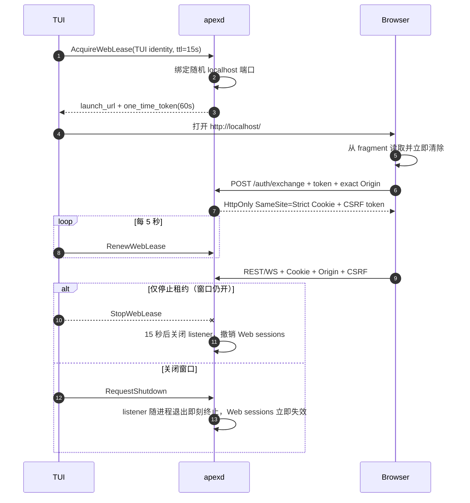
```mermaid
sequenceDiagram
    autonumber
    participant T as TUI
    participant D as apexd
    participant B as Browser

    T->>D: AcquireWebLease(TUI identity, ttl=15s)
    D->>D: 绑定随机 localhost 端口
    D-->>T: launch_url + one_time_token(60s)
    T->>B: 打开 http://localhost/#token=...
    B->>B: 从 fragment 读取并立即清除
    B->>D: POST /auth/exchange + token + exact Origin
    D-->>B: HttpOnly SameSite=Strict Cookie + CSRF token
    loop 每 5 秒
        T->>D: RenewWebLease
    end
    B->>D: REST/WS + Cookie + Origin + CSRF
    alt 仅停止租约（窗口仍开）
        T--xD: StopWebLease
        D->>D: 15 秒后关闭 listener，撤销 Web sessions
    else 关闭窗口
        T->>D: RequestShutdown
        D->>D: listener 随进程退出即刻终止，Web sessions 立即失效
    end
```

安全约束：

- 窗口关闭即 daemon 退出，listener 随进程终止，**15 秒宽限不适用**；宽限仅用于"窗口仍开但主动停租"的场景（`RQ-015`、`AC-002`）。
- 每个项目 daemon 各自绑定一个随机 loopback 端口。用户不需要记忆端口：窗口内的"打开 Web"入口直接生成带一次性令牌的 `launch_url`。
- Token 单次使用、60 秒过期，保存其哈希而非明文；不得放在 query string、日志或 Referer 中。
- Cookie 是 host-only、HttpOnly、SameSite=Strict，最长 15 分钟且不超过当前 Web 租约；可用 loopback HTTPS 时增加 Secure。
- 所有变更请求要求双提交 CSRF token；WebSocket 用受限 subprotocol token，并严格匹配 `Origin`。
- CSP 禁止 `eval`/`new Function` 和任意外部脚本；静态资源有内容哈希。
- listener 同时绑定 IPv4/IPv6 loopback 时分别校验，绝不回退 `0.0.0.0`/`::`。

### 6. 控制租约

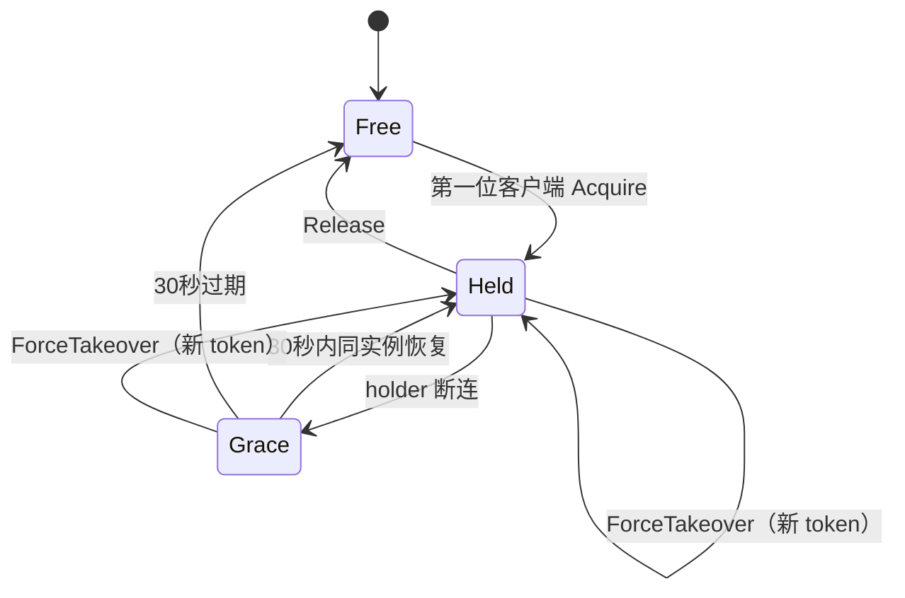
```mermaid
stateDiagram-v2
    [*] --> Free
    Free --> Held: 第一位客户端 Acquire
    Held --> Held: holder Renew
    Held --> Grace: holder 断连
    Grace --> Held: 30秒内同实例恢复
    Grace --> Free: 30秒过期
    Held --> Held: ForceTakeover（新 token）
    Grace --> Held: ForceTakeover（新 token）
    Held --> Free: Release
```

- FIFO 只决定同时竞争时的先到者；租约已持有时普通 Acquire 不排队抢占。
- 非控制客户端可以查询、订阅和准备输入草稿，但不能提交改变运行的 Command。
- 强制接管要求理由，撤销旧 token，并产生 `control.taken-over` Durable Event/会话日志。
- 断连后的 Run 默认继续；策略 `pause_on_control_loss=true` 时，仅在宽限到期后的下一个安全点暂停。

### 7. 快照与事件合并

客户端状态合并算法固定为：

1. 请求 Session Snapshot，得到 `as_of_seq=N`。
2. 建立 Durable subscription `since_seq=N+1`。
3. 先缓冲 live event，再应用补发 event，按 seq 去重和排序。
4. 遇到 gap 停止 Reducer 并重连；遇到 `RESYNC_REQUIRED` 丢弃本地权威缓存后重取 Snapshot。
5. Transient Event 单独进入 ephemeral store；永不改变 Durable Reducer 状态。

客户端可乐观显示“命令已发送”，但只有收到 Admission receipt/Durable Event 后才能显示“已接受/已改变”。

### 8. 活动面板模型

`AgentActivityView` 至少包含：

```text
agent_execution_id, parent_agent_execution_id?, task_id?, node_run_id?,
status, provider_name, model_name,
active_skill { skill_id, display_name, source, pipeline_stage }?,
active_mcp { server_id, display_name, tool_name }?,
subagent_task { title, exact_task_description, write_paths[] }?,
active_tool { tool_call_id, display_name, sanitized_summary }?,
trace_id, started_at, elapsed_ms
```

三个客户端都实时展示 Skill 名称、MCP 服务名称和 Subagent 的具体任务描述。参数、命令或路径中的 Secret 在服务端先脱敏，客户端不得接收后再隐藏。

### 9. 客户端能力矩阵

等价性的作用域是**同一项目窗口**：该窗口 daemon 服务的 TUI、Desktop 与 Web 客户端访问同一份权威状态；不同项目窗口之间互不可见（`RQ-018`、`AC-001`、`AC-024`）。

| 能力 | TUI | Desktop | Web |
|---|---:|---:|---:|
| 会话/消息/Spec/审批 | 是 | 是 | 是 |
| Agent/DAG/Skill/MCP 实时面板 | 是 | 是 | 是 |
| 权限询问与控制接管 | 是 | 是 | 是 |
| 逻辑终端 | 是 | 是 | 是 |
| Checkpoint/Memory 管理 | 是 | 是 | 是 |
| 会话日志浏览/签名验证 | 是 | 是 | 是 |
| 图片/文件 | 原生选择器 | 原生选择器 | 浏览器上传 |
| 音频文件与实时双向语音 | 否 | 是 | 是 |
| 视频文件 | 路径引用，无预览保证 | 是 | 是 |
| 实时视频 | 否 | 否 | 否 |
| 启用 Web 服务 | 是 | 否 | 不适用 |
| 项目选择与窗口宿主 | 是 | 否 | 不适用 |

差异说明：

- 日志能力已对齐（`RQ-019`、`RQ-107`）。原差异建立在"TUI 受系统终端渲染限制"的前提上，改为原生窗口后该前提不再成立。
- 音频仍限于 Desktop/Web（`RQ-020`、`RQ-088`）。保留理由是设备授权与编解码栈复杂度，而非终端渲染能力。
- 文件选择由"路径/文本交互"升级为原生选择器：原生窗口可直接调用系统文件对话框。
- 只有 TUI 承担项目选择与 daemon 宿主职责；Desktop/Web 连接到已由某个窗口拉起的项目 daemon（`RQ-121`）。

"核心功能等价"指同一项目窗口内相同 Session/Spec/Agent/DAG/权限/Memory 事实可访问；输入设备能力按表中明确差异处理。

### 10. 共享 Vue Platform Adapter

```ts
export interface ApexPlatform {
  readonly kind: "desktop" | "web";
  connect(): Promise<ConnectionInfo>;
  command<TReq, TRes>(name: CommandName, request: TReq): Promise<TRes>;
  query<TReq, TRes>(name: QueryName, request: TReq): Promise<TRes>;
  subscribe(request: Subscription): AsyncIterable<WireEvent>;
  pickFiles(options: FilePickerOptions): Promise<readonly LocalArtifact[]>;
  audio(): AudioCapability | undefined;
  notifications(): NotificationCapability;
}
```

- Desktop Adapter 通过 Tauri command/channel 调用 Rust 本地 gRPC client，不向 WebView 暴露 socket 路径或 daemon token。
- Web Adapter 使用 same-origin REST/WS、Cookie/CSRF，不包含 Tauri 分支。
- Pinia store 只消费生成的协议 DTO 和 reducer；业务规则不得分叉进 Adapter。

### 11. Wire 事件信封

```text
WireEvent {
  kind: DURABLE | TRANSIENT
  session_id
  session_seq?             // 仅 Durable
  event_id?                // 仅 Durable
  trace_id
  span_id
  emitted_at
  payload_type
  payload_bytes
}
```

Durable payload 来自领域事件或稳定 Query Delta；Transient payload 包括 model delta、tool progress、terminal live frame、audio frame。Terminal 历史帧自身由 Terminal Service 序号化，但不升级为领域事件。

### 12. 错误与传输映射

| 错误属性 | gRPC | HTTP | 客户端行为 |
|---|---|---|---|
| 参数/版本错误 | `INVALID_ARGUMENT`/`FAILED_PRECONDITION` | 400/409/426 | 显示稳定 message key |
| 未认证/租约无效 | `UNAUTHENTICATED` | 401 | 重新握手/交换 token |
| 无控制权/权限拒绝 | `PERMISSION_DENIED` | 403 | 显示 holder/规则，不盲目重试 |
| 资源不存在 | `NOT_FOUND` | 404 | 刷新导航 |
| optimistic conflict | `ABORTED` | 409 | 重取 Snapshot 后由用户/策略决定 |
| 限流 | `RESOURCE_EXHAUSTED` | 429 | 使用 `retry_after` |
| 临时 Provider/daemon 故障 | `UNAVAILABLE` | 503 | 仅幂等请求指数退避 |
| 事件窗口过期 | `OUT_OF_RANGE` | 409 | `RESYNC_REQUIRED`，重取 Snapshot |

错误响应始终包含 `code`、`trace_id`、`message_key`、`message_args`、`retryable` 和 `actions[]`。

### 13. 国际化与可访问性

- 服务端不返回最终中文/英文句子作为逻辑依据，而返回 message key 与安全参数。
- `zh-CN`、`en-US` 资源必须实现 100% key 覆盖并参与 CI；其他 locale 允许语言包扩展和 fallback。
- TUI 与 Vue UI 为所有状态提供文本，不依赖颜色表达阻塞/失败；Desktop/Web 支持键盘导航和屏幕阅读器标签。

---

<!-- 源文件：docs/07-storage-files-logging.md -->

## 章 8 · 存储、文件事实、日志与归档

### 1. 存储分层

| 层 | 权威内容 | 技术 | 是否可由用户编辑 |
|---|---|---|---|
| 文件事实 | Spec、Verification、Checkpoint、Memory、Snapshot Manifest/块 | Markdown + 内容寻址文件 | Spec/Memory 可编辑；其余经受控流程 |
| 运行事实 | Session/Run/Turn、审批、权限、Agent/Tool/DAG、最小领域事件 | SQLite WAL | 否 |
| 投影/索引 | 查询模型、FTS、文件 generation、归档目录 | SQLite | 否，可重建 |
| 诊断日志 | 会话 JSONL、系统人类可读文本 | 轮转文件 | 否，只读查看/导出 |
| Secret | Provider Key | 明文 TOML + OS 文件权限 | 用户可编辑 |

事件不等于日志：事件足以重建领域状态；日志用于诊断、审计调用摘要和离线完整性验证，不能被 Reducer 读取。

### 2. Apex Home

自 2026-08-14 客户端形态变更起，Apex Home 分为**用户级共享区**与**项目分片区**两层。每个项目窗口拥有独立 `apexd` 与独立分片（`RQ-007`、`RQ-120`）；用户级资源被多个 daemon 共享，一切写入经文件锁串行化（`RQ-122`）。

```text
~/.apex/
├── config/                          # 用户级：多 daemon 共享读，写需 exclusive lock
│   ├── apex.toml
│   ├── providers.toml
│   ├── mcp.toml
│   ├── tui.toml                     # 含最近项目列表、窗口几何、字体与键位
│   └── update.toml
├── auth.json                        # 用户级 Secret，0600
├── memory/*.md                      # 用户级全局 Memory（事实源）
├── skills/                          # 用户级 Skills
├── plugins/<id>/<version>/          # 用户级 Plugin 制品
├── keys/                            # 用户级签名密钥
│   ├── session-log-ed25519.key
│   └── session-log-ed25519.pub
├── backups/                         # 用户级备份
├── update/                          # 用户级更新暂存
├── logs/system/                     # 用户级系统日志（60 天）
├── locks/                           # 用户级共享资源锁文件
└── projects/<project-hash>/         # 项目分片区：每项目一个 daemon 独占
    ├── apex.db
    ├── apex.db-wal / apex.db-shm
    ├── runtime/
    │   ├── apexd.lock               # 项目级单实例锁
    │   ├── apexd.sock               # Unix；Windows 用按项目命名的 Named Pipe
    │   └── web-lease.state
    ├── objects/blake3/aa/<hash>     # CAS：chunk/attachment/snapshot block
    ├── logs/sessions/<yyyy>/<mm>/   # 会话 JSONL（120 天）
    ├── archives/sessions/
    └── cache/
```

`<project-hash>` 由项目根路径经 realpath 归一化后取 BLAKE3 前缀派生，保证同一项目稳定映射到同一分片；分片目录本身也须通过 realpath 校验，拒绝符号链接逃逸。

目录权限默认只允许当前用户。Unix 的 Home、`config/`、`keys/`、`locks/` 与各分片 `runtime/` 为 0700，Secret/私钥文件为 0600；Windows 使用当前用户 SID ACL，拒绝继承宽权限时给出高风险诊断。

#### 2.1 用户级共享资源的并发访问

多个项目 daemon 并存时，下列资源需按统一锁协议访问（`RQ-122`）：

| 资源 | 读 | 写 |
|---|---|---|
| `config/*.toml`、`auth.json` | shared lock | exclusive lock + 临时文件 + 原子 rename |
| `memory/*.md`（全局） | shared lock | exclusive lock，冲突走三方合并而非覆盖 |
| `skills/`、`plugins/` | shared lock | exclusive lock（安装/卸载/信任变更） |
| `keys/` | shared lock | exclusive lock（签名与轮换串行化） |
| `backups/`、`update/` | shared lock | exclusive lock |
| 并发配额信号量 | — | exclusive lock（见 `RQ-063`） |

锁文件统一置于 `~/.apex/locks/<resource>.lock`。Unix 用 `flock`，Windows 用 `LockFileEx`。锁必须带超时（默认 5 s）并记录持有者 pid 与项目 hash；超时后判定为陈旧锁的条件是持有者进程已不存在，回收行为写入系统日志。写入完成后须通知其他 daemon 的 watcher 重读，避免"A 写完 B 不知道"。

全局 Memory 的 FTS 索引**不在用户级共建**，而是由各项目分片库各自建立（索引为可重建派生物），以彻底消除并发写冲突。

### 3. 项目目录

#### 3.1 单根 Project

```text
project/
├── specs/<feature>/
│   ├── requirements.md
│   ├── design.md
│   ├── tasks.md
│   └── verification.md
└── .apex/
    ├── checkpoints/<session-id>/checkpoint.md
    ├── memory/*.md
    ├── snapshots/*.manifest.json
    └── runtime/
```

项目内 `.apex/` 保存 Markdown 事实源；运行态派生物（SQLite、CAS、会话日志、归档）位于 `~/.apex/projects/<project-hash>/`，不落在项目目录，避免污染工作区与 Git。

默认 Git 策略：

```gitignore
.apex/checkpoints/
.apex/snapshots/
.apex/runtime/
.apex/attachments/
.apex/cache/
.apex/logs/
```

`specs/**`、其中的 `verification.md` 和 `.apex/memory/**` 默认可提交。Apex 只建议/生成 ignore 片段，不在未经允许时改写用户 `.gitignore`。

#### 3.2 多根 Workspace

多根 Workspace 视为一种"项目"：以 `workspace-id` 代替项目根路径参与分片键计算，其 daemon、分片目录与单实例锁语义与单根项目完全一致。

- 权威 Spec、Checkpoint 和 Workflow 位于 `~/.apex/projects/<workspace-hash>/workspace/`。
- 每个 Root 保持自己的 `<root>/.apex/memory/`，以根作用域检索。
- `workspace.toml` 保存 roots、规范化路径、ProjectId 和 `audit_root_id`。
- Spec/Verification 在每次权威 commit 后镜像到 Audit Root 的 `specs/<feature>/`；镜像带 source workspace、generation 和 content hash frontmatter。
- Audit Root 镜像不是第二事实源；用户修改镜像会被当作 external edit 导回权威文件并走三方合并，不能 last-write-wins。

### 4. SQLite 物理模型

SQLite 按项目分片，每个项目一套独立数据库（`~/.apex/projects/<project-hash>/apex.db`），由该项目的 daemon 独占写入。跨项目查询不存在；跨项目共享只发生在用户级文件资源上。表按用途分组：

| 分组 | 主要表 |
|---|---|
| 元数据 | `schema_meta`、`schema_features`、`migration_history`、`writer_leases` |
| Project/Workspace | `projects`、`workspaces`、`workspace_roots`、`project_policies` |
| Session | `sessions`、`runs`、`turns`、`agent_messages`、`prompt_inbox` |
| Event/Projection | `domain_events`、`aggregate_versions`、`projection_cursors`、`event_outbox` |
| Spec/控制 | `spec_index`、`approvals`、`skip_grants`、`control_leases`、`web_enable_leases` |
| Agent/Tool | `agent_executions`、`dag_runs`、`node_runs`、`write_claims`、`tool_calls`、`terminal_sessions` |
| Permission | `permission_requests`、`permission_grants`、`project_trust` |
| Context | `checkpoint_index`、`context_epochs`、`context_watermarks`、`snapshot_index` |
| Memory | `memory_index`、`memory_recalls`、`memory_fts`（FTS5 virtual table） |
| Provider/扩展 | `provider_profiles`（无 Key）、`skill_index`、`skill_trust`、`mcp_index`、`plugin_index` |
| 文件/归档 | `file_sync_state`、`content_refs`、`archive_catalog`、`backup_catalog` |

关键索引：

- `domain_events(session_id, session_seq)` 唯一；`(aggregate_kind, aggregate_id, aggregate_version)` 唯一。
- `sessions(updated_at DESC, id)` 支持 keyset 分页，禁止 10k 列表使用大 OFFSET。
- `prompt_inbox(session_id, state, admitted_at)`；同 idempotency key 唯一。
- `node_runs(dag_run_id, state, priority, ready_at)`。
- `write_claims(workspace_id, canonical_path_key, lease_expires_at)`。
- `tool_calls(run_id, trace_id)`、`permission_requests(state, created_at)`。
- `memory_index(scope_kind, scope_id, updated_at)`；FTS 表外部内容由 Markdown 生成。

Provider Key、原始终端全文、默认模型全文和会话日志全文不得写入 SQLite。

### 5. 事务与持久性

- 默认：WAL、`synchronous=NORMAL`、busy timeout、单写连接 + 受控读池。
- Critical：Checkpoint 索引、Spec Approval/Invalidation、Skip Grant、控制接管、归档切换和迁移临时使用 `synchronous=FULL`。
- Event append、聚合版本、session sequence、必要投影/outbox 在同一事务内提交。
- 长耗时 Provider、Tool、文件复制和网络调用不得持有 SQLite write transaction。
- daemon 启动时执行 `quick_check`；升级/高风险恢复前执行 `integrity_check` 和备份。
- SQLite 不使用 SQLCipher；敏感字段在进入 DB 前被 Secret Firewall 拒绝。

### 6. 文件事实提交协议

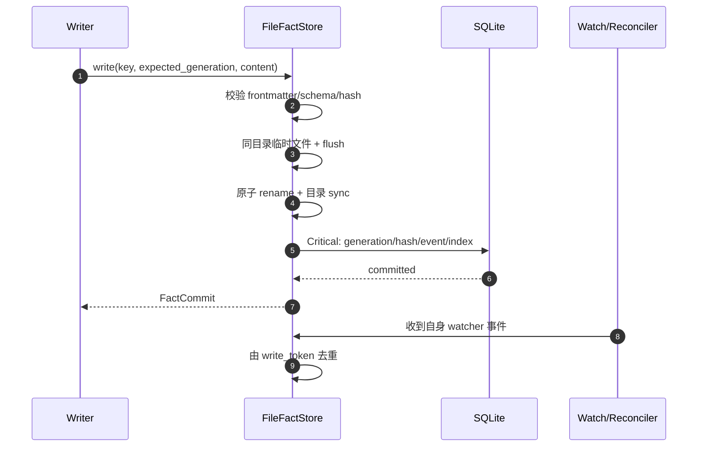
```mermaid
sequenceDiagram
    autonumber
    participant W as Writer
    participant FS as FileFactStore
    participant DB as SQLite
    participant Watch as Watch/Reconciler

    W->>FS: write(key, expected_generation, content)
    FS->>FS: 校验 frontmatter/schema/hash
    FS->>FS: 同目录临时文件 + flush
    FS->>FS: 原子 rename + 目录 sync
    FS->>DB: Critical: generation/hash/event/index
    DB-->>FS: committed
    FS-->>W: FactCommit
    Watch->>FS: 收到自身 watcher 事件
    FS->>FS: 由 write_token 去重
```

若文件已成功替换但 DB 未提交，启动 reconciliation 根据文件 frontmatter 的 generation/write token 补齐索引；若 DB 已提交而文件缺失，进入 `ReconciliationConflict`，优先从 CAS/journal 恢复，禁止用空文件覆盖。

### 7. 外部编辑与三方合并

`file_sync_state` 保存 `base_hash`（上次共同版本）、`apex_hash`（Apex 预期）、`observed_hash`、generation 和 inode/file-id 提示。流程：

1. watcher 防抖后读取稳定内容；显式 Reload 跳过防抖但仍完整校验。
2. 若 observed == apex，忽略自写事件。
3. 若 apex == base，接受外部版本并更新投影/审批失效。
4. 若 observed == base，保留 Apex 版本。
5. 三方均不同，按 Markdown AST 做三方合并；frontmatter/关键表格冲突不自动猜。
6. 合并成功产生新 generation；失败保存冲突 artifact、暂停相关 Session/DAG 并要求人工解决。

Spec 外部变化必须触发 [08](#章-9-spec编码规则与验证流水线) 的审批失效；Memory 外部变化必须重建 FTS；Checkpoint 不允许无审计的就地人工改写。

### 8. 会话日志

#### 8.1 文件与轮转

- 路径：`~/.apex/projects/<project-hash>/logs/sessions/<yyyy>/<mm>/`（按项目分片，避免多 daemon 交叉写入）。
- 文件名：`20260811T142355.123+0800_<session-id>_0001.jsonl`。
- 单段写入达到 10 MiB 前封口并开启 `_0002`；不拆分单条记录。
- 每个 Session 独立日志流；保留 120 天。
- 三端均可分页查看和验证（`RQ-019`、`RQ-107`）；日志签名与密钥轮换经用户级文件锁串行化（`RQ-109`、`RQ-122`）。

#### 8.2 JSON Lines 格式样例

每行是独立 JSON object。样例中的 hash 为缩写，仅展示字段格式；真实值为完整十六进制。

```jsonl
{"schema":"apex.session-log.v1","kind":"segment_header","ts":"2026-08-11T14:23:55.123+08:00","session_id":"0198...a101","trace_id":"9a12e7b01c734caca8f6aa9bf65a1101","segment":1,"created_by":"apexd/1.0.0","key_id":"ed25519:8f42...","prev_segment_hash":null,"prev_hash":"0000000000000000...","record_hash":"6a1c2f0e..."}
{"schema":"apex.session-log.v1","kind":"agent_activity","ts":"2026-08-11T14:23:56.008+08:00","level":"INFO","session_id":"0198...a101","run_id":"0198...b202","event_id":"0198...e301","trace_id":"4bf92f3577b34da6a3ce929d0e0e4736","span_id":"00f067aa0ba902b7","agent_execution_id":"0198...c401","task_id":"T-07","summary":"Subagent started","details":{"task_description":"Implement permission policy contract tests","write_paths":["crates/apex-permission/**"],"skill_name":"Spec 驱动编码","mcp_server_name":null},"payload":{"mode":"metadata","bytes":0,"blake3":null},"prev_hash":"6a1c2f0e...","record_hash":"944ea18a..."}
{"schema":"apex.session-log.v1","kind":"tool_call","ts":"2026-08-11T14:24:02.441+08:00","level":"INFO","session_id":"0198...a101","run_id":"0198...b202","event_id":"0198...e302","trace_id":"4bf92f3577b34da6a3ce929d0e0e4736","span_id":"b7ad6b7169203331","tool_call_id":"0198...d501","summary":"shell completed","details":{"tool":"shell","command_summary":"cargo test -p apex-permission","exit_code":0,"stdout_len":1842,"stdout_blake3":"blake3:3d91...","stderr_len":0,"stderr_blake3":"blake3:af13...","duration_ms":1834,"permission_decision":"allow"},"payload":{"mode":"metadata","redactions":0},"prev_hash":"944ea18a...","record_hash":"0f16de22..."}
{"schema":"apex.session-log.v1","kind":"segment_footer","ts":"2026-08-11T14:40:10.000+08:00","session_id":"0198...a101","trace_id":"97d204f73a0c481a89d7178af4407d13","segment":1,"record_count":329,"first_record_hash":"6a1c2f0e...","last_data_record_hash":"0f16de22...","segment_hash":"blake3:cc9a...","signature":{"alg":"Ed25519","key_id":"ed25519:8f42...","value":"base64:MEUCIQ..."},"prev_hash":"0f16de22...","record_hash":"b3d5f812..."}
```

Hash 计算使用 RFC 8785 风格的确定性 JSON canonicalization，并在计算时排除 `record_hash` 字段；`prev_hash` 链接上一条完整 record hash。Footer 签名覆盖 session id、segment number、前后段 hash、record count、segment hash 与 key id。

每条记录都必须包含 `trace_id`；请求沿用 W3C trace，segment/清理/恢复等后台动作创建自己的 maintenance trace。与领域状态有关的记录同时包含 `event_id`，从而在 SQLite 事件、Session 日志和系统日志之间关联。

#### 8.3 内容策略

- 默认 `payload.mode=metadata`：记录类型、摘要、长度、状态、耗时、BLAKE3 和脱敏计数。
- 单 Session 可显式开启 `full_debug`；UI 必须显示高风险提示、范围、自动关闭时间，并仍执行 Secret/凭据/常见 token 脱敏。
- 全文调试开关本身产生 Durable Event 与会话日志；不得由 Agent 或项目配置静默打开。
- Ed25519 私钥位于 `~/.apex/keys/`，只允许当前用户；轮换时保留公钥和 key-id 元数据以验证旧段。
- 崩溃造成未封口段时，恢复任务验证到最后一个完整 JSONL 行，截断仅允许移动损坏尾部到 quarantine，不修改已签名段。

### 9. 系统日志

#### 9.1 文件与轮转

- 文件：`~/.apex/logs/system/apexd-2026-08-11.log`。
- 当日超过 10 MiB 后使用 `.1.log`、`.2.log`；第二天重新从无序号文件开始。
- 保存 60 天，按本地时区日界线切换。
- 人类可读文本，不使用 JSON；详细结构化会话审计只写 Session JSONL。
- Desktop/Web 可分页查看经过脱敏的系统日志；TUI 不提供任何日志查看入口。

#### 9.2 文本格式样例

```text
2026-08-11T14:23:51.204+08:00 INFO  [apexd::startup] trace=7d903bc18f234a09a4f04427c7074530 pid=48201 version=1.0.0 schema_major=1 msg="daemon ready"
2026-08-11T14:23:55.091+08:00 INFO  [apexd::web] trace=4bf92f3577b34da6a3ce929d0e0e4736 lease=0198...f601 bind=127.0.0.1:43127 msg="web listener enabled by TUI lease"
2026-08-11T14:24:02.449+08:00 WARN  [apexd::provider] trace=4bf92f3577b34da6a3ce929d0e0e4736 provider=openai attempt=1 retry_in_ms=500 error=rate_limited msg="provider request will retry"
2026-08-11T14:24:07.100+08:00 ERROR [apexd::storage] trace=91f... event=0198...e777 code=APEX_STORAGE_RECONCILIATION_CONFLICT path="<workspace>/specs/auth/tasks.md" msg="manual merge required"
```

系统日志同样经过 Secret Firewall；path 默认相对化或以 `<workspace>` 替换用户主目录。
每一行都带 `trace=<32hex>`；无外部请求的启动、轮转、归档和维护任务使用内部 maintenance trace。

### 10. 归档与保留

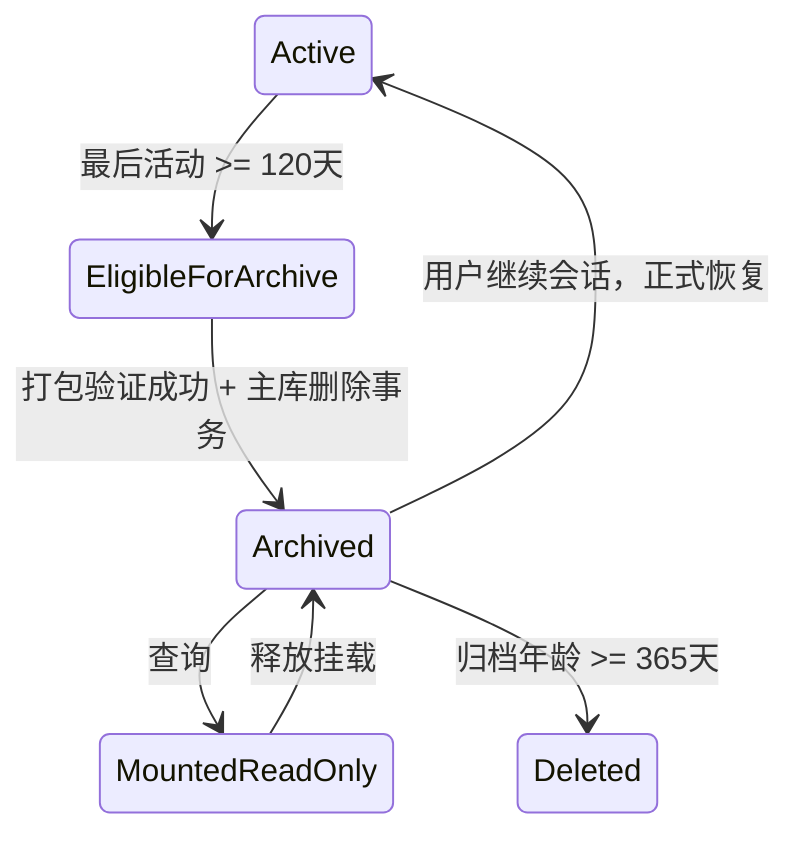
```mermaid
stateDiagram-v2
    Active --> EligibleForArchive: 最后活动 >= 120天
    EligibleForArchive --> Archived: 打包验证成功 + 主库删除事务
    Archived --> MountedReadOnly: 查询
    MountedReadOnly --> Archived: 释放挂载
    Archived --> Active: 用户继续会话，正式恢复
    Archived --> Deleted: 归档年龄 >= 365天
```

- 归档包包含 Session 运行事实、事件、必要投影、Checkpoint 引用清单和完整性 Manifest。
- 归档不包含已经过期的会话日志；日志按自己的 120 天策略独立删除。
- 查询时临时只读 attach/mount，禁止在归档上直接继续；继续操作先恢复进主库并分配新写入 generation。
- 365 天删除前验证不是 Pinned Checkpoint 的唯一可达根；Pinned Checkpoint 及其 CAS 块永久保留，直到用户取消 pin。
- 删除生成 purge 审计记录，但不会保留被删除的敏感正文。

### 11. 备份、损坏与恢复

- 自动备份仅在升级、迁移、高风险恢复之前，使用 SQLite Online Backup API + 文件事实/CAS Manifest。
- 备份目录带版本、schema、hash 和完成标记；未完成备份不参与恢复选择。
- 启动发现 WAL/DB 损坏时进入只读恢复模式，不运行 Agent/Tool；提供备份恢复、SQLite recover 导出和手动诊断包。
- 文件事实损坏优先从 CAS、Audit Root 镜像或 Git 恢复，所有恢复都产生新 generation，不重写历史 hash。

### 12. 性能与容量策略

- Session 列表使用覆盖索引 + keyset，目标 10k 会话 P95 ≤ 500 ms。
- Memory FTS 使用外部内容表、scope 过滤和 rank/recency 混合排序，100k 条 P95 ≤ 300 ms。
- Event page 和日志 page 都有最大字节/条数限制；客户端必须流式消费。
- WAL checkpoint 根据页数、空闲和 critical boundary 调度，禁止在活跃 Tool 热路径做阻塞 full checkpoint。
- CAS 以引用标记和保留窗口 GC；正在运行/归档/Pinned 引用均为 root。

---

<!-- 源文件：docs/08-spec-rules-verification.md -->

## 章 9 · Spec、编码规则与验证流水线

### 1. 流水线不变量

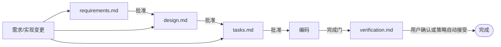
```mermaid
flowchart LR
    R[requirements.md] -->|批准| D[design.md]
    D -->|批准| T[tasks.md]
    T -->|批准| C[编码]
    C -->|完成门| V[verification.md]
    V -->|用户确认或策略自动接受| Done([完成])
    Change[需求/实现变更] --> R
    Change --> D
    Change --> T
```

- 没有有效审批或有效 Skip Grant，Coding Gate 必须拒绝写代码。
- 任何需求/设计/任务范围变化先回改对应 Spec，再传播下游失效。
- `verification.md` 是唯一要求额外生成的最终验证 Markdown；中间 lint/test/规则输出保存在 SQLite 状态和详细会话日志，不生成大量重复报告。
- Agent 不得把“用户未回复”解释为批准。

### 2. 文件与 frontmatter

```yaml
---
schema: apex.spec.v1
spec_id: 0198...
feature: permission-engine
stage: requirements        # requirements | design | tasks | verification
workspace_id: 0198...
generation: 7
content_hash: blake3:...
upstream_hashes: {}
status: awaiting_approval
updated_at: 2026-08-11T14:00:00+08:00
---
```

`content_hash` 计算时排除自身字段；`upstream_hashes` 绑定已批准上游版本。审批记录在 SQLite，Markdown 可展示审批摘要，但不是批准事实源，避免用户复制文件伪造审批。

### 3. 四份文档最低结构

#### 3.1 `requirements.md`

- 背景、目标、用户场景。
- In Scope / Out of Scope。
- 术语、业务规则、不变量。
- Given-When-Then 验收标准和 NFR。
- 确定性问题、风险及用户确认结果。
- 与全局 `RQ`/`AC` 的追踪。

#### 3.2 `design.md`

- 系统边界、依赖方向、数据流。
- 架构图、核心流程图、多方交互时序图。
- 数据模型/状态机/异常恢复图（适用时）。
- Trait/API 影响、兼容与迁移。
- 决策对比、风险、验证策略。

#### 3.3 `tasks.md`

- 任务 ID、精确描述、依赖、验收标准。
- `write_paths`、read scope、是否高风险、是否幂等。
- 可选 Agent Profile/Provider/模型覆盖。
- 预期 Tool、规则包、测试层级、汇聚方式和补偿动作。
- DAG 阶段、并行任务和汇聚边；编译语义见 [11](#章-12-agentdagsnapshot-与重放)。

#### 3.4 `verification.md`

- 被验证的 requirements/design/tasks 内容哈希。
- 每项 AC 的命令、环境、结果、证据引用。
- 编译/lint/test/静态分析/覆盖率/E2E/NFR 结果。
- Spec 漂移、权限审计、Snapshot/恢复和风险清单复核。
- 未解决项、豁免与理由。
- 用户确认或自动接受策略、操作者、时间和 trace。

### 4. 阶段与审批状态机

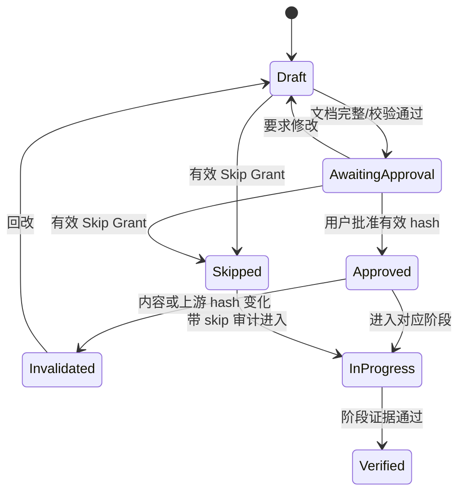
```mermaid
stateDiagram-v2
    [*] --> Draft
    Draft --> AwaitingApproval: 文档完整/校验通过
    AwaitingApproval --> Approved: 用户批准有效 hash
    AwaitingApproval --> Draft: 要求修改
    Approved --> Invalidated: 内容或上游 hash 变化
    Invalidated --> Draft: 回改
    Draft --> Skipped: 有效 Skip Grant
    AwaitingApproval --> Skipped: 有效 Skip Grant
    Approved --> InProgress: 进入对应阶段
    Skipped --> InProgress: 带 skip 审计进入
    InProgress --> Verified: 阶段证据通过
```

默认逐阶段审批：requirements 批准后才能设计，design 批准后才能拆任务，tasks 批准后才能编码。项目策略 `approval_mode=bundle` 可在三份文档全部完成后整体批准；bundle approval 绑定三个 hash，任何一个变化均整体失效。

### 5. 变更与失效传播

| 变化 | 立即失效 | 下一个安全点动作 |
|---|---|---|
| Requirements 内容变化 | Requirements 及 Design/Tasks/Coding/Verification | 暂停写入，回改下游并重新审批 |
| Design 内容变化 | Design 及 Tasks/Coding/Verification | 暂停受影响任务，重算 DAG/claims |
| Tasks 内容或 `write_paths` 变化 | Tasks 及 Coding/Verification | 暂停节点，释放/重取 Claim 后审批 |
| 实现偏离已批准行为 | Coding/Verification | 先更新 Spec，不允许仅修改测试迎合实现 |
| Verification 证据过期 | Verification | 重新运行受影响验证 |

文件 watcher 检测变化后立即追加 `spec.changed`/`approval.invalidated`，正在运行的不可中断 Tool 可完成当前原子副作用，但下一 Tool/Provider/DAG 节点边界前必须暂停。高风险写前再次校验 Spec hash，缩小失效竞态窗口。

### 6. `/skip-spec`

支持：

```text
/skip-spec --scope run --stages requirements,design --reason "hotfix triage"
/skip-spec --scope session --stages all --reason "exploratory read-only investigation"
```

`scope` 仅为 `run|session`；不提供 Project/User 永久跳过。`stages` 可以是一个/多个阶段或 `all`。审计记录必须包含：

```text
skip_grant_id, session_id, run_id?, stages, scope,
reason, operator, granted_at, expires_at/termination_condition,
linked_requirement_ids[], current_spec_hashes{}, trace_id,
permission_mode, project_id
```

Skip 只绕过指定 Spec Gate，不绕过 Project Trust、Permission、Checkpoint、Write Claim、硬安全禁令和最终日志。若跳过 Verification，Run 不能显示为“已验证”，只能显示“完成（未验证，已审计跳过）”。

### 7. 三层编码规范强制

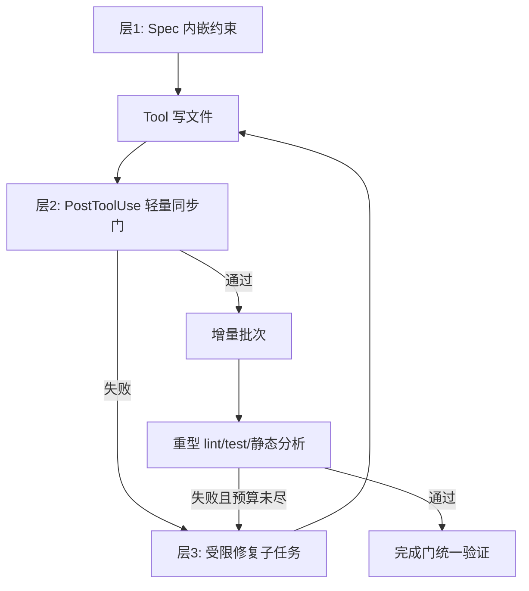
```mermaid
flowchart TD
    S[层1: Spec 内嵌约束] --> W[Tool 写文件]
    W --> L[层2: PostToolUse 轻量同步门]
    L -->|通过| B[增量批次]
    L -->|失败| R[层3: 受限修复子任务]
    R --> W
    B --> H[重型 lint/test/静态分析]
    H -->|失败且预算未尽| R
    H -->|通过| G[完成门统一验证]
```

#### 7.1 Spec 内嵌约束

`design.md`/`tasks.md` 引用规则 profile、禁止 API、覆盖率目标、架构依赖、命名和安全不变量。规则 profile 有版本 hash，确保验证使用与批准时相同的规则语义。

#### 7.2 PostToolUse

每次文件修改后同步执行：

- 路径仍在 `write_paths` 和 Permission 范围内。
- 文件大小、编码、Secret scan、危险二进制/符号链接检查。
- Rustfmt/语言 formatter 的 check、基础语法解析、快速 lint/security rule。
- Spec/Schema/生成文件漂移检查。

轻量门必须快速、可取消并有严格超时；失败阻止下一次 Provider 调用，诊断作为 barrier 注入，而不是让 UI 直接操作磁盘或语言服务器。

#### 7.3 增量修复子任务

- 默认最多 2 轮，项目可配置 1–5。
- Repair Task 必须引用失败 rule/AC，写路径是原任务路径子集，权限不高于父任务。
- 禁止通过删除测试、降低规则、扩大 skip、修改批准证据来“修复”。
- 超出轮数后状态转为 Blocked，由用户决定修改 Spec、人工修复或接受明确豁免。

### 8. 内置规则包

| 语言 | 轻量门 | 增量/完成门 |
|---|---|---|
| Rust | rustfmt check、语法、Secret/unsafe/unwrap 快速规则 | cargo check/clippy/test、audit/deny、覆盖率、Miri/属性测试（适用） |
| Go | gofmt、go vet 快速子集 | go test/race/vet/staticcheck、覆盖率 |
| Java | formatter、编译语法、危险 API | Maven/Gradle test、SpotBugs/PMD/Checkstyle、依赖与安全审计 |
| Python | formatter/parse、基础 Ruff | Ruff/mypy/pytest、依赖审计、覆盖率 |
| TS/JS | Prettier/ESLint 快速规则、类型语法 | tsc、ESLint、Vitest、依赖审计、覆盖率 |
| Vue | SFC parse、模板安全/格式 | vue-tsc、ESLint、Vitest/component/E2E、覆盖率 |

规则命令按项目探测并写入 `tasks.md`；不得下载/安装未批准工具作为隐式副作用。

### 9. 验证编排

完成门顺序：

1. 验证当前代码/文件树与 approved tasks hash 对齐。
2. 运行全部轻量规则和未完成增量批次。
3. 运行编译、lint、静态安全、单元/集成/属性测试。
4. 运行三端关键 E2E 与跨平台/Provider 契约测试的适用集合。
5. 采集覆盖率和 NFR 基准，检查阈值。
6. 验证 Checkpoint 恢复、日志完整性和必要 Snapshot/补偿证据。
7. 原子生成 `verification.md`，绑定所有输入 hash。
8. 默认等待用户确认；若项目策略允许自动完成，则策略版本、证据与 trace 必须写入接受记录。

覆盖率门：

- Permission、DAG Scheduler、Spec、Checkpoint/恢复：行与分支均 ≥ 90%。
- 其他 Rust：≥ 80%。
- Vue/TypeScript：≥ 80%。
- 创建/继续 Session、Spec 审批、权限询问、DAG 运行/暂停恢复、跨端同步是强制三端 E2E。

### 10. `verification.md` 样例骨架

```markdown
---
schema: apex.verification.v1
feature: permission-engine
requirements_hash: blake3:...
design_hash: blake3:...
tasks_hash: blake3:...
verified_at: 2026-08-11T18:00:00+08:00
trace_id: 4bf92f...
---

# Verification: permission-engine

## 结论
- 状态：待用户确认
- AC：18/18 通过
- 豁免：0

## 验收证据
| AC | 命令/场景 | 结果 | 证据引用 |
|---|---|---|---|
| AC-PERM-01 | `cargo test -p apex-permission` | PASS | session-log:... |

## 覆盖率与质量门
...

## 风险复核与未解决项
...

## 确认
等待用户确认。
```

报告只引用详细日志、测试 artifact 和 event id，不复制大段 stdout/stderr。

### 11. 异常路径

- 校验工具缺失：若 tasks 已批准使用该工具，先请求安装权限；否则 Blocked，不静默换工具降低标准。
- Flaky test：记录每次结果和环境，达到配置重试上限后失败；不得只保留成功一次。
- 外部 Spec 合并冲突：停止审批/编码，保存三方 artifact，人工解决后生成新 generation。
- 规则 profile 变化：视为 Design/Tasks 约束变化，使相关验证证据失效。
- 自动修复制造新错误：回到前一 Snapshot 或通过补偿恢复，再把失败轮次留在日志中。

---

<!-- 源文件：docs/09-tool-permission-terminal.md -->

## 章 10 · Tool Gateway、权限引擎与终端

### 1. 安全目标

所有 Agent 发起的文件、命令、网络、凭据、MCP 和 Plugin 副作用必须经过 Tool Gateway。权限结论只由静态代码、配置和已持久授权产生，整个判权依赖闭包中禁止 Provider/LLM crate。

因此单次权限判断为零 Token 消耗，且结果可在没有模型/网络的离线环境中确定性重放。

权限原则：

- 单调收紧：后层只能保持或收紧前层的 Deny/Hold，不能把硬拒绝改成允许。
- 未知即不自动执行：解析、路径、目标或副作用无法证明时保守处理。
- 批准最小化：批准 key 可在安全的 arity 规则范围内复用，拒绝精确到实际参数/资源。
- 执行时复核：准备时允许不代表执行时可绕过路径变化、DNS rebinding 或授权过期。
- 审计与执行同 trace：每个 verdict 可说明“哪条规则、哪个资源、哪个授权”导致结论。

### 2. 模式语义

| 模式 | 静态证明只读且无副作用 | 白名单内副作用 | 白名单外但可分析 | 解析/语义未知 | 硬禁止 |
|---|---|---|---|---|---|
| `plan` | Allow | Deny | Deny | Deny | Deny |
| `ask` | Allow | Allow | Ask | Ask | Deny |
| `allow` | Allow | Allow | Allow（静态策略允许） | Ask | Deny |

网络请求即使是 GET 也属于外部可观察副作用，`plan` 默认拒绝。编译器、格式化器和测试如果会写 cache/target，也不视为纯只读，必须使用已声明的受控输出路径或在 `ask/allow` 下运行。

### 3. 权限决策流水线

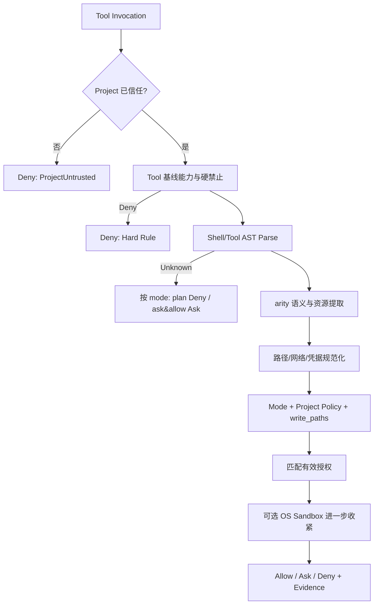
```mermaid
flowchart TD
    I[Tool Invocation] --> Trust{Project 已信任?}
    Trust -->|否| UD[Deny: ProjectUntrusted]
    Trust -->|是| Base[Tool 基线能力与硬禁止]
    Base -->|Deny| HD[Deny: Hard Rule]
    Base --> Parse[Shell/Tool AST Parse]
    Parse -->|Unknown| Fallback[按 mode: plan Deny / ask&allow Ask]
    Parse --> Sem[arity 语义与资源提取]
    Sem --> Norm[路径/网络/凭据规范化]
    Norm --> Policy[Mode + Project Policy + write_paths]
    Policy --> Grant[匹配有效授权]
    Grant --> Sandbox[可选 OS Sandbox 进一步收紧]
    Sandbox --> Verdict[Allow / Ask / Deny + Evidence]
```

固定合并顺序：Project Trust → mode ceiling → Tool baseline → 平台硬禁止 → AST/语义 → Project policy → Task/write_paths → 已批准 grant → 可选 OS sandbox。任一 Deny 不可被后层覆盖。

### 4. Shell AST 与共同语义 IR

首版完整支持：

- POSIX：sh/bash/zsh，基于 tree-sitter Bash 语法并补充 dialect 差异。
- PowerShell 7：基于 tree-sitter PowerShell AST，识别 cmdlet、pipeline、script block、provider path。
- cmd.exe：基于 tree-sitter cmd grammar/受验证 parser，识别 `%VAR%`/delayed expansion、管道、重定向、`&&/||/&`、`call`。

不同 AST 归一为：

```text
CommandSemantics {
  programs[], operations[], path_accesses[], network_targets[],
  env_accesses[], credential_accesses[], process_effects[],
  redirections[], dynamic_fragments[], confidence
}
```

`operations` 使用稳定语义：`ReadFile`、`ListDir`、`CreateFile`、`ModifyFile`、`DeletePath`、`ExecuteProgram`、`SpawnShell`、`OpenNetwork`、`ReadCredential`、`WriteEnvironment`、`ManageProcess`、`PackageInstall` 等。

以下情况标记 Unknown/高风险，不做字符串猜测：动态 `eval`/`Invoke-Expression`、无法解析的命令替换、用户可控脚本块、解释器 `-c` 中未被相应语言 analyzer 支持的代码、间接 `call`、不透明二进制参数、无限 glob 或运行时生成的目标。

### 5. arity 语义规则

规则由内置签名与版本化数据表组成，不依赖模型：

```yaml
program: rm
match:
  dialects: [posix]
  operands: paths_after_options
effects:
  - operation: DeletePath
    resources: operands
guards:
  hard_deny_if: [root_path, apex_home, unresolved_glob]
```

典型规则：

| 程序 | 语义重点 |
|---|---|
| `rm`/`del`/`Remove-Item` | 解析选项后路径、递归、force、glob、设备/根路径 |
| `cp`/`mv`/`Copy-Item` | 源读、目标写/覆盖，区分多源最后一个目标 |
| `git` | 按 subcommand 区分只读、工作树写、网络、历史重写；hook 影响单独评估 |
| `cargo`/`go`/`mvn`/`npm` | source read、target/cache write、网络下载、build script 副作用 |
| `curl`/`wget`/`Invoke-WebRequest` | URL scheme/host/port、方法、上传、输出路径、代理 |
| `env`/PowerShell env provider | 读写环境变量；敏感名称分类 |
| `sh -c`/`pwsh -Command`/`cmd /c` | 递归解析嵌套 source；失败则 Unknown |

规则签名包括程序规范路径、subcommand、关键 options 和 operand arity。项目 grant 只能覆盖规则暴露的安全参数位，不能用 `program=git` 泛化所有 Git 操作。

### 6. 资源规范化

#### 6.1 文件路径

1. 以 Workspace Root/明确 cwd 解析相对路径，拒绝空 cwd。
2. 对已存在部分解析 real path；对不存在目标找到最深已存在祖先，验证祖先 symlink 后拼接剩余组件。
3. 拒绝悬空/循环 symlink、设备路径、NT object path、未经策略允许的 UNC/network share。
4. macOS 默认和 Windows 使用文件系统等价 key（大小写折叠 + Unicode 规范化）；Linux 保持大小写但仍规范化 `.`/`..`。
5. 在执行前再次打开/验证目标；高风险文件使用目录句柄/`openat` 风格能力降低 TOCTOU。
6. 路径 Scope 支持文件、目录递归和受限 glob；Claim/Permission 使用同一规范化库。

硬禁止默认覆盖：文件系统根、用户 Home 广域递归删除、`~/.apex/config/providers.toml`、`~/.apex/keys/**`、daemon socket/pipe、其他 Project Root 和系统凭据目录。用户不能通过普通 grant 绕过硬禁止。

#### 6.2 网络

Network key 为 scheme、规范化 host、port、method class、upload/download。执行前解析 DNS 并同时检查 hostname 和所有目标 IP，阻止 loopback/link-local/private/metadata 网段绕过（除非 Tool/MCP 的明确本地策略允许）；重定向每跳重新判权。

#### 6.3 凭据与环境变量

变量名按 exact/前缀规则分类，如 `*_TOKEN`、`*_KEY`、`*_SECRET`、Provider 专属名。Agent 子进程默认不继承 Provider Key；确需 credential 的 Tool 使用短生命周期 capability 注入，不把明文写入命令行、日志或普通环境快照。

### 7. 授权模型

| Scope | 终止条件 |
|---|---|
| Once | 指定 `PermissionRequestId` 消费一次后失效 |
| Run | Run 结束/取消/重放分叉时失效 |
| Session | Session 归档或显式撤销时失效 |
| Project | Project trust 撤销、策略版本变化或显式撤销时失效 |

不提供用户级全局 grant。每条授权绑定规范资源 key、允许 operations、arity pattern、ProjectId、策略版本和批准人。再执行重放可以继承原授权边界，但新发现的资源、目标或扩大参数必须重新询问。

### 8. Tool Gateway 时序

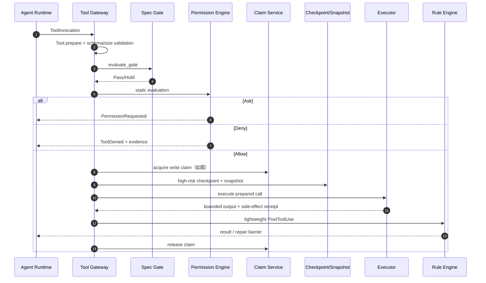
```mermaid
sequenceDiagram
    autonumber
    participant A as Agent Runtime
    participant G as Tool Gateway
    participant S as Spec Gate
    participant P as Permission Engine
    participant C as Claim Service
    participant K as Checkpoint/Snapshot
    participant E as Executor
    participant R as Rule Engine

    A->>G: ToolInvocation
    G->>G: Tool.prepare + schema/size validation
    G->>S: evaluate_gate
    S-->>G: Pass/Hold
    G->>P: static evaluation
    alt Ask
        P-->>A: PermissionRequested
    else Deny
        P-->>A: ToolDenied + evidence
    else Allow
        G->>C: acquire write claim（如需）
        G->>K: high-risk checkpoint + snapshot
        G->>E: execute prepared call
        E-->>G: bounded output + side-effect receipt
        G->>R: lightweight PostToolUse
        R-->>A: result / repair barrier
        G->>C: release claim
    end
```

Tool `prepare` 必须把声明输入转换为确定的资源计划；`execute` 不能自行扩大范围。实际副作用与计划不一致时立即终止、标记 Policy Violation，并保留 Snapshot/日志证据。

### 9. Tool 注册与输出

- Tool descriptor 包含 schema、版本、是否只读、可能副作用类别、资源提取器、幂等/补偿能力、输出预算和 SnipHinter。
- Tool Result 同时包含面向 Agent 的结构化结果、用户摘要、日志 metadata 和副作用 receipt。
- 大输出先写内容块/日志，Context 只注入摘要与引用；70% snip 时按 Tool 的 SnipHinter 保留首尾、错误和关键结构。
- 崩溃后遗留 `Running` Tool 变为 `Interrupted`；只有 receipt 能证明未执行或幂等时才自动重试，否则进入 `UnknownSideEffect`。

### 10. 终端模型

默认持久终端：Unix PTY、Windows ConPTY。项目/Agent Profile 可选择一次性非交互命令。

```text
LogicalTerminal
  ├── foreground channel（用户可见/交互）
  ├── agent channel <agent_execution_id, task_id, trace_id>
  └── system channel（resize/exit/diagnostic）
```

- UI 可把多个隔离 Agent 通道聚合成一个逻辑终端视图，但每帧保留 channel/agent/task/trace 和单调序号。
- Agent 向持久 shell 写入的命令先被解析和判权；不能通过逐字符写入绕过完整命令分析。
- 用户直接键入是显式人类操作，仍记录 attribution；若要求 Agent 自动确认/发送，则按 Agent Tool 处理。
- 输出采用有界 ring buffer + 磁盘日志引用，客户端慢消费不会阻塞子进程导致 daemon 内存无界增长。
- 取消时终止完整进程树，先 graceful signal，再在超时后强杀；MCP stdio 和 Tool 子进程共享平台进程树清理能力。

### 11. 可选 OS 沙箱

- macOS：sandbox profile/受支持系统机制；Windows：Job Object、restricted token/ACL；Linux：namespaces/seccomp/Landlock（按可用性）。
- 沙箱只进一步限制已允许的静态计划，不参与“允许”推断。
- 不支持或初始化失败时清晰显示 `sandbox=unavailable/degraded`；默认仍按静态策略工作，不虚假宣称 OS 隔离。
- 高安全 Project 可配置 `sandbox_required=true`，此时初始化失败直接阻塞。

### 12. 权限审计样例

```json
{
  "permission_request_id": "0198...",
  "trace_id": "4bf92f...",
  "mode": "ask",
  "tool": "shell",
  "dialect": "posix",
  "source_hash": "blake3:...",
  "operations": ["DeletePath"],
  "resources": [{"kind":"path","key":"workspace:src/generated/**"}],
  "verdict": "ask",
  "evidence": ["rule:rm.operands.v3", "no_matching_grant"],
  "requested_scope_options": ["once", "run", "session", "project"]
}
```

源命令默认只在全文调试日志或专门加密诊断导出中出现；常规事件/日志保存 hash 与脱敏摘要。

### 13. 必测边界

- Shell：嵌套 quote、命令替换、管道/重定向、换行、别名、PowerShell provider、cmd delayed expansion。
- 路径：不存在目标、symlink swap、junction、大小写冲突、Unicode 同形、长路径、UNC、glob 爆炸。
- 网络：DNS rebinding、IPv6、重定向、代理、userinfo、混淆 IP 表示。
- 授权：过期、策略变化、拒绝 key 粒度、并发消费 Once、重放继承不扩权。
- 终端：逐字节绕过、进程树泄漏、背压、断线重连、ConPTY/PTY resize。

---

<!-- 源文件：docs/10-context-checkpoint-memory.md -->

## 章 11 · Context、Checkpoint 与 Memory

### 1. Checkpoint-first 策略

Context 管理目标不是“尽量压缩”，而是在任何有损操作前先建立可验证、可无损重建的 Checkpoint。Context Window 只是模型输入缓存，Checkpoint/事件/文件才是恢复事实。

强制 Checkpoint 触发：

1. 每个 Turn 成功结束。
2. snip、prune、LLM 摘要等任何有损处理前。
3. Session/DAG 暂停或 daemon 退出前。
4. 高风险文件/命令副作用执行前。
5. 窗口宿主关闭前（window-close）：原生窗口应用关窗即停服（RQ-119），关窗前必须到达安全点并写入 Checkpoint，未完成 Run/DAG 标记为可恢复中断。

### 2. Context Source 与 Epoch

`ContextEpoch` 是一次 Provider 输入的可追溯构建结果：

| Source | 例子 | 更新语义 |
|---|---|---|
| Stable | system policy、已批准 Spec、Tool schema、Agent Profile | hash 变化时替换 Epoch |
| Turn | 用户输入、当前 AgentMessage、Tool Result | 追加，Turn 结束封口 |
| Retrieved | Memory、Skill、代码片段、MCP Resource | 带来源/时机/预算，可失效替换 |
| Recovery | Checkpoint、未完成 Tool/DAG、Snapshot diff | 恢复时优先，验证完整性 |
| Transient | 流式 reasoning/progress | 不作为下次 Epoch 的唯一来源 |

每个 Source 带 `source_id`、hash、token estimate、priority、loss_policy、valid_until 和引用。构建失败不消费 durable inbox 中的 Prompt。

### 3. 四档阈值

阈值按“预计下一请求 token / 当前模型有效 context limit”计算；limit 扣除最大输出和安全余量。

| 使用率 | 动作 | 是否有损 | 行为 |
|---:|---|---|---|
| 60% | Soft Hint | 否 | 提示优先完成/Checkpoint，减少低价值检索 |
| 70% | Snip | 是 | 先 Checkpoint，再按 Tool/Source 的 SnipHinter 裁短 |
| 80% | Prune | 是 | 先 Checkpoint，以引用占位替换可重取内容 |
| 90% | LLM Summary | 是 | 先 Checkpoint，生成结构化摘要替换旧 Epoch 部分 |

`context_watermarks` 持久化每个 Epoch 已跨越档位，跨越一次只触发一次；动作失败记录重试门，避免每个 token 重复触发 Checkpoint 风暴。使用率降回阈值下不自动“取消”历史动作，新 Epoch 重新计算。

### 4. Snip、Prune 与摘要

- Snip：由 Source/Tool 提供策略。例如测试输出保留失败段、首尾和统计；文件 diff 保留 hunk header；JSON 保留结构/错误字段。
- Prune：替换为 `ContextReference { content_ref, source, hash, retrieval_hint, original_tokens }`，需要时可重新打开，不用“内容已省略”空文本。
- Summary：输出固定 schema，包含用户原始意图引用、完成/未完成、约束、决策、证据、风险、下一步和被摘要引用列表。
- 摘要 Provider 可独立配置；未配置或不可用时回退当前 Provider/模型。若两者都不可用，停在 80% prune/阻塞，不绕过 Checkpoint 直接丢弃。

Provider/模型切换会建立新 Epoch。厂商专属 continuation/reasoning handle 只有在兼容模型中复用；否则转换为普通可见文本或舍弃 handle，并记录降级。

### 5. Checkpoint 文件布局

单根 Project：

```text
.apex/checkpoints/<session-id>/
├── checkpoint.md
├── history/<checkpoint-id>.md
└── refs/                       # 指向 CAS 块的引用清单
```

内容寻址的块（`objects/`、附件）落在**项目分片** `~/.apex/projects/<project-hash>/objects/blake3/<prefix>/<hash>`（07 §2），不落在项目目录；Checkpoint 清单经引用指向 CAS 块。多根 Workspace 以 `workspace-id` 作为分片键（07 §3.2），不再使用独立的 `~/.apex/workspaces/` 子树。`checkpoint.md` 是最新清单，history 保留每次 Manifest；对象按内容寻址且不可就地修改。

### 6. `checkpoint.md` 契约

```markdown
---
schema: apex.checkpoint.v1
checkpoint_id: 0198...
session_id: 0198...
run_id: 0198...
turn_id: 0198...
created_at: 2026-08-11T15:00:00+08:00
reason: turn_completed
session_seq: 842
context_epoch: 19
manifest_hash: blake3:...
previous_checkpoint: 0198...
pinned: false
---

# Active Intent
> 用户原始输入的逐字引用；正文过长时引用 content block，不由摘要改写。

# Current State
- Session: Running
- Spec stage: Coding (approved hash: `blake3:...`)
- Active DAG/Agent/Tool: 见结构化引用。

# Completed and Pending
- completed: `checkpoint-object:blake3:...`
- pending: `checkpoint-object:blake3:...`

# Constraints and Decisions
- spec: `fact:specs/permission/design.md@generation-7`
- permissions: `event-range:801..817`
- write claims: `checkpoint-object:blake3:...`

# Conversation and Tool Evidence
- messages: `checkpoint-object:blake3:...`
- tool-results: `checkpoint-object:blake3:...`
- terminal-tail: `checkpoint-object:blake3:...`

# Attachments
- image: `attachment:blake3:...` (`image/png`, 1920x1080)

# Reconstruction Plan
1. 校验 Manifest 和所有内容哈希。
2. 加载 Session Snapshot as_of_seq=842。
3. 应用 event tail、DAG/Tool recovery decision。
4. 构建新的 Context Epoch。
```

章节有独立字节/条目预算。达到 `warn` 提示；达到 `error` 时必须 `extract-required`，把正文拆为内容块，不能继续把清单压成不可恢复摘要。

### 7. Checkpoint 提交流程

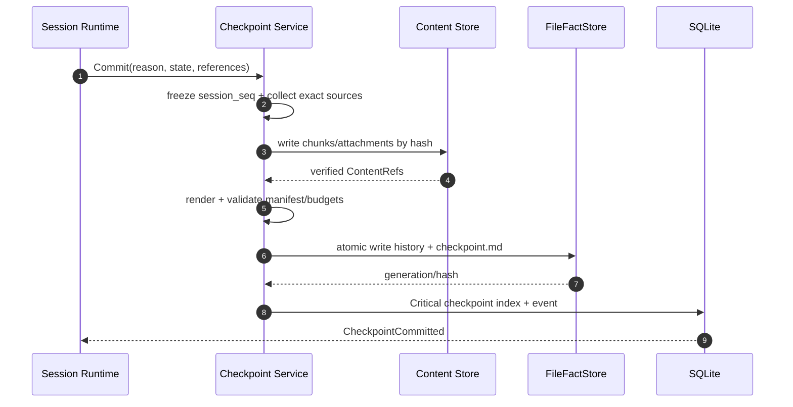
```mermaid
sequenceDiagram
    autonumber
    participant R as Session Runtime
    participant C as Checkpoint Service
    participant O as Content Store
    participant F as FileFactStore
    participant D as SQLite

    R->>C: Commit(reason, state, references)
    C->>C: freeze session_seq + collect exact sources
    C->>O: write chunks/attachments by hash
    O-->>C: verified ContentRefs
    C->>C: render + validate manifest/budgets
    C->>F: atomic write history + checkpoint.md
    F-->>C: generation/hash
    C->>D: Critical checkpoint index + event
    D-->>R: CheckpointCommitted
```

只有 SQLite critical commit 成功后，Runtime 才把 Checkpoint 视为新的恢复头。文件已写而 DB 失败时由 reconciliation 补齐；块缺失或 hash 错误时该 Checkpoint 无效并回退到上一完整 Checkpoint。

### 8. 无损恢复

```mermaid
flowchart TD
    Start[选择最新/指定 Checkpoint] --> Verify[校验 Manifest、chunks、attachments]
    Verify -->|失败| Prev{有上一完整 Checkpoint?}
    Prev -->|是| Verify
    Prev -->|否| Corrupt[阻塞并生成损坏报告]
    Verify -->|通过| Snapshot[加载 Query Snapshot as_of_seq]
    Snapshot --> Tail[应用 event tail]
    Tail --> Effects{未完成副作用状态}
    Effects -->|幂等/未开始| Resume[恢复 DAG/Agent]
    Effects -->|未知| Block[UnknownSideEffect]
    Resume --> Epoch[重建 Context Epoch]
    Epoch --> Ready[恢复可执行]
```

恢复产物必须能回答：用户原始意图、批准 Spec、当前任务/路径、已完成/未完成、Tool 结果、权限、附件、最后权威 seq 和未知副作用。缺一项不能宣称“无损”。

### 9. Checkpoint 保留

- Session 活跃期：全部保留。
- 最后活动 120 天：随 Session 进入归档，仍可完整恢复。
- 365 天：随 Session 归档删除；未被其他对象引用的块进入 GC。
- Pinned：永久作为 GC root，直到用户取消 pin；即使 Session 归档删除也保留必要 Manifest/块。
- 删除和 pin/unpin 都记录 event/trace，但不会修改旧 Manifest。

### 10. Memory 作用域与文件格式

位置：

- Project：`<root>/.apex/memory/*.md`。
- Global：`~/.apex/memory/*.md`。

```markdown
---
schema: apex.memory.v1
memory_id: 0198...
scope: project
project_id: 0198...
title: Permission tests use golden AST fixtures
tags: [permission, testing]
source:
  kind: session
  session_id: 0198...
  event_ids: [0198...]
reason: Reusable project convention discovered during verification
created_by: agent
created_at: 2026-08-11T16:00:00+08:00
content_hash: blake3:...
---

权限语义测试必须覆盖 AST golden fixture、属性测试和跨平台路径等价性。
```

Agent 自动写入前必须生成 `MemoryWriteProposal`，包含正文、来源、理由、作用域和敏感检测结果。用户手工写入仍经 watcher 索引与敏感提示，但不被静默删除。

### 11. 敏感内容保护

默认静态检测：Provider Key/token 格式、高熵字符串、私钥头、凭据文件路径、常见密码字段、连接串和用户配置的 pattern。命中时：

1. 阻止自动提交。
2. UI 展示已脱敏类别、来源和风险，不回显完整 Secret。
3. 用户只能对本次 proposal 逐次确认；不能创建“永远允许敏感 Memory”的 grant。
4. 即便确认，Provider Key 和 Apex 日志私钥仍属于硬禁止，不能写 Memory。

### 12. FTS5 与召回

- `memory_index` 保存文件路径、scope、hash、时间、tags、语言、删除状态。
- `memory_fts` 索引 title/body/tags，内容从 Markdown 派生，文件仍是事实源。
- tokenizer 可按 Project 配置 `unicode61` 或 `jieba-rs`；中文默认 jieba，混合文本保留 Unicode token fallback。
- 排序综合 BM25、scope（当前 Project > 当前 Workspace 其他 root > Global）、recency、显式 pin/tag 和重复抑制。
- 自动召回只取预算内 top-k，写入 `memory.recalled`：query hash、MemoryId、分数、注入 Turn/时机、引用片段 hash 和 trace。

### 13. UI、删除与导出

- 三端显示某条 Memory 在哪个 Turn、Provider 请求前的哪个 Context Epoch 被引用，以及为何命中。
- 删除先原子删除/移动 Markdown，再更新索引和 FTS，产生 tombstone event；外部重新创建同 ID 必须作为冲突处理。
- 导出可选择 Project/Global、时间、tag，生成包含原 Markdown 与 manifest/hash 的文件包。
- 多根 Workspace 的 Project Memory 不自动复制到中央 Workspace；召回时按 Root scope 联合查询。

### 14. 故障与降级

- FTS 索引损坏：从 Markdown 全量重建；重建期间提供文件名/tag 退化查询并明确状态。
- jieba 初始化失败：回退 unicode61 并记录 degraded，不能改变文件事实。
- 摘要 Provider 失败：回退当前模型；仍失败则停止摘要并请求用户/等待释放 Context。
- Checkpoint 文件冲突/损坏：回退上一完整版本并阻塞当前有损动作。
- 附件格式 Provider 不支持：保留原 Artifact，按 capability 转码/抽取或要求用户选择，不丢弃原件。

---

<!-- 源文件：docs/11-agent-dag-snapshot-replay.md -->

## 章 12 · Agent、DAG、Snapshot 与重放

### 1. Agent 模型

Agent Execution 是一次有明确任务、父级、Provider Profile、权限上限和工作区范围的执行实例。父 Agent 可以创建只读或可写 Subagent；可写 Subagent 必须声明非空 `write_paths`。

```text
AgentExecutionSpec {
  task_id, exact_task_description,
  parent_agent_execution_id?, agent_profile,
  provider_profile_override?, model_override?,
  read_scope, write_paths[], permission_ceiling,
  expected_outputs[], completion_schema,
  timeout, idempotency_class
}
```

`exact_task_description` 原样出现在三个客户端的活动面板与会话日志摘要中。Subagent 不能把模糊“帮我处理一下”当作可调度任务。

### 2. DAG 来源与版本化 IR

DAG 仅来自：

1. 已批准 `tasks.md` 中的任务/依赖/路径声明。
2. `.apex/workflows/*.yaml`（单根）或多根 Workspace 中央 `workflows/*.yaml`。

不嵌入 QuickJS、Lua 或任意调度脚本。YAML 编译为不可变 `VersionedDagIr`，绑定 source hash、schema version、Spec approval、规则 profile 和编译器版本。

```yaml
schema: apex.workflow.v1
id: permission-engine
stages:
  - id: contracts
    nodes:
      - id: ast-fixtures
        task: T-03
        write_paths: ["crates/apex-command-ast/**"]
      - id: policy-core
        task: T-04
        write_paths: ["crates/apex-permission/**"]
    join:
      id: contract-review
      strategy: parent
  - id: integration
    depends_on: [contracts.contract-review]
    nodes:
      - id: gateway-integration
        task: T-05
        write_paths: ["crates/apex-tool-gateway/**"]
        provider_profile: deepseek-coder
```

未知字段按 Schema 策略保留；未知且影响执行语义的字段使编译失败，不允许旧 daemon 忽略后继续写。

### 3. DAG 执行结构

```mermaid
flowchart LR
    Start([DAG admitted]) --> Stage1[阶段: contracts]
    Stage1 --> A[ast-fixtures]
    Stage1 --> B[policy-core]
    A --> Join[父 Agent 汇聚]
    B --> Join
    Join --> Merge{输出/路径冲突?}
    Merge -->|否| Stage2[阶段: integration]
    Merge -->|是| M[受限 Merge Subagent]
    M -->|成功| Stage2
    M -->|失败| Human[人工解决]
    Stage2 --> C[gateway-integration]
    C --> Verify[增量/完成验证]
```

Node 成功必须产生结构化 `NodeCompletion`：完成摘要、输出 artifacts、变更路径、测试证据、未解决风险、child results 和 side-effect receipt。自由文本结论不能单独驱动下游状态。

### 4. 调度与限流

默认限额：

- 全局活跃 Agent：`min(8, logical_cpu_count)`。
- 全局可写 Agent：4。
- 单 Provider 并发：4。
- 用户可配置硬上限，但不得超过 `min(32, 2 × logical_cpu_count)`。

还可叠加 Project、Workspace、Agent Profile、终端、MCP Server 和内存压力限额；最小值生效。

Ready Queue 按 priority、ready time、Task ID 稳定排序，但采用“公平扫描”避免队首阻塞：首项因路径 Claim/Provider 限流暂不可运行时，可以启动后续不冲突节点；等待时间形成 aging boost，防止长期饥饿。每次调度决定记录 ready set hash、limiter snapshot、被跳过原因和获选节点，支持状态重放与问题诊断。

### 5. Node 状态机

```mermaid
stateDiagram-v2
    [*] --> Pending
    Pending --> Ready: dependencies satisfied
    Ready --> Claiming: selected
    Claiming --> Running: claims + admission acquired
    Claiming --> Ready: temporary conflict
    Running --> Waiting: permission/user/mailbox/provider wait
    Waiting --> Running: resolved
    Running --> Paused: safe-point pause
    Paused --> Ready: resume and revalidate
    Running --> Blocked: spec/merge/unknown side effect
    Blocked --> Ready: explicit resolution
    Running --> Succeeded: outputs + gates pass
    Running --> Failed: terminal failure
    Running --> Compensating: rollback requested
    Succeeded --> Compensating: partial rollback requested
    Compensating --> Compensated: compensation succeeds
    Pending --> Canceled
    Ready --> Canceled
```

状态名称以 [04](#章-5-领域模型与事件语义) 为准。本图只说明合法转换。

### 6. `write_paths` 与 Claim

Claim 复用 Permission 的规范路径语义：最深已存在祖先、symlink/junction、大小写折叠、Unicode、设备/UNC 和不存在目标都在获取前处理。

冲突规则：

- 同一路径、父子递归 Scope、等价大小写 key 冲突。
- 读 Scope 默认不互斥；Tool 声明需要一致读取时可获取 Read Snapshot 而非长读锁。
- 父 Agent 在创建可写子任务时预留子 `write_paths`，父自身不得同时写重叠范围。
- 嵌套 Subagent 请求若超出父预留范围立即 fail-fast，不进入无限等待。
- 租约有 owner、fencing token、TTL 和续租；过期 owner 的旧 fencing token 不能提交 Tool result。

```mermaid
sequenceDiagram
    autonumber
    participant S as Scheduler
    participant C as Claim Service
    participant N1 as Node A
    participant N2 as Node B

    S->>C: normalize + acquire(A paths)
    C-->>N1: lease token=41
    S->>C: normalize + acquire(B paths)
    alt 路径重叠
        C-->>S: conflict(owner=A, retry hint)
        S->>S: 扫描后续 Ready node
    else 不重叠
        C-->>N2: lease token=42
    end
    N1->>C: commit evidence with fencing=41
    C-->>N1: accepted
    N1->>C: release
```

### 7. 扩展写路径

Agent 发现需要额外路径时不能临时申请“更宽 grant”继续：

1. 到达安全点并暂停 Node。
2. 提交 `PathExpansionProposal`：原因、新路径、受影响 AC/任务/依赖和风险。
3. 修改 `tasks.md` 或 Workflow，触发 Tasks 审批失效。
4. 用户重新批准。
5. 编译新 `VersionedDagIr`，校验已完成节点是否仍有效。
6. 释放旧 Claim，按新路径重新获取后恢复。

### 8. 共享工作区与 worktree

默认共享用户当前工作区，使变更即时可见。满足以下任一条件可在 Task/策略中选择 worktree：高风险大范围重构、相互可能改同一逻辑文件但需探索、第三方工具不可限制写入、用户明确要求隔离。

worktree 仍受 Permission/Claim/Spec Gate；它只是文件隔离，不是安全沙箱。汇聚前计算基线、worktree 和当前主工作区三方 diff，不自动 commit 或改写用户分支。

### 9. Subagent 通信与汇聚

- 默认：Subagent 只向父级提交 `NodeCompletion`，父级决定上下文注入和下游输出。
- 只有 DAG 显式 `communication_edges` 才创建持久 mailbox；消息有 schema、seq、sender/receiver、trace、预算和 attachment refs。
- 未声明边的跨 Agent 发送被拒绝并审计，避免隐式耦合和非确定调度。
- Mailbox 消息先持久化再通知；重放按 seq 复用，不重复发送外部副作用。

汇聚冲突处理：

1. 无重叠 diff：父级确定性组合。
2. 文本可三方合并：受限 Merge Subagent 只获得冲突文件和必要上下文，`write_paths` 仅冲突路径。
3. Merge Subagent 通过 Rules/Test 后提交结果。
4. 失败：保留 base/ours/theirs artifact，Node/DAG `Blocked::MergeConflict`，等待人工处理。

### 10. 崩溃恢复

启动恢复对每个遗留 Node/Tool 分类：

| 证据 | 恢复动作 |
|---|---|
| 未开始副作用 | 回到 Ready |
| Tool 明确幂等，idempotency key/receipt 可复用 | 自动继续/查询原结果 |
| Tool 成功事件已提交 | 复用结果，推进后续 reducer |
| 进程被中断但无外部副作用证据 | 标记 Interrupted，按策略重试 |
| 是否执行未知、外部副作用不幂等 | `Blocked::UnknownSideEffect` |
| Claim owner 消失 | 过 TTL 回收，fencing token 作废 |

Provider 调用可根据厂商 idempotency/response id 查询或重试；不能证明时允许重新请求，但新响应属于新 attempt 并保留分叉证据。

### 11. 内容寻址 Snapshot

Snapshot 捕获 `write_paths` 在 Tool/Node 前的纯文件状态：

```json
{
  "schema": "apex.snapshot.v1",
  "snapshot_id": "0198...",
  "workspace_id": "0198...",
  "base_generation": 22,
  "paths": [
    {"path":"src/lib.rs","kind":"file","mode":420,"content":"blake3:..."},
    {"path":"src/link","kind":"symlink","target":"../shared"},
    {"path":"new.txt","kind":"absent"}
  ],
  "manifest_hash": "blake3:..."
}
```

- 文件块进入 CAS，重复内容去重；Manifest 不可修改。
- 保存相对路径、文件类型、内容 hash、权限位/Windows 属性中可移植子集、symlink target 与 absent marker。
- 不创建 Git commit/branch/index，不要求 clean worktree。
- 捕获时若路径在扫描期间变化，重试有限次数后阻塞；不能生成混合时间点 Snapshot。
- 恢复前先捕获当前状态为安全 Snapshot；当前状态偏离预期 post-state 时三方比较，避免覆盖用户后续修改。

### 12. 两种重放

#### 12.1 确定性状态重放

目标是重建状态，不重新做工作：

- 从 Checkpoint/Snapshot 加载基线，按 Durable Event 顺序运行 Reducer。
- Provider 结果、Tool 结果、权限决定、调度选择、Mailbox 消息和 Snapshot 引用全部复用。
- 不发网络、不执行 Shell、不启动 MCP/Plugin、不写项目文件（除显式恢复 Snapshot 的受控步骤）。
- 结果必须达到相同已记录 projection hash；不一致视为 Reducer/Schema 缺陷。

#### 12.2 再执行重放

目标是基于原计划重新运行，结果仅“尽力复现”：

1. 创建新 Run/trace，不篡改原历史。
2. 解析原 Tool/Provider/MCP/文件副作用，生成可读清单和风险等级。
3. 继承原权限上限和 grant；任何新资源/扩权另行询问。
4. 用户对整体高风险副作用清单做一次启动确认；各硬禁止和运行时新风险仍可再次阻塞。
5. 重新调用 LLM/Tool，记录模型/版本/config/seed（若支持），不承诺逐字输出一致。
6. 对比原 Run 的 artifacts、tests、events 和 final state，生成 Replay Report。

### 13. 暂停、恢复与部分回滚

- Pause Request 将 Session/DAG 置 `Pausing`，停止提升新 inbox/Ready Node；活跃任务在最近安全点 Checkpoint 后进入 Paused。
- Resume 重新校验 Project Trust、Spec hash、grant、Claim、Provider capability 和文件 generation；不能直接复用过期前提。
- 部分回滚是补偿：选择目标 Node/Tool，计算受影响后继闭包，按逆依赖顺序调用声明的 compensation 或恢复 Snapshot。
- 历史 `Succeeded` 事件不删除；追加 `compensation.applied`，投影显示已补偿。
- 没有补偿器且恢复会覆盖未知用户变更时转人工，不假装可逆。

```mermaid
flowchart TD
    Select[选择回滚目标] --> Impact[计算后继影响闭包]
    Impact --> Plan[列出补偿/文件恢复/外部副作用]
    Plan --> Confirm{高风险确认}
    Confirm -->|拒绝| Stop[不改变状态]
    Confirm -->|通过| Reverse[逆拓扑执行补偿]
    Reverse --> Verify[Rules/Test/Projection 验证]
    Verify -->|通过| Done[Compensated]
    Verify -->|失败| Block[Blocked + 人工恢复]
```

### 14. 验证重点

- 随机 DAG 的拓扑、限流、公平性、暂停恢复与 crash injection 属性测试。
- Claim 的路径等价、TTL/fencing、父子预留、队首绕行与饥饿测试。
- Snapshot 在三平台的内容/权限/symlink/不存在路径捕获恢复测试。
- 状态重放 projection hash 一致性；再执行重放不得复用原 event id。
- 未知副作用、合并失败和补偿失败必须稳定进入 Blocked，不能自动标成功。

---

<!-- 源文件：docs/12-provider-multimodal.md -->

## 章 13 · Provider 与多模态设计

### 1. 设计目标

Provider 层统一 Agent Runtime 需要的最小语义，同时保留厂商专属能力。禁止用“所有接口都长得像 OpenAI”换取表面统一，从而丢失 reasoning、cache、Realtime、文件 API 或 continuation 优化。

```mermaid
flowchart TB
    Agent[Agent Runtime] --> Core[apex-provider-core\nModelRequest / ProviderFrame / Capabilities]
    Core --> A[Anthropic Adapter]
    Core --> O[OpenAI Adapter]
    Core --> D[DeepSeek Adapter]
    Core --> K[Kimi Adapter]
    Core --> C[OpenAI-Compatible Adapter]
    A --> PA[Anthropic API]
    O --> PO[OpenAI API]
    D --> PD[DeepSeek API]
    K --> PK[Kimi API]
    C --> PX[通义 / 智谱 / 自定义端点]
```

### 2. 统一核心模型

核心类型：

- `ModelRequest`：system/source refs、规范化 messages、Tool descriptors、attachments、sampling、output limits、trace context。
- `ProviderFrame`：text delta、reasoning delta/summary、Tool call delta、audio frame、usage、provider metadata、completed/error。
- `ModelCapabilities`：input/output modality、Tool、parallel Tool、reasoning、structured output、context limit、stream、realtime、file API、cache、seed 等。
- `ProviderError`：authentication、rate limit、quota、timeout、transport、invalid request、content policy、capability、server、canceled。
- `ProviderExtension`：按 adapter 命名空间保存可选配置/metadata，不进入通用领域分支。

Agent Runtime 只按 capability 决策，不按 provider name 写 `if/else`。专属 Adapter 负责统一模型与厂商 DTO 的双向转换。

### 3. Adapter 边界

| crate | 首版专属优化通道 |
|---|---|
| `apex-provider-anthropic` | content blocks、Tool use/result、prompt cache、thinking/reasoning、流事件 |
| `apex-provider-openai` | Responses、structured output、Tool、reasoning、file/image/audio、Realtime |
| `apex-provider-deepseek` | reasoning content、Tool/stream、模型限制与错误映射 |
| `apex-provider-kimi` | 长上下文、文件/多模态/推理能力与模型差异 |
| `apex-provider-openai-compatible` | 可配置 base URL、headers、model/capability override、标准 chat/tool 流 |

通义、智谱和其他兼容端点首版通过 Compatible Adapter；未来新增专属 crate 时保持相同 `Provider` Trait 和 Profile ID 迁移，不要求 Agent Runtime 改写。

### 4. Provider 配置与 Key

`~/.apex/config/providers.toml`：

```toml
version = 1

[[profiles]]
id = "openai-main"
adapter = "openai"
api_key = "<user-provided-key>"
default_model = "<model-id>"
enabled = true

[[profiles]]
id = "qwen-compatible"
adapter = "openai-compatible"
base_url = "https://example.invalid/v1"
api_key = "<user-provided-key>"
default_model = "<model-id>"
capability_overrides = ["text", "tools", "stream"]
```

- Unix 文件模式必须为 0600、父目录 0700；Windows ACL 只允许当前用户。权限过宽时 daemon 默认不加载 Key，并指导修复。
- Key 明文只在配置解析器/`SecretResolver`/Adapter 请求构建的最短生命周期内存在；使用 zeroize-capable 容器并禁止 Debug/Serialize。
- Key 不写 SQLite、日志、领域事件、Spec、Checkpoint、Memory、Snapshot、诊断包或子进程环境。
- 配置 watcher 支持用户编辑；新 Key 生效前做权限/格式检查，日志只记录 profile id 与 key fingerprint 的不可逆短 hash。

### 5. Secret Firewall

所有通用出口在 sink 前检测 Secret：日志、事件 payload、Markdown writer、Memory、Checkpoint、Tool output、panic/error chain、诊断包。Adapter 错误先结构化映射，再丢弃可能回显 authorization header/request body 的 raw error。

Provider 请求的完整 body 默认不记录；Debug 只记录 schema、长度、token、内容 hash、脱敏统计和厂商 request id。即使会话启用全文日志，Key/authorization/cookie/private key 仍为硬脱敏。

### 6. 路由、继承与覆盖

解析优先级：

1. DAG Node 显式 Provider/模型。
2. Agent Profile 显式 Provider/模型。
3. 父 Agent 当前 Provider/模型（Subagent 默认继承）。
4. Session 默认。
5. Project/全局默认。

覆盖前检查任务所需 capability；不满足则在启动前阻塞并显示缺失项，不在执行中静默降低质量。Provider/模型选择、capability snapshot 和配置 hash 写入 Run/Agent 事件，但不含 Key。

### 7. 故障转移

默认 `failover.enabled=false`，Provider 失败不会自动切换。用户可配置有序链：

```toml
[[failover_chains]]
id = "coding"
profiles = ["anthropic-main", "openai-main", "deepseek-main"]
retryable_errors = ["timeout", "transport", "rate_limit", "server"]
max_switches = 2
```

切换条件：

- 只处理链中允许且被分类为 retryable 的错误；authentication、content policy、invalid request、用户取消不切换。
- 新 Provider 必须满足当前请求 capability、数据政策和 modality。
- Tool call 已部分执行、Realtime session、厂商文件句柄或 continuation 无法移植时，必须到安全点/阻塞，不能直接切换。
- 切换建立新 Context Epoch；厂商专属 reasoning/cache/continuation metadata 不兼容时降级并记录。
- 每次尝试、延迟、切换理由和最终选择可审计；防止多 Provider 重试风暴。

```mermaid
flowchart TD
    Req[Provider Request] --> P1[Primary]
    P1 -->|成功| Done[返回]
    P1 -->|失败| Class{允许故障转移?}
    Class -->|否| Fail[返回结构化错误]
    Class -->|是| Safe{当前边界可移植?}
    Safe -->|否| Block[安全点暂停/用户处理]
    Safe -->|是| Cap{下一 Profile capability 满足?}
    Cap -->|否| Next[检查下一项]
    Cap -->|是| Epoch[新 Context Epoch + 记录降级]
    Epoch --> P2[Next Provider]
```

### 8. 重试、限流与取消

- Adapter 解析 `Retry-After`/厂商 rate limit header；指数退避带抖动，受 Run deadline 和单 Provider concurrency limiter 控制。
- 只重试幂等/未开始响应请求；流已产生可见内容时重试创建新 attempt，并由 Agent Runtime 决定是否保留部分输出。
- 客户端/Run 取消必须传播到 HTTP stream、Realtime session 和上传；取消完成有超时与连接回收。
- 单 Provider 默认并发 4，与 DAG 全局限流取最小值；实时语音连接单独计配额但仍受 Profile limit。

### 9. 多模态能力

Apex 不支持实时视频；视频能力仅限上传/引用视频文件并由 Provider 原生处理或受控抽帧。

| 模态 | 输入 | 输出/交互 | 客户端 |
|---|---|---|---|
| 文本 | 是 | 流式文本/结构化输出 | 三端 |
| Tool | JSON schema/tool result | Tool call delta/result | 三端 |
| 推理 | Provider 支持时 | 可见摘要/受限 reasoning frame | 三端 |
| 图片 | 文件/剪贴板/路径 | 文本分析或 Provider 图片输出（能力允许） | 三端输入，TUI 路径方式 |
| 文件 | 文本/二进制 Artifact | 引用/抽取/Provider file handle | 三端 |
| 音频文件 | 上传/录音 | 转写/音频输出 | Desktop/Web |
| 实时双向语音 | microphone stream | audio stream + transcript | Desktop/Web |
| 视频文件 | Artifact | 抽帧/原生视频输入（Provider 能力允许） | 三端引用，Desktop/Web 完整交互 |
| 实时视频 | 不支持 | 不支持 | 全部无入口 |

TUI 可以提交图片/视频文件路径，但不提供音频录制、播放和实时语音；收到音频输出时只显示“该内容需在 Desktop/Web 查看”的 Artifact，不自动播放。

### 10. Attachment 流程

```mermaid
sequenceDiagram
    autonumber
    participant C as Client
    participant A as Attachment Service
    participant CAS as Content Store
    participant P as Provider Adapter

    C->>A: import(file/stream, declared MIME)
    A->>A: magic bytes、大小、解压炸弹、恶意格式检查
    A->>CAS: 保存原始 Artifact
    CAS-->>A: content ref
    A->>P: adapt(content ref, model capabilities)
    alt Provider 原生支持
        P->>P: upload/embed 并记录临时 handle
    else 可安全转换
        A->>A: 转码/文本抽取/视频抽帧
        A->>CAS: 保存派生 Artifact + provenance
    else 不支持
        P-->>C: CapabilityUnsupported + 可选动作
    end
```

原始 Artifact 永不因转码被覆盖；派生物记录 source hash、工具版本和参数。上传 Provider 的 file id/expiry 属于 Adapter metadata，不作为长期唯一附件引用。

### 11. 实时语音

- Desktop/Web 向 `apexd` 建立受认证的本地音频 stream，daemon 再连接支持 Realtime 的 Provider。
- 协商采样率、声道、codec、VAD/turn detection；不支持时返回明确能力错误或在用户同意后使用“录音文件→普通请求”降级。
- 音频帧是 Transient Event；最终 transcript、AgentMessage、usage 和 Artifact 引用才持久化。
- 断线时关闭 microphone capture 和远端 session，避免后台持续采集；UI 始终显示录音状态。

### 12. Provider 契约测试

每个 Adapter 必须通过：

- 文本、Tool、并行 Tool、structured output、usage 和 stop reason 映射。
- 流分片任意切割、UTF-8 边界、取消、超时、429/5xx、半关闭和异常 payload。
- capability 探测/配置与实际请求一致，不能宣称不支持的模态。
- Provider-native reasoning/continuation 在同模型复用、跨模型降级。
- Key/authorization 不进入 Debug、error、event、Checkpoint 或日志 fixture。
- 录制回放使用脱敏 fixture；少量 sandbox live tests 由用户/CI Secret 显式启用，不作为离线单测依赖。

### 13. 隐私与可审计性

- Apex 不自动遥测 Provider 使用；token/延迟/错误元数据仅本地保存。
- UI 在发送前显示目标 Profile、base URL 域名、将上传的 Artifact 与是否可能离开本机。
- 自定义 OpenAI-Compatible endpoint 默认视为外部不可信端点，必须显式启用；禁止把 localhost/内网地址当作无风险。
- 诊断包默认只包含 profile 配置结构和 endpoint hash/域名脱敏，不包含 Key、请求正文或附件。

---

<!-- 源文件：docs/13-skills-mcp-plugins.md -->

## 章 14 · Skills、MCP 与 Plugin 扩展系统

### 1. 总体边界

```mermaid
flowchart LR
    Sources[外部/自有配置来源] --> Scan[只读扫描与规范化]
    Scan --> Catalog[Catalog + Provenance + Content Hash]
    Catalog --> Trust{信任有效?}
    Trust -->|否| UI[面板确认]
    Trust -->|是| Activate[显式启用/调用]
    UI --> Activate
    Activate --> TG[Tool Gateway / Permission]
    Activate --> Host[Plugin Host 或受控 MCP 进程]
```

发现、信任、启用和执行是四个独立状态。扫描外部配置不会启动服务、执行脚本、加载动态库或回写来源。

### 2. Skill 来源兼容

首版扫描器保证 Claude 与 Codex Skill 生态兼容，同时支持 Apex 自有目录：

| 来源 | 用户级 | Project 级 |
|---|---|---|
| Claude | `~/.claude/skills/` | `<root>/.claude/skills/` |
| Codex | `~/.codex/skills/` | `<root>/.codex/skills/` |
| Apex | `~/.apex/skills/` | `<root>/.apex/skills/` |

每个扫描器实现来源探测、`SKILL.md`/资源解析、frontmatter 兼容、symlink 安全和 provenance。未知 frontmatter 字段保留，不因 Apex 不理解而破坏外部文件。

同名 Skill 不静默覆盖：Catalog ID 为 `<source-kind>:<scope>:<canonical-name>@<content-hash-prefix>`。UI 可设置优先项；未设置且有歧义时要求显式选择。Project 来源优先只影响推荐，不自动获得信任。

### 3. Apex frontmatter 扩展

标准字段保持原生态语义，Apex 扩展集中在 `apex:` 命名空间：

```yaml
---
name: spec-driven-coding
description: Enforce a reviewable Spec workflow
apex:
  schema: v1
  pipeline_stages: [requirements, design, tasks, coding, verification]
  activation: automatic_or_explicit
  required_tools: [read, search]
  optional_mcp_servers: [context7]
  write_paths: ["specs/**"]
  permission_ceiling: ask
  supported_clients: [tui, desktop, web]
---
```

- `pipeline_stages` 将 Skill 绑定到阶段；不在当前阶段的自动激活被拒绝，但用户可在允许范围内显式调用。
- Skill 声明的 `write_paths`/Tool 只是请求上限，不能扩大 Tasks、Permission 或 Project Trust。
- 解析器验证路径、枚举和字段类型；无效扩展不影响外部工具读取标准字段，但 Apex 不激活该 Skill。

### 4. Skill 信任

信任记录绑定：source kind、canonical path、文件树内容 hash、可选签名/发布者、scope、批准人、时间和允许能力。默认状态为 Untrusted。

以下变化立即使信任失效：`SKILL.md`、引用资源、脚本、可执行文件、symlink target、签名或来源 commit 变化。只改 mtime 不失效；内容 hash 不变可保留。

Skill 指令是上下文，不是系统权限。Skill 中的 Shell/脚本/Hook 必须作为 Tool Invocation 经过 Spec Gate、Permission、Claim、Checkpoint 和日志；Skill 不能声明“自动批准”。

### 5. MCP 来源扫描

扫描 Adapter 首版覆盖：

- Claude Desktop：平台用户配置中的 `claude_desktop_config.json`。
- Claude Code：`~/.claude.json`、用户/Project `.mcp.json` 等受支持配置。
- Cursor：用户和 Project `.cursor/mcp.json`。
- VS Code：用户 settings 与 Project `.vscode/mcp.json`/受支持 MCP 配置。
- Codex：`~/.codex/config.toml` 及 Project 配置。
- Apex：`~/.apex/config/mcp.toml` 和 Project override。

路径细节由版本化 Source Adapter 管理并在 UI 展示；找不到文件是正常结果，不创建来源配置。

规范化实体包含 server name、transport（stdio/HTTP/SSE/Streamable HTTP）、command/args、cwd、env key 名（Secret 值不入索引）、URL、OAuth 配置、来源路径、JSON/TOML pointer 和 content hash。

同一服务从多个来源发现时以 fingerprint 聚合，但保留每个 provenance；冲突字段不自动合并，UI 要求选择具体来源/覆盖。

### 6. MCP 启用与来源回写

- 扫描结果初始为 Discovered/Disabled，不创建进程或网络连接。
- 面板“一键启用”只写 Apex enable override，随后按权限/信任启动；关闭写 disable override 并清理连接/进程树。
- 默认不修改 Claude/Cursor/VS Code/Codex 文件。
- 用户选择“同步回来源”时，显示精确 diff、备份原文件、使用 optimistic hash 原子写；来源已变化则三方合并/阻塞。
- Apex-owned `mcp.toml` 可直接编辑，但仍经 watcher 和 schema 校验。

### 7. MCP 生命周期与安全

```mermaid
stateDiagram-v2
    [*] --> Discovered
    Discovered --> Enabled: 用户启用覆盖
    Enabled --> Starting: 首次调用/显式启动
    Starting --> Running: initialize + capability list
    Starting --> Failed: spawn/auth/protocol error
    Running --> Stopping: disable/idle/update
    Stopping --> Discovered: disabled
    Running --> Failed: crash/heartbeat timeout
    Failed --> Starting: 用户/受限退避重试
```

- stdio server 使用清洗后的环境、受控 cwd、进程树/Job Object；命令启动先过 Permission。
- HTTP 目标按 Network Policy 判权，重定向和 DNS 每跳复核。
- OAuth 使用 state、PKCE、精确 loopback callback、短期 nonce；token 属于 Secret，不进入 DB/日志/Markdown。
- MCP Tool 调用仍经 Tool Gateway；服务声明的 schema 不代表副作用已可信。
- 活动事件包含 `mcp_server_id`、显示名和 tool 名，三端面板实时展示。
- 列表变化、server restart 和 protocol error 产生可审计事件；详细 wire payload 默认只记 hash/长度。

### 8. 原生 Plugin 包

Plugin 支持本地目录、Git 和文件包，不建设 Marketplace。包至少包含：

```text
plugin-package/
├── apex-plugin.toml
├── lib/<target-triple>/<dynamic-library>
├── resources/
└── signatures/manifest.ed25519
```

Manifest：

```toml
schema = 1
id = "example.formatter"
version = "1.2.0"
api_major = 1
entry_symbol = "apex_plugin_entry_v1"
capabilities = ["tool-provider"]
requested_host_capabilities = ["read-workspace", "emit-diagnostic"]
publisher = "example"
```

跨动态库边界只用稳定 C ABI、显式长度/所有权和 `repr(C)` POD/handle；禁止暴露 Rust trait object、`String`、panic 或 allocator ownership。所有 FFI 输入做空指针、长度、UTF-8、版本与线程安全校验。

### 9. Plugin 隔离策略

| Plugin | 加载位置 | 条件 |
|---|---|---|
| Apex 官方签名 | `apexd` 进程内或 Plugin Host | 签名链、hash、版本和 allowlist 全部通过 |
| 第三方/未签名/用户构建 | 独立 `apex-plugin-host` | 永不加载进 `apexd` 地址空间 |

官方签名只降低供应链风险，不能消除内存安全/逻辑缺陷；进程内 API 极小且可关闭。第三方 Host 通过版本化本地 RPC 请求能力，不能直接取得 DB、Provider Key 或 daemon 内部指针。

Host capability 由 broker 实现：文件/网络/Tool 请求再次经过 Permission 和 Project scope。Host crash 只使对应 Plugin 失败，daemon 保持运行；重复 crash 触发熔断并要求用户重新启用。

### 10. Plugin 安装与更新

- 本地目录：记录 canonical path/hash，内容变化信任失效。
- Git：clone 到 Apex 管理目录，锁定 commit，展示 remote/commit/signature；更新是显式新版本安装。
- 文件包：先解压到临时目录，防 zip slip/炸弹，验证 manifest/hash/signature 后原子发布。
- 卸载先停用/终止 Host，保留配置备份与审计；不删除 Plugin 产生的用户项目文件。
- Plugin API Major 不同拒绝加载；同 Major 只追加 capability/字段，未知 capability 不授予。

### 11. 扩展事件与 UI

Catalog Query 对每项显示：来源、版本/hash、信任、启用、运行状态、请求能力、最后错误、被哪个 Session/Agent 使用。活动面板不只显示 Tool 名，还显示 Skill/MCP/Plugin 来源链。

关键事件：发现变化、信任授予/失效、启用/停用、来源同步、进程启动/退出、OAuth 授权、Plugin crash/熔断。Secret 和外部完整配置不进入事件 payload。

### 12. 供应链验证

- 对 Skill/Plugin 文件树做确定性 hash，拒绝目录穿越、设备文件、危险 symlink 和可执行文件伪装。
- Git 安装限制协议/host policy，默认不运行 submodule、hook、build script；构建原生 Plugin 是独立高风险 Tool 流程。
- Plugin 包生成 SBOM/依赖清单；官方签名私钥不存于用户 Apex Home。
- 兼容性测试使用真实 Claude/Codex Skill fixture、各 MCP 来源 fixture 和损坏/恶意包 corpus。

---

<!-- 源文件：docs/14-install-upgrade-operations.md -->

## 章 15 · 安装、升级与运维

### 1. 支持矩阵与发行物

主交付物是**可双击运行的自包含应用包**（`RQ-116`、`RQ-124`）：应用包内自带 `apexd`、字体回退与默认规则集，运行期不从网络拉取必需依赖。

| OS | 架构 | 主发行物（双击运行） | 随包组件 |
|---|---|---|---|
| macOS | x86_64、arm64 | `Apex.app`（含 `Info.plist`、Retina 图标、签名 + notarization + Hardened Runtime） | `apexd`、Plugin Host、Updater |
| Windows | x86_64、arm64 | `Apex-Setup.exe` / `.msi`（开始菜单与桌面快捷方式） | `apexd.exe`、Plugin Host、Updater |
| Linux | x86_64、arm64 | `Apex.AppImage`（含 `.desktop` 桌面项与图标） | `apexd`、Plugin Host、Updater |

另提供 `apex` 命令行入口作为辅助（`apex --project <path>` 直接打开对应项目窗口），但**不再是主入口**。Tauri Desktop 与 Web 端仍按原计划交付，作为同一项目 daemon 的附加客户端。

每个制品有版本、target triple、SHA-256/BLAKE3、签名、SBOM 和构建 provenance。窗口应用二进制、`apexd`、内嵌 Web assets 和迁移代码必须来自同一 release manifest。

### 2. 安装与启动

- 安装器把应用包放入平台受管位置，用户数据始终位于 `~/.apex/`（Windows 的 `~` 展开为当前用户 Profile）。卸载保留用户数据，含全部 `~/.apex/projects/<project-hash>/` 分片。
- 启动流程：双击图标 → 窗口进程启动并渲染项目选择器 → 用户确认项目 → 获取项目级单实例锁 → 拉起该项目 `apexd` → 等待端点就绪与握手 → 进入主界面（`RQ-116`、`RQ-117`、`RQ-119`）。
- 全程不要求用户打开系统终端，也不弹出终端窗口。
- `apexd` 获得 `~/.apex/projects/<project-hash>/runtime/apexd.lock`（Windows 用按项目 hash 命名的 named mutex）。若同项目已有窗口持锁，新进程**聚焦已有窗口并退出**，不打开第二个 SQLite writer（`RQ-120`、`AC-023`）。
- 不同项目可并存多个窗口与 daemon，各自独立分片数据与端点（`RQ-007`、`RQ-121`、`AC-024`）。
- daemon 生命周期由窗口宿主持有：关闭窗口即停服，不常驻、不随登录自启（`RQ-119`）。
- 首次运行零配置：自动生成默认配置并直接进界面；配置缺失或非法时降级为默认值并给出非阻塞提示，不阻断启动（`RQ-123`、`AC-025`）。
- daemon 启动不自动打开 Web；TUI 完成握手后自动持有并续租 Web enable lease，只有存在有效 TUI 租约时才创建 listener。

### 3. 启动顺序

```mermaid
flowchart TD
    Click[双击应用图标] --> Win[窗口进程启动]
    Win --> Font[初始化字体栈/DPI/PixelBackend]
    Font --> Picker[渲染项目选择器（读最近项目列表）]
    Picker --> Pick[用户确认项目根]
    Pick --> PLock{获取项目级单实例锁?}
    PLock -->|已被持有| Focus[聚焦已有窗口并退出本进程]
    PLock -->|获得| Spawn[fork/exec apexd + 一次性握手令牌]
    Spawn --> Start[apexd 启动]
    Start --> Dirs[校验 ~/.apex 权限与分片目录, realpath 防逃逸]
    Dirs --> Config[解析配置；Secret 不进入通用状态]
    Config --> DB[打开分片 SQLite + quick_check]
    DB --> Schema{Schema 可兼容?}
    Schema -->|否| Recovery[只读恢复/升级提示]
    Schema -->|是| Projection[恢复 projector/outbox]
    Projection --> Runtime[恢复 Session/Tool/DAG]
    Runtime --> IPC[绑定 UDS/Named Pipe]
    IPC --> Jobs[启动 watcher/retention/update 等后台任务]
    Jobs --> Ready[Health=Ready]
```

IPC 只在数据库和关键恢复完成后宣告 Ready。Provider/MCP/Plugin 不在启动时批量连接，避免冷启动和外部副作用。

### 4. 健康状态

| 状态 | 行为 |
|---|---|
| `Starting` | 只允许握手/启动进度 |
| `Ready` | 正常命令与查询 |
| `Degraded` | 可查询，部分能力禁用并说明原因 |
| `ReadOnlyRecovery` | 禁止 Agent/Tool/写入，允许诊断与恢复 |
| `Draining` | 不接收新 Run，等待安全点更新/关闭 |

健康详情包括 DB、文件 watcher、Projector lag、日志 sink、CAS、端点、磁盘空间、版本兼容；不包含 Key/用户正文。

### 5. 发布通道

| 通道 | 检查 | 下载 | 安装 |
|---|---|---|---|
| Stable | 周期检查 | 用户确认后下载或按设置 | 提示用户确认安装 |
| Nightly | 周期检查 | 自动下载并验签 | 用户确认后安全点安装 |
| Development | 高频/本地源 | 自动下载并验签 | 默认在安全点自动安装，可配置禁用 |
| Enterprise | 类 Stable，可使用管理员私有更新源 | 按管理员源策略 | 提示确认；不包含组织管理能力 |

所有通道都验证 release manifest 和制品签名；私有源只能替换分发位置/信任根配置，不能绕过版本、Schema 和安全点检查。

### 6. 安全点升级流程

多窗口并存时的升级策略（`RQ-112`）：新版本安装后**不强制中断已运行的 daemon**。每个项目 daemon 继续服务到其窗口关闭为止；下次打开窗口时使用新版本 daemon。发布说明须明确此语义，避免用户以为升级已全量生效。若新旧版本 Schema 不兼容，旧 daemon 在关窗后不再可用，新窗口按迁移流程处理。

```mermaid
sequenceDiagram
    autonumber
    participant U as Update Manager
    participant D as apexd
    participant B as Backup
    participant H as apex-updater
    participant N as New apexd

    U->>U: 下载、hash/签名/SBOM 校验
    U->>D: RequestDrain(target_version)
    D->>D: 停止新 Run，等待 Tool/DAG 安全点
    D->>D: 强制 Checkpoint + flush logs/events
    D->>B: 升级前 DB/事实 Manifest 备份
    B-->>D: verified backup
    D->>H: installation plan + one-time handoff token
    D->>D: 关闭 IPC/DB 并退出
    H->>H: 原子替换/平台安装 + 启动新版本
    H->>N: health/migration check
    alt 健康
        N-->>U: installed
    else 失败
        H->>H: 回滚二进制；按兼容规则恢复备份
    end
```

用户可在有未知副作用的 Run 上拒绝 drain；Development 自动安装也不能强杀不安全 Tool。超时后保持已下载状态，下一安全点重试。

### 7. Schema 与迁移

- Schema 版本为 `major.minor`，与应用版本独立但有兼容表。
- 同一 Major 的迁移只允许：新增表/索引/字段、追加事件/枚举、填充可重建投影；不得删除、改名或改变既有语义。
- `schema_features` 记录 feature id、introduced version、`min_reader_version`、`min_writer_version` 和 ownership。
- 旧版本打开同 Major 最新 Schema 时忽略并保留未知表/字段/事件；对未知 feature 的 UI 只读或不可见。
- 若旧 writer 的更新会破坏新 feature，相关对象返回 `APEX_SCHEMA_WRITER_TOO_OLD`，但数据库仍可打开并查询已知数据。
- Major 升级可以有破坏性迁移，但必须显式确认、完整备份、预演、校验和回滚方案；不属于静默后台更新。

迁移过程使用独占 writer lease、journal 和 resume token；崩溃后从已提交 step 恢复，step 必须幂等。

### 8. 备份与回滚

自动备份只在升级、迁移、高风险恢复前创建，不做持续定时备份。备份包括：

- SQLite Online Backup 副本与 hash。
- 文件事实 generation/hash Manifest；必要的未入全局 CAS 内容块。
- Schema/app 版本、平台、创建原因和完成标记。

不包含 Provider Key 明文、日志私钥或过期会话日志。Key/私钥由用户自行安全备份；诊断 UI 明确说明这一边界。

二进制回滚优先使用同 Major兼容性，不反向执行破坏性 SQL。若 Major 迁移后回滚，恢复升级前完整备份并保留失败后的只读副本供诊断。

### 9. 后台维护

daemon 不再常驻（`RQ-119`），维护任务无法依赖"每日定时"。改为**惰性 + 收尾**双触发（`RQ-106`、`AC-018`）：

- **打开项目时**：daemon 就绪后按 I/O budget 执行一次到期扫描，超出预算的部分留待下次。
- **关闭窗口前**：在 drain 阶段尽力执行一次，超时则跳过并记录游标，不阻塞退出。
- 每个任务持久化**进度游标**，跨窗口会话累进，避免每次从头扫描。
- 维护只作用于本项目分片；用户级共享资源（`logs/system/`、`backups/`、`update/`）的清理需先取得对应文件锁（`RQ-122`）。

| 任务 | 触发 | 约束 |
|---|---|---|
| WAL checkpoint/optimize | 空闲、页数阈值、**关窗前强制一次** | 不阻塞活跃高风险事务；关窗前必做，避免下次启动重放开销 |
| Session archive | 打开项目时 / 关窗前 | 120 天归档，验证后移出分片主库 |
| Archive purge | 打开项目时 | 365 天删除，先检查 Pinned roots |
| Session log cleanup | 打开项目时 | 120 天；与归档包独立 |
| System log cleanup | 打开项目时（需用户级锁） | 60 天 |
| CAS GC | 打开项目时 / 磁盘压力；分段执行并保存游标 | mark roots 包含 active/archive/pinned/backups |
| FTS reconcile | watcher / 打开项目时抽查 | 从 Markdown 重建可恢复 |
| Update check | 打开项目时按通道（需用户级锁去重） | 无遥测，只请求更新 manifest |

所有维护任务有全局 I/O budget、可取消、分批 commit 和 trace；磁盘空间不足优先停止新大 Artifact/模型上传，不删除未过期/未验证数据。多窗口并存时，用户级任务（system log、update check）由先取得锁的 daemon 执行一次即可，其余跳过。

### 10. 无遥测与诊断包

Apex 不发送使用、性能、崩溃、Provider、项目或更新结果遥测，也不自动上传 dump。用户可手动生成脱敏诊断包：

```text
diagnostic.zip
├── manifest.json
├── system-info.txt             # 版本/OS/架构，用户名/主机名脱敏
├── config-shape.toml           # 仅 key 名和非敏感结构
├── health.json
├── schema.json
├── recent-system.log           # 再次脱敏
├── selected-session-metadata/  # 用户显式选择；默认无正文
└── redaction-report.json
```

生成前展示将包含的文件、风险和脱敏计数；用户可逐项取消。包不会自动上传。

### 11. 平台专项

#### macOS

- Universal 或分别签名 x86_64/arm64；notarization、Hardened Runtime。
- UDS 路径长度检测；App/CLI/daemon 签名与 helper 授权链一致。

#### Windows

- Named Pipe/Mutex/文件 ACL 绑定当前 SID；ConPTY 与 Job Object 清理进程树。
- 运行中 exe 替换由 `apex-updater.exe` 在 daemon 退出后完成；长路径和 junction 纳入测试。

#### Linux

- 提供明确支持的包/AppImage 等制品；UDS 权限与桌面沙箱环境兼容。
- systemd user service 可选，不要求 root/system daemon。

### 12. 灾难恢复 Runbook

1. 无法启动：用 `apexd doctor --read-only` 检查权限、锁、Schema、DB 和磁盘。
2. stale lock：验证 PID/进程启动标识与端点后才清理，不能仅按文件存在判断。
3. DB 损坏：复制原文件 → 尝试最新验证备份 → SQLite recover 到新库 → projection rebuild。
4. 文件事实冲突：冻结相关 Session → 导出 base/local/external → 人工合并 → 新 generation。
5. Plugin/MCP crash loop：安全模式禁用第三方扩展启动，保留 Catalog。
6. 日志签名失败：隔离损坏段、保留原始字节、验证 key rotation；不重签历史伪装完整。

### 13. 运维验收

- 窗口首帧与 daemon 就绪基准、崩溃恢复、stale lock、同项目双开竞争（应聚焦而非新建）。
- 双击启动无终端窗口弹出；无配置环境下零配置进入界面。
- 关窗收尾：进行中 Run/DAG 到达安全点并落 Checkpoint，下次打开提示续跑。
- 多项目窗口并存：分片库与端点互不干扰；用户级共享资源并发写经锁串行化无损坏。
- 同 Major 前后版本双向打开/读取 fixture，新版写入后旧版不破坏未知数据。
- 升级在 Provider stream、Tool、DAG、Paused/Blocked 状态的安全点测试。
- 三平台安装、卸载（保留用户数据）、签名、端点 ACL 和 updater 回滚 E2E。
- 诊断包 Secret canary 为零泄漏。

---

<!-- 源文件：docs/15-quality-risks-roadmap.md -->

## 章 16 · 质量、风险与完整产品实施计划

原子化执行入口见 [16-implementation-execution-plan.md](#章-17-功能开发原子化执行计划)；本文保留阶段级风险、里程碑、NFR 与 Release Gate，文档 16 负责逐任务执行顺序和验证步骤。

### 1. 计划定位

以下阶段是完整产品的内部实施波次，不是删减需求的 MVP。对外达到“完整产品可发布”必须同时通过三端、三平台、全部安全门、恢复、扩展和发布运维门。

规模估算基于 7–9 名有 Rust/跨平台/前端/安全经验的工程团队：约 210–260 engineer-weeks，日历时间约 8–12 个月，另受 Provider API 变化、平台签名和真实设备矩阵影响。估算用于排序和配置风险缓冲，不是交付承诺。

### 2. 任务拆分

| Task | 交付物 | 对应 AC/RQ | 依赖 | 复杂度 | 估算 |
|---|---|---|---|---|---:|
| T-01 | Proto/Schema/codegen、文档/契约 CI、依赖规则 | AC-019/020 | 无 | 中 | 4–6 ew |
| T-02 | `apex-domain`、`apex-ports`、事件/错误/Reducer 基础 | AC-001/009 | T-01 | 高 | 5–7 ew |
| T-03 | 跨平台目录、ACL、单实例、UDS/Named Pipe、进程树 | RQ-004–011 | T-01/02 | 高 | 9–13 ew |
| T-04 | SQLite event/projection/普通表、FTS、迁移兼容 | AC-001/013/019 | T-02 | 极高 | 12–16 ew |
| T-05 | Markdown/CAS、watch/merge、日志签名、归档 | AC-005/017/018 | T-02/03/04 | 极高 | 13–17 ew |
| T-06 | Session Actor、durable inbox、租约、gRPC/REST/WS | AC-001/002/007 | T-02/03/04 | 极高 | 11–15 ew |
| T-07 | Spec Pipeline、审批/失效/skip、Rules、Verification | AC-003/004/020 | T-05/06 | 极高 | 10–14 ew |
| T-08 | 三 Shell AST、arity IR、Permission/Project Trust | AC-006 | T-02/03/04 | 极高 | 15–20 ew |
| T-09 | Tool Gateway、PTY/ConPTY、PostToolUse、背压 | AC-006 | T-07/08 | 极高 | 12–16 ew |
| T-10 | Context Epoch、Checkpoint、Memory/FTS/召回 | AC-010/013 | T-04/05/06 | 极高 | 13–17 ew |
| T-11 | Path Claim、内容 Snapshot、三平台恢复 | AC-008/009/011 | T-03/05/08 | 极高 | 11–15 ew |
| T-12 | Agent Runtime、Subagent、DAG、Mailbox、Replay/补偿 | AC-008/009/011/012 | T-06/09/10/11 | 极高 | 17–23 ew |
| T-13 | Provider Core 与四家独立 Adapter、Compatible Adapter | AC-014 | T-02/06 | 极高 | 13–17 ew |
| T-14 | Artifact、多模态、音频/Realtime、视频文件 | AC-015 | T-05/13 | 极高 | 10–14 ew |
| T-15 | Skills、MCP、原生 Plugin API/Host/信任 | AC-016 | T-03/08/09 | 极高 | 14–19 ew |
| T-16 | Rust TUI 测试 demo + 全核心流程（无日志/音频） | AC-001–013/016 | T-06–13/15 | 高 | 10–14 ew |
| T-17 | 共享 Vue、Desktop/Web Adapter、音频与日志 UI（TUI 优先后置） | AC-001–017 | T-06–15 | 极高 | 15–21 ew |
| T-18 | 安装、Updater、通道、备份、诊断、运维任务 | AC-002/018/019 | T-03–06 | 极高 | 12–16 ew |
| T-19 | 跨端/跨平台 E2E、安全、兼容、故障注入与性能收敛 | AC-001–020 | T-01–18 | 极高 | 18–24 ew |
| T-20 | 发布候选、SBOM/签名、runbook、最终验证与评审 | AC-020 | T-19 | 高 | 5–7 ew |

`ew` 为 engineer-week。任务必须按已批准 feature Spec 继续细分；此表不授权直接编码。

### 3. 实施顺序

```mermaid
gantt
    title Apex 完整产品内部实施波次（相对周）
    dateFormat X
    axisFormat %s
    section 契约与底座
    T-01 契约/codegen       :t01, 0, 4
    T-02 Domain/Ports       :t02, 2, 5
    T-03 Platform           :t03, 4, 8
    T-04 SQLite             :t04, 5, 10
    T-05 Files/Logs         :t05, 9, 10
    section 运行与安全
    T-06 Session/Protocol   :t06, 8, 10
    T-07 Spec/Rules         :t07, 15, 9
    T-08 Permission         :t08, 8, 14
    T-09 Tool/Terminal      :t09, 20, 10
    section 恢复与编排
    T-10 Context/Memory     :t10, 15, 11
    T-11 Claim/Snapshot     :t11, 18, 10
    T-12 Agent/DAG/Replay   :t12, 26, 14
    section 模型与扩展
    T-13 Providers          :t13, 10, 12
    T-14 Multimodal         :t14, 22, 10
    T-15 Extensions         :t15, 20, 13
    section 客户端与发布
    T-16 TUI demo + core    :t16, 31, 10
    T-17 Desktop/Web        :t17, 43, 14
    T-18 Install/Update     :t18, 24, 12
    T-19 Hardening          :t19, 40, 12
    T-20 Release Gate       :t20, 52, 4
```

并行只在契约/依赖允许时进行。T-08、T-11、T-12 和 T-19 是关键路径，不能以 UI 演示完成替代安全/恢复正确性。

### 4. 内部里程碑

| 里程碑 | 完成标志 | 可验证产出 |
|---|---|---|
| M1 契约冻结 | ID/事件/Trait/Proto/Schema 可生成且一致 | codegen、dependency CI、兼容 fixture |
| M2 Durable Core | daemon、SQLite、文件事实、Session 可崩溃恢复 | 事件重放、watch reconcile、跨端 Snapshot/Event |
| M3 Safety Core | Spec、Permission、Tool、Terminal 全部硬门 | 三 Shell corpus、PostToolUse、未知副作用阻塞 |
| M4 Agent Core | Checkpoint、Memory、Claim、DAG、Replay 完整 | 并行/暂停/恢复/补偿/投影 hash 测试 |
| M5 Capability Complete | Provider、多模态、Skill/MCP/Plugin 完整 | Adapter contract、Realtime、Plugin Host 隔离 |
| M6 Client Complete | 三端能力矩阵全部实现 | 三端 E2E、日志/音频差异符合契约 |
| M7 Release Candidate | 三平台、两架构制品与运维闭环 | 安装升级回滚、NFR、安全与最终 verification |

只有 M7 可称完整产品候选；M1–M6 都是内部集成状态。

### 5. 风险登记册

| ID | 风险 | 等级 | 触发/早期信号 | 预防与应对 | 失败预案 |
|---|---|---|---|---|---|
| RISK-001 | Markdown/SQLite 跨域崩溃产生分叉 | 高 | generation/hash 不一致、watch 循环 | journal、原子替换、Critical 索引、reconciliation 故障注入 | Blocked + CAS/三方人工恢复 |
| RISK-002 | Shell 静态分析误放危险命令 | 致命 | Unknown 被当 Allow、逃逸 corpus 通过 | 三 grammar + arity IR、单调策略、Unknown 保守、模糊/对抗测试 | 关闭受影响 dialect 自动执行，全部降级 Ask/Deny |
| RISK-003 | symlink/大小写/TOCTOU 绕过路径 | 致命 | 计划路径与实际句柄不一致 | 共用规范化库、最深祖先、fencing/openat、三平台测试 | 禁用自动写或要求 sandbox/worktree |
| RISK-004 | 项目 daemon 故障影响该项目全部会话 | 中 | crash loop、projector lag、DB busy | actor 隔离、panic boundary、WAL、恢复模式、资源配额；多 daemon 已把影响面收窄到单项目 | 安全模式/只读恢复，逐 Session 隔离恢复 |
| RISK-004b | 多 daemon 共享用户级资源的锁争用与写冲突 | 高 | 锁等待超时、凭据/全局 Memory 写丢失、陈旧锁滞留 | 统一锁协议（shared/exclusive + 超时 + 持有者记录）、原子 rename、冲突走三方合并、陈旧锁按进程存活性回收 | 降级为只读共享资源，提示用户关闭多余窗口 |
| RISK-004c | 多窗口资源叠加耗尽机器容量 | 中 | 总 RSS/CPU 随窗口数线性上升、Provider 并发叠加 | 用户级共享信号量约束总并发、doctor 展示各 daemon 占用 | 提示并引导关闭窗口；不强制拒绝新窗口 |
| RISK-004d | 窗口层跨平台差异导致渲染或输入不可用 | 高 | CJK/emoji 字形缺失、HiDPI 错位、IME 组合失败、剪贴板不通 | 字体 fallback 链、多 DPI 快照测试、IME 真机矩阵、平台剪贴板适配 | 降级为内置位图字体与基础输入，记录诊断 |
| RISK-005 | 同 Major 新旧版本互相破坏 | 高 | 旧 writer 覆盖新字段/事件 | 只追加、feature ownership、min writer、兼容金丝雀 | 对新 feature 只读，要求升级后写 |
| RISK-006 | 原生 Plugin 导致内存破坏/供应链攻击 | 致命 | 未签名库进入 daemon、Host 越权 | 官方签名 allowlist；第三方 Host；C ABI；capability broker | 全局安全模式禁用 Plugin，吊销签名/包 hash |
| RISK-007 | Provider API/模型能力快速漂移 | 高 | fixture 失败、字段/stop reason 变化 | 独立 Adapter、capability、录制回放、版本矩阵 | 禁用特定能力/模型，回退兼容但不伪装 |
| RISK-008 | 多模态大文件/音频耗尽内存或磁盘 | 高 | RSS/队列/磁盘持续增长 | streaming、大小/时长/解压限制、CAS 配额、背压 | 拒绝新 Artifact，清理可回收 cache |
| RISK-009 | Snapshot 混合时间点或错误覆盖用户修改 | 致命 | capture 时文件变更、restore precondition 失败 | 稳定扫描、hash 重试、pre-restore snapshot、三方比较 | 阻塞人工合并，不自动覆盖 |
| RISK-010 | “确定性重放”误重跑副作用 | 致命 | replay 产生网络/进程/File write | 单独 State Replay executor、无副作用 Adapter、projection hash | 立即中止，恢复 pre-replay snapshot，安全审计 |
| RISK-011 | Claim 死锁/饥饿/租约失效后旧写 | 高 | wait time 激增、stale owner commit | 规范排序、公平扫描、aging、TTL/fencing、属性测试 | 降低写并发为 1，人工释放可验证 stale claim |
| RISK-012 | Checkpoint/CAS 无界增长 | 中 | 活跃会话块数/磁盘异常 | chunk 去重、章节 extract、120/365、Pinned roots、GC | 磁盘压力模式，暂停大输出并请求清理 |
| RISK-013 | 明文 Provider Key 泄漏 | 致命 | Secret canary 出现在任意 sink | 0600/ACL、Secret 类型、出口 Firewall、环境清洗 | 撤销/轮换 Key，隔离日志/诊断包，事后扫描 |
| RISK-014 | 日志 hash/signature 实现错误或密钥丢失 | 高 | 验签失败、段链断裂 | canonical JSON fixture、HSM 不要求但权限严格、key rotation 元数据 | 保留原始段并标记 unverifiable，不重签历史 |
| RISK-015 | localhost Web 被 CSRF/恶意页面访问 | 致命 | 非预期 Origin、token 重放 | TUI lease、fragment token、短 Cookie、Origin/CSRF/CSP | 关闭 listener、撤销全部 Web session、轮换 token seed |
| RISK-016 | 跨平台 IPC/PTY/进程树差异 | 高 | Windows child 泄漏、UDS 路径失败 | platform crate、真实设备 CI、Job Object、路径缩短 | 平台能力降级/禁用持久终端，保留 run-once |
| RISK-017 | gRPC/REST/UI Reducer 漂移 | 高 | 同命令不同状态、event gap | 单应用 DTO、生成类型、等价契约测试、Snapshot+seq 算法 | 强制 resync，禁用不兼容客户端 capability |
| RISK-018 | 中文 Memory 检索质量/性能不足 | 中 | 召回遗漏、P95 超标 | jieba 默认、unicode fallback、离线语料/benchmark | UI 手动搜索/标签，调整 tokenizer 后重建 |
| RISK-019 | daemon 空闲内存/启动超预算 | 高 | Provider/MCP eager init、缓存无界 | lazy adapter、按需扩展、heap/profile budget、分页/stream | 禁用非必要预热，收缩 cache/并发 |
| RISK-020 | 完整产品范围造成周期失控 | 高 | 跨团队契约反复、关键路径延误 | 先契约、内部波次、功能 owner、风险燃尽、无双实现 | 调整资源/顺序，不通过削弱安全和审计定义“完成” |

致命/高风险在编码前都有设计兜底，但只有相应测试与证据通过后才能标记“已解决”。

### 6. 测试体系

#### 6.1 分层

| 层 | 重点 |
|---|---|
| 单元/Reducer | 状态转换、审批/授权/阈值、纯规则 |
| 属性/模糊 | Shell AST、路径、DAG、事件重放、Markdown merge、序列化 |
| Port contract | SQLite/File/Provider/MCP/Plugin/Terminal Adapter 共同契约 |
| 集成 | Tool 全链、Checkpoint、Snapshot、Archive、Upgrade、failover |
| E2E | TUI/Desktop/Web 创建/继续会话、审批、权限、DAG、接管、恢复 |
| 安全 | Prompt/Skill 注入边界、命令/路径/网络、Secret canary、Web、Plugin |
| 故障注入 | 每个持久化边界 kill、磁盘满、partial write、断网、进程 crash |
| 兼容 | 同 Major old/new binary × old/new fixture；Protocol feature negotiation |
| 性能 | 启动、admission、事件、分页、FTS、RSS、并发与大 Artifact |

#### 6.2 覆盖率

- Permission、DAG Scheduler、Spec Pipeline、Checkpoint/恢复：行/分支 ≥ 90%。
- 其他 Rust crate：行覆盖 ≥ 80%，关键状态机要求分支阈值。
- Vue/TS：≥ 80%。
- FFI/unsafe、补偿、UnknownSideEffect、Schema migration 和 Secret Firewall 必须有显式测试，不接受“难以覆盖”豁免。

#### 6.3 独立验证

写实现的 Agent 不能以自身摘要作为验证证据。完成门运行独立测试 harness、静态工具和录制 fixture；安全关键模块需人工 review/外部 fuzz corpus。AI 生成测试必须由 mutation testing/故障注入证明能抓住错误。

### 7. 性能验收

参考环境最低为 4 个现代 CPU 核、16 GiB RAM、SSD，干净 daemon 与固定数据 fixture；报告 P50/P95/P99、样本量和冷/热缓存。

| 指标 | 目标 | 测量边界 |
|---|---:|---|
| 窗口首帧 P95 | ≤ 300 ms | 双击图标到窗口出现首帧可见内容（项目选择器）|
| daemon 就绪 P95 | ≤ 2 s | 用户确认项目到本地 IPC Ready；含 daemon fork/exec 与握手，不含外部 Provider/MCP |
| 命令确认 P95 | ≤ 100 ms | 本地请求到 durable Admission receipt |
| 跨端 Durable Event P95 | ≤ 250 ms | SQLite commit 到已连接客户端 reducer apply |
| 10k Session 分页 P95 | ≤ 500 ms | 50 条 keyset page +摘要投影 |
| 100k Memory 搜索 P95 | ≤ 300 ms | scope filter + tokenizer + top-k 结果 |
| 单项目 daemon 空闲 RSS P95 | ≤ 250 MiB | 无活跃 Run/Web/MCP/Realtime，稳定 5 分钟；多窗口并存时总 RSS 按窗口数线性叠加，不设总阈值但须在 doctor 中可见 |

性能回归阈值：P95 超目标或相对基线恶化 >10% 阻塞发布，除非有明确硬件/fixture 变化和批准 ADR。

### 8. 安全与隐私完成门

- Threat model 覆盖本地恶意网页、未信任 Project、恶意 Skill/MCP/Plugin、恶意 Provider 响应、Shell 注入、symlink、DNS rebinding、Secret 泄漏和 supply chain。
- `apex-permission` 依赖图静态证明不含 Provider/LLM。
- Fuzz corpus 零已知逃逸；未知解析按模式保守处理。
- 全部 sink 通过植入 Secret canary 的端到端泄漏测试。
- Web 通过 Origin/CSRF/token replay/IPv6 loopback/CSP 测试。
- 第三方 Plugin 的 crash、panic、内存压力、恶意 IPC 不使 daemon 崩溃或越权。
- 无遥测网络基线：未配置 Provider/MCP/Update 时，daemon 不发外部网络请求。

### 9. 发布完成门

1. 115 项 `RQ` 和 20 项产品 `AC` 均有实现任务、测试和 `verification.md` 证据。
2. 七项性能目标全部通过（含窗口首帧与 daemon 就绪）。
3. 三 OS × 两架构构建；可运行测试覆盖可获得的真实/虚拟设备矩阵。
4. Stable/Nightly/Development/Enterprise 更新策略、签名、备份、回滚通过。
5. 同 Major 兼容矩阵通过；未知字段/事件 fixture 未丢失。
6. Session JSONL hash/signature、System Log、120/365 保留与 Pinned 规则通过。
7. TUI 明确无日志/音频，Desktop/Web 能力完整，三端共享状态一致。
8. 无 P0/P1 缺陷、无未处置致命/高风险、无 Secret 泄漏。
9. 生成最终 `verification.md` 并按策略获得用户确认。

### 10. 当前文档阶段完成门

本轮只完成设计文档。文档交付需要：

- 115 个需求编号连续且每项有有效文档链接。
- README/总册列出的文档全部存在，旧文档仅归档。
- Mermaid code fence 平衡，核心架构、部署、Spec、Tool、DAG、Checkpoint、ER、状态机齐全。
- Trait/状态/路径/保留期/并发/NFR 跨文档一致。
- Git diff 仅包含文档与既有用户删除项，不恢复/修改实现代码。

文档经用户明确“方案确认/审核通过”后，未来实现阶段才可以按 `specs/<feature>/` 拆分并进入编码；本轮不会自动开始编码。

---

<!-- 源文件：docs/16-implementation-execution-plan.md -->

## 章 17 · 功能开发原子化执行计划

### 1. 计划定位

本文件把 [15-质量、风险与路线图](#章-16-质量风险与完整产品实施计划) 的 20 个宏任务进一步拆成可独立排队、实现、验证和回滚的原子任务。它是后续开发的执行计划，不改变 [01-需求基线](#章-2-需求基线与追踪矩阵)、[04-领域模型](#章-5-领域模型与事件语义)、[05-Trait 契约](#章-6-核心-trait-接口契约) 和 [06-协议](#章-7-协议与三端客户端) 的权威语义。

本轮只撰写计划，不创建 Cargo crate、不修改实现代码、不运行 Provider/MCP/Plugin 外部副作用。

#### 1.1 计划约束

- 任务编号：`EP-xxxx`；验证编号：`VAL-xx`；阶段门：`G-x`；风险沿用 `RISK-xxx`。
- 一个原子任务只允许一个主要行为变更、一个明确产出和一个可判定完成标准。
- 一个实现提交最多对应一个原子任务；跨任务修改必须拆分或在任务 Spec 中明确关联。
- 每个任务先建立 `specs/<feature>/{requirements,design,tasks,verification}.md`，再进入编码。
- 任务执行顺序固定为：RED（验证先失败）→ GREEN（最小实现）→ REFACTOR（规则/安全/性能）→ 独立验证。
- 任务证据默认进入会话 JSONL、测试 artifact 和结构化日志；每个 Feature 只生成最终 `verification.md`。
- 任何高风险写任务都必须经过 Spec Gate、Permission、Write Claim、Checkpoint、Snapshot 和 PostToolUse。

### 2. 角色与最小交付单元

| 角色 | 责任 | 不可替代的证据 |
|---|---|---|
| Feature Owner | 维护 Feature Spec、拆任务、处理需求变化 | Approved Spec hash、任务追踪 |
| Implementer | 完成单个 EP 任务及其测试 | 代码 diff、RED/GREEN 日志 |
| Verifier | 独立执行任务验证，不接受实现者口头结论 | 测试输出、artifact hash、验证日志 |
| Security Reviewer | 审查 Permission/Secret/Plugin/IPC/路径边界 | 安全检查清单与阻塞项 |
| Release Owner | 负责阶段门、兼容、制品、回滚 | Gate report、签名、升级证据 |

每个任务的完成记录至少包含：`task_id`、Spec/AC hash、输入 fixture hash、执行者、Verifier、命令、退出码、耗时、artifact 路径、trace_id、风险结论和回滚点。

### 3. 全局执行流程

```mermaid
flowchart TD
    A[选择一个 EP 原子任务] --> B[读取 Feature Spec 与架构契约]
    B --> C{Spec/审批 hash 有效?}
    C -->|否| S[暂停并回改/重新审批]
    C -->|是| D[声明 read_scope/write_paths/权限]
    D --> E[创建任务 Checkpoint 与基线 Snapshot]
    E --> F[RED: 先运行预期失败验证]
    F --> G[最小实现 + 单元测试]
    G --> H[PostToolUse 轻量门]
    H -->|失败| I[受限修复子任务，最多 2 轮]
    I --> G
    H -->|通过| J[GREEN/REFACTOR]
    J --> K[任务级独立验证 VAL]
    K -->|失败| L{是否可在任务范围内修复?}
    L -->|是| I
    L -->|否| M[Blocked，保留证据并升级]
    K -->|通过| N[提交任务证据与事件]
    N --> O{阶段内所有 EP 通过?}
    O -->|否| A
    O -->|是| P[阶段门 G-x]
```

### 4. 阶段门与阻塞规则

| 门 | 进入条件 | 必须通过 | 失败动作 |
|---|---|---|---|
| `G-0` 计划基线 | 需求/架构文档已批准 | 编号、依赖、验证映射完整 | 不得创建实现任务 |
| `G-1` Foundation | 契约与测试 harness 就绪 | `cargo check`、codegen、依赖规则 | 回退到契约任务 |
| `G-2` Durable Core | DB/文件/日志基础就绪 | 崩溃恢复、幂等、事件投影 | 只读恢复，禁止继续上层开发 |
| `G-3` Session/Protocol | Admission、租约、事件流就绪 | 三端同会话同步、重连 | 禁止创建客户端功能任务 |
| `G-4` Safety Core | Spec、权限、Tool、终端就绪 | 零 Token 权限、Unknown 保守、规则门 | 禁止 Agent 写任务 |
| `G-5` Recovery Core | Checkpoint、Memory、Snapshot、Claim 就绪 | 无损重建、路径互斥、状态重放 | 禁止并发 DAG |
| `G-6` Agent/Provider | DAG、Provider、扩展边界就绪 | 并发/故障转移/能力协商 | 关闭相关 capability |
| `G-7` Clients | TUI 测试 demo、TUI 完整功能、Desktop/Web 分轨与三端闭环 | 三端 E2E、能力差异正确 | 只允许内部测试包 |
| `G-8` Release | 运维、兼容、安全、性能完成 | 全部 RQ/AC、无 P0/P1 | 不生成 Release Candidate |

阶段门是硬门；不能用“下阶段会修”替代。中风险项可以带着预案继续，高/致命风险必须达到“已解决或已有可验证兜底”。

### 5. 阶段总览

| 阶段 | 目标 | 原子任务数 | 依赖 | 估算（含集成） |
|---|---|---:|---|---:|
| S0 | 计划、Spec、契约和验证基础 | 8 | 无 | 4–6 ew |
| S1 | Rust Foundation 与协议生成 | 12 | S0 | 8–10 ew |
| S2 | 平台、SQLite、文件事实、日志、归档 | 23 | S1 | 18–24 ew |
| S3 | daemon、Session、租约、本地/HTTP 协议 | 14 | S2 | 12–15 ew |
| S4 | Spec、Rules、Verification Gate | 15 | S3 | 15–18 ew |
| S5 | AST 权限、Tool Gateway、终端 | 23 | S4 | 22–27 ew |
| S6 | Context、Checkpoint、Memory | 17 | S2/S3/S5 | 17–21 ew |
| S7 | Agent、DAG、Claim、Snapshot、Replay | 22 | S5/S6 | 21–26 ew |
| S8 | Provider 与多模态 | 16 | S3/S6/S7 | 15–19 ew |
| S9 | Skills、MCP、Plugin | 17 | S5/S8 | 15–19 ew |
| S10 | 客户端分轨实施（TUI 优先） | 27 | S3–S9 | 22–27 ew |
| S11 | 发布、兼容、性能、安全、RC | 20 | S0–S10 | 20–25 ew |

合计估算约 210–260 engineer-weeks；阶段可并行，但单个任务必须遵守依赖和阶段门。

### 6. S0：计划、Spec 与验证基础

阶段目标：让后续每个功能都能由一个 Feature Spec、原子任务和独立验证驱动。对应 `G-0`。

| ID | 原子任务（单一产出） | 依赖 | 对应需求/验收 | 产出 | 验证 |
|---|---|---|---|---|---|
| EP-0001 | 固化 Feature Spec 模板 frontmatter | 无 | RQ-036–041 | 四文档模板与 schema | `VAL-01`：schema 正/负 fixture |
| EP-0002 | 固化 `RQ`/`AC`/`EP`/`VAL` 编号规则 | EP-0001 | 全部 | 编号注册表 | `VAL-02`：重复/断号扫描 |
| EP-0003 | 建立需求→AC→EP→验证追踪表 | EP-0002 | 全部 | 追踪矩阵 | `VAL-02B`：每个 RQ 有 AC/任务/证据 |
| EP-0004 | 定义任务状态与阻塞原因 | EP-0002 | RQ-038/068/069 | `TaskStatus`/`BlockReason` 映射 | `VAL-03`：状态机非法迁移测试 |
| EP-0005 | 定义统一验证证据目录与命名 | EP-0002 | RQ-040/107–110 | 日志/artifact 目录约定 | `VAL-04`：路径和 trace 完整性检查 |
| EP-0006 | 建立代码、依赖、Schema、协议四类漂移检查 | EP-0003 | RQ-111 | CI 检查清单/脚本规范 | `VAL-05`：注入一处漂移应失败 |
| EP-0007 | 建立跨平台/Provider/客户端能力矩阵 fixture | EP-0003 | RQ-004/005/084–090 | 矩阵数据文件 | `VAL-06`：缺能力与冲突配置被拒绝 |
| EP-0008 | 建立内存 Port、假时钟、故障注入 harness 设计 | EP-0001 | RQ-046/068/071 | `apex-test-support` 规格 | `VAL-07`：故障注入点清单审查 |
| EP-0009 | 建立封装访问器 derive 宏 crate（`Getters`/`Setters`/`Builder`/`Data`/`GettersExt`）与 CI pub 字段拦截 | EP-0002 | 编码规范 §1.6b | `apex-macros` crate + CI 检查脚本 | `VAL-08`：宏展开正/负 fixture 与 pub 字段拦截用例 |

#### S0 验证步骤与通过标准

1. 从 `docs/01-requirements.md` 生成 RQ/AC 清单。
2. 对每个 RQ 找到唯一 EP 和至少一个 VAL。
3. 删除一个必需字段/改写一个状态名，确认漂移检查失败。
4. 恢复原始内容并生成计划基线 hash。

通过标准：无断号、无孤立需求、无无验证任务、无未登记阶段；输出 `G-0` 记录。

### 7. S1：Rust Foundation 与协议生成

阶段目标：建立不含业务副作用的 Domain/Ports/Protocol 基座。对应 `G-1`。

| ID | 原子任务 | 依赖 | 对应需求/验收 | 产出 | 验证 |
|---|---|---|---|---|---|
| EP-0101 | 创建 workspace 根清单与成员列表 | EP-0006 | RQ-002 | `Cargo.toml` workspace | `VAL-08`：成员/路径检查 |
| EP-0102 | 锁定 Rust toolchain 与 target 列表 | EP-0101 | RQ-004/005 | toolchain/target matrix | `VAL-09`：六 target dry-run |
| EP-0103 | 配置 rustfmt/clippy/deny/audit 基线 | EP-0101 | RQ-045/046 | lint/依赖配置 | `VAL-10`：故意引入 warning 应失败 |
| EP-0104 | 实现 UUIDv7/ContentHash/TraceId newtype | EP-0101 | 04 领域契约 | Domain IDs | `VAL-11`：格式、排序、不可混用测试 |
| EP-0105 | 实现时间、generation、幂等 key 值对象 | EP-0104 | RQ-027/103 | Domain values | `VAL-12`：边界/序列化测试 |
| EP-0106 | 实现唯一状态枚举及稳定字符串编码 | EP-0104 | 04 状态机 | Domain states | `VAL-13`：新增值/未知值兼容测试 |
| EP-0107 | 实现 `ApexError` 与稳定错误码 | EP-0105 | 04 错误模型 | Error taxonomy | `VAL-14`：错误映射/trace 完整性 |
| EP-0108 | 实现 `EventEnvelope` 与 NewEvent | EP-0104/0107 | RQ-027/111 | Event types | `VAL-15`：版本/序列/未知字段测试 |
| EP-0109 | 实现 `CommandContext`/Actor/Client identity | EP-0104/0107 | RQ-021/023/050 | Command context | `VAL-16`：trace/idempotency 测试 |
| EP-0110 | 实现 `apex-ports` Trait 空实现编译边界 | EP-0104–0109 | 05 Trait 契约 | Port crate | `VAL-17`：依赖反向引用扫描 |
| EP-0111 | 生成 Protobuf Rust/TypeScript 类型 | EP-0108/0110 | RQ-009/012/017 | Generated types | `VAL-18`：codegen 可重复性 |
| EP-0112 | 建立 Rust 单元/属性测试公共 fixture | EP-0101–0111 | RQ-046 | test-support fixtures | `VAL-19`：假时钟/随机 ID/故障注入自测 |

#### S1 验证流程

```mermaid
flowchart TD
    A[更新 Domain/Ports/Proto] --> B[cargo fmt --check]
    B --> C[cargo check --workspace --all-targets]
    C --> D[cargo clippy --workspace --all-targets -- -D warnings]
    D --> E[cargo test -p apex-domain -p apex-ports]
    E --> F[cargo deny check && cargo audit]
    F --> G[codegen twice and compare hash]
    G -->|全部通过| Gate[G-1]
    G -->|失败| Fix[只修复当前 EP，重新 VAL]
```

通过标准：workspace 可解析、生成代码可重复、Domain 不依赖 Adapter、所有基础错误包含 trace 能力；不允许进入 S2 的业务实现绕过这些门。

### 8. S2：平台、SQLite、文件事实、日志与归档

阶段目标：完成可恢复的本地持久层和跨平台进程基础。对应 `G-2`。

| ID | 原子任务 | 依赖 | 对应需求/验收 | 产出 | 验证 |
|---|---|---|---|---|---|
| EP-0201 | 实现 Apex Home 路径解析 | EP-0102 | RQ-008 | HomePath API | `VAL-20`：三 OS 路径 fixture |
| EP-0202 | 实现 Home/config/key/runtime 权限诊断 | EP-0201 | RQ-091/109 | PermissionDoctor | `VAL-21`：0600/ACL 正负测试 |
| EP-0203 | 实现单实例 lock/mutex 与 stale 检查 | EP-0201 | RQ-006 | Singleton guard | `VAL-22`：双启动/假 PID 测试 |
| EP-0204 | 实现 Unix Domain Socket listener | EP-0203/0111 | RQ-009/010 | Unix endpoint | `VAL-23`：ACL/重连/路径长度 |
| EP-0205 | 实现 Windows Named Pipe listener | EP-0203/0111 | RQ-009/011 | Windows endpoint | `VAL-24`：SID ACL/并发连接 |
| EP-0206 | 实现进程树 supervisor Port | EP-0201 | RQ-057/058 | ProcessTree Port | `VAL-25`：子孙进程终止 |
| EP-0207 | 实现普通配置加载与未知字段保留 | EP-0107/0201 | RQ-111 | Config model | `VAL-26`：未知字段 round-trip |
| EP-0208 | 实现 SQLite 打开、WAL 与 busy 策略 | EP-0108/0201 | RQ-007/103/104 | DB bootstrap | `VAL-27`：pragma/并发 writer |
| EP-0209 | 实现 schema_meta/feature/migration 表 | EP-0208 | RQ-111 | Migration catalog | `VAL-28`：重复迁移/中断恢复 |
| EP-0210 | 实现 EventStore append 事务 | EP-0108/0208 | RQ-026/027 | Event append | `VAL-29`：optimistic conflict/幂等 |
| EP-0211 | 实现 session sequence 与 aggregate version | EP-0210 | RQ-027 | Sequence allocator | `VAL-30`：无 gap/并发竞争 |
| EP-0212 | 实现 projector cursor 与投影批处理 | EP-0210/0211 | RQ-026 | Projector runtime | `VAL-31`：重放投影 hash |
| EP-0213 | 实现 Query Snapshot/keyset pagination | EP-0212 | RQ-001/114 | Query store | `VAL-32`：10k 分页基准 |
| EP-0214 | 实现 Markdown 原子写/文件 generation | EP-0201/0105 | RQ-025/028 | FileFactStore | `VAL-33`：崩溃注入/权限/rename |
| EP-0215 | 实现 watcher 防抖与自写去重 | EP-0214 | RQ-028 | Watch service | `VAL-34`：外部/自身变更 fixture |
| EP-0216 | 实现 Markdown AST 三方合并 | EP-0214/0215 | RQ-029 | Reconciler | `VAL-35`：可合并/冲突/暂停 |
| EP-0217 | 实现 CAS put/open/verify | EP-0201/0105 | RQ-070/077 | ContentStore | `VAL-36`：hash/断块/幂等 |
| EP-0218 | 实现文件事实索引与 reconcile marker | EP-0212/0214/0217 | RQ-025/026 | file_sync_state | `VAL-37`：DB/文件崩溃组合 |
| EP-0219 | 实现 Session JSONL sink 与 10 MiB 轮转 | EP-0108/0201 | RQ-107–109 | SessionLogSink | `VAL-38`：JSONL/hash-chain/轮转 |
| EP-0220 | 实现每日系统文本日志与 60 天清理 | EP-0201 | RQ-110 | SystemLogSink | `VAL-39`：日界线/分段/保留 |
| EP-0221 | 实现日志 Ed25519 seal/verify/key rotation | EP-0219 | RQ-109 | Log verifier | `VAL-40`：篡改/断链/旧 key |
| EP-0222 | 实现 120/365 天 Session 归档与只读挂载 | EP-0210/0217 | RQ-106 | ArchiveStore | `VAL-41`：归档/恢复/删除 |
| EP-0223 | 实现升级/恢复前 SQLite+文件备份 | EP-0217/0222 | RQ-105 | Backup catalog | `VAL-42`：备份完整性/恢复演练 |

#### S2 关键验证步骤

1. 在临时 Home 中启动两个 daemon，验证第二实例只连接第一个。
2. 注入 Event append、文件 rename、Manifest 写入、日志 footer 写入四类崩溃点。
3. 重启后运行 reconciliation，检查 generation、event_id、trace_id、projection cursor 和 hash 是否收敛。
4. 修改一个已存在和一个不存在的 Spec 路径，分别执行三方合并和冲突阻塞。
5. 生成 10 MiB+ Session Log、跨日 System Log、120/365 天时间 fixture，执行保留任务。
6. 篡改日志中间一行、删除一段、替换公钥，验证只报告不可验证，不重签历史。

通过标准：SQLite、文件事实和日志任意一个边界崩溃后都不静默丢数据；`VAL-27`–`VAL-42` 全部通过，输出 `G-2`。

### 9. S3：daemon、Session、租约与传输协议

阶段目标：实现 durable admission、单控制租约、Web enable lease 和三端可重连事件流。对应 `G-3`。

| ID | 原子任务 | 依赖 | 对应需求/验收 | 产出 | 验证 |
|---|---|---|---|---|---|
| EP-0301 | 实现 ClientHello/ServerHello 版本协商 | EP-0111/0204/0205 | RQ-009/012/111 | HandshakeService | `VAL-43`：major/minor/feature |
| EP-0302 | 实现 gRPC interceptor 身份/trace/idempotency | EP-0301 | RQ-009/021 | gRPC middleware | `VAL-44`：未认证/重复请求 |
| EP-0303 | 实现 REST DTO 到 Application Command 映射 | EP-0301 | RQ-012 | Actix REST handlers | `VAL-45`：等价错误/结果 |
| EP-0304 | 实现 WebSocket Subscribe/Close/错误帧 | EP-0301/0211 | RQ-012 | WS endpoint | `VAL-46`：背压/断连 |
| EP-0305 | 实现 Snapshot + since_seq 合并器 | EP-0213/0304 | AC-001 | Client SDK reducer | `VAL-47`：乱序/gap/resync |
| EP-0306 | 实现 durable prompt inbox | EP-0210/0302 | RQ-026 | Inbox admission | `VAL-48`：重复提交/崩溃 |
| EP-0307 | 实现 Session Actor 串行提升 Turn | EP-0306/0212 | RQ-001/024 | SessionRuntime | `VAL-49`：并发输入/安全点 |
| EP-0308 | 实现控制租约 acquire/renew/release | EP-0210/0302 | RQ-021/022 | ControlLeaseService | `VAL-50`：FIFO/30 秒宽限 |
| EP-0309 | 实现 force takeover 与旧 token fencing | EP-0308/0210 | RQ-023 | Takeover command | `VAL-51`：接管审计/旧 token 拒绝 |
| EP-0310 | 实现 TUI 自动 Web enable lease | EP-0204/0301/0308 | RQ-014/015 | WebLeaseService | `VAL-52`：TUI 退出关闭 listener |
| EP-0311 | 实现一次性 token exchange 与短 Cookie | EP-0310 | RQ-016 | Web auth | `VAL-53`：token replay/过期 |
| EP-0312 | 实现 Origin/CSRF/CSP 校验 | EP-0311 | RQ-016 | Web security middleware | `VAL-54`：恶意 Origin/CSRF |
| EP-0313 | 实现 AgentActivityView durable/transient 投影 | EP-0212/0304 | RQ-073 | Activity query | `VAL-55`：Skill/MCP/Subagent 展示 |
| EP-0314 | 实现 graceful shutdown/drain | EP-0307/0308 | RQ-024/068 | Daemon shutdown | `VAL-56`：Tool/DAG 安全点 |

#### S3 验证流程

```mermaid
sequenceDiagram
    autonumber
    participant C as Client
    participant D as apexd
    participant E as EventStore
    participant S as SessionActor

    C->>D: Handshake + SubmitPrompt(idempotency_key)
    D->>E: InboxAccepted（事务）
    E-->>C: AdmissionReceipt(trace_id)
    D->>S: Wake(session_id)
    S->>E: TurnStarted/Completed
    C->>D: Snapshot(as_of_seq)
    C->>D: Subscribe(since_seq)
    D-->>C: Durable events + Transient frames
    alt seq gap
        D-->>C: RESYNC_REQUIRED
        C->>D: 重新拉 Snapshot
    end
```

通过标准：TUI、Desktop、Web 对同一 Session 的 durable 状态最终一致；Web 没有有效 TUI lease 时不存在 listener；任何重复命令不会重复副作用；输出 `G-3`。

### 10. S4：Spec、Rules 与 Verification Gate

阶段目标：在任何 Agent 写入前建立强制需求—设计—任务—编码—验证门。对应 `G-4` 的 Spec 部分。

| ID | 原子任务 | 依赖 | 对应需求/验收 | 产出 | 验证 |
|---|---|---|---|---|---|
| EP-0401 | 实现 requirements.md schema/parser | EP-0001/0214 | RQ-030/036 | Requirements document model | `VAL-57`：正/负 frontmatter |
| EP-0402 | 实现 design.md schema/parser | EP-0401 | RQ-037 | Design model | `VAL-58`：上游 hash 校验 |
| EP-0403 | 实现 tasks.md schema/parser | EP-0402 | RQ-030/062/064 | Task model | `VAL-59`：依赖/路径/循环拒绝 |
| EP-0404 | 实现 verification.md renderer/schema | EP-0401–0403 | RQ-040/041 | Verification writer | `VAL-60`：输入 hash/缺证据失败 |
| EP-0405 | 实现 SpecStage/StageStatus 状态机 | EP-0106/0401 | RQ-036/037 | Stage reducer | `VAL-61`：非法跳阶段 |
| EP-0406 | 实现 ApprovalRecord 内容 hash 绑定 | EP-0210/0405 | RQ-037/038 | Approval service | `VAL-62`：内容变化自动失效 |
| EP-0407 | 实现上游变化失效传播图 | EP-0405/0406 | RQ-038 | Invalidation plan | `VAL-63`：requirements→下游传播 |
| EP-0408 | 实现 `/skip-spec` parser 与 scope 校验 | EP-0405/0306 | RQ-039 | Skip command | `VAL-64`：run/session/all/过期 |
| EP-0409 | 实现 SkipGrant 审计事件与限制 | EP-0408/0210 | RQ-039 | Skip audit | `VAL-65`：绕过 Spec 但不能绕安全门 |
| EP-0410 | 实现规则 profile registry/version hash | EP-0108/0401 | RQ-045 | Rule catalog | `VAL-66`：未知/变更 profile |
| EP-0411 | 实现 PostToolUse 轻量安全/格式/语法门 | EP-0409/0515 | RQ-042 | Lightweight gate | `VAL-67`：单文件修改失败阻断 |
| EP-0412 | 实现增量批次重型检查编排 | EP-0410/0411 | RQ-043 | Batch runner | `VAL-68`：增量范围/完成门 |
| EP-0413 | 实现受限自动修复子任务 | EP-0411/0711 | RQ-044 | Repair plan | `VAL-69`：2 轮默认、范围不扩 |
| EP-0414 | 实现最终 Verification evidence 聚合 | EP-0404/0412 | RQ-040/046 | Evidence aggregator | `VAL-70`：AC/覆盖率/风险映射 |
| EP-0415 | 实现用户确认/自动完成策略 | EP-0414/0308 | RQ-041 | Completion decision | `VAL-71`：未确认不得完成 |

#### S4 验证步骤

1. 创建四份空文档、错误 schema、错误上游 hash 和未批准 Spec fixture。
2. 尝试直接提交 Coding Tool，预期收到 `APEX_SPEC_APPROVAL_REQUIRED`。
3. 逐阶段批准后改变 requirements 内容，确认 design/tasks/verification 审批全部失效。
4. 使用 `/skip-spec --scope run --stages design`，确认只跳 design 且保留 Permission/Checkpoint/日志门。
5. 注入 PostToolUse 格式错误、重型测试失败和修复超轮次，确认进入 Blocked。
6. 生成 `verification.md`，验证每个 AC、覆盖率、E2E、风险都有日志/ artifact 引用。

通过标准：未批准/已失效/超范围 Skip 的编码请求 100% 被阻塞；自动修复不能扩大路径/权限；输出 `G-4` Spec Gate 证据。

### 11. S5：AST 权限、Tool Gateway 与终端

阶段目标：实现零 Token、可审计、保守降级的副作用执行边界。

| ID | 原子任务 | 依赖 | 对应需求/验收 | 产出 | 验证 |
|---|---|---|---|---|---|
| EP-0501 | 定义 CommandAst→CommandSemantics IR | EP-0104/0107 | RQ-050/051 | AST semantic types | `VAL-72`：IR golden fixture |
| EP-0502 | 实现 sh/bash/zsh tree-sitter parser | EP-0501 | RQ-051 | POSIX analyzer | `VAL-73`：quote/pipeline/subshell |
| EP-0503 | 实现 PowerShell 7 parser adapter | EP-0501 | RQ-051 | PowerShell analyzer | `VAL-74`：cmdlet/provider/scriptblock |
| EP-0504 | 实现 cmd.exe parser adapter | EP-0501 | RQ-051 | Cmd analyzer | `VAL-75`：expansion/redirect/call |
| EP-0505 | 实现 arity rule registry | EP-0501–0504 | RQ-050/052 | Versioned arity rules | `VAL-76`：rm/git/curl/build fixture |
| EP-0506 | 实现路径 canonicalization 与 Scope overlap | EP-0201/0501 | RQ-052/060 | CanonicalPathScope | `VAL-77`：symlink/case/不存在 |
| EP-0507 | 实现网络目标规范化与重定向复核 | EP-0501 | RQ-052 | NetworkResource | `VAL-78`：DNS/private/redirect |
| EP-0508 | 实现环境/凭据访问分类与清洗 | EP-0202/0501 | RQ-052/092 | Secret/env policy | `VAL-79`：Key/Token canary |
| EP-0509 | 实现 Trust→Mode→HardDeny 单调决策顺序 | EP-0409/0501 | RQ-047–050/056 | Policy pipeline | `VAL-80`：后层不得覆盖 Deny |
| EP-0510 | 实现 plan/ask/allow 模式矩阵 | EP-0509 | RQ-047–049 | Mode evaluator | `VAL-81`：四类输入矩阵 |
| EP-0511 | 实现 Once/Run/Session/Project grant 存储 | EP-0210/0509 | RQ-054 | Grant service | `VAL-82`：过期/并发消费 |
| EP-0512 | 实现 Project Trust Gate | EP-0210/0509 | RQ-056 | Trust state | `VAL-83`：确认前禁止读取 |
| EP-0513 | 实现 PermissionVerdict evidence/audit | EP-0510/0511 | RQ-050/052 | Decision evidence | `VAL-84`：无 LLM/trace 完整 |
| EP-0514 | 实现 Tool descriptor/schema/副作用声明 | EP-0108/0513 | RQ-052/057 | Tool registry | `VAL-85`：未知 schema/超限 |
| EP-0515 | 实现 Tool Gateway prepare→gate→execute pipeline | EP-0409/0513/0514 | AC-006/008 | Gateway orchestration | `VAL-86`：顺序/幂等/拒绝 |
| EP-0516 | 实现 Tool result bounded output/receipt | EP-0515/0217 | RQ-107/108 | Tool outcome | `VAL-87`：大输出/副作用不一致 |
| EP-0517 | 实现 Unix PTY 持久终端 | EP-0206/0515 | RQ-057/058 | PTY adapter | `VAL-88`：输入/resize/kill tree |
| EP-0518 | 实现 Windows ConPTY 持久终端 | EP-0206/0515 | RQ-057/058 | ConPTY adapter | `VAL-89`：Job Object/编码 |
| EP-0519 | 实现一次性非交互命令模式 | EP-0515/0517 | RQ-057 | RunOnce adapter | `VAL-90`：无 stdin/超时 |
| EP-0520 | 实现共享逻辑终端与 Agent channel attribution | EP-0517/0518 | RQ-058/073 | LogicalTerminal | `VAL-91`：通道隔离/trace |
| EP-0521 | 实现终端输出 ring buffer/backpressure | EP-0520/0219 | RQ-058/114 | Bounded stream | `VAL-92`：慢客户端/1GiB 输出 |
| EP-0522 | 实现中断 Tool recovery 分类 | EP-0515/0222 | RQ-068/072 | Interrupted/Unknown state | `VAL-93`：幂等与未知副作用 |
| EP-0523 | 接入可选 OS sandbox capability | EP-0515/0206 | RQ-055 | Sandbox adapter | `VAL-94`：不可用时降级/required 阻塞 |

#### S5 权限验证流程

```mermaid
flowchart TD
    I[命令/Tool 输入] --> P[解析 AST]
    P -->|失败/未知| U{模式}
    U -->|plan| D1[Deny]
    U -->|ask/allow| A1[Ask]
    P --> S[arity 语义]
    S --> N[路径/网络/凭据规范化]
    N --> H{硬禁止?}
    H -->|是| D2[Deny，不可覆盖]
    H -->|否| M[mode + policy + grant]
    M --> X[Tool Gateway]
    X --> C[Claim + Checkpoint + Snapshot]
    C --> E[执行]
    E --> R[PostToolUse + bounded receipt]
    R -->|证据不一致| B[UnknownSideEffect/Blocked]
```

通过标准：同一输入在离线 harness 中得到相同 verdict；不允许 Provider/LLM 依赖；未知解析永不自动 Allow；路径、网络、凭据维度均有证据；输出 `G-4` Safety Core。

### 12. S6：Context、Checkpoint 与 Memory

阶段目标：在任何有损 Context 操作前建立可验证的无损恢复头。

| ID | 原子任务 | 依赖 | 对应需求/验收 | 产出 | 验证 |
|---|---|---|---|---|---|
| EP-0601 | 实现 Provider-aware token estimator | EP-0801（可先用 fake） | RQ-074 | Token budget Port | `VAL-95`：边界/多模态 token |
| EP-0602 | 实现 Stable/Turn/Retrieved/Recovery Source | EP-0105/0406 | RQ-074/077 | ContextSource | `VAL-96`：hash/优先级 |
| EP-0603 | 实现 ContextEpoch 构建与替换 | EP-0602 | RQ-075 | Epoch builder | `VAL-97`：失败不消费 inbox |
| EP-0604 | 实现 60/70/80/90 watermark 状态 | EP-0601/0210 | RQ-074 | Watermark store | `VAL-98`：跨阈值只触发一次 |
| EP-0605 | 实现 Tool-specific SnipHinter | EP-0516/0602 | RQ-074 | Snip strategies | `VAL-99`：错误/首尾/结构保留 |
| EP-0606 | 实现 prune 引用占位与再取回 | EP-0217/0602 | RQ-074/077 | ContextReference | `VAL-100`：hash/引用有效 |
| EP-0607 | 实现独立摘要 Provider 与当前模型 fallback | EP-0801/0603 | RQ-075 | Summary adapter | `VAL-101`：失败/降级/专属 metadata |
| EP-0608 | 实现 Checkpoint Manifest schema | EP-0401/0602 | RQ-076/077 | checkpoint.md model | `VAL-102`：预算/Active Intent |
| EP-0609 | 实现 Checkpoint chunk/attachment CAS writer | EP-0217/0608 | RQ-077 | CheckpointStore | `VAL-103`：内容寻址/断块 |
| EP-0610 | 接入 Turn/损处理/暂停/高风险写触发点 | EP-0307/0515/0609 | RQ-076 | Checkpoint hooks | `VAL-104`：四类触发全覆盖 |
| EP-0611 | 实现 Checkpoint reconstruction | EP-0212/0609/0610 | AC-010 | ReconstructedSession | `VAL-105`：无损重建 |
| EP-0612 | 实现 Checkpoint pin/120/365 retention | EP-0222/0609 | RQ-078 | Retention job | `VAL-106`：Pinned GC root |
| EP-0613 | 实现 Memory Markdown parser/writer | EP-0214/0401 | RQ-079/080 | MemoryStore file side | `VAL-107`：frontmatter/外部编辑 |
| EP-0614 | 实现 Memory sensitive proposal gate | EP-0508/0613 | RQ-081 | MemoryWriteDecision | `VAL-108`：默认阻止/逐次确认 |
| EP-0615 | 实现 FTS5 unicode61/jieba tokenizer adapter | EP-0208/0613 | RQ-082 | FTS indexer | `VAL-109`：中英文 fixture |
| EP-0616 | 实现召回排序、引用时机与 trace 记录 | EP-0615/0307 | RQ-083 | MemoryRecall | `VAL-110`：scope/score/explain |
| EP-0617 | 实现 Memory delete/export/tombstone | EP-0613/0615 | RQ-083 | Delete/export flow | `VAL-111`：删除后不可召回 |

#### S6 Checkpoint 验证步骤

1. 创建包含原始意图、消息、Tool 结果、DAG 状态、权限、附件的 Session fixture。
2. 在 60%、70%、80%、90% 四个边界分别触发动作，并重复采样确认不产生风暴。
3. 在 Manifest 写入、chunk 写入和 SQLite index 提交之间逐点 kill daemon。
4. 从最新完整 Checkpoint 恢复，验证原始意图、hash、事件 seq、附件和未完成副作用。
5. 对 Memory 写入敏感 canary，确认提案阻塞；确认一次后写入，再验证引用、删除和导出。

通过标准：任何有损操作前都有可验证 Checkpoint；损坏块不被伪造为“部分恢复”；输出 `G-5` Recovery Core 的 Context 子门。

### 13. S7：Agent、DAG、Claim、Snapshot 与 Replay

阶段目标：实现可写 Subagent、声明式 DAG、路径互斥、暂停恢复、确定性重放和补偿回滚。

| ID | 原子任务 | 依赖 | 对应需求/验收 | 产出 | 验证 |
|---|---|---|---|---|---|
| EP-0701 | 实现 AgentProfile 与 capability ceiling | EP-0403/0808 | RQ-090 | Profile model | `VAL-112`：继承/覆盖边界 |
| EP-0702 | 实现父 Agent→Subagent Provider/model 继承 | EP-0701/0809 | RQ-090 | Route inheritance | `VAL-113`：DAG 显式覆盖 |
| EP-0703 | 实现 exact_task_description/write_paths 校验 | EP-0403/0506 | RQ-059/073 | AgentExecutionSpec | `VAL-114`：空任务/空路径拒绝 |
| EP-0704 | 实现 workflow YAML schema | EP-0001/0403 | RQ-064/065 | workflow-v1 schema | `VAL-115`：未知字段/循环 |
| EP-0705 | 实现 tasks.md→VersionedDagIr 编译 | EP-0704/0403 | RQ-064 | DAG compiler | `VAL-116`：hash/依赖一致 |
| EP-0706 | 实现 Ready Queue 稳定排序 | EP-0705 | RQ-063 | Queue | `VAL-117`：同输入同选择 |
| EP-0707 | 实现全局/写 Agent/Provider 限流 | EP-0706/0808 | RQ-063 | Limiters | `VAL-118`：硬上限/动态下调 |
| EP-0708 | 将 CanonicalPathScope 接入 Scheduler | EP-0506/0705 | RQ-060 | Claim plan | `VAL-119`：父子重叠 |
| EP-0709 | 实现 Claim lease TTL/fencing | EP-0208/0708 | RQ-060 | WriteClaimService | `VAL-120`：过期 owner 不能提交 |
| EP-0710 | 实现父 Agent write_paths 预留 | EP-0703/0709 | RQ-059 | Parent reservation | `VAL-121`：嵌套 fail-fast |
| EP-0711 | 实现路径扩展暂停/重新审批 | EP-0407/0709 | RQ-062 | Expansion proposal | `VAL-122`：扩权被阻塞 |
| EP-0712 | 实现 DAG 显式 mailbox edge | EP-0705/0210 | RQ-066 | AgentMailbox | `VAL-123`：未声明边拒绝 |
| EP-0713 | 实现父 Agent 结构化汇聚 | EP-0705/0712 | RQ-066 | NodeCompletion | `VAL-124`：schema/顺序 |
| EP-0714 | 实现受限 Merge Subagent 三方合并 | EP-0216/0713 | RQ-067 | Merge flow | `VAL-125`：冲突/人工阻塞 |
| EP-0715 | 实现 Node 状态 reducer | EP-0106/0705 | RQ-063/068 | Node state | `VAL-126`：非法迁移 |
| EP-0716 | 实现 DAG pause/resume 安全点 | EP-0610/0715 | RQ-067/068 | DAG control | `VAL-127`：暂停无新副作用 |
| EP-0717 | 实现崩溃恢复幂等分类 | EP-0522/0611/0715 | RQ-068 | Recovery decision | `VAL-128`：UnknownSideEffect 阻塞 |
| EP-0718 | 将 Snapshot 接入 Tool/Node pre-write | EP-0217/0515/0709 | RQ-069/070 | Snapshot boundary | `VAL-129`：混合时间点拒绝 |
| EP-0719 | 实现状态确定性重放 executor | EP-0212/0715/0717 | RQ-071 | State replay | `VAL-130`：无副作用/projection hash |
| EP-0720 | 实现再执行重放副作用清单与整体确认 | EP-0719/0513 | RQ-072 | Reexecution plan | `VAL-131`：不继承扩权 |
| EP-0721 | 实现补偿式部分回滚 | EP-0718/0719 | RQ-069 | Compensation | `VAL-132`：历史事件不可删 |
| EP-0722 | 记录调度决定/limit snapshot/ready hash | EP-0706/0707/0719 | RQ-071 | Replay evidence | `VAL-133`：重放选择一致 |

#### S7 DAG 验证流程

```mermaid
flowchart TD
    A[编译已批准 tasks/workflow] --> B[校验依赖/循环/write_paths]
    B --> C[生成 ready set]
    C --> D[公平扫描 + 并发限流]
    D --> E[获取 Claim/fencing]
    E --> F[Checkpoint + Snapshot]
    F --> G[执行 Node/Tool]
    G --> H{节点结果}
    H -->|成功| I[结构化汇聚/解锁下游]
    H -->|可幂等失败| J[受限重试]
    H -->|未知副作用| K[Blocked]
    H -->|冲突| L[Merge Agent/人工]
    I --> C
    J --> C
    K --> M[人工解决后重新审批]
    L --> M
```

通过标准：并发写路径不重叠；非冲突节点不被队首阻塞；状态重放不执行副作用；再执行重放创建新 Run；部分回滚只追加补偿事件；输出 `G-5`/`G-6` Agent 子门。

### 14. S8：Provider 与多模态

阶段目标：接入四个独立专属 Provider Adapter、OpenAI-Compatible、可配置故障转移和多模态能力。对应 `G-6` 的 Provider 子门。

| ID | 原子任务 | 依赖 | 对应需求/验收 | 产出 | 验证 |
|---|---|---|---|---|---|
| EP-0801 | 实现 Provider Core ModelRequest/Frame | EP-0108/0110 | RQ-084–086 | Provider core types | `VAL-134`：消息/流 round-trip |
| EP-0802 | 实现 capability schema/negotiation | EP-0801 | RQ-085–088 | ModelCapabilities | `VAL-135`：缺能力拒绝 |
| EP-0803 | 实现 Anthropic adapter | EP-0801/0802 | RQ-084 | `apex-provider-anthropic` | `VAL-136`：Tool/reasoning/stream |
| EP-0804 | 实现 OpenAI adapter | EP-0801/0802 | RQ-084 | `apex-provider-openai` | `VAL-137`：Responses/Realtime |
| EP-0805 | 实现 DeepSeek adapter | EP-0801/0802 | RQ-084 | `apex-provider-deepseek` | `VAL-138`：reasoning/Tool |
| EP-0806 | 实现 Kimi adapter | EP-0801/0802 | RQ-084 | `apex-provider-kimi` | `VAL-139`：长上下文/文件 |
| EP-0807 | 实现 OpenAI-Compatible adapter | EP-0801/0802 | RQ-085 | Compatible adapter | `VAL-140`：base URL/capability override |
| EP-0808 | 实现 providers.toml profile parser | EP-0207/0801 | RQ-091 | Provider profiles | `VAL-141`：明文配置/权限/未知字段 |
| EP-0809 | 实现 SecretResolver 与 Provider Secret Firewall | EP-0202/0508/0808 | RQ-092/093 | Secret boundary | `VAL-142`：Key 不入 DB/log/env |
| EP-0810 | 接入 Session/Profile/DAG Provider 继承 | EP-0701/0808 | RQ-090 | Route resolver | `VAL-143`：覆盖优先级 |
| EP-0811 | 实现默认关闭的 failover chain | EP-0802/0810 | RQ-089 | Failover planner | `VAL-144`：retryable/不可迁移 |
| EP-0812 | 实现 retry/backoff/deadline/cancel | EP-0803–0807 | RQ-089 | Retry policy | `VAL-145`：429/5xx/半流 |
| EP-0813 | 实现 Artifact MIME/大小/转码 Port | EP-0217/0802 | RQ-086/087 | Attachment service | `VAL-146`：魔数/炸弹/原件保留 |
| EP-0814 | 实现 Desktop/Web audio 与双向语音 Port | EP-0802/0813 | RQ-088 | Realtime audio | `VAL-147`：取消/VAD/无泄漏 |
| EP-0815 | 实现视频文件抽取与实时视频硬禁 | EP-0813/0802 | RQ-087/088 | Video capability | `VAL-148`：无实时视频入口 |
| EP-0816 | 建立各 Adapter contract fixture/脱敏回放 | EP-0803–0815 | RQ-084–092 | Provider contract suite | `VAL-149`：五 Adapter 同一测试集 |

#### S8 验证步骤

1. 通过脱敏录制 fixture 驱动五类 Adapter，不依赖在线 Key 的单元/契约测试。
2. 对同一 ModelRequest 检查 text、Tool、reasoning、usage、cancel、error 映射。
3. 开启/关闭 failover，分别注入 timeout、rate limit、auth、capability mismatch 和半执行 Tool。
4. 验证只有显式 failover chain 才切换；切换建立新 Context Epoch，不携带不兼容 continuation。
5. 上传恶意 MIME、超大压缩包、音频中断和视频文件，确认原始 Artifact 保留且实时视频被硬拒绝。

通过标准：四家专属 crate 独立可替换；兼容端点不伪装能力；Key 在所有通用出口为零泄漏；输出 Provider 子门证据。

### 15. S9：Skills、MCP 与 Plugin

阶段目标：兼容生态目录，建立发现—信任—启用—执行的隔离链。

| ID | 原子任务 | 依赖 | 对应需求/验收 | 产出 | 验证 |
|---|---|---|---|---|---|
| EP-0901 | 实现 SkillSource/Scanner Trait | EP-0110/0201 | RQ-094 | Skill scanner Port | `VAL-150`：来源/错误隔离 |
| EP-0902 | 实现 Claude user/project 扫描器 | EP-0901 | RQ-094 | Claude catalog | `VAL-151`：目录/标准 frontmatter |
| EP-0903 | 实现 Codex user/project 扫描器 | EP-0901 | RQ-094 | Codex catalog | `VAL-152`：兼容 fixture |
| EP-0904 | 实现 Apex user/project 扫描器 | EP-0901/0201 | RQ-094 | Apex catalog | `VAL-153`：优先级/冲突 |
| EP-0905 | 实现 `apex:` frontmatter 阶段绑定 | EP-0401/0901 | RQ-095 | Extension schema | `VAL-154`：未知字段保留 |
| EP-0906 | 实现 Skill content hash/signature trust | EP-0217/0901 | RQ-096 | Trust record | `VAL-155`：内容变化失信 |
| EP-0907 | 将 Skill script/Tool 绑定 Tool Gateway | EP-0515/0906 | RQ-096 | Skill activation | `VAL-156`：脚本不得绕权限 |
| EP-0908 | 实现 McpSource/Config adapter Trait | EP-0110/0207 | RQ-097 | MCP discovery Port | `VAL-157`：未知配置保留 |
| EP-0909 | 实现 Claude/Cursor/VS Code/Codex/Apex scanner | EP-0908 | RQ-097 | MCP source catalog | `VAL-158`：五来源 fixture |
| EP-0910 | 实现 MCP fingerprint/provenance 合并 | EP-0909/0216 | RQ-097/099 | Catalog dedupe | `VAL-159`：冲突不静默合并 |
| EP-0911 | 实现 Apex enable override 与显式来源同步 | EP-0909/0214 | RQ-099 | Override store | `VAL-160`：hash conflict/回写 diff |
| EP-0912 | 实现 MCP start/stop/stdio 进程树生命周期 | EP-0206/0515/0911 | RQ-098 | MCP supervisor | `VAL-161`：发现不启动/一键启停 |
| EP-0913 | 实现 MCP OAuth state/PKCE/loopback | EP-0311/0912 | RQ-097 | OAuth flow | `VAL-162`：state/replay/Secret |
| EP-0914 | 实现 Plugin C ABI manifest/capability | EP-0107/0110 | RQ-100 | Plugin API | `VAL-163`：FFI 边界/ABI |
| EP-0915 | 实现第三方 Plugin Host RPC/supervisor | EP-0206/0914 | RQ-100/101 | Plugin Host | `VAL-164`：crash/越权隔离 |
| EP-0916 | 实现官方签名进程内 allowlist | EP-0914/0915 | RQ-101 | In-process policy | `VAL-165`：未签名绝不进程内 |
| EP-0917 | 实现本地/Git/文件包安装与安全解包 | EP-0217/0914 | RQ-102 | Extension installer | `VAL-166`：zip slip/submodule/hook |

#### S9 验证流程

```mermaid
flowchart LR
    A[扫描配置/目录] --> B[保存 provenance + content hash]
    B --> C{信任有效?}
    C -->|否| D[面板确认]
    C -->|是| E[显式启用]
    D --> E
    E --> F{Skill/MCP/Plugin}
    F -->|Skill script| G[Tool Gateway]
    F -->|MCP| H[受控进程/HTTP + Permission]
    F -->|Third-party Plugin| I[独立 Plugin Host]
    G --> J[审计活动]
    H --> J
    I --> J
```

通过标准：扫描永不自动启动；第三方动态库永不进入 `apexd` 地址空间；所有扩展活动可由 Skill/MCP/Plugin 名称和 trace 追踪；输出 `G-6` Extensions 子门。

### 16. S10：客户端分轨实施（TUI 优先）

阶段目标：先交付可运行的 TUI 测试 demo，再完成 TUI 的完整功能；Desktop 与 Web 作为独立轨道推进，只消费已冻结的协议、Reducer goldens 和共享前端底座；对应 `G-7`。

#### 16.1 轨道顺序

1. TUI 测试 demo 与连接/重连骨架。
2. TUI Workspace、Session、Prompt、Spec、Permission、Activity、DAG、Checkpoint、Memory、Terminal 全功能。
3. Desktop/Web 共享前端状态模型与页面底座。
4. Desktop 专属桥接、媒体和文件选择能力。
5. Web 专属认证、页面和上传能力。
6. 三端等价性与能力差异校验。

#### 16.2 TUI 轨道

| ID | 原子任务 | 依赖 | 对应需求/验收 | 产出 | 验证 |
|---|---|---|---|---|---|
| EP-1001 | 建立 TUI 测试 demo 与连接/重连骨架 | EP-0301/0305 | RQ-009 | TUI demo shell | `VAL-167`：fake daemon smoke、UDS/pipe 重连 |
| EP-1002 | 实现 TUI Workspace/Session 列表 | EP-1001/0213 | AC-001 | TUI navigation | `VAL-168`：分页/权限 |
| EP-1003 | 实现 TUI Prompt/Admission/Turn 视图 | EP-1002/0306 | AC-001/003 | TUI session panel | `VAL-169`：幂等/阻塞 |
| EP-1004 | 实现 TUI Spec/Approval/Skip 面板 | EP-1003/0408 | RQ-036–041 | TUI spec UI | `VAL-170`：审批失效/审计 |
| EP-1005 | 实现 TUI Permission Ask/Allow/Deny UI | EP-1003/0510 | RQ-047–054 | TUI permission UI | `VAL-171`：证据/不可绕过 |
| EP-1006 | 实现 TUI Agent/Skill/MCP/Subagent 活动面板 | EP-1003/0313 | RQ-073 | TUI activity UI | `VAL-172`：精确任务描述 |
| EP-1007 | 实现 TUI DAG/Claim/Pause/Resume UI | EP-1006/0715 | RQ-059–069 | TUI DAG UI | `VAL-173`：状态/冲突/恢复 |
| EP-1008 | 实现 TUI Checkpoint/Memory UI | EP-1003/0616 | RQ-074–083 | TUI context UI | `VAL-174`：引用时机/删除导出 |
| EP-1009 | 实现 TUI 共享逻辑终端 UI | EP-1003/0520 | RQ-057/058 | TUI terminal | `VAL-175`：channel/resize |
| EP-1010 | 实现 TUI 自动 Web lease lifecycle | EP-1001/0310 | RQ-014/015 | TUI lease owner | `VAL-176`：退出关闭 Web |

#### 16.3 Desktop/Web 共用前端底座

| ID | 原子任务 | 依赖 | 对应需求/验收 | 产出 | 验证 |
|---|---|---|---|---|---|
| EP-1011 | 建立 Vue domain stores/reducers | EP-0111/0305 | RQ-017 | TS adapter contract | `VAL-177`：durable/transient 分层 |
| EP-1012 | 实现共享 Platform Adapter interface | EP-1011 | RQ-017 | TS adapter contract | `VAL-178`：Desktop/Web 等价 |
| EP-1015 | 实现共享 Session/Turn/Spec 页面 | EP-1011/1012 | AC-001/003 | Vue feature slices | `VAL-181`：浏览器 E2E |
| EP-1018 | 实现 Desktop/Web Checkpoint/Memory 页面 | EP-1015/0616 | RQ-077–083 | Context UI | `VAL-184`：恢复/导出 |
| EP-1019 | 实现三端 Session/System Log 页面 | EP-1015/0220/0221 | RQ-107/110 | Log UI | `VAL-185`：三端可浏览且脱敏 |
| EP-1022 | 实现 Desktop/Web 视频文件引用 | EP-0815/1015 | RQ-086/087 | Video artifact UI | `VAL-188`：实时视频无入口 |
| EP-1023 | 完成中文/英文 message key 覆盖 | EP-1011/1015 | RQ-115 | i18n resources | `VAL-189`：key completeness |
| EP-1024 | 完成键盘/屏幕阅读器/颜色无关状态 | EP-1002/1015 | RQ-018/115 | Accessibility | `VAL-190`：a11y smoke |
| EP-1025 | 完成 Vue XSS/CSRF/URL/Secret 安全规则 | EP-1012 | RQ-016/092 | UI security gate | `VAL-191`：静态+动态注入 |
| EP-1026 | 添加 TUI/Vue/Platform 单元组件测试 | EP-1001–1025 | RQ-046 | Client unit tests | `VAL-192`：覆盖率阈值 |

#### 16.4 Desktop 轨道

| ID | 原子任务 | 依赖 | 对应需求/验收 | 产出 | 验证 |
|---|---|---|---|---|---|
| EP-1013 | 实现 Tauri gRPC bridge | EP-0302/1012 | RQ-009/017 | Desktop transport | `VAL-179`：WebView 不泄漏 socket |
| EP-1020 | 实现 Desktop audio/file picker | EP-0813/0814/1013 | RQ-086/088 | Tauri media bridge | `VAL-186`：权限/取消 |

#### 16.5 Web 轨道

| ID | 原子任务 | 依赖 | 对应需求/验收 | 产出 | 验证 |
|---|---|---|---|---|---|
| EP-1014 | 实现 Web auth bootstrap/token cleanup | EP-0311/1012 | RQ-012/016 | Web auth entry | `VAL-180`：fragment/Cookie/CSRF |
| EP-1016 | 实现 Web Permission/Control takeover 页面 | EP-1015/0309/0510 | RQ-023/047 | Web control UI | `VAL-182`：接管确认/审计 |
| EP-1017 | 实现 Web Agent/DAG/Activity 页面 | EP-1015/0313/0715 | RQ-063/073 | Web orchestration UI | `VAL-183`：实时事件 |
| EP-1021 | 实现 Web audio/file upload | EP-0813/0814/1014 | RQ-086/088 | Browser media | `VAL-187`：大小/MIME/CSRF |

#### 16.6 三端汇合验证

| ID | 原子任务 | 依赖 | 对应需求/验收 | 产出 | 验证 |
|---|---|---|---|---|---|
| EP-1027 | 添加三端等价性 E2E harness | EP-1003/1015/1016 | AC-001–020 | Cross-client E2E | `VAL-193`：同 Session/seq |

#### S10 验证流程

```mermaid
flowchart TD
    A[固定 Feature fixture/seed] --> B[TUI demo 在 fake/in-memory daemon 上运行]
    B --> C[冻结 TUI reducer goldens 与核心事件流]
    C --> D[TUI 完整功能验证]
    D --> E[Desktop/Web 共用前端底座验证]
    E --> F[Desktop 专属能力验证]
    E --> G[Web 专属能力验证]
    F --> H[收集 Snapshot/seq/事件/日志]
    G --> H
    H --> I{领域状态 hash 相同?}
    I -->|否| J[标记协议/Reducer 漂移]
    I -->|是| K{能力差异符合矩阵?}
    K -->|否| J
    K -->|是| L[运行 UI/a11y/security/perf 门]
```

通过标准：TUI demo 可独立运行且先于完整功能交付；核心 Session/Spec/Permission/Agent/DAG/Memory 行为在三端一致；Desktop/Web 只能在 TUI 核心契约冻结后推进；TUI 不出现日志/音频入口；Desktop/Web 能查看日志并支持音频；实时视频始终无入口；输出 `G-7`。

### 17. S11：发布、兼容、性能、安全与 RC

阶段目标：把所有已完成能力收敛到可安装、可升级、可恢复、可审计的 Release Candidate。对应 `G-8`。

| ID | 原子任务 | 依赖 | 对应需求/验收 | 产出 | 验证 |
|---|---|---|---|---|---|
| EP-1101 | 建立 macOS x86/arm 构建流水线 | EP-0102/1013 | RQ-004/005 | macOS artifacts | `VAL-194`：签名/运行 |
| EP-1102 | 建立 Windows x86/arm 构建流水线 | EP-0102/1013 | RQ-004/005 | Windows artifacts | `VAL-195`：ACL/ConPTY |
| EP-1103 | 建立 Linux x86/arm 构建流水线 | EP-0102/1013 | RQ-004/005 | Linux artifacts | `VAL-196`：UDS/包安装 |
| EP-1104 | 实现安装/卸载/用户数据保留 | EP-1101–1103 | RQ-004/008 | Installers | `VAL-197`：fresh/upgrade/uninstall |
| EP-1105 | 实现 signed update manifest 与 SBOM | EP-1101–1103 | RQ-112 | Release metadata | `VAL-198`：篡改/错误架构拒绝 |
| EP-1106 | 实现 Stable/Nightly/Development/Enterprise policy | EP-1105/0223 | RQ-112 | Channel resolver | `VAL-199`：下载/确认/安全点 |
| EP-1107 | 实现 apex-updater 安全点替换/回滚 | EP-0314/1105 | RQ-112 | Updater | `VAL-200`：daemon/tool/DAG 中断 |
| EP-1108 | 完成同 Major old/new schema fixture | EP-0209/1105 | RQ-111 | Compatibility matrix | `VAL-201`：未知字段/事件保留 |
| EP-1109 | 完成迁移中断/恢复/备份恢复演练 | EP-0223/1107 | RQ-105/111 | Migration runbook | `VAL-202`：kill/resume/rollback |
| EP-1110 | 完成 60/120/365 retention scheduler | EP-0220/0222/0612 | RQ-078/106/107/110 | Retention jobs | `VAL-203`：时间边界/Pinned |
| EP-1111 | 完成 `apexd doctor --read-only` | EP-0202/0208/0223 | RQ-113 | Doctor command | `VAL-204`：损坏/权限/锁诊断 |
| EP-1112 | 完成无遥测网络基线与诊断包 | EP-0220/0809 | RQ-113 | Privacy evidence | `VAL-205`：网络抓包/Secret canary |
| EP-1113 | 建立启动/Admission/Event/Page/FTS/RSS baseline | EP-0213/0306/0615 | RQ-114 | Benchmark suite | `VAL-206`：六项 P95/RSS |
| EP-1114 | 建立并发/限流/背压压力场景 | EP-0521/0707/0304 | RQ-063/114 | Load fixture | `VAL-207`：硬上限/无泄漏 |
| EP-1115 | 建立 DB/文件/Tool/DAG/Provider chaos 场景 | EP-0223/0522/0717/0812 | RQ-068/069/071 | Chaos suite | `VAL-208`：恢复决策正确 |
| EP-1116 | 完成 AST/path/network/Secret/Plugin/Web 安全审计 | EP-0501–0523/0914–0917 | RQ-047–056/096/101 | Security report | `VAL-209`：零 P0/逃逸 |
| EP-1117 | 完成覆盖率、mutation、fuzz、E2E 门 | EP-1026/1027/1113–1116 | RQ-046 | Quality report | `VAL-210`：90/80/E2E |
| EP-1118 | 生成各 Feature 最终 verification.md | EP-0404/1117 | RQ-040/041 | Verification reports | `VAL-211`：证据 hash/用户确认 |
| EP-1119 | 生成 Release Candidate 与完整回滚包 | EP-1104–1118 | 全部 AC | RC artifacts | `VAL-212`：安装/升级/回滚 |
| EP-1120 | 执行独立发布评审并封存证据 | EP-1119 | G-8 | Release decision | `VAL-213`：无未处置高风险 |

#### S11 发布验证流程

```mermaid
flowchart TD
    A[构建六平台制品] --> B[签名/SBOM/hash]
    B --> C[安装与健康检查]
    C --> D[迁移前备份]
    D --> E[安全点更新]
    E --> F{新版本健康?}
    F -->|否| G[Updater 回滚/只读恢复]
    F -->|是| H[同 Major 兼容矩阵]
    H --> I[性能/压力/Chaos]
    I --> J[安全/Secret/无遥测]
    J --> K[三端 E2E + 覆盖率]
    K --> L[生成 verification.md]
    L --> M{用户/策略确认?}
    M -->|否| N[RC 阻塞]
    M -->|是| O[Release Gate G-8]
```

### 18. 验证方案总表

每个原子任务的验证列已经指定唯一 `VAL-*`。以下是所有验证执行时必须遵守的标准步骤；任务表中的 fixture/命令是对应步骤的专属输入。

| 验证族 | 标准步骤 | 通过标准 |
|---|---|---|
| Schema/编号（VAL-01–07、VAL-02B、57–60） | 读取 schema → 正例解析 → 边界/未知字段 → 错误 fixture → 比对 hash | 错误输入稳定失败，未知字段按兼容策略保留 |
| Rust 编译/lint（VAL-08–19） | `cargo fmt --check` → `cargo check --all-targets` → `cargo clippy -D warnings` → `cargo test` → `cargo deny/audit` | 无编译错误、warning、已知高危依赖 |
| 状态/事件/幂等（VAL-12–16、29–32、48–51、61–65、126） | 重复命令 → 并发命令 → 版本冲突 → 重启 → 重放 | event_id/seq/version 单调，副作用最多一次 |
| 平台 IPC（VAL-20–25、43–44、88–90、194–196） | macOS/Windows/Linux 实机或 CI → 双实例 → ACL → 断线/重连 → 进程树终止 | 端点只对当前用户，子进程无泄漏 |
| 文件/SQLite 崩溃（VAL-27–42、102–106、129） | 在每个事务边界 kill → 重启 → integrity/reconcile → 比对 hash/generation | 不静默丢失，不 last-write-wins 覆盖人工变更 |
| 协议/E2E（VAL-45–56、167–193） | 同一 seed 在三端执行命令 → Snapshot → since_seq → 断线重连 → 对比 reducer hash | Durable 状态一致、Transient 可重建/可丢弃 |
| Spec/安全门（VAL-57–71、80–94） | 未批准请求 → 正常批准 → 内容变化 → skip → 解析未知/硬禁止 → PostToolUse 失败 | 只能在明确门后执行，硬禁止不可绕过 |
| AST/路径/网络（VAL-72–79、112–122） | golden corpus → fuzz → symlink/case/TOCTOU → DNS/redirect → 并发 Claim | Unknown 保守，资源范围不扩大 |
| Context/恢复（VAL-95–111、127–133） | 阈值触发 → Checkpoint → kill → reconstruct → state replay/re-execution 对照 | 原始意图和证据可无损重建，状态重放零副作用 |
| Provider/扩展（VAL-134–166） | 脱敏 fixture → capability mismatch → retry/failover → crash/失信 → Host 隔离 | 专属适配可替换，第三方不越权，不泄漏 Secret |
| 发布/性能（VAL-194–213） | 六平台 build → install/upgrade/rollback → compatibility → benchmark/chaos/security | RQ/AC 全覆盖，六项 NFR 达标，无高风险未处置 |

### 19. 单个原子任务的详细验证模板

每个 `EP` 在其 Feature `verification.md` 中使用以下步骤，不以“测试通过”一句话代替：

```markdown
## EP-xxxx 验证记录

### 1. 输入冻结
- requirements/design/tasks hash：
- source fixture hash：
- platform/provider/client：
- trace_id：

### 2. RED
- 命令/场景：
- 预期失败：
- 实际失败证据：

### 3. GREEN
- 最小实现后命令：
- 退出码：
- 关键输出/artifact：

### 4. 边界与故障
- 空值/极值/并发/超时：
- kill/断连/权限/恶意输入：
- 预期 Blocked/降级：

### 5. 独立复核
- Verifier：
- 重跑命令：
- coverage/branch：
- 日志 event_id/trace_id：

### 6. 结论
- PASS / BLOCKED / FAIL：
- 未解决风险：
- rollback snapshot：
```

### 20. 任务并行与合并规则

- 默认并行只允许无重叠 `write_paths`、无互斥 DB migration、无相同协议生成输出的任务。
- 一个阶段内可并行的任务必须先由 Scheduler 计算 Claim；不能人工在文档中“假设不冲突”。
- Provider Adapter 可并行，`apex-provider-core` 和 generated types 完成后才能启动各专属适配器。
- TUI 轨道优先冻结；Desktop/Web 共享前端底座只能在 TUI 核心 reducer goldens 与事件流稳定后推进。
- 任务合并前必须通过自己的 VAL；合并冲突由受限 Merge Subagent 或人工处理，不允许删除测试/降低规则解决。

### 21. 失败、重试与升级路径

```mermaid
flowchart TD
    F[VAL 失败] --> A[保存完整输出、trace、artifact、snapshot]
    A --> B{失败属于当前 EP 范围?}
    B -->|是| R[受限修复子任务]
    R --> C{修复轮次 < 2?}
    C -->|是| T[重新运行同一 VAL]
    C -->|否| X[Blocked + Feature Owner]
    B -->|否| S[Spec/任务范围变化提案]
    S --> P[暂停、修改 tasks/design、重新审批]
    P --> T
    X --> H{人工决策}
    H -->|修改 Spec| P
    H -->|回滚| Z[恢复任务 Snapshot]
    H -->|接受豁免| Q[写入风险/用户确认，不得隐藏]
```

禁止重复执行同一失败命令而不改变假设；第三次相同根因失败必须停止自动修复并请求人工决策。

### 22. 最终完成标准

执行计划本身完成不代表代码完成。未来只有同时满足以下条件，才可在 [15](#章-16-质量风险与完整产品实施计划) 的 `G-8` 标记产品完成：

1. 所有列出的 `EP-*` 原子任务（共 214 个）都有状态、实现 diff、独立验证和证据引用。
2. `VAL-01`–`VAL-213`（含 `VAL-02B`）适用项全部通过；不适用项有 Feature Owner 说明和用户确认。
3. 115 个 RQ、20 个 AC 均可从 `verification.md` 追溯到测试/日志/artifact。
4. 覆盖率满足权限/调度/Spec/恢复 ≥90%，其他 Rust 与 Vue/TS ≥80%，关键三端 E2E 全部通过。
5. 六平台制品、同 Major 兼容、升级回滚、日志签名、保留策略、无遥测和六项 NFR 全部通过。
6. 无未处置 P0/P1、致命或高风险问题；所有 Blocked 任务有明确结论。
7. 用户完成最终验证报告确认；没有用 `/skip-spec` 或自动修复隐藏未完成项。

### 23. 计划变更规则

- 新增功能：新增 `EP` 和 `VAL`，不得复用已完成任务 ID。
- 删除/合并任务：标记 `Superseded`，保留旧任务及原因，不重编号。
- 改变依赖、write_paths、Provider、Schema 或验证标准：暂停受影响任务，使下游审批失效。
- 改变阶段门或 NFR：必须新增/更新 ADR，并重新进行架构评审。
- 本计划与实现代码发生冲突时，先暂停编码，更新 Feature Spec 和本计划，再重新审批。

---

<!-- 源文件：docs/17-version-iteration-execution-plan.md -->

## 章 18 · 版本迭代执行计划（参考实现提交史分析）

### 1. 文档定位

本文是 [16-implementation-execution-plan](#章-17-功能开发原子化执行计划) 的**发布序列视图**，不改变其任务语义：

- 文档 16 按**架构分层**（S0–S11）登记全部 214 个原子任务（`EP-xxxx`），是任务的权威注册表。
- 本文按**版本迭代**（v0.1 → v1.3）重新编排这些任务的交付顺序，回答"先做什么、每个版本交付什么、凭什么这个顺序"。
- 编号规则：EP/VAL 编号与文档 16 共用同一注册表，**只追加不重用**。本文新增任务从 `EP-1201`/`VAL-214` 起；版本内的执行细分使用 `WI-vX.Y-ZZ` 编号，WI 是执行层工作项，不进入任务注册表。
- 范围决策（用户确认）：**v1.0 及之前只交付 TUI 端**；Desktop（Tauri）与 Web（Actix）分别纳入 v1.1、v1.2，三端汇合为 v1.3。因此本文的 "v1.0" 对应 [15-quality-risks-roadmap](#章-16-质量风险与完整产品实施计划) 里程碑 M1–M5 的 TUI 子集；M6/M7（三端完整产品门）顺延到 v1.3。
- 排序依据：本文第 2–3 节对两个开源 Agent 项目（Reasonix、Pi）真实提交历史的分析结论。

与文档 16 冲突时的处理：以文档 16 的依赖与验证语义为准，先暂停编码，回改本文并重新审批（同文档 16 §23）。

### 2. 参考项目提交史分析

分析对象与取样：Reasonix（Go，4492 条提交，取最早的 v2 重写起约 220 条做定性分析）与 Pi（TypeScript，5543 条提交，v0.5.x 至 v0.84 做全程模式扫描）。以下每条结论附提交证据。

#### 2.1 Reasonix：内核先行 + 纵向切片

**第一步不是 UI，而是"内核 + 类型化事件流"**：

| 顺序 | 提交 | 内容 |
|---|---|---|
| 1 | `32a4c02e5` | `chore: initialize v2 — ground-up rewrite` |
| 2 | `7de6a2474` | `feat: import Go implementation as v2 kernel` |
| 3 | `cb5f5f104` | `refactor(agent): emit a typed event stream instead of writing ANSI` |
| 4 | `982e83227` | `feat(control): transport-agnostic session controller (events + commands)` |

事件流先于一切前端存在，TUI 只是事件流的消费者（`1fb0f9fd5 refactor(cli): chat TUI consumes the typed event stream directly`）。

**之后按纵向切片扩展**：每个特性穿透"内核 → CLI → Desktop"逐层落地，而不是先把某一层做完整。证据（persistent memory 特性）：

```
edd4156b3 feat(memory): wire persistent memory into kernel + CLI on v2
0b88afeea feat(memory): wire # quick-add and /memory into the chat TUI
1c1ab5bcb feat(memory): desktop memory panel (drawer) on v2's Wails frontend
```

**大特性一律"设计文档先行、分 Phase 落地"**（checkpoint & rewind）：

```
539d1d1f5 docs: design for checkpoints & rewind (snapshot-based, Claude Code-aligned)
490f1cedd feat(checkpoint): snapshot store + capture seam + Controller.Rewind (Phase 1 core)
df3d4770b feat(checkpoint): CLI rewind picker — Esc-Esc / /rewind (Phase 1 complete)
9b2adaf01 feat(checkpoint): fork-from-here (Phase 2)
ee44f4791 feat(checkpoint): summarize-from/up-to-here (Phase 2)
```

**工程纪律**：

- CI 极早介入：`fd0dfff0f ci: add CI and release workflows`（在大量功能之前）。
- 缓存正确性用 pin test 守护：`49be06781 test(cache): prefix-stability regression + live DeepSeek cache probes`。
- 功能落地后做**按包测试扫荡**：`c8d1bc5e0 test(event)`、`f431da90a test(hook)`、`134caabcd test(memory)`、`8637b7948 test(permission)` 等一串 edge-case 测试提交。
- 前端挂接顺序：CLI TUI → HTTP+SSE（`4dad578f2`）→ ACP JSON-RPC（`5d40158aa`）→ Desktop Wails（`507103a72`）。

#### 2.2 Pi：统一 Provider 层先行 + 高频小版本

**第一步是 monorepo 基建与统一 AI 层**。最早约 60 条提交的顺序：

```
a74c5da11 Initial monorepo setup with npm workspaces and dual TypeScript configuration
...（v0.5.3–v0.5.7 连续修 CLI 执行与发布问题）
f064ea0e1 feat(ai): Create unified AI package with OpenAI, Anthropic, and Gemini support
e5aedfed2 feat(ai): Implement unified AI API with Anthropic provider
8364ecde4 feat(ai): Add OpenAI Completions and Responses API providers
a8ba19f0b feat(ai): Implement Gemini provider with streaming and tool support
02a9b4f09 feat(ai): Add models.dev data integration
9c3f32b91 feat(ai): Add models.generated.ts with 181 tool-capable models
550da5e47 feat(ai): Add cost tracking to LLM implementations
```

统一 Provider 抽象（`Provider<TApi>`）+ 自动生成模型目录 + 成本统计，先于会话、TUI、压缩等一切上层功能。TUI 的差分渲染也在极早期投入（`afa807b20 tui-double-buffer: Implement smart differential rendering`）。

**大重构用编号工作包（Work Package）推进**。AgentSession 重构拆成 WP1–WP16，每个 WP 一个提交、可独立验证：

```
3f305502c WP1: Create bash-executor.ts with unified bash execution
29d96ab25 WP2: Create AgentSession basic structure + update plan for keep-old-code strategy
...（WP3–WP15 依次：事件订阅、prompt 方法、model/thinking 管理、compaction、bash、会话管理、print/rpc 模式……）
00982705f WP16: Update main-new.ts to use InteractiveMode
```

**大特性同样设计文档先行**：

```
5daef11b4 Add compaction research and implementation plan
50b334f88 Add compaction examples and /branch interaction
c89b1ec3c feat(coding-agent): context compaction with /compact, /autocompact, and auto-trigger
...
351faef60 Add session tree format design doc   → 随后才是 session tree 实现（v0.30）
e9e86e1c8 docs(agent): durable AgentHarness design (harness.md) → harness v2 工作包 R0–R3/QA1–QA2
```

**版本节奏与生态扩展**：几乎每次提交都有 changelog 条目，每个 release 后立即开 `[Unreleased]` 段（`cfa9dbfc0 Release v0.12.7` → `5663bf16c Add [Unreleased] section`，全史均如此）；生态能力按"v0.16 RPC 类型化协议 → v0.18 hooks → v0.19/0.20 skills（Claude Code 兼容）→ v0.26 SDK → v0.35 统一 extensions → v0.44+ 包管理与 /reload"逐版本叠加；后期出现 `docs: audit unreleased changelog entries` 这类专门的 changelog 审计提交。

#### 2.3 两个项目的共同模式

| # | 模式 | Reasonix 证据 | Pi 证据 |
|---|---|---|---|
| P1 | 内核/控制器先行，UI 是薄消费者 | 事件流先于 TUI（§2.1） | `packages/ai` 统一层先于一切（§2.2） |
| P2 | 大特性设计文档先行，分阶段落地 | checkpoint 设计文档 → Phase 1/2 | compaction/session-tree/harness 设计文档 → 工作包 |
| P3 | 大重构拆编号工作包 | Phase 1 core → Phase 1 complete → Phase 2 | WP1–WP16 |
| P4 | 纵向切片交付特性 | memory 穿透 kernel→CLI→desktop | skills 穿透 loader→TUI→SDK |
| P5 | CI/发布管线早于功能完备 | `ci: add CI and release workflows` 极早 | v0.5.x 连续修发布问题，发布通道先跑通 |
| P6 | 高频小版本 + changelog 纪律 | 每个 feat 附 issue 号与测试 | 每 release 开 `[Unreleased]`，changelog 审计提交 |
| P7 | 功能落地后按包测试扫荡 | 一串 `test(<pkg>): edge case tests` | `7a6852081 test(ai): comprehensive E2E tests for all providers` |
| P8 | 稳定性用 pin/regression test 锁死 | prefix-stability pin tests | 会话格式迁移链回归（`beb70f126`） |
| P9 | 生态兼容放在内核稳定之后 | skills/hooks 在 controller 之后 | skills 在 v0.19，Claude 兼容在 v0.20 |
| P10 | Provider 差异用兼容层/契约测试收敛 | provider transform 层 | compat flags + `OpenAICompat` quirks 表 |

### 3. 对 Apex 的映射：迭代原则

将 §2 的模式翻译为 Apex 的执行原则（每条标注来源）：

1. **Apex 的第一步 = daemon 内核 + 事件存储 + 类型化事件流 + 统一 Provider 层 + 最简 TUI 循环**（P1）。不是先铺全部存储子系统，也不是先做漂亮 UI。对应 v0.1。
2. **Spec 流水线是 Apex 的差异化核心，必须进 v0.1**——它本身就是"设计文档先行"（P2）的产品化，若在 v0.1 缺席，后续所有功能的开发过程都无法被产品自身驱动（不能用 Apex 开发 Apex）。
3. **每个版本 = 一个可演示的纵向切片**（P4）：从内核到 TUI 面板一次打穿，拒绝"先做完全部底座再做功能"。因此本文把文档 16 的水平分层（S0–S11）重排为垂直版本切片。
4. **大特性（Checkpoint、DAG、Memory、Skills/MCP）一律先落 `specs/<feature>/` 设计文档再编码**（P2），这恰好与 Apex 自身的 Spec Gate（RQ-036–041）同构——产品开发过程即产品功能的 dogfood。
5. **每个版本发布即打 tag、写 changelog、开下一段 Unreleased**（P6），从 v0.1 就建立，不等开源发布前补。
6. **CI 与构建管线在 v0.1 第一周就绪**（P5）；**每个版本收尾留一个"测试扫荡"工作项**（P7）；**prompt/缓存字节稳定性用 pin test 守护**（P8）。
7. **权限与恢复是 v1.0 前的硬门，不因版本节奏妥协**：AST 权限（S5）与 Checkpoint/恢复（S6）的完整性参照 Reasonix 的"设计文档 → Phase 1 → Phase 2"节奏，分别落在 v0.3、v0.2，早于生态功能（P9）。
8. **生态兼容（Skills/MCP）放在内核与安全稳定之后**（P9），落在 v0.5。
9. **三端延后但不被牺牲**：Desktop/Web 的协议契约（gRPC/事件流/reducer）在 v0.1 就按三端目标设计，只是客户端实现延后到 v1.1/v1.2——这正是 Reasonix"事件流先行、前端逐个挂接"的做法（§2.1），保证 v1.1 不需要返工协议。

### 4. 版本路线图总览

| 版本 | 代号 | 目标 | 对应文档 16 阶段 | 对应文档 15 里程碑 | 入口门 | 估算 |
|---|---|---|---|---|---|---|
| v0.1 | Core Loop | TUI 核心闭环：双 Provider + Spec 流水线 + 基础工具 + 会话存储 + 简化权限 | S0、S1 全部 + S2/S3/S4/S5/S8/S10 子集 | M1 + M2/M3 子集 | G-0 | 14–18 ew |
| v0.2 | Recovery | Checkpoint-first 上下文、内容快照、持久终端、prefix cache | S6 大部 + S2/S3/S5 余项 | M2 完整 | v0.1 发布 | 12–15 ew |
| v0.3 | Safety | 三 Shell AST 权限、Trust Gate、规范校验三层 | S5 全部 + S4 余项 | M3 完整 | v0.2 发布 | 14–18 ew |
| v0.4 | Agents | Subagent、写路径互斥、活动面板 | S7 子集 + S3/S8/S10 子集 | M4 子集 | v0.3 发布 | 8–10 ew |
| v0.5 | Ecosystem | Skills 生态兼容、MCP 自动发现、Plugin 基础 | S9 全部 | M5 子集 | v0.4 发布 | 10–13 ew |
| v0.6 | Memory | Memory markdown + FTS5 + 召回 + 面板 | S6 余项 + S2 watch/merge | M4 子集 | v0.5 发布 | 6–8 ew |
| v0.7 | Orchestration | DAG 工作流、确定性重放、补偿回滚 | S7 全部 | M4 完整 | v0.6 发布 | 14–18 ew |
| v0.8 | Providers | DeepSeek/Kimi/Compatible、failover、多模态 | S8 全部 | M5 大部 | v0.7 发布 | 8–10 ew |
| v0.9 | Hardening | 性能/chaos/安全审计、安装更新、i18n、开源文档 | S11 大部 + S2 余项 | M5 完整 | v0.8 发布 | 16–20 ew |
| **v1.0** | **TUI Release** | **TUI 完整开源首发** | S10 TUI 轨道 + S11 收敛 | **M1–M5** | G-8 的 TUI 子集 | 4–6 ew |
| v1.1 | Desktop | Tauri 桌面端 + 共享前端底座 | S10 §16.3/§16.4 | M6 子集 | v1.0 发布 | 10–14 ew |
| v1.2 | Web | Actix Web 端 + 租约/认证 | S10 §16.5 + S3 余项 | M6 子集 | v1.1 发布 | 8–12 ew |
| v1.3 | Trinity | 三端等价性汇合 | S10 §16.6 + S11 余项 | **M6 + M7** | G-7、G-8 完整 | 8–10 ew |

合计约 126–162 ew（TUI 线 v0.1–v1.0 约 106–135 ew），与文档 15 的 210–260 ew 总量一致——差值为 Desktop/Web/三端工作量（约 26–36 ew 移入 v1.1–v1.3）与并行度差异。估算口径同文档 15：用于排序与风险缓冲，不是交付承诺。

```mermaid
gantt
    title Apex 版本迭代波次（相对周，TUI 优先）
    dateFormat X
    axisFormat %s
    section TUI 主线
    v0.1 Core Loop        :v01, 0, 5
    v0.2 Recovery         :v02, 5, 4
    v0.3 Safety           :v03, 9, 5
    v0.4 Agents           :v04, 14, 3
    v0.5 Ecosystem        :v05, 17, 4
    v0.6 Memory           :v06, 21, 3
    v0.7 Orchestration    :v07, 24, 5
    v0.8 Providers        :v08, 29, 3
    v0.9 Hardening        :v09, 32, 6
    v1.0 TUI Release      :v10, 38, 2
    section 三端扩展
    v1.1 Desktop (Tauri)  :v11, 40, 4
    v1.2 Web (Actix)      :v12, 44, 4
    v1.3 Trinity          :v13, 48, 3
```

### 5. v0.1 Core Loop：TUI 核心闭环

**版本目标**：在真实项目中跑通"输入需求 → Spec 四阶段（含确认门）→ 编码 → 会话持久化与恢复"的最小闭环。这是产品差异化价值的最早验证点——参照 Pi/Reasonix 的做法，第一个可用版本只证明一件事，但把它证明透。

**入口条件**：G-0 通过（计划基线、编号、追踪矩阵、验证映射完整）。

**明确不做**（防范围蔓延）：AST 权限（v0.3）、Checkpoint/摘要（v0.2）、Subagent/DAG（v0.4/v0.7）、Skills/MCP（v0.5）、Memory（v0.6）、PTY 持久终端（v0.2）、REST/WS/租约（v1.1+）、多模态（v0.8）。

#### 5.1 模块 A：工程与契约基座（S0 + S1 全部）

对应文档 16 的 EP-0001–0008、EP-0101–0112，按 P5（CI 先行）与 P8（pin test）重排为执行工作项：

| WI | 工作项 | 对应 EP | 产出 | 验收（除 EP 自带 VAL 外） | 预估 |
|---|---|---|---|---|---|
| WI-v0.1-01 | Cargo workspace、成员清单、toolchain、六 target 矩阵 | EP-0101/0102 | 可解析 workspace | `cargo check --workspace` 通过 | 2d |
| WI-v0.1-02 | rustfmt/clippy/deny/audit 基线 + pre-commit | EP-0103 | lint 配置 | 故意引入 warning 时 CI 失败 | 1d |
| WI-v0.1-03 | GitHub Actions：fmt/check/clippy/test/deny 五条线 | EP-0006 | CI 工作流 | 空 crate 全绿；注入漂移即红 | 2d |
| WI-v0.1-04 | Feature Spec 模板（requirements/design/tasks/verification）与编号注册表 | EP-0001/0002 | `specs/` 模板 + schema | 正/负 fixture 通过 | 1d |
| WI-v0.1-04b | 封装访问器宏（apex-macros）与 CI pub 字段拦截 | EP-0009 | `crates/apex-macros` + CI 脚本 | `VAL-08`：宏展开 fixture 与 pub 拦截用例通过 | 0.5d |
| WI-v0.1-05 | RQ→AC→EP→VAL 追踪矩阵生成脚本 | EP-0003 | 追踪矩阵 | 每个 RQ 有 AC/任务/证据 | 1d |
| WI-v0.1-06 | Domain newtype：UUIDv7 / ContentHash / TraceId | EP-0104 | `apex-domain` IDs | 格式/排序/不可混用测试 | 2d |
| WI-v0.1-07 | 时间、generation、幂等 key 值对象 | EP-0105 | Domain values | 边界/序列化测试 | 1d |
| WI-v0.1-08 | 状态枚举与稳定字符串编码（未知值兼容） | EP-0106 | Domain states | 新增/未知值往返测试 | 1d |
| WI-v0.1-09 | `ApexError` 与稳定错误码 taxonomy | EP-0107 | 错误模型 | trace 完整性测试 | 2d |
| WI-v0.1-10 | `EventEnvelope` / `NewEvent` / 版本与序列 | EP-0108 | 事件类型 | 未知字段保留、序列化 golden | 2d |
| WI-v0.1-11 | `CommandContext` / Actor / Client identity | EP-0109 | 命令上下文 | trace/idempotency 测试 | 1d |
| WI-v0.1-12 | `apex-ports` Trait 空实现编译边界 + 反向依赖扫描 | EP-0110 | Port crate | 依赖方向 CI 检查 | 1d |
| WI-v0.1-13 | Protobuf Rust/TS 类型生成（codegen 可重复） | EP-0111 | 生成类型 | 两次 codegen hash 相同 | 1d |
| WI-v0.1-14 | `apex-test-support`：假时钟、随机 ID、故障注入点 | EP-0008/0112 | 测试 harness | 故障注入点清单评审 | 2d |
| WI-v0.1-15 | 任务状态机与阻塞原因、证据目录约定 | EP-0004/0005 | Task 模型 + 目录约定 | 非法迁移测试 | 1d |
| WI-v0.1-16 | 平台/Provider/客户端能力矩阵 fixture | EP-0007 | 矩阵数据 | 缺能力/冲突配置被拒绝 | 1d |

小计：20 人日 ≈ 4 ew（2 人并行 2 周）。

#### 5.2 模块 B：本地存储最小集

| WI | 工作项 | 对应 EP | 产出 | 验收 | 预估 |
|---|---|---|---|---|---|
| WI-v0.1-17 | Apex Home 路径解析（`~/.apex`、项目 `.apex/`） | EP-0201 | HomePath API | 三 OS 路径 fixture | 1d |
| WI-v0.1-18 | 单实例 lock + stale PID 检查 | EP-0203 | Singleton guard | 双启动/假 PID 测试 | 1d |
| WI-v0.1-19 | Unix Domain Socket listener（macOS/Linux 先行） | EP-0204 | Unix endpoint | ACL/重连测试 | 2d |
| WI-v0.1-20 | Windows Named Pipe listener | EP-0205 | Windows endpoint | SID ACL/并发测试 | 2d |
| WI-v0.1-21 | 配置加载（TOML，未知字段保留） | EP-0207 | Config model | round-trip 测试 | 1d |
| WI-v0.1-22 | SQLite 打开、WAL、busy_timeout、pragma | EP-0208 | DB bootstrap | 并发 writer 测试 | 2d |
| WI-v0.1-23 | schema_meta / migration 表与迁移执行器 | EP-0209 | Migration catalog | 中断恢复/重复迁移测试 | 2d |
| WI-v0.1-24 | EventStore append 事务（幂等、乐观冲突） | EP-0210 | Event append | 重复提交不产生重复副作用 | 3d |
| WI-v0.1-25 | session sequence 与 aggregate version | EP-0211 | Sequence allocator | 并发无 gap 测试 | 1d |
| WI-v0.1-26 | projector cursor 与投影批处理 | EP-0212 | Projector | 重放投影 hash 一致 | 2d |
| WI-v0.1-27 | Query store 与 keyset 分页 | EP-0213 | Query API | 10k 分页基准 | 2d |
| WI-v0.1-28 | Markdown 原子写（tmp + rename + fsync） | EP-0214 | FileFactStore | 崩溃注入不丢数据 | 2d |
| WI-v0.1-29 | Session JSONL sink（事件落盘） | EP-0219 | SessionLogSink | JSONL 可重放 | 2d |

延后说明：EP-0215/0216（watch/三方合并）推迟到 v0.6 随 Memory 外部编辑一起做；EP-0217/0218（CAS/文件事实索引）推迟到 v0.2 随 Checkpoint 一起做——v0.1 的 spec 文档用 Markdown 原子写即可，不需要内容寻址。这是有意的范围裁剪，已登记：不引入 CAS 意味着 v0.1 无附件去重，接受。

小计：23 人日 ≈ 4.5 ew。

#### 5.3 模块 C：daemon 与 Session 最小集

| WI | 工作项 | 对应 EP | 产出 | 验收 | 预估 |
|---|---|---|---|---|---|
| WI-v0.1-30 | ClientHello/ServerHello 版本协商 | EP-0301 | HandshakeService | major/minor/feature 协商测试 | 2d |
| WI-v0.1-31 | gRPC interceptor（identity/trace/idempotency） | EP-0302 | 中间件 | 未认证/重复请求测试 | 2d |
| WI-v0.1-32 | durable prompt inbox（admission 事务） | EP-0306 | Inbox | 重复提交/崩溃恢复测试 | 3d |
| WI-v0.1-33 | Session Actor：串行提升 Turn、安全点 | EP-0307 | SessionRuntime | 并发输入排序测试 | 3d |
| WI-v0.1-34 | Agent Loop：prompt 组装 → LLM → 工具调用 → 结果回填 | （含于 EP-0307 范围） | AgentLoop | 假 Provider 全循环 E2E | 4d |
| WI-v0.1-35 | graceful shutdown / drain | EP-0314 | 关闭流程 | Tool 执行中断安全点测试 | 1d |

延后说明：EP-0303/0304（REST/WS）→ v1.2；EP-0305（Snapshot+since_seq 重连）→ v0.2；EP-0308/0309（控制租约/接管）→ v1.1 前不需要（TUI 单控制端退化为恒成立，记入风险登记册备注）；EP-0310–0312（Web lease/auth）→ v1.2；EP-0313（活动投影）→ v0.4。

小计：15 人日 ≈ 3 ew。

#### 5.4 模块 D：Provider 双首发

| WI | 工作项 | 对应 EP | 产出 | 验收 | 预估 |
|---|---|---|---|---|---|
| WI-v0.1-36 | Provider Core：ModelRequest/Frame/Usage/错误 | EP-0801 | `apex-provider-core` | 消息/流 round-trip | 3d |
| WI-v0.1-37 | capability schema 与协商 | EP-0802 | ModelCapabilities | 缺能力拒绝测试 | 1d |
| WI-v0.1-38 | Anthropic adapter（Messages API、流式、Tool、ephemeral cache 标记） | EP-0803 | `apex-provider-anthropic` | 脱敏 fixture 契约测试 | 4d |
| WI-v0.1-39 | OpenAI adapter（Responses + Completions、`prompt_cache_key` 穿透） | EP-0804 | `apex-provider-openai` | 脱敏 fixture 契约测试 | 4d |
| WI-v0.1-40 | providers.toml profile parser | EP-0808 | Provider profiles | 明文配置/权限/未知字段测试 | 1d |
| WI-v0.1-41 | SecretResolver：Key 只存 `~/.apex/auth.json`（0600），不入 DB/log/env 回显 | EP-0809（子集） | Secret 边界 | Secret canary 不出现在任何 sink | 2d |
| WI-v0.1-42 | retry/backoff/deadline/cancel | EP-0812 | Retry policy | 429/5xx/半流 fixture | 2d |

小计：17 人日 ≈ 3.5 ew。自研通道预留：Provider trait 即预留接口（原则 1），DeepSeek/Kimi 适配器在 v0.8 补。

#### 5.5 模块 E：Spec 流水线（核心差异化）

| WI | 工作项 | 对应 EP | 产出 | 验收 | 预估 |
|---|---|---|---|---|---|
| WI-v0.1-43 | requirements.md schema/parser/renderer | EP-0401 | Requirements 模型 | 正/负 frontmatter fixture | 2d |
| WI-v0.1-44 | design.md schema/parser（含编码规范内嵌段） | EP-0402 | Design 模型 | 上游 hash 校验 | 2d |
| WI-v0.1-45 | tasks.md schema/parser（依赖图、write_paths 声明） | EP-0403 | Task 模型 | 循环/空路径拒绝 | 2d |
| WI-v0.1-46 | verification.md renderer/schema | EP-0404 | Verification writer | 输入 hash/缺证据失败 | 2d |
| WI-v0.1-47 | SpecStage 状态机（需求→设计→任务→实现→验证） | EP-0405 | Stage reducer | 非法跳阶段测试 | 2d |
| WI-v0.1-48 | ApprovalRecord 内容 hash 绑定 | EP-0406 | Approval service | 内容变化自动失效 | 2d |
| WI-v0.1-49 | 上游变化失效传播（requirements 改 → 下游审批全失效） | EP-0407 | Invalidation plan | 传播图测试 | 2d |
| WI-v0.1-50 | `/skip-spec` parser、scope 校验 | EP-0408 | Skip command | run/session/all/过期测试 | 1d |
| WI-v0.1-51 | SkipGrant 审计事件（跳过留痕，不能绕安全门） | EP-0409 | Skip audit | 审计事件可追溯 | 1d |
| WI-v0.1-52 | 规则 profile registry（项目 `.apex/rules/` + 全局 + 兼容 AGENTS.md/CLAUDE.md 读取） | EP-0410 | Rule catalog | 未知/变更 profile 检测 | 2d |
| WI-v0.1-53 | Spec 阶段的 LLM 驱动生成器（调用 Provider 生成四文档草稿） | WI 新增（EP-0401–0404 的 Agent 侧驱动） | Spec generator | 假 Provider 生成 → 人审 → 入档 | 4d |

小计：22 人日 ≈ 4.5 ew。EP-0411–0415（PostToolUse/批次/修复/聚合/确认）整体在 v0.3 与权限引擎汇合完成。

#### 5.6 模块 F：工具与简化权限

| WI | 工作项 | 对应 EP | 产出 | 验收 | 预估 |
|---|---|---|---|---|---|
| WI-v0.1-54 | Tool descriptor/schema/副作用声明 + registry | EP-0514 | Tool registry | 未知 schema 拒绝 | 2d |
| WI-v0.1-55 | Read/Write/Edit 三个文件工具 | （EP-0514 实例） | 文件工具 | 大文件截断/原子写/越界拒绝 | 4d |
| WI-v0.1-56 | Glob/Grep 只读工具 | （EP-0514 实例） | 搜索工具 | 尊重 .gitignore/限流 | 2d |
| WI-v0.1-57 | Bash 一次性非交互执行（run-once、超时、无 stdin） | EP-0519 | RunOnce adapter | 超时/输出截断测试 | 2d |
| WI-v0.1-58 | Tool Gateway：prepare → 权限 → 执行 → bounded receipt | EP-0515/0516 | Gateway | 顺序/幂等/拒绝测试 | 3d |
| WI-v0.1-59 | **简化权限模式（EP-1201，新增）**：plan/ask/allow 三模式 + 高危命令硬编码清单（`rm -rf`、`git push --force` 等）+ 项目根路径限制 + 会话级"总是允许" | EP-1201 / VAL-214 | 简化权限引擎 | 清单命中必拦；未知命令 ask；plan 模式全只读 | 4d |
| WI-v0.1-60 | 权限 verdict evidence/audit（无 LLM 依赖、trace 完整） | EP-0513 | 决策证据 | 同一输入离线同 verdict | 1d |

设计说明（EP-1201 的定位）：文档 16 的 EP-0501–0508 是全量三 Shell AST 权限，工程量大且属 v0.3。v0.1 用"模式矩阵 + 前缀清单 + 路径限制"作为**显式降级**，风险已对照 RISK-002 登记：简化模式下所有非清单命令在 ask 模式逐个询问，不存在"误放"通道——降级牺牲的是便利性而非安全性。v0.3 完成 AST 后 EP-1201 标记 Superseded，编号保留。

小计：18 人日 ≈ 3.5 ew。

#### 5.7 模块 G：上下文最小集

| WI | 工作项 | 对应 EP | 产出 | 验收 | 预估 |
|---|---|---|---|---|---|
| WI-v0.1-61 | Provider-aware token estimator | EP-0601 | Token budget Port | 边界/多模态 fixture | 2d |
| WI-v0.1-62 | Stable/Turn/Retrieved Source 与优先级 | EP-0602 | ContextSource | hash/优先级测试 | 2d |
| WI-v0.1-63 | ContextEpoch 构建与原子替换 | EP-0603 | Epoch builder | 失败不消费 inbox | 2d |
| WI-v0.1-64 | 临时截断策略：超窗时保留 system+spec+最近 N 条并显式提示 | WI 新增 | Tail-keep 策略 | 触发时用户可见提示 | 1d |

WI-v0.1-64 是临时方案，v0.2 被 Checkpoint-first + 分级摘要（EP-0604–0612）取代；届时该 WI 标记 Superseded。

小计：7 人日 ≈ 1.5 ew。

#### 5.8 模块 H：TUI 核心

| WI | 工作项 | 对应 EP | 产出 | 验收 | 预估 |
|---|---|---|---|---|---|
| WI-v0.1-65 | ratatui 应用骨架 + 连接/重连（UDS/pipe） | EP-1001 | TUI demo shell | fake daemon smoke 测试 | 3d |
| WI-v0.1-66 | Workspace/Session 列表与选择器 | EP-1002 | 导航视图 | 分页/权限测试 | 2d |
| WI-v0.1-67 | Prompt 输入、Admission 回执、Turn 流式视图 | EP-1003 | 会话面板 | 幂等/阻塞/中断测试 | 4d |
| WI-v0.1-68 | Spec 面板（四文档状态、审批、失效提示、skip 记录） | EP-1004 | Spec UI | 审批失效 UI 反馈测试 | 3d |
| WI-v0.1-69 | Permission Ask/Allow/Deny 交互（含证据展示） | EP-1005 | 权限 UI | 不可绕过测试 | 3d |
| WI-v0.1-70 | **TUI Markdown/代码高亮渲染（EP-1203，新增）** | EP-1203 / VAL-215 | 渲染组件 | CJK/宽字符/代码块 golden | 3d |
| WI-v0.1-71 | **流式输出与 Esc 中断（EP-1204，新增）** | EP-1204 / VAL-216 | 流式组件 | 中断后状态一致 | 2d |
| WI-v0.1-72 | **CLI 参数与首启向导（EP-1205，新增）**：`apex` / `apex --resume` / provider key 配置引导 | EP-1205 / VAL-217 | CLI 入口 | 无 key 时引导而非报错 | 2d |

小计：22 人日 ≈ 4.5 ew。

#### 5.9 v0.1 收尾（P6/P7 纪律）

| WI | 工作项 | 对应 EP | 产出 | 验收 | 预估 |
|---|---|---|---|---|---|
| WI-v0.1-73 | CHANGELOG.md + 发布打 tag 流程 + `[Unreleased]` 约定 | P6 纪律 | 发布通道 | 空跑一次发布 | 1d |
| WI-v0.1-74 | 测试扫荡：对 A–H 各包补 edge-case 测试 | P7 纪律 | 测试增量 | 核心包行覆盖 ≥80% | 5d |
| WI-v0.1-75 | 端到端 dogfood：用 v0.1 自身完成一个小 feature 的完整 Spec 流水线 | 原则 2/4 | dogfood 报告 | 四文档齐全、事件可追溯 | 2d |

#### 5.10 v0.1 退出标准（发布门）

1. 在真实仓库完成至少 3 个完整 Spec 流水线（需求→设计→任务→编码→verification.md），含 1 次 `/skip-spec` 且审计可查。
2. Anthropic 与 OpenAI 各完成一次 10 轮以上连续会话（流式、工具调用、中断、恢复），事件可重放且投影 hash 一致。
3. Secret canary 测试通过：API key 不出现在日志/事件/DB/界面任何出口。
4. 简化权限清单命中 100% 拦截；plan 模式下所有写工具被拒绝；未知命令在 ask 模式逐个询问。
5. `apex --resume` 恢复会话后消息、Spec 状态、审批记录完整。
6. CI 五条线全绿；changelog 有 v0.1 条目；三平台（macOS/Linux/Windows）CLI 可构建。
7. v0.1 已知限制写进 README：无 AST 权限（简化清单）、无 Checkpoint（尾部截断）、无 Subagent/DAG/Skills/MCP/Memory。

v0.1 合计约 132 人日 ≈ 26 人周；按 2 名工程师并行，日历约 13–14 周（含联调缓冲后对应 §4 的 14–18 ew 上限，取上限需第 3 人支援模块 E/H）。

### 6. v0.2 Recovery：上下文、快照与持久终端

**版本目标**：解决 v0.1 的两个已知限制——上下文溢出只能尾部截断、长命令无持久终端；同时把 prefix cache 从"能用"做到"可度量、有 pin test 守护"。参照 Reasonix 的 checkpoint 两阶段落地法（§2.1）。

**入口条件**：v0.1 发布门全部通过。

#### 6.1 任务表

| WI | 工作项 | 对应 EP | 产出 | 验收 | 预估 |
|---|---|---|---|---|---|
| WI-v0.2-01 | `specs/context-checkpoint/` 设计文档（需求/设计/任务，经审批） | 原则 4 | Spec 四文档 | 审批通过 | 3d |
| WI-v0.2-02 | CAS put/open/verify（内容寻址存储） | EP-0217 | ContentStore | hash/断块/幂等 | 3d |
| WI-v0.2-03 | 文件事实索引与 reconcile marker | EP-0218 | file_sync_state | DB/文件崩溃组合恢复 | 3d |
| WI-v0.2-04 | 60/70/80/90 watermark 状态机 | EP-0604 | Watermark store | 跨阈值只触发一次 | 2d |
| WI-v0.2-05 | Tool-specific SnipHinter（工具结果裁短，不删消息保配对） | EP-0605 | Snip strategies | 错误/首尾/结构保留 | 3d |
| WI-v0.2-06 | prune 引用占位与再取回 | EP-0606 | ContextReference | hash/引用有效 | 2d |
| WI-v0.2-07 | 独立摘要 Provider 与 fallback（LLM 摘要为最后手段） | EP-0607 | Summary adapter | 失败/降级路径 | 2d |
| WI-v0.2-08 | checkpoint.md Manifest schema | EP-0608 | Checkpoint 模型 | 预算/Active Intent 校验 | 2d |
| WI-v0.2-09 | Checkpoint chunk/attachment CAS writer | EP-0609 | CheckpointStore | 内容寻址/断块 | 3d |
| WI-v0.2-10 | 五类触发点接入（Turn/损处理/暂停/高风险写/window-close） | EP-0610 | Checkpoint hooks | 触发全覆盖测试 | 2d |
| WI-v0.2-11 | Checkpoint reconstruction（无损重建会话上下文） | EP-0611 | ReconstructedSession | AC-010 对照测试 | 4d |
| WI-v0.2-12 | Checkpoint pin/120/365 retention | EP-0612 | Retention job | Pinned GC root 测试 | 1d |
| WI-v0.2-13 | **会话级内容快照（EP-1202，新增）**：Turn 前后文件集快照、按 patch 部分回滚、不污染用户 `.git` | EP-1202 / VAL-218 | SnapshotStore | 混合时间点拒绝；回滚不动对话历史 | 5d |
| WI-v0.2-14 | 120/365 天 Session 归档与只读挂载 | EP-0222 | ArchiveStore | 归档/恢复/删除 | 2d |
| WI-v0.2-15 | 进程树 supervisor Port | EP-0206 | ProcessTree Port | 子孙进程终止 | 2d |
| WI-v0.2-16 | Unix PTY 持久终端 | EP-0517 | PTY adapter | 输入/resize/kill tree | 3d |
| WI-v0.2-17 | Windows ConPTY 持久终端 | EP-0518 | ConPTY adapter | Job Object/编码 | 3d |
| WI-v0.2-18 | 共享逻辑终端与 channel attribution | EP-0520 | LogicalTerminal | 通道隔离/trace | 2d |
| WI-v0.2-19 | 终端输出 ring buffer/backpressure | EP-0521 | Bounded stream | 慢客户端/1GiB 输出 | 2d |
| WI-v0.2-20 | 中断 Tool recovery 分类（幂等/未知副作用） | EP-0522 | Recovery 分类 | UnknownSideEffect 阻塞 | 2d |
| WI-v0.2-21 | Snapshot + since_seq 合并器（TUI 断线重连） | EP-0305 | Client reducer | 乱序/gap/resync | 2d |
| WI-v0.2-22 | **prefix cache pin test 套件（EP-1206，新增）**：system prompt/工具目录字节稳定 golden + 缓存命中率指标入状态栏 | EP-1206 / VAL-219 | Pin tests + 指标 | 改动 prompt 结构时测试失败；命中率可见 | 3d |
| WI-v0.2-23 | TUI Checkpoint/终端 UI | EP-1008（部分）/1009 | TUI 视图 | checkpoint 列表/回滚/终端通道 | 4d |
| WI-v0.2-24 | 测试扫荡 + changelog + v0.2 发布 | P6/P7 | 测试增量 + tag | 覆盖率不下降 | 4d |

小计：62 人日 ≈ 12.5 ew。

#### 6.2 v0.2 退出标准

1. 上下文溢出时优先 Checkpoint 无损重建，LLM 摘要仅兜底；spec 文档始终常驻上下文不参与摘要（对应需求分析中的混合策略）。
2. Manifest 写入、chunk 写入、SQLite 提交三个边界逐点 kill 后均可恢复，不伪造"部分恢复"。
3. 快照回滚只动文件不动对话；回滚前有 pre-restore 快照。
4. 持久终端在会话间复用，`kill` 级联到整个进程树。
5. Pin test 锁死 prompt 字节稳定；Anthropic ephemeral 标记与 OpenAI `prompt_cache_key` 命中率在状态栏可见。
6. WI-v0.1-64 的临时截断策略标记 Superseded 并移除。

### 7. v0.3 Safety：AST 权限与规范校验

**版本目标**：把 v0.1 的简化权限（EP-1201）替换为全量 AST 静态解析权限，并把规范校验从"spec 内嵌"一层补全为三层（spec 内嵌 + PostToolUse + 增量批次 + 修复子任务）。这是 M3 Safety Core 的完整达成点，是后续 Subagent 写权限（v0.4）与 DAG（v0.7）的前置硬门。

**入口条件**：v0.2 发布门通过；`specs/permission-ast/`、`specs/rule-verification/` 设计文档审批通过。

#### 7.1 任务表

| WI | 工作项 | 对应 EP | 产出 | 验收 | 预估 |
|---|---|---|---|---|---|
| WI-v0.3-01 | CommandAst→CommandSemantics IR | EP-0501 | AST semantic types | IR golden fixture | 3d |
| WI-v0.3-02 | sh/bash/zsh tree-sitter parser | EP-0502 | POSIX analyzer | quote/pipeline/subshell/`$()` 全分解 | 4d |
| WI-v0.3-03 | PowerShell 7 parser adapter | EP-0503 | PowerShell analyzer | cmdlet/provider/scriptblock | 3d |
| WI-v0.3-04 | cmd.exe parser adapter | EP-0504 | Cmd analyzer | expansion/redirect/call | 2d |
| WI-v0.3-05 | arity rule registry（版本化，`git checkout main` → `git checkout *`） | EP-0505 | arity rules | rm/git/curl/build fixture | 3d |
| WI-v0.3-06 | 路径 canonicalization 与 Scope overlap | EP-0506 | CanonicalPathScope | symlink/case/不存在路径 | 3d |
| WI-v0.3-07 | 网络目标规范化与重定向复核 | EP-0507 | NetworkResource | DNS/private/redirect | 2d |
| WI-v0.3-08 | 环境/凭据访问分类与清洗 | EP-0508 | Secret/env policy | Key/Token canary | 2d |
| WI-v0.3-09 | Trust→Mode→HardDeny 单调决策顺序 | EP-0509 | Policy pipeline | 后层不得覆盖 Deny | 2d |
| WI-v0.3-10 | plan/ask/allow/bypass 模式矩阵 | EP-0510 | Mode evaluator | 四类输入矩阵 | 1d |
| WI-v0.3-11 | Once/Run/Session/Project grant 存储 | EP-0511 | Grant service | 过期/并发消费 | 2d |
| WI-v0.3-12 | Project Trust Gate | EP-0512 | Trust state | 确认前禁止读取 | 2d |
| WI-v0.3-13 | Home/config/key 权限诊断（0600/ACL） | EP-0202 | PermissionDoctor | 正负测试 | 1d |
| WI-v0.3-14 | 可选 OS sandbox capability（seatbelt/landlock，不可用则降级） | EP-0523 | Sandbox adapter | 降级/required 阻塞 | 3d |
| WI-v0.3-15 | PostToolUse 轻量门（格式/lint/secret 扫描，单文件） | EP-0411 | Lightweight gate | 单文件修改失败阻断 | 3d |
| WI-v0.3-16 | 增量批次重型检查编排（仅本次变更文件） | EP-0412 | Batch runner | 增量范围/完成门 | 3d |
| WI-v0.3-17 | 受限自动修复子任务（默认 ≤2 轮、范围不扩） | EP-0413 | Repair plan | 2 轮上限/路径不扩 | 3d |
| WI-v0.3-18 | 最终 Verification evidence 聚合 | EP-0414 | Evidence aggregator | AC/覆盖率/风险映射 | 2d |
| WI-v0.3-19 | 用户确认/自动完成策略 | EP-0415 | Completion decision | 未确认不得完成 | 1d |
| WI-v0.3-20 | EP-1201 退役：简化权限标记 Superseded，AST 接管 | — | 迁移记录 | 旧规则自动导入 arity 形式 | 2d |
| WI-v0.3-21 | AST/权限 fuzz + 对抗 corpus | RISK-002 | 逃逸测试集 | 零已知逃逸 | 4d |
| WI-v0.3-22 | 测试扫荡 + changelog + v0.3 发布 | P6/P7 | 测试增量 + tag | 权限包覆盖 ≥90% | 4d |

小计：52 人日 ≈ 10.5 ew。

#### 7.2 v0.3 退出标准

1. 同一命令在离线 harness 中 verdict 完全一致；Unknown 解析永不自动 Allow；硬禁止不可被任何 grant 覆盖（G-4 完整通过）。
2. "总是允许"存语义化规则（`git checkout *`）而非精确命令串。
3. PostToolUse 失败时自动派生修复子任务，且修复不得扩大路径/权限；超 2 轮进 Blocked。
4. verification.md 能把每个 AC 追溯到日志/artifact 引用。
5. RISK-002/003（AST 误放、路径绕过）有 fuzz 与三平台测试证据。

### 8. v0.4 Agents：Subagent 与可观测面板

**版本目标**：主 Agent 可派生子 Agent 执行独立任务（含写路径互斥），用户要求的"可观测面板"（Skill/MCP/SubAgent 活动展示）落地首个版本。参照 Reasonix 的 SubagentScheduler 写路径声明做法。

**入口条件**：v0.3 发布门通过（写权限必须有完整 AST 权限兜底，否则子 Agent 不可写）。

#### 8.1 任务表

| WI | 工作项 | 对应 EP | 产出 | 验收 | 预估 |
|---|---|---|---|---|---|
| WI-v0.4-01 | `specs/subagent-activity/` 设计文档 | 原则 4 | Spec 四文档 | 审批通过 | 2d |
| WI-v0.4-02 | AgentProfile 与 capability ceiling | EP-0701 | Profile 模型 | 继承/覆盖边界 | 2d |
| WI-v0.4-03 | 父→子 Provider/model 继承 | EP-0702 | Route inheritance | 显式覆盖测试 | 1d |
| WI-v0.4-04 | exact_task_description / write_paths 校验（空任务/空路径拒绝） | EP-0703 | AgentExecutionSpec | 拒绝路径测试 | 2d |
| WI-v0.4-05 | CanonicalPathScope 接入调度（路径互斥） | EP-0708 | Claim plan | 父子重叠检测 | 3d |
| WI-v0.4-06 | Claim lease TTL/fencing | EP-0709 | WriteClaimService | 过期 owner 不能提交 | 3d |
| WI-v0.4-07 | 父 Agent write_paths 预留与嵌套 fail-fast | EP-0710 | Parent reservation | 嵌套拒绝测试 | 2d |
| WI-v0.4-08 | 并发限流（全局信号量 min(16, 2×核数) + 写者维度） | EP-0707（子集） | Limiters | 硬上限测试 | 2d |
| WI-v0.4-09 | AgentActivityView durable/transient 投影 | EP-0313 | Activity query | Skill/MCP/Subagent 全维度 | 3d |
| WI-v0.4-10 | Session/Profile 级 Provider 路由解析 | EP-0810 | Route resolver | 覆盖优先级测试 | 1d |
| WI-v0.4-11 | TUI 活动面板：Skill/MCP/SubAgent 名称、任务描述、状态、进度、产出摘要、token 消耗 | EP-1006 | Activity UI | 精确任务描述展示 | 4d |
| WI-v0.4-12 | 测试扫荡 + changelog + v0.4 发布 | P6/P7 | 测试增量 + tag | 覆盖率不下降 | 3d |

小计：28 人日 ≈ 5.5 ew。

#### 8.2 v0.4 退出标准

1. 可写子 Agent 必须声明 write_paths，路径冲突被调度器拒绝而非运行时冲突。
2. 面板能看到每个 SubAgent 的精确任务描述与实时状态（running/completed/failed），含 token 消耗。
3. 子 Agent 的每一次写操作仍走完整 Tool Gateway + AST 权限 + PostToolUse，无旁路。

### 9. v0.5 Ecosystem：Skills、MCP 与 Plugin 基础

**版本目标**：兼容生态标准（Skills 三层渐进加载、跨 harness 目录读取）+ MCP 本地自动发现与一键启停。放在安全门（v0.3）与 Subagent（v0.4）之后，符合 P9。

**入口条件**：v0.4 发布门通过；`specs/skills-mcp/` 设计文档审批通过。

#### 9.1 任务表

| WI | 工作项 | 对应 EP | 产出 | 验收 | 预估 |
|---|---|---|---|---|---|
| WI-v0.5-01 | SkillSource/Scanner Trait | EP-0901 | Scanner Port | 来源/错误隔离 | 2d |
| WI-v0.5-02 | Claude user/project 扫描器（`~/.claude/skills/`） | EP-0902 | Claude catalog | 标准 frontmatter fixture | 2d |
| WI-v0.5-03 | Codex 扫描器（`~/.codex/skills/`） | EP-0903 | Codex catalog | 兼容 fixture | 1d |
| WI-v0.5-04 | Apex user/project 扫描器（`~/.apex/skills/`、`.apex/skills/`） | EP-0904 | Apex catalog | 优先级/冲突 | 2d |
| WI-v0.5-05 | `apex:` 扩展 frontmatter（spec-phase 绑定、requires-tools、version） | EP-0905 | Extension schema | 未知字段保留 | 2d |
| WI-v0.5-06 | Skill content hash/signature trust | EP-0906 | Trust record | 内容变化失信 | 2d |
| WI-v0.5-07 | Skill script/Tool 绑定 Tool Gateway（脚本不得绕权限） | EP-0907 | Skill activation | 绕权拒绝测试 | 2d |
| WI-v0.5-08 | 渐进式加载：metadata 常驻 → body 触发 → resources 按需 | （EP-0901–0905 集成） | Loader | 系统提示只含三元组 | 2d |
| WI-v0.5-09 | McpSource/Config adapter Trait | EP-0908 | Discovery Port | 未知配置保留 | 2d |
| WI-v0.5-10 | 五来源扫描器（Claude/Cursor/VS Code/Codex/Apex 配置） | EP-0909 | MCP catalog | 五来源 fixture | 3d |
| WI-v0.5-11 | fingerprint/provenance 合并（冲突不静默合并） | EP-0910 | Catalog dedupe | 冲突显式提示 | 2d |
| WI-v0.5-12 | enable override 与显式来源同步 | EP-0911 | Override store | hash conflict/回写 diff | 2d |
| WI-v0.5-13 | MCP 进程树生命周期（发现不启动、一键启停、stdio 子孙清理） | EP-0912 | MCP supervisor | 进程泄漏测试 | 3d |
| WI-v0.5-14 | MCP OAuth（state/PKCE/loopback/5min 超时） | EP-0913 | OAuth flow | state/replay/Secret | 3d |
| WI-v0.5-15 | Plugin C ABI manifest/capability（基础，第三方 Host 在 v0.9 硬化） | EP-0914 | Plugin API | FFI 边界/ABI | 3d |
| WI-v0.5-16 | TUI Skills/MCP 管理面板（列表、启停、信任状态） | EP-1006（扩展） | 管理 UI | 面板操作生效 | 3d |
| WI-v0.5-17 | 测试扫荡 + changelog + v0.5 发布 | P6/P7 | 测试增量 + tag | 覆盖率不下降 | 3d |

小计：37 人日 ≈ 7.5 ew。

#### 9.2 v0.5 退出标准

1. 将 Claude Code 生态的一个真实 SKILL.md 放入 `~/.claude/skills/` 即可被 Apex 发现、按三层加载并在面板可见。
2. 扫描 MCP 配置永不自动启动进程；启用/禁用即时生效；MCP 退出无子孙进程泄漏。
3. Skill/MCP 的一切活动都能以名称 + trace_id 在活动面板与日志中追踪。

### 10. v0.6 Memory：记忆系统

**版本目标**：markdown 记忆目录 + FTS5 智能召回（jieba 中文分词）+ 记忆面板（引用时机可见、可删除/导出）。对照 Reasonix auto-recall 的"关键词匹配、不用向量"原则（§2.1 P8 同族：先做简单可验证的）。

**入口条件**：v0.5 发布门通过；`specs/memory/` 设计文档审批通过。

#### 10.1 任务表

| WI | 工作项 | 对应 EP | 产出 | 验收 | 预估 |
|---|---|---|---|---|---|
| WI-v0.6-01 | Memory Markdown parser/writer（frontmatter：name/description/type/created_at） | EP-0613 | MemoryStore | 外部编辑兼容 | 2d |
| WI-v0.6-02 | watcher 防抖与自写去重（外部编辑感知） | EP-0215 | Watch service | 外部/自身变更区分 | 2d |
| WI-v0.6-03 | Markdown AST 三方合并（Agent 写 vs 用户编辑冲突） | EP-0216 | Reconciler | 可合并/冲突/暂停 | 3d |
| WI-v0.6-04 | 敏感提案门（Secret 类记忆默认阻止，逐次确认） | EP-0614 | MemoryWriteDecision | canary 测试 | 1d |
| WI-v0.6-05 | FTS5 unicode61/jieba tokenizer adapter | EP-0615 | FTS indexer | 中英文 fixture | 3d |
| WI-v0.6-06 | 召回排序、注入 user turn 尾部（不破坏前缀缓存）、引用时机与 trace 记录 | EP-0616 | MemoryRecall | scope/score/explain 可查 | 3d |
| WI-v0.6-07 | 删除/导出/tombstone（删除后不可召回） | EP-0617 | Delete/export flow | tombstone 测试 | 1d |
| WI-v0.6-08 | Agent 自动写记忆（spec 决策、踩坑、用户纠正） | （EP-0613 集成） | 自动记忆 | 写入可追溯来源 | 2d |
| WI-v0.6-09 | TUI 记忆面板（列表/引用高亮/搜索/编辑/删除/导出） | EP-1008（剩余） | Memory UI | 引用时机可见 | 3d |
| WI-v0.6-10 | 测试扫荡 + changelog + v0.6 发布 | P6/P7 | 测试增量 + tag | 覆盖率不下降 | 2d |

小计：22 人日 ≈ 4.5 ew。

#### 10.2 v0.6 退出标准

1. 中文记忆召回 P95 ≤ 300ms（100k 条 fixture，对应文档 15 §7 性能目标）。
2. 召回注入永远在当前 user turn 尾部，prefix cache pin test 不回归。
3. 用户可直接编辑记忆文件，三方合并不静默覆盖人工修改。

### 11. v0.7 Orchestration：DAG 工作流与确定性重放

**版本目标**：spec 任务拆解自动生成 DAG，并行执行、写路径互斥、暂停/恢复、确定性重放与补偿回滚。这是 Apex 工程量最大的单一版本，参照 Pi WP 工作包法（P3）拆成三个内部波次。

**入口条件**：v0.6 发布门通过；`specs/dag-workflow/` 设计文档审批通过；v0.4 的 Claim/限流已在生产中稳定至少一个版本。

#### 11.1 任务表

**波次 1（DAG 编译与调度）**：

| WI | 工作项 | 对应 EP | 产出 | 验收 | 预估 |
|---|---|---|---|---|---|
| WI-v0.7-01 | workflow YAML schema（未知字段/循环拒绝） | EP-0704 | workflow-v1 schema | schema fixture | 2d |
| WI-v0.7-02 | tasks.md → VersionedDagIr 编译 | EP-0705 | DAG compiler | hash/依赖一致 | 3d |
| WI-v0.7-03 | Ready Queue 稳定排序（同输入同选择） | EP-0706 | Queue | 确定性测试 | 2d |
| WI-v0.7-04 | 全局/写 Agent/Provider 三维限流 | EP-0707 | Limiters | 硬上限/动态下调 | 2d |
| WI-v0.7-05 | 路径扩展暂停/重新审批 | EP-0711 | Expansion proposal | 扩权被阻塞 | 2d |
| WI-v0.7-06 | DAG 显式 mailbox edge（未声明边拒绝） | EP-0712 | AgentMailbox | 未声明拒绝 | 2d |

**波次 2（执行与汇聚）**：

| WI | 工作项 | 对应 EP | 产出 | 验收 | 预估 |
|---|---|---|---|---|---|
| WI-v0.7-07 | 父 Agent 结构化汇聚 | EP-0713 | NodeCompletion | schema/顺序 | 2d |
| WI-v0.7-08 | 受限 Merge Subagent 三方合并 | EP-0714 | Merge flow | 冲突/人工阻塞 | 3d |
| WI-v0.7-09 | Node 状态 reducer | EP-0715 | Node state | 非法迁移拒绝 | 2d |
| WI-v0.7-10 | DAG pause/resume 安全点 | EP-0716 | DAG control | 暂停无新副作用 | 2d |
| WI-v0.7-11 | 崩溃恢复幂等分类 | EP-0717 | Recovery decision | UnknownSideEffect 阻塞 | 3d |

**波次 3（快照、重放与回滚）**：

| WI | 工作项 | 对应 EP | 产出 | 验收 | 预估 |
|---|---|---|---|---|---|
| WI-v0.7-12 | Snapshot 接入 Tool/Node pre-write（EP-1202 升级为 DAG 集成） | EP-0718 | Snapshot boundary | 混合时间点拒绝 | 3d |
| WI-v0.7-13 | 状态确定性重放 executor（零副作用，projection hash 对照） | EP-0719 | State replay | RISK-010 证据 | 4d |
| WI-v0.7-14 | 再执行重放副作用清单与整体确认 | EP-0720 | Reexecution plan | 不继承扩权 | 2d |
| WI-v0.7-15 | 补偿式部分回滚（只追加补偿事件） | EP-0721 | Compensation | 历史事件不可删 | 3d |
| WI-v0.7-16 | 调度决定/limit snapshot/ready hash 记录 | EP-0722 | Replay evidence | 重放选择一致 | 2d |
| WI-v0.7-17 | TUI DAG/Claim/Pause/Resume UI（ASCII 图） | EP-1007 | DAG UI | 状态/冲突/恢复可视 | 4d |
| WI-v0.7-18 | 测试扫荡 + changelog + v0.7 发布 | P6/P7 | 测试增量 + tag | DAG 覆盖 ≥90% | 4d |

小计：45 人日 ≈ 9 ew（含联调取 §4 估算 14–18 ew 的中位需 2 人并行）。

#### 11.2 v0.7 退出标准

1. spec 任务拆解一键编译为 DAG 并并行执行；并发写路径不重叠；非冲突节点不被队首阻塞。
2. 状态重放零副作用；再执行重放创建新 Run；部分回滚只追加补偿事件。
3. RISK-010/011（重放误跑副作用、Claim 死锁）有属性测试与故障注入证据。

### 12. v0.8 Providers：Provider 扩展与多模态

**版本目标**：补齐 DeepSeek/Kimi 专属适配与 OpenAI-Compatible 通用端点，故障转移，图像附件多模态。

**入口条件**：v0.7 发布门通过。

#### 12.1 任务表

| WI | 工作项 | 对应 EP | 产出 | 验收 | 预估 |
|---|---|---|---|---|---|
| WI-v0.8-01 | DeepSeek adapter（前缀缓存 24h TTL 优化、reasoning_content 往返） | EP-0805 | deepseek crate | 脱敏 fixture 契约 | 4d |
| WI-v0.8-02 | Kimi adapter（长上下文、文件上传） | EP-0806 | kimi crate | 脱敏 fixture 契约 | 3d |
| WI-v0.8-03 | OpenAI-Compatible adapter（base URL/capability override，顺带覆盖国产模型） | EP-0807 | compat crate | override 测试 | 2d |
| WI-v0.8-04 | 默认关闭的 failover chain | EP-0811 | Failover planner | 不可迁移拒绝 | 2d |
| WI-v0.8-05 | Artifact MIME/大小/转码 Port | EP-0813 | Attachment service | 魔数/炸弹/原件保留 | 3d |
| WI-v0.8-06 | 视频文件抽取与实时视频硬禁 | EP-0815 | Video capability | 无实时视频入口 | 1d |
| WI-v0.8-07 | 五 Adapter 统一 contract fixture 套件（脱敏回放） | EP-0816 | Contract suite | 同一测试集五适配器 | 3d |
| WI-v0.8-08 | 测试扫荡 + changelog + v0.8 发布 | P6/P7 | 测试增量 + tag | 覆盖率不下降 | 3d |

小计：21 人日 ≈ 4 ew。EP-0814（音频/Realtime）不在 TUI 能力矩阵内（TUI 无音频入口），顺延至 v1.1 随 Desktop 交付。

### 13. v0.9 Hardening：硬化与开源准备

**版本目标**：把"能用"变成"敢发布"：性能门、chaos、安全审计、安装/更新、日志签名、双语文案、开源社区基建。

**入口条件**：v0.8 发布门通过。

#### 13.1 任务表

| WI | 工作项 | 对应 EP | 产出 | 验收 | 预估 |
|---|---|---|---|---|---|
| WI-v0.9-01 | 每日系统文本日志与 60 天清理 | EP-0220 | SystemLogSink | 日界线/保留 | 2d |
| WI-v0.9-02 | 日志 Ed25519 seal/verify/key rotation | EP-0221 | Log verifier | 篡改/断链检测 | 3d |
| WI-v0.9-03 | 升级/恢复前 SQLite+文件备份 | EP-0223 | Backup catalog | 恢复演练 | 2d |
| WI-v0.9-04 | macOS x86/arm 构建流水线 | EP-1101 | macOS artifacts | 签名/运行 | 3d |
| WI-v0.9-05 | Windows x86/arm 构建流水线 | EP-1102 | Windows artifacts | ACL/ConPTY | 3d |
| WI-v0.9-06 | Linux x86/arm 构建流水线 | EP-1103 | Linux artifacts | 包安装 | 3d |
| WI-v0.9-07 | 安装/卸载/用户数据保留 | EP-1104 | Installers | fresh/upgrade/uninstall | 2d |
| WI-v0.9-08 | signed update manifest 与 SBOM | EP-1105 | Release metadata | 篡改拒绝 | 2d |
| WI-v0.9-09 | Stable/Nightly/Development channel 策略 | EP-1106 | Channel resolver | 下载/确认/安全点 | 2d |
| WI-v0.9-10 | apex-updater 安全点替换/回滚 | EP-1107 | Updater | 中断回滚 | 3d |
| WI-v0.9-11 | 同 Major old/new schema fixture | EP-1108 | 兼容矩阵 | 未知字段保留 | 2d |
| WI-v0.9-12 | 迁移中断/恢复/备份恢复演练 | EP-1109 | Migration runbook | kill/resume/rollback | 2d |
| WI-v0.9-13 | 60/120/365 retention scheduler | EP-1110 | Retention jobs | 时间边界/Pinned | 2d |
| WI-v0.9-14 | `apexd doctor --read-only` | EP-1111 | Doctor command | 损坏/权限/锁诊断 | 2d |
| WI-v0.9-15 | 无遥测网络基线与诊断包 | EP-1112 | Privacy evidence | 抓包/Secret canary | 2d |
| WI-v0.9-16 | 性能 baseline（启动/Admission/Event/分页/FTS/RSS 六项） | EP-1113 | Benchmark suite | 六项 P95 达标 | 4d |
| WI-v0.9-17 | 并发/限流/背压压力场景 | EP-1114 | Load fixture | 硬上限/无泄漏 | 3d |
| WI-v0.9-18 | DB/文件/Tool/DAG/Provider chaos 场景 | EP-1115 | Chaos suite | 恢复决策正确 | 4d |
| WI-v0.9-19 | AST/path/network/Secret/Plugin 安全审计 | EP-1116 | Security report | 零 P0/逃逸 | 5d |
| WI-v0.9-20 | 覆盖率、mutation、fuzz、E2E 门 | EP-1117 | Quality report | 90/80/E2E | 4d |
| WI-v0.9-21 | 第三方 Plugin Host RPC/supervisor 硬化 | EP-0915 | Plugin Host | crash/越权隔离 | 3d |
| WI-v0.9-22 | 官方签名进程内 allowlist | EP-0916 | In-process policy | 未签名绝不进程内 | 2d |
| WI-v0.9-23 | 本地/Git/文件包安装与安全解包 | EP-0917 | Extension installer | zip slip/submodule 防护 | 3d |
| WI-v0.9-24 | **Changelog 纪律 CI（EP-1207，新增）**：每个 PR 必须有 changelog 条目或豁免标记 | EP-1207 / VAL-220 | CI 检查 | 无条目 PR 被拦 | 1d |
| WI-v0.9-25 | **设计文档先行门禁（EP-1208，新增）**：`specs/<feature>/` 存在且审批通过才允许对应编码 PR 合入 | EP-1208 / VAL-221 | CI 检查 | 无 spec 代码被拦 | 1d |
| WI-v0.9-26 | TUI 中/英文案与 message key 覆盖 | EP-1023（TUI 子集） | i18n resources | key completeness | 2d |
| WI-v0.9-27 | 开源文档：README、CONTRIBUTING、CODE_OF_CONDUCT、SECURITY、架构导览、示例 skills | 开源要求 | 文档集 | 外部读者可独立完成 quickstart | 5d |
| WI-v0.9-28 | 测试扫荡 + changelog + v0.9 发布 | P6/P7 | 测试增量 + tag | 覆盖率不下降 | 4d |

小计：72 人日 ≈ 14.5 ew。

#### 13.2 v0.9 退出标准

1. 七项性能目标全部达标（文档 15 §7，含窗口首帧与 daemon 就绪）；回归 >10% 阻塞。
2. chaos/安全审计零 P0、零未处置高风险；无遥测基线有抓包证据。
3. 三 OS × 两架构安装包可装可升可回滚；`doctor` 能诊断常见损坏。
4. 外部贡献者按 CONTRIBUTING 能独立完成环境搭建与第一个 PR。

### 14. v1.0 TUI Release：开源首发

**版本目标**：TUI 完整产品开源发布。对应 G-8 的 TUI 子集（三端项顺延 v1.3）。

| WI | 工作项 | 对应 EP | 产出 | 验收 | 预估 |
|---|---|---|---|---|---|
| WI-v1.0-01 | 各 Feature 最终 verification.md | EP-1118 | 验证报告 | 证据 hash/用户确认 | 3d |
| WI-v1.0-02 | Release Candidate 与完整回滚包 | EP-1119 | RC artifacts | 安装/升级/回滚演练 | 3d |
| WI-v1.0-03 | 独立发布评审与证据封存 | EP-1120 | Release decision | 无未处置高风险 | 2d |
| WI-v1.0-04 | 发布：官网 README、demo 录屏、v1.0.0 tag、发布公告 | 开源要求 | 发布物 | 公开可用 | 2d |

小计：10 人日 ≈ 2 ew（含缓冲取 §4 的 4–6 ew 下限需计入 RC 返工）。

**v1.0 完成定义**（文档 16 §22 的 TUI 裁剪版）：115 RQ 中 TUI 能力矩阵内条目全部有实现/测试/verification 证据；权限/调度/Spec/恢复覆盖 ≥90%；三平台六制品；无 P0/P1；无 `/skip-spec` 隐藏未完成项。明确声明的非目标：Desktop/Web 客户端、音频/Realtime。

### 15. v1.1+：三端扩展（v1.0 之后）

#### 15.1 v1.1 Desktop（Tauri）

| 范围 | 对应 EP | 要点 | 估算 |
|---|---|---|---|
| 共享前端底座 | EP-1011/1012 | Vue domain stores/reducers、Platform Adapter interface；durable/transient 分层 | 4 ew |
| Tauri 桥接 | EP-1013 | gRPC bridge，WebView 不泄漏 socket | 2 ew |
| 共享页面 | EP-1015/1018/1019 | Session/Turn/Spec 页面、Checkpoint/Memory 页面、日志页面（TUI 无的日志入口在此补齐） | 4 ew |
| Desktop 专属 | EP-1020、EP-0814 | 文件选择器、音频/Realtime（首次落地） | 3 ew |
| 收尾 | EP-1024/1025/1026 | a11y、UI 安全规则、组件测试 | 3 ew |

#### 15.2 v1.2 Web（Actix）

| 范围 | 对应 EP | 要点 | 估算 |
|---|---|---|---|
| 传输补全 | EP-0303/0304/0305 | REST DTO 映射、WebSocket 订阅、Snapshot+since_seq 合并 | 3 ew |
| 控制租约 | EP-0308/0309 | acquire/renew/release、force takeover 与 fencing（TUI 期恒成立退化的正式实现） | 3 ew |
| Web 认证 | EP-0310–0312、EP-1014 | TUI lease 驱动 Web 启停、一次性 token、Origin/CSRF/CSP | 3 ew |
| Web 页面 | EP-1016/1017/1021 | 权限/接管页面、DAG/Activity 页面、上传 | 3 ew |

#### 15.3 v1.3 Trinity：三端汇合

| 范围 | 对应 EP | 要点 | 估算 |
|---|---|---|---|
| 三端等价性 E2E | EP-1027 | 同 Session/seq、reducer hash 对照 | 3 ew |
| 完整产品门 | G-7/G-8 全量 | 文档 15 §9 发布完成门九条全部通过 | 2 ew |
| 三端能力差异矩阵验收 | 文档 15 §4 M6/M7 | TUI 无音频、三端均有日志，Desktop/Web 能力完整 | 1 ew |

三端阶段的关键保障是 v0.1 就冻结的协议契约与事件流（原则 9）：v1.1/v1.2 只做"新消费者"，不改协议。

### 16. 版本执行纪律（贯穿全部版本）

从 §2 的参考分析提炼为可执行的团队规则：

| # | 纪律 | 来源 | 落地机制 |
|---|---|---|---|
| D1 | 每版本开始前先完成该版本各 feature 的 `specs/<feature>/` 四文档并经审批 | P2 | EP-1208 CI 门禁（v0.9 起强制；v0.1–v0.8 人工执行） |
| D2 | 每个 feat/fix 提交必须带 changelog 条目 | P6 | EP-1207 CI 检查（v0.9 起强制；此前人工） |
| D3 | 每个版本发布即打 tag、开下一段 `[Unreleased]` | P6 | release checklist |
| D4 | 每个版本收尾固定安排测试扫荡 WI | P7 | 各版本任务表末行 |
| D5 | 大重构拆编号工作包，每包独立可验证 | P3 | v0.7 三波次即示例 |
| D6 | prompt/工具目录字节稳定性由 pin test 守护，改动必须显式更新 golden | P8 | EP-1206（v0.2 起） |
| D7 | 每个版本是可演示纵向切片，禁止"只做底座不见功能"的版本 | P4 | 版本退出标准均含端到端演示项 |
| D8 | 阶段门是硬门，不能用"下阶段会修"替代 | 文档 16 §4 | G-x 与版本发布门双记录 |
| D9 | 三端协议契约从 v0.1 冻结设计，客户端实现延后不改契约 | 原则 9 | v1.1/v1.2 入口门含契约回归 |
| D10 | 任何高风险写任务走完整 Spec Gate → Permission → Claim → Checkpoint → Snapshot → PostToolUse 链 | 文档 16 §1.1 | 版本退出标准逐项核对 |

### 17. 风险与对冲

| 风险 | 影响版本 | 对冲 |
|---|---|---|
| v0.1 简化权限被误认为最终形态 | v0.1–v0.2 | README 与面板显式标注"简化模式"；EP-1201 预登记 Superseded 计划；RISK-002 条目保持开放至 v0.3 |
| v0.1 无 Checkpoint 导致长任务体验差 | v0.1 | WI-v0.1-64 显式提示 + v0.2 紧随；不在 v0.1 做长任务营销 |
| DAG 版本（v0.7）复杂度爆炸 | v0.7 | 三波次拆分 + v0.4 先验证 Claim/限流；必要时 v0.7 只交付波次 1+2，波次 3 顺延 v0.8 后 |
| Provider API 漂移（RISK-007） | 全部 | 契约 fixture 脱敏回放（EP-0816）；每个版本测试扫荡含 provider 契约 |
| 三端延后导致协议腐化 | v1.1+ | D9 契约回归测试从 v0.2（EP-0305）起在 CI 常驻 |
| 估算偏乐观 | 全部 | 版本间不设硬日期承诺；每版本结束复盘估算偏差并修正后续版本 |

### 18. 附录 A：参考项目关键提交索引

| 模式 | Reasonix 提交 | Pi 提交 |
|---|---|---|
| 内核先行 | `32a4c02e5`、`7de6a2474`、`cb5f5f104`、`982e83227` | `a74c5da11`、`f064ea0e1` |
| 统一 Provider | — | `e5aedfed2`、`8364ecde4`、`a8ba19f0b`、`9c3f32b91` |
| 设计文档先行 | `539d1d1f5`（checkpoint） | `5daef11b4`（compaction）、`351faef60`（session tree）、`e9e86e1c8`（harness v2） |
| 编号工作包 | Phase 1/2（`490f1cedd`→`ee44f4791`） | WP1–WP16（`3f305502c`→`00982705f`） |
| 纵向切片 | memory 三连（`edd4156b3`/`0b88afeea`/`1c1ab5bcb`） | skills 穿透（`09bca9672`→`3b2b9abff`） |
| CI 先行 | `fd0dfff0f` | v0.5.x 发布修复序列 |
| pin test | `49be06781` | `beb70f126`（迁移链回归） |
| 测试扫荡 | `c8d1bc5e0` 等一串 | `7a6852081` 等 |
| changelog 纪律 | 每提交附 issue 号 | `[Unreleased]` 段 + `docs: audit unreleased changelog entries` |
| 生态兼容 | skills/hooks 于 controller 之后 | v0.19 skills、v0.20 SKILL.md 约定、v0.35 统一 extensions |

### 19. 附录 B：本文新增注册编号

| 编号 | 名称 | 引入版本 | 状态 |
|---|---|---|---|
| EP-1201 | 简化权限清单模式 | v0.1 | 计划 Superseded 于 v0.3 |
| EP-1202 | 会话级内容快照 | v0.2 | 有效 |
| EP-1203 | TUI Markdown/语法高亮渲染 | v0.1 | 有效 |
| EP-1204 | TUI 流式输出与中断 | v0.1 | 有效 |
| EP-1205 | CLI 启动参数与首启向导 | v0.1 | 有效 |
| EP-1206 | prefix cache pin test 套件 | v0.2 | 有效 |
| EP-1207 | Changelog 纪律 CI | v0.9 | 有效 |
| EP-1208 | 设计文档先行门禁 | v0.9 | 有效 |
| VAL-214 | 简化权限：清单命中必拦/未知 ask/plan 全只读 | v0.1 | 有效 |
| VAL-215 | TUI 渲染 golden（CJK/宽字符/代码块） | v0.1 | 有效 |
| VAL-216 | 中断后状态一致性 | v0.1 | 有效 |
| VAL-217 | 无 key 首启引导 | v0.1 | 有效 |
| VAL-218 | 快照混合时间点拒绝/回滚不动对话 | v0.2 | 有效 |
| VAL-219 | prompt 字节稳定 golden + 缓存命中指标 | v0.2 | 有效 |
| VAL-220 | 无 changelog 条目 PR 拦截 | v0.9 | 有效 |
| VAL-221 | 无 spec 四文档编码 PR 拦截 | v0.9 | 有效 |

> 登记说明：以上编号已按"只追加不重用"规则占用；若本文被合并进文档 16，编号保持不变。

---

