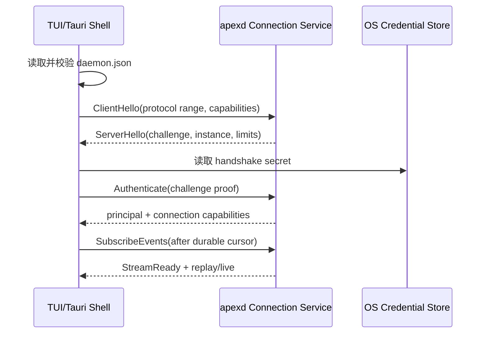
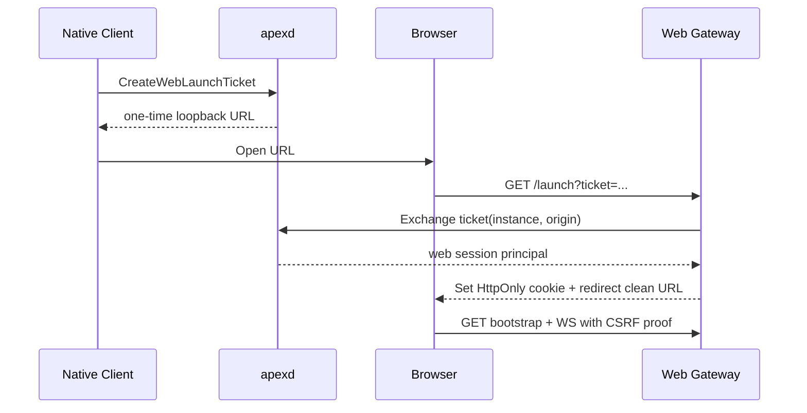
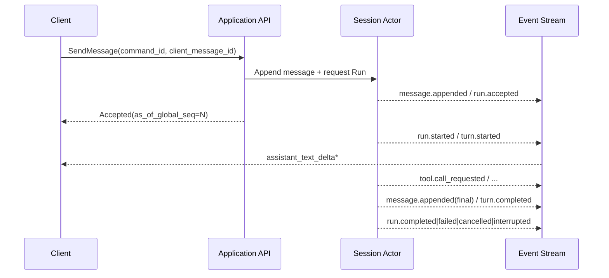
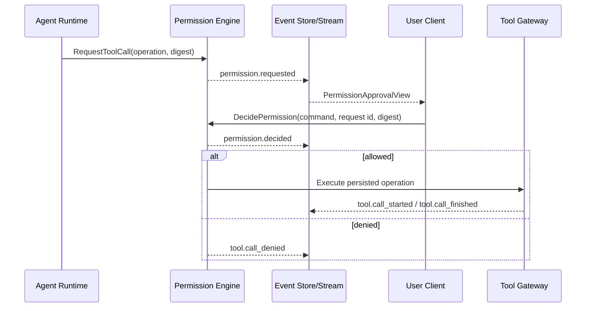
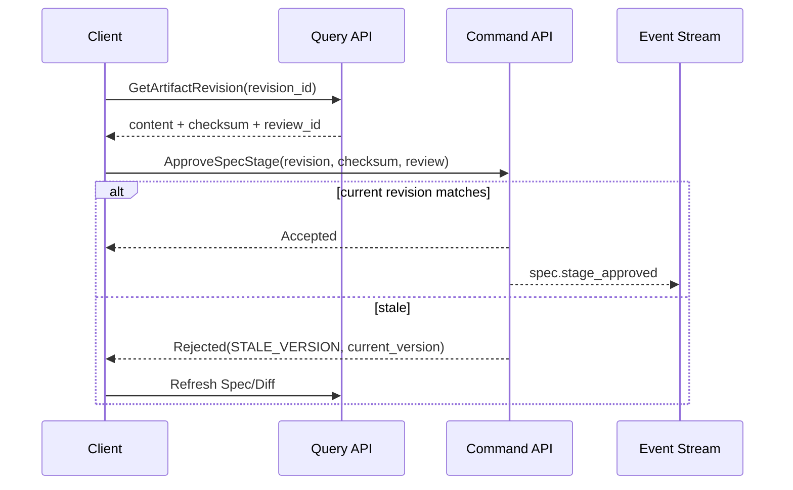
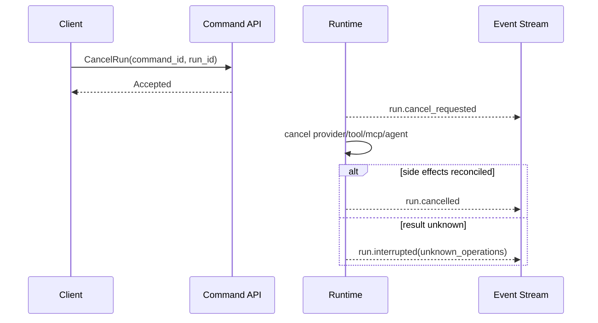
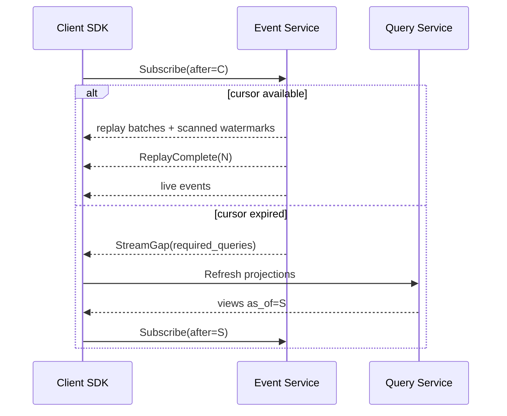

# Apex —— API 与实时事件协议设计

> 版本：v0.1（详细设计草案）  
> 日期：2026-08-08  
> 状态：待评审  
> 上游文档：`docs/Apex—— 需求分析文档.md`、`docs/Apex—— 系统总体架构设计.md`、`docs/Apex—— 领域模型与事件规范.md`

---

## 0. 目的、范围与约束

本文定义 Apex 客户端、Web Gateway 与 `apexd` Core 之间的稳定应用协议，包括：

- Native gRPC API；
- Web REST API；
- gRPC/WS 实时事件订阅；
- 连接发现、版本协商与本机认证；
- Command、Query、Event 的 wire model；
- 错误、分页、幂等、一致性与断线重连；
- 大内容、流式文本、文件上传下载和诊断包传输；
- TUI、Tauri Desktop、Web 三端的协议职责；
- 协议演进、兼容性和合约测试。

本文不定义领域状态机、SQLite DDL、Provider API、UI 组件和公网 SaaS 多租户协议。领域不变式以《领域模型与事件规范》为权威；本文只定义如何安全、无歧义地传输 Command、Query 和 Event。

### 0.1 必须满足的上游约束

1. `apexd` 是唯一业务权威和 SQLite 写者；
2. 客户端不直接执行 Tool、不直接写数据库、不自行推进 Spec/Workflow 状态；
3. 写操作使用 Command，读取使用 Query，变化使用 Event；
4. Command 接受不等于业务完成，终局通过 Query/Event 获取；
5. Domain Event 提交成功后才能广播；
6. 三端使用相同领域语义，不维护三套 API；
7. 本地部署默认只接受同一 OS 用户的 IPC/loopback 连接；
8. 事件游标使用 `global_seq`，客户端断线不能依赖瞬时流恢复业务状态；
9. 协议不得泄漏密钥、完整敏感文件、未脱敏命令参数和内部堆栈；
10. 未知外部副作用必须显示为 interrupted/reconcile，不得由传输层自动重试。

### 0.2 设计目标

- TUI 启动后可以在 500ms 目标内完成 shell 渲染并异步连接 Core；
- gRPC、REST、WebSocket 映射可由同一 `apex-protocol` 类型生成或验证；
- TypeScript 客户端不因 64 位整数、枚举新增或未知事件损坏状态；
- 客户端可以在任意事件边界断线并无缝恢复；
- 慢客户端不会阻塞 Agent、StorageWriter 或其他客户端；
- 安全关键 Command 具有明确的 Actor、幂等键、版本和用户确认上下文；
- 协议从 v0.1 起为最终产品预留 DAG、MCP、Skills、Memory、Hook 与 Plugin 能力。

---

## 1. 协议总体结论

### 1.1 传输矩阵

| 使用方 | 主传输 | 辅助传输 | 定位 |
|---|---|---|---|
| Rust CLI/TUI | gRPC over UDS/Windows named pipe | loopback HTTP/2 fallback | 完整能力 Native Client |
| Tauri Desktop | Tauri Rust shell → gRPC | shell 内 event bridge | WebView 不直接持有 daemon token |
| Browser Web | REST + WebSocket over loopback | Blob HTTP streaming | 轻量本机 Web Client |
| Plugin process | 受限 gRPC/stdio protocol | 无 | capability-scoped 扩展客户端 |
| 测试/自动化 | gRPC | REST | 合约和 E2E |

默认不暴露公网监听。远程团队模式必须使用独立 deployment profile，并增加 TLS、用户身份、多租户、审计与网络策略；不得通过简单设置 `0.0.0.0` 复用本机信任模型。

### 1.2 逻辑协议

```text
Connection Protocol
  ├─ Discover / Hello / Authenticate / Negotiate
  └─ Heartbeat / GoAway / CapabilityChanged

Application Protocol
  ├─ Command API    修改状态或启动 operation
  ├─ Query API      读取 projection/content
  ├─ Event API      持久 Domain Event
  ├─ Realtime API   transient delta/progress/control
  └─ Blob API       大内容、patch、附件、导出包
```

### 1.3 推荐实现结构

```text
crates/apex-protocol/
├── proto/apex/v1/
│   ├── common.proto
│   ├── connection.proto
│   ├── command.proto
│   ├── query.proto
│   ├── event.proto
│   ├── realtime.proto
│   ├── blob.proto
│   ├── project.proto
│   ├── session.proto
│   ├── spec.proto
│   ├── workflow.proto
│   ├── tool.proto
│   └── extension.proto
├── src/
│   ├── generated/
│   ├── conversion/
│   ├── validation/
│   ├── json/
│   └── compatibility/
└── fixtures/

crates/apex-gateway/
├── grpc/
├── rest/
├── websocket/
├── auth/
└── middleware/
```

`apex-protocol` 只能包含 wire DTO、校验和领域 DTO 转换，不实现用例。gRPC 与 REST handler 都调用同一个 `ApplicationService/CommandBus/QueryBus`。

### 1.4 不采用的方案

- 不让 Web Gateway 拥有第二套 Session/Spec 状态机；
- 不使用未版本化任意 JSON 作为所有 Command/Event 的长期载体；
- 不把所有操作塞进一个 `/rpc` 字符串路由而失去类型约束；
- 不使用 WebSocket 作为唯一数据源；
- 不用客户端时间、ULID 或 WebSocket 到达顺序替代 `global_seq`；
- 不让浏览器直接连接 Windows named pipe/UDS；
- 不在 protobuf `Any` 中保存无法识别和验证的安全关键 payload；
- 不因 gRPC deadline 或 HTTP 断开而自动取消已经接受的 Run。

---

## 2. 进程、Endpoint 与连接发现

### 2.1 默认拓扑

```text
TUI ───────── gRPC / local IPC ─────┐
Tauri shell ─ gRPC / local IPC ─────┼──> apexd
Browser ───── REST + WS / loopback ─┘      │
                                            ├─ Application Service
                                            ├─ Event Store / Projection
                                            └─ Blob Store
```

Web Gateway 可以作为 `apexd` 内模块，也可以作为同发行包中的受监督 sidecar。即使是 sidecar，也不得直接访问 SQLite；它通过稳定 Application/Protocol port 调用 Core。

### 2.2 Endpoint 发现文件

默认路径：`~/apex/runtime/daemon.json`。文件使用仅当前 OS 用户可读权限，采用临时文件 + 原子 rename 更新。

```json
{
  "format_version": 1,
  "instance_id": "ins_01K2...",
  "pid": 18420,
  "started_at": "2026-08-08T06:20:00.123456Z",
  "protocol_min": "1.0",
  "protocol_max": "1.2",
  "native": {
    "transport": "windows_named_pipe",
    "endpoint": "apexd-7f3c..."
  },
  "web": {
    "enabled": true,
    "origin": "http://127.0.0.1:43127"
  },
  "handshake_token_ref": "os-keyring:apex/daemon/ins_01K2...",
  "generation": 17
}
```

规则：

- UDS/named pipe 的实际名称包含当前用户和 daemon instance 的不可预测部分；
- Unix socket 目录和 socket 文件只允许当前用户访问；Windows named pipe 使用当前用户 SID ACL；
- loopback 端口由 OS 动态分配，不固定占用公共端口；
- 客户端读取后校验 pid、instance、文件 owner 和 endpoint；
- stale 文件可以删除，但启动新 daemon 前必须先尝试 instance lock；
- `handshake_token_ref` 是凭据引用，不在发现文件写明文 token；兼容模式若必须写 token，文件权限必须严格且 token 短期有效。

### 2.3 Daemon 启动竞争

```text
Client A / Client B 同时发现 daemon 不存在
  → 两者尝试获取用户级 instance lock
  → 获得者启动 apexd 并写 daemon.json
  → 未获得者等待 generation 变化
  → 均执行 Hello，不根据 pid 存活直接假定服务可用
```

客户端最多进行有界启动等待；失败后展示诊断，不以不同端口静默启动第二个 Core。

### 2.4 连接生命周期

```text
Disconnected
  → TransportConnected
  → HelloSent
  → VersionNegotiated
  → Authenticated
  → Ready
  → Draining（GoAway）
  → Disconnected
```

只有 `Ready` 连接可以提交业务 Command。Hello、Health、Authenticate 和版本错误可在未就绪阶段调用。

---

## 3. 版本协商与 Capability

### 3.1 版本模型

Apex 同时维护四个版本：

| 版本 | 示例 | 用途 |
|---|---|---|
| Protocol version | `1.2` | RPC/REST/WS 能力协商 |
| Message schema version | `1` | 单个 Command/Event payload |
| Server build version | `0.5.3+abc123` | 诊断和兼容提示 |
| Projection revision | `spec_view@3` | Query view 结构 |

Protocol 使用 `major.minor`：

- major 不同默认不兼容；
- minor 向后兼容，服务端选择双方交集内最高版本；
- patch/build 不参与 wire negotiation；
- 每个 capability 还可声明独立版本，例如 `workflow=1`。

### 3.2 Hello

```proto
message ClientHello {
  string client_id = 1;
  ClientKind client_kind = 2;
  string client_version = 3;
  ProtocolRange protocol = 4;
  repeated string requested_capabilities = 5;
  string locale = 6;
  string timezone = 7;
  string resume_connection_id = 8;
}

message ServerHello {
  string instance_id = 1;
  string connection_id = 2;
  ProtocolVersion negotiated_protocol = 3;
  string server_version = 4;
  repeated Capability capabilities = 5;
  AuthChallenge auth_challenge = 6;
  uint64 current_global_seq = 7;
  google.protobuf.Timestamp server_time = 8;
  uint32 heartbeat_interval_ms = 9;
  uint32 max_inbound_message_bytes = 10;
  uint32 max_event_batch = 11;
  string event_store_id = 12;
}
```

Hello 不能自行授予业务 capability。它只声明协议能力；真正授权由认证身份、ProjectTrust、Actor 类型和项目策略共同决定。

### 3.2.1 ConnectionService

```proto
service ConnectionService {
  rpc Hello(ClientHello) returns (ServerHello);
  rpc Authenticate(AuthenticateRequest) returns (AuthenticateResponse);
  rpc GetHealth(GetHealthRequest) returns (GetHealthResponse);
  rpc CreateWebLaunchTicket(CreateWebLaunchTicketRequest) returns (CreateWebLaunchTicketResponse);
  rpc ExchangeWebLaunchTicket(ExchangeWebLaunchTicketRequest) returns (ExchangeWebLaunchTicketResponse);
}
```

`Hello` 和最小 liveness health 可在未认证阶段调用；详细 readiness、CreateWebLaunchTicket 和任何业务能力都要求已认证连接。`ExchangeWebLaunchTicket` 仅允许本机 Web Gateway 调用，并校验 instance、origin、ticket 单次性和过期时间。REST 可暴露 `/health/live` 与 `/health/ready`，未认证响应只返回布尔状态、instance ID 和协议范围，不返回项目、路径、Provider 或错误堆栈。

### 3.3 Capability 命名

```text
core.command.v1
core.query.v1
core.event_replay.v1
session.streaming_text
spec.review.v1
workflow.dag.v1
workflow.write_claim.v1
panel.skills.v1
panel.mcp.v1
panel.subagents.v1
memory.fts.v1
snapshot.restore.v1
plugin.protocol.v1
```

Capability 响应包含：`name`、`version`、`enabled`、`disabled_reason?`、`limits?`。客户端必须按 capability 决定是否展示功能，不能仅根据 server build version 猜测。

### 3.4 不兼容处理

无版本交集时返回：

```text
PROTOCOL_VERSION_UNSUPPORTED {
  client_range,
  server_range,
  minimum_client_version?,
  upgrade_hint
}
```

未知 capability 不构成错误。安全关键 capability 在连接期间被撤销时，Core 发布 `CapabilityChanged` 控制帧；客户端立即刷新 `available_actions`，但已提交 Command 仍以 Core 的持久状态为准。

---

## 4. 认证、连接身份与浏览器安全

### 4.1 信任层级

```text
OS transport identity
  + daemon handshake proof
  → authenticated connection
  + application principal
  → ActorRef
  + project trust/policy
  → effective capabilities
```

传输认证不能替代领域授权。连接来自当前 OS 用户，只代表“可以访问本机 Core”，不代表可以跳过 Spec、审批高风险命令或启用 bypass。

### 4.2 Native 认证

推荐使用 challenge-response：

1. Hello 返回随机 nonce、challenge ID 和短期过期时间；
2. Client 从 OS keyring/受限文件取得 handshake secret；
3. 计算 `HMAC-SHA256(secret, instance_id || connection_id || nonce || client_id)`；
4. 调用 Authenticate；
5. Core 验证 transport peer identity、HMAC、nonce 未使用和时间窗口；
6. 连接绑定 principal、client_id 和 capability ceiling。

```proto
message AuthenticateRequest {
  string challenge_id = 1;
  string client_id = 2;
  bytes proof = 3;
}

message AuthenticateResponse {
  string principal_id = 1;
  string connection_id = 2;
  google.protobuf.Timestamp expires_at = 3;
  repeated string connection_capabilities = 4;
}
```

proof、secret 和 session token 不得写入日志、Event、Checkpoint 或诊断包。

### 4.3 Web 认证

浏览器不能直接读取 OS keyring。Web Gateway 使用一次性 launch ticket 建立浏览器会话：

```text
TUI/Desktop/CLI 请求 CreateWebLaunchTicket
  → Core 返回短期、单次、绑定 instance/origin 的 ticket URL
  → Browser 打开 loopback URL
  → Gateway 交换 ticket
  → 设置 HttpOnly + Secure(适用时) + SameSite=Strict session cookie
  → ticket 立即失效
```

Web 安全要求：

- 只监听 `127.0.0.1`/`::1`，校验 Host 与 Origin；
- 所有状态修改要求 SameSite cookie + CSRF token；
- WebSocket 握手校验 Origin、session 和 CSRF 子协议 token；
- 禁止 CORS 通配符，默认不接受其他网站发起的 credentialed 请求；
- Cookie 不提供给 Plugin、TUI 或 Tauri shell；
- 会话有空闲/绝对过期时间，daemon 重启后默认失效；
- URL query 中只允许短期一次性 ticket，不允许长期 bearer token；
- 响应设置严格 CSP、`X-Content-Type-Options: nosniff` 和 frame 限制。

### 4.4 Actor 建立

外部客户端不得在 Command body 中任意声明 `ActorKind=User/System`。Gateway 根据认证连接创建 Actor：

```text
authenticated principal + connection client
  → User ActorRef
Agent Runtime internal channel
  → MainAgent/SubAgent ActorRef
Hook/Plugin supervisor
  → Hook/Plugin ActorRef
Recovery worker
  → System/Recovery ActorRef
```

wire Command 可以携带 `actor_context_id`，但 Core 必须从连接绑定查回完整 ActorRef。任何 actor_id 不匹配返回 `ACTOR_MISMATCH`。

### 4.5 会话级授权缓存

连接可以缓存授权计算结果，但必须绑定：

```text
principal_id + project_id + project_trust_revision
+ config_revision + permission_rule_revision + capability_registry_revision
```

任一 revision 变化立即失效。Command handler 必须再次授权，不能因 UI 显示了 enabled 按钮而放行。

---

## 5. 公共 Wire 类型与序列化

### 5.1 命名与编码

| 位置 | 规则 |
|---|---|
| protobuf package | `apex.v1` |
| protobuf field | `snake_case` |
| JSON field | `snake_case` |
| Event type | `domain.fact_name`，例如 `spec.stage_approved` |
| Enum JSON | `lower_snake_case` |
| ID | 带类型前缀 UTF-8 string |
| 时间 | protobuf Timestamp；JSON UTC RFC3339 微秒 |
| Duration | protobuf Duration；JSON 毫秒整数或明确 `*_ms` |
| Digest | `algorithm:value`，默认 `sha256:<hex>` |
| 空值 | protobuf presence/optional；JSON `null` 仅表示明确无值 |

禁止用空字符串同时表示“未知”和“无值”。所有公开枚举都保留 `UNSPECIFIED=0` 与客户端 `unknown(raw)` fallback。

### 5.2 64 位整数与 TypeScript

`global_seq`、`aggregate_version`、token 数、字节数可能超过 JavaScript 安全整数范围：

- protobuf 使用 `uint64/int64`；
- REST/WS JSON 使用十进制字符串，例如 `"global_seq":"184467440737095"`；
- OpenAPI schema 标记 `type:string, format:uint64`；
- TypeScript SDK 使用 branded string/BigInt 转换工具，禁止隐式 `Number()`；
- 小型限制值和毫秒阈值可使用 `uint32`/JSON number。

### 5.3 公共 Meta

```proto
message CommandMeta {
  string command_id = 1;
  string operation_id = 2;
  string project_id = 3;
  optional string session_id = 4;
  optional string aggregate_id = 5;
  optional uint64 expected_version = 6;
  string correlation_id = 7;
  optional string causation_event_id = 8;
  string client_request_id = 9;
  uint32 schema_version = 10;
}

message QueryMeta {
  optional string project_id = 1;
  optional string session_id = 2;
  optional uint64 min_global_seq = 3;
  optional string page_cursor = 4;
  uint32 page_size = 5;
  string request_id = 6;
}

message ResponseMeta {
  uint64 as_of_global_seq = 1;
  string projection_revision = 2;
  string request_id = 3;
  google.protobuf.Timestamp server_time = 4;
  repeated AvailableAction available_actions = 5;
}
```

Actor、principal、client 和 transport 由已认证连接注入，不接受 body 覆盖。审计导出可以在响应中返回安全的 ActorView。

### 5.4 内容与 Blob 引用

```proto
message BlobRef {
  string blob_id = 1;
  string digest = 2;
  uint64 size_bytes = 3;
  string media_type = 4;
  string encoding = 5;
  bool redacted = 6;
  optional string file_name = 7;
}

message ContentRef {
  oneof value {
    string inline_text = 1;
    BlobRef blob = 2;
    string artifact_revision_id = 3;
  }
  bool truncated = 4;
  optional uint64 original_size_bytes = 5;
}
```

Inline 文本默认上限 64 KiB；超过上限、包含 patch/大 stdout、附件或二进制时使用 BlobRef。服务端可按 capability 和敏感级别拒绝下载。

### 5.5 分页游标

Page cursor 是 Core 签名的不透明 base64url 值，内部至少包含：

```text
query_type, stable_sort_key, last_item_id,
projection_revision, as_of_global_seq, filter_digest, expires_at?
```

客户端不得解析或修改。filter、sort 或 projection revision 不匹配时返回 `PAGE_CURSOR_INVALID`；过期返回 `PAGE_CURSOR_EXPIRED`。

### 5.6 字段掩码与展开

高成本 Query 使用显式 include，而不是无限嵌套：

```text
include=messages,tool_summaries,available_actions
expand=artifact_head
```

REST 使用重复 query 参数或逗号分隔的稳定集合；gRPC 使用 `repeated ViewInclude`。默认返回安全、轻量摘要，不默认嵌入完整工具输出、patch、Prompt 或所有子 Agent 消息。

---

## 6. 统一错误与响应模型

### 6.1 错误分类

领域规范中的错误码映射到三种传输：

| Domain error | gRPC status | REST status | 是否可自动重试 |
|---|---|---:|---|
| `AUTH_REQUIRED` | `UNAUTHENTICATED` | 401 | 重新认证后可重试原 Command |
| `ACTOR_MISMATCH` | `PERMISSION_DENIED` | 403 | 否 |
| `SCOPE_MISMATCH` | `INVALID_ARGUMENT` | 400 | 修正 path/meta/payload ID |
| `FORBIDDEN` | `PERMISSION_DENIED` | 403 | 否 |
| `PROJECT_UNTRUSTED` | `FAILED_PRECONDITION` | 412 | 用户授信后新提交 |
| `SPEC_GATE_REQUIRED` | `FAILED_PRECONDITION` | 412 | 不能盲重试 |
| `PERMISSION_REQUIRED` | `FAILED_PRECONDITION` | 428 | 等待审批事件 |
| `IDEMPOTENCY_KEY_REUSED` | `ALREADY_EXISTS` | 409 | 必须生成新 command_id |
| `STALE_VERSION` | `ABORTED` | 409 | Query 后重新计算 |
| `PERMISSION_ALREADY_DECIDED` | `ALREADY_EXISTS` | 409 | 刷新审批状态 |
| `RESOURCE_CONFLICT` | `ABORTED` | 409 | 等待/调整后新 Command |
| `INVALID_STATE_TRANSITION` | `FAILED_PRECONDITION` | 409 | 否 |
| `VALIDATION_FAILED` | `INVALID_ARGUMENT` | 400 | 修正参数 |
| `PAGE_CURSOR_INVALID` | `INVALID_ARGUMENT` | 400 | 重新分页 |
| `PAGE_CURSOR_EXPIRED` | `OUT_OF_RANGE` | 410 | 从第一页重新查询 |
| `CURSOR_EXPIRED` | `OUT_OF_RANGE` | 410 | 获取新 Snapshot |
| `PROJECTION_LAGGING` | `UNAVAILABLE` | 503 | 有界等待后重试 Query |
| `OPERATION_UNKNOWN` | `FAILED_PRECONDITION` | 409 | 先 reconcile |
| `RATE_LIMITED` | `RESOURCE_EXHAUSTED` | 429 | 按 retry_after 等待 |
| `TIMEOUT` | `DEADLINE_EXCEEDED` | 504 | 仅纯查询或已知无副作用操作 |
| `INTERNAL` | `INTERNAL` | 500 | 依 operation 状态决定 |

传输 status 不能替代稳定 `error_code`。客户端逻辑必须依据 error code 和领域状态，而不能仅依据 HTTP/gRPC 状态。

### 6.2 ErrorDetail

```proto
message ApexError {
  string code = 1;
  ErrorCategory category = 2;
  string safe_message = 3;
  bool retryable = 4;
  optional uint32 retry_after_ms = 5;
  optional uint64 current_version = 6;
  optional string aggregate_id = 7;
  optional string operation_id = 8;
  repeated FieldViolation field_violations = 9;
  repeated BlockingReference blocking_refs = 10;
  optional string diagnostic_ref = 11;
  uint32 schema_version = 12;
}
```

`diagnostic_ref` 指向受权限控制的诊断资源，不是原始 panic、完整 stack、shell command 或 Provider response。REST 使用 RFC 9457 风格 `application/problem+json`，在 `extensions.apex_error` 内携带同一结构。

### 6.3 CommandResponse

```proto
message CommandResponse {
  ResponseMeta meta = 1;
  oneof result {
    Accepted accepted = 2;
    Duplicate duplicate = 3;
    Rejected rejected = 4;
  }
}

message Accepted {
  string command_id = 1;
  string operation_id = 2;
  optional string aggregate_id = 3;
  uint64 aggregate_version = 4;
  string initial_state = 5;
  repeated string committed_event_ids = 6;
}

message Duplicate {
  string original_command_id = 1;
  string original_result_digest = 2;
  oneof original_outcome {
    Accepted accepted = 3;
    Rejected rejected = 4;
  }
  optional string final_state_query = 5;
}

message Rejected {
  string command_id = 1;
  ApexError error = 2;
}
```

`committed_event_ids` 只用于快速定位事件，不是客户端恢复唯一依据；客户端仍应从 `as_of_global_seq` 或 Query 获取完整状态。

### 6.4 业务拒绝与传输错误的边界

- 已成功解析、认证并分配 `command_id` 的 Command，即使因领域状态、权限或版本冲突被拒绝，也返回可幂等缓存的 `CommandResponse.Rejected`；
- gRPC 对这类业务拒绝可以保持 transport `OK`，由 `Rejected.error` 表达；REST 使用第 6.1 节状态码并返回同一 Rejected body；
- 无法解析消息、连接未认证、协议不兼容、服务不可达等“尚未形成 Command 处理结果”的故障使用 gRPC non-OK/HTTP 基础错误；
- SDK 提供统一 `CommandOutcome`，屏蔽 gRPC 与 REST 在 transport status 上的差异；
- 相同 `command_id` 重放业务拒绝时，必须返回首次拒绝结果，不能因当前状态变化把它变成接受。

### 6.5 HTTP 映射

统一响应头：

```text
X-Apex-Request-Id: req_...
X-Apex-Global-Seq: 184467440737095
X-Apex-Protocol: 1.2
```

错误响应必须包含 `request_id` 和安全错误码。HTTP body 不返回内部数据库 SQL、文件绝对路径（必要时使用 project-relative path）或完整凭据相关内容。

---

## 7. Command API

### 7.1 外部 API 设计原则

外部协议使用按领域分组的 typed RPC；内部仍使用 `CommandBus` 和 `CommandEnvelope`。每个 typed RPC：

1. 校验请求和 `CommandMeta`；
2. 转换为一个领域 Command；
3. 调用同一 Application Service；
4. 返回统一 `CommandResponse`；
5. 不在 Gateway 内添加业务分支。

不建议客户端直接发送一个任意 `command_type + JSON payload` 的通用 RPC 作为公共接口。可为插件和测试保留版本化 `ExecuteRawCommand`，但必须 allowlist command type、校验 schema、绑定 capability，并默认关闭。

### 7.2 Service 总览

```proto
service ProjectCommandService {}
service SessionCommandService {}
service SpecCommandService {}
service WorkflowCommandService {}
service ToolCommandService {}
service PermissionCommandService {}
service ExtensionCommandService {}
service MemoryCommandService {}
service SnapshotCommandService {}
service EventQueryService {}
service BlobService {}
```

Proto 中空 service 仅表示边界，实际 RPC 在下列小节定义。每个请求都包含 `CommandMeta meta`；服务端不得由客户端传入的 `actor` 字段决定身份。

### 7.3 Project / Trust Commands

```proto
service ProjectCommandService {
  rpc RegisterProject(RegisterProjectRequest) returns (CommandResponse);
  rpc OpenProject(OpenProjectRequest) returns (CommandResponse);
  rpc TrustProject(TrustProjectRequest) returns (CommandResponse);
  rpc RestrictProject(RestrictProjectRequest) returns (CommandResponse);
  rpc RevokeProjectTrust(RevokeProjectTrustRequest) returns (CommandResponse);
  rpc UpdateProjectConfig(UpdateProjectConfigRequest) returns (CommandResponse);
  rpc RegisterWorktree(RegisterWorktreeRequest) returns (CommandResponse);
  rpc ArchiveProject(ArchiveProjectRequest) returns (CommandResponse);
}

message RegisterProjectRequest {
  CommandMeta meta = 1;
  string canonical_root = 2;
  optional string display_name = 3;
  optional string requested_worktree_path = 4;
}

message TrustProjectRequest {
  CommandMeta meta = 1;
  string project_id = 2;
  string canonical_root = 3;
  string confirmation_version = 4;
  TrustScope scope = 5;
  string user_confirmation = 6;
}

message UpdateProjectConfigRequest {
  CommandMeta meta = 1;
  string project_id = 2;
  string config_format_version = 3;
  ContentRef config_content = 4;
  string expected_config_revision = 5;
  bool apply_to_new_runs_only = 6;
}
```

`RegisterProject` 可以由首次打开流程触发，但只有 User 执行 `TrustProject` 后才改变 ProjectTrust。配置响应返回新 `config_revision`；解析失败不产生生效配置事件。

REST 映射：

| Method | Path | Command |
|---|---|---|
| `POST` | `/api/v1/projects` | RegisterProject |
| `POST` | `/api/v1/projects/{project_id}/open` | OpenProject |
| `POST` | `/api/v1/projects/{project_id}/trust` | TrustProject |
| `POST` | `/api/v1/projects/{project_id}/restrict` | RestrictProject |
| `POST` | `/api/v1/projects/{project_id}/trust:revoke` | RevokeProjectTrust |
| `PUT` | `/api/v1/projects/{project_id}/config` | UpdateProjectConfig |
| `POST` | `/api/v1/projects/{project_id}/worktrees` | RegisterWorktree |
| `POST` | `/api/v1/projects/{project_id}/archive` | ArchiveProject |

### 7.4 Session / Conversation Commands

```proto
service SessionCommandService {
  rpc CreateSession(CreateSessionRequest) returns (CommandResponse);
  rpc ResumeSession(ResumeSessionRequest) returns (CommandResponse);
  rpc ArchiveSession(ArchiveSessionRequest) returns (CommandResponse);
  rpc ForkSession(ForkSessionRequest) returns (CommandResponse);
  rpc SendMessage(SendMessageRequest) returns (CommandResponse);
  rpc SteerRun(SteerRunRequest) returns (CommandResponse);
  rpc PauseRun(PauseRunRequest) returns (CommandResponse);
  rpc ResumeRun(ResumeRunRequest) returns (CommandResponse);
  rpc CancelRun(CancelRunRequest) returns (CommandResponse);
  rpc ResolveBlockedRun(ResolveBlockedRunRequest) returns (CommandResponse);
}

message CreateSessionRequest {
  CommandMeta meta = 1;
  string project_id = 2;
  optional string worktree_id = 3;
  optional string title = 4;
  optional string parent_session_id = 5;
}

message SendMessageRequest {
  CommandMeta meta = 1;
  string session_id = 2;
  string client_message_id = 3;
  string text = 4;
  MessageInputKind input_kind = 5;
  repeated AttachmentRef attachments = 6;
  optional string reply_to_message_id = 7;
}

message CancelRunRequest {
  CommandMeta meta = 1;
  string session_id = 2;
  string run_id = 3;
  string reason = 4;
  uint32 grace_period_ms = 5;
}

message ForkSessionRequest {
  CommandMeta meta = 1;
  string source_session_id = 2;
  uint64 source_message_seq = 3;
  optional string source_checkpoint_id = 4;
  string title = 5;
}
```

`SendMessage` 的同步响应只表示消息和 Run 请求是否被接受。UI 必须通过 `message.appended`、`run.started`、`turn.*` 和最终 `run.*` 事件显示执行进度。断开连接不自动取消 Run。

REST 映射：

| Method | Path | Command |
|---|---|---|
| `POST` | `/api/v1/sessions` | CreateSession |
| `POST` | `/api/v1/sessions/{session_id}/resume` | ResumeSession |
| `POST` | `/api/v1/sessions/{session_id}/archive` | ArchiveSession |
| `POST` | `/api/v1/sessions/{session_id}/fork` | ForkSession |
| `POST` | `/api/v1/sessions/{session_id}/messages` | SendMessage |
| `POST` | `/api/v1/sessions/{session_id}/runs/{run_id}/steer` | SteerRun |
| `POST` | `/api/v1/sessions/{session_id}/runs/{run_id}/pause` | PauseRun |
| `POST` | `/api/v1/sessions/{session_id}/runs/{run_id}/resume` | ResumeRun |
| `POST` | `/api/v1/sessions/{session_id}/runs/{run_id}/cancel` | CancelRun |
| `POST` | `/api/v1/sessions/{session_id}/runs/{run_id}/resolve-block` | ResolveBlockedRun |

### 7.5 Spec / Artifact Commands

```proto
service SpecCommandService {
  rpc CreateSpec(CreateSpecRequest) returns (CommandResponse);
  rpc GenerateArtifact(GenerateArtifactRequest) returns (CommandResponse);
  rpc EditArtifact(EditArtifactRequest) returns (CommandResponse);
  rpc ImportArtifactFromFile(ImportArtifactFromFileRequest) returns (CommandResponse);
  rpc SubmitArtifactForReview(SubmitArtifactForReviewRequest) returns (CommandResponse);
  rpc ApproveSpecStage(ApproveSpecStageRequest) returns (CommandResponse);
  rpc RejectSpecStage(RejectSpecStageRequest) returns (CommandResponse);
  rpc RequestSpecChanges(RequestSpecChangesRequest) returns (CommandResponse);
  rpc SkipSpec(SkipSpecRequest) returns (CommandResponse);
  rpc StartImplementation(StartImplementationRequest) returns (CommandResponse);
  rpc StartVerification(StartVerificationRequest) returns (CommandResponse);
  rpc ApproveVerification(ApproveVerificationRequest) returns (CommandResponse);
}

message EditArtifactRequest {
  CommandMeta meta = 1;
  string spec_id = 2;
  string artifact_id = 3;
  optional string base_revision_id = 4;
  ContentRef content = 5;
  string content_sha256 = 6;
  EditSource source = 7;
  bool materialize_to_project = 8;
}

message ApproveSpecStageRequest {
  CommandMeta meta = 1;
  string spec_id = 2;
  SpecStage stage = 3;
  string artifact_revision_id = 4;
  string content_sha256 = 5;
  string review_id = 6;
  string confirmation_text = 7;
  optional string comment = 8;
}

message SkipSpecRequest {
  CommandMeta meta = 1;
  string spec_id = 2;
  SpecStage current_stage = 3;
  string reason = 4;
  string confirmation_text = 5;
}
```

关键规则：

- `ApproveSpecStage` 和 `SkipSpec` 只能由 User Actor 通过有授权的连接提交；
- 所有批准请求必须绑定 revision/checksum/review；
- `SkipSpec` 是显式审计动作，wire event 为 `spec.skipped`，Rust domain event 为 `SpecSkipped`；
- Agent 可以发送建议/生成命令，但不能伪造用户批准；
- `EditArtifact` 以 `base_revision_id` 检测并发编辑，冲突返回新的 revision candidates，不静默覆盖；
- Markdown watcher 导入使用 `ImportArtifactFromFile`，source 标记为 `external_file_edit`。

REST 映射：

| Method | Path | Command |
|---|---|---|
| `POST` | `/api/v1/specs` | CreateSpec |
| `POST` | `/api/v1/specs/{spec_id}/artifacts/{artifact_id}/generate` | GenerateArtifact |
| `PUT` | `/api/v1/specs/{spec_id}/artifacts/{artifact_id}` | EditArtifact |
| `POST` | `/api/v1/specs/{spec_id}/artifacts/{artifact_id}/import` | ImportArtifactFromFile |
| `POST` | `/api/v1/specs/{spec_id}/stages/{stage}/submit` | SubmitArtifactForReview |
| `POST` | `/api/v1/specs/{spec_id}/stages/{stage}/approve` | ApproveSpecStage |
| `POST` | `/api/v1/specs/{spec_id}/stages/{stage}/reject` | RejectSpecStage |
| `POST` | `/api/v1/specs/{spec_id}/stages/{stage}/request-changes` | RequestSpecChanges |
| `POST` | `/api/v1/specs/{spec_id}/skip` | SkipSpec |
| `POST` | `/api/v1/specs/{spec_id}/implementation/start` | StartImplementation |
| `POST` | `/api/v1/specs/{spec_id}/verification/start` | StartVerification |
| `POST` | `/api/v1/specs/{spec_id}/verification/approve` | ApproveVerification |

### 7.6 Workflow / Agent Commands

```proto
service WorkflowCommandService {
  rpc CompileWorkflow(CompileWorkflowRequest) returns (CommandResponse);
  rpc StartWorkflow(StartWorkflowRequest) returns (CommandResponse);
  rpc PauseWorkflow(PauseWorkflowRequest) returns (CommandResponse);
  rpc ResumeWorkflow(ResumeWorkflowRequest) returns (CommandResponse);
  rpc CancelWorkflow(CancelWorkflowRequest) returns (CommandResponse);
  rpc RetryNode(RetryNodeRequest) returns (CommandResponse);
  rpc ResolveNodeBlock(ResolveNodeBlockRequest) returns (CommandResponse);
  rpc SpawnAgent(SpawnAgentRequest) returns (CommandResponse);
  rpc SendAgentInput(SendAgentInputRequest) returns (CommandResponse);
  rpc PauseAgent(PauseAgentRequest) returns (CommandResponse);
  rpc ResumeAgent(ResumeAgentRequest) returns (CommandResponse);
  rpc CancelAgent(CancelAgentRequest) returns (CommandResponse);
  rpc RetryAgent(RetryAgentRequest) returns (CommandResponse);
}

message CompileWorkflowRequest {
  CommandMeta meta = 1;
  string spec_id = 2;
  string tasks_revision_id = 3;
  string tasks_checksum = 4;
  optional ContentRef compiler_options = 5;
}

message StartWorkflowRequest {
  CommandMeta meta = 1;
  string workflow_id = 2;
  uint64 workflow_revision = 3;
  string tasks_revision_id = 4;
}

message RetryNodeRequest {
  CommandMeta meta = 1;
  string workflow_id = 2;
  string node_id = 3;
  uint32 previous_attempt = 4;
  string reason = 5;
  RetryPolicyOverride override = 6;
}

message SpawnAgentRequest {
  CommandMeta meta = 1;
  string session_id = 2;
  optional string parent_agent_id = 3;
  string role = 4;
  string profile_revision = 5;
  ContentRef task = 6;
  SpecBinding spec_binding = 7;
  repeated string requested_capabilities = 8;
  repeated string write_paths = 9;
  optional string workflow_node_id = 10;
}
```

`SpawnAgent` 的 requested capabilities 只是请求上限，响应/事件必须返回 Core 计算后的 effective capability ceiling。客户端不能用 `SpawnAgent` 绕过 Task/Tool Gateway 或并发限制。

REST 映射：

| Method | Path | Command |
|---|---|---|
| `POST` | `/api/v1/specs/{spec_id}/workflows:compile` | CompileWorkflow |
| `POST` | `/api/v1/workflows/{workflow_id}/start` | StartWorkflow |
| `POST` | `/api/v1/workflows/{workflow_id}/pause` | PauseWorkflow |
| `POST` | `/api/v1/workflows/{workflow_id}/resume` | ResumeWorkflow |
| `POST` | `/api/v1/workflows/{workflow_id}/cancel` | CancelWorkflow |
| `POST` | `/api/v1/workflows/{workflow_id}/nodes/{node_id}/retry` | RetryNode |
| `POST` | `/api/v1/workflows/{workflow_id}/nodes/{node_id}/resolve-block` | ResolveNodeBlock |
| `POST` | `/api/v1/sessions/{session_id}/agents` | SpawnAgent |
| `POST` | `/api/v1/agents/{agent_id}/input` | SendAgentInput |
| `POST` | `/api/v1/agents/{agent_id}/pause` | PauseAgent |
| `POST` | `/api/v1/agents/{agent_id}/resume` | ResumeAgent |
| `POST` | `/api/v1/agents/{agent_id}/cancel` | CancelAgent |
| `POST` | `/api/v1/agents/{agent_id}/retry` | RetryAgent |

### 7.7 Tool、Permission 与 Rule Commands

Tool execution 主要由 Agent Runtime 内部调用，但协议仍定义受限接口，供 TUI 调试、自动化、Hook/Plugin host 和未来扩展使用。外部调用默认需要 `tool.invoke.v1` capability。

```proto
service ToolCommandService {
  rpc RequestToolCall(RequestToolCallRequest) returns (CommandResponse);
  rpc RunRuleCheck(RunRuleCheckRequest) returns (CommandResponse);
  rpc CreateRepairRun(CreateRepairRunRequest) returns (CommandResponse);
}

service PermissionCommandService {
  rpc DecidePermission(DecidePermissionRequest) returns (CommandResponse);
  rpc SavePermissionRule(SavePermissionRuleRequest) returns (CommandResponse);
  rpc RevokePermissionRule(RevokePermissionRuleRequest) returns (CommandResponse);
  rpc AcceptRuleException(AcceptRuleExceptionRequest) returns (CommandResponse);
}

message RequestToolCallRequest {
  CommandMeta meta = 1;
  string run_id = 2;
  string turn_id = 3;
  string agent_id = 4;
  string tool_name = 5;
  uint32 tool_schema_version = 6;
  ContentRef arguments = 7;
  string argument_digest = 8;
}

message DecidePermissionRequest {
  CommandMeta meta = 1;
  string permission_request_id = 2;
  PermissionDecision decision = 3;
  string argument_digest = 4;
  string confirmation_text = 5;
  optional PermissionRuleInput save_rule = 6;
  optional string reason = 7;
}

message RunRuleCheckRequest {
  CommandMeta meta = 1;
  string ruleset_revision = 2;
  repeated FileInput inputs = 3;
  RuleCheckScope scope = 4;
  optional string source_tool_call_id = 5;
}
```

安全要求：

- 客户端不能直接调用内部 `ExecuteToolCall`；
- `DecidePermission` 固定 `permission_request_id + argument_digest`；
- 多客户端同时决定时，首个提交获胜，其余收到 `PERMISSION_ALREADY_DECIDED`；
- “总是允许”通过 `save_rule` 创建规则，但当前一次 Decision 仍独立记录；
- Tool arguments 默认不回显完整敏感值；UI 使用服务端提供的 `approval_summary`；
- Rule exception 必须限定 ruleset、diagnostic fingerprints、文件 checksum、scope 和过期策略。

REST 映射：

| Method | Path | Command |
|---|---|---|
| `POST` | `/api/v1/tool-calls` | RequestToolCall |
| `POST` | `/api/v1/permissions/{permission_request_id}/decision` | DecidePermission |
| `POST` | `/api/v1/permission-rules` | SavePermissionRule |
| `POST` | `/api/v1/permission-rules/{rule_id}:revoke` | RevokePermissionRule |
| `POST` | `/api/v1/rule-checks` | RunRuleCheck |
| `POST` | `/api/v1/rule-exceptions` | AcceptRuleException |
| `POST` | `/api/v1/repair-runs` | CreateRepairRun |

### 7.8 Skills、MCP、Memory Commands

```proto
service ExtensionCommandService {
  rpc DiscoverSkills(DiscoverSkillsRequest) returns (CommandResponse);
  rpc EnableSkill(EnableSkillRequest) returns (CommandResponse);
  rpc DisableSkill(DisableSkillRequest) returns (CommandResponse);
  rpc ReloadSkills(ReloadSkillsRequest) returns (CommandResponse);
  rpc InvokeSkill(InvokeSkillRequest) returns (CommandResponse);
  rpc ConnectMcpServer(ConnectMcpServerRequest) returns (CommandResponse);
  rpc DisconnectMcpServer(DisconnectMcpServerRequest) returns (CommandResponse);
  rpc ReloadMcpServer(ReloadMcpServerRequest) returns (CommandResponse);
}

service MemoryCommandService {
  rpc AddMemory(AddMemoryRequest) returns (CommandResponse);
  rpc EditMemory(EditMemoryRequest) returns (CommandResponse);
  rpc DeleteMemory(DeleteMemoryRequest) returns (CommandResponse);
  rpc ExportMemory(ExportMemoryRequest) returns (CommandResponse);
}

message InvokeSkillRequest {
  CommandMeta meta = 1;
  string skill_id = 2;
  string skill_revision = 3;
  string session_id = 4;
  ContentRef input = 5;
  repeated string requested_resources = 6;
}

message ConnectMcpServerRequest {
  CommandMeta meta = 1;
  string server_id = 2;
  string config_revision = 3;
  bool allow_remote = 4;
  string user_confirmation = 5;
}

message EditMemoryRequest {
  CommandMeta meta = 1;
  string memory_id = 2;
  string base_revision_id = 3;
  ContentRef content = 4;
  string content_digest = 5;
}
```

Skill/MCP/Memory 命令均按 ProjectTrust 和 Actor capability 授权。MCP/Skill 的实际工具调用仍创建 ToolCall 并经过 Permission Engine；启用 server/skill 不构成无限制执行许可。

REST 映射：

| Method | Path | Command |
|---|---|---|
| `POST` | `/api/v1/projects/{project_id}/skills:discover` | DiscoverSkills |
| `POST` | `/api/v1/skills/{skill_id}/enable` | EnableSkill |
| `POST` | `/api/v1/skills/{skill_id}/disable` | DisableSkill |
| `POST` | `/api/v1/projects/{project_id}/skills:reload` | ReloadSkills |
| `POST` | `/api/v1/skills/{skill_id}:invoke` | InvokeSkill |
| `POST` | `/api/v1/mcp/servers/{server_id}/connect` | ConnectMcpServer |
| `POST` | `/api/v1/mcp/servers/{server_id}/disconnect` | DisconnectMcpServer |
| `POST` | `/api/v1/mcp/servers/{server_id}/reload` | ReloadMcpServer |
| `POST` | `/api/v1/memories` | AddMemory |
| `PUT` | `/api/v1/memories/{memory_id}` | EditMemory |
| `POST` | `/api/v1/memories/{memory_id}:delete` | DeleteMemory |
| `POST` | `/api/v1/memories:export` | ExportMemory |

### 7.9 Snapshot 与 Patch Commands

```proto
service SnapshotCommandService {
  rpc CaptureSnapshot(CaptureSnapshotRequest) returns (CommandResponse);
  rpc RestoreSnapshot(RestoreSnapshotRequest) returns (CommandResponse);
  rpc ApplyPatch(ApplyPatchRequest) returns (CommandResponse);
}

message RestoreSnapshotRequest {
  CommandMeta meta = 1;
  string snapshot_id = 2;
  string target_worktree_id = 3;
  string expected_head_digest = 4;
  repeated string paths = 5;
  RestoreMode mode = 6;
  string user_confirmation = 7;
}

message ApplyPatchRequest {
  CommandMeta meta = 1;
  string worktree_id = 2;
  BlobRef patch = 3;
  string expected_base_digest = 4;
  PatchMode mode = 5;
  string source_agent_id = 6;
}
```

Restore/ApplyPatch 是高风险显式 Command，必须经过 Permission Engine，并在执行前建立新的保护 Snapshot。检测到工作区 head 不匹配时返回 conflict，不允许 Gateway 使用 force 参数静默覆盖。

REST 映射：

| Method | Path | Command |
|---|---|---|
| `POST` | `/api/v1/snapshots` | CaptureSnapshot |
| `POST` | `/api/v1/snapshots/{snapshot_id}/restore` | RestoreSnapshot |
| `POST` | `/api/v1/worktrees/{worktree_id}/patches:apply` | ApplyPatch |

### 7.10 Command HTTP 语义

- 新资源或长 operation 接受：`202 Accepted`；
- 同步完成的轻量状态变更也统一返回 CommandResponse，可使用 `200 OK`；
- `Location` 指向可查询的 operation/aggregate；
- `Idempotency-Key` HTTP header 必须与 body `command_id` 相同；不同时拒绝；
- `If-Match` 可承载 aggregate version，例如 `"v42"`，必须与 `expected_version` 相同；
- HTTP proxy/gateway 不自动重试 POST；SDK 仅在未收到任何响应且使用同一 command_id 时允许重发；
- 请求 body 默认上限 1 MiB，大内容先上传 Blob；
- Command 不使用 GET，不把敏感确认信息放 URL。
- REST path、`CommandMeta.project_id/session_id/aggregate_id` 与 payload 中重复出现的 ID 必须完全一致；不一致返回 `SCOPE_MISMATCH`，Gateway 不选择其中一个静默覆盖；
- `causation_event_id` 默认仅内部 Runtime/Worker capability 可设置；普通 User Client 的业务关联使用 reply/reference 字段，不能伪造审计因果链；
- Domain `issued_at` 由 Core 在认证后使用服务端时间写入；可选客户端时间仅作为诊断字段，不能参与超时、排序或审批有效性。

示例：

```http
POST /api/v1/sessions/ses_01K2.../runs/run_01K2.../cancel HTTP/1.1
Idempotency-Key: cmd_01K2...
If-Match: "v12"
X-Apex-CSRF: csrf_...
Content-Type: application/json

{
  "meta": {
    "command_id": "cmd_01K2...",
    "operation_id": "op_01K2...",
    "project_id": "prj_01K2...",
    "session_id": "ses_01K2...",
    "expected_version": "12",
    "correlation_id": "cor_01K2...",
    "schema_version": 1
  },
  "reason": "用户停止当前实现",
  "grace_period_ms": 3000
}
```

响应中的 `aggregate_version` 和 `as_of_global_seq` 在 JSON 中使用十进制字符串。

### 7.11 内部 Command 与公共 API 边界

以下领域 Command 不直接暴露给普通客户端：

```text
AppendUserMessage（由 SendMessage 用例内部生成）
StartRun / StartTurn / FinishTurn
ExecuteToolCall / RecordToolResult
StartDesign / StartTaskPlanning（由已批准阶段事件驱动）
InvalidateSpec（由 Artifact revision 变化或 Recovery 触发）
MaterializeArtifact / ReconcileArtifactMirror
AcquireWriteClaim / ReleaseWriteClaim
ApplyProviderResult / ApplyWorkerResult
Recovery/Reconcile commands
```

这些命令只接受 Runtime、Worker、Scheduler 或 Recovery capability，并要求有效 `causation_event_id`。普通客户端需要表达同类意图时使用公开的高层 Command，不能调用内部步骤跳过状态机。总体架构中概称的 `RollbackNode` 在详细协议中不作为一个会静默改文件的单 RPC；它被拆成 Pause/Cancel、GetSnapshotDiff、RestoreSnapshot/ApplyPatch 和新 Node attempt 的显式流程。

---

## 8. Query API

### 8.1 Query 设计原则

- Query 只读取 Projection、Artifact、Blob 或安全诊断，不改变领域状态；
- Query 可以声明 `min_global_seq`，要求结果至少包含某次 Command 的提交；
- 每个响应返回 `ResponseMeta`；
- 列表使用稳定 cursor，不使用 offset 作为公共协议；
- 高成本内容显式 include/expand；
- Query handler 按已认证 Actor 过滤字段和资源；
- 同一 Query 在 gRPC 与 REST 中必须返回语义等价的数据；
- Query deadline 到期可以安全重试，不影响后台 Run。

### 8.2 Query Service

```proto
service ProjectQueryService {
  rpc GetProject(GetProjectRequest) returns (GetProjectResponse);
  rpc ListProjects(ListProjectsRequest) returns (ListProjectsResponse);
  rpc GetProjectConfig(GetProjectConfigRequest) returns (GetProjectConfigResponse);
  rpc ListWorktrees(ListWorktreesRequest) returns (ListWorktreesResponse);
}

service SessionQueryService {
  rpc ListSessions(ListSessionsRequest) returns (ListSessionsResponse);
  rpc GetSession(GetSessionRequest) returns (GetSessionResponse);
  rpc GetConversationPage(GetConversationPageRequest) returns (GetConversationPageResponse);
  rpc GetRun(GetRunRequest) returns (GetRunResponse);
  rpc GetCheckpoint(GetCheckpointRequest) returns (GetCheckpointResponse);
}

service SpecQueryService {
  rpc GetSpec(GetSpecRequest) returns (GetSpecResponse);
  rpc GetArtifactRevision(GetArtifactRevisionRequest) returns (GetArtifactRevisionResponse);
  rpc GetSpecDiff(GetSpecDiffRequest) returns (GetSpecDiffResponse);
  rpc ListReviews(ListReviewsRequest) returns (ListReviewsResponse);
}

service WorkflowQueryService {
  rpc GetWorkflowGraph(GetWorkflowGraphRequest) returns (GetWorkflowGraphResponse);
  rpc ListWorkflowNodes(ListWorkflowNodesRequest) returns (ListWorkflowNodesResponse);
  rpc GetAgent(GetAgentRequest) returns (GetAgentResponse);
}

service SafetyQueryService {
  rpc GetPendingApprovals(GetPendingApprovalsRequest) returns (GetPendingApprovalsResponse);
  rpc GetPermissionRules(GetPermissionRulesRequest) returns (GetPermissionRulesResponse);
  rpc GetRuleCheck(GetRuleCheckRequest) returns (GetRuleCheckResponse);
  rpc GetSnapshotDiff(GetSnapshotDiffRequest) returns (GetSnapshotDiffResponse);
}

service OperationQueryService {
  rpc GetOperation(GetOperationRequest) returns (GetOperationResponse);
  rpc ListOperations(ListOperationsRequest) returns (ListOperationsResponse);
}

service PanelQueryService {
  rpc GetSkillsPanel(GetSkillsPanelRequest) returns (GetSkillsPanelResponse);
  rpc GetMcpPanel(GetMcpPanelRequest) returns (GetMcpPanelResponse);
  rpc GetSubAgentsPanel(GetSubAgentsPanelRequest) returns (GetSubAgentsPanelResponse);
  rpc SearchMemory(SearchMemoryRequest) returns (SearchMemoryResponse);
}
```

### 8.2.1 Operation Query

每个长任务 Command 返回的 `operation_id` 都可以独立查询：

```text
GET /api/v1/operations/{operation_id}
GET /api/v1/operations?project_id=...&state=unknown
```

Operation View 至少包含 `kind/state/aggregate_ref/external_id?/created_at/updated_at/evidence_ref?/available_actions`。`unknown` 状态只允许显示 reconcile、查看证据或用户确认类 action，不显示普通 retry。

### 8.3 Project / Session Queries

REST 映射：

| Method | Path | Query |
|---|---|---|
| `GET` | `/api/v1/projects` | ListProjects |
| `GET` | `/api/v1/projects/{project_id}` | GetProject |
| `GET` | `/api/v1/projects/{project_id}/config` | GetProjectConfig |
| `GET` | `/api/v1/projects/{project_id}/worktrees` | ListWorktrees |
| `GET` | `/api/v1/projects/{project_id}/sessions` | ListSessions |
| `GET` | `/api/v1/sessions/{session_id}` | GetSession |
| `GET` | `/api/v1/sessions/{session_id}/conversation` | GetConversationPage |
| `GET` | `/api/v1/sessions/{session_id}/runs/{run_id}` | GetRun |
| `GET` | `/api/v1/checkpoints/{checkpoint_id}` | GetCheckpoint |

```proto
message GetConversationPageRequest {
  QueryMeta meta = 1;
  string session_id = 2;
  optional uint64 before_message_seq = 3;
  optional uint64 after_message_seq = 4;
  ConversationDirection direction = 5;
  repeated ConversationInclude include = 6;
}

message GetConversationPageResponse {
  ResponseMeta meta = 1;
  repeated ConversationItem items = 2;
  optional string next_cursor = 3;
  optional string previous_cursor = 4;
  uint64 session_head_message_seq = 5;
}

message ConversationItem {
  oneof item {
    MessageView message = 1;
    TurnBoundaryView turn = 2;
    ToolCallSummaryView tool_call = 3;
    PermissionSummaryView permission = 4;
    CheckpointSummaryView checkpoint = 5;
    SystemNoticeView notice = 6;
  }
}
```

Conversation 顺序由 `message_seq` 和服务端生成的稳定 display key 决定。Realtime delta 不是独立历史消息；Turn 完成后由持久 Message/Turn output 取代。

`GetRun` 至少返回：

```text
run_id, session_id, kind, state, agent_id,
workflow_node_id?, spec_binding?, active_turn?,
turns[], tool_call_summaries[], usage,
block_reason?, unknown_operations[], final_outcome?,
aggregate_version, available_actions
```

### 8.4 Spec Queries

REST 映射：

| Method | Path | Query |
|---|---|---|
| `GET` | `/api/v1/specs/{spec_id}` | GetSpec |
| `GET` | `/api/v1/artifact-revisions/{revision_id}` | GetArtifactRevision |
| `GET` | `/api/v1/specs/{spec_id}/diff` | GetSpecDiff |
| `GET` | `/api/v1/specs/{spec_id}/reviews` | ListReviews |

```proto
message GetSpecResponse {
  ResponseMeta meta = 1;
  SpecView spec = 2;
}

message SpecView {
  string spec_id = 1;
  string project_id = 2;
  string feature_key = 3;
  SpecLifecycle lifecycle = 4;
  SpecStage stage = 5;
  repeated ArtifactHeadView artifacts = 6;
  repeated StageGateView gates = 7;
  optional SkipRecordView skip_record = 8;
  optional string active_workflow_id = 9;
  uint64 aggregate_version = 10;
  repeated AvailableAction available_actions = 11;
}

message GetSpecDiffRequest {
  QueryMeta meta = 1;
  string spec_id = 2;
  string from_revision_id = 3;
  string to_revision_id = 4;
  DiffFormat format = 5;
  uint32 context_lines = 6;
}
```

Artifact 正文默认通过 ContentRef/BlobRef 返回。Spec View 只携带 head 摘要、checksum、状态和 materialization status，避免每次面板刷新传输全部 Markdown。

### 8.5 Workflow / Agent Queries

REST 映射：

| Method | Path | Query |
|---|---|---|
| `GET` | `/api/v1/workflows/{workflow_id}` | GetWorkflowGraph |
| `GET` | `/api/v1/workflows/{workflow_id}/nodes` | ListWorkflowNodes |
| `GET` | `/api/v1/agents/{agent_id}` | GetAgent |

```proto
message WorkflowGraphView {
  string workflow_id = 1;
  string spec_id = 2;
  string tasks_revision_id = 3;
  uint64 workflow_revision = 4;
  WorkflowState state = 5;
  repeated WorkflowNodeView nodes = 6;
  repeated WorkflowEdgeView edges = 7;
  repeated WriteClaimView active_claims = 8;
  ProgressView progress = 9;
  repeated AvailableAction available_actions = 10;
}

message WorkflowNodeView {
  string node_id = 1;
  string title = 2;
  WorkflowNodeState state = 3;
  uint32 attempt = 4;
  repeated string depends_on = 5;
  repeated string write_paths = 6;
  optional string agent_id = 7;
  optional string run_id = 8;
  optional BlockReasonView block = 9;
  repeated FileChangeSummary changed_files = 10;
}
```

Graph 响应中的 nodes 和 edges 使用稳定排序，确保三端布局输入一致；视觉坐标属于客户端视图状态，不写入领域 Workflow。

### 8.6 Pending Approval 与安全 Queries

REST 映射：

| Method | Path | Query |
|---|---|---|
| `GET` | `/api/v1/approvals` | GetPendingApprovals |
| `GET` | `/api/v1/permission-rules` | GetPermissionRules |
| `GET` | `/api/v1/rule-checks/{rule_check_id}` | GetRuleCheck |
| `GET` | `/api/v1/snapshots/{snapshot_id}/diff` | GetSnapshotDiff |

```proto
message ApprovalView {
  oneof approval {
    PermissionApprovalView permission = 1;
    SpecReviewApprovalView spec_review = 2;
    RestoreApprovalView restore = 3;
  }
}

message PermissionApprovalView {
  string permission_request_id = 1;
  string tool_call_id = 2;
  string project_id = 3;
  string session_id = 4;
  string run_id = 5;
  RiskLevel risk = 6;
  string approval_summary = 7;
  repeated PathScopeView path_scopes = 8;
  string argument_digest = 9;
  google.protobuf.Timestamp expires_at = 10;
  repeated PermissionDecision allowed_decisions = 11;
}
```

`approval_summary` 由 Core 生成并脱敏。浏览器/TUI 不应自行从原始 Bash arguments 构造风险摘要。

### 8.7 面板 Queries

| Panel | REST | 默认刷新模式 |
|---|---|---|
| Skills | `/api/v1/panels/skills?project_id=...` | 初始 Query + Event 增量 |
| MCP | `/api/v1/panels/mcp?project_id=...` | 初始 Query + Event 增量 |
| SubAgents | `/api/v1/panels/subagents?session_id=...` | 初始 Query + Event 增量 |
| Memory | `/api/v1/memories:search` | 用户查询 + recall Event |

Panel response 必须返回 `as_of_global_seq`。面板不允许每秒全表轮询；正常更新通过 Event push，检测 gap 或 schema unknown 时刷新对应 panel Query。

### 8.8 读一致性

Query 支持：

```text
consistency = eventual | at_least_seq | strong_current
```

- `eventual`：读取当前 Projection，最低延迟；
- `at_least_seq`：等待 projection cursor ≥ `min_global_seq`，默认最多 2 秒；
- `strong_current`：仅少数核心 Query 可直接读取强一致 current state，不能用于复杂面板；
- 超时返回 `PROJECTION_LAGGING { current_seq, requested_seq }`，不返回伪造的新鲜结果；
- REST 用 `X-Apex-Min-Global-Seq` 或 query 参数传入；两者不一致时拒绝。

### 8.9 缓存语义

- Project/Session/Spec 等本机动态资源默认 `Cache-Control: no-store`；
- 不可变 ArtifactRevision/Blob 可使用 digest ETag 和 private immutable cache；
- `If-None-Match` 只优化传输，不改变 Query `as_of_global_seq` 语义；
- Pending approvals、available actions 和 trust 状态绝不使用共享缓存；
- Tauri WebView cache 不能缓存带 session cookie 的敏感响应到持久磁盘。

---

## 9. 持久事件协议

### 9.1 EventEnvelope Wire Model

```proto
message EventEnvelope {
  string event_id = 1;
  uint64 global_seq = 2;
  string project_id = 3;
  optional string session_id = 4;
  optional string run_id = 5;
  string aggregate_type = 6;
  string aggregate_id = 7;
  uint64 aggregate_version = 8;
  ActorView actor = 9;
  string event_type = 10;
  uint32 schema_version = 11;
  google.protobuf.Timestamp occurred_at = 12;
  google.protobuf.Timestamp committed_at = 13;
  string correlation_id = 14;
  optional string causation_event_id = 15;
  optional string operation_id = 16;
  RedactionLevel redaction_level = 17;
  EventPayload payload = 18;
}
```

这与领域 EventEnvelope 一一映射。JSON 中 `global_seq`、`aggregate_version` 使用十进制字符串。

### 9.2 EventPayload

Proto 使用 `oneof` 表达已知核心事件：

```proto
message EventPayload {
  oneof value {
    ProjectRegistered project_registered = 1;
    ProjectTrusted project_trusted = 2;
    SessionCreated session_created = 20;
    MessageAppended message_appended = 21;
    RunStarted run_started = 40;
    RunCompleted run_completed = 41;
    PermissionRequested permission_requested = 80;
    PermissionDecided permission_decided = 81;
    SpecStageApproved spec_stage_approved = 100;
    SpecSkipped spec_skipped = 101;
    WorkflowNodeCompleted workflow_node_completed = 140;
    SnapshotRestored snapshot_restored = 180;
    UnknownEventPayload unknown = 999;
  }
}
```

实际 field number 按 registry 分段分配并永久保留；删除字段号进入 `reserved`，不得复用。事件名称与领域 wire type 对照：

```text
spec.skipped ↔ EventPayload.spec_skipped ↔ Rust SpecSkipped
run.completed ↔ EventPayload.run_completed ↔ Rust RunCompleted
```

Plugin 自定义事件不能占用核心 oneof 编号；它使用受限 extension payload：

```proto
message ExtensionEventPayload {
  string namespace = 1;
  string type = 2;
  uint32 schema_version = 3;
  bytes canonical_json = 4;
  string manifest_id = 5;
}
```

Core 只广播已注册 namespace、通过 schema/size/secret 校验且调用者具备 capability 的扩展事件。

### 9.3 Event Query

```proto
service EventQueryService {
  rpc GetEvent(GetEventRequest) returns (GetEventResponse);
  rpc GetEventPage(GetEventPageRequest) returns (GetEventPageResponse);
  rpc SubscribeEvents(SubscribeEventsRequest) returns (stream EventStreamFrame);
}

message GetEventPageRequest {
  QueryMeta meta = 1;
  optional uint64 after_global_seq = 2;
  optional uint64 before_global_seq = 3;
  repeated string project_ids = 4;
  repeated string session_ids = 5;
  repeated string event_types = 6;
  optional string correlation_id = 7;
  uint32 limit = 8;
}
```

REST：

```text
GET /api/v1/events?after_seq=...&limit=...&project_id=...
GET /api/v1/events/{event_id}
```

普通客户端只能查询其有权访问的 Project/Session。审计导出需要额外 capability，并对 redaction level 再过滤。

`GetEventPageResponse` 必须返回 `events[]`、`scanned_through_global_seq`、`next_cursor?` 和 `ResponseMeta`。带 filter 的分页即使当前页没有匹配事件，也可通过 scanned watermark 推进，避免反复扫描同一区间。

### 9.4 事件过滤

订阅 filter 使用 AND 组合维度、同一维度 OR：

```text
project_ids IN (...)
AND session_ids IN (...)
AND event_types matches (...)
AND optional correlation_id
```

事件类型 filter 支持：

- 精确值：`run.completed`；
- 受限命名空间：`run.*`；
- 不支持任意正则；
- 安全事件不能因 filter 缺失而自动向无权限客户端开放；
- filter 仅减少传输，不改变 event cursor 的全局定义。

### 9.5 Redaction

```text
public_summary
project_member
sensitive_redacted
security_audit
secret_prohibited
```

`secret_prohibited` 表示该类数据根本不允许进入事件 payload。订阅时 Core 根据 principal 和 capability 生成 EventView；Event 原始审计记录与客户端视图可有不同 payload，但 `event_id/global_seq/event_type` 保持一致，并明确 `redacted_fields[]`。

---

## 10. 实时事件与流式协议

### 10.1 三类 Stream Frame

```text
PersistentFrame  已提交 Domain Event，可重放，带 global_seq
TransientFrame   文本 delta、细粒度进度、瞬时状态，不保证重放
ControlFrame     hello、barrier、heartbeat、ack、gap、goaway、error
```

Realtime stream 不能只发送裸 Event。统一 envelope：

```proto
message EventStreamFrame {
  string connection_id = 1;
  uint64 stream_seq = 2;
  google.protobuf.Timestamp sent_at = 3;
  oneof frame {
    StreamReady ready = 10;
    EventBatch persistent = 11;
    TransientEvent transient = 12;
    ReplayComplete replay_complete = 13;
    Heartbeat heartbeat = 14;
    FlowControl flow_control = 15;
    StreamGap gap = 16;
    GoAway go_away = 17;
    ApexError error = 18;
  }
}
```

`stream_seq` 只用于当前连接内检测 frame 丢失，不用于跨连接恢复。跨连接恢复只使用持久事件 `global_seq`。

### 10.1.1 EventBatch 与过滤水位

```proto
message EventBatch {
  repeated EventEnvelope events = 1;
  uint64 scanned_through_global_seq = 2;
  bool replay = 3;
}
```

过滤订阅中，匹配事件的 `global_seq` 天然可能跳号，因为中间序号属于其他 Project/Event type。客户端不得把数值不连续直接判为丢包；frame 丢失由 `stream_seq` 检测。`scanned_through_global_seq` 表示服务端已扫描且不会再为当前 filter 发送的全局水位，即使 batch 中没有事件，客户端也可安全推进该订阅的 durable cursor。修改 filter 后，旧水位之前新加入 filter 的历史事件不会自动补发；客户端必须重新 Query，或用更早 cursor 建立新订阅。建议每个稳定 subscription profile 独立保存 cursor。

```proto
message StreamReady {
  string event_store_id = 1;
  uint64 current_global_seq = 2;
  uint64 earliest_available_global_seq = 3;
  uint64 replay_from_global_seq = 4;
  uint64 replay_to_global_seq = 5;
  string filter_digest = 6;
}

message ReplayComplete {
  uint64 scanned_through_global_seq = 1;
  string filter_digest = 2;
}
```

`event_store_id` 标识事件序列的连续性来源；数据库被重建、导入为新历史或执行破坏连续性的恢复后必须变化。客户端发现该 ID 变化时丢弃旧 cursor 和事件 reducer 缓存，重新 Query。

### 10.2 gRPC 订阅

```proto
message SubscribeEventsRequest {
  optional uint64 after_global_seq = 1;
  EventFilter filter = 2;
  bool include_transient = 3;
  repeated TransientKind transient_kinds = 4;
  uint32 max_batch_events = 5;
  uint32 preferred_batch_ms = 6;
}
```

gRPC server-streaming 适用于 TUI 和 Tauri shell。客户端 ACK 可通过独立 unary `AcknowledgeEvents`，或未来升级为双向 `OpenEventStream`；v1 推荐 server-stream + 周期性 ACK，降低实现复杂度。

```proto
rpc AcknowledgeEvents(AcknowledgeEventsRequest) returns (AcknowledgeEventsResponse);

message AcknowledgeEventsRequest {
  string connection_id = 1;
  uint64 last_scanned_global_seq = 2;
  uint64 last_stream_seq = 3;
}
```

ACK 用于流量和诊断，不推进服务端业务 consumer cursor。客户端自己的恢复游标必须在本地安全存储。

### 10.3 WebSocket 入口与帧

```text
GET /api/v1/realtime
Sec-WebSocket-Protocol: apex.v1, csrf.<short-lived-proof>
Origin: http://127.0.0.1:<gateway-port>
Cookie: apex_session=...
```

连接建立后的首帧由客户端发送：

```json
{
  "type": "subscribe",
  "request_id": "req_01K2...",
  "protocol": "1.2",
  "after_global_seq": "90142",
  "filter": {
    "project_ids": ["prj_01K2..."],
    "session_ids": ["ses_01K2..."],
    "event_types": ["session.*", "run.*", "permission.*", "spec.*"]
  },
  "include_transient": true,
  "transient_kinds": ["assistant_text_delta", "agent_progress"]
}
```

服务端响应：

```json
{
  "type": "ready",
  "connection_id": "con_01K2...",
  "stream_seq": "1",
  "negotiated_protocol": "1.2",
  "current_global_seq": "90157",
  "replay_from": "90143",
  "heartbeat_interval_ms": 15000,
  "max_unacked_frames": 256,
  "event_store_id": "estore_01K2..."
}
```

所有 WS JSON frame 的 64 位数值均为字符串。未知 frame type 必须忽略并记录诊断；安全相关未知 persistent event 应触发对应 Query 刷新。

### 10.4 Snapshot + Replay + Live 无缝切换

客户端首次加载且需要完整 Projection 时使用“先订阅并缓冲，再取快照”：

```text
1. 建立订阅，Core 记录 barrier N = current_global_seq
2. Core 返回 StreamReady(replay_to=N)，客户端开始缓冲 frame，暂不应用
3. 客户端 Query 所需 Projection，要求 as_of_global_seq ≥ N，得到基线 S
4. 客户端丢弃缓冲区中 global_seq ≤ S 的 persistent events
5. 客户端按序应用 global_seq > S 的已缓冲事件
6. 收到 ReplayComplete/Watermark 后切换为 live 应用
```

已有完整本地状态且 durable cursor 为 C 时，可以不重新 Query，直接回放 `C+1...N` 后进入 live。另一种“先 Query 后订阅”容易在两者之间产生 gap，除非订阅请求明确使用 Query 返回的 `as_of_global_seq`。SDK 应封装两种流程，UI 组件不得自行拼接，也不得把快照和其之前的回放事件重复应用。

重连：

```text
last durable client cursor = C
connect(after_global_seq=C)
  → replay C+1 ... N
  → ReplayComplete(N)
  → live N+1 ...
```

客户端只在成功应用并持久化事件后更新 durable cursor。收到事件但 UI 尚未渲染不影响 ACK；收到但 reducer 失败则不得越过该 seq。
服务端允许因 reconnect 边界重复发送已见事件；客户端 reducer 必须按 `event_id/global_seq` 幂等。对于 filtered stream，cursor 更新到已成功处理的 `scanned_through_global_seq`，不是最后一个匹配事件的 seq。

### 10.5 Cursor expired

如果 `C` 早于在线事件保留窗口：

```json
{
  "type": "gap",
  "reason": "cursor_expired",
  "requested_after": "420",
  "earliest_available": "7000",
  "current_global_seq": "90157",
  "required_queries": ["session_summary", "spec_view", "workflow_graph_view"]
}
```

客户端必须：

1. 丢弃从临时 event reducer 推断的相关视图；
2. 重新 Query 权威 Projection；
3. 将 durable cursor 设置为 Projection 的 `as_of_global_seq`；
4. 从该 seq 重新订阅；
5. 不把缺失区间显示为“没有发生事件”。

### 10.6 Transient Event

首批 transient 类型：

```text
assistant_text_delta
assistant_reasoning_summary_delta
provider_stream_status
agent_progress
workflow_layout_hint
tool_output_delta
typing_indicator
```

```proto
message TransientEvent {
  string transient_id = 1;
  TransientKind kind = 2;
  string project_id = 3;
  optional string session_id = 4;
  optional string run_id = 5;
  optional string turn_id = 6;
  uint64 transient_seq = 7;
  ContentRef content = 8;
  bool replace = 9;
  optional string supersedes_transient_id = 10;
}
```

规则：

- `transient_seq` 只在 `(connection/run/turn/kind)` 约定范围内排序；
- transient 丢失不影响领域恢复；
- Turn/Message 持久完成事件到达后，客户端删除相应 transient buffer；
- reasoning 不传输模型私有 chain-of-thought，只允许 Provider/Core 生成的安全摘要；
- Tool output delta 必须截断、脱敏并标记 taint；完整结果通过持久 ToolCall/Blob 获取；
- 客户端不把 transient 文本写入长期会话历史，除非对应持久 Message 事件已到达。

### 10.7 文本流合并

```text
turn.started
  → transient assistant_text_delta(seq=1..n)
  → turn.provider_completed(output_ref, digest)
  → message.appended(final assistant content_ref)
  → turn.completed
```

如果客户端漏掉 delta，可在 `message.appended` 后得到完整正文。如果流中断且没有最终 Message，UI 将临时内容标记为未提交，并在 reconnect/query 后删除或显示 interrupted 状态。

### 10.8 Backpressure 与慢客户端

服务端为每个连接维护有界队列：

- persistent event 优先于 transient；
- 文本 delta 可合并成较大 chunk；
- 进度事件可只保留最新值；
- transient 队列溢出可丢弃并发送 `transient_gap`；
- persistent 队列不能静默丢弃；达到上限后发送 `slow_consumer` GoAway，客户端按 durable cursor 重连；
- 慢客户端不得阻塞 Event Store commit 或其他订阅者；
- 单连接订阅范围、事件速率、Blob 带宽和未 ACK frame 有上限。

### 10.9 Heartbeat、断线与 GoAway

```text
Heartbeat { server_time, current_global_seq, last_stream_seq }
ClientAck { last_stream_seq, last_scanned_global_seq }
GoAway { reason, reconnect_after_ms, last_available_global_seq }
```

- 默认 heartbeat 15 秒，45 秒无任何 frame 视为连接失活；
- daemon 优雅升级时发送 `server_restart` GoAway，并先停止接受新 Command；
- 网络断开不隐式 Cancel Run；
- 客户端使用指数退避 + jitter 重连，前台用户触发可立即尝试一次；
- 认证失败、版本不兼容和明确关闭不进入无限重连。


---

## 11. Blob、附件与大内容协议

### 11.1 适用内容

以下内容不直接内嵌普通 Command/Event：

- 大于 inline 上限的 Spec/Checkpoint/Memory 正文；
- Tool stdout/stderr、测试日志和诊断包；
- patch、diff、Snapshot manifest；
- 图片、压缩包和用户附件；
- Plugin resource；
- 需要按 Range 下载的导出文件。

Blob 内容寻址，但访问仍受 Project、Session、Actor 和 redaction policy 控制。知道 blob ID 不等于获得读取权限。

### 11.2 gRPC BlobService

```proto
service BlobService {
  rpc BeginUpload(BeginUploadRequest) returns (BeginUploadResponse);
  rpc Upload(stream UploadChunk) returns (UploadResult);
  rpc CommitUpload(CommitUploadRequest) returns (CommitUploadResponse);
  rpc Download(DownloadBlobRequest) returns (stream DownloadChunk);
  rpc GetMetadata(GetBlobMetadataRequest) returns (GetBlobMetadataResponse);
  rpc DeleteUncommitted(DeleteUncommittedBlobRequest) returns (CommandResponse);
}

message BeginUploadRequest {
  string request_id = 1;
  string project_id = 2;
  optional string session_id = 3;
  string media_type = 4;
  uint64 expected_size_bytes = 5;
  string expected_digest = 6;
  BlobPurpose purpose = 7;
  optional string file_name = 8;
}

message UploadChunk {
  string upload_id = 1;
  uint64 offset = 2;
  bytes data = 3;
  uint32 crc32c = 4;
}

message CommitUploadRequest {
  string upload_id = 1;
  string expected_digest = 2;
  uint64 expected_size_bytes = 3;
}
```

Commit 前 Blob 处于 uncommitted 临时区，不能被 Event/Artifact 引用。Commit 校验总大小、digest、media type、secret scanner 和 purpose policy，然后返回不可变 BlobRef。

### 11.3 REST Blob API

```text
POST   /api/v1/blob-uploads
PUT    /api/v1/blob-uploads/{upload_id}/chunks/{chunk_index}
POST   /api/v1/blob-uploads/{upload_id}:commit
DELETE /api/v1/blob-uploads/{upload_id}
GET    /api/v1/blobs/{blob_id}
HEAD   /api/v1/blobs/{blob_id}
```

- 下载支持标准 `Range`、`ETag` 和 `If-None-Match`；
- `Content-Disposition` 文件名必须净化，防止路径注入；
- 上传 chunk size 和并发由 ServerHello limits 决定；
- 失败上传按 TTL 回收，不产生业务 Event；
- 已被 Artifact/Event/Checkpoint 引用的 Blob 不能通过通用 DELETE 删除；
- 浏览器下载敏感 Blob 时使用 `Cache-Control: no-store`；
- HTML/SVG 等主动内容默认作为附件下载，不以内联同源内容执行。

### 11.4 引用提交

上传 Blob 和业务 Command 是两个阶段：

```text
Begin/Upload/Commit Blob
  → 获得 BlobRef
  → 提交 EditArtifact / SendMessage / ApplyPatch Command
  → Command 事务登记 Blob reference
  → 未被引用 Blob 由 GC 回收
```

Command 必须校验 Blob owner scope、purpose、digest 和 media type。客户端不能把来自其他 Project 的 blob_id 重新绑定到当前 Project，除非通过显式 copy/import Command。

### 11.5 内容安全

- 文本内容统一 UTF-8 校验；无法解码时作为 binary Blob；
- 压缩包检查大小上限、嵌套深度和解压炸弹；
- Patch 在 Apply 前重新解析路径，禁止绝对路径和越界路径；
- Tool 输出和 MCP 内容带 taint/source metadata；
- Blob store 不保存 Provider key、browser cookie 或 CredentialStore 内容；
- 下载审计只记录 blob、Actor、purpose 和结果，不记录 secret 内容。

---

## 12. 关键端到端协议时序

### 12.1 建立 Native 连接



认证完成前不允许提交 Command 或读取 Project 内容。

### 12.2 Browser launch



Ticket 使用后立即失效，redirect 后地址栏不得保留 ticket。

### 12.3 发送用户消息并运行 Agent



客户端若在 Accepted 后断线，Run 继续；重连后从 N 或更早 cursor 补齐持久事件。

### 12.4 Tool 审批



Permission event 到达多个客户端时均可展示，但只有第一个有效 Decision 提交成功。

### 12.5 Spec 审批



UI 的“批准”按钮必须把当前 revision/checksum 固化到 Command，不能只发送 stage 名称。

### 12.6 取消 Run



HTTP/gRPC deadline 只影响等待 Accepted，不改变已接受的取消流程。

### 12.7 断线重连与 Projection 刷新



---

## 13. 客户端与 Gateway 职责

### 13.1 共享 Client SDK

建议提供：

```text
apex-client-rust
  ├─ endpoint discovery
  ├─ hello/auth
  ├─ typed command/query clients
  ├─ event replay + durable cursor
  ├─ reconnect/backoff
  ├─ blob upload/download
  └─ protocol diagnostics

@apex/client-ts
  ├─ REST DTO + validators
  ├─ WebSocket stream manager
  ├─ uint64 string helpers
  ├─ projection bootstrap
  ├─ event reducers
  └─ command idempotency helpers
```

SDK 可以维护 transport/session 状态，但不能实现 Spec、Permission、Workflow 等领域状态机。客户端 reducer 只将服务端事实投影为视图。

### 13.2 TUI

TUI 负责：

- 发现/启动 daemon；
- Native challenge-response；
- gRPC Query/Command；
- 持久事件和 transient stream；
- 本地 UI 布局、选择、滚动、草稿和快捷键；
- ASCII DAG 的纯渲染。

TUI 不负责：

- 判断一个 Tool 是否安全；
- 根据模型文本自行标记 Run completed；
- 在本地数据库缓存成为第二权威；
- 断线时取消 Run；
- 合并 Spec revision 冲突。

### 13.3 Tauri Desktop

```text
Vue WebView
  → typed Tauri commands/events
  → Rust shell apex-client-rust
  → gRPC local IPC
```

- WebView 不读取 daemon.json、handshake secret 或 OS keyring；
- Rust shell 只桥接协议、管理窗口和本机能力，不实现领域逻辑；
- shell 将 gRPC stream 转换为有界 Tauri event，persistent 优先；
- WebView reload 后从 Rust shell 当前 watermark 或 Query snapshot 恢复；
- 富文本 Spec 编辑器提交 base revision + checksum，不直接写项目 Markdown。

### 13.4 Web Client / Actix Gateway

Actix Gateway 职责：

- 浏览器 session、Origin/Host/CSRF；
- REST/WS 与 Application protocol 转换；
- JSON uint64/string、protobuf enum 和 ErrorDetail 映射；
- Blob Range、Content-Disposition 和安全响应头；
- 每连接速率与 backpressure；
- OpenAPI 文档和开发期诊断。

禁止：

- 直接访问 SQLite；
- 自己保存 Permission 或 Session 状态；
- 自动重写 Command payload；
- 将 Web 认证 cookie 转发给 Plugin/MCP；
- 开启公网监听而不切换 deployment/security profile。

### 13.5 多客户端并发

- 所有客户端提交 Command 都必须使用 expected version；
- Permission/Spec review 首个有效决定获胜；
- 其他客户端收到 Event 后立即刷新按钮状态；
- 编辑冲突由 Core 返回，不采用浏览器最后写入覆盖；
- steering/cancel 使用 Session Actor 高优先级处理，但仍按 event commit 顺序广播；
- UI 中“谁做了决定”来自 Event ActorView，不从连接名称猜测。

### 13.6 Durable cursor

- Rust Client 可将 cursor 保存到 `~/apex/runtime/clients/<client_id>.json`；
- Tauri 由 Rust shell 保存，WebView 不直接持久化敏感视图；
- Browser 可仅保存 `(instance_id, subscription_profile_digest, watermark)`，完整视图重新 Query；
- daemon instance 改变但数据库 continuity ID 相同，可继续 cursor；数据存储被重置时 ServerHello 返回新的 `event_store_id`，客户端必须丢弃旧 cursor；
- cursor 文件原子写入；损坏时回退 Query，而不是猜测序号。

---

## 14. 安全、资源限制与可观测性

### 14.1 协议安全边界

```text
Transport authenticated ≠ Project trusted
Project trusted ≠ Tool allowed
Tool allowed ≠ WriteClaim acquired
WriteClaim acquired ≠ Spec gate passed
```

每个 Command 都在 Application 层重新组合这些条件。Gateway 中间件只做连接认证和粗粒度 capability 检查。

### 14.2 请求限制

建议默认值由配置和 ServerHello 宣告：

| 项目 | 默认策略 |
|---|---|
| unary request body | 1 MiB |
| inline content | 64 KiB |
| event batch | ≤100 events 或 ≤512 KiB |
| WS frame | ≤1 MiB |
| Blob chunk | 256 KiB～1 MiB 协商 |
| page size | 默认 50，最大 200 |
| command rate | 按 connection/principal/project 限流 |
| pending commands | 每连接有界 |
| concurrent blob uploads | 每 principal/project 有界 |
| replay window per request | 有最大事件数/字节数，支持续接 |

超限返回 `RESOURCE_EXHAUSTED/RATE_LIMITED`，不得截断安全关键 Command。文本 delta 和工具输出可以按协议标记截断。

### 14.3 超时与 Deadline

- Query：尊重客户端 deadline，可安全取消；
- Command handler：deadline 只限制同步“接受/拒绝”阶段；事务提交后 operation 独立存在；
- Blob upload：chunk、idle 和 total 分别超时；
- Event stream：通过 heartbeat 判断失活；
- Permission：使用领域 `expires_at`，不等同于 HTTP timeout；
- Provider/Tool/MCP timeout 是业务 Operation 配置，不由 Gateway 通用 timeout 替代。

### 14.4 Request/Trace Context

支持 W3C `traceparent`/`tracestate`，同时使用：

```text
request_id       单次 RPC/HTTP 请求
command_id       逻辑 Command 幂等身份
operation_id     外部副作用身份
correlation_id   业务因果链
connection_id    当前连接
```

客户端可以生成 request/command/correlation ID，Core 校验前缀和格式；Event ID/global seq 只能由 Core 生成。Trace baggage 禁止携带 prompt、文件内容、token 或凭据。

### 14.5 日志与脱敏

协议 access log 默认记录：

```text
time, transport, method/route, request_id,
principal_id, project_id?, session_id?,
status/error_code, latency_ms, request_bytes, response_bytes
```

不记录：

- Authorization/cookie/CSRF/HMAC proof；
- 完整 Tool arguments、Bash command、MCP result；
- Spec/Message/Memory 正文；
- Blob 内容；
- Provider key 和原始 Provider headers。

必要的安全审计通过版本化 Domain Event 或 access audit 记录，不依赖普通 access log。

### 14.6 防重放

- Native auth nonce 单次使用且短期过期；
- Web launch ticket 单次使用并绑定 origin/instance；
- CSRF token 绑定 Web session；
- Command 重放由 `command_id + payload_digest + actor` 去重；
- Permission approval 还绑定 request ID 和 argument digest；
- Spec approval绑定 revision/checksum/review；
- Restore/ApplyPatch 绑定 expected workspace head；
- 重复的已认证 Command 不重新执行副作用。

### 14.7 本地 DoS 与慢消费者

即使是同一 OS 用户，也要防止错误插件或客户端耗尽 Core：

- connection、subscription、filter 数量有上限；
- Plugin 使用独立配额和 capability；
- replay、Blob、Query 并发有 semaphore；
- persistent event fanout 使用有界队列；
- 过载优先丢 transient，随后断开慢连接；
- Core health 和取消高优先级 lane 不被大输出阻塞；
- Gateway 不允许单浏览器 tab 创建无限 WebSocket。

---

## 15. Schema、代码生成与兼容治理

### 15.1 单一协议源

以 `proto/apex/v1/*.proto` 为核心 wire schema 权威源，并生成/校验：

```text
Rust prost/tonic types
TypeScript DTO/client types
JSON codec rules
OpenAPI components and route schemas
Golden JSON/protobuf fixtures
Event type registry
```

REST route 本身可由 Actix 显式实现，但 request/response body 必须复用生成 DTO 或经过双向合约测试。禁止手工维护与 proto 字段语义不同的第二套 TypeScript interface。

`apex.v1` 表示协议 schema family，与产品版本 v0.1/v0.5 独立。协议正式稳定前仍必须通过 schema_version 和 fixture 管理变更，不能把“尚未 1.0 发布”当作随意破坏历史会话的理由。

### 15.2 Proto 规则

- 所有 message/field 有注释和稳定语义；
- field number 永不复用，删除后 `reserved`；
- enum `*_UNSPECIFIED = 0`；
- ID 使用 string，不使用裸 bytes；
- 需要 presence 的 scalar 使用 `optional` 或 wrapper；
- 金额不存在；token/byte/seq 使用 uint64；
- 时间只使用 Timestamp/Duration 或明确单位字段；
- 核心 payload 使用 oneof，不把 `google.protobuf.Any` 作为默认逃生口；
- map 只用于无顺序字典；需要稳定展示的集合使用 repeated 并规范排序；
- 大内容使用 BlobRef；
- secret 类型不进入 public proto。

### 15.3 JSON 映射

Apex 使用规范 JSON profile：

- 字段名固定 snake_case，不同时接受 camelCase 造成歧义；
- uint64/int64 为十进制字符串；
- bytes 为 base64url 或由具体字段注明 standard base64；
- timestamp 为 UTC RFC3339；
- unknown field：Command 默认拒绝，Query response 客户端忽略；
- duplicate JSON key 直接拒绝；
- 非法 UTF-8、NaN、Infinity 拒绝；
- 对需要 digest 的 payload 使用定义明确的 canonical JSON serializer；
- 客户端不得自行对普通 JSON.stringify 结果计算安全 checksum。

### 15.4 Event Registry

建议维护：

```text
proto/registry/events.yaml
```

每项至少包括：

```yaml
- event_type: spec.skipped
  rust_type: SpecSkipped
  proto_field: spec_skipped
  proto_number: 101
  schema_version: 1
  persistent: true
  redaction: project_member
  projection_consumers:
    - spec_view
    - audit_timeline
```

CI 验证 event type 唯一、field number 唯一、Rust/proto 映射完整、payload fixture 存在、Projection consumer 能识别。Domain 新增事件但未登记协议策略时不得合并。

### 15.5 Command/Route Registry

建议维护声明式 registry 或等价编译期表：

```text
command_type
proto_rpc
rest_method/path
required_capability
user_only
idempotency_required
expected_version_required
max_payload
```

它用于生成文档、Gateway allowlist、审计标签和安全测试；不能替代 Application 层授权。

### 15.6 兼容变更

兼容：

- 新增可选字段；
- 新增 RPC/REST route；
- 新增 oneof 分支和 enum 值，旧客户端有 unknown fallback；
- 新增 Event type；
- 增加 Server capability；
- 增加 Projection revision 并保留旧版本转换窗口。

不兼容：

- 修改字段含义、单位、ID 类型；
- 删除或复用 field number；
- 将 optional 改为 required；
- 改变 Error code 语义；
- 将 persistent event 改为 transient；
- 改变 `global_seq`/cursor 含义；
- 放宽认证、Actor 或安全决策；
- 使用相同 route/RPC 名执行不同领域 Command。

### 15.7 废弃流程

1. 在 schema 标记 deprecated，Server capability 给出替代能力；
2. 文档记录首次废弃版本和预计移除 major；
3. 服务端 tracing 统计旧客户端使用量，不记录敏感 payload；
4. 至少保留一个约定兼容窗口；
5. major 升级时保留 migration/adapter 或给出明确升级工具；
6. 历史 Event 仍由 upcaster 支持，不因 RPC 废弃而无法读取。

### 15.8 Projection revision

Projection response 声明例如 `spec_view@3`。minor 协议内新增可选字段不必提升 revision；改变 view 的计算语义、排序、聚合方式或 required 字段时提升 revision。客户端遇到未知 major revision 时使用通用安全视图或提示升级，不能继续执行基于旧 `available_actions` 的安全操作。

---

## 16. 协议测试与质量门

### 16.1 Schema 静态检查

CI 必须检查：

- protobuf lint；
- field number、enum value 和 event registry 冲突；
- breaking change；
- OpenAPI/REST route 冲突；
- Rust/TypeScript 生成文件与 schema 一致；
- 所有 Command 有 capability、幂等和 expected version 策略；
- 所有 persistent Event 有 payload schema、redaction 和 consumer；
- 所有 uint64 的 JSON schema 为 string；
- 文档示例可解析。

### 16.2 Golden fixtures

每个核心 Command、Query、Event 至少保存：

```text
binary protobuf fixture
canonical JSON fixture
valid/minimal case
valid/full case
unknown optional field case
redacted view case
error case
```

Rust → protobuf → JSON → TypeScript validator 与反向转换必须保持语义。digest/canonical JSON 另有跨语言 golden。

### 16.3 Transport contract

同一用例分别通过 gRPC 与 REST 执行，比较：

- Command outcome；
- error code/category/retryable；
- committed event type；
- as_of_global_seq；
- Projection result；
- redaction；
- idempotent duplicate result。

Gateway 不能因 transport 不同改变领域结果。

### 16.4 Reconnect 与顺序测试

必须覆盖：

- 在任意 EventBatch 边界断线；
- 收到事件但 ACK 前断线；
- ACK 后客户端 cursor 文件写入失败；
- filtered stream 的 global seq 跳号和 scanned watermark；
- cursor expired 后 Projection bootstrap；
- snapshot as_of S 与 buffered event 去重；
- transient delta 丢失、重复、乱序和最终 Message 替换；
- slow consumer 只丢 transient，persistent 触发可恢复断线；
- daemon restart、event_store_id continuity/change；
- 多项目 filter 与权限变化。

断言：不漏持久事实、不重复应用不可幂等 reducer、不把 transient 当持久状态、不阻塞 Core writer。

### 16.5 幂等与并发测试

- 同 command_id 同 payload 并发提交 100 次只产生一个结果；
- 同 command_id 不同 payload 返回 `IDEMPOTENCY_KEY_REUSED`；
- gRPC 超时后通过 REST 重试仍返回同一结果；
- 两客户端同时批准 Permission/Spec 只有一个获胜；
- stale expected version 不被 Gateway 自动重放；
- accepted operation 在客户端断线后继续；
- unknown operation 不出现普通 retry action；
- HTTP `Idempotency-Key` 与 body 不一致必拒绝。

### 16.6 认证与安全测试

- 其他 OS 用户无法连接 pipe/socket；
- stale/replayed nonce 和 launch ticket 被拒绝；
- Origin/Host/CSRF/CORS 绕过测试；
- WebSocket cross-site hijacking 测试；
- actor_id/ActorKind 伪造测试；
- Plugin capability 越权测试；
- path/header/filename 注入测试；
- oversized/decompression bomb/duplicate JSON key 测试；
- Event、Error、access log、Blob metadata secret scan；
- unknown security event 触发 Projection 刷新；
- browser 主动内容不能在同源内联执行。

### 16.7 性能测试

| 场景 | 目标 |
|---|---|
| 热 daemon Hello + Auth | 不成为 TUI 500ms shell 目标的主要瓶颈 |
| Session list Query | SQLite 投影读取目标 <10ms，不含 UI/transport |
| Event commit → client | 面板通常 <1s，交互事件应更低 |
| 10k event replay | 有界内存、批处理、可取消 |
| 100 concurrent streams | 不阻塞 StorageWriter |
| 10 MiB Blob | streaming，不整块驻留内存 |
| transient text | 合并后保持流畅，不淹没 persistent events |

性能基准报告记录 transport、OS、消息大小、filter、client count 和 Core build，避免只报告不可复现平均值。

### 16.8 三端一致性测试

使用相同 fake Core/Event fixtures 驱动 TUI、Desktop 和 Web reducer，比较标准化 ViewState：

- Session/Run 状态；
- Pending approvals；
- Spec stage 与 stale revision；
- Workflow node 和 Agent 状态；
- Tool/Rule/Snapshot outcome；
- available actions；
- reconnect 后最终状态。

允许渲染差异，不允许领域解释差异。

---

## 17. 分阶段实现路线

### 17.1 v0.1

必须实现：

- `apex.v1` common/connection/command/query/event 基础 schema；
- Native endpoint discovery、Hello、本机认证；
- TUI gRPC Command/Query/Event；
- Project、Session、Run、Spec、Tool、Permission、Rule、Checkpoint、Snapshot 核心 API；
- persistent EventEnvelope、global seq replay；
- assistant text transient stream；
- Command 幂等、expected version、统一错误；
- Blob 基础上传/下载；
- protocol golden/contract tests。

可暂缓实现但必须保留命名和边界：Web Gateway、DAG、MCP、Skills、Memory、Plugin。

### 17.2 v0.3

- Tauri Rust shell gRPC bridge；
- Actix REST + WebSocket Gateway；
- browser launch ticket、cookie/CSRF/Origin；
- TypeScript SDK；
- 三端 Projection bootstrap/reconnect；
- OpenAPI 与 Web contract test；
- 多客户端审批冲突 UX。

### 17.3 v0.5

- Workflow/Agent/WriteClaim API；
- Skills/MCP/Memory Commands、Queries、Events；
- Panel Projection 增量更新；
- 大规模 filtered stream 和 watermark；
- worktree patch/Blob 增强。

### 17.4 v0.7

- 完整 Operation Query/Reconcile actions；
- Projection rebuild 和 cursor expiry 演练；
- Hook protocol；
- 高级审计导出、事件 schema upcaster；
- daemon 优雅升级/GoAway。

### 17.5 v1.0

- Plugin protocol 稳定；
- Protocol major 兼容承诺；
- 完整 schema/route/event registry；
- 稳定 Rust/TypeScript SDK；
- 诊断、迁移和兼容工具；
- 若产品需要远程部署，另行发布 Remote Deployment Protocol，不修改本机信任假设。

---

## 18. 关键 ADR 待固化项

| ADR | 本文默认建议 | 评审点 |
|---|---|---|
| Native transport | Unix UDS / Windows named pipe，loopback fallback | tonic connector 与打包复杂度 |
| Web Gateway | 先内嵌 apexd，保留 sidecar port | 故障隔离与内存 |
| Auth | OS peer + HMAC challenge；Web launch ticket | keyring 可用性与恢复 |
| gRPC stream | server-stream + unary ACK | 是否需要 bidi steering/ACK |
| Proto source | proto 为 wire schema 权威 | REST/OpenAPI 生成链 |
| JSON uint64 | 十进制 string | TS SDK ergonomics |
| Event payload | 核心 oneof +受控 extension | field registry 规模 |
| Online event retention | 支持 cursor replay，过期回 Query | 数据量、归档和隐私 |
| Durable cursor | 每 client/subscription profile | 多窗口与 filter 变化 |
| Blob store | 内容寻址 + ACL metadata | 加密、GC、备份 |
| Browser session | HttpOnly SameSite cookie + CSRF | loopback HTTP 的 Secure 策略 |
| Remote mode | 独立 profile/protocol extension | TLS、身份、多租户 |

ADR 可以调整实现技术，但不得破坏：Core 单写者、typed Command、Domain Event 持久后广播、global_seq 恢复、Actor 不可伪造、未知副作用不自动重试。

---

## 19. 上游需求覆盖映射

| 上游要求 | 本文设计 |
|---|---|
| 单核多前端 | gRPC Native + REST/WS Gateway，共用 Application Service |
| 三端实时共享 | Projection bootstrap、persistent replay、live stream |
| UI 断线不影响 Run | Command 接受与连接生命周期分离 |
| Spec 强制审批 | typed Approve/Reject/Skip，revision/checksum/review 固定 |
| 权限审批 | PermissionApprovalView、首个 Decision 获胜、argument digest |
| 可观测面板 | Panel Query + Event 增量，不全表轮询 |
| Agent/DAG | Workflow/Agent/WriteClaim API 和 graph view |
| MCP/Skills/Memory | 独立 typed API，实际执行仍经 Tool Gateway |
| 快照与回滚 | Restore/ApplyPatch 高风险 Command + Blob/diff |
| 崩溃恢复 | operation query、global seq、cursor、reconcile action |
| 安全 | OS peer、challenge、Web ticket/CSRF、Actor 注入、脱敏 |
| 性能 | 有界 batch、backpressure、Blob streaming、投影查询 |
| 可扩展 | capability、schema version、event/route registry、extension payload |

---

## 附录 A：标准 HTTP Header

| Header | 方向 | 用途 |
|---|---|---|
| `X-Apex-Protocol` | 双向 | 协商后的协议版本 |
| `X-Apex-Request-Id` | 双向 | 请求追踪 |
| `X-Apex-Global-Seq` | 响应 | 响应所见全局水位 |
| `X-Apex-Min-Global-Seq` | 请求 | Query 最低一致性 |
| `Idempotency-Key` | Command 请求 | 必须等于 command_id |
| `If-Match` | 更新请求 | expected aggregate/config version |
| `ETag` | Query/Blob 响应 | 不可变内容或 view cache |
| `X-Apex-CSRF` | Web Command | CSRF proof |
| `traceparent` | 双向 | 分布式追踪上下文 |
| `Retry-After` | 响应 | 限流/维护等待 |

自定义 header 不得携带 secret、完整路径、prompt 或 Tool arguments。

---

## 附录 B：客户端协议公理

1. **Accepted 不等于 Completed。**
2. **断开连接不等于 Cancel。**
3. **持久状态只来自 Query 和 persistent Event。**
4. **Transient 丢失必须可由最终持久状态修复。**
5. **跨连接顺序只认 global_seq；单连接丢帧检测使用 stream_seq。**
6. **filtered event 的 global_seq 可以跳号，cursor 依据 scanned watermark 推进。**
7. **所有安全动作都提交 typed Command，并由 Core 再次授权。**
8. **用户批准绑定 revision/checksum 或 request/argument digest。**
9. **同一 command_id 重试返回首次结果，不创建第二次业务效果。**
10. **unknown operation 不显示普通自动重试。**
11. **客户端不拥有 Spec、Run、Workflow、Permission 状态机。**
12. **未知安全事件触发 Query 刷新，不继续使用过期 available actions。**

---

## 附录 C：后续文档建议

在本文之后，建议继续生成：

1. `Apex—— SQLite数据模型与迁移设计.md`：落实 Event、Command 幂等、Operation Journal、Projection、Blob metadata 与 cursor；
2. `Apex—— Agent Runtime与上下文设计.md`：落实 Session Actor、Run/Turn、流式 Provider 与 transient event；
3. `Apex—— Tool Gateway与权限引擎设计.md`：落实 Permission payload、审批摘要和 Tool operation；
4. `Apex—— Spec与Workflow引擎设计.md`：落实 Spec/Workflow API handler 和事件序列；
5. `Apex—— 恢复与一致性测试方案.md`：落实 replay、cursor expiry、slow consumer 和 crash-point 测试。


