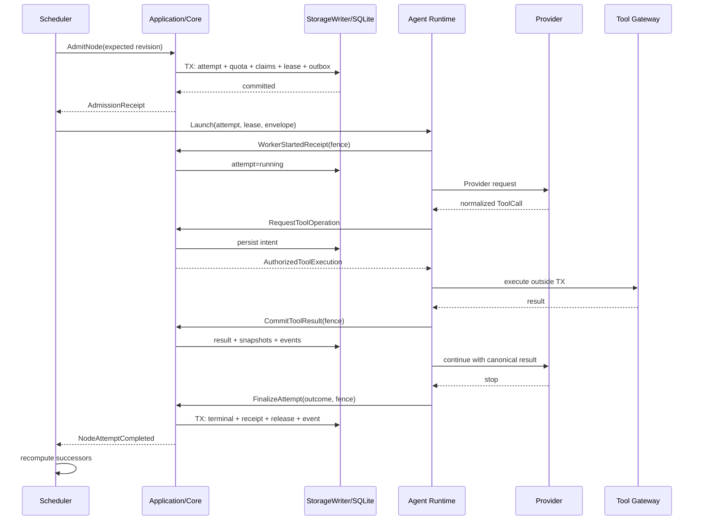
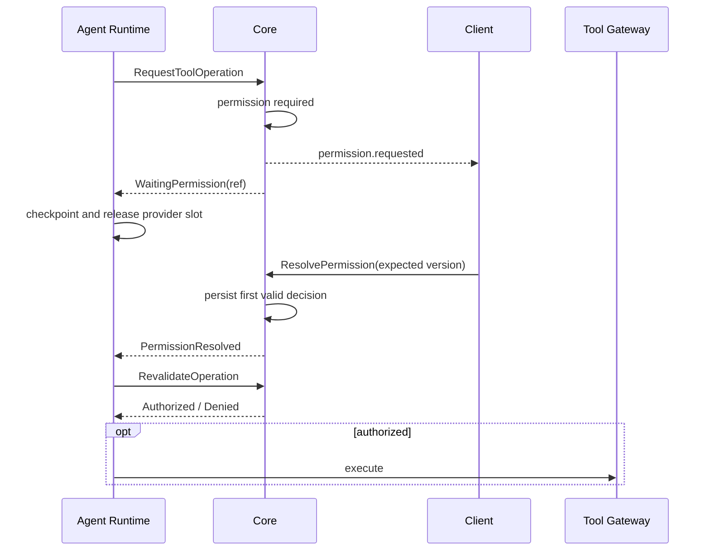
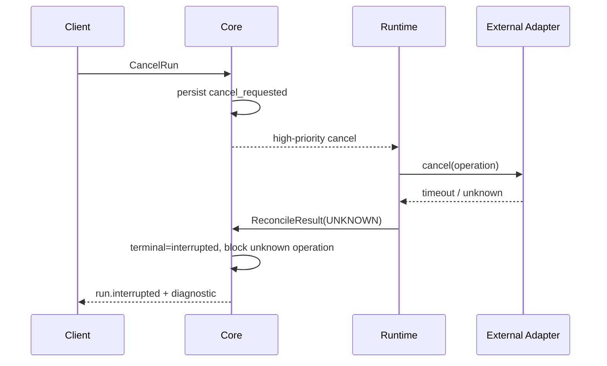
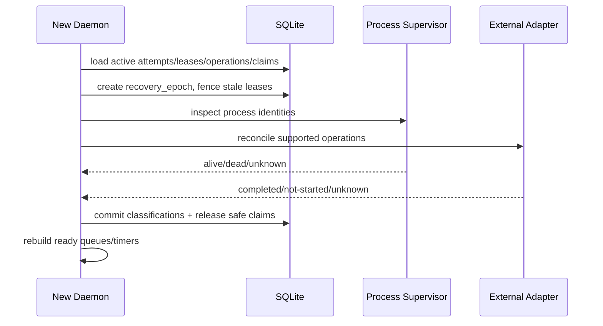

# Apex—— Agent Runtime 与 DAG 调度器详细设计

> 文档状态：架构基线（面向最终完整产品）  
> 版本：v1.0-draft  
> 适用范围：Apex Core、Agent Runtime、Workflow Scheduler、Provider Runtime、Tool Gateway、Process Supervisor  
> 上游依据：`Apex—— 需求分析文档.md`、`Apex—— 系统总体架构设计.md`、`Apex—— 领域模型与事件规范.md`、`Apex—— API与实时事件协议设计.md`、`Apex—— SQLite数据模型与迁移设计.md`

---

## 0. 文档目的

本文定义 Apex 最终完整产品中的 **Agent 运行时（Agent Runtime）** 与 **DAG 工作流调度器（Workflow Scheduler）**。它负责把已经通过 Spec、Rules、权限与信任校验的用户目标，转化为可恢复、可取消、可审计、可并发执行的 Agent、Run、Turn、Workflow Node 与 Tool Operation。

本文重点回答以下问题：

1. 一个 Agent 如何从创建、运行、等待、暂停、取消走向终态；
2. Run、Turn、Provider 请求、ToolCall、NodeAttempt 之间如何建立稳定关系；
3. DAG 节点何时 Ready、何时可以占用资源、何时才算完成；
4. 多 Agent 并发时如何隔离上下文、能力、写路径与工作区；
5. 进程崩溃、网络断开、租约超时、迟到结果发生时如何恢复且不重复副作用；
6. 调度、公平性、限流、背压、取消和重试如何形成统一协议；
7. Runtime 如何与 Application、StorageWriter、Provider、Tool Gateway、MCP、Rules Engine 协作；
8. 哪些状态必须持久化，哪些状态只能作为可丢弃的内存加速结构。

本文不是 Provider SDK、Tool Gateway 权限引擎或提示词模板的完整设计；这些子系统在本文中以端口和契约形式出现。若本文与上游领域/事件规范冲突，优先级为：

1. 已批准的需求与安全约束；
2. `领域模型与事件规范` 中的不变量；
3. `API与实时事件协议设计` 中的外部契约；
4. `SQLite数据模型与迁移设计` 中的持久化约束；
5. 本文中的运行时实现建议。

---

## 1. 架构结论摘要

Apex Agent Runtime 与 DAG Scheduler 采用以下总体方案：

- **单机本地优先、逻辑分布式友好**：v1 运行于 `apexd` 进程内部，但所有执行均使用 Attempt、Lease、Fence Token、Operation ID 和事件协议描述，未来可把 Worker 移出进程而不改变领域语义。
- **Core 是唯一事实裁决者**：Worker、Provider Adapter、Tool Adapter 只能上报观察和结果，不能直接写业务数据库，也不能自行宣布 Run、Agent 或 Node 完成。
- **持久化状态机优先**：内存队列只是 SQLite 中事实状态的加速视图；进程重启后可从事实表、事件流和操作日志重建。
- **命令与副作用分离**：状态准入在短事务中完成；Provider、工具、MCP、子进程等长耗时 I/O 必须在事务外执行；结果再通过带 Fence Token 的命令提交。
- **DAG 是声明式数据，不是任意代码**：v1 不执行用户提供的调度脚本。图编译结果必须可校验、可版本化、可解释、可重放。
- **一次执行对应一次 Attempt**：Provider retry、Tool retry、Node retry、Agent retry具有不同边界。任何需要重新取得执行权的重试都创建新 Attempt，不覆盖旧历史。
- **副作用至多一次提交，未知状态显式阻断**：无法证明外部操作是否完成时，不盲目重放，而是进入 `EXTERNAL_OPERATION_UNKNOWN` 或人工/适配器对账流程。
- **取消是持久化协议，不是内存布尔值**：先保存取消意图，再向执行树传播，最后根据对账结果落为 `cancelled` 或 `interrupted`。
- **写路径声明与权限校验是两套机制**：Write Claim 只解决并发冲突，绝不替代用户权限、Project Trust、Sandbox 或 Rules 校验。
- **完成由结构化证据决定**：模型输出“完成”不等于完成。Node/Agent/Run 的完成必须满足状态机、产物、变更、检查与门禁要求。
- **公平性优于纯吞吐**：调度器按优先级、项目/会话权重、资源配额和等待老化选择任务，禁止单一大型工作流长期占满全部并发槽。

---

## 2. 设计原则与硬性不变量

### 2.1 单一状态所有权

业务状态只能通过 Application Command 进入 Core，并由 StorageWriter 在事务中写入。以下组件不得直接修改 `runs`、`turns`、`agents`、`workflow_nodes`、`node_attempts`、`write_claims`：

- Provider Adapter；
- Tool/MCP Adapter；
- 子进程输出读取器；
- Agent Worker；
- UI、CLI、IDE 插件；
- 后台恢复扫描器。

它们只能发出带上下文和幂等键的命令，例如：

- `ReportProviderStreamEvent`；
- `ReportToolExecutionResult`；
- `HeartbeatNodeAttempt`；
- `FinalizeNodeAttempt`；
- `ReportWorkerExited`；
- `RequestCancellation`。

### 2.2 终态不可逆

`completed`、`failed`、`cancelled`、`interrupted` 是具体 Attempt 的终态。终态记录不可改回运行态。用户点击“重试”必须创建新的 Attempt；历史 Attempt 保留原终态、诊断、输出摘要和关联操作。

### 2.3 完成只提交一次

对一个 `run_id`、`agent_id`、`node_attempt_id`，合法终态事件最多出现一次。重复、迟到或 Fence Token 不匹配的回调：

1. 原始观察可进入审计/诊断记录；
2. 不得改变当前事实状态；
3. 发出 `*.late_result_ignored` 或 `*.stale_callback_rejected`；
4. 必要时触发外部资源清理。

### 2.4 不在数据库事务中执行长 I/O

以下操作不能位于 SQLite 写事务中：

- 调用 LLM Provider；
- 启动或等待子进程；
- 工具执行；
- MCP 网络调用；
- Git checkout/merge/worktree 创建；
- 扫描大型目录；
- 等待用户授权。

事务只负责校验、状态转换、租约/Claim 分配、事件追加、操作日志与 Outbox 写入。

### 2.5 不盲目重放副作用

如果系统在外部操作发出后、结果持久化前崩溃，恢复器必须先依据 Operation Journal、适配器幂等能力和外部查询能力分类：

- `PROVEN_NOT_STARTED`：可安全创建新 Attempt；
- `PROVEN_COMPLETED`：补录或对账结果；
- `IDEMPOTENT_REPLAYABLE`：可用同一幂等键重放；
- `UNKNOWN`：阻断，不自动重放。

### 2.6 Agent 不能扩大授权

子 Agent 的有效能力集必须满足：

```text
effective_child_capabilities
  = requested_capabilities
  ∩ parent_capability_ceiling
  ∩ agent_profile_capabilities
  ∩ project_policy_capabilities
  ∩ current_trust_capabilities
  ∩ runtime_environment_capabilities
```

子 Agent 不得：

- 替用户批准权限；
- 提升 Project Trust；
- 忽略硬规则；
- 绕过 Spec 门禁；
- 给孙 Agent 授予自己不具备的能力；
- 用自然语言声称获得额外权限。

### 2.7 DAG 后继节点只由成功完成释放

前驱处于 `failed`、`cancelled`、`interrupted`、`blocked` 时，默认不释放后继。只有边条件明确允许替代路径，或者用户/系统通过合法的 Block Resolution、Graph Revision 处理后，调度器才重新计算可运行性。

---

## 3. 术语与标识关系

| 概念 | 含义 | 生命周期所有者 |
|---|---|---|
| Session | 用户与项目的长期交互边界 | Session Actor / Core |
| Run | 一次面向目标的可追踪执行 | Core |
| Turn | Run 内一次模型交互与工具循环阶段 | Agent Runtime |
| Agent | 具有独立上下文、角色和能力上限的执行主体 | Agent Supervisor |
| Workflow | 绑定 Spec/Tasks Revision 的 DAG 实例 | Workflow Scheduler |
| Workflow Node | DAG 中的逻辑任务定义 | Core / Scheduler |
| Node Attempt | 某节点的一次实际执行尝试 | Scheduler |
| Provider Attempt | 一次 Provider 请求尝试 | Provider Runtime |
| Tool Operation | 一次可审计工具副作用 | Tool Gateway |
| Worker | 承载 Agent/NodeAttempt 的短期执行单元 | Runtime Supervisor |
| Lease | Core 授予 Worker 的限时执行权 | Scheduler / Core |
| Fence Token | 防止旧 Worker 提交结果的随机令牌 | Core |
| Write Claim | 对规范化写路径范围的互斥声明 | Claim Manager |
| Checkpoint | 可恢复的 Agent 上下文与进度快照 | Context Runtime |
| Outcome | Agent/Attempt 的结构化执行结果 | Core |

推荐标识关系：

```text
Session 1 ── * Run 1 ── * Turn
                 │
                 └── 0..1 primary Agent

Workflow 1 ── * WorkflowNode 1 ── * NodeAttempt
                                │
                                └── 1 AgentRunBinding

Agent 1 ── * Run（但同一时刻最多一个 active Run）
Agent 0..1 ── * ChildAgent
Turn 1 ── * ProviderAttempt
Turn 1 ── * ToolOperation
NodeAttempt 1 ── * LeaseVersion
```

不得把 `Agent` 与 `Run` 合并：Agent 是可暂停、可恢复并持有独立上下文的主体；Run 是一次执行记录。不得把 `WorkflowNode` 与 `NodeAttempt` 合并：Node 是稳定逻辑身份，Attempt 是不可变历史。

---

## 4. 运行时组件拓扑

```text
┌──────────────────────────── Client / UI ────────────────────────────┐
│ commands, approvals, steering, cancel, event cursor, projections    │
└────────────────────────────────┬────────────────────────────────────┘
                                 │
                       ┌─────────▼─────────┐
                       │ Application Layer │
                       │ command/query bus │
                       └──────┬──────┬─────┘
                              │      │
                 ┌────────────▼─┐  ┌─▼────────────────┐
                 │ SessionActor │  │ WorkflowScheduler │
                 │ semantic lane│  │ ready/admission   │
                 └──────┬───────┘  └───────┬──────────┘
                        │                  │
                 ┌──────▼──────────────────▼─────┐
                 │ AgentSupervisor / Runtime     │
                 │ lifecycle, mailbox, checkpoint│
                 └─────┬──────────┬──────────────┘
                       │          │
              ┌────────▼───┐  ┌──▼───────────────┐
              │ Provider   │  │ Tool Gateway      │
              │ Runtime    │  │ MCP / Process     │
              └────────────┘  └──────────────────┘
                       │          │
                 external I/O outside DB transaction
                       │          │
                 ┌─────▼──────────▼─────┐
                 │ commands / callbacks │
                 └──────────┬───────────┘
                            │
                 ┌──────────▼──────────┐
                 │ Core + StorageWriter│
                 │ SQLite + EventStore │
                 └─────────────────────┘
```

### 4.1 Session Actor

每个 Session 拥有一个轻量逻辑 Actor，用于串行化语义级操作：

- 创建/结束 Run；
- 接收用户消息和 Steering；
- 维护一个主交互 Turn；
- 处理权限、Spec 和规则决定；
- 把长耗时执行委托给 Agent Supervisor 或 Workflow Scheduler；
- 通过高优先级邮箱处理取消、安全阻断和恢复命令。

Session Actor **不能长期阻塞等待 Provider 或 Tool**。它提交工作后依赖事件/回调继续推进。

### 4.2 Workflow Scheduler

Scheduler 负责：

- 编译后 DAG 的合法性检查；
- Ready 集合计算；
- 公平选择与准入；
- 配额、Claim、Lease 的原子获取；
- NodeAttempt 创建与状态推进；
- 失败、重试、阻断与恢复；
- 工作流完成门禁。

### 4.3 Agent Supervisor

Agent Supervisor 管理：

- Agent 状态机和父子树；
- Agent mailbox；
- Run/Turn 驱动；
- Context、Checkpoint 与 Compaction；
- Provider stream 与 ToolCall 循环；
- Pause/Resume/Cancel；
- Worker 生命期、Heartbeat 与退出对账；
- 结构化 Outcome 生成。

### 4.4 Process Supervisor

所有 CLI、脚本、MCP Server、本地辅助 Worker 均由 Process Supervisor 启动。它必须抽象跨平台差异：

- Windows Job Object；
- Unix process group / parent-death behavior；
- 标准输入关闭；
- stdout/stderr 有界读取；
- graceful termination 与 hard kill；
- orphan 扫描；
- 退出码和信号归一化。

---

## 5. 状态机总览

### 5.1 Agent 状态机

Agent 聚合的规范状态遵循领域模型：

```text
spawned → queued → running → completed
                     ├──────→ failed
                     ├──────→ cancelled
                     └──────→ interrupted
queued/running → blocked → queued
```

约束：

- 一个 Agent 同一时刻最多绑定一个 active Run；
- `blocked` 必须带明确原因、诊断和合法解阻动作；
- Run 的 `waiting_approval`、`waiting_user`、`paused` 不应再复制成新的 Agent 聚合状态；此时 Agent 保持与 active Run 的绑定，Runtime 通过 execution disposition、Checkpoint 和等待引用表达细粒度状态；
- `completed` 必须有结构化 Outcome；
- `spawned/queued` 与物理存储中的创建/排队字段必须使用显式映射，不能由各 Adapter 自由翻译。

### 5.2 Workflow Node 与 NodeAttempt 状态机

Workflow Node 的规范状态遵循领域模型：

```text
pending → ready → claiming → queued → running → verifying → completed
                    └──────→ blocked
running/verifying → failed | cancelled | interrupted
failed/cancelled/interrupted/blocked → ready（仅通过显式 Retry/Resolve，生成新 Attempt）
任意非终局 → invalidated（Workflow Revision 失效）
```

NodeAttempt 的持久化状态遵循存储模型：

```text
queued → leased → running
  │         │        ├→ blocked
  │         │        ├→ completed
  │         │        ├→ failed
  │         │        ├→ cancelled
  │         │        └→ interrupted
  │         └────────→ failed | cancelled | interrupted
  └──────────────────→ cancelled | interrupted
```

`ready/claiming/queued/running/verifying` 是 Node 的可解释调度阶段；`queued/leased/running/...` 是一次 NodeAttempt 的执行历史。本文使用的 `admission`、`worker_starting`、`completing`、`waiting` 是运行时 phase/事件，不新增第三套聚合状态：

- admission 成功后 Attempt 为 `leased`；
- Worker Started Receipt 成功后 Attempt 为 `running`；
- 完成门禁期间 Node 为 `verifying`，Attempt 仍为 `running`，直到原子提交 `completed`；
- 等待用户/权限由关联 Run 状态表达，必要的节点级不可推进原因使用 `blocked`。

### 5.3 Run 与 Turn 状态

Run 的状态表达总体执行结果，Turn 表达一次可辨识的模型交互阶段。一个 Run 可以包含多个连续 Turn，但同一 Run 内最多一个 active Turn。只有未越过 ToolCall 副作用边界的 Provider 透明重试仍属于同一 Turn；工具结果提交后若需再次请求模型，必须关闭当前 Turn 并创建下一 Turn。上下文压缩、用户 Steering 或模型阶段切换导致的新模型请求也创建后继 Turn，不引入未定义的 Turn Segment 聚合。

自然语言停止原因（如 `stop`、`length`）不能直接映射为 Run completed。Runtime 必须执行完成判定：

- 目标是否满足；
- 必要 ToolCall 是否已提交；
- Spec/Rules/Verification Gate 是否通过；
- 是否仍有未决权限、未知外部操作或未完成节点；
- 是否已生成规定格式的 Outcome。


### 5.4 跨文档状态枚举对齐要求

领域模型是状态语义权威。当前 `SQLite数据模型与迁移设计` 的部分示例 DDL 仍存在物理枚举命名差异，正式实现前必须通过一次前向迁移或显式映射表统一，禁止各模块自行字符串转换：

| 聚合 | 领域规范 | 当前物理示例差异 | 本文决定 |
|---|---|---|---|
| Agent | `spawned/queued/running/blocked/...` | 示例为 `created/running/waiting/...` | 以领域枚举为准；Run 承载 waiting/paused |
| Workflow | `pending/running/paused/blocked/verifying/.../invalidated` | 示例含 `draft/ready`，缺少 `verifying/invalidated` | 以领域枚举为准，编写迁移 |
| WriteClaim | lease 过期后先 `suspect` 再 reconcile | 示例含 `expired`，缺少 `suspect` | 增加 `suspect`；`expired` 只能是观察/原因，不能代表已安全释放 |
| NodeAttempt | `queued/leased/running/blocked/terminal` | 与存储示例基本一致 | 直接采用 |

推荐在下一次 SQLite 设计修订中同步 CHECK constraint、迁移测试和投影映射；在修订完成前，本文中的 runtime phase 不得被误写成新的持久状态。

---

## 6. Agent Loop 详细设计

### 6.1 主循环

Agent Loop 是一个由持久化事件驱动的可中断状态机，而不是无限 `while` 中直接调用模型和工具。逻辑流程如下：

```text
1. Load Execution Envelope
   ├─ Agent/Profile revision
   ├─ Project/Session/Spec binding
   ├─ Rules snapshot
   ├─ Effective capability ceiling
   ├─ Context checkpoint
   └─ Cancellation / pause state

2. Build Stable Context Prefix
   ├─ system/product policy
   ├─ project instructions
   ├─ approved spec/tasks
   ├─ agent role and delegated task
   └─ capability + tool catalog digest

3. Compose Dynamic Context
   ├─ recent messages
   ├─ tool results
   ├─ retrieved files/artifacts
   ├─ workflow/node state
   └─ checkpoint summary

4. Start Provider Attempt
   └─ normalize stream events

5. Handle normalized event
   ├─ text/reasoning delta → transient stream + optional chunk persistence
   ├─ tool request → persist intent → Tool Gateway
   ├─ usage → accounting
   ├─ context pressure → checkpoint/compaction
   ├─ provider error → retry classifier
   └─ stop → completion evaluator

6. Commit boundary
   ├─ transparent provider retry in same turn
   ├─ tool-result/model continuation starts next turn
   ├─ wait/block/pause
   └─ finalize structured outcome
```

每次跨越外部 I/O 前，Runtime 都要保存足以回答以下问题的状态：

- 当前打算做什么；
- 使用了哪个 Operation ID / idempotency key；
- 哪个 Agent/Run/Turn/Attempt 拥有执行权；
- 崩溃后允许重试、必须对账还是必须阻断；
- 返回结果应由哪个 Fence Token 接收。

### 6.2 Execution Envelope

运行时向 AgentDriver 提供不可变的 `ExecutionEnvelope`：

```rust
pub struct ExecutionEnvelope {
    pub project_id: ProjectId,
    pub session_id: SessionId,
    pub run_id: RunId,
    pub turn_id: TurnId,
    pub agent_id: AgentId,
    pub workflow: Option<WorkflowBinding>,
    pub spec: SpecBinding,
    pub profile_revision: AgentProfileRevision,
    pub capability_ceiling: CapabilitySet,
    pub rules_snapshot: RulesSnapshotRef,
    pub context_checkpoint: Option<CheckpointRef>,
    pub lease: ExecutionLease,
    pub cancellation: CancellationScope,
    pub budgets: ExecutionBudgets,
}
```

Envelope 中只保存稳定引用与不可变快照。可变的取消、Steering 和审批结果通过 mailbox/event channel 到达，但每次使用前仍要回到 Core 校验当前版本。

### 6.3 安全点

Runtime 只在安全点执行 Pause、Steering 合并、Checkpoint 切换和上下文压缩。安全点包括：

- Provider 请求发起前；
- 完整 Provider stream event 处理后；
- ToolCall 持久化但尚未执行前；
- Tool result 已提交后；
- 子 Agent Outcome 已提交后；
- Turn 结束时；
- Node 完成门禁开始前。

运行中的不可中断外部调用不被假定为安全点。取消时应触发适配器取消能力，并等待有界对账。

### 6.4 Agent mailbox

每个 active Agent 有一个有界 mailbox，逻辑消息类型包括：

- `UserSteering`；
- `ParentInstruction`；
- `ChildOutcomeAvailable`；
- `PermissionResolved`；
- `SpecDecisionResolved`；
- `PauseRequested`；
- `ResumeRequested`；
- `CancelRequested`；
- `BudgetChanged`；
- `LeaseRevoked`；
- `ShutdownRequested`。

优先级：

```text
P0 safety / lease revoked / hard cancellation
P1 user cancellation / project shutdown
P2 permission or spec decision
P3 pause/resume / parent steering
P4 child outcomes / ordinary steering
P5 progress hints / nonessential telemetry
```

P0/P1 预留独立容量，普通进度消息不得挤占取消通道。对于可合并的消息（进度、重复预算更新）使用 keyed coalescing；禁止无界积压 token delta。

### 6.5 Steering 语义

Steering 是对尚未提交工作的后续指导，不是修改历史。处理规则：

1. 保存 `agent.input_received`，包含来源、序号和内容引用；
2. 在下一个安全点确认是否仍适用于当前 Run/Turn；
3. 尚未发起 Provider 请求时直接加入动态上下文；
4. Provider 正在流式生成时，默认排队到下一安全点；
5. 若产品策略允许“立即打断”，先取消当前 Provider Attempt，并将该 Attempt 标为 aborted/interrupted，再创建新的 Provider Attempt；
6. 已执行的 ToolCall 不因 Steering 回滚；如需撤销必须通过显式补偿操作。

父 Agent 发来的指令必须标记 `source=parent_agent`，绝不能伪装为 `source=user`。

---

## 7. Provider Runtime 与重试边界

### 7.1 归一化事件

Provider Adapter 把不同厂商流转换为内部事件：

```rust
pub enum ProviderStreamEvent {
    ResponseStarted { provider_request_id: Option<String> },
    TextDelta { channel: OutputChannel, text: String },
    ToolCallStarted { provider_call_id: String, name: String },
    ToolCallArgumentsDelta { provider_call_id: String, json_fragment: String },
    ToolCallCompleted { provider_call_id: String, name: String, arguments: Value },
    UsageUpdated { input: u64, output: u64, cached: u64 },
    Stop { reason: NormalizedStopReason },
    RetryHint { retry_after: Option<Duration> },
    Error { class: ProviderErrorClass, diagnostic: Diagnostic },
}
```

Adapter 不决定 Tool 是否执行，不决定 Run 是否完成，也不直接向 UI 发布权威终态。

### 7.2 Provider Attempt

每次网络请求都有独立 `provider_attempt_id`。至少记录：

- provider/model/profile revision；
- request body digest 与上下文 digest；
- client operation ID；
- provider request ID（如有）；
- started/first-byte/ended 时间；
- usage；
- stop/error class；
- 是否已经产生持久化 ToolCall；
- retry_of。

### 7.3 透明重试规则

允许在同一 Turn 内透明重试的条件必须同时成立：

- 尚未观察到已提交的 ToolCall；
- 尚未向用户发布不可撤回的权威完成事件；
- Provider 错误分类为 transient/rate-limit/transport；
- 剩余时间、token、费用和 retry budget 足够；
- 幂等策略允许；
- 当前 Run 未取消、暂停或失去 Lease。

一旦 ToolCall 意图已持久化，后续 Provider 失败不得通过重放整个请求来隐式再次执行工具。正确做法是：

1. 根据 Tool Operation 状态恢复/对账；
2. 取得唯一的工具结果；
3. 创建新的 Provider Attempt，把已持久化工具结果加入上下文；
4. 关闭当前 Turn，创建后继 Turn，并把唯一的工具结果作为规范化输入。

### 7.4 流式输出与持久化

Token delta 是高频、可丢失的显示数据；语义消息、ToolCall、Stop、Usage 和终态是权威数据。推荐：

- UI delta 通过有界 transient channel 发送；
- 每 100–500 ms 或达到字节阈值合并成 chunk；
- chunk 可持久化以支持重连，但不为每个 token 建事务；
- 最终消息以 canonical content block 持久化；
- 重连客户端先读取 projection，再从 event cursor 补齐。

### 7.5 Provider 取消

Provider cancel 返回仅代表取消请求已发送，不证明远端已停止。Runtime 需要区分：

- `cancel_acknowledged`：Provider 明确确认；
- `stream_closed_after_cancel`：连接关闭但远端状态未知；
- `cancel_unsupported`：只能丢弃迟到结果；
- `cancel_timeout`：进入对账或 interrupted。

任何取消后的迟到 ToolCall 都不得进入执行队列。

---

## 8. ToolCall 集成协议

### 8.1 ToolCall 的持久化边界

完整 ToolCall 参数解析成功后，Runtime 提交 `RequestToolOperation`：

```text
Provider stream
  → arguments complete
  → validate JSON/schema
  → persist Tool Operation intent
  → scope/permission/trust/rules/write-claim checks
  → pre-snapshot
  → execute outside transaction
  → normalize result
  → post-snapshot/rules
  → commit result
  → feed canonical result to Agent
```

在 Tool Operation intent 提交前，不允许执行工具。Provider 原始 `call_id` 只用于关联，系统必须分配自己的 `operation_id`。

### 8.2 等待授权

遇到权限或信任决策时：

1. Tool Operation 进入 `awaiting_permission`；
2. Agent/Turn 进入带原因的 `waiting`，但不占用 Provider 请求；
3. 权限请求持久化并发布给所有客户端；
4. 第一个合法且版本匹配的决定生效；
5. 授权后重新校验 Spec、Rules、Capability、Write Claim 和环境状态；
6. 拒绝则把结构化 denial result 返回 Agent，是否导致 Node blocked 由策略决定。

授权不能永久绑定未经规范化的命令字符串；长期授权应绑定 Tool、规范化 Scope、风险等级和策略版本。

### 8.3 Tool 结果去重

Runtime 以 `operation_id + attempt_no` 接收结果，并验证：

- operation 当前状态允许提交；
- owner Run/Turn/Agent 仍匹配；
- Lease/Fence Token 有效；
- 参数摘要与 intent 一致；
- 结果未提交过。

重复结果返回已有提交状态；不一致重复结果产生安全诊断并阻断自动继续。

### 8.4 Task 工具

面向模型的 `Task`/`SpawnAgent` 工具只是 Scheduler Command 的受控入口：

- 不能直接启动未登记线程或进程；
- 不能绕过 Agent 数量、递归深度、Provider、Write Claim 配额；
- 不能自行构造更高能力 Profile；
- 返回的是 `agent_id/node_attempt_id` 与受控状态，不把内部 Worker handle 暴露给模型；
- 等待、输入、取消、查询必须通过独立命令完成。

---

## 9. Context、Checkpoint 与 Compaction

### 9.1 上下文分层

Agent 上下文按稳定性分为：

1. **Stable Prefix**：系统策略、产品规则、项目指令、Agent Profile、Spec Revision、**Tool Catalog、Skill Metadata**；
2. **Execution Context**：当前目标、Workflow Node、依赖 Outcome、写路径委托；
3. **Conversation Tail**：近期消息、工具调用与结果；
4. **Retrieved Context**：按需读取的文件、符号、诊断、文档片段；
5. **Checkpoint Summary**：旧历史的结构化压缩；
6. **Ephemeral Hints**：可丢失进度、缓存命中、UI 状态。

稳定前缀应使用内容摘要支持 Provider cache，但任何 Rules/Spec/Profile/Tool/Skill Revision 变化都必须生成新摘要。

**Skill Metadata 层是必需项**，不可省略。它是 Skills 三层渐进加载（metadata 常驻 → body 触发时加载 → resources 按需读取）的第一层：metadata 不常驻 prompt，模型就无从得知有哪些 Skill 存在，也就永远不会触发 body 加载，整个 Skills 系统在运行时不可达。metadata 仅含 `name`、`description`、`source`、`version` 与能力摘要，按 `skill_name + revision` 稳定排序，与 Tool Catalog 同样不得依赖 HashMap 或加载顺序。详见 `Apex—— MCP、Skill、Hook与Plugin扩展系统详细设计.md` §Skill 渐进加载。

> ADR-0031（跨文档一致性审查）：原分层缺 Tool Catalog 与 Skill Metadata，与系统总体架构 §8.1 规定的 Stable prefix 构成不符，已补入。


### 9.2 Checkpoint 内容

Checkpoint 至少包括：

- agent/run/turn 绑定；
- 已完成目标与剩余目标；
- 决策及依据引用；
- 已读取关键文件和内容摘要；
- 已提交 Tool Operations 及结果引用；
- 当前工作区基线、变更路径和快照引用；
- 子 Agent 状态与已接收 Outcome；
- 未决权限、Block、风险、未知外部操作；
- token/时间/费用预算；
- Context schema version 与 checksum。

Checkpoint 是恢复线索，不是事实表替代品。恢复时事实状态优先于摘要文本。

### 9.3 触发条件

在以下时机创建 Checkpoint：

**基线必需触发点**（需求文档 §3.5.1、系统总体架构 §8.2）：

- **Spec 阶段完成**；
- **token 使用率达到 60% / 75% / 85%**（以 `count_tokens` 权威计数判定，非本地估算）；
- **Workflow 节点切换**；
- **用户显式命令**（如 `/checkpoint`）；
- **Run 结束、暂停、失败或取消**。

运行时补充触发点：

- Tool 产生大量输出；
- Agent 即将等待用户或长期外部事件；
- Pause/Shutdown/Cancel 对账前；
- Node 完成门禁前；
- 子 Agent 大量汇聚前；
- 运行超过时间或 token 间隔阈值。

> ADR-0036（跨文档一致性审查）：原清单缺 Spec 阶段完成、60/75/85 水位、用户命令与 Run 终结四类基线必需触发点，仅以"软阈值"笼统覆盖。完整触发矩阵与各档动作见 `Apex—— Context与Checkpoint系统详细设计.md` §8.2。

### 9.4 压缩安全

Compaction 不能丢失：

- 用户未撤销的约束；
- Spec/Tasks 的精确 revision 与 checksum；
- 权限/拒绝决定；
- 未决 ToolCall；
- 外部操作幂等键；
- 文件变更与测试证据；
- 子 Agent 的结构化结果；
- 取消与 Block 状态。

压缩摘要必须标注来源、生成模型/算法版本和覆盖的消息范围。需要精确内容时，通过 ContentRef 回读，不依赖摘要猜测。

---

## 10. 多 Agent 生命周期与通信

### 10.1 Spawn 流程

```text
Parent/User/Workflow requests SpawnAgent
  → validate caller authority
  → validate spec/tasks binding
  → check recursion and count budgets
  → resolve profile revision
  → intersect capability ceiling
  → canonicalize delegated write scopes
  → validate parent reservation compatibility
  → persist Agent(spawned) + spawn intent
  → scheduler admission
  → create Run/Turn/Lease
  → launch worker
```

`SpawnAgent` 成功只表示 Agent 已登记并可被调度，不保证已开始运行。API 应返回当前状态和事件游标。

### 10.2 上下文隔离

子 Agent 拥有独立：

- Agent ID；
- Run/Turn 序列；
- message sequence；
- Context Checkpoint；
- Tool Operation namespace；
- token/time/cost budget；
- outcome；
- 可选隔离 worktree。

子 Agent 不能直接修改父 Agent 消息，也不能把结果插入成用户消息。通信通过持久化 mailbox/event 完成。

### 10.3 委派信封

父 Agent 创建的任务使用结构化 `DelegationEnvelope`：

```rust
pub struct DelegationEnvelope {
    pub objective: ContentRef,
    pub acceptance_criteria: Vec<Criterion>,
    pub relevant_context: Vec<ContentRef>,
    pub expected_artifacts: Vec<ArtifactExpectation>,
    pub allowed_write_scopes: Vec<CanonicalPathScope>,
    pub forbidden_actions: Vec<ActionConstraint>,
    pub budgets: DelegatedBudgets,
    pub return_schema: OutcomeSchemaVersion,
}
```

委派内容中的自然语言不能覆盖 Capability Ceiling、Rules 或安全策略。

### 10.4 结构化 Outcome

Agent 终态必须生成：

```rust
pub struct AgentOutcome {
    pub status: AgentOutcomeStatus,
    pub summary: ContentRef,
    pub completed_criteria: Vec<CriterionResult>,
    pub changed_paths: Vec<PathChange>,
    pub patch_or_snapshot: Option<ArtifactRef>,
    pub tests: Vec<VerificationResult>,
    pub rules: Vec<RuleEvaluationResult>,
    pub diagnostics: Vec<Diagnostic>,
    pub produced_artifacts: Vec<ArtifactRef>,
    pub unresolved_risks: Vec<Risk>,
    pub unknown_operations: Vec<OperationId>,
    pub recommended_next_actions: Vec<ActionProposal>,
}
```

父 Agent 只能把该 Outcome 作为受信等级明确的子 Agent 结果使用；它不是用户批准，也不是事实正确性的证明。

### 10.5 Parent Reservation

父 Agent 可预留未来需要写入的路径，以防子任务相互覆盖。规则：

- Reservation 是 Claim 的一种，不消耗执行并发槽；
- Reservation 会阻止不兼容的其他写任务；
- 子 Agent 的写 Claim 必须是父委派范围的子集，或与 Reservation 明确兼容；
- 父 Agent 不得一边持有整个仓库 Reservation，一边无期限等待子 Agent；
- 超过阈值的宽泛 Reservation 必须有时限，并显示死锁/吞吐诊断；
- 父节点汇聚前应释放不再需要的范围。

### 10.6 子 Agent 等待策略

父 Agent 可以：

- 异步继续其他无依赖工作；
- `wait_any` 等待任一子 Agent；
- `wait_all` 等待指定集合；
- 为子 Agent 提供追加输入；
- 取消仍不需要的子 Agent。

任何 race/timeout 实现必须取消并对账失败分支，禁止把 losing future 作为孤儿留在后台。


### 10.7 Agent Profile 编译

需求中以 Markdown frontmatter 定义子 Agent。Runtime 不直接在执行时反复解析可变文件，而由 Profile Compiler 生成不可变 `AgentProfileRevision`。基础字段包括：

```yaml
name: implementation-agent
description: 实现已批准任务并提交结构化验证结果
tools: [read, search, edit, shell]
model: coding-default
write_paths:
  - src/module/**
```

编译规则：

- `name/description/tools/model/write_paths` 保持生态兼容；
- Profile 文件内容、来源路径、优先级和解析器版本形成 checksum；
- `tools` 与 `write_paths` 只是请求上限，仍需与父能力、Project Policy、Trust、Permission 和 Node Delegation 求交；
- Profile 在 Agent spawned 时固定 revision，文件随后变化不影响正在运行的 Agent；
- Profile 删除或禁用会阻止新 Agent，不能让旧 Agent 自动换成同名新 revision；
- frontmatter 中未知安全相关字段默认拒绝或产生编译诊断，不静默忽略。
---

## 11. DAG 编译与版本化

### 11.1 输入与输出

Workflow Compiler 输入：

- `spec_id`、Spec Revision 与 checksum；
- `tasks_revision_id` 与 checksum；
- Project Rules Snapshot；
- Agent Profile Catalog Revision；
- Tool/Capability Catalog Revision；
- 编译选项与资源策略。

输出是不可变的 `WorkflowRevision`：

- 节点、边与条件；
- 每个节点的角色、目标、验收条件；
- 输入依赖和 Outcome schema；
- 预计读/写路径；
- 资源需求；
- 重试与超时策略；
- 是否 mandatory；
- 完成后验证门禁；
- 编译诊断和图摘要。

### 11.2 v1 禁止任意调度代码

v1 的 Workflow 是数据驱动图。条件表达式使用受限、纯函数式 DSL，只允许读取：

- 前驱节点结构化 Outcome；
- Workflow 参数；
- Spec/Tasks 中显式字段；
- 已持久化的验证结果。

禁止访问：

- 文件系统；
- 网络；
- 当前墙钟时间；
- 随机数；
- 环境变量和密钥；
- 未登记的数据库表；
- 任意脚本解释器。

未来如引入确定性 Workflow VM，必须禁用或注入 `Date/time/random/fs/net`，并把 VM bytecode、输入摘要和版本写入 Revision。该能力不属于 v1 必需范围。

### 11.3 图校验

发布 WorkflowRevision 前必须通过：

1. Workflow/Node ID 唯一；
2. 节点引用和边端点存在；
3. 无自环；
4. 图无环；
5. mandatory 节点从入口可达；
6. mandatory 完成路径可到达 Workflow completion gate；
7. 条件边不会产生未定义输入；
8. Outcome schema 与后继输入兼容；
9. 写路径声明可规范化；
10. Agent Profile/Tool/Capability 引用存在；
11. 资源请求不超过项目硬上限；
12. Retry/Timeout 策略合法；
13. Spec/Tasks checksum 匹配；
14. 动态 fan-out 有明确上限；
15. 验证节点不能被普通节点绕过。

拓扑排序和 cycle diagnostic 应返回最小可解释路径，而不是只返回“有环”。

### 11.4 动态图变更

运行中的图不得原地修改。任何新增、删除、替换节点或边都产生新的 `workflow_revision`：

1. 读取旧 Revision 与已完成节点；
2. 生成候选新 Revision；
3. 完整重新校验 DAG；
4. 计算节点身份映射；
5. 对已完成结果执行兼容性检查；
6. 标记可复用、失效、需重跑的节点；
7. 原子切换 active revision；
8. 重新计算 Ready 集合。

已运行 Attempt 永远保留并指向原 Revision。不得为了“看起来整洁”重写旧历史。

---

## 12. Ready 计算与节点准入

### 12.1 Ready 的严格定义

节点仅在同时满足下列条件时为 Ready：

```text
workflow.state == running
AND node.enabled_in_active_revision
AND node.not_terminal_for_current_revision
AND no_active_attempt(node)
AND all_required_predecessors == completed
AND all_edge_conditions == true
AND spec_binding.valid
AND tasks_revision.valid
AND rules_snapshot.available
AND backoff_deadline <= now
AND no_unresolved_block
```

Ready 只表示“逻辑上可以竞争执行”，不表示已经占用并发槽、Claim 或 Worker。

### 12.2 准入流水线

```text
Ready candidate
  → stale/version check
  → priority & fairness selection
  → resource feasibility check
  → capability/profile availability
  → canonical write-scope calculation
  → atomic admission transaction
      ├ create NodeAttempt
      ├ allocate concurrency counters
      ├ acquire all Write Claims
      ├ create Lease + Fence Token
      ├ bind Agent/Run
      ├ append admitted events
      └ write launch outbox intent
  → commit
  → launch Worker outside transaction
  → submit WorkerStartedReceipt
```

如果 Worker 启动失败，Runtime 通过命令把 Attempt 终结为 `failed` 或 `interrupted`，释放资源并执行重试策略。不得回滚已经提交的历史事件。

### 12.3 原子准入

以下动作必须位于同一 SQLite `BEGIN IMMEDIATE` 短事务中：

- 再次验证 Workflow/Node/Revision/Spec 状态；
- 确认不存在 active Attempt；
- 验证并更新并发配额计数或租用记录；
- 获取完整 Write Claim 集合；
- 创建 Attempt、Lease 和 Fence Token；
- 创建/绑定 Agent 与 Run（按具体模式）；
- 追加领域事件与 Outbox 启动意图。

Claim 不允许“先拿一部分再等另一部分”。所有 Scope 先规范化、排序并在一个事务中全取或全不取，从根源避免 hold-and-wait 死锁。

### 12.4 启动回执

Worker 启动后必须提交 `WorkerStartedReceipt`：

```rust
pub struct WorkerStartedReceipt {
    pub node_attempt_id: NodeAttemptId,
    pub lease_id: LeaseId,
    pub fence_token: SecretToken,
    pub worker_instance_id: WorkerInstanceId,
    pub process_identity: Option<ProcessIdentity>,
    pub runtime_version: String,
    pub started_at_mono: MonotonicInstantSample,
}
```

Core 只在回执匹配、Attempt 持久状态仍为 `leased` 且 runtime phase 为 `admitted|worker_starting` 时转为 `running`。若回执迟到且 Lease 已被撤销，Worker 必须立即停止，结果不被接受。

### 12.5 Node 完成门禁

NodeAttempt 进入 `completed` 前必须验证：

- AgentOutcome schema 正确；
- 必要验收条件有证据；
- 声明的变更范围与实际变更一致；
- 没有未决 Tool Operation；
- 没有 `EXTERNAL_OPERATION_UNKNOWN`；
- 必须执行的测试/规则已得到结果；
- 写入产物已 materialize 或有可恢复 intent；
- Lease/Fence Token 当前有效；
- Workflow/Node Revision 仍允许接收结果。

终态、Outcome、变更集引用、验证结果、资源释放、Claim 释放和 `node_attempt.completed` 事件必须在一个事务中提交。这样不会出现“终态已发布但结果收据丢失”。

---

## 13. 调度器内部结构

### 13.1 逻辑模块

```text
WorkflowScheduler
├─ WorkflowIndex          active revision and node state cache
├─ ReadyEvaluator         dependency/condition/block evaluation
├─ AdmissionQueue         prioritized fair queue
├─ QuotaManager           hierarchical resource budgets
├─ ClaimManager           canonical scopes and overlap
├─ LeaseManager           grant/heartbeat/revoke/fence
├─ AttemptCoordinator     create/start/finalize/retry
├─ CompletionEvaluator    workflow-level gates
├─ RecoveryReconciler     restart and orphan handling
└─ SchedulerTelemetry     metrics, tracing, diagnostics
```

这些内存模块是 projection/cache。任何缓存丢失都能从 SQLite 重建；缓存与数据库版本不一致时以数据库为准。

### 13.2 驱动方式

Scheduler 是“事件唤醒 + 周期兜底”模型：

- Workflow start/resume；
- NodeAttempt terminal；
- Block resolved；
- Claim released；
- quota/slot released；
- retry deadline reached；
- Spec/Rules revision changed；
- Worker heartbeat timeout；
- recovery completed。

此外保留低频 reconcile tick，修复丢失唤醒，但不通过高频轮询数据库驱动主流程。

### 13.3 单写者与并发读取

多个 Scheduler task 可以并行计算候选，但最终准入必须通过 Application/Core 的单一写入路径。使用 optimistic version + transaction recheck 防止双重准入。

### 13.4 调度命令幂等

每个内部调度动作带 `scheduler_operation_id`。重复执行时：

- 若已成功提交，返回原结果；
- 若请求参数摘要不同，拒绝为幂等冲突；
- 若上次处于未知外部状态，进入 reconcile；
- 不创建第二个 active Attempt。

---

## 14. 优先级、公平性与防饥饿

### 14.1 优先级类别

从高到低：

| 类别 | 示例 | 说明 |
|---|---|---|
| P0 Safety/Recovery | Lease revoke、越权阻断、崩溃对账 | 预留执行与写队列容量 |
| P1 Cancellation | 用户取消、项目关闭 | 可抢占等待队列，不能跳过对账 |
| P2 Interactive | 当前用户前台 Run | 低延迟优先 |
| P3 Workflow Critical | mandatory/关键路径节点 | 有界提升 |
| P4 Repair/Verification | 规则修复、测试、集成 | 防止主工作完成但门禁饿死 |
| P5 Background | 索引、非关键探索、预取 | 可延后 |

优先级不能绕过权限、Claim、配额或 Spec 门禁。

### 14.2 公平算法

建议使用分层的 **Weighted Deficit Round Robin（WDRR）+ aging**：

1. 第一层按 Project；
2. 第二层按 Session/Workflow；
3. 第三层按节点优先级与关键路径权重；
4. 根据预计成本扣除 deficit；
5. 等待时间持续增加 aging score；
6. 单一 Project/Workflow 有 burst 上限。

成本估计可以使用历史 EWMA：Provider token、Tool wall time、CPU、进程数、写路径宽度。估计错误只影响公平性，不能影响正确性。

### 14.3 关键路径提升

Scheduler 可计算剩余 DAG 的近似 critical path，为关键节点加权，但必须满足：

- boost 有上限；
- interactive 任务仍可获得槽位；
- verification/integration 节点不会被无限推迟；
- 不因 boost 抢占正在执行且不可安全抢占的 Tool Operation。

### 14.4 防止大工作流垄断

默认策略：

- 每个 Workflow 有 active Agent 上限；
- 每个 Project 保留至少一个可用于交互任务的软槽；
- 背景 fan-out 分批准入；
- 同一父 Agent 的子 Agent burst 有上限；
- Provider 并发、Tool 并发、Process 并发分别计数，不能只使用一个总槽。

---

## 15. 分层资源配额与背压

### 15.1 资源维度

至少管理：

- active Agents；
- active Workflow NodeAttempts；
- Provider concurrent requests；
- Provider requests/minute 与 tokens/minute；
- Tool concurrent executions；
- subprocess count；
- MCP calls/connections；
- CPU-heavy tasks；
- memory estimate；
- stdout/stderr buffered bytes；
- event channel bytes；
- Writer queue depth；
- token/cost/time budgets；
- isolated worktree count；
- disk usage。

默认全局 Agent 并发建议为 `min(16, 2 × logical_cpu_cores)`，但最终值由设备探测、用户设置和 Provider 限额共同决定。

### 15.2 配额层级

```text
Global hard limit
  └─ Runtime category limit
      └─ Project limit
          └─ Session/Workflow limit
              └─ Agent/Node budget
```

有效上限取各层最小值。软上限可以借用空闲容量，硬上限不可突破。

### 15.3 准入令牌

不要只使用一个 semaphore。Node 可能需要组合资源：

```text
1 agent slot
1 workflow slot
1 provider slot (when request starts)
N process slots (when tool starts)
write claims
worktree slot (optional)
```

长期不使用的资源不应提前占有。例如等待用户授权的 Agent 不应占 Provider slot；等待 backoff 的 Node 不应占 Worker slot。Agent 总量槽是否保留由等待类型与产品策略决定。

### 15.4 背压传播

当下游拥塞时：

- Writer queue 高水位：暂停普通新准入，保留取消/安全/恢复通道；
- UI event channel 高水位：合并/丢弃 transient delta，不丢权威事件；
- Provider rate limit：节点进入带 deadline 的 quota wait，不忙循环；
- Tool process 输出过快：有界 ring buffer + spool file，超过策略则终止；
- 磁盘低水位：阻止新 worktree/大 artifact，允许清理与取消；
- 内存压力：触发 context compaction 和低优先级任务暂停。

---

## 16. Write Claim 详细设计

### 16.1 规范化

所有路径在比较前转换为 `CanonicalProjectPath`：

1. 必须相对 Project Root 表达；
2. 解析 `.`、`..`，禁止越出根目录；
3. 解析现有路径中的 symlink/junction；
4. 对不存在的尾部路径使用最近存在祖先的真实路径；
5. 应用平台大小写规则；
6. 统一分隔符和 Unicode normalization；
7. 目录 Scope 用明确类型表示，不靠尾斜杠猜测；
8. Glob 编译为受限 matcher 并保存规范化表达式。

若无法证明两个动态 Glob 不重叠，按冲突处理。

### 16.2 Scope 类型

```rust
pub enum WriteScope {
    File(CanonicalProjectPath),
    DirectoryTree(CanonicalProjectPath),
    Glob(CanonicalGlob),
    GeneratedArtifactNamespace(ArtifactNamespace),
    GitIndex,
    RepositoryMetadata,
}
```

`GitIndex`、`.git` 元数据、依赖锁文件等可作为特殊资源，不应被普通文件路径比较遗漏。

### 16.3 冲突规则

- 同一 File 冲突；
- File 与包含它的 DirectoryTree 冲突；
- 两个祖先/后代 DirectoryTree 冲突；
- Glob 与任何可匹配 Scope 冲突；
- 未知 overlap 冲突；
- read scope 默认不互斥，但读取基线会被 Snapshot/Checksum 固化；
- merge/integration 节点可通过专用模式接收多个隔离 Patch，而不是让多个 Worker 同写主工作区。

### 16.4 Claim 生命周期

```text
requested → active → suspect → releasing → released
                   └──────────→ revoked
```

Lease 过期时 Claim 先进入 `suspect`，因为过期不证明 Worker 已停止。Reconciler 需要：

1. 检查 Worker/Process 身份；
2. 发送撤销/终止；
3. 等待 grace period；
4. 再次确认进程、Tool Operation 和 worktree 状态；
5. 释放或升级为人工 Block。

### 16.5 Claim 与实际变更核对

执行前保存基线 Snapshot；执行后比较 changed paths：

- 实际写入全部在 Claim 范围内：继续规则检查；
- 写入超出 Claim 但仍在权限范围：安全阻断，不能自动扩大 Claim 后掩盖违规；
- 写入超出权限/Project Root：立即终止并生成高危诊断；
- 检测不到准确变更范围：对高风险工具使用更宽 Claim 或隔离工作区。

---

## 17. 隔离 Worktree 与补丁汇聚

### 17.1 使用场景

以下任务优先使用隔离 worktree/sandbox：

- 多个 Agent 可能修改相邻模块；
- 大范围重构；
- 不可信或高风险工具；
- 需要并行尝试多个候选方案；
- 修改 Git index/branch；
- 预计回滚成本高。

### 17.2 WorktreeBinding

每个隔离执行记录：

- base repository/head checksum；
- base workspace snapshot；
- worktree path（内部引用，不暴露为任意用户路径）；
- owning Attempt/Agent；
- allowed scopes；
- created/last-used/expiry；
- resulting commit/patch/artifact；
- cleanup state。

### 17.3 汇聚协议

```text
Child completes in isolated worktree
  → produce patch + changed-path manifest + base checksum
  → persist AgentOutcome
  → integration node acquires target claims
  → verify current target base
  → three-way apply/merge
  → conflict? block WORKTREE_CONFLICT
  → run rules/tests
  → commit integrated snapshot
```

子 Agent completed 不代表补丁已进入主工作区。必须分别显示“任务已完成”和“变更已集成”。

### 17.4 清理

Worktree 只有在以下条件都满足后才可自动清理：

- Outcome、patch/commit 与日志已持久化；
- 没有活跃 Process；
- 没有未决外部 Operation；
- 集成成功、明确拒绝，或保留策略到期；
- 清理操作本身通过 Operation Journal 追踪。


---

## 18. Lease、Heartbeat 与 Fence Token

### 18.1 Lease 目的

Lease 不是业务锁，而是 Core 授予某个 Worker 在有限时间内代表 Attempt 提交进度/结果的权利。Lease 至少包含：

```rust
pub struct ExecutionLease {
    pub lease_id: LeaseId,
    pub owner_kind: LeaseOwnerKind,
    pub owner_id: String,
    pub attempt_id: AttemptId,
    pub lease_version: u64,
    pub fence_token: SecretToken,
    pub issued_at: Timestamp,
    pub expires_at: Timestamp,
    pub heartbeat_interval: Duration,
}
```

Fence Token 应使用足够强的随机值，仅保存安全摘要或按敏感字段处理，不写普通日志。

### 18.2 Heartbeat

Heartbeat 请求携带：

- lease_id/version；
- fence token；
- Worker instance/process identity；
- monotonic progress sequence；
- 当前 phase；
- 最近安全点；
- active external operation IDs；
- 资源摘要。

Core 校验后延长过期时间。Heartbeat 不应每次都产生高成本完整事件；可以更新事实表并按节流周期记录审计事件。

### 18.3 时间语义

- 进程内 deadline 使用 monotonic clock；
- 持久化 `expires_at` 使用 UTC wall clock；
- 重启后考虑 clock skew/grace；
- 不因单次时钟跳变立即释放 Claim；
- 测试中注入 `Clock`，禁止依赖真实 sleep 验证状态机。

### 18.4 过期处理

```text
lease deadline reached
  → mark lease expired/suspect
  → reject new ordinary progress
  → signal Worker cancellation/revocation
  → inspect process and operations
  → reconcile external state
  → finalize interrupted/blocked
  → release resources and claims
  → optionally schedule new Attempt
```

旧 Worker 的任何后续结果都因 lease version/fence 不匹配被拒绝。

### 18.5 Lease 续期失败

Worker 连续续期失败时必须进入 self-fencing：

1. 停止发起新 Provider/Tool 操作；
2. 尝试取消已发起的可取消操作；
3. 保存本地诊断/临时结果；
4. 在短 grace period 内重新确认 Lease；
5. 无法确认则退出。

不能假设“数据库暂时不可达但继续写文件没关系”。

---

## 19. Pause、Resume、Cancel 与 Shutdown

### 19.1 统一取消树

取消作用域构成层级树：

```text
Daemon
└─ Project
   └─ Session
      ├─ Workflow
      │  └─ NodeAttempt
      │     └─ Agent/Run/Turn
      │        ├─ ProviderAttempt
      │        ├─ ToolOperation
      │        └─ ChildProcess
      └─ Interactive Run
```

父作用域取消向下传播；子作用域取消不默认取消父级。每个 scope 保存 `cancel_requested_at`、requester、reason、mode 和 deadline。

### 19.2 取消顺序

必须遵守：

1. Core 持久化 `cancel_requested`；
2. 高优先级通知 Runtime；
3. 阻止该 Scope 发起新外部操作；
4. 向 Provider/Tool/MCP/Process/Child Agent 传播；
5. 等待有界 graceful period；
6. 对仍运行的本地进程 hard terminate；
7. 对外部操作执行 reconcile；
8. 创建 post-cancel Checkpoint；
9. 在事务中提交终态并释放资源。

若能证明所有副作用已停止或已知，终态为 `cancelled`；若存在无法确认的执行，终态为 `interrupted`，并附带 unknown operations。

### 19.3 Cancel mode

| 模式 | 行为 | 场景 |
|---|---|---|
| graceful | 到最近安全点停止，先请求适配器取消 | 默认用户取消 |
| immediate | 阻止新工作并快速终止本地进程 | 安全风险、项目关闭 |
| abandon-wait | 不再等待远端，但保留对账任务 | 不支持取消的远端调用 |

即使 immediate 也必须先持久化意图，不能直接 kill 后再猜状态。

### 19.4 Workflow Pause

Workflow Pause 默认是 `drain` 语义：

- 不再准入新节点；
- 已 running 的 Attempt 继续到安全终点；
- 等待/blocked 节点保留；
- 完成结果正常提交；
- Workflow 不进入 completed，直到 Resume 后重新计算。

可选模式：

- `pause_after_safe_point`：要求 active Agent 在安全点暂停；
- `cancel_active`：取消 active Attempt，Resume 时需显式重试；
- 不提供“冻结任意操作系统进程内存”的语义。

### 19.5 Agent Pause/Resume

Pause 请求到达后：

1. 保存 pause intent；
2. 停止发起新 Tool/Provider 操作；
3. 到安全点创建 Checkpoint；
4. 释放可释放的 Provider/Process 资源；
5. 根据策略保留或释放 Write Claim；
6. 状态转 `paused`。

长期 Pause 默认释放执行槽和 Write Claim；Resume 前重新校验 Spec、基线和 Claim。若基线变化导致不安全，进入 Block 而不是直接续跑。

### 19.6 Daemon Shutdown

优雅关机流程：

- 停止接收普通新命令；
- 持久化 shutdown epoch；
- 暂停新准入；
- 通知 active Runtime 到安全点；
- 等待有界时间；
- 对剩余执行应用取消/中断协议；
- flush StorageWriter/Outbox；
- 写入 clean shutdown marker。

没有 clean marker 的下次启动必须执行完整恢复扫描。

---

## 20. Retry、Backoff 与 Block Resolution

### 20.1 重试层级

| 层级 | 新身份 | 允许场景 | 禁止场景 |
|---|---|---|---|
| Provider transport retry | 新 provider_attempt_id | ToolCall 前的瞬时网络/限流错误 | 已有可能重复的 ToolCall |
| Tool attempt retry | 新 operation attempt | 工具明确幂等或已证明未启动 | 外部状态未知 |
| Turn continuation | 新 Provider Attempt/可选新 Turn | 已有唯一 Tool result，继续推理 | 隐式重放工具 |
| Node retry | 新 node_attempt_id | 节点失败/中断后符合策略 | 覆盖旧 Attempt |
| Agent retry | 新 Run/Attempt binding | Context 可恢复、目标仍有效 | 复用已撤销 Lease |
| Workflow retry | 选择节点创建新 Attempt | 用户或策略明确指定 | 重置整个历史 |

### 20.2 重试前复核

每次 Node/Agent 重试必须重新检查：

- active Workflow Revision；
- Spec/Tasks binding 和 checksum；
- 前驱节点仍 completed 且 Outcome 兼容；
- Workspace baseline/checksum；
- Rules/Profile/Tool catalog revision；
- Permission/Trust 是否仍有效；
- Write Claim 是否可重新取得；
- retry count、时间、token、cost budget；
- 外部 Operation 是否全部已知。

### 20.3 Backoff

推荐：指数退避 + full jitter，并尊重 Provider `Retry-After`：

```text
delay = random(0, min(max_delay, base × 2^attempt))
```

但测试通过注入 RNG/Clock 保持可确定。Backoff 期间不占执行槽，只保存 `next_eligible_at`。

### 20.4 错误分类

```rust
pub enum RetryDisposition {
    RetryImmediately,
    RetryAfter(Duration),
    RetryAfterRevalidation,
    Block(BlockReason),
    FailPermanent,
    InterruptUnknown,
    Cancelled,
}
```

分类依据来自错误类型、操作阶段、幂等能力与策略，不由模型自由决定。

### 20.5 Block Reason 与解阻动作

| Block Reason | 典型解阻动作 |
|---|---|
| `USER_INPUT_REQUIRED` | 用户补充输入后 Resume |
| `PERMISSION_PENDING` | 合法权限决定 |
| `PROJECT_TRUST_REQUIRED` | 用户修改项目信任 |
| `WRITE_CLAIM_CONFLICT` | 等待释放、调整图或取消冲突任务 |
| `DEPENDENCY_FAILED` | 重试前驱、修订图、选择替代边 |
| `SPEC_INVALIDATED` | 批准新 Spec/Tasks Revision 并重编译 |
| `RULE_VIOLATION_BLOCKING` | 运行 repair node 或用户处理 |
| `PROVIDER_QUOTA` | 到期自动唤醒或更换合法 Profile |
| `MCP_UNAVAILABLE` | 恢复连接、禁用节点或替代工具 |
| `WORKTREE_CONFLICT` | 人工/Agent 冲突解决节点 |
| `EXTERNAL_OPERATION_UNKNOWN` | Adapter 对账或人工确认 |

`ResolveNodeBlock` 必须指定预期 block version，避免客户端用旧决定解除新的 Block。

### 20.6 Retry policy 示例

**重试层级口径**（ADR-0035）：Apex 有三层互不相同的重试，各有独立上限，不得混用同一个数字：

| 层级 | 含义 | 配置键 | 默认 | 上游约束 |
|---|---|---|---|---|
| L1 Provider 透明重试 | 同一 Turn 内因网络/429/5xx 重发请求，**不产生新 Turn，也不重复已提交的 ToolCall** | `provider.max_transparent_retries` | 2（即最多 3 次尝试） | 需求文档 §4.3「API 调用指数退避重试（3 次）」——指总尝试次数 |
| L2 Node Attempt | 节点执行失败后创建新 Attempt，重新取 Claim 并复验工作区 | `retry.max_attempts` | 3 | 每次产生新 `node_attempt_id`，旧 Attempt 不可覆盖 |
| L3 Run/Agent 重试 | 用户或 Gate 触发的整体重跑 | 由用户命令驱动 | 无自动上限 | 必须是显式 Command |

L1 的"2 次重试 = 3 次尝试"与需求文档的"重试 3 次"一致：前者计重试次数，后者计总尝试次数。配置键区分为 `max_transparent_retries`（重试数）与 `max_attempts`（尝试数），避免歧义。

```yaml
# L2 Node Attempt 通用默认
retry:
  max_attempts: 3
  retryable:
    - provider_transient
    - process_spawn_failed
    - worker_crashed_before_external_effect
  backoff:
    base_ms: 500
    max_ms: 30000
    jitter: full
  require_workspace_revalidation: true
  stop_on:
    - permission_denied
    - spec_invalidated
    - external_operation_unknown
```

### 20.7 部分回滚

“回滚节点”不是删除历史、把旧 Attempt 改回 pending，也不是假设所有 Tool 都可逆。Apex 将部分回滚建模为新的受审计 Operation 与 Workflow Revision：

```text
RequestNodeRollback(target node/outcome)
  → compute affected descendants and artifacts
  → classify effects: snapshot-restorable / compensatable / irreversible / unknown
  → require user approval for destructive or cross-node rollback
  → create rollback plan + new workflow revision
  → acquire affected write claims
  → restore snapshot or execute explicit compensation
  → verify workspace and rules
  → mark reused/invalidated descendants in new revision
  → schedule required re-execution as new attempts
```

规则：

- 旧 NodeAttempt、Outcome、事件和外部操作记录永久保留；
- 只允许恢复到已校验且属于同一 Project/Worktree lineage 的 Snapshot；
- 回滚前必须检测当前 Workspace 与目标 Snapshot 的三方差异；
- 回滚影响的后继节点结果不能继续被视为当前 Revision 的有效完成证据；
- Git commit、远端部署、数据库写入、消息发送等外部副作用必须由 Tool Adapter 声明补偿能力；没有补偿能力时显示 `irreversible`，不得声称已完全回滚；
- 外部状态未知时阻断为 `EXTERNAL_OPERATION_UNKNOWN`；
- 回滚自身也使用 Operation ID、Lease、Fence Token、Write Claim、pre/post Snapshot 和 Rules Gate；
- 回滚冲突进入 `WORKTREE_CONFLICT` 或 `WORKSPACE_BASELINE_CHANGED`，不强制覆盖用户变更。

最终产品 API 需要在 `WorkflowCommandService` 增加 `PlanNodeRollback`、`ApplyNodeRollback`、`CancelRollback`，并通过 plan checksum + expected workflow revision 防止用户批准后计划被替换。该接口是现有 API 文档的待补充项。
---

## 21. 崩溃恢复与对账

### 21.1 启动恢复阶段

```text
Phase 1  open database / verify migration & integrity status
Phase 2  read clean-shutdown marker and recovery epoch
Phase 3  rebuild active workflow/agent/run projections
Phase 4  classify active leases, attempts, operations and claims
Phase 5  inspect local processes/worktrees/materialization intents
Phase 6  query reconcilable external adapters
Phase 7  commit recovery decisions and fence stale workers
Phase 8  rebuild ready queues and timers
Phase 9  enable ordinary commands/admission
```

安全、取消、只读查询可拥有单独启动策略，但普通执行不能在恢复未完成前盲目继续。

### 21.2 恢复分类矩阵

| 持久化状态 | 可观察证据 | 恢复结果 |
|---|---|---|
| leased / admitted phase | 无 started receipt、无进程、无外部 op | interrupted/failed-start；可按策略新建 Attempt |
| leased / worker_starting phase | 匹配进程仍活跃、Lease 可重新确认 | 重新附着或发新 Lease version |
| running | 进程活跃且可验证身份 | reconcile 后继续或有序取消 |
| running | 进程不存在、无外部 op | interrupted，可重试 |
| running | 进程不存在、外部 op completed | 补录结果并继续完成门禁 |
| running | 外部 op unknown | blocked/interrupted unknown |
| waiting permission | 权限请求仍有效 | 恢复 waiting，不占执行资源 |
| paused | Checkpoint 完整 | 保持 paused |
| cancelling | 所有子操作已知停止 | finalize cancelled |
| cancelling | 仍有未知远端操作 | finalize interrupted 或保持 reconcile block |
| running / completing phase | Outcome/receipt 完整但终态事务未见 | 按 operation journal 幂等补交 |

### 21.3 本地进程身份

只使用 PID 不足以防 PID reuse。ProcessIdentity 至少包含：

- pid；
- process start time；
- executable digest/path identity；
- Apex worker instance nonce；
- parent/job object/process group identity；
- Attempt/Lease token 的安全握手。

无法完整验证身份时不得把未知进程重新归属给 Attempt。

### 21.4 Stale Claim 对账

恢复器对 stale/suspect Claim：

1. 查 owner Attempt/Lease；
2. 查对应进程、worktree 和 Operation；
3. Fence 旧 Lease；
4. 终止或隔离残留执行；
5. 比较 Workspace Snapshot；
6. 记录未授权/未归属变更；
7. 只有确认安全后释放 Claim；
8. 唤醒等待该 Claim 的 Ready 节点。

### 21.5 Workspace 漂移

恢复时若主工作区与 Attempt baseline 不同：

- 仅无关路径变化：重新计算读依赖和规则后可恢复；
- Claim 范围内被外部修改：Block `WORKSPACE_BASELINE_CHANGED`；
- 已存在 Attempt 未提交变更：保存快照并转人工/修复流程；
- Project Root 不可用：Block `PROJECT_UNAVAILABLE`。

### 21.6 Recovery Epoch

Daemon 每次非干净启动生成新的 `recovery_epoch`。恢复期间创建的 Fence Token、诊断和事件带 epoch，旧进程无法用前一 epoch 的凭据提交结果。

---

## 22. 迟到结果与竞态处理

### 22.1 通用接收算法

```text
receive callback
  → authenticate adapter/worker
  → load operation/attempt
  → compare attempt identity
  → compare lease version + fence token
  → compare expected state/version
  → compare payload digest if duplicate
  → if current: commit transition/result
  → if exact duplicate: return prior outcome
  → if stale/late: audit + ignore + cleanup hint
  → if conflicting duplicate: security block
```

### 22.2 关键竞态

#### 取消与完成同时发生

- 若完成事务先提交，后续 Cancel 返回 already-terminal；
- 若 cancel_requested 先提交，完成命令必须按策略判断是否仍可接受；默认不把取消后的普通完成升级为 completed；
- 对不可回滚但已成功的外部写操作，记录结果并把总体状态标为 cancelled/interrupted，而不是谎称操作没发生。

#### Lease 过期与 Heartbeat 同时发生

依赖事务中的版本与 deadline 比较。Lease 一旦完成 revoke/fence，旧 Heartbeat 不得复活它。

#### 两个 Scheduler 同时准入同一节点

唯一 active-attempt 约束 + node version CAS + `BEGIN IMMEDIATE` 保证只有一个成功。

#### 权限批准与拒绝同时发生

第一个合法、版本匹配的决定提交；后续决定记录为 conflict/ignored，不反转已执行工具。

#### Node 完成与 Workflow Revision 切换同时发生

完成事务验证 active Revision。旧 Revision 结果可保存为 Attempt Outcome，但是否映射为新 Revision 节点 completed 由兼容性逻辑决定。

---

## 23. Workflow 完成判定

Workflow 只有在以下条件全部成立时完成：

- active Revision 的所有 mandatory 节点为 completed 或被合法替代；
- 所有 completion gate 条件通过；
- mandatory verification/integration 节点 completed；
- 没有 active Attempt；
- 没有 unresolved blocking node；
- 没有 unknown external operation；
- 所有 required artifacts 可读取且 checksum 匹配；
- 最终 Workspace/Spec/Rules 状态一致；
- 最终 Workflow Outcome 已生成。

`all currently runnable nodes exhausted` 不等于完成：它也可能表示死锁、依赖失败、Spec 失效或全部节点 blocked。Scheduler 必须给出显式诊断：

```text
COMPLETED
BLOCKED
FAILED
CANCELLED
INTERRUPTED
INVALIDATED
DEADLOCK_OR_UNSATISFIABLE
```

虽然编译时保证无结构环，运行时仍可能因条件、资源和 Block 形成“不可推进”状态，因此需要 liveness diagnostic。


---

## 24. 事件、投影与可观测性

### 24.1 关键领域事件

建议事件族：

```text
workflow.compiled
workflow.started
workflow.pause_requested
workflow.paused
workflow.resumed
workflow.cancel_requested
workflow.completed|failed|cancelled|interrupted|invalidated
workflow.revision_activated

workflow_node.ready
workflow_node.blocked
workflow_node.block_resolved
workflow_node.attempt_queued
workflow_node.attempt_admitted
workflow_node.attempt_started
workflow_node.attempt_progressed
workflow_node.attempt_completing
workflow_node.attempt_completed|failed|cancelled|interrupted
workflow_node.retry_scheduled

agent.created
agent.admitted
agent.started
agent.waiting
agent.pause_requested
agent.paused
agent.resumed
agent.input_received
agent.outcome_committed
agent.completed|failed|cancelled|interrupted
agent.late_result_ignored

lease.granted
lease.heartbeat_missed
lease.suspected
lease.revoked
lease.expired

# ADR-0006：命名空间统一为 claim.*（早期草稿曾用 write_claim.*）
claim.requested
claim.acquired
claim.suspected
claim.released
claim.violation_detected

provider.attempt_started
provider.tool_call_observed
provider.attempt_retried
provider.attempt_stopped|failed|cancelled

tool.operation_requested
...（权威定义以领域事件规范为准）
```

高频 Heartbeat、token delta、process output 不应全部变成领域事件；通过节流事件、指标、日志或 artifact chunk 保存。

### 24.2 UI 投影

至少提供：

- Workflow Graph：节点状态、Attempt 数、Block、依赖、关键路径；
- Agent Tree：父子关系、角色、状态、当前任务、预算；
- Runtime Timeline：Run/Turn/Provider/Tool/Process；
- Resource Dashboard：并发槽、Provider quota、Writer queue、磁盘；
- Claim Map：活跃路径、owner、等待冲突；
- Recovery Center：suspect lease、unknown operation、orphan process；
- Outcome View：变更、测试、规则、产物、风险。

### 24.3 指标

#### 调度指标

- ready queue size/age by priority/project；
- admission latency p50/p95/p99；
- slot utilization；
- fairness deficit and starvation count；
- write claim contention time；
- retry/backoff count；
- workflow makespan；
- critical path delay。

#### Runtime 指标

- active/waiting/paused/blocked Agents；
- Provider latency、TTFT、tokens、error class；
- Tool duration、exit class、output bytes；
- checkpoint duration/size；
- cancellation convergence time；
- late/stale callback count；
- lease heartbeat lag；
- recovery duration and unresolved count。

#### 正确性/SLO

- duplicate terminal commit attempts；
- duplicate external operation prevented；
- unauthorized path changes；
- orphan process/worktree count；
- completed-without-outcome invariant violations；
- missing event/projection lag；
- Writer high-priority command latency。

### 24.4 Trace 关联

所有日志/trace 至少携带适用的：

```text
project_id, session_id, workflow_id, workflow_revision,
node_id, node_attempt_id, agent_id, run_id, turn_id,
provider_attempt_id, operation_id, lease_id,
correlation_id, causation_id, recovery_epoch
```

Fence Token、密钥、完整 Prompt、敏感 Tool 参数不得进入普通日志。

### 24.5 审计与解释

Scheduler 对“为什么未运行”提供机器可读解释：

```json
{
  "node_id": "node.test",
  "state": "ready_but_not_admitted",
  "reasons": [
    {"code": "PROJECT_AGENT_QUOTA", "current": 4, "limit": 4},
    {"code": "WRITE_CLAIM_CONFLICT", "owners": ["attempt-17"]}
  ],
  "next_recheck": "event:claim.released"
}
```

对“为什么被选中”保存 priority class、aging、fairness bucket、critical boost 和资源可行性摘要，便于调试饥饿问题。

---

## 25. 安全与信任边界

### 25.1 指令来源分级

Runtime 维护明确 provenance：

```text
System/Product Policy
  > User-approved Project Rules / Spec
  > Direct User Command
  > Parent Agent Delegation
  > Retrieved Repository Content
  > Tool/MCP/Process Output
  > External Web/Untrusted Content
```

低级来源不能覆盖高级来源。Repository 文件、Tool 输出和子 Agent 文本都按不可信内容处理，不能仅因出现在 Prompt 中就改变权限。

### 25.2 Prompt Injection 防护

- 工具输出以 typed content block 注入并标记来源；
- 不把 Tool 输出拼接到 system prompt；
- 对“忽略规则/授予权限/执行隐藏命令”等内容不改变状态；
- Permission Engine 只接受结构化 Core Command，不解析模型自称；
- Child Outcome 的建议动作必须重新进入 Tool Gateway；
- 读取秘密需要独立 Capability，并对模型可见性做最小化。

### 25.3 Tool Catalog 固定

每个 Provider Attempt 绑定 Tool Catalog Revision 与 schema digest。运行过程中 Tool schema 变化：

- 不影响已发出的 Provider Attempt；
- 新 Turn 使用新 Revision；
- 返回旧 schema ToolCall 时按绑定版本验证；
- 已撤销 Tool 不允许新执行，即使旧 Prompt 中存在。

### 25.4 Nested Spawn 防滥用

准入前检查：

- recursion depth；
- descendants count；
- spawn rate；
- total token/cost/time budget；
- parent outstanding children；
- delegated write scope；
- Profile allowlist；
- Project Trust。

达到上限返回结构化资源拒绝，让父 Agent调整计划，而不是悄悄创建失控后台任务。

### 25.5 数据泄露控制

Agent Context Builder 在加入内容前执行：

- Project boundary；
- file read permission；
- secret/redaction policy；
- Provider data residency/retention policy；
- attachment size/type policy；
- external MCP data policy。

不同 Provider Profile 可具有不同可见数据等级。

---

## 26. Rust 模块与端口设计

### 26.1 建议 crate 划分

```text
crates/
├─ apex-domain          # IDs, aggregates, events, invariants
├─ apex-application     # commands, queries, transaction orchestration
├─ apex-runtime         # runtime supervisor, cancellation, mailbox
├─ apex-agent           # agent loop, context, checkpoint, outcome
├─ apex-scheduler       # DAG, ready, admission, quotas, leases
├─ apex-provider        # normalized provider port and adapters
├─ apex-tool-gateway    # tool operation protocol and policy integration
├─ apex-process         # cross-platform process supervisor
├─ apex-workspace       # snapshots, claims, worktree integration
├─ apex-storage         # StorageWriter, repositories, migrations
├─ apex-events          # event/outbox/projection transport
└─ apexd                # composition root
```

依赖方向：adapter → application/domain port。`apex-domain` 不依赖 Tokio、SQLite、Provider SDK 或 UI。

### 26.2 核心端口

```rust
#[async_trait]
pub trait AgentRuntime {
    async fn start(&self, cmd: StartAgentRun) -> Result<StartReceipt, RuntimeError>;
    async fn send_input(&self, cmd: SendAgentInput) -> Result<(), RuntimeError>;
    async fn request_pause(&self, cmd: PauseAgent) -> Result<(), RuntimeError>;
    async fn request_cancel(&self, cmd: CancelAgent) -> Result<(), RuntimeError>;
}

#[async_trait]
pub trait WorkflowScheduler {
    async fn compile(&self, cmd: CompileWorkflow) -> Result<WorkflowRevisionRef, SchedulerError>;
    async fn start(&self, cmd: StartWorkflow) -> Result<(), SchedulerError>;
    async fn retry_node(&self, cmd: RetryNode) -> Result<NodeAttemptId, SchedulerError>;
    async fn reconcile(&self, scope: ReconcileScope) -> Result<ReconcileReport, SchedulerError>;
}

#[async_trait]
pub trait ProviderPort {
    async fn stream(
        &self,
        request: ProviderRequest,
        cancellation: CancellationToken,
    ) -> Result<ProviderEventStream, ProviderError>;
    async fn reconcile(&self, request: ProviderReconcileRequest)
        -> Result<ProviderReconcileResult, ProviderError>;
}

#[async_trait]
pub trait ToolExecutionPort {
    async fn execute(&self, request: AuthorizedToolExecution)
        -> Result<ToolExecutionHandle, ToolExecutionError>;
    async fn cancel(&self, handle: ToolExecutionHandleRef)
        -> Result<CancelAck, ToolExecutionError>;
    async fn reconcile(&self, operation: OperationRef)
        -> Result<OperationReconcileResult, ToolExecutionError>;
}
```

`ProviderPort` 是 Provider 抽象的**运行时切面**，只覆盖 Runtime 关心的流式执行与对账。完整 Provider 抽象由 `Apex—— 系统总体架构设计.md` §8.3 定义（`id()` / `capabilities()` / `stream()` / `count_tokens()`）；prompt 编码切面见 `Apex—— Context与Checkpoint系统详细设计.md` §11.1 的 `ProviderEncoder`。三者是同一抽象的不同投影，实现上由同一 Adapter 提供，不是三套独立接口。

Checkpoint 的 60%/75%/85% 水位判定必须使用 `count_tokens` 的权威计数，不得用本地估算值替代。

> ADR-0034（跨文档一致性审查）：本节原与 Context 文档各自定义互不相交的 Provider 接口，且均不含架构 §8.3 要求的 `count_tokens`，读者无法拼出完整抽象。现补明三者投影关系。

### 26.3 状态变更命令

Worker 回调不直接持有 Repository，而是调用：

```rust
pub trait RuntimeCommandSink {
    async fn worker_started(&self, cmd: CommitWorkerStarted) -> CommandResult;
    async fn heartbeat(&self, cmd: CommitHeartbeat) -> CommandResult;
    async fn provider_event(&self, cmd: CommitProviderEvent) -> CommandResult;
    async fn tool_result(&self, cmd: CommitToolResult) -> CommandResult;
    async fn finalize_attempt(&self, cmd: FinalizeAttempt) -> CommandResult;
}
```

每个命令包含 `expected_version`、`operation_id`、Lease/Fence 信息和 payload digest。

### 26.4 Clock、RNG 与 ID

为确定性测试注入：

```rust
pub trait Clock {
    fn now_utc(&self) -> Timestamp;
    fn now_monotonic(&self) -> MonotonicInstant;
}

pub trait RandomSource {
    fn fill_secure(&self, bytes: &mut [u8]);
    fn jitter(&self, upper: Duration) -> Duration;
}
```

安全 Fence Token 使用 cryptographic source；调度 jitter 在测试中可固定种子。不要混用可预测随机数生成安全令牌。

### 26.5 Tokio task 结构

建议：

- 一个顶层 `RuntimeSupervisor`；
- 每个 active Session 一个轻量 Actor task；
- 每个 active Agent 一个 Supervisor task，而非每个 token/task 一个永久 task；
- Provider stream reader、Tool process reader 为受监督子 task；
- 所有 task 注册到 ownership tree；
- `JoinHandle` 不允许直接丢弃；
- task panic 转换为 `WorkerCrashed` 命令；
- shutdown 时按树 join/abort/reconcile。

---

## 27. 关键时序

### 27.1 普通 Node 执行



### 27.2 等待权限



### 27.3 取消与未知外部操作



### 27.4 崩溃后恢复



---

## 28. 数据一致性事务边界

### 28.1 Admission Transaction

必须原子：

- node version 校验；
- active attempt 唯一性；
- quota allocation；
- claim acquisition；
- attempt/lease 创建；
- agent/run binding；
- domain events；
- launch outbox。

### 28.2 Tool Intent Transaction

必须原子：

- tool call canonicalization；
- operation journal intent；
- arguments digest；
- permission/rule decision refs；
- operation_requested event；
- execution outbox（仅授权时）。

### 28.3 Finalization Transaction

必须原子：

- Fence/version 检查；
- terminal state；
- Outcome/change set/verification refs；
- active resource release；
- claims release/releasing；
- parent mailbox notification；
- successor reevaluation hint/outbox；
- terminal event。

### 28.4 不应原子的内容

Provider 请求、文件扫描、测试运行、进程等待和大型 artifact 写入必须拆分。大型内容先写 Blob CAS，事务仅提交已 fsync/校验的 ContentRef；或先记录 materialization intent，再由恢复器完成对账。


---

## 29. 测试策略

### 29.1 单元测试

#### 状态机

- 每个合法转换成功；
- 每个非法逆向转换失败；
- terminal 不能重复提交；
- cancelled 与 interrupted 分类正确；
- natural stop 不直接完成 Run；
- 一个 Agent 不能有两个 active Run；
- 一个 Node 不能有两个 active Attempt。

#### DAG

- 拓扑排序；
- 自环、多节点环、不可达 mandatory；
- 条件边；
- 动态 revision 映射；
- predecessor 非 completed 不释放后继；
- verification gate 无法绕过；
- fan-out 上限。

#### Claim

- 文件/目录祖先冲突；
- 大小写不敏感平台；
- symlink/junction；
- 不存在路径尾部；
- `..` 越界；
- Unicode normalization；
- Glob overlap/unknown；
- Git 特殊资源；
- 全量原子获取，不出现部分 Claim。

#### Retry

- ToolCall 前 Provider retry；
- ToolCall 后不重放；
- external unknown 阻断；
- RetryNode 创建新 Attempt；
- backoff deadline；
- budget exhaustion。

### 29.2 属性测试

使用 property-based testing 验证：

- 任意 DAG 编译成功则必定无环；
- 任意事件序列不会产生两个 active Attempt；
- 任意 Claim 集合中 active scope 不重叠；
- terminal Attempt 之后的回调不改变 Outcome；
- 子 Capability 始终是父 Ceiling 子集；
- 所有资源 allocation 最终有 release、terminal owner 或显式 suspect；
- 事件重放后的 projection 与事实表一致；
- 随机取消/完成竞态最多一个终态。

### 29.3 模型/Provider Fake

建立脚本化 Fake Provider，可精确产生：

- token delta；
- fragmented JSON tool arguments；
- 多 ToolCall；
- ToolCall 后断线；
- rate limit + Retry-After；
- cancel 不响应；
- 重复 call ID；
- 迟到 stream event；
- malformed schema；
- context length error；
- usage 缺失或修正。

测试不能依赖真实模型输出判断调度正确性。

### 29.4 Tool/Process Fake

Fake Tool 支持：

- 执行前失败；
- 执行后、提交前崩溃；
- 幂等查询；
- 结果冲突；
- 忽略取消；
- 产生超大 stdout/stderr；
- fork child/orphan；
- 修改 Claim 外路径；
- 持有文件句柄导致清理失败。

### 29.5 故障注入点

至少在以下 commit/I/O 边界注入 crash：

1. Admission commit 前/后；
2. launch outbox 消费前/后；
3. WorkerStartedReceipt 前/后；
4. Provider request 发出前/后；
5. Tool intent commit 前/后；
6. Tool 外部副作用前/后；
7. Tool result commit 前/后；
8. Outcome blob 写入前/后；
9. Finalization transaction 前/后；
10. Claim release 前/后；
11. cancel intent 前/后；
12. shutdown marker 前/后。

每个注入场景都验证：无重复不可逆副作用、无双 active Attempt、无永久幽灵 Claim、终态可解释。

### 29.6 并发测试

- 100+ Ready 节点争夺有限槽位；
- 多项目公平性；
- 取消风暴下 P0/P1 命令延迟；
- Writer queue 高水位；
- Claim 热点；
- 大量 Provider delta；
- 递归 Spawn 上限；
- Workflow Revision 与 Node completion 竞态；
- Permission 多客户端竞态；
- Lease expiry/heartbeat race。

### 29.7 恢复测试

对每个非终态执行状态生成数据库 fixture，启动 Reconciler 并验证分类。特别验证：

- PID reuse 不误附着；
- clean vs unclean shutdown；
- clock skew；
- stale Fence Token；
- completed external op 补录；
- unknown op 阻断；
- worktree patch 保留；
- workspace drift；
- Blob/materialization intent 恢复。

### 29.8 性能目标建议

在典型本地开发设备上，架构目标（非最终产品承诺）：

- 无冲突 Ready 节点从事件到 Admission 的调度开销 p95 < 100 ms；
- Cancel intent 到 Runtime 收到高优先级信号 p95 < 100 ms；
- 普通 Heartbeat 处理不形成每秒大量 fsync；
- 10,000 节点已完成 Workflow 可通过增量索引计算，不全图高频扫描；
- 100 个 active/waiting Agent 的内存使用有明确上限；
- 重启恢复时间与 active/suspect 项数量相关，而不是与全部历史事件线性相关。

---

## 30. 形式化不变量清单

实现和 Code Review 必须逐项映射：

```text
INV-RUN-001     one active Turn per Run
INV-RUN-002     terminal Run emits one terminal event
INV-AGENT-001   one active Run per Agent
INV-AGENT-002   child capabilities ⊆ parent ceiling
INV-AGENT-003   child cannot produce user approval
INV-NODE-001    one active Attempt per Node/revision
INV-NODE-002    successor ready only after required predecessors completed
INV-NODE-003    retry creates a new Attempt
INV-LEASE-001   accepted callback has current lease version and fence token
INV-LEASE-002   revoked/expired lease cannot be revived by stale heartbeat
INV-CLAIM-001   no overlapping active write scopes
INV-CLAIM-002   claims acquired all-or-none
INV-CLAIM-003   lease expiry alone does not release claim
INV-TOOL-001    tool execution requires persisted intent
INV-TOOL-002    committed tool result is not re-executed by provider retry
INV-TOOL-003    unknown external operation is not blindly replayed
INV-CANCEL-001  cancel intent persists before propagation
INV-CANCEL-002  cancelled means effects reconciled; otherwise interrupted
INV-FINAL-001   terminal state and structured receipt commit atomically
INV-STORE-001   workers never directly mutate business tables
INV-RECOV-001   restart fences all stale workers before ordinary admission
INV-SPEC-001    active execution remains bound to exact spec/tasks revision
INV-WF-001      graph mutation creates a new validated revision
```

建议把这些编号写入测试名、领域错误与架构决策记录。

---

## 31. 分阶段实施路线

### Phase 1：单 Agent 可恢复闭环

目标：先建立正确状态机，不做复杂并发。

- Session Actor；
- Agent/Run/Turn 状态机；
- Provider normalized stream；
- Tool intent/result；
- Checkpoint；
- Cancel；
- Operation Journal；
- Lease/Fence 基础；
- 单 Agent 崩溃恢复；
- Fake Provider/Tool。

验收：ToolCall 后 Provider 断线不会重复工具；崩溃后能明确恢复或 interrupted。

### Phase 2：静态 DAG 与受控并发

- Workflow Compiler；
- DAG validation/topological index；
- Ready evaluator；
- NodeAttempt；
- 原子 admission；
- 全局/项目/Workflow 配额；
- Write Claim；
- Retry/Backoff；
- Workflow UI projection。

验收：并行节点无写冲突，失败前驱不释放后继，重试保留历史。

### Phase 3：多 Agent 与隔离工作区

- Agent parent/child tree；
- DelegationEnvelope/Outcome；
- mailbox/wait-any/wait-all；
- recursion/budget；
- Parent Reservation；
- isolated worktree；
- patch integration node；
- child cancellation propagation。

验收：子 Agent 上下文和权限隔离，冲突补丁进入显式 Block。

### Phase 4：高级恢复与公平性

- WDRR + aging；
- critical path boost；
- Process Supervisor 跨平台；
- external adapter reconcile；
- Recovery Center；
- orphan cleanup；
- workspace drift；
- fault injection matrix。

验收：非干净关机后无盲目重放、无幽灵 Claim、无旧 Worker 提交。

### Phase 5：完整产品治理

- 动态 Workflow Revision；
- 资源自适应；
- Provider cost/rate optimization；
- 跨设备/远程 Worker（若产品需要）；
- 更强的策略解释和审计；
- 长期 artifact/worktree GC；
- 可选确定性 Workflow VM。

---

## 32. 架构决策记录（ADR 摘要）

### ADR-AR-001：v1 Scheduler 位于 apexd 进程内

**决定**：采用进程内 Supervisor/Actor，不引入外部队列或分布式调度服务。  
**理由**：Apex 本地优先，SQLite 单写者与项目文件系统是主要事实边界；外部调度会显著增加一致性成本。  
**保留演进**：Lease/Fence/Attempt 协议允许未来远程 Worker。

### ADR-AR-002：Workflow 使用声明式 DAG

**决定**：v1 不运行任意用户调度代码。  
**理由**：可校验、可审计、可恢复、可解释，避免非确定性和安全边界扩散。

### ADR-AR-003：Core 裁决终态

**决定**：Worker/Agent 只能提交 Outcome 建议，由 Core 验证并提交终态。  
**理由**：避免模型文本或迟到 Worker 自行宣布完成。

### ADR-AR-004：Attempt 历史不可覆盖

**决定**：Retry 创建新 Attempt。  
**理由**：审计、恢复、幂等和问题定位需要完整历史。

### ADR-AR-005：Claim 与权限分离

**决定**：Write Claim 仅处理并发写冲突。  
**理由**：持有路径 Claim 不意味着用户已授权，也不意味着 Rules 允许。

### ADR-AR-006：过期 Claim 先 suspect

**决定**：Lease 过期不立即释放 Claim。  
**理由**：旧 Worker 可能仍在运行，直接释放会产生并发写。

### ADR-AR-007：完成状态与结果收据原子提交

**决定**：Attempt terminal、Outcome、变更、验证、资源释放和终态事件在同一事务。  
**理由**：避免终态已发布但收据/产物引用缺失。

### ADR-AR-008：公平调度而非全局 FIFO

**决定**：Project/Session 分层 WDRR + aging。  
**理由**：全局 FIFO 容易被大型 fan-out 工作流垄断，也无法保证交互取消和验证节点延迟。

### ADR-AR-009：Pause 是安全点协议

**决定**：不承诺冻结任意外部进程；Pause 在安全点创建 Checkpoint。  
**理由**：跨平台冻结语义不可靠，且会长期持有文件锁和资源。

### ADR-AR-010：未知外部操作显式阻断

**决定**：无法证明是否发生的副作用不自动重放。  
**理由**：正确性和用户资产安全高于自动恢复表面成功率。

---

## 33. 配置建议

配置必须区分产品默认、用户设置、项目策略和运行时探测值。示例：

```toml
[runtime]
max_agents_global = "auto:min(16,2*logical_cpu)"
max_agents_per_project = 8
max_agents_per_workflow = 6
max_children_per_agent = 4
max_agent_recursion_depth = 3
mailbox_capacity = 256
cancel_grace_seconds = 10
shutdown_grace_seconds = 30

[scheduler]
algorithm = "weighted_deficit_round_robin"
aging_half_life_seconds = 30
interactive_reserved_slots = 1
critical_path_boost_max = 2.0
reconcile_tick_seconds = 5

[lease]
heartbeat_seconds = 5
expiry_seconds = 20
suspect_grace_seconds = 15

[provider]
max_concurrent_requests = 8
max_transparent_retries = 2
retry_base_ms = 500
retry_max_ms = 30000

[workspace]
max_isolated_worktrees = 8
wide_claim_warning_ratio = 0.30
worktree_retention_hours = 24
```

安全硬上限不能被项目文件提高；项目配置只能收紧或在用户允许范围内提出请求。

---

## 34. 实现审查清单

### Agent Runtime

- [ ] Agent、Run、Turn 身份没有混用；
- [ ] 所有外部 I/O 前有持久化 intent；
- [ ] Provider ToolCall 后不会透明重放工具；
- [ ] mailbox 有界且取消通道预留；
- [ ] Pause/Cancel 在安全点和对账协议中实现；
- [ ] Checkpoint 保留未决 operation/spec/permission；
- [ ] Child Outcome 结构化且来源明确；
- [ ] task/panic/JoinHandle 全部受监督。

### Scheduler

- [ ] DAG 编译结果不可变且有 checksum；
- [ ] Ready 与 Admission/Leased 区分；
- [ ] Admission 在一个短事务中全量获取资源；
- [ ] 一个节点最多一个 active Attempt；
- [ ] Retry 新建 Attempt；
- [ ] 公平算法有 aging 和 burst 上限；
- [ ] Workflow 完成包含 verification gate；
- [ ] 不可推进状态有明确诊断。

### Lease / Recovery

- [ ] 所有结果验证 lease version + fence token；
- [ ] Worker 失联会 self-fence；
- [ ] PID identity 防复用；
- [ ] stale Claim 先 suspect；
- [ ] unknown external operation 不重放；
- [ ] 非干净启动先恢复后准入；
- [ ] 旧 recovery epoch 不能提交。

### Workspace / Security

- [ ] 路径规范化处理 symlink、大小写和越界；
- [ ] Claim 不替代权限；
- [ ] 实际 changed paths 与 Claim 核对；
- [ ] 子 Agent 能力只减不增；
- [ ] Tool/子 Agent/文件内容不能伪造用户批准；
- [ ] worktree Outcome 与主工作区集成状态分离。

---

## 35. 后续详细设计依赖

本文之后建议继续形成以下文档：

1. **`Apex—— Tool Gateway与权限引擎详细设计.md`**  
   固化 Tool Registry、Schema、Scope、Permission、Trust、Rules Hook、Process/MCP 执行和 Operation Reconcile。
2. **`Apex—— Context与Checkpoint系统详细设计.md`**  
   固化消息块、Prompt Assembly、Context Budget、Compaction、ContentRef 与恢复格式。
3. **`Apex—— Workspace快照、Write Claim与隔离工作区详细设计.md`**  
   固化路径规范化算法、Snapshot、Patch、Git/worktree、漂移与冲突处理。
4. **`Apex—— Provider抽象与模型路由详细设计.md`**  
   固化统一流协议、模型能力、Prompt Cache、Retry、Rate Limit 与 Cost Accounting。
5. **`Apex—— Rules与Verification Gate详细设计.md`**  
   固化 Pre/Post Tool、Node Completion、Workflow Completion、Repair Loop 与诊断格式。

其中下一优先级应为 **Tool Gateway 与权限引擎**，因为它是 Agent Runtime 所有副作用、取消、对账和安全边界的执行入口。

---

## 附录 A：推荐错误码

```text
RUNTIME_AGENT_ALREADY_ACTIVE
RUNTIME_AGENT_NOT_AT_SAFE_POINT
RUNTIME_STALE_FENCE_TOKEN
RUNTIME_LEASE_REVOKED
RUNTIME_LATE_RESULT_IGNORED
RUNTIME_CHECKPOINT_INCOMPATIBLE
RUNTIME_CONTEXT_BUDGET_EXHAUSTED

SCHEDULER_WORKFLOW_REVISION_MISMATCH
SCHEDULER_NODE_NOT_READY
SCHEDULER_ACTIVE_ATTEMPT_EXISTS
SCHEDULER_QUOTA_EXCEEDED
SCHEDULER_WRITE_CLAIM_CONFLICT
SCHEDULER_GRAPH_INVALID
SCHEDULER_UNSATISFIABLE

OPERATION_EXTERNAL_STATE_UNKNOWN
OPERATION_DUPLICATE_RESULT_CONFLICT
OPERATION_NOT_IDEMPOTENT
OPERATION_RECONCILIATION_REQUIRED

WORKSPACE_PATH_OUTSIDE_PROJECT
WORKSPACE_BASELINE_CHANGED
WORKSPACE_CLAIM_VIOLATION
WORKSPACE_WORKTREE_CONFLICT

SECURITY_CAPABILITY_ESCALATION
SECURITY_UNTRUSTED_APPROVAL_SOURCE
SECURITY_PROJECT_TRUST_REQUIRED
```

## 附录 B：Node Runtime Spec 示例

```yaml
node_id: implement.auth-service
role: implementation
mandatory: true
objective_ref: content://sha256/...
acceptance_criteria:
  - id: api-contract
    type: artifact_matches_schema
  - id: unit-tests
    type: command_verification
inputs:
  - from: design.auth-service
    outcome: architecture_artifact
write_scopes:
  - directory: src/auth
  - file: tests/auth_test.rs
resources:
  agent_slots: 1
  provider_class: coding
  process_slots_max: 4
timeout:
  soft_seconds: 1200
  hard_seconds: 1800
retry:
  max_attempts: 2          # L2 覆盖值：高风险 profile 收紧到 2（通用默认 3，见 §20.6）
  require_workspace_revalidation: true
completion_gates:
  - changed_paths_within_claim
  - no_unknown_operations
  - required_tests_passed
```

## 附录 C：结构化完成收据示例

```json
{
  "node_attempt_id": "na_01...",
  "attempt_no": 2,
  "status": "completed",
  "workflow_revision": 4,
  "agent_id": "agt_01...",
  "run_id": "run_01...",
  "base_snapshot": "snap_01...",
  "result_snapshot": "snap_02...",
  "changed_paths": [
    {"path": "src/auth/service.rs", "before": "sha256:...", "after": "sha256:..."}
  ],
  "verifications": [
    {"id": "unit-tests", "status": "passed", "artifact_ref": "artifact://..."}
  ],
  "unknown_operations": [],
  "outcome_ref": "content://sha256/...",
  "lease_version": 3,
  "payload_digest": "sha256:..."
}
```

---

**结论**：Apex 的 Agent Runtime 与 DAG Scheduler 不应被实现为“模型循环加一个任务队列”，而应被实现为由 Core 裁决、Attempt 驱动、Lease 隔离、事件持久化、Claim 防冲突、Outcome 证明完成的执行操作系统。只有当取消、崩溃、迟到回调、未知副作用和多 Agent 写冲突都具有明确状态与恢复路径时，Apex 才具备支撑最终完整产品的可靠基础。
