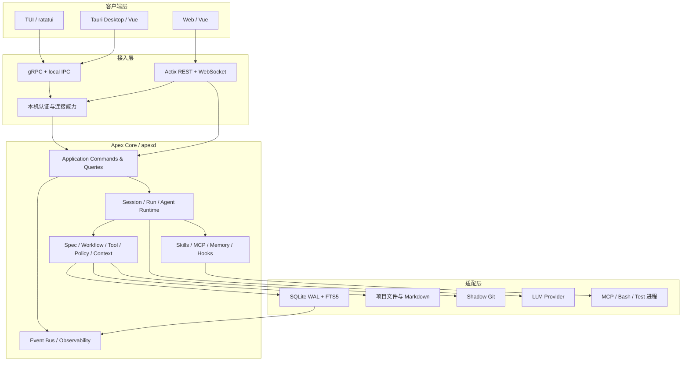
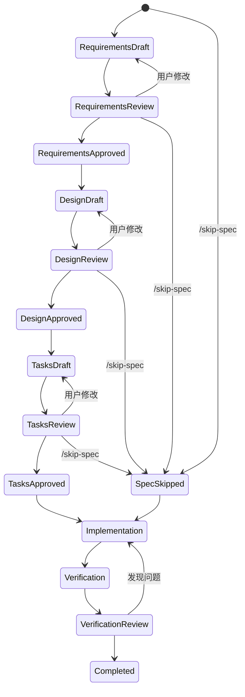

# Apex —— 系统总体架构设计

> 版本：v0.1（总体架构草案）  
> 日期：2026-08-08  
> 状态：待评审  
> 设计范围：面向最终完整产品（TUI、桌面端、Web 端、Spec 流水线、规范引擎、多 Agent/DAG、Skills、MCP、Memory、快照回滚与可观测性）。

---

## 0. 文档目的与边界

本文将 `docs/Apex—— 需求分析文档.md` 转换为可实施的系统总体架构，定义 Core、三端共享、Spec、Agent、工具、权限、工作流和持久化的协作方式。

本文是**总体架构**，不替代后续的模块详细设计、协议 schema、数据库字段定义、UI 设计和任务排期。需求文档与本文冲突时，以需求文档为准；本文中尚未实现的技术选择应通过 ADR 固化。

---

## 1. 架构结论

Apex 采用 **Rust 模块化单核 + 本机常驻服务 + 多前端薄客户端 + 事件驱动运行时**：

- `apexd` 是唯一业务核心和唯一 SQLite 写入者；
- TUI、Tauri 桌面端、浏览器 Web 端不直接访问数据库，不直接执行 Agent 工具；
- 所有用户命令、模型请求、工具调用、权限审批、Spec 阶段推进和工作流状态变化都经过 Core；
- SQLite 保存结构化状态、事件流和查询投影；Markdown 是 Spec、Checkpoint、Memory 的可审计文件镜像；
- 文件系统和影子 Git 保存工作产物与快照，均由 Core 的适配器统一访问；
- 客户端采用“命令 + 查询 + 事件订阅”模型，断线后按事件序号补齐；
- Agent、Spec、Policy、Rules、Workflow、Memory、MCP、Skills、Hooks、Plugins、Provider 都是 Core 中的独立模块，而不是 UI 逻辑。

### 1.1 顶层结构



### 1.2 核心原则

| 原则 | 约束 | 目标 |
|---|---|---|
| Core 唯一权威 | UI、MCP、子 Agent 都不能绕过 Core 执行写操作 | 防止状态分裂和权限绕过 |
| 单核多前端 | 业务状态只在 Core；客户端只保存视图状态 | 三端实时共享会话 |
| 命令/查询/事件分离 | 写入走 Command，读取走 Query，变化走 Event | 审计、重连、协议演进 |
| Spec 一等对象 | 阶段推进由状态机控制 | 强制确认门，避免先斩后奏 |
| 副作用统一闸门 | Bash、文件、MCP、Task 都经过 Tool Gateway | 权限、规则、快照一致执行 |
| 可恢复优先 | 持久化后广播；外部操作使用幂等键 | 崩溃后不丢状态、不伪造成功 |
| 写路径一等资源 | DAG 调度前获得 path claim | 避免并行 Agent 覆盖 |
| 稳定上下文优先 | 稳定内容在 prompt 前，动态内容在尾部 | 提高 prefix cache 命中 |
| 文件可审计 | Markdown 可导出、直接编辑、提交 Git | 不将用户锁入数据库 |

---

## 2. 进程拓扑与运行边界

```text
apex tui ────────┐
apex desktop ────┼─ 本机认证 transport ──> apexd
browser/Web ─────┘                              │
                                                 ├─ SQLite / 文件 / Shadow Git
                                                 ├─ LLM Provider API
                                                 └─ MCP、Bash、测试等受监督子进程
```

`apexd` 为每个 OS 用户运行一个实例，可同时管理多个 Project。客户端发现 endpoint 后连接；不存在时由 CLI 或桌面端启动。默认只暴露本机 IPC/loopback，不将代码执行能力暴露到公网。

| 故障 | 行为 |
|---|---|
| UI 崩溃/断线 | 不影响 Run；重连后按 `global_seq` 补事件 |
| `apexd` 崩溃 | 状态从 SQLite 恢复；未知外部副作用标记 `interrupted` |
| MCP 崩溃 | 仅该 Server 断开；其余会话继续 |
| Provider 失败 | 有界重试，失败后进入可恢复状态 |
| 子 Agent 崩溃 | 释放 claim、保存原因，不能伪造 completed |

Web 端在最终产品中是访问**本机 Core**的轻量客户端；远程团队访问属于显式启用的后续部署模式，必须另行增加 TLS、身份和多租户边界。

---

## 3. 三端与通信

所有传输共享同一应用协议：

```text
Command  -> 修改状态、启动/暂停/审批/取消
Query    -> 读取投影、文档、图、面板数据
Event    -> 已发生的持久事实与实时流更新
```

每个 Command 至少带有 `command_id`（幂等键）、`actor_id`、`project_id`、可选的 `session_id/run_id`、`expected_revision` 和版本化 payload。Event 统一封装：

```text
EventEnvelope {
  event_id, global_seq, project_id, session_id?, run_id?,
  actor_id, event_type, occurred_at, correlation_id,
  causation_id?, schema_version, payload, redaction_level
}
```

| 客户端 | 连接方式 | 职责 |
|---|---|---|
| TUI | gRPC + 本机 IPC | 完整对话、审批、面板、ASCII DAG |
| Desktop | Vue → Tauri Rust shell → gRPC | 富文本 Spec、可视化 DAG、图表 |
| Web | Actix REST + WebSocket → Application | 查看、评审、审批、只读/轻量操作 |

Native transport 优先使用 Unix domain socket / Windows named pipe；无法使用时回退 loopback TCP。服务启动时生成短期握手 token，客户端完成 `Hello/Capabilities` 版本协商后获得连接级 capability。Web Gateway 只做协议转换，不能拥有第二套业务逻辑。

---

## 4. Core 模块与代码组织

### 4.1 分层与依赖方向

```text
Clients / Gateways
        ↓
Application（Command、Query、事务边界）
        ↓
Runtime（Session、Run、Turn、Supervisor）
        ↓
Domain Engines（Spec、Workflow、Policy、Context 等）
        ↓
Ports（Store、Provider、FS、Git、MCP、Process）
        ↓
Adapters（SQLite、HTTP SDK、Git、子进程、OS）
```

依赖只能向下：领域层不依赖 Tokio、rusqlite、Actix、ratatui 或具体 Provider；UI 不依赖数据库；Provider/MCP 返回值不能直接修改 Spec 或权限状态。

### 4.2 模块职责

| 模块 | 负责内容 |
|---|---|
| `domain` | ID、状态机、值对象、领域事件、错误分类 |
| `application` | 用例编排、Command 幂等、事务与授权上下文 |
| `runtime` | Session Actor、Run/Turn 生命周期、取消、恢复、监督 |
| `agent` | Prompt 组装、LLM 流、工具循环、停止条件 |
| `spec` | Spec 文档、版本、确认门、diff、验收报告 |
| `workflow` | DAG、节点状态、调度、暂停、重放 |
| `scheduler` | 并发 slot、write-path claim、任务优先级 |
| `tools` | Read/Write/Edit/Bash/Glob/Grep/Task 统一闸门 |
| `policy` | 权限模式、Bash AST、路径策略、风险分级 |
| `rules` | 规则发现、编译、增量检查和修复计划 |
| `context` | token 预算、Checkpoint、摘要、cache 布局 |
| `provider` | 统一 LLM trait、流式转换、usage、重试 |
| `skills` | SKILL.md 兼容、发现、渐进加载 |
| `mcp` | Server 发现、连接、命名空间、重连、进程树回收 |
| `memory` | Markdown 记忆、FTS5、召回和生命周期 |
| `snapshot` | 影子 Git、diff、patch、文件级回滚 |
| `hooks` | PreToolUse/PostToolUse/Stop 等稳定扩展点与结果协议 |
| `plugins` | 插件清单、能力声明、版本与隔离执行 |
| `storage` | SQLite 迁移、事件、投影、outbox 和索引 |
| `observability` | Event Bus、面板投影、指标、脱敏日志 |

### 4.3 推荐 Rust workspace

```text
apex/
├── Cargo.toml
├── crates/
│   ├── apex-domain/          # 纯领域模型
│   ├── apex-protocol/        # protobuf、DTO、版本协商
│   ├── apex-application/     # commands / queries
│   ├── apex-runtime/         # daemon supervisor、session actors
│   ├── apex-agent/
│   ├── apex-spec/
│   ├── apex-workflow/
│   ├── apex-tools/
│   ├── apex-policy/
│   ├── apex-rules/
│   ├── apex-context/
│   ├── apex-provider/
│   ├── apex-skills/
│   ├── apex-mcp/
│   ├── apex-memory/
│   ├── apex-snapshot/
│   ├── apex-hooks/
│   ├── apex-plugins/
│   ├── apex-observability/
│   ├── apex-storage/
│   ├── apex-fs/
│   ├── apex-config/
│   ├── apex-daemon/
│   ├── apex-cli/
│   └── apex-tui/
├── apps/
│   ├── desktop/src-tauri/ + ui/     # Tauri + Vue
│   └── web/server/ + ui/            # Actix + Vue
├── proto/
├── migrations/
├── skills/
├── rules/
└── tests/{contract,integration,recovery,fixtures}/
```

`apex-daemon` 是生产组装根；CLI、TUI、Tauri 和 Web 通过 `apex-protocol` 连接它。v0.1 可以暂时合并实现 crate，但不得破坏这些边界。

### 4.4 核心领域聚合

| 聚合 | 一致性边界 | 核心状态 |
|---|---|---|
| Project | 配置、信任、规则、worktree | active / archived |
| Session | 消息、当前 Spec、Run 引用与审批 | idle / running / waiting / paused |
| Run / Turn | 一次用户请求及其 Provider/工具循环 | queued / running / interrupted / completed / failed |
| Spec | feature 的文档版本与阶段门 | draft / review / approved / invalidated / completed |
| Workflow | DAG 节点、依赖、调度与恢复 | pending / running / paused / blocked / completed |
| Agent | 主 Agent/子 Agent 的隔离上下文 | spawned / running / completed / failed |
| Artifact | Markdown 内容、checksum 与镜像状态 | dirty / synced / conflict |
| Snapshot | 变更基线和回滚点 | created / restored |

每个外部操作都有 `operation_id`；同一 `command_id` 的重复提交返回首次结果。重启时，缺少最终事件的运行操作进入 `interrupted/reconcile`，而非自动判为成功。

### 4.5 Session Actor

同一个 Session 同时仅允许一个主线 Agent turn 修改会话语义状态。Session Actor 顺序处理用户命令和内部运行消息；耗时工作交由受监督任务完成。取消、拒绝审批和 steering 使用高优先级 lane，避免被长输出饿死。只读查询不进入 Actor 写队列。

---

## 5. Spec 驱动开发架构

### 5.1 Spec 状态机



规则：

- 不存在从用户需求直接进入 `Implementation` 的隐式路径；
- `/skip-spec` 是显式 Command，写入不可删除的 `SpecSkipped` 事件，记录原因、操作者与当前阶段；
- 上游文档被修改后，下游文档、批准与 Workflow revision 进入 `invalidated`；
- 确认动作携带 artifact version 和 checksum，避免批准过期内容；
- Agent 可以建议跳过 Spec，但只能由用户执行 skip。

### 5.2 文件布局与版本

```text
<project>/apex/specs/<feature-name>/
├── requirements.md
├── design.md
├── tasks.md
├── verification.md
├── history/
│   ├── requirements.v001.md
│   └── ...
└── attachments/
```

每份文档带 YAML frontmatter：`id`、`feature`、`kind`、`status`、`version`、`created_at`、`updated_at`、`content_sha256`。用户文件编辑会导入为新 revision；无法自动合并时保留冲突副本，禁止静默覆盖。

### 5.3 Spec 到 Workflow 的时序

```text
用户请求
  → 创建/加载 Spec
  → 解析规则，生成 requirements.md
  → 用户确认 requirements
  → 生成并确认 design.md
  → 生成并确认 tasks.md
  → 校验任务图、写路径与依赖
  → 持久化 Workflow revision
  → 进入实现和验证
```

`design.md` 必须内嵌编译后的设计约束；`verification.md` 将需求验收标准、设计约束、任务状态、测试、规则检查和用户例外合并为 `passed / failed / blocked / not_run`。模型自报“完成”不构成验收结论。

---

## 6. Agent Runtime、DAG 与写路径

### 6.1 Agent Loop

```text
User Command
  → 加载 Session / Spec / Checkpoint / Rules
  → 构造稳定 Prompt Prefix
  → Provider Stream
      ├─ text delta → UI 事件
      ├─ tool call → Tool Gateway
      ├─ approval → 持久化后等待
      ├─ context pressure → Checkpoint / Compaction
      └─ stop reason → 阶段门、完成或失败
```

Agent Loop 的循环边界由 Core 控制，Provider SDK 只负责返回标准化流事件：文本、工具调用、usage、停止原因和错误。任何 Provider 重试都不能导致工具重复执行。

### 6.2 多 Agent 隔离

- 主 Agent、任务 Agent、规则修复 Agent 分别拥有 `agent_id`、消息切片和 checkpoint；
- 子 Agent 继承项目规则、当前 Spec revision 和父权限上限，但不能扩大权限；
- 子 Agent 结果通过结构化 `AgentCompleted/AgentFailed/AgentInterrupted` 事件回传；
- 递归深度、全局并发、每项目并发和 Provider 并发分别限流；
- 主 Agent 可预留自己的写路径，避免与子 Agent 产生 TOCTOU 冲突。

### 6.3 DAG 模型与调度

```text
TaskNode {
  node_id, task_id, title, description,
  depends_on[], write_paths[], read_paths[],
  agent_profile?, status, attempts, last_error?
}
```

调度步骤：

1. 校验 DAG 无环、任务 ID 唯一、路径声明有效；
2. 路径 canonicalize 后检测相交；
3. 无依赖节点进入 ready queue；
4. 获取并发 slot 和 write-path claim；
5. 生成带 `spawn_reason`、profile、Spec revision 的 Agent Run；
6. 完成后提交结果、释放 claim 并推进后继节点；
7. 失败/阻塞/暂停时停止受影响后继节点；
8. 重启后从节点事件恢复，不重复已确认完成的节点。

### 6.4 写路径互斥

- 所有路径转为项目根相对 canonical path，解析 `..`、符号链接和平台大小写差异；
- 文件与父目录相交视为冲突，例如 `src/auth.rs` 与 `src/`；
- glob 无法证明不相交时按冲突处理；
- claim 由 Core 持有，在取消、崩溃和超时后释放；
- claim 只负责并发安全，不等于获得写权限；
- 高风险或跨模块任务可使用 `isolation: worktree`，完成后以 patch 回传。

---

## 7. Tool Gateway、权限与规范引擎

### 7.1 固定工具执行管线

```text
ToolRequest
  → schema validation
  → actor/session/project scope
  → Permission Engine
  → write-path claim（写操作）
  → PreTool rules/hooks
  → 前置 Snapshot
  → Tool Adapter execute
  → result normalize + taint
  → PostToolUse 增量规范检查
  → 后置 Snapshot / change record
  → event persist + ToolResult
```

Read、Write、Edit、Bash、Glob、Grep、Task、MCP 工具和 Skill 脚本都必须经过该管线。`Task` 只是向 Workflow/Scheduler 提交创建 Agent 的 Command，不能直接产生未经审计的后台进程。

### 7.2 权限模型

| 模式 | 行为 |
|---|---|
| `plan` | 只读放行；写/Bash 需要审批或拒绝 |
| `ask` | 读放行；写/Bash 每次询问 |
| `allow` | 已批准语义规则放行；新操作询问 |
| `bypass` | 受信任项目显式启用；仍记录审计事件 |

决策顺序（权威定义见 `Apex—— Tool Gateway与权限引擎详细设计.md` §10.1，共 11 步）：

```text
1  身份无效 / 租约过期                → DENY
2  工具或 schema 不可用                → DENY
3  缺少 capability                     → DENY
4  项目未授信 / 受限                   → DENY 或 TRUST_REQUIRED
5  内置硬拒绝                          → DENY_HARD
6  敏感数据 / 外发硬策略               → DENY_HARD 或 ASK
7  显式作用域 deny 规则                → DENY
8  Spec / Workflow 阶段限制            → DENY 或 BLOCK
9  权限模式分支（plan/ask/allow/bypass）
10 Claim / 资源冲突                    → WAIT（不是审批）
11 preflight hook / rule               → ALLOW/DENY/BLOCK/ASK
```

前 4 步是**准入前置检查**：它们只会拒绝，不会放行任何硬拒绝项，因此把内置硬拒绝放在第 5 位不削弱"硬拒绝优先"这一安全不变式——任何能走到第 5 步的请求，都已通过身份、schema、capability 与信任校验，而未通过者早已被拒。低层组件只能收紧权限，不能扩大权限。

资源冲突（第 10 步）不得伪装成权限弹窗：等待 Write Claim、Provider 配额或 MCP 重连应产生各自的等待状态。

> ADR-0012（跨文档一致性审查）：本节原为 5 步概述，与 Tool Gateway §10.1 的 11 步实现顺序不一致，且未说明硬拒绝位次差异。现以 11 步为准并补充等价性论证。

Bash 使用 `tree-sitter-bash` 分解管道、`&&`、`||`、`;`、命令替换和重定向，每个子命令独立检查。arity 归一化保存 `git checkout *` 等语义规则。解析失败默认审批/拒绝；`rm -rf /`、force push 等硬风险不可被“总是允许”覆盖。

路径权限必须解析真实路径和符号链接，默认限制在项目根；`.env`、`*.key`、`*.pem`、`credentials*` 等敏感文件默认只读或询问。

### 7.3 规范检查

规范引擎分四部分：

1. **Discovery**：项目 `apex/rules/` → `AGENTS.md/CLAUDE.md` → 用户 `~/apex/rules/` → 内置规则；
2. **Compiler**：把规则编译为 prompt constraints、checker 配置、严重级别；
3. **Incremental Checker**：仅针对本次变更文件调用 formatter、lint、测试或 AST 检查；
4. **Repair Planner**：将错误转成最小范围修复子任务。

闭环为：设计阶段把规则写入 `design.md`；Write/Edit/Bash 变更后执行 PostToolUse；错误触发修复 Agent，高危错误进入用户确认门。warning 默认不阻断，error 默认阻断；每次检查记录规则版本、文件 checksum、命令、退出码和诊断摘要。

---

## 8. Context、Checkpoint 与 Provider

### 8.1 Prompt 分区

```text
[Stable prefix]
  system contract
  project trust + stable rules
  stable-sorted tool catalog
  skill metadata
  approved spec documents

[Session checkpoint]
  current stage、tasks、decisions、agents、claims

[Volatile suffix]
  latest user message
  recent tool results
  recalled memory
  MCP/web/external content（untrusted）
```

稳定区域按确定顺序和确定字节序列化；动态环境和召回内容放到末尾。Provider Adapter 分别映射 Anthropic cache control、OpenAI prompt cache key 以及其他厂商能力。

### 8.2 Checkpoint-first

Checkpoint 触发：Spec 阶段完成、token 60%/75%/85%、长工作流节点切换、用户命令、Run 结束/暂停/失败/取消。内容包括 Spec revision、已完成任务、关键决策、活跃文件、待办、规则提醒、Agent/Workflow 状态和最近 Snapshot。

溢出恢复顺序：最近有效 Checkpoint → 当前 Spec → 未完成 Workflow → 必要规则/Skill metadata → 最近消息。仍超限时依次采用分级压缩（权威定义见 `Apex—— Context与Checkpoint系统详细设计.md` §10.3，Level 0–4：去重复引用 → 截短 ToolResult → 文件/Memory 摘要化 → 历史结构化摘要 → 仅保留最新 Checkpoint + Spec + 当前任务 + 必要 tail）；Spec 与用户审批不能被普通摘要丢弃。

### 8.3 Provider Port

```rust
#[async_trait]
pub trait Provider: Send + Sync {
    fn id(&self) -> ProviderId;
    fn capabilities(&self) -> ProviderCapabilities;
    async fn stream(&self, request: ProviderRequest)
        -> Result<ProviderEventStream, ProviderError>;
    async fn count_tokens(&self, request: TokenCountRequest)
        -> Result<TokenUsage, ProviderError>;
}
```

Anthropic、OpenAI、DeepSeek、Kimi 和后续自研通道只在 Adapter 层有差异。Provider 负责协议转换、流拼接、usage、限流、重试和错误分类，不决定 Spec 阶段或权限状态。网络/429/5xx 有界重试最多 3 次；流断线保留已接收内容，并使用相同 `operation_id` 续传或进入恢复流程。

---

## 9. Skills、MCP 与 Memory

### 9.1 Skills

发现路径按优先级：项目 `apex/skills/`、用户 `~/apex/skills/`、兼容 `~/.claude/skills/`、`~/.codex/skills/`、`~/.agents/skills/`。

采用三层渐进式加载：

1. metadata：常驻 prompt，仅含 name、description、source、版本与能力摘要；
2. body：触发时通过受控读取加载；
3. resources：脚本、参考资料和资产按需读取。

Apex 扩展字段 `spec-phase`、`requires-tools`、`version` 影响发现和提示，但不能提升权限。Skill 的来源、版本、加载层级、调用次数和 token 使用都生成观测事件。

### 9.2 MCP

```text
config discovery
  → trust/schema validation
  → server supervisor
  → initialize/capability discovery
  → namespace mcp__server__tool
  → Tool Gateway permission check
  → call/timeout/taint
  → event + panel projection
```

支持 stdio 与 SSE/HTTP；扫描项目 `apex/mcp.json`、用户 `~/apex/mcp.json` 和 Claude Desktop 兼容配置。Core 负责连接状态、自动重连、30 秒默认超时、启停和 stdio 进程树回收。

MCP 返回内容一律标记外部不可信，进入 volatile suffix，不能改变 system contract、Spec gate 或 Permission policy。

### 9.3 Memory

Memory 的可审计源是 Markdown，SQLite FTS5/BM25 是可重建索引：

```text
<project>/apex/memory/
├── decisions/
├── corrections/
├── pitfalls/
└── manual/
```

召回流程：当前消息/上下文关键词 → FTS5/BM25 → score floor 与数量上限 → 记录召回原因 → 注入 user turn 尾部 → 面板高亮。第一阶段不引入向量数据库，避免额外服务、冷启动成本和不可解释召回。

自动创建 Memory 必须关联来源事件和摘要；用户可编辑、删除、导出，文件修改由 watcher 导入并重建索引。

### 9.4 Hooks 与 Plugins

Hook 是 Core 暴露的受控扩展点，首批事件包括 `PreToolUse`、`PostToolUse`、`PermissionRequest`、`SpecStageChanged`、`AgentStop`、`SessionStop`、`RuleCheckRequested`、`CheckpointCreated` 和 `ExtensionChanged`（需求文档中的 `Stop` 按作用域细化为 `AgentStop` 与 `SessionStop`，外部 `Stop` 由兼容导入器映射到 `AgentStop`）。

Hook 只能返回版本化结果：`continue`、`deny`、`request_approval`、`block_completion`、`diagnostic_only`、`propose_rewrite`、`async_check_scheduled`。任何修改工具参数或上下文的能力都必须由 schema 和 Permission Engine 再校验——Hook 不得静默 mutation，改写只能走 `propose_rewrite → new ToolCall revision → revalidate`。完整定义见 `Apex—— MCP、Skill、Hook与Plugin扩展系统详细设计.md` §19。

> ADR-0021（跨文档一致性审查）：事件由 6 个补为 9 个，返回值由 4 个补为 7 个（`add_diagnostics` 更名 `diagnostic_only`），与扩展系统详细设计 §19.4 对齐。

Plugin 通过 manifest 声明名称、版本、协议版本、所需 capability、工具/Hook/面板扩展。插件不能链接 Core 私有类型，只能使用稳定 protocol。默认采用受监督的进程隔离，Wasm 作为 ADR 评估项。插件崩溃不得影响 Session Actor，插件权限不得超过安装时授予的 capability。

---
## 10. 持久化与一致性

### 10.1 数据权威关系

| 数据 | 权威源 | 文件/索引用途 |
|---|---|---|
| 会话、消息、Run、审批 | SQLite | 可选导出 |
| 事件流 | SQLite append-only | 恢复、审计、订阅游标 |
| Spec | SQLite artifact revision | `apex/specs/` 为可编辑 Markdown 镜像 |
| Checkpoint | 文件内容 + SQLite checksum/索引 | `apex/checkpoints/` |
| Memory | Markdown | SQLite FTS5 可删除重建 |
| Rules/Skills/MCP 配置 | 项目/用户文件 | SQLite 保存编译结果与诊断缓存 |
| 代码变更 | 工作区文件 | SQLite 保存操作、checksum、diff 引用 |
| Snapshot | 影子 Git | SQLite 保存 snapshot 元数据 |

### 10.2 SQLite 与事件投影

SQLite 使用 WAL + FTS5，按逻辑分组建表：

```text
identity:       projects, worktrees, clients, actors
conversation:   sessions, session_branches, turns, messages
execution:      runs, tool_calls, provider_calls,
                permission_requests, permission_decisions
spec:           specs, artifacts, artifact_revisions, artifact_reviews
workflow:       workflows, workflow_nodes, workflow_edges, write_claims
observability:  domain_events, event_consumers, outbox, metric_samples,
                audit_records, alerts, incidents
extension:      extensions, extension_revisions, skills, skill_loads,
                mcp_servers, mcp_tools, mcp_calls
memory:         memories, memory_revisions, memory_fts
safety:         rulesets, rule_checks, diagnostics, permission_rules,
                gate_definitions, gate_evidence, snapshots, snapshot_restores
credential:     credentials, credential_versions, credential_leases
```

表名以 `Apex—— SQLite数据模型与迁移设计.md` 为权威。

> ADR-0011（跨文档一致性审查）：本清单原用 `events`/`reviews`/`nodes`/`edges`/`approvals` 等简称，与 schema 实际的 `domain_events`/`artifact_reviews`/`workflow_nodes`/`workflow_edges`/`permission_requests`+`permission_decisions` 不符；`approvals` 已按职责拆为请求与决定两表。现按实际表名回写，并补入原缺失的 `metric_samples`、`audit_records` 等。

所有写入经过 `StorageWriter`：在同一 transaction 中插入事件、更新 projection、写 outbox；提交成功后才广播。projection 可从事件流重建，但重建过程不能执行 Bash、MCP、文件写入等外部副作用。

客户端重连协议：

```text
connect(last_seen_seq)
  → server sends current snapshot/projection revision
  → replay events where global_seq > last_seen_seq
  → switch to live broadcast
```

### 10.3 Markdown 镜像协议

SQLite transaction 和文件 rename 无法形成跨介质原子操作，因此采用可恢复的一致性协议：

1. DB 创建 artifact revision 和 `write_intent`；
2. Materializer 写临时文件、flush/fsync、原子 rename；
3. 保存 checksum 和 materialization 状态；
4. watcher 区分 Core 写入与外部编辑；
5. 外部 checksum 变化导入新 revision，并重新触发评审/失效规则；
6. DB 已提交但文件失败时由 outbox 重试；
7. 文件存在但 DB 缺失时按 orphan change 导入；
8. 内容冲突时保留两份版本，禁止静默覆盖。

### 10.4 恢复语义

启动恢复顺序：迁移数据库 → 校验 event/projection cursor → reconcile Markdown → 检查 active Run/Workflow → 将未知外部操作标记 interrupted → 释放 stale claim/回收子进程 → 按需重建 FTS5 → 发布 `RecoveryCompleted`。

“确定性恢复”指业务状态可从事件和投影精确恢复，不表示自动重放不可逆外部副作用。

---

## 11. Snapshot、回滚与 Worktree

影子 Git 路径：

```text
~/apex/snapshots/<project_hash>/<worktree_hash>/.git
```

`SnapshotPort` 提供前置/后置快照、diff、文件恢复、patch、retain/release。默认在每个 Turn 前后建立快照；纯只读 Turn 可以复用同一内容寻址快照。每个含写操作的 Run 必须有前置基线，Workflow 还可在节点边界建立轻量快照。回滚是显式 Command，经过权限和用户确认，失败处理器不得静默删除用户变更。

并行隔离分两层：

1. 同工作树中的 canonical write-path claim；
2. 高风险或跨模块 Agent profile 使用 `isolation: worktree`，完成后审查并应用 patch。

影子 Git 不污染用户 `.git`，有真实 Git 仓库时可通过 `objects/info/alternates` 共享对象；无 Git、裸仓库和 Windows 场景由 `SnapshotPort` 的适配器处理。

---

## 12. 可观测性

Event Bus 是唯一运行事实广播源。持久事件覆盖 Session、Run、Provider、工具、权限、Spec、规则检查、Workflow、Agent、Skill、MCP、Memory、Snapshot 和 Recovery。高频文本增量可只作为短期流事件，但 turn 完成、usage、工具和审批必须持久化。

| 面板 | 投影 | 关键字段 |
|---|---|---|
| Skill | `skill_loads` | source、layer、status、calls、tokens |
| MCP | `mcp_servers/mcp_calls` | connection、tools、latency、result |
| SubAgent | `agents/nodes/write_claims` | task、paths、progress、files、tokens |
| Memory | `memories/recalls` | path、reason、score、last_recalled |

三个客户端读取同一投影，只改变渲染方式。tracing span 使用 `project_id/session_id/run_id/turn_id/operation_id`。API key、Authorization、cookie、私钥和敏感文件内容在进入日志、事件、诊断包之前统一脱敏。外部 telemetry 默认关闭。

---

## 13. 安全架构

### 13.1 信任边界

```text
Trusted:     用户命令、已批准 Spec、编译后的硬规则、Core 状态
Controlled:  Agent 生成内容、本地文件、Bash 和测试输出
Untrusted:   MCP/Web 内容、仓库内容、Skill resource、模型文本
Secrets:     Provider key、cookie、credential、私钥和敏感文件
```

不可信内容可以作为模型材料，但不能直接写入 system contract、修改权限策略、越过 Spec gate 或产生无需审批的 Command。

### 13.2 项目信任与凭据

首次打开项目创建 `ProjectTrust`。只有明确授信后，才允许自动执行项目规则中的命令、运行项目 Skill 脚本、读取项目外配置或启用 `bypass`/远程 MCP。项目自身文件不能伪造授信状态。

定义 `CredentialStore` trait：优先使用 OS keyring；兼容 `~/apex/auth.json`，Unix 设 0600，Windows 使用 ACL。密钥不进入 Spec、Checkpoint、Memory、事件 payload、日志或命令行参数。

### 13.3 高危操作

内置硬规则保护删除、强制推送、越界写入、敏感文件、远程 MCP 和 shell 注入风险，项目配置不可覆盖。所有 ask/allow/deny 决策保存操作者、语义规则、作用域、时间和原因。

---

## 14. 可靠性、取消与资源控制

取消通过高优先级链路传播：

```text
Cancel Run
  → Session actor high-priority lane
  → Provider cancel
  → Tool/MCP child process terminate
  → Workflow node cancel + release claim
  → post-cancel checkpoint
  → RunCancelled event
```

`cancelled`、`interrupted`、`failed`、`blocked`、`completed` 必须是不同状态。

| 性能目标 | 架构措施 |
|---|---|
| TUI 启动 < 500ms | 先渲染 shell，再异步连接热 Core |
| 首次 LLM < 2s | HTTP 连接复用、稳定 prefix、Skill 渐进加载 |
| 面板 1s | Event push + 客户端节流，不全表轮询 |
| SQLite 列表 < 10ms | projection、索引、分页、WAL |
| Checkpoint < 5s | 结构化增量生成、后台 materializer |
| Core < 200MB | 有界 channel、输出截断、按需加载和进程限额 |

Agent 全局并发默认 `min(16, 2 * cpu_cores)`；Workflow、Provider、MCP、子进程分别有配额，并支持项目/Session 更小上限。Event channel 有界；落后客户端通过持久游标补齐，不能阻塞 Agent。

---

## 15. API 与事件分区

### 15.1 Commands

```text
Project:    OpenProject, TrustProject, UpdateProjectConfig
Session:    CreateSession, ResumeSession, ForkSession, SendMessage, CancelRun
Spec:       CreateSpec, EditArtifact, ApproveStage, RejectStage, SkipSpec
Workflow:   StartWorkflow, PauseWorkflow, ResumeWorkflow, RetryNode, RollbackNode
Agent:      SpawnAgent, SendAgentInput, CancelAgent, RetryAgent
Permission: DecidePermission, SavePermissionRule, RevokePermissionRule
Extension:  EnableMcpServer, ReloadSkills, InvokeSkill
Memory:     AddMemory, EditMemory, DeleteMemory, ExportMemory
Snapshot:   CaptureSnapshot, RestoreSnapshot, ApplyPatch
```

长任务 Command 的返回值只表示接受/拒绝/当前 revision，最终结果由 Event 和 Query 获取。

### 15.2 Queries

```text
GetProject
ListSessions / GetSession / GetConversationPage
GetSpec / GetArtifactRevision / GetSpecDiff
GetCheckpoint / GetRunState
GetWorkflowGraph / ListWorkflowNodes
GetPanelSkills / GetPanelMcp / GetPanelSubAgents / SearchMemory
GetPermissionRules / GetPendingApprovals
GetSnapshotDiff / GetEventPage(after_seq, limit)
```

### 15.3 Events

事件使用过去时表达已发生事实。**wire 名称为 snake_case 点分**，Rust 侧枚举名为对应的 PascalCase（如 `spec.skipped` ↔ `SpecSkipped`）：

```text
session.created, message.appended, run.started, run.completed,
provider.call_started, provider.call_finished,
tool.call_requested, permission.requested, permission.decided,
tool.call_started, tool.call_finished, tool.files_changed,
spec.artifact_revision_created, spec.stage_approved, spec.invalidated, spec.skipped,
rule.check_started, rule.violation_found, repair.run_created,
workflow.created, workflow.node_ready, workflow.node_completed,
agent.spawned, agent.progressed, agent.completed, agent.interrupted,
mcp.connected, mcp.call_finished, skill.loaded, memory.recalled,
snapshot.created, snapshot.restored, recovery.completed
```

事件 payload 具有显式 `schema_version`；版本不编进事件名。完整命名空间注册表与命名规则见 `Apex—— 领域模型与事件规范.md` §7.2。禁止把未版本化任意 JSON 当作长期公共契约。

> ADR-0030（跨文档一致性审查）：本清单原用 PascalCase 列出，与领域模型 §7.2 的 wire 格式不一致，易被误读为线协议值，已改为 snake_case 点分并标注两者映射关系。

---

## 16. 配置与目录

### 16.1 用户级（Apex Home）

用户级目录采用平台原生路径，可由 `APEX_HOME` 覆盖：

```text
Windows: %APPDATA%\Apex\
macOS:   ~/Library/Application Support/Apex/
Linux:   ${XDG_STATE_HOME:-~/.local/state}/apex/
```

```text
<APEX_HOME>/
├── apex.db                     # + -wal / -shm
├── config/
├── runtime/daemon.json
├── sockets/
├── rules/
├── skills/
├── mcp.json
├── blobs/
├── snapshots/
├── backups/
├── logs/
└── diagnostics/
```

Credential 默认存 OS Credential Store；`~/apex/auth.json` 仅作历史版本的一次性导入路径，不属于 `<APEX_HOME>` 结构。完整布局见 `Apex—— Deployment、升级与灾备详细设计.md` §4.1。

> ADR-0002（跨文档一致性审查）：原为 `~/apex/`。改用平台原生目录以符合各 OS 规范并简化打包发行；项目级可提交资产不受影响，仍在 `<project>/apex/`。

### 16.2 项目级

```text
<project>/
├── apex/
│   ├── specs/<feature-name>/
│   ├── rules/
│   ├── skills/
│   ├── memory/
│   ├── checkpoints/<session-id>/
│   ├── mcp.json
│   └── config.toml
├── AGENTS.md
├── CLAUDE.md
└── .editorconfig / lint 配置
```

项目 `apex/` 是团队可提交资产；数据库、密钥、快照、日志和隔离工作树不写入项目仓库。配置优先级：内置默认 → 用户 TOML → 项目 config → 会话临时设置。安全硬规则不可覆盖；配置变更默认只影响新 Run。

---

## 17. 测试与质量门

| 层级 | 重点 |
|---|---|
| Domain unit | 状态机、路径相交、Bash 规则、Spec gate、性质测试 |
| Adapter contract | Provider、MCP、Git、FS 的 schema/超时/错误 |
| Storage integration | migration、transaction、projection、outbox、FTS5 |
| Runtime integration | Session/Run/Workflow、取消、幂等、恢复 |
| Protocol contract | gRPC/REST/WS、游标、版本、重复 Command |
| End-to-end | fake Provider 下的完整 Spec 流水线 |
| Security regression | 注入、符号链接、敏感文件、恶意 MCP/Skill |
| Recovery chaos | 强退、断网、MCP 崩溃、不重复副作用 |

必须固定测试：

- 不能越过 Spec 确认门；修改上游会使下游失效；
- 同一 `command_id` 不会启动两次 Run；
- Bash 每个子命令均过策略，高危规则不可覆盖；
- 子 Agent 无法扩大父权限，冲突路径不能同时获得 claim；
- Provider 重试不会重复执行工具；
- DB/Markdown 任一侧失败可 reconcile；
- 外部内容不能修改 system contract；
- 三端从同一事件得到相同领域状态。

Rust 2024、MSRV 1.85+；CI 包含 fmt、Clippy、测试、依赖审计、TUI/Desktop/Web 构建。核心模块覆盖率目标 ≥80%。公共 API 有 rustdoc；生产代码避免 `unwrap/expect/panic/exit`，协议、事件和 migration 变更单独评审。

---

## 18. 分阶段落地

总体边界从第一天保留，但按版本启用能力：

| 版本 | 启用能力 | 必须提前稳定的接口 |
|---|---|---|
| v0.1 | TUI、单会话 Agent Loop、双 Provider、Spec、工具、权限、规则、Write Claim、SQLite、Checkpoint、快照 | `Provider`、`ApplicationService`、`EventEnvelope`、`ToolGateway`、`SnapshotPort`、`WriteClaimPort` |
| v0.3 | Tauri、Web、WebSocket、三端共享、DeepSeek/Kimi | 协议版本、事件游标、本机认证 |
| v0.5 | DAG、write claim、MCP、Skills、Memory | `WorkflowPort`、`McpSupervisor`、`SkillLoader`、`MemoryIndex` |
| v0.7 | 恢复/重放、Hook、增强权限 | projection、outbox、reconcile、hook contract |
| v1.0 | 插件 API、稳定协议、完整发行 | capability registry、插件隔离与兼容 |

即使 v0.1 尚无 DAG、多端和 MCP，也必须：

- 所有工具通过 `ToolGateway`；
- 所有状态以 `EventEnvelope` 记录，而不是在 TUI 拼日志；
- Provider 通过 trait 注入；
- 会话写操作通过 `ApplicationService`；
- 使用 Project/Session/Run/Turn/Agent ID；
- 将 Spec 与普通聊天分开建模；
- 用 port/repository 隔离 SQLite、文件、Git 和网络；
- 给 Workflow、write paths 和子 Agent 保留明确扩展边界。

---

## 19. 参考实现映射

本文不是复制单一 Agent，而是组合各项目已经验证的结构：

| Apex 设计 | 参考位置 | 采用方式 |
|---|---|---|
| 单核多前端 | `../docs/opencode 实现原理分析.md`、`../docs/DeepSeek-Reasonix 实现原理分析.md` | transport-agnostic Core，UI 作为客户端 |
| Rust crate 分层 | `CodeWhale/Cargo.toml`、`codex/codex-rs/` | protocol/app-server/tools/policy 等边界独立 |
| Event + projection | `../docs/MiMo-Code 实现原理分析.md`、`../docs/README.md` | 结构化事件、持久游标与查询投影 |
| Checkpoint-first | `../docs/MiMo-Code 实现原理分析.md`、`../docs/DeepSeek-TUI 实现原理分析.md` | Spec 阶段和上下文压力触发；摘要兜底 |
| Prefix cache | CodeWhale、DeepSeek-TUI、Reasonix 分析文档 | stable prefix + volatile suffix |
| Bash AST + arity | opencode、CodeWhale 分析文档 | 子命令分解和语义规则 |
| Skills 渐进披露 | pi、Claude Code 分析文档 | metadata/body/resources 三层 |
| MCP 生命周期 | Claude Code、opencode 分析文档 | 发现、监督、权限代理和清理集中在 Core |
| write-path claim | Reasonix 分析文档 | 调度器持有互斥资源，不依赖模型自觉 |
| 影子 Git | opencode、CodeWhale、DeepSeek-TUI 分析文档 | 快照和 patch 回滚，不污染用户 `.git` |
| 双 lane 取消 | `../docs/claude-code-rust 实现原理分析.md` | cancel/approval 走高优先级通道 |

有意不采用：

- 不把 Agent 核心委托给闭源 SDK；
- 不把运行时塞入单个巨大 TUI 模块；
- 不在 Memory 第一阶段引入向量数据库；
- 不把模型自报的 completed 当作验收完成；
- 不在恢复时盲目重放 Bash/MCP/文件写入；
- 不允许 Skill、MCP、子 Agent profile 扩大权限。

---

## 20. ADR 待固化项

以下已有推荐方向，但需在详细设计阶段形成独立 ADR：

1. gRPC 本机管道在各平台的实现和 loopback fallback；
2. 事件保留/压缩以及完整模型响应的存储和加密策略；
3. Spec 的 DB revision 与 Markdown 外部编辑冲突 UI；
4. Shadow Git 在无 Git、裸仓库和 Windows 下的兼容策略；
5. 不同 Provider 的流断线续传统一语义；
6. Worktree 隔离触发条件和 patch 合并策略；
7. 插件 API 使用 Wasm 还是受监督子进程；
8. Web 远程访问的身份、TLS、租户和审计模型。

这些不改变已确定的总体边界：Core 单写入、多前端共享、工具统一闸门、Spec 强制阶段门、事件可恢复和副作用可审计。

---

## 21. 架构评审清单

- [ ] 所有客户端只通过 Core 执行 Command；
- [ ] Spec gate 由状态机强制而非 Prompt 约定；
- [ ] `/skip-spec` 留下不可删除的审计事实；
- [ ] Tool/MCP/Skill/SubAgent 全部经过权限和规则链路；
- [ ] SQLite、outbox、checkpoint 和文件镜像都有恢复路径；
- [ ] DAG、并发额度和 write-path claim 可持久化；
- [ ] Provider 变化被隔离在 Adapter；
- [ ] prompt 稳定区没有混入高波动内容；
- [ ] 外部内容标记不可信且不影响权限语义；
- [ ] TUI、Desktop、Web 从同一投影得到一致状态；
- [ ] API、Event、migration 有版本兼容策略；
- [ ] failed/cancelled/interrupted/blocked/completed 明确区分；
- [ ] 安全硬规则不可被项目配置覆盖；
- [ ] v0.1 不破坏 v0.3/v0.5 的模块和协议边界。

---

## 附录 A：需求覆盖关系

| 需求 | 本文章节 |
|---|---|
| Spec 流水线、确认门、逃生门 | §5、§15 |
| 三端架构与会话共享 | §2、§3、§10 |
| 可观测面板 | §12 |
| Checkpoint 与上下文恢复 | §8 |
| 权限、AST、敏感文件 | §7、§13 |
| DAG、多 Agent、写路径 | §6、§11 |
| Provider | §8.3 |
| Skills、MCP、Memory | §9 |
| Shadow Git | §11 |
| 性能、安全、可靠性 | §13、§14 |
| 版本路线图 | §18 |
| 参考 Agent 取舍 | §19 |

---

> 建议后续按依赖顺序生成：①领域模型与事件规范；②SQLite 数据模型；③Agent/Tool/Permission 详细设计；④Spec/DAG 详细设计；⑤v0.1 可执行任务拆解。
