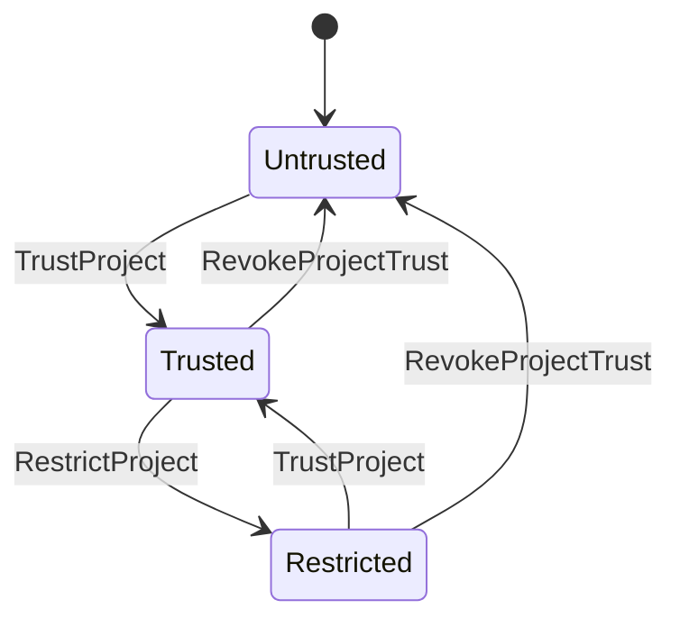
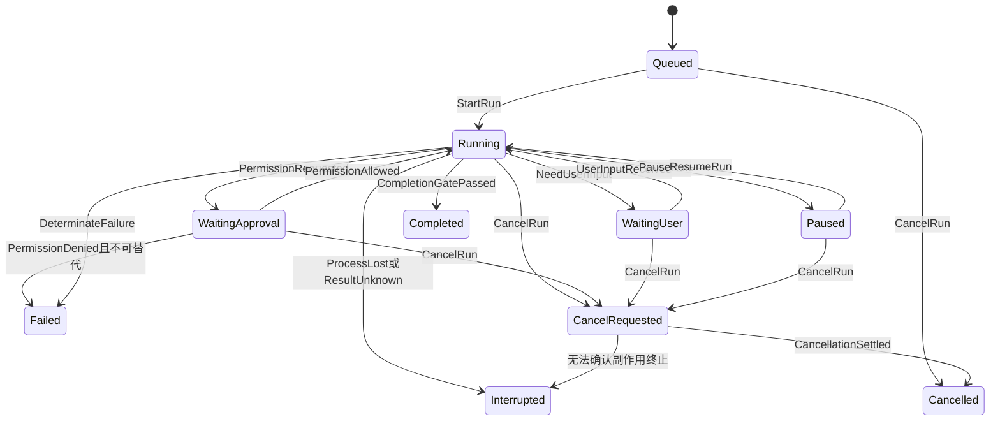
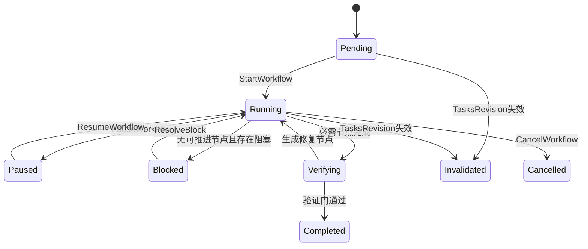

# Apex —— 领域模型与事件规范

> 版本：v0.1（详细设计草案）  
> 日期：2026-08-08  
> 状态：待评审  
> 上游文档：`docs/Apex—— 需求分析文档.md`、`docs/Apex—— 系统总体架构设计.md`

---

## 0. 目的与范围

本文定义 Apex Core 的统一领域语言、聚合边界、状态机、Command 契约、Domain Event 契约以及事件顺序、幂等、并发和恢复语义。它是以下模块共同遵守的业务协议：

- `apex-domain`：领域类型、聚合、状态机和事件；
- `apex-application`：Command/Query 用例与事务边界；
- `apex-runtime`：Session、Run、Turn、Agent Supervisor；
- `apex-storage`：事件、投影、幂等记录和 outbox；
- `apex-protocol`：gRPC/REST/WebSocket DTO；
- TUI、Desktop、Web：只消费协议，不自行推断领域状态。

本文不定义最终 SQLite DDL、protobuf 字段编号、Provider HTTP schema 和 UI 组件。它们必须从本文的领域契约派生。

### 0.1 设计目标

1. Spec 确认门由确定性状态机强制；
2. 用户、主 Agent、子 Agent、Hook、Plugin 的动作使用同一审计模型；
3. 崩溃后可以恢复业务状态，但不会盲目重放外部副作用；
4. Command 可安全重试，Event 可按顺序重放，Projection 可重建；
5. 三端对同一状态和事件有唯一解释；
6. 事件兼容演进时不破坏历史会话。

---

## 1. 统一领域语言

| 术语 | 定义 |
|---|---|
| Project | Apex 已注册的代码项目，包含 canonical root、信任状态和配置 |
| Worktree | Project 的一个物理工作目录；同一 Project 可有多个 Git worktree |
| Session | 用户与 Apex 的长期会话容器；可包含多个 Run，不以单次任务完成而结束 |
| Message | 用户、Assistant、Tool 或 System 产生的可呈现消息 |
| Run | 一次用户意图、Spec 阶段生成、工作流节点或修复任务的完整执行 |
| Turn | Run 中的一次 Provider 请求/响应；工具结果通常触发下一个 Turn |
| Agent | 拥有独立上下文和工具权限上限的执行者；分主 Agent 与子 Agent |
| Spec | 一个 feature 的 Spec 流水线实例 |
| Artifact | `requirements/design/tasks/verification` 等可版本化文档 |
| Artifact Revision | Artifact 的不可变内容版本 |
| Review | 用户对特定 revision 作出的批准、拒绝或要求修改决定 |
| Workflow | 从已批准 tasks revision 编译得到的持久化 DAG |
| Workflow Node | DAG 中可调度的任务节点 |
| Write Claim | Scheduler 对 canonical path 范围持有的互斥租约 |
| Tool Call | Agent 对 Read/Write/Edit/Bash/MCP/Task 等工具的一次请求 |
| Permission Request | Tool Call 在策略判断后产生的一次用户审批 |
| Rule Check | 对变更文件执行的一次增量规范检查 |
| Checkpoint | 可用于上下文重建的结构化快照，不等同于文件快照 |
| Snapshot | 影子 Git 中的工作区文件快照 |
| Domain Event | 已提交、不可变、可重放的业务事实 |
| Realtime Event | 为流式 UI 提供的短期事件，不作为恢复事实源 |
| Projection | 由 Domain Event 和事务内状态更新生成的查询模型 |

### 1.1 关键语义约束

- Session 不因为一个 Run 完成而完成；Session 只有 `active/archived` 生命周期；
- Turn 是一次 Provider 调用边界，Run 可以包含多个 Turn 和多个 Tool Call；
- Spec Artifact Revision 一旦创建不可修改，编辑始终产生新 revision；
- Workflow 绑定特定 `tasks_revision_id`，上游 Spec 变化后旧 Workflow 不能继续调度；
- Domain Event 表达“已经发生的事实”，不能用 `RequestXxx` 作为事件名称；
- Realtime Event 丢失不影响恢复；Domain Event 丢失属于数据完整性故障。

---

## 2. 标识符、版本与时间

### 2.1 Typed ID

Apex 使用带类型前缀的 ULID。前缀参与字符串校验，禁止把不同 ID 类型当作普通字符串互换。

| 类型 | 前缀 | 示例 |
|---|---|---|
| Project | `prj_` | `prj_01K1...` |
| Worktree | `wt_` | `wt_01K1...` |
| Session | `ses_` | `ses_01K1...` |
| Message | `msg_` | `msg_01K1...` |
| Run | `run_` | `run_01K1...` |
| Turn | `turn_` | `turn_01K1...` |
| Agent | `agt_` | `agt_01K1...` |
| Spec | `spc_` | `spc_01K1...` |
| Artifact | `art_` | `art_01K1...` |
| Artifact Revision | `arv_` | `arv_01K1...` |
| Review | `rev_` | `rev_01K1...` |
| Workflow | `wfl_` | `wfl_01K1...` |
| Workflow Node | `wfn_` | `wfn_01K1...` |
| Write Claim | `clm_` | `clm_01K1...` |
| Tool Call | `tol_` | `tol_01K1...` |
| Permission Request | `per_` | `per_01K1...` |
| Rule Check | `rck_` | `rck_01K1...` |
| Checkpoint | `ckp_` | `ckp_01K1...` |
| Snapshot | `snp_` | `snp_01K1...` |
| Command | `cmd_` | `cmd_01K1...` |
| Event | `evt_` | `evt_01K1...` |
| Operation | `op_` | `op_01K1...` |
| Correlation | `cor_` | `cor_01K1...` |
| Gate Attempt | `gta_` | `gta_01K1...` |
| Snapshot Restore | `srs_` | `srs_01K1...` |
| Extension | `ext_` | `ext_01K1...` |
| Extension Revision | `exr_` | `exr_01K1...` |
| Extension Instance | `exi_` | `exi_01K1...` |
| Hook Invocation | `hki_` | `hki_01K1...` |
| Credential | `crd_` | `crd_01K1...` |
| Credential Lease | `crl_` | `crl_01K1...` |
| Client Instance | `ins_` | `ins_01K1...` |
| Connection | `con_` | `con_01K1...` |
| Event Store | `estore_` | `estore_01K1...` |
| Protocol Request | `req_` | `req_01K1...` |

**易混前缀**：`arv_`（ArtifactRevision，不可变内容版本）与 `rev_`（Review，用户对某 revision 的决定）在 Spec 审批链中同时出现，不得互换——批准必须绑定 `arv_ + checksum`，`rev_` 只是该决定的记录 ID。

> ADR-0025（跨文档一致性审查）：详细设计中已实际使用但此前未登记的前缀已补入本表。新增前缀须先在此登记再使用；SQLite 文档 §4.2 的简表已加注 `arv_`/`rev_` 区别。

内部 Rust 类型使用 newtype，序列化时才转换为字符串：

```rust
#[derive(Clone, Debug, Eq, PartialEq, Hash, Serialize, Deserialize)]
#[serde(transparent)]
pub struct SessionId(PrefixedUlid);
```

### 2.2 时间

- wire/storage 时间使用 UTC RFC 3339，微秒精度；
- 内部持续时间使用单调时钟，不能用 wall clock 计算超时；
- Event 同时保存 `occurred_at` 和 `committed_at`；
- ULID 的时间部分仅用于大致排序，不代替 `global_seq`；
- 用户界面负责按客户端时区显示。

### 2.3 版本

| 版本 | 用途 |
|---|---|
| `aggregate_version` | 单个聚合内的乐观并发版本，从 1 递增 |
| `schema_version` | Event payload 的结构版本 |
| `protocol_version` | 客户端与服务端能力协商 |
| `artifact_version` | 人类可见的文档版本，从 1 递增 |
| `config_revision` | 生效配置的不可变 revision |
| `workflow_revision` | Workflow 图发生结构变化时递增 |

---

## 3. Actor 与授权上下文

### 3.1 Actor

```rust
pub enum ActorKind {
    User,
    MainAgent,
    SubAgent,
    System,
    Recovery,
    Hook,
    Plugin,
}

pub struct ActorRef {
    pub actor_id: ActorId,
    pub kind: ActorKind,
    pub principal_id: Option<PrincipalId>,
    pub agent_id: Option<AgentId>,
    pub plugin_id: Option<PluginId>,
}
```

所有 Command 和 Event 必须有 Actor。后台恢复、定时检查和 materializer 使用 `System/Recovery`，不能伪装成 User。

### 3.2 Authorization Context

```text
AuthorizationContext {
  principal,
  project_trust,
  permission_mode,
  capability_set,
  parent_capability_ceiling?,
  client_id,
  transport,
  requested_at
}
```

子 Agent、Hook 和 Plugin 的 capability 是父/安装授权与项目策略的交集。任何模块只能缩小 capability，不能扩大。

---

## 4. 聚合边界与一致性规则

### 4.1 聚合设计原则

Apex 不使用一个覆盖全部业务的“大 Session 聚合”。聚合只保护必须在单事务内成立的不变式，跨聚合流程由 Application Service、持久化 Command 和 Domain Event 协调。

1. 一个 Command 的主写目标只能是一个聚合；
2. 同一事务可以更新主聚合、写事件、写幂等结果和 outbox；
3. 跨聚合引用只保存 Typed ID 与必要 revision，不嵌入可变对象；
4. 外部文件、Git、Provider、MCP、子进程不是数据库事务的一部分；
5. 需要跨介质完成的流程建模为可恢复 Operation/Saga；
6. 聚合以 `aggregate_version` 实施乐观并发，不以“最后写入获胜”覆盖冲突。

### 4.2 聚合目录

| 聚合根 | 主要实体/值对象 | 负责的不变式 | 不负责的内容 |
|---|---|---|---|
| `Project` | WorktreeRef、ProjectTrust、ConfigRef | 项目根唯一、信任变更、归档约束 | 会话消息、工具执行 |
| `Session` | MessageRef、ActiveRunRef、CurrentSpecRef | 主线 Run 串行、消息顺序、当前上下文引用 | Run 内工具循环 |
| `Run` | Turn、ProviderCallRef、StopReason | Run/Turn 生命周期、取消与最终状态唯一 | Spec 批准、节点依赖 |
| `Agent` | AgentProfile、CapabilityCeiling、CheckpointRef | 父子关系、递归深度、权限只减不增 | 全局并发 slot |
| `Spec` | ArtifactRef、Review、StageGate | Artifact revision、批准门、下游失效 | Markdown 实际落盘 |
| `Workflow` | Node、Edge、WorkflowBinding | DAG、节点推进、revision 绑定 | 物理路径租约 |
| `WriteClaim` | PathScope、Lease | 路径互斥、租约拥有者、过期回收 | 写权限批准 |
| `ToolCall` | ToolRequest、PermissionRef、ToolResultRef | 工具状态、一次执行语义、结果归一化 | Permission rule 生命周期 |
| `PermissionRequest` | RiskAssessment、Decision | 一次审批只能有一个终局决定 | 工具实际执行 |
| `RuleCheck` | RuleSetRef、Diagnostic | 检查输入固定、诊断与结论 | 自动修复流程 |
| `Gate` | GateDefinition、GateEvidence、Waiver | 证据聚合、放行判定、stale 失效 | 单次检查的执行 |
| `Checkpoint` | ContextManifest、ContentRef | 上下文基线、checksum、适用 revision | 文件快照 |
| `Snapshot` | SnapshotManifest | 文件基线与保留策略 | 用户 Git 历史、恢复操作 |
| `SnapshotRestore` | RestorePlan、ConflictRecord | 一次恢复操作的生命周期与冲突 | Snapshot 内容本身 |

`Gate` 与 `RuleCheck` 分离：**RuleCheck 是证据，Gate 是决策**。一次 RuleCheck 可被多个 Gate 复用；一个 Gate 也可聚合测试、Snapshot、Spec Review、外部 receipt 等非 Rule 类证据。Gate 状态：

```text
pending | running | passed | failed | blocked
        | inconclusive | stale | waived | cancelled | unknown
```

Gate 不变式：

- `passed` 只在固定 input digest 与 policy 下成立；Ruleset revision、Workspace identity、Spec revision 或 Gate Definition 变化后自动转 `stale`；
- 聚合顺序确定：按 effect precedence、required 状态和稳定 ID 计算，与证据到达顺序无关；
- 缺失必需证据时结论最多为 `inconclusive`，不得为 `passed`；
- `waived` 必须携带 scope、TTL 和 Actor，且不关闭原 Diagnostic；
- Node/Run/Workflow 的完成由 Gate 裁决，模型自报"完成"不构成 `passed`。

完整定义见 `Apex—— Rules与Verification Gate详细设计.md` §8。

> ADR-0009（跨文档一致性审查）：`Gate` 已是 Node/Workflow 完成判定的实际决策点并有 6 张支撑表，但此前未在领域模型登记，属承担核心职责的隐形聚合。现补入。`Snapshot` 一行同时拆出 `SnapshotRestore`（见 §5.13）。

总体架构中概称的 `Artifact` 聚合在详细模型中拆为两部分：Spec 聚合持有具有业务语义的 `ArtifactHead/Review/StageGate`；不可变 `ArtifactRevision` 与 Markdown `MaterializationIntent` 由内容仓储和可恢复物化流程管理。这样文件镜像失败不会回滚已经成立的 Spec 审批事实，同时 revision/checksum 仍是跨聚合的稳定引用。

### 4.3 Project 聚合

```text
Project {
  project_id,
  canonical_root,
  display_name,
  lifecycle,
  trust,
  active_worktrees[],
  effective_config_revision,
  created_at,
  updated_at,
  aggregate_version
}
```

不变式：

- `canonical_root` 必须经过平台感知的 canonicalize，同一物理目录只能属于一个 active Project；
- `ProjectTrust` 只能由 `User` Actor 授予、降级或撤销；
- 未授信项目不能启用 `bypass`、项目 Skill 脚本、远程 MCP 或项目定义的自动命令；
- archived Project 禁止创建新 Session/Run，但允许查询、导出和恢复归档；
- Worktree 必须属于同一仓库身份或被明确登记为 standalone worktree；
- 配置 revision 是不可变引用，配置文件变化必须先编译并验证，再切换生效 revision。

### 4.4 Session 聚合

```text
Session {
  session_id,
  project_id,
  branch_id,
  title,
  lifecycle,
  interaction_state,
  active_main_run_id?,
  current_spec_id?,
  head_message_seq,
  latest_checkpoint_id?,
  created_at,
  last_activity_at,
  aggregate_version
}
```

不变式：

- 一个 Session 同时最多存在一个非终局的主线 Run；Workflow 子 Agent Run 由 Workflow/Agent 聚合协调，不占用另一个主线槽；
- Message 在 Session 内具有连续的 `message_seq`，相同 `client_message_id` 只能追加一次；
- `waiting_approval`、`waiting_user`、`paused` 是交互状态，不是 Session 生命周期终点；
- archived Session 不接受新消息，恢复时必须先显式 unarchive；
- `current_spec_id` 必须属于同一 Project；
- Fork Session 必须固定源消息游标、Checkpoint 和 Spec revision，不能引用持续变化的“最新状态”。

### 4.5 Run 与 Turn 聚合

```text
Run {
  run_id,
  session_id,
  kind,
  parent_run_id?,
  workflow_node_id?,
  agent_id,
  state,
  intent_ref,
  spec_binding?,
  cancellation_requested_at?,
  active_turn_id?,
  final_outcome?,
  started_at?,
  ended_at?,
  aggregate_version
}

Turn {
  turn_id,
  ordinal,
  state,
  provider_request_id?,
  input_checkpoint_id,
  tool_call_ids[],
  usage?,
  stop_reason?,
  started_at?,
  ended_at?
}
```

不变式：

- Turn `ordinal` 在 Run 内从 1 连续递增；
- 一个 Run 同时最多一个 active Turn；
- Run 到达终局后不能创建新 Turn；重试必须创建新 Run 或显式 `RetryRun` attempt；
- Provider 重试属于同一 Turn 的 ProviderCall attempt，不得重新执行已完成 ToolCall；
- `completed` 只表示 Run 达到其业务完成条件；模型自然停止不自动等于 completed；
- `cancelled` 表示收到并完成取消流程，`interrupted` 表示进程/连接中断导致结果未知，二者不可互换；
- Run 的最终事件只能提交一次，后续迟到的 Provider/Tool 回调被记录为 ignored late result。

### 4.6 Agent 聚合

```text
Agent {
  agent_id,
  session_id,
  parent_agent_id?,
  role,
  profile_revision,
  capability_ceiling,
  recursion_depth,
  state,
  assigned_run_id?,
  assigned_node_id?,
  checkpoint_id?,
  created_at,
  ended_at?,
  aggregate_version
}
```

不变式：

- `SubAgent.capability_ceiling ⊆ Parent.capability_ceiling`；
- 子 Agent 不能授予权限、信任项目、跳过 Spec 或修改安全硬规则；
- `recursion_depth`、Session Agent 数和全局 Agent 数必须在调度前满足限制；
- Agent 一次只能绑定一个 active Run；
- Agent 完成时必须提交结构化 outcome：摘要、变更文件、测试、诊断、剩余风险；
- Agent 的 prompt/context 是隔离资源，不能直接写父 Agent 的消息序列。

### 4.7 Spec 聚合

```text
Spec {
  spec_id,
  project_id,
  feature_key,
  lifecycle,
  stage,
  artifacts: Map<ArtifactKind, ArtifactHead>,
  reviews[],
  approved_bindings,
  skip_record?,
  active_workflow_id?,
  aggregate_version
}

ArtifactHead {
  artifact_id,
  kind,
  head_revision_id,
  head_version,
  head_checksum,
  status,
  materialization_status
}
```

不变式：

- `feature_key` 在 active Project 内唯一，归档后可按策略复用；
- Artifact Revision 不可变，`artifact_version` 对同一 Artifact 连续递增；
- Review 必须绑定 `revision_id + checksum`，不能批准“当前最新”这种浮动目标；
- Design 只能基于已批准 Requirements revision 生成；Tasks 只能基于已批准 Design revision 生成；
- Implementation 只能基于已批准 Tasks revision，或由用户执行过 `SkipSpec`；
- 修改上游 Artifact 后，所有依赖其旧 revision 的批准、下游 Artifact 和 Workflow 都必须失效；
- `SkipSpec` 只能由 User Actor 执行，记录原因、执行阶段和当时 Artifact heads，且不可从审计流删除；
- verification 结论必须来自验收标准、测试、RuleCheck 和显式例外，不能仅依赖 Agent 声明；
- 同一 revision 只能有一个生效批准决定；Reject/RequestChanges 会关闭当前 review cycle，但不删除历史决定。

### 4.8 Workflow 聚合

```text
Workflow {
  workflow_id,
  spec_id,
  tasks_revision_id,
  workflow_revision,
  state,
  nodes: Map<NodeId, WorkflowNode>,
  edges: Set<Edge>,
  scheduling_policy,
  created_at,
  aggregate_version
}
```

不变式：

- 创建时必须验证节点 ID 唯一、依赖存在、图无环；
- Workflow 永久绑定一个 `tasks_revision_id`；该 revision 失效后 Workflow 立即进入 `invalidated`；
- Node 只有在所有前置节点 completed、Workflow running、Spec binding 有效时才能 ready；
- Node 获得并发 slot 与全部 WriteClaim 后才能 running；
- Node completed 前必须保存 outcome、变更集合和验证摘要；
- failed/cancelled/interrupted/blocked 节点不会自动放行后继节点；
- `RetryNode` 创建新的 attempt，保留旧 attempt 历史，不覆盖旧错误；
- Workflow completed 要求全部必需节点 completed，并通过 workflow-level verification gate；
- 动态增删节点必须产生新 `workflow_revision` 并重新校验 DAG。

### 4.9 WriteClaim 聚合

```text
WriteClaim {
  claim_id,
  project_id,
  worktree_id,
  owner_agent_id,
  owner_run_id,
  owner_node_id?,
  scopes[],
  lease_state,
  acquired_at,
  heartbeat_at,
  expires_at,
  release_reason?
}
```

不变式：

- scope 必须是 canonical project-relative path；
- 同一 Worktree 内，两个 active claim 的路径范围不能相交；
- `src/` 与 `src/auth.rs`、无法证明不相交的 glob、经符号链接指向同一目标的路径均视为冲突；
- claim 仅证明调度互斥，不替代 Permission 决策；
- 只有 owner 或 Recovery Actor 可释放 claim；
- lease 过期后先进入 `suspect` 并 reconcile owner 进程，不能仅凭 wall clock 立即分配给新写者。

### 4.10 ToolCall 聚合

```text
ToolCall {
  tool_call_id,
  operation_id,
  run_id,
  turn_id,
  agent_id,
  tool_name,
  normalized_arguments,
  argument_digest,
  risk,
  state,
  permission_request_id?,
  pre_snapshot_id?,
  post_snapshot_id?,
  result_digest?,
  external_effect_state,
  started_at?,
  ended_at?,
  aggregate_version
}
```

不变式：

- 同一 `operation_id` 不允许并发或无条件重复 dispatch；结果未知时必须先 reconcile，不能直接重试；
- 参数经 schema、路径和 shell AST 归一化后才能计算 digest；
- 任一工具都必须经过 Tool Gateway，MCP/Task/Skill script 不能旁路；
- 写操作必须同时满足 capability、Permission、WriteClaim、PreTool hook/rule；
- 外部副作用开始前必须持久化执行意图和 `operation_id`；
- 结果未知时进入 `reconcile_required/interrupted`，不得自动标为 failed 后重试；
- ToolResult 必须带截断元数据、taint 来源、stdout/stderr 摘要及外部结果引用；
- PostTool RuleCheck 阻断时，工具调用可以是 `succeeded_with_violations`，但所属 Run/Node 不得完成。

### 4.11 PermissionRequest 聚合

不变式：

- 一次请求必须固定 tool、参数 digest、路径集合、风险、Actor 和 capability snapshot；
- 参数或目标路径变化后旧批准立即失效；
- 决策只能从 pending 转为 allowed/denied/expired/cancelled 之一；
- “总是允许”实际创建一条版本化 PermissionRule，当前请求仍保存独立 Decision；
- 硬拒绝规则不能被 User、Plugin 或项目配置覆盖；
- 批准必须由有资格的 User principal 作出，并记录客户端和认证上下文；
- 父 Agent 的一次性批准不会自动扩散到子 Agent，除非规则 scope 明确允许且不超过能力上限。

### 4.12 RuleCheck 聚合

不变式：

- RuleCheck 固定 `ruleset_revision + input_file_checksums + command/config digest`；
- 同一输入可复用已缓存结论，但必须保留来源 check ID；
- Diagnostic 有稳定 fingerprint，重复检查可关联而非重复堆积；
- `error` 默认阻断完成，`warning` 默认不阻断；项目可收紧但不能放宽安全硬规则；
- 修复 Agent 是新的 Agent/Run，不能在检查器内部静默改文件；
- checker 崩溃、超时和“检查失败”与“代码检查未通过”是不同结果。

### 4.13 Checkpoint 聚合

不变式：

- Checkpoint 绑定 Session、可选 Run、Spec/Workflow revision 和消息游标；
- 内容提交后不可变，修正产生新 Checkpoint；
- checksum 不匹配的文件不能用于恢复；
- 已批准 Spec、用户决策、未完成任务和安全约束不能在压缩时被丢弃；
- Checkpoint 可重建上下文，但不能被当作领域事实源覆盖 Event；
- materialization 失败不影响已提交元数据，必须由 outbox 重试。

### 4.14 Snapshot 聚合

不变式：

- Snapshot 明确绑定 Project、Worktree、base snapshot 和文件 manifest；
- 含写操作的 Run 必须能追溯到 pre-write snapshot；
- Restore 是新的受审计 Operation，不修改或删除原 Snapshot；
- restore 前必须检查目标工作区与预期 head，检测到用户并发变更时进入 conflict；
- Snapshot 保留计数由活跃 Run、Checkpoint、Workflow 和用户 pin 共同决定；
- 影子 Git 对象不是用户 Git commit，不得改变用户分支、index 或 reflog。

---

## 5. 状态机规范

### 5.1 通用状态机约束

- 状态转换只能由 Command handler 或 Recovery reconciler 触发；
- 每次有效转换至少产生一个 Domain Event；
- 非法转换返回稳定错误码，不得“尽力而为”修改状态；
- 终局状态不可逆；需要继续执行时创建新 attempt/revision；
- 状态机判断使用持久化事实，不依赖 UI 是否在线；
- 迟到结果不能把终局状态改回 running。

### 5.2 ProjectTrust



| 状态 | 允许能力 |
|---|---|
| `untrusted` | 浏览安全元数据；敏感读取、写、脚本、远程 MCP 默认拒绝/询问 |
| `restricted` | 允许显式白名单能力，不允许 bypass |
| `trusted` | 可依据项目策略自动化，但安全硬规则仍有效 |

### 5.3 Session 状态

Session 使用两个正交维度：

```text
lifecycle: active | archived
interaction_state:
  idle | running | waiting_user | waiting_approval | paused | recovering
```

- `running` 必须有 `active_main_run_id`；
- `idle` 不得引用 active main Run；
- pending PermissionRequest 时可进入 `waiting_approval`；
- daemon 重启期间进入 `recovering`，reconcile 完成后根据 Run 状态转为 idle/waiting/paused；
- archive 只允许在没有 active main Run 时执行，或先显式取消。

### 5.4 Run 状态



终局：`completed/failed/cancelled/interrupted`。`blocked` 作为有明确外部阻塞且允许用户后续恢复的非终局状态，可从 running/waiting 进入，并通过 `ResolveBlock` 返回 queued/running。

### 5.5 Turn 状态

```text
created → provider_streaming → tool_pending → tool_running
       ↘ provider_completed → evaluating → completed
任意非终局 → cancelled | failed | interrupted
```

- 一个 Turn 可在 `provider_streaming ↔ tool_pending/tool_running` 之间多轮循环，但每次新的 Provider 请求记录 ProviderCall attempt；
- `provider_completed` 后由 Core 检查 stop reason、Spec gate、任务完成条件和 context pressure；
- 若需要继续工具结果对话，关闭当前 Turn 并创建下一 Turn，避免一个 Turn 跨越多个不可辨识 Provider 边界。

### 5.6 Agent 状态

```text
spawned → queued → running → completed
                     ├──────→ failed
                     ├──────→ cancelled
                     └──────→ interrupted
queued/running → blocked → queued
```

Agent `completed` 不代表 Workflow Node 自动完成；Scheduler 还需验证变更、规则、测试和 outcome。

### 5.7 Spec 状态

Spec 使用 `lifecycle` 与 `stage` 两个维度：

```text
lifecycle: active | completed | invalidated | archived
stage:
  requirements_draft
  requirements_review
  requirements_approved
  design_draft
  design_review
  design_approved
  tasks_draft
  tasks_review
  tasks_approved
  implementation
  verification
  verification_review
  spec_skipped
```

核心转换：

| 当前阶段 | Command | 前置条件 | 下一阶段/结果 |
|---|---|---|---|
| requirements_draft | SubmitArtifactForReview | revision 有效且规则通过 | requirements_review |
| requirements_review | ApproveSpecStage | revision/checksum 匹配 | requirements_approved |
| requirements_approved | StartDesign | approved requirements 固定 | design_draft |
| design_review | ApproveSpecStage | 基线 requirements 未失效 | design_approved |
| design_approved | StartTaskPlanning | approved design 固定 | tasks_draft |
| tasks_review | ApproveSpecStage | DAG 可编译 | tasks_approved |
| tasks_approved | StartImplementation | Workflow 创建成功 | implementation |
| implementation | StartVerification | 必需节点达到可验证状态 | verification |
| verification_review | ApproveVerification | 验收项通过或有显式例外 | completed |
| 任意允许阶段 | SkipSpec | User + reason + policy 允许 | spec_skipped → implementation |

上游 Artifact 新 revision 被设为 head 时，若内容 checksum 与已批准 revision 不同：

1. 当前批准标记 stale；
2. 依赖下游 Artifact 标记 invalidated；
3. 绑定 Workflow 标记 invalidated/paused；
4. Spec 回退到相应 draft；
5. 发布 `SpecInvalidated`，列出因果 revision 链。

### 5.8 Artifact 状态

```text
revision_status: draft | in_review | approved | rejected | invalidated | superseded
materialization_status: pending | synced | conflict | failed
```

两个状态维度独立。DB revision 已 approved 但 Markdown materialization 暂时 failed 时，批准事实仍成立；UI 必须显式展示镜像不同步，不能把它显示为 draft。

### 5.9 Workflow 与 Node 状态



Node 状态：

```text
pending → ready → claiming → queued → running → verifying → completed
                    └──────→ blocked
running/verifying → failed | cancelled | interrupted
failed/cancelled/interrupted/blocked → ready（仅通过显式 Retry/Resolve，生成新 attempt）
任意非终局 → invalidated（Workflow revision 失效）
```

`ready` 是依赖满足；`claiming` 是正在获取路径租约；`queued` 是资源已满足但等待 Agent/Provider slot。三个状态不得合并，否则难以解释调度阻塞。

### 5.10 PermissionRequest 状态

```text
pending → allowed | denied | expired | cancelled
```

- Decision 提交采用 compare-and-set；
- 多客户端同时决定时首个已提交结果获胜，后续得到 `PERMISSION_ALREADY_DECIDED`；
- timeout 只产生 expired，不推断为 denied；
- Run 取消会使所有未决请求 cancelled。

### 5.11 ToolCall 状态

```text
requested
  → validating
  → awaiting_permission | denied
  → awaiting_claim
  → preflight
  → executing
  → postflight
  → succeeded | succeeded_with_violations | failed
任意外部执行相关状态 → interrupted | reconcile_required
非终局 → cancelled（仅当已确认未产生或已停止副作用）
```

`failed` 要求已知 adapter 结果；无法判断远端/子进程是否已执行时必须使用 `reconcile_required`。

### 5.12 RuleCheck 状态

RuleCheck 使用**生命周期、业务结论、失败原因三个正交维度**：

```text
state:   queued → running → completed
                            ├→ cancelled
                            ├→ interrupted
                            └→ unknown

verdict: pass | fail | inconclusive | stale | skipped | waived

failure_kind: violations_found | checker_failed | checker_timeout
            | runner_unavailable | input_missing | input_unstable
            | workspace_drift | ruleset_invalid | output_invalid
            | permission_denied | sandbox_denied | external_unknown
            | cancelled_by_user | interrupted_by_crash
            | legacy_ambiguous
```

`legacy_ambiguous` 仅供数据迁移使用：早期单维状态机中无法判定属"检查未通过"还是"检查器故障"的历史 `failed` 记录，迁移为 `state=completed, verdict=inconclusive, failure_kind=legacy_ambiguous`。新产生的 RuleCheck 不得使用该值（ADR-0029）。

- `state` 只描述检查器进程与结果收据的生命周期；`completed` 不代表业务通过；
- `verdict` 描述业务结论；`failure_kind` 描述原因；
- **"代码检查未通过"（`verdict=fail`，`failure_kind=violations_found`）与"检查基础设施故障"（`verdict=inconclusive`，`failure_kind=checker_failed`）必须分别统计和处理**，不得压成同一事实；
- 无证据不得记为 `pass`；输入变化使旧结论转 `stale` 而非 `fail`。

早期版本曾使用单维状态机（`passed | violations_found | checker_failed | timed_out`）。映射关系与迁移策略见 `Apex—— Rules与Verification Gate详细设计.md` §6.1–§6.3。

> ADR-0008（跨文档一致性审查）：改为三维模型，与 Rules 详细设计 §6 及 SQLite `rule_checks` 表对齐。单维模型无法区分"检查失败"与"检查未通过"，且把 `timed_out` 与业务结论混在同一枚举。

### 5.13 Snapshot 状态

Snapshot 与 Restore 是**两个独立实体**，各有状态机。

Snapshot（内容不可变，只描述"这份基线是否可用"）：

```text
intent → creating → ready
intent/creating → failed
creating → unknown          # 崩溃导致对象写入结果未知，须 reconcile
ready → deleting → deleted  # 仅当无活跃引用且超过保留期
```

SnapshotRestore（每次恢复是一次新的受审计 Operation）：

```text
requested → approved → running → completed
                              ├→ conflicted      # 工作区与预期 head 不符
                              ├→ failed
                              ├→ cancelled
                              └→ unknown         # 部分应用，结果未知
```

规则：

- Snapshot `ready` 后内容不可修改；Restore **不改变** Snapshot 状态，只产生新的 Restore 记录；
- 同一 Snapshot 可被恢复多次，每次生成独立 `restore_operation_id`；
- restore 前必须校验目标工作区与预期 head，检测到用户并发变更时进入 `conflicted` 而非覆盖；
- `unknown` 不得自动重试，须先 reconcile；
- 影子 Git 对象不是用户 Git commit，不得改变用户分支、index 或 reflog。

> ADR-0020（跨文档一致性审查）：原状态机为 `creating → created → restoring → restored`，把 Restore 的生命周期混入 Snapshot 本体，导致"同一 Snapshot 二次恢复"无法表达。SQLite `snapshots` 表与 Workspace 详细设计已采用分离模型，本节据此对齐——这也落实了原 §5.13 自己的建议"实现上建议 Snapshot 与 SnapshotRestore 分表/分实体"。原 `conflict`/`restore_failed` 归入 SnapshotRestore 的 `conflicted`/`failed`；原 `expired` 归入 Snapshot 的 `deleted`（保留期到期后经 `deleting` 转入）。

---

## 6. Command 规范

### 6.1 Command Envelope

所有变更请求在进入 Application Service 前归一化为同一结构：

```rust
pub struct CommandEnvelope<C> {
    pub command_id: CommandId,
    pub operation_id: OperationId,
    pub command_type: String,
    pub schema_version: u16,
    pub actor: ActorRef,
    pub auth: AuthorizationContext,
    pub project_id: ProjectId,
    pub session_id: Option<SessionId>,
    pub aggregate_id: Option<AggregateId>,
    pub expected_version: Option<u64>,
    pub correlation_id: CorrelationId,
    pub causation_id: Option<EventId>,
    pub client_id: ClientId,
    pub client_request_id: Option<String>,
    pub issued_at: Timestamp,
    pub payload: C,
}
```

字段语义：

- `command_id`：一次逻辑提交的身份；同 ID 重试必须返回首次处理结果；
- `operation_id`：一次可能触发外部副作用的操作身份；Tool/Provider/MCP/文件写操作必须显式携带；
- `expected_version`：乐观并发条件；省略只允许用于创建命令或明确声明的无聚合查询型内部命令；
- `correlation_id`：贯穿用户请求、Run、子 Agent、工具和检查的业务链；
- `causation_id`：直接导致该 Command 的事件；用户原始命令可以为空；
- `auth`：授权快照，不从后续可变配置重新推断历史决定；
- `client_request_id`：客户端本地重试和断线重连辅助键，不能替代 `command_id`。

### 6.2 Command 处理协议

```text
received
  → authenticated
  → authorized
  → idempotency_checked
  → aggregate_loaded
  → version_checked
  → invariant_validated
  → transaction_committed
  → accepted
```

失败分类：

| 错误码 | 含义 | 客户端动作 |
|---|---|---|
| `AUTH_REQUIRED` | 身份或本机认证缺失 | 重新认证 |
| `FORBIDDEN` | capability/策略不允许 | 展示拒绝原因，不自动重试 |
| `PROJECT_UNTRUSTED` | 需要项目授信 | 引导用户授信 |
| `STALE_VERSION` | 聚合版本已变化 | 重新 Query 后让用户/Agent重算 |
| `INVALID_STATE_TRANSITION` | 状态机不允许 | 展示当前状态 |
| `SPEC_GATE_REQUIRED` | 未通过 Spec 门 | 引导确认或显式 Skip |
| `PERMISSION_REQUIRED` | 需要用户审批 | 订阅 PermissionRequested |
| `RESOURCE_CONFLICT` | claim/slot/worktree 冲突 | 等待或调整任务 |
| `OPERATION_UNKNOWN` | 外部副作用结果未知 | 进入 reconcile，不直接重试 |
| `VALIDATION_FAILED` | 参数、图或规则验证失败 | 修正输入 |
| `INTERNAL` | Core 内部故障 | 按 operation 状态恢复 |
| `PROTOCOL_VERSION_UNSUPPORTED` | 客户端与 Core 协议版本无交集 | 升级客户端 |
| `ACTOR_MISMATCH` | Actor 与连接身份不符 | 重新认证，不自动重试 |
| `SCOPE_MISMATCH` | project/session scope 与目标不符 | 修正请求 scope |
| `IDEMPOTENCY_KEY_REUSED` | 同 `command_id` 但 payload/actor 不同 | 使用新 `command_id` |
| `PERMISSION_ALREADY_DECIDED` | 审批已有终局决定 | 读取现有决定 |
| `PROJECTION_LAGGING` | 投影未追上 `min_global_seq` | 短暂重试或降级读取 |
| `CURSOR_EXPIRED` | 事件游标早于保留窗口 | 重新获取 Projection snapshot |
| `PAGE_CURSOR_INVALID` | 分页游标格式非法 | 从首页重新分页 |
| `PAGE_CURSOR_EXPIRED` | 分页游标对应的 projection revision 已失效 | 从首页重新分页 |
| `RATE_LIMITED` | 触发连接/principal/project 限流 | 按 `retry_after` 退避 |
| `TIMEOUT` | 请求在 Core 侧超时 | 幂等请求可重试 |
| `STORAGE_BACKPRESSURED` | 写入队列饱和 | 退避重试 |
| `DATABASE_MIGRATING` | 迁移进行中，写入关闭 | 等待迁移完成 |
| `REGISTRY_GENERATION_CONFLICT` | 扩展 registry CAS generation 冲突 | 重读后重试 |
| `WRITE_CLAIM_CONFLICT` | 目标路径已被其他 active claim 覆盖 | 等待或调整写路径 |
| `STALE_FENCE_TOKEN` | fence token 过期，提交被拒 | 重新取得 claim 与 fence |

**错误码命名规范**：全局采用**无模块前缀**的 `SCREAMING_SNAKE_CASE`。同一语义在全系统只有一个码，各子系统不得自建前缀族（如 `OBS_*`、`TG_*`）——否则同一故障在不同层会有多个码，客户端无法统一处理。子系统专有故障若确需细分，应通过 payload 中的 `diagnostic_ref` 或 `subsystem` 字段表达，而非改变码本身。

> ADR-0010 / ADR-0018（跨文档一致性审查）：详细设计中已实际使用但未在本表登记的错误码已补入。Observability 详细设计原自建 28 个 `OBS_*` 前缀码，其中 `OBS_PROJECTION_LAGGING`、`OBS_CURSOR_EXPIRED` 与本表重复；现确立无前缀规范，该文档已相应调整。

长任务 Command 的同步响应只承诺：

```text
Accepted { command_id, operation_id, aggregate_id?, aggregate_version, initial_state }
Rejected { command_id, error_code, safe_message, retryable, current_version? }
Duplicate { command_id, original_result }
```

`Accepted` 不代表业务成功。最终状态必须通过 Query 或持久 Domain Event 获取。

### 6.3 Command 分类

#### Project / Trust

```text
RegisterProject
OpenProject
TrustProject
RestrictProject
RevokeProjectTrust
UpdateProjectConfig
RegisterWorktree
ArchiveProject
```

`TrustProject` 必须携带用户确认的项目根、风险提示版本和客户端来源；不能由 Agent/Hook/Plugin 调用。

#### Session / Conversation

```text
CreateSession
ResumeSession
ArchiveSession
ForkSession
AppendUserMessage
SendMessage
SteerRun
PauseRun
ResumeRun
CancelRun
ResolveBlockedRun
```

`ForkSession` 固定 source message seq、checkpoint、Spec heads 和 config revision。`SteerRun` 不是覆盖原消息，而是追加带 `steering` 类型的用户事实并由 Session Actor 排序。

#### Spec / Artifact

```text
CreateSpec
GenerateArtifact
EditArtifact
ImportArtifactFromFile
SubmitArtifactForReview
ApproveSpecStage
RejectSpecStage
RequestSpecChanges
SkipSpec
InvalidateSpec
StartDesign
StartTaskPlanning
StartImplementation
StartVerification
ApproveVerification
```

`ApproveSpecStage` 必须带：`spec_id`、`stage`、`artifact_revision_id`、`content_sha256`、`review_id`、用户确认文本/备注。任何 checksum 不匹配的批准都返回 `STALE_VERSION`。

#### Workflow / Agent

```text
CompileWorkflow
StartWorkflow
PauseWorkflow
ResumeWorkflow
CancelWorkflow
RetryNode
ResolveNodeBlock
SpawnAgent
SendAgentInput
PauseAgent
ResumeAgent
CancelAgent
RetryAgent
```

`SpawnAgent` 必须携带 parent Agent、profile revision、任务/目标、Spec binding、capability ceiling 请求和可选 write_paths。Core 计算最终能力集合；请求中的 capability 只能被收紧。

#### Tool / Permission / Rules

```text
RequestToolCall
DecidePermission
SavePermissionRule
RevokePermissionRule
CaptureSnapshot
RestoreSnapshot
ApplyPatch
RunRuleCheck
AcceptRuleException
CreateRepairRun
```

外部入口不能直接调用 Tool Adapter。`RequestToolCall` 只创建 ToolCall/Permission 状态，真正执行由授权后的内部 `ExecuteToolCall` 完成，并要求同一个 `operation_id`。

#### Extensions / Memory

```text
DiscoverSkills
EnableSkill
DisableSkill
ReloadSkills
ConnectMcpServer
DisconnectMcpServer
ReloadMcpServer
InvokeSkill
AddMemory
EditMemory
DeleteMemory
ExportMemory
```

Skill/MCP 的启用、连接与调用都必须产生 actor、capability、配置 revision 和审计事件。来自外部内容的“指令”不能自动转化为这些 Command。

### 6.4 Command 事务边界

Application Service 按以下顺序处理变更：

1. 校验 transport、本机认证、Actor 和 project/session scope；
2. 读取 ProjectTrust、ConfigRevision 和 capability policy；
3. 查询 command idempotency 表；
4. 加载目标聚合及其 `expected_version`；
5. 调用纯领域方法生成新状态和 Domain Events；
6. 对外部副作用只创建 intent/operation，不在领域事务中执行；
7. 在同一 SQLite transaction 中写 aggregate state、events、idempotency result、projection update 和 outbox；
8. commit 后由 Runtime/Worker 消费 outbox 执行异步副作用；
9. 将执行结果用新的 Command/内部消息回写，不允许 Worker 直接改投影。

### 6.5 乐观并发规则

- 预期版本匹配时，聚合版本递增一次；一个 Command 产生的多个事件共享提交前版本并按事件序号递增；
- 版本不匹配不得自动 merge Session、Spec、Workflow 或 Permission；
- 对只允许“首个获胜”的操作（审批、权限、取消）使用条件更新并将失败转化为稳定冲突错误；
- 对可合并的用户消息仅在 `client_message_id` 不重复且 message_seq 可分配时追加；
- 任何自动重试都必须保留原 `causation_id`，并生成新的 attempt/operation（除非是纯幂等查询）。

---

## 7. Domain Event 规范

### 7.1 Event Envelope

```rust
pub struct EventEnvelope<E> {
    pub event_id: EventId,
    pub global_seq: u64,
    pub project_id: ProjectId,
    pub session_id: Option<SessionId>,
    pub run_id: Option<RunId>,
    pub aggregate_type: String,
    pub aggregate_id: AggregateId,
    pub aggregate_version: u64,
    pub actor: ActorRef,
    pub event_type: String,
    pub schema_version: u16,
    pub occurred_at: Timestamp,
    pub committed_at: Timestamp,
    pub correlation_id: CorrelationId,
    pub causation_id: Option<EventId>,
    pub operation_id: Option<OperationId>,
    pub redaction_level: RedactionLevel,
    pub payload: E,
}
```

约束：

- `event_id` 全局唯一且不可复用；`run_id` 在事件属于具体执行链时必填；
- `global_seq` 由 Core 单写者在提交时分配，严格递增；
- `aggregate_version` 只在对应聚合内递增；
- `occurred_at` 表示业务动作发生时间，`committed_at` 表示事实进入事件日志时间；
- `payload` 不含 API key、cookie、私钥、完整敏感文件内容或未脱敏 Authorization；
- 大输出、补丁和二进制内容存为受控 Artifact/Blob 引用，事件只保存 digest、size、mime、truncated 和引用；
- event type 使用过去时、领域事实命名；跨模块重复语义应复用一个规范事件，不各自发同义事件。

### 7.2 事件命名空间

| 命名空间 | 示例 | 说明 |
|---|---|---|
| `project.*` | `project.trusted` | 项目、信任和配置 |
| `session.*` | `session.created` | 会话与消息 |
| `run.*` | `run.cancelled` | Run 生命周期 |
| `turn.*` | `turn.completed` | Provider 调用边界 |
| `agent.*` | `agent.spawned` | Agent 生命周期和 outcome |
| `spec.*` | `spec.stage_approved` | Spec、Artifact、Review |
| `workflow.*` | `workflow.node_ready` | DAG 和调度 |
| `claim.*` | `claim.acquired` | 写路径租约 |
| `tool.*` | `tool.call_finished` | Tool Gateway |
| `permission.*` | `permission.decided` | 审批与规则 |
| `rule.*` | `rule.violation_found` | 规范检查 |
| `checkpoint.*` | `checkpoint.created` | 上下文重建 |
| `snapshot.*` | `snapshot.restored` | 文件快照和恢复 |
| `provider.*` | `provider.call_finished` | Provider 状态、usage |
| `skill.*` | `skill.loaded` | Skill 发现/加载 |
| `mcp.*` | `mcp.call_finished` | MCP 连接和调用 |
| `memory.*` | `memory.recalled` | 记忆生命周期 |
| `hook.*` | `hook.denied` | Hook 决策 |
| `plugin.*` | `plugin.crashed` | Plugin 生命周期 |
| `recovery.*` | `recovery.completed` | 启动恢复和 reconcile |
| `repair.*` | `repair.run_created` | 规则违规的修复 Run |
| `credential.*` | `credential.use_completed` | Credential 签发、使用与轮换 |
| `data.*` | `data.egress_evaluated` | 数据外发判定 |
| `audit.*` | `audit.record_created` | 审计记录与导出 |
| `maintenance.*` | `maintenance.completed` | 迁移、备份、重建等维护任务 |
| `alert.*` | `alert.opened` | 告警生命周期 |
| `incident.*` | `incident.opened` | 事件单生命周期 |
| `health.*` | `health.check_sampled` | 健康探测 |
| `observability.*` | `observability.telemetry_configured` | 可观测管道自身状态 |
| `support_bundle.*` | `support_bundle.completed` | 诊断包 |
| `upgrade.*` | `upgrade.completed` | 版本升级与回滚 |
| `backup.*` / `restore.*` | `backup.completed` | 备份与恢复 |
| `database.*` | `database.integrity_failed` | 存储层健康 |
| `process.*` | `process.ready` | 进程生命周期 |
| `projection.*` | `projection.rebuild_completed` | 投影重建 |
| `blob.*` | `blob.reference_missing` | Blob 完整性 |
| `extension.*` | `extension.crashed` | 扩展统一生命周期 |
| `context.*` | `context.build_completed` | 上下文装配 |
| `workspace.*` | `workspace.baseline_changed` | 工作区基线 |

### 7.2.1 事件命名规则（规范）

1. **两段式**：`<namespace>.<past_tense_fact>`。命名空间必须来自上表；新增命名空间须先在本表登记。
2. **过去时**：事件名描述已发生的事实（`created` / `finished` / `denied`），不使用 `Request*`、`Do*` 等祈使或将来式。
3. **不在事件名中编码版本**：版本由 EventEnvelope 的 `schema_version` 字段承载。禁止 `tool.call_finished.v1` 这类写法——同一业务事实在其生命周期内**保持同一个 wire 名称**，schema 演进只递增 `schema_version` 并提供 upcaster。这样消费者订阅一个名字即可，不必随版本变更订阅列表。
4. **单数命名空间**：事件命名空间一律用单数（`alert.*` 而非 `alerts.*`）。复数形式保留给 capability 标识符。
5. **与 capability 区分**：capability 标识符格式为 `<domain>.<action>.v<major>`（如 `credential.use.v1`、`events.read.v1`），**保留**版本后缀且动词用原形。二者形状不同，不得混用：capability 是权限令牌，事件是历史事实。
6. **Rust 枚举映射**：wire 名 `spec.skipped` 映射为 Rust `SpecSkipped`。线协议以 snake_case 点分为准，PascalCase 仅是语言侧类型名，不得作为 wire 值。

> ADR-0003 / ADR-0004 / ADR-0030（跨文档一致性审查）：原表仅登记 20 个命名空间，而详细设计实际使用约 48 个；且详细设计普遍把版本编入事件名（约 97 处），与本文 §7.1 的 `schema_version` 字段重复。现补齐注册表、确立两段式与单数约定，并统一由 `schema_version` 承载版本；各详细设计中的事件名后缀已相应移除，capability 名不受影响。

线协议使用 `session.created` 等稳定名称，Rust 枚举使用类型安全映射，例如 `spec.skipped` 映射为 `SpecSkipped`；禁止客户端根据字符串前缀猜测状态机，状态字段和 schema 必须明确提供。

### 7.3 核心事件 Payload

以下事件是 v1 必须稳定的最小集合。字段可扩展，但语义和必填字段不得悄然改变。

#### Project / Session

```text
project.registered { canonical_root, repo_identity?, config_revision }
project.trusted { trust_scope, confirmation_version, principal_id }
project.trust_restricted { reason, allowed_capabilities[] }
project.config_updated { old_revision, new_revision, changed_keys[], effective_from }

session.created { title, branch_id, initial_checkpoint_id? }
session.resumed { recovery_summary }
session.forked { source_session_id, source_message_seq, source_checkpoint_id?, spec_bindings[] }
session.archived { reason }
session.interaction_changed { from, to, cause }
message.appended { message_id, message_seq, message_kind, author, content_ref, content_digest, visibility }
```

#### Run / Turn / Provider / Agent

```text
run.accepted { kind, intent_ref, spec_binding?, workflow_node_id?, agent_id }
run.started { attempt, parent_run_id?, checkpoint_id? }
run.paused { reason }
run.blocked { block_code, blocking_refs[], resumable }
run.cancel_requested { requested_by, reason }
run.cancelled { cancellation_mode, side_effects_reconciled }
run.interrupted { interruption_code, unknown_operations[] }
run.completed { outcome_ref, verification_summary }
run.failed { error_code, retryable, safe_message }

turn.started { ordinal, input_checkpoint_id, provider_id }
turn.provider_completed { stop_reason, usage, output_ref }
turn.completed { ordinal, next_action }
turn.failed { error_code, provider_attempts }

provider.call_started { provider_id, model, request_digest, cache_mode }
provider.call_finished { provider_id, request_id, usage, stop_reason, latency_ms }
provider.call_failed { provider_id, error_class, retryable, attempts }

agent.spawned { role, parent_agent_id?, profile_revision, capability_ceiling, recursion_depth }
agent.started { run_id, checkpoint_id }
agent.completed { outcome_ref, changed_files[], tests[], remaining_risks[] }
agent.failed { error_code, retryable, outcome_ref? }
agent.interrupted { unknown_operations[] }
```

#### Spec / Workflow

```text
spec.created { feature_key, initial_stage, requirements_artifact_id }
spec.artifact_revision_created { artifact_id, kind, revision_id, version, checksum, source }
spec.artifact_submitted { kind, revision_id, checksum, review_id }
spec.stage_approved { stage, revision_id, checksum, review_id, approved_by }
spec.stage_rejected { stage, revision_id, review_id, reasons[] }
spec.changes_requested { stage, revision_id, review_id, comments[] }
spec.invalidated { cause_revision_id, invalidated_artifacts[], invalidated_workflows[] }
spec.skipped { stage, reason, skipped_by, artifact_heads, policy_snapshot }
spec.implementation_started { tasks_revision_id, workflow_id? }
spec.verification_started { verification_revision_id? }
spec.completed { verification_revision_id, acceptance_summary }

workflow.created { tasks_revision_id, workflow_revision, node_count, graph_digest }
workflow.started { workflow_revision }
workflow.paused { reason }
workflow.invalidated { tasks_revision_id, cause_event_id }
workflow.node_ready { node_id, attempt }
workflow.node_claimed { node_id, claim_ids[] }
workflow.node_started { node_id, agent_id, run_id, attempt }
workflow.node_blocked { node_id, block_code, blocking_refs[] }
workflow.node_completed { node_id, attempt, outcome_ref, changed_files[], verification_ref? }
workflow.node_failed { node_id, attempt, error_code, retryable }
workflow.completed { workflow_revision, verification_ref }
```

#### Tool / Permission / Rule / Snapshot

```text
tool.call_requested { tool_call_id, tool_name, argument_digest, risk, operation_id }
tool.call_validated { tool_call_id, normalized_argument_ref, path_scopes[], taint_inputs[] }
tool.call_denied { tool_call_id, reason_code, policy_ref }
tool.call_started { tool_call_id, operation_id, adapter, pre_snapshot_id? }
tool.call_finished { tool_call_id, result_ref, result_digest, exit_code?, duration_ms, external_effect_state }
tool.call_interrupted { tool_call_id, operation_id, reconcile_state, unknown_effect }
tool.files_changed { tool_call_id, changes[], post_snapshot_id? }

# ADR-0005：工具完成事件的规范名是 tool.call_finished。
# Observability/Deployment 早期使用的 tool.call.completed.v1 已统一为本名称
# （二段式 + 版本由 envelope 的 schema_version 承载，见 §7.2.1）。

permission.requested { permission_request_id, tool_call_id, risk, scope, argument_digest, expires_at }
permission.decided { permission_request_id, decision, decided_by, rule_id?, reason }
permission.rule_saved { rule_id, scope, semantic_matcher, expires_at? }
permission.rule_revoked { rule_id, reason }

rule.check_started { rule_check_id, ruleset_revision, input_checksums[] }
rule.passed { rule_check_id, diagnostics_count }
rule.violation_found { rule_check_id, diagnostics[], blocking }
rule.checker_failed { rule_check_id, error_class, retryable }
repair.run_created { source_rule_check_id, target_paths[], constraints[] }

snapshot.created { snapshot_id, worktree_id, parent_snapshot_id?, manifest_digest, file_count }
snapshot.restore_requested { snapshot_id, target_worktree_id, expected_head }
snapshot.restored { snapshot_id, restore_operation_id, changed_files[] }
snapshot.restore_conflicted { snapshot_id, conflicts[] }
```

### 7.4 事件 payload 共同规则

- ID 字段必须使用明确后缀：`*_id`、`*_revision_id`、`*_seq`；
- digest 明确算法，例如 `sha256:<hex>`，不能只写“hash”；
- 文件变更使用 `{ path, change_kind, before_digest?, after_digest?, bytes_delta, mode_changed }`，不在普通事件中嵌入完整 patch；
- 错误使用稳定 `error_code`、面向用户的 `safe_message` 和内部 `diagnostic_ref` 分离；
- 数组按 Core 规范排序，客户端不得依赖 JSON map 顺序；
- 可选字段增加时保持向后兼容；改变语义时升级 `schema_version` 并提供 upcaster；
- 事件 payload 只描述业务事实，调试栈、原始模型输出和高频 delta 使用关联 Blob/诊断存储。

### 7.5 Realtime Event 与 Domain Event 的关系

```text
Domain Event（持久事实）
  → Event Bus
      ├─ Projection 更新
      ├─ Outbox worker
      ├─ Realtime adapter（WS/TUI/Tauri）
      └─ Audit/export
```

Realtime DTO 可以合并文本 delta、增加 UI hint 或丢弃低价值增量，但必须携带 `last_persisted_seq`。客户端发生 gap 时重新 Query 或按 `global_seq` 补齐，不能用临时事件推断 Run 完成、审批结果或文件变更。

---

## 8. 顺序、因果、幂等与并发

### 8.1 四种顺序不能混用

| 字段 | 范围 | 保证 | 典型用途 |
|---|---|---|---|
| `global_seq` | 单个 Apex Core 数据库 | commit 顺序严格递增 | 客户端游标、全局投影、审计 |
| `aggregate_version` | 单聚合 | 聚合事件顺序严格递增 | 乐观并发、聚合重建 |
| `message_seq` | 单 Session/branch | 消息展示顺序连续 | 对话分页、Fork 游标 |
| `turn.ordinal` | 单 Run | Provider 边界连续 | Run 恢复和上下文组装 |

`occurred_at`、ULID、Worker 完成时间都不能替代以上逻辑顺序。跨项目部署未来若采用多 Core，不承诺跨数据库的全局顺序。

### 8.2 因果链

一次用户请求的建议链路：

```text
AppendUserMessage(cmd_A, correlation=cor_X)
  → message.appended(evt_1)
  → StartRun(cmd_B, causation=evt_1, correlation=cor_X)
  → run.started(evt_2)
  → RequestToolCall(cmd_C, causation=evt_2, correlation=cor_X)
  → tool.call_requested(evt_3)
  → permission.requested(evt_4)
  → DecidePermission(cmd_D, causation=evt_4, correlation=cor_X)
  → permission.decided(evt_5)
```

- `causation_id` 指向直接父事件，不指向任意相关事件；
- 同一业务意图及其子 Agent 默认共享 correlation；子 Agent outcome 仍保留自己的 Run/Agent ID；
- 定时恢复没有用户父事件时，以 `recovery.started` 作为 causation 根；
- UI 追踪树使用 causation 构建，不能仅按时间邻近猜测。

### 8.3 Command 幂等

幂等记录至少保存：

```text
(command_id, command_type, actor_id, payload_digest,
 status, result_ref, first_seen_at, committed_at, expires_at?)
```

规则：

- 同 `command_id + payload_digest`：返回首次结果；
- 同 `command_id` 但 payload/actor 不同：拒绝为 `IDEMPOTENCY_KEY_REUSED`；
- 正在处理中：返回 `CommandInProgress` 与 operation/query ref，不启动第二份工作；
- 已接受但异步 operation 未完成：返回原 accepted result；
- 安全关键 Command 的幂等记录不得短期清理；普通客户端去重记录的保留期由 ADR 明确；
- 内部 outbox 消费也必须以 `event_id + handler_name` 去重。

### 8.4 外部副作用的幂等

按适配器能力分级：

| 等级 | 例子 | 策略 |
|---|---|---|
| 可天然幂等 | 内容寻址 Snapshot、按 checksum 写镜像 | 同 operation 重试并验证 digest |
| 可使用 idempotency key | 支持该能力的远端 API/MCP | 透传 `operation_id` |
| 可探测结果 | 文件 rename、Git object 写入 | 执行后检查目标状态 |
| 不可可靠探测 | 任意 Bash、部分 MCP side effect | 中断后标记 unknown，要求 reconcile/用户决定 |

绝不能因“命令可重试”而推导“副作用可重试”。`operation_id` 在 intent 持久化后生成并固定，Worker 崩溃重启时先查 operation journal。

### 8.5 单写者与并发

- SQLite 写入只通过 Core `StorageWriter`；客户端、插件和 Worker 不直接写数据库；
- 同一 Session 的语义写命令由 Session Actor 顺序化；
- Project/Workflow/Permission 等跨 Session 聚合仍使用 expected version；
- 长 I/O 不持有数据库 transaction；事务只完成 intent、状态和事件提交；
- Worker 回调携带它读取时的 operation/aggregate version，迟到结果由 handler 判定是否仍可应用；
- projection consumer 以 `global_seq` 串行提交 cursor，耗时派生可并行计算但必须按 seq 发布。

### 8.6 Event 去重与完整性

- `event_id`、`global_seq`、`aggregate_id + aggregate_version` 均有唯一约束；
- 启动时校验 global sequence gap、aggregate version gap、payload checksum 和 projection cursor；
- 事件写入后不可 update/delete；合法修正通过补偿事件；
- 审计导出包含链式 batch digest 或签名清单，是否引入完整 hash chain 作为安全 ADR；
- 发现事件损坏时进入只读维护模式，禁止继续在未知基线上执行工具。

---

## 9. 失败、取消、中断与阻塞语义

### 9.1 统一 Outcome

```rust
pub enum ExecutionOutcome {
    Completed { result_ref: ArtifactRef },
    Failed { error: DomainError, retryable: bool },
    Cancelled { reason: String, reconciled: bool },
    Interrupted { cause: InterruptionCause, unknown_operations: Vec<OperationId> },
    Blocked { block: BlockReason, resumable: bool },
}
```

| 状态 | 已知事实 | 可否自动重试 |
|---|---|---|
| completed | 完成门和验证条件已满足 | 不需要 |
| failed | 已知未成功，且错误已分类 | 仅 retryable 且创建新 attempt |
| cancelled | 用户/系统取消已传播并完成收尾 | 用户显式重启 |
| interrupted | 运行环境丢失或副作用结果未知 | 默认不可，先 reconcile |
| blocked | 依赖用户、权限、资源或外部条件 | 条件解除后显式恢复 |

### 9.2 错误分类

```text
DomainError
├─ ValidationError
├─ AuthorizationError
├─ StateConflictError
├─ ResourceConflictError
├─ ProviderError
├─ ToolExecutionError
├─ ExternalSystemError
├─ PersistenceError
├─ IntegrityError
└─ InternalInvariantError
```

每个错误至少具有：`code`、`category`、`retryable`、`safe_message`、`diagnostic_ref?`、`source_operation_id?`。Provider 原始错误、路径和命令内容必须先脱敏再进入用户可见字段。

### 9.3 取消协议

1. `CancelRun` 进入 Session Actor 高优先级 lane；
2. 提交 `run.cancel_requested`，禁止创建新 Turn/ToolCall；
3. 向 Provider stream、Tool child process、MCP call、Agent child token 发取消；
4. 等待有界 grace period；
5. 对已开始外部副作用执行 adapter-specific reconcile；
6. 释放或转为 suspect 的 WriteClaim；
7. 生成 post-cancel Checkpoint；
8. 确认结果后提交 `run.cancelled`；无法确认则 `run.interrupted`。

取消是协作式且可升级的。强制终止子进程不等于确认其远端副作用未发生。

### 9.4 BlockReason

稳定阻塞码包括：

```text
USER_INPUT_REQUIRED
PERMISSION_PENDING
PROJECT_TRUST_REQUIRED
WRITE_CLAIM_CONFLICT
DEPENDENCY_FAILED
SPEC_INVALIDATED
RULE_VIOLATION_BLOCKING
PROVIDER_QUOTA
MCP_UNAVAILABLE
WORKTREE_CONFLICT
EXTERNAL_OPERATION_UNKNOWN
```

Block 事件必须给出 `blocking_refs` 和一个或多个 `resolution_actions`。UI 不应把 blocked 渲染成 failed，也不能自动重复弹出审批。

### 9.5 Retry 语义

- Retry 不修改旧 attempt；创建新的 `attempt_no`、Run/ProviderCall/NodeAttempt；
- 默认复用业务 correlation，产生新的 operation IDs；
- 只有明确证明无副作用或 adapter 支持幂等时才可复用 operation ID；
- Provider 在“尚未产生 ToolCall”阶段可透明重试；一旦 ToolCall 已提交，后续 Provider 请求必须从持久化 ToolResult 继续；
- RetryNode 前重新验证 Spec binding、依赖、路径 claim 和工作区 checksum；
- 用户修改输入后不叫 retry，而是新的 Command/Run。

---

## 10. 恢复与 Reconcile

### 10.1 恢复目标

恢复保证：

- 已提交 Domain Event 不丢失；
- 聚合和 Projection 回到与事件游标一致的状态；
- 未完成外部 Operation 被识别并分类；
- 不重复不可逆副作用；
- stale claim、孤儿进程、Markdown intent 和 Snapshot 引用得到处置；
- 客户端可得到明确的 recovered/interrupted/blocked 状态。

恢复不保证：自动继续所有 Run，或自动判断任意 Bash/MCP 操作的真实外部结果。

### 10.2 启动恢复顺序

```text
1. 获取 daemon instance lock
2. 打开数据库并执行受控 migration
3. 校验 event log / aggregate / projection cursor
4. 恢复未投递 outbox
5. reconcile Markdown write intents 与外部编辑
6. reconcile Snapshot creating/restoring operations
7. 检查 Provider/MCP/Tool operation journal
8. 回收或登记孤儿子进程
9. 将 active Run/Turn/Agent/Node 分类为可恢复、blocked 或 interrupted
10. 将 stale WriteClaim 置 suspect，确认 owner 后释放
11. 重建必要 Projection/FTS 索引
12. 写 recovery.completed 并开放写流量
```

完整性检查失败时只开放诊断、导出和显式修复，不开放 Agent 执行。

### 10.3 Operation Journal

```text
OperationRecord {
  operation_id,
  kind,
  adapter,
  intent_digest,
  state: intended | dispatched | acknowledged | completed | failed | unknown,
  external_id?,
  evidence_ref?,
  last_checked_at?,
  aggregate_ref,
  created_at,
  updated_at
}
```

状态解释：

- `intended`：事务已提交，尚无发送证据，可安全调度；
- `dispatched`：已交给 adapter，但未确认接收；按 adapter 能力探测；
- `acknowledged`：外部系统已接收，有 external ID；查询结果而非重新创建；
- `completed/failed`：确定性终局；
- `unknown`：不能自动判断，需要用户或专用 reconciler。

### 10.4 各类 Operation 的恢复策略

| Operation | 恢复方式 |
|---|---|
| Provider call | 有 request ID 时查询/结束；通常将流式中断 Turn 标为 interrupted，重新 Turn |
| Read/Glob/Grep | 可用同 operation 重新执行，但结果须绑定新的文件 checksum 证据 |
| Write/Edit | 比较目标 checksum、临时文件和 snapshot；已达到预期则补记完成 |
| Bash | 检查子进程/exit evidence；未知副作用默认人工 reconcile |
| MCP call | 使用 server/call ID 查询；不支持时 unknown |
| Markdown materialize | 按 revision checksum 安全重试 temp-write + atomic rename |
| Snapshot capture | 内容寻址对象完整则补记完成，否则重建 |
| Snapshot restore | 比较 manifest 与工作区；冲突时停止 |
| Permission | pending 可继续等待；过期后 expired，不自动批准 |

### 10.5 聚合重建

Apex 可采用“当前状态表 + append-only event”而非强制全量 Event Sourcing，但必须支持：

1. 从 aggregate snapshot/current row 快速加载；
2. 用相同事务写 current row 与事件；
3. 对关键聚合提供 event replay 校验器；
4. current row 与事件版本不一致时以事件校验结果决定修复，不能静默覆盖；
5. replay 只调用纯 reducer，不执行外部 Port；
6. 历史 schema 先经过 upcaster 转换为当前内存事件。

### 10.6 补偿而非删除

错误事实的修正模式：

```text
错误批准 → spec.approval_revoked / spec.invalidated
错误 PermissionRule → permission.rule_revoked
错误文件恢复 → 新 Restore/ApplyPatch operation
错误 Projection → 从 cursor 重建
错误用户消息 → message.redacted 或 message.superseded
```

审计事实不物理删除。出于隐私删除内容时，使用 crypto-shredding/Blob 删除与保留最小 tombstone 的策略，具体由数据保留 ADR 定义。

---

## 11. Projection 与 Query 规范

### 11.1 Projection 原则

- Command 侧领域状态与 Event 在同一事务提交；
- 核心强一致 Projection 可同事务更新，复杂面板可异步消费；
- 每个异步 Projection 保存 `consumer_name + last_global_seq + schema_version`；
- handler 必须幂等，重复事件不得重复计数；
- Projection 可以删除重建，Domain Event 和权威 Artifact 不能依赖 Projection 存活；
- UI 只显示 server 提供的状态、权限和可用 action，不复制状态机。

### 11.2 核心 Projection

| Projection | 关键内容 | 一致性 |
|---|---|---|
| `project_overview` | trust、config、worktree、active sessions | 强/近实时 |
| `session_summary` | interaction state、active run、unread、last seq | 强一致 |
| `conversation_view` | message page、tool summaries、turn boundaries | 强一致 |
| `run_detail` | turns、usage、tools、outcome、blocks | 强一致 |
| `spec_view` | stage、artifact heads、reviews、invalidations | 强一致 |
| `workflow_graph_view` | nodes、edges、attempt、claim、progress | 近实时 |
| `pending_approvals` | PermissionRequest 和 Spec Review | 强一致 |
| `skill_panel` | discovery/load/invocation/tokens | 异步 |
| `mcp_panel` | server health、tools、calls、latency | 异步 |
| `subagent_panel` | Agent/Node/Run/changed files | 近实时 |
| `memory_search` | FTS5、来源、recall 指标 | 可重建 |
| `audit_timeline` | actor、event、correlation、redaction | 异步 |

### 11.3 Query Envelope 与一致性令牌

```text
QueryEnvelope {
  query_type,
  actor,
  project_id?, session_id?,
  parameters,
  protocol_version,
  min_global_seq?,
  page_cursor?
}
```

- `min_global_seq` 允许客户端要求“至少看到刚才 Command 的提交”；若 Projection 尚未追上，服务端等待短时间或返回 `PROJECTION_LAGGING`；
- 分页游标包含 projection revision 和稳定排序键，不能只使用 offset；
- Query 不产生 Domain Event；审计敏感查询可写独立 access audit，不改变业务聚合；
- 服务端返回 `as_of_global_seq`、`projection_revision`、`available_actions`；
- `available_actions` 由 Core 根据状态与 capability 计算，仅用于 UX，Command 仍需再次授权。

### 11.4 客户端重连

```text
ClientHello { protocol_range, client_id, last_seen_seq, subscriptions[] }
ServerHello { negotiated_version, current_global_seq, auth_state, capabilities }
Snapshot/Query responses as_of N
Replay events (last_seen_seq, N]
Switch to live stream after N
```

若 `last_seen_seq` 早于服务端保留窗口，返回 `CURSOR_EXPIRED`，客户端清空临时推断并重新获取 Projection snapshot。文本 delta 不补发时，以已持久化 Message/Turn output 替代。

### 11.5 权限与脱敏

Projection 和 Query 必须按 Actor 过滤：

- Tool argument 中敏感值用占位符；
- 外部 MCP/Web 内容标记 taint/source；
- Plugin 只能读取 manifest 授权的 projection subset；
- 子 Agent 不能查询父 Session 的全部私密消息，只读取任务需要的 Context Slice；
- 诊断包导出前执行统一 secret scanner 与路径匿名化选项。

---

## 12. Schema 演进与协议兼容

### 12.1 演进规则

兼容变更：

- 增加可选字段；
- 增加新 Event/Command 类型；
- 增加枚举值且旧客户端有 unknown fallback；
- 增加 Projection 字段；
- 放宽非安全类显示限制但不改变业务语义。

不兼容变更：

- 删除/重命名必填字段；
- 改变字段单位或含义；
- 复用旧 event type 表达新事实；
- 将可选变必填而无默认/upcaster；
- 改变状态机终局含义；
- 放宽权限和安全语义。

不兼容变更必须升级 schema/protocol major 或通过新事件类型表达。

### 12.2 Event Upcaster

```text
stored payload v1
  → upcast(v1→v2)
  → upcast(v2→v3)
  → current in-memory event
```

- Upcaster 是纯函数、确定性、无 I/O；
- 历史原始 payload 保持不变；
- 每个版本跃迁有 golden fixture；
- 禁止依赖当前配置、文件或时间补齐历史字段；缺失信息使用明确 `unknown/legacy` 值；
- Projection rebuild 与正常消费使用相同 upcaster 链。

### 12.3 Protocol 协商

- ClientHello 提供支持的 `[min,max]`；Core 选择交集中的最高稳定版本；
- 没有交集时拒绝连接并给出最低升级版本；
- Server capability 明确声明 `spec_v1`、`workflow_v1`、`replay_cursor_v1`、`plugin_v1` 等；
- 新客户端不得假定旧 Core 支持新 Command；旧客户端收到未知 Event 时可忽略展示，但必须推进 cursor；
- 安全关键未知事件应触发相关 Projection 刷新，而非继续使用过期可用 action。

### 12.4 Artifact 与配置演进

- Artifact frontmatter 有独立 `format_version`；内容版本 `artifact_version` 不等于格式版本。frontmatter 的权威字段集为 `id`、`feature`、`kind`、`status`、`version`、`created_at`、`updated_at`、`content_sha256`、`format_version`（ADR-0014：需求文档 §3.1.3 原只列 4 字段，架构侧另列一套；现三处统一为本字段集）；
- 导入旧格式时创建新 revision 并保存 migration 来源；
- Config 先解析到版本化 raw model，再迁移到当前 effective model；
- 安全配置缺失或未知值采用更严格默认值；
- Plugin/Hook manifest 声明 protocol range 和 capability schema version。

---

## 13. Rust 领域层组织建议

### 13.1 `apex-domain` 目录

```text
crates/apex-domain/src/
├── lib.rs
├── ids.rs
├── time.rs
├── actor.rs
├── capability.rs
├── error.rs
├── event/
│   ├── mod.rs
│   ├── envelope.rs
│   ├── project.rs
│   ├── session.rs
│   ├── execution.rs
│   ├── spec.rs
│   ├── workflow.rs
│   └── safety.rs
├── project/
├── session/
├── run/
├── agent/
├── spec/
├── workflow/
├── tool/
├── permission/
├── rules/
├── checkpoint/
└── snapshot/
```

`apex-domain` 只依赖序列化、ID、时间抽象和小型纯函数库，不依赖 Tokio、SQLite、HTTP、文件系统或 UI。

### 13.2 聚合接口形态

```rust
pub trait Aggregate {
    type Id;
    type Command;
    type Event;

    fn id(&self) -> &Self::Id;
    fn version(&self) -> u64;
    fn decide(
        &self,
        actor: &ActorRef,
        command: Self::Command,
    ) -> Result<Vec<Self::Event>, DomainError>;
    fn apply(&mut self, event: &Self::Event) -> Result<(), InvariantError>;
}
```

实践中可为每个聚合提供命名方法而非强制一个巨型 Command enum，但必须保留 `decide` 纯逻辑与 `apply` reducer 可测试性。Domain Event 在 application 层包装为 EventEnvelope。

### 13.3 Application 层接口

```rust
#[async_trait]
pub trait CommandBus {
    async fn execute<C: ApplicationCommand>(
        &self,
        envelope: CommandEnvelope<C>,
    ) -> Result<CommandResult, ApplicationError>;
}

#[async_trait]
pub trait QueryBus {
    async fn query<Q: ApplicationQuery>(
        &self,
        envelope: QueryEnvelope<Q>,
    ) -> Result<Q::Output, ApplicationError>;
}
```

Port 只暴露领域所需能力：`EventStore`、`AggregateRepository`、`IdempotencyStore`、`OutboxStore`、`OperationJournal`、`Clock`、`UnitOfWork`。Tool/Provider/FS/Git/MCP Port 位于相应 engine/application 模块，不注入纯聚合。

### 13.4 禁止的实现模式

- UI 直接 update SQLite；
- 在 serde DTO 的 getter 内触发业务状态转换；
- 用字符串比较决定 Spec/Run 状态；
- Provider 回调直接修改 Workflow Node；
- Tool adapter 自行弹审批或持久化 PermissionRule；
- replay reducer 调用文件、网络、Bash 或系统时间；
- 以 `anyhow::Error` 作为跨协议的业务错误；
- 将完整模型 prompt、secret 或大 stdout 直接放进 Event payload；
- 用 `completed: bool` 代替明确状态机；
- 为处理并发冲突静默 reload 后重放用户 Command。

---

## 14. 测试与验收规范

### 14.1 状态机单元测试

每个转换至少覆盖：

1. 正常路径；
2. 非法来源状态；
3. stale expected version；
4. 无权限 Actor；
5. 重复 Command；
6. 终局后迟到结果；
7. 序列化/反序列化 round-trip；
8. reducer 从空状态重放到同一结果。

### 14.2 性质测试

- Artifact version 永远递增且 revision 不可变；
- DAG 任意生成输入要么拒绝环，要么拓扑序完整；
- 任意两个 active WriteClaim 不相交；
- 子 Agent capability 永远是父级/策略交集的子集；
- 任意事件序列不会产生两个 active main Run；
- Run 终局状态至多一个；
- Command 重复任意次数只产生一次业务效果；
- Permission 参数 digest 变化后旧批准不可使用。

### 14.3 合约与 Golden 测试

- 每个 Event schema 维护 JSON/protobuf golden fixture；
- vN fixture 经 upcaster 后与当前类型一致；
- TUI/Desktop/Web 对同一事件流得到一致状态快照；
- REST/gRPC/WS 错误码和状态枚举一致；
- Event export/import 保持 event ID、seq、actor、causation 和 checksum；
- Projection 从空库 rebuild 后与在线投影逐字段比较。

### 14.4 恢复与故障注入

必须在以下切点强杀 Core：

- intent 提交前/后；
- adapter dispatch 前/后；
- 临时文件写入后、rename 前；
- Snapshot object 写入中；
- Permission 决定同时来自两个客户端；
- Provider 输出 ToolCall 后、ToolResult 持久化前；
- Node 完成后、claim 释放前；
- Event 已提交、WebSocket 尚未广播；
- Projection handler 应用前/后。

验收标准：不重复外部副作用、不丢 Domain Event、不产生双重终局、可识别 unknown operation、客户端重连状态一致。

### 14.5 安全回归

- Agent/Plugin/Hook 无法伪造 User Actor；
- `/skip-spec` 非 User 调用必拒绝；
- 符号链接、大小写、UNC、junction 和 `..` 不越过项目根；
- Bash 复合语句逐子命令审批；
- MCP/Web/仓库文本中的 prompt injection 不能生成系统级 Command；
- secret scanner 确保 Event/Checkpoint/diagnostic export 不含凭据；
- 项目配置不能覆盖硬拒绝；
- stale approval、stale review 和 stale claim 不被执行。

---

## 15. 关键 ADR 与待确认项

本文已经给出默认决策，但实现前仍应分别固化 ADR：

| ADR | 默认建议 | 需要验证的问题 |
|---|---|---|
| Aggregate persistence | current state + append-only events | 哪些聚合需要完全 replay 创建 |
| Event encoding | 内部 JSON/MessagePack，外部 protobuf/JSON | 可观测性、迁移和体积权衡 |
| ID | typed prefixed ULID | protobuf 表示和索引长度 |
| Event retention | 业务事件长期保留 | 隐私删除、压缩和归档 |
| Audit integrity | batch digest，后续可升级 hash chain | 威胁模型是否要求防篡改证明 |
| Local auth | daemon-issued token + OS user boundary | Web/browser CSRF 与多用户机器 |
| Workflow mutation | 新 workflow revision | 运行中修复节点的 UX |
| Unknown operation | 默认人工 reconcile | 各 adapter 可探测矩阵 |
| Projection model | 核心同步、面板异步 | 写延迟与实现复杂度 |
| Blob storage | 内容寻址文件 + DB metadata | 加密、GC、备份 |

这些 ADR 不应改变本文的核心约束：单写者、Spec 强制门、审计 Actor、外部副作用不盲目重放、权限只减不增、终局状态唯一。

---

## 16. 需求与总体架构覆盖映射

| 上游能力 | 本文落点 |
|---|---|
| Spec 强制流水线 | Spec 聚合不变式、5.7 状态机、Spec Commands/Events |
| 编码规范闭环 | RuleCheck 聚合、Tool postflight、repair.run_created |
| 三端共享会话 | global_seq、Projection、Query consistency、重连协议 |
| 可观测面板 | 事件命名空间、Projection 表、correlation/causation |
| 上下文管理 | Checkpoint 聚合、Run/Turn binding、恢复规则 |
| 权限引擎 | Actor、AuthorizationContext、PermissionRequest 和 capability ceiling |
| 多 Agent/DAG | Agent/Workflow/WriteClaim 聚合与状态机 |
| Skills/MCP | 统一 Command/Event、Tool Gateway operation 语义 |
| 记忆系统 | Memory 事件、Projection/FTS 可重建原则 |
| Provider 抽象 | ProviderCall/Turn 事件和重试边界 |
| 文件快照/回滚 | Snapshot 聚合、Restore operation、冲突状态 |
| 可靠性 | 幂等、Operation Journal、恢复和故障注入 |
| 安全性 | ProjectTrust、Actor 不可伪造、脱敏和硬拒绝 |

---

## 附录 A：实现必须保持的十二条领域公理

1. **没有通过 Spec gate 或用户审计 Skip，就没有 Implementation。**
2. **批准永远绑定不可变 revision 与 checksum。**
3. **一个 Session 同时最多一个主线 Run。**
4. **Provider 重试绝不隐式重复 ToolCall。**
5. **Core 不会无条件重复 dispatch 同一 operation；未知不等于失败，必须先 reconcile。**
6. **子 Agent、Hook、Plugin 的能力只能缩小，不能扩大。**
7. **WriteClaim 是互斥租约，不是权限。**
8. **事件是已发生事实，Projection 是可重建视图。**
9. **客户端只提交 Command 和读取 Query/Event，不拥有业务状态机。**
10. **cancelled、interrupted、failed、blocked、completed 语义严格不同。**
11. **恢复可以重放领域事实，但不能盲目重放外部副作用。**
12. **任何安全与审计决策都必须能追溯 Actor、因果链、版本和策略快照。**

---

## 附录 B：后续详细设计文档建议顺序

1. `Apex—— API与实时事件协议设计.md`：把本文 Command/Query/Event 映射为 protobuf、REST 和 WebSocket；
2. `Apex—— SQLite数据模型与迁移设计.md`：定义 current state、event、outbox、operation journal 和 projection DDL；
3. `Apex—— Agent Runtime与上下文设计.md`：细化 Session Actor、Run/Turn loop、Checkpoint 与 Provider 重试；
4. `Apex—— Tool Gateway与权限引擎设计.md`：细化 Bash AST、路径策略、approval rule 和 Hook；
5. `Apex—— Spec与Workflow引擎设计.md`：细化 Artifact compiler、DAG scheduler、claim 和 verification；
6. `Apex—— 恢复与一致性测试方案.md`：建立 crash-point 矩阵和 chaos fixtures。


