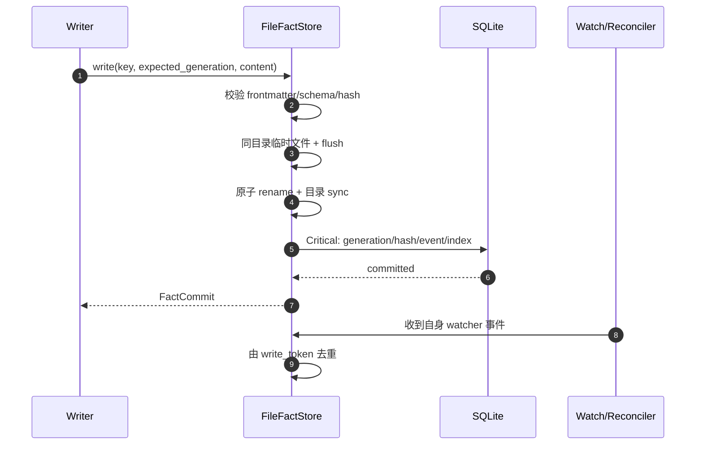
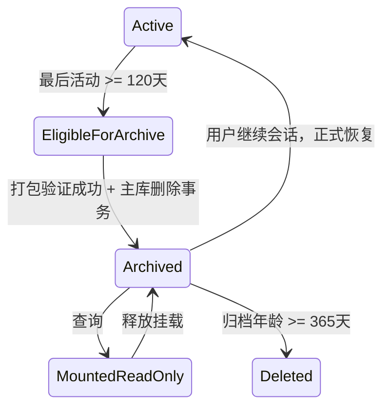

# Apex 存储、文件事实、日志与归档

## 1. 存储分层

| 层 | 权威内容 | 技术 | 是否可由用户编辑 |
|---|---|---|---|
| 文件事实 | Spec、Verification、Checkpoint、Memory、Snapshot Manifest/块 | Markdown + 内容寻址文件 | Spec/Memory 可编辑；其余经受控流程 |
| 运行事实 | Session/Run/Turn、审批、权限、Agent/Tool/DAG、最小领域事件 | SQLite WAL | 否 |
| 投影/索引 | 查询模型、FTS、文件 generation、归档目录 | SQLite | 否，可重建 |
| 诊断日志 | 会话 JSONL、系统人类可读文本 | 轮转文件 | 否，只读查看/导出 |
| Secret | Provider Key | 明文 TOML + OS 文件权限 | 用户可编辑 |

事件不等于日志：事件足以重建领域状态；日志用于诊断、审计调用摘要和离线完整性验证，不能被 Reducer 读取。

## 2. Apex Home

```text
~/.apex/
├── apex.db
├── apex.db-wal / apex.db-shm
├── config/
│   ├── apex.toml
│   ├── providers.toml
│   ├── mcp.toml
│   └── update.toml
├── runtime/
│   ├── apexd.lock
│   ├── apexd.sock              # Unix；Windows 使用 Named Pipe
│   └── web-lease.state
├── workspaces/<workspace-id>/
│   ├── workspace.toml
│   ├── specs/<feature>/*.md
│   ├── checkpoints/<session-id>/...
│   ├── workflows/*.yaml
│   └── runtime/
├── memory/*.md                 # 全局 Memory
├── objects/blake3/aa/<hash>    # CAS: chunk/attachment/snapshot block
├── logs/
│   ├── system/
│   └── sessions/<yyyy>/<mm>/
├── keys/
│   ├── session-log-ed25519.key
│   └── session-log-ed25519.pub
├── archives/sessions/
├── backups/
├── skills/
├── plugins/
└── cache/
```

目录权限默认只允许当前用户。Unix 的 Home/config/keys/runtime 为 0700，Secret/私钥文件为 0600；Windows 使用当前用户 SID ACL，拒绝继承宽权限时给出高风险诊断。

## 3. 项目目录

### 3.1 单根 Project

```text
project/
├── specs/<feature>/
│   ├── requirements.md
│   ├── design.md
│   ├── tasks.md
│   └── verification.md
└── .apex/
    ├── checkpoints/<session-id>/checkpoint.md
    ├── memory/*.md
    ├── snapshots/*.manifest.json
    └── runtime/
```

默认 Git 策略：

```gitignore
.apex/checkpoints/
.apex/snapshots/
.apex/runtime/
.apex/attachments/
.apex/cache/
.apex/logs/
```

`specs/**`、其中的 `verification.md` 和 `.apex/memory/**` 默认可提交。Apex 只建议/生成 ignore 片段，不在未经允许时改写用户 `../../../.gitignore`。

### 3.2 多根 Workspace

- 权威 Spec、Checkpoint 和 Workflow 位于 `~/.apex/workspaces/<workspace-id>/`。
- 每个 Root 保持自己的 `<root>/.apex/memory/`，以根作用域检索。
- `workspace.toml` 保存 roots、规范化路径、ProjectId 和 `audit_root_id`。
- Spec/Verification 在每次权威 commit 后镜像到 Audit Root 的 `specs/<feature>/`；镜像带 source workspace、generation 和 content hash frontmatter。
- Audit Root 镜像不是第二事实源；用户修改镜像会被当作 external edit 导回权威文件并走三方合并，不能 last-write-wins。

## 4. SQLite 物理模型

SQLite 使用一套用户级数据库。表按用途分组：

| 分组 | 主要表 |
|---|---|
| 元数据 | `schema_meta`、`schema_features`、`migration_history`、`writer_leases` |
| Project/Workspace | `projects`、`workspaces`、`workspace_roots`、`project_policies` |
| Session | `sessions`、`runs`、`turns`、`agent_messages`、`prompt_inbox` |
| Event/Projection | `domain_events`、`aggregate_versions`、`projection_cursors`、`event_outbox` |
| Spec/控制 | `spec_index`、`approvals`、`skip_grants`、`control_leases`、`web_enable_leases` |
| Agent/Tool | `agent_executions`、`dag_runs`、`node_runs`、`write_claims`、`tool_calls`、`terminal_sessions` |
| Permission | `permission_requests`、`permission_grants`、`project_trust` |
| Context | `checkpoint_index`、`context_epochs`、`context_watermarks`、`snapshot_index` |
| Memory | `memory_index`、`memory_recalls`、`memory_fts`（FTS5 virtual table） |
| Provider/扩展 | `provider_profiles`（无 Key）、`skill_index`、`skill_trust`、`mcp_index`、`plugin_index` |
| 文件/归档 | `file_sync_state`、`content_refs`、`archive_catalog`、`backup_catalog` |

关键索引：

- `domain_events(session_id, session_seq)` 唯一；`(aggregate_kind, aggregate_id, aggregate_version)` 唯一。
- `sessions(updated_at DESC, id)` 支持 keyset 分页，禁止 10k 列表使用大 OFFSET。
- `prompt_inbox(session_id, state, admitted_at)`；同 idempotency key 唯一。
- `node_runs(dag_run_id, state, priority, ready_at)`。
- `write_claims(workspace_id, canonical_path_key, lease_expires_at)`。
- `tool_calls(run_id, trace_id)`、`permission_requests(state, created_at)`。
- `memory_index(scope_kind, scope_id, updated_at)`；FTS 表外部内容由 Markdown 生成。

Provider Key、原始终端全文、默认模型全文和会话日志全文不得写入 SQLite。

## 5. 事务与持久性

- 默认：WAL、`synchronous=NORMAL`、busy timeout、单写连接 + 受控读池。
- Critical：Checkpoint 索引、Spec Approval/Invalidation、Skip Grant、控制接管、归档切换和迁移临时使用 `synchronous=FULL`。
- Event append、聚合版本、session sequence、必要投影/outbox 在同一事务内提交。
- 长耗时 Provider、Tool、文件复制和网络调用不得持有 SQLite write transaction。
- daemon 启动时执行 `quick_check`；升级/高风险恢复前执行 `integrity_check` 和备份。
- SQLite 不使用 SQLCipher；敏感字段在进入 DB 前被 Secret Firewall 拒绝。

## 6. 文件事实提交协议



若文件已成功替换但 DB 未提交，启动 reconciliation 根据文件 frontmatter 的 generation/write token 补齐索引；若 DB 已提交而文件缺失，进入 `ReconciliationConflict`，优先从 CAS/journal 恢复，禁止用空文件覆盖。

## 7. 外部编辑与三方合并

`file_sync_state` 保存 `base_hash`（上次共同版本）、`apex_hash`（Apex 预期）、`observed_hash`、generation 和 inode/file-id 提示。流程：

1. watcher 防抖后读取稳定内容；显式 Reload 跳过防抖但仍完整校验。
2. 若 observed == apex，忽略自写事件。
3. 若 apex == base，接受外部版本并更新投影/审批失效。
4. 若 observed == base，保留 Apex 版本。
5. 三方均不同，按 Markdown AST 做三方合并；frontmatter/关键表格冲突不自动猜。
6. 合并成功产生新 generation；失败保存冲突 artifact、暂停相关 Session/DAG 并要求人工解决。

Spec 外部变化必须触发 [08](08-spec-rules-verification.md) 的审批失效；Memory 外部变化必须重建 FTS；Checkpoint 不允许无审计的就地人工改写。

## 8. 会话日志

### 8.1 文件与轮转

- 路径：`~/.apex/logs/sessions/<yyyy>/<mm>/`。
- 文件名：`20260811T142355.123+0800_<session-id>_0001.jsonl`。
- 单段写入达到 10 MiB 前封口并开启 `_0002`；不拆分单条记录。
- 每个 Session 独立日志流；保留 120 天。
- Desktop/Web 可分页查看和验证；TUI 不提供 LogService capability。

### 8.2 JSON Lines 格式样例

每行是独立 JSON object。样例中的 hash 为缩写，仅展示字段格式；真实值为完整十六进制。

```jsonl
{"schema":"apex.session-log.v1","kind":"segment_header","ts":"2026-08-11T14:23:55.123+08:00","session_id":"0198...a101","trace_id":"9a12e7b01c734caca8f6aa9bf65a1101","segment":1,"created_by":"apexd/1.0.0","key_id":"ed25519:8f42...","prev_segment_hash":null,"prev_hash":"0000000000000000...","record_hash":"6a1c2f0e..."}
{"schema":"apex.session-log.v1","kind":"agent_activity","ts":"2026-08-11T14:23:56.008+08:00","level":"INFO","session_id":"0198...a101","run_id":"0198...b202","event_id":"0198...e301","trace_id":"4bf92f3577b34da6a3ce929d0e0e4736","span_id":"00f067aa0ba902b7","agent_execution_id":"0198...c401","task_id":"T-07","summary":"Subagent started","details":{"task_description":"Implement permission policy contract tests","write_paths":["crates/apex-permission/**"],"skill_name":"Spec 驱动编码","mcp_server_name":null},"payload":{"mode":"metadata","bytes":0,"blake3":null},"prev_hash":"6a1c2f0e...","record_hash":"944ea18a..."}
{"schema":"apex.session-log.v1","kind":"tool_call","ts":"2026-08-11T14:24:02.441+08:00","level":"INFO","session_id":"0198...a101","run_id":"0198...b202","event_id":"0198...e302","trace_id":"4bf92f3577b34da6a3ce929d0e0e4736","span_id":"b7ad6b7169203331","tool_call_id":"0198...d501","summary":"shell completed","details":{"tool":"shell","command_summary":"cargo test -p apex-permission","exit_code":0,"stdout_len":1842,"stdout_blake3":"blake3:3d91...","stderr_len":0,"stderr_blake3":"blake3:af13...","duration_ms":1834,"permission_decision":"allow"},"payload":{"mode":"metadata","redactions":0},"prev_hash":"944ea18a...","record_hash":"0f16de22..."}
{"schema":"apex.session-log.v1","kind":"segment_footer","ts":"2026-08-11T14:40:10.000+08:00","session_id":"0198...a101","trace_id":"97d204f73a0c481a89d7178af4407d13","segment":1,"record_count":329,"first_record_hash":"6a1c2f0e...","last_data_record_hash":"0f16de22...","segment_hash":"blake3:cc9a...","signature":{"alg":"Ed25519","key_id":"ed25519:8f42...","value":"base64:MEUCIQ..."},"prev_hash":"0f16de22...","record_hash":"b3d5f812..."}
```

Hash 计算使用 RFC 8785 风格的确定性 JSON canonicalization，并在计算时排除 `record_hash` 字段；`prev_hash` 链接上一条完整 record hash。Footer 签名覆盖 session id、segment number、前后段 hash、record count、segment hash 与 key id。

每条记录都必须包含 `trace_id`；请求沿用 W3C trace，segment/清理/恢复等后台动作创建自己的 maintenance trace。与领域状态有关的记录同时包含 `event_id`，从而在 SQLite 事件、Session 日志和系统日志之间关联。

### 8.3 内容策略

- 默认 `payload.mode=metadata`：记录类型、摘要、长度、状态、耗时、BLAKE3 和脱敏计数。
- 单 Session 可显式开启 `full_debug`；UI 必须显示高风险提示、范围、自动关闭时间，并仍执行 Secret/凭据/常见 token 脱敏。
- 全文调试开关本身产生 Durable Event 与会话日志；不得由 Agent 或项目配置静默打开。
- Ed25519 私钥位于 `~/.apex/keys/`，只允许当前用户；轮换时保留公钥和 key-id 元数据以验证旧段。
- 崩溃造成未封口段时，恢复任务验证到最后一个完整 JSONL 行，截断仅允许移动损坏尾部到 quarantine，不修改已签名段。

## 9. 系统日志

### 9.1 文件与轮转

- 文件：`~/.apex/logs/system/apexd-2026-08-11.log`。
- 当日超过 10 MiB 后使用 `.1.log`、`.2.log`；第二天重新从无序号文件开始。
- 保存 60 天，按本地时区日界线切换。
- 人类可读文本，不使用 JSON；详细结构化会话审计只写 Session JSONL。
- Desktop/Web 可分页查看经过脱敏的系统日志；TUI 不提供任何日志查看入口。

### 9.2 文本格式样例

```text
2026-08-11T14:23:51.204+08:00 INFO  [apexd::startup] trace=7d903bc18f234a09a4f04427c7074530 pid=48201 version=1.0.0 schema_major=1 msg="daemon ready"
2026-08-11T14:23:55.091+08:00 INFO  [apexd::web] trace=4bf92f3577b34da6a3ce929d0e0e4736 lease=0198...f601 bind=127.0.0.1:43127 msg="web listener enabled by TUI lease"
2026-08-11T14:24:02.449+08:00 WARN  [apexd::provider] trace=4bf92f3577b34da6a3ce929d0e0e4736 provider=openai attempt=1 retry_in_ms=500 error=rate_limited msg="provider request will retry"
2026-08-11T14:24:07.100+08:00 ERROR [apexd::storage] trace=91f... event=0198...e777 code=APEX_STORAGE_RECONCILIATION_CONFLICT path="<workspace>/specs/auth/tasks.md" msg="manual merge required"
```

系统日志同样经过 Secret Firewall；path 默认相对化或以 `<workspace>` 替换用户主目录。
每一行都带 `trace=<32hex>`；无外部请求的启动、轮转、归档和维护任务使用内部 maintenance trace。

## 10. 归档与保留



- 归档包包含 Session 运行事实、事件、必要投影、Checkpoint 引用清单和完整性 Manifest。
- 归档不包含已经过期的会话日志；日志按自己的 120 天策略独立删除。
- 查询时临时只读 attach/mount，禁止在归档上直接继续；继续操作先恢复进主库并分配新写入 generation。
- 365 天删除前验证不是 Pinned Checkpoint 的唯一可达根；Pinned Checkpoint 及其 CAS 块永久保留，直到用户取消 pin。
- 删除生成 purge 审计记录，但不会保留被删除的敏感正文。

## 11. 备份、损坏与恢复

- 自动备份仅在升级、迁移、高风险恢复之前，使用 SQLite Online Backup API + 文件事实/CAS Manifest。
- 备份目录带版本、schema、hash 和完成标记；未完成备份不参与恢复选择。
- 启动发现 WAL/DB 损坏时进入只读恢复模式，不运行 Agent/Tool；提供备份恢复、SQLite recover 导出和手动诊断包。
- 文件事实损坏优先从 CAS、Audit Root 镜像或 Git 恢复，所有恢复都产生新 generation，不重写历史 hash。

## 12. 性能与容量策略

- Session 列表使用覆盖索引 + keyset，目标 10k 会话 P95 ≤ 500 ms。
- Memory FTS 使用外部内容表、scope 过滤和 rank/recency 混合排序，100k 条 P95 ≤ 300 ms。
- Event page 和日志 page 都有最大字节/条数限制；客户端必须流式消费。
- WAL checkpoint 根据页数、空闲和 critical boundary 调度，禁止在活跃 Tool 热路径做阻塞 full checkpoint。
- CAS 以引用标记和保留窗口 GC；正在运行/归档/Pinned 引用均为 root。
